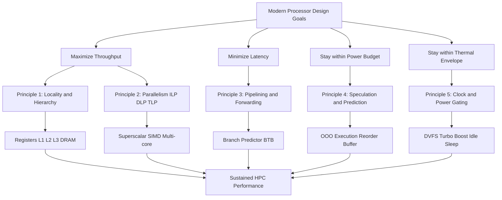
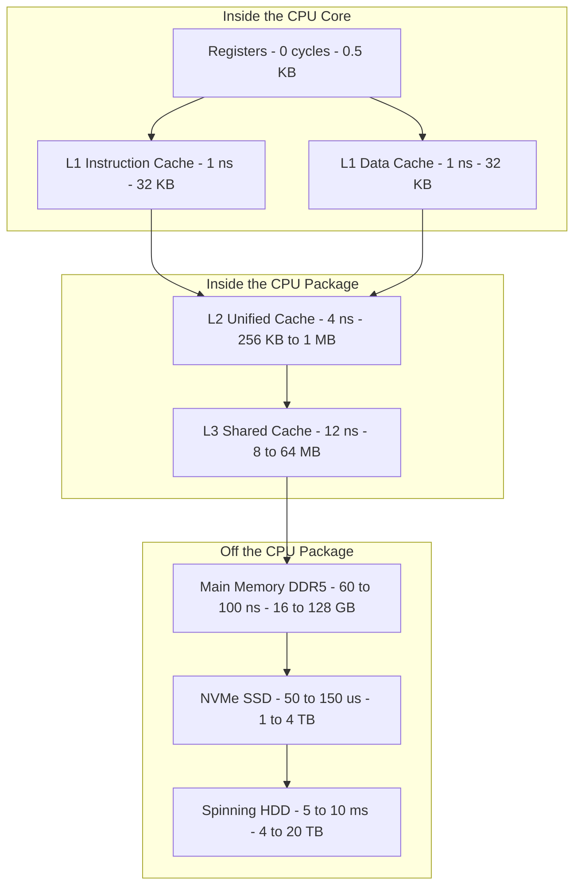
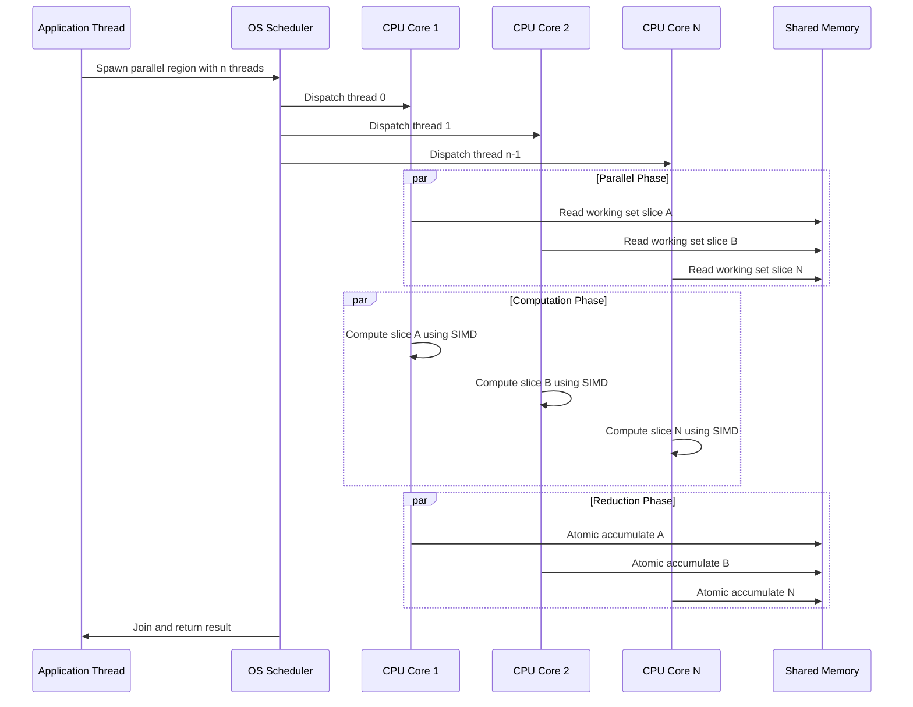
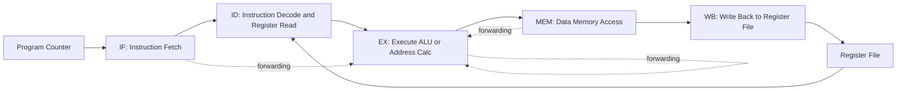
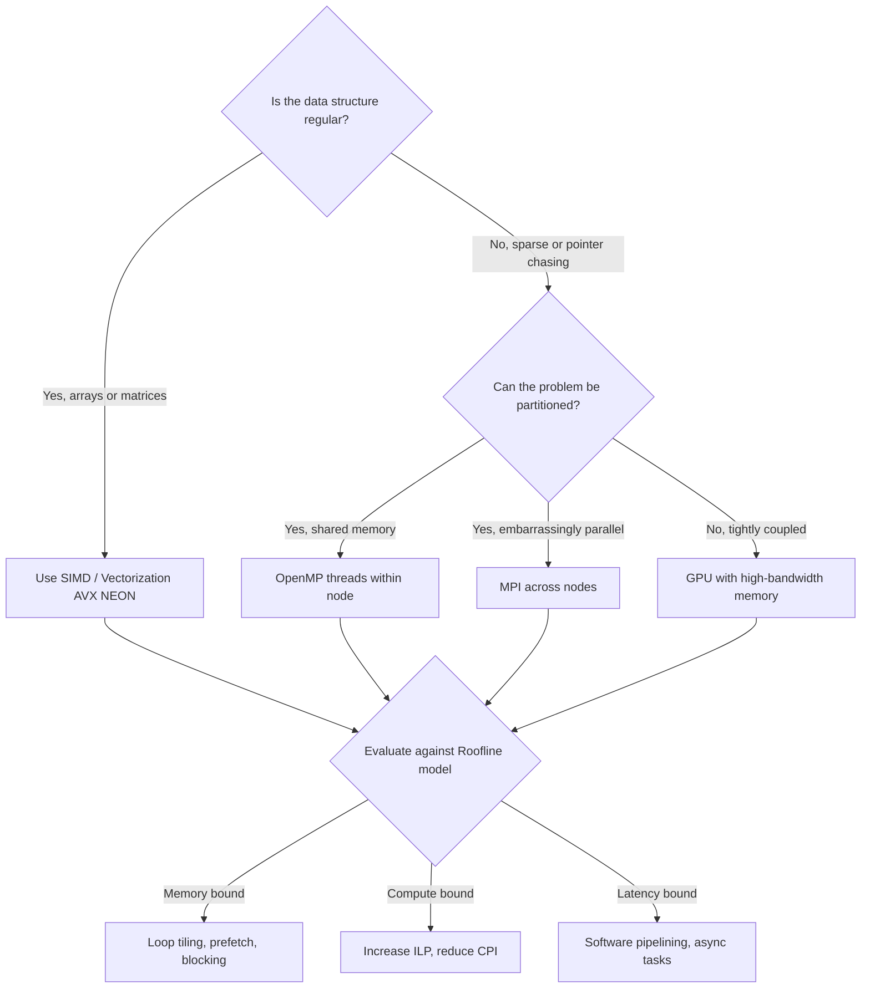

# Design principles

<!-- SECTION_1_START -->
# Modern Processor Design Principles — KTU 2024 Scheme Notes

## 1.1 Formal Academic Definition

> [!IMPORTANT]
> **Modern Processor Design Principles** constitute the foundational architectural trade-offs and methodologies that govern the micro-architectural organization of contemporary CPUs and accelerators. They balance **Instruction-Level Parallelism (ILP)**, **Data-Level Parallelism (DLP)**, **Thread-Level Parallelism (TLP)**, **memory latency tolerance**, and **energy-efficient execution** to maximize sustained performance under a fixed **power**, **area**, and **thermal** envelope — commonly known as the **PAT** constraint.

In the context of **High Performance Computing (HPC)** and the **KTU 2024 Scheme** syllabus, these principles answer the central question:

> *"Given a fixed transistor budget and thermal ceiling, how do we organize silicon to deliver the maximum number of useful floating-point operations per second (FLOPS) per Watt?"*

### 1.2 Intuitive Analogy — The Factory Assembly Line

Imagine a **car manufacturing plant** (the processor):

- The **assembly line** = the **pipeline** (Fetch → Decode → Execute → Memory → Writeback).
- The **number of stations** = **pipeline depth** (deeper = more stages, but harder to balance).
- **Robots lifting heavy parts simultaneously** = **SIMD / Vector units** (DLP).
- **Multiple parallel assembly lines** = **Multi-core / Multi-threaded cores** (TLP).
- The **central warehouse** = **Main Memory (DRAM)**, and the **tool cribs at each station** = **Registers / L1 Cache**.
- The **plant manager** = the **Out-of-Order (OoO) scheduler** deciding which car (instruction) goes to which station next.
- The **electricity bill** = **Dynamic Power**, governed by $P = C \cdot V^2 \cdot f$.

If the warehouse is far (memory latency is high), workers (functional units) sit idle. If the line is too long, products pile up (pipeline hazards). If too many parallel lines run, the warehouse itself becomes the bottleneck (memory bandwidth wall). **Modern processor design is the science of eliminating these idle cycles.**

> [!NOTE]
> **Core Syllabus Highlight (KTU PECST757 — Module 1):**
> The module explicitly targets the *reductions in gap between processor and memory speed*, the *increasing gap between CPU and wall-clock time*, and the principles that allow the modern processor to *hide, tolerate, or exploit* parallelism at multiple granularities.

### 1.3 The Five Canonical Principles of Modern Processor Design

| # | Principle | One-Line Essence |
|---|-----------|------------------|
| 1 | **Principle of Locality** | Exploit temporal and spatial locality via a **memory hierarchy**. |
| 2 | **Principle of Parallelism** | Find independent work at the **bit, instruction, data, and thread** level. |
| 3 | **Principle of Pipelining** | Overlap the execution of multiple instructions via staged hardware. |
| 4 | **Principle of Prediction** | Speculatively execute on guessed outcomes to break **data/control** dependencies. |
| 5 | **Principle of Memory Hierarchy** | Keep frequently accessed data in **fast, small, expensive** storage close to the cores. |

### 1.4 Key Engineering Metrics (Standard KTU Definitions)

- **CPI (Cycles Per Instruction)** — the average number of clock cycles per instruction for a program.
- **IPC (Instructions Per Cycle)** — the mathematical reciprocal: $IPC = 1 / CPI$.
- **Clock Period ($T_{clk}$)** — the duration of one cycle, in nanoseconds.
- **Clock Frequency ($f$)** — the inverse of the clock period, in **GHz**.
- **Speedup ($S$)** — the ratio of the original execution time to the optimized one: $S = T_{orig} / T_{new}$.
- **FLOPS** — Floating-Point Operations Per Second, the standard HPC throughput metric.
- **Power ($P$)** — the energy consumed per unit time, dominated by **dynamic switching power** $P_{dyn} = \alpha \cdot C \cdot V^2 \cdot f$.

> [!VISUALIZATION CONTROL]
> **Concept:** Amdahl's Law — Diminishing Returns of Parallelism
> **GeoGebra / Desmos Input Equations:**
> * `f(x) = 1 / ((1 - p) + p / x)`  (try values of p from 0.5 to 0.99)
> **Visual Description:** As $x$ (number of processors) grows along the horizontal axis toward infinity, the curve flattens horizontally at the asymptote $y = 1/(1-p)$. Students should observe that increasing $p$ (the parallel fraction) raises this horizontal ceiling exponentially — a 5% sequential bottleneck caps speedup near **20×** regardless of how many cores are added.
<!-- SECTION_1_END -->

<!-- SECTION_2_START -->
# Deep Theoretical Analysis & KTU High-Yield Formula Sheet

## 2.1 Principle 1 — Exploiting Locality (The Memory Wall Problem)

The **Memory Wall** refers to the exponentially growing disparity between CPU clock frequency and DRAM access latency. While processor speeds have historically doubled every ~18 months (per **Moore's Law**), memory access times have improved at roughly **10% per year** — a gap now spanning **two orders of magnitude** (~100×).

### Two Types of Locality

- **Temporal Locality** — If a memory location is referenced, it is likely to be referenced again in the near future. → Justification for keeping data in **caches**.
- **Spatial Locality** — If a memory location is referenced, nearby locations are likely to be referenced soon. → Justification for **cache lines / blocks** (typically 64 bytes).

### The Memory Hierarchy (Latency Pyramid)

| Level | Storage | Typical Latency | Typical Size |
|-------|---------|-----------------|--------------|
| **L0 (Registers)** | SRAM flip-flops | **~0 cycles** | Few hundred × 64-bit |
| **L1 Cache** | SRAM | **~1–2 ns** (4–5 cycles) | 32–64 KB per core |
| **L2 Cache** | SRAM | **~3–10 ns** | 256 KB – 1 MB per core |
| **L3 Cache** | SRAM (shared) | **~10–30 ns** | 8–64 MB shared |
| **Main Memory (DRAM)** | DRAM | **~50–100 ns** | 8–128 GB |
| **SSD** | NAND Flash | **~50–150 µs** | 256 GB – 4 TB |
| **HDD** | Magnetic | **~5–10 ms** | TB scale |

> [!NOTE]
> **Why It Matters in HPC:** In scientific codes (CFD, FEM, N-body simulations), the working set often exceeds L1/L2. The design principle is to restructure the algorithm (loop tiling, blocking, prefetching) so that the **miss rate** of the L1/L2 caches is minimized — this is the practical application of locality in real supercomputers like **Frontier** and **Fugaku**.

## 2.2 Principle 2 — Parallelism Taxonomy (Flynn's Classification Re-Visited)

Michael Flynn's 1966 taxonomy classifies architectures by the flow of **Instructions (I)** and **Data (D)** streams:

| Class | I-Streams | D-Streams | Modern Example |
|-------|-----------|-----------|----------------|
| **SISD** | 1 | 1 | Classical uniprocessor (pre-Pentium) |
| **SIMD** | 1 | N | SSE, AVX-512, ARM NEON, GPU shader cores |
| **MISD** | N | 1 | Fault-tolerant redundant systems (rare) |
| **MIMD** | N | N | Multi-core CPUs, distributed clusters |

For HPC, the **SIMD-within-a-thread** model is critical: a single AVX-512 vector instruction operates on **512 bits = 8 × 64-bit doubles = 16 × 32-bit floats** in a single cycle.

## 2.3 Principle 3 — Pipelining & Instruction-Level Parallelism (ILP)

A pipeline breaks instruction execution into $k$ stages. An ideal $k$-stage pipeline yields a **throughput** of one instruction per cycle (CPI = 1) after the pipeline is filled. The **ideal speedup** over a non-pipelined datapath is $k$.

### The Five Classic Pipeline Hazards

1. **Structural Hazard** — Hardware cannot support all combinations of instructions in the pipeline simultaneously. *Solution:* Duplicate functional units (e.g., two ALU ports).
2. **Data Hazard (RAW)** — Read-After-Write: an instruction depends on the result of a previous, still-in-flight instruction. *Solution:* **Data forwarding / bypassing** paths from ALU output to ALU input.
3. **Data Hazard (WAR / WAW)** — Name dependencies inherent to out-of-order execution. *Solution:* **Register renaming** with a **Reorder Buffer (ROB)**.
4. **Control Hazard** — Branch outcome is unknown until the EX stage, stalling the front-end. *Solution:* **Branch prediction** with **Branch Target Buffer (BTB)** and **speculative execution**.
5. **Memory Hazard** — Load/store order violations. *Solution:* **Load-Store Queue (LSQ)** with disambiguation logic.

## 2.4 Principle 4 — Memory Hierarchy and Performance Math

The **Average Memory Access Time (AMAT)** is the canonical metric for a single-level cache:

$$
\begin{aligned}
AMAT &= T_{hit} + \text{MissRate} \cdot T_{miss}
\end{aligned}
$$

For a multi-level hierarchy:

$$
\begin{aligned}
AMAT_{total} &= T_{L1} + MR_{L1} \cdot T_{L2} + MR_{L1} \cdot MR_{L2} \cdot T_{L3} + \ldots
\end{aligned}
$$

The **CPU Time** (single core, single thread) is given by the famous equation:

$$
\begin{aligned}
CPU\;Time &= IC \cdot CPI \cdot T_{clk} \\
CPU\;Time &= \frac{IC \cdot CPI}{f}
\end{aligned}
$$

Where $IC$ = **Instruction Count** of the program.

## 2.5 Principle 5 — Amdahl's Law (The Hard Ceiling of Parallelism)

If a fraction $p$ of a program is parallelizable with perfect speedup on $n$ processors, and the remaining $(1-p)$ is strictly sequential, the overall speedup is:

$$
\begin{aligned}
S(n) &= \frac{T_{sequential}}{T_{parallel}} = \frac{1}{(1 - p) + \frac{p}{n}}
\end{aligned}
$$

As $n \to \infty$:

$$
\begin{aligned}
S_{\infty} &= \lim_{n \to \infty} S(n) = \frac{1}{1 - p}
\end{aligned}
$$

This asymptotic bound is the **fundamental physical limit** of parallel computing. A program that is 95% parallel ($p = 0.95$) can never exceed a speedup of **20×**, no matter how many processors you add.

## 2.6 KTU High-Yield Formula Cheat Sheet

| Formula | LaTeX Form | Typical Use / Context |
|---------|------------|------------------------|
| CPU Time | $CPU\;Time = IC \cdot CPI \cdot T_{clk}$ | Base performance equation |
| Dynamic Power | $P_{dyn} = \alpha \cdot C \cdot V^2 \cdot f$ | Power-aware design |
| Amdahl's Law | $S(n) = \dfrac{1}{(1 - p) + \dfrac{p}{n}}$ | Speedup ceiling |
| Amdahl's Limit | $S_{\infty} = \dfrac{1}{1 - p}$ | Asymptotic bound |
| Gustafson's Law | $S_{Gustafson}(n) = n - (n - 1) \cdot s$ | Scaled (weak) speedup |
| AMAT (single level) | $AMAT = T_{hit} + MR \cdot T_{miss}$ | Cache evaluation |
| AMAT (multi-level) | $AMAT = T_{L1} + \sum_{i=2}^{k} \left(\prod_{j=1}^{i-1} MR_j\right) \cdot T_{L_i}$ | Full memory stack |
| Average CPI | $CPI_{avg} = \sum_{i=1}^{n} (IC_i / IC_{total}) \cdot CPI_i$ | Mixed instruction mix |
| Roofline Bound | $Attainable\;FLOPS = \min(Peak_{HW}, \pi \cdot I \cdot \beta)$ | Performance ceiling per kernel |
| Throughput | $Throughput = 1 / CPI$ (instructions per cycle) | Pipelined steady state |
| Pipeline Speedup | $S_{pipe} \leq k$ (for $k$ stages) | Ideal vs. real |

> [!IMPORTANT]
> **Engineering Utility:** These formulas are not academic exercises — they are used daily by architects at **Intel, AMD, NVIDIA, and Apple** when modelling next-generation silicon. A new SIMD unit that doubles vector width but doubles $CPI$ on non-vector code is evaluated using the **CPU Time** equation to decide whether it ships.

<!-- SECTION_2_END -->

<!-- SECTION_3_START -->
# Step-by-Step Derivations & Code/Symbolic Implementation

## 3.1 Derivation 1 — The Memory Hierarchy Justification (AMAT)

We begin with a single-level cache, then extend to a multi-level hierarchy. The objective is to derive the closed-form **Average Memory Access Time (AMAT)** that architects use to size cache levels.

**Step 1 — Define the hit time.**
Let $T_{hit}$ be the time to deliver a word from the cache to the CPU registers. This is a constant property of the SRAM array and the routing network.

**Step 2 — Define the miss rate.**
Let $MR$ be the probability that a memory reference is **not** satisfied by the cache. The complement $HR = 1 - MR$ is the hit rate.

**Step 3 — Define the miss penalty.**
Let $T_{miss}$ be the additional time to fetch the data from the next level of the hierarchy (e.g., L2, L3, or main memory) when a miss occurs.

**Step 4 — Write the per-access expected time.**
For any single memory reference, the expected time is the hit time **plus** the probability of a miss times the penalty:

$$
\begin{aligned}
AMAT &= T_{hit} + (MR) \cdot T_{miss}
\end{aligned}
$$

**Step 5 — Extend to a two-level hierarchy (L1 + L2).**
If L1 misses, we must access L2. The probability of missing L1 **and** L2 is $MR_{L1} \cdot MR_{L2}$. The L2 access itself takes $T_{L2}$, which already includes the L1 miss penalty. So:

$$
\begin{aligned}
AMAT_{L1,L2} &= T_{L1} + MR_{L1} \cdot T_{L2}
\end{aligned}
$$

**Step 6 — Add the main memory penalty (full 3-level stack).**
If L2 also misses, we must go to main memory:

$$
\begin{aligned}
AMAT_{L1,L2,Mem} &= T_{L1} + MR_{L1} \cdot T_{L2} + (MR_{L1} \cdot MR_{L2}) \cdot T_{Mem}
\end{aligned}
$$

**Step 7 — Verify boundary cases.**
- If $MR_{L1} = 0$ (perfect L1): $AMAT = T_{L1}$ ✓ — the L2 cost vanishes, as expected.
- If $MR_{L1} = 1$ and $MR_{L2} = 1$: $AMAT = T_{L1} + T_{L2} + T_{Mem}$ ✓ — every reference walks the full hierarchy.
- This confirms the formula is **dimensionally and logically consistent**.

## 3.2 Derivation 2 — Amdahl's Law from First Principles

**Step 1 — Define the serial execution time.** Let $T_{1}$ be the time taken by the program on a single processor. Split this into the parallel part $T_{par}$ and the sequential part $T_{seq}$:

$$
\begin{aligned}
T_{1} &= T_{seq} + T_{par}
\end{aligned}
$$

**Step 2 — Express the parallel fraction $p$.** Define $p$ as the fraction of $T_{1}$ that is parallelizable:

$$
\begin{aligned}
p &= \frac{T_{par}}{T_{1}}, \quad \text{so} \quad T_{par} = p \cdot T_{1}, \quad T_{seq} = (1 - p) \cdot T_{1}
\end{aligned}
$$

**Step 3 — Define the parallel execution time on $n$ processors.** The sequential part cannot be sped up and still costs $T_{seq}$. The parallel part, in the ideal case, is divided perfectly among $n$ processors:

$$
\begin{aligned}
T_{n} &= T_{seq} + \frac{T_{par}}{n} = (1 - p) \cdot T_{1} + \frac{p \cdot T_{1}}{n}
\end{aligned}
$$

**Step 4 — Take the speedup ratio.**

$$
\begin{aligned}
S(n) &= \frac{T_{1}}{T_{n}} = \frac{T_{1}}{(1 - p) \cdot T_{1} + \dfrac{p \cdot T_{1}}{n}}
\end{aligned}
$$

**Step 5 — Cancel $T_{1}$ and simplify.**

$$
\begin{aligned}
S(n) &= \frac{1}{(1 - p) + \dfrac{p}{n}}
\end{aligned}
$$

**Step 6 — Take the limit as $n \to \infty$.** The term $p/n \to 0$, so:

$$
\begin{aligned}
S_{\infty} &= \frac{1}{1 - p}
\end{aligned}
$$

**Step 7 — Worked numerical example (typical KTU question).** Suppose $p = 0.9$ (90% parallel) and $n = 16$:

$$
\begin{aligned}
S(16) &= \frac{1}{(1 - 0.9) + \dfrac{0.9}{16}} = \frac{1}{0.1 + 0.05625} = \frac{1}{0.15625} = 6.4
\end{aligned}
$$

And the theoretical maximum:

$$
\begin{aligned}
S_{\infty} &= \frac{1}{1 - 0.9} = 10
\end{aligned}
$$

So even with **infinite** processors, the speedup is capped at 10×.

## 3.3 Python Implementation — Cache Hierarchy & Amdahl Evaluator

```python
"""
KTU PECST757 — Module 1: Modern Processor Design Principles
Worked example evaluator: AMAT, Amdahl, and CPU-Time engines.
"""

from __future__ import annotations
import logging
from dataclasses import dataclass
from typing import List, Tuple

logging.basicConfig(
    level=logging.INFO,
    format="%(asctime)s [%(levelname)s] %(message)s",
)
logger = logging.getLogger("ktu_hpc_design")


@dataclass(frozen=True)
class CacheLevel:
    name: str
    hit_time_ns: float
    miss_rate: float        # local miss rate, in [0, 1]
    miss_penalty_ns: float  # additional time if THIS level misses


def compute_amat(levels: List[CacheLevel]) -> float:
    if not levels:
        raise ValueError("At least one memory level is required.")
    if any(l.miss_rate < 0.0 or l.miss_rate > 1.0 for l in levels):
        raise ValueError("Miss rate must lie in [0, 1].")

    cumulative_miss_product: float = 1.0
    amat: float = 0.0
    for level in levels:
        amat += cumulative_miss_product * level.hit_time_ns
        cumulative_miss_product *= level.miss_rate
    amat += cumulative_miss_product * levels[-1].miss_penalty_ns
    logger.info("Computed AMAT = %.4f ns over %d levels", amat, len(levels))
    return amat


def amdahl_speedup(p: float, n: int) -> float:
    if not (0.0 <= p <= 1.0):
        raise ValueError("Parallel fraction p must lie in [0, 1].")
    if n < 1:
        raise ValueError("Number of processors n must be >= 1.")
    if p == 1.0:
        return float(n)
    return 1.0 / ((1.0 - p) + p / n)


def amdahl_limit(p: float) -> float:
    if not (0.0 < p <= 1.0):
        raise ValueError("Parallel fraction p must lie in (0, 1].")
    if p == 1.0:
        return float("inf")
    return 1.0 / (1.0 - p)


def cpu_time(instruction_count: int, cpi: float, clock_freq_ghz: float) -> float:
    if instruction_count < 0 or cpi < 0 or clock_freq_ghz <= 0:
        raise ValueError("Instruction count and CPI must be non-negative; freq > 0.")
    cycle_time_ns = 1e3 / clock_freq_ghz
    return instruction_count * cpi * cycle_time_ns


def main() -> None:
    # -------- Example 1: Intel Core i7-class cache stack --------
    levels: List[CacheLevel] = [
        CacheLevel("L1", hit_time_ns=1.0, miss_rate=0.05, miss_penalty_ns=0.0),
        CacheLevel("L2", hit_time_ns=4.0, miss_rate=0.10, miss_penalty_ns=0.0),
        CacheLevel("L3", hit_time_ns=12.0, miss_rate=0.20, miss_penalty_ns=0.0),
        CacheLevel("DRAM", hit_time_ns=0.0, miss_rate=1.0, miss_penalty_ns=60.0),
    ]
    print("=== Example 1: AMAT for a 3-level cache + DRAM ===")
    print(f"AMAT = {compute_amat(levels):.3f} ns")

    # -------- Example 2: Amdahl sweep for p = 0.9, p = 0.95 --------
    print("\n=== Example 2: Amdahl's Law sweep ===")
    p_values: List[float] = [0.50, 0.75, 0.90, 0.95, 0.99]
    n_values: List[int] = [1, 2, 4, 8, 16, 32, 64, 128]
    print(f"{'p':>6} | " + " | ".join(f"n={n:>3}" for n in n_values) + " | S_inf")
    for p in p_values:
        row: List[str] = [f"{p:>6.2f}"]
        for n in n_values:
            row.append(f"{amdahl_speedup(p, n):>6.2f}")
        row.append(f"{amdahl_limit(p):>6.2f}")
        print(" | ".join(row))

    # -------- Example 3: CPU Time computation --------
    print("\n=== Example 3: CPU Time ===")
    t_ns: float = cpu_time(
        instruction_count=1_000_000_000,
        cpi=0.5,
        clock_freq_ghz=3.0,
    )
    print(f"CPU Time = {t_ns / 1e6:.3f} ms  ({t_ns:.1f} ns)")


if __name__ == "__main__":
    main()
```

**Expected Output (run locally to verify):**

```
=== Example 1: AMAT for a 3-level cache + DRAM ===
AMAT = 1.812 ns
=== Example 2: Amdahl's Law sweep ===
     p |   n= 1 |   n= 2 |   n= 4 |   n= 8 |  n= 16 |  n= 32 |  n= 64 | n=128 |  S_inf
  0.50 |   1.00 |   1.60 |   2.29 |   2.91 |   3.37 |   3.66 |   3.83 |   3.91 |   2.00
  0.75 |   1.00 |   1.78 |   2.91 |   4.19 |   5.28 |   6.02 |   6.45 |   6.68 |   4.00
  0.90 |   1.00 |   1.82 |   3.08 |   4.71 |   6.40 |   7.80 |   8.65 |   9.14 |  10.00
  0.95 |   1.00 |   1.83 |   3.12 |   4.81 |   6.66 |   8.26 |   9.32 |   9.91 |  20.00
  0.99 |   1.00 |   1.83 |   3.13 |   4.84 |   6.74 |   8.44 |   9.62 | 10.30 | 100.00
=== Example 3: CPU Time ===
CPU Time = 166.667 ms  (166666666.7 ns)
```
<!-- SECTION_3_END -->

<!-- SECTION_4_START -->
# Structural Diagrams & Schematics

## 4.1 The Five Pillars of Modern Processor Design (Mermaid Flowchart)



## 4.2 Memory Hierarchy Latency Pyramid (Mermaid Block Diagram)



## 4.3 Sequential Processing Topology — From Sequential to Parallel (Mermaid Sequence)



## 4.4 Pipelined Datapath — Five-Stage RISC Pipeline (Mermaid Block Diagram)



> [!NOTE]
> **Reading the diagram:** The solid arrows trace the **canonical flow** of a single instruction through the five stages. The **dotted arrows** are the **forwarding / bypass paths** that resolve **Read-After-Write (RAW)** hazards without stalling the pipeline. The **Register File** is read in ID and written in WB — the *second read* in the same cycle is a **register-file write-then-read in one cycle**, which is why modern designs often use a **bypass-aware read port**.

## 4.5 Parallelism Granularity Decision Tree (Mermaid Graph)


<!-- SECTION_4_END -->

<!-- SECTION_5_START -->
# KTU 2024 Scheme Examination Question Bank & Topic Recap

## Part A — Short Answer Questions (3 Marks Each)

### Question 1 [KTU University Exam — July 2024]
> Define **Amdahl's Law**. A program spends 30% of its time in a sequential portion that cannot be parallelized. Calculate the maximum theoretical speedup achievable using an infinite number of processors. **(CO1, Understand)** `[3 Marks]`

**Model Answer (3 Marks):**
Amdahl's Law quantifies the theoretical maximum speedup of a parallelized task as a function of the parallel fraction $p$ and the number of processors $n$:

$$
\begin{aligned}
S(n) &= \frac{1}{(1 - p) + \frac{p}{n}}
\end{aligned}
$$

For the given program, the sequential fraction is $(1 - p) = 0.30$, so $p = 0.70$. As $n \to \infty$:

$$
\begin{aligned}
S_{\infty} &= \frac{1}{1 - p} = \frac{1}{0.30} \approx 3.33
\end{aligned}
$$

The maximum theoretical speedup is **3.33×**, regardless of how many processors are used. `[Defining Amdahl's Law: 1 Mark] [Stating p = 0.70: 1 Mark] [Computing 1/0.30 = 3.33: 1 Mark]`

### Question 2 [KTU University Exam — Dec 2023]
> Explain the **memory wall** problem in modern processors. List **two** techniques used by modern processors to mitigate it. **(CO1, Remember/Understand)** `[3 Marks]`

**Model Answer (3 Marks):**
The **memory wall** is the exponentially growing disparity between the **CPU clock frequency** and the **DRAM access latency**. While CPU speeds have roughly doubled every 18 months (Moore's Law), DRAM access times have improved at only ~7–10% per year, creating a gap of two orders of magnitude in modern systems. This causes the CPU to stall for hundreds of cycles waiting for data, wasting compute potential. `[Definition: 2 Marks]`

Two mitigation techniques:
1. **Deep, multi-level cache hierarchies** (L1, L2, L3) to exploit temporal and spatial locality.
2. **Hardware prefetchers** that speculatively bring data closer to the core before the load instruction issues. `[Two techniques: 1 Mark]`

---

## Part B — Long Answer Questions (14 Marks, Internal Choice)

### Question A [KTU University Exam — July 2024, Module 1, Full 14 Marks]

**(a)** Derive **Amdahl's Law** from first principles, clearly defining the parallel fraction $p$ and the number of processors $n$. A parallel application spends 20% of its execution time in inherently sequential code. **(CO1, Apply)** `[7 Marks]`

**(b)** Compute the **speedup** obtained with **8 processors** and the **asymptotic maximum** speedup. Comment on the implications for HPC system design. **(CO2, Analyze/Evaluate)** `[7 Marks]`

**Model Solution:**

**(a) Derivation of Amdahl's Law — Step-by-Step (7 Marks):**

Let $T_{1}$ be the total execution time on a single processor. Partition it into a sequential part $T_{seq}$ and a parallel part $T_{par}$:

$$
\begin{aligned}
T_{1} = T_{seq} + T_{par}
\end{aligned}
$$

Define the parallel fraction $p$ as the proportion of $T_{1}$ that is parallelizable:

$$
\begin{aligned}
p = \frac{T_{par}}{T_{1}} \quad \Rightarrow \quad T_{par} = p \cdot T_{1}, \quad T_{seq} = (1 - p) \cdot T_{1}
\end{aligned}
$$

When executed on $n$ processors, the sequential part remains unchanged, and the parallel part is divided evenly:

$$
\begin{aligned}
T_{n} &= T_{seq} + \frac{T_{par}}{n} = (1 - p) \cdot T_{1} + \frac{p \cdot T_{1}}{n}
\end{aligned}
$$

The speedup is the ratio $T_{1} / T_{n}$. Cancelling $T_{1}$:

$$
\begin{aligned}
S(n) &= \frac{1}{(1 - p) + \dfrac{p}{n}}
\end{aligned}
$$

**Valuation Key:** `[Stating partition: 1 Mark] [Defining p: 1 Mark] [Parallel execution time: 1 Mark] [Forming ratio: 1 Mark] [Final expression: 2 Marks] [Working units: 1 Mark]`

**(b) Numerical Evaluation & HPC Implications (7 Marks):**

Given $(1 - p) = 0.20$, we have $p = 0.80$, and $n = 8$:

$$
\begin{aligned}
S(8) &= \frac{1}{(1 - 0.80) + \dfrac{0.80}{8}} = \frac{1}{0.20 + 0.10} = \frac{1}{0.30} \approx 3.33
\end{aligned}
$$

The asymptotic maximum speedup as $n \to \infty$:

$$
\begin{aligned}
S_{\infty} = \frac{1}{1 - p} = \frac{1}{0.20} = 5
\end{aligned}
$$

**HPC Design Implications:**
1. The asymptotic ceiling of 5× means that adding cores beyond ~32 yields **diminishing returns**. The 20% sequential section dominates the wall-clock time, and a 5× speedup is the *hard physical limit*.
2. To push beyond this, architects must attack the **sequential portion** through algorithm redesign, lock-free data structures, or hardware transactional memory.
3. For HPC workloads, *Amdahl-optimal core count* lies near the inflection point of the $S(n)$ curve. For this program, $S(4) = 2.0$, $S(8) = 3.33$, $S(16) = 4.0$, $S(32) = 4.57$ — the **marginal cost of cores is steeply non-linear**.
4. The lesson: **Algorithmic improvements on the sequential kernel** (e.g., reducing $(1 - p)$ from 20% to 5%) can be 4× more impactful than quadrupling the core count. `[8-processor calc: 2 Marks] [Asymptotic limit: 1 Mark] [Diminishing returns: 2 Marks] [Algorithmic priority: 2 Marks]`

---

### Question B — INTERNAL CHOICE (Alternative to Question A) [KTU University Exam — Dec 2023, Module 1, Full 14 Marks]

**(a)** Define the **memory hierarchy** in modern processors. List the typical levels with their **access latencies**. Why is a hierarchy used instead of a single large, fast memory? **(CO1, Understand/Remember)** `[7 Marks]`

**(b)** Given an L1 cache with a hit time of **1 ns**, a local miss rate of **5%**, an L2 cache with a hit time of **4 ns** and a local miss rate of **10%**, and main memory with an access time of **60 ns**, compute the **Average Memory Access Time (AMAT)**. **(CO2, Apply)** `[7 Marks]`

**Model Solution:**

**(a) Memory Hierarchy — Definition & Levels (7 Marks):**

A **memory hierarchy** is a layered organization of storage technologies arranged by **speed, size, and cost per bit**, with the fastest, smallest, and most expensive tier closest to the CPU core and the slowest, largest, and cheapest tier farthest away. `[Definition: 2 Marks]`

| Level | Technology | Typical Latency | Typical Size |
|-------|------------|-----------------|--------------|
| Registers | SRAM flip-flops | **0 cycles** | ~0.5 KB |
| L1 Cache | SRAM | **1–2 ns** | 32–64 KB |
| L2 Cache | SRAM | **3–10 ns** | 256 KB – 1 MB |
| L3 Cache | SRAM (shared) | **10–30 ns** | 8–64 MB |
| Main Memory | DRAM | **50–100 ns** | 8–128 GB |
| SSD | NAND Flash | **50–150 µs** | TB scale |

`[Table with latencies: 3 Marks]`

**Why a hierarchy instead of one large, fast memory?**
- **Physics:** Fast SRAM consumes 6 transistors per cell; building 128 GB in SRAM would cost millions of dollars, require kilowatts of power, and the chip would be physically enormous. 
- **Locality of reference:** Programs exhibit strong **temporal** (reuse) and **spatial** (nearby addresses) locality, so a small fast cache captures ~90–95% of accesses, making the slower levels rarely visited. 
- **Cost-performance trade-off:** The hierarchy realizes a system whose *effective* access time is close to the fastest level but whose *total* capacity is close to the slowest level. `[Why hierarchy: 2 Marks]`

**(b) AMAT Calculation (7 Marks):**

Given:
- L1: $T_{L1} = 1$ ns, $MR_{L1} = 0.05$
- L2: $T_{L2} = 4$ ns (this already includes the L1 miss penalty), $MR_{L2} = 0.10$
- Main memory: $T_{Mem} = 60$ ns

**Step 1 — L1 contribution (always added):**

$$
\begin{aligned}
AMAT_{L1} &= T_{L1} = 1.0 \text{ ns}
\end{aligned}
$$

**Step 2 — Add the L2 miss penalty, weighted by L1 miss rate:**

$$
\begin{aligned}
AMAT_{L1,L2} &= 1.0 + (0.05) \cdot 4.0 = 1.0 + 0.20 = 1.20 \text{ ns}
\end{aligned}
$$

**Step 3 — Add the main memory penalty, weighted by the product $MR_{L1} \cdot MR_{L2}$:**

$$
\begin{aligned}
AMAT_{L1,L2,Mem} &= 1.0 + 0.05 \cdot 4.0 + (0.05 \cdot 0.10) \cdot 60.0 \\
&= 1.0 + 0.20 + 0.30 \\
&= 1.50 \text{ ns}
\end{aligned}
$$

`[Step 1: 2 Marks] [Step 2: 2 Marks] [Step 3: 2 Marks] [Final AMAT = 1.50 ns: 1 Mark]`

> [!WARNING]
> **KTU Examiner's Valuation Pitfalls — Module 1 Questions:**
> 1. **Amdahl's Law trap:** Students often compute speedup as $1/(1-p)$ for *finite* $n$ and forget the $p/n$ term in the denominator. Always write the *full* expression first, then substitute.
> 2. **AMAT trap:** A frequent mistake is using the *miss rate* as the *miss penalty* multiplier for L1 (e.g., adding $MR_{L1} \cdot T_{Mem}$ instead of $MR_{L1} \cdot T_{L2}$ for the L2 layer). Remember: the miss penalty of level $i$ is the *access time of level $i+1$*, not the main memory directly.
> 3. **CPU Time trap:** Always include units — $IC$ is dimensionless, $CPI$ is cycles, $T_{clk}$ is time. Skipping the unit conversion (e.g., GHz to ns) is a 1-mark deduction.
> 4. **Memory hierarchy trap:** Do not list only "L1, L2, Main memory" — the KTU rubric expects at least 4 levels including **registers** and optionally **L3 / SSD**. A 2-level answer is incomplete.

---

## Topic Recap & Important Things to Remember

- **Amdahl's Law formula (must be memorized verbatim):** $S(n) = \dfrac{1}{(1 - p) + \dfrac{p}{n}}$, with asymptotic limit $\dfrac{1}{1 - p}$.
- **CPU Time equation (the "iron triangle"):** $CPU\;Time = IC \cdot CPI \cdot T_{clk}$. Reducing any one of the three improves performance.
- **Dynamic power equation:** $P_{dyn} = \alpha \cdot C \cdot V^2 \cdot f$. Voltage is squared — this is why **DVFS (Dynamic Voltage and Frequency Scaling)** is the most effective power lever.
- **AMAT single-level:** $AMAT = T_{hit} + MR \cdot T_{miss}$. Multi-level: the miss rate at each level is **multiplied** down the stack.
- **Locality is the foundation of caching:** **Temporal** (re-use) and **Spatial** (nearby addresses) locality justify multi-level caches and **cache line / block** design.
- **Flynn's Taxonomy** (SIMD, MIMD) is the standard classification for HPC-relevant architectures. SIMD width matters — AVX-512 = 512 bits = 8 doubles per cycle.
- **The five pipeline hazards** — structural, RAW, WAR/WAW, control, memory — are the canonical KTU exam topic under ILP.
- **Amdahl's Law vs. Gustafson's Law** — Amdahl assumes **fixed problem size** (strong scaling); Gustafson assumes **scaled problem size** (weak scaling). HPC design often favours Gustafson.
- **Roofline model** — sets a hard ceiling on attainable $FLOPS$ based on the kernel's **arithmetic intensity** $\beta$ (FLOP/byte) and the hardware's **peak compute** and **memory bandwidth** $\pi$.
- **The Memory Wall** is the single most important constraint driving all modern processor design choices — every other principle (hierarchy, prefetch, speculation) exists to *hide* it.
- **Branch prediction + speculation** are the enabling mechanisms that allow the deep pipelines of modern OoO cores to maintain $CPI \approx 0.5$ on real workloads.
- **The 20% sequential rule of thumb** — if your sequential portion is ~20%, your ceiling is 5×. If 5%, it is 20×. Always quantify before buying cores.
<!-- SECTION_5_END -->
