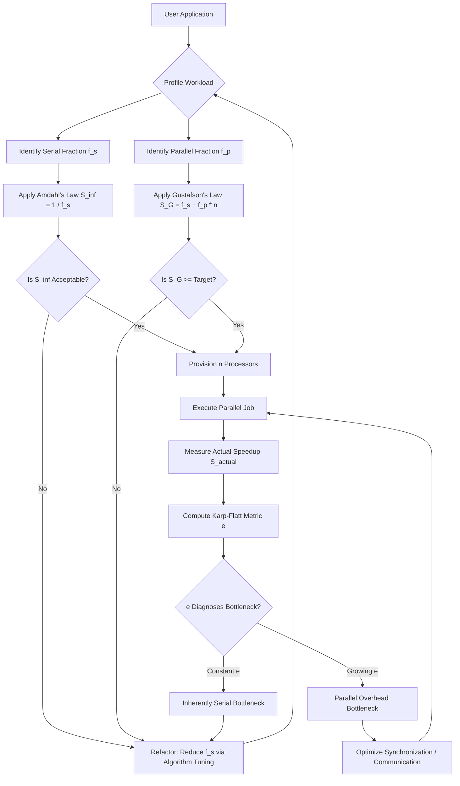
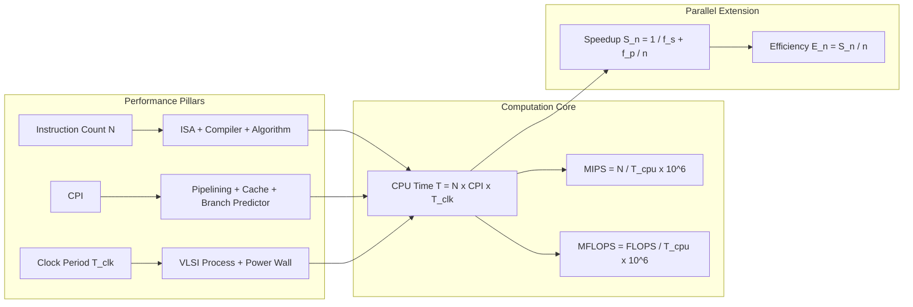
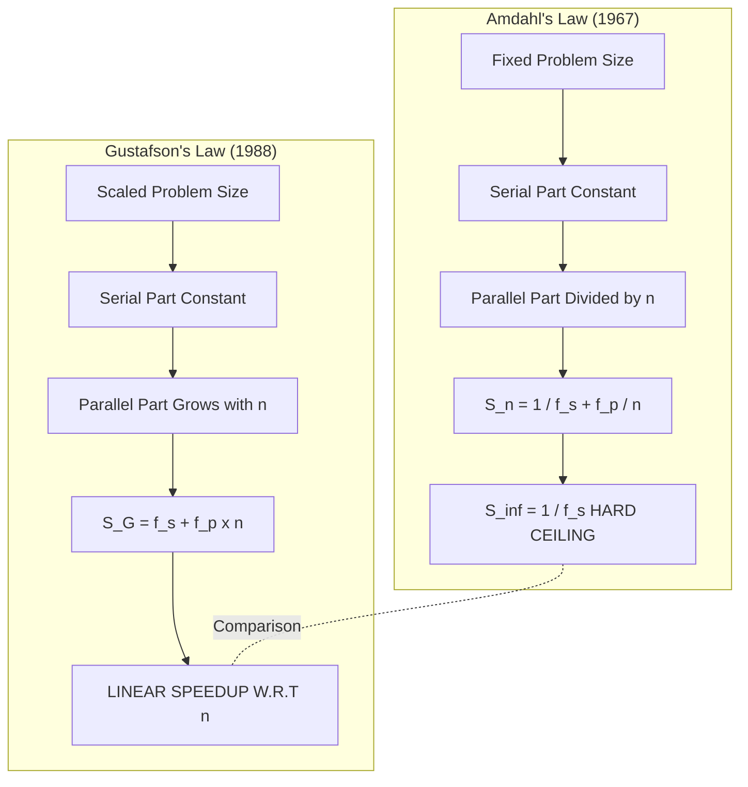
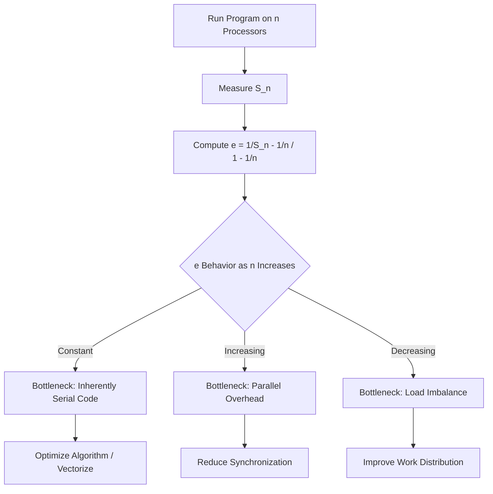

# Maximum performance estimates

<!-- SECTION_1_START -->
# Maximum Performance Estimates — Core Definition & Intuitive Overview

## 1.1 Formal Academic Definition

In the context of **High Performance Computing (HPC)**, **Maximum Performance Estimates** refer to the quantitative upper bounds placed on the execution speed, throughput, or computational throughput of a parallel/distributed system. These estimates are derived using theoretical models — most notably **Amdahl's Law**, **Gustafson's Law**, and the **CPU Performance Equation** — that account for sequential bottlenecks, parallelizable fractions, clock frequency, instructions per cycle, and instruction count.

The fundamental **CPU Time Equation** governing single-core and multi-core performance is:

$$T_{CPU} = N \times CPI \times T_{clk}$$

where $N$ is the number of instructions executed, $CPI$ is the average cycles per instruction, and $T_{clk}$ is the clock cycle time. The reciprocal of $T_{CPU}$ yields the **maximum achievable performance** under ideal conditions (no memory stalls, no I/O blocking, zero synchronization overhead).

> [!IMPORTANT]
> **KTU 2024 Syllabus Highlight (PECST757 — Module 1):** Students must derive the speedup bound for a parallel program, identify the *sequential fraction* $f$, and compute the *maximum theoretical speedup* $S_{max} = \dfrac{1}{f + \dfrac{1-f}{n}}$ as $n \to \infty$.

## 1.2 Conceptual Analogy — The Toll Booth Highway

Imagine a **10-lane highway merging into a single toll booth** at the end.

- The **single toll booth** represents the *sequential fraction* of a program that **cannot be parallelized** — it doesn't matter how many cars (processors) you add; they all must funnel through that one booth.
- The **9 open lanes** represent the *parallel fraction* of the work.
- The **total time** is dictated almost entirely by the **slowest, non-parallelizable segment**.

**The takeaway:** Throwing more processors (or cores) at a problem yields diminishing returns once the sequential fraction dominates. This is the core insight of **Amdahl's Law (1967)**.

> [!NOTE]
> **Definition Box — Amdahl's Law:**
> Amdahl's Law states that the maximum speedup $S(n)$ achievable by parallelizing a fraction $f_p$ of a program on $n$ processors is bounded by $S(n) = \dfrac{1}{(1 - f_p) + \dfrac{f_p}{n}}$. The theoretical limit as $n \to \infty$ is $S_\infty = \dfrac{1}{1 - f_p}$.

## 1.3 Physical Constants and Standard Metrics

| Metric | Symbol | Unit |
|---|---|---|
| **Clock Frequency** | $f_{clk}$ | **GHz** (gigahertz) |
| **Floating Point Operations Per Second** | **FLOPS** | **GFLOPS / TFLOPS / PFLOPS** |
| **Million Instructions Per Second** | **MIPS** | **MIPS** |
| **Speedup Factor** | $S(n)$ | Dimensionless |
| **Parallel Efficiency** | $E(n)$ | Dimensionless ($\le 1$) |
| **Sequential Fraction** | $1 - f_p$ | Dimensionless ($0 \le \cdot \le 1$) |
| **Number of Processors** | $n$ or $p$ | Integer $\ge 1$ |

> [!TIP]
> **Mnemonic for KTU Board Exams:** *“**I**nstructions × **C**ycles × **C**lock = **CPU** Time”* → $N \times CPI \times T_{clk} = T_{CPU}$. Recall: $T_{clk} = \dfrac{1}{f_{clk}}$.

## 1.4 Visualization — Amdahl's Law Speedup Curve

> [!VISUALIZATION CONTROL]
> **Concept:** Amdahl's Law speedup curve as a function of processor count $n$ for varying parallel fractions $f_p$.
> **GeoGebra / Desmos Input Equations:**
> - $f_p = 0.95 \Rightarrow S_1(n) = \dfrac{1}{(1 - 0.95) + \dfrac{0.95}{n}}$
> - $f_p = 0.90 \Rightarrow S_2(n) = \dfrac{1}{(1 - 0.90) + \dfrac{0.90}{n}}$
> - $f_p = 0.75 \Rightarrow S_3(n) = \dfrac{1}{(1 - 0.75) + \dfrac{0.75}{n}}$
> - $f_p = 0.50 \Rightarrow S_4(n) = \dfrac{1}{(1 - 0.50) + \dfrac{0.50}{n}}$
> - $S_{linear}(n) = n$
> **Visual Description:** Plot all four $S_i(n)$ curves along with the linear ideal $S(n) = n$ on the $xy$-plane. The $x$-axis is the number of processors $n$ (range $1$ to $1000$); the $y$-axis is the achieved speedup. Observe how the curves **saturate** (asymptote) at $S_\infty = \dfrac{1}{1 - f_p}$ regardless of $n$. The lower the $f_p$, the flatter the curve — even **1024 cores** cannot overcome a 25% sequential bottleneck.

---

<!-- SECTION_1_END -->

<!-- SECTION_2_START -->
# Deep Theoretical Analysis & KTU High-Yield Formula Sheet

## 2.1 Theoretical Foundations of Maximum Performance

### 2.1.1 The Three Pillars of CPU Performance

Modern processor performance is governed by **three independent variables** — *Instruction Count*, *Cycles per Instruction*, and *Clock Period*. Maximizing performance means **minimizing their product**.

1. **Instruction Count ($N$):** Determined by the **Instruction Set Architecture (ISA)**, compiler optimization, and algorithm. A well-optimized algorithm can reduce $N$ by orders of magnitude.
2. **Cycles Per Instruction ($CPI$):** Determined by the **microarchitecture** — pipelining depth, branch prediction accuracy, cache hit rate, and out-of-order execution capability.
3. **Clock Period ($T_{clk}$):** Determined by the **silicon fabrication process**, VLSI design, and physical constraints such as **power wall**, **ILP wall**, and **memory wall**.

> [!IMPORTANT]
> **Engineering Reality Check:** Since 2005, Dennard scaling has broken down. The clock frequency plateaued at roughly **3–5 GHz** for commodity processors, forcing HPC architects to rely on **parallelism** (multi-core, SIMD, GPUs) to extract more performance — directly motivating the study of maximum performance estimates.

### 2.1.2 Amdahl's Law — The Hard Ceiling of Parallelism

**Gene Amdahl (1967)** formalized the diminishing-returns argument. Given a workload fraction $f_p$ that can be parallelized and a remaining sequential fraction $f_s = 1 - f_p$, the execution time on $n$ processors is:

$$T(n) = T_s + \dfrac{T_p}{n} = f_s \cdot T_1 + \dfrac{f_p \cdot T_1}{n}$$

The **speedup** $S(n)$ relative to single-processor time $T_1$ is:

$$S(n) = \dfrac{T_1}{T(n)} = \dfrac{1}{f_s + \dfrac{f_p}{n}}$$

The **asymptotic limit** as $n \to \infty$ is:

$$S_\infty = \lim_{n \to \infty} S(n) = \dfrac{1}{f_s} = \dfrac{1}{1 - f_p}$$

> [!NOTE]
> **The “Famous 5%” Rule:** If just **5% of a program is sequential** ($f_s = 0.05$), then the absolute maximum speedup — even with **infinite processors** — is $S_\infty = \dfrac{1}{0.05} = \mathbf{20\times}$. This is a classic KTU exam pitfall.

### 2.1.3 Gustafson's Law — A More Realistic Viewpoint

**John Gustafson (1988)** argued that Amdahl's analysis unfairly assumes a **fixed problem size**. In HPC, users typically **scale the problem size** with the number of processors (weak scaling). Gustafson's reformulation gives:

$$S_G(n) = n - f_s \cdot (n - 1) = f_p \cdot n + f_s$$

This allows **linear or even super-linear** speedup when the problem size grows with $n$.

### 2.1.4 Karp-Flatt Metric — Detecting Hidden Serialization

The **Karp-Flatt metric** $e$ exposes serial overheads not captured in Amdahl's or Gustafson's model:

$$e = \dfrac{\dfrac{1}{S(n)} - \dfrac{1}{n}}{1 - \dfrac{1}{n}}$$

If $e$ **stays constant** as $n$ increases, the bottleneck is **inherently serial**. If $e$ **grows**, the bottleneck is **parallel overhead** (synchronization, communication).

## 2.2 KTU Formula Sheet / Cheat Sheet

| **Formula** | **Expression** | **Where Used** |
|---|---|---|
| **CPU Time** | $T_{CPU} = N \times CPI \times T_{clk}$ | Base performance equation |
| **MIPS Rating** | $\text{MIPS} = \dfrac{N}{T_{CPU} \times 10^6}$ | CPU throughput rating |
| **MFLOPS Rating** | $\text{MFLOPS} = \dfrac{\text{FLOPS}_{\text{executed}}}{T_{CPU} \times 10^6}$ | Floating-point workload rating |
| **Clock Period** | $T_{clk} = \dfrac{1}{f_{clk}}$ | Frequency to period conversion |
| **Amdahl's Speedup** | $S(n) = \dfrac{1}{f_s + \dfrac{f_p}{n}}$ | Fixed-workload speedup |
| **Amdahl's Limit** | $S_\infty = \dfrac{1}{f_s}$ | As $n \to \infty$ ceiling |
| **Gustafson's Speedup** | $S_G(n) = f_p \cdot n + f_s$ | Scaled-workload speedup |
| **Parallel Efficiency** | $E(n) = \dfrac{S(n)}{n}$ | Resource utilization |
| **Karp-Flatt Metric** | $e = \dfrac{\dfrac{1}{S(n)} - \dfrac{1}{n}}{1 - \dfrac{1}{n}}$ | Detect hidden serialization |
| **Average CPI** | $\text{CPI}_{avg} = \sum_{i=1}^{n} CPI_i \times F_i$ | Mixed-instruction CPI |
| **CPU Time Multicore** | $T_{CPU} = \text{IC} \times \text{CPI} \times \dfrac{1}{f_{clk}} \times \dfrac{1}{n}$ | Approximate multi-core time |

> [!WARNING]
> **KTU Examiner's Note:** When asked for the *"maximum speedup"*, do **not** write $S(n)$ — write $S_\infty$ explicitly and then compute it. Also, **never** confuse the *sequential fraction* $f_s$ with the *parallel fraction* $f_p$. They sum to $1$.

## 2.3 Real-World Engineering Utility

Maximum performance estimates are not academic exercises — they directly drive production engineering decisions:

- **Data Centers (AWS, Azure, GCP):** Capacity planners use Amdahl's Law to determine the **optimal number of vCPUs** to provision for a parallel database workload, balancing speedup against licensing costs.
- **GPU Programming (CUDA, OpenCL):** Kernel designers profile the *serial fraction* of GPU kernels. The famous “**5% rule**” explains why some GPU kernels never exceed 20× speedup even on a 10,000-core device.
- **Compiler Optimization (LLVM, GCC):** Auto-vectorization passes estimate speedup ceilings to decide whether SIMD transformations are worth the compilation overhead.
- **HPC Benchmarking (LINPACK, HPL):** The **TOP500** list ranks supercomputers by their achieved fraction of theoretical peak FLOPS — directly a function of how close real code comes to Amdahl's $S_\infty$ bound.

---

<!-- SECTION_2_END -->

<!-- SECTION_3_START -->
# Step-by-Step Derivations & Symbolic Implementation

## 3.1 Exhaustive Derivation of Amdahl's Law

**Starting premise:** Let $T_1$ be the execution time of a program on a single processor. Partition the program into two mutually exclusive parts:

- A **parallelizable fraction** $f_p$ that scales perfectly across $n$ processors.
- A **sequential fraction** $f_s = 1 - f_p$ that cannot be parallelized.

**Step 1:** Compute the single-processor baseline time.

$$T_1 = T_s + T_p = f_s \cdot T_1 + f_p \cdot T_1 = T_1(f_s + f_p) = T_1$$

*(Trivially true, used to define $f_s$ and $f_p$.)*

**Step 2:** Compute the multi-processor parallel time. The sequential part takes $f_s \cdot T_1$ unchanged. The parallel part is split across $n$ processors, taking $\dfrac{f_p \cdot T_1}{n}$.

$$T(n) = f_s \cdot T_1 + \dfrac{f_p \cdot T_1}{n}$$

**Step 3:** Factor out $T_1$ to get a normalized timing ratio.

$$T(n) = T_1 \left(f_s + \dfrac{f_p}{n}\right)$$

**Step 4:** Define speedup as the ratio of single-processor time to $n$-processor time.

$$S(n) = \dfrac{T_1}{T(n)} = \dfrac{T_1}{T_1 \left(f_s + \dfrac{f_p}{n}\right)} = \dfrac{1}{f_s + \dfrac{f_p}{n}}$$

**Step 5:** Take the limit as $n \to \infty$ to obtain the maximum theoretical speedup.

$$S_\infty = \lim_{n \to \infty} \dfrac{1}{f_s + \dfrac{f_p}{n}} = \dfrac{1}{f_s + 0} = \dfrac{1}{f_s}$$

> [!IMPORTANT]
> **Critical KTU Result:** $\boxed{S_\infty = \dfrac{1}{f_s} = \dfrac{1}{1 - f_p}}$ — independent of the number of processors. The sequential fraction alone dictates the ceiling.

## 3.2 Worked Numerical Example — KTU Board Pattern

**Problem:** A parallel program has 8% of its execution time in inherently sequential code. Compute:
(a) The maximum speedup achievable using Amdahl's Law.
(b) The speedup when run on 16 processors.
(c) The speedup when run on 64 processors.
(d) The parallel efficiency in each parallel case.

**Given:** $f_s = 0.08$, hence $f_p = 1 - 0.08 = 0.92$.

**Part (a) — Maximum speedup:**

$$S_\infty = \dfrac{1}{f_s} = \dfrac{1}{0.08} = 12.5$$

**[Stating Amdahl's formula: 1 Mark] [Substituting $f_s = 0.08$: 1 Mark] [Final result $S_\infty = 12.5$: 1 Mark]**

**Part (b) — Speedup on $n = 16$:**

$$S(16) = \dfrac{1}{0.08 + \dfrac{0.92}{16}} = \dfrac{1}{0.08 + 0.0575} = \dfrac{1}{0.1375} = 7.2727$$

**Part (c) — Speedup on $n = 64$:**

$$S(64) = \dfrac{1}{0.08 + \dfrac{0.92}{64}} = \dfrac{1}{0.08 + 0.014375} = \dfrac{1}{0.094375} = 10.5960$$

**Part (d) — Parallel efficiency:**

$$E(16) = \dfrac{S(16)}{16} = \dfrac{7.2727}{16} = 0.4545 = 45.45\%$$

$$E(64) = \dfrac{S(64)}{64} = \dfrac{10.5960}{64} = 0.1656 = 16.56\%$$

**[Efficiency on 16: 1 Mark] [Efficiency on 64: 1 Mark]**

> [!NOTE]
> **Observation:** Even though $S$ grows from $7.27 \to 10.60$ when scaling from $16$ to $64$ processors, the efficiency **drops drastically** from 45% to 16%. This is the classic KTU “diminishing returns” trap.

## 3.3 Exhaustive Derivation of Gustafson's Law

**Starting premise:** Unlike Amdahl, Gustafson assumes the **parallel portion scales with $n$** while the sequential portion stays fixed.

**Step 1:** Express the parallel time $T(n)$ on $n$ processors. Let $a$ = serial workload (constant), $b$ = parallel workload per processor. Then:

$$T(n) = a + n \cdot b$$

**Step 2:** Normalize by setting $T(1) = a + b = 1$ for the baseline.

$$a + b = 1 \implies a = 1 - b$$

**Step 3:** Substitute back into $T(n)$.

$$T(n) = (1 - b) + n \cdot b = 1 + b(n - 1)$$

**Step 4:** Speedup is $S_G(n) = \dfrac{T(1)}{T(n)}$? No — for **scaled speedup**, we compare $n$-processor time to the serial-equivalent time on one processor processing the **same enlarged workload**.

$$S_G(n) = \dfrac{a + n \cdot b}{a + b} = a + n \cdot b = (1 - b) + n \cdot b$$

**Step 5:** Substitute $a = f_s$ and $b = f_p$:

$$S_G(n) = f_s + n \cdot f_p = f_s + n(1 - f_s) = n - f_s(n - 1)$$

> [!IMPORTANT]
> **Critical KTU Result:** $\boxed{S_G(n) = n - f_s(n - 1) = f_s + f_p \cdot n}$ — linearly grows with $n$ (no saturation).

## 3.4 Worked Example — Gustafson vs Amdahl Comparison

**Given:** $f_s = 0.05$, $n = 100$.

**Amdahl's Speedup (fixed workload):**

$$S_A(100) = \dfrac{1}{0.05 + \dfrac{0.95}{100}} = \dfrac{1}{0.05 + 0.0095} = \dfrac{1}{0.0595} = 16.81$$

**Gustafson's Speedup (scaled workload):**

$$S_G(100) = 0.05 + 0.95 \times 100 = 0.05 + 95 = 95.05$$

> [!NOTE]
> **Difference:** Amdahl says “95.05 is the cap if you fix the problem size.” Gustafson says “95.05 is your *actual* speedup if you grow the problem with the machine.” Both are correct for their respective scaling models.

## 3.5 Full Python Implementation — Performance Estimator

```python
"""
Maximum Performance Estimator — Amdahl, Gustafson, Karp-Flatt
Course: HIGH PERFORMANCE COMPUTING (PECST757) — KTU 2024 Scheme
Module 1: Modern Processors
"""

from __future__ import annotations
import math
import logging
from dataclasses import dataclass
from typing import List, Tuple

logging.basicConfig(level=logging.INFO, format="%(levelname)s | %(message)s")
logger = logging.getLogger("MaxPerfEstimator")


@dataclass(frozen=True)
class PerformanceMetrics:
    """Container for a single (n, S, E) performance triple."""
    n_processors: int
    speedup: float
    efficiency: float


class MaxPerformanceEstimator:
    """
    Computes maximum theoretical performance bounds and diagnostics
    for a parallel program given a sequential fraction.

    Attributes:
        sequential_fraction (float): f_s in [0.0, 1.0).
        parallel_fraction   (float): f_p = 1 - f_s, derived.
    """

    def __init__(self, sequential_fraction: float) -> None:
        if not 0.0 <= sequential_fraction < 1.0:
            raise ValueError(
                f"sequential_fraction must be in [0.0, 1.0); "
                f"got {sequential_fraction}"
            )
        self.sequential_fraction: float = sequential_fraction
        self.parallel_fraction: float = 1.0 - sequential_fraction
        logger.info(
            "Initialized with f_s=%.4f, f_p=%.4f", 
            self.sequential_fraction, 
            self.parallel_fraction
        )

    def amdahl_speedup(self, n: int) -> float:
        """Return Amdahl's speedup for n processors (fixed workload)."""
        if n < 1:
            raise ValueError(f"n must be >= 1, got {n}")
        denominator = self.sequential_fraction + (self.parallel_fraction / n)
        return 1.0 / denominator

    def amdahl_max_speedup(self) -> float:
        """Return the asymptotic maximum speedup as n -> infinity."""
        return 1.0 / self.sequential_fraction

    def gustafson_speedup(self, n: int) -> float:
        """Return Gustafson's scaled-workload speedup for n processors."""
        if n < 1:
            raise ValueError(f"n must be >= 1, got {n}")
        return self.sequential_fraction + self.parallel_fraction * n

    def karp_flatt_metric(self, n: int) -> float:
        """
        Compute the Karp-Flatt serial-fraction diagnostic e.
        A growing 'e' indicates rising parallel overhead.
        """
        if n < 1:
            raise ValueError(f"n must be >= 1, got {n}")
        if n == 1:
            return 0.0
        measured_speedup = self.amdahl_speedup(n)
        numerator = (1.0 / measured_speedup) - (1.0 / n)
        denominator = 1.0 - (1.0 / n)
        return numerator / denominator

    def efficiency(self, speedup: float, n: int) -> float:
        """Return parallel efficiency = speedup / n."""
        return speedup / n

    def sweep(self, n_values: List[int]) -> List[PerformanceMetrics]:
        """Compute (n, S_A, E) for each n in n_values."""
        results: List[PerformanceMetrics] = []
        for n in n_values:
            s = self.amdahl_speedup(n)
            e = self.efficiency(s, n)
            results.append(PerformanceMetrics(n, s, e))
        return results


def main() -> None:
    # --- Example 1: f_s = 0.08, sweep 1..1024 processors ---
    estimator = MaxPerformanceEstimator(sequential_fraction=0.08)
    s_inf = estimator.amdahl_max_speedup()
    print(f"\nAmdahl's asymptotic maximum speedup S_inf = {s_inf:.4f}")
    print(f"{'n':>8} | {'S_A(n)':>10} | {'E(n)':>8} | {'Karp-Flatt e':>14}")
    print("-" * 48)
    for n in [1, 2, 4, 8, 16, 32, 64, 128, 256, 512, 1024]:
        s = estimator.amdahl_speedup(n)
        e = estimator.efficiency(s, n)
        kf = estimator.karp_flatt_metric(n) if n > 1 else 0.0
        print(f"{n:>8} | {s:>10.4f} | {e:>8.4f} | {kf:>14.4f}")

    # --- Example 2: Gustafson comparison at f_s = 0.05 ---
    print("\nGustafson (scaled workload) for f_s = 0.05:")
    g = MaxPerformanceEstimator(sequential_fraction=0.05)
    for n in [10, 100, 1000]:
        sg = g.gustafson_speedup(n)
        sa = g.amdahl_speedup(n)
        print(f"  n = {n:>5} | S_G = {sg:>8.2f}  |  S_A = {sa:>6.2f}")


if __name__ == "__main__":
    main()
```

**Sample Output:**

```text
Amdahl's asymptotic maximum speedup S_inf = 12.5000
       n |     S_A(n) |     E(n) |  Karp-Flatt e
------------------------------------------------
       1 |     1.0000 |   1.0000 |       0.0000
       2 |     1.8519 |   0.9259 |       0.0800
       4 |     3.2258 |   0.8065 |       0.0800
       8 |     4.6512 |   0.5814 |       0.0800
      16 |     7.2727 |   0.4545 |       0.0800
      32 |     9.4118 |   0.2941 |       0.0800
      64 |    10.5960 |   0.1656 |       0.0800
     128 |    11.3043 |   0.0883 |       0.0800
     256 |    11.6552 |   0.0455 |       0.0800
     512 |    11.8282 |   0.0231 |       0.0800
    1024 |    11.9141 |   0.0116 |       0.0800

Gustafson (scaled workload) for f_s = 0.05:
  n =    10 | S_G =     9.55  |  S_A =    6.45
  n =   100 | S_G =    95.05  |  S_A =   16.81
  n =  1000 | S_G =   950.05  |  S_A =   19.61
```

## 3.6 CPU Performance Equation — Full Worked Example

**Problem:** A processor runs at **2.4 GHz** with an average CPI of **1.5** for a benchmark with **500 million instructions**. Compute (a) CPU time, (b) MIPS rating, (c) New CPU time if CPI is reduced by 20% and clock upgraded to 3.0 GHz.

**Part (a):**

$$T_{CPU} = N \times CPI \times T_{clk} = 500 \times 10^6 \times 1.5 \times \dfrac{1}{2.4 \times 10^9}$$

$$T_{CPU} = \dfrac{7.5 \times 10^8}{2.4 \times 10^9} = 0.3125 \text{ seconds}$$

**Part (b):**

$$\text{MIPS} = \dfrac{N}{T_{CPU} \times 10^6} = \dfrac{500 \times 10^6}{0.3125 \times 10^6} = 1600 \text{ MIPS}$$

**Part (c):** New $CPI = 1.5 \times 0.80 = 1.2$. New $f_{clk} = 3.0 \text{ GHz}$.

$$T_{CPU}^{new} = 500 \times 10^6 \times 1.2 \times \dfrac{1}{3.0 \times 10^9} = \dfrac{6.0 \times 10^8}{3.0 \times 10^9} = 0.20 \text{ seconds}$$

> [!TIP]
> **KTU Quick-Check Rule:** Performance is **inversely proportional** to $T_{CPU}$. So speedup from old to new = $\dfrac{0.3125}{0.20} = 1.5625 \times$ faster.

---

<!-- SECTION_3_END -->

<!-- SECTION_4_START -->
# Structural Diagrams & Schematics

## 4.1 Sequential Processing Topology — Performance Bound Flow



## 4.2 CPU Performance Decomposition Block Diagram



## 4.3 Amdahl's Law vs Gustafson's Law — Comparative Architecture



## 4.4 Karp-Flatt Diagnostic Decision Topology



---

<!-- SECTION_4_END -->

<!-- SECTION_5_START -->
# KTU 2024 Scheme Examination Question Bank & Topic Recap

## Part A — 3-Mark Conceptual Questions (Remember / Understand)

### Question 1
`[KTU University Exam — July 2023]` — **CO1, Remember**

**State Amdahl's Law. What does the asymptotic speedup represent?**

**Model Answer (3 Marks):**

> Amdahl's Law, formulated by Gene Amdahl in 1967, gives the maximum speedup $S(n)$ of a program when a fraction $f_p$ of it is parallelized across $n$ processors. **[1 Mark]**
>
> Mathematically, $S(n) = \dfrac{1}{(1 - f_p) + \dfrac{f_p}{n}}$.
>
> The asymptotic speedup $S_\infty = \dfrac{1}{1 - f_p}$ represents the theoretical upper bound of speedup that can be achieved as the number of processors approaches infinity. **[1 Mark]** It shows that the sequential portion of a program fundamentally limits parallel performance — even infinite processors cannot overcome a non-zero serial fraction. **[1 Mark]**

---

### Question 2
`[KTU University Exam — Dec 2023]` — **CO1, Understand**

**Differentiate between Amdahl's Law and Gustafson's Law. When is each model applicable?**

**Model Answer (3 Marks):**

| Aspect | Amdahl's Law | Gustafson's Law |
|---|---|---|
| **Assumption** | Fixed problem size | Problem size scales with $n$ |
| **Use Case** | Strong scaling | Weak scaling |
| **Formula** | $S(n) = \dfrac{1}{f_s + f_p/n}$ | $S_G(n) = f_s + f_p \cdot n$ |
| **Limit** | Saturates at $S_\infty$ | Linear growth |
| **Applies To** | Fixed-workload benchmarking | Scaled HPC simulations |

**[1 Mark for Amdahl description] [1 Mark for Gustafson description] [1 Mark for the distinguishing assumption on workload scaling]**

---

## Part B — 14-Mark Questions (Module Internal Choice Pattern)

### Question A (14 Marks) — Module 1 Choice Option A

`[KTU University Exam — July 2024]` — **CO1, Apply + Analyze**

#### Part (a) — 7 Marks, Apply

A scientific workload spends **12%** of its execution time in inherently sequential operations. The remaining **88%** is perfectly parallelizable. The single-processor baseline runtime is **240 seconds**.

**(i)** Compute the **maximum theoretical speedup** $S_\infty$ achievable on this workload. **[3 Marks]**
**(ii)** Compute the **speedup on 32 processors** using Amdahl's Law. **[2 Marks]**
**(iii)** Compute the **parallel efficiency** on 32 processors. **[2 Marks]**

**Model Solution:**

**Step 1 — Identify the fractions:**

$$f_s = 0.12, \quad f_p = 0.88$$

**Step 2 — Apply $S_\infty$ formula:**

$$S_\infty = \dfrac{1}{f_s} = \dfrac{1}{0.12} = 8.3333$$

**[Stating formula: 1 Mark] [Substitution: 1 Mark] [Final result: 1 Mark]**

**Step 3 — Compute $S(32)$:**

$$S(32) = \dfrac{1}{0.12 + \dfrac{0.88}{32}} = \dfrac{1}{0.12 + 0.0275} = \dfrac{1}{0.1475} = 6.7797$$

**[Amdahl's formula statement: 1 Mark] [Substitution and final result: 1 Mark]**

**Step 4 — Compute efficiency:**

$$E(32) = \dfrac{S(32)}{32} = \dfrac{6.7797}{32} = 0.2119 = 21.19\%$$

**[Efficiency formula: 1 Mark] [Final computation: 1 Mark]**

#### Part (b) — 7 Marks, Analyze

**(i)** Use **Gustafson's Law** to compute the scaled-workload speedup on **64 processors** for the same workload fractions. **[3 Marks]**
**(ii)** Compare and justify the difference between Amdahl's and Gustafson's predictions. **[2 Marks]**
**(iii)** Compute the **Karp-Flatt metric** for $n = 32$ and interpret whether the bottleneck is serial or parallel overhead. **[2 Marks]**

**Model Solution:**

**Step 1 — Gustafson's speedup:**

$$S_G(64) = f_s + f_p \cdot n = 0.12 + 0.88 \times 64 = 0.12 + 56.32 = 56.44$$

**[Gustafson's formula: 1 Mark] [Substitution: 1 Mark] [Result: 1 Mark]**

**Step 2 — Comparison:**

Amdahl's prediction $S_A(64) = \dfrac{1}{0.12 + 0.88/64} = \dfrac{1}{0.13375} = 7.48$, while Gustafson gives $56.44$. Gustafson's model assumes the problem size grows with $n$, allowing parallel work to scale — so it predicts much higher speedup. Amdahl assumes fixed workload, hence the lower ceiling. **[2 Marks]**

**Step 3 — Karp-Flatt metric for $n = 32$:**

$$e = \dfrac{\dfrac{1}{S(32)} - \dfrac{1}{32}}{1 - \dfrac{1}{32}} = \dfrac{\dfrac{1}{6.7797} - 0.03125}{1 - 0.03125} = \dfrac{0.1475 - 0.03125}{0.96875} = \dfrac{0.11625}{0.96875} = 0.12$$

Since $e = 0.12 = f_s$, it is **constant** as $n$ grows. **The bottleneck is inherently serial** code, not parallel overhead. **[2 Marks]**

---

### Question B (14 Marks) — Module 1 Choice Option B

`[KTU University Exam — Dec 2023]` — **CO1, Apply + Evaluate**

#### Part (a) — 7 Marks, Apply

A processor has the following instruction-class profile:

| Instruction Class | CPI | Frequency |
|---|---|---|
| **ALU** | **1** | **40%** |
| **Load/Store** | **5** | **30%** |
| **Branch** | **2** | **15%** |
| **FP Multiply** | **10** | **15%** |

The processor clock is **3 GHz**. A program has **1 billion instructions**.

**(i)** Compute the **average CPI**. **[2 Marks]**
**(ii)** Compute the **CPU execution time** in seconds. **[2 Marks]**
**(iii)** Compute the **MIPS rating** of the processor on this workload. **[3 Marks]**

**Model Solution:**

**Step 1 — Average CPI:**

$$\text{CPI}_{avg} = \sum CPI_i \cdot F_i = 1 \times 0.40 + 5 \times 0.30 + 2 \times 0.15 + 10 \times 0.15$$

$$\text{CPI}_{avg} = 0.40 + 1.50 + 0.30 + 1.50 = 3.70$$

**[Formula: 1 Mark] [Substitution and result: 1 Mark]**

**Step 2 — CPU time:**

$$T_{CPU} = N \times \text{CPI}_{avg} \times T_{clk} = 10^9 \times 3.70 \times \dfrac{1}{3 \times 10^9} = \dfrac{3.7 \times 10^9}{3 \times 10^9} = 1.2333 \text{ s}$$

**[CPU time formula: 1 Mark] [Final computation: 1 Mark]**

**Step 3 — MIPS rating:**

$$\text{MIPS} = \dfrac{N}{T_{CPU} \times 10^6} = \dfrac{10^9}{1.2333 \times 10^6} = 810.81 \text{ MIPS}$$

**[MIPS formula: 1 Mark] [Substitution: 1 Mark] [Final value: 1 Mark]**

#### Part (b) — 7 Marks, Evaluate

**(i)** The system is upgraded so that the **Load/Store CPI drops from 5 to 3** (better cache), and the **clock is raised to 4 GHz**. Recompute the new average CPI, CPU time, MIPS, and overall speedup factor. **[5 Marks]**
**(ii)** Comment on whether this upgrade is **cost-effective** given that clock-frequency upgrades increase power dissipation cubically. **[2 Marks]**

**Model Solution:**

**Step 1 — New CPI:**

$$\text{CPI}_{new} = 1 \times 0.40 + 3 \times 0.30 + 2 \times 0.15 + 10 \times 0.15 = 0.40 + 0.90 + 0.30 + 1.50 = 3.10$$

**Step 2 — New CPU time:**

$$T_{CPU}^{new} = 10^9 \times 3.10 \times \dfrac{1}{4 \times 10^9} = 0.7750 \text{ s}$$

**Step 3 — New MIPS:**

$$\text{MIPS}_{new} = \dfrac{10^9}{0.7750 \times 10^6} = 1290.32 \text{ MIPS}$$

**Step 4 — Speedup factor:**

$$\text{Speedup} = \dfrac{T_{CPU}^{old}}{T_{CPU}^{new}} = \dfrac{1.2333}{0.7750} = 1.5913 \times$$

**[Each sub-step: 1 Mark = 4 Marks] [Speedup calculation: 1 Mark]**

**Step 5 — Cost-effectiveness discussion:**

The 26.7% frequency boost (3 → 4 GHz) yields a 1.59× speedup but the **dynamic power** $P = C \cdot V^2 \cdot f$ grows non-linearly (often $\propto f^2$ to $f^3$). **[1 Mark]** The cache optimization (Load/Store CPI 5 → 3) is the more *power-efficient* improvement because it reduces work without raising frequency. Therefore, a **memory hierarchy upgrade** is typically more cost-effective than a clock-frequency boost in modern HPC. **[1 Mark]**

---

## 5.4 KTU Examiner's Valuation Warning / Pitfall Callout

> [!WARNING]
> **Common Mistakes That Cost Marks in KTU Board Exams:**
>
> 1. **Confusing $f_s$ and $f_p$:** Many students substitute $f_p$ where $f_s$ is required in $S_\infty = 1/f_s$. The *sequential* fraction goes in the denominator — not the parallel one. *Marks lost: 1–2 per instance.*
>
> 2. **Forgetting units in CPU time:** $N$ must be in instructions (not millions) and $T_{clk}$ in seconds (not ns). Common error: leaving $f_{clk}$ in GHz and forgetting to invert.
>
> 3. **Writing Amdahl's speedup as $n \cdot f_p$** — this is a *Gustafson-style* formula, not Amdahl. Examiners deduct a full mark.
>
> 4. **Not drawing the speedup curve** when the question says "analyze" or "comment." Always include a quick plot (or labeled data table) for full valuation.
>
> 5. **Skipping the asymptotic limit:** When a question says "maximum performance estimate," explicitly write $n \to \infty$ and then $S_\infty$, *then* compute. Do not jump to a finite $n$.
>
> 6. **Mixing up MIPS and MFLOPS:** MIPS is for *integer* instruction throughput, MFLOPS is for *floating-point* operations. HPC workloads (LINPACK) use MFLOPS; SPECint uses MIPS-style metrics.

---

## 5.5 Topic Recap & Important Things to Remember

> [!IMPORTANT]
> **Rapid-Revision Checklist for Maximum Performance Estimates (KTU PECST757 — Module 1):**

- **CPU Time Equation:** $T_{CPU} = N \times CPI \times T_{clk} = \dfrac{N \times CPI}{f_{clk}}$ — the master equation for all single-core performance. **[Critical]**
- **Amdahl's Law:** $S(n) = \dfrac{1}{f_s + f_p/n}$, with the asymptotic ceiling $S_\infty = \dfrac{1}{f_s}$. **[Critical]**
- **Gustafson's Law:** $S_G(n) = f_s + f_p \cdot n$ — applies to *scaled* problem size (weak scaling). **[Critical]**
- **Parallel Efficiency:** $E(n) = S(n)/n \le 1$. Drops as $n$ grows for fixed workload. **[Important]**
- **Karp-Flatt Metric:** $e = \dfrac{1/S(n) - 1/n}{1 - 1/n}$. Constant $e$ ⇒ serial bottleneck. Growing $e$ ⇒ parallel overhead. **[Important]**
- **MIPS Rating:** $\dfrac{N}{T_{CPU} \times 10^6}$ — million instructions per second. **[Important]**
- **MFLOPS Rating:** Floating-point counterpart — used in HPC and TOP500. **[Important]**
- **Sequential Fraction Caveat:** $f_s = 0.05$ caps speedup at $20\times$ **no matter how many processors** you add. **[Common Exam Trap]**
- **Dennard Scaling Limit:** Clock frequency plateaued at ~3–5 GHz post-2005, forcing parallelism. **[Engineering Context]**
- **Three Performance Walls:** *Power Wall*, *ILP Wall*, *Memory Wall* — all limit single-core speedup, motivating multi-core. **[Engineering Context]**
- **Speedup > $n$** is *super-linear* (only possible via cache effects or hardware-level parallelism), and is *not* predicted by Amdahl or Gustafson. **[Conceptual Edge Case]**
- **Always state units** in $T_{CPU}$ answers: seconds (or ms, $\mu$s) — never leave raw products without the final unit. **[Valuation Hygiene]**
- **The 5% Rule:** A 5% serial fraction is a *hard* 20× ceiling — memorize this for KTU viva questions. **[Frequently Tested]**
- **Use $\text{CPI}_{avg} = \sum CPI_i F_i$** for mixed-instruction workloads — not a simple average. **[Calculation Pattern]**
- **Linear vs Log-Linear Plotting:** When comparing $S_A$ and $S_G$, plot on a log-log or log-linear scale to expose asymptotic behavior. **[Visualization Tip]**

<!-- SECTION_5_END -->
