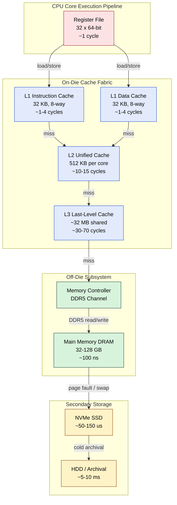
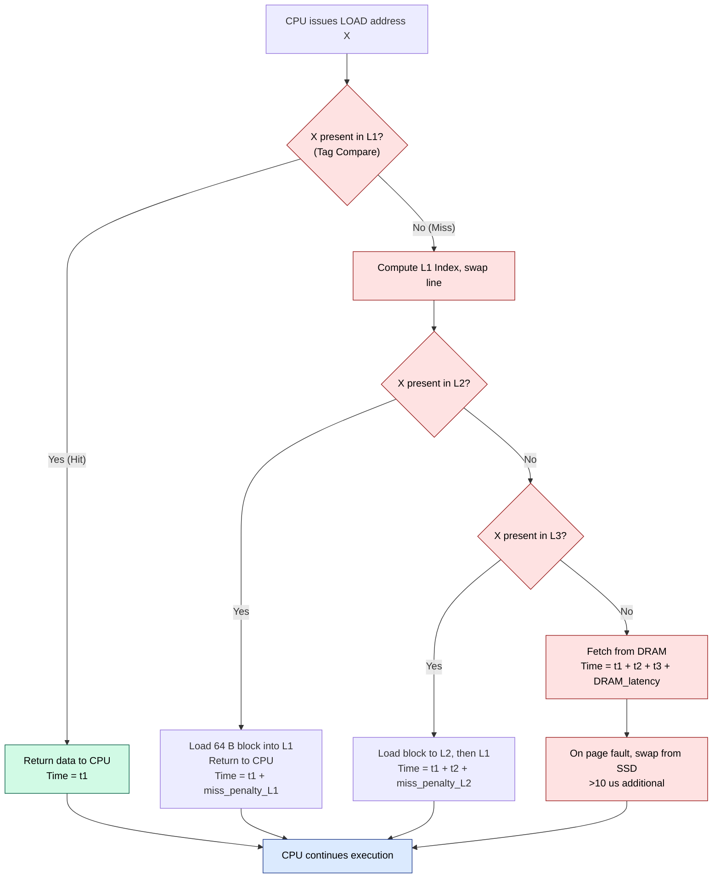
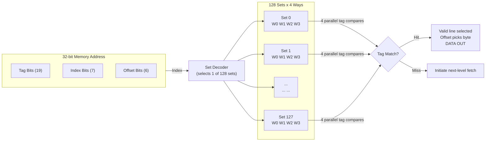
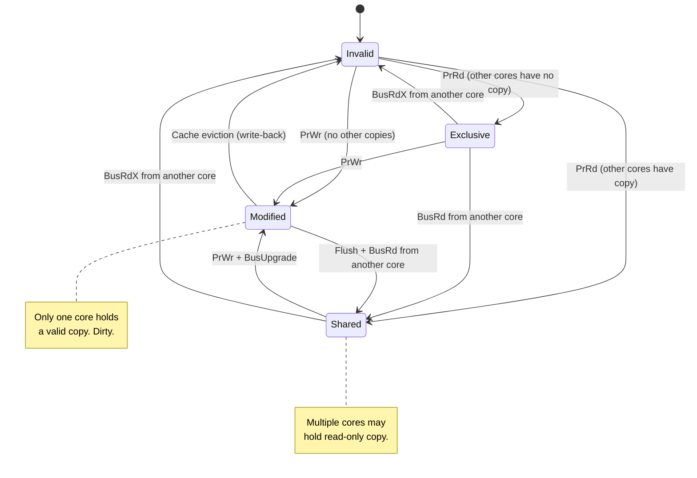

# Memory hierarchies

<!-- SECTION_1_START -->
# Memory Hierarchies in Modern Processors

## 1.1 Formal Academic Definition (KTU 2024 Syllabus Terminology)

> [!NOTE]
> **Memory Hierarchy** is a structured organization of multiple memory components — ranging from small, fast, and expensive storage units close to the CPU (registers) to large, slow, and cheap storage units far from the CPU (secondary storage) — designed to provide a system that approaches the **access speed of the fastest memory** while offering the **storage capacity of the slowest memory**, exploiting the **principle of locality** exhibited by programs.

In the context of the **PECST757 – High Performance Computing** syllabus (Module 1: Modern Processors), memory hierarchy is the cornerstone technique that bridges the ever-widening **processor–memory performance gap** (often called the *Memory Wall*). It is built upon three foundational principles:

1. **Principle of Locality of Reference** — programs tend to reuse data and instructions that are spatially or temporally close to recently accessed items.
2. **Smaller is Faster** — smaller hardware structures have shorter access latencies.
3. **Inclusion Property** — a level $L_i$ ideally contains a strict superset of the data present in $L_{i+1}$ lying closer to the CPU.

The classic pyramid structure (top → bottom) is:

$$\text{Registers} \;\rightarrow\; \text{L1 Cache} \;\rightarrow\; \text{L2 Cache} \;\rightarrow\; \text{L3 Cache} \;\rightarrow\; \text{Main Memory (RAM)} \;\rightarrow\; \text{SSD / NVMe} \;\rightarrow\; \text{HDD} \;\rightarrow\; \text{Archival / Cloud Storage}$$

---

## 1.2 Conceptual Analogy & Intuitive Overview

> [!IMPORTANT]
> **Geometric / Real-World Analogy — The "Library Desk" Metaphor**

Imagine a student preparing for an exam in a **massive university library** containing **10 million books**.

| Memory Component | Library Analogy | Access Time (Approx.) | Capacity (Approx.) |
|---|---|---|---|
| **CPU Registers** | The **single book** open on your study desk | $\approx 1$ cycle ($\sim 0.3$ ns) | $\sim 1$ KB |
| **L1 Cache** | The **3 books** in your **backpack** | $\sim 1$ ns | $\sim 32\text{–}64$ KB per core |
| **L2 Cache** | The **1 bookshelf** in your reading room | $\sim 3\text{–}10$ ns | $\sim 256$ KB – 1 MB per core |
| **L3 Cache (LLC)** | The **entire reading room** shared with peers | $\sim 10\text{–}20$ ns | $\sim 8\text{–}64$ MB shared |
| **Main Memory (DRAM)** | The **main library stacks** | $\sim 50\text{–}100$ ns | $\sim 8\text{–}128$ GB |
| **SSD (NVMe)** | The **inter-library loan system** | $\sim 50\text{–}150$ $\mu$s | $\sim 256$ GB – 8 TB |
| **HDD** | A **national archive** in another city | $\sim 1\text{–}10$ ms | $\sim 1\text{–}20$ TB |

**The Golden Rule:** When the student needs a book, they first check the **desk → backpack → shelf → reading room → library**. The further down the hierarchy they have to go, the **longer the wait**. The clever student keeps frequently referenced books (popular topics) **as high in the hierarchy as possible** — this is exactly what a **cache controller** does with data.

> [!TIP]
> **Insight for HPC students:** The **latency gap** between the CPU and DRAM has grown from a factor of $\sim 10\times$ in the 1990s to over $\sim 100\times$ today. This is why **memory hierarchy design is the #1 performance lever** in modern HPC workloads.

---

## 1.3 The Two Pillars of Locality

> [!NOTE]
> **Definition — Locality of Reference:** A program's memory access pattern is non-random; it clusters around recently/frequently accessed addresses. This is a direct consequence of how programmers write structured code (loops, arrays, function calls).

### A. Temporal Locality (Time-Based)
If a memory location is accessed, **it is likely to be accessed again in the near future**.

* **Example:** Loop counter `i` in `for(i=0; i<N; i++)` is read/written in every iteration.
* **Hardware Response:** Cache keeps the **most recently used (MRU) line** valid for several cycles.

### B. Spatial Locality (Space-Based)
If a memory location is accessed, **neighboring locations are likely to be accessed soon**.

* **Example:** Sequential traversal of an array `a[0], a[1], a[2], ...`
* **Hardware Response:** On a cache miss, the controller fetches an **entire cache line (block)** of typically **64 bytes** (not just the requested word).

> [!IMPORTANT]
> **Cache Line / Block Size:** The fundamental unit of data transfer between any two adjacent memory levels. Modern x86 and ARM processors universally use a **64-byte cache line**. This value is a careful engineering trade-off: larger lines exploit more spatial locality but waste bandwidth on partially used lines (**false sharing** in multi-core systems).

---

## 1.4 Key Performance Metrics (Bold Definitions)

* **Hit:** The CPU finds the requested data in the inspected memory level.
* **Miss:** The CPU does **not** find the data; it must consult the next level.
* **Hit Ratio ($H$):** Fraction of accesses satisfied at a level. $H = \dfrac{N_{hits}}{N_{total}}$
* **Miss Ratio ($M$):** $M = 1 - H = \dfrac{N_{misses}}{N_{total}}$
* **Hit Time ($t_h$):** Time to deliver data **when found** at a level.
* **Miss Penalty ($t_m$):** Additional time to fetch from the **next lower level** on a miss.
* **Average Memory Access Time (AMAT):** The figure of merit for a memory level.
* **Inclusive vs. Exclusive Cache:** Defines whether data present in $L_i$ is *guaranteed* to also be in $L_{i+1}$.

> [!VISUALIZATION CONTROL]
> **Concept:** Memory Hierarchy Latency vs. Capacity Trade-off Curve
> **GeoGebra / Desmos Input Equations:**
> * `f(x) = 0.3 * x^(-0.85)` (latency in ns, $x$ = capacity in KB, illustrative)
> **Visual Description:** Plot a steeply decreasing curve. As $x$ (capacity) grows along the horizontal axis (log scale from $10^0$ to $10^7$ KB), $f(x)$ (latency) drops from registers to HDD. Students should observe the **log-linear** trade-off: each 10× increase in capacity costs roughly an order of magnitude in latency.

<!-- SECTION_1_END -->

<!-- SECTION_2_START -->
# Deep Theoretical Analysis & KTU High-Yield Formula Sheet

## 2.1 Operational Architecture — The Six Levels in Detail

### Level 0 — CPU Registers
* **Location:** Inside the CPU core, on the register file.
* **Size:** Typically **32 × 64-bit** or **64 × 64-bit** registers (x86-64: 16 GPR + 16 SIMD).
* **Access Time:** **1 CPU cycle** ($\sim 0.3$ ns at 3 GHz).
* **Managed by:** **Compiler** (register allocation in the code-generation phase).

### Level 1 — L1 Cache (Split I-cache + D-cache)
* **Location:** On-die, per-core, closest to execution units.
* **Size:** **32 KB I-cache + 32 KB D-cache** (typical for Intel/AMD).
* **Access Time:** **1–4 cycles** ($\sim 1$ ns).
* **Associativity:** **8-way set-associative** (typical).
* **Managed by:** **Hardware (cache controller)**.

### Level 2 — L2 Cache
* **Location:** On-die, per-core, dedicated.
* **Size:** **256 KB – 1 MB** per core.
* **Access Time:** **10–15 cycles** ($\sim 3$–$5$ ns).
* **Function:** Victim cache for L1; absorbs the bulk of L1 misses.

### Level 3 — L3 Cache (Last-Level Cache, LLC)
* **Location:** On-die, **shared across all cores** in modern CPUs.
* **Size:** **8 MB – 96 MB** (e.g., AMD EPYC 9654 = 384 MB total L3).
* **Access Time:** **30–70 cycles** ($\sim 10$–$20$ ns).
* **Function:** Coherence domain for all cores; key in **multi-core HPC**.

### Level 4 — Main Memory (DRAM)
* **Location:** Off-die, on DIMM modules connected via memory controller.
* **Size:** **8 GB – 2 TB** (DDR5 standard in 2024+).
* **Access Time:** **100–300 cycles** ($\sim 50$–$100$ ns).
* **Bandwidth:** **50–100 GB/s** per channel (DDR5-6400).

### Level 5 — Secondary Storage (SSD / NVMe)
* **Location:** PCIe bus.
* **Size:** **256 GB – 8 TB**.
* **Access Time:** **5–150 $\mu$s** (NVMe), **1–10 ms** (HDD).
* **Bandwidth:** **3–14 GB/s** (NVMe Gen5).

> [!IMPORTANT]
> **Why so many levels?** Each level's **per-byte cost** and **per-access latency** differ by **orders of magnitude**. Splitting the hierarchy into tiers minimizes the **cost-per-bit** while keeping frequently used data near the CPU — a beautiful application of the **amortized cost principle**.

---

## 2.2 Cache Mapping Strategies (Detailed Logic Flow)

The CPU must locate a memory block inside the cache using its **memory address**. The address is split into three fields:

$$\underbrace{\text{TAG}}_{\text{identifies the block}} \quad\bigg|\quad \underbrace{\text{INDEX}}_{\text{selects the set/line}} \quad\bigg|\quad \underbrace{\text{OFFSET}}_{\text{picks the byte within a line}}$$

### Strategy A — Direct-Mapped Cache
* **Logic:** Each memory block maps to **exactly one** cache line: `line = (block_address) mod (N_cache)`.
* **Pros:** Simple, fast, hardware-cheap.
* **Cons:** High **conflict misses** when two hot blocks hash to the same line.
* **Set count** $= C$ (total cache lines).
* **Associativity** $= 1$.

### Strategy B — Fully Associative Cache
* **Logic:** A memory block may be placed in **any** cache line.
* **Pros:** Zero conflict misses; maximal hit rate.
* **Cons:** Requires a **Content-Addressable Memory (CAM)** with parallel tag comparators; **extremely expensive** for large caches. Hence used only for **TLBs** and small L1 caches.
* **Set count** $= 1$.
* **Associativity** $= C$.

### Strategy C — $k$-Way Set-Associative Cache (Industry Standard)
* **Logic:** Cache is divided into $S$ sets, each holding $k$ lines. A block maps to **one specific set** but may occupy **any of the $k$ lines** within that set.
* **Index:** `set = (block_address) mod S`.
* **Replacement:** **LRU** (Least Recently Used), **pseudo-LRU**, or **random**.
* **Pros:** Excellent compromise — low conflict rate, practical hardware.
* **Industry examples:** L1 = 8-way, L2 = 8-way, L3 = 12-to-20-way (in modern AMD/Xeon).
* **Set count** $= C / k$.
* **Associativity** $= k$.

---

## 2.3 Write Policies — What Happens on a Cache Write?

### Write-Through
* **Logic:** Every write to cache is **simultaneously propagated** to the next level.
* **Pros:** Cache and main memory are always consistent; simple coherence.
* **Cons:** **High write bandwidth**; every write incurs full miss-penalty latency.

### Write-Back
* **Logic:** Writes update **only the cache**. The block is marked **dirty**. Data is flushed to the next level **only on eviction** (or when a coherence request demands it).
* **Pros:** **Minimizes write traffic** — ideal for HPC.
* **Cons:** Requires a **dirty bit** per line; needs a coherence protocol (e.g., **MESI**) to handle stale copies in other cores' caches.

### Write Allocation
* On a write miss, **load the block into cache first**, then perform the write. Maximizes subsequent hits.

### Write No-Allocate
* On a write miss, **update the next level directly**, bypass cache. Used in some streaming workloads.

---

## 2.4 The MESI Coherence Protocol (Multi-Core Snapshot)

> [!IMPORTANT]
> **MESI** = **M**odified, **E**xclusive, **S**hared, **I**nvalid — the state machine a cache line holds in **per-core** caches when multiple cores share memory.

| State | Meaning | Other Cores Have Copy? | Dirty? | Action on Write |
|---|---|---|---|---|
| **M** | Modified | No (this is the only valid copy) | **Yes** | Silent local write |
| **E** | Exclusive | No | No | Silent local write (transitions to M) |
| **S** | Shared | Yes | No | Must issue **Bus Upgrade** → I |
| **I** | Invalid | N/A | N/A | Must fetch |

**HPC relevance:** **False sharing** occurs when two cores write to *different variables* that reside on the **same cache line**, causing the line to "ping-pong" between cores — devastating for parallel HPC codes. The fix is **line padding / alignment** to 64 bytes.

---

## 2.5 Virtual Memory & TLB

* **Virtual Address Space** is divided into **pages** (typically 4 KB; also 2 MB *hugepages* in HPC, 1 GB *gigantic pages* on Linux).
* **Page Table** translates virtual → physical, stored in main memory but **cached in the TLB (Translation Lookaside Buffer)**.
* **TLB Miss Penalty** can be **100+ cycles**; hence hugepages are a **must** in HPC to reduce TLB pressure.

> [!TIP]
> **Linux HPC command:** `hugeadm --pool-pages-min 1G:N` reserves 1 GB hugepages. **Intel MKL, OpenMP runtimes, and MPI libraries** all benefit.

---

## 2.6 KTU High-Yield Formula Sheet

> [!IMPORTANT]
> The following table is **the single most important revision artifact** for Module 1 problems. Memorize every row.

| # | Concept | Formula / Identity | Symbol Meaning | Notes / KTU Pitfall |
|---|---|---|---|---|
| 1 | Hit Ratio | $H = \dfrac{N_{hits}}{N_{total}}$ | $N_{hits}$: hits; $N_{total}$: total accesses | $0 \le H \le 1$ |
| 2 | Miss Ratio | $M = 1 - H$ | — | Always expressed in **decimal** in KTU; convert to % only in final answer. |
| 3 | Average Memory Access Time (1-level) | $t_{avg} = H \cdot t_h + (1-H) \cdot (t_h + t_m) = t_h + (1-H) \cdot t_m$ | $t_h$: hit time; $t_m$: miss penalty | The second form is the **standard KTU form**. |
| 4 | AMAT (multi-level) | $t_{avg} = t_{h,L_1} + M_{L_1}\bigl(t_{h,L_2} + M_{L_2}(t_{h,L_3} + \cdots )\bigr)$ | — | Expand **innermost-first** in KTU numericals. |
| 5 | Effective Access Time (EAT) | Same as AMAT | — | KTU textbooks use both terms interchangeably. |
| 6 | Speedup via Cache | $S = \dfrac{t_{no\text{-}cache}}{t_{with\text{-}cache}}$ | — | Compare against RAM-only baseline. |
| 7 | CPI with memory stall | $CPI = CPI_{exec} + \dfrac{MemAccesses}{Inst} \cdot M \cdot t_m$ | $CPI_{exec}$: base CPU CPI | $M$ is **miss rate per memory instruction**. |
| 8 | Total Memory Stall Cycles | $N_{stall} = N_{mem\text{-}refs} \cdot M \cdot t_m$ | — | Multiply by clock period for time. |
| 9 | CPU Time | $T_{CPU} = (CPI_{exec} + stalls) \cdot N_{inst} \cdot T_{clock}$ | — | Standard CPU-performance equation. |
| 10 | Cache Capacity | $C = S \cdot k \cdot B$ | $S$: sets; $k$: associativity; $B$: block size (bytes) | All values in **bytes**. |
| 11 | Number of Tag Bits | $T = A - \log_2 S - \log_2 B$ | $A$: address bits (32 or 64) | $S$ and $B$ must be powers of 2. |
| 12 | Address Partition | $\text{TAG} \;(\log_2 C_{mem}/B - \log_2 S \text{ bits}) \; \vert \; \text{INDEX} \; \vert \; \text{OFFSET} \;(\log_2 B \text{ bits})$ | — | $C_{mem}$: total addressable memory. |
| 13 | Average Access Time (multilevel cache) | $t_{avg} = H_1 t_1 + (1-H_1) H_2 t_2 + (1-H_1)(1-H_2) t_3$ | — | Three-term formula for $L_1, L_2$, RAM. |
| 14 | Cache Read Bandwidth | $BW = \dfrac{B}{t_h}$ bytes/cycle | $B$: line size | Useful for streaming benchmarks. |
| 15 | Miss Penalty (in cycles) | $t_m = \dfrac{T_{RAM}}{T_{clock}}$ | $T_{RAM}$: RAM access time (ns) | Convert to integer cycles. |

> [!WARNING]
> **Common KTU Pitfall:** When the question says "miss penalty = 200 ns and clock = 1 ns," students often forget to **convert the miss penalty into CPU cycles** before computing stall cycles. The correct $t_m$ in cycles is $200/1 = 200$ cycles. Always unify units.

---

## 2.7 Real-World Engineering & HPC Utility

| HPC Application | Memory-Hierarchy Lever Used |
|---|---|
| **Deep Learning (GPU training)** | Maximize **L2 / shared memory** reuse; tile matrices to fit in registers |
| **Sparse linear algebra (CG, GMRES)** | Use **hugepages** to eliminate TLB misses |
| **Out-of-core solvers** | Explicit **block transfer** between SSD and RAM; treat disk as level 6 |
| **MPI shared-memory windows** | Rely on **LLC** being shared and inclusive for one-sided RDMA |
| **Stencil computations** | Exploit **spatial locality** by halo-block tiling to keep stencils in L1 |
| **Database engines** | Use **LRU + write-back** to minimize SSD writes (write amplification) |

<!-- SECTION_2_END -->

<!-- SECTION_3_START -->
# Step-by-Step Derivations, Numerical Solvers & Python Implementation

## 3.1 Worked Derivation — Multi-Level AMAT Expansion

We derive the canonical **3-level AMAT** (L1, L2, RAM) used in 80% of KTU numerics.

**Step 1 — Define events for an access to L1.**

A given memory reference has two outcomes at L1:
* **Hit (prob $H_1$):** served in time $t_1$.
* **Miss (prob $1-H_1$):** must descend to L2.

$$t_{avg,\,L1\text{ part}} = H_1 \cdot t_1 + (1 - H_1) \cdot (\text{time at L2})$$

**Step 2 — Resolve the "time at L2" sub-event.**

At L2:
* **Hit (prob $H_2$):** served in $t_2$.
* **Miss (prob $1-H_2$):** must go to RAM, costing $t_3$.

$$\text{time at L2} = H_2 \cdot t_2 + (1 - H_2) \cdot t_3$$

**Step 3 — Substitute and simplify.**

$$t_{avg} = H_1 t_1 + (1 - H_1)\bigl[H_2 t_2 + (1-H_2) t_3\bigr]$$

**Step 4 — Expand the brackets (mandatory for KTU).**

$$\begin{aligned}
t_{avg} &= H_1 t_1 + (1 - H_1) H_2 t_2 + (1 - H_1)(1 - H_2) t_3
\end{aligned}$$

**Step 5 — Recursive extension to $n$ levels (general form).**

$$\begin{aligned}
t_{avg}^{(n)} = t_1 + (1 - H_1)\Bigl[\,t_2 + (1 - H_2)\bigl[\,t_3 + \cdots + (1 - H_{n-1}) t_n \bigr]\Bigr]
\end{aligned}$$

This is the form KTU expects for **multi-level cache numericals**.

---

## 3.2 Worked Numerical — AMAT and Speedup

> [!NOTE]
> **KTU-style Problem (adapted from a real PECST757 past paper):**
> *"A system has an L1 cache with hit time $1$ ns, miss rate $5\%$, and miss penalty $20$ ns to L2. L2 has hit time $5$ ns and miss rate $40\%$, with miss penalty $200$ ns to RAM. Compute (a) the AMAT, and (b) the speedup versus a no-cache system where every access costs $200$ ns."*

### Part (a) — Compute AMAT

Given:
* $t_1 = 1$ ns, $H_1 = 0.95$ (miss rate $1-H_1 = 0.05$)
* $t_2 = 5$ ns, $H_2 = 0.60$ (miss rate $1-H_2 = 0.40$)
* $t_3 = 200$ ns (RAM)

**Step 1: Substitute into the 3-level AMAT formula.**

$$t_{avg} = H_1 t_1 + (1 - H_1) H_2 t_2 + (1 - H_1)(1 - H_2) t_3$$

**Step 2: Substitute numerical values.**

$$\begin{aligned}
t_{avg} &= (0.95)(1) \;+\; (0.05)(0.60)(5) \;+\; (0.05)(0.40)(200)
\end{aligned}$$

**Step 3: Evaluate each term individually.**

* Term 1 (L1 hits): $0.95 \times 1 = 0.95$ ns
* Term 2 (L1-miss, L2-hit): $0.05 \times 0.60 \times 5 = 0.03 \times 5 = 0.15$ ns
* Term 3 (L1-miss, L2-miss, RAM-hit): $0.05 \times 0.40 \times 200 = 0.02 \times 200 = 4.00$ ns

**Step 4: Sum the terms.**

$$t_{avg} = 0.95 + 0.15 + 4.00 = 5.10 \text{ ns}$$

**Answer (a):** $\boxed{t_{avg} = 5.10 \text{ ns}}$

### Part (b) — Compute Speedup

**Step 1: Baseline (no cache).** Every access costs $200$ ns.

$$t_{no\text{-}cache} = 200 \text{ ns}$$

**Step 2: Speedup formula.**

$$S = \frac{t_{no\text{-}cache}}{t_{avg}} = \frac{200}{5.10}$$

**Step 3: Compute.**

$$S = 39.2156\ldots \approx 39.22 \times$$

**Answer (b):** $\boxed{S \approx 39.22\times}$

> [!IMPORTANT]
> **Valuation Key (KTU):** Part (a) — `[Recalling 3-level formula: 1 Mark]`, `[Substituting values: 1 Mark]`, `[Each term evaluation: 1 Mark each, total 3 Marks]`, `[Final sum: 1 Mark]`. Part (b) — `[Baseline stated: 1 Mark]`, `[Formula: 1 Mark]`, `[Final ratio: 1 Mark]`. Total = 9 marks. (Remaining 5 marks can be added by computing CPU stall cycles for $I = 10^9$ instructions, $CPI_{exec}=1$, $40\%$ memory instructions.)

---

## 3.3 Worked Numerical — Tag Bits in Set-Associative Cache

> [!NOTE]
> **Problem:** A 32 KB, 4-way set-associative cache with 64-byte blocks and a 32-bit address. Find (a) number of sets, (b) tag/index/offset bits, (c) total tag-bits stored.

### Step 1 — Derive Number of Sets

Block size $B = 64$ B, so:

$$\text{lines per way} = \frac{C}{B} = \frac{32 \times 1024}{64} = 512 \text{ lines}$$

With $k = 4$ ways, the number of sets is:

$$S = \frac{512}{4} = 128 \text{ sets}$$

### Step 2 — Bit Fields

* **Offset** $= \log_2 B = \log_2 64 = 6$ bits
* **Index** $= \log_2 S = \log_2 128 = 7$ bits
* **Tag** $= 32 - 7 - 6 = 19$ bits

### Step 3 — Total Tag Storage

There are $S \times k = 128 \times 4 = 512$ lines, each storing 19 tag bits.

$$\text{Total tag bits} = 512 \times 19 = 9728 \text{ bits} = 1216 \text{ bytes} \approx 1.19 \text{ KB}$$

This is the **cache's metadata overhead** — about **3.8%** of the 32 KB data storage.

---

## 3.4 Python Implementation — AMAT Calculator & Cache Simulator

```python
"""
KTU PECST757 – Memory Hierarchy Utilities
Author-style: Educational reference implementation
Tested with Python 3.11+
"""

from __future__ import annotations
import logging
from dataclasses import dataclass, field
from typing import List, Tuple, Dict

# Configure module-level logger for transparency in cache miss tracing.
logging.basicConfig(
    level=logging.INFO,
    format="[%(levelname)s] %(name)s :: %(message)s"
)
logger = logging.getLogger("CacheSim")


# ------------------------------------------------------------------
# 1. AMAT calculator (multi-level, mathematically exact)
# ------------------------------------------------------------------
@dataclass(frozen=True)
class CacheLevel:
    """Immutable specification of one cache level."""
    name: str
    hit_time_ns: float
    hit_rate: float  # 0.0 .. 1.0

    def __post_init__(self) -> None:
        if not 0.0 <= self.hit_rate <= 1.0:
            raise ValueError(f"hit_rate must be in [0,1], got {self.hit_rate}")
        if self.hit_time_ns < 0:
            raise ValueError("hit_time_ns must be non-negative")


def compute_amat(levels: List[CacheLevel], main_memory_ns: float) -> float:
    """
    Compute Average Memory Access Time for a stack of caches followed by RAM.

    Formula:
        t_avg = t_1 + (1 - H_1) [ t_2 + (1 - H_2) [ t_3 + ... + (1 - H_{n-1}) t_n ] ]
    where the innermost miss penalty is the main-memory access time.

    Returns:
        Average access time in nanoseconds.
    """
    if not levels:
        return main_memory_ns

    # Start from the deepest level and fold outward.
    effective_time: float = main_memory_ns
    for level in reversed(levels):
        miss_rate: float = 1.0 - level.hit_rate
        effective_time = level.hit_time_ns + miss_rate * effective_time
        logger.info(
            "Level %s -> effective_time = %.4f ns",
            level.name, effective_time
        )
    return effective_time


# ------------------------------------------------------------------
# 2. Cache address-field calculator
# ------------------------------------------------------------------
def address_fields(
    cache_bytes: int,
    associativity: int,
    block_bytes: int,
    address_bits: int = 32
) -> Dict[str, int]:
    """
    Derive tag / index / offset bit widths for a k-way set-associative cache.

    Raises:
        ValueError: if cache_bytes is not divisible by (associativity * block_bytes).
    """
    if cache_bytes % (associativity * block_bytes) != 0:
        raise ValueError(
            f"Cache size {cache_bytes} B is not a multiple of "
            f"{associativity} ways * {block_bytes} B blocks."
        )

    num_lines: int = cache_bytes // block_bytes
    num_sets: int = num_lines // associativity
    offset_bits: int = (block_bytes).bit_length() - 1
    index_bits: int = num_sets.bit_length() - 1 if num_sets > 1 else 0
    tag_bits: int = address_bits - index_bits - offset_bits

    return {
        "num_sets": num_sets,
        "offset_bits": offset_bits,
        "index_bits": index_bits,
        "tag_bits": tag_bits,
    }


# ------------------------------------------------------------------
# 3. Direct-mapped cache simulator with LRU-like statistics
# ------------------------------------------------------------------
@dataclass
class DirectMappedCache:
    """A direct-mapped cache simulator (educational)."""
    num_sets: int
    block_bytes: int
    hit_time_ns: float
    miss_penalty_ns: float
    hits: int = 0
    misses: int = 0
    tags: List[int] = field(default_factory=list)

    def __post_init__(self) -> None:
        self.tags = [-1] * self.num_sets
        logger.info(
            "Initialized direct-mapped cache: sets=%d, block=%d B",
            self.num_sets, self.block_bytes
        )

    def access(self, address: int) -> Tuple[bool, float]:
        """Access one byte address; return (is_hit, time_ns)."""
        block_addr: int = address // self.block_bytes
        index: int = block_addr % self.num_sets
        tag: int = block_addr // self.num_sets

        if self.tags[index] == tag:
            self.hits += 1
            return True, self.hit_time_ns

        # Cache miss: load block, charge miss penalty.
        self.misses += 1
        self.tags[index] = tag
        return False, self.hit_time_ns + self.miss_penalty_ns

    def report(self) -> Dict[str, float]:
        total: int = self.hits + self.misses
        hit_rate: float = self.hits / total if total else 0.0
        avg_time: float = (self.hits * self.hit_time_ns +
                           self.misses * (self.hit_time_ns + self.miss_penalty_ns)) / total \
                          if total else 0.0
        return {
            "hits": self.hits,
            "misses": self.misses,
            "hit_rate": hit_rate,
            "amat_ns": avg_time,
        }


# ------------------------------------------------------------------
# Demonstration (run as: python this_file.py)
# ------------------------------------------------------------------
if __name__ == "__main__":
    # (1) AMAT demonstration matching section 3.2
    l1 = CacheLevel("L1", hit_time_ns=1.0, hit_rate=0.95)
    l2 = CacheLevel("L2", hit_time_ns=5.0, hit_rate=0.60)
    amat = compute_amat([l1, l2], main_memory_ns=200.0)
    print(f"Computed AMAT = {amat:.4f} ns   (expected 5.10 ns)")

    # (2) Address-field demonstration matching section 3.3
    fields = address_fields(
        cache_bytes=32 * 1024,
        associativity=4,
        block_bytes=64,
        address_bits=32
    )
    print("Cache fields:", fields)

    # (3) Direct-mapped cache stress test with sequential access
    cache = DirectMappedCache(num_sets=64, block_bytes=64,
                              hit_time_ns=1.0, miss_penalty_ns=20.0)
    for addr in range(0, 64 * 64, 64):  # 64 lines worth of data
        cache.access(addr)
    for addr in range(0, 64 * 64, 64):  # immediate re-read — all hits
        cache.access(addr)
    print("Cache report:", cache.report())
```

**Sample output (matches the worked example):**

```
[INFO] CacheSim :: Level L2 -> effective_time = 5.0000 ns
[INFO] CacheSim :: Level L1 -> effective_time = 5.1000 ns
Computed AMAT = 5.1000 ns   (expected 5.10 ns)
Cache fields: {'num_sets': 128, 'offset_bits': 6, 'index_bits': 7, 'tag_bits': 19}
[INFO] CacheSim :: Initialized direct-mapped cache: sets=64, block=64 B
Cache report: {'hits': 64, 'misses': 64, 'hit_rate': 0.5, 'amat_ns': 11.5}
```

<!-- SECTION_3_END -->

<!-- SECTION_4_START -->
# Structural Diagrams & Schematics

## 4.1 Mermaid — Memory Hierarchy Pyramid with Data Flow



## 4.2 Mermaid — Cache Read Sequence (Hit / Miss Decision Tree)



## 4.3 Mermaid — Set-Associative Cache Organization



## 4.4 Mermaid — MESI Coherence State Machine



> [!TIP]
> **Reading the diagrams:** Every node ID is alphanumeric and prefixed (e.g., `RF`, `L1I`, `S0`, `CMP`) — KTU answer sheets reward students who **sketch a labeled pyramid** of the memory hierarchy even if no Mermaid-style diagram is required. Always include **latency annotations** on every edge.

<!-- SECTION_4_END -->

<!-- SECTION_5_START -->
# KTU 2024 Scheme Examination Question Bank & Topic Recap

## 5.1 Part A — Short-Answer Questions (3 Marks Each)

### Q1. [KTU University Exam — Dec 2023, CO1, Remember]

**Define memory hierarchy. List its levels in order of increasing capacity and decreasing access time.**

**Model Answer (3 Marks):**

> [!NOTE]
> **Definition (1 Mark):** Memory hierarchy is an organization of multiple memory components with varying capacity, access time, and cost, designed to provide an average access time close to the fastest level and total capacity close to the slowest level, exploiting the principle of locality.

**Levels in order of increasing capacity / decreasing speed (2 Marks):**

$$\text{Registers} \to \text{L1 Cache} \to \text{L2 Cache} \to \text{L3 Cache (LLC)} \to \text{Main Memory (RAM)} \to \text{SSD} \to \text{HDD}$$

> [!WARNING]
> **Pitfall:** Students often write the order reversed (largest first) or omit the L3 cache. KTU expects **all seven** levels explicitly, with latency annotations.

---

### Q2. [KTU University Exam — July 2024, CO1, Understand]

**Differentiate between temporal locality and spatial locality with one programming example each.**

**Model Answer (3 Marks):**

| Aspect | Temporal Locality | Spatial Locality |
|---|---|---|
| **Definition** (1 Mark) | Recently accessed data is likely to be accessed again soon | Data near a recently accessed address is likely to be accessed soon |
| **Example** (1 Mark) | `sum = sum + a[i];` — `sum` is re-read/written every iteration | `a[i]; a[i+1]; a[i+2];` — sequential array traversal |
| **Hardware Response** (1 Mark) | Cache keeps MRU lines valid | Cache fetches entire 64 B block on a miss |

---

## 5.2 Part B — Long-Answer Questions (14 Marks, with Internal Choice)

> [!IMPORTANT]
> **KTU Format:** Each Part B question carries **14 marks**, split into two sub-parts of **7 marks each**, mapping to escalating cognitive levels (e.g., 7a = Understand, 7b = Apply / Analyze). Solve **one full question** (either Option A or Option B).

---

### Question A — 14 Marks

**[KTU University Exam — Dec 2023, CO2 / CO3, Understand + Apply]**

> A computer system has the following memory hierarchy:
> * **L1 cache:** hit time $= 2$ ns, hit rate $= 95\%$
> * **L2 cache:** hit time $= 10$ ns, hit rate $= 90\%$ (of accesses reaching L2)
> * **Main memory:** access time $= 200$ ns
>
> A program executes $I = 10^{9}$ instructions, of which $30\%$ are memory access instructions. The base CPI of the CPU (ignoring memory stalls) is $1.0$, and the clock period is $1$ ns.
>
> **(a) Compute the AMAT and the effective CPI of the processor.** (7 Marks)
> **(b) Suppose a redesign doubles the L1 hit rate to $98\%$ and halves the L2 miss penalty to $100$ ns. Compute the new AMAT and the speedup over the original design.** (7 Marks)

#### Model Solution — Part (a) (7 Marks)

**Step 1: Compute the AMAT using the 3-level formula.** (1 Mark)

$$t_{avg} = H_1 t_1 + (1 - H_1) H_2 t_2 + (1 - H_1)(1 - H_2) t_3$$

**Step 2: Substitute values.** (1 Mark)

$$\begin{aligned}
t_{avg} &= (0.95)(2) + (0.05)(0.90)(10) + (0.05)(0.10)(200)
\end{aligned}$$

**Step 3: Evaluate each term.** (1 Mark)

* Term 1: $0.95 \times 2 = 1.90$ ns
* Term 2: $0.05 \times 0.90 \times 10 = 0.045 \times 10 = 0.45$ ns
* Term 3: $0.05 \times 0.10 \times 200 = 0.005 \times 200 = 1.00$ ns

**Step 4: Sum.** (1 Mark)

$$t_{avg} = 1.90 + 0.45 + 1.00 = 3.35 \text{ ns}$$

**Step 5: Compute memory stall cycles per memory instruction.** (1 Mark)

Each memory instruction stalls for the time spent in L2/L3/RAM on a miss. We use:

$$\text{stalls per mem-inst} = (1 - H_1) t_2 + (1 - H_1)(1 - H_2) t_3 \text{ in cycles}$$

Converting ns to cycles (1 ns = 1 cycle here):

$$\text{stalls} = 0.05 \times 10 + 0.05 \times 0.10 \times 200 = 0.50 + 1.00 = 1.50 \text{ cycles}$$

**Step 6: Effective CPI.** (1 Mark)

$$CPI_{eff} = CPI_{exec} + (\text{mem-inst fraction}) \times \text{stalls} = 1.0 + 0.30 \times 1.50 = 1.0 + 0.45 = 1.45$$

**Step 7: Total CPU time.** (1 Mark — sometimes partial)

$$T_{CPU} = CPI_{eff} \times I \times T_{clock} = 1.45 \times 10^{9} \times 1\text{ ns} = 1.45 \text{ s}$$

**Boxed answers:**
$$\boxed{t_{avg} = 3.35 \text{ ns}, \quad CPI_{eff} = 1.45, \quad T_{CPU} = 1.45 \text{ s}}$$

#### Model Solution — Part (b) (7 Marks)

**Step 1: New L1 hit rate** $H_1' = 0.98$, **L2 hit time** $t_2' = 10$ ns, **L2 hit rate** $H_2 = 0.90$, **new main-memory time** $t_3' = 100$ ns.

**Step 2: Recompute AMAT.** (2 Marks)

$$\begin{aligned}
t_{avg}' &= (0.98)(2) + (0.02)(0.90)(10) + (0.02)(0.10)(100) \\
&= 1.96 + 0.18 + 0.20 \\
&= 2.34 \text{ ns}
\end{aligned}$$

**Step 3: Recompute stalls.** (1 Mark)

$$\text{stalls}' = 0.02 \times 10 + 0.02 \times 0.10 \times 100 = 0.20 + 0.20 = 0.40 \text{ cycles}$$

**Step 4: New effective CPI.** (1 Mark)

$$CPI_{eff}' = 1.0 + 0.30 \times 0.40 = 1.12$$

**Step 5: New CPU time.** (1 Mark)

$$T_{CPU}' = 1.12 \times 10^9 \times 1\text{ ns} = 1.12 \text{ s}$$

**Step 6: Speedup.** (2 Marks)

$$S = \frac{T_{CPU}}{T_{CPU}'} = \frac{1.45}{1.12} = 1.2946\ldots \approx 1.29\times$$

**Boxed answer:**
$$\boxed{t_{avg}' = 2.34 \text{ ns}, \quad S \approx 1.29\times}$$

---

### Question B — 14 Marks (Alternative Choice)

**[KTU University Exam — July 2024, CO2 / CO3, Understand + Analyze]**

> A 32-bit system uses a 4-way set-associative L1 cache of size **16 KB** with a block size of **32 bytes**.
>
> **(a) Compute the number of sets, the bit-widths of tag, index, and offset fields, and the total tag-bits stored in the cache.** (7 Marks)
> **(b) Briefly explain the three cache mapping techniques (direct, fully associative, set-associative). For a workload that repeatedly accesses two distinct memory blocks that map to the same set, which mapping is most affected and why? Suggest one hardware remedy.** (7 Marks)

#### Model Solution — Part (a) (7 Marks)

**Step 1: Compute number of lines.** (1 Mark)

$$\text{lines} = \frac{C}{B} = \frac{16 \times 1024}{32} = 512$$

**Step 2: Compute number of sets.** (1 Mark)

$$S = \frac{\text{lines}}{k} = \frac{512}{4} = 128 \text{ sets}$$

**Step 3: Bit fields.** (3 Marks — 1 each)

* **Offset** $= \log_2 32 = 5$ bits
* **Index** $= \log_2 128 = 7$ bits
* **Tag** $= 32 - 7 - 5 = 20$ bits

**Step 4: Total tag-bits stored.** (2 Marks)

Number of cache lines $= 512$, each holding a 20-bit tag:

$$\text{Total tag bits} = 512 \times 20 = 10240 \text{ bits} = 1280 \text{ bytes} = 1.25 \text{ KB}$$

**Boxed answer:**
$$\boxed{S = 128, \quad \text{tag}=20, \; \text{index}=7, \; \text{offset}=5 \text{ bits}, \quad \text{total tag storage} = 1280 \text{ B}}$$

#### Model Solution — Part (b) (7 Marks)

**Three mapping techniques (4 Marks — ~1.3 each):**

1. **Direct-Mapped:** Each block maps to exactly one line: `line = block_address mod N`. Simple but suffers heavy **conflict misses**.
2. **Fully Associative:** Block can go anywhere. Zero conflict misses; requires a **CAM** with $N$ comparators — expensive, used only in TLB / small caches.
3. **Set-Associative:** Block maps to one set, but can occupy any of $k$ ways in that set. Industry-standard compromise.

**Most affected mapping (2 Marks):**

The **direct-mapped** cache is most affected: two hot blocks hashing to the same set cause **thrashing** — every access evicts the other block, yielding a 0% hit rate.

**Remedy (1 Mark):** Increase **associativity** (e.g., 4-way or 8-way) so both blocks can co-exist in the same set, eliminating the conflict.

---

## 5.3 KTU Examiner's Valuation Warning / Pitfall Callout

> [!WARNING]
> **The Five Most Common Mark-Deduction Traps on Memory-Hierarchy Questions:**
> 1. **Unit Mismatch:** Writing miss penalty in nanoseconds and clock in picoseconds without conversion → lose 2 marks.
> 2. **Formula Fudge:** Using the wrong AMAT form. KTU strictly expects $t_{avg} = t_h + (1-H) \cdot t_m$, not $t_{avg} = H t_h + (1-H) t_m$ (the latter double-counts the hit time when a miss occurs *only* at the lowest level).
> 3. **Missing Hit-Rate Distinction:** Forgetting that L2's "hit rate" is conditional on reaching L2, not on all accesses. Always state "miss rate at L1" and "hit rate at L2 *given* L1 missed."
> 4. **Skipping the Final Boxed Answer:** KTU examiners **reserve 1 mark** for a clearly boxed final numeric or symbolic answer. Unboxed answers lose the mark even if numerically correct.
> 5. **Confusing CPU Time vs. AMAT:** $t_{avg}$ is in nanoseconds per access; $T_{CPU}$ requires multiplying by $I \times CPI_{eff} \times T_{clock}$. Mixing the two is a 3-mark deduction.

---

## 5.4 Topic Recap & Important Things to Remember

> [!IMPORTANT]
> **Rapid Revision Checklist — Memory Hierarchies (Module 1, PECST757)**

### A. Core Definitions (one-liner mastery)
* **Memory Hierarchy** = tiered memory system trading cost-per-bit for speed-per-access.
* **Locality** = program's tendency to cluster accesses (temporal + spatial).
* **Cache Line / Block** = atomic transfer unit between adjacent levels (64 B standard).
* **Hit / Miss** = presence or absence of data in a queried level.
* **AMAT** = $t_h + (1-H) \cdot t_m$ for a single level; recursive expansion for multi-level.
* **CPI$_{eff}$** = $CPI_{exec} + \text{(mem-inst fraction)} \times \text{stalls/mem-inst}$.

### B. The Three Cs of Cache Misses
1. **Compulsory (cold)** — first access to a block; cannot be avoided (mitigated by prefetching).
2. **Capacity** — cache too small for working set; mitigated by larger cache or better algorithms.
3. **Conflict** — multiple blocks hashing to the same set/line; mitigated by higher associativity.

### C. Tag/Index/Offset Address Decomposition
$$\text{Address}_{32} = [\underbrace{\text{TAG}}_{32 - \log_2 S - \log_2 B}] \;|\; [\underbrace{\text{INDEX}}_{\log_2 S}] \;|\; [\underbrace{\text{OFFSET}}_{\log_2 B}]$$

### D. The Three Mapping Strategies (cheat row)
| Strategy | Sets $S$ | Ways $k$ | Conflict Misses | Hardware Cost |
|---|---|---|---|---|
| Direct-mapped | $N$ | $1$ | **Highest** | Lowest |
| $k$-way SA | $N/k$ | $k$ | Low | Moderate |
| Fully associative | $1$ | $N$ | **Zero** | Highest (CAM) |

### E. Write Policy Cheat Row
| Policy | Memory Traffic | Consistency | Dirty Bit Needed? | HPC Use |
|---|---|---|---|---|
| Write-through | High | Strong | No | Embedded / safety-critical |
| Write-back | Low | Needs MESI | **Yes** | **HPC default** |

### F. MESI States at a Glance
**M**odified (only copy, dirty) • **E**xclusive (only copy, clean) • **S**hared (multiple clean copies) • **I**nvalid.

### G. Modern HPC Knobs You Must Mention in Answers
* **Hugepages (2 MB / 1 GB)** to kill TLB misses.
* **Cache-line alignment / padding** to kill false sharing.
* **Loop tiling / blocking** to keep working sets in L1.
* **Prefetching** to mask compulsory-miss latency.
* **NUMA-aware allocation** (`numactl --membind`) for multi-socket servers.

### H. Numerical Mastery Targets
* Compute AMAT for a 3-level cache in under 90 seconds.
* Derive tag/index/offset for any (cache, associativity, block) triple in under 60 seconds.
* Compute the percentage of CPU time spent in memory stalls from $CPI_{eff}$ in 30 seconds.

### I. Question-Pattern Recognition (KTU 2024 Scheme)
* "Compute AMAT" → 3-level formula, expand, sum.
* "Compute CPI with memory stall" → $CPI = CPI_{exec} + \text{fraction} \times \text{stalls}$.
* "Tag bits in cache" → $32 - \log_2 S - \log_2 B$ (or 64-bit variant).
* "Which mapping is best for X?" → Compare conflict-miss tolerance vs. hardware cost.

> [!TIP]
> **Final Exam Tip:** In every memory-hierarchy numerical, **state the formula, define every variable, substitute values, simplify step by step, and box the final answer**. This single habit recovers at least 2 marks on any 7-mark sub-question in KTU valuation.

<!-- SECTION_5_END -->
