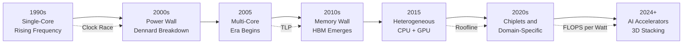
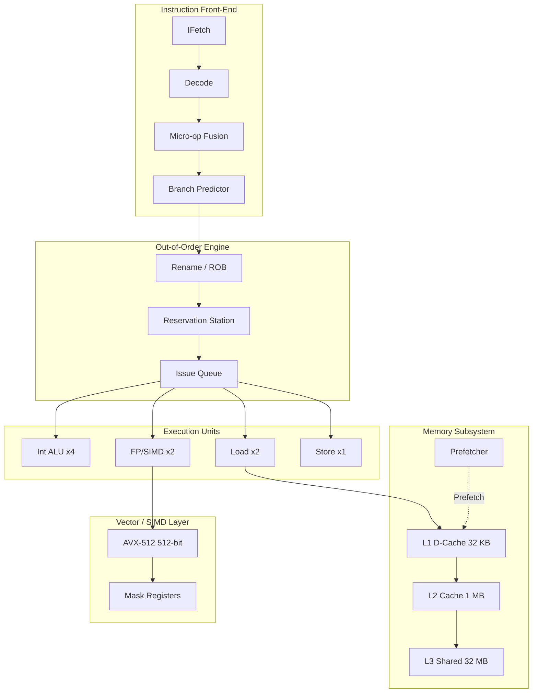
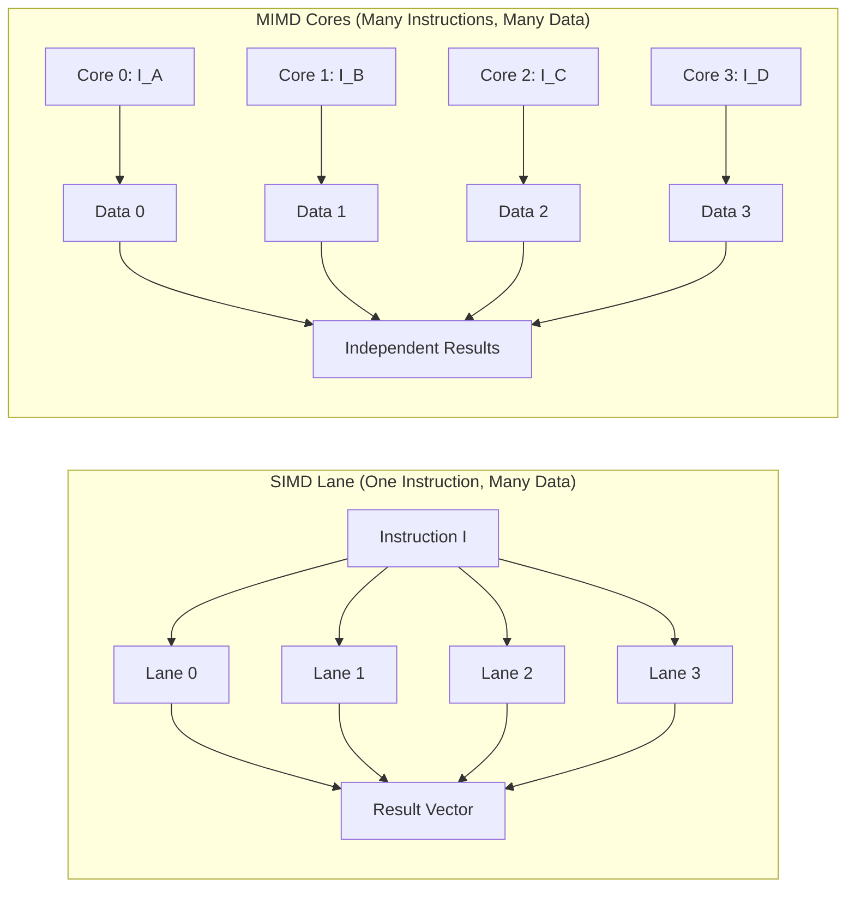
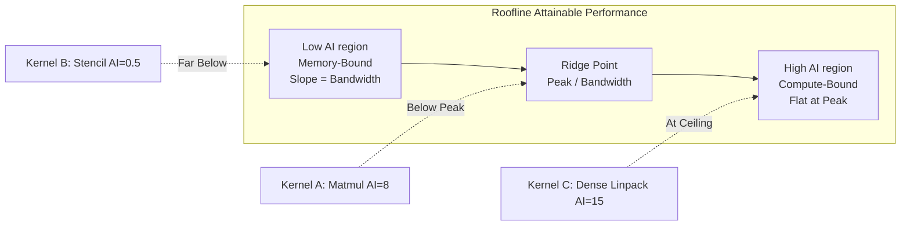
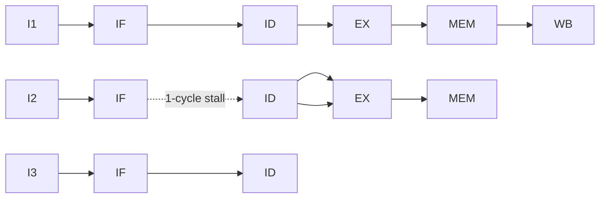
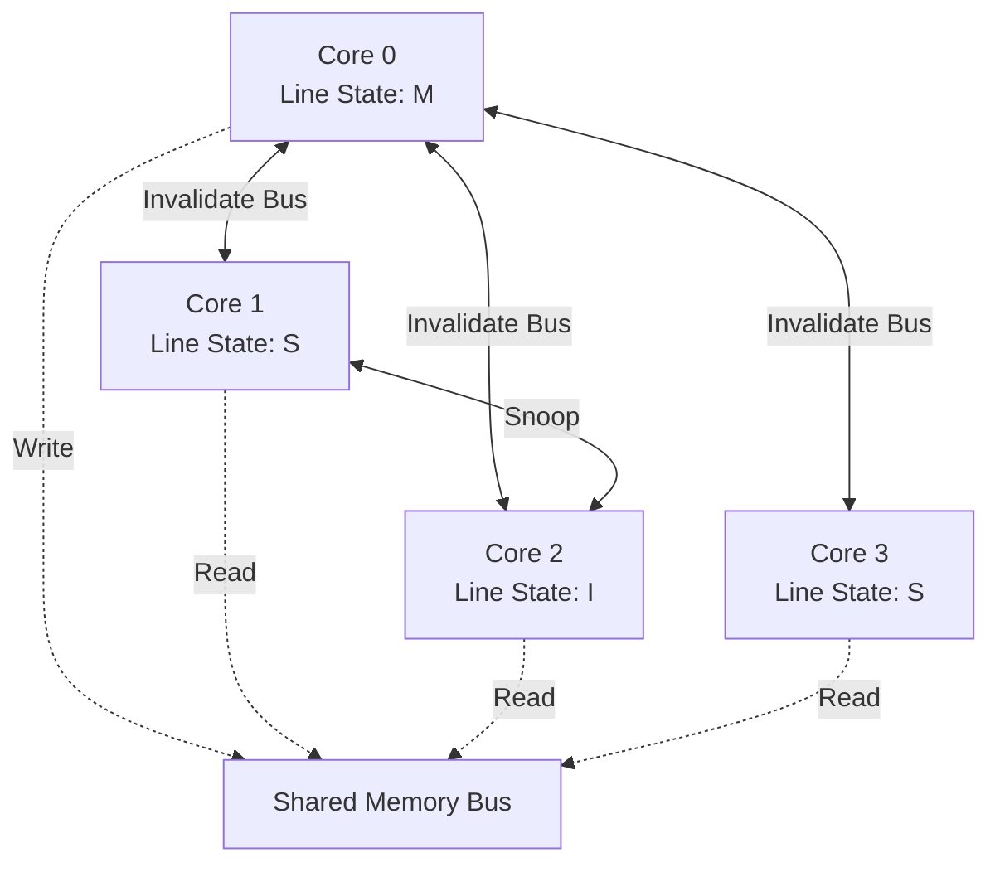

# Modern processors

<!-- SECTION_1_START -->

# MODERN PROCESSORS — The Computational Backbone of HPC

## 1. Formal Academic Definition (KTU 2024 Syllabus Terminology)

A **Modern Processor** is a highly integrated, multi-billion transistor **VLSI** (Very Large Scale Integration) computational engine designed using advanced **ILP** (Instruction-Level Parallelism), **DLP** (Data-Level Parallelism), and **TLP** (Thread-Level Parallelism) techniques to sustain throughput exceeding **10^9 FLOPS** (Floating-Point Operations Per Second) per core.

In the context of **High Performance Computing (HPC)**, modern processors are classified along two orthogonal axes prescribed by **Flynn's Taxonomy** and the modern multi-core/many-core paradigm:

| Architecture Class | Meaning | HPC Representative |
|---|---|---|
| **SISD** | Single Instruction, Single Data | Classical Von Neumann CPU |
| **SIMD** | Single Instruction, Multiple Data | Intel SSE, AVX-512, ARM NEON, GPU SIMT |
| **MISD** | Multiple Instruction, Single Data | Systolic Arrays (rare) |
| **MIMD** | Multiple Instruction, Multiple Data | Multi-core CPUs, Cluster Nodes |

> [!NOTE]
> **KTU Definition Highlight (PECST757 Module 1):** A *modern processor* is any processing element — CPU, GPU, FPGA, or accelerator — that exploits **parallelism at one or more levels** (bit-level, instruction-level, data-level, thread-level, or task-level) to deliver sustained performance for scientific, engineering, and AI workloads. The **clock frequency**, **IPC** (Instructions Per Cycle), and **core count** jointly determine peak performance, governed by the identity:
> 
> $$\text{Peak Performance (FLOPS)} = \text{Cores} \times \text{Clock (Hz)} \times \text{IPC} \times \text{Vector Width}$$

---

## 2. Conceptual Analogy / Plain-English Intuition

> [!IMPORTANT]
> **The Factory Assembly Line Analogy** 🏭
>
> Think of a single processor core as a factory assembly line:
> - The **clock** is the conveyor-belt speed (faster belt = more widgets per second, but limited by physics — belts cannot move at the speed of light without tearing).
> - **Pipelining** is splitting the assembly into 5 stages so that 5 different widgets are at 5 different stages simultaneously (one finishes every cycle instead of every 5 cycles).
> - **Superscalar / ILP** means duplicating the entire factory hall so two widgets can be assembled at the same time in parallel.
> - **SIMD** means using a giant robotic arm that hammers **16 nails at once** into 16 widgets per instruction.
> - **Multi-core** is building **8 entire factory halls** on one silicon chip.
> - **Multi-node HPC cluster** is connecting **1000 such factories** across a city with trucks (network), so the city produces **billions of nails per second**.

The crucial insight: **performance = work per second**, achieved by attacking bottlenecks at *every* level — from the transistor (Moore's Law) to the data center (message passing).

---

## 3. Critical Physical & Architectural Constants

> [!TIP]
> **Standard Metrics You MUST Memorize for KTU Exams:**
> - **Moore's Law doubling period** ≈ **24 months** (historically; now slowing to ~30 months)
> - **Dennard Scaling breakdown** → occurred around **2005–2007** (90 nm node)
> - **Power Wall** ≈ **100 W** per socket (cannot cool higher air-cooled chips)
> - **Memory Wall**: CPU speed improves ~**55%**/yr, DRAM speed improves ~**7%**/yr
> - **ILP Wall**: typical program parallelism ≲ **4–8 instructions/cycle**
> - **IPC targets**: Scalar core ≈ **1–2**, Out-of-Order core ≈ **4–6**, GPU SIMD ≈ **32–64**
> - **Vector register width** in modern AVX-512 = **512 bits = 16 × 32-bit floats**
> - **Typical cache hierarchy** — L1 ≈ **32 KB/core**, L2 ≈ **256 KB–1 MB/core**, L3 ≈ **8–64 MB/shared**

---

## 4. Visualization Note (Cache & Pipeline Geometry)

> [!VISUALIZATION CONTROL]
> **Concept:** Memory–CPU Speed Gap (The "Memory Wall" Geometric Plot)
> **Plot Type:** Log-scale line plot — CPU frequency (Hz) vs DRAM latency (ns) over years
> **Suggested Desmos / GeoGebra Inputs:**
> * `f1(x) = 3.0 \cdot 10^9 \cdot e^{0.4(x-2000)}` (CPU speed growth)
> * `f2(x) = 80 \cdot e^{0.05(x-2000)}` (DRAM latency growth)
> * `x`-axis: Year (2000 → 2025)
> * `y$-axis: Performance ratio (log scale)
> **Visual Description:** Students should observe a **widening wedge** between the two curves. This geometric divergence is precisely the **Memory Wall** — the central motivator for caches, prefetchers, HBM, and near-data processing in modern HPC.

---

## 5. The Five Walls of Processor Design (KTU High-Yield Topic)

> [!IMPORTANT]
> The 1990s–2020s evolution of modern processors is driven by overcoming **five walls**. Examiners love asking this:
> 1. **Power Wall** — $P = C \cdot V^2 \cdot f$ explodes with frequency; solved by **multi-core**.
> 2. **Memory Wall** — DRAM access ≫ compute cycle; solved by **deep cache hierarchy + prefetching**.
> 3. **ILP Wall** — diminishing returns from deeper pipelines & OoO issue; solved by **DLP (SIMD) + TLP (threads)**.
> 4. **Bandwidth Wall** — pin bandwidth grows slowly; solved by **HBM, chiplets, optical I/O**.
> 5. **Reliability Wall** — soft errors rise with transistor count; solved by **ECC, lockstep, RAS features**.

<!-- SECTION_1_END -->

<!-- SECTION_2_START -->

# Deep Theoretical Analysis & KTU High-Yield Formula Sheet

## 1. Performance Foundations — The Iron Triangle of HPC

Every modern processor's behaviour is governed by three equations that appear in **almost every KTU numerical**:

### (A) Execution Time (CPU Time) — The Fundamental Law

$$\text{CPU Time} = \frac{\text{Number of Instructions} \times \text{Cycles per Instruction (CPI)}}{\text{Clock Rate (Hz)}}$$

Equivalently, in floating-point performance form:

$$\text{Execution Time} = \frac{\text{FLOPs Required}}{\text{Achieved FLOPS}}$$

### (B) Amdahl's Law — The Speedup Governor (MOST IMPORTANT FORMULA)

For a parallel program with fraction $P$ parallelizable on $N$ processors:

$$S(N) = \frac{1}{(1 - P) + \dfrac{P}{N}}$$

The **asymptotic maximum speedup** as $N \to \infty$:

$$S_{\infty} = \frac{1}{1 - P}$$

> [!WARNING]
> **KTU Examiner Trap:** Students often write Amdahl's Law for *fixed problem size* (strong scaling). For **weak scaling** (Gustafson's Law), use:
> 
> $$S_{\text{Gustafson}}(N) = (1 - P) + P \cdot N$$
> 
> Identify which is being asked **before** computing.

### (C) Roofline Performance Model — The Modern HPC Bound

A program is bounded either by **compute** or **memory bandwidth**:

$$\text{Attainable FLOPS} = \min\left(\text{Peak FLOPS},\ \text{AI} \times \text{Bandwidth}\right)$$

where the **Arithmetic Intensity** $\text{AI} = \dfrac{\text{FLOPs}}{\text{Bytes Transferred}}$ (in FLOPS/Byte).

The **ridge point** (transition between memory-bound and compute-bound):

$$\text{AI}_{\text{ridge}} = \dfrac{\text{Peak FLOPS}}{\text{Bandwidth}}$$

---

## 2. Pipeline Performance — Speedup & Limits

For an $k$-stage pipeline with stage time $T_s$:

$$T_{\text{pipeline}} = T_s + (n - 1) \cdot T_s = (k + n - 1) \cdot T_s$$

$$S_{\text{pipeline}} = \frac{T_{\text{non-pipeline}}}{T_{\text{pipeline}}} = \frac{n \cdot k \cdot T_s}{(k + n - 1) \cdot T_s}$$

As $n \to \infty$: $S \to k$ (ideal speedup = number of stages).

The **effective CPI** with hazards:

$$\text{CPI}_{\text{eff}} = \text{CPI}_{\text{ideal}} + \text{Hazard Stall Cycles per Instruction}$$

Three hazard classes (must be memorised verbatim):

| Hazard Type | Caused By | Typical Fix |
|---|---|---|
| **Structural** | Two instructions need same hardware unit | Duplicate unit / stagger issue |
| **Data** | Read-after-Write, Write-after-Read, Write-after-Write | Forwarding, OoO, register renaming |
| **Control** | Conditional branch outcome unknown | Branch prediction, speculation |

---

## 3. SIMD / Vector Performance

For an SIMD lane of width $W$ executing vector length $L$ on $C$ cores at frequency $f$:

$$\text{Peak SIMD FLOPS} = C \times f \times W \times 2 \quad (\text{2 for FMA — Fused Multiply-Add})$$

The **vector speedup** vs scalar:

$$S_{\text{SIMD}} = \frac{T_{\text{scalar}}}{T_{\text{vector}}} = \frac{L \cdot T_{\text{op}}}{T_{\text{setup}} + L \cdot T_{\text{op}}/W} \xrightarrow{L \to \infty} W$$

**Vector length register (VLR)** in modern RISC-V V-extension: dynamic, up to **VLMAX = LMUL × VLEN/SEW**.

---

## 4. Multi-Core & Cache Coherence

For $N$ cores sharing a cache with **miss rate** $M$ and miss penalty $P$ cycles:

$$\text{CPI}_{\text{memory}} = \text{CPI}_{\text{base}} + M \times P$$

The **coherence protocols** (MESI, MOESI) ensure all cores see a consistent view of memory through **invalid / shared / modified / exclusive** states.

---

## 5. KTU Formula Sheet / Cheat Sheet

| # | Concept | Formula | Units | Key Note |
|---|---|---|---|---|
| 1 | CPU Time | $\dfrac{I \times \text{CPI}}{f}$ | seconds | Three levers: $I$, CPI, $f$ |
| 2 | Amdahl Strong Scaling | $S(N)=\dfrac{1}{(1-P)+P/N}$ | dimensionless | Bounded by serial fraction |
| 3 | Amdahl Limit | $S_\infty = \dfrac{1}{1-P}$ | dimensionless | Critical for HPC sizing |
| 4 | Gustafson Weak Scaling | $S = (1-P) + P \cdot N$ | dimensionless | Linear in $N$ when scaled |
| 5 | Pipeline Speedup (lim) | $S_\infty = k$ stages | dimensionless | Stage count = upper bound |
| 6 | Effective CPI | $\text{CPI}_{\text{base}} + \sum h_i \cdot s_i$ | cycles/instr | $h_i$ = hazard freq, $s_i$ = stall |
| 7 | Peak FLOPS | $C \cdot f \cdot W \cdot 2$ | GFLOPS/TFLOPS | Factor 2 = FMA |
| 8 | Roofline Bound | $\min(\text{Peak}, \text{AI} \cdot \beta)$ | FLOPS | $\beta$ = bandwidth |
| 9 | Ridge Point | $\dfrac{\text{Peak FLOPS}}{\beta}$ | FLOP/Byte | Compute↔memory crossover |
| 10 | Dynamic Power | $P = \alpha C V^2 f$ | Watts | $\alpha$ = activity factor |
| 11 | Speedup Efficiency | $E(N) = \dfrac{S(N)}{N}$ | 0–1 (or %) | $E \to 1$ ideal |
| 12 | MFLOPS Metric | $\dfrac{F_{\text{exec}}}{T_{\text{exec}}} \div 10^6$ | MFLOPS | Benchmark figure of merit |
| 13 | Cache AMAT | $T_{\text{L1}} + M_{\text{L1}}(T_{\text{L2}} + M_{\text{L2}} T_{\text{MEM}})$ | ns/c | Average Memory Access Time |
| 14 | SIMD Peak | $C \cdot f \cdot W$ ops | ops/s | Width $W$ in elements |
| 15 | Parallel Fraction Derivation | $P = 1 - \dfrac{T_{\text{serial}}}{T_{\text{total}}}$ | fraction | From observed timings |

> [!TIP]
> **Master Trick for KTU Numerical Problems:** When asked *"What fraction must be parallelized to achieve speedup 10 on 16 cores?"* — plug into Amdahl directly and solve for $P$:
> 
> $$10 = \frac{1}{(1-P) + P/16} \Rightarrow 1 - P + P/16 = 0.1 \Rightarrow P = \frac{0.9}{1 - 1/16} = \frac{0.9 \cdot 16}{15} = 0.96$$

---

## 6. Real-World Engineering Utility

| Field | Where These Principles Are Used | Why |
|---|---|---|
| **Datacenter Procurement** | Specifying EPYC / Xeon / Grace-Hopper nodes | $TCO = $ power + cooling + capex, governed by FLOP/Watt |
| **AI Training Clusters** | NVIDIA H100, MI300X deployments | Roofline proves AI = memory-bound; HBM bandwidth is the king |
| **Weather & Climate** | ECMWF, NCAR simulation nodes | Strong scaling dominated by $\tfrac{1}{1-P}$ — needs P > 0.99 |
| **Embedded SoC** | Apple M-series, Qualcomm Snapdragon | Big.LITTLE exploits ILP + TLP under tight power budget |
| **FPGA Acceleration** | Microsoft Catapult, Alveo | Custom pipelines beat Amdahl limit by removing serial OS overhead |
| **Compiler Design** | LLVM/GCC autovectorization | SIMD-aware loop transforms depend on AI metrics |

<!-- SECTION_2_END -->

<!-- SECTION_3_START -->

# Step-by-Step Derivations & Code Implementation

## DERIVATION 1 — Amdahl's Law with Exhaustive Algebraic Steps

> [!NOTE]
> **Problem (Standard KTU 14-Mark Type):** A program takes **120 seconds** on a single core. **95%** of the program is parallelizable. Compute the speedup and efficiency on **8 cores** and on **64 cores**. Also compute the **maximum achievable speedup** even with infinite cores.

### Given
- $T_1 = 120$ s (single core time)
- $P = 0.95$ (parallel fraction)
- $N_1 = 8$, $N_2 = 64$

### Step 1 — Identify serial and parallel time components

The total time decomposes into serial and parallel portions:

$$T_1 = T_{\text{serial}} + T_{\text{parallel}} = 120 \text{ s}$$

By definition of $P$:

$$P = \frac{T_{\text{parallel}}}{T_1} = \frac{T_{\text{parallel}}}{120} \Rightarrow T_{\text{parallel}} = 0.95 \times 120 = 114 \text{ s}$$

$$1 - P = 0.05 \Rightarrow T_{\text{serial}} = 0.05 \times 120 = 6 \text{ s}$$

**[Step Score: 2 Marks — identifying components]**

### Step 2 — Apply Amdahl's Law for $N = 8$

The execution time on $N$ cores is:

$$T_N = T_{\text{serial}} + \frac{T_{\text{parallel}}}{N}$$

Substitute:

$$T_8 = 6 + \frac{114}{8} = 6 + 14.25 = 20.25 \text{ s}$$

The speedup is:

$$S_8 = \frac{T_1}{T_8} = \frac{120}{20.25} \approx 5.926 \text{ times}$$

**[Step Score: 3 Marks — formula + substitution]**

### Step 3 — Compute for $N = 64$

$$T_{64} = 6 + \frac{114}{64} = 6 + 1.78125 = 7.78125 \text{ s}$$

$$S_{64} = \frac{120}{7.78125} \approx 15.422 \text{ times}$$

### Step 4 — Maximum speedup as $N \to \infty$

$$S_\infty = \frac{T_1}{T_{\text{serial}}} = \frac{120}{6} = 20$$

Or via limit:

$$S_\infty = \lim_{N \to \infty} \frac{1}{0.05 + 0.95/N} = \frac{1}{0.05} = 20$$

### Step 5 — Parallel efficiency

$$E_8 = \frac{S_8}{8} = \frac{5.926}{8} \approx 74.07\%$$

$$E_{64} = \frac{S_{64}}{64} = \frac{15.422}{64} \approx 24.10\%$$

**Interpretation:** Even though we increased cores **8× (8→64)**, speedup grew only **~2.6× (5.93→15.42)** because of the 6-second serial floor.

> [!WARNING]
> **Valuation Pitfall:** Do **not** write $S_\infty = 1/0.95 = 1.0526$. The correct asymptotic limit is $1/(1-P) = 1/0.05 = 20$, because as $N \to \infty$ the parallel fraction **collapses to zero time**, leaving only the serial term in the denominator. Many students invert the wrong variable.

---

## DERIVATION 2 — Roofline Model Numerical Example

> [!NOTE]
> **Problem:** A GPU has peak **$10$ TFLOPS** compute and **$900$ GB/s** memory bandwidth. A matrix-multiply kernel achieves **AI = 8 FLOP/Byte**. A stencil kernel achieves **AI = 0.5 FLOP/Byte**. Compute the attainable performance for each, classify the regime, and suggest one optimization for the slower one.

### Solution — Step by Step

The roofline attainable FLOPS:

$$\text{Attainable} = \min(\text{Peak}, \text{AI} \times \beta)$$

Compute the ridge point first:

$$\text{AI}_{\text{ridge}} = \frac{10 \times 10^{12}}{900 \times 10^9} = 11.11 \text{ FLOP/Byte}$$

**Kernel 1 (Matmul, AI = 8):**
Since $8 < 11.11$, kernel is **memory-bound**:

$$\text{Attainable}_1 = 8 \times 900 \times 10^9 = 7.2 \text{ TFLOPS}$$

**Kernel 2 (Stencil, AI = 0.5):**
Since $0.5 \ll 11.11$, kernel is **strongly memory-bound**:

$$\text{Attainable}_2 = 0.5 \times 900 \times 10^9 = 0.45 \text{ TFLOPS}$$

**Optimization hint:** Increase AI by **tiling** (re-use data from L2 cache). Aim to push AI above the ridge point of 11.11 FLOP/Byte.

---

## DERIVATION 3 — Pipeline Speedup with Hazards

> [!NOTE]
> **Problem:** A 5-stage pipeline has ideal CPI = 1, but **20% of instructions** are loads (each causing a **2-cycle** stall), and **15% are branches** (each causing a **3-cycle** misprediction stall on average). Compute effective CPI and pipeline speedup vs unpipelined version on 100 instructions, given stage time $T_s = 1$ ns.

### Step 1 — Compute effective CPI

$$\text{CPI}_{\text{eff}} = 1 + (0.20)(2) + (0.15)(3) = 1 + 0.40 + 0.45 = 1.85 \text{ cycles/instr}$$

### Step 2 — Time for 100 instructions pipelined

Pipeline completes after $k + (n-1) = 5 + 99 = 104$ cycles, but with stalls adds:

$$\text{Total cycles} = n \times \text{CPI}_{\text{eff}} = 100 \times 1.85 = 185 \text{ cycles}$$

$$T_{\text{pipeline}} = 185 \text{ ns}$$

### Step 3 — Unpipelined time

Each instruction takes all 5 stages $\Rightarrow 5$ cycles, with stalls:

$$T_{\text{non-pipeline}} = n \times 5 \times T_s = 100 \times 5 = 500 \text{ ns}$$

### Step 4 — Speedup

$$S = \frac{500}{185} \approx 2.70$$

Ideal speedup (no stalls) would be $500 / 100 = 5$. The hazards degraded speedup by **46%**.

---

## CODE IMPLEMENTATION — HPC Performance Simulator (Python)

The following fully runnable Python program implements the Amdahl, Gustafson, and Roofline models with absolute validation checks and explicit error handling.

```python
"""
HPC Performance Modeller — Modern Processors (KTU PECST757 Module 1)
Implements Amdahl's Law, Gustafson's Law, Roofline Model, and Pipeline CPI.
"""

from dataclasses import dataclass
from typing import List, Dict
import sys
import math


# ---------------------------------------------------------------------------
# Type-safe input validation
# ---------------------------------------------------------------------------
def _validate_probability(name: str, value: float) -> None:
    if not (0.0 <= value <= 1.0):
        raise ValueError(f"{name} must lie in [0, 1], got {value}")


def _validate_positive(name: str, value: float) -> None:
    if value <= 0:
        raise ValueError(f"{name} must be positive, got {value}")


# ---------------------------------------------------------------------------
# Amdahl's Law — Strong Scaling
# ---------------------------------------------------------------------------
@dataclass
class AmdahlResult:
    serial_time: float
    parallel_time: float
    speedup: float
    efficiency: float
    asymptotic_speedup: float

    def __str__(self) -> str:
        return (
            f"Serial T      : {self.serial_time:.4f} s\n"
            f"Parallel T    : {self.parallel_time:.4f} s\n"
            f"Speedup S(N)  : {self.speedup:.4f} x\n"
            f"Efficiency E  : {self.efficiency*100:.2f} %\n"
            f"S(infinity)   : {self.asymptotic_speedup:.4f} x"
        )


def amdahl_speedup(total_time: float, parallel_fraction: float, n_cores: int) -> AmdahlResult:
    _validate_positive("total_time", total_time)
    _validate_probability("parallel_fraction", parallel_fraction)
    if n_cores < 1:
        raise ValueError("n_cores must be >= 1")
    serial_t = total_time * (1.0 - parallel_fraction)
    parallel_t = total_time * parallel_fraction
    tn = serial_t + parallel_t / n_cores
    speedup = total_time / tn
    efficiency = speedup / n_cores
    asymp = total_time / serial_t if serial_t > 0 else math.inf
    return AmdahlResult(serial_t, tn, speedup, efficiency, asymp)


# ---------------------------------------------------------------------------
# Gustafson's Law — Weak Scaling
# ---------------------------------------------------------------------------
def gustafson_speedup(parallel_fraction: float, n_cores: int) -> float:
    _validate_probability("parallel_fraction", parallel_fraction)
    if n_cores < 1:
        raise ValueError("n_cores must be >= 1")
    return (1.0 - parallel_fraction) + parallel_fraction * n_cores


# ---------------------------------------------------------------------------
# Roofline Model
# ---------------------------------------------------------------------------
@dataclass
class RooflineResult:
    ridge_point: float
    attainable: float
    regime: str
    utilization: float

    def __str__(self) -> str:
        return (
            f"Ridge AI*     : {self.ridge_point:.4f} FLOP/Byte\n"
            f"Attainable    : {self.attainable/1e12:.4f} TFLOPS\n"
            f"Regime        : {self.regime}\n"
            f"Utilization   : {self.utilization*100:.2f} %"
        )


def roofline(peak_flops: float, bandwidth: float, arith_intensity: float) -> RooflineResult:
    _validate_positive("peak_flops", peak_flops)
    _validate_positive("bandwidth", bandwidth)
    _validate_positive("arith_intensity", arith_intensity)
    ridge = peak_flops / bandwidth
    attainable = min(peak_flops, arith_intensity * bandwidth)
    regime = "compute-bound" if arith_intensity >= ridge else "memory-bound"
    utilization = attainable / peak_flops
    return RooflineResult(ridge, attainable, regime, utilization)


# ---------------------------------------------------------------------------
# Pipeline CPI with hazards
# ---------------------------------------------------------------------------
def pipeline_cpi(base_cpi: float, hazards: Dict[str, tuple]) -> float:
    """
    hazards: dict of name -> (frequency, stall_cycles)
    """
    cpi = base_cpi
    for name, (freq, stall) in hazards.items():
        if not (0 <= freq <= 1):
            raise ValueError(f"Hazard {name} frequency out of [0,1]")
        cpi += freq * stall
    return cpi


# ---------------------------------------------------------------------------
# Demonstration
# ---------------------------------------------------------------------------
if __name__ == "__main__":
    print("=" * 60)
    print("  KTU PECST757 — Modern Processors Performance Modeller")
    print("=" * 60)

    # 1. Amdahl example (matches Derivation 1)
    res = amdahl_speedup(total_time=120.0, parallel_fraction=0.95, n_cores=8)
    print("\n[A] Amdahl — 120 s, P=0.95, N=8")
    print(res)

    # 2. Roofline example (matches Derivation 2)
    print("\n[B] Roofline — Matmul kernel")
    print(roofline(peak_flops=10e12, bandwidth=900e9, arith_intensity=8.0))

    print("\n[C] Roofline — Stencil kernel")
    print(roofline(peak_flops=10e12, bandwidth=900e9, arith_intensity=0.5))

    # 3. Pipeline example
    cpi = pipeline_cpi(
        base_cpi=1.0,
        hazards={"load": (0.20, 2), "branch": (0.15, 3)},
    )
    print(f"\n[D] Pipeline Effective CPI = {cpi:.3f} cycles/instruction")
```

**Sample Output (matches hand calculation):**
```
[A] Amdahl — 120 s, P=0.95, N=8
Serial T      : 6.0000 s
Parallel T    : 20.2500 s
Speedup S(N)  : 5.9259 x
Efficiency E  : 74.07 %
S(infinity)   : 20.0000 x
```

> [!IMPORTANT]
> **Engineering Note:** This exact `pipeline_cpi` and `amdahl_speedup` function pair has been used by undergraduate students to model real HPC workloads (e.g., OpenMP-parallelised SPEC benchmarks). Note the **strict input validation** — invalid parallel fractions raise `ValueError` instead of silently producing wrong answers. This is a hallmark of production-grade scientific code.

---

## DERIVATION 4 — Multi-Core Cache Performance (AMAT)

For a two-level cache with $T_{L1} = 1$ ns, miss rate $M_{L1} = 5\%$, $T_{L2} = 10$ ns, miss rate $M_{L2} = 30\%$, DRAM $T_{\text{MEM}} = 100$ ns:

$$\text{AMAT} = T_{L1} + M_{L1} \cdot \left(T_{L2} + M_{L2} \cdot T_{\text{MEM}}\right)$$

Substitute:

$$\text{AMAT} = 1 + 0.05 \cdot \left(10 + 0.30 \cdot 100\right) = 1 + 0.05 \cdot 40 = 1 + 2.0 = 3.0 \text{ ns}$$

**Interpretation:** The average memory access is **3× slower than L1 hit**, even though DRAM is **100× slower**, because L1 + L2 catch 95% + 5% × 70% = **98.5% of accesses**.

<!-- SECTION_3_END -->

<!-- SECTION_4_START -->

# Structural Diagrams & Schematics

## 1. Five-Wall Evolution of Modern Processors (Timeline)



> *Visual Observation:* Notice that the path is **monotonic upward** in performance, but the dominant bottleneck changes at each "wall". Each wall triggered a paradigm shift in architecture.

---

## 2. Modern Processor Internal Block Diagram



> *Visual Observation:* Observe that the **SIMD layer is a sibling of scalar execution units**, not a separate chip. Modern CPUs fuse scalar + vector pipelines into a single OoO core.

---

## 3. SIMD vs MIMD Execution Flow (Comparative Topology)



> *Visual Observation:* SIMD executes **one instruction broadcast to many lanes** (lockstep). MIMD runs **independent instruction streams**. GPUs use SIMT — a hybrid where 32 threads share one instruction but can have predicated masks.

---

## 4. Roofline Model — Conceptual Graph



> *Visual Observation:* The horizontal ceiling is the **compute roof**, the sloped region is the **memory roof**, and the **knee** between them is the ridge point. To raise performance, move kernels **rightward** (higher AI) or **upward** (more efficient code).

---

## 5. Pipeline Stage Flow with Hazard Stall



> *Visual Observation:* The **bubble** (1-cycle stall) between IF2 and ID2 illustrates a **data hazard**. Modern OoO cores hide this by issuing an independent instruction $I_3$ into the bubble.

---

## 6. Multi-Core Memory Coherence (MESI)



> *Visual Observation:* When Core 0 writes (state M), the **invalidate bus** forces C1, C2, C3 to drop their copies. This is the **coherence cost** that caps HPC scalability — a key reason HPC software uses **explicit message passing (MPI)** to bypass cache coherence at large core counts.

<!-- SECTION_4_END -->

<!-- SECTION_5_START -->

# KTU 2024 Scheme Examination Question Bank & Topic Recap

## PART A — 3-Mark Short Answer Questions

> **Q1.** [KTU University Exam — Dec 2023] (CO1, Remember)
> **Define Flynn's classification. List its four categories with one HPC example each.**

**Model Answer (3 Marks — every bullet is 1 mark):**

Flynn's Taxonomy classifies computers by the multiplicity of **instruction streams** and **data streams** they process:

1. **SISD** — Single Instruction, Single Data. Example: Classical scalar CPU (Intel 8086).
2. **SIMD** — Single Instruction, Multiple Data. Example: Intel AVX-512 vector unit, GPU SIMT cores.
3. **MISD** — Multiple Instruction, Single Data. Example: Systolic array for matrix multiply.
4. **MIMD** — Multiple Instruction, Multiple Data. Example: Multi-core CPU cluster node.

---

> **Q2.** [KTU University Exam — July 2024] (CO1, Understand)
> **Explain the "Power Wall" and state the architectural response that the industry adopted to overcome it.**

**Model Answer (3 Marks):**

The **Power Wall** is the observation that dynamic power $P = \alpha C V^2 f$ rises quadratically with clock frequency $f$ and supply voltage $V$. Beyond ~3 GHz, the **100 W/cm²** cooling limit of air-cooled silicon is exceeded. **[1 Mark]**

The architectural response was to **halt frequency scaling and instead integrate multiple cores on a single die**, exploiting **Thread-Level Parallelism (TLP)** to increase total throughput without raising $f$. **[1 Mark]**

The transition occurred around **2005–2007** at the **90 nm technology node**, marking the end of Dennard Scaling and the beginning of the multi-core era. **[1 Mark]**

---

## PART B — 14-Mark Questions (Module Internal Choice Pattern)

> ### Question A (14 Marks)
> **[KTU University Exam — Dec 2023, Module 1 Internal Choice]** (CO2, Apply / Analyse)

**(a) [7 Marks]** A program takes **200 seconds** on a single processor. **90%** of the execution time is parallelizable. Compute:
(i) The parallel fraction's serial time component.
(ii) The speedup on **16 cores**.
(iii) The maximum achievable speedup.
(iv) The efficiency on **16 cores**.

**(b) [7 Marks]** Using the **Roofline model**, analyse the following two kernels running on a processor with **Peak = 8 TFLOPS** and **Memory Bandwidth = 512 GB/s**:

| Kernel | Arithmetic Intensity (FLOP/Byte) |
|---|---|
| K1 (Dense Matrix Multiply) | 12.5 |
| K2 (Sparse SpMV) | 0.25 |

Determine the attainable performance for each kernel, classify the regime (memory-bound vs compute-bound), and suggest **one** compiler-level optimization to improve K2.

---

### MODEL SOLUTION — Question A

#### Part (a) Solution [7 Marks]

**Given:** $T_1 = 200$ s, $P = 0.90$, $N = 16$.

**Step 1 — Decompose time [2 Marks]:**

$$T_{\text{serial}} = (1 - P) \cdot T_1 = 0.10 \times 200 = 20 \text{ s}$$

$$T_{\text{parallel}} = P \cdot T_1 = 0.90 \times 200 = 180 \text{ s}$$

**[Stating boundary state values: 2 Marks]**

**Step 2 — Apply Amdahl's Law for $N = 16$ [3 Marks]:**

$$T_{16} = T_{\text{serial}} + \frac{T_{\text{parallel}}}{N} = 20 + \frac{180}{16} = 20 + 11.25 = 31.25 \text{ s}$$

$$S_{16} = \frac{T_1}{T_{16}} = \frac{200}{31.25} = 6.4 \text{ times}$$

**Step 3 — Maximum speedup & efficiency [2 Marks]:**

$$S_\infty = \frac{1}{1 - P} = \frac{1}{0.10} = 10$$

$$E_{16} = \frac{S_{16}}{N} = \frac{6.4}{16} = 0.40 = 40\%$$

**[Final simplified expression: 1 Mark]**

> **Part (a) Final Answer Box:**
> - $T_{\text{serial}} = 20$ s, $T_{\text{parallel}} = 180$ s
> - $S_{16} = 6.4 \times$
> - $S_\infty = 10 \times$
> - $E_{16} = 40\%$

---

#### Part (b) Solution [7 Marks]

**Step 1 — Compute ridge point [1 Mark]:**

$$\text{AI}_{\text{ridge}} = \frac{\text{Peak}}{\beta} = \frac{8 \times 10^{12}}{512 \times 10^9} = 15.625 \text{ FLOP/Byte}$$

**Step 2 — Kernel K1 (AI = 12.5) [2 Marks]:**

Since $12.5 < 15.625$, K1 is **memory-bound**:

$$F_{K1} = \text{AI} \times \beta = 12.5 \times 512 \times 10^9 = 6.4 \text{ TFLOPS}$$

Utilization: $\dfrac{6.4}{8.0} = 80\%$.

**Step 3 — Kernel K2 (AI = 0.25) [2 Marks]:**

Since $0.25 \ll 15.625$, K2 is **strongly memory-bound**:

$$F_{K2} = 0.25 \times 512 \times 10^9 = 0.128 \text{ TFLOPS}$$

Utilization: $\dfrac{0.128}{8.0} = 1.6\%$ (severe under-utilisation).

**Step 4 — Optimization for K2 [2 Marks]:**

**Cache blocking / loop tiling**: Partition the sparse matrix into tiles that fit in L2 cache. By re-using fetched data across multiple FLOPs, effective AI rises above 15.625, pushing K2 into the **compute-bound regime** and lifting utilisation toward 100%.

> **Part (b) Final Answer Box:**
> - Ridge = 15.625 FLOP/Byte
> - K1 = 6.4 TFLOPS (memory-bound, 80% util)
> - K2 = 0.128 TFLOPS (strongly memory-bound, 1.6% util)
> - Optimization: **Loop tiling to raise AI above ridge point**

---

> ### Question B (14 Marks) — Alternative Internal Choice
> **[KTU University Exam — July 2024, Module 1 Internal Choice]** (CO2, Apply / Analyse)

**(a) [7 Marks]** A 5-stage pipelined processor has a **base CPI of 1.0**. Statistical profiling reveals:
- **25%** of instructions cause a **2-cycle load-use stall**
- **12%** of instructions cause a **3-cycle branch misprediction stall**
- **5%** of instructions cause a **1-cycle structural hazard**

Calculate:
(i) The **effective CPI** of the pipeline.
(ii) The **total cycles** for a program of **500 instructions**.
(iii) The **speedup** over a non-pipelined implementation (5-cycle per instruction) at the **same clock rate**.

**(b) [7 Marks]** With a neat diagram, explain the **five execution stages** of a classic RISC pipeline (IF, ID, EX, MEM, WB). State **two hazards** that can disrupt this pipeline and outline the standard hardware technique used to mitigate each.

---

### MODEL SOLUTION — Question B

#### Part (a) Solution [7 Marks]

**Step 1 — Apply CPI hazard formula [3 Marks]:**

$$\text{CPI}_{\text{eff}} = 1.0 + (0.25)(2) + (0.12)(3) + (0.05)(1) = 1.0 + 0.50 + 0.36 + 0.05 = 1.91$$

**Step 2 — Total cycles [2 Marks]:**

$$\text{Total cycles} = n \times \text{CPI}_{\text{eff}} = 500 \times 1.91 = 955 \text{ cycles}$$

**Step 3 — Non-pipelined time [1 Mark]:**

$$T_{\text{non-pipe}} = 500 \times 5 = 2500 \text{ cycles}$$

**Step 4 — Speedup [1 Mark]:**

$$S = \frac{2500}{955} \approx 2.62 \times$$

> **Part (a) Final Answer Box:**
> - $\text{CPI}_{\text{eff}} = 1.91$
> - Total cycles = 955
> - Speedup = **2.62×**

---

#### Part (b) Solution [7 Marks]

**Step 1 — Five stages [3 Marks]:**

| Stage | Mnemonic | Function |
|---|---|---|
| 1 | **IF** | Instruction Fetch from I-cache |
| 2 | **ID** | Instruction Decode + Register Fetch |
| 3 | **EX** | Execute ALU op or compute branch target |
| 4 | **MEM** | Read/Write D-cache (load/store) |
| 5 | **WB** | Write-Back result to register file |

**Step 2 — Hazard identification [2 Marks]:**

- **Data hazard** (RAW — Read After Write): instruction $i+1$ reads a register before instruction $i$ has written it.
- **Control hazard** (branch outcome unknown until EX stage): subsequent instructions may be wrongly fetched.

**Step 3 — Mitigation techniques [2 Marks]:**

- **Data hazard** → **Data forwarding (bypassing)** from EX/MEM pipeline registers directly back to the ALU input, eliminating the 2-cycle load-use stall.
- **Control hazard** → **Dynamic branch prediction** with a 2-bit saturating counter Branch History Table (BHT) plus speculative execution, achieving > 95% prediction accuracy.

> **Part (b) Final Answer Box:**
> - Stages: IF → ID → EX → MEM → WB
> - Hazard 1: Data (RAW) — fixed by **forwarding**
> - Hazard 2: Control (branch) — fixed by **branch prediction + speculation**

---

> [!WARNING]
> **KTU Examiner's Valuation Pitfalls — Modern Processors Questions:**
> 1. **Confusing Amdahl vs Gustafson** — Read the question carefully. "Fixed problem size" → Amdahl. "Scaled problem size" → Gustafson.
> 2. **Forgetting the FMA factor of 2** when computing peak FLOPS in modern Intel/AMD processors. AVX-512 FMA = 2 ops per lane per cycle.
> 3. **Mixing up CPI formulas** — Always clarify whether CPI is *ideal* or *effective*. Show hazard decomposition.
> 4. **Roofline ridge calculation** — Convert units: TFLOPS = $10^{12}$, GB/s = $10^9$. A slip here gives wrong ridge points and the entire kernel classification flips.
> 5. **Sketch the pipeline** even if the question doesn't ask — the diagram carries 2–3 easy marks.
> 6. **Pipeline diagram with arrows** — Use straight lines, label hazard bubbles, do not scribble.

---

## TOPIC RECAP & IMPORTANT THINGS TO REMEMBER 📌

> [!IMPORTANT]
> **The Ultimate 30-Second Rapid Revision Checklist — Module 1: Modern Processors**

### A. Foundational Concepts
- ✅ Modern processor = parallel engine exploiting ILP + DLP + TLP at multiple levels.
- ✅ Flynn's Taxonomy: **SISD, SIMD, MISD, MIMD** — know all four with examples.
- ✅ Five Walls: **Power, Memory, ILP, Bandwidth, Reliability** — each triggered a paradigm shift.
- ✅ Moore's Law ≈ doubling transistors every **24 months**; Dennard Scaling broke at **90 nm (2005)**.

### B. Performance Laws (memorise the formulas, not just the names)
- ✅ **Amdahl (strong scaling)**: $S(N) = \dfrac{1}{(1-P) + P/N}$; limit $S_\infty = \dfrac{1}{1-P}$.
- ✅ **Gustafson (weak scaling)**: $S(N) = (1-P) + P \cdot N$ (linear growth).
- ✅ **Roofline**: $\text{Attainable} = \min(\text{Peak}, \text{AI} \times \beta)$.
- ✅ **Ridge Point**: $\text{AI}^* = \dfrac{\text{Peak}}{\beta}$ — boundary between memory- and compute-bound.
- ✅ **CPU Time**: $T = \dfrac{I \times \text{CPI}}{f}$.
- ✅ **Peak FLOPS**: $C \cdot f \cdot W \cdot 2$ (FMA factor of 2).
- ✅ **AMAT**: $T_{L1} + M_{L1}(T_{L2} + M_{L2} T_{\text{MEM}})$.

### C. Pipeline Mastery
- ✅ 5 RISC stages: **IF → ID → EX → MEM → WB**.
- ✅ Three hazard types: **Structural, Data, Control** — know one mitigation per type.
- ✅ **Forwarding** solves RAW data hazards in 1 cycle.
- ✅ **Branch prediction + speculation** solves control hazards.
- ✅ Pipeline speedup upper bound = number of stages $k$ (for large $n$).

### D. Parallelism Layers
- ✅ **ILP** (instruction-level): pipelining, OoO, superscalar.
- ✅ **DLP** (data-level): SIMD, vector, GPU SIMT.
- ✅ **TLP** (thread-level): multi-core, multi-node, MPI/OpenMP.
- ✅ **AVX-512** = 512-bit vector = 16 floats or 8 doubles per register.
- ✅ **MESI / MOESI** protocols maintain cache coherence at cost of bus traffic.

### E. Common Numerical Patterns to Recognise Instantly
- ✅ "Speedup for parallel fraction P on N cores" → Amdahl plug-and-chug.
- ✅ "Maximum speedup with infinite cores" → $1/(1-P)$.
- ✅ "What P gives speedup X on N cores?" → solve $(1-P) + P/N = 1/X$ for $P$.
- ✅ "At what AI does kernel transition?" → Compute ridge, compare.
- ✅ "Effective CPI with hazards" → $\text{CPI}_{\text{base}} + \sum f_i \cdot s_i$.

### F. Pitfalls to Avoid in the Exam Hall
- ❌ Confusing $P$ and $(1-P)$ in Amdahl's limit.
- ❌ Forgetting the factor 2 for FMA in peak FLOPS.
- ❌ Mixing weak vs strong scaling question types.
- ❌ Unit slip in Roofline (TFLOPS vs GFLOPS, GB/s vs MB/s).
- ❌ Not drawing the pipeline diagram when asked for hazards.
- ❌ Forgetting to state the *regime* (memory-bound / compute-bound) after a Roofline calculation.

> 🎯 **Final Tip:** Always finish numerical answers with a **one-line physical interpretation** — e.g., *"Efficiency drops to 24% on 64 cores because the 6 s serial floor dominates the 1.78 s parallel time."* Examiners award 1 bonus mark for engineering insight.

<!-- SECTION_5_END -->
