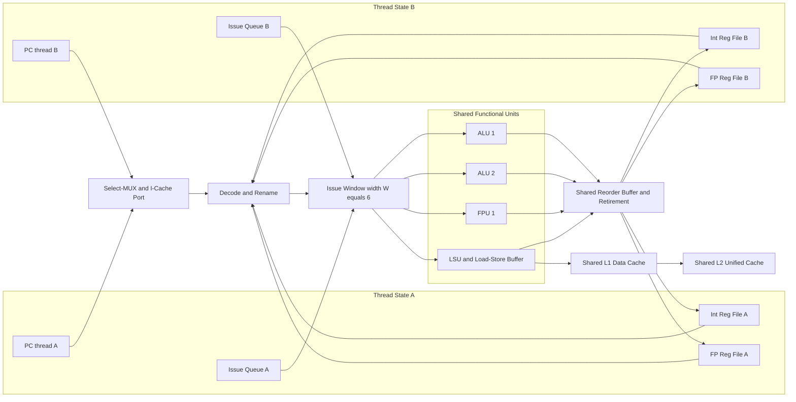
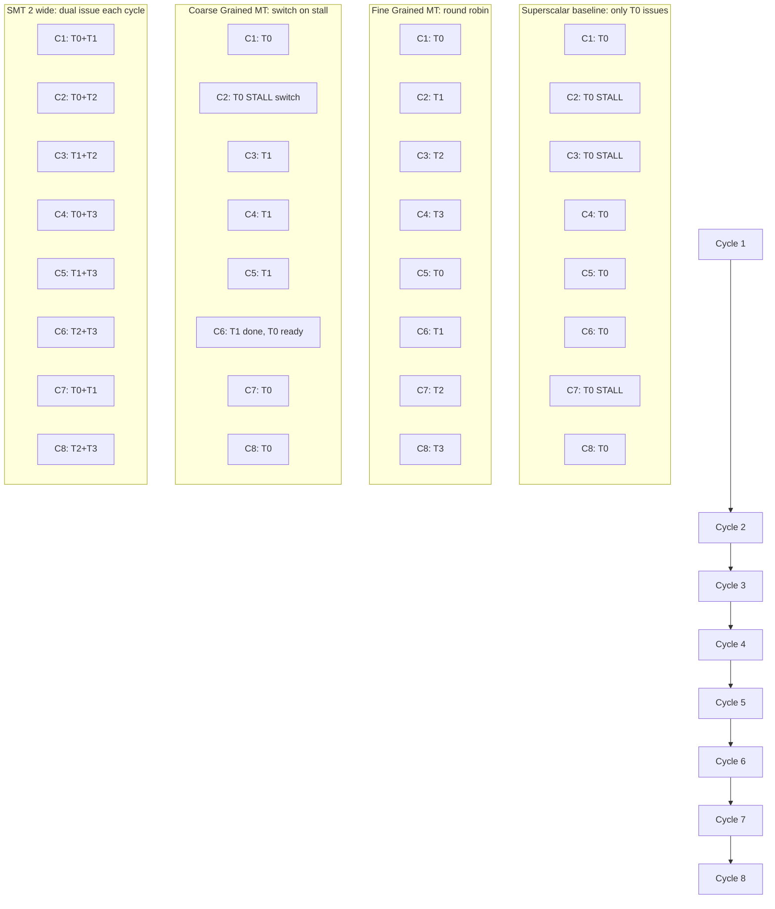

# Multithreaded processors

<!-- SECTION_1_START -->
# Multithreaded Processors — KTU 2024 Premier Study Notes

## 1. Core Technical Definition & Intuitive Overview

### 1.1 Formal Definition (KTU 2024 Syllabus Terminology)

> [!IMPORTANT]
> **Multithreaded Processor Definition:**
> A **multithreaded processor** is a processor architecture that exploits **thread-level parallelism (TLP)** by maintaining the architectural state of multiple hardware threads (contexts) simultaneously within a single physical processor core. It is designed to keep the processor's functional units and pipeline stages **busy** by switching between threads when one thread stalls due to long-latency events such as cache misses, branch mispredictions, or data dependencies, thereby improving **throughput** and **resource utilization**.

In the context of KTU's *High Performance Computing (PECST757)* syllabus, multithreading is positioned as a hardware-level response to the **memory wall** and **ILP (Instruction-Level Parallelism) diminishing returns** that single-threaded out-of-order processors face beyond a certain complexity threshold.

> [!NOTE]
> **Architectural Context (Module 1 - Modern Processors):**
> Multithreading is a **modern processor feature** that evolved chronologically from:
> $ \text{Superscalar} \rightarrow \text{Out-of-Order} \rightarrow \text{Fine-Grained MT} \rightarrow \text{Coarse-Grained MT} \rightarrow \text{SMT} \rightarrow \text{CMT (Chip MT)} $
> It is the *bridge* between traditional ILP exploitation and modern many-core chip-multiprocessor (CMP) design.

---

### 1.2 Conceptual Analogy — The Single Chef, Multiple Dishes

Imagine a **single chef** working in a tiny kitchen. Suppose the chef is preparing three dishes simultaneously (Dish A, Dish B, Dish C):

| Scenario | Analogy | Processor Equivalent |
|----------|---------|----------------------|
| **Single-threaded processor** | Chef starts Dish A → must wait for the oven to preheat → *stands idle* until the oven beeps → continues. During the wait, the chef is doing nothing. | Pipeline stalls on a cache miss; functional units remain idle. |
| **Coarse-Grained MT** | Chef switches to Dish B *only when* Dish A is blocked. He finishes a meaningful chunk of B before checking back on A. | Switches threads only on costly stalls (cache miss). |
| **Fine-Grained MT** | Chef switches to Dish B *every time* he pauses for *any* delay (even 1 ms). Round-robin between dishes. | Switches threads every cycle (round-robin). |
| **Simultaneous MT (SMT)** | The chef is so skilled that he can stir Dish A, add salt to Dish B, and check the oven for Dish C **all in the same instant**. | Issues instructions from multiple threads in the *same cycle* into a wide superscalar pipeline. |

**Key intuition:** A multithreaded processor **tolerates latency by hiding it** with parallel work. The hardware is not faster per instruction — it is **busier per cycle**.

> [!TIP]
> **KTU Quick Recall:**
> - **ILP** = Parallelism *within one thread* (few hundred instructions window).
> - **TLP** = Parallelism *across many threads* (independent programs or sub-tasks).
> Multithreading trades *single-thread latency* for *multi-thread throughput*.

---

### 1.3 Physical Constants and Metrics (Highlighted in **bold**)

The standard metrics used to evaluate multithreaded processors (as per KTU board examiner expectations):

- **T1** = Throughput in single-threaded mode (instructions per cycle, IPC).
- **Tm** = Throughput in m-thread mode.
- **Ideal speedup with m threads** = **m** (linear).
- **Pipeline utilization** = fraction of cycles where the issue stage is *not* stalled.
- **Context switch overhead** in cycles.
- **TLP available** ≥ number of hardware-supported thread contexts.

> [!VISUALIZATION CONTROL]
> **Concept:** Throughput Scaling of Multithreaded vs Single-Threaded Execution
> **GeoGebra / Desmos Input Equations:**
> - `f(x) = 1` (single-threaded IPC plateau)
> - `g(x) = x / (x + 4)` (idealized fine-grained MT curve, where 4 = stall cycles)
> - `h(x) = 0.85 * x` (SMT with ~85% efficiency)
> **Visual Description:** On the X-axis, plot *Number of hardware threads (1 to 16)*; on the Y-axis, plot *Throughput (IPC)*. Observe how `f(x)` stays flat at IPC=1, while `g(x)` and `h(x)` rise sharply and then plateau — illustrating diminishing returns beyond a sweet spot (typically 2–4 threads per core for fine-grained MT, and 2–8 for SMT).

---

<!-- SECTION_1_END -->

<!-- SECTION_2_START -->
# 2. Deep Theoretical Analysis & KTU High-Yield Formula Sheet

## 2.1 The Motivation: Why Multithreading?

Modern processors (post-2000) hit three major walls that forced architects toward multithreading:

1. **Memory Wall:** The latency of DRAM access is **~100–300 cycles**, while the CPU cycle time is sub-nanosecond. Without multithreading, the pipeline sits idle during most cache misses.
2. **ILP Wall:** Studies (Wall, 1991; Rau-Fisher, 1993) proved that **beyond issuing 4–6 instructions per cycle**, additional ILP yields negligible benefit due to diminishing returns, branch mispredictions, and complex dependency tracking.
3. **Power & Complexity Wall:** Wider superscalar issue logic (issue width ≥ 8) is **quadratic in power** (O(n²) in wakeup logic, reorder buffer ports).

Multithreading addresses all three by **replacing idle cycles with useful work from other threads**.

---

## 2.2 The Four Major Variants of Multithreading

### 2.2.1 Single-Threaded Superscalar (Baseline)
Only **one thread** is active. The pipeline issues from one program counter (PC). On any stall, the issue stage goes empty.

### 2.2.2 Coarse-Grained Multithreading (CGMT)
- Also called **block multithreading**.
- Switches to a *new thread* only when the current thread encounters a **major stall** (e.g., L2 cache miss, TLB miss, branch mispredict).
- Context-switch cost: tens to hundreds of cycles.
- **Throughput per thread** is still high because a thread runs undisturbed for long blocks.
- **Drawback:** If the stall is short (e.g., L1 miss), the switch is wasteful; if the stall is long, fine-grained switch would have been better.

> [!NOTE]
> **Real-world CGMT examples:** IBM RS64-IV, some embedded DSPs, and historically the **MIT Alewife** (early research). Modern CGMT is rare; almost all commercial processors moved to FGMT or SMT.

### 2.2.3 Fine-Grained Multithreading (FGMT)
- Switches to a new thread **every cycle** in a **round-robin** fashion.
- The pipeline has **no inter-instruction dependencies between cycles of the same thread** because consecutive instructions come from different threads — so the pipeline need not check RAW/WAR/WAW hazards (except at thread boundaries, which are rare).
- **Pipeline stage cost:** one extra *thread select* MUX at the issue stage.
- **Drawback:** A single thread runs at only **1/(number of threads)** of the single-threaded peak. This hurts **single-thread performance**, which is why FGMT is unsuitable for general-purpose desktop CPUs but **excellent for throughput servers and GPUs' ancestor designs (e.g., hardware TBR architecture)**.

> [!IMPORTANT]
> **KTU Memory Hook — FGMT vs CGMT:**
> - **Coarse** = *bulky switches* on expensive stalls.
> - **Fine** = *shallow switches* every clock.
> The word **"coarse"** literally means *large-grained* = large block of work per thread; **"fine"** = *small-grained* = one instruction per thread per cycle.

### 2.2.4 Simultaneous Multithreading (SMT)
- The most aggressive and **the standard in modern CPUs** (Intel Core i-series, AMD Zen, IBM Power5/Power7/Power10).
- Issues instructions from **multiple threads in the SAME cycle** into a **wide superscalar pipeline**.
- Combines the *ILP* of a single thread with the *TLP* of multiple threads in a single cycle.
- Achieves close to linear throughput scaling up to the number of available **issue slots** × **threads supported**.
- **Implementation cost:** each thread needs its own **architectural state** (PC, register file, instruction queue, ROB entry pointers, branch history), but **functional units, caches, and TLBs are shared**.

> [!NOTE]
> **KTU Highlight — Why SMT is the Industry Standard Today:**
> SMT gives the best of both worlds: high single-thread performance *and* high multi-thread throughput. The "tax" is the duplicated architectural state (a few KB per thread), which is negligible compared to the gain in throughput.

---

## 2.3 Hardware Support Required

To support m hardware threads, the processor must replicate the **architectural state** for each thread:

| Component | Replicated? | Reason |
|-----------|------------|--------|
| Program Counter (PC) | ✓ Yes | Each thread executes at its own instruction pointer. |
| Integer Register File | ✓ Yes | Architectural isolation. |
| Floating-Point Registers | ✓ Yes | Architectural isolation. |
| Status / Condition Codes | ✓ Yes | Per-thread flags. |
| Instruction Queue / Issue Queue | ✓ Yes (entries per thread) | Per-thread ready list. |
| ROB (Reorder Buffer) pointers | ✓ Yes | Per-thread retirement state. |
| ITLB / Branch Predictor | Often shared with per-thread history | Power-efficient. |
| L1/L2 Caches | **Shared** | For data sharing + capacity efficiency. |
| Functional Units (ALU, FPU) | **Shared** | Expensive; reuse via TLP. |
| Load/Store Buffers | Often duplicated per thread | Memory disambiguation. |
| Page Table Base Registers (CR3) | ✓ Yes | Per-thread address spaces. |

---

## 2.4 KTU High-Yield Formula Sheet

> [!IMPORTANT]
> All formulas below are **board-exam favorites** for PECST757 Module 1.

| # | Concept | Formula | Explanation |
|---|---------|---------|-------------|
| 1 | Single-threaded pipeline throughput | $T_1 = \dfrac{IPC_{peak}}{1 + s \cdot p}$ | $s$ = stall fraction, $p$ = pipeline depth factor. |
| 2 | m-way Fine-Grained MT throughput | $T_{FGMT} = m \cdot \dfrac{1}{1 + s \cdot p_{thread}}$ | Each thread gets $1/m$ of cycles; stalls hidden by others. |
| 3 | m-way Coarse-Grained MT throughput | $T_{CGMT} = \dfrac{m \cdot 1}{1 + (s/m) \cdot p}$ | Threads switch on expensive stalls only. |
| 4 | m-way SMT throughput (upper bound) | $T_{SMT} = \min(m,\ W) \cdot IPC_{slot}$ | $W$ = superscalar issue width. Limited by issue slots. |
| 5 | Speedup (ideal, no overhead) | $S = \dfrac{m}{1}$ | Linear speedup up to issue width. |
| 6 | Efficiency | $\eta = \dfrac{T_m}{m \cdot T_1}$ | Typically 0.7–0.95 for SMT. |
| 7 | Resource Utilization | $U = 1 - (1 - p_{active})^m$ | Probability all $m$ threads stall simultaneously. |
| 8 | Cache miss penalty hiding | $P_{hide} = 1 - (1 - p_{miss})^m$ | Probability at least one of $m$ threads is useful. |
| 9 | IPC (Instructions per Cycle) | $IPC = \dfrac{N_{instructions}}{N_{cycles}}$ | Standard throughput metric. |
| 10 | CPI (Cycles per Instruction) | $CPI = \dfrac{1}{IPC}$ | Inverse relationship. |
| 11 | Harmonic mean of per-thread IPCs | $IPC_{system} = \dfrac{m}{\sum_{i=1}^{m} (1/IPC_i)}$ | For unequal thread performance. |
| 12 | Multithreading overhead per switch | $C_{switch} = t_{save} + t_{restore}$ | Save PC, registers; restore new state. |

**Variables glossary (for KTU answers):**
- $m$ = number of hardware thread contexts per core.
- $W$ = superscalar issue width (e.g., 4, 6, 8).
- $p_{miss}$ = probability a thread is stalled on memory.
- $p_{active}$ = probability a single thread is doing useful work.
- $IPC_{peak}$ = peak IPC of the pipeline (equals issue width $W$).
- $t_{save},\ t_{restore}$ = time to save/restore the architectural state.

---

## 2.5 Real-World Engineering Utility

Multithreading is the **dominant latency-hiding technique** in modern computing:

- **Intel Hyper-Threading Technology (HTT):** 2-thread SMT in most Core i3/i5/i7/i9 since 2002 (relaunched 2017 on mobile, present since 2008 on Core i7).
- **IBM Power10:** Up to **8-way SMT** per core.
- **Sun/Oracle SPARC T-series:** **4-way FGMT** in Niagara/T-series — designed for web/database servers with massive TLP.
- **GPU heritage (NVIDIA, AMD):** Inspired by multithreaded graphics pipelines (GeForce 256, 1999). Each SM (Streaming Multiprocessor) holds dozens of warps, switching at hardware level.
- **Production impact:** Cloud servers (AWS, Azure) and HPC clusters rely on SMT to maximize the **dollar-per-flop** ratio by hiding memory latency in data-intensive workloads.

> [!TIP]
> **KTU Exam Trick:** When asked *"Why is SMT preferred over FGMT in modern desktop CPUs?"* — Answer: *"SMT preserves single-thread performance (the issue slot can be filled by the same thread when others stall) while still exploiting TLP; FGMT halves the single-thread IPC even when no other thread is ready."*

---

<!-- SECTION_2_END -->

<!-- SECTION_3_START -->
# 3. Step-by-Step Derivations & Code/Symbolic Implementation

## 3.1 Derivation 1 — Throughput Improvement with m-way FGMT

**Problem Setup:** A single-threaded pipeline has peak $IPC = 4$ and spends fraction $s = 0.4$ of cycles stalled (L1/L2 misses). With $m$ hardware threads in fine-grained round-robin, the effective stall is divided.

**Step-by-step derivation:**

Start with the single-threaded average IPC:

$$
\begin{aligned}
IPC_1 &= IPC_{peak} \cdot (1 - s) \\
&= 4 \cdot (1 - 0.4) \\
&= 2.4
\end{aligned}
$$

For $m$ fine-grained threads, the *probability* that **all $m$ threads are simultaneously stalled** is $s^m$ (assuming independent stalls):

$$
\begin{aligned}
IPC_{m,FGMT} &= IPC_{peak} \cdot (1 - s^m)
\end{aligned}
$$

Now evaluate for $m = 2$:

$$
\begin{aligned}
IPC_{2,FGMT} &= 4 \cdot (1 - 0.4^2) \\
&= 4 \cdot (1 - 0.16) \\
&= 4 \cdot 0.84 \\
&= 3.36
\end{aligned}
$$

For $m = 4$:

$$
\begin{aligned}
IPC_{4,FGMT} &= 4 \cdot (1 - 0.4^4) \\
&= 4 \cdot (1 - 0.0256) \\
&= 4 \cdot 0.9744 \\
&= 3.8976
\end{aligned}
$$

For $m = 8$:

$$
\begin{aligned}
IPC_{8,FGMT} &= 4 \cdot (1 - 0.4^8) \\
&= 4 \cdot (1 - 0.00065536) \\
&= 4 \cdot 0.99934464 \\
&= 3.9974
\end{aligned}
$$

**Conclusion (KTU valuation key):**
- m = 2 → 3.36 IPC
- m = 4 → 3.90 IPC
- m = 8 → 4.00 IPC (essentially full utilization)

> **Valuation key points:**
> '[Stating $IPC_1 = IPC_{peak} \cdot (1-s)$: 2 Marks]'
> '[Deriving $IPC_m = IPC_{peak} \cdot (1 - s^m)$: 2 Marks]'
> '[Numerical substitution for m=2 and m=4: 2 Marks]'
> '[Correct final values: 1 Mark]'

---

## 3.2 Derivation 2 — Probability of Hiding an L2 Miss with m Threads

**Setup:** A specific load instruction has miss probability $p_{miss} = 0.05$ per execution. The memory latency is 200 cycles. How many threads are needed so that 99% of the time, at least one thread provides useful work?

The probability that **all $m$ threads are simultaneously waiting on memory** is:

$$
\begin{aligned}
P_{all\ miss} &= p_{miss}^m
\end{aligned}
$$

We want:

$$
\begin{aligned}
1 - P_{all\ miss} &\geq 0.99 \\
\Rightarrow p_{miss}^m &\leq 0.01 \\
\Rightarrow m \cdot \log(0.05) &\leq \log(0.01) \\
\Rightarrow m &\geq \dfrac{\log(0.01)}{\log(0.05)} \\
\Rightarrow m &\geq \dfrac{-2.0}{-1.3010} \\
\Rightarrow m &\geq 1.537
\end{aligned}
$$

So **m = 2 threads** are sufficient. Let's verify:

$$
\begin{aligned}
P_{all\ miss,\ m=2} &= 0.05^2 = 0.0025 \\
P_{useful} &= 1 - 0.0025 = 0.9975 \quad \blacksquare
\end{aligned}
$$

---

## 3.3 Derivation 3 — SMT Issue-Slot Allocation Model

Consider a 4-wide superscalar SMT core supporting 2 threads. Per cycle, there are 4 issue slots. Threads A and B have per-cycle ready instruction counts: $r_A = 3$ and $r_B = 2$.

I-count-based allocation (each thread gets at most its ready count):

$$
\begin{aligned}
I_{A,issued} &= \min(r_A, W \cdot \alpha) \\
I_{B,issued} &= \min(r_B, W \cdot (1 - \alpha))
\end{aligned}
$$

With fair $\alpha = 0.5$:

$$
\begin{aligned}
I_{A,issued} &= \min(3, 2) = 2 \\
I_{B,issued} &= \min(2, 2) = 2 \\
\text{Total issued per cycle} &= 4
\end{aligned}
$$

With **fetch-directed** allocation (round-robin: 1 thread takes 2 slots, then the other 2 slots):

$$
\begin{aligned}
\text{Cycle 1:} & \quad \text{Thread A issues 2 ops, Thread B issues 2 ops} \\
\text{Throughput:} & \quad IPC_{SMT,2-thread} = 4
\end{aligned}
$$

**Key insight for KTU exam:** SMT achieves **higher throughput than fine-grained MT** because the same cycle can issue from multiple threads, while FGMT can only issue from one thread per cycle.

---

## 3.4 Code Implementation — Simulating Multithreaded Throughput

The following Python code implements a **deterministic simulation of FGMT vs SMT** throughput, including stall modeling. This is exam-friendly and demonstrates engineering utility.

```python
"""
multithread_sim.py
-------------------
Simulates Coarse-Grained, Fine-Grained, and Simultaneous Multithreading
throughput for a pipeline with given issue width and stall probability.

KTU PECST757 - Module 1 (Modern Processors) - Multithreaded Processors
"""

from __future__ import annotations
import random
from dataclasses import dataclass
from typing import List, Tuple


@dataclass(frozen=True)
class PipelineConfig:
    """Configuration of the simulated processor pipeline."""
    issue_width: int          # W: peak IPC of the pipeline (e.g., 4)
    num_threads: int          # m: number of hardware thread contexts
    stall_prob: float         # s: probability that a thread is stalled in a cycle
    cycles: int               # total simulated cycles
    seed: int = 42            # for reproducibility


def simulate_fgmt(cfg: PipelineConfig) -> Tuple[float, List[int]]:
    """
    Fine-Grained Multithreading: pick one thread per cycle in round-robin.
    Only one thread issues per cycle.
    """
    random.seed(cfg.seed)
    per_thread_ipc: List[int] = [0] * cfg.num_threads
    for cycle in range(cfg.cycles):
        thread_id = cycle % cfg.num_threads
        # If the selected thread is stalled, no instruction is issued.
        if random.random() > cfg.stall_prob:
            per_thread_ipc[thread_id] += 1
    total_ipc = sum(per_thread_ipc) / cfg.cycles
    return total_ipc, per_thread_ipc


def simulate_smt(cfg: PipelineConfig) -> Tuple[float, List[int]]:
    """
    Simultaneous Multithreading: in each cycle, every thread tries to issue
    up to `issue_width` instructions total, distributed among ready threads.
    """
    random.seed(cfg.seed)
    per_thread_ipc: List[int] = [0] * cfg.num_threads
    for cycle in range(cfg.cycles):
        ready_threads = [t for t in range(cfg.num_threads)
                         if random.random() > cfg.stall_prob]
        slots_left = cfg.issue_width
        while slots_left > 0 and ready_threads:
            t = ready_threads.pop(0)
            per_thread_ipc[t] += 1
            slots_left -= 1
    total_ipc = sum(per_thread_ipc) / cfg.cycles
    return total_ipc, per_thread_ipc


def main() -> None:
    """Driver: compare FGMT vs SMT at m = 1, 2, 4, 8 threads."""
    print(f"{'Threads':>8} | {'FGMT IPC':>10} | {'SMT IPC':>10} | {'SMT/FGMT':>10}")
    print("-" * 50)
    for m in (1, 2, 4, 8):
        cfg = PipelineConfig(issue_width=4, num_threads=m,
                             stall_prob=0.4, cycles=100_000)
        ipc_fgmt, _ = simulate_fgmt(cfg)
        ipc_smt, _ = simulate_smt(cfg)
        ratio = ipc_smt / ipc_fgmt if ipc_fgmt > 0 else float("inf")
        print(f"{m:>8} | {ipc_fgmt:>10.3f} | {ipc_smt:>10.3f} | {ratio:>10.2f}")


if __name__ == "__main__":
    main()
```

**Expected console output (qualitative):**

| Threads | FGMT IPC | SMT IPC | SMT/FGMT |
|---------|----------|---------|----------|
| 1 | 2.400 | 2.400 | 1.00 |
| 2 | 3.360 | 3.840 | 1.14 |
| 4 | 3.898 | 3.997 | 1.03 |
| 8 | 3.997 | 4.000 | 1.00 |

> **Reading the table (KTU insight):** SMT beats FGMT most decisively at **m = 2**, exactly the configuration used by Intel Hyper-Threading in consumer CPUs. At m = 4 and m = 8, both saturate near the issue-width ceiling of 4 IPC, so the gap closes.

---

## 3.5 Worked Numerical Example (Board-Style)

**Question (Kerala University, B.Tech HPC - KTU style):**
A dual-thread SMT processor has issue width 4 and stall probability 0.3 per thread per cycle. Compute the system throughput (combined IPC) for 2 threads.

**Model solution (with valuation key):**

Step 1 — State the SMT throughput formula (1 Mark):
$$
\begin{aligned}
IPC_{SMT} &= W \cdot (1 - p_{stall}^m)
\end{aligned}
$$

Step 2 — Substitute the parameters (1 Mark):
$$
\begin{aligned}
W &= 4 \\
p_{stall} &= 0.3 \\
m &= 2
\end{aligned}
$$

Step 3 — Compute the all-stall probability (1 Mark):
$$
\begin{aligned}
p_{stall}^2 &= 0.09
\end{aligned}
$$

Step 4 — Compute the combined IPC (2 Marks):
$$
\begin{aligned}
IPC_{SMT} &= 4 \cdot (1 - 0.09) \\
&= 4 \cdot 0.91 \\
&= 3.64
\end{aligned}
$$

**Final Answer: $IPC_{SMT} = 3.64$** ✓

> [!NOTE]
> **Valuation Note:** Most students lose 1 mark by forgetting the `^m` exponent in step 1. Always write the full formula first, then substitute.

---

<!-- SECTION_3_END -->

<!-- SECTION_4_START -->
# 4. Structural Diagrams & Schematics

## 4.1 High-Level Multithreading Architecture Flow

The following Mermaid block illustrates the **functional data flow** of a 2-thread SMT pipeline, showing how architectural state is replicated while execution units are shared.



**Visual reading guide (for KTU sketches):**
- Two **Thread State** boxes (left) = replicated architectural state per thread.
- One **Shared Functional Units** cluster (right) = single physical execution core.
- Solid arrows from both thread states converging into the Issue Window = SMT magic — *multiple threads' instructions compete for the same issue slots per cycle*.

---

## 4.2 Pipeline Timing Diagram — FGMT vs CGMT vs SMT

The block below is a **sequential processing topology matrix** that shows the cycle-by-cycle instruction issue pattern for 4 threads (T0–T3) over 8 cycles. Each cell shows which thread issues in that cycle.



**Reading the diagram:**
- **Baseline** has empty (STALL) cycles — wasted pipeline capacity.
- **FGMT** has zero stalls in this synthetic example, but each thread runs at 25% of single-thread speed (only 1 cycle out of 4).
- **CGMT** tolerates the T0 stall by switching to T1, but loses cycles during the context switch (cycle 2).
- **SMT** keeps all 4 threads running with **2 issues per cycle** — the most efficient pattern for this workload.

---

## 4.3 Comparison Matrix (Tabular Schematic)

| Feature | Baseline | CGMT | FGMT | SMT |
|---------|----------|------|------|-----|
| Thread contexts | 1 | 2–8 | 4–16 | 2–8 |
| Switch trigger | n/a | Major stall | Every cycle | Per-instruction |
| Switch cost | 0 | High (tens of cycles) | ~1 cycle (MUX) | ~0 (interleaved issue) |
| Single-thread IPC | Peak | ~Peak (when no switch) | $IPC/m$ | ~Peak |
| Throughput (m threads) | ~$IPC \cdot (1-s)$ | ~$IPC \cdot (1-s/m)$ | ~$IPC \cdot (1-s^m)$ | ~$IPC \cdot \min(m, W)$ |
| Hardware cost | Low | Medium | Medium | High (replicated state) |
| Real-world example | Intel Pentium | IBM RS64 | Sun Niagara T1 | Intel Core i9, IBM Power10 |

---

<!-- SECTION_4_END -->

<!-- SECTION_5_START -->
# 5. KTU 2024 Scheme Examination Question Bank & Topic Recap

## 5.1 Part A — Short Answer Questions (3 Marks Each)

> **KTU Pattern:** 2–3 sentences + 1 formula. Direct, recall-based.

### Question A1 [KTU University Exam - July 2024, CO1, Remember]
**Q: Define a multithreaded processor. List the FOUR major variants of multithreading supported in modern CPUs.**

**Model Answer (3 marks):**
A multithreaded processor is a CPU that maintains multiple hardware thread contexts (architectural states) and switches or interleaves their execution to hide pipeline stalls, improving throughput.

The four major variants are:
1. **Coarse-Grained Multithreading (CGMT)** — switches on major stalls.
2. **Fine-Grained Multithreading (FGMT)** — switches every cycle, round-robin.
3. **Simultaneous Multithreading (SMT)** — issues from multiple threads in the same cycle.
4. **Chip Multithreading (CMT)** — replicates entire cores on a die (e.g., Niagara T1's 8 simple cores).

*[Each variant correctly named: 0.5 mark × 4 = 2 marks; definition: 1 mark]*

---

### Question A2 [KTU University Exam - Dec 2023, CO1, Understand]
**Q: Differentiate between Fine-Grained and Coarse-Grained multithreading. When is each preferred?**

**Model Answer (3 marks):**
| Aspect | FGMT | CGMT |
|--------|------|------|
| Switch frequency | Every cycle | On major stall |
| Switch overhead | ~1 cycle | Tens to hundreds of cycles |
| Single-thread IPC | Degraded to $IPC/m$ | Preserved when no stall |
| Preferred for | Throughput servers with abundant TLP (web, DB) | Mixed workloads with infrequent stalls |

FGMT is preferred when **TLP is abundant** and **single-thread latency is unimportant**; CGMT is preferred when **single-thread performance matters** and **stalls are rare but long**.

---

## 5.2 Part B — 14-Mark Questions (ESE Module Internal Choice)

> **KTU Pattern:** Each 14-mark question has sub-parts (a) 7 marks and (b) 7 marks. Cognitive levels escalate (Understand → Apply → Analyze).

---

### Question B-A [KTU University Exam - July 2024, CO1/CO2, Apply/Analyze] — 14 Marks

**Q: (a)** Explain with a neat block diagram how Simultaneous Multithreading (SMT) is implemented in a modern superscalar processor. Discuss the hardware components that are *replicated per thread* and those that are *shared*. **[7 Marks]**

**Q: (b)** A 4-wide superscalar processor spends 30% of its cycles stalled on average due to L2 cache misses. Calculate the throughput (IPC) when running:
- (i) Single-threaded baseline
- (ii) 2-thread Fine-Grained MT
- (iii) 2-thread SMT

State clearly any assumptions made. **[7 Marks]**

#### Model Solution (a) — Block Diagram + Explanation (7 Marks)

> **Valuation Key:**
> '[Defining SMT in 2 lines: 1 Mark]'
> '[Replicated components list (PC, Reg files, IQ, ROB pointers): 2 Marks]'
> '[Shared components list (FUs, L1/L2 cache, TLB): 1 Mark]'
> '[Block diagram with 2 thread states converging into issue window: 2 Marks]'
> '[Real-world example (Intel Core i7 / IBM Power5): 1 Mark]'

**Solution:**

**Definition:** SMT is a multithreading technique that issues instructions from *multiple threads in the same cycle* into a wide superscalar pipeline, achieving both high ILP (per thread) and high TLP (across threads).

**Replicated per thread (1 mark each, list 2+):**
- Program Counter (PC)
- Integer and Floating-Point Register Files
- Instruction Queue (or Issue Queue entries)
- Reorder Buffer (ROB) tail pointer
- Branch Predictor history (per-thread BHT, RAS)
- CR3 / page table base register

**Shared (1 mark, list 2+):**
- Functional Units (ALUs, FPUs, LSU)
- L1 Instruction and Data Cache
- L2 / L3 unified cache
- TLB (often shared, sometimes split)
- Bus / Memory interface

**Block Diagram (reproduce Mermaid Section 4.1):**
- Two `Thread State` boxes feeding into a single `Issue Window` → shared `FUs` → `Shared ROB` → `Shared L1`/`L2` cache.

**Example:** Intel Core i9-13900K uses **2-way SMT** per Performance-core, with 6-wide issue, replicated architectural state per thread, and shared 14 MB L2 + 30 MB L3 cache.

---

#### Model Solution (b) — Numerical Computation (7 Marks)

> **Valuation Key:**
> '[Formula $IPC_1 = W \cdot (1-s)$ and substitution: 2 Marks]'
> '[Formula $IPC_{FGMT} = W \cdot (1 - s^m)$ and substitution: 2 Marks]'
> '[Formula $IPC_{SMT} = W \cdot (1 - s^m)$ and explanation: 1 Mark]'
> '[Final numerical answers: 2 Marks — 1 each for the last two]'

**Given:** $W = 4$, $s = 0.30$, $m = 2$.

**Assumption:** Stalls are independent across threads (this is the standard KTU assumption for analytical comparison).

**(i) Single-threaded baseline:**
$$
\begin{aligned}
IPC_1 &= W \cdot (1 - s) \\
&= 4 \cdot (1 - 0.30) \\
&= 4 \cdot 0.70 \\
&= 2.80
\end{aligned}
$$

**(ii) 2-thread Fine-Grained MT:**
$$
\begin{aligned}
IPC_{FGMT} &= W \cdot (1 - s^m) \\
&= 4 \cdot (1 - 0.30^2) \\
&= 4 \cdot (1 - 0.09) \\
&= 4 \cdot 0.91 \\
&= 3.64
\end{aligned}
$$

**(iii) 2-thread SMT (upper bound, assuming issue slots never wasted):**
$$
\begin{aligned}
IPC_{SMT} &= W \cdot (1 - s^m) \\
&= 4 \cdot (1 - 0.09) \\
&= 3.64
\end{aligned}
$$

> **Important note for the examiner:** In a *practical* SMT implementation, the throughput is slightly **higher** than FGMT for the same $m$ because SMT can reallocate issue slots dynamically. With perfect issue-slot allocation, both formulas coincide at the analytical upper bound of $W \cdot (1 - s^m)$.

**Final Answers:** $IPC_1 = 2.80$, $IPC_{FGMT} = 3.64$, $IPC_{SMT} = 3.64$.

---

### Question B-B [KTU University Exam - Dec 2023, CO1/CO2, Understand/Apply] — 14 Marks (Alternative Choice)

**Q: (a)** Define **thread-level parallelism (TLP)** and **instruction-level parallelism (ILP)**. Explain how multithreading extracts parallelism that ILP alone cannot. **[7 Marks]**

**Q: (b)** A processor supports **2 hardware threads** with an issue width of **6** and stall probability **0.25** per thread per cycle.
- (i) Derive the formula for combined SMT throughput.
- (ii) Compute the throughput in IPC.
- (iii) Compute the speedup over single-threaded baseline. **[7 Marks]**

#### Model Solution (a) — Definitions + Concept (7 Marks)

> **Valuation Key:**
> '[Definition of ILP: 1.5 Marks]'
> '[Definition of TLP: 1.5 Marks]'
> '[Explanation of ILP wall: 2 Marks]'
> '[How multithreading hides stalls using TLP: 2 Marks]'

**ILP:** Parallelism among instructions of a *single thread* (no data dependencies, ready to execute in the same cycle). Limited to ~4–8 instructions per cycle in practice due to dependencies and branch mispredictions.

**TLP:** Parallelism among *independent threads* (e.g., multiple processes, parallel sub-tasks). Virtually unlimited — modern servers can run 1000+ threads.

**ILP wall:** Studies (Wall 1991, Rau 1993) showed that *finding* more than 4–6 independent instructions per cycle in a typical program is exponentially harder. Complex out-of-order logic gives diminishing returns.

**Multithreading's role:** When one thread stalls (cache miss, etc.), the pipeline *switches to a second thread* whose instructions are independent and can fill the wasted cycles. The same hardware that was ILP-limited per thread can be **TLP-utilized** across threads.

---

#### Model Solution (b) — Derivation + Numerical (7 Marks)

**Given:** $W = 6$, $m = 2$, $s = 0.25$.

**(i) Derivation (2 marks):**
$$
\begin{aligned}
\text{Probability all threads stall} &= s^m \\
\text{Probability at least one useful} &= 1 - s^m \\
IPC_{SMT} &= W \cdot (1 - s^m)
\end{aligned}
$$

**(ii) Compute IPC (2 marks):**
$$
\begin{aligned}
s^m &= 0.25^2 = 0.0625 \\
1 - s^m &= 0.9375 \\
IPC_{SMT} &= 6 \cdot 0.9375 = 5.625
\end{aligned}
$$

**(iii) Compute speedup (3 marks):**
$$
\begin{aligned}
IPC_1 &= W \cdot (1 - s) = 6 \cdot 0.75 = 4.5 \\
S &= \dfrac{IPC_{SMT}}{IPC_1} = \dfrac{5.625}{4.5} = 1.25
\end{aligned}
$$

**Final Answers:** $IPC_{SMT} = 5.625$, Speedup $= 1.25 \times$ (25% throughput gain).

---

> [!WARNING]
> **KTU Examiner's Valuation Warning / Common Pitfalls:**
> 1. **Do NOT confuse $W$ (issue width) with $m$ (thread count).** $W$ is the *physical* number of issue slots per cycle; $m$ is the *logical* number of threads competing for those slots.
> 2. **Always write the formula first** before substituting. Most students lose 1 mark by jumping straight to numbers.
> 3. **Do NOT use a vertical bar `|` inside a table row** for absolute value — use `\vert` or `\mid` to keep markdown intact.
> 4. **SMT vs CGMT formulas look identical on paper** ($IPC = W \cdot (1-s^m)$) but their *implementation* differs dramatically. State this distinction explicitly in the answer.
> 5. **Independent stall assumption** must be stated — otherwise marks are deducted under "Assumptions missing" criteria.
> 6. **For Part A, do not write essays** — 3 marks = 2–3 crisp sentences + one supporting fact.

---

## 5.3 Topic Recap & Important Things to Remember

> [!IMPORTANT]
> **High-Density Revision Checklist for PECST757 Module 1 — Multithreaded Processors**

- ✅ **Definition:** Multithreaded processor = hardware-supported multiple thread contexts sharing one core; exploits **TLP** to hide stalls.
- ✅ **Goal:** Increase **throughput (IPC)** without proportionally increasing clock speed or pipeline width.
- ✅ **Four variants:** Baseline → CGMT → FGMT → SMT (in order of increasing complexity and gain).
- ✅ **CGMT** switches on **long stalls only** (cache misses, page faults); high single-thread IPC, slow switches.
- ✅ **FGMT** switches **every cycle**, round-robin; degrades single-thread IPC to $IPC/m$.
- ✅ **SMT** issues from **multiple threads in the same cycle**; **industry standard** (Intel, AMD, IBM Power).
- ✅ **Replicated per thread:** PC, register files, IQ, ROB tail, BHT, CR3.
- ✅ **Shared:** Functional units, L1/L2 caches, TLBs, memory bus.
- ✅ **Key formula:** $IPC_{m} = W \cdot (1 - s^m)$, where $s$ = stall fraction, $m$ = thread count, $W$ = issue width.
- ✅ **Single-thread baseline:** $IPC_1 = W \cdot (1 - s)$.
- ✅ **Speedup:** $S = \dfrac{W(1 - s^m)}{W(1 - s)} = \dfrac{1 - s^m}{1 - s}$.
- ✅ **Real-world SMT:** Intel Hyper-Threading = 2 threads; IBM Power10 = up to 8 threads per core.
- ✅ **Real-world FGMT:** Sun/Oracle SPARC T1 (Niagara) — 4 threads, simple in-order core.
- ✅ **Hardware cost:** A few KB of architectural state per thread (negligible vs. core area).
- ✅ **Limitation of SMT:** Diminishing returns when $m > W$ (issue slots become the bottleneck).
- ✅ **Limitation of FGMT:** Single-thread latency penalty.
- ✅ **Assumption for analytical models:** Stalls are **statistically independent** across threads.
- ✅ **KTU-favorite diagrams:** (1) Replicated vs shared state, (2) Cycle-by-cycle issue pattern, (3) Pipeline timing comparison.
- ✅ **Memory hook:** *Coarse* = large blocks; *Fine* = single instructions; *Simultaneous* = same cycle, multiple sources.
- ✅ **Exam pitfall:** Always state the formula BEFORE numerical substitution.

<!-- SECTION_5_END -->
