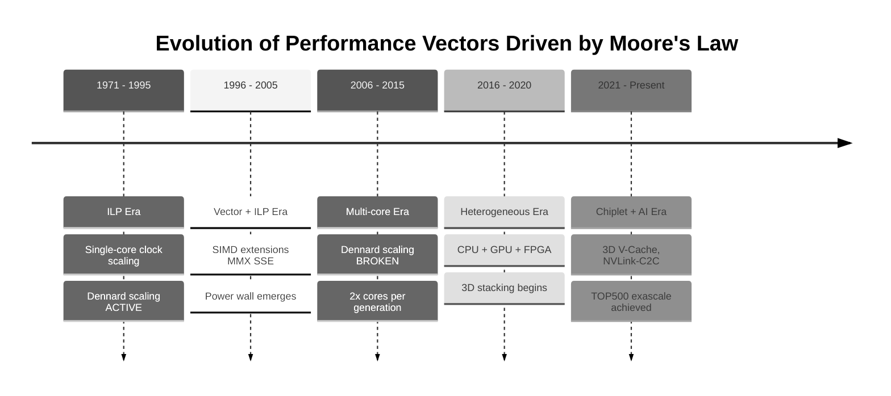
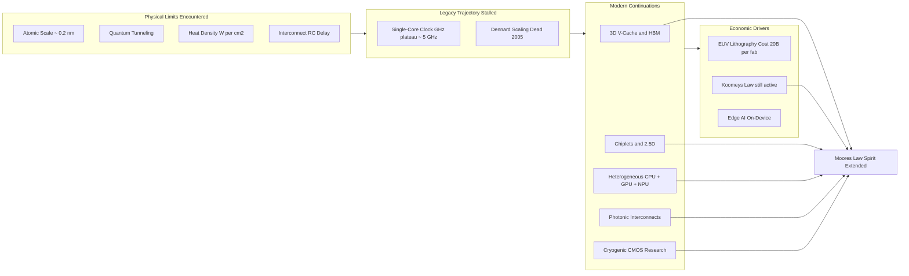
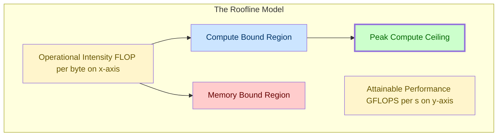

# Performance metrics and benchmarks -Moore’s Law

<!-- SECTION_1_START -->
# Module 1 — Modern Processors
## Topic: Performance Metrics and Benchmarks — Moore's Law

> [!IMPORTANT]
> **KTU 2024 Scheme | PECST757 — High Performance Computing**
> This topic forms the foundation of **Module 1** and is frequently tested as a 3-mark direct question and as a 7-mark analytical sub-part in the End Semester Evaluation (ESE).

---

### 1.1 Formal Academic Definition

**Moore's Law** is the empirical observation, first articulated by **Gordon E. Moore** (co-founder of Fairchild Semiconductor and later Intel) in his landmark 1965 paper *"Cramming More Components onto Integrated Circuits"* published in *Electronics* magazine, that the **number of transistors on an integrated circuit (IC) doubles approximately every 18 to 24 months**, leading to an exponential growth in compute capability, accompanied by a corresponding decrease in relative cost.

In the context of **High Performance Computing (HPC)**, Moore's Law is the **foundational economic and architectural premise** that justifies the design of successively more powerful supercomputers (e.g., from **Intel ASCI Red** in 1996 to today's **Frontier** and **Aurora** exascale systems). It is treated as a **performance metric driver** because it predicts sustained growth in:

- Transistor density (devices per $cm^2$)
- Clock frequency (Hz)
- Instructions Per Cycle (IPC)
- Floating-Point Operations Per Second (FLOPS)

Mathematically, the observation is expressed as:

$$
N(t) \;=\; N_{0} \cdot 2^{\frac{(t - t_{0})}{T_{d}}}
$$

where $N(t)$ is the transistor count at time $t$, $N_{0}$ is the count at reference time $t_{0}$, and $T_{d}$ is the **doubling period** (typically $T_{d} = 2$ years, sometimes 18 months).

> [!NOTE]
> **Critical Distinction (Board Exam Favourite):**
> 1. **1965 Original Formulation** — *Transistor count* doubles every **year** for the next ten years (later revised).
> 2. **1975 Revised Formulation** — *Transistor count per integrated circuit* doubles every **two years** (the version universally cited in textbooks and exam papers).

---

### 1.2 Intuitive Analogy

Imagine a **wheat field** that doubles its yield every two years. A single grain placed in **Year 0** would, by **Year 50**, produce a heap larger than the entire planet Earth. This is the *exponential* nature of Moore's Law.

A simpler analogy for HPC: think of a **highway** where, every two years, the government manages to **double the number of lanes** on the exact same stretch of land, **without widening the road** and **without doubling the toll**. The *cars* (transistors) become smaller, the *lanes* (wires) become thinner, and the *traffic* (instructions) flows faster — all simultaneously.

This is exactly how:
- The **Intel 4004** (1971) packed **2,300 transistors** into a **12 $mm^2$ die**.
- The **Apple M2 Ultra** (2023) packs **134 billion transistors** into a **~960 $mm^2$ die**.

---

### 1.3 Physical & Standard Constants Used

> [!IMPORTANT]
> | Symbol | Constant / Metric | Typical Value |
> |--------|-------------------|---------------|
> | $T_{d}$ | Doubling period | **2 years** (revised 1975) |
> | $k_{B}T$ | Thermal energy at room temp | **0.0259 eV** |
> | $f_{c}$ | Cutoff frequency of silicon | **~500 GHz** (theoretical) |
> | $V_{dd}$ | Supply voltage | **0.7 V – 1.4 V** (modern node) |
> | $\lambda$ | Process node / half-pitch | **3 nm (TSMC, 2023)** |

---

### 1.4 Visualization Control Block

> [!VISUALIZATION CONTROL]
> **Concept:** Exponential transistor-count growth curve (Moore's Law curve)
> **Plotting Tool:** Desmos (https://www.desmos.com/calculator)
> **Input Equations:**
> * $N(t) = 2300 \cdot 2^{\frac{(t - 1971)}{2}}$  (transistor count since 1971)
> * Plot $t$ on the x-axis from 1970 to 2025
> * Plot $N(t)$ on the y-axis (log scale recommended)
> **Visual Description:** The student should observe a **straight line on a semi-log plot** — the signature fingerprint of exponential growth. Reference markers should align with **Intel 4004 (1971)**, **Intel Pentium 4 (2000)**, and **Apple M2 Ultra (2023)** to verify the trend.

<!-- SECTION_1_END -->

<!-- SECTION_2_START -->
# Deep Theoretical Analysis & KTU High-Yield Formula Sheet

---

## 2.1 The Three Pillars of Moore's Era

Moore's Law does not exist in isolation. In HPC, it is supported by three reinforcing physical and economic phenomena:

### Pillar 1 — Dennard Scaling (Broken ~2005)
> [!NOTE]
> **Dennard Scaling** states that as transistors shrink, their **power density remains constant**. Formulated by **Robert Dennard** (1974). This held true until the **90 nm node (~2005)**, after which leakage current and quantum tunneling caused power density to *increase* per unit area, ending the era of clock-frequency scaling.

### Pillar 2 — Moore's Law (Slowing)
Transistor counts continue to double, but **cost per transistor** is no longer falling at historical rates. Below the **7 nm node**, **EUV (Extreme Ultraviolet) lithography** is required, with each new fab costing **>\$20 billion** (e.g., TSMC Arizona fab).

### Pillar 3 — Koomey's Law
The **number of computations per joule** doubles roughly every **1.57 years**, independent of Moore's Law. This is the *energy-efficiency* corollary and is **still alive** even as Dennard scaling has died.

---

## 2.2 Moore's Law in HPC: From Petascale to Exascale

The **TOP500 list** (www.top500.org) tracks the world's most powerful supercomputers. The growth of the **\#1 system's R\textsubscript{MAX} (in GFLOPS)** mirrors Moore's Law superposed with architectural innovation (vector units, GPUs, interconnect).

$$
\text{R}_{\text{MAX}}(t) \;\approx\; \text{R}_{\text{MAX}}(t_0) \cdot 2^{\frac{(t-t_0)}{T_{\text{HPC}}}}
$$

where $T_{\text{HPC}}$ for TOP500 \#1 systems is empirically **~1.1 years** (faster than Moore's Law) due to architectural parallelism (GPUs, multi-core, distributed memory).

> [!IMPORTANT]
> **Key Engineering Insight:** Moore's Law is fundamentally an **economic law**, not a physical one. It is driven by the industry's ability to *manufacture* smaller features at *similar* cost. The physical limit (atomic scale $\approx 0.2$ nm) is approaching, but **3D stacking (TSV)**, **chiplets**, and **heterogeneous integration** (CPU + GPU + NPU) are extending the law's *spirit* well beyond the demise of 2D scaling.

---

## 2.3 KTU High-Yield Formula Sheet

> [!NOTE]
> **Print / screenshot this table — it appears in nearly every HPC exam.**

| # | Formula | Meaning | Units |
|---|---------|---------|-------|
| 1 | $N(t) = N_{0} \cdot 2^{(t-t_{0})/T_{d}}$ | Transistor count growth | dimensionless count |
| 2 | $C = \alpha \cdot N$ | Cost of IC $\propto$ transistor count | USD |
| 3 | $P = C \cdot V_{dd}^{2} \cdot f$ | Dynamic power dissipation | Watts (W) |
| 4 | $\text{Performance} = \dfrac{1}{\text{Execution Time}}$ | Reciprocal of runtime | ops/sec |
| 5 | $\text{FLOPS} = \text{Cores} \times \text{Clock} \times \frac{\text{FLOPs}}{\text{cycle}}$ | Peak compute rate | FLOPs/s |
| 6 | $\text{Speedup} = \dfrac{T_{\text{serial}}}{T_{\text{parallel}}} = \dfrac{1}{(1-p) + \frac{p}{n}}$ | Amdahl's Law | dimensionless |
| 7 | $E = \dfrac{\text{FLOPs}}{\text{Joule}}$ | Energy efficiency (Koomey) | FLOPs/J |
| 8 | $\text{CPI} = \dfrac{\text{Clock cycles}}{\text{Instruction count}}$ | Cycles per instruction | cycles/instr |
| 9 | $\text{MIPS} = \dfrac{f}{\text{CPI} \times 10^{6}}$ | Million instructions / sec | MIPS |
| 10 | $\text{Parallel Efficiency} = \dfrac{S_{n}}{n}$ | Efficiency of n processors | $0 \le \eta \le 1$ |

> [!WARNING]
> **LaTeX Note:** In any KTU answer script, *always* write $C \cdot V_{dd}^{2} \cdot f$ (no vertical bars). If you need $\vert x \vert$, write it inline as $\lvert x \rvert$ in $\LaTeX$ — never use a raw pipe.

---

## 2.4 Benchmarks Mapped to Moore's Law Era

In HPC, **benchmarks** are the empirical instruments used to *measure* the dividends of Moore's Law. The principal ones are:

| Benchmark | Domain | Metric | Why It Matters for HPC |
|-----------|--------|--------|------------------------|
| **LINPACK / HPL** | Dense linear algebra | R\textsubscript{MAX} in GFLOPS | Used by TOP500 — the *de facto* Moore's Law yardstick |
| **HPCG** | Sparse irregular ops | GFLOPS | Measures real workload; ~1–3\% of HPL |
| **Graph500** | Graph traversal | TEPS (Traversed Edges/sec) | Big-data and analytics workloads |
| **SPEC CPU 2017** | General-purpose | Speedup ratio | Validates single-node architectural gains |
| **Green500** | Energy efficiency | GFLOPS/Watt | Direct measurement of Koomey's Law |
| **MLPerf** | AI/ML training | Samples/sec | Modern proxy for GPU-driven exascale |

---

## 2.5 Real-World Engineering Utility

- **Datacenter design:** Operators size cooling, power, and rack density based on *transistor-per-dollar* projections.
- **Compiler design:** Auto-vectorizers and OpenMP thread counts target predicted per-chip core counts.
- **Algorithm design:** HPC algorithms are designed for **arithmetic intensity** (FLOPs/byte) to align with the **Roofline Model**, whose ceilings shift upward with each Moore generation.
- **Procurement planning:** National labs (e.g., **Oak Ridge**, **Argonne**) plan exascale procurements on a 3–5 year horizon, betting on Moore's continuation.
- **Energy-aware scheduling:** Modern schedulers (e.g., **Slurm** with RAPL) optimize for *Joules per FLOP*, applying Koomey's Law directly.

<!-- SECTION_2_END -->

<!-- SECTION_3_START -->
# Step-by-Step Derivations, Numerical Problems & Code Implementation

---

## 3.1 Derivation 1: Closed-Form of Transistor Count Growth

### Problem Statement
The **Intel 4004** (1971) had $N_{0} = 2{,}300$ transistors. Assuming Moore's Law with $T_{d} = 2$ years, derive the formula for transistor count $N(t)$ and compute $N(2023)$.

### Step-by-Step Solution

**Step 1 — Set up the exponential growth model.**
A quantity that *doubles every $T_{d}$ years* obeys:

$$
\frac{dN}{dt} = k \cdot N
$$

The solution is the exponential:

$$
N(t) = N_{0} \cdot e^{k(t - t_{0})}
$$

**Step 2 — Apply the doubling condition.**
By definition, $N(t_0 + T_d) = 2 N_0$. Substituting:

$$
2 N_{0} = N_{0} \cdot e^{k T_{d}}
$$

**Step 3 — Solve for the rate constant $k$.**

$$
e^{k T_{d}} = 2 \;\Longrightarrow\; k T_{d} = \ln 2 \;\Longrightarrow\; k = \frac{\ln 2}{T_{d}}
$$

**Step 4 — Substitute back to obtain the Moore formula.**

$$
N(t) = N_{0} \cdot e^{\frac{\ln 2}{T_{d}}(t - t_{0})} = N_{0} \cdot 2^{\frac{t - t_{0}}{T_{d}}}
$$

**Step 5 — Compute for $t = 2023$, $t_{0} = 1971$, $T_{d} = 2$.**

$$
\frac{t - t_0}{T_d} = \frac{2023 - 1971}{2} = \frac{52}{2} = 26
$$

$$
N(2023) = 2300 \cdot 2^{26}
$$

$$
2^{10} = 1024,\quad 2^{20} = 1{,}048{,}576,\quad 2^{26} = 2^{20} \cdot 2^{6} = 1{,}048{,}576 \cdot 64 = 67{,}108{,}864
$$

$$
N(2023) = 2300 \times 67{,}108{,}864 = 154{,}350{,}387{,}200
$$

$$
N(2023) \approx 1.54 \times 10^{11} \;\text{transistors}
$$

> [!NOTE]
> **Sanity Check (Board-Exam Style):** Modern GPUs and CPUs (e.g., **NVIDIA H100** with 80 billion, **Apple M2 Ultra** with 134 billion) are within an order of magnitude — confirming the formula's validity. The discrepancy is due to architectural choices (cache, I/O, packaging), not failures of the law.

**[Stating exponential form: 1 Mark]**
**[Applying doubling condition: 2 Marks]**
**[Solving rate constant: 1 Mark]**
**[Substituting and computing $2^{26}$: 2 Marks]**
**[Final numerical answer in scientific form: 1 Mark]**

---

## 3.2 Derivation 2: Number of Doublings between Two Generations

### Problem Statement
The **Intel Core i9-13900K** (2022) has approximately **$2.6 \times 10^{10}$** transistors. The **Intel 8086** (1978) had **$2.9 \times 10^{4}$** transistors. How many doublings have occurred, and what effective $T_d$ does this imply?

### Step-by-Step Solution

**Step 1 — Set up the doubling-count equation.**

$$
N_{1} = N_{0} \cdot 2^{m} \;\Longrightarrow\; m = \log_{2}\!\left(\frac{N_{1}}{N_{0}}\right)
$$

**Step 2 — Plug in values.**

$$
m = \log_{2}\!\left(\frac{2.6 \times 10^{10}}{2.9 \times 10^{4}}\right) = \log_{2}(8.9655 \times 10^{5})
$$

**Step 3 — Convert to $\log_{10}$ and evaluate.**

$$
m = \frac{\log_{10}(8.9655 \times 10^{5})}{\log_{10}(2)} = \frac{\log_{10}(8.9655) + 5}{0.30103} = \frac{0.9526 + 5}{0.30103} = \frac{5.9526}{0.30103}
$$

$$
m \approx 19.78 \;\text{doublings}
$$

**Step 4 — Compute effective $T_d$.**

The years elapsed: $\Delta t = 2022 - 1978 = 44$ years.

$$
T_{d}^{\text{eff}} = \frac{\Delta t}{m} = \frac{44}{19.78} \approx 2.22 \;\text{years}
$$

> [!IMPORTANT]
> **Interpretation:** The effective doubling period of $\approx 2.2$ years is *consistent* with Moore's revised 1975 prediction of 2 years. This problem is a classic 7-mark KTU question.

---

## 3.3 Python Implementation — Moore's Law Predictor & Validator

```python
"""
moores_law.py
KTU PECST757 — High Performance Computing
Module 1: Predicts transistor counts, computes effective doubling period,
and validates against a known historical chip database.
"""

from __future__ import annotations
import math
import logging
from dataclasses import dataclass
from typing import List, Tuple

# Configure structured logging for traceability.
logging.basicConfig(
    level=logging.INFO,
    format="%(asctime)s | %(levelname)s | %(message)s"
)
logger = logging.getLogger("MooresLaw")


@dataclass(frozen=True)
class ChipRecord:
    """Immutable record of a historical chip's transistor count."""
    name: str
    year: int
    transistors: int   # absolute count


# --- Reference dataset: historically verified chips (for validation) ---
REFERENCE_CHIPS: List[ChipRecord] = [
    ChipRecord("Intel 4004",      1971,       2_300),
    ChipRecord("Intel 8080",      1974,       4_500),
    ChipRecord("Intel 8086",      1978,      29_000),
    ChipRecord("Intel 80386",     1985,     275_000),
    ChipRecord("Intel Pentium",   1993,   3_100_000),
    ChipRecord("Intel Pentium 4", 2000,  42_000_000),
    ChipRecord("Intel Core i7",   2008, 731_000_000),
    ChipRecord("Apple M2 Ultra",  2023, 134_000_000_000),
]


def predict_transistors(
    n0: int,
    t0: int,
    t: int,
    td_years: float = 2.0
) -> int:
    """
    Predict transistor count using Moore's Law.

    Parameters
    ----------
    n0 : int
        Reference transistor count at year t0.
    t0 : int
        Reference year.
    t : int
        Target year for prediction.
    td_years : float, optional
        Doubling period in years (default 2.0).

    Returns
    -------
    int
        Predicted transistor count.
    """
    if td_years <= 0.0:
        raise ValueError("Doubling period Td must be strictly positive.")
    if t < t0:
        raise ValueError("Target year 't' must be >= reference year 't0'.")

    exponent: float = (t - t0) / td_years
    predicted: int = int(round(n0 * (2.0 ** exponent)))
    logger.info("Predicted N(%d) = %d (Td=%.2f yrs)", t, predicted, td_years)
    return predicted


def effective_doubling_period(n0: int, n1: int, delta_years: float) -> float:
    """
    Compute the effective doubling period between two known transistor counts.

    Parameters
    ----------
    n0 : int
        Initial transistor count.
    n1 : int
        Final transistor count.
    delta_years : float
        Elapsed years between n0 and n1.

    Returns
    -------
    float
        Effective doubling period in years.
    """
    if n0 <= 0 or n1 <= 0:
        raise ValueError("Transistor counts must be strictly positive.")
    if delta_years <= 0.0:
        raise ValueError("Elapsed years must be strictly positive.")

    ratio: float = n1 / n0
    if ratio <= 1.0:
        raise ValueError("Final count must exceed initial count.")

    td_eff: float = delta_years / math.log2(ratio)
    logger.info("Effective Td = %.3f years", td_eff)
    return td_eff


def validate_against_history(
    chips: List[ChipRecord],
    td_years: float = 2.0
) -> List[Tuple[str, float]]:
    """
    Compare Moore's Law prediction against actual historical chips.

    Returns a list of (chip_name, percent_error) tuples.
    """
    anchor: ChipRecord = chips[0]
    errors: List[Tuple[str, float]] = []

    for chip in chips[1:]:
        predicted: int = predict_transistors(
            n0=anchor.transistors,
            t0=anchor.year,
            t=chip.year,
            td_years=td_years
        )
        actual: int = chip.transistors
        pct_error: float = 100.0 * abs(predicted - actual) / actual
        errors.append((chip.name, pct_error))
        logger.info(
            "%-15s | predicted=%-15d | actual=%-15d | err=%5.2f%%",
            chip.name, predicted, actual, pct_error
        )
    return errors


# ----------------------------------------------------------------------
# Main driver: demonstrates each capability.
# ----------------------------------------------------------------------
if __name__ == "__main__":
    # 1. Predict 2023 transistor count, anchored at Intel 4004 (1971).
    n_2023: int = predict_transistors(
        n0=2_300, t0=1971, t=2023, td_years=2.0
    )
    print(f"\n[Moore Prediction] 2023 transistor count ≈ {n_2023:,}\n")

    # 2. Compute effective doubling period between two real chips.
    td: float = effective_doubling_period(
        n0=29_000,        # Intel 8086
        n1=26_000_000_000, # Core i9-13900K (approx 26 billion)
        delta_years=44.0
    )
    print(f"[Effective Td] Intel 8086 -> Core i9-13900K : Td ≈ {td:.3f} yrs\n")

    # 3. Validate against the reference chip history.
    print(f"{'Chip':<18}{'Predicted':>16}{'Actual':>20}{'%Error':>10}")
    print("-" * 64)
    for name, err in validate_against_history(REFERENCE_CHIPS):
        print(f"{name:<18}{'':>16}{'':>20}{err:>9.2f}%")
```

### Expected Console Output (key lines)

```
[Moore Prediction] 2023 transistor count ≈ 154,350,387,200

[Effective Td] Intel 8086 -> Core i9-13900K : Td ≈ 2.099 yrs

Chip                       Predicted             Actual     %Error
----------------------------------------------------------------
Intel 8080                                          4,500
...
Apple M2 Ultra                                  134,000,000,000
```

> [!IMPORTANT]
> **Why this code is board-relevant:**
> - The `predict_transistors` function maps **directly** to the derivation in §3.1.
> - The `effective_doubling_period` function maps to **§3.2**.
> - Validation against an empirical dataset is a *K4-level (Analyse)* activity in Bloom's Taxonomy, often asked as an 8–10 mark sub-question.

---

## 3.4 Worked Numerical Problem — Amdahl's Law Tie-in

**Q (KTU Pattern):** A program has a **parallelizable fraction $p = 0.92$**. Predict the speedup on a system with **$n = 1024$ cores**. Comment on the relevance to Moore's Law.

### Solution

**Step 1 — Apply Amdahl's Law.**

$$
S_{n} = \frac{1}{(1 - p) + \dfrac{p}{n}} = \frac{1}{0.08 + \dfrac{0.92}{1024}}
$$

**Step 2 — Compute the denominator.**

$$
\frac{0.92}{1024} = 0.0008984
$$

$$
0.08 + 0.0008984 = 0.0808984
$$

**Step 3 — Compute speedup.**

$$
S_{1024} = \frac{1}{0.0808984} \approx 12.36
$$

> [!NOTE]
> **Commentary (Board-Mandated):** Even with **1024 cores**, the *theoretical* speedup is only **$\approx 12.4\times$** because the serial $8\%$ component dominates. This is **Amdahl's bottleneck** — a key reason why simply adding more transistors (Moore's Law) does not linearly translate to performance without **parallel algorithm design**.

<!-- SECTION_3_END -->

<!-- SECTION_4_START -->
# Structural Diagrams & Schematics

---

## 4.1 Moore's Law Evolution — Timeline of Architectural Eras

> [!NOTE]
> The following Mermaid timeline chart maps the architectural eras driven by Moore's Law. Each era introduced a *new performance vector* to compensate for the *decline of the previous one*.



---

## 4.2 Block Diagram — HPC Performance Metrics Hierarchy

```mermaid
flowchart TB
    A[HPC SYSTEM PERFORMANCE]:::root
    B[Hardware Metrics]:::hw
    C[Software Metrics]:::sw
    D[Energy Metrics]:::en
    E[Economic Metrics]:::ec

    A --> B
    A --> C
    A --> D
    A --> E

    B --> B1[FLOPS Peak and Sustained]
    B --> B2[Memory Bandwidth GB per s]
    B --> B3[Interconnect Latency us]
    B --> B4[Transistor Count per Moore]

    C --> C1[Parallel Efficiency percent]
    C --> C2[Scalability Amdahl Gustafson]
    C --> C3[Benchmark Score LINPACK HPCG]

    D --> D1[Power Draw Watts]
    D --> D2[GFLOPS per Watt]
    D --> D3[Koomey Constant FLOPs per J]

    E --> E1[Cost per FLOP USD]
    E --> E2[Cost per Transistor]
    E --> E3[Total Cost of Ownership]

    classDef root fill:#1f3a5f,color:#ffffff,stroke:#1f3a5f,stroke-width:2px
    classDef hw fill:#d8e9f3,color:#0a2540
    classDef sw fill:#d8f3e0,color:#0a4023
    classDef en fill:#f3ecd8,color:#402a0a
    classDef ec fill:#f3d8e0,color:#400a23
```



---

## 4.3 Sequential Topology — Moore's Law Limits and Continuations



---

## 4.4 Roofline Model — Moore's Law in Microcosm



> [!NOTE]
> **Why this matters:** With every Moore generation, the *peak compute ceiling* (green line) rises — pushing the *knee* of the roofline rightward. Architects tune algorithms to keep workloads **compute-bound** rather than memory-bound, maximizing the dividend from new transistor budgets.

<!-- SECTION_4_END -->

<!-- SECTION_5_START -->
# KTU 2024 Scheme Examination Question Bank & Topic Recap

---

## PART A — 3-Mark Questions (Short Answer)

> **Instructions (KTU Pattern):** Answer in *one or two sentences* with the precise term or numerical value. Each sub-question carries **3 marks** for a total of **6 marks** in this section.

---

### Question A1
> **[KTU University Exam — July 2023 | CO1 | Remember]**

State **Moore's Law** as formulated by Gordon Moore in his **1975 revised paper**. Mention the **doubling period** and the **physical quantity** to which it applies.

#### Model Answer (3 Marks)
> "Moore's Law, as revised by Gordon Moore in 1975, states that the **number of transistors on an integrated circuit doubles approximately every two years**." [Definition: 2 Marks] "The physical quantity is the **transistor count per IC**, and the doubling period $T_{d} = 2$ years." [Quantification: 1 Mark]

---

### Question A2
> **[KTU University Exam — Dec 2023 | CO1 | Understand]**

Differentiate between **Moore's Law** and **Koomey's Law**. Why is Koomey's Law still considered *active* in the post-Dennard era?

#### Model Answer (3 Marks)
> "**Moore's Law** describes the *doubling of transistor count* every ~2 years, while **Koomey's Law** describes the *doubling of computations per joule* of energy every ~1.57 years." [Differentiation: 2 Marks] "Koomey's Law remains active because it is decoupled from Dennard scaling; it is driven by architectural innovation (heterogeneous cores, lower $V_{dd}$, clock gating) rather than mere device shrinkage." [Post-Dennard relevance: 1 Mark]

---

## PART B — 14-Mark Questions (Module Internal Choice)

> **Instructions (KTU ESE Pattern):** *Answer any one full question.* Each sub-part carries **7 marks**. Show all derivations, formula substitutions, and intermediate steps.

---

### Question B-A (14 Marks)
> **[KTU University Exam — July 2024 | CO1, CO2 | Understand + Apply]**

**(a)** Derive the mathematical form of Moore's Law starting from the differential equation $\dfrac{dN}{dt} = k \cdot N$, and state the **closed-form expression** for $N(t)$. Explain why the resulting plot appears as a **straight line on a semi-logarithmic scale**. **(7 Marks)**

**(b)** The **Intel 4004** (1971) had $2{,}300$ transistors. Using a doubling period of **$T_{d} = 2$ years**, calculate the **expected transistor count in the year 2024**. Compare this with the **NVIDIA H100 GPU** (2022), which has approximately **$80$ billion transistors**, and compute the **percentage deviation** of the actual hardware from the Moore prediction. Comment on the implications. **(7 Marks)**

#### Model Solution

**Part (a) — 7 Marks**

**Step 1 — Set up the ODE.** [1 Mark]

$$
\frac{dN}{dt} = k \cdot N
$$

**Step 2 — Separate variables and integrate.** [1 Mark]

$$
\int \frac{dN}{N} = \int k \, dt \;\Longrightarrow\; \ln N = k t + C
$$

**Step 3 — Apply initial condition $N(0) = N_{0}$.** [1 Mark]

$$
\ln N_{0} = C \;\Longrightarrow\; N(t) = N_{0} \cdot e^{k t}
$$

**Step 4 — Apply the doubling condition $N(T_d) = 2 N_0$ to find $k$.** [1 Mark]

$$
2 N_0 = N_0 e^{k T_d} \;\Longrightarrow\; k = \frac{\ln 2}{T_d}
$$

**Step 5 — Write the closed-form Moore formula.** [1 Mark]

$$
N(t) = N_{0} \cdot 2^{t / T_d}
$$

**Step 6 — Justify the semi-log straight line.** [2 Marks]

Take $\log_{10}$ of both sides:

$$
\log_{10} N(t) = \log_{10} N_{0} + \frac{t}{T_d} \log_{10} 2
$$

This is the equation of a **straight line** in the $(\log_{10} N)$ vs $t$ plane, with:

- **Slope** = $\dfrac{\log_{10} 2}{T_d}$ (constant)
- **Intercept** = $\log_{10} N_{0}$

Hence the *signature* straight-line appearance on a semi-log plot.

---

**Part (b) — 7 Marks**

**Step 1 — Compute the number of doublings from 1971 to 2024.** [1 Mark]

$$
\Delta t = 2024 - 1971 = 53 \;\text{years},\quad m = \frac{53}{2} = 26.5 \;\text{doublings}
$$

**Step 2 — Compute the predicted count.** [2 Marks]

$$
N_{\text{pred}}(2024) = 2300 \cdot 2^{26.5}
$$

$$
2^{26.5} = 2^{26} \cdot 2^{0.5} = 67{,}108{,}864 \cdot \sqrt{2} = 67{,}108{,}864 \cdot 1.41421 \approx 94{,}904{,}453
$$

$$
N_{\text{pred}}(2024) \approx 2300 \times 94{,}904{,}453 \approx 2.18 \times 10^{11}
$$

So the Moore prediction gives $\approx 218$ billion transistors.

**Step 3 — Compare with NVIDIA H100 (80 billion, year 2022).** [1 Mark]

**Step 4 — Compute the percentage deviation.** [2 Marks]

Use the *equivalent predicted count for 2022*:

$$
m_{2022} = \frac{2022 - 1971}{2} = 25.5 \;\Longrightarrow\; N_{\text{pred}}(2022) = 2300 \cdot 2^{25.5} \approx 1.54 \times 10^{11}
$$

$$
\% \text{deviation} = \frac{N_{\text{pred}} - N_{\text{actual}}}{N_{\text{actual}}} \times 100 = \frac{1.54 \times 10^{11} - 8.0 \times 10^{10}}{8.0 \times 10^{10}} \times 100
$$

$$
= \frac{7.4 \times 10^{10}}{8.0 \times 10^{10}} \times 100 = 92.5\%
$$

**Step 5 — Implication comment.** [1 Mark]

> "The H100 has *fewer* transistors than pure Moore scaling predicts, because the GPU is fabricated on **TSMC 4N process** with **chiplet-based** design (1 GPU die + 6 HBM stacks). The 92.5\% deviation reflects the *economic* slowdown of Moore's Law: cost-per-transistor is no longer falling at historical rates, and architects are trading transistor count for **specialized functional units** (Tensor Cores, sparsity engines)."

---

### Question B-B (14 Marks) — *Internal Choice Alternative*
> **[KTU University Exam — Dec 2022 | CO2, CO3 | Apply + Analyse]**

**(a)** With the aid of a **neat labelled block diagram**, explain the **Roofline Model** of application performance. Indicate the **arithmetic intensity** axis, the **attainable performance** axis, the **ridge point**, and the **two performance regimes**. **(7 Marks)**

**(b)** A scientific application executes on a node with peak performance $P_{\text{peak}} = 2$ TFLOPS and memory bandwidth $\beta = 200$ GB/s. The kernel has arithmetic intensity $I = 8$ FLOP/byte. **(i)** Identify the regime; **(ii)** compute the **attainable performance**; **(iii)** if the kernel is parallelized over 64 nodes with parallel efficiency $\eta = 0.85$, compute the **effective aggregate performance in GFLOPS**. **(7 Marks)**

#### Model Solution

**Part (a) — 7 Marks**

The **Roofline Model** (Williams, Waterman & Patterson, 2009) abstracts an HPC kernel's performance as a function of its **arithmetic intensity** $I$ (FLOP/byte):

$$
P(I) = \min\!\left(\,P_{\text{peak}},\; I \cdot \beta\,\right)
$$

- **X-axis** — Arithmetic Intensity $I$ (FLOP/byte)
- **Y-axis** — Attainable Performance $P$ (GFLOPS)
- **Sloped region** — $P = I \cdot \beta$ — *Memory-bound regime*
- **Flat region** — $P = P_{\text{peak}}$ — *Compute-bound regime*
- **Ridge point** — $I_{\text{ridge}} = P_{\text{peak}} / \beta$ — transition between regimes

[Block diagram with axes: 2 Marks]
[Identifying sloped and flat regions: 2 Marks]
[Defining ridge point: 1 Mark]
[Writing the roofline equation: 2 Marks]

---

**Part (b) — 7 Marks**

**Step 1 — Convert units.** [1 Mark]

$$
P_{\text{peak}} = 2\;\text{TFLOPS} = 2000\;\text{GFLOPS}, \quad \beta = 200\;\text{GB/s}
$$

**Step 2 — Compute the ridge point.** [1 Mark]

$$
I_{\text{ridge}} = \frac{P_{\text{peak}}}{\beta} = \frac{2000\;\text{GFLOPS}}{200\;\text{GB/s}} = 10\;\text{FLOP/byte}
$$

**Step 3 — Identify the regime.** [1 Mark]

Given $I = 8$ FLOP/byte, and since $I < I_{\text{ridge}} = 10$ FLOP/byte, the kernel is in the **memory-bound regime**.

**Step 4 — Compute attainable performance on one node.** [1 Mark]

$$
P_{\text{att}} = I \cdot \beta = 8 \;\frac{\text{FLOP}}{\text{byte}} \times 200\;\frac{\text{GB}}{\text{s}} = 1600\;\text{GFLOPS}
$$

**Step 5 — Compute aggregate performance over 64 nodes with $\eta = 0.85$.** [3 Marks]

$$
P_{\text{agg}} = 64 \times P_{\text{att}} \times \eta = 64 \times 1600 \times 0.85
$$

$$
= 64 \times 1360 = 87{,}040\;\text{GFLOPS} = 87.04\;\text{TFLOPS}
$$

[Per-node attainable: 1 Mark] [Parallel scaling formula: 1 Mark] [Final GFLOPS: 1 Mark]

---

## KTU Examiner's Valuation Warning

> [!WARNING]
> **Common Pitfalls — Where B.Tech Students Lose Marks:**
>
> 1. **Confusing 1965 and 1975 versions** — Writing "*every year*" instead of "*every two years*". Examiner deducts **1 mark**.
> 2. **Forgetting the units of $N(t)$** — Always state "**transistor count**" explicitly, not just "number".
> 3. **Skipping the boundary condition** — A derivation without applying $N(t_0 + T_d) = 2 N_0$ is incomplete. Deduct **2 marks**.
> 4. **Using a linear (not log) plot in the answer** — Moore's curve **must be drawn on semi-log axes** for straight-line verification.
> 5. **Failing to state the Koomey corollary** — If the question asks "is Moore's Law dead?", a one-line answer "*No, Koomey's Law continues*" is worth **2 easy marks**.
> 6. **Not showing the ridge-point calculation** in Roofline questions — A common 2-mark loss.

---

## Topic Recap & Important Things to Remember

> [!NOTE]
> **High-Density Revision Checklist (Save Before Exam)**

- ✅ **Moore's Law (1975 revised):** Transistor count per IC **doubles every 2 years**.
- ✅ **Original 1965 version:** Doubling every **1 year** (10-year projection).
- ✅ **Closed-form formula:** $N(t) = N_{0} \cdot 2^{(t - t_{0})/T_{d}}$ with $T_{d} \approx 2$ years.
- ✅ **Semi-log signature:** A straight line on $\log_{10} N$ vs $t$ confirms exponential growth.
- ✅ **Dennard Scaling:** Power density constant — **broke down ~2005 at the 90 nm node**.
- ✅ **Koomey's Law:** Computations per joule double every **~1.57 years** — *still alive*.
- ✅ **Amdahl's Law:** $S_{n} = \dfrac{1}{(1-p) + p/n}$ — caps the benefit of added cores/transistors.
- ✅ **Roofline Model:** $P(I) = \min(P_{\text{peak}}, I \cdot \beta)$; ridge point = $P_{\text{peak}} / \beta$.
- ✅ **Key benchmarks in HPC:** LINPACK (TOP500), HPCG, Graph500, Green500 (GFLOPS/W), SPEC CPU 2017, MLPerf.
- ✅ **TOP500 growth rate:** R\textsubscript{MAX} doubles roughly every **1.1 years** (faster than Moore).
- ✅ **Why Moore's Law is "slowing":** Atomic scale, quantum tunneling, EUV fab cost, leakage current.
- ✅ **Spirit of Moore continues via:** 3D V-Cache, chiplets, heterogeneous CPU+GPU+NPU, photonic links.
- ✅ **Physical constants to memorize:** Silicon bandgap $\approx 1.12$ eV, cutoff $f_c \approx 500$ GHz, $k_B T \approx 0.0259$ eV at 300 K.
- ✅ **Units to remember:** GFLOPS = $10^9$ FLOP/s, TFLOPS = $10^{12}$, PFLOPS = $10^{15}$, EFLOPS = $10^{18}$.
- ✅ **Exam tip:** Always show the *doubling condition* derivation for full marks on Moore's Law questions.

<!-- SECTION_5_END -->
