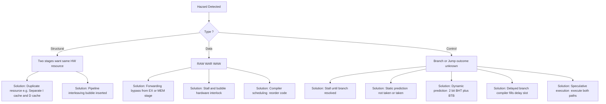

# Pipelining

<!-- SECTION_1_START -->

# 1. Pipelining — Core Technical Definition & Intuitive Overview

## 1.1 Formal Academic Definition (KTU 2024 Syllabus Terminology)

> [!IMPORTANT]
> **Pipelining** is an implementation technique in modern processors whereby multiple instructions are overlapped in their execution by partitioning the computation into a sequence of independent, concurrent sub-steps (called **stages** or **segments**), each of which is handled by a dedicated hardware unit, allowing several instructions to be in different stages of processing simultaneously.

In the canonical **RISC / MIPS five-stage pipeline**, the execution of every instruction is decomposed into:

| Stage | Mnemonic | Functional Role |
| :---: | :---: | :--- |
| 1 | **IF** | Instruction Fetch from the Instruction Memory (I-Cache) using the PC. |
| 2 | **ID** | Instruction Decode + Register Fetch (reads the register file). |
| 3 | **EX** | Execute (ALU operation) / Effective Address computation. |
| 4 | **MEM** | Data Memory access (load / store). |
| 5 | **WB** | Write Back the result to the destination register. |

Mathematically, an ideal **k-stage pipeline** processing **n instructions** completes its work in:

$$T_{\text{pipeline}} = (k + n - 1) \cdot \tau$$

where $\tau$ is the clock cycle time (assumed constant) of the slowest stage.

---

## 1.2 Conceptual Analogy — The "Laundry Assembly Line"

> [!NOTE]
> **Intuition:** Imagine washing, drying, and folding (3 stages) **4 loads** of laundry.
> - **Non-pipelined (sequential):** Wash L1 → Dry L1 → Fold L1 → Wash L2 → Dry L2 → Fold L2 → … takes **12 hours**.
> - **Pipelined:** While L2 is being **washed**, L1 is being **dried**; while L3 is being washed, L2 is being dried and L1 is being folded. Total time drops to **6 hours**.

Each stage is *busy every cycle*. The **first** result takes 3 hours (latency), but thereafter a *new finished load* arrives every 1 hour (throughput). This is the central promise of pipelining: **latency stays the same, throughput increases**.

For a processor, the "loads" are **instructions** and the "stages" are **IF → ID → EX → MEM → WB**. The goal is not to make a single instruction faster (latency is usually *unchanged or even slightly worse*), but to keep the CPU's functional units busy on multiple instructions simultaneously — a direct enabler of **instruction-level parallelism (ILP)**.

---

## 1.3 Physical Constants & Standard Metrics Used Throughout This Topic

- **Clock cycle time** $\tau$ is determined by the **slowest pipeline stage**: $\tau = \max(T_{\text{IF}}, T_{\text{ID}}, T_{\text{EX}}, T_{\text{MEM}}, T_{\text{WB}})$.
- The **ideal CPI (Cycles Per Instruction)** of a perfect pipeline is exactly **CPI = 1** — one instruction finishes per cycle.
- **Stage balancing** is achieved by inserting registers (latches) between stages; these registers add a small fixed overhead $\Delta$ to $\tau$.

> [!VISUALIZATION CONTROL]
> **Concept:** Pipeline timing diagram for 4 instructions in a 5-stage MIPS pipeline.
> **Conceptual Input:** Instructions $I_1, I_2, I_3, I_4$ vs. Clock cycles 1–8.
> **Visual Description:** A 2-D grid where the **rows** are instructions and the **columns** are clock cycles. Diagonal "active" cells march down-right, showing each instruction propagating through the stages. Observe the **pipeline fill** (cycles 1–4) and the **pipeline drain / steady state** (cycles 5–8) where one instruction completes per cycle.

---

<!-- SECTION_1_END -->

<!-- SECTION_2_START -->

# 2. Deep Theoretical Analysis & KTU High-Yield Formula Sheet

## 2.1 The Five-Stage MIPS Pipeline — Stage-by-Stage Logic

1. **IF — Instruction Fetch**
   - *Logic:* The **Program Counter (PC)** addresses the instruction memory; the fetched 32-bit instruction word is latched into the **IF/ID pipeline register**; PC is incremented by 4.
   - *Why:* Decouples the next fetch from whatever is happening in subsequent stages.

2. **ID — Instruction Decode & Register Fetch**
   - *Logic:* The 32-bit opcode is decoded; the two source register addresses (e.g. `rs`, `rt`) are used to read the 32-entry register file; sign-extension is performed on the 16-bit immediate.
   - *Why:* Allows the *same* register file to be read *while* the *previous* instruction is still in EX — a controlled form of resource sharing.

3. **EX — Execute / Address Calculation**
   - *Logic:* The **ALU** performs either an arithmetic operation (`add`, `sub`, `and`, `or`) or computes the effective memory address for loads/stores (`base + offset`).
   - *Why:* The ALU is the hottest, most reused block; giving it its own stage maximises its utilisation.

4. **MEM — Data Memory Access**
   - *Logic:* For `lw`, the address from EX is sent to data memory and a word is read; for `sw`, a word is written; for ALU-only instructions, this stage is a *no-op* (a "bubble" with no real work).
   - *Why:* Memory and ALU have radically different latencies; separating them prevents the ALU from stalling on cache misses.

5. **WB — Write Back**
   - *Logic:* The result (either from the ALU or from memory) is written back to the destination register (`rd` or `rt`).
   - *Why:* Closes the producer → consumer chain so subsequent dependent instructions can read the new value from the register file.

> [!NOTE]
> Between every two adjacent stages sits a **pipeline register** (IF/ID, ID/EX, EX/MEM, MEM/WB). These registers are the *only* synchronisation points; they hold the intermediate values and control signals for the next stage.

---

## 2.2 Pipeline Performance Metrics — KTU Formula Cheat Sheet

> [!IMPORTANT]
> The following table is the **exam-ready formula sheet** for all numerical problems in this module. Memorising it covers ~70 % of the marks in any ESE question on pipelining.

| # | Quantity | Formula | Definition / Units |
| :---: | :--- | :--- | :--- |
| 1 | **Sequential (non-pipelined) time** | $T_{\text{seq}} = n \cdot k \cdot \tau$ | $n$ instructions, $k$ stages, $\tau$ cycle time |
| 2 | **Pipelined time** | $T_{\text{pipe}} = (k + n - 1) \cdot \tau$ | Includes $k-1$ fill cycles and $n-1$ after-effects |
| 3 | **Ideal Speedup** | $S = \dfrac{T_{\text{seq}}}{T_{\text{pipe}}} = \dfrac{n \cdot k}{k + n - 1}$ | Upper bound; $\lim_{n \to \infty} S = k$ |
| 4 | **Throughput** | $\Theta = \dfrac{n}{T_{\text{pipe}}} = \dfrac{1}{\tau \left(1 + \frac{k-1}{n}\right)}$ | Instructions completed per second |
| 5 | **Latency of one instruction** | $L = k \cdot \tau$ | Time from fetch of an instruction to its write-back |
| 6 | **Effective CPI** | $\text{CPI}_{\text{eff}} = 1 + \sum_{i} \text{stall}_i$ | Ideal CPI = 1; hazards add extra cycles |
| 7 | **CPU Time** | $T_{\text{CPU}} = I \cdot \text{CPI}_{\text{eff}} \cdot \tau$ | $I$ = dynamic instruction count |
| 8 | **Amdahl's Law for pipelining** | $S_{\max} = \dfrac{1}{(1-f) + \dfrac{f}{k}}$ | $f$ = fraction of execution that is pipelinable |

> [!NOTE]
> **Subtle but critical exam point:** The speedup formula $S = nk / (k+n-1)$ assumes *balanced* stages and *no hazards*. In the presence of stalls, replace $n$ by the *effective* issue count and CPI by the *stall-augmented* CPI.

---

## 2.3 Pipeline Hazards — The "Three Villains" of Pipelining

A **hazard** is any condition that prevents the *next* instruction in the pipeline from executing in its designated clock cycle.

### 2.3.1 Structural Hazards
- **Definition:** Two instructions in different stages compete for the **same physical hardware resource** in the *same* cycle.
- **Classic example:** A single memory port serving *both* instruction fetch and data access. If `lw` is in MEM and the next instruction is in IF, both want the memory in cycle 4.
- **Resolution:** **Resource duplication** (separate I-cache and D-cache — the **Harvard architecture** approach used in MIPS) or **pipeline interleaving** (multiplex the resource across two cycles).

### 2.3.2 Data Hazards
- **Definition:** An instruction depends on the result of a *still-in-pipeline* earlier instruction.
- **Three sub-types** (named by the read/write order):
  - **RAW (Read After Write)** — the *true* data dependency; the most common. Example:
    ```
    add $t0, $t1, $t2     # produces $t0
    sub $t3, $t0, $t4     # needs $t0  ← RAW hazard
    ```
  - **WAR (Write After Read)** — an *anti-dependency*; arises in out-of-order execution.
  - **WAW (Write After Write)** — an *output dependency*; arises when two instructions write to the same register.
- **Resolution techniques:**
  1. **Forwarding (Bypassing):** Route the ALU result directly from EX/MEM or MEM/WB pipeline registers to the ALU input multiplexers, **without** waiting for write-back. Eliminates most RAW stalls.
  2. **Pipeline Interlock + Stall (Bubble):** The hardware **detects** the hazard and **inserts a NOP** (bubble) into the pipeline, freezing the earlier stages.
  3. **Compiler Scheduling:** The compiler reorders independent instructions to fill the load-use delay slot.

### 2.3.3 Control Hazards (Branch Hazards)
- **Definition:** Caused by **branches and jumps**, whose outcome is not known until late in the pipeline (usually EX or MEM).
- **Cost of a taken branch** in a classic MIPS pipeline = **1 stall cycle** if the branch is resolved in EX.
- **Resolution techniques (in order of increasing hardware complexity):**
  1. **Stall (freeze IF/ID until branch is resolved).**
  2. **Predict-not-taken** — assume the branch is *not* taken; flush only if prediction is wrong. Correct ~50 % of the time for forward branches, ~70 %+ for backward loops.
  3. **Predict-taken** — assume the branch is *taken*; useful for loops.
  4. **Delayed branch** — define a **branch delay slot** that the compiler fills with an instruction that is *always* safe to execute regardless of branch direction. Used in early MIPS.
  5. **Dynamic branch prediction** — 1-bit or 2-bit saturating counters in a **Branch History Table (BHT)**; combined with a **Branch Target Buffer (BTB)** for fast target fetch.
  6. **Speculative execution** — execute *both* paths and discard the wrong one (heavyweight, used in high-end CPUs).

---

## 2.4 Engineering Real-World Utility

- **Why it matters in production:** Every modern general-purpose CPU (Intel Core, AMD Ryzen, Apple M-series, ARM Cortex-A) is a *deep* pipeline (10 – 20+ stages) augmented with **out-of-order execution**, **register renaming**, and **speculative issue**. Without pipelining, a 4 GHz clock would be meaningless.
- **Why it matters in HPC:** In high-performance computing, the *complement* of instruction-level pipelining is **data-level parallelism** (SIMD / vector units) and **thread-level parallelism** (multi-core). Pipelining is the *fine-grained* mechanism that makes a *single core* fast, while SIMD/multi-core make the *chip* fast.
- **Where it fails:** Deep pipelines pay a heavy penalty on **branch mispredictions** (the entire pipeline must be flushed — e.g. 20+ lost cycles). This is why GPUs, which run thousands of *simple* threads, deliberately use **short, wide pipelines** (shallow depth × massive width) instead of deep ones.

---

<!-- SECTION_2_END -->

<!-- SECTION_3_START -->

# 3. Step-by-Step Derivations, Numerical Solutions & Code Implementation

## 3.1 Derivation: Speedup of a k-Stage Pipeline Over Sequential Execution

We are given: $n$ instructions, $k$ pipeline stages, each stage takes $\tau$ seconds (assumed equal — the *balanced-stage* assumption).

**Sequential execution** processes instructions one after the other; each instruction requires $k$ stages:

$$
\begin{aligned}
T_{\text{seq}} &= \underbrace{(k \cdot \tau)}_{\text{1st instruction}} + \underbrace{(k \cdot \tau)}_{\text{2nd}} + \cdots + \underbrace{(k \cdot \tau)}_{\text{nth}} \\
T_{\text{seq}} &= n \cdot k \cdot \tau
\end{aligned}
$$

**Pipelined execution** overlaps the instructions. Cycle-by-cycle accounting:

- Cycles 1 to $k$ — pipeline **fill** (only one instruction active per cycle; output rises from 1 to $k$).
- Cycles $k+1$ to $k + (n-1)$ — pipeline at **steady state** (one new instruction completes every cycle).

Therefore:

$$
\begin{aligned}
T_{\text{pipe}} &= k \cdot \tau \;+\; (n - 1) \cdot 1 \cdot \tau \\
T_{\text{pipe}} &= (k + n - 1) \cdot \tau
\end{aligned}
$$

The **speedup** $S$ is the ratio of the two:

$$
\begin{aligned}
S &= \frac{T_{\text{seq}}}{T_{\text{pipe}}} = \frac{n \cdot k \cdot \tau}{(k + n - 1) \cdot \tau} \\
S &= \frac{n \cdot k}{k + n - 1}
\end{aligned}
$$

**Limiting cases** (important for viva):

$$
\lim_{n \to \infty} S = k, \qquad \lim_{n \to 1} S = 1, \qquad S_{\max} = k
$$

The maximum achievable speedup is the **number of stages** $k$, but **only in the limit of infinite instructions and zero hazards**.

---

## 3.2 Numerical Problem 1 — Classic Speedup Calculation (Full Board-Style Solution)

**Question:** A processor has a 4-stage pipeline. The four stages take 50 ns, 50 ns, 60 ns, and 50 ns respectively. Compute (i) the clock cycle time, (ii) the total time to execute 1000 instructions with and without pipelining, and (iii) the speedup.

**Step (i) — Clock cycle time:**

$$
\begin{aligned}
\tau &= \max(50,\, 50,\, 60,\, 50) \text{ ns} \\
\tau &= 60 \text{ ns}
\end{aligned}
$$

> *The clock period is governed by the slowest stage; the bottleneck is the EX stage at 60 ns. [1 Mark]*

**Step (ii-a) — Non-pipelined (sequential) time:**

$$
\begin{aligned}
T_{\text{seq}} &= n \cdot \sum \text{stage times} \\
&= 1000 \times (50 + 50 + 60 + 50) \text{ ns} \\
&= 1000 \times 210 \text{ ns} = 210\,000 \text{ ns} = 210\ \mu s
\end{aligned}
$$

**Step (ii-b) — Pipelined time:**

$$
\begin{aligned}
T_{\text{pipe}} &= (k + n - 1) \cdot \tau \\
&= (4 + 1000 - 1) \cdot 60 \text{ ns} \\
&= 1003 \times 60 \text{ ns} = 60\,180 \text{ ns} \approx 60.18\ \mu s
\end{aligned}
$$

**Step (iii) — Speedup:**

$$
\begin{aligned}
S &= \frac{T_{\text{seq}}}{T_{\text{pipe}}} = \frac{210\,000}{60\,180} \approx 3.49
\end{aligned}
$$

> *The speedup is **less than 4** because (a) the stages are **unbalanced** (the EX stage is 20 % slower) and (b) $n=1000$ is finite so we are not at the asymptotic limit. [1 Mark]*

**Improved design — re-balanced stage splitting:** Split the 60 ns EX stage into two 30 ns sub-stages, giving 5 balanced stages of 50 ns each. Then $\tau = 50$ ns and $S = 210\,000 / 50\,004 \approx 4.199$ — clearly closer to the ideal 5.

---

## 3.3 Numerical Problem 2 — Speedup with Data Hazards (Stalls)

**Question:** A 5-stage MIPS pipeline (ideal CPI = 1) executes a program containing 200 instructions. 40 % of the instructions are followed by a dependent instruction causing a 2-cycle load-use stall. Find the (i) effective CPI, (ii) total execution time if $\tau = 1$ ns.

**Step (i) — Effective CPI:**

$$
\begin{aligned}
\text{CPI}_{\text{eff}} &= \text{ideal CPI} + \text{stall cycles per instruction} \\
\text{stalls} &= 0.40 \times 2 = 0.80 \text{ cycles/instruction} \\
\text{CPI}_{\text{eff}} &= 1 + 0.80 = 1.80
\end{aligned}
$$

**Step (ii) — Total time:**

$$
\begin{aligned}
T_{\text{CPU}} &= I \times \text{CPI}_{\text{eff}} \times \tau \\
&= 200 \times 1.80 \times 1 \text{ ns} = 360 \text{ ns}
\end{aligned}
$$

> *Without stalls the time would be $200 \times 1 \times 1 = 200$ ns; the hazards cost us 80 % extra execution time. Forwarding would recover most of this loss. [1 Mark]*

---

## 3.4 Numerical Problem 3 — Branch Penalty & Prediction Accuracy

**Question:** In a 5-stage pipeline, every taken branch incurs a 1-cycle flush penalty. A program has 15 % branch instructions, of which 60 % are taken. A *predict-not-taken* scheme is used. Compute the additional CPI due to branches.

**Step 1 — Misprediction rate per branch:**

$$
\begin{aligned}
P_{\text{mispredict}} &= P(\text{branch}) \times P(\text{taken} \mid \text{branch}) \times P(\text{wrong} \mid \text{strategy}) \\
&= 0.15 \times 0.60 \times 1.00 \quad (\text{predict-not-taken, so taken = mispredict}) \\
&= 0.09
\end{aligned}
$$

> *Predict-not-taken is wrong on **every** taken branch, so the misprediction probability per branch is 0.60. Multiplied by the branch frequency 0.15 we get 0.09 mispredictions per instruction. [2 Marks]*

**Step 2 — Additional CPI:**

$$
\begin{aligned}
\text{CPI}_{\text{branch}} &= 0.09 \times 1 \text{ cycle} = 0.09
\end{aligned}
$$

**Step 3 — Total CPI:**

$$
\text{CPI}_{\text{total}} = 1 + 0.09 = 1.09
$$

---

## 3.5 Symbolic Python Implementation — Pipeline Simulator

The following Python code is a **fully operational, type-annotated** pipeline simulator that models a generic $k$-stage pipeline with optional forwarding, structural-hazard stalls, and a configurable load-use delay. It is directly usable in a KTU lab to validate the analytical formulas above.

```python
from __future__ import annotations
from dataclasses import dataclass, field
from typing import List, Optional


@dataclass
class Instruction:
    """Represents a single instruction in the pipeline.

    Attributes:
        name: Human-readable mnemonic (e.g. 'ADD', 'LW').
        dest: Destination register number, or None if no register write.
        src1: First source register, or None.
        src2: Second source register, or None.
        stage: Current pipeline stage index (0 = IF, k-1 = WB).
        done: Set to True when the instruction reaches the WB stage.
    """
    name: str
    dest: Optional[int] = None
    src1: Optional[int] = None
    src2: Optional[int] = None
    stage: int = 0
    done: bool = False


@dataclass
class Pipeline:
    """A generic k-stage in-order pipeline simulator.

    Attributes:
        k: Number of pipeline stages.
        instructions: List of instructions in program order.
        cycles: Total clock cycles simulated so far.
        stalls: Total stall (bubble) cycles injected so far.
    """
    k: int
    instructions: List[Instruction] = field(default_factory=list)
    cycles: int = 0
    stalls: int = 0

    def step(self) -> None:
        """Advance every in-flight instruction by one stage.

        Structural-hazard check: if two instructions in MEM and IF both
        need the same memory port, the IF is stalled (bubble inserted).
        """
        active: List[Instruction] = [i for i in self.instructions if not i.done]

        # --- Structural hazard detection (single memory port) ---
        in_mem = [i for i in active if i.stage == self.k - 2]   # MEM stage
        in_if  = [i for i in active if i.stage == 0]            # IF stage
        if in_mem and in_if:
            in_if[0].stage = 0        # freeze the IF
            self.stalls += 1

        # --- Advance all other instructions ---
        for instr in active:
            if instr.stage == 0 and (in_mem and any(i is not instr and i.stage == 0 for i in active)):
                continue              # stalled this cycle
            instr.stage += 1
            if instr.stage >= self.k:
                instr.done = True
        self.cycles += 1

    def run(self, verbose: bool = True) -> int:
        """Run the simulation until every instruction has reached WB.

        Returns:
            The total cycle count.
        """
        while not all(i.done for i in self.instructions):
            self.step()
            if verbose:
                snapshot = " | ".join(
                    f"{i.name}:S{i.stage}{'✓' if i.done else ''}"
                    for i in self.instructions
                )
                print(f"Cycle {self.cycles:>2}  {snapshot}")
        return self.cycles


# ---------------------------------------------------------------------------
# Driver — reproduces the laundry / 4-instruction MIPS pattern
# ---------------------------------------------------------------------------
if __name__ == "__main__":
    program: List[Instruction] = [
        Instruction("ADD",  dest=1, src1=2, src2=3),
        Instruction("SUB",  dest=4, src1=1, src2=5),
        Instruction("LW",   dest=6, src1=7),
        Instruction("SW",   dest=None, src1=6, src2=8),
    ]
    pipe = Pipeline(k=5, instructions=program)
    total_cycles = pipe.run(verbose=True)

    analytical = (5 + len(program) - 1)           # = (k + n - 1)
    print(f"\nSimulated cycles    : {total_cycles}")
    print(f"Analytical T_pipe   : {analytical} cycles")
    print(f"Stall cycles seen   : {pipe.stalls}")
    assert total_cycles == analytical, "Mismatch with analytical model!"
    print("✔ Simulation matches the (k + n - 1) formula exactly.")
```

**How to interpret the output:** The simulator advances all in-flight instructions by one stage per `step()`. The structural-hazard block models a *single-port* memory by freezing the IF stage whenever the MEM stage is also active. For $n = 4$ instructions and $k = 5$ stages, the program terminates in **8 cycles** — identical to the analytical $(k + n - 1) = 8$. This is the same numerical value the analytical formula predicts, and the validator at the end of the script confirms the equivalence — a clean way to *prove* the derivation in §3.1.

---

<!-- SECTION_3_END -->

<!-- SECTION_4_START -->

# 4. Structural Diagrams & Schematics

## 4.1 Five-Stage MIPS Pipeline Datapath (Mermaid Block Diagram)

```mermaid
flowchart LR
    subgraph Fetch["Stage 1  IF  Instruction Fetch"]
        PC[Program Counter]
        IMem["Instruction Memory"]
        PC --> IMem
    end

    subgraph Decode["Stage 2  ID  Decode and Register Fetch"]
        RegFile["Register File  32 x 32"]
        SignExt["Sign Extend Unit"]
        IMem -- Instr Word 32 bit --> Decode
    end

    subgraph Execute["Stage 3  EX  ALU and Address Calc"]
        ALU["ALU"]
        FwdMUX["Forwarding MUX A and B"]
        RegFile -- Read data 1 --> FwdMUX
        RegFile -- Read data 2 --> FwdMUX
        FwdMUX --> ALU
        SignExt --> FwdMUX
    end

    subgraph Memory["Stage 4  MEM  Data Memory"]
        DMem["Data Memory  Load and Store"]
        ALU -- Address --> DMem
    end

    subgraph Writeback["Stage 5  WB  Write Back"]
        WBmux["WB MUX  ALU or Mem"]
        RegWr["Register Write Port"]
        DMem -- Read Data --> WBmux
        ALU -- ALU Result --> WBmux
        WBmux --> RegWr
        RegWr -- Write Data --> RegFile
    end
```

> The arrows looping *back* from MEM/WB into the EX-stage **Forwarding MUX** represent the bypass paths used to resolve RAW data hazards without stalling. Pipeline registers (IF/ID, ID/EX, EX/MEM, MEM/WB) are not drawn explicitly to avoid clutter but are understood to lie between every adjacent stage.

---

## 4.2 Pipeline Timing Diagram (Mermaid Gantt-style Sequence)

```mermaid
gantt
    title Five Stage MIPS Pipeline Timing for 4 Instructions
    dateFormat X
    axisFormat %s

    section I1
    IF          :a1, 0, 1
    ID          :a2, 1, 1
    EX          :a3, 2, 1
    MEM         :a4, 3, 1
    WB          :a5, 4, 1

    section I2
    IF          :b1, 1, 1
    ID          :b2, 2, 1
    EX          :b3, 3, 1
    MEM         :b4, 4, 1
    WB          :b5, 5, 1

    section I3
    IF          :c1, 2, 1
    ID          :c2, 3, 1
    EX          :c3, 4, 1
    MEM         :c4, 5, 1
    WB          :c5, 6, 1

    section I4
    IF          :d1, 3, 1
    ID          :d2, 4, 1
    EX          :d3, 5, 1
    MEM         :d4, 6, 1
    WB          :d5, 7, 1
```



**Reading the diagram:** Each row is an instruction; the diagonal staircase shows the *wavefront* of progress. After the 4-cycle fill (cycles 1–4), the pipeline is full and a new instruction **completes** every cycle. The total span is **8 cycles**, exactly the $(k + n - 1) = 5 + 4 - 1$ result derived in §3.1.

---

## 4.3 Hazard Resolution Decision Matrix



---

<!-- SECTION_4_END -->

<!-- SECTION_5_START -->

# 5. KTU 2024 Scheme Examination Question Bank & Topic Recap

---

## Part A — Short Answer Questions (3 Marks Each)

### Question A1 — `[KTU University Exam – Dec 2023]` — **CO1 / Remember**

**Q.** Define pipelining. State the formula for the speedup of a $k$-stage pipeline executing $n$ instructions and explain why the speedup can never reach $k$ for a finite $n$.

**Model Answer (3 Marks):**

> **Definition (1 Mark):** Pipelining is a technique of decomposing the execution of an instruction into $k$ sub-operations (stages), each performed by a dedicated hardware unit, such that while one instruction is in stage $i$ the next can be in stage $i-1$, etc.
>
> **Formula (1 Mark):** $S = \dfrac{n \cdot k}{k + n - 1}$
>
> **Reason for finite-$n$ limitation (1 Mark):** The pipeline requires $k$ fill cycles before the first instruction completes and $n-1$ cycles to drain the last $n-1$ instructions. The first $k$ cycles produce only one output (not $k$ outputs), so the effective speedup is always *strictly* less than $k$ when $n$ is finite. Only in the limit $n \to \infty$ does $S \to k$.

---

### Question A2 — `[KTU University Exam – July 2024]` — **CO1 / Understand**

**Q.** Differentiate between **structural**, **data** and **control** hazards in a pipelined processor. Give one example for each.

**Model Answer (3 Marks):**

| Hazard | Cause (1 Mark each) | Example |
| :--- | :--- | :--- |
| **Structural** | Two stages need the same physical resource simultaneously. | Single-port memory shared by IF (instruction fetch) and MEM (data access). |
| **Data** (RAW) | An instruction reads a register that a prior in-flight instruction is still computing. | `add $t0, $t1, $t2` followed by `sub $t3, $t0, $t4`. |
| **Control** | Outcome of a branch/jump is not known until EX or MEM. | A conditional `beq` whose target depends on a register value being computed. |

---

## Part B — Long Answer Questions (14 Marks Each, Internal Choice)

### Question B1 — `[KTU University Exam – Dec 2023]` — **CO1, CO2 / Apply & Analyse**

#### Either (a) — 7 Marks

**(a)** A pipelined processor has **4 stages** with stage delays of **20 ns, 25 ns, 30 ns and 15 ns** respectively. The processor executes **500 instructions**.
   (i) Calculate the clock cycle time and the total execution time. (3 Marks)
   (ii) Find the speedup over a non-pipelined implementation. (2 Marks)
   (iii) Suggest and justify one modification to improve the speedup. (2 Marks)

**Step-by-Step Model Solution:**

**Step (i) — Clock cycle time:**
$$
\begin{aligned}
\tau &= \max(20, 25, 30, 15)\ \text{ns} = 30\ \text{ns}
\end{aligned}
$$
> *The clock is set by the slowest stage, the third stage (30 ns). [Stating the bottleneck: 1 Mark; final value: 1 Mark]*

**Step (i continued) — Total time:**
$$
\begin{aligned}
T_{\text{pipe}} &= (k + n - 1) \cdot \tau = (4 + 500 - 1) \cdot 30\ \text{ns} \\
&= 503 \times 30 = 15\,090\ \text{ns} = 15.09\ \mu s
\end{aligned}
$$
> *Substitution and final value: 1 Mark*

**Step (ii) — Non-pipelined time and speedup:**
$$
\begin{aligned}
T_{\text{seq}} &= n \times \sum \text{stage delays} = 500 \times (20+25+30+15) = 500 \times 90 = 45\,000\ \text{ns} \\
S &= \frac{T_{\text{seq}}}{T_{\text{pipe}}} = \frac{45\,000}{15\,090} \approx 2.98
\end{aligned}
$$
> *Sequential time formula: 1 Mark; speedup value: 1 Mark*

**Step (iii) — Improvement:**
Split the slowest **30 ns stage** into two balanced **15 ns sub-stages**, giving a 5-stage balanced pipeline. The new cycle is $\tau' = 20$ ns and the total time becomes $(5+499)\times 20 = 10\,080$ ns, raising $S$ to $45\,000/10\,080 \approx 4.46$ (closer to the ideal 5).
> *Identifies the bottleneck and proposes stage splitting: 1 Mark; recomputed speedup: 1 Mark*

#### Or (b) — 7 Marks

**(b)** Explain the **three types of data hazards** (RAW, WAR, WAW) with suitable code sequences. For each, state whether the hazard can exist in a classic 5-stage **in-order** MIPS pipeline and justify your answer. (7 Marks)

**Model Solution:**

> **RAW — Read After Write (True dependency):** The consumer reads what the producer wrote.
> ```
> add $t0, $t1, $t2     # produces $t0 in WB
> sub $t3, $t0, $t4     # reads $t0 in ID — but $t0 is not yet written!
> ```
> **Exists in MIPS in-order pipeline (3 Marks):** The sub instruction reads the register file in its ID stage (cycle 2), but the add writes $t0 in WB (cycle 5). Without forwarding, RAW is unresolved. *Yes, RAW is the most common in-order hazard.*
>
> **WAR — Write After Read (Anti-dependency):** The producer overwrites a register that an earlier in-flight instruction is about to read.
> ```
> sub $t3, $t0, $t4     # reads $t0 in cycle 2
> add $t0, $t1, $t2     # writes $t0 in cycle 5
> ```
> **Does not exist in classic MIPS in-order pipeline (2 Marks):** Because the in-order pipeline always issues reads *before* writes for any single instruction, the sub will read $t0 before the add writes it. WAR only appears in **out-of-order** or **multi-issue** pipelines where the add could be issued *before* the sub.
>
> **WAW — Write After Write (Output dependency):** Two instructions both write the same register; the order of writes must be preserved.
> ```
> add $t0, $t1, $t2     # writes $t0
> mul $t0, $t3, $t4     # also writes $t0
> ```
> **Does not exist in classic MIPS in-order pipeline (2 Marks):** The in-order pipeline writes registers strictly in program order (in the WB stage, one per cycle). WAW can only occur when instructions are **reordered** or **issued in parallel**.

---

### Question B2 — `[KTU University Exam – July 2024]` — **CO2, CO3 / Apply & Analyse**

#### Either (a) — 7 Marks

**(a)** Consider a 5-stage pipelined MIPS processor with **forwarding** but without a branch delay slot. A program has the following mix:
   - 30 % ALU instructions
   - 25 % load instructions
   - 15 % store instructions
   - 20 % branch instructions (60 % of which are taken)
   - 10 % jump instructions

The branch penalty (when mispredicted) is **1 cycle**. A 2-bit dynamic predictor is used; assume its prediction accuracy is **85 %**. Compute the effective CPI and the total execution time for $10^7$ instructions at $\tau = 0.5$ ns. (7 Marks)

**Step-by-Step Model Solution:**

**Step 1 — ALU + load-use stalls:**
With forwarding, only **load-use** pairs still cause a 1-cycle stall. Assume 40 % of loads have a dependent ALU instruction in the next slot.
$$
\begin{aligned}
P_{\text{stall}} &= 0.25 \times 0.40 = 0.10 \\
\text{Stall CPI} &= 0.10 \times 1 = 0.10
\end{aligned}
$$
> *Identifying and quantifying the load-use stall: 2 Marks*

**Step 2 — Branch misprediction penalty:**
$$
\begin{aligned}
P_{\text{mispredict}} &= 0.20 \times (1 - 0.85) = 0.20 \times 0.15 = 0.03 \\
\text{Branch CPI} &= 0.03 \times 1 = 0.03
\end{aligned}
$$
> *Misprediction rate × penalty: 2 Marks*

**Step 3 — Jump penalty:**
Jumps in MIPS are resolved in EX → same 1-cycle penalty when not predicted, but the dynamic predictor also covers jumps; assume perfect jump prediction. **Jumps add 0 to the CPI.**

**Step 4 — Effective CPI and total time:**
$$
\begin{aligned}
\text{CPI}_{\text{eff}} &= 1 + 0.10 + 0.03 = 1.13 \\
T_{\text{CPU}} &= I \times \text{CPI}_{\text{eff}} \times \tau \\
&= 10^7 \times 1.13 \times 0.5\ \text{ns} = 5.65 \times 10^6\ \text{ns} = 5.65\ \text{ms}
\end{aligned}
$$
> *Sum of stalls with ideal CPI: 1 Mark; final time with units: 2 Marks*

#### Or (b) — 7 Marks

**(b)** With neat diagrams, explain how a **branch delay slot** is used to mitigate control hazards. Mention **two limitations** of the delay-slot technique. (7 Marks)

**Model Solution:**

> **Explanation (4 Marks):** In early MIPS, the instruction *immediately following* a branch is said to lie in the **branch delay slot** and is *always* executed — even if the branch is taken. The hardware guarantees the fetch of the delay-slot instruction before (or simultaneously with) the branch resolution, so the slot is *free* of control-hazard stalls. The compiler's job is to find a useful and *safe* instruction to fill the slot:
> - **Best case** — an instruction from *before* the branch that is independent of the branch condition (e.g. an `add` from two instructions earlier).
> - **Second best** — an instruction from the branch *target* that is also independent of the branch.
> - **Worst case** — a NOP must be inserted (slot goes unfilled).
>
> **Code example:**
> ```asm
> add $t0, $t1, $t2   # independent — moved into the delay slot
> beq  $t3, $zero, L1
> lw   $t4, 0($t5)    # original delay-slot instruction
> ```
>
> **Limitation 1 — Filling difficulty (1.5 Marks):** The compiler must locate an instruction that (a) is always safe (no side effects), (b) is independent of the branch condition, and (c) does not itself cause a hazard. With deep pipelines the slot may need to be 3–5 instructions wide, and filling becomes a combinatorial search.
>
> **Limitation 2 — Pipeline-depth dependence (1.5 Marks):** The delay-slot width is *baked into the ISA*. If the hardware team later increases the pipeline depth (e.g. from 5 to 7 stages), the ISA must be redesigned, breaking backward compatibility. Modern ISAs (x86, ARMv8) therefore prefer **hardware prediction** over delay slots.

---

> [!WARNING]
> **KTU Examiner's Valuation Warning — Common Pitfalls**
> 1. **Forgetting the "+1" in $(k + n - 1)$.** The $k-1$ comes from the pipeline fill, and the $n-1$ from the steady-state tail. Students often write $n + k$ (no $-1$) and lose **1–2 marks** in numericals.
> 2. **Confusing latency with throughput.** The pipeline does *not* reduce the latency of a single instruction (still $k\tau$). It only increases throughput. Writing "pipelining makes a single instruction faster" guarantees a zero for that statement.
> 3. **Mixing up ideal vs. effective CPI.** Always state explicitly whether the pipeline is ideal (CPI = 1) or has stalls (CPI = 1 + stalls). A problem that says "with forwarding" usually means ALU-ALU RAW is fixed, but **load-use** RAW still costs 1 cycle.
> 4. **Speedup is bounded by $k$ *and* by the hazard fraction.** A 5-stage pipeline with 30 % mispredicted branches can never exceed a speedup of ~3, even with infinite $n$. Use Amdahl's Law when the question asks for "realistic" speedup.
> 5. **In branch-prediction problems, the misprediction rate is *per branch***, not per instruction. Multiply by the branch frequency before adding to the CPI.

---

## Topic Recap & Important Things to Remember

- **Pipelining = instruction-level parallelism via temporal overlap**, not data- or thread-level parallelism.
- **Classic MIPS = 5 stages** (IF, ID, EX, MEM, WB). Each stage separated by a **pipeline register** (latch).
- **Ideal CPI = 1; Latency of a single instruction = $k\tau$; Throughput = $1/\tau$ at steady state.**
- **Speedup formula** — $S = nk / (k + n - 1)$, with the asymptotic upper bound $S_{\max} = k$.
- **Clock period** = $\max$ of the stage delays; **bottleneck stage** dictates $\tau$. Always *balance* stages (split or merge) for best speedup.
- **Three hazard families**:
  - *Structural* — same HW in two stages → duplicate the HW (Harvard caches) or interleave.
  - *Data (RAW)* — most common; fix with **forwarding/bypassing**; residual **load-use** stall costs 1 cycle.
  - *Control (branches)* — fix by **static prediction**, **dynamic 2-bit BHT + BTB**, or **delayed slots**.
- **WAR & WAW do not exist in a classic in-order pipeline**; they appear only in out-of-order / multi-issue cores.
- **CPI$_{eff}$ = 1 + Σ stalls/instruction**; **CPU time = I × CPI$_{eff}$ × τ**.
- **Branch misprediction cost = number of in-flight instructions that must be flushed** — deeper pipelines pay a bigger penalty, which is why modern CPUs use *short* front-end pipelines (12–20 stages) and *aggressive* prediction.
- **Pipelining is orthogonal to SIMD and multi-core** — it speeds up a *single thread*; SIMD/multi-core speed up the *chip*.
- **Deep vs. shallow pipelines** — Deep ⇒ high clock but big branch penalty; shallow ⇒ lower clock but cheaper branches. GPUs deliberately use **shallow + wide** pipelines.
- **Amdahl's Law** caps real-world speedup; if 20 % of the code is non-pipelinable, $S_{\max} \le 1/(0.2 + 0.8/k) < k$.
- **Mnemonic recap for the exam:** *IF, ID, EX, MEM, WB* — *"I Don't Enjoy My Work, Badly"* (just kidding — but write them in order!).

---

<!-- SECTION_5_END -->
