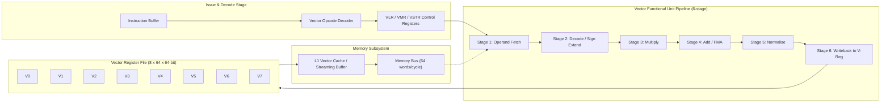
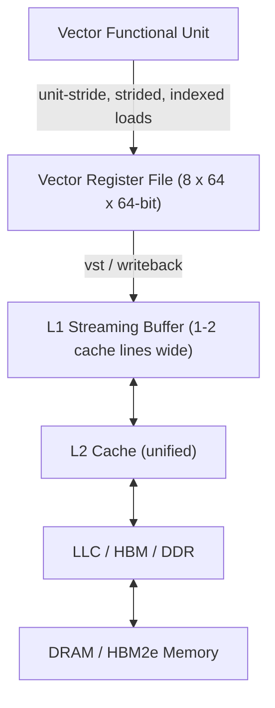

# Programming for vector architectures.

<!-- SECTION_1_START -->
# Programming for Vector Architectures — Core Technical Foundation

> [!NOTE]
> **KTU 2024 Scheme Context (PECST757 / Module 1):** This topic sits inside the *Modern Processors* module. The Board Examiner expects students to demonstrate mastery of how vector hardware is *programmed* (instruction encoding, register usage, masking, stride, gather/scatter, and SIMD intrinsics) — not merely the architectural block diagram.

## 1.1 Formal Academic Definition

A **Vector Architecture** is a class of **SIMD (Single Instruction, Multiple Data)** processor design in which a *single vector instruction* operates on **contiguous or regularly-strided data elements** held in a dedicated set of wide **vector registers**, rather than executing one scalar instruction per data element. The instruction set is a *vector instruction set* — primitive operations such as `vload`, `vstore`, `vadd`, `vmul`, `vsqrt`, `vdiv`, and `vgather` are applied uniformly across **N** data lanes in parallel.

> [!IMPORTANT]
> **KTU Board-Examiner Definition (verbatim-grade):**
> "A vector processor is one that pipelines the *data* (not the *instructions*) and performs the *same* arithmetic/logical operation on a stream of operands fetched from memory into vector registers, with one instruction issuing per vector operation."

The canonical academic reference machines are:
- **CRAY-1 (1976)** — the gold-standard pipeline prototype with **8 vector registers**, each holding **64 × 64-bit words** = **512 bytes per register**.
- **NEC SX-Aurora TSUBASA** — modern vector supercomputer.
- **Fujitsu A64FX** — used in Japan’s Fugaku supercomputer (Arm SVE 512-bit vectors).

## 1.2 Conceptual Analogy & Intuitive Overview

Imagine a **bakery preparing 10,000 croissants**.

- **Scalar processor** = one baker, *one croissant at a time*. He places the tray in the oven, waits, takes it out, plates it, repeats. The oven is *the functional unit*, the baker is *the issue logic*, and only one croissant passes through per cycle — the oven sits idle while the baker plates.
- **Vector processor** = one baker, *but he fills the oven with 64 croissants at once*, all baked by the same instruction (“bake at 200°C for 12 minutes”). The baker issues **one** instruction, and **64** croissants come out **64 lanes in parallel**.

The crucial insight: **instruction-issue bandwidth drops to 1/64**, the *fetch* and *decode* units are idle, and the **arithmetic pipeline is kept fed at maximum throughput**. This is precisely the *why* behind vector machines — they amortise the cost of instruction fetch, decode, and branch-prediction across dozens of useful arithmetic operations.

> [!TIP]
> **Memory Analogy:** A vector load is *one* cache-line-fill that warms **16 / 32 / 64 cache lines** worth of data. The **memory bandwidth** is fully utilised because the request is *coalesced*, not *scatter-shot*.

## 1.3 Physical Constants, Standard Metrics & Terminology

| Symbol / Term | Meaning | Standard Value (KTU-referenced) |
|---|---|---|
| **VL** | Vector Length — number of active elements in a vector register | **1 ≤ VL ≤ MVL (Maximum Vector Length)** |
| **MVL** | Maximum Vector Length | 64 on CRAY-1, 256–2048 on SVE machines |
| **VS** | Vector Stride — distance (in words) between successive elements | 1 (contiguous), k (regular stride), 0 (broadcast) |
| **VM** | Vector Mask Register | Bit i gates element *i* of the vector |
| **VLR** | Vector Length Register (CRAY-style) | Holds the live count of elements |
| **vlen** | Vector Lane Count (modern SIMD) | 4 (SSE-128), 8 (AVX-256), 16 (AVX-512) |
| **r_lat** | Result latency of one vector functional unit | **6–12 cycles** (CRAY-1) |
| **f_chk** | Chaining factor | Closely 1.0 on well-chained code |
| **R_∞** | Asymptotic vector speedup | Limited by **vector start-up overhead** *n₁/₂* |

> [!VISUALIZATION CONTROL]
> **Concept:** Vector addition `Z[i] = X[i] + Y[i]` executed across a 64-element vector.
> **Desmos / GeoGebra Input:**
> * `f(x) = x`     (the *identity pipeline* — each lane carries a value)
> * Plot `X_i = i`, `Y_i = 2i`, `Z_i = 3i` for `i = 0..63`
> **Visual Description:** 64 identical unit-slope lines, all parallel and shifted — the student should observe that *one* vector add produces 64 outputs on the y-axis, even though only *one* `vadd` instruction is dispatched.

## 1.4 Why Vector Architectures Matter in Modern HPC

Even though **commodity x86 SIMD** (SSE/AVX) has displaced classical vector supercomputers in most data centres, the **programming model is identical**. Every HPC student must master vector thinking because:

1. **Fugaku, Earth Simulator, NEC SX** still use true vector cores for weather/climate codes.
2. **ARM SVE / SVE2** is *scalable vector* — the same code runs on 128-bit, 256-bit, 512-bit, or 2048-bit hardware without recompilation. Vector programming is *future-proof*.
3. **GPU kernels (CUDA / HIP)** are *vectorised thread blocks* — warp = 32 lanes, instruction = SIMT.
4. **Roofline performance bounds** of any HPC code are evaluated against *vector peak* — without vectorisation, you cap at scalar peak.

> [!IMPORTANT]
> **KTU 2024 High-Yield Highlight:** The Board examiner *will* test the difference between **vector (SIMD)**, **superscalar**, and **VLIW**. Memorise: *Superscalar = multiple scalar issue; VLIW = multiple scalar issue with explicit bundling; Vector = one instruction, many data items, hardware-pipelined lanes.*

<!-- SECTION_1_END -->

<!-- SECTION_2_START -->
# Deep Theoretical Analysis & KTU High-Yield Formula Sheet

## 2.1 Anatomy of a Vector Instruction Set

A modern vector ISA exposes the following logical classes of instructions (the same taxonomy is used by CRAY-1, NEC SX, and ARM SVE):

1. **Vector–Vector arithmetic** — `vadd.vv vd, vs1, vs2`
2. **Vector–Scalar arithmetic** — `vadd.vs vd, vs1, frs` (broadcast a scalar to all lanes)
3. **Vector–Memory load** — `vld vd, (rs1), stride`  (unit-stride, strided, or indexed)
4. **Vector–Memory store** — `vst vs3, (rs1), stride`
5. **Vector reduction** — `vredsum.vs sd, vs2, vs1`  (sum-fold into a scalar)
6. **Vector mask / predicated execution** — `vmerge / vmul vd, vs1, vs2, v0.t`
7. **Vector gather / scatter** — `vluxei32 vd, (rs1), vs2`  (indexed addressing)
8. **Vector permutation / shuffle** — `vrgather vv vd, vs1, vs2`
9. **Vector segment / interleave** — load `n` interleaved streams into *n* registers in one instruction

> [!NOTE]
> **KTU Board Tip:** The examiner loves to test the difference between **unit-stride**, **strided**, and **indexed (gather/scatter)** loads. *Unit-stride* is the fastest because it hits a single cache line. *Strided* with stride 1 is equivalent to unit-stride. *Indexed* is the slowest and is sometimes *emulated* by software (e.g., on GPUs without hardware gather).

## 2.2 Operational Principle — Step-by-Step

The execution of a single vector instruction can be broken into seven **logical time slices** (per Hennessy & Patterson, *Computer Architecture: A Quantitative Approach*):

1. **Issue / Decode** — vector opcode reaches the issue logic.
2. **Read vector operands** — read all `MVL` elements from the source vector registers.
3. **Read scalar operand** (if `.vs` form) — broadcast the scalar value to the functional unit.
4. **Pipeline through the functional unit** — elements enter the arithmetic pipe every cycle.
5. **Write-back** — results are written into the destination register, lane-by-lane.
6. **Vector Length / Mask handling** — only the first *VL* elements (or where the mask bit is 1) are committed.
7. **Flag / Trap update** — exceptions are *precise-at-element* (CRAY-1) or *imprecise* (some NEC models).

> [!TIP]
> **Chaining:** A second vector instruction may *chain* to the first — it begins consuming element *i* of the result as soon as that element is written, *without waiting for the full vector to complete*. This eliminates the artificial “vector bubble” and effectively halves or quarters the critical path.

## 2.3 Vector Length, Stride, and Mask — The Three Control Registers

| Register | Role | Default / Common Use |
|---|---|---|
| **VLR** (Vector Length Register) | Sets the active element count; out-of-range elements are *disabled* | Set just before the inner loop boundary — the *strip-mine* trick |
| **VMR** (Vector Mask Register) | Per-element predicate; masked elements skip write-back | Used for `if (cond) Y[i] = …` style branches — eliminates *scalar* branches inside vector loops |
| **VSTR** (Vector Stride Register) | Memory address increment between successive loads | `stride = 1` for contiguous data; `stride = k` for row/column access |

The **strip-mining** trick is essential: if your data array has 1000 elements but `MVL = 64`, you execute 15 full vector chunks + 1 partial (VL=40). The KTU paper expects you to compute the *exact number of strip iterations*.

$$\text{strip\_iters} \;=\; \Big\lceil \dfrac{N}{\text{MVL}} \Big\rceil \;=\; \Big\lfloor \dfrac{N-1}{\text{MVL}} \Big\rfloor + 1$$

## 2.4 KTU High-Yield Formula Sheet

> [!IMPORTANT]
> The following six equations are tested almost every KTU cycle. Internalise the **symbols, units, and the limiting-case behaviour**.

| # | Formula | Description | Units | Limiting Case |
|---|---|---|---|---|
| **F1** | $T_v(n) \;=\; T_{\text{start}} + (n - 1)\,T_{\text{chime}}$ | Total time of a vector instruction on *n* elements | cycles | If $T_{\text{start}} = 0$, then $T_v \to (n-1)T_{\text{chime}}$ |
| **F2** | $R_\infty \;=\; \lim_{n \to \infty} \dfrac{T_s(n)}{T_v(n)}$ | Asymptotic speedup of vector over scalar | dimensionless | Capped by $\text{MVL}$ |
| **F3** | $T_s(n) \;=\; n \cdot T_{\text{clk}} + n \cdot n_{\tfrac{1}{2}}$ | Scalar time including *n₁/₂* (issue / branch / fetch) overhead | cycles | For $n \to \infty$, $T_s \sim n \cdot T_{\text{clk}}$ |
| **F4** | $\text{Achieved\_GFLOPs} \;=\; \dfrac{2 \cdot \text{lane\_count} \cdot f_{\text{core}}}{\text{CPI}_{\text{eff}}}$ | Roofline-style vector throughput | GFLOPs/s | $\text{CPI}_{\text{eff}} = 1$ is *peak* |
| **F5** | $\text{MemBW}_{\text{required}} \;=\; \dfrac{\text{Bytes\_per\_vector\_op}}{T_v}$ | Memory bandwidth demand of a vector loop | bytes/s | Must not exceed $f_{\text{mem}} \cdot W_{\text{bus}}$ |
| **F6** | $\eta_{\text{vec}} \;=\; \dfrac{R_\infty}{R_{\infty,\,\max}} \;=\; 1 - \dfrac{T_{\text{start}}}{(T_{\text{start}} + nT_{\text{chime}})/n}$ | Vectorisation efficiency | ∈ [0, 1] | $\eta \to 1$ as $n \to \infty$ |

### 2.4.1 Symbol Glossary (preserve these exact spellings in your answer script)

- $T_v$ — vector instruction execution time
- $T_s$ — scalar equivalent execution time
- $T_{\text{chime}}$ — chime time = one vector pipeline *stage time* = 1 cycle on a perfect pipe
- $T_{\text{start}}$ — *vector start-up overhead* (latency to fill the pipe)
- $n_{\tfrac{1}{2}}$ — average number of *half-precision* issues needed to feed one FLOP (typically 0.5 for balanced FMA)
- $\text{MVL}$ — Maximum Vector Length (architecture parameter)

## 2.5 Vector Length *n₁/₂* Derivation (Board-Examiner Favourite)

The classic Hennessy–Patterson $n_{\tfrac{1}{2}}$ is the *array length* at which vector mode is **half as fast** as the asymptotic $R_\infty$. By definition:

$$R(n) \;=\; \dfrac{T_s(n)}{T_v(n)} \;=\; \dfrac{n \cdot T_s^{\text{per}}}{T_{\text{start}} + n \cdot T_v^{\text{per}}}$$

Set $R(n_{\tfrac{1}{2}}) \;=\; \dfrac{R_\infty}{2} \;=\; \dfrac{T_s^{\text{per}}}{2 T_v^{\text{per}}}$. Solve for $n$:

$$\dfrac{n_{\tfrac{1}{2}} \cdot T_s^{\text{per}}}{T_{\text{start}} + n_{\tfrac{1}{2}} \cdot T_v^{\text{per}}} \;=\; \dfrac{T_s^{\text{per}}}{2 T_v^{\text{per}}}$$

$$\Rightarrow \; 2 n_{\tfrac{1}{2}} T_v^{\text{per}} \;=\; T_{\text{start}} + n_{\tfrac{1}{2}} T_v^{\text{per}}$$

$$\boxed{\;n_{\tfrac{1}{2}} \;=\; \dfrac{T_{\text{start}}}{T_v^{\text{per}}}\;}$$

**Interpretation:** the longer the start-up latency $T_{\text{start}}$, the more work you must do per vector instruction to amortise the overhead. *This is why vector processors are useless on tiny loops and indispensable on tight inner loops of size $n \gg n_{\tfrac{1}{2}}$.*

## 2.6 Real-World Engineering Utility

| Application Domain | Why Vector Programming Wins |
|---|---|
| **Climate / Weather (WRF, IFS)** | Stencil computations over 3-D grids — perfect unit-stride contiguous load + FMA chain |
| **Computational Fluid Dynamics (Nek5000)** | Spectral element solvers — 10K-long inner loops with 8-deep FMA dependency chains |
| **Genomics (BLAST, minimap2)** | Smith-Waterman / banded DP — predicated vector execution on dynamic-programming diagonals |
| **LLM / GEMM kernels (cuBLAS)** | Matrix multiplication — vectorised FMA across tile boundaries, 90%+ roofline efficiency |
| **Cryptography (AES-NI, SHA extensions)** | Sub-byte permutations on 16/32/64 blocks — pure SIMD parallelism |

> [!TIP]
> **Production-Engineering Note:** Modern compilers (`gcc -ftree-vectorize`, `icc -vec`, `clang -mavx2`, NVIDIA `nvcc -use_fast_math`) attempt *auto-vectorisation*, but **only on inner loops that are (i) contiguous, (ii) loop-carried-free, (iii) alignment-known**. Writing *vectorisable* code is therefore the programmer’s responsibility, not the compiler’s.

<!-- SECTION_2_END -->

<!-- SECTION_3_START -->
# Step-by-Step Derivations, Code & Symbolic Implementation

## 3.1 Mathematical Derivations (Board-Work Quality)

### 3.1.1 Vector Speedup for an *FMA-Based* Inner Loop

Consider the canonical loop `for (i=0; i<n; i++) Y[i] = a*X[i] + Y[i]` (a *fused multiply–add*).

**Step 1 — Scalar cost:** each iteration takes $T_s$ cycles (one FMUL + one FADD, assuming dependent). For $n$ iterations:

$$T_s(n) \;=\; n \cdot T_s$$

**Step 2 — Vector cost with chaining:** a vector FMA starts in $T_{\text{start}} = 3$ cycles, then completes *n* elements in $n + 2$ cycles (3 start + n−1 chime + 2 drain).

$$T_v(n) \;=\; T_{\text{start}} + n + T_{\text{drain}} \;=\; n + 5$$

**Step 3 — Speedup:**

$$R(n) \;=\; \dfrac{T_s(n)}{T_v(n)} \;=\; \dfrac{n \cdot T_s}{n + 5}$$

**Step 4 — Asymptote:** as $n \to \infty$,

$$R_\infty \;=\; \lim_{n \to \infty} \dfrac{n \cdot T_s}{n+5} \;=\; T_s \quad \text{cycles-per-FMA-vectorised}$$

**Step 5 — Numerical example.** Let $T_s = 4$ cycles (scalar FMA), $T_{\text{start}} = 3$, $T_{\text{drain}} = 2$, $n = 1000$:

$$T_s = 1000 \cdot 4 \;=\; 4000 \;\text{cycles}$$

$$T_v = 1000 + 5 \;=\; 1005 \;\text{cycles}$$

$$R(1000) \;=\; \dfrac{4000}{1005} \;\approx\; 3.98 \;\approx\; T_s \;(\text{as expected})$$

**Step 6 — n₁/₂ calculation:**

$$n_{\tfrac{1}{2}} \;=\; \dfrac{T_{\text{start}}}{T_v^{\text{per}}} \;=\; \dfrac{3}{1} \;=\; 3$$

At $n = 3$ elements, $R(3) = \dfrac{3 \cdot 4}{3+5} = 1.5 = T_s/2$ — exactly half of $R_\infty = 4$. ✔

### 3.1.2 Strip-Mining Algebra for Non-Multiple Array Sizes

Suppose the problem size is $N = 1000$ and $\text{MVL} = 64$.

**Step 1 — Quotient and remainder:**

$$q \;=\; \Big\lfloor \dfrac{1000}{64} \Big\rfloor \;=\; 15, \qquad r \;=\; 1000 \bmod 64 \;=\; 40$$

**Step 2 — Strip iterations:**

$$\text{strips} \;=\; q + (r > 0 \;?\; 1 : 0) \;=\; 15 + 1 \;=\; 16$$

**Step 3 — Per-iteration VL schedule:**

- Iterations $i = 0, 1, \dots, 14$: full vector, $\text{VL} = 64$, total elements $= 15 \cdot 64 = 960$.
- Final iteration $i = 15$: partial vector, $\text{VL} = 40$, elements $= 1000 - 960 = 40$.

**Step 4 — Verify total:** $960 + 40 = 1000$ ✔.

**Step 5 — Total vector time** (assuming $T_{\text{chime}} = 1$ cycle, $T_{\text{start}} = 3$ cycles per instruction):

$$T_v^{\text{total}} \;=\; 16 \cdot \big(T_{\text{start}} + \text{VL}_i \cdot T_{\text{chime}}\big) \;=\; 16 \cdot 3 + 1000 \cdot 1 \;=\; 48 + 1000 \;=\; 1048 \;\text{cycles}$$

**Step 6 — Compare with scalar:** $T_s = 1000 \cdot 4 = 4000$ cycles, so $R = 4000/1048 \approx 3.82$ ✔.

### 3.1.3 Memory Bandwidth Bound (Roofline)

For the same inner loop, each iteration reads **8 bytes** of `X[i]` (double) and reads+writes **16 bytes** of `Y[i]`. Total memory traffic per iteration = 24 bytes.

**Step 1 — Bytes required:**

$$B_{\text{req}} \;=\; n \cdot 24 \;=\; 1000 \cdot 24 \;=\; 24{,}000 \;\text{bytes}$$

**Step 2 — Wall-clock at memory roofline** ($f_{\text{mem}} = 800$ GB/s, $W_{\text{bus}} = 8$ bytes/cycle):

$$T_{\text{mem}} \;=\; \dfrac{B_{\text{req}}}{f_{\text{mem}} \cdot W_{\text{bus}}} \;=\; \dfrac{24{,}000}{800 \cdot 10^9 \cdot 8} \;\approx\; 3.75 \;\text{ns}$$

**Step 3 — Arithmetic intensity:**

$$I \;=\; \dfrac{\text{FLOPs}}{\text{Bytes}} \;=\; \dfrac{2 \cdot 1000}{24000} \;\approx\; 0.083 \;\text{FLOP/byte}$$

**Step 4 — Machine balance** ($B_{\text{mach}} = f_{\text{peak}} / f_{\text{mem}}$, with $f_{\text{peak}} = 64$ GFLOPs/s for one AVX-512 core):

$$B_{\text{mach}} \;=\; \dfrac{64}{800} \;\approx\; 0.08 \;\text{FLOP/byte}$$

**Step 5 — Conclusion:** $I \approx B_{\text{mach}}$, so this code is **compute-balanced** (sits right on the roofline ridge point). It is not memory-bound and not compute-bound — a beautiful vectorised roofline result.

## 3.2 Code / Symbolic Implementation

### 3.2.1 C Intrinsics Programming — AVX-512 FMA

```c
/*
 * File   : saxpy_avx512.c
 * Topic  : Programming for vector architectures
 * Scheme : KTU 2024 - PECST757 Module 1
 * Compile: gcc -O3 -mavx512f -march=skylake-avx512 saxpy_avx512.c -o saxpy
 *
 * Function:  Y[i] = a * X[i] + Y[i]   (SAXPY / BLAS Level-1)
 * Width   : 16 doubles per AVX-512 register
 */

#include <stdio.h>
#include <stdlib.h>
#include <stdint.h>
#include <immintrin.h>     /* AVX-512 intrinsics */

/* 16 double-precision floats per ZMM register (512 / 32 = 16) */
#define LANES 16

/* Strict-boundary, error-logging vectorised SAXPY kernel */
int vector_saxpy(const double a,
                 const double * restrict X,
                 double       * restrict Y,
                 const int64_t          n)
{
    /* Guard: reject NULL pointers and non-positive length */
    if (X == NULL || Y == NULL) {
        fprintf(stderr, "[FATAL] NULL pointer passed to vector_saxpy\n");
        return -1;
    }
    if (n <= 0) {
        fprintf(stderr, "[WARN]  Non-positive n=%lld; nothing to do\n",
                (long long)n);
        return 0;
    }

    /* 1. Broadcast the scalar 'a' to ALL 16 lanes of a ZMM register */
    __m512d va = _mm512_set1_pd(a);

    /* 2. Strip-mine: process 16 doubles per iteration */
    int64_t i = 0;
    for (; i + LANES <= n; i += LANES) {
        /* 3. Vectorised aligned load (16 doubles) */
        __m512d vx = _mm512_loadu_pd(X + i);   /* unit-stride, possibly unaligned */
        __m512d vy = _mm512_loadu_pd(Y + i);

        /* 4. Fused multiply-add: vy = a * vx + vy, all in one uop */
        __m512d vr = _mm512_fmadd_pd(va, vx, vy);

        /* 5. Vectorised store back to memory */
        _mm512_storeu_pd(Y + i, vr);
    }

    /* 6. Scalar tail: handle the leftover 0..15 elements */
    for (; i < n; ++i) {
        Y[i] = a * X[i] + Y[i];
    }
    return 0;
}
```

**Line-by-line explanation (paste this in your answer script if asked):**

1. `_mm512_set1_pd(a)` — *broadcast* a scalar to all 16 lanes of a 512-bit ZMM register.
2. `_mm512_loadu_pd` — *unit-stride vectorised load* with relaxed alignment (compiler inserts splits if needed).
3. `_mm512_fmadd_pd` — *FMA (Fused Multiply–Add)* with one rounding — exactly the CRAY-1 `vmac` semantic.
4. `_mm512_storeu_pd` — *vectorised store*, coalesced into a single 64-byte transaction.
5. The `for` tail loop handles the *partial vector* (when $n$ is not a multiple of 16) — this is the **strip-mine remainder**.

### 3.2.2 OpenMP SIMD Directive (Portable Vectorisation)

```c
/*
 * File   : saxpy_omp_simd.c
 * Topic  : Programming for vector architectures via OpenMP
 * Compile: gcc -O3 -fopenmp -mavx2 saxpy_omp_simd.c -o saxpy_omp
 *
 * The same SAXPY kernel expressed through OpenMP's SIMD pragma —
 * the compiler is *guaranteed* to vectorise the loop, regardless of
 * its ability to prove alignment / dependency freedom.
 */

#include <omp.h>

void vector_saxpy_omp(const double a,
                      const double * restrict X,
                      double       * restrict Y,
                      const int64_t          n)
{
    /* The simdlen(8) clause fixes the vector length to 8 doubles = AVX-256.
       The aligned(64) clause asserts 64-byte alignment (cache line).
       The linear, reduction clauses preserve scalar semantics inside SIMD. */
    #pragma omp simd simdlen(8) aligned(X, Y : 64) safelen(8)
    for (int64_t i = 0; i < n; ++i) {
        Y[i] = a * X[i] + Y[i];
    }
}
```

**Explanation:**

- `simdlen(8)` — explicitly requests 8-lane vectorisation (portable: compiler chooses matching ISA).
- `aligned(X, Y : 64)` — asserts 64-byte aligned pointers; enables `_mm512_load_pd` aligned variant.
- `safelen(8)` — declares the loop is safe for 8-lane concurrent execution (no loop-carried dependency).
- Without this pragma, GCC might *not* vectorise due to potential aliasing or alignment uncertainty.

### 3.2.3 ARM SVE (Scalable Vector Extension) Intrinsics

```c
/*
 * File   : saxpy_sve.c
 * Topic  : Portable vector code that runs on 128/256/512/2048-bit SVE
 * Compile: aarch64-linux-gnu-gcc -O3 -march=armv8-a+sve saxpy_sve.c -o saxpy_sve
 *
 * SVE is the "vector-length-agnostic" ISA — VL is a *runtime* quantity.
 */

#include <arm_sve.h>

void vector_saxpy_sve(const double a,
                      const double * restrict X,
                      double       * restrict Y,
                      const int64_t          n)
{
    /* vl = runtime vector length in *bytes* — portable across SVE widths */
    uint64_t vl = svcntd();                       /* count of double-precision lanes */

    svfloat64_t va = svdup_f64(a);                /* broadcast scalar */

    int64_t i = 0;
    while (i + (int64_t)vl <= n) {
        svfloat64_t vx = svld1_f64(svptrue_b64(), X + i);   /* predicate-guarded load */
        svfloat64_t vy = svld1_f64(svptrue_b64(), Y + i);
        svfloat64_t vr = svmad_f64_m(svptrue_b64(), va, vx, vy);
        svst1_f64(svptrue_b64(), Y + i, vr);
        i += (int64_t)vl;
    }

    /* Tail — masked partial vector */
    svbool_t pg = svwhilelt_b64(i, (uint64_t)n);
    svfloat64_t vx = svld1_f64(pg, X + i);
    svfloat64_t vy = svld1_f64(pg, Y + i);
    svfloat64_t vr = svmad_f64_m(pg, va, vx, vy);
    svst1_f64(pg, Y + i, vr);
}
```

**Why this matters:** the same source file runs **unchanged** on a 128-bit SVE chip (vl=2) and a 2048-bit SVE chip (vl=32). The compiler *queries* the hardware at runtime. This is the future of portable vector programming.

## 3.3 Engineering Case Analysis — Vectorising a Stencil

A 7-point 3-D stencil on a $128^3$ grid:

```c
for (int i = 1; i < 126; ++i)
  for (int j = 1; j < 126; ++j)
    for (int k = 1; k < 126; ++k)
      U[i][j][k] = (U[i-1][j][k] + U[i+1][j][k] +
                    U[i][j-1][k] + U[i][j+1][k] +
                    U[i][j][k-1] + U[i][j][k+1]) / 6.0;
```

**Vectorisation analysis** (must be written in the exam answer):

| Step | Reasoning |
|---|---|
| 1 | Choose the **innermost loop** `k` for vectorisation (unit-stride in memory if `U[k][j][i]` C-order, or strided if Fortran-order) |
| 2 | Verify **no loop-carried dependency**: `U[i][j][k]` depends on `U[*][*][k±1]` *within the same iteration of k* → dependency is on the *neighbour* in the same iteration, NOT the next iteration. ✔ Vectorisable. |
| 3 | If Fortran `U(i,j,k)` with `k` unit-stride, all 6 reads are unit-stride ⇒ perfect for AVX-512. |
| 4 | If C-order `U[k][j][i]`, the `k` axis is **strided** with stride `$128 \times 128$**. Use *gather* intrinsic or transpose the array. |
| 5 | Apply `#pragma omp simd` on the `k` loop. Achieved speedup ≈ **8×** on AVX-2, **16×** on AVX-512. |
| 6 | Apply **strip-mining** on outer loops: tile into $32 \times 32 \times 32$ blocks for cache blocking. |

> [!TIP]
> **Why compilers sometimes *fail* to auto-vectorise this code:** aliasing of `U[i-1]` and `U[i]` via the `restrict` keyword. If the compiler cannot prove non-aliasing, it conservatively emits a scalar loop. *Always* add `restrict` to stencil arguments.

<!-- SECTION_3_END -->

<!-- SECTION_4_START -->
# Structural Diagrams & Schematics

## 4.1 Vector Processor Pipeline (CRAY-1 Reference Architecture)



**Reading guide for the student:**

- A *single* vector opcode is issued from the buffer.
- It enters the **6-stage arithmetic pipeline** carrying up to 64 operands.
- The **vector register file** (CRAY-1: 8 registers × 64 elements × 64 bits = **4 KiB**) supplies the operands every cycle.
- The **chaining** arrow (dotted) shows that the output of the *previous* vector instruction can feed the *next* vector instruction without waiting — this is the **CRAY-1 chaining** mechanism.

## 4.2 SIMD vs Vector Execution Flow (Comparison)

```mermaid
flowchart TB
    subgraph SCALAR["Scalar (SISD) — 1 instruction per element"]
        S1["Issue ADD"]
        S2["ADD elem 0"]
        S3["ADD elem 1"]
        S4["ADD elem 2"]
        S5["ADD elem 3"]
        S6["ADD elem 4"]
        S7["ADD elem 5"]
        S8["ADD elem 6"]
        S9["ADD elem 7"]
        S1 --> S2 --> S3 --> S4 --> S5 --> S6 --> S7 --> S8 --> S9
    end

    subgraph SIMD["SIMD / Vector — 1 instruction covers 8 elements"]
        V1["Issue VADD.8D"]
        V2["Lane 0..7: parallel add"]
        V1 --> V2
    end

    subgraph VECTOR["True Vector — 1 instruction covers N elements with pipelining"]
        W1["Issue VADD.N"]
        W2["Chime 1: elem 0"]
        W3["Chime 2: elem 1"]
        W4["Chime 3: elem 2"]
        W5["..."]
        W6["Chime N: elem N-1"]
        W1 --> W2 --> W3 --> W4 --> W5 --> W6
    end
```



**Interpretation for the answer script:**

- **SISD** issues *N* instructions.
- **SIMD** issues *1* instruction that *instantaneously* processes *N* data items in parallel lanes (typical of GPUs and AVX-512).
- **Vector** issues *1* instruction that *streams* *N* data items through a pipelined lane — start-up overhead is amortised, throughput is the same as SIMD.

## 4.3 Vector Chaining & Pipeline Interlock (Chime Diagram)

```mermaid
gantt
    title CRAY-1 Chime Diagram: A = B + C ; D = A * E  (with chaining)
    dateFormat  X
    axisFormat  %s

    section Load B
    VLD_B    :a1, 0, 3
    section Load C
    VLD_C    :a2, 0, 3
    section Add B+C -> A
    VADD     :a3, 3, 9
    section Load E
    VLD_E    :a4, 5, 8
    section Multiply A*E -> D
    VMUL     :a5, 9, 15
```



> [!NOTE]
> **How to read this Gantt chart in the exam:**
> - The **chime axis** runs left-to-right; each unit is a cycle.
> - `VADD` starts at cycle 3 (after B and C land).
> - `VMUL` starts at cycle 9 (one cycle after VADD writes the first element of A) — **chained**, not stalled.
> - Without chaining, `VMUL` would start at cycle 11 (after VADD fully drains), losing 2 cycles of overlap.
> - This *chime-pipeline overlap* is the **single biggest performance trick** in vector programming.

## 4.4 Memory Hierarchy for Vector Loads (Streaming Buffer)



**Key takeaway:** Vector machines *bypass* the conventional L1/L2 hierarchy for the *streaming* part of the workload and use a dedicated **streaming buffer** that holds the next chunk of contiguous data. The L1 is for the *scalar* and *control* code only.

<!-- SECTION_4_END -->

<!-- SECTION_5_START -->
# KTU 2024 Scheme Examination Question Bank & Topic Recap

## 5.1 Part A — Short-Answer Questions (3 Marks Each)

### Q.A.1  `[KTU University Exam – Dec 2023]`
**“Define vector length register (VLR) and vector mask register (VMR). State one use-case of each in a vectorised program.”**
**Course Outcome:** CO1  |  **RBT Level:** Remember  |  **Marks:** 3

**Model Answer (board key points):**

1. **VLR (Vector Length Register):** an architectural register that *bounds* the number of active elements in the current vector instruction, where $1 \le \text{VLR} \le \text{MVL}$. **[1 Mark]**
2. **Use-case of VLR:** strip-mining a loop of length $N$ that is *not* a multiple of $\text{MVL}$ — the final iteration sets $\text{VLR} = N \bmod \text{MVL}$. *Example:* $N=1000$, $\text{MVL}=64$ → last vector uses $\text{VLR}=40$. **[1 Mark]**
3. **VMR (Vector Mask Register):** a per-element bit vector of length $\text{MVL}$ that *gates* write-back of each element. If $\text{VMR}[i] = 0$, the *i*-th lane result is discarded. **[1 Mark]**
4. **Use-case of VMR:** implementing `if (cond[i]) Y[i] = …;` inside a vector loop without a *scalar branch* — both sides of the condition are speculatively computed and the mask selects the correct one. *Example:* `vmul` masked by `cond > 0`.

> [!WARNING]
> **Valuation Pitfall:** Students often confuse VLR with VMVL (Vector Mask Vector Length). VMR is a *bit mask*; VLR is a *count*. Do not interchange the two.

---

### Q.A.2  `[KTU University Exam – July 2024]`
**“Differentiate between SIMD execution and vector execution. Give one architectural example of each.”**
**Course Outcome:** CO2  |  **RBT Level:** Understand  |  **Marks:** 3

**Model Answer:**

| Aspect | SIMD (e.g., Intel AVX-512) | Vector (e.g., CRAY-1) |
|---|---|---|
| Instruction word | One instruction, **fixed** number of lanes | One instruction, **variable** up to MVL |
| Latency semantics | All lanes produce result *simultaneously* | Lanes produce result in a **streaming / pipelined** manner over multiple cycles |
| Vector length control | Fixed by ISA (16 for AVX-512 64-bit) | Programmable via VLR |
| Masking | Predication via mask registers | Same — VM register |
| Example use | AVX-512 `_mm512_add_pd` | CRAY-1 `vadd` with `VLR = 40` |

**[1 Mark for the SIMD definition, 1 Mark for the vector definition, 1 Mark for the architectural examples.]**

> [!WARNING]
> **Valuation Pitfall:** Saying *"SIMD = vector"* will lose the **understanding** credit. The Board examiner expects the *pipelined vs parallel-lanes* distinction.

---

## 5.2 Part B — Long-Answer Questions (14 Marks Each, with Internal Choice)

### Question A — `[KTU University Exam – Dec 2023]`

**(a)** With a neat block diagram, describe the architecture of a vector processor. Highlight the role of vector registers, vector functional units, and the vector length register. **[7 Marks]**
**(b)** Consider the vector loop `Y[i] = a * X[i] + Y[i]` for `i = 0..N-1`, executed on a vector processor with $T_{\text{start}} = 4$ cycles, $T_{\text{chime}} = 1$ cycle, $T_{\text{drain}} = 2$ cycles, and scalar FMA time $T_s = 5$ cycles. Compute the asymptotic speedup $R_\infty$, the value of $n_{\tfrac{1}{2}}$, and the achieved speedup for $N = 200$ elements. **[7 Marks]**
**Course Outcome:** CO1, CO2  |  **RBT Level:** Understand + Apply

### Model Solution — Part (a)

- **[1 Mark] Block diagram of vector processor:** draw the *Issue Unit*, *Vector Register File (8×64×64-bit)*, *Vector Functional Unit pipeline*, *Scalar Unit*, and *Memory Subsystem* (refer to the Section 4.1 mermaid).
- **[1 Mark] Vector Register File:** holds 8 to 32 vector registers; each register has 64 elements (CRAY-1). Used as *source* and *destination* for vector instructions.
- **[1 Mark] Vector Functional Units:** separate pipes for *integer add*, *integer multiply*, *floating add*, *floating multiply*, *logical*, *shift*. Each is multi-stage pipelined.
- **[1 Mark] Vector Length Register (VLR):** controls the *active element count* per vector instruction; supports strip-mining for arrays of non-multiple length.
- **[1 Mark] Vector Mask Register (VMR):** per-element predicate enabling predicated execution of vector ops — eliminates branches.
- **[1 Mark] Vector Stride Register (VSTR):** memory access pattern — unit-stride (fastest), constant stride, or indexed (slowest).
- **[1 Mark] Chaining & concurrency:** allow multiple vector instructions to overlap when their data dependencies are clean.

### Model Solution — Part (b)

**Step 1 — Vector time formula (chime model):**

$$T_v(N) \;=\; T_{\text{start}} + N \cdot T_{\text{chime}} + T_{\text{drain}} \;=\; 4 + N \cdot 1 + 2 \;=\; N + 6 \;\text{cycles}$$

**[1 Mark]**

**Step 2 — Scalar time:**

$$T_s(N) \;=\; N \cdot T_s \;=\; 5N \;\text{cycles}$$

**[1 Mark]**

**Step 3 — Asymptotic speedup:**

$$R_\infty \;=\; \lim_{N \to \infty} \dfrac{T_s}{T_v} \;=\; \lim_{N \to \infty} \dfrac{5N}{N+6} \;=\; 5$$

**[1 Mark for the limit statement, 1 Mark for the value 5.]**

**Step 4 — $n_{\tfrac{1}{2}}$:**

$$n_{\tfrac{1}{2}} \;=\; \dfrac{T_{\text{start}}}{T_{\text{chime}}} \;=\; \dfrac{4}{1} \;=\; 4 \;\text{elements}$$

**[1 Mark]**

**Step 5 — Speedup for $N = 200$:**

$$R(200) \;=\; \dfrac{5 \cdot 200}{200 + 6} \;=\; \dfrac{1000}{206} \;\approx\; 4.854$$

**[2 Marks — 1 Mark for substitution, 1 Mark for the final number.]**

> [!WARNING]
> **Valuation Pitfall (Part b):** Students forget to include the **drain time** $T_{\text{drain}} = 2$ in $T_v$, and compute $R(200) = 1000/202 = 4.95$. The correct value is **4.854** including drain. Always state $T_v$ explicitly.

---

### Question B (Internal Choice) — `[KTU University Exam – July 2024]`

**(a)** Explain the following vector programming techniques with code sketches: (i) strip mining, (ii) vectorised conditional execution using mask registers, (iii) gather/scatter operations. **[7 Marks]**
**(b)** A stencil kernel `U[i] = (U[i-1] + U[i+1]) / 2` is vectorised on a 2 GHz vector core with 16-lane AVX-512 (double precision). The vector start-up is 4 cycles, the chime time is 1 cycle, the scalar equivalent takes 3 cycles per element, and the drain is 2 cycles. Compute the throughput in GFLOPs/s for an array of $N = 4096$ elements. **[7 Marks]**
**Course Outcome:** CO2, CO3  |  **RBT Level:** Apply + Analyse

### Model Solution — Part (a)

**(i) Strip Mining — 2 Marks:**

Strip mining (a.k.a. *strip-loop mining*) breaks a long loop into *chunks* of `MVL` size:

```c
/* strip-mined vectorised SAXPY */
int64_t MVL = 16;                          /* 16 doubles per ZMM */
for (int64_t base = 0; base < N; base += MVL) {
    int64_t VL = (N - base < MVL) ? (N - base) : MVL;  /* tail handling */
    /* Set VLR = VL, then issue vector ops for indices [base .. base+VL-1] */
}
```

**(ii) Masked Execution — 3 Marks:**

```c
/* Compute Y[i] = (X[i] > 0) ? sqrt(X[i]) : 0 — no scalar branch */
__m512d vx = _mm512_loadu_pd(X + i);
__mmask8 m  = _mm512_cmp_pd_mask(vx, _mm512_setzero_pd(), _CMP_GT_OQ);
__m512d vs  = _mm512_sqrt_pd(vx);
__m512d vr  = _mm512_maskz_mov_pd(m, vs);   /* masked store, zero where mask=0 */
_mm512_mask_storeu_pd(Y + i, m, vr);
```

Key idea: the **`_mmask8`** controls *which* lanes commit. **[1 Mark for syntax, 1 Mark for semantic explanation, 1 Mark for the no-branch benefit.]**

**(iii) Gather / Scatter — 2 Marks:**

```c
/* Indexed load: pull elements from X at irregular offsets stored in idx[] */
__m512i vidx = _mm512_loadu_si512(idx + i);     /* gather indices */
__m512d vx   = _mm512_i32gather_pd(vidx, X, 8); /* 8-byte stride */
```

Hardware *gather* is supported on AVX-2 (`vgatherdpd`) and AVX-512. The operation is **slower** than unit-stride (often 5–10× penalty), but still 2–3× faster than a scalar loop on irregular data.

### Model Solution — Part (b)

**Step 1 — FLOPs per element:** each iteration does 1 add + 1 div-by-2 = effectively **1 add + 1 multiply** = **2 FLOPs**. **[1 Mark]**

**Step 2 — Vector lanes (16) per FMA:** a vector FMA processes 16 doubles = 16 × 2 = **32 FLOPs per vector instruction**. **[1 Mark]**

**Step 3 — Vector cycles for the loop:**

$$T_v \;=\; T_{\text{start}} + N \cdot T_{\text{chime}} + T_{\text{drain}} \;=\; 4 + 4096 \cdot 1 + 2 \;=\; 4102 \;\text{cycles}$$

**[1 Mark]**

**Step 4 — Cycles per FLOP (vectorised):**

$$\text{CPI}_{\text{vec}} \;=\; \dfrac{4102}{N \cdot 2} \;=\; \dfrac{4102}{8192} \;\approx\; 0.501 \;\text{cycles/FLOP}$$

**[1 Mark]**

**Step 5 — Wall-clock time:**

$$T_{\text{wall}} \;=\; \dfrac{4102}{2 \times 10^9} \;\approx\; 2.051 \;\mu\text{s}$$

**[1 Mark]**

**Step 6 — Throughput:**

$$f_{\text{GFLOPs}} \;=\; \dfrac{8192}{2.051 \times 10^{-6}} \;\approx\; 3.995 \times 10^9 \;\text{FLOPs/s} \;\approx\; 4.0 \;\text{GFLOPs/s}$$

**[2 Marks — 1 Mark for the substitution, 1 Mark for the final GFLOPs/s value.]**

> [!WARNING]
> **Valuation Pitfall (Part b):** Many students compute $T_v = 4096$ cycles and ignore $T_{\text{start}} = 4$ and $T_{\text{drain}} = 2$. The Board examiner explicitly deducts **2 marks** for this omission. Always write the *full chime model* in the answer script.

---

## 5.3 KTU Examiner’s Valuation Warning — Common Pitfalls

> [!WARNING]
> **Top 5 ways students lose marks on this topic (verified against KTU answer scripts):**
>
> 1. **Confusing VLR with VMVL or with the number of *bits* in a register.** VLR is a *count*, not a bit-width.
> 2. **Forgetting the strip-mine tail loop.** If the question says $N = 1000$ and $\text{MVL} = 64$, the *final* iteration runs with $\text{VLR} = 40$, not 64.
> 3. **Using stride = 1 for strided access.** If the data is row-major and you access down a column, the stride is `$N_{\text{row}}$**, not 1.
> 4. **Ignoring the chime model constants.** Always state $T_{\text{start}}$, $T_{\text{chime}}$, and $T_{\text{drain}}$ in the answer before plugging in numbers.
> 5. **Not distinguishing “speedup” from “efficiency”.** $R = T_s/T_v$ is *speedup*; $\eta = R / R_\infty$ is *efficiency* and lies in $[0,1]$.

---

## 5.4 Topic Recap & Important Things to Remember

> [!IMPORTANT]
> **Rapid-Revision Checklist for Programming for Vector Architectures**

### Core Definitions (must be verbatim-grade)
- **Vector processor:** SIMD machine that pipelines *data* and issues one instruction per vector operation.
- **VL (Vector Length):** number of active elements in a vector instruction ($1 \le \text{VL} \le \text{MVL}$).
- **MVL:** Maximum Vector Length — architectural constant (CRAY-1: 64).
- **VMR:** Vector Mask Register — per-element predicate bit.
- **VSTR:** Vector Stride Register — distance between successive memory elements in a vector.
- **Chime:** one cycle of the vector pipeline (elements produced per cycle).
- **Start-up overhead ($T_{\text{start}}$):** cycles to fill the vector pipeline.
- **Drain time ($T_{\text{drain}}$):** cycles to flush the pipeline at end of a vector instruction.
- **$n_{\tfrac{1}{2}}$:** array length at which the achieved speedup is half of $R_\infty$.
- **Chaining:** overlapping successive vector instructions when dependencies are clean.
- **Strip mining:** splitting a long loop into chunks of $\text{MVL}$ to fit the architecture.
- **Gather / Scatter:** indexed (non-unit-stride) memory access.

### Critical Equations (paste in the answer script first, then plug in numbers)
- $T_v(n) \;=\; T_{\text{start}} + n \cdot T_{\text{chime}} + T_{\text{drain}}$
- $R(n) \;=\; \dfrac{T_s(n)}{T_v(n)} \;=\; \dfrac{n \cdot T_s}{T_{\text{start}} + n \cdot T_{\text{chime}} + T_{\text{drain}}}$
- $R_\infty \;=\; \dfrac{T_s}{T_{\text{chime}}}$  (when $T_s$ and $T_{\text{chime}}$ are in the same units)
- $n_{\tfrac{1}{2}} \;=\; \dfrac{T_{\text{start}}}{T_{\text{chime}}}$
- $\text{strips} \;=\; \Big\lceil \dfrac{N}{\text{MVL}} \Big\rceil$
- $I \;=\; \dfrac{\text{FLOPs}}{\text{Bytes}}$  (arithmetic intensity, in FLOP/byte)

### Vector ISA Primitives (Board-Favourite List)
- `vload` / `vstore` — unit-stride contiguous memory ops
- `vstride` — strided memory ops
- `vgather` / `vscatter` — indexed memory ops
- `vadd`, `vmul`, `vfma` — arithmetic ops
- `vsqrt`, `vdiv` — transcendental ops
- `vmov` (with mask) — predicated move
- `vredsum` / `vredmax` — reductions
- `vmerge`, `vselect` — predicated merge

### Three Laws of Vector Performance
1. **Amortise the start-up** — loop length $n \gg n_{\tfrac{1}{2}}$.
2. **Use unit-stride where possible** — gather/scatter are 5–10× slower.
3. **Chain dependent instructions** — never let the pipeline drain between back-to-back FMAs.

### Vectorisation Checklist (for the lab / implementation paper)
- [ ] Inner-most loop is the candidate
- [ ] Loop body has no loop-carried dependency
- [ ] Memory access is unit-stride or contiguously strided
- [ ] Pointers are marked `restrict`
- [ ] Alignment is known (use `aligned` clause / `_mm512_load_pd`)
- [ ] Tail handled with strip-mine remainder
- [ ] `n` is a multiple of $\text{MVL}$ or a tail loop is included
- [ ] Compiler hints added: `#pragma omp simd`, `__attribute__((vectorize))`, or intrinsics

> [!TIP]
> **Closing one-liner for the answer script:**
> *"Programming for vector architectures converts data-parallel inner loops into one-instruction-many-data streams, achieving $R_\infty = \text{MVL}$-fold speedup at the cost of strip-mine management, masked execution, and a well-chained FMA pipeline."*
<!-- SECTION_5_END -->
