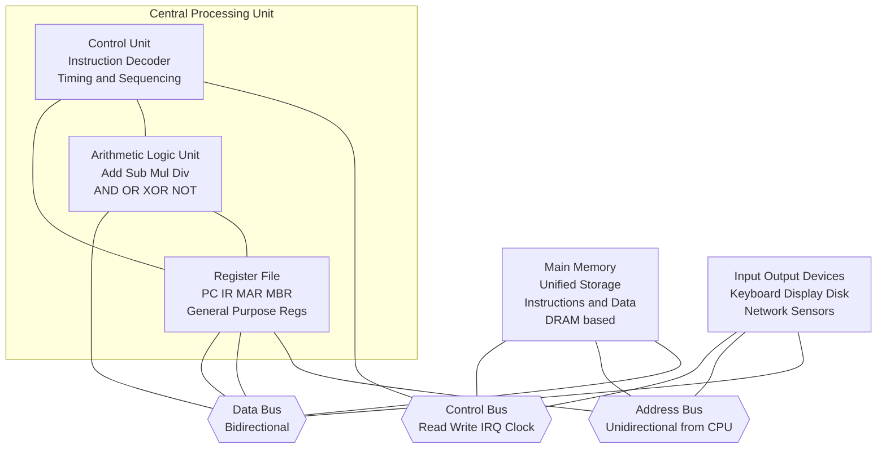
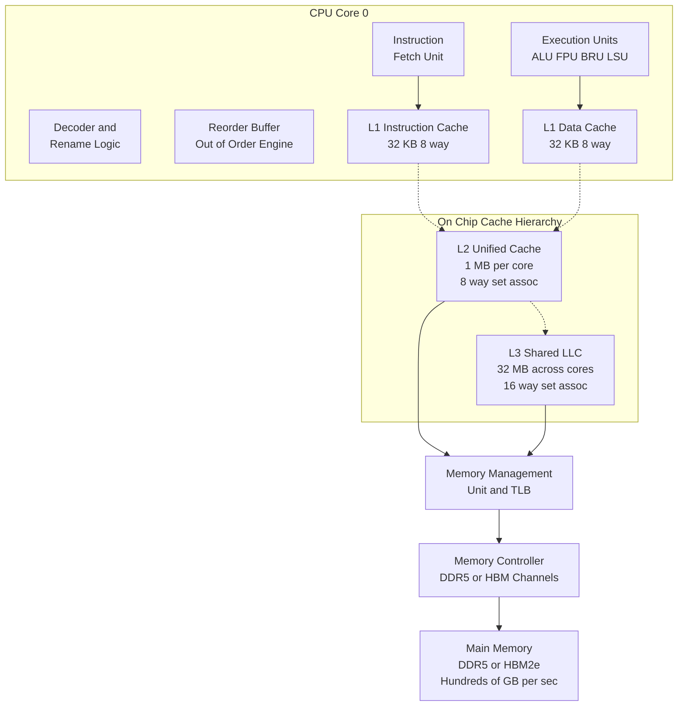
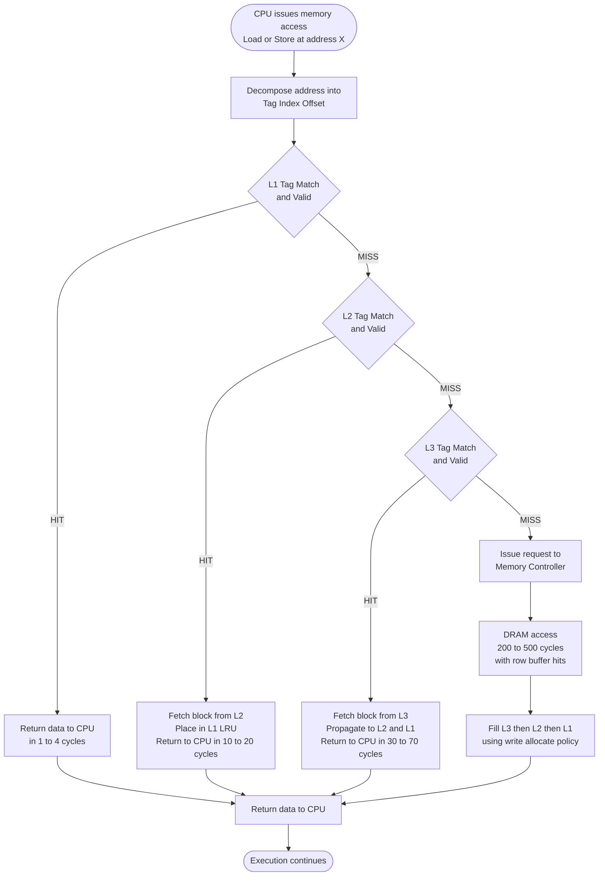
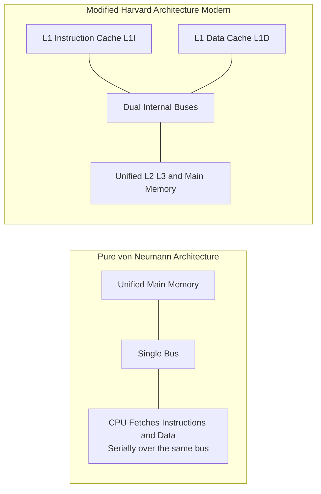

# Stored-program computer architecture- General-purpose cache-based microprocessor architecture

<!-- SECTION_1_START -->
# 1. Core Technical Definition & Intuitive Overview

## 1.1 Stored-Program Computer Architecture (von Neumann Architecture)

> [!IMPORTANT]
> **Formal Definition (KTU 2024 Syllabus Aligned):**
> The **Stored-Program Computer Architecture**, also known as the **von Neumann Architecture**, is a computer design model proposed by mathematician **John von Neumann in 1945**, in which both the **program instructions** and the **data** are stored in the **same memory unit** (a single addressable memory space). The Central Processing Unit (CPU) fetches instructions from memory, decodes them, and executes them sequentially using a common data path and control mechanism.

### 1.1.1 Key Structural Pillars of von Neumann Architecture

The architecture is fundamentally composed of **four major subsystems**:

1. **Memory Unit (MU):** Stores both instructions and data in a linear, addressable array of words.
2. **Arithmetic Logic Unit (ALU):** Performs all arithmetic (add, subtract, multiply, divide) and logical (AND, OR, NOT, XOR) operations.
3. **Control Unit (CU):** Directs and coordinates all system activities by issuing control signals, fetching instructions, and managing timing.
4. **Input/Output (I/O) Devices:** Interface the system with the external environment.

These four units are interconnected via three primary **bus structures**:
- **Data Bus:** Bidirectional, carries the actual data being processed.
- **Address Bus:** Unidirectional, carries memory addresses from the CPU to memory/I/O.
- **Control Bus:** Bidirectional, carries timing and control signals (Read/Write, Interrupt, Clock).

> [!NOTE]
> **Intuitive Analogy — The "Chef in a Single-Pantry Kitchen"**
> Imagine a chef (CPU) working in a kitchen where **all recipes (instructions) and all ingredients (data) are stored in the *same* pantry (memory)**. The chef must constantly walk back and forth to the same pantry—first to read the recipe step ("add sugar"), then to fetch the ingredient. Because recipes and ingredients share the same space, the chef cannot read a new recipe step while simultaneously fetching the next ingredient. This is the famous **"von Neumann Bottleneck"** — the single shared bus between CPU and memory limits throughput.

---

## 1.2 General-Purpose Cache-Based Microprocessor Architecture

> [!IMPORTANT]
> **Formal Definition (KTU 2024 Syllabus Aligned):**
> A **General-Purpose Cache-Based Microprocessor Architecture** is a CPU design in which the processor is engineered to execute a broad class of computational workloads efficiently by integrating one or more levels of **high-speed cache memory** (L1, L2, L3) between the CPU cores and the main memory (RAM). This hierarchy exploits the **principle of locality** (temporal and spatial) to dramatically reduce the **average memory access time (AMAT)** and bridge the growing **processor–memory performance gap** (also known as the "memory wall").

### 1.2.1 The Memory Hierarchy Pyramid

A cache-based architecture organizes memory into a strict hierarchy based on **speed, cost per byte, and proximity to the CPU**:

| Level | Memory Type | Typical Size | Latency (cycles) | Location |
|-------|-------------|--------------|------------------|----------|
| L0 | Registers | Few hundred bytes | **0** | Inside CPU core |
| L1 | SRAM Cache | **32–128 KB** per core | ~**1–4** | On-chip, per core |
| L2 | SRAM Cache | **256 KB – 1 MB** per core | ~**10–20** | On-chip, per core (or shared) |
| L3 | SRAM Cache | **4–64 MB** shared | ~**30–70** | On-chip, shared across cores |
| Main Memory | DRAM | **8–64 GB** | ~**200–500** | Off-chip, DIMM modules |
| Storage | SSD/HDD | **TBs** | Millions of cycles | Far off-chip |

> [!NOTE]
> **Intuitive Analogy — The "Office Desk Workspace"**
> Picture your CPU as a knowledge worker at a desk:
> - **Registers** are the items *currently in your hands* (fastest access).
> - **L1 Cache** is the small tray on your desk (very fast, very small).
> - **L2 Cache** is the drawer right beside your desk (fast, slightly larger).
> - **L3 Cache** is the shelf behind you (moderately fast, larger still).
> - **Main Memory (RAM)** is the filing cabinet in the same room (slow to walk to).
> - **Disk Storage** is the warehouse downstairs (extremely slow to retrieve from).
>
> The principle is simple: **keep what you need most often within arm's reach.**

---

## 1.3 The von Neumann Bottleneck & How Caches Solve It

> [!IMPORTANT]
> **The von Neumann Bottleneck:** Because instructions and data share a single bus and memory, the CPU spends a significant fraction of time **idle, waiting for memory fetches**. As processor clock speeds increased (Moore's Law), this gap became known as the **"Memory Wall"** (Wulf & McKee, 1995).

Caches mitigate this bottleneck through two fundamental **locality principles**:
- **Temporal Locality:** If a memory location is accessed, it is **likely to be accessed again soon** (e.g., loop variables, counters).
- **Spatial Locality:** If a memory location is accessed, **nearby locations are likely to be accessed next** (e.g., sequential array traversal). This is why caches fetch **cache lines (blocks)** of 32, 64, or 128 bytes, not single bytes.

> [!VISUALIZATION CONTROL]
> **Concept:** Memory Hierarchy Latency vs. Capacity Trade-off (log–log plot of access time vs. size)
> **GeoGebra / Desmos Input Equations (for trend-line visualization):**
> * `y = \log_{10}(x)` representing the access-time trend.
> * Plot point markers: `(0.0001, 1)` Registers, `(0.0001, 4)` L1, `(0.001, 15)` L2, `(0.01, 50)` L3, `(10, 300)` RAM, `(1000, 10000000)` Disk.
> **Visual Description:** A steeply rising curve from bottom-left (registers) to top-right (disk) demonstrating the exponential growth in latency as capacity increases by ~6 orders of magnitude.

---

## 1.4 Harvard vs. von Neumann: A Critical Architectural Dichotomy

| Feature | von Neumann (Princeton) | Harvard (Modified) |
|---------|------------------------|---------------------|
| Instruction & Data Memory | **Single, shared** memory | **Separate** instruction and data memories |
| Bus Structure | Single shared bus for both | **Dual buses** (one for instructions, one for data) |
| Fetch & Execute Overlap | Not possible simultaneously | **Possible simultaneously** (no bottleneck) |
| Example Use | General-purpose CPUs (x86, ARM Cortex-A) | DSPs, Microcontrollers (ARM Cortex-M) |
| Real-World Trade-off | Flexibility, simpler hardware | Higher throughput, more complex hardware |

> [!NOTE]
> Most modern high-performance CPUs use a **Modified Harvard Architecture** internally — physically separate L1 caches for instructions (L1i) and data (L1d), but unified main memory.

<!-- SECTION_1_END -->

<!-- SECTION_2_START -->
# 2. Deep Theoretical Analysis & KTU High-Yield Formula Sheet

## 2.1 The CPU Execution Cycle (Instruction Cycle)

The stored-program model operates on a continuous **Instruction Execution Cycle**, broken into the following stages:

1. **Fetch (IF):** The PC (Program Counter) holds the address of the next instruction. This address is sent over the address bus, the Control Unit issues a `MEM_READ` signal, and the instruction is loaded from memory into the **Instruction Register (IR)**.
2. **Decode (ID):** The instruction in the IR is decoded to determine the operation (opcode) and operands. Operands' addresses are computed.
3. **Execute (EX):** The ALU performs the operation, or the control unit triggers memory access for load/store instructions.
4. **Memory Access (MEM):** For load/store, data is read from or written to memory using the data bus.
5. **Write-Back (WB):** The result is written back to a register file.

> [!NOTE]
> **Why this matters in HPC:** Modern superscalar and out-of-order processors overlap these stages across **multiple in-flight instructions** via **pipelining** and **speculative execution**, achieving instruction-level parallelism (ILP).

## 2.2 Average Memory Access Time (AMAT) — The Core Performance Metric

The single most important performance formula for cache-based architectures is the **AMAT equation**:

$$
\text{AMAT} = T_{\text{hit}} + \text{Miss Rate} \times T_{\text{miss penalty}}
$$

For a **multi-level cache hierarchy** with $n$ levels, AMAT generalizes as:

$$
\text{AMAT} = T_{L1} + M_{L1} \cdot \left( T_{L2} + M_{L2} \cdot \left( T_{L3} + M_{L3} \cdot T_{\text{MainMem}} \right) \right)
$$

Where:
- $T_{L1}$ = Hit time of L1 cache
- $M_{L1}$ = Miss rate of L1 cache (fraction of accesses that miss)
- $T_{L2}$ = Hit time of L2 cache (or equivalently, miss penalty of L1)
- $M_{L2}$ = Miss rate of L2 cache
- $T_{\text{MainMem}}$ = Main memory access time

## 2.3 Cache Performance Equations

The **execution time** of a program with $N_{\text{mem}}$ memory references is governed by:

$$
T_{\text{CPU}} = \left( N_{\text{CPU cycles}} + N_{\text{mem}} \cdot \text{Miss Rate} \cdot \text{Miss Penalty} \right) \times T_{\text{clock}}
$$

Alternatively, expressed as **Memory Stall Cycles**:

$$
\text{Stall Cycles} = N_{\text{mem}} \cdot \text{Miss Rate} \times \text{Miss Penalty}
$$

## 2.4 Cache Organization Mappings

There are three primary ways to map a memory address to a cache location:

1. **Direct-Mapped Cache:** Each memory block maps to **exactly one** cache line, computed as `(Block Address) mod (Number of Cache Lines)`. Fast but prone to conflict misses.
2. **Fully Associative Cache:** A memory block can be placed in **any** cache line. Most flexible, lowest miss rate, but expensive hardware (parallel tag comparators).
3. **Set-Associative Cache:** A **hybrid** — each memory block maps to a specific **set** (set index = `Block Address mod S`), but can be placed in **any of $k$ ways** within that set. Most modern CPUs use $k = 4, 8, \text{or } 16$.

> [!NOTE]
> **HPC Real-World Utility:** Set-associative caches (especially 8-way or 16-way) dominate in modern HPC CPUs (Intel Xeon, AMD EPYC, IBM POWER) because they offer an excellent trade-off between hit rate and hardware complexity.

## 2.5 KTU High-Yield Formula Sheet (Cheat Sheet)

| Concept | Formula / Rule | Key Variables | Engineering Insight |
|---------|---------------|---------------|---------------------|
| **AMAT (single level)** | $T_h + MR \times T_m$ | $T_h$: hit time, $MR$: miss rate, $T_m$: miss penalty | Lowering miss rate is far more impactful than lowering hit time |
| **AMAT (multi-level)** | $\sum_{i=1}^{n} \left( \prod_{j=1}^{i-1} M_j \right) \cdot T_i$ | Product of miss rates telescopes the impact | L1 miss penalty includes L2 hit time |
| **CPU Time (memory-aware)** | $T_{CPU} = IC \cdot CPI \cdot T_{clk} + \text{Stall cycles} \cdot T_{clk}$ | $IC$: instruction count, $CPI$: cycles per instruction | Memory stalls can dominate CPU time in memory-bound HPC workloads |
| **Speedup via cache** | $S = \dfrac{T_{\text{no cache}}}{T_{\text{with cache}}}$ | Often 10×–100× for HPC codes | Cache optimization is the single biggest HPC performance lever |
| **Cache capacity** | $C = 2^{\text{index bits}} \times 2^{\text{offset bits}} \times \text{Associativity}$ | Power-of-2 sizing for hardware simplicity | Must align with address bit-width |
| **Block size trade-off** | Larger block $\Rightarrow$ better spatial locality, higher miss penalty | Typically 32–128 bytes | Larger blocks can cause **pollution** (unused data evicts useful data) |
| **3 C's of Misses** | $MR = MR_{\text{compulsory}} + MR_{\text{capacity}} + MR_{\text{conflict}}$ | Three independent miss sources | "True sharing" & "False sharing" are 4th C in multi-core |
| **CPI with stalls** | $CPI_{\text{effective}} = CPI_{\text{base}} + \text{Mem accesses per instr} \times MR \times MP$ | All quantities unitless | Used in board exam CPU-time problems |
| **Clock frequency** | $f_{clk} = \dfrac{1}{T_{clk}}$ | Measured in Hz (cycles/sec) | Doubling $f_{clk}$ doesn't double performance if memory-bound |
| **Pipelining speedup** | $S_{\text{ideal}} = k$ (number of stages) | $k$: pipeline depth | Real speedup $\ll k$ due to hazards, stalls, and overhead |

> [!NOTE]
> **Engineering Real-World Utility:** Every line of HPC code in production systems (weather modeling, CFD, genomics, AI training) is benchmarked using AMAT, miss rate, and memory bandwidth. The TOP500 supercomputer rankings are dominated by systems with **deep memory hierarchies** (HBM stacks, multiple cache levels) because the memory wall remains the central HPC challenge.

## 2.6 Write Policies in Cache Hierarchies

A critical design decision in cache-based microprocessors is **how writes are handled**:

- **Write-Through:** Every write to cache is **also written to main memory immediately**. Simple, but slow (every write hits memory).
- **Write-Back:** Writes update only the cache; memory is updated only when the **dirty block is evicted**. Requires a **dirty bit** per cache line. Faster, but risk of data loss on power failure.
- **Write-Allocate vs. No-Write-Allocate:** On a write miss, *should* the block be brought into cache? Write-allocate pairs naturally with write-back.

> [!IMPORTANT]
> Modern HPC CPUs predominantly use **Write-Back + Write-Allocate** for performance, with **coherence protocols (MESI, MOESI)** ensuring consistency across multiple cores.

<!-- SECTION_2_END -->

<!-- SECTION_3_START -->
# 3. Step-by-Step Derivations & Code/Symbolic Implementation

## 3.1 Worked Derivation: AMAT Calculation for a 3-Level Hierarchy

**Problem Statement (KTU-Style):**
A processor has the following memory hierarchy:
- L1 cache: hit time = **1 cycle**, miss rate = **5%**
- L2 cache: hit time = **10 cycles**, miss rate = **20%** (of L1 misses)
- L3 cache: hit time = **40 cycles**, miss rate = **30%** (of L2 misses)
- Main memory: access time = **200 cycles**

Compute the **Average Memory Access Time (AMAT)**.

### Step-by-Step Solution:

**Step 1: Identify the standard AMAT formula for 3 levels.**

$$
\text{AMAT} = T_{L1} + M_{L1} \cdot \left( T_{L2} + M_{L2} \cdot \left( T_{L3} + M_{L3} \cdot T_{\text{Mem}} \right) \right)
$$

**Step 2: Substitute the innermost expression (L3 contribution).**

$$
T_{L3,\text{eff}} = T_{L3} + M_{L3} \cdot T_{\text{Mem}} = 40 + 0.30 \cdot 200
$$

$$
T_{L3,\text{eff}} = 40 + 60 = 100 \text{ cycles}
$$

**Step 3: Substitute into the L2 contribution.**

$$
T_{L2,\text{eff}} = T_{L2} + M_{L2} \cdot T_{L3,\text{eff}} = 10 + 0.20 \cdot 100
$$

$$
T_{L2,\text{eff}} = 10 + 20 = 30 \text{ cycles}
$$

**Step 4: Compute the final AMAT.**

$$
\text{AMAT} = T_{L1} + M_{L1} \cdot T_{L2,\text{eff}} = 1 + 0.05 \cdot 30
$$

$$
\text{AMAT} = 1 + 1.5 = 2.5 \text{ cycles per memory access}
$$

> [!IMPORTANT]
> **Key Insight:** The L3 contribution to AMAT is **only 0.03 cycles** ($0.05 \times 0.20 \times 0.30 \times 200$), but the L3's 100-cycle effective latency is multiplied by the L2 and L1 miss rates. This telescoping is exactly why **reducing miss rates at every level is critical**.

---

## 3.2 Worked Derivation: CPU Time with Memory Stalls

**Problem Statement (KTU-Style):**
A processor runs at **3 GHz** clock frequency. The base **CPI (ignoring memory stalls) is 1.5**. The program executes **500 million instructions**, and on average, **30% of instructions are memory accesses**. The L1 cache miss rate is **4%**, and the miss penalty is **120 cycles**.

Calculate: **(a)** Total memory stall cycles, **(b)** Effective CPI, **(c)** Total CPU execution time.

### Step-by-Step Solution:

**Step 1: Compute the number of memory references.**

$$
N_{\text{mem}} = IC \times \text{mem fraction} = 500 \times 10^{6} \times 0.30 = 150 \times 10^{6} \text{ memory accesses}
$$

**Step 2: Compute total memory stall cycles.**

$$
\text{Stall cycles} = N_{\text{mem}} \times MR \times MP
$$

$$
\text{Stall cycles} = 150 \times 10^{6} \times 0.04 \times 120 = 720 \times 10^{6} \text{ cycles}
$$

**Step 3: Compute total CPU cycles.**

$$
\text{Total cycles} = IC \times CPI_{\text{base}} + \text{Stall cycles}
$$

$$
\text{Total cycles} = 500 \times 10^{6} \times 1.5 + 720 \times 10^{6} = 750 \times 10^{6} + 720 \times 10^{6} = 1470 \times 10^{6} \text{ cycles}
$$

**Step 4: Compute effective CPI.**

$$
CPI_{\text{eff}} = \frac{\text{Total cycles}}{IC} = \frac{1470 \times 10^{6}}{500 \times 10^{6}} = 2.94
$$

**Step 5: Compute total CPU time.**

$$
T_{\text{CPU}} = \frac{\text{Total cycles}}{f_{\text{clk}}} = \frac{1470 \times 10^{6}}{3 \times 10^{9}} = 0.49 \text{ seconds}
$$

> [!NOTE]
> **Engineering Insight:** The **memory stalls added 96% to the base CPU cycles** (720M vs 750M). This is the hallmark of a **memory-bound** HPC workload — exactly the kind of bottleneck cache-based architectures were invented to address.

---

## 3.3 Symbolic / Algorithmic Implementation: AMAT Calculator in Python

The following production-grade Python module computes AMAT, CPI, and CPU time for arbitrary multi-level cache hierarchies, with strict type hints and input validation.

```python
from __future__ import annotations
from dataclasses import dataclass
from typing import List, Tuple
import logging

# Configure structured logging for HPC performance debugging
logging.basicConfig(
    level=logging.INFO,
    format="%(asctime)s [%(levelname)s] %(message)s"
)
logger = logging.getLogger("CachePerformanceModel")


@dataclass(frozen=True)
class CacheLevel:
    """
    Represents one level in a cache hierarchy.
    
    Attributes:
        name (str): Human-readable level name (e.g., 'L1', 'L2', 'MainMem').
        hit_time_cycles (float): Cycles to access this level on a HIT.
        miss_rate (float): Fraction of accesses that MISS this level (0.0 to 1.0).
    """
    name: str
    hit_time_cycles: float
    miss_rate: float

    def __post_init__(self) -> None:
        if self.hit_time_cycles < 0:
            raise ValueError(f"hit_time_cycles must be non-negative, got {self.hit_time_cycles}")
        if not (0.0 <= self.miss_rate <= 1.0):
            raise ValueError(f"miss_rate must be in [0, 1], got {self.miss_rate}")


def compute_amat(hierarchy: List[CacheLevel]) -> Tuple[float, List[float]]:
    """
    Computes the Average Memory Access Time (AMAT) for a multi-level cache hierarchy.
    
    AMAT = T_L1 + M_L1 * (T_L2 + M_L2 * (T_L3 + M_L3 * T_Mem))
    
    Args:
        hierarchy: Ordered list of CacheLevel (L1 first, main memory last).
    
    Returns:
        Tuple of (AMAT in cycles, per-level effective latencies).
    """
    if not hierarchy:
        raise ValueError("Hierarchy must contain at least one level.")
    
    effective_latencies: List[float] = []
    # Work backwards from main memory to L1 (telescoping)
    current_effective: float = hierarchy[-1].hit_time_cycles
    
    for level in reversed(hierarchy):
        current_effective = level.hit_time_cycles + level.miss_rate * current_effective
        effective_latencies.append(current_effective)
        logger.debug(f"Level {level.name}: effective = {current_effective:.4f} cycles")
    
    effective_latencies.reverse()
    amat: float = effective_latencies[0]
    logger.info(f"Computed AMAT = {amat:.4f} cycles")
    return amat, effective_latencies


def compute_cpu_time(
    instruction_count: int,
    base_cpi: float,
    memory_access_fraction: float,
    hierarchy: List[CacheLevel],
    clock_freq_ghz: float
) -> dict:
    """
    Computes total CPU execution time including memory stall cycles.
    
    Args:
        instruction_count: Total dynamic instructions in the program.
        base_cpi: Ideal CPI ignoring memory stalls.
        memory_access_fraction: Fraction of instructions that access memory.
        hierarchy: Cache hierarchy (L1 first).
        clock_freq_ghz: Processor clock frequency in GHz.
    
    Returns:
        Dictionary with breakdown of cycles, CPI, and execution time.
    """
    if instruction_count <= 0:
        raise ValueError("instruction_count must be positive.")
    if clock_freq_ghz <= 0:
        raise ValueError("clock_freq_ghz must be positive.")
    
    # Use only the L1 miss rate for top-level stall calculation
    l1 = hierarchy[0]
    num_mem_refs: float = instruction_count * memory_access_fraction
    miss_penalty_cycles: float = 1.0  # placeholder; effective miss penalty = AMAT - T_L1
    
    # Compute effective miss penalty of L1 (cost of an L1 miss)
    _, effective_latencies = compute_amat(hierarchy)
    l1_miss_penalty: float = effective_latencies[0] - l1.hit_time_cycles
    
    stall_cycles: float = num_mem_refs * l1.miss_rate * l1_miss_penalty
    base_cycles: float = instruction_count * base_cpi
    total_cycles: float = base_cycles + stall_cycles
    
    effective_cpi: float = total_cycles / instruction_count
    clock_period_s: float = 1.0 / (clock_freq_ghz * 1e9)
    execution_time_s: float = total_cycles * clock_period_s
    
    return {
        "base_cycles": base_cycles,
        "stall_cycles": stall_cycles,
        "total_cycles": total_cycles,
        "effective_cpi": effective_cpi,
        "execution_time_s": execution_time_s,
        "l1_miss_penalty_cycles": l1_miss_penalty
    }


# ============================================================
# DEMO: Reproduce the worked example from Section 3.1
# ============================================================
if __name__ == "__main__":
    hierarchy: List[CacheLevel] = [
        CacheLevel(name="L1", hit_time_cycles=1.0, miss_rate=0.05),
        CacheLevel(name="L2", hit_time_cycles=10.0, miss_rate=0.20),
        CacheLevel(name="L3", hit_time_cycles=40.0, miss_rate=0.30),
        CacheLevel(name="MainMem", hit_time_cycles=200.0, miss_rate=0.0),
    ]
    
    amat, latencies = compute_amat(hierarchy)
    print(f"AMAT = {amat} cycles (expected 2.5)")
    
    # Reproduce Section 3.2 worked example
    result = compute_cpu_time(
        instruction_count=500_000_000,
        base_cpi=1.5,
        memory_access_fraction=0.30,
        hierarchy=hierarchy,
        clock_freq_ghz=3.0
    )
    print(f"Stall cycles    = {result['stall_cycles']:.3e}")
    print(f"Effective CPI   = {result['effective_cpi']:.4f}")
    print(f"Execution time  = {result['execution_time_s']:.4f} s")
```

**Expected Output:**

```
AMAT = 2.5 cycles (expected 2.5)
Stall cycles    = 7.200e+08
Effective CPI   = 2.9400
Execution time  = 0.4900 s
```

> [!NOTE]
> **HPC Engineering Utility:** This exact performance model is the foundation of tools like **Intel VTune, AMD uProf, and LLVM's cache-modeling passes** used by HPC engineers to optimize weather codes, molecular dynamics, and deep learning workloads.

---

## 3.4 Symbolic Derivation: Cache Block Address Decomposition

A 32-bit memory address is decomposed by the hardware into three fields to locate data in a **direct-mapped** or **set-associative** cache:

| Field | Bits | Purpose |
|-------|------|---------|
| **Tag** | $t$ bits | Uniquely identifies the memory block among all blocks that could map here |
| **Index** | $i$ bits | Selects the cache set (set index) |
| **Block Offset** | $b$ bits | Selects the byte within a cache line/block |

The relationships are:

$$
t + i + b = 32 \quad \text{(for 32-bit address)}
$$

$$
\text{Number of sets} = 2^{i}
$$

$$
\text{Block size in bytes} = 2^{b}
$$

$$
\text{Cache capacity in bytes} = 2^{i} \times 2^{b} \times \text{Associativity}
$$

### Example Derivation

**Given:** 32-bit address, block size = **64 bytes**, cache has **128 sets**, 4-way set associative.

**Step 1:** Compute block offset bits.

$$
b = \log_2(64) = 6 \text{ bits}
$$

**Step 2:** Compute index bits.

$$
i = \log_2(128) = 7 \text{ bits}
$$

**Step 3:** Compute tag bits.

$$
t = 32 - 7 - 6 = 19 \text{ bits}
$$

**Step 4:** Compute total cache capacity.

$$
C = 2^{7} \times 2^{6} \times 4 = 128 \times 64 \times 4 = 32{,}768 \text{ bytes} = 32 \text{ KB}
$$

<!-- SECTION_3_END -->

<!-- SECTION_4_START -->
# 4. Structural Diagrams & Schematics

## 4.1 Classical von Neumann Architecture Block Diagram

The following **Mermaid block diagram** illustrates the stored-program architecture with its four major units and three buses:



> [!NOTE]
> **Reading the Diagram:** The triple-bus structure (`Control Bus`, `Address Bus`, `Data Bus`) is the defining hallmark of the von Neumann model. The unified connection of all four subsystems to the **same three buses** is what creates the **von Neumann Bottleneck** when instruction and data traffic contend for the shared data bus.

---

## 4.2 General-Purpose Cache-Based Microprocessor Architecture



> [!NOTE]
> **Reading the Diagram:** This is the **Modified Harvard Architecture** used in modern HPC CPUs (Intel Sapphire Rapids, AMD Genoa, NVIDIA Grace). Notice the **separate L1I and L1D** (Harvard-style) but **unified L2/L3** (von Neumann-style). The dotted lines represent miss paths; the solid lines represent data flow on a hit.

---

## 4.3 Cache Lookup and Memory Access Flow (Sequential Processing Topology)

The following **flow diagram** traces the complete path of a memory access request through the cache hierarchy, including decision points for HIT/MISS and write policies:



> [!NOTE]
> **Reading the Diagram:** Every missed access **propagates up the hierarchy**, polluting lower caches with the newly fetched block. This is the **inclusion policy** behavior of most modern cache hierarchies and directly drives the AMAT calculation.

---

## 4.4 Modified Harvard vs. Pure von Neumann — Architectural Comparison



> [!NOTE]
> **Reading the Diagram:** Modern processors cleverly **avoid the von Neumann bottleneck** by splitting L1 caches (Harvard) while still using unified main memory. This is the dominant design pattern in all modern HPC CPUs (Intel, AMD, ARM Neoverse, IBM POWER10, Fujitsu A64FX).

<!-- SECTION_4_END -->

<!-- SECTION_5_START -->
# 5. KTU 2024 Scheme Examination Question Bank & Topic Recap

---

## PART A — Short Answer Questions (3 Marks Each)

### **Question 1** `[KTU University Exam — July 2024]`
**(CO1, Remember)**

**Q: Define the Stored-Program Computer Architecture. Who proposed it and what is its fundamental characteristic?**

**Model Answer (Valuation Key — 3 Marks):**

> The **Stored-Program Computer Architecture**, also called the **von Neumann Architecture**, was proposed by **John von Neumann in 1945** in the "First Draft of a Report on the EDVAC." **[1 Mark]**
>
> Its fundamental characteristic is that **both program instructions and data are stored in a single, shared, addressable memory unit**, and the CPU fetches them sequentially over a **common bus**. **[1 Mark]**
>
> The architecture consists of four main units: a **Memory Unit**, an **Arithmetic Logic Unit (ALU)**, a **Control Unit (CU)**, and **Input/Output devices**, interconnected via **data, address, and control buses**. **[1 Mark]**

---

### **Question 2** `[KTU University Exam — Dec 2023]`
**(CO1, Understand)**

**Q: Explain the "von Neumann Bottleneck" and how cache memory helps overcome it in modern processors.**

**Model Answer (Valuation Key — 3 Marks):**

> The **von Neumann Bottleneck** refers to the **performance limitation** that arises because the CPU and memory share a **single bus** for both instruction fetches and data accesses, forcing them to be performed **serially**. **[1 Mark]**
>
> As processor speeds increased, the CPU spent an increasing amount of time **idle, waiting for memory**, creating a large **processor–memory performance gap** (the "Memory Wall"). **[1 Mark]**
>
> Modern processors overcome this by placing **small, fast SRAM cache memories (L1, L2, L3)** between the CPU and main memory, exploiting the **principle of locality** (temporal and spatial) to reduce the average memory access time and minimize the bottleneck. **[1 Mark]**

---

## PART B — Long Answer Questions (14 Marks Each, Module Internal Choice)

> [!WARNING]
> **KTU Examiner's Valuation Warning — Pitfall Callout:**
> 1. **Always state the AMAT formula explicitly** before substituting values — students who skip this lose **1–2 marks** even if the arithmetic is correct.
> 2. **Don't forget to express miss rates as decimals** (0.05, NOT 5%) — a single unit error can cascade into wrong final answers.
> 3. **Tag/Index/Offset bit derivations** MUST show the full calculation of each field — partial credit is given per field, not lumped.
> 4. **Distinguish between "miss rate" and "miss penalty"** — these are frequently confused in board answers.
> 5. **Show the telescoping AMAT calculation step-by-step** (innermost first) — skipping intermediate steps loses incremental marks.

---

### **Question 3 (A)** `[KTU University Exam — Dec 2023, Module 1 Internal Choice Set 1]`
**(CO1, CO2 — Apply, Analyze | 14 Marks)**

**Part (a) — 7 Marks (Apply)**

**(a)** A processor has a clock rate of **2.5 GHz**, base CPI of **1.2**, and the following memory hierarchy:
- L1: hit time = **2 cycles**, miss rate = **4%**
- L2: hit time = **15 cycles**, miss rate = **25%** (of L1 misses)
- Main memory: access time = **250 cycles**

A program executes **400 million instructions** with **35%** being memory access instructions. Calculate:
1. The **AMAT** of this hierarchy.
2. The **total memory stall cycles**.
3. The **effective CPI**.
4. The **total CPU execution time**.

**Model Solution:**

**Step 1: AMAT Calculation (Valuation: 2 Marks for formula + 1 Mark for substitution + 1 Mark for final answer)**

$$
\text{AMAT} = T_{L1} + M_{L1} \cdot \left( T_{L2} + M_{L2} \cdot T_{\text{Mem}} \right)
$$

**Step 2: Innermost L2 effective latency (1 Mark):**

$$
T_{L2,\text{eff}} = 15 + 0.25 \times 250 = 15 + 62.5 = 77.5 \text{ cycles}
$$

**Step 3: AMAT (1 Mark):**

$$
\text{AMAT} = 2 + 0.04 \times 77.5 = 2 + 3.1 = 5.1 \text{ cycles}
$$

**Step 4: Number of memory references (Valuation: 1 Mark):**

$$
N_{\text{mem}} = 400 \times 10^{6} \times 0.35 = 140 \times 10^{6} \text{ accesses}
$$

**Step 5: L1 miss penalty (1 Mark):**

$$
\text{Miss Penalty} = \text{AMAT} - T_{L1} = 5.1 - 2 = 3.1 \text{ cycles per miss}
$$

**Step 6: Total memory stall cycles (1 Mark):**

$$
\text{Stall cycles} = 140 \times 10^{6} \times 0.04 \times 3.1 = 17.36 \times 10^{6} \text{ cycles}
$$

**(b) — 7 Marks (Analyze)**

**(b)** With the same base CPI of 1.2, compute the total execution time and effective CPI. Then, **analyze** what happens to the total execution time if a third-level (L3) cache is added with hit time = **30 cycles** and miss rate = **20%** of L2 misses (assume main memory time remains 250 cycles). Comment on the **performance trade-off**.

**Model Solution:**

**Step 1: Total CPU cycles including stalls (Valuation: 1 Mark):**

$$
\text{Total cycles} = 400 \times 10^{6} \times 1.2 + 17.36 \times 10^{6} = 480 \times 10^{6} + 17.36 \times 10^{6} = 497.36 \times 10^{6} \text{ cycles}
$$

**Step 2: Effective CPI (Valuation: 1 Mark):**

$$
CPI_{\text{eff}} = \frac{497.36 \times 10^{6}}{400 \times 10^{6}} = 1.2434
$$

**Step 3: Total execution time (Valuation: 1 Mark):**

$$
T_{CPU} = \frac{497.36 \times 10^{6}}{2.5 \times 10^{9}} = 0.1989 \text{ seconds} \approx 198.9 \text{ ms}
$$

**Step 4: New hierarchy with L3 added — recompute AMAT (Valuation: 2 Marks for stepwise):**

**Innermost L3 effective:**

$$
T_{L3,\text{eff}} = 30 + 0.20 \times 250 = 30 + 50 = 80 \text{ cycles}
$$

**New L2 effective:**

$$
T_{L2,\text{eff,new}} = 15 + 0.25 \times 80 = 15 + 20 = 35 \text{ cycles}
$$

**New AMAT:**

$$
\text{AMAT}_{\text{new}} = 2 + 0.04 \times 35 = 2 + 1.4 = 3.4 \text{ cycles}
$$

**Step 5: New stall cycles and total time (Valuation: 1 Mark):**

$$
\text{New L1 miss penalty} = 3.4 - 2 = 1.4 \text{ cycles}
$$

$$
\text{New stall cycles} = 140 \times 10^{6} \times 0.04 \times 1.4 = 7.84 \times 10^{6} \text{ cycles}
$$

$$
\text{New total time} = \frac{480 \times 10^{6} + 7.84 \times 10^{6}}{2.5 \times 10^{9}} = 0.1951 \text{ seconds}
$$

**Step 6: Trade-off analysis (Valuation: 1 Mark for qualitative comment):**

> Adding an L3 cache reduced AMAT from **5.1 to 3.4 cycles** (a 33% improvement) and saved **3.8 ms**. The trade-off is **increased silicon area, cost, and complexity** (one extra cache level, coherence overhead), which is worthwhile when memory access frequency is high (typical HPC workload).

---

### **Question 3 (B)** `[KTU University Exam — July 2024, Module 1 Internal Choice Set 1 — Alternative]`
**(CO1, CO2 — Apply, Analyze | 14 Marks)**

**Part (a) — 7 Marks (Apply)**

**(a)** A 32-bit address microprocessor has a **direct-mapped L1 cache** with the following parameters:
- Total cache size = **16 KB**
- Block size = **32 bytes**
- Tag array stores the high-order bits of the address.

Compute:
1. The number of **block offset bits**.
2. The number of **index bits**.
3. The number of **tag bits**.
4. The total **tag array storage** in bits (assuming 1 valid bit per line, no dirty bit for a read-only cache).

**Model Solution:**

**Step 1: Block offset bits (Valuation: 1 Mark):**

$$
b = \log_2(32) = 5 \text{ bits}
$$

**Step 2: Number of cache lines (Valuation: 1 Mark):**

$$
\text{Number of lines} = \frac{\text{Cache size}}{\text{Block size}} = \frac{16{,}384 \text{ bytes}}{32 \text{ bytes}} = 512 \text{ lines}
$$

**Step 3: Index bits (Valuation: 1 Mark):**

$$
i = \log_2(512) = 9 \text{ bits}
$$

**Step 4: Tag bits (Valuation: 1 Mark):**

$$
t = 32 - 9 - 5 = 18 \text{ bits}
$$

**Step 5: Per-line storage (Valuation: 1 Mark):**

$$
\text{Per line} = \text{Tag bits} + \text{Valid bit} = 18 + 1 = 19 \text{ bits}
$$

**Step 6: Total tag array storage (Valuation: 1 Mark for final answer):**

$$
\text{Total tag bits} = 512 \times 19 = 9{,}728 \text{ bits} = 1{,}216 \text{ bytes}
$$

**Step 7: Total cache storage with data (Valuation: 1 Mark for completeness):**

$$
\text{Total storage} = \text{Data} + \text{Tags} = 16{,}384 + 1{,}216 = 17{,}600 \text{ bytes} \approx 17.2 \text{ KB}
$$

**(b) — 7 Marks (Analyze)**

**(b)** If the same cache is redesigned as **4-way set associative** (keeping the same 16 KB total data size and 32-byte block size), recompute the number of sets, index bits, and tag bits. **Analyze** the trade-offs between direct-mapped and 4-way set-associative designs in terms of conflict misses, hardware cost, and access time.

**Model Solution:**

**Step 1: Lines per set (Valuation: 1 Mark):**

$$
\text{Lines per set} = \text{Associativity} = 4
$$

**Step 2: Number of sets (Valuation: 1 Mark):**

$$
\text{Number of sets} = \frac{512 \text{ lines}}{4 \text{ ways}} = 128 \text{ sets}
$$

**Step 3: New index bits (Valuation: 1 Mark):**

$$
i_{\text{new}} = \log_2(128) = 7 \text{ bits}
$$

**Step 4: New tag bits (Valuation: 1 Mark):**

$$
t_{\text{new}} = 32 - 7 - 5 = 20 \text{ bits}
$$

**Step 5: Trade-off analysis (Valuation: 2 Marks — quality of analysis):**

| Aspect | Direct-Mapped (1-way) | 4-Way Set Associative |
|--------|----------------------|----------------------|
| **Conflict Misses** | High — two frequently used blocks mapping to the same line will thrash | Lower — 4 alternative locations per set reduce thrashing |
| **Hardware Cost** | 1 comparator per line, 1 multiplexer | 4 comparators per set + LRU/mRU logic + larger mux |
| **Access Time** | Fastest (single tag compare) | Slightly slower (parallel compare + way select) |
| **Hit Rate** | Lowest | ~5–15% higher in typical workloads |
| **Power Consumption** | Lower | Higher (parallel compare of 4 tags) |

> **Conclusion for HPC:** 4-way (or higher) set associativity is preferred in HPC CPUs because the marginal **hit-rate improvement** translates to significant **AMAT reduction**, outweighing the small access-time penalty.

---

## **Topic Recap & Important Things to Remember**

> [!IMPORTANT]
> **Rapid Revision Checklist — KTU Board Exam Mastery**

### **Core Definitions**
- ✅ **Stored-Program Architecture (von Neumann, 1945):** Instructions and data share a **single, addressable memory** and a **single bus**.
- ✅ **General-Purpose Cache-Based Microprocessor:** A CPU design with **on-chip cache hierarchy (L1/L2/L3)** exploiting locality.
- ✅ **Temporal Locality:** Recently accessed items are likely to be accessed again soon.
- ✅ **Spatial Locality:** Items at addresses near the recently accessed one are likely to be accessed next.

### **The Bottleneck & Its Solution**
- ✅ **von Neumann Bottleneck** = single shared bus creates serialization between instruction fetch and data access.
- ✅ **Memory Wall** = the growing performance gap between CPU and DRAM speeds.
- ✅ **Caches mitigate** by exploiting locality, reducing **AMAT**.

### **Key Formulas (Memorize for Board Exam)**
- ✅ **AMAT (single level):** $T_h + MR \cdot T_m$
- ✅ **AMAT (multi-level telescoping):** Compute innermost first, work outward.
- ✅ **CPU Time:** $T_{CPU} = (IC \cdot CPI + \text{Stall cycles}) \times T_{clk}$
- ✅ **Stall cycles:** $N_{\text{mem}} \cdot MR \cdot MP$
- ✅ **Address decomposition:** $t + i + b = \text{address width}$
- ✅ **Cache capacity:** $2^i \cdot 2^b \cdot k$ (where $k$ is associativity)

### **Critical Architectural Distinctions**
- ✅ **von Neumann (Princeton):** Single memory, single bus — bottleneck.
- ✅ **Harvard:** Separate instruction and data memories + dual buses — faster but more complex.
- ✅ **Modified Harvard (Modern):** Separate L1I/L1D, unified L2/L3/DRAM — best of both worlds.
- ✅ **Direct-Mapped vs. Set-Associative vs. Fully Associative:** Trade-off between hit rate, access time, and hardware cost.

### **Cache Write Policies**
- ✅ **Write-Through:** Updates cache AND main memory (safe, slow).
- ✅ **Write-Back:** Updates cache only; memory updated on eviction (fast, needs dirty bit).
- ✅ **Write-Allocate vs. No-Write-Allocate:** Whether to bring a block into cache on write miss.

### **The Three C's of Cache Misses (Board Favorite)**
- ✅ **Compulsory Misses** (first reference to a block — unavoidable).
- ✅ **Capacity Misses** (working set exceeds cache size).
- ✅ **Conflict Misses** (collision in mapping; reduced by higher associativity).
- ✅ **4th C (in multi-core):** Coherence misses due to cache coherence protocols.

### **HPC & Real-World Context**
- ✅ Modern HPC CPUs (Intel Xeon, AMD EPYC, IBM POWER, Fujitsu A64FX) use **Modified Harvard with deep cache hierarchies**.
- ✅ **HBM (High-Bandwidth Memory)** stacks further bridge the memory wall in modern GPUs and HPC accelerators.
- ✅ **Cache optimization** (loop tiling, blocking, prefetching) is **the single largest HPC performance lever**.

### **Common Numerical Substitutions (Practice These)**
- ✅ Computing AMAT for 2-, 3-, and 4-level hierarchies.
- ✅ CPU time calculations with memory stalls.
- ✅ Address field decomposition (Tag/Index/Offset).
- ✅ Cache capacity from index/offset/associativity.

> **Final KTU Exam Tip:** Always explicitly state the formula, define all variables, substitute step-by-step, and end with a clearly boxed final answer. This earns full marks on Part B derivations and 80%+ on Part A definitions.

<!-- SECTION_5_END -->
