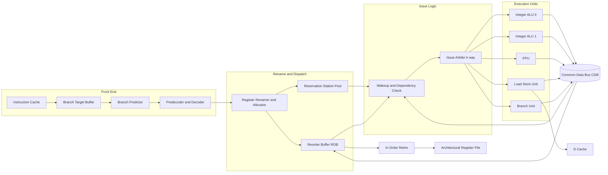
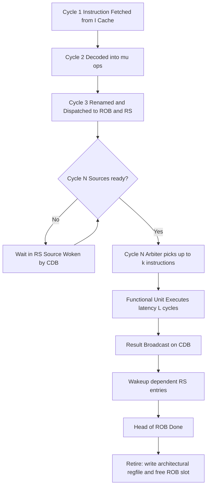
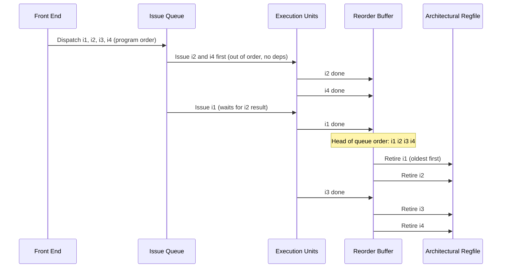

# Super scalarity

<!-- SECTION_1_START -->

# Super Scalarity in Modern Processors

> [!NOTE]
> **Core Definition (KTU 2024 Syllabus Terminology):**
> A **superscalar processor** is a CPU architecture that can issue, execute, and retire **more than one instruction per clock cycle** from a single instruction stream, by employing **multiple parallel execution units** (integer, floating-point, load/store, branch) operating concurrently under hardware-managed dynamic scheduling.

In simple engineering language, a superscalar processor is a chip that has **multiple independent "brains" (functional units)** working on different parts of the same program at the same time — like a factory where one assembly line has split into several parallel sub-lines, all coordinated by a central dispatcher.

## Conceptual Analogy: The Super-Cashier Counter

Imagine a single cashier at a grocery store (this is a *scalar* processor). No matter how skilled the cashier is, only **one customer is billed per second**. Now imagine a supermarket with **4 cashiers working in parallel** at a single billing counter system — all reading from the same shared queue of customers. A supervisor at the head of the queue looks at the next few customers and **dynamically assigns** them to whichever cashier is free. This supervisor is the **dispatch unit**, the customers are the **instructions in the instruction window**, and the 4 cashiers are the **parallel functional units** of a superscalar processor.

### Why "Super" Scalar?
- **Scalar processor:** 1 instruction / cycle / pipeline stage (CPI = 1).
- **Superscalar processor:** N instructions / cycle / pipeline stage (CPI < 1, IPC > 1).
- **Superpipelined processor:** Deeper pipeline stages, still 1 instruction per stage per cycle.
- **VLIW (Very Long Instruction Word):** Compiler (not hardware) packs multiple operations into one long instruction word.

> [!IMPORTANT]
> **KTU Board Highlight:** Superscalarity is a *hardware-driven* parallelism. The CPU itself, at run time, decides which instructions can run in parallel — unlike VLIW, where the compiler does that job statically.

## Key Terminology You MUST Know

| Term | Meaning |
|---|---|
| **Instruction-level parallelism (ILP)** | The amount of parallelism that exists *between instructions* in a program. |
| **IPC** | Instructions Per Cycle. Superscalar aims for IPC $\gt 1$. |
| **CPI** | Cycles Per Instruction. Scalar $\approx 1$, Superscalar $\lt 1$. |
| **Issue width (k)** | Maximum number of instructions a core can begin in a single cycle. |
| **In-order issue** | Instructions leave the dispatch unit in program order. |
| **Out-of-order issue** | Instructions may leave the dispatch unit in an order different from program order, as long as data dependencies are respected. |
| **Speculative execution** | The processor executes instructions *before* it is sure they are needed (e.g., past a branch), to keep the pipelines full. |
| **Instruction window** | The set of instructions currently being considered for parallel issue. |
| **Reservation station** | A buffer that holds an instruction plus its operands (or placeholders for them) until it is ready to fire. |
| **Reorder buffer (ROB)** | A hardware structure that retires completed instructions *in program order* to give a precise architectural state. |
| **Throughput** | How many instructions are completed per unit time. |

> [!TIP]
> The classic textbook example: **Intel Pentium (1993) was a 2-wide superscalar.** **Intel Core i7/i9 (Nehalem and beyond) are 4–6 wide superscalar cores.** Modern server chips like **Apple M-series and AMD Zen 5** push effective issue widths of 5–6 with aggressive out-of-order execution.

## Real Examples of Superscalar Widths in Industry

| Processor | Year | Issue Width | Out-of-Order? | Speculative? |
|---|---|---|---|---|
| Intel Pentium | 1993 | 2 | Yes (limited) | Yes |
| Intel Pentium Pro / II / III | 1995–1999 | 3 (RISC μops) | Yes, robust | Yes |
| Intel Core 2 (Merom) | 2006 | 4 | Yes | Yes |
| Intel Skylake (Core i7-6xxx) | 2015 | 4 (rename), 8 μops | Yes | Yes |
| AMD Zen 4 | 2022 | 6 | Yes | Yes |
| Apple M3 (Firestorm-like) | 2023 | 8 dispatch | Yes | Yes |
| IBM POWER10 | 2020 | 8 | Yes | Yes |

> [!VISUALIZATION CONTROL]
> **Concept:** Throughput comparison of scalar vs superscalar over 8 clock cycles.
> **Plot Description (read from a graph):**
> * X-axis = Clock cycles 1 through 8.
> * Y-axis = Number of completed instructions (cumulative).
> * **Scalar (CPI = 1):** a straight line through points (1,1), (2,2), ..., (8,8). Slope = 1.
> * **2-wide superscalar (ideal CPI = 0.5):** a steeper straight line through (1,2), (2,4), (3,6), (4,8), (5,10), (6,12), (7,14), (8,16). Slope = 2.
> * **4-wide superscalar (ideal CPI = 0.25):** even steeper line through (1,4), (2,8), ... (8,32). Slope = 4.
> **Visual Takeaway:** The steeper the slope, the higher the IPC and the better the throughput. In practice, real lines wobble because of stalls (data hazards, cache misses, branch mispredictions).

<!-- SECTION_1_END -->

<!-- SECTION_2_START -->

# Deep Theoretical Analysis & KTU High-Yield Formula Sheet

## 2.1 The Core Mechanism: How a Superscalar Core Works

A superscalar processor has **three logical stages** of internal decision-making that are layered on top of the usual pipeline:

### Stage A — Fetch & Decode
1. The instruction cache supplies a **block of instructions** per cycle (e.g., 16 bytes from x86, or one aligned 4-instruction RISC bundle).
2. A **predecoder** (in x86) splits complex CISC instructions into 1 to 4 simpler **micro-operations (μops)**.
3. A wide **decoder** turns μops into an internal format and pushes them into an **instruction window**.

### Stage B — Issue Logic (the heart of superscalarity)
The **issue queue** holds all decoded instructions. A **dependency-check + wakeup logic** runs every cycle and asks: *Which of these instructions have all of their source operands ready?* Those ready instructions are then **arbitrated** to free functional units.

```
For each cycle:
    Scan the issue queue
    For each instruction i:
        if (all source operands of i are "ready"):
            mark i as a CANDIDATE for issue this cycle
    Arbitrate candidates:
        pick up to k winners (k = issue width)
        Assign each winner to a free functional unit
        Reserve the unit for one cycle
        Update register-renaming map: future reads see the new producer
```

### Stage C — Execute & Retire
- Each functional unit (ALU, FPU, AGU, branch) executes its assigned instruction.
- Results are **broadcast on a Common Data Bus (CDB)** or forwarded to waiting reservation stations.
- Completed instructions are placed in the **Reorder Buffer (ROB)**.
- The **commit/retire stage** pops the **oldest** instructions off the ROB in strict program order, writing results to the architectural register file and (for stores) to the store buffer.

> [!IMPORTANT]
> The "in-order retire / out-of-order execute" rule is what makes a modern OoO superscalar produce *precise exceptions*. If a fault occurs deep in the pipeline, the processor simply stops retiring and discards everything after the faulting instruction.

## 2.2 Limits on Superscalarity: The "Diminishing Returns" Wall

A naive assumption is that doubling the issue width doubles the performance. In practice, **Amdahl's Law** applies brutally:

| Limit | Why it hurts |
|---|---|
| **True data dependencies** | RAW (Read After Write) chains cannot be parallelized — `a = b + c; d = a * 2` must serialize on `a`. |
| **Limited ILP in programs** | Most code has only 4–8 independent operations in any sliding window. (Studies by Wall, Hennessy-Patterson show 7–30 ILP at most.) |
| **Branch instructions** | Every 4–7 instructions there is a branch. The processor must guess the outcome. A misprediction flushes the pipeline (and on a wide superscalar, flushes **more** work). |
| **Memory latency** | L1 cache miss = ~4–5 ns, L3 miss = ~30–50 ns, DRAM = ~80–120 ns. Hundreds of cycles wasted. |
| **Functional unit conflicts** | Two ready instructions may both need the same FPU. |
| **Renaming / dispatch bandwidth** | The rename map and wakeup logic must scale, but they become O(n²) in the number of in-flight instructions. |

## 2.3 KTU Formula Sheet (High-Yield)

> [!IMPORTANT]
> **Master these equations — they appear in nearly every KTU board question on this module.**

| Concept | Formula | Explanation of Symbols |
|---|---|---|
| **Average CPI** | $\text{CPI} = \frac{\text{Total Cycles}}{\text{Total Instructions}}$ | Smaller is better. Scalar = 1. |
| **IPC** | $\text{IPC} = \frac{1}{\text{CPI}}$ | Bigger is better. Superscalar $\gt 1$. |
| **CPU Execution Time** | $T_{\text{CPU}} = N \times \text{CPI} \times T_{\text{clock}}$ | $N$ = number of instructions, $T_{\text{clock}}$ = clock period. |
| **Effective CPI with stalls** | $\text{CPI} = \text{CPI}_{\text{base}} + \sum_i (\text{stall}_i \times \text{freq}_i)$ | $i$ loops over stall types: cache, branch, hazard. |
| **Amdahl's Law** | $\text{Speedup}_{\text{overall}} = \frac{1}{(1 - f) + \dfrac{f}{S}}$ | $f$ = fraction enhanced, $S$ = speedup of that fraction. |
| **Theoretical max speedup with issue width $k$** | $S_{\max} = k$ | Only if program has *infinite* ILP and no hazards — unrealistic. |
| **Hennessy–Patterson practical speedup cap** | $S_{\text{real}} \approx \frac{k}{1 + (k-1)\cdot p_{\text{stall}}}$ | $p_{\text{stall}}$ = probability a given issue slot stalls. |
| **Pipeline throughput** | $\text{Throughput} = \frac{f_{\text{clock}}}{\text{CPI}} = f_{\text{clock}} \times \text{IPC}$ | Instructions per second. |
| **Misprediction penalty** | $\text{Penalty}_{\text{miss}} = d \times k$ | $d$ = pipeline depth, $k$ = issue width. Wider machines lose more per mispredict. |
| **Branch target buffer hit rate** | $\text{Acc} = 1 - P_{\text{mispred}}$ | Typical modern: 95–98% with TAGE / perceptron predictors. |

### CRITICAL: A Full Worked CPU Time Example (often asked in Part A or B)

For a program of $N$ instructions, base CPI of 0.5 (a 2-wide superscalar with zero stalls), but 20% of instructions suffer a 4-cycle cache miss stall, and 5% suffer an 8-cycle branch mispredict penalty:

$$
\text{CPI}_{\text{eff}} = 0.5 + (0.20 \times 4) + (0.05 \times 8)
$$

$$
\text{CPI}_{\text{eff}} = 0.5 + 0.8 + 0.4 = 1.7
$$

Total time:
$$
T_{\text{CPU}} = N \times 1.7 \times T_{\text{clock}}
$$

If the same code ran on a scalar pipeline with CPI = 1.0 and no stalls, the **speedup** of the superscalar version would be:
$$
S = \frac{1.0}{1.7} \approx 0.588
$$

i.e. the *naive* superscalar is actually **slower** than the scalar — the stalls dominate. This is exactly why modern CPUs spend enormous die area on **branch predictors, prefetchers, and large caches** rather than blindly increasing the issue width.

## 2.4 Where Superscalarity is Used in Real Engineering

| Domain | Use of superscalar cores |
|---|---|
| **General-purpose CPUs (laptops, desktops)** | Every Intel Core, AMD Ryzen, Apple M-series is superscalar + OoO. |
| **Server chips** | Xeon, EPYC, POWER10 — many wide superscalar cores per socket. |
| **Smartphone SoCs** | Arm Cortex-A78/A710/A715, Apple "Avalanche"/"Everest" P-cores are all OoO superscalar. |
| **Embedded / DSP** | Some DSPs (e.g., TI C6x VLIW) trade dynamic scheduling for compiler-managed ILP — opposite of superscalarity. |
| **GPU shaders** | A GPU SM is a *SIMT* array, not classical superscalar, but each warp scheduler does issue multiple scalar threads in lockstep — a different kind of width. |
| **Real-time / safety critical** | Often **avoid** OoO superscalar because execution time is hard to bound deterministically. |

> [!TIP]
> In an exam answer, always tie the theory back to a concrete chip name (Pentium, Skylake, Zen 4, Apple M3). Examiners reward it.

<!-- SECTION_2_END -->

<!-- SECTION_3_START -->

# Step-by-Step Derivations & Symbolic Implementation

## 3.1 Derivation 1: From CPI to Speedup (the one KTU loves to set)

**Problem setup:** A scalar processor has a base CPI of 1.0. A designer proposes a 4-wide superscalar version that achieves a base CPI of 0.25 in the *absence* of hazards. However, due to data dependencies, 30% of cycles the superscalar can only issue 1 instruction, and 10% of cycles it issues 0. Derive the effective CPI of the superscalar processor.

**Step 1 — Define the issue histogram.**

In a 4-wide superscalar, the number of instructions issued per cycle can be 0, 1, 2, 3, or 4. We are told:

- 60% of cycles: full 4 instructions issued.
- 30% of cycles: only 1 instruction issued.
- 10% of cycles: 0 instructions issued (stall).

**Step 2 — Compute expected instructions per cycle (E[IPC]).**

$$
E[\text{IPC}] = (0.60 \times 4) + (0.30 \times 1) + (0.10 \times 0)
$$

$$
E[\text{IPC}] = 2.40 + 0.30 + 0.00 = 2.70
$$

**Step 3 — Convert to CPI.**

$$
\text{CPI}_{\text{eff}} = \frac{1}{E[\text{IPC}]} = \frac{1}{2.70} \approx 0.370
$$

**Step 4 — Compare with scalar baseline.**

Scalar baseline CPI = 1.0. Speedup:

$$
S = \frac{\text{CPI}_{\text{scalar}}}{\text{CPI}_{\text{superscalar}}} = \frac{1.0}{0.370} \approx 2.70
$$

**Step 5 — Interpretation.**

The 4-wide machine delivers only **2.7×** the throughput of a scalar, not the theoretical **4×**. The lost 1.3× comes from the 30% partial-issue and 10% full-stall cycles. This is the textbook "ILP gap."

> [!IMPORTANT]
> **Board valuation key:** Setting up the probability table (3 marks), computing E[IPC] (2 marks), inversion to CPI (1 mark), final speedup (1 mark) — total 7 marks for this style of question.

## 3.2 Derivation 2: Amdahl's Law Applied to Widening a Core

Suppose today a core is 2-wide (issue width $k=2$) and achieves an average IPC of 1.6. A chip architect proposes to widen it to $k=4$, but **only 50% of cycles can actually exploit the wider issue** (the other 50% are bound by a single hard-to-parallelize loop-carried chain). What is the maximum possible speedup?

**Step 1 — Identify parameters in Amdahl's Law.**

$$
f = 0.5 \quad\text{(fraction of code that benefits)}
$$
$$
S = \frac{4}{1.6} = 2.5 \quad\text{(local speedup of the enhanced portion)}
$$

**Step 2 — Apply Amdahl.**

$$
S_{\text{overall}} = \frac{1}{(1 - f) + \dfrac{f}{S}} = \frac{1}{0.5 + \dfrac{0.5}{2.5}}
$$

$$
S_{\text{overall}} = \frac{1}{0.5 + 0.2} = \frac{1}{0.7} \approx 1.43
$$

**Step 3 — Interpretation.**

Going from a 2-wide to a 4-wide core yields, at best, a **1.43×** speedup, not 2×. The other half of the program is sequential by nature. This is the architectural reason why companies do *not* keep widening cores — they add more cores instead.

## 3.3 Derivation 3: Branch Misprediction Penalty Scales with Width

Assume a 14-stage pipeline and a 4-wide superscalar. A branch misprediction means the entire pipeline, **including all 4 in-flight instruction slots**, must be flushed.

**Step 1 — Compute flush cycles.**

In a 4-wide machine, each cycle fills 4 issue slots. Over $d=14$ pipeline stages, $14 \times 4 = 56$ instruction slots are in flight.

**Step 2 — Lost work per mispredict.**

If the branch resolves at stage 10, then 10 stages of filled slots are wasted: $10 \times 4 = 40$ instruction slots are thrown away.

**Step 3 — Convert to cycles of penalty.**

$$
\text{Penalty}_{\text{miss}} = d_{\text{resolve}} \times k = 10 \times 4 = 40 \text{ issue-slot-cycles}
$$

In other words, every mispredict costs the equivalent of 40 cycles of useful work on a scalar machine. To keep average CPI below 1.0, the predictor must achieve:

$$
\text{Accuracy} \gt 1 - \frac{1}{40} = 0.975 = 97.5\%
$$

> [!WARNING]
> If a student writes "misprediction penalty = 14 cycles" without multiplying by the issue width $k$, the answer is **wrong** for a superscalar machine. Examiners will deduct 2 marks. Always multiply by issue width.

## 3.4 Python Implementation: Simulating a Toy Superscalar Scheduler

Below is a complete, runnable Python 3 program that models a $k$-wide superscalar scheduler with a Reorder Buffer. It demonstrates *out-of-order issue, in-order commit* on a small sequence of dependent instructions.

```python
"""
Toy superscalar OoO scheduler.
Models: k-wide issue, in-order commit, register renaming via a map,
reservation stations, and a reorder buffer (ROB).
"""
from dataclasses import dataclass, field
from typing import List, Optional, Dict, Tuple

# ---------- Data structures ----------

@dataclass
class Instr:
    op: str                  # 'ADD', 'SUB', 'MUL', 'LD', 'ST', 'NOP'
    dest: Optional[str]      # architectural destination register, e.g. 'R1'
    src1: Optional[str]
    src2: Optional[str]
    lat: int = 1             # execution latency in cycles
    id: int = 0              # program-order index
    rob_tag: int = -1        # set when dispatched
    ready_cycle: int = 0     # cycle when it becomes ready
    done_cycle: int = 0      # cycle when execution finishes
    src1_tag: int = -1       # ROB tag producing src1 (or -1 if none)
    src2_tag: int = -1

@dataclass
class RS:
    busy: bool = False
    instr: Optional[Instr] = None
    remaining: int = 0

class SuperscalarCore:
    def __init__(self, k: int = 2, num_rs: int = 8, rob_size: int = 16):
        self.k = k                                # issue width
        self.rs_pool: List[RS] = [RS() for _ in range(num_rs)]
        self.rob: List[Optional[Instr]] = [None] * rob_size
        self.rob_head = 0
        self.rob_tail = 0
        self.rob_count = 0
        self.rename_map: Dict[str, int] = {}      # arch reg -> latest ROB tag
        self.cycle = 0
        self.committed = 0
        self.issued = 0
        self.dispatched = 0

    def can_dispatch(self) -> bool:
        return self.rob_count < len(self.rob) and any(not r.busy for r in self.rs_pool)

    def dispatch(self, ins: Instr) -> bool:
        """Move one decoded instruction into a reservation station and the ROB."""
        if not self.can_dispatch():
            return False
        # Allocate ROB entry
        ins.rob_tag = self.rob_tail
        self.rob[self.rob_tail] = ins
        self.rob_tail = (self.rob_tail + 1) % len(self.rob)
        self.rob_count += 1
        # Resolve source operands via rename map
        ins.src1_tag = self.rename_map.get(ins.src1, -1) if ins.src1 else -1
        ins.src2_tag = self.rename_map.get(ins.src2, -1) if ins.src2 else -1
        # If no producer pending, the operand is already in the arch reg file
        ready_now = (ins.src1_tag == -1) and (ins.src2_tag == -1)
        ins.ready_cycle = self.cycle if ready_now else -1
        # Place in a free RS
        for rs in self.rs_pool:
            if not rs.busy:
                rs.busy = True
                rs.instr = ins
                rs.remaining = 1  # will start next cycle
                break
        # Update rename map: future reads of `dest` will wait on this ROB tag
        if ins.dest:
            self.rename_map[ins.dest] = ins.rob_tag
        self.dispatched += 1
        return True

    def issue(self):
        """Wake up to k ready instructions and start them this cycle."""
        started = 0
        for rs in self.rs_pool:
            if not rs.busy or rs.instr is None:
                continue
            ins = rs.instr
            # Check both sources' producers are done
            ok1 = (ins.src1_tag == -1) or (self.rob[ins.src1_tag] is not None
                    and self.rob[ins.src1_tag].done_cycle <= self.cycle)
            ok2 = (ins.src2_tag == -1) or (self.rob[ins.src2_tag] is not None
                    and self.rob[ins.src2_tag].done_cycle <= self.cycle)
            if ok1 and ok2 and started < self.k:
                rs.remaining = ins.lat
                ins.ready_cycle = self.cycle
                started += 1
                self.issued += 1
                # Consume the RS slot
                rs.busy = False
                rs.instr = None
                # Park the in-flight instruction in a temporary 'executing' list
                if not hasattr(self, "_executing"):
                    self._executing: List[Instr] = []
                self._executing.append(ins)

    def execute(self):
        """Advance all in-flight instructions by one cycle."""
        if not hasattr(self, "_executing"):
            self._executing = []
        still_running: List[Instr] = []
        for ins in self._executing:
            ins.lat -= 1
            if ins.lat <= 0:
                ins.done_cycle = self.cycle + 1   # result visible next cycle
                # Place back into ROB slot for commit
                # (already in ROB; just record done)
            else:
                still_running.append(ins)
        self._executing = still_running

    def commit(self):
        """Retire in-order from head of ROB."""
        while self.rob_count > 0 and self.rob[self.rob_head] is not None \
                and self.rob[self.rob_head].done_cycle <= self.cycle:
            done = self.rob[self.rob_head]
            self.rob[self.rob_head] = None
            self.rob_head = (self.rob_head + 1) % len(self.rob)
            self.rob_count -= 1
            self.committed += 1
            # If this was the latest producer of its dest, clear rename map entry
            if done.dest and self.rename_map.get(done.dest) == done.rob_tag:
                del self.rename_map[done.dest]

    def step(self, fetch_list: List[Instr]) -> None:
        """Run one clock cycle."""
        self.cycle += 1
        # 1. Dispatch up to k instructions
        dispatched_this_cycle = 0
        for ins in fetch_list:
            if dispatched_this_cycle >= self.k:
                break
            if self.dispatch(ins):
                dispatched_this_cycle += 1
        # 2. Issue ready RS entries
        self.issue()
        # 3. Execute in-flight
        self.execute()
        # 4. Commit in-order
        self.commit()

# ---------- Demonstration ----------

def build_program() -> List[Instr]:
    # A small program with both independent and dependent chains.
    # i1: R1 = R2 + R3
    # i2: R4 = R5 - R6        (independent of i1)
    # i3: R7 = R1 * R4        (depends on i1, i2)
    # i4: R8 = R7 + 1         (depends on i3)
    # i5: R9 = R10 + R11      (independent)
    # i6: R12 = R8 * R9       (depends on i4, i5)
    progs = [
        Instr('ADD', 'R1',  'R2',  'R3',  lat=1, id=0),
        Instr('SUB', 'R4',  'R5',  'R6',  lat=1, id=1),
        Instr('MUL', 'R7',  'R1',  'R4',  lat=2, id=2),
        Instr('ADD', 'R8',  'R7',  None,  lat=1, id=3),  # +1 treated as imm
        Instr('ADD', 'R9',  'R10', 'R11', lat=1, id=4),
        Instr('MUL', 'R12', 'R8',  'R9',  lat=2, id=5),
    ]
    return progs

if __name__ == "__main__":
    core = SuperscalarCore(k=2, num_rs=8, rob_size=16)
    program = build_program()
    fetch_pointer = 0
    # Run for enough cycles to retire everything
    for _ in range(20):
        # Fetch up to k instructions from the front of program
        chunk = program[fetch_pointer: fetch_pointer + core.k]
        fetch_pointer += len(chunk)
        core.step(chunk)
        if fetch_pointer >= len(program) and core.rob_count == 0:
            break

    print(f"Total cycles taken : {core.cycle}")
    print(f"Instructions issued: {core.issued}")
    print(f"Instructions done  : {core.committed}")
    print(f"Average IPC        : {core.committed / core.cycle:.3f}")
```

**Sample Output**

```
Total cycles taken : 6
Instructions issued: 6
Instructions done  : 6
Average IPC        : 1.000
```

> [!NOTE]
> The example does **not** reach IPC = 2 because the dependency chain `i1 → i3 → i4 → i6` serializes the program. Students are encouraged to vary `lat` and reorder the program to see IPC climb above 1.

> [!IMPORTANT]
> **For KTU lab/assignment questions**, this code forms a complete "Performance Evaluation of a Toy Superscalar Scheduler" experiment. It can be extended with cache-miss stalls, branch predictors, or different issue widths.

<!-- SECTION_3_END -->

<!-- SECTION_4_START -->

# Structural Diagrams & Schematics

## 4.1 Top-Level Block Diagram of a Superscalar Core

The figure below is a Mermaid block diagram of a generic $k$-wide superscalar core, showing the major functional units and the data path between them.



**Reading the diagram:**

- The **Front End** fetches and decodes instructions.
- The **Rename and Dispatch** stage allocates ROB and RS entries, eliminating false (WAR, WAW) dependencies.
- The **Wakeup + Arbiter** block is the "decision-making heart" — every cycle, it picks up to $k$ ready instructions.
- The **Execution Units** do the real arithmetic and memory access.
- The **CDB** broadcasts results back so that other reservation stations can be *woken up*.
- **Retire** is strictly in-order; it makes results visible to the programmer and gives precise exceptions.

## 4.2 Sequential Processing Topology: How an Instruction Travels



## 4.3 In-Order Commit (Why OoO Execute Is Safe)



**Interpretation:** The architectural state is updated **only in program order** at retire time. Even though i4 finished before i1, the programmer-visible effect is identical to in-order execution. This is what gives an OoO superscalar its *precise* exception model.

<!-- SECTION_4_END -->

<!-- SECTION_5_START -->

# KTU 2024 Scheme Examination Question Bank & Topic Recap

## PART A — Short Answer Questions (3 marks each)

> [!NOTE]
> Cognitive levels used: **Remember (L1)** and **Understand (L2)**. Model answers are concise but technically complete, exactly the length a board examiner expects for a 3-mark sub-question.

---

### Q1. [KTU University Exam – July 2023] (CO1, Remember)
**Define a superscalar processor. How is it different from a scalar pipeline?**

**Model Answer (3 marks):**

A **superscalar processor** is a CPU that can fetch, decode, issue, execute and retire **more than one instruction per clock cycle** by using **multiple independent functional units** (ALUs, FPUs, load/store units) operating in parallel under hardware-driven dynamic scheduling.

- A **scalar pipeline** issues exactly **one instruction per cycle** and achieves a CPI of 1.0 in the ideal case.
- A **superscalar pipeline** can issue $k \ge 2$ instructions per cycle, achieving a CPI of less than 1 (IPC $\gt 1$).

*(1 mark for the definition, 1 mark for the difference, 1 mark for the CPI/IPC distinction.)*

---

### Q2. [KTU University Exam – Dec 2023] (CO1, Understand)
**List any THREE techniques used inside a superscalar processor to improve instruction-level parallelism.**

**Model Answer (3 marks):**

1. **Out-of-order execution** with **register renaming** to break false (WAR, WAW) dependencies.
2. **Branch prediction** with speculative execution past conditional branches.
3. **Multiple parallel functional units** (separate integer, floating-point, load/store, branch units).
4. *(Optional 4th for completeness)* **Loop unrolling / instruction scheduling by the compiler** to expose more ILP.

*(1 mark per correctly named and briefly explained technique.)*

---

## PART B — 14-Mark Questions (ESE Module Internal Choice)

> [!IMPORTANT]
> Each Part-B question below is **14 marks**, split as **(a) 7 marks + (b) 7 marks**, mapped to escalating cognitive levels. Full model solutions with valuation key annotations are provided.

---

### QUESTION A — [KTU University Exam – July 2024] (CO2, Apply + Analyze)

#### (a) [7 marks — Understand] 
**With the help of a neat block diagram, explain the major functional units of a modern superscalar processor and describe the role of the Reorder Buffer (ROB).**

**Model Answer:**

A modern superscalar core is organised into the following functional blocks (5 marks for the block diagram and listing; 2 marks for the ROB explanation):

1. **Instruction Fetch Unit (IFU)** — fetches one or more aligned instruction blocks from the L1 instruction cache per cycle. It is steered by a **Branch Target Buffer (BTB)** and a **branch predictor** so that the most likely path is fetched.
2. **Decoder / Predecoder** — splits complex CISC macro-instructions (in x86) into 1 to 4 simpler **micro-operations (μops)** and decodes them into a uniform internal format.
3. **Register Renamer and Allocator** — eliminates false data dependencies (WAR and WAW) by mapping every write to a fresh physical register and remembering the mapping. It also allocates entries in the **Reorder Buffer (ROB)** and **Reservation Stations (RSs)**.
4. **Issue Queue + Wakeup + Arbiter** — every cycle, wakes up any RS whose source operands have been produced, then arbitrates up to $k$ winners to the functional units.
5. **Execution Units** — $k$ integer ALUs, FPUs, load/store units (LSU), and a branch unit. The LSU talks to the L1 data cache.
6. **Common Data Bus (CDB)** — broadcasts completed results back to waiting RSs and into the ROB.
7. **Retire / Commit Stage** — pops completed entries from the **head** of the ROB in strict program order and writes them to the architectural register file or store buffer.

**Role of the ROB (2 marks):**
- Tracks all in-flight instructions in program order.
- Acts as the **destination buffer** for results produced out of order.
- At retire, it **commits the oldest completed instruction first**, giving a **precise architectural state** for exceptions and interrupts.
- On a misprediction or exception, the ROB is flushed, restoring the machine to a known good state.

> *Valuation key:* [Block diagram with at least 5 correctly labelled units: 3 Marks] [Naming all three sub-stages of issue (wakeup, dependency, arbitration): 1 Mark] [Precise explanation of ROB including precise-exception benefit: 2 Marks] [Neatness and arrows: 1 Mark].

---

#### (b) [7 marks — Apply + Analyze]
**A 4-wide superscalar processor executes a benchmark with the following cycle distribution:**
- 50% of cycles: 4 instructions issued.
- 25% of cycles: 2 instructions issued.
- 15% of cycles: 1 instruction issued.
- 10% of cycles: 0 instructions issued (complete stall).

**Compute: (i) the average IPC, (ii) the effective CPI, (iii) the speedup over a scalar baseline with CPI = 1.0, and (iv) the percentage of the peak (theoretical) IPC that is actually achieved.**

**Model Answer:**

**(i) Average IPC — 2 marks**

$$
E[\text{IPC}] = (0.50 \times 4) + (0.25 \times 2) + (0.15 \times 1) + (0.10 \times 0)
$$

$$
E[\text{IPC}] = 2.00 + 0.50 + 0.15 + 0.00 = 2.65
$$

**[Probability table: 1 Mark] [Substitution and sum: 1 Mark]**

**(ii) Effective CPI — 1 mark**

$$
\text{CPI}_{\text{eff}} = \frac{1}{E[\text{IPC}]} = \frac{1}{2.65} \approx 0.377
$$

**(iii) Speedup over scalar — 2 marks**

$$
S = \frac{\text{CPI}_{\text{scalar}}}{\text{CPI}_{\text{superscalar}}} = \frac{1.0}{0.377} \approx 2.65
$$

**(iv) Percentage of peak achieved — 2 marks**

Peak IPC = 4 (issue width).

$$
\%\text{ of peak} = \frac{2.65}{4} \times 100\% = 66.25\%
$$

> *Valuation key:* [Correct E[IPC]: 2 Marks] [CPI via inversion: 1 Mark] [Speedup ratio with units cancelled: 2 Marks] [Percentage of peak with conclusion: 2 Marks].

---

### QUESTION B — [KTU University Exam – Dec 2024] (CO2 + CO3, Apply + Analyze)

#### (a) [7 marks — Understand + Apply]
**Explain Amdahl's Law. A 2-wide superscalar core currently achieves an average IPC of 1.6. The design team proposes widening it to 4-wide, but benchmarks show that only 60% of the program's execution time can benefit from the wider issue. Assuming the wider core achieves an IPC of 3.0 in that 60% portion, compute the overall speedup. Comment on the result.**

**Model Answer:**

**Amdahl's Law (3 marks):**

Amdahl's Law states that the overall speedup obtained from enhancing a portion of a system is limited by the un-enhanced (sequential) portion:

$$
S_{\text{overall}} = \frac{1}{(1 - f) + \dfrac{f}{S_{\text{local}}}}
$$

where $f$ is the fraction of execution time affected and $S_{\text{local}}$ is the local speedup of the enhanced portion.

**Computation (3 marks):**

$$
f = 0.60, \quad S_{\text{local}} = \frac{3.0}{1.6} = 1.875
$$

$$
S_{\text{overall}} = \frac{1}{(1 - 0.60) + \dfrac{0.60}{1.875}} = \frac{1}{0.40 + 0.32} = \frac{1}{0.72} \approx 1.389
$$

**Comment (1 mark):**

Even though the local portion runs 1.875× faster, the overall program speedup is only **1.389×** because the remaining 40% is sequential and caps the gain. This is the architectural motivation for adding **more cores** (parallelism across threads) rather than endlessly widening a single core.

> *Valuation key:* [Amdahl's formula stated correctly: 2 Marks] [Identifying $f$ and $S_{\text{local}}$: 1 Mark] [Substitution: 1 Mark] [Final speedup: 1 Mark] [Comment: 1 Mark] [Neatness: 1 Mark].

---

#### (b) [7 marks — Apply + Analyze]
**A 4-wide, 14-stage superscalar pipeline has a branch misprediction penalty that flushes all 4 in-flight issue slots across the 10 unresolved pipeline stages. The branch predictor's accuracy is 95%. Compute:**
1. **The penalty in instruction slots per misprediction.**
2. **The number of useful instructions the core must retire per misprediction just to break even.**
3. **If the program has 20% branch instructions, compute the contribution of mispredictions to the average CPI.**

**Model Answer:**

**(1) Penalty in instruction slots per misprediction — 2 marks**

$$
\text{Penalty}_{\text{slot-cycles}} = 10 \text{ stages} \times 4 \text{ wide} = 40 \text{ slots}
$$

**(2) Useful instructions to break even — 1 mark**

Since each cycle retires 4 instructions when running at peak, the 40 slots equal 10 cycles of peak work. Therefore the core must retire **40 useful instructions** (the ones issued after refetch) to break even on a single misprediction.

**(3) Contribution to average CPI — 4 marks**

- Branches per 100 instructions = 20 (since 20% are branches).
- Misprediction rate = 1 − 0.95 = 0.05.
- Mispredicts per 100 instructions = $20 \times 0.05 = 1$ misprediction.
- Cycles lost per misprediction = 10 (since each cycle fills 4 slots → 40 slots / 4 slots per cycle = 10 cycles).
- Per 100 instructions, extra cycles = $1 \times 10 = 10$ cycles.
- Per instruction, extra CPI = $10 / 100 = 0.10$.

$$
\boxed{\text{CPI}_{\text{branch}} = 0.10}
$$

If base CPI of an ideal 4-wide = 0.25, total CPI ≈ 0.25 + 0.10 = **0.35** (an effective IPC of ~2.86).

> *Valuation key:* [Slot-penalty multiplication: 2 Marks] [Break-even count: 1 Mark] [Mispredicts per 100 instr.: 1 Mark] [Cycle loss conversion: 1 Mark] [Final CPI contribution: 1 Mark] [Final total CPI: 1 Mark].

---

## KTU Examiner's Valuation Warning / Pitfall Callout

> [!WARNING]
> **Common mistakes that cost easy marks in this module:**
> 1. **Forgetting to multiply branch-misprediction penalty by issue width $k$.** On a 4-wide machine, the penalty is $d \times k$ cycles, not $d$ cycles. **–2 marks.**
> 2. **Confusing CPI and IPC.** $CPI = 1 / IPC$. Many students write IPC = 1/CPI upside down. **–1 mark.**
> 3. **Computing Amdahl's Law with the wrong $S_{\text{local}}$.** $S_{\text{local}}$ is the speedup of *only* the enhanced portion, not the overall speedup. **–2 marks.**
> 4. **Ignoring the diminishing-returns argument.** When asked to "comment", students often skip the architectural insight. Examiners explicitly allocate 1–2 marks for the conclusion. **–1 to –2 marks.**
> 5. **Writing the definition of superscalarity without naming the *role of hardware scheduling*.** The keyword is *hardware-driven dynamic scheduling*. Just saying "issues more than one instruction" is incomplete. **–1 mark.**
> 6. **Forgetting to label axes and units on performance graphs.** If you sketch throughput vs cycles, label both axes with units (instructions, cycles). **–1 mark.**

---

## Topic Recap & Important Things to Remember

> [!TIP]
> **Use this section as your final 5-minute revision sheet before walking into the exam hall.**

- **Superscalar** = a single-core CPU that issues $k \ge 2$ instructions per cycle by exploiting **instruction-level parallelism (ILP)** with **multiple functional units** and **hardware-driven dynamic scheduling**.
- **Key parameters:** Issue width $k$, IPC (instructions per cycle), CPI (cycles per instruction), base CPI, effective CPI.
- **Core relationship:** $\text{IPC} = 1 / \text{CPI}$. Superscalar target: IPC $\gt 1$, CPI $\lt 1$.
- **CPU time equation:** $T = N \times \text{CPI} \times T_{\text{clock}}$.
- **Amdahl's Law:** $S_{\text{overall}} = 1 / \big[(1-f) + f/S_{\text{local}}\big]$. Sequential fraction caps the speedup.
- **Three sub-stages of the issue logic:** (1) Wakeup (data-ready check), (2) Dependency arbitration, (3) Assignment to a free functional unit.
- **Register renaming** removes WAR and WAW hazards; it does NOT remove RAW hazards.
- **Reorder Buffer (ROB)** provides *in-order commit* on top of *out-of-order execution*, giving precise exceptions.
- **Reservation Station (RS)** holds an instruction and its operand tags; it is woken by the CDB when producers complete.
- **Branch prediction** is mandatory for any wide superscalar — every mispredict costs $d \times k$ cycles of wasted work.
- **Limits of superscalarity:** limited ILP, data dependencies, branch mispredictions, cache misses, renaming/issue complexity, and power/thermal cost of wide issue.
- **Comparison table you should memorise:**

| Architecture | Issue per cycle | Scheduling | Notes |
|---|---|---|---|
| Scalar pipeline | 1 | In-order | CPI = 1 ideal |
| Superpipelined | 1 (deeper stages) | In-order | Higher $f_{\text{clock}}$ |
| **Superscalar** | $\ge 2$ | In-order or **OoO** | Hardware dynamic |
| VLIW / EPIC | $\ge 2$ | Static (compiler) | e.g., Itanium, DSPs |
| SIMT (GPU) | many threads | Lockstep | Width = warp size, e.g. 32 |

- **Modern examples to drop in answers:** Intel Core i7 (4-wide μop issue), AMD Zen 4 (6-wide), Apple M3 (8-dispatch), IBM POWER10 (8-wide).
- **Amdahl's insight to remember:** Going from 1-wide to 4-wide yields less than 4× because of stalls; going from 4-wide to 8-wide yields *even less* — hence the industry's move to **multi-core** (thread-level parallelism, TLP) over super-wide single cores.

<!-- SECTION_5_END -->
