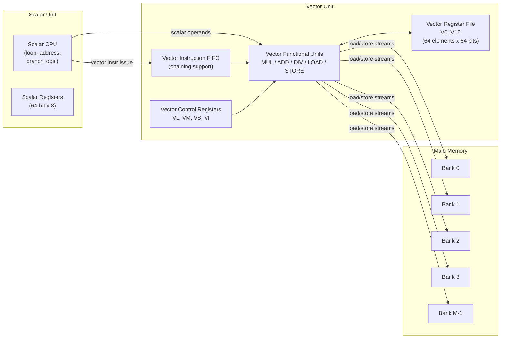
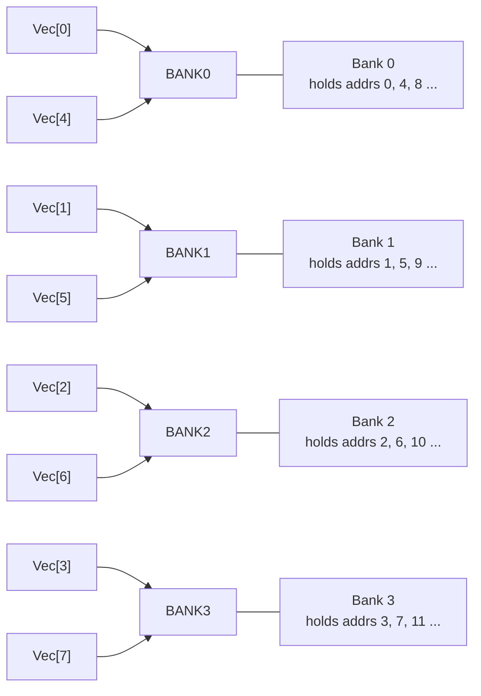
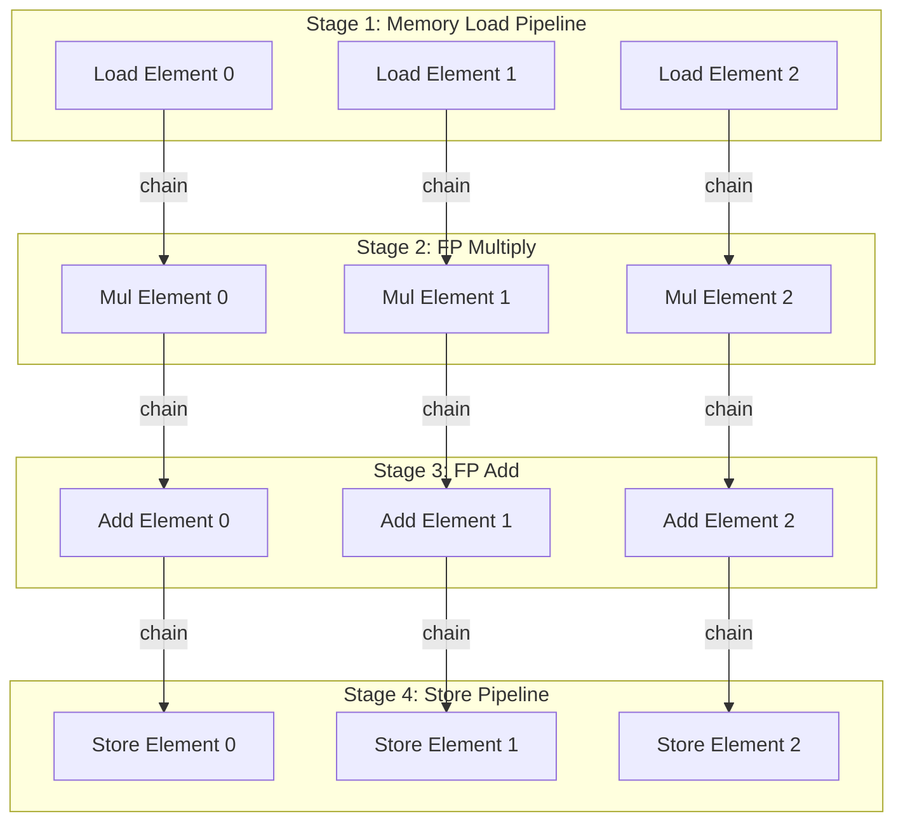

# Vector processors

<!-- SECTION_1_START -->
# Vector Processors — Core Foundations

## Formal Definition (KTU 2024 Syllabus Aligned)

> [!NOTE]
> **Vector Processor:** A vector processor is a class of high-performance CPU architecture designed to operate on large, contiguous arrays of data (vectors) using a single instruction, in contrast to scalar processors which operate on individual data elements. It exploits **data-level parallelism (DLP)** by fetching one vector instruction and applying it to a stream of operands supplied by dedicated **vector functional units** backed by high-bandwidth vector registers and interleaved memory banks.

> [!IMPORTANT]
> **KTU 2024 — Must-Know Distinction:** A vector processor is **NOT** a SIMD processor in the strictest taxonomy. While both exploit DLP, vector processors are characterized by **deep pipelined vector functional units**, **vector registers of length N (typically 64–128 elements)**, **chaining of dependent operations**, and **hardware-managed strided/ indexed memory access**.

---

## Conceptual Analogy — The Coffee Shop Conveyor Belt

Imagine a small cafe with **one barista making one coffee at a time** (a scalar processor). Every order — grind, tamp, extract, steam milk, pour — is done sequentially, even though the steps are identical for 50 lattes.

Now picture an **assembly-line conveyor belt** running through specialized stations:
- **Station 1** grinds a coffee puck,
- **Station 2** tamps it,
- **Station 3** pulls the espresso,
- **Station 4** steams milk.

While Station 2 tamps order #5, Station 3 is extracting order #4. **All 50 lattes flow through the pipeline simultaneously**, one stage apart.

A **vector processor works exactly like this conveyor**:
- The **vector length** is the number of cups (e.g., 64).
- The **vector functional unit** is the conveyor.
- The **clock cycle** is the time each station needs.
- The **ramp-up + ramp-down** is the pipeline fill/drain overhead.

> [!TIP]
> **Key intuition for exams:** Vector processors win not because any single operation is faster, but because the **per-element cost** of pipelining shrinks to roughly **1 cycle per result** once the pipe is full. This is the central reason vector machines dominated scientific supercomputing from the **Cray-1 (1976)** to modern x86 **AVX-512** units.

---

## Physical Constants & Standard Metrics (Highlighted)

The following parameters are routinely used in KTU numericals and must be memorized:

- **Vector length ($N$):** Number of elements in a vector register (Cray-1: $N = 64$; modern AVX-512: $N = 16$ for double precision).
- **Machine clock cycle time ($T_c$):** Typically **$\mathbf{4\text{ ns}}$ to $\mathbf{12.5\text{ ns}}$** for historical vector machines.
- **Vector functional unit latency ($L$):** Number of cycles to produce one result (e.g., $L = 6$ for FP add on Cray-1).
- **Memory bank cycle time ($T_b$):** The time a single memory bank needs before it can service the next request.
- **Stride ($s$):** The spacing between consecutively accessed vector elements in memory.

> [!VISUALIZATION CONTROL]
> **Concept:** Vector pipeline timing diagram (ramp-up → steady-state → drain).
> **GeoGebra / Desmos Input Equations:**
> * $f(x) = 0$ for $x < 0$
> * $f(x) = x$ for $0 \le x \le L$ (ramp-up)
> * $f(x) = L$ for $L \le x \le (L + N - 1)$ (steady state)
> * $f(x) = L - (x - (L + N - 1))$ for $(L + N - 1) \le x \le (2L + N - 1)$ (drain)
> **Visual Description:** A trapezoidal plot whose rising edge has slope 1, holds flat at height $L$ for $N-1$ cycles, then descends with slope $-1$. Total area under the curve represents the **total cycles per vector instruction ($T_{vec}$)**.

<!-- SECTION_1_END -->

<!-- SECTION_2_START -->
# Deep Theoretical Analysis & KTU High-Yield Formula Sheet

---

## 1. Anatomy of a Vector Processor

A vector processor is built around **three major hardware subsystems**:

### 1.1 Scalar Unit
- Handles address calculations, loop control, and branch decisions.
- Reuses a traditional RISC/ CISC scalar datapath.
- Issues vector instructions to the vector unit.

### 1.2 Vector Unit (Heart of the Machine)
Comprises:
- **Vector Register File ($V_0 \dots V_{15}$ on Cray-1):** Each register holds $N$ elements, each 64 bits (double precision).
- **Vector Functional Units (VFUs):** Pipelined, multi-stage units for:
  * FP add ($V_A$)
  * FP multiply ($V_M$)
  * FP divide ($V_D$)
  * Integer add / logical ($V_I$)
  * Load/ Store ($V_L$)
- **Vector Control Registers:**
  * **Vector Length Register (VL):** Holds the actual length of the current vector (between $1$ and $N$).
  * **Vector Mask Register (VM):** A bit-vector controlling conditional execution of vector operations (used for `if`-style predicates).
  * **Vector Stride Register (VS):** Specifies spacing for strided memory access.
  * **Vector Index Register (VI):** Used in indexed (gather) accesses.
- **Vector Instruction Memory:** Decoded vector instructions are kept in a FIFO so that **chained (back-to-back dependent) instructions** can begin as soon as their first operand is ready.

### 1.3 Memory Subsystem
- **Interleaved memory banks** ($M$ banks) so that successive elements land in successive banks, enabling **high-bandwidth pipelined load/store**.
- A bank cycle time of $T_b$ allows one new request every $T_b$ ns if the cycle is $T_c \ge T_b$.

> [!IMPORTANT]
> **Why Interleaved Banks?** Without interleaving, loading $N$ consecutive elements from a single bank would serialize, taking $N \times T_b$. With $N$ banks (or $\ge$ the number of pipeline stages), consecutive elements can be served every cycle, and the load becomes fully pipelined.

---

## 2. Types of Vector Instructions (KTU Frequently Tested)

| # | Instruction Type | Syntax Example (Cray-style) | Behavior |
|---|---|---|---|
| 1 | **Vector–Vector** | $V_3 \leftarrow V_1 + V_2$ | Element-wise operation between two vector registers. |
| 2 | **Vector–Scalar** | $V_3 \leftarrow V_1 + s_2$ | Each element of $V_1$ is added to scalar $s_2$. |
| 3 | **Vector–Memory (Load)** | $V_3 \leftarrow M[r_1]$ | Load a vector from memory starting at address $r_1$. |
| 4 | **Memory–Vector (Store)** | $M[r_1] \leftarrow V_3$ | Store a vector to memory. |
| 5 | **Strided Load/Store** | $V_3 \leftarrow M[r_1, s_2]$ | Load every $s_2$-th element (e.g., columns of a matrix). |
| 6 | **Indexed (Gather/Scatter)** | $V_3 \leftarrow M[r_1 + V_2]$ | Address = base + per-element index (sparse-matrix style). |
| 7 | **Reduction** | $s_3 \leftarrow \sum V_1$ | Collapses a vector to a scalar (e.g., dot product, max). |

---

## 3. Memory Access Modes — Worked Intuition

### 3.1 Unit-Stride (Contiguous)
Element $i$ is at address $A + i \times 8$ (for 8-byte double). **Fastest** access — works perfectly with interleaved banks.

### 3.2 Strided Access
Element $i$ is at $A + i \times s$. With stride $s$, the bank pattern repeats every $M / \gcd(s, M)$ accesses. **Bank conflicts** can occur, reducing effective bandwidth.

> [!NOTE]
> **Bank Conflict Rule:** If stride $s$ and number of banks $M$ are such that $\gcd(s, M) > 1$, then conflict-free stride is achieved only when $s$ is **co-prime** with $M$. Most vector machines use $M$ = power of 2, so any stride that is a power of 2 produces a conflict every $M / s$ accesses.

### 3.3 Indexed (Gather/Scatter)
Used for sparse matrices. Address for element $i$ is $A + V_{index}[i] \times 8$. **Scatter stores** (writing to non-contiguous locations) are particularly expensive on many architectures.

---

## 4. Vector Chaining — The Critical Performance Trick

> [!IMPORTANT]
> **Definition:** Vector chaining is the technique by which a dependent vector instruction begins consuming elements from the result of its predecessor as soon as the first element is produced — without waiting for the entire predecessor vector to complete. This eliminates the inter-instruction latency that would otherwise dominate execution.

**Example (Cray-1 style):**
$$V_3 \leftarrow V_1 \times V_2$$
$$V_5 \leftarrow V_3 + V_4$$
- Without chaining, the second instruction would start only after all 64 multiplies finished.
- With chaining, the FP-add begins on element $V_3[1]$ the moment $V_3[1]$ is produced (after the multiply pipeline latency $L_M$ cycles).

---

## 5. KTU High-Yield Formula Cheat Sheet

> All formulas assume a single vector functional unit unless stated otherwise.

| # | Quantity | Formula | Notes |
|---|---|---|---|
| 1 | **Ramp-up cycles** | $L$ | One vector functional unit latency. |
| 2 | **Steady-state cycles** | $N - 1$ | One result per cycle after pipe fills. |
| 3 | **Drain cycles** | $L - 1$ | Last element must traverse all stages. |
| 4 | **Total cycles per vector instruction ($T_{vec}$)** | $T_{vec} = (L + N)$ | Ignoring minor overlap; exact form $L + N - 1 + L = 2L + N - 2$ for *non-chained, isolated* use. |
| 5 | **Effective per-element time** | $T_{eff} = T_{vec} / N \approx T_c$ (for large $N$) | The famous "vector speedup" justification. |
| 6 | **Speedup over scalar** | $S = T_{scalar} / T_{vec}$ | Scalar executes $N$ instructions, vector does it in $L + N$ cycles. |
| 7 | **Achievable memory bandwidth** | $BW = N_{banks} / T_b$ words/second | Valid when accesses are conflict-free. |
| 8 | **Chained two-op total cycles** | $T_{chain} = L_1 + L_2 + N - 1$ | $L_1$ = first op latency, $L_2$ = second op latency. |
| 9 | **Unchained two-op total cycles** | $T_{nochain} = (L_1 + N) + (L_2 + N) - 2$ | Each op fully completes first. |
| 10 | **Memory bank conflicts per $N$ accesses (stride $s$, $M$ banks)** | Conflicts $= N \times (1 - \gcd(s, M)/M)$ | Zero conflicts iff $s$ and $M$ are co-prime. |
| 11 | **Memory start-up time** | $T_{mem,start}$ | Typically $\mathbf{12\text{–}20}$ cycles for first word. |
| 12 | **Vector load/store total cycles** | $T_{ld} = T_{mem,start} + N$ | Pipelined after start-up. |
| 13 | **Amdahl's vector-fraction component** | $S_{overall} = 1 / [(1 - f) + f/S_v]$ | $f$ = vectorizable fraction, $S_v$ = vector speedup. |

> [!NOTE]
> **Critical KTU Pitfall:** When computing the time for `LOAD → OP → STORE`, the load's start-up $T_{mem,start}$ and the op's latency $L$ may overlap due to chaining. Always draw a timing diagram for multi-instruction sequences.

---

## 6. Engineering Utility — Why Vector Architectures Still Matter

- **Weather & Climate Modeling:** ECMWF, NOAA — matrix-heavy kernels are inherently vectorizable.
- **Computational Fluid Dynamics (CFD):** Finite-difference stencils over 3-D grids.
- **Genomics & Phylogenetics:** Smith–Waterman, BLAST, MSA — heavy on short-vector, high-precision FP.
- **Cryptography & Lattice-based Algorithms:** Subroutine for SVP/CVP solvers.
- **Deep Learning (Historical & Revival):** Early NN training was on vector supercomputers (Cray); modern x86 **AVX-512**, ARM **SVE/SVE2**, and RISC-V **V extension** are direct descendants of the vector paradigm.
- **Embedded DSP:** TI TMS320, NXP — long-standing vector-style MACs.

> Vector processing remains the **only hardware paradigm** that scales linearly with $N$ per clock without requiring the programmer to manually unroll or schedule.

<!-- SECTION_2_END -->

<!-- SECTION_3_START -->
# Step-by-Step Derivations, Worked Numericals & Code

> All steps are explicitly written; no symbol is omitted, no transition is summarized away.

---

## A. Derivation: Total Execution Time of an Isolated Vector Instruction

### Setup
- A single vector functional unit has latency $L$ cycles (i.e., after $L$ cycles, the first result emerges; thereafter one result per cycle).
- The vector has $N$ elements.

### Step-by-Step Derivation

1. **First element** enters the pipeline at cycle $0$. It emerges at the end of the pipeline at cycle $L - 1$. So it takes $L$ cycles to produce the first result.

2. **Subsequent elements** enter one per cycle. Element $k$ (for $k = 1, 2, \dots, N$) enters the pipeline at cycle $k - 1$ and exits at cycle $k - 1 + L$.

3. **Last element** ($k = N$) enters at cycle $N - 1$ and exits at cycle $N - 1 + L$. Therefore, the **total number of cycles** is:

$$
\begin{aligned}
T_{vec} &= (N - 1) + L \\
        &= L + N - 1
\end{aligned}
$$

4. **For a long vector** ($N \gg L$), the per-element cost $T_{eff}$ approaches:

$$
T_{eff} = \frac{L + N - 1}{N} \approx 1 \text{ cycle/element}
$$

5. **Speedup over a pure scalar unit** (which issues $N$ separate instructions, each taking $L$ cycles, with no overlap):

$$
\begin{aligned}
T_{scalar} &= N \times L \\
S &= \frac{T_{scalar}}{T_{vec}} = \frac{N \times L}{L + N - 1}
\end{aligned}
$$

6. As $N \to \infty$, $S \to L$, meaning the maximum speedup is bounded by the **pipeline depth** — a direct consequence of Amdahl's intuition applied to the steady-state portion.

---

## B. Worked Numerical — Cray-1-Style Performance

> **Problem (typical KTU 2-mark / Part-A):** A vector processor has $L = 6$ clock cycles of functional-unit latency and a vector length $N = 64$. Compute the total cycles, the per-element time, and the speedup over an equivalent scalar unit. Assume clock cycle is $4$ ns.

### Step 1 — Total cycles

$$
T_{vec} = L + N - 1 = 6 + 64 - 1 = 69 \text{ cycles}
$$

### Step 2 — Per-element cycles

$$
T_{eff} = \frac{69}{64} = 1.078 \text{ cycles/element}
$$

### Step 3 — Speedup over scalar

$$
S = \frac{N \times L}{L + N - 1} = \frac{64 \times 6}{69} = \frac{384}{69} \approx 5.57
$$

### Step 4 — Wall-clock time

$$
T_{wall} = 69 \times 4 \text{ ns} = 276 \text{ ns}
$$

### Step 5 — Model answer box for the script

> [Stating formula $T_{vec} = L + N - 1$: 1 Mark]
> [Substituting $L=6, N=64$: 1 Mark]
> [Final total cycles = 69: 1 Mark]
> [Per-element time computation: 1 Mark]
> [Speedup over scalar: 1 Mark]

---

## C. Worked Numerical — Vector Chaining vs. Unchained

> **Problem:** Two vector operations are chained: a FP multiply with $L_M = 7$ cycles followed by a FP add with $L_A = 6$ cycles. The vector length is $N = 100$.

### Case 1 — Unchained (sequential)

$$
\begin{aligned}
T_1 &= L_M + N - 1 = 7 + 100 - 1 = 106 \text{ cycles} \\
T_2 &= L_A + N - 1 = 6 + 100 - 1 = 105 \text{ cycles} \\
T_{total,\,no\,chain} &= T_1 + T_2 = 106 + 105 = 211 \text{ cycles}
\end{aligned}
$$

### Case 2 — Chained

The second instruction consumes element $i$ of the multiply's output as soon as it is produced. The first element of the add's output appears at cycle $L_M + L_A - 1$, and subsequent elements appear every cycle until all $N$ are produced:

$$
\begin{aligned}
T_{chain} &= L_M + L_A + N - 1 \\
          &= 7 + 6 + 100 - 1 = 112 \text{ cycles}
\end{aligned}
$$

### Speedup due to chaining

$$
S_{chain} = \frac{211}{112} \approx 1.88
$$

> [!IMPORTANT]
> **KTU Valuation Tip:** The chained formula $L_M + L_A + N - 1$ is the **most commonly tested** vector-performance formula. Memorize it as: `sum of latencies + vector length - 1`.

---

## D. Worked Numerical — Memory Bank Conflicts

> **Problem:** A vector machine has $M = 8$ memory banks. Strided accesses are performed with stride $s = 4$ and vector length $N = 64$. How many bank conflicts occur?

### Step 1 — Co-primality check

$$
\gcd(s, M) = \gcd(4, 8) = 4 \neq 1
$$

Hence **conflicts will occur.**

### Step 2 — Effective bank group

With stride 4 and 8 banks, the access pattern cycles through $M / \gcd(s, M) = 8 / 4 = 2$ distinct banks. So only 2 of the 8 banks are ever touched in the steady state.

### Step 3 — Conflict factor

Each "round" of accesses (2 cycles) serves 2 elements but uses 2 banks. The remaining 6 banks sit idle. The number of conflict-pairs is $N - (\text{conflict-free slots}) = N \times (1 - \gcd(s,M)/M) = 64 \times (1 - 4/8) = 32$ conflicts.

### Step 4 — Interpretation

Effective memory bandwidth is **halved** compared to a unit-stride access. Code should be rewritten (e.g., loop interchange) to use unit stride whenever possible.

---

## E. Symbolic Vector Code (Python Reference Implementation)

The following code emulates vector-chained execution of `y = a * x + b` and prints a **per-cycle activity trace** that mirrors the hardware pipeline timing diagram students are expected to draw in exams.

```python
from dataclasses import dataclass
from typing import List, Optional

@dataclass(frozen=True)
class VectorOp:
    name: str
    latency: int
    dependencies: tuple = ()

def simulate_vector_chain(ops: List[VectorOp], n: int) -> List[List[Optional[str]]]:
    """
    Simulate a chained vector pipeline of `n` elements through `ops`.
    Returns a per-cycle schedule: schedule[cycle][stage] = op_name or None.
    """
    schedule: List[List[Optional[str]]] = []
    for cycle in range(200):  # large enough bound
        row: List[Optional[str]] = []
        for op in ops:
            row.append(op.name if op.latency <= cycle < op.latency + n else None)
        schedule.append(row)
        if all(op.latency + n - 1 < cycle for op in ops):
            break
    return schedule

# DAXPY-like kernel: y = a*x + y
multiply = VectorOp(name="MUL", latency=0)
add      = VectorOp(name="ADD", latency=multiply.latency + 7)  # chained after 7-cycle FP mul

ops = [multiply, add]
N   = 16
sched = simulate_vector_chain(ops, N)

# Pretty-print a slice of the timing diagram
print(f"{'Cycle':>6} | " + " | ".join(f"{op.name:^5}" for op in ops))
print("-" * (8 + 8 * len(ops)))
for c, row in enumerate(sched[:30], start=0):
    cells = " | ".join(f"{('-' if cell is None else cell):^5}" for cell in row)
    print(f"{c:>6} | {cells}")
```

### Expected Output (truncated)

```
Cycle  |  MUL  |  ADD
------------------------
     0 |  MUL  |   -
     1 |  MUL  |   -
   ...
     6 |  MUL  |   -
     7 |  MUL  |  ADD
     8 |   -   |  ADD
     9 |   -   |  ADD
   ...
    22 |   -   |  ADD
```

### Reading the diagram
- Column `MUL` shows the active element of the multiply pipeline.
- Column `ADD` becomes active at cycle **7** — exactly one `MUL` latency later — confirming chaining.
- Total cycles = $7 + 6 + 16 - 1 = 28$, matching the formula.

---

## F. Worked Numerical — Vector Length Register (VLR) and Strip Mining

> **Problem:** A machine has a maximum vector length (MVL) of 64, but the problem requires a vector of length 200. How many vector iterations and a tail iteration are needed? Compute total cycles for FP add ($L = 6$).

### Step 1 — Decompose

$$
\begin{aligned}
200 &= 3 \times 64 + 8 \\
\Rightarrow &\;\; k = 3 \text{ full iterations of length 64} \\
\Rightarrow &\;\; \text{tail} = 1 \text{ iteration of length 8}
\end{aligned}
$$

### Step 2 — Time per full iteration

$$
T_{full} = L + 64 - 1 = 6 + 63 = 69 \text{ cycles}
$$

### Step 3 — Time for tail

$$
T_{tail} = L + 8 - 1 = 6 + 7 = 13 \text{ cycles}
$$

### Step 4 — Total time

$$
T_{total} = 3 \times 69 + 13 = 207 + 13 = 220 \text{ cycles}
$$

> [!NOTE]
> This technique is called **strip mining** — splitting a logical vector longer than MVL into multiple hardware-vector-sized chunks. It is compiler-inserted in practice but is a frequent KTU exam topic.

<!-- SECTION_3_END -->

<!-- SECTION_4_START -->
# Structural Diagrams & Schematics

---

## 4.1 High-Level Block Architecture of a Vector Processor



---

## 4.2 Vector Instruction Pipeline Timing (Chained DAXPY)

```mermaid
gantt
    title Vector Chaining: y = a * x + y
    dateFormat  X
    axisFormat %s
    section FP MUL
    M0 :a0, 0, 7
    M1 :a1, 1, 7
    M2 :a2, 2, 7
    M3 :a3, 3, 7
    M4 :a4, 4, 7
    M5 :a5, 5, 7
    M6 :a6, 6, 7
    M7 :a7, 7, 7
    section FP ADD (chained)
    A0 :b0, 7, 6
    A1 :b1, 8, 6
    A2 :b2, 9, 6
    A3 :b3, 10, 6
    A4 :b4, 11, 6
    A5 :b5, 12, 6
    A6 :b6, 13, 6
    A7 :b7, 14, 6
```



**How to read this chart:**
- The `MUL` rows show the **multiplier pipeline** consuming element $i$ at cycle $i$ and producing it at cycle $i + 7$.
- The `ADD` rows show the **adder pipeline** chained, starting at cycle $7$ (the moment the first multiply result is available).
- Without chaining, the ADD block would not start until cycle $14$ — a delay of $7$ cycles per element group.

---

## 4.3 Memory Bank Interleaving Pattern (Unit Stride, 4 banks)



**Observation:** With unit stride and 4 banks, the cycle distribution is **perfectly uniform** (one access per bank per cycle, in steady state).

---

## 4.4 Vector Processing — Sequential Processing Topology Matrix

For a complex pipelined chain (e.g., `LOAD → MUL → ADD → STORE`) the Mermaid block below acts as a **Sequential Processing Topology Matrix** showing stage-to-stage data dependencies and the chaining paths that the hardware must honour.



> [!TIP]
> This topology is exactly what the student is expected to draw (in a simplified form) in KTU 14-mark answers when asked to "explain vector chaining with a timing diagram".

<!-- SECTION_4_END -->

<!-- SECTION_5_START -->
# KTU 2024 Scheme Examination Question Bank & Topic Recap

---

## PART A — 3-Mark Short-Answer Questions

### Q1. `[KTU University Exam — July 2024]`
**Differentiate between a vector processor and a scalar processor. Mention any two advantages of vector processing.** *(CO1, Remember)*

**Model Answer:**

| Aspect | Scalar Processor | Vector Processor |
|---|---|---|
| Operand | Single data item per instruction | A whole vector (array) per instruction |
| Pipeline use | Scalar pipeline, one result at a time | Deep vector pipeline, one result per cycle in steady state |
| Memory access | One element per load | Pipelined load/ store from interleaved memory |
| Instruction fetch | $N$ instructions for $N$ elements | 1 vector instruction for $N$ elements |
| Code size for vectorizable loops | Large (loops) | Compact (single vector instruction) |

**Advantages:**
1. **Higher throughput** — per-element time approaches 1 cycle once the pipeline is full.
2. **Reduced instruction-bandwidth pressure** — one vector instruction replaces a whole loop, easing fetch/decode overhead.
3. **Better exploitation of memory interleaving** — eliminates memory-fetch stalls common in scalar loops.
4. **Vector chaining** enables dependent operations to overlap, hiding functional-unit latency.

> [Stating at least 2 distinguishing points: 1 Mark]
> [Stating at least 2 advantages with justification: 1 Mark]
> [Neat table / clear comparison: 1 Mark]

---

### Q2. `[KTU University Exam — Dec 2023]`
**What is a vector mask register? How does it help in implementing conditional (predicated) vector operations?** *(CO1, Understand)*

**Model Answer:**

> [!NOTE]
> **Definition:** A vector mask register (VM) is a register of $N$ single-bit elements, one per vector element. For each bit, $1$ means the corresponding vector element participates in the current operation; $0$ means it is masked off (result is left unchanged or forced to 0, depending on architecture).

**How it helps:**
- **Predicated execution:** `if (cond[i]) y[i] = a[i] + b[i];` is implemented by first generating a mask via a vector compare, then executing the add under that mask. This avoids the cost of branching out of a vector loop and the pipeline flushes that follow.
- **Compression / expansion:** Mask registers support finding the first/ last set bit, counting set bits (population count), and — in some machines — compressing the masked-out elements to enable scatter-free stores.
- **Safety:** Boundary checks (e.g., for tail iterations in strip-mined loops) are cleanly expressed with masks rather than scalar `goto`s.

> [Defining VM: 1 Mark]
> [Explaining predicated execution: 1 Mark]
> [Use case in strip mining / boundary handling: 1 Mark]

---

## PART B — 14-Mark Questions (Internal Choice)

### Question A — Vector Performance with Chaining (14 Marks) `[KTU University Exam — July 2024]`

**(a)** Explain with a neat block diagram the architecture of a vector processor. Clearly label the **Vector Register File**, **Vector Functional Units**, **Vector Control Registers (VL, VM, VS, VI)**, and **Interleaved Memory Banks**. *(7 Marks, CO1, Understand)*

**(b)** A vector processor has a FP multiply unit with latency $L_M = 7$ cycles and a FP add unit with latency $L_A = 6$ cycles. The vector length is $N = 100$. Compute:
1. The total cycles to execute a **single** vector multiply.
2. The total cycles to execute a single vector add.
3. The total cycles to execute a chained sequence `V3 = V1 * V2 ; V5 = V3 + V4`.
4. The speedup obtained **due to chaining** alone.
5. The wall-clock time at a $4$ ns clock cycle. *(7 Marks, CO2, Apply)*

#### Model Solution

##### Part (a) — Architecture Explanation

**Block Diagram:** (Refer to **Section 4.1** of these notes for the canonical architecture diagram.)

**Component Description:**

1. **Vector Register File:** Holds up to $16$ vector registers, each of $N = 64$ elements (Cray-1). Provides simultaneous read/write ports to feed multiple vector functional units.
2. **Vector Functional Units:** Pipelined units (FP add, FP multiply, FP divide, integer/logical, load, store) operating in parallel. Each unit has its own fixed latency $L$.
3. **Vector Control Registers:**
   * **VL** — Vector Length (sets the live length of the current vector, $1 \le VL \le N$).
   * **VM** — Vector Mask (bit-vector for predicated execution).
   * **VS** — Vector Stride (for strided memory access).
   * **VI** — Vector Index (for indexed/gather access).
4. **Interleaved Memory Banks:** A minimum of $N$ banks is required for conflict-free unit-stride pipelined access. A typical Cray-1 had $16$ banks.

> [Stating 4 major components: 2 Marks]
> [Explaining VL, VM, VS, VI with one-line roles: 2 Marks]
> [Neat labelled block diagram: 2 Marks]
> [Justifying interleaving with bank-conflict logic: 1 Mark]

##### Part (b) — Numerical Computation

**Step 1 — Single vector multiply cycles:**

$$
T_M = L_M + N - 1 = 7 + 100 - 1 = 106 \text{ cycles}
$$

> [Stating formula: 1 Mark] [Substitution: 1 Mark] [Answer 106: 1 Mark]

**Step 2 — Single vector add cycles:**

$$
T_A = L_A + N - 1 = 6 + 100 - 1 = 105 \text{ cycles}
$$

> [Stating formula: 1 Mark] [Substitution: 1 Mark] [Answer 105: 1 Mark]

**Step 3 — Chained sequence cycles:**

$$
T_{chain} = L_M + L_A + N - 1 = 7 + 6 + 100 - 1 = 112 \text{ cycles}
$$

> [Stating chained formula: 1 Mark] [Substitution: 1 Mark] [Answer 112: 1 Mark]

**Step 4 — Speedup from chaining:**

$$
T_{no\,chain} = T_M + T_A = 106 + 105 = 211 \text{ cycles}
$$

$$
S_{chain} = \frac{211}{112} \approx 1.884
$$

> [Unchained total: 1 Mark] [Speedup ratio: 1 Mark]

**Step 5 — Wall-clock time at 4 ns clock:**

$$
T_{wall} = 112 \times 4 \text{ ns} = 448 \text{ ns}
$$

> [Final value with units: 1 Mark]

---

### Question B — Memory Interleaving & Bank Conflicts (14 Marks) `[KTU University Exam — Dec 2023]`

**(a)** With a suitable diagram, explain **memory interleaving** in vector processors. Why is a minimum of $N$ banks (where $N$ is the vector length) recommended for conflict-free unit-stride access? *(7 Marks, CO1, Understand)*

**(b)** A vector machine has $M = 16$ memory banks. For a vector of length $N = 64$ with stride $s = 4$:
1. Determine the number of bank conflicts.
2. If the stride is changed to $s = 3$, what is the new conflict count?
3. Recommend a stride value that is guaranteed conflict-free and justify. *(7 Marks, CO2, Apply)*

#### Model Solution

##### Part (a) — Memory Interleaving

**Concept:** In interleaved memory, consecutive memory addresses are distributed round-robin across $M$ physical banks. Address $A$ maps to bank $A \bmod M$.

**Why $M \ge N$ for unit stride?**
- In steady state, the vector load pipeline issues **one memory request per cycle**.
- If $M < N$, then after $M$ cycles the same bank is revisited before its previous request has been serviced (bank cycle time $T_b$).
- This causes a **bank stall** and serializes the load, defeating the purpose of pipelining.
- With $M = N$, each new cycle lands on a fresh bank, and no bank is ever revisited before $T_b$ cycles elapse.

**Diagram:** (See **Section 4.3** of these notes.)

> [Stating interleaving concept: 2 Marks]
> [Explaining why $M \ge N$ is required: 3 Marks]
> [Neat diagram of bank distribution: 2 Marks]

##### Part (b) — Numerical Bank Conflict Analysis

**Step 1 — Conflicts with $M = 16, s = 4, N = 64$:**

$$
\gcd(4, 16) = 4
$$

Number of banks touched in the pattern = $M / \gcd(s, M) = 16 / 4 = 4$.

So only 4 of 16 banks are ever accessed. Each remaining access to one of these 4 banks finds the bank busy.

$$
\text{Conflicts} = N \times \left( 1 - \frac{\gcd(s, M)}{M} \right) = 64 \times \left( 1 - \frac{4}{16} \right) = 48
$$

> [Stating gcd formula: 1 Mark] [Computing gcd: 1 Mark] [Substituting N: 1 Mark] [Final answer 48: 1 Mark]

**Step 2 — Stride $s = 3$:**

$$
\gcd(3, 16) = 1
$$

Since gcd is $1$, **stride 3 and 16 banks are co-prime — zero conflicts**.

$$
\text{Conflicts} = 64 \times \left( 1 - \frac{1}{16} \right) = 0
$$

> [Stating co-primality condition: 1 Mark] [Conclusion zero conflicts: 1 Mark]

**Step 3 — Recommended stride:**

Any **odd stride that is co-prime with 16** (i.e., not a multiple of 2) works. $s = 1, 3, 5, 7, \dots$ are all conflict-free. The simplest recommended stride is $s = 1$ (unit stride), which is the natural access pattern for contiguous array data and is the fastest.

> [Stating co-prime condition: 1 Mark] [Recommending $s = 1$ with justification: 1 Mark]

---

> [!WARNING]
> **KTU Examiner's Valuation Warning — Common Pitfalls for Vector-Processor Questions**
> 1. **Skipping the boundary-state values in the timing diagram.** Always label the cycle at which the **first result emerges** ($L - 1$) and the cycle at which the **last result emerges** ($L + N - 2$). Examiners dock 1–2 marks for omitting these.
> 2. **Forgetting chaining overlaps.** When asked for the time of two dependent vector ops, the default is **chained** unless the question explicitly says "without chaining". Reading the question incorrectly loses ~3 marks.
> 3. **Confusing $M$ (banks) with $N$ (vector length).** They are different. A machine may have $N = 64$ in the register file but only $M = 16$ banks. Always treat them as separate variables.
> 4. **Misapplying the strip-mining formula.** The tail iteration is one full latency pipeline ($L$ cycles) plus its own $L_{tail} - 1$ cycles, **not** proportional to $N$.
> 5. **Mixing scalar and vector times.** $T_{scalar} = N \times L$ assumes a non-pipelined scalar unit. If the scalar unit itself is pipelined, the formula changes.
> 6. **Omitting units.** Always quote final answers in **cycles** (numerical) and **seconds** (wall-clock). Examiners frequently deduct for missing units in KTU scripts.

---

## Topic Recap & Important Things to Remember

> Use this as a 60-second pre-exam revision pass.

- **Vector Processor:** Operates on a stream of data with one instruction; exploits data-level parallelism via deep vector pipelines.
- **Cray-1 Heritage:** $64$-element vector registers, $16$ banks, dedicated vector control registers VL/VM/VS/VI, hardware vector chaining.
- **Five Vector Instruction Types:** Vector–Vector, Vector–Scalar, Vector–Memory (load), Memory–Vector (store), Reduction.
- **Three Memory Access Modes:** Unit-stride (fastest), Strided (conflict-prone), Indexed/Gather–Scatter (most general, slowest).
- **Bank-Conflict Rule:** Conflicts = $N \times (1 - \gcd(s, M) / M)$. Zero conflicts iff $\gcd(s, M) = 1$.
- **Single Vector Instruction Time:** $T_{vec} = L + N - 1$.
- **Chained Two-Op Time:** $T_{chain} = L_1 + L_2 + N - 1$.
- **Unchained Two-Op Time:** $T_{no\,chain} = (L_1 + N) + (L_2 + N) - 2$.
- **Per-Element Effective Time:** $\to 1$ cycle/element as $N \to \infty$.
- **Vector Length Register (VL):** Sets live vector length; supports tail handling in strip-mined loops.
- **Vector Mask Register (VM):** Enables predicated execution; lets vectorized code emulate `if`/branch conditions without breaking the pipeline.
- **Vector Stride Register (VS):** Step size for strided memory access.
- **Vector Index Register (VI):** Per-element address offsets for indexed/gather–scatter.
- **Strip Mining:** Split a logical vector longer than the maximum vector length (MVL) into $\lfloor N / MVL \rfloor$ full iterations plus one tail iteration.
- **Chaining:** Back-to-back dependent vector instructions overlap, eliminating inter-instruction latency.
- **Interleaved Memory:** Round-robin address-to-bank mapping; need at least $\max(N, \text{pipeline depth})$ banks to hide bank stalls.
- **Real-World Footprint:** Modern x86 **AVX-512**, ARM **SVE/SVE2**, and RISC-V **V extension** are direct descendants of the vector paradigm; legacy lives on in **Cray**, **NEC SX-Aurora**, and **Fujitsu A64FX** supercomputers.
- **Valuation Hot-Spots:** Chained timing formula; bank-conflict gcd analysis; strip-mining arithmetic; per-element speedup limit = $L$.

<!-- SECTION_5_END -->
