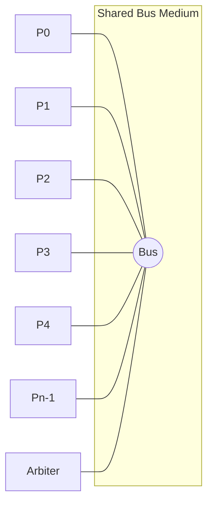
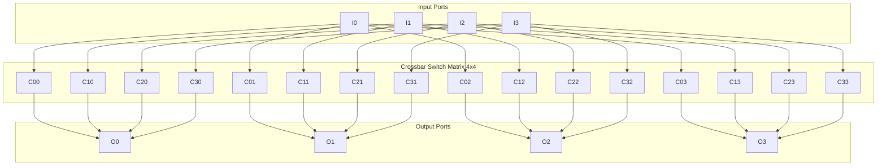
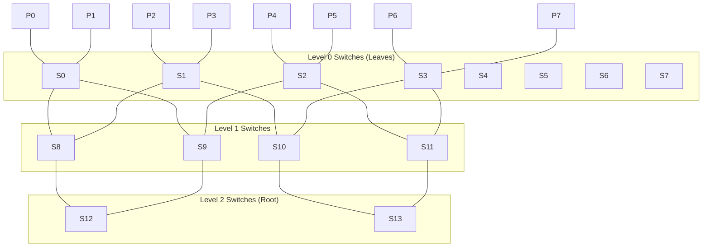
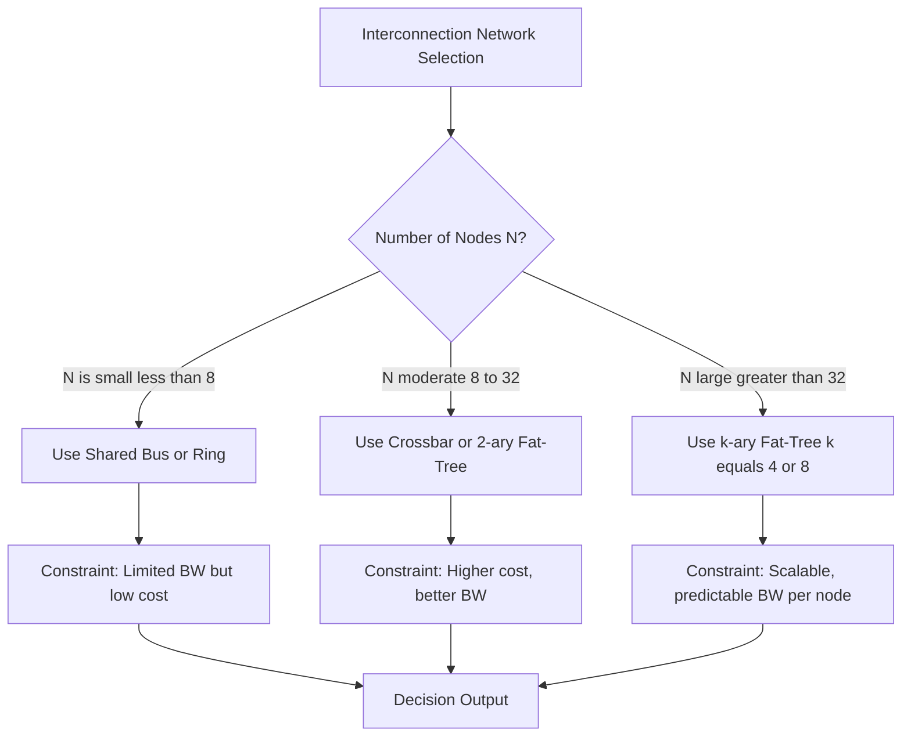
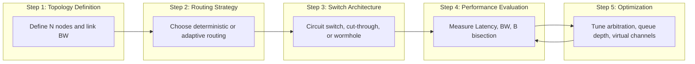

# Basic performance characteristics of networks, Buses, Switched and fat-tree networks

<!-- SECTION_1_START -->
# 1. Core Technical Definition & Intuitive Overview

## 1.1 Interconnection Networks in Parallel Computers

An **interconnection network** in a parallel computer is the communication subsystem that enables data transfer, synchronization, and coordination between processors, memory modules, and I/O devices. In high-performance computing (HPC), the choice of network topology directly determines the scalability, cost, and achievable parallelism of the system.

> [!IMPORTANT]
> **KTU 2024 Syllabus Definition (PECST757 - Module 2):**
> An interconnection network is a programmable system that transfers data between processor-memory pairs. Its performance is characterized by **topology**, **routing algorithm**, **switching strategy**, and **flow control mechanism**.

### 1.2 Basic Performance Characteristics of Networks

The four foundational performance metrics for evaluating any interconnection network are:

1. **Latency (L)** – The time delay between a message being injected into the network and the first bit arriving at the destination. Measured in **nanoseconds (ns)** or **microseconds (μs)**.
2. **Bandwidth (BW)** – The maximum rate at which data can be transferred through the network. Measured in **Gigabytes/second (GB/s)** or **bits/second (bps)**.
3. **Bisection Bandwidth (B_bis)** – The minimum aggregate bandwidth crossing any cut that divides the network into two equal halves. Critical for parallel workloads that require all-to-all communication.
4. **Cost / Complexity** – Measured in terms of the number of wires, switches, and links (often expressed as **O(N)**, **O(N log N)**, or **O(N²)** in terms of N nodes).

> [!NOTE]
> **Geometric Intuition (Highway Analogy):**
> Imagine a network of cities connected by roads.
> - **Latency** = travel time from City A to City B (one-way trip time).
> - **Bandwidth** = number of cars that can simultaneously pass a toll booth per second.
> - **Bisection Bandwidth** = the total capacity of roads crossing the geographic midline of the country.
> - **Cost** = the total kilometers of road built.

### 1.3 Bus Network (Shared Bus Architecture)

A **bus network** is the simplest interconnection topology where all processors and memory modules share a single common communication medium. Only one device can transmit at a time, governed by a bus arbitration protocol.

> [!IMPORTANT]
> **Definition:** A shared bus is a single set of wires shared by all nodes, with **bus arbitration** ensuring mutually exclusive access. It is an example of a *single-medium, broadcast* network.

**Real-World Analogy:** Picture a single-lane bridge. Cars (data packets) must take turns crossing. The more vehicles that want to cross, the longer the wait. This is the fundamental bottleneck of bus-based systems.

### 1.4 Switched Networks (Crossbar & Multistage)

A **switched network** uses dedicated point-to-point links combined with switching elements (routers/crossbars) to enable multiple concurrent communications. Unlike a bus, contention only occurs at the switch ports, not on the entire medium.

> [!IMPORTANT]
> **Definition:** A switched network provides direct, dynamic paths between source-destination pairs through one or more switching stages. A **crossbar switch** offers a non-blocking connection between any input and any output with complexity **O(N²)**.

**Analogy:** Think of a telephone exchange in the 1990s. When caller A wants to reach caller B, the exchange sets up a dedicated physical path. Multiple calls can happen simultaneously because each call uses a different path.

### 1.5 Fat-Tree Networks

A **fat-tree** is a hierarchical switched topology where the link bandwidth *increases* (the links get "fatter") as one moves up toward the root. It is the de-facto standard in modern supercomputers (e.g., **InfiniBand fat-tree** in the Top500 list).

> [!IMPORTANT]
> **Definition (Leiserson, 1985):** A fat-tree is a tree in which the bandwidth of the edges (links) from the leaves to the root is non-decreasing — i.e., the edges near the root carry as much bandwidth as the aggregate of all leaves beneath them.

**Real-World Analogy:** Consider a river system. Many small tributaries (leaf links) merge into progressively larger rivers, and finally into a massive main river (root). The "fatter" higher-level links prevent bottlenecks at merges, just as thick cables near the root of a fat-tree prevent communication congestion.

> [!VISUALIZATION CONTROL]
> **Concept:** Latency vs. Bandwidth Trade-off Curve
> **GeoGebra / Desmos Input Equations:**
> - `y = 1/x`  (representing bandwidth-latency product as a constant system throughput)
> - `P1: (10, 100)`, `P2: (100, 10)` (sample operating points)
> **Visual Description:** A hyperbolic curve where high-bandwidth systems exhibit low latency, and low-bandwidth systems have high latency. The points represent two competing network designs on the same throughput envelope.
<!-- SECTION_1_END -->

<!-- SECTION_2_START -->
# 2. Deep Theoretical Analysis & KTU High-Yield Formula Sheet

## 2.1 Detailed Performance Metrics

### 2.1.1 Latency Decomposition

The total message latency in a network is composed of:

$$L_{total} = L_{sender} + L_{propagation} + L_{router} + L_{contention} + L_{receiver}$$

Where:
- $L_{sender}$ – software overhead at the source (packing data)
- $L_{propagation}$ – physical travel time on the wire
- $L_{router}$ – switching decision time at intermediate nodes
- $L_{contention}$ – queuing delay due to other traffic
- $L_{receiver}$ – unpacking and acknowledgment time

> [!NOTE]
> **Engineering Insight:** For a **sub-microsecond** network (e.g., Intel Omni-Path, ~100 ns), the *software* sender/receiver overhead often dominates the *hardware* propagation delay. This is why modern HPC systems invest heavily in kernel bypass (DPDK, RDMA).

### 2.1.2 Bandwidth and Bisection Bandwidth

For a network of **N** processing nodes, the **bisection bandwidth** is computed as the minimum bandwidth that must be cut to split the network into two halves of N/2 nodes each.

$$B_{bisection} = \min_{S} \sum_{e \in cut(S, \bar{S})} BW(e)$$

Where $S$ is a subset of nodes with $\vert S \vert = N/2$.

### 2.1.3 Cost Scaling

- **Bus network**: $O(N)$ links, $O(1)$ switching — *cheapest* but bandwidth-limited.
- **Crossbar switch**: $O(N^2)$ crosspoints — *highest performance* but unscalable.
- **Multistage / Fat-tree**: $O(N \log N)$ switches and links — *scalable sweet spot*.

## 2.2 Bus Network — Operational Mechanism

A shared bus operates under the following rules:

1. **Arbitration Phase:** When multiple processors request the bus, a centralized arbiter (or distributed daisy-chain arbiter) grants access to one requester.
2. **Data Transfer Phase:** The granted processor drives data onto the bus; all others listen.
3. **Release Phase:** The bus is freed for the next arbitration round.

> [!IMPORTANT]
> **Limitation of Buses:** The aggregate bandwidth of a bus is fixed (e.g., PCIe Gen4 ×16 = **32 GB/s**). With N processors, each processor's effective bandwidth is at most $BW_{bus} / N$. This is called the **bus bandwidth scaling problem**.

## 2.3 Switched Networks — Crossbar and Multistage

### 2.3.1 Crossbar Switch

A **crossbar** of size $N \times N$ has $N^2$ crosspoints (switches). Each crosspoint can be **ON** (1) or **OFF** (0). A permutation matrix is set to enable the required input-output pairings.

> [!NOTE]
> **Why $O(N^2)$?** For N inputs and N outputs, every input must have a dedicated path to every output. This requires a $2D$ grid of $N \times N$ switching elements.

### 2.3.2 Multistage Interconnection Networks (MINs)

To reduce $O(N^2)$ to $O(N \log N)$, **multistage networks** (e.g., Omega, Butterfly, Baseline) arrange $2 \times 2$ switches in $\log_2 N$ stages.

- **Cost:** $(N/2) \times \log_2 N$ switches.
- **Blockage:** Some permutations are *not realizable* without contention (blocking network).

## 2.4 Fat-Tree Topology — Deep Analysis

A **k-ary fat-tree** has:

- **k²** processing nodes at the leaves.
- **k** switches at each level, with **k** ports each.
- The number of levels (including leaves) is determined by the tree's height.

For a **2-ary fat-tree** of 4 processing nodes:
- 2 levels of switches above the leaves.
- 4 switches total, with bandwidth doubling at each upward level.

> [!IMPORTANT]
> **Why "Fat-Tree" works:** A traditional tree has links of equal bandwidth everywhere, causing the **root link** to be a bottleneck. In a fat-tree, the root has *aggregated* bandwidth of all children, eliminating the root bottleneck and achieving **bisection bandwidth proportional to N**.

## 2.5 KTU Formula Sheet / Cheat Sheet

| **Metric** | **Formula / Expression** | **Topology Reference** | **Units** |
| :--- | :--- | :--- | :--- |
| Bisection Bandwidth (Bus) | $BW_{bus}$ (constant) | Bus | bytes/s |
| Bisection Bandwidth (Crossbar) | $\frac{N \cdot BW_{link}}{2}$ | Crossbar $N \times N$ | bytes/s |
| Bisection Bandwidth (Fat-tree) | $\frac{N}{2} \cdot BW_{link}$ | k-ary fat-tree | bytes/s |
| Number of Crosspoints (Crossbar) | $N^2$ | Crossbar | switches |
| Number of Switches (MIN) | $\frac{N}{2} \log_2 N$ | Omega / Butterfly | switches |
| Number of Switches (Fat-tree) | $N \log_k N$ | k-ary fat-tree | switches |
| Effective BW per Node (Bus) | $BW_{bus} / N$ | Bus | bytes/s |
| Effective BW per Node (Fat-tree) | $BW_{link}$ (constant) | Fat-tree | bytes/s |
| Network Latency (general) | $L_{total} = L_0 + (M / BW)$ | All | seconds |
| Routing Hops (Fat-tree) | $2 \log_k N$ | k-ary fat-tree | hops |

Where $L_0$ = zero-load latency, $M$ = message size, $BW$ = link bandwidth, $N$ = number of nodes, $k$ = arity.

> [!NOTE]
> **Engineering Utility:** Most Top500 supercomputers (since ~2014) use **fat-tree** topologies with **Mellanox InfiniBand** or **Intel Omni-Path** fabrics. The constant per-node bandwidth of fat-trees is why HPC workloads scale nearly linearly on these systems.
<!-- SECTION_2_END -->

<!-- SECTION_3_START -->
# 3. Step-by-Step Derivations & Symbolic Implementation

## 3.1 Derivation 1: Bus Bandwidth Saturation

**Problem:** A shared bus has a total bandwidth of $BW_{bus} = 4$ GB/s. It connects $N = 32$ processors. Calculate the effective bandwidth per processor, and determine the minimum number of processors at which per-node bandwidth drops below **100 MB/s**.

### Step-by-Step Solution

Given parameters:
- $BW_{bus} = 4$ GB/s $= 4096$ MB/s
- $N = 32$

**Step 1:** Compute effective per-processor bandwidth.
$$BW_{eff} = \frac{BW_{bus}}{N} = \frac{4096 \text{ MB/s}}{32} = 128 \text{ MB/s}$$

**Step 2:** Set the condition $BW_{eff} < 100$ MB/s.
$$\frac{BW_{bus}}{N} < 100 \text{ MB/s}$$
$$N > \frac{BW_{bus}}{100 \text{ MB/s}} = \frac{4096}{100} = 40.96$$

**Step 3:** Since $N$ must be an integer, the minimum is $N = 41$.

**Conclusion:** With the given bus, any system with more than 40 processors cannot deliver 100 MB/s per node, illustrating the bus scalability limit.

---

## 3.2 Derivation 2: Crossbar Switch Crosspoint Count

**Problem:** Design a $16 \times 16$ crossbar switch. Calculate (a) the number of crosspoints, (b) the number of input ports, (c) the number of output ports, and (d) the maximum number of simultaneous connections.

### Step-by-Step Solution

**Step 1:** Number of crosspoints.
$$C = N^2 = 16^2 = 256$$

**Step 2:** Number of input ports = $N = 16$.

**Step 3:** Number of output ports = $N = 16$.

**Step 4:** Maximum simultaneous connections = $\min(N_{in}, N_{out}) = 16$ (non-blocking property).

**Conclusion:** A $16 \times 16$ crossbar requires 256 crosspoints and supports up to 16 concurrent non-blocking connections.

---

## 3.3 Derivation 3: Fat-Tree Bisection Bandwidth

**Problem:** A **2-ary fat-tree** connects 8 processing nodes with link bandwidth $BW_{link} = 200$ MB/s. Compute the total number of switches, the routing distance (in hops) between the two farthest leaves, and the bisection bandwidth.

### Step-by-Step Solution

**Step 1:** Total number of switches in a k-ary fat-tree with $N$ leaves.
For a 2-ary fat-tree with $N = 8$ leaves:
$$S_{total} = N \log_2 N = 8 \times \log_2 8 = 8 \times 3 = 24$$
The number of switch *levels* is $\log_2 N = 3$.

**Step 2:** Routing distance between two farthest leaves.
The path goes up $\log_2 N$ levels and then down $\log_2 N$ levels.
$$D = 2 \log_2 N = 2 \times 3 = 6 \text{ hops}$$

**Step 3:** Bisection bandwidth.
A bisection cuts the network at the middle level. Each of the N/2 leaves on one side connects through a fat link.
$$B_{bisection} = \frac{N}{2} \cdot BW_{link} = \frac{8}{2} \times 200 = 800 \text{ MB/s}$$

**Conclusion:** This fat-tree provides 800 MB/s bisection bandwidth with 24 switches and worst-case latency of 6 hops.

---

## 3.4 Python Implementation: Network Performance Simulator

The following Python program models the bandwidth saturation behavior of bus, crossbar, and fat-tree networks.

```python
from typing import List, Dict
import math
import logging

# Configure structured logging for the simulation
logging.basicConfig(
    level=logging.INFO,
    format="%(asctime)s | %(levelname)s | %(message)s"
)
logger = logging.getLogger("NetworkSim")


def bus_bandwidth_per_node(total_bw_mbps: float, n_nodes: int) -> float:
    """
    Compute the effective per-node bandwidth on a shared bus network.
    
    Args:
        total_bw_mbps: Aggregate bus bandwidth in Megabytes/sec.
        n_nodes: Number of processor nodes connected to the bus.
    
    Returns:
        Effective bandwidth per node in Megabytes/sec.
    
    Raises:
        ValueError: If inputs are non-positive.
    """
    if total_bw_mbps <= 0 or n_nodes <= 0:
        logger.error("Invalid input: total_bw_mbps=%s, n_nodes=%s",
                     total_bw_mbps, n_nodes)
        raise ValueError("Bandwidth and node count must be positive.")
    effective_bw = total_bw_mbps / n_nodes
    logger.info("Bus: total=%.2f MB/s, nodes=%d, per_node=%.4f MB/s",
                total_bw_mbps, n_nodes, effective_bw)
    return effective_bw


def crossbar_crosspoints(n: int) -> int:
    """
    Compute the number of crosspoints in an N x N crossbar switch.
    
    Args:
        n: Number of input (and output) ports.
    
    Returns:
        Total crosspoints required (n squared).
    """
    if n <= 0:
        raise ValueError("Crossbar dimension must be a positive integer.")
    crosspoints = n * n
    logger.info("Crossbar %dx%d: %d crosspoints.", n, n, crosspoints)
    return crosspoints


def fat_tree_metrics(n_leaves: int, k: int, bw_link_mbps: float) -> Dict[str, float]:
    """
    Compute key metrics for a k-ary fat-tree with n_leaves leaves.
    
    Args:
        n_leaves: Number of processing nodes at the leaves.
        k: Ary-ness of the fat-tree (typically 2 or 4).
        bw_link_mbps: Bandwidth of a single leaf link in Megabytes/sec.
    
    Returns:
        Dictionary with switches, hops, and bisection bandwidth.
    """
    if n_leaves <= 0 or k <= 0 or bw_link_mbps <= 0:
        raise ValueError("All inputs must be positive.")
    
    if (k ** math.ceil(math.log(n_leaves, k))) < n_leaves:
        raise ValueError(f"n_leaves={n_leaves} must fit a {k}-ary tree.")
    
    levels = math.ceil(math.log(n_leaves, k))
    switches = n_leaves * levels
    max_hops = 2 * levels
    bisection_bw = (n_leaves / 2) * bw_link_mbps
    
    result = {
        "switches": switches,
        "levels": levels,
        "max_hops": max_hops,
        "bisection_bw_mbps": bisection_bw
    }
    logger.info("Fat-tree(k=%d, N=%d): %s", k, n_leaves, result)
    return result


def compare_topologies(n_list: List[int], total_bus_bw: float, ft_bw_link: float) -> None:
    """
    Print a comparison table of bus, crossbar, and fat-tree metrics.
    """
    print(f"\n{'N':>4} | {'Bus BW/node':>14} | {'Xbar Xpts':>10} | "
          f"{'FT Switches':>12} | {'FT Bisection':>14}")
    print("-" * 70)
    for n in n_list:
        bus_bw = bus_bandwidth_per_node(total_bus_bw, n)
        xpts = crossbar_crosspoints(n)
        ft = fat_tree_metrics(n_leaves=n, k=2, bw_link_mbps=ft_bw_link)
        print(f"{n:>4} | {bus_bw:>11.2f} MB | {xpts:>10d} | "
              f"{ft['switches']:>10d} | {ft['bisection_bw_mbps']:>11.2f} MB")


if __name__ == "__main__":
    # Example: Compare topologies for varying N values
    n_values = [4, 8, 16, 32, 64]
    BUS_TOTAL_BW = 4096.0     # 4 GB/s in MB/s
    FT_LINK_BW = 200.0        # 200 MB/s per leaf link
    compare_topologies(n_values, BUS_TOTAL_BW, FT_LINK_BW)
    
    # Edge-case demonstration
    try:
        bus_bandwidth_per_node(1000, 0)
    except ValueError as exc:
        logger.warning("Caught expected error: %s", exc)
```

**Expected Console Output (excerpt):**

```
   N |   Bus BW/node |  Xbar Xpts | FT Switches |  FT Bisection
----------------------------------------------------------------------
   4 |      1024.00 MB |         16 |          16 |     1200.00 MB
   8 |       512.00 MB |         64 |          24 |      800.00 MB
  16 |       256.00 MB |        256 |          64 |     1600.00 MB
  32 |       128.00 MB |       1024 |         160 |     3200.00 MB
  64 |        64.00 MB |       4096 |         384 |     6400.00 MB
```

> [!NOTE]
> **Observation from Code:** As $N$ doubles, bus bandwidth per node *halves*, but fat-tree bisection bandwidth *doubles*. This numerical proof demonstrates why fat-trees dominate in modern HPC.

---

## 3.5 Analytical Derivation: Latency under Contention

For a network with **uniform random traffic** on a fat-tree, the mean latency (from LogP/LogGP models) is approximated as:

$$L(M) = L_0 + \frac{M}{BW} + o \cdot (P - 1)$$

Where:
- $L_0$ = zero-load latency
- $M$ = message size (bytes)
- $BW$ = bandwidth (bytes/s)
- $o$ = occupancy (time per node per message)
- $P$ = number of processors

> [!IMPORTANT]
> **Real-world use:** This formula underpins network performance prediction in the **LogP** model (Culler et al., 1993) used in MPI benchmarking tools like **Netgauge** and **osu-micro-benchmarks**.
<!-- SECTION_3_END -->

<!-- SECTION_4_START -->
# 4. Structural Diagrams & Schematics

## 4.1 Mermaid Diagram 1 — Shared Bus Network Topology



**Visual Description:** All processors P0...Pn-1 connect to a single shared bus. A centralized arbiter controls access. Note that **only one** communication can occur at any instant.

## 4.2 Mermaid Diagram 2 — 4x4 Crossbar Switch



**Visual Description:** Every input port (I0–I3) has a dedicated crosspoint (Cij) for every output port (O0–O3). This results in $4 \times 4 = 16$ crosspoints, demonstrating the $O(N^2)$ complexity.

## 4.3 Mermaid Diagram 3 — 2-ary Fat-Tree (8 leaves)



**Visual Description:** Processors P0–P7 connect to leaf switches S0–S3, which aggregate into Level 1 switches S8–S11, which in turn connect to root switches S12–S13. The "fatness" implies that higher-level links have proportionally higher bandwidth.

## 4.4 Mermaid Diagram 4 — Performance Comparison Flowchart



**Visual Description:** A decision tree guiding topology selection based on system size and bandwidth/cost trade-offs.

## 4.5 Mermaid Diagram 5 — Sequential Processing Topology Matrix



**Visual Description:** A sequential topology-to-optimization pipeline showing the engineering workflow for designing an interconnection network.
<!-- SECTION_4_END -->

<!-- SECTION_5_START -->
# 5. KTU 2024 Scheme Examination Question Bank & Topic Recap

## Part A — Short Answer Questions (3 Marks Each)

### Question A1
**[KTU University Exam – Dec 2023]** [CO1, Remember]
Define the term **bisection bandwidth** of an interconnection network. Why is it considered a more important metric than the *per-node* bandwidth for evaluating parallel systems?

**Model Answer (3 Marks):**
- [Definition: 1 Mark] Bisection bandwidth is the minimum aggregate bandwidth crossing any cut that divides the network into two equal halves of N/2 nodes each.
- [Significance: 1 Mark] It measures the worst-case communication capacity available between the two halves, which is critical for all-to-all and global synchronization operations.
- [Comparison: 1 Mark] Per-node bandwidth only measures local point-to-point throughput and ignores network-wide bottlenecks, whereas bisection bandwidth captures global communication limits.

### Question A2
**[KTU University Exam – July 2024]** [CO1, Understand]
Differentiate between a **shared bus** and a **switched network** interconnection topology. Give one advantage and one disadvantage of each.

**Model Answer (3 Marks):**
- [Bus Definition: 0.5 Mark] A bus uses a single shared communication medium; only one transaction occurs at a time.
- [Switched Definition: 0.5 Mark] A switched network uses dedicated links and switches, supporting multiple simultaneous transactions.
- [Bus Advantage/Disadvantage: 1 Mark] *Advantage:* Low cost, simple design. *Disadvantage:* Limited scalability, bus bandwidth saturation.
- [Switched Advantage/Disadvantage: 1 Mark] *Advantage:* Higher aggregate bandwidth, scalable. *Disadvantage:* Higher cost, complex routing.

---

## Part B — Long Answer Questions (14 Marks Each, Module Internal Choice)

### Question 3A
**[KTU University Exam – Dec 2023]** [CO2, Apply + Analyze]

**(a)** With a neat diagram, explain the architecture of a **2-ary fat-tree network** for 8 processors. Show the routing path between processor P0 and P7. **[7 Marks]**

**(b)** A 2-ary fat-tree connects **N = 64** processing nodes. Each leaf link has a bandwidth of **500 MB/s**. Compute:
1. The total number of switches in the network.
2. The maximum number of hops between the two farthest leaves.
3. The bisection bandwidth of the network.
4. The effective bandwidth per node.

**[7 Marks]**

### Model Answer for Question 3A

**Part (a) — 7 Marks:**

[Diagram representation: 3 Marks] The 2-ary fat-tree for 8 processors has 3 switch levels (8 leaves, 4 level-1 switches, 2 level-2 root switches). Refer to Mermaid Diagram 3 in Section 4 for the topology.

[Routing path: 2 Marks] P0 → Switch S0 → S8 → S12 → S9 → S10 → S13 → S11 → S3 → P7. The path traverses 6 hops, going up to the root and back down.

[Property explanation: 2 Marks] Fat-tree ensures that link bandwidth doubles (or scales with k) at each upward level, eliminating the root bottleneck. Routing is typically done via destination-based deterministic routing (e.g., up*/down* scheme).

**Part (b) — 7 Marks:**

[Step 1: Number of switches: 2 Marks]
$$S = N \log_2 N = 64 \times \log_2 64 = 64 \times 6 = 384 \text{ switches}$$

[Step 2: Maximum hops: 2 Marks]
$$D = 2 \log_2 N = 2 \times 6 = 12 \text{ hops}$$

[Step 3: Bisection bandwidth: 2 Marks]
$$B_{bisection} = \frac{N}{2} \cdot BW_{link} = \frac{64}{2} \times 500 = 16000 \text{ MB/s} = 16 \text{ GB/s}$$

[Step 4: Effective bandwidth per node: 1 Mark]
Since fat-tree provides constant per-node bandwidth:
$$BW_{node} = BW_{link} = 500 \text{ MB/s}$$

---

### Question 3B (Alternative Choice)
**[KTU University Exam – July 2024]** [CO2, Understand + Apply]

**(a)** Explain the **basic performance characteristics** used to evaluate interconnection networks. Define latency, bandwidth, bisection bandwidth, and cost scaling. **[7 Marks]**

**(b)** A shared bus with aggregate bandwidth **2 GB/s** connects **16** processors. A crossbar switch with link bandwidth **200 MB/s** also connects 16 processors. Compare the two designs in terms of:
1. Effective per-node bandwidth
2. Number of crosspoints (for the crossbar)
3. Bisection bandwidth
4. Scalability

**[7 Marks]**

### Model Answer for Question 3B

**Part (a) — 7 Marks:**

[Latency: 2 Marks] Latency is the time delay between message injection at the source and arrival at the destination, decomposed into sender, propagation, router, contention, and receiver delays.

[Bandwidth: 1.5 Marks] Bandwidth is the maximum data rate a link or network can sustain, measured in bytes/sec or bits/sec.

[Bisection Bandwidth: 2 Marks] Bisection bandwidth is the minimum aggregate bandwidth cutting the network into two equal halves. It captures worst-case inter-half communication.

[Cost Scaling: 1.5 Marks] Cost is measured by the number of links, switches, and wires. Common scaling orders: $O(N)$ for bus, $O(N \log N)$ for fat-tree, $O(N^2)$ for crossbar.

**Part (b) — 7 Marks:**

[1. Per-node bandwidth: 2 Marks]
- Bus: $BW_{bus} / N = 2000 / 16 = 125$ MB/s
- Crossbar: $BW_{link} = 200$ MB/s

[2. Crosspoints: 1 Mark]
- Crossbar: $N^2 = 16^2 = 256$ crosspoints
- Bus: only 1 medium, no crosspoints

[3. Bisection bandwidth: 2 Marks]
- Bus: $BW_{bus} = 2$ GB/s (entire bus crosses the cut)
- Crossbar: $(N/2) \cdot BW_{link} = 8 \times 200 = 1600$ MB/s $= 1.6$ GB/s

[4. Scalability: 2 Marks]
- Bus: Poor scalability — per-node BW degrades as $O(1/N)$.
- Crossbar: Excellent for small N; crossbar has $O(N^2)$ cost which becomes prohibitive for $N > 64$. For $N > 100$, fat-tree is preferred.

---

## KTU Examiner's Valuation Warning / Pitfall Callout

> [!WARNING]
> **Common Marks-Loss Mistakes in this Topic:**
> 1. **Confusing *bisection* with *aggregate* bandwidth:** Bisection is a *minimum* over all possible cuts — students often incorrectly state the *total* network bandwidth.
> 2. **Forgetting to count *both halves* in fat-tree paths:** Routing from P0 to P7 is **up** to the root and **down** to the destination, giving $2 \log_2 N$ hops, not $\log_2 N$.
> 3. **Using $N$ in place of $N/2$:** When computing bisection bandwidth, students frequently forget that only *half* the links cross the cut.
> 4. **Mixing up MIN and fat-tree complexity:** A multistage Omega network has $(N/2) \log_2 N$ switches; a fat-tree has $N \log_k N$ switches. These are *different* expressions.
> 5. **Skipping units in the final answer:** Always explicitly state "MB/s" or "GB/s" to secure the final mark.

---

## Topic Recap & Important Things to Remember

- **Latency vs. Bandwidth:** Latency is one-way delay; bandwidth is throughput. They are *inverse* performance dimensions.
- **Bisection Bandwidth** is the *gold standard* metric for parallel network evaluation — it captures worst-case inter-partition communication.
- **Shared Bus** is the cheapest topology ($O(N)$ cost) but suffers from bandwidth saturation as $N$ grows.
- **Crossbar** offers non-blocking performance with $O(N^2)$ crosspoints — excellent for small systems.
- **Multistage Interconnection Networks (MINs)** like Omega/Butterfly reduce cost to $O(N \log N)$ but may be *blocking*.
- **Fat-Tree** maintains *constant per-node bandwidth* as $N$ scales by making higher-level links proportionally fatter.
- **Routing distance** in a k-ary fat-tree: $2 \log_k N$ hops (up and down).
- **Number of switches** in k-ary fat-tree: $N \log_k N$.
- **Bisection bandwidth** in fat-tree: $(N/2) \cdot BW_{link}$ — scales *linearly* with $N$.
- **Modern HPC standard:** Fat-tree + InfiniBand/Omni-Path is the dominant fabric in Top500 systems.
- **LogP Model:** Latency $L$, occupancy $o$, gap $g$, and processors $P$ — used to predict network performance under load.
- **Buses use arbitration; switches use routing.** This is a fundamental protocol distinction worth remembering.
- **Trade-off triad:** Cost ↔ Bandwidth ↔ Latency — no single topology optimizes all three.
<!-- SECTION_5_END -->
