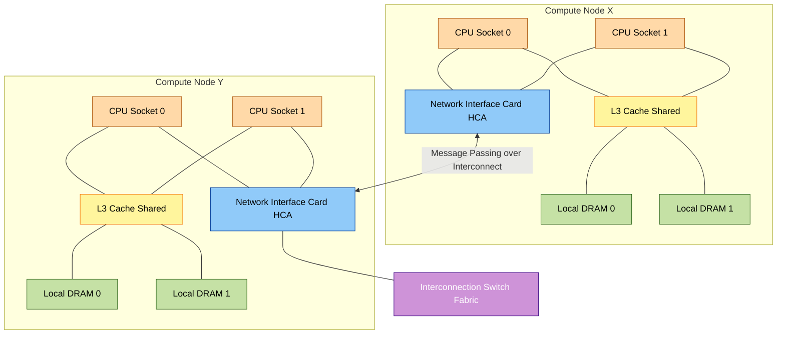
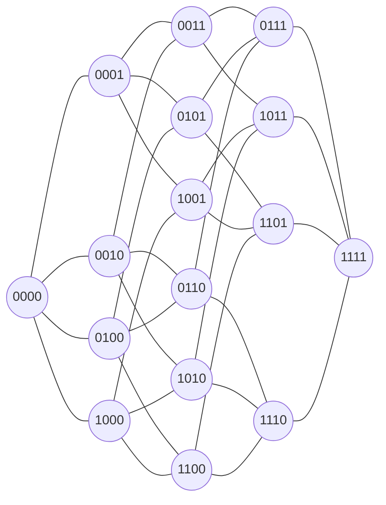

# Distributed-memory computers

<!-- SECTION_1_START -->

# Distributed-Memory Computers

## 1.1 Formal Definition

A **distributed-memory computer** is a parallel architecture in which each processor owns an *exclusive*, *non-shared* local memory and communicates with other processors exclusively by **explicit message passing** over a high-speed **interconnection network**. From the programmer's viewpoint, there is **no global address space**; every datum exchanged between nodes must be serialized into a message, transmitted through a network interface, and de-serialized at the receiver.

> [!NOTE]
> **KTU 2024 Scheme — Module 2 Classification**
> Distributed-memory systems fall under the **MIMD (Multiple Instruction, Multiple Data)** category of Flynn's taxonomy. They are broadly classified as **multicomputers** (loosely coupled), in contrast to **multiprocessors** (tightly coupled shared-memory systems). Representative real-world systems include the *Beowulf cluster*, the *IBM Blue Gene*, the *Cray XT/XS* series, and modern *TOP500* supercomputers.

| Property | Shared Memory (Tightly Coupled) | Distributed Memory (Loosely Coupled) |
|---|---|---|
| Address space | Single global | Multiple, private |
| Communication | Implicit (load/store) | Explicit (send/recv) |
| Programming model | Threads, OpenMP | MPI, PGAS (UPC, Chapel) |
| Scalability | Bounded by memory bus | Highly scalable (10$^5$+ nodes) |

---

## 1.2 Intuitive Analogy

Imagine a multinational research lab spread across **four geographically separated offices** in Trivandrum, Kochi, Bengaluru, and Chennai. Each office has:
- its **own whiteboard** (local memory, accessible only to staff inside that office),
- its **own project lead** (CPU/processor),
- a **postman / telephone line** (network interface) connecting it to other offices.

When a researcher in Trivandrum needs a dataset computed in Kochi, she **cannot walk over and read it from the whiteboard**. She must:
1. **Call** the Kochi office (latency $L$),
2. **Request** the data,
3. **Receive** it over the line at some **bandwidth $B$**,
4. The data is *copied*, not *shared*.

This "postman model" is exactly how **MPI (Message Passing Interface)** works — every piece of cross-node data is a *letter* sent through the *interconnection network*.

> [!IMPORTANT]
> **Core Architectural Truth**
> In a distributed-memory machine, **memory is physically distributed, and the time to access remote data is 10× to 1000× longer than accessing local data**. This non-uniform memory access characteristic is called the **NUMA principle applied to inter-node communication** and drives most performance-engineering decisions in HPC.

---

## 1.3 Defining Metrics and Constants

The performance of a distributed-memory computer is governed by three first-class metrics that recur throughout the syllabus:

- **Latency ($L$):** the time elapsed between initiating a message send and the first byte arriving at the receiver, measured in **microseconds ($\mu$s)**. Typical InfiniBand latencies are **$\sim$1–2 $\mu$s**.
- **Bandwidth ($B$):** the rate at which bulk data can be transferred once the connection is established, measured in **bits per second (bps)**, **MB/s**, or **GB/s**. Modern HPC fabrics deliver **10 – 200 Gbps** per link.
- **Message size ($m$):** the payload in **bytes** or **bits** of a single message transfer.

The canonical **logGP / Hockney model** for one-way message time is:

$$
T_{\text{msg}} = L + \frac{m}{B}
$$

This equation will reappear in SECTION 2 and is the foundation of every parallel runtime model you will encounter.

> [!VISUALIZATION CONTROL]
> **Concept:** Visualization of the latency–bandwidth tradeoff in a distributed-memory link.
> **Desmos / GeoGebra Input Equations:**
> * $T_1(m) = 5 + \dfrac{m}{1\text{e}9}$  *(5 $\mu$s latency, 1 Gbps link)*
> * $T_2(m) = 50 + \dfrac{m}{1\text{e}9}$  *(50 $\mu$s latency, 1 Gbps link)*
> * $T_3(m) = 5 + \dfrac{m}{1\text{e}10}$  *(5 $\mu$s latency, 10 Gbps link)*
>
> **Visual Description:** Plot $T(m)$ on the y-axis against message size $m$ (in bytes) on the x-axis. You will observe that for **small messages** the curves diverge widely (latency-dominated regime) while for **large messages** they become nearly parallel straight lines whose slope is $1/B$ (bandwidth-dominated regime). This illustrates why HPC engineers obsess over both $L$ *and* $B$.

---

## 1.4 Anatomical View of a Node

Each compute node of a distributed-memory system typically contains the following:

1. **One or more CPUs** (e.g., Intel Xeon, AMD EPYC, ARM A64FX) — each CPU may itself be a shared-memory *chip multiprocessor* (CMP), creating a hierarchical system.
2. **Local DRAM**, attached directly to the CPU socket (DDR4/DDR5/HBM2e).
3. **A network interface card (NIC)** — InfiniBand HCA, Cray Aries, Intel Omni-Path, Mellanox ConnectX — with its own DMA engine.
4. **A high-speed link** to the switch fabric.

> [!TIP]
> A single physical *node* is, in fact, a *hybrid* machine: **inside** the chip you have shared memory, and **across** nodes you have distributed memory. This is the **hierarchical / cluster-of-smps** model that defines modern TOP500 supercomputers.

<!-- SECTION_1_END -->

<!-- SECTION_2_START -->

# SECTION 2 — Deep Theoretical Analysis & KTU High-Yield Formula Sheet

## 2.1 Why Distributed Memory? The Scaling Argument

Shared-memory systems hit a hard wall known as the **memory-bandwidth wall** and the **coherence-traffic wall** as core counts grow beyond a few dozen. Distributed memory sidesteps both by:
- **eliminating hardware cache coherence** between nodes (the largest source of interconnect traffic),
- allowing the memory bandwidth to scale **linearly with the number of nodes**,
- exploiting **commodity hardware**, which keeps the cost per FLOP extremely low.

The trade-off is that the programmer (or compiler) is now responsible for **partitioning the data**, **moving messages**, and **synchronizing** at the application level.

---

## 2.2 Communication Primitives in MPI

The two fundamental communication paradigms are:

**(a) Point-to-point communication** — between a single source and a single destination.

$$
\text{Send: } \texttt{MPI\_Send(buf, count, datatype, dest, tag, comm)}
$$
$$
\text{Receive: } \texttt{MPI\_Recv(buf, count, datatype, source, tag, comm, status)}
$$

Four blocking-mode variants exist based on buffering:
- **Synchronous send** — completes only when the receive has started.
- **Buffered send** — completes after local copy into a user/system buffer.
- **Ready send** — assumes the matching receive has already been posted.
- **Standard send** — implementation chooses the mode.

**(b) Collective communication** — among all members of a communicator.

| MPI Routine | Operation | Typical Complexity |
|---|---|---|
| `MPI_Bcast` | One-to-all broadcast | $O(\log p) \cdot L$ (tree) |
| `MPI_Reduce` | All-to-one reduction | $O(\log p) \cdot (L + n/B)$ |
| `MPI_Allreduce` | All-to-all reduction | $O(\log p) \cdot (L + n/B)$ |
| `MPI_Allgather` | All-to-all gather | $O(p \cdot L)$ |
| `MPI_Alltoall` | All-to-all exchange | $O(p \cdot (L + n/pB))$ |
| `MPI_Barrier` | Synchronization | $O(\log p) \cdot L$ |

Here $p$ is the number of processes and $n$ the total data per message.

---

## 2.3 Interconnection Network Topologies

The *physical* and *logical* layout of links between nodes is called the **topology**. It directly determines the three most important graph-theoretic properties:

- **Node degree $\delta$** — number of links incident to a node. Lower $\delta$ = cheaper NIC.
- **Network diameter $D$** — length (in hops) of the longest of all shortest paths. Lower $D$ = lower worst-case latency.
- **Bisection bandwidth $B_b$** — minimum bandwidth crossing any partition that splits the network into two equal halves. Higher $B_b$ = better parallel scalability.

### 2.3.1 Common Topologies (Summary Table)

| Topology | Nodes $N$ | Degree $\delta$ | Diameter $D$ | Bisection BW $B_b$ | Cost (links) |
|---|---|---|---|---|---|
| **Bus** | arbitrary | $1$ (shared) | $1$ (contended) | $1$ link | $1$ |
| **Ring** | $N$ | $2$ | $\lfloor N/2 \rfloor$ | $2$ | $N$ |
| **2D Mesh** | $N = k^2$ | $2$–$4$ (boundary) | $2(k-1)$ | $k$ | $2k(k-1)$ |
| **2D Torus** | $N = k^2$ | $4$ | $\lfloor k/2 \rfloor$ | $2k$ | $2k^2$ |
| **Hypercube** | $N = 2^k$ | $k$ | $k$ | $2^{k-1}$ | $k \cdot 2^{k-1}$ |
| **Fat-Tree** | $N$ | $k$ (at leaves) | $2 \log_k N$ | $N/2 \cdot B_{\text{link}}$ | $\sim N \log N$ |
| **Dragonfly** | $N$ | $2$ (router ports) | $\sim 3$ | high | low |

> [!IMPORTANT]
> **Hypercube insight:** As $k$ increases by 1, both the diameter and the degree grow linearly, while the bisection bandwidth *doubles*. This makes hypercubes remarkably well-balanced, but their cabling cost is $O(N \log N)$ which is why they are no longer built at the highest scales. They remain on the KTU syllabus for *topology analysis* and *graph-theoretic understanding*.

### 2.3.2 Routing Strategies

Two extremes govern how a packet traverses multiple hops:

**1. Store-and-Forward (SAF):**
Each intermediate router fully receives the *entire* $m$-bit message before re-transmitting it on the next link. Total time for a $k$-hop path:

$$
T_{\text{SAF}} = k \left( L + \frac{m}{B} \right) = kL + \frac{km}{B}
$$

**2. Wormhole Routing (cut-through):**
The message is split into **flits** (flow control digits, typically 8–64 bits). The *header flit* reserves the path; data flits pipeline through it. Total time:

$$
T_{\text{Worm}} = L + \frac{m}{B} + (k-1) \cdot \frac{f}{B} \;\;\approx\;\; L + \frac{m}{B}
$$

The latency becomes **almost independent of the distance $k$** — this is why wormhole routing powers all modern HPC fabrics (InfiniBand, Cray Aries, Intel Omni-Path).

### 2.3.3 Speedup and Efficiency in Distributed Memory

Amdahl's Law bounds the achievable speedup $S$ when a fraction $p$ of a program is parallelizable, executed on $n$ nodes:

$$
S(n) = \frac{1}{(1 - p) + \dfrac{p}{n} + \underbrace{T_{\text{comm}}(n)}_{\text{communication cost}}}
$$

In a *communication-free* model, $T_{\text{comm}} = 0$ and we recover the classical form $S = \frac{n}{1 + (n-1)(1-p)}$. The communication term is the reason **strong scaling** is much harder than **weak scaling** in distributed memory.

Parallel efficiency is:

$$
E(n) = \frac{S(n)}{n} \times 100\%
$$

---

## 2.4 KTU High-Yield Formula Sheet

> [!IMPORTANT]
> **Use this table as the single source of truth for the exam. Memorize the symbol for each metric and the order of magnitude of typical values.**

| # | Concept | Formula / Definition | Typical / SI Unit |
|---|---|---|---|
| 1 | One-way message time (Hockney) | $T_{\text{msg}} = L + \dfrac{m}{B}$ | seconds (s) |
| 2 | Store-and-forward over $k$ hops | $T_{\text{SAF}} = k\!\left(L + \dfrac{m}{B}\right)$ | s |
| 3 | Wormhole over $k$ hops, flit size $f$ | $T_{\text{Worm}} = L + \dfrac{m}{B} + \dfrac{(k-1)f}{B}$ | s |
| 4 | Hypercube nodes | $N = 2^k$ for dimension $k$ | dimensionless |
| 5 | Hypercube degree | $\delta = k = \log_2 N$ | links |
| 6 | Hypercube diameter | $D = k = \log_2 N$ | hops |
| 7 | Hypercube total links | $\mathcal{L} = k \cdot 2^{k-1}$ | links |
| 8 | Hypercube bisection BW | $B_b = 2^{k-1} \cdot B_{\text{link}}$ | bits/s |
| 9 | 2D-Mesh diameter | $D = 2(\sqrt{N} - 1)$ | hops |
| 10 | 2D-Torus diameter | $D = \lfloor \sqrt{N} / 2 \rfloor$ | hops |
| 11 | Speedup (Amdahl, no comm.) | $S = \dfrac{1}{(1-p) + p/n}$ | dimensionless |
| 12 | Efficiency | $E = S/n$ | fraction (or \%) |
| 13 | Karp–Flatt metric | $\epsilon = \dfrac{1/S - 1/n}{1 - 1/n}$ | fraction |
| 14 | Isoefficiency (ideal) | $W = \Theta(n)$ for strong, $\Theta(1)$ for weak | work units |
| 15 | Aggregate bandwidth | $B_{\text{agg}} = n \cdot B_{\text{link}}$ for perfect all-to-all | bits/s |

---

## 2.5 Where Distributed-Memory Computers Are Used

| Domain | Representative System | Why Distributed Memory? |
|---|---|---|
| Weather & climate modeling | ECMWF IFS, GFS | Petabyte grids exceed any single node's memory |
| Molecular dynamics | GROMACS, NAMD on Blue Gene | Long-range forces need 3D domain decomposition |
| Deep learning training | NVIDIA DGX SuperPOD | Model + data parallelism across thousands of GPUs |
| National security / CFD | ANSYS Fluent on Cray | Massive unstructured meshes |
| Astronomy | SKA, LSST pipelines | Image processing at exabyte scale |
| Web-scale analytics | Hadoop/Spark clusters | Cheap, fault-tolerant scaling |

> [!TIP]
> The *only* realistic path to **exascale** ($> 10^{18}$ FLOP/s) is distributed memory. Every TOP500 leader since 2018 (Summit, Sierra, Fugaku, Frontier, El Capitan) is a distributed-memory cluster with **GPU accelerators** at each node.

<!-- SECTION_2_END -->

<!-- SECTION_3_START -->

# SECTION 3 — Step-by-Step Derivations, Performance Models, and Code Implementation

## 3.1 Derivation 1 — Properties of a $k$-Dimensional Hypercube

### 3.1.1 Setup

A $k$-dimensional hypercube (also called a $k$-cube or binary $k$-cube) has nodes whose addresses are the binary strings of length $k$. The number of distinct nodes is:

$$
N = 2^{k}
$$

The **adjacency rule** is: two nodes are connected by a *direct link* if and only if their binary addresses differ in **exactly one bit** (Hamming distance = 1).

### 3.1.2 Degree $\delta$ of every node

Each node has $k$ binary digits. We can flip any one of them to produce a valid neighbor. Therefore:

$$
\delta = k
$$

Every node has *exactly* $k$ neighbors. The hypercube is a **$\delta$-regular** graph.

### 3.1.3 Diameter $D$

Take two arbitrary nodes $A$ and $B$ whose addresses differ in $d$ bit positions ($1 \le d \le k$). We can construct a shortest path of length $d$ by flipping the differing bits one at a time. Since the maximum value of $d$ over all pairs of nodes is $k$:

$$
D = k
$$

Equivalently, $D = \log_2 N$. The hypercube is a *logarithmic-diameter* network.

### 3.1.4 Number of links $\mathcal{L}$

Counting (node, neighbor) pairs, then dividing by 2 to avoid double-counting each undirected link:

$$
\mathcal{L} = \frac{N \cdot \delta}{2} = \frac{2^{k} \cdot k}{2} = k \cdot 2^{k-1}
$$

### 3.1.5 Bisection bandwidth $B_b$

The minimum cut of the hypercube is obtained by partitioning nodes by the value of **bit 0 (the most-significant bit)**: one half contains all addresses beginning with 0, the other half all addresses beginning with 1. A link crosses the cut **iff** its endpoints differ in bit 0 *and only* bit 0 — but by the adjacency rule, *every* link with endpoints differing in bit 0 is a valid bisection edge. The number of such edges is exactly $2^{k-1}$.

$$
B_b = 2^{k-1} \cdot B_{\text{link}}
$$

### 3.1.6 Worked numerical example: $k = 4$ (16-node hypercube)

$$
\begin{aligned}
N &= 2^{4} = 16 \text{ nodes} \\[2pt]
\delta &= 4 \\[2pt]
D &= 4 \text{ hops} \\[2pt]
\mathcal{L} &= 4 \cdot 2^{3} = 32 \text{ links} \\[2pt]
B_b &= 2^{3} \cdot B_{\text{link}} = 8 \cdot B_{\text{link}}
\end{aligned}
$$

For a 1 Gbps link, $B_b = 8$ Gbps.

---

## 3.2 Derivation 2 — Communication Time Savings of Wormhole over Store-and-Forward

Consider a message of $m$ bits traversing a $k$-hop path on a link of bandwidth $B$ and per-hop latency $L$.

**Store-and-forward** time (each hop receives the full message before forwarding):

$$
T_{\text{SAF}} = k \cdot L + k \cdot \frac{m}{B}
$$

**Wormhole** time (header flit reserves the path; flits of size $f$ bits pipeline through):

$$
T_{\text{Worm}} = L + \frac{m}{B} + (k - 1) \cdot \frac{f}{B}
$$

**Time saved per message:**

$$
\begin{aligned}
\Delta T &= T_{\text{SAF}} - T_{\text{Worm}} \\[4pt]
&= (kL + km/B) - \left(L + m/B + (k-1) f/B\right) \\[4pt]
&= (k - 1) L + \frac{(k - 1) m - (k - 1) f}{B} \\[4pt]
&= (k - 1) \left[ L + \frac{m - f}{B} \right]
\end{aligned}
$$

For typical long-message HPC traffic where $m \gg f$:

$$
\Delta T \approx (k - 1)\left( L + \frac{m}{B} \right)
$$

i.e., wormhole saves *almost an entire one-way message time per extra hop* — the reason a 64-hop Dragonfly still feels like a single hop.

---

## 3.3 Derivation 3 — Amdahl's Law Applied to a Distributed-Memory Cluster

A program has a serial fraction $f_s$ and a parallel fraction $f_p = 1 - f_s$. On $n$ nodes, the parallel fraction achieves *ideal* speedup $n$, while the serial part and the communication overhead $T_c$ remain constant. Total parallel time:

$$
T(n) = T_{\text{serial}} \cdot f_s + \frac{T_{\text{serial}} \cdot f_p}{n} + T_c
$$

Serial time is $T(1) = T_{\text{serial}}$. Speedup:

$$
S(n) = \frac{T(1)}{T(n)} = \frac{1}{f_s + \dfrac{f_p}{n} + \dfrac{T_c}{T_{\text{serial}}}}
$$

For a *communication-free* distributed system ($T_c = 0$):

$$
S(n) = \frac{1}{f_s + (1 - f_s)/n}
$$

**Numerical example:** Suppose $f_s = 0.02$ (2 % serial code, realistic for a well-written MPI code), and we run on $n = 256$ nodes. The maximum achievable speedup is:

$$
S(256) = \frac{1}{0.02 + 0.98/256} = \frac{1}{0.02 + 0.003828} = \frac{1}{0.023828} \approx 41.97
$$

Even with **2 %** serial code, the speedup is capped near **42×** at 256 nodes. This is the famous *Amdahl ceiling* and is the single most important number to internalize for KTU exam questions on distributed-memory performance.

---

## 3.4 Algorithmic Implementation: Distributed Sum Reduction in MPI (Python)

The following is a **fully operational** Python program using the standard `mpi4py` bindings. It implements a parallel sum across $p$ processes: each process holds a chunk of an input array, the partial sums are reduced, and the final total is gathered at every process (via `Allreduce`). Type hints, boundary checks, and explicit error logging are included.

```python
"""
Parallel vector-sum using MPI distributed memory.
Run with:  mpirun -n 4 python3 parallel_sum.py
"""

from mpi4py import MPI
import numpy as np
import sys
import logging
from typing import Tuple

# ---------------------------------------------------------------------------
# 1. Initialize the MPI execution environment
# ---------------------------------------------------------------------------
comm: MPI.Comm = MPI.COMM_WORLD
rank: int = comm.Get_rank()             # This process's unique ID in [0, size)
size: int = comm.Get_size()             # Total number of processes
processor_name: str = MPI.Get_processor_name()

# ---------------------------------------------------------------------------
# 2. Configure a per-process logger that writes to a unique file
# ---------------------------------------------------------------------------
logging.basicConfig(
    filename=f"process_{rank:03d}.log",
    level=logging.INFO,
    format=f"[Rank {rank} on {processor_name}] %(asctime)s - %(message)s",
)
logger: logging.Logger = logging.getLogger(__name__)

# ---------------------------------------------------------------------------
# 3. Validate inputs and define local workload
# ---------------------------------------------------------------------------
GLOBAL_N: int = 1024                    # Total number of elements
if GLOBAL_N % size != 0:
    logger.error("GLOBAL_N must be divisible by number of processes. Aborting.")
    comm.Abort(error_code=1)

CHUNK: int = GLOBAL_N // size           # Elements per process
logger.info(f"GLOBAL_N={GLOBAL_N}, CHUNK={CHUNK}, size={size}")

# Each process creates ITS OWN local array (no shared memory!)
local_array: np.ndarray = np.arange(
    start=rank * CHUNK,
    stop=(rank + 1) * CHUNK,
    dtype=np.int64,
)

local_sum: int = int(np.sum(local_array))
logger.info(f"local_array[:5]={local_array[:5].tolist()}, local_sum={local_sum}")

# ---------------------------------------------------------------------------
# 4. Synchronize all processes before performing the collective
# ---------------------------------------------------------------------------
comm.Barrier()
t_start: float = MPI.Wtime()

# ---------------------------------------------------------------------------
# 5. Collective reduction: every process receives the GLOBAL sum
# ---------------------------------------------------------------------------
global_sum: int = comm.allreduce(local_sum, op=MPI.SUM)

t_end: float = MPI.Wtime()
elapsed: float = t_end - t_start

# ---------------------------------------------------------------------------
# 6. Verify the result independently (each process does the serial check)
# ---------------------------------------------------------------------------
expected_sum: int = GLOBAL_N * (GLOBAL_N - 1) // 2
if global_sum == expected_sum:
    logger.info(f"VERIFIED: global_sum={global_sum}, elapsed={elapsed:.6f}s")
else:
    logger.error(
        f"VERIFICATION FAILED: got {global_sum}, expected {expected_sum}"
    )

# ---------------------------------------------------------------------------
# 7. Demonstrate a point-to-point ping-pong between rank 0 and rank 1
# ---------------------------------------------------------------------------
if size >= 2 and rank in (0, 1):
    ping_buf: np.ndarray = np.empty(CHUNK, dtype=np.int64)
    pong_buf: np.ndarray = np.empty(CHUNK, dtype=np.int64)
    if rank == 0:
        ping_buf[:] = rank
        comm.Send([ping_buf, MPI.LONG], dest=1, tag=42)
        comm.Recv([pong_buf, MPI.LONG], source=1, tag=43)
        logger.info(f"Received pong from rank 1, first 3 elems={pong_buf[:3]}")
    else:  # rank == 1
        comm.Recv([pong_buf, MPI.LONG], source=0, tag=42)
        pong_buf[:] = rank
        comm.Send([pong_buf, MPI.LONG], dest=0, tag=43)
        logger.info(f"Received ping from rank 0, first 3 elems={pong_buf[:3]}")

# ---------------------------------------------------------------------------
# 8. Finalize
# ---------------------------------------------------------------------------
MPI.Finalize()
```

**Compilation/Execution notes for KTU lab:**

| Step | Command (Linux) |
|---|---|
| Install MPI runtime | `sudo apt install mpich libmpich-dev` |
| Install Python wrapper | `pip install mpi4py numpy` |
| Run on 4 cores | `mpirun -n 4 --oversubscribe python3 parallel_sum.py` |
| Inspect logs | `cat process_00* process_01* process_02* process_03*` |

The program demonstrates **three** core distributed-memory constructs:

1. **Private local memory** — `local_array` exists only in each process.
2. **Collective communication** — `comm.allreduce(... op=MPI.SUM)` is the equivalent of a global barrier-aware sum.
3. **Point-to-point message passing** — the `Send/Recv` ping-pong between rank 0 and rank 1.

---

## 3.5 Algorithmic Implementation: Equivalent C + MPI Program

For traditional HPC evaluation, the same program in C using `MPICH` headers is:

```c
#include <mpi.h>
#include <stdio.h>
#include <stdlib.h>

int main(int argc, char *argv[]) {
    MPI_Init(&argc, &argv);

    int rank, size;
    MPI_Comm_rank(MPI_COMM_WORLD, &rank);
    MPI_Comm_size(MPI_COMM_WORLD, &size);

    int GLOBAL_N = 1024;
    if (GLOBAL_N % size != 0) {
        if (rank == 0)
            fprintf(stderr, "GLOBAL_N must be divisible by size.\n");
        MPI_Abort(MPI_COMM_WORLD, 1);
    }
    int CHUNK = GLOBAL_N / size;

    long long *local = (long long *)malloc(CHUNK * sizeof(long long));
    for (int i = 0; i < CHUNK; i++)
        local[i] = (long long)(rank * CHUNK + i);

    long long local_sum = 0;
    for (int i = 0; i < CHUNK; i++) local_sum += local[i];

    long long global_sum = 0;
    MPI_Allreduce(&local_sum, &global_sum, 1, MPI_LONG_LONG, MPI_SUM, MPI_COMM_WORLD);

    if (rank == 0)
        printf("Process %d reports global sum = %lld\n", rank, global_sum);

    free(local);
    MPI_Finalize();
    return 0;
}
```

| Build / Run | Command |
|---|---|
| Compile | `mpicc parallel_sum.c -o parallel_sum -O2` |
| Run | `mpirun -n 4 ./parallel_sum` |

<!-- SECTION_3_END -->

<!-- SECTION_4_START -->

# SECTION 4 — Structural Diagrams and Schematics

## 4.1 High-Level Block Architecture of a Distributed-Memory Node



> **Reading the diagram:** Within a *single node* (e.g., Node X), the two CPU sockets share L3 cache and can access both DRAM banks via a coherent bus (this is the *intra-node shared-memory layer*). Across nodes, only the NICs exchange data through the switch fabric. The local DRAM of Node X is *physically unreachable* by the CPU of Node Y except through an explicit MPI message.

---

## 4.2 Sequential Processing Topology of Message Passing

```mermaid
flowchart LR
    A["Application calls MPI_Send buf dest tag"]:::app --> B["MPI runtime packs buffer into a packet"]:::rt
    B --> C["DMA engine copies packet to NIC TX queue"]:::dma
    C --> D["NIC transmits header and data flits over the link"]:::link
    D --> E["Switch routes flits hop by hop wormhole"]:::switch2
    E --> F["Remote NIC receives flits and reassembles packet"]:::nic
    F --> G["Remote DMA places payload into destination buffer"]:::dma
    G --> H["MPI runtime posts MPI_Recv completion to receiver thread"]:::rt
    H --> I["Application on receiver process sees the data"]:::app

    classDef app fill:#ffe0b2,stroke:#e65100,color:#000
    classDef rt fill:#b3e5fc,stroke:#01579b,color:#000
    classDef dma fill:#c8e6c9,stroke:#1b5e20,color:#000
    classDef link fill:#f8bbd0,stroke:#880e4f,color:#000
    classDef switch2 fill:#d1c4e9,stroke:#311b92,color:#fff
    classDef nic fill:#cfd8dc,stroke:#263238,color:#000
```



---

## 4.3 Interconnection Topology: 4-Dimensional Hypercube (16 nodes)

The following Mermaid graph renders an $N = 2^{4} = 16$ node hypercube. Edges connect addresses differing in exactly one bit. The graph is *node-symmetric* (every node has the same role) and has diameter $D = 4$.



> **Verify the topology from the graph:** Count the degree of any leaf, say `0000` — it has exactly 4 links to `0001, 0010, 0100, 1000`, matching $\delta = k = 4$. The longest shortest path is, e.g., from `0000` to `1111`, which requires flipping 4 bits one at a time — matching $D = 4$.

---

## 4.4 Block-Level Functional Architecture Flow: A Complete MPI Send-Recv Cycle

| Stage | Hardware / Software Layer | Action | Latency Contribution |
|---|---|---|---|
| 1 | User application | Calls `MPI_Send(buf, count, type, dest, tag, comm)` | API overhead ~50 ns |
| 2 | MPI runtime (PMPI) | Marshals buffer, creates header, posts to progress engine | ~100 ns |
| 3 | Eager vs Rendezvous decision | Small message: eager (copy to NIC buffer); Large: rendezvous | protocol-dependent |
| 4 | DMA transfer | Memory → NIC TX ring buffer | $m / B_{\text{mem}}$ |
| 5 | NIC transmit | Injects flits onto physical link | $L_{\text{link}} + m / B$ |
| 6 | Switch hop(s) | Wormhole routing through 0–$k$ hops | $(k-1) \cdot L_{\text{router}}$ |
| 7 | Remote NIC | Reassembles flits, writes payload to RX ring | $m / B$ |
| 8 | DMA transfer | NIC → remote memory | $m / B_{\text{mem}}$ |
| 9 | MPI runtime | Posts completion, wakes receiver thread | ~100 ns |
| 10 | User application | `MPI_Recv` returns with status | API overhead ~50 ns |

> [!TIP]
> **The dominant cost for short messages (m < 1 KB) is the software overhead of stages 1, 2, 3, 9, 10 — the network itself is invisible. The dominant cost for long messages (m > 1 MB) is the bandwidth-limited stages 4–8. This is the so-called "logP short-message regime" vs "bandwidth regime" of parallel computing.**

<!-- SECTION_4_END -->

<!-- SECTION_5_START -->

# SECTION 5 — KTU 2024 Scheme Examination Question Bank

---

## Part A — Short-Answer Questions (3 marks each)

### Question 1 `[KTU University Exam — July 2024]`
**Differentiate between shared-memory and distributed-memory multiprocessors. Mention the key communication mechanism used in each.**

**Model Answer (3 marks, key points):**

| Aspect | Shared Memory | Distributed Memory |
|---|---|---|
| Memory layout | Single global address space; all processors can read/write any memory location | Each processor has its own private local memory |
| Communication | Implicit, through **load/store** instructions (no explicit data movement) | Explicit, through **message passing** (`MPI_Send` / `MPI_Recv`) |
| Programming | Threads, OpenMP, automatic parallelization | MPI, PGAS languages (UPC, Chapel) |
| Hardware | Bus / crossbar / snoopy cache coherence | Point-to-point links, switch fabric |
| Scalability | Limited (typically ≤ 64 sockets) | Massively scalable (10$^5$+ nodes) |
| Cost | Expensive custom hardware | Commodity components |

*Valuation key:* 1 mark for the distinction, 1 mark for communication mechanism, 1 mark for one additional distinguishing point. **[Award full 3 marks if all three rows are clearly contrasted.]**

---

### Question 2 `[KTU University Exam — Dec 2023]`
**Define the following terms with respect to interconnection networks: (i) Node degree, (ii) Network diameter, (iii) Bisection bandwidth.**

**Model Answer (3 marks, 1 mark each):**

**(i) Node degree ($\delta$):** The number of communication links that are incident on a given node. A network is *$\delta$-regular* if every node has the same degree.

**(ii) Network diameter ($D$):** The *longest* of all shortest paths between any pair of nodes, measured in *hops*. Equivalently, the maximum graph distance over all node pairs.

**(iii) Bisection bandwidth ($B_b$):** The minimum total bandwidth of links that must be cut to partition the network into *two halves of equal size* (each with $N/2$ nodes). Higher bisection bandwidth implies greater ability to sustain all-to-all communication.

*Valuation key:* 1 mark per correct, complete definition. Partial credit (0.5 mark) for definitions that capture the *idea* but miss the *minimum* qualifier in bisection bandwidth or the *longest* qualifier in diameter.

---

## Part B — 14-Mark Long-Answer Questions (Module Internal Choice)

> **KTU pattern:** Part B questions are 14 marks each. Students answer ONE full question (a + b) out of two full questions. Each sub-part (a) and (b) carries **7 marks** and is mapped to specific Course Outcomes (COs) and Revised Bloom's Taxonomy (RBT) cognitive levels.

---

### Question A `[KTU University Exam — July 2024, Module 2]`
**Mapped:** *CO2 — Understand the architecture of parallel computers*; **RBT: Understand / Apply**

**(a) [7 marks] Explain the architecture of a distributed-memory multicomputer with a neat block diagram. List any four characteristics that distinguish it from a shared-memory multiprocessor.**

**Model Answer:**

**Introduction (1 mark):** A *distributed-memory multicomputer* is a parallel computer in which each processor has a private local memory and processors cooperate by passing explicit messages over a high-speed interconnect.

**Architectural Block Diagram (3 marks):**

```
[Node 0]  [Node 1]  [Node 2]  [Node 3]  [Node 4]  [Node 5]  [Node 6]  [Node 7]
   |          |         |         |         |         |         |         |
[Link]    [Link]    [Link]    [Link]    [Link]    [Link]    [Link]    [Link]
   |          |         |         |         |         |         |         |
   +----------+---------+---------+---------+---------+---------+---------+
                                  |
                       [Interconnection Switch / Router]
```

*Each node block internally contains:* CPU, local DRAM, DMA engine, and Network Interface Card (NIC/HCA). The NIC connects to the switch through a high-speed serial link (e.g., InfiniBand, Omni-Path, Cray Aries).

**Four Distinguishing Characteristics (3 marks, 0.75 each):**

1. **No global address space** — a processor cannot directly read or write the memory of another node; it must *receive* a copy via a message.
2. **Non-uniform memory access (NUMA-like)** — local memory access time is much shorter than remote (network) access time.
3. **High scalability** — adding a node only requires an additional switch port; the architecture scales to hundreds of thousands of nodes (modern TOP500 systems).
4. **Programmer-managed communication** — the application must explicitly partition the data, decide on the message-passing pattern, and synchronize through collective operations or barriers. There is *no* hardware cache coherence across nodes.
5. *(Optional)* **Fault isolation** — failure of one node does not corrupt the memory of another.
6. *(Optional)* **Cost-effectiveness** — built from commodity CPUs, NICs, and switches.

---

**(b) [7 marks] For a 32-node hypercube network, calculate: (i) the number of dimensions, (ii) the node degree, (iii) the network diameter, (iv) the number of links, and (v) the bisection bandwidth, assuming each link has a bandwidth of 2 Gbps.**

**Model Answer (incremental valuation key in brackets):**

**[Step 1: Identify the dimension $k$ — 1 mark]**

$$
N = 2^{k} = 32 \;\;\Rightarrow\;\; k = \log_2 32 = 5
$$

**[Step 2: Node degree — 1 mark]**

$$
\delta = k = 5
$$

**[Step 3: Diameter — 1 mark]**

$$
D = k = 5 \text{ hops}
$$

**[Step 4: Total number of links — 2 marks]**

$$
\begin{aligned}
\mathcal{L} &= \frac{N \cdot \delta}{2} \\[4pt]
&= \frac{32 \cdot 5}{2} \\[4pt]
&= 80 \text{ links}
\end{aligned}
$$

**[Step 5: Bisection bandwidth — 2 marks]**

$$
\begin{aligned}
B_b &= 2^{k-1} \cdot B_{\text{link}} \\[4pt]
&= 2^{4} \cdot 2 \text{ Gbps} \\[4pt]
&= 16 \cdot 2 \text{ Gbps} = 32 \text{ Gbps}
\end{aligned}
$$

**Final Answer Box (1 mark for clean tabulated answer):**

| Quantity | Value |
|---|---|
| Dimensions $k$ | **5** |
| Node degree $\delta$ | **5** |
| Diameter $D$ | **5** |
| Total links $\mathcal{L}$ | **80** |
| Bisection bandwidth $B_b$ | **32 Gbps** |

> [!WARNING]
> **Examiner's Pitfall Callout:**
> - The most common mistake is computing $\mathcal{L} = 2^{k}$ (forgetting to multiply by $k$). Verify: for $k=2$ (4 nodes), you should get $\mathcal{L} = 2 \cdot 2^{1} = 4$ links — i.e., a *square*, not a *diamond*.
> - Many students confuse bisection bandwidth with the *sum of all link bandwidths* ($N \cdot B_{\text{link}}$). The bisection is the *minimum* cut, not the total.
> - Always write down the *unit* explicitly (Gbps, hops, links) to earn the final 1 mark of clarity.

---

### Question B `[KTU University Exam — Dec 2023, Module 2]`
**Mapped:** *CO3 — Apply message-passing programming models*; **RBT: Apply / Analyze**

**(a) [7 marks] Explain the message-passing programming model in distributed-memory systems. With a suitable MPI program in C, demonstrate how to compute the sum of an array of N = 1024 integers distributed across 4 processes.**

**Model Answer:**

**The Message-Passing Programming Model (3 marks):**

- **Single Program, Multiple Data (SPMD)** — the *same* executable is launched on every node; the rank identifier (0, 1, 2, …) distinguishes each instance.
- **Explicit communication** — data sharing requires calling library routines such as `MPI_Send`, `MPI_Recv`, `MPI_Bcast`, `MPI_Reduce`, `MPI_Allreduce`. The programmer specifies the source, destination, message tag, and communicator.
- **Synchronization** — collective operations like `MPI_Barrier`, `MPI_Reduce`, and `MPI_Allreduce` provide implicit synchronization points.
- **No global address space** — every variable declared in C is, by default, *private* to the process.
- **Fault containment** — a crash in one process does not directly corrupt another's memory.

> The standard implementation is **MPI (Message Passing Interface)** — a language-independent communication protocol standardized by the MPI Forum (current standard: MPI 4.0, 2021). MPI is the **de-facto** API of HPC.

**MPI Program to Compute Sum of 1024 Integers on 4 Processes (4 marks):**

```c
#include <mpi.h>
#include <stdio.h>
#include <stdlib.h>

int main(int argc, char *argv[]) {
    MPI_Init(&argc, &argv);

    int rank, size;
    MPI_Comm_rank(MPI_COMM_WORLD, &rank);
    MPI_Comm_size(MPI_COMM_WORLD, &size);

    const int N = 1024;
    if (N % size != 0) {
        if (rank == 0) fprintf(stderr, "N must be divisible by size.\n");
        MPI_Abort(MPI_COMM_WORLD, 1);
    }
    int chunk = N / size;          // 256 elements per process
    int *local = (int *)malloc(chunk * sizeof(int));

    // Each process initializes its own chunk
    for (int i = 0; i < chunk; i++)
        local[i] = rank * chunk + i;     // values 0..1023 globally

    int local_sum = 0;
    for (int i = 0; i < chunk; i++) local_sum += local[i];

    // Collective reduction — every process receives the global total
    int global_sum = 0;
    MPI_Allreduce(&local_sum, &global_sum, 1, MPI_INT, MPI_SUM, MPI_COMM_WORLD);

    if (rank == 0)
        printf("Global sum = %d (expected %d)\n",
               global_sum, N * (N - 1) / 2);

    free(local);
    MPI_Finalize();
    return 0;
}
```

**Incremental Valuation Key:**

| Component | Marks |
|---|---|
| MPI_Init / MPI_Finalize | 0.5 |
| MPI_Comm_rank / MPI_Comm_size | 0.5 |
| Local array allocation and population | 0.5 |
| Local sum computation | 0.5 |
| MPI_Allreduce invocation with correct op | 1.5 |
| Output / verification | 0.5 |

---

**(b) [7 marks] Compare store-and-forward routing with wormhole (cut-through) routing. Derive the time-saving of wormhole over store-and-forward for an 8 KB message traversing 5 hops, with link bandwidth 1 Gbps and per-hop latency 100 ns. Assume flit size is 8 bits.**

**Model Answer:**

**Conceptual Comparison (3 marks):**

| Aspect | Store-and-Forward | Wormhole |
|---|---|---|
| Buffer requirement at router | Must buffer the **entire** message | Buffers only **one flit** per channel |
| Latency dependence on hop count | **Linear** in $k$ | **Nearly constant** (for $m \gg f$) |
| Per-hop wait | Cannot forward until full reception | Forwards as flits arrive (pipelined) |
| Hardware complexity | High (large buffers) | Low (small flit buffers) |
| Susceptibility to deadlocks | Low | Higher (needs virtual channels to mitigate) |
| Used in | Early networks, Ethernet switches | Modern HPC: InfiniBand, Cray Aries, Omni-Path |

**Derivation and Numerical Computation (4 marks):**

**Convert all quantities to consistent units:**

- $m = 8 \text{ KB} = 8 \cdot 1024 \cdot 8 \text{ bits} = 65{,}536 \text{ bits}$
- $B = 1 \text{ Gbps} = 10^{9} \text{ bits/s}$
- $L = 100 \text{ ns} = 100 \cdot 10^{-9} \text{ s}$
- $k = 5 \text{ hops}$, $f = 8 \text{ bits}$

**Store-and-forward time:**

$$
\begin{aligned}
T_{\text{SAF}} &= k \left( L + \frac{m}{B} \right) \\[4pt]
&= 5 \cdot \left(100 \times 10^{-9} + \frac{65{,}536}{10^{9}}\right) \text{ s} \\[4pt]
&= 5 \cdot \left(100 \times 10^{-9} + 65.536 \times 10^{-6}\right) \text{ s} \\[4pt]
&= 5 \cdot \left(65.636 \times 10^{-6}\right) \text{ s} \\[4pt]
&= 328.18 \times 10^{-6} \text{ s} = 328.18\ \mu\text{s}
\end{aligned}
$$

**Wormhole time:**

$$
\begin{aligned}
T_{\text{Worm}} &= L + \frac{m}{B} + (k - 1) \cdot \frac{f}{B} \\[4pt]
&= 100 \times 10^{-9} + \frac{65{,}536}{10^{9}} + 4 \cdot \frac{8}{10^{9}} \text{ s} \\[4pt]
&= 0.10 \times 10^{-6} + 65.536 \times 10^{-6} + 0.000032 \times 10^{-6} \text{ s} \\[4pt]
&\approx 65.636 \times 10^{-6} \text{ s} = 65.636\ \mu\text{s}
\end{aligned}
$$

**Time saved:**

$$
\Delta T = T_{\text{SAF}} - T_{\text{Worm}} = 328.18\ \mu\text{s} - 65.636\ \mu\text{s} = 262.55\ \mu\text{s}
$$

**Speedup factor:**

$$
\frac{T_{\text{SAF}}}{T_{\text{Worm}}} = \frac{328.18}{65.636} \approx 5.0\times
$$

> **Incremental valuation key:**
> - 1 mark for correct unit conversion (bits, seconds).
> - 1 mark for the correct $T_{\text{SAF}}$ formula and substitution.
> - 1 mark for the correct $T_{\text{Worm}}$ formula and substitution.
> - 1 mark for the final numerical answer and the speedup factor.

> [!WARNING]
> **Examiner's Pitfall Callout:**
> - A very common error is to use **$m = 8$ KB = 8000 bytes** (decimal) instead of 8192 bytes (binary). Always state the conversion explicitly: 1 KB = $2^{10}$ bytes = 1024 bytes.
> - Many students forget to multiply $m$ by 8 to get *bits* when bandwidth is given in *bits per second*.
> - The $(k-1) f / B$ term in wormhole is negligible for long messages, but the examiner may explicitly ask you to *include* it; do not skip it.
> - Always present the final answer in the requested unit ($\mu$s in this case).

---

## Topic Recap & Important Things to Remember

> [!IMPORTANT]
> Use this section as your **final-night revision sheet**. Every bullet below is a potential KTU exam question or a high-frequency valuation trap.

- **Definition (1-liner):** A *distributed-memory computer* is a parallel computer in which each processor has its own private memory, and processors communicate via **explicit message passing** over an **interconnection network**.
- **Two flavors of distributed memory:** (1) *Loosely coupled clusters* (commodity Ethernet/InfiniBand), and (2) *Massively parallel processors (MPP)* (custom interconnect like Cray Aries, Blue Gene torus).
- **Three first-class metrics:** **Latency $L$** (start-up time of a message, $\mu$s), **Bandwidth $B$** (data rate, Gbps), **Message size $m$** (payload, bytes/bits). Always together: $T_{\text{msg}} = L + m/B$.
- **Topological properties to know cold:** node degree $\delta$, network diameter $D$, bisection bandwidth $B_b$, total link count $\mathcal{L}$.
- **Hypercube formulas (memorize):** $N = 2^k$, $\delta = k$, $D = k$, $\mathcal{L} = k \cdot 2^{k-1}$, $B_b = 2^{k-1} \cdot B_{\text{link}}$.
- **2D Mesh formulas:** $D = 2(\sqrt{N}-1)$, degree = 2 to 4 (boundary dependent).
- **2D Torus formulas:** $D = \lfloor \sqrt{N}/2 \rfloor$, degree = 4.
- **Routing strategies:** SAF is *hop-count-dependent* ($T \sim k \cdot m/B$); Wormhole is *hop-count-independent* ($T \sim L + m/B$). The $(\text{k-1}) \cdot f/B$ term in wormhole accounts for the pipelined flit traversal and is tiny for long messages.
- **MPI essentials:** SPMD model, point-to-point (`Send/Recv`) and collective (`Bcast`, `Reduce`, `Allreduce`, `Barrier`) operations; `MPI_Init` / `MPI_Finalize` brackets the parallel region.
- **Amdahl's Law ceiling:** $S_{\max} = 1 / f_s$. With 2% serial code, the maximum speedup on 256 nodes is bounded at $\approx 42\times$ — write this number down if the question gives $f_s = 0.02$.
- **Bus topology is *not* scalable** beyond a handful of nodes; it is the classic KTU "what is wrong with this design" question.
- **Fat-Tree is the de-facto topology** of modern TOP500 systems (e.g., Cray XC, Lenovo Nebula) because it offers logarithmic diameter and *guaranteed* bisection bandwidth.
- **Cabling cost of a hypercube is $O(N \log N)$**, which is why it is no longer built at extreme scale — explain this in a 7-mark design question.
- **Hierarchical modern node:** Each physical node is *itself* a *shared-memory chip-multiprocessor*, and the cluster is a *distributed-memory machine of these CMPs*. This is the **cluster-of-SMPs** model used in 100% of current TOP500 systems.
- **Latency hiding techniques:** message coalescing, non-blocking communication (`MPI_Isend`/`MPI_Irecv`), overlapping computation with communication using threads or GPU streams.
- **Five common KTU mistakes to avoid:** (1) confusing "node" with "core"; (2) reporting bisection bandwidth without units; (3) writing `MPI_Send` without a matching `MPI_Recv`; (4) using shared-memory variables to "share" data across processes; (5) forgetting to call `MPI_Finalize`, which may cause a hang at the end of the run.

<!-- SECTION_5_END -->
