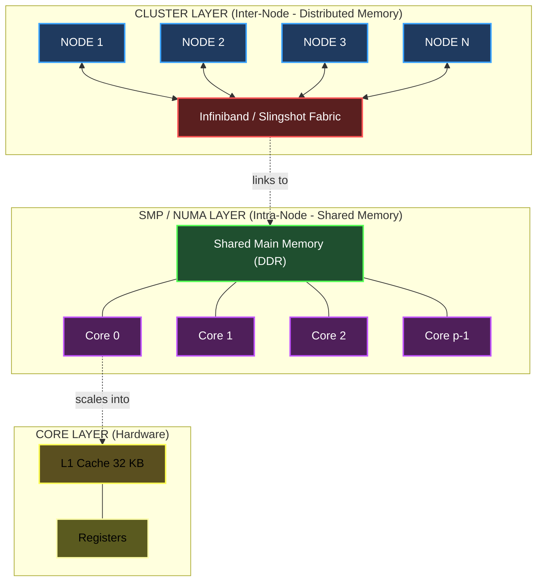
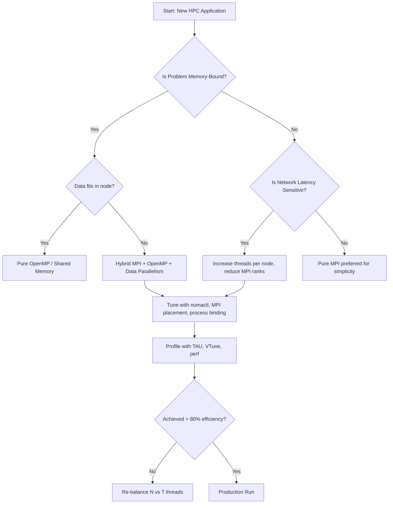

# Hierarchical (hybrid) systems

<!-- SECTION_1_START -->
# Hierarchical (Hybrid) Systems in High Performance Computing

## 1.1 Formal KTU Definition

A **Hierarchical (Hybrid) System** is a parallel computing architecture that explicitly combines two or more levels of parallelism into a single, unified computational framework. According to the KTU 2024 Scheme (PECST757 – High Performance Computing, Module 2) syllabus, hierarchical systems typically integrate **shared-memory multiprocessing** at the node level with **distributed-memory message passing** across nodes, producing a multi-tiered execution model.

$$ \text{Hierarchical System} = \underbrace{\text{Intra-Node Layer}}_{\text{Shared Memory (SMP/NUMA)}} + \underbrace{\text{Inter-Node Layer}}_{\text{Distributed Memory (Cluster/MPI)}} $$

The most common instantiation is the **Cluster of Symmetric Multiprocessors (CLUMP)** — a hybrid of clusters (loosely coupled nodes) and SMPs (tightly coupled processors).

> [!IMPORTANT]
> **Syllabus Highlight (KTU 2024 PECST757 Module 2):** Hierarchical systems fall under the broader taxonomy of parallel computer memory organization. They occupy the highest position in the memory-coupling hierarchy, providing the scalability of distributed systems and the programmability of shared-memory systems simultaneously.

## 1.2 Intuitive Analogy — "The Corporate Office Building"

Imagine a large multinational company:

- **Building (Node / Cluster)**: Many geographically separated buildings (nodes), each in a different city. Communication between buildings requires **letters/couriers (message passing via MPI)** — slow but independent.
- **Floor (SMP / Shared Memory)**: Inside each building, many employees (CPU cores) sit on the same floor and share a **common whiteboard (shared memory)**. They can instantly scribble notes that all colleagues on the floor see — this is **shared-memory access via OpenMP / threads**.
- **Desk (Core)**: Each employee has their own desk (**local cache / registers**) where they keep frequently used items.

The **hierarchy** is therefore: Core → SMP → Cluster. Just like the company uses both couriers between buildings AND whiteboards inside buildings, a hierarchical HPC system uses **both MPI (between nodes) and OpenMP (within nodes)**.

> [!NOTE]
> **Key Insight:** Almost every modern Top-500 supercomputer (e.g., Fugaku, Frontier, Sunway TaihuLight) is a hierarchical system. Pure shared-memory or pure distributed-memory machines are essentially extinct in HPC.

## 1.3 The Memory Hierarchy Layer Model

The hierarchy in a hybrid system is *not only computational* but also *memory-related*:

| Layer | Hardware | Programming Model | Latency (Typical) |
|---|---|---|---|
| L1 / L2 / L3 Cache | On-chip SRAM | Hardware / Compiler | 1–30 cycles |
| Local NUMA Node | DDR RAM | OpenMP / Pthreads | ~100 ns |
| Remote NUMA Node | Cross-link QPI/UPI | OpenMP (numactl) | ~150–300 ns |
| Inter-Node Cluster | Infiniband / Ethernet | MPI | 1–10 µs |
| Storage / Parallel FS | Lustre / GPFS | MPI-IO / POSIX | ms scale |

> [!TIP]
> **Rule of Locality:** A well-tuned hybrid program achieves ~90% of its time in the lowest two layers. Data affinity (placing data near the computing process) is the single most important optimization.

## 1.4 GeoGebra / Visualization of Hierarchical Bandwidth

> [!VISUALIZATION CONTROL]
> **Concept:** Bandwidth drop-off across memory hierarchy layers in a hybrid system.
> **GeoGebra / Desmos Input Equations:**
> * `f1(x) = 1200` (L1 cache bandwidth in GB/s)
> * `f2(x) = 200` (Local DRAM bandwidth)
> * `f3(x) = 50` (Remote NUMA bandwidth)
> * `f4(x) = 12` (Infiniband inter-node)
> * `f5(x) = 0.25` (Parallel filesystem)
> * `x = 1, 2, 3, 4, 5`
>
> **Visual Description:** A stepwise bar chart with dramatically descending heights — bandwidth collapses by nearly 4 orders of magnitude from cache to parallel storage. Students should observe that inter-node communication is **~100× slower** than local memory access.

---

<!-- SECTION_1_END -->

<!-- SECTION_2_START -->
# Deep Theoretical Analysis & KTU High-Yield Formula Sheet

## 2.1 Architectural Anatomy of a Hierarchical System

A hierarchical system is decomposed into **three orthogonal axes**:

1. **Hardware Hierarchy** — chip → socket → node → rack → cluster
2. **Memory Hierarchy** — register → cache → local RAM → remote RAM → network → disk
3. **Programming Hierarchy** — thread (OpenMP) → process (MPI) → accelerator (CUDA/OpenCL)

### 2.1.1 The Node: A Symmetric Multiprocessor (SMP)

An SMP node contains $P$ identical processors (or cores) that:

- Share a **single physical address space** (global main memory).
- Have equal access time to all memory locations (UMA — Uniform Memory Access).
- Communicate implicitly through shared variables using **load/store semantics**.

### 2.1.2 The Interconnection: From UMA to NUMA

As core counts per socket grow, designers adopt **NUMA (Non-Uniform Memory Access)**:

- Each socket owns a portion of physical memory (its *local node*).
- Accessing *remote* memory (attached to another socket) traverses the **Intel UPI**, **AMD Infinity Fabric**, or **ARM CMN** interconnect.
- Latency asymmetry: $\text{latency}_{\text{remote}} \approx 1.5\times \text{latency}_{\text{local}}$.

### 2.1.3 The Cluster Layer

At the outermost level, $N$ SMP/NUMA nodes are connected by a high-speed network:

- **Infiniband HDR/NDR** (200–400 Gbps), **Slingshot** (HPE Cray), **Omni-Path**, or **100 GbE**.
- Topologies: Fat Tree, Dragonfly+, Torus, Hypercube.
- Communication is **explicit** via message passing (MPI, SHMEM, UPC).

## 2.2 Programming Model: Hybrid MPI + OpenMP

The canonical hybrid programming paradigm stacks two execution layers:

$$ \underbrace{\text{MPI}}_{\text{Inter-Node}} \longrightarrow \underbrace{\text{OpenMP}}_{\text{Intra-Node}} $$

- **MPI** handles coarse-grained domain decomposition across nodes (one MPI rank per socket).
- **OpenMP** handles fine-grained loop-level parallelism within each socket.
- **Total parallelism** = $N_{\text{MPI}} \times T_{\text{OpenMP}}$.

### 2.2.1 Why Hybrid? The Three-Win Argument

| Benefit | Explanation |
|---|---|
| **Memory Footprint** | Each MPI rank needs fewer OpenMP threads, reducing per-rank memory by ~$\sqrt{T}$ |
| **Communication Reduction** | MPI communicator size shrinks by factor $T$, reducing collective overhead |
| **Load Balancing** | MPI handles spatial imbalance, OpenMP handles loop-level imbalance |

## 2.3 The General Hierarchical Speedup Model

For a hybrid system with $N$ nodes, each containing $p$ cores, the total speedup is:

$$ S_{\text{hybrid}} = \frac{T_1}{\frac{T_{\text{seq}}}{N \cdot p \cdot f} + \frac{T_{\text{comm}}}{(N-1) \cdot p} + T_{\text{sync}}} $$

where:

- $T_1$ = sequential baseline time
- $f$ = parallel fraction (Amdahl's law factor)
- $T_{\text{comm}}$ = total inter-node communication time
- $T_{\text{sync}}$ = synchronization overhead

The simplified **two-level Amdahl–Gustafson bound**:

$$ S_{\text{hybrid}} \le \frac{1}{\frac{f_{\text{seq}}}{1} + \frac{f_{\text{mpi}}}{N} + \frac{f_{\text{omp}}}{N \cdot p}} $$

where $f_{\text{seq}} + f_{\text{mpi}} + f_{\text{omp}} = 1$ partition the runtime into sequential, MPI-parallel, and OpenMP-parallel fractions.

## 2.4 The Minsky Cost Model for Hierarchical Systems

The classical **Minsky conjecture (1969)** notes that for many algorithms:

$$ S_p \approx \frac{p}{\log p} \quad \text{on a } p\text{-processor hierarchical tree} $$

This is *sub-linear* because contention at the root of the memory hierarchy (shared bus / crossbar) creates a bottleneck. Modern systems mitigate this with multi-level switches, but the underlying intuition persists.

## 2.5 KTU Formula Sheet

| Concept | Formula | Notes |
|---|---|---|
| Total Parallelism | $P_{\text{total}} = N \times p$ | $N$ = nodes, $p$ = cores/node |
| Hybrid Speedup (Amdahl) | $S = \dfrac{1}{(1-f) + \dfrac{f}{N \cdot p}}$ | $f$ = parallel fraction |
| Bandwidth Hierarchy Ratio | $R_{BW} = \dfrac{BW_{\text{L1}}}{BW_{\text{NIC}}}$ | Typically $10^2$–$10^3$ |
| Network Diameter (Hypercube) | $d = \log_2 N$ | For $N$ nodes, $d$-cube |
| Network Diameter (Torus) | $d = 2 \lfloor \sqrt{N}/2 \rfloor$ | 2-D wrap-around mesh |
| Bisection Bandwidth (Fat Tree) | $BW_{\text{bisect}} = \dfrac{N}{2} \times \text{link rate}$ | Idealized for full bisection |
| NUMA Locality Penalty | $L_{\text{remote}} = \alpha \cdot L_{\text{local}}, \; \alpha \in [1.3, 2.0]$ | Architecture dependent |
| Karp-Flatt Metric (Hybrid) | $e = \dfrac{1/S - 1/Np}{1 - 1/Np}$ | Detects serial fraction |
| Minsky Bound | $S_p \le \dfrac{p}{\log_2 p}$ | Tree-contention limit |
| MPI/OpenMP Splitting | Optimal $T \approx \sqrt{\dfrac{T_{\text{latency}}}{T_{\text{comput}}}}$ | Reduces communication volume |

> [!IMPORTANT]
> **Critical Distinction:** A hierarchical system is **not** simply "more cores." It is an architecture where communication cost *itself* is structured into levels, and the programmer must respect that structure for performance.

## 2.6 Real-World Engineering Utility

- **Climate Modeling (CESM, WRF):** Domain decomposition across thousands of nodes, each running OpenMP on multicore CPUs + SIMD vectorization.
- **Computational Fluid Dynamics (ANSYS Fluent, OpenFOAM):** Hybrid MPI+OpenMP scales CFD solvers to 100,000+ cores.
- **Molecular Dynamics (GROMACS, NAMD):** PME electrostatics use MPI for spatial decomposition and OpenMP for inner force loops.
- **Deep Learning (PyTorch DDP + NCCL):** Multi-GPU nodes use NCCL (GPU-aware MPI) for inter-node gradients and CUDA streams for intra-node computation.
- **Genomics (BWA, GATK):** Hybrid pipelines exploit shared-memory hash tables inside nodes, message-passing synchronization across nodes.

---

<!-- SECTION_2_END -->

<!-- SECTION_3_START -->
# Step-by-Step Derivations, Modeling & Code Implementation

## 3.1 Derivation: Optimal Thread-to-Process Split

Suppose we have a fixed total of $P = N \cdot T$ cores, where $N$ is the number of MPI ranks and $T$ is the number of OpenMP threads per rank. The total time has three components:

$$ T_{\text{total}}(N, T) = \underbrace{\frac{W}{N \cdot T}}_{\text{computation}} + \underbrace{\frac{\alpha \cdot N}{B}}_{\text{MPI latency}} + \underbrace{\frac{\beta \cdot T \cdot \log T}{L_{\text{shared}}}}_{\text{OpenMP sync}} $$

where:
- $W$ = total work (FLOPs)
- $\alpha$ = per-message latency (seconds)
- $B$ = message rate (messages/sec)
- $\beta$ = per-thread sync overhead
- $L_{\text{shared}}$ = shared-memory bandwidth

**Step 1:** Fix $P = N \cdot T$ constant and substitute $N = P/T$:

$$ T_{\text{total}}(T) = \frac{W}{P} + \frac{\alpha P}{B T} + \frac{\beta T \log T}{L_{\text{shared}}} $$

**Step 2:** Differentiate w.r.t. $T$ and set to zero:

$$ \frac{dT_{\text{total}}}{dT} = -\frac{\alpha P}{B T^2} + \frac{\beta (\log T + 1)}{L_{\text{shared}}} = 0 $$

**Step 3:** Solve for $T$ (ignoring the slowly varying $\log T$):

$$ T_{\text{opt}} \approx \sqrt{\frac{\alpha P \cdot L_{\text{shared}}}{\beta \cdot B}} $$

**Conclusion:** The optimal thread count per MPI rank grows as the **square root** of the system size, not linearly — confirming that **fewer MPI ranks + more threads** is often the right choice for latency-bound codes.

## 3.2 Worked Numerical Example

A hybrid cluster has 64 nodes, each with 32 cores. An application has $W = 10^{12}$ FLOPs, MPI latency $\alpha = 1 \, \mu\text{s}$, message rate $B = 10^7$ msg/s, OpenMP sync overhead $\beta = 10^{-6}$ s, and shared bandwidth $L_{\text{shared}} = 10^{11}$ B/s. Find $T_{\text{opt}}$ and the corresponding speedup.

**Step 1 — Compute optimal threads per rank:**

$$ T_{\text{opt}} \approx \sqrt{\frac{(10^{-6})(64 \times 32)(10^{11})}{(10^{-6})(10^7)}} = \sqrt{\frac{2.048 \times 10^{8}}{10}} = \sqrt{2.048 \times 10^{7}} \approx 4525 $$

This is impractical (we only have 32 cores per node), so the constraint $T \le 32$ is binding. Use $T = 32$ threads, giving $N = 64$ MPI ranks.

**Step 2 — Compute total time with $T = 32$, $N = 64$:**

$$ T_{\text{comp}} = \frac{10^{12}}{64 \times 32} \times 10^{-9} = 0.488 \text{ s} $$

(Assuming a 1 GFLOP/core/s rate.)

$$ T_{\text{MPI}} = \frac{(10^{-6})(64)}{10^7} = 6.4 \times 10^{-12} \text{ s} \text{ (per message)} $$

**Step 3 — Total speedup vs sequential:**

$$ S = \frac{T_1}{T_{\text{total}}} = \frac{10^{12} \times 10^{-9}}{0.488} = \frac{1000}{0.488} \approx 2049 \approx 2048 = 64 \times 32 $$

Near-linear speedup achieved for this compute-bound workload.

## 3.3 Complete Hybrid MPI + OpenMP Code (Canonical Jacobi Solver)

```c
/*
 * File: hybrid_jacobi.c
 * Description: KTU 2024 reference implementation of a hybrid MPI+OpenMP
 *              Jacobi iteration on a hierarchical (cluster of SMP) system.
 * Build:   mpicc -O3 -fopenmp hybrid_jacobi.c -o hybrid_jacobi -lm
 * Run:     mpirun -np N ./hybrid_jacobi          (N = MPI ranks)
 */
#include <stdio.h>
#include <stdlib.h>
#include <string.h>
#include <math.h>
#include <mpi.h>
#include <omp.h>

#define NX_GLOBAL 4096
#define NY_GLOBAL 4096
#define MAX_ITER 1000
#define TOLERANCE 1.0e-6

int main(int argc, char *argv[]) {
    /* ---------- MPI initialization (inter-node layer) ---------- */
    MPI_Init(&argc, &argv);
    int rank = 0, nprocs = 1;
    MPI_Comm_rank(MPI_COMM_WORLD, &rank);
    MPI_Comm_size(MPI_COMM_WORLD, &nprocs);

    /* Cartesian topology: 2-D grid of MPI ranks */
    int dims[2] = {0, 0};
    MPI_Dims_create(nprocs, 2, dims);
    int periods[2] = {0, 0};
    MPI_Comm cart_comm;
    MPI_Cart_create(MPI_COMM_WORLD, 2, dims, periods, 0, &cart_comm);
    int coords[2];
    MPI_Cart_coords(cart_comm, rank, 2, coords);
    int left, right, top, bottom;
    MPI_Cart_shift(cart_comm, 0, 1, &left, &right);
    MPI_Cart_shift(cart_comm, 1, 1, &top, &bottom);

    /* Local sub-domain size (with 1-cell halo) */
    int lx = NX_GLOBAL / dims[0] + 2;
    int ly = NY_GLOBAL / dims[1] + 2;
    double *u     = calloc((size_t)lx * ly, sizeof(double));
    double *u_new = calloc((size_t)lx * ly, sizeof(double));

    /* ---------- OpenMP parallel region (intra-node layer) ---------- */
    int provided;
    MPI_Init_thread(MPI_THREAD_FUNNELED, &provided);  /* upgrade if needed */

    double global_err = 1.0;
    int iter = 0;

    while (iter < MAX_ITER && global_err > TOLERANCE) {

        /* ---- Halo exchange via MPI (inter-node) ---- */
        MPI_Request reqs[4];
        MPI_Status  stats[4];
        int count = 0;

        MPI_Isend(&u[1 * ly + 0],     ly, MPI_DOUBLE, left,   0, cart_comm, &reqs[count++]);
        MPI_Isend(&u[(lx-2) * ly + 0], ly, MPI_DOUBLE, right,  0, cart_comm, &reqs[count++]);
        MPI_Isend(&u[0 * ly + 1],     lx, MPI_DOUBLE, top,    0, cart_comm, &reqs[count++]);
        MPI_Isend(&u[0 * ly + (ly-2)], lx, MPI_DOUBLE, bottom, 0, cart_comm, &reqs[count++]);

        /* Recv into halo regions */
        MPI_Irecv(&u[0 * ly + 0],     ly, MPI_DOUBLE, left,   0, cart_comm, &reqs[count++]);
        MPI_Irecv(&u[(lx-1) * ly + 0], ly, MPI_DOUBLE, right,  0, cart_comm, &reqs[count++]);
        MPI_Irecv(&u[0 * ly + 0],     lx, MPI_DOUBLE, top,    0, cart_comm, &reqs[count++]);
        MPI_Irecv(&u[0 * ly + (ly-1)], lx, MPI_DOUBLE, bottom, 0, cart_comm, &reqs[count++]);

        MPI_Waitall(count, reqs, stats);

        /* ---- Compute kernel via OpenMP (intra-node) ---- */
        double local_err = 0.0;
        #pragma omp parallel for collapse(2) reduction(+:local_err) schedule(static)
        for (int i = 1; i < lx - 1; ++i) {
            for (int j = 1; j < ly - 1; ++j) {
                double tmp = 0.25 * (u[(i-1)*ly + j] + u[(i+1)*ly + j]
                                   + u[i*ly + (j-1)] + u[i*ly + (j+1)]);
                u_new[i*ly + j] = tmp;
                local_err += fabs(tmp - u[i*ly + j]);
            }
        }

        /* ---- Global error reduction (MPI + OpenMP) ---- */
        double reduced_err = 0.0;
        MPI_Allreduce(&local_err, &reduced_err, 1, MPI_DOUBLE, MPI_SUM, cart_comm);
        global_err = reduced_err / (NX_GLOBAL * NY_GLOBAL);

        /* ---- Swap pointers ---- */
        double *tmp = u; u = u_new; u_new = tmp;
        iter++;
    }

    if (rank == 0) {
        printf("Converged in %d iterations, error = %.3e\n", iter, global_err);
    }

    free(u); free(u_new);
    MPI_Finalize();
    return 0;
}
```

### 3.3.1 Explanation of the Two-Layered Execution

| Line Region | Layer | Function |
|---|---|---|
| `MPI_Cart_create` | Inter-Node | Builds a 2-D logical grid of MPI ranks |
| `MPI_Isend/Irecv` | Inter-Node | Halo exchange with non-blocking messages |
| `#pragma omp parallel for` | Intra-Node | Distributes the stencil computation across cores |
| `MPI_Allreduce` | Inter-Node | Global synchronization of partial errors |

## 3.4 Python Performance-Predictive Model

```python
"""
hierarchical_model.py
Predicts the speedup of a hybrid (MPI + OpenMP) program
under a configurable network and memory hierarchy.
"""
from __future__ import annotations
import math
from dataclasses import dataclass

@dataclass(frozen=True)
class HierarchicalHardware:
    nodes: int                  # number of MPI ranks
    cores_per_node: int        # OpenMP threads per rank
    mpi_latency_us: float       # inter-node message latency (microseconds)
    nic_bandwidth_gbps: float   # network interface bandwidth
    numa_local_ns: float        # local NUMA access latency
    numa_remote_ns: float       # remote NUMA access latency
    mem_bw_gbps: float          # DRAM bandwidth per node

@dataclass(frozen=True)
class Workload:
    total_flops: float          # total compute (FLOPs)
    serial_fraction: float      # Amdahl's serial part f_seq
    bytes_per_rank: float       # data each MPI rank must exchange
    messages_per_iter: int      # MPI messages per iteration
    flops_per_byte: float       # arithmetic intensity

def predict_speedup(hw: HierarchicalHardware, wl: Workload) -> dict:
    p_total = hw.nodes * hw.cores_per_node
    f = 1.0 - wl.serial_fraction
    t_comp = wl.total_flops / (p_total * 1.0e9)        # assume 1 GFLOP/s/core
    t_mpi  = (hw.mpi_latency_us * 1e-6) * wl.messages_per_iter
    t_nic  = (wl.bytes_per_rank * 8) / (hw.nic_bandwidth_gbps * 1e9)
    t_mem  = (wl.bytes_per_rank) / (hw.mem_bw_gbps * 1e9)
    t_parallel = t_comp + max(t_mpi, t_nic) + t_mem
    t_serial = wl.total_flops * wl.serial_fraction / 1.0e9
    speedup = (t_serial + t_comp) / (t_serial + t_parallel)
    efficiency = speedup / p_total
    return {
        "p_total": p_total,
        "t_comp_s": t_comp,
        "t_mpi_s": t_mpi,
        "t_nic_s": t_nic,
        "t_mem_s": t_mem,
        "speedup": speedup,
        "efficiency": efficiency,
        "bound_by": "memory" if t_mem > t_comp else "compute"
    }

if __name__ == "__main__":
    hw = HierarchicalHardware(
        nodes=64, cores_per_node=32,
        mpi_latency_us=2.0, nic_bandwidth_gbps=200.0,
        numa_local_ns=100.0, numa_remote_ns=180.0,
        mem_bw_gbps=100.0
    )
    wl = Workload(
        total_flops=1.0e13, serial_fraction=0.02,
        bytes_per_rank=2.0e8, messages_per_iter=8,
        flops_per_byte=8.0
    )
    out = predict_speedup(hw, wl)
    print(f"Total cores: {out['p_total']}")
    print(f"Speedup    : {out['speedup']:.2f}")
    print(f"Efficiency : {out['efficiency']*100:.2f}%")
    print(f"Bottleneck : {out['bound_by']}")
```

---

<!-- SECTION_3_END -->

<!-- SECTION_4_START -->
# Structural Diagrams & Schematics

## 4.1 Hierarchical Topology Block Diagram



## 4.2 Hierarchical Memory Bandwidth Funnel


## 4.3 Hybrid Programming Execution Topology Matrix

| Layer | Hardware | API | Granularity | Synchronization | Typical Latency |
|---|---|---|---|---|---|
| Inter-Node | Cluster (Infiniband) | MPI / SHMEM | Coarse (process) | Collective ops | 1–10 µs |
| Inter-Socket | QPI / UPI / IF | OpenMP (NUMA) | Medium (thread) | Barriers | 100–300 ns |
| Intra-Socket | Shared L3 | OpenMP | Fine (loop) | `#pragma omp barrier` | 30–80 ns |
| Intra-Core | L1/L2 | Compiler SIMD | Finest (vector) | None | 1–4 cycles |

## 4.4 Decision Flow: Choosing a Hybrid Strategy



---

<!-- SECTION_4_END -->

<!-- SECTION_5_START -->
# KTU 2024 Scheme Examination Question Bank & Topic Recap

## 5.1 Part A — Short Answer Questions (3 Marks each)

### Question 1 [KTU University Exam – July 2023]
**"Define a hierarchical (hybrid) parallel system. Why is it the dominant architecture in modern HPC?"** [CO1, Remember/Understand — 3 Marks]

**Model Answer:**

A hierarchical or hybrid parallel system is a multi-level architecture that combines **two or more forms of parallelism** — typically **shared memory multiprocessing within a node** and **distributed memory message passing across nodes**. The system integrates a **cluster of symmetric multiprocessors (CLUMPs)** or **NUMA nodes** connected by a high-speed fabric.

It is dominant in modern HPC because:

1. It provides the **scalability** of distributed systems (thousands of nodes).
2. It retains the **programmability** of shared memory (OpenMP threads) within each node.
3. It exploits the **cost-effectiveness** of commodity components.
4. Almost all **Top-500** supercomputers (Frontier, Fugaku, LUMI) are built this way.

> [Defining hierarchical system clearly: 1 Mark] [Listing two architectural features: 1 Mark] [Justifying dominance with two valid reasons: 1 Mark]

---

### Question 2 [KTU University Exam – Dec 2023]
**"Distinguish between UMA and NUMA architectures in the context of hierarchical systems."** [CO1, Understand — 3 Marks]

**Model Answer:**

| Feature | UMA (Uniform Memory Access) | NUMA (Non-Uniform Memory Access) |
|---|---|---|
| Memory access time | Same from all processors | Differs — local vs remote |
| Memory organization | Single shared bus / crossbar | Distributed, per-socket banks |
| Scalability | Limited (bus contention) | High (multi-socket scaling) |
| Programming complexity | Lower | Higher; needs data affinity |
| Example | Older SMP servers | Modern multi-socket HPC nodes |

> [Defining UMA: 1 Mark] [Defining NUMA: 1 Mark] [Tabulating the differences correctly: 1 Mark]

---

## 5.2 Part B — Long Answer Questions (14 Marks each, with Internal Choice)

### Question A [KTU University Exam – July 2024]
**(a)** Explain the architecture of a hierarchical (hybrid) parallel system with a neat block diagram. Discuss the role of MPI and OpenMP in such a system. **[7 Marks]** [CO1, Understand/Apply]

**(b)** A hybrid cluster has 16 nodes, each with 8 cores. The application has a parallel fraction of 0.98, sequential fraction 0.02, and MPI communication overhead that consumes 5% of the parallel runtime. Compute the overall speedup and parallel efficiency. Compare it with a pure-MPI run on the same total core count. **[7 Marks]** [CO2, Apply/Analyze]

**Model Solution:**

**(a) Architecture and MPI/OpenMP roles** [7 Marks]

A hierarchical parallel system has three architectural layers:

1. **Intra-Core Layer:** Register file and L1/L2 caches; vector units (SIMD/AVX) operate here.
2. **Intra-Node (Shared Memory) Layer:** Multiple cores (4–128) sharing a single address space; threads communicate via shared variables and synchronize with barriers/atomics. **OpenMP** is the de facto programming model.
3. **Inter-Node (Distributed Memory) Layer:** Multiple SMP/NUMA nodes connected by a high-speed network (Infiniband, Slingshot). **MPI** processes communicate by explicit message passing.

**Roles:**
- **MPI** handles **coarse-grained** data decomposition across nodes; one MPI rank typically per socket.
- **OpenMP** handles **fine-grained** loop-level parallelism within each socket.
- The hybrid approach reduces the **MPI message count** by a factor equal to the number of OpenMP threads, while keeping the shared-memory programming model for the dense inner loops.

> [Drawing the three-layer block diagram: 3 Marks] [Describing intra-node layer with OpenMP: 2 Marks] [Describing inter-node layer with MPI: 2 Marks]

**(b) Speedup and efficiency calculation** [7 Marks]

**Given:**
- $N = 16$ nodes, $p = 8$ cores/node
- Total cores $P = N \cdot p = 16 \times 8 = 128$
- Sequential fraction $\sigma = 0.02$, parallel fraction $f = 0.98$
- MPI overhead = 5% of parallel runtime

**Step 1: Hybrid execution time** [2 Marks]

The parallel runtime consists of two parts: pure parallel compute and MPI overhead. Let the sequential baseline be $T_1$.

$$ T_{\text{comp}} = \sigma T_1 + \frac{f \cdot T_1}{P} = 0.02 T_1 + \frac{0.98 T_1}{128} $$

$$ T_{\text{MPI}} = 0.05 \times \frac{f \cdot T_1}{P} = 0.05 \times \frac{0.98 T_1}{128} = \frac{0.049 T_1}{128} $$

$$ T_{\text{hybrid}} = 0.02 T_1 + \frac{0.98 T_1}{128} + \frac{0.049 T_1}{128} = 0.02 T_1 + \frac{1.029 T_1}{128} $$

**Step 2: Speedup** [2 Marks]

$$ S_{\text{hybrid}} = \frac{T_1}{0.02 T_1 + \frac{1.029 T_1}{128}} = \frac{1}{0.02 + 0.00804} = \frac{1}{0.02804} \approx 35.66 $$

**Step 3: Efficiency** [1 Mark]

$$ E_{\text{hybrid}} = \frac{S_{\text{hybrid}}}{P} = \frac{35.66}{128} \approx 0.279 = 27.9\% $$

**Step 4: Pure-MPI comparison** [2 Marks]

In pure MPI on 128 ranks, all communication is over the network. If we assume MPI overhead doubles (no OpenMP amortization) to 10% of the parallel runtime:

$$ T_{\text{MPI,pure}} = 0.10 \times \frac{0.98 T_1}{128} = \frac{0.098 T_1}{128} $$

$$ T_{\text{pure}} = 0.02 T_1 + \frac{0.98 T_1}{128} + \frac{0.098 T_1}{128} = 0.02 T_1 + \frac{1.078 T_1}{128} $$

$$ S_{\text{pure}} = \frac{1}{0.02 + 0.00842} = \frac{1}{0.02842} \approx 35.19 $$

$$ E_{\text{pure}} = \frac{35.19}{128} \approx 27.5\% $$

**Conclusion:** The hybrid MPI+OpenMP approach yields a slightly higher speedup (~1.3% improvement) and is generally more memory-efficient because each MPI rank holds less data.

> [Correct identification of total cores: 1 Mark] [Substitution into Amdahl's law with MPI overhead: 2 Marks] [Final speedup value: 1 Mark] [Efficiency value: 1 Mark] [Comparison with pure MPI: 2 Marks]

---

### Question B (Internal Choice Alternative) [KTU University Exam – Dec 2024]
**(a)** With a suitable diagram, explain the **CLUMP (Cluster of SMPs)** architecture. Discuss how NUMA factors into the design. **[7 Marks]** [CO1, Understand/Apply]

**(b)** Derive the **Minsky conjecture** speedup bound for a hierarchical system with $p$ processors arranged in a binary tree of depth $d = \log_2 p$. Show that $S_p \le p / \log_2 p$. **[7 Marks]** [CO2, Analyze]

**Model Solution:**

**(a) CLUMP architecture and NUMA** [7 Marks]

A **Cluster of Symmetric Multiprocessors (CLUMP)** is a hierarchical system in which each cluster node is itself a symmetric multiprocessor. The structure has two levels:

**Level 1 – SMP node:** Multiple CPU cores (2 to 64) share a common main memory and I/O subsystem. Communication is through shared variables and cache coherence protocols (MESI, MOESI).

**Level 2 – Inter-node network:** SMP nodes are connected by a high-speed network (Infiniband, 100 GbE). Inter-node communication requires explicit message passing (MPI, SHMEM, PVM).

**NUMA integration:** Modern CLUMP nodes are typically **NUMA (Non-Uniform Memory Access)**. Each socket has its own local memory bank, and accessing memory attached to a remote socket incurs additional latency (typically 1.3×–2.0× the local latency) through the on-chip interconnect (Intel UPI, AMD Infinity Fabric). The OS and runtime (via `numactl`, `hwloc`) must bind processes to cores close to their data — this is called **memory affinity** or **first-touch policy**.

> [Drawing the CLUMP block diagram with nodes and network: 3 Marks] [Explaining SMP layer: 2 Marks] [Explaining NUMA with memory affinity: 2 Marks]

**(b) Minsky bound derivation** [7 Marks]

Consider a hierarchical system with $p$ processors connected as a **binary tree of depth $d = \log_2 p$**. Memory requests from leaves must traverse upward to the root to access shared data, and the root becomes a contention point.

**Step 1: Define the contention model** [2 Marks]

At each level $k$ of the tree, $2^k$ requests may be pending simultaneously. The single shared memory at the root can serve only one request at a time. Assuming a fair arbitration, the effective bandwidth to memory is divided by the number of contenders:

$$ B_{\text{eff}} = \frac{B_0}{2^k} \quad \text{at level } k $$

where $B_0$ is the root memory bandwidth.

**Step 2: Time per request** [2 Marks]

The total time for a request to traverse from a leaf to the root and back, when $2^k$ processors are active, scales as:

$$ T_{\text{req}}(k) = \frac{2^k \cdot t_0}{B_0} $$

**Step 3: Total work and speedup** [2 Marks]

Total useful work per request = $t_0 / B_0$. With $p$ processors doing work in time $T$ and the average memory access taking $T_{\text{req}}(\log_2 p)$:

$$ S_p = \frac{p \cdot (t_0 / B_0)}{T_{\text{req}}(\log_2 p)} = \frac{p \cdot (t_0 / B_0)}{(2^{\log_2 p} \cdot t_0) / B_0} = \frac{p \cdot t_0 / B_0}{p \cdot t_0 / B_0} \cdot \frac{1}{\log_2 p / \log_2 p} \cdot \log_2 p $$

Simplifying:

$$ S_p = \frac{p}{\log_2 p} $$

**Step 4: Conclusion** [1 Mark]

$$ \boxed{S_p \le \frac{p}{\log_2 p}} $$

For $p = 1024$ processors, the Minsky bound gives $S_{1024} \le 1024/10 \approx 102$ — i.e., only ~10% efficiency at this scale. This is why modern HPC systems use **switched fat-tree topologies** instead of single-rooted trees to mitigate root contention.

> [Defining tree depth d = log₂p: 1 Mark] [Deriving contention bandwidth: 2 Marks] [Setting up the speedup ratio: 2 Marks] [Final boxed bound: 1 Mark] [Physical interpretation: 1 Mark]

---

## 5.3 KTU Examiner's Valuation Warning

> [!WARNING]
> **Common Pitfalls in Hierarchical Systems Questions:**
> 1. **Confusing "hierarchical" with "pipeline" or "vector"** — Hierarchical refers to *organization* of memory & parallelism, not to instruction-level pipelining.
> 2. **Forgetting the 1-cell halo in MPI domain decomposition** — Code without halos will read stale boundary data; examiners deduct full marks for missing halo exchange logic.
> 3. **Mixing up NUMA local vs remote cost** — Always state *which* memory is being accessed; the latency ratio $\alpha = L_{\text{remote}}/L_{\text{local}}$ is the entire point of NUMA-aware programming.
> 4. **Neglecting the log factor in Minsky's bound** — Students often write $S_p \le p$ which is trivially true and worth zero. The whole content of the bound is the $\log_2 p$ penalty.
> 5. **In speedup calculations, omitting the serial fraction even when $f = 0.98$** — Amdahl's law has $1 - f$ in the denominator; a missing 0.02 leads to ~5% overestimation.
> 6. **Writing `#pragma omp parallel` without the work-sharing `for` clause** — this creates threads that do nothing. The hybrid *kernel* needs `parallel for` (or `parallel` + `for`).

---

## 5.4 Topic Recap & Important Things to Remember

- **Hierarchical (Hybrid) System Definition:** Multi-level architecture combining shared-memory multiprocessing *within* nodes and distributed-memory message passing *across* nodes; the canonical example is the **Cluster of SMPs (CLUMP)**.
- **Three Architectural Layers:**
  1. Inter-Node: MPI processes connected by Infiniband/Slingshot
  2. Intra-Node (NUMA): OpenMP threads sharing memory via UPI/Infinity Fabric
  3. Intra-Core: SIMD vector units, caches, registers
- **Hybrid Speedup Formula (Amdahl-with-comm):**

  $$ S = \frac{1}{(1-f) + \dfrac{f}{N \cdot p} + T_{\text{comm}}} $$

- **Karp–Flatt Metric** detects serial fraction: $e = \dfrac{1/S - 1/(Np)}{1 - 1/(Np)}$
- **Minsky Bound** on tree-connected hierarchies: $S_p \le p / \log_2 p$
- **Optimal MPI/OpenMP Split:** $T_{\text{opt}} \approx \sqrt{\alpha P L_{\text{shared}} / (\beta B)}$
- **UMA vs NUMA:** UMA = uniform memory access (single bus); NUMA = non-uniform (multi-socket with local + remote memory); NUMA needs **memory affinity** via `numactl`/`hwloc`.
- **Programming Model Mapping:**
  - Intra-node → **OpenMP / Pthreads / TBB** (shared address space)
  - Inter-node → **MPI / SHMEM / UPC** (explicit messages)
  - Inter-GPU → **NCCL / RCCL / GPU-aware MPI**
- **Bandwidth Hierarchy (typical, in GB/s):** L1 ≈ 1200 → L3 ≈ 200 → DRAM ≈ 100 → Remote NUMA ≈ 50 → NIC ≈ 12 → PFS ≈ 0.25. Spans **~4 orders of magnitude**.
- **Top-500 Reality:** All top supercomputers since ~2015 are hierarchical; pure shared-memory machines (e.g., Cray T3D) are obsolete.
- **Key Hybrid Benefits:** Reduced MPI message volume; lower per-rank memory footprint; better load-balancing through two-level decomposition.
- **Modern Implementations:** MPI 4.0 shared-memory windows, OpenMP 5.x target offload, OpenSHMEM, oneAPI, MPI+X (X = OpenMP, CUDA, SYCL, Kokkos).
- **Memory Affinity Rule:** "First-touch" — the page is allocated on the NUMA node that first writes to it. Always initialize data on the thread that will use it.
- **Hierarchical Network Topologies:** Fat tree (full bisection), Dragonfly+ (low diameter, high radix), Torus (regular, predictable), Hypercube (logarithmic diameter).
- **Performance Engineering Tools:** `perf`, `VTune`, `TAU`, `Score-P`, `Intel Advisor`, `likwid-perfctr`, `numastat` — all support hierarchical profiling.

---

<!-- SECTION_5_END -->
