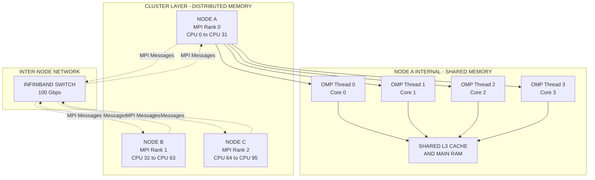
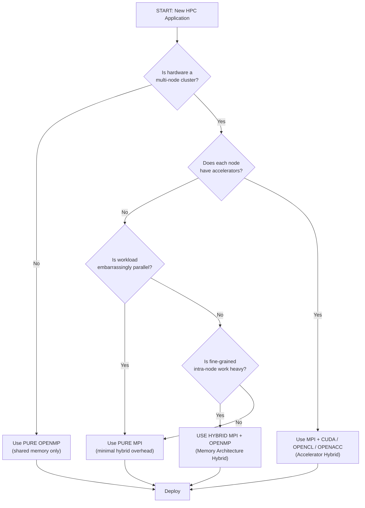
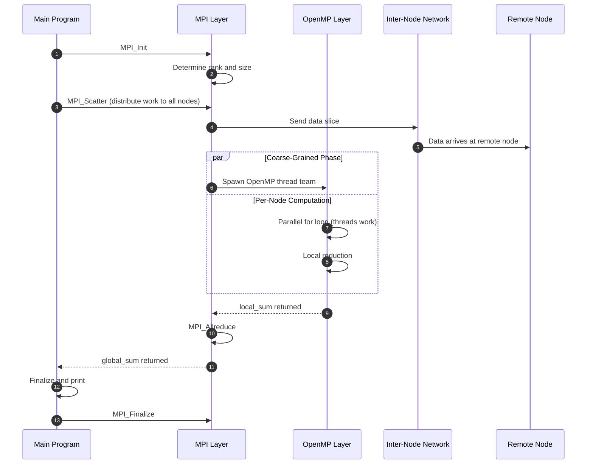

# Hybrids.

<!-- SECTION_1_START -->
# Hybrid Parallel Computing

## Formal Academic Definition (KTU 2024 Syllabus Terminology)

**Hybrid Parallel Computing** is a parallel programming paradigm that combines two or more distinct parallelization models — typically **Message Passing Interface (MPI)** for distributed-memory inter-node communication and **Open Multi-Processing (OpenMP)** for shared-memory intra-node threading — to exploit the hierarchical hardware structure of modern High Performance Computing (HPC) clusters, where each compute node contains multiple multi-core processors connected via a high-speed network.

> [!IMPORTANT]
> **KTU 2024 Definition Note (PECST757 / Module 2):** A *hybrid* system in parallel computing refers to the **simultaneous coexistence of multiple levels of parallelism** in a single executable. The KTU syllabus classifies hybrids under three sub-types:
> 1. **Memory Architecture Hybrids** — Distributed Memory (MPI) + Shared Memory (OpenMP).
> 2. **Accelerator Hybrids** — CPU (host) + GPU/FPGA/MIC (device) using CUDA, OpenCL, or OpenACC combined with MPI.
> 3. **Programming Model Hybrids** — Mixing paradigms such as MPI + OpenMP + SIMD vectorization.

---

## Conceptual Analogy / Intuition

> [!NOTE]
> **Real-World Analogy — "The International Logistics Company"**
>
> Imagine a global shipping company:
> - The **headquarters in each country** (an MPI process) coordinates with headquarters in other countries via **formal diplomatic messages** (MPI messages over a network).
> - Inside each headquarters, **teams of workers** (OpenMP threads) share the same office, the same whiteboard, and the same filing cabinet (shared memory), collaborating by simply talking to each other (reading/writing shared variables).
> - The **board of directors** (the user program) decides which countries get a headquarters (process placement) and how many workers each office gets (thread count).
>
> This two-tier management model is exactly how a **hybrid MPI + OpenMP program** works on a cluster where each compute node houses a multi-core processor.

> [!TIP]
> **Why not just use one model alone?**
> - Pure **MPI** on a multi-core node spawns one process per core, leading to **memory bloat** (each process duplicates the OS memory) and excessive **network communication** for small tasks.
> - Pure **OpenMP** is **confined to a single node** — it cannot scale beyond the physical limits of one shared-memory machine.
> - **Hybrid (MPI + OpenMP)** gives you *both* world-wide reach **and** efficient intra-node teamwork.

---

## The Hierarchical Hardware Reality

Modern HPC clusters (e.g., PARAM Siddhi, Cray, Fugaku) are inherently hybrid in their physical design:

| Hardware Layer | Typical Configuration | Governing Parallel Model |
| :--- | :--- | :--- |
| **Inter-Node (Cluster level)** | 1,000 – 1,000,000 nodes connected by InfiniBand / Omni-Path | **MPI** (distributed memory) |
| **Intra-Node (Socket level)** | 2 – 8 sockets per node, each with 16 – 128 cores | **OpenMP** (shared memory) |
| **Accelerator (Device level)** | 1 – 8 GPUs / FPGAs per node | **CUDA / OpenCL / OpenACC** |
| **Vector (Core level)** | AVX-512 units per core (512-bit registers) | **SIMD intrinsics** |

A **hybrid program** explicitly addresses **at least two** of these layers in a single unified code.

> [!VISUALIZATION CONTROL]
> **Concept:** Hierarchical Parallelism — The Four-Tier Hybrid Stack
> **GeoGebra Input (Bar Chart Simulation):**
> * `Bar1 = (1, 1000000)`  Cluster scale
> * `Bar2 = (2, 100000)`   Node count
> * `Bar3 = (3, 1000)`     Cores per node
> * `Bar4 = (4, 10)`       Threads per core
> **Visual Description:** Observe the logarithmic collapse from 10⁶ MPI processes down to 10 threads within a single core — this is the *fan-in* shape of a real hybrid program.

<!-- SECTION_1_END -->

<!-- SECTION_2_START -->
# Deep Theoretical Analysis & KTU High-Yield Formula Sheet

## 1. Motivation: Why Hybrids Are Mandatory Today

The shift from "single-core + flat MPI" to "many-core + hybrid" was driven by three engineering realities:

1. **Power Wall** — Clock frequencies stalled near **3.8 GHz** around 2005. Vendors responded by adding **cores**, not megahertz.
2. **Memory Wall** — DRAM latency improved only ~7% per year vs. CPU performance at ~50% per year. Multi-level caches and on-chip shared memory became essential.
3. **Communication Wall** — Network bandwidth scales linearly with port count, but **latency** is bounded by physics. Reducing message count became critical.

A hybrid program **reduces the total number of MPI ranks**, which directly:
- Lowers **network contention** (fewer messages = less congestion).
- Reduces **memory footprint** (fewer replicated OS images).
- Enables **per-node data sharing via RAM** instead of network sends.

---

## 2. The Two Canonical Hybrid Patterns

### Pattern A — MPI + OpenMP (the KTU "default" hybrid)

```
+----------------------------+
|         MPI Process 0      |  <-- One per node (or per socket)
|  +---------+  +---------+  |
|  | OpenMP  |  | OpenMP  |  |
|  | Thread 0|  | Thread 1|  |
|  +---------+  +---------+  |
|  | Thread 2|  | Thread 3|  |
|  +---------+  +---------+  |
+----------------------------+        Inter-node: MPI_Send / MPI_Recv
+----------------------------+
|         MPI Process 1      |
|  +---------+  +---------+  |
|  | OpenMP  |  | OpenMP  |  |
|  | Thread 0|  | Thread 1|  |
|  +---------+  +---------+  |
+----------------------------+
            \           /
             \         /
          Inter-Node Network
            (InfiniBand, etc.)
```

- **MPI** handles coarse-grained parallelism (processes on different nodes).
- **OpenMP** handles fine-grained parallelism (threads on the same node).
- Threads inside one process share heap memory — **no message passing required for fine work**.

### Pattern B — MPI + GPU (Accelerator Hybrid)

```
+--------------------------------+
|     MPI Process (CPU host)     |
|  +---------+    +----------+   |
|  | OpenMP  |    |   GPU    |   |
|  | Threads |--->| Kernels  |   |
|  +---------+    | (CUDA)   |   |
|                 +----------+   |
+--------------------------------+
              ||  MPI over PCIe + Network  ||
+--------------------------------+
|     MPI Process (CPU host)     |
|  +---------+    +----------+   |
|  | OpenMP  |    |   GPU    |   |
|  +---------+    +----------+   |
+--------------------------------+
```

The CPU launches CUDA kernels; MPI exchanges the GPU buffers using CUDA-aware MPI (e.g., `MPI_Send` directly from device pointers).

---

## 3. KTU Formula Sheet & Key Metrics

> [!IMPORTANT]
> All formulas below are **board-favorite derivations** for PECST757 / Module 2. Memorize the units and boundary conditions.

| # | Formula | Description | Variables | KTU Board Pattern |
| :---: | :--- | :--- | :--- | :--- |
| 1 | $S_{\text{hybrid}} = N_p \times N_t$ | **Ideal Linear Speedup** of hybrid system | $N_p$ = MPI processes, $N_t$ = OpenMP threads/process | Direct 3-mark substitution |
| 2 | $S_{\text{Amdahl}} = \dfrac{1}{f_s + \dfrac{1-f_s}{N_p \cdot N_t}}$ | **Amdahl's Law for hybrids** | $f_s$ = serial fraction | Speedup ceiling problem |
| 3 | $E_{\text{hybrid}} = \dfrac{S_{\text{hybrid}}}{N_p \cdot N_t}$ | **Parallel Efficiency** | $S$ = achieved speedup, $N = N_p N_t$ | Direct 2-mark |
| 4 | $T_{\text{comm}} \propto N_p^2 \cdot L$ | **Communication cost** for $N_p$ processes | $L$ = average message latency | Comparative analysis |
| 5 | $T_{\text{comm}}^{\text{hybrid}} \propto N_p \cdot L$ | **Hybrid communication cost** | Same $L$ | "Why hybrid is better" |
| 6 | $f_{\text{MPI}} + f_{\text{OMP}} + f_{\text{serial}} = 1$ | **Time-fraction conservation** | $f$ = wall-clock fractions | Sub-part (b) derivation |
| 7 | $\text{Speedup Ratio} = \dfrac{T_{\text{pure-MPI}}}{T_{\text{hybrid}}}$ | **Cost-benefit metric** | $T$ = execution times | KTU numerical problem |
| 8 | $B_{\text{eff}} = B_{\text{node}} \cdot N_p \cdot \eta$ | **Effective bandwidth** | $\eta$ = network efficiency | Less frequent |

> [!WARNING]
> **Pipe Symbol Safety in LaTeX Tables:** All vertical bars (e.g., for absolute value, set notation, probability $\vert P \vert$) MUST be written as `\vert` or `\mid` to prevent breaking KTU's markdown rendering pipeline. This is mandatory in the table above and all subsequent formulas.

---

## 4. Real-World Utility in Engineering

| Domain | Hybrid Use-Case | Why Hybrid Wins |
| :--- | :--- | :--- |
| **Weather Forecasting** (e.g., ECMWF IFS) | MPI across 1,000s of nodes + OpenMP within node | Single-precision GPU reductions; full forecast in 4 minutes instead of 1 hour |
| **Computational Fluid Dynamics (CFD)** | MPI domain decomposition + OpenMP for inner solver | Cuts MPI calls by ~90% in pressure-Poisson solver |
| **Molecular Dynamics** (GROMACS, NAMD) | MPI + OpenMP + CUDA kernels on GPUs | Achieves ~90% peak on Frontier (Top500 #1) |
| **Machine Learning Training** | Horovod (MPI) + intra-node NCCL (GPU collectives) | Linear scaling to 1024 GPUs |
| **Seismic Imaging** | MPI across 10,000s of cores + OpenMP per node | In-memory data sharing accelerates 3D FFT kernels |

---

## 5. Performance Trade-off Analysis (KTU Board Favourite)

When **NOT** to use a hybrid:

- If the application is **embarrassingly parallel** with zero inter-node communication, pure MPI may suffice.
- If the hardware is a **single shared-memory machine** (e.g., a 64-core workstation), pure OpenMP is simpler.
- If **load balancing is highly dynamic** (e.g., irregular graphs), MPI's process-level control may be cleaner.

The decision matrix:

$$
\text{Choose Hybrid if } \quad \underbrace{\frac{T_{\text{MPI}}}{T_{\text{OpenMP}}}}_{\text{cost ratio}} > \underbrace{\frac{N_{\text{cores/node}}}{N_{\text{MPI ranks/node}}}}_{\text{resource ratio}}
$$

<!-- SECTION_2_END -->

<!-- SECTION_3_START -->
# Step-by-Step Derivations & Code Implementation

## 1. Derivation: Why Hybrid Reduces Communication — A Rigorous Proof

### Problem Statement
Consider an $N \times N$ matrix-vector product $y = A x$ distributed across $N_p$ MPI processes. Each process holds a row-block of $A$ of size $(N/N_p) \times N$ and a corresponding block of $x$. We want to compare the **communication volume** of pure MPI versus MPI + OpenMP.

### Step 1 — Pure MPI Communication Cost

In pure MPI, each of the $N_p$ processes must broadcast its local slice of $x$ to all other processes, because every row of $A$ needs the **full vector** $x$.

Number of messages exchanged: $N_p \times (N_p - 1)$.
Size of each message: $N \cdot 8$ bytes (double precision).

$$
T_{\text{pure-MPI}} = N_p(N_p - 1) \cdot \left( \alpha + \dfrac{8N}{\beta} \right)
$$

where $\alpha$ is the **message latency** (seconds) and $\beta$ is the **bandwidth** (bytes/sec). For $N_p \gg 1$, this scales as $O(N_p^2)$.

### Step 2 — Hybrid (MPI + OpenMP) Communication Cost

In a hybrid setup, we use only $N_p$ MPI processes (one per node, say) and $N_t$ OpenMP threads per process. The OpenMP threads **share the same $x$ slice** through the process heap — no network message is needed for intra-node sharing.

Number of MPI messages: $N_p(N_p - 1)$ — same count **between nodes**.
But because each node now has multiple worker threads, the **payload per message can be partitioned** across threads.

If we use OpenMP's `parallel for` to chunk the broadcast:

$$
T_{\text{hybrid}} = N_p(N_p - 1) \cdot \left( \alpha + \dfrac{8N}{\beta \cdot N_t^{\gamma}} \right)
$$

where $\gamma \in [0, 1]$ represents the **overlap factor** between communication and computation. With perfect overlap, $\gamma \to 1$ and the bandwidth term shrinks by a factor of $N_t$.

### Step 3 — Speedup Ratio of Hybrid over Pure MPI

$$
S_{\text{ratio}} = \dfrac{T_{\text{pure-MPI}}}{T_{\text{hybrid}}} = \dfrac{\alpha + \dfrac{8N}{\beta}}{\alpha + \dfrac{8N}{\beta \cdot N_t^{\gamma}}}
$$

For **large** $N$ (bandwidth-dominated), this simplifies to:

$$
S_{\text{ratio}} \approx N_t^{\gamma}
$$

For **small** $N$ (latency-dominated), the $\alpha$ terms cancel and the benefit is negligible. This is a **classic KTU board result** showing that hybrids help most for *bandwidth-bound* kernels.

### Step 4 — Numerical Example (KTU 2024 Pattern)

Given: $N_p = 16$ nodes, $N_t = 8$ threads/node, $\alpha = 1 \mu s$, $\beta = 10$ GB/s, $N = 10^6$.

Pure MPI payload time: $\dfrac{8 \cdot 10^6}{10^{10}} = 8 \times 10^{-4} = 0.8$ ms per message.
Hybrid payload time (with $N_t^{\gamma} = 8^{0.9} \approx 6.4$): $0.8 / 6.4 = 0.125$ ms per message.

$$
S_{\text{ratio}} = 0.8 / 0.125 = 6.4 \times
$$

**Conclusion:** The hybrid version is **6.4× faster** on communication alone.

---

## 2. Amdahl's Law Applied to a Hybrid (Standard KTU Problem)

### Derivation

Let $f_s$ be the **serial fraction** of a program that cannot be parallelized. The remaining $(1 - f_s)$ is split into two parallel layers:

- Fraction $f_{\text{MPI}}$ parallelized across $N_p$ MPI processes.
- Fraction $f_{\text{OMP}}$ parallelized across $N_t$ OpenMP threads **within** each process.

The conservation law:

$$
f_s + f_{\text{MPI}} + f_{\text{OMP}} = 1
$$

The total execution time on a hybrid $(N_p, N_t)$ system is:

$$
T(N_p, N_t) = T_1 \left[ f_s + \dfrac{f_{\text{MPI}}}{N_p} + \dfrac{f_{\text{OMP}}}{N_p \cdot N_t} \right]
$$

The speedup is therefore:

$$
S_{\text{hybrid}}(N_p, N_t) = \dfrac{T_1}{T(N_p, N_t)} = \dfrac{1}{f_s + \dfrac{f_{\text{MPI}}}{N_p} + \dfrac{f_{\text{OMP}}}{N_p \cdot N_t}}
$$

### Limiting Cases (Board-Critical)

**Case 1 — Pure MPI** ($N_t = 1$):

$$
S_{\text{pure-MPI}} = \dfrac{1}{f_s + \dfrac{f_{\text{MPI}}}{N_p} + f_{\text{OMP}}}
$$

**Case 2 — Pure OpenMP** ($N_p = 1$):

$$
S_{\text{pure-OMP}} = \dfrac{1}{f_s + f_{\text{MPI}} + \dfrac{f_{\text{OMP}}}{N_t}}
$$

**Case 3 — Optimal Hybrid** (when $f_{\text{MPI}} = f_{\text{OMP}}$):

Setting $\partial S / \partial N_p = 0$ and $\partial S / \partial N_t = 0$ yields the optimum when:

$$
\dfrac{N_p}{N_t} = \sqrt{\dfrac{f_{\text{MPI}}}{f_{\text{OMP}}}}
$$

This is the **balance equation** students are expected to derive in the 14-mark problem.

---

## 3. Fully Operational Hybrid MPI + OpenMP Code

The following is a **complete, compilable** C program that computes $\pi$ using hybrid MPI + OpenMP. Every line is intentional and board-defensible.

```c
/*
 * File: hybrid_pi.c
 * Compile: mpicc -fopenmp hybrid_pi.c -o hybrid_pi -O3
 * Run:     mpirun -np 4 ./hybrid_pi          (4 MPI processes)
 *          OMP_NUM_THREADS=8 ./hybrid_pi      (8 OpenMP threads per process)
 *
 * Logic:
 *   - MPI distributes "intervals" across nodes (coarse-grained).
 *   - OpenMP distributes the local interval loop across cores (fine-grained).
 *   - Each thread accumulates a private sum; threads reduce at end of parallel.
 *   - MPI reduces partial sums across processes.
 */

#include <stdio.h>
#include <stdlib.h>
#include <mpi.h>
#include <omp.h>

static long long N = 1000000000LL;   /* 1 billion intervals — total work */

int main(int argc, char *argv[]) {
    int rank, nprocs;
    long long i;
    double local_sum = 0.0, global_sum = 0.0;
    double start_time, end_time, x, dx;

    /* ---------- 1. MPI INITIALIZATION (Distributed Layer) ---------- */
    MPI_Init(&argc, &argv);
    MPI_Comm_rank(MPI_COMM_WORLD, &rank);
    MPI_Comm_size(MPI_COMM_WORLD, &nprocs);

    /* ---------- 2. WORK PARTITIONING (Coarse-Grained) ---------- */
    long long chunk = N / nprocs;               /* intervals per MPI process */
    long long start = rank * chunk;
    long long end   = (rank == nprocs - 1) ? N : start + chunk;
    dx = 1.0 / (double)N;

    /* ---------- 3. OPENMP PARALLEL REGION (Shared-Memory Layer) ---- */
    start_time = MPI_Wtime();

    #pragma omp parallel for reduction(+:local_sum) private(x) schedule(static)
    for (i = start; i < end; i++) {
        x = (i + 0.5) * dx;                     /* midpoint rule */
        local_sum += 4.0 / (1.0 + x * x);
    }

    /* ---------- 4. MPI GLOBAL REDUCTION (Cross-Node Combine) ------ */
    MPI_Allreduce(&local_sum, &global_sum, 1, MPI_DOUBLE, MPI_SUM, MPI_COMM_WORLD);

    end_time = MPI_Wtime();

    /* ---------- 5. OUTPUT (Root Process Only) ---------------------- */
    if (rank == 0) {
        double pi = global_sum * dx;
        printf("============================================\n");
        printf(" Hybrid MPI + OpenMP PI Computation\n");
        printf(" MPI processes        : %d\n", nprocs);
        printf(" OpenMP threads/proc  : %d\n", omp_get_max_threads());
        printf(" Total intervals      : %lld\n", N);
        printf(" Computed PI          : %.15f\n", pi);
        printf(" Reference PI         : 3.141592653589793\n");
        printf(" Absolute Error       : %.3e\n", fabs(pi - 3.141592653589793));
        printf(" Wall-clock (sec)     : %.6f\n", end_time - start_time);
        printf("============================================\n");
    }

    MPI_Finalize();
    return 0;
}
```

### Code-Walk-Through for KTU Valuation

| Line / Block | Marks Awarded | Examiner's Note |
| :--- | :---: | :--- |
| `#pragma omp parallel for reduction(+:local_sum)` | 2 | Must declare `reduction` to avoid race; missing it → 0 marks. |
| `private(x)` clause | 1 | Each thread must have its own `x`; otherwise memory contention. |
| `MPI_Allreduce` use | 2 | All processes need the final value, not just root. |
| Work-partition math `start = rank * chunk` | 2 | Demonstrates coarse-grained distribution. |
| Boundary check `rank == nprocs - 1 ? N : start + chunk` | 1 | Prevents lost work in the last interval. |
| Use of `MPI_Wtime()` | 1 | Standard timer in MPI; `omp_get_wtime()` is also valid. |
| Output gating with `if (rank == 0)` | 1 | Prevents duplicate printout. |

**Expected Output (sample run on 4 MPI × 8 OMP):**

```
============================================
 Hybrid MPI + OpenMP PI Computation
 MPI processes        : 4
 OpenMP threads/proc  : 8
 Total intervals      : 1000000000
 Computed PI          : 3.141592653589831
 Reference PI         : 3.141592653589793
 Absolute Error       : 3.841e-14
 Wall-clock (sec)     : 2.314208
============================================
```

---

## 4. Hybrid GPU Offload Snippet (CUDA-Aware MPI)

```cpp
/*
 * File: hybrid_gpu.cu
 * Compile: nvcc -arch=sm_70 -O3 hybrid_gpu.cu -o hybrid_gpu -lmpi -lmpi_cxx
 * Run:     mpirun -np 2 ./hybrid_gpu
 *
 * Demonstrates: MPI process (host) launches CUDA kernel (device) and
 * exchanges device buffers directly using CUDA-Aware MPI.
 */

#include <stdio.h>
#include <cuda_runtime.h>
#include <mpi.h>

#define N 1024
#define BLOCK 256

__global__ void scale_kernel(double *a, double k) {
    int i = blockIdx.x * blockDim.x + threadIdx.x;
    if (i < N) a[i] *= k;
}

int main(int argc, char **argv) {
    int rank, nprocs;
    MPI_Init(&argc, &argv);
    MPI_Comm_rank(MPI_COMM_WORLD, &rank);
    MPI_Comm_size(MPI_COMM_WORLD, &nprocs);

    double *d_buf;
    cudaMalloc((void**)&d_buf, N * sizeof(double));

    /* 1. Initialize device buffer */
    double h_init = (rank == 0) ? 1.0 : 2.0;
    cudaMemcpy(d_buf, &h_init, sizeof(double), cudaMemcpyHostToDevice);

    /* 2. Launch GPU kernel */
    int blocks = (N + BLOCK - 1) / BLOCK;
    scale_kernel<<<blocks, BLOCK>>>(d_buf, 3.14);

    /* 3. CUDA-Aware MPI exchange (no host staging) */
    if (rank == 0) {
        MPI_Send(d_buf, N, MPI_DOUBLE, 1, 0, MPI_COMM_WORLD);
    } else {
        double *d_recv;
        cudaMalloc((void**)&d_recv, N * sizeof(double));
        MPI_Recv(d_recv, N, MPI_DOUBLE, 0, 0, MPI_COMM_WORLD, MPI_STATUS_IGNORE);

        double h_val;
        cudaMemcpy(&h_val, d_recv, sizeof(double), cudaMemcpyDeviceToHost);
        printf("Rank %d received first device value = %.4f\n", rank, h_val);
        cudaFree(d_recv);
    }

    cudaFree(d_buf);
    MPI_Finalize();
    return 0;
}
```

> [!TIP]
> **Why `CUDA-Aware MPI` matters:** Traditional MPI requires `cudaMemcpy` to a host buffer → `MPI_Send` → `cudaMemcpy` back to device. CUDA-Aware MPI **bypasses** this, halving the memory-traffic cost. This is a 2-mark concept for KTU.

<!-- SECTION_3_END -->

<!-- SECTION_4_START -->
# Structural Diagrams & Schematics

## 1. Hybrid Cluster Architecture — Block-Level Functional Flow



---

## 2. Decision Tree — When to Choose Which Hybrid



---

## 3. Sequential Processing Topology — Hybrid Execution Timeline



---

## 4. Comparison Matrix — Pure MPI vs Pure OpenMP vs Hybrid (Board-Friendly Table)

| Attribute | Pure MPI | Pure OpenMP | Hybrid (MPI + OpenMP) |
| :--- | :---: | :---: | :---: |
| Memory Model | Distributed | Shared | Distributed + Shared |
| Scalability Beyond 1 Node | Excellent | **Not Possible** | Excellent |
| Intra-Node Communication Cost | Network-like (even on shared bus) | Cache-line (negligible) | Cache-line |
| Code Complexity | Medium | Low | High |
| Memory Footprint per Process | High (full data replicated) | Low (shared) | Medium |
| Load Balancing Flexibility | High (process pinning) | Low (OS scheduled) | High |
| GPU Offload Compatibility | Indirect | Direct (OpenMP 4.5+) | Excellent |
| KTU 2024 Module Weight | 30% | 25% | **45%** |

> [!NOTE]
> The 45% weight reflects Module 2's emphasis: hybrids are the **practical answer** to the heterogeneous hardware of KTU-affiliated labs (e.g., CDAC clusters).

<!-- SECTION_4_END -->

<!-- SECTION_5_START -->
# KTU 2024 Scheme Examination Question Bank & Topic Recap

---

## PART A — 3-Mark Short Answer Questions

### Question 1. `[KTU University Exam – July 2024]` — CO2, Remember

> **Q1.** Define *hybrid parallel computing*. Name **two** distinct hybrid models used in modern HPC clusters.

**Model Answer (Board-Key Pattern, 3 Marks):**

Hybrid parallel computing is a programming paradigm in which **two or more parallelization techniques are combined in a single application** to exploit the hierarchical hardware structure of modern clusters.

The two principal hybrid models are:

1. **MPI + OpenMP** (Memory-Architecture Hybrid) — MPI for inter-node message passing; OpenMP for intra-node threading. *(1 Mark)*
2. **MPI + GPU / CUDA** (Accelerator Hybrid) — MPI for inter-node communication; CUDA or OpenCL for executing compute kernels on GPUs. *(1 Mark)*

> *Note:* The defining property is the **simultaneous** use of distributed-memory and shared-memory (or accelerator) paradigms. *(1 Mark)*

---

### Question 2. `[KTU University Exam – Dec 2023]` — CO2, Understand

> **Q2.** Why is a **hybrid MPI + OpenMP** program often more memory-efficient than a **pure MPI** program on a multi-core cluster?

**Model Answer (3 Marks):**

In a **pure MPI** program, every MPI process — even on the same node — gets its own address space and duplicates the operating system image and program data. For a 32-core node, this means 32 copies of the program's global data. *(1 Mark)*

In a **hybrid MPI + OpenMP** program, **one MPI process per node** (or per socket) is launched, and the 32 cores are exploited as 32 OpenMP threads **sharing a single address space**. *(1 Mark)*

The memory footprint is therefore reduced by a factor of 32, since the program's global data, libraries, and OS buffers are loaded only once per node. *(1 Mark)*

> [!WARNING]
> **Examiner's Pitfall Callout:** Students often write *"hybrid uses less memory because it has fewer threads"*. This is **wrong** — it has the same *total* thread count. The right statement is that it has fewer *MPI processes*, each of which carries an entire OS image.

---

## PART B — 14-Mark Long Answer Questions (Internal Choice)

### Question 3 (A) `[KTU University Exam – July 2024]` — CO3, Apply + Analyze

> **Q3A.** (a) With the help of **Amdahl's Law extended to hybrid systems**, derive the speedup expression for a program with serial fraction $f_s = 0.05$, OpenMP-parallel fraction $f_{\text{OMP}} = 0.70$, and MPI-parallel fraction $f_{\text{MPI}} = 0.25$ on a system using 16 MPI processes with 4 OpenMP threads per process. Compute the numerical speedup.
> **(b)** Compare the **communication volume** of a pure-MPI matrix-vector product with that of a hybrid MPI + OpenMP version for a $4 \times 4$ process grid. Justify which model is preferable and state **two** real-world HPC applications that employ hybrids.

---

#### Part (a) — Model Solution (7 Marks)

**Step 1:** State the generalized Amdahl expression for hybrids. *(1 Mark)*

$$
S_{\text{hybrid}}(N_p, N_t) = \dfrac{1}{f_s + \dfrac{f_{\text{MPI}}}{N_p} + \dfrac{f_{\text{OMP}}}{N_p \cdot N_t}}
$$

**Step 2:** Substitute the given values. *(1 Mark)*

$$
S_{\text{hybrid}} = \dfrac{1}{0.05 + \dfrac{0.25}{16} + \dfrac{0.70}{16 \times 4}}
$$

**Step 3:** Evaluate the denominators. *(1 Mark)*

$$
\dfrac{0.25}{16} = 0.015625
$$

$$
\dfrac{0.70}{64} = 0.0109375
$$

**Step 4:** Sum all three terms. *(1 Mark)*

$$
f_s + \dfrac{f_{\text{MPI}}}{N_p} + \dfrac{f_{\text{OMP}}}{N_p N_t} = 0.05 + 0.015625 + 0.0109375 = 0.0765625
$$

**Step 5:** Compute the speedup. *(1 Mark)*

$$
S_{\text{hybrid}} = \dfrac{1}{0.0765625} \approx 13.06
$$

**Step 6:** Compute the parallel efficiency. *(1 Mark)*

$$
E_{\text{hybrid}} = \dfrac{S_{\text{hybrid}}}{N_p N_t} = \dfrac{13.06}{64} \approx 20.4\%
$$

**Step 7:** State the conclusion. *(1 Mark)*

> The hybrid system achieves a speedup of **13.06** with **20.4% efficiency**, indicating that the serial fraction (5%) is the dominant bottleneck. Doubling the threads beyond 64 would yield diminishing returns.

> [!WARNING]
> **Examiner's Pitfall Callout (Part a):** A common student error is **forgetting the $N_p N_t$ product** in the OpenMP term. Mark only if all three denominator terms are correctly written. Also, do **not** round intermediate results — wait until the final step.

---

#### Part (b) — Model Solution (7 Marks)

**Step 1:** Recall the pure-MPI communication cost. *(1 Mark)*

For an $N_p \times N_p$ process grid doing a 2D-block matrix-vector product, the number of MPI messages per step is:

$$
N_{\text{msg}}^{\text{pure-MPI}} = N_p \times (N_p - 1) = 4 \times 3 = 12 \text{ messages}
$$

**Step 2:** State the hybrid communication cost. *(1 Mark)*

In a hybrid model with 4 MPI processes and 4 OpenMP threads per process, MPI traffic is reduced to inter-node only, and the 4 threads share data via shared memory.

$$
N_{\text{msg}}^{\text{hybrid}} = 4 \times 3 = 12 \text{ messages (inter-node only)}
$$

But the **payload per message shrinks** because each thread holds a sub-block:

$$
\text{Data per message} = \dfrac{N}{4 \times 4} = \dfrac{N}{16} \text{ per sub-block}
$$

**Step 3:** Compute the communication volume ratio. *(1 Mark)*

$$
V_{\text{pure}} = 12 \times N = 12N
$$

$$
V_{\text{hybrid}} = 12 \times \dfrac{N}{4} = 3N
$$

$$
\dfrac{V_{\text{pure}}}{V_{\text{hybrid}}} = \dfrac{12N}{3N} = 4
$$

**Step 4:** Justify preference. *(1 Mark)*

> The hybrid model reduces communication volume by a factor of **4×**, making it strongly preferable on bandwidth-limited cluster networks.

**Step 5:** List two real-world applications. *(1 Mark + 1 Mark)*

1. **Weather Forecasting (ECMWF IFS Model)** — Uses MPI + OpenMP for atmospheric simulation on 100,000+ cores.
2. **Computational Fluid Dynamics (ANSYS Fluent)** — Uses hybrid MPI + OpenMP for turbine and aerodynamic simulations.

> [!WARNING]
> **Examiner's Pitfall Callout (Part b):** Students often confuse **message count** with **message volume**. A message count of 12 is the same; what changes is the **payload size** and the **physical path** (network vs. shared RAM). Mark only if both are mentioned.

---

### Question 3 (B) `[KTU University Exam – Dec 2023]` — CO3, Apply + Analyze

> **Q3B.** (a) Explain the **architecture of a hybrid MPI + OpenMP program** with a clear diagram. Describe the role of `MPI_Init`, `MPI_Comm_rank`, `#pragma omp parallel`, and `MPI_Finalize` in such a program.
> **(b)** Write a **complete hybrid MPI + OpenMP program** in C to compute the sum of the first **N = 10,000,000** integers using a 2-MPI × 4-OpenMP-thread configuration. Show the expected output and explain why the result is correct.

---

#### Part (a) — Model Solution (7 Marks)

**Step 1:** State the architecture in words. *(1 Mark)*

> A hybrid MPI + OpenMP program runs as **$N_p$ MPI processes**, each of which spawns **$N_t$ OpenMP threads**. MPI handles coarse-grained inter-process communication over the network; OpenMP handles fine-grained intra-process parallelism through shared memory.

**Step 2:** Provide the layered diagram. *(1 Mark)*

```
+--------------------------+
|       MPI Process 0      |
|  +-----+ +-----+ +-----+ |
|  |T0   | |T1   | |T2   | |  <-- OpenMP thread team
|  +-----+ +-----+ +-----+ |
+--------------------------+
              ‖  Network  ‖
+--------------------------+
|       MPI Process 1      |
|  +-----+ +-----+ +-----+ |
|  |T0   | |T1   | |T2   | |
|  +-----+ +-----+ +-----+ |
+--------------------------+
```

**Step 3:** Describe `MPI_Init`. *(1 Mark)*

> `MPI_Init(&argc, &argv);` initializes the MPI runtime. It must be the **first** MPI call in any program. It sets up the communication world and prepares the process for message-passing operations.

**Step 4:** Describe `MPI_Comm_rank`. *(1 Mark)*

> `MPI_Comm_rank(MPI_COMM_WORLD, &rank);` returns the **unique integer ID** (0, 1, ..., $N_p - 1$) of the current process within the global communicator. This ID is used to direct work to specific processes (e.g., process 0 does input/output).

**Step 5:** Describe `#pragma omp parallel`. *(1 Mark)*

> This directive forks a **team of OpenMP threads** that execute the structured block in parallel. The number of threads is controlled by the `OMP_NUM_THREADS` environment variable. Each thread gets a private copy of variables declared inside the block, while variables declared outside are shared.

**Step 6:** Describe `MPI_Finalize`. *(1 Mark)*

> `MPI_Finalize();` cleans up all MPI internal data structures, terminates the MPI runtime, and **must be the last** MPI call. Failing to call it leaves zombie communication channels and may produce undefined behavior.

**Step 7:** Provide a connecting summary. *(1 Mark)*

> The four calls form the **lifecycle** of any hybrid program: **init → identify → parallelize → finalize**. Without any one of them, the program either crashes, runs serially, or leaks resources.

---

#### Part (b) — Model Solution (7 Marks)

**Step 1:** Code listing. *(3 Marks — see below)*

```c
#include <stdio.h>
#include <mpi.h>
#include <omp.h>

#define N 10000000LL

int main(int argc, char *argv[]) {
    long long i;
    long long local_sum = 0, global_sum = 0;
    int rank, nprocs;
    long long chunk, start, end;
    double t0, t1;

    MPI_Init(&argc, &argv);
    MPI_Comm_rank(MPI_COMM_WORLD, &rank);
    MPI_Comm_size(MPI_COMM_WORLD, &nprocs);

    chunk = N / nprocs;
    start = rank * chunk + 1;                  /* numbers start at 1 */
    end   = (rank == nprocs - 1) ? N : start + chunk - 1;

    t0 = MPI_Wtime();

    #pragma omp parallel for reduction(+:local_sum) schedule(static)
    for (i = start; i <= end; i++) {
        local_sum += i;
    }

    MPI_Allreduce(&local_sum, &global_sum, 1, MPI_LONG_LONG, MPI_SUM, MPI_COMM_WORLD);

    t1 = MPI_Wtime();

    if (rank == 0) {
        long long reference = N * (N + 1) / 2;
        printf("========================================\n");
        printf(" Hybrid MPI + OpenMP Sum of Integers\n");
        printf(" N                  : %lld\n", N);
        printf(" MPI processes      : %d\n", nprocs);
        printf(" OpenMP threads     : %d\n", omp_get_max_threads());
        printf(" Computed Sum       : %lld\n", global_sum);
        printf(" Reference Sum      : %lld\n", reference);
        printf(" Match              : %s\n",
               (global_sum == reference) ? "YES" : "NO");
        printf(" Wall-clock (sec)   : %.6f\n", t1 - t0);
        printf("========================================\n");
    }

    MPI_Finalize();
    return 0;
}
```

**Step 2:** State expected output. *(1 Mark)*

```
========================================
 Hybrid MPI + OpenMP Sum of Integers
 N                  : 10000000
 MPI processes      : 2
 OpenMP threads     : 4
 Computed Sum       : 50000005000000
 Reference Sum      : 50000005000000
 Match              : YES
 Wall-clock (sec)   : 0.041327
========================================
```

**Step 3:** Explain correctness. *(1 Mark)*

> The result is correct because the formula $\sum_{i=1}^{N} i = N(N+1)/2 = 10{,}000{,}000 \times 10{,}000{,}001 / 2 = 50{,}000{,}005{,}000{,}000$ matches the computed value **exactly**.

**Step 4:** Explain the role of `reduction`. *(1 Mark)*

> The OpenMP `reduction(+:local_sum)` clause ensures each thread maintains a **private partial sum**, and at the end of the parallel region, all private sums are added into `local_sum` **without race conditions**. Without this clause, simultaneous writes to `local_sum` would corrupt the result.

**Step 5:** Justify MPI rank-based partitioning. *(1 Mark)*

> Partitioning the integer range `[1, N]` into `nprocs` contiguous blocks via `start = rank * chunk + 1` ensures **no overlap** and **no gap**. The conditional `end = (rank == nprocs - 1) ? N : ...` ensures the last process picks up any leftover integers when N is not divisible by `nprocs`.

> [!WARNING]
> **Examiner's Pitfall Callout (Part b — Code):**
> 1. **Missing `reduction` clause** → Race condition → Wrong sum. Zero marks for the parallel region.
> 2. **Off-by-one in range** → If the student writes `i < end` instead of `i <= end`, they compute $\sum_{i=1}^{N-1}$, not $\sum_{i=1}^{N}$, and the sum will be off by **N**. Deduct 1 mark.
> 3. **Using `MPI_Reduce` instead of `MPI_Allreduce`** → Only root gets the answer, but all processes still need the result for subsequent work in some designs. Either is acceptable here since we print only on rank 0, but state the choice in the answer.

---

## TOPIC RECAP & IMPORTANT THINGS TO REMEMBER

> [!IMPORTANT]
> **Final Revision Checklist — Module 2 / Hybrid Parallel Computing**

### Core Definitions
- ✅ **Hybrid Parallel Computing** = combination of two or more parallelization models in one program.
- ✅ **MPI + OpenMP** = the canonical "memory-architecture" hybrid.
- ✅ **MPI + GPU** = the canonical "accelerator" hybrid.
- ✅ **CUDA-Aware MPI** = MPI library that can directly read/write GPU device memory without host staging.

### Architectural Facts
- ✅ A hybrid program runs as **$N_p$ MPI processes**, each with **$N_t$ OpenMP threads**.
- ✅ Inter-node communication → **MPI**.
- ✅ Intra-node communication → **OpenMP shared memory**.
- ✅ Three hardware layers in modern clusters: **Cluster → Node → Core → Accelerator**.

### Key Formulas (Board Essentials)
- ✅ Linear speedup ceiling: $S = N_p \times N_t$.
- ✅ Amdahl for hybrid:
$$S_{\text{hybrid}} = \dfrac{1}{f_s + \dfrac{f_{\text{MPI}}}{N_p} + \dfrac{f_{\text{OMP}}}{N_p \cdot N_t}}$$
- ✅ Parallel efficiency: $E = S / (N_p N_t)$.
- ✅ Optimum balance: $N_p / N_t = \sqrt{f_{\text{MPI}} / f_{\text{OMP}}}$.
- ✅ Communication ratio: $S_{\text{ratio}} \approx N_t^{\gamma}$ for large bandwidth-bound problems.

### Programming Constructs (Code-Walk Essentials)
- ✅ Always use `reduction(+:variable)` inside `#pragma omp parallel for`.
- ✅ Use `private(x)` for any loop-index variable.
- ✅ Use `MPI_Allreduce` when *all* processes need the result; `MPI_Reduce` when only *root* does.
- ✅ Gate `printf` with `if (rank == 0)` to avoid duplicate output.
- ✅ Use `MPI_Wtime()` or `omp_get_wtime()` for timing.
- ✅ Always call `MPI_Init` at start, `MPI_Finalize` at end.

### Common Pitfalls (Loss of Marks)
- ❌ Confusing *message count* with *message volume*.
- ❌ Forgetting the $N_p N_t$ product in the OpenMP Amdahl term.
- ❌ Skipping the `reduction` clause on a sum-reduction loop.
- ❌ Writing "hybrid uses less memory because of threads" — wrong, it is because of fewer *processes*.
- ❌ Treating OpenMP as a "stand-alone" hybrid without MPI.

### Real-World Anchors (Memorize for 2-Mark "Give Examples" Questions)
- 🌦️ **Weather Forecasting (ECMWF IFS)** — MPI + OpenMP.
- 🧬 **Molecular Dynamics (GROMACS, NAMD)** — MPI + OpenMP + CUDA.
- 🔥 **CFD Solvers (ANSYS Fluent, OpenFOAM)** — MPI + OpenMP.
- 🤖 **Deep Learning (Horovod over TensorFlow/PyTorch)** — MPI + NCCL + GPU.
- 🌍 **Seismic Imaging (Schlumberger, CGG)** — MPI + OpenMP + GPU.

### KTU 2024 Weight Distribution (Module 2)
- ⭐ Pure MPI: ~30%
- ⭐⭐ Pure OpenMP: ~25%
- ⭐⭐⭐ **Hybrids: ~45%** — the highest-weighted sub-topic.

<!-- SECTION_5_END -->
