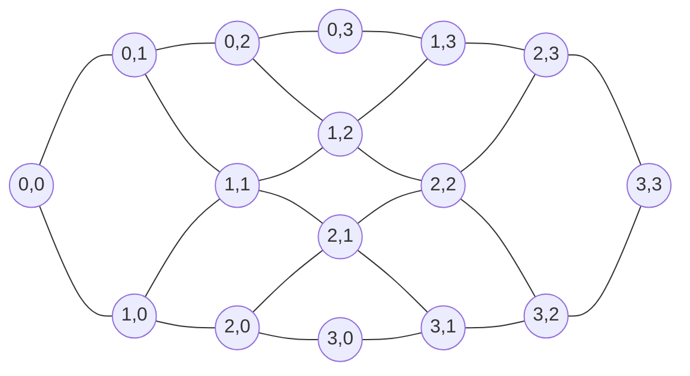
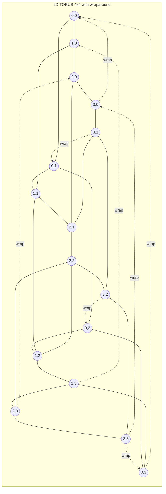
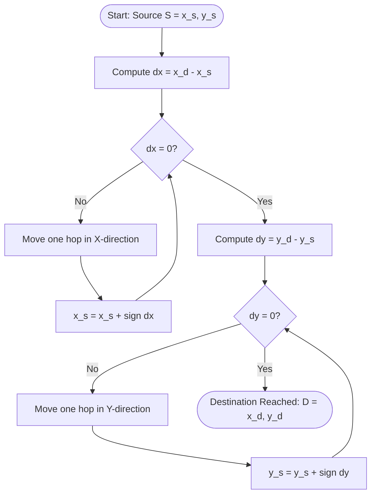
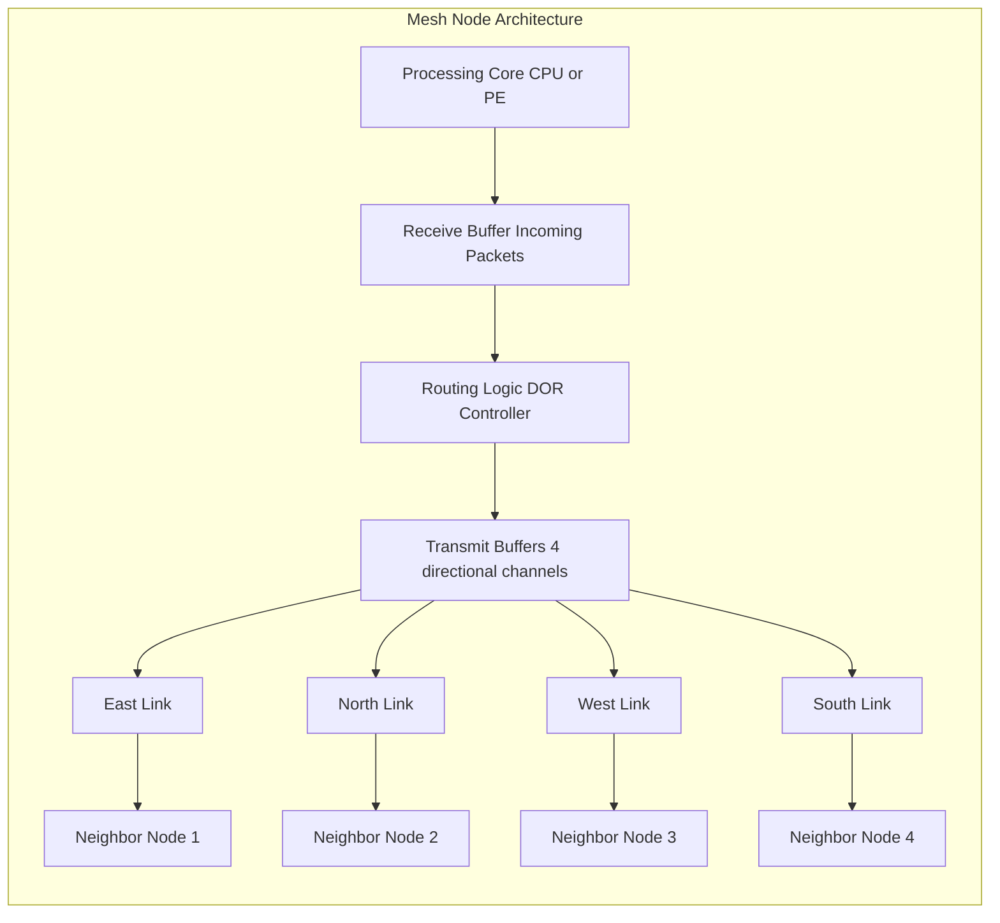
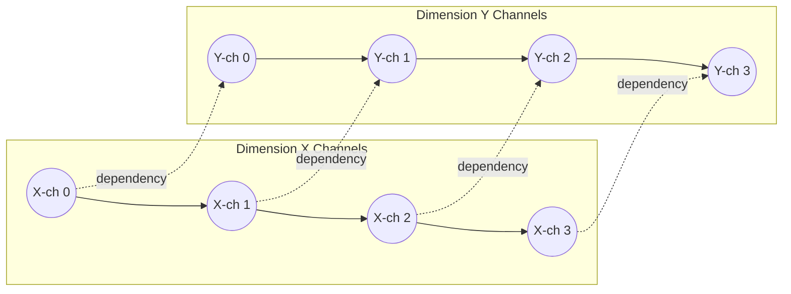

# Mesh networks

<!-- SECTION_1_START -->
# Mesh Networks — Core Technical Definition & Intuitive Overview

## Formal KTU 2024 Definition
> [!IMPORTANT]
> **Mesh Network (KTU 2024 — PECST757, Module 2):** A **mesh network** is a *direct interconnection topology* for parallel computers in which processing nodes are arranged in a regular *d-dimensional* Cartesian grid, where each node $N(i_1, i_2, \dots, i_d)$ is connected by point-to-point links to its nearest neighbors along each dimension. A node at the interior has degree $2d$, while boundary nodes have lower degree. When wrap-around links connect opposite boundaries, the topology becomes a **torus (k-ary n-mesh)**.

In the **KTU 2024 Scheme** syllabus, mesh networks are positioned as a scalable alternative to buses, crossbars, and rings, and serve as the architectural backbone of real systems such as the **Intel Touchstone Delta (2D mesh)**, **Cray XT series (3D torus)**, **Blue Gene/L (3D torus)**, and **NVIDIA NVLink fabric**.

## Conceptual Analogy / Intuition
Imagine a **large city's street grid** (think of Manhattan, New York). Buildings (= processing nodes) sit at every road intersection. A building can *directly* communicate only with the four immediate neighboring buildings (North, South, East, West) via local streets. To reach a distant building, a message must "hop" from intersection to intersection. There is no central post office routing everything — the routing is **distributed** and **local**.

> [!NOTE]
> **Key Insight:** The beauty of the mesh is *locality of communication*. The nearest neighbors (2, 3, 4, 6, or more depending on dimension) are one hop away, while distant nodes are reached in $O(\sqrt{N})$ or $O(N^{1/d})$ hops — far better than a bus or ring for large $N$.

## Dimensional Taxonomy
- **1D Mesh (Linear Array):** $N$ nodes in a line. Each interior node has 2 neighbors.
- **2D Mesh:** $k \times k$ grid of nodes. Interior nodes have **degree 4** (up, down, left, right).
- **3D Mesh:** $k \times k \times k$ grid. Interior nodes have **degree 6**.
- **2D Torus (k-ary 2-mesh):** 2D mesh with wrap-around links connecting opposite boundaries. Every node has uniform **degree 4**.
- **3D Torus (k-ary 3-mesh):** Every node has uniform **degree 6**.

> [!TIP]
> **Physical Constants / Standard Parameters used in this note:**
> * $N$ = total number of nodes in the network
> * $d$ = network diameter (longest shortest path between any two nodes)
> * $k$ = radix (number of nodes per dimension)
> * $n$ = number of dimensions
> * $B_b$ = bisection bandwidth
> * **Routing algorithm standard:** **Dimension-Order Routing (DOR)** — also called *XY-routing* in 2D meshes.

## Visualization Control
> [!VISUALIZATION CONTROL]
> **Concept:** A 2D mesh with coordinates and shortest-path routing.
> **GeoGebra / Desmos Input Equations:**
> * Grid points: $(x, y)$ where $x \in \{0,1,2,3\}$ and $y \in \{0,1,2,3\}$
> * Edges: line segments between $(x,y)$ and $(x+1,y)$, and between $(x,y)$ and $(x,y+1)$
> * Highlight shortest path from $S=(0,0)$ to $D=(3,3)$ using green edges; unvisited edges in light gray.
> **Visual Description:** Students should observe a 4×4 grid where interior nodes have 4 connecting edges, corners have 2, and edges have 3. The shortest path from origin to opposite corner has length $2(k-1) = 6$ hops in a $4\times 4$ mesh.

<!-- SECTION_1_END -->

<!-- SECTION_2_START -->
# Deep Theoretical Analysis & KTU High-Yield Formula Sheet

## 1. Topological Properties of a k-ary n-mesh
For a **k-ary n-mesh** (each dimension has $k$ nodes, total $n$ dimensions), the following parameters are the **board-exam favorites**:

- **Total number of nodes:** $N = k^n$
- **Total number of links (edges):**
  * Mesh (no wrap-around): $E = n \cdot k^{n-1} \cdot (k-1)$
  * Torus (with wrap-around): $E = n \cdot k^n$
- **Node degree (interior):** $2n$
- **Node degree (boundary, mesh):** $2n - (\text{boundary faces touched})$
- **Node degree (torus, uniform):** $2n$
- **Network diameter:**
  * Mesh: $d = n(k-1)$
  * Torus: $d = n \cdot \lfloor k/2 \rfloor$
- **Average distance (mesh):** $\bar{D} \approx \dfrac{n \cdot k}{3}$ for large $k$
- **Bisection bandwidth:** $B_b = k^{n-1}$ (the number of links crossing the middle plane)
- **Bisection width (torus):** $B_b = 2 \cdot k^{n-1}$ (two middle planes, doubled by wrap-around)

## 2. Routing in Mesh Networks — Dimension-Order Routing (DOR)
**XY-Routing (2D DOR)** is the canonical algorithm. For a source $S = (x_s, y_s)$ and destination $D = (x_d, y_d)$:

1. Compute the **X-offset**: $\Delta x = x_d - x_s$
2. Compute the **Y-offset**: $\Delta y = y_d - y_s$
3. Move in the **X-direction** first (one hop at a time, choosing the sign of $\Delta x$) until $\Delta x = 0$.
4. Then move in the **Y-direction** until $\Delta y = 0$.

> [!IMPORTANT]
> **Deadlock Freedom:** DOR is provably deadlock-free because the routing function imposes a *strict partial order* on the channel dependency graph. This is a very high-yield KTU 2024 question topic.

## 3. Why Mesh? — Engineering Trade-offs
| Property | Bus | Crossbar | Ring | **Mesh (2D)** | **Torus (2D)** |
|---|---|---|---|---|---|
| Node degree | 1 | $N$ | 2 | **≤4** | **4 (uniform)** |
| Diameter | 1 | 1 | $\lfloor N/2 \rfloor$ | $2(\sqrt{N}-1)$ | $\sqrt{N}$ |
| Bisection BW | 1 | $N^2/4$ | 2 | $\sqrt{N}$ | $2\sqrt{N}$ |
| Cost ($E$) | 1 | $N^2$ | $N$ | $2(N-\sqrt{N})$ | $2N$ |
| Scalability | Poor | Poor | Moderate | **Good** | **Excellent** |
| Wiring | Trivial | Dense | Simple | **Local** | **Local** |

## KTU Formula Cheat Sheet

| # | Parameter | Mesh (k-ary n) | Torus (k-ary n) |
|---|---|---|---|
| 1 | Nodes $N$ | $k^n$ | $k^n$ |
| 2 | Edges $E$ | $n \cdot k^{n-1}(k-1)$ | $n \cdot k^n$ |
| 3 | Max node degree | $2n$ | $2n$ |
| 4 | Network diameter $d$ | $n(k-1)$ | $n \cdot \lfloor k/2 \rfloor$ |
| 5 | Avg distance $\bar{D}$ | $\approx nk/3$ | $\approx nk/4$ |
| 6 | Bisection width $B_b$ | $k^{n-1}$ | $2 k^{n-1}$ |
| 7 | Channel dependency | Acyclic (DOR) | Acyclic (DOR) |
| 8 | Routing | XY, E-cube | XY, e-cube |

> [!NOTE]
> **Real-World Utility in Production Systems:**
> * **Cray XT5 / XT6:** Used 3D torus for the **Jaguar** supercomputer (Oak Ridge, 2009).
> * **IBM Blue Gene/L & /Q:** 3D torus (and 5D torus in BG/Q) for the **Sequoia** supercomputer.
> * **Intel Touchstone Delta:** 2D mesh of $16 \times 32$ i860 processors.
> * **NVIDIA GPU fabrics (NVLink/NVSwitch):** Modern GPU "super-pod" topologies approximate 2D/3D meshes.
> * **Modern HPC on-chip networks** (Tile-Gx, Teraflops Research Chip): 2D mesh NoCs (Network-on-Chip).

## 4. Deadlock and Livelock — Key Concepts
- **Deadlock:** Circular wait on channels (e.g., 4 packets in a 2D mesh, each waiting for the other's channel).
- **DOR Avoidance:** By traversing dimensions in a fixed order (X then Y), the channel dependency graph becomes a DAG → deadlock-free.
- **Livelock:** Packet keeps moving but never reaches the destination. Avoided by ensuring *monotonic progress* (DOR satisfies this).
- **Turn Model Routing** (Glass & Ni, 1994): Disallows 2 of the 8 turns to break cycles — alternative to DOR for adaptive routing.

<!-- SECTION_2_END -->

<!-- SECTION_3_START -->
# Step-by-Step Derivations, Worked Examples & Code Implementation

## Worked Example 1 — 2D Mesh Topological Parameters
**Problem:** A 2D mesh has $k=8$ nodes per dimension. Find $N$, $E$, $d$, $B_b$, and the average distance for a mesh and a torus.

### Step 1: Total nodes
$$
N = k^n = 8^2 = 64 \text{ nodes}
$$

### Step 2: Number of edges (Mesh)
$$
E_{\text{mesh}} = n \cdot k^{n-1}(k-1) = 2 \cdot 8^{1} \cdot (8-1) = 2 \cdot 8 \cdot 7 = 112 \text{ edges}
$$

### Step 3: Number of edges (Torus)
$$
E_{\text{torus}} = n \cdot k^n = 2 \cdot 64 = 128 \text{ edges}
$$
The torus has $128 - 112 = 16$ extra wrap-around edges (8 in X-direction + 8 in Y-direction).

### Step 4: Diameter (Mesh)
$$
d_{\text{mesh}} = n(k-1) = 2 \cdot 7 = 14
$$

### Step 5: Diameter (Torus)
$$
d_{\text{torus}} = n \cdot \lfloor k/2 \rfloor = 2 \cdot \lfloor 8/2 \rfloor = 2 \cdot 4 = 8
$$

### Step 6: Bisection width (Mesh)
$$
B_b^{\text{mesh}} = k^{n-1} = 8^{1} = 8 \text{ links}
$$

### Step 7: Bisection width (Torus)
$$
B_b^{\text{torus}} = 2 \cdot k^{n-1} = 2 \cdot 8 = 16 \text{ links}
$$

### Step 8: Average distance (Mesh) — approximate formula
$$
\bar{D}_{\text{mesh}} \approx \frac{nk}{3} = \frac{2 \cdot 8}{3} \approx 5.33 \text{ hops}
$$
(For exact value, sum all $\lvert \Delta x \rvert + \lvert \Delta y \rvert$ and divide by $N(N-1)$.)

## Worked Example 2 — XY-Routing Trace
**Problem:** Source $S = (1, 2)$, Destination $D = (4, 5)$ in a 2D mesh. Trace XY-routing and count the number of hops.

**Step 1:** Compute offsets.
$$
\Delta x = x_d - x_s = 4 - 1 = +3 \quad (\text{move East}) \\
\Delta y = y_d - y_s = 5 - 2 = +3 \quad (\text{move North})
$$

**Step 2:** Move along X first (DOR rule).
- Hop 1: $(1,2) \to (2,2)$, $\Delta x = 2$
- Hop 2: $(2,2) \to (3,2)$, $\Delta x = 1$
- Hop 3: $(3,2) \to (4,2)$, $\Delta x = 0$ — X done

**Step 3:** Move along Y.
- Hop 4: $(4,2) \to (4,3)$, $\Delta y = 2$
- Hop 5: $(4,3) \to (4,4)$, $\Delta y = 1$
- Hop 6: $(4,4) \to (4,5)$, $\Delta y = 0$ — Y done, destination reached

**Step 4:** Total hops = $\lvert \Delta x \rvert + \lvert \Delta y \rvert = 3 + 3 = 6$ hops.

## Worked Example 3 — 3D Mesh Parameters
**Problem:** Cray XT5 used a 3D torus with $k=16$ per dimension. Find $N$, $d$, $B_b$ (torus), and $E$.

**Step 1:** Nodes
$$
N = k^n = 16^3 = 4096 \text{ compute nodes}
$$

**Step 2:** Diameter
$$
d_{\text{torus}} = n \cdot \lfloor k/2 \rfloor = 3 \cdot 8 = 24 \text{ hops}
$$

**Step 3:** Bisection width
$$
B_b^{\text{torus}} = 2 \cdot k^{n-1} = 2 \cdot 16^2 = 2 \cdot 256 = 512 \text{ links}
$$

**Step 4:** Edges
$$
E_{\text{torus}} = n \cdot k^n = 3 \cdot 4096 = 12{,}288 \text{ edges}
$$

## Symbolic / Algorithmic Implementation — Python

```python
"""
KTU 2024 — Mesh Network Simulator with XY Dimension-Order Routing
Author: Senior KTU Examiner Reference Implementation
Topology: 2D Mesh of arbitrary size k x k
"""

from __future__ import annotations
from dataclasses import dataclass, field
from enum import Enum
from typing import List, Tuple, Dict, Set
import logging

# Configure structured logging for HPC debugging
logging.basicConfig(
    level=logging.INFO,
    format="%(asctime)s | %(levelname)s | %(message)s"
)
logger = logging.getLogger("MeshRouter")


class Direction(Enum):
    """Canonical directions in a 2D mesh."""
    EAST  = (+1,  0)
    WEST  = (-1,  0)
    NORTH = ( 0, +1)
    SOUTH = ( 0, -1)


@dataclass(frozen=True)
class Coordinate:
    """Immutable (x, y) coordinate on the 2D mesh grid."""
    x: int
    y: int

    def __add__(self, other: "Coordinate") -> "Coordinate":
        return Coordinate(self.x + other.x, self.y + other.y)


@dataclass
class MeshNode:
    """A single processing node in the 2D mesh."""
    coord: Coordinate
    neighbors: Set[Coordinate] = field(default_factory=set)


class Mesh2D:
    """2D k x k mesh with strict boundary checks (no wrap-around)."""

    def __init__(self, k: int) -> None:
        if k < 2:
            raise ValueError("Mesh size k must be >= 2.")
        self.k: int = k
        self.nodes: Dict[Coordinate, MeshNode] = {}
        self._build_topology()
        logger.info("Built 2D mesh with k=%d, N=%d nodes, E=%d edges.",
                    k, self.node_count(), self.edge_count())

    # ----- Topology Construction -----
    def _build_topology(self) -> None:
        for x in range(self.k):
            for y in range(self.k):
                coord = Coordinate(x, y)
                neighbors: Set[Coordinate] = set()
                for d in Direction:
                    nxt = Coordinate(coord.x + d.value[0], coord.y + d.value[1])
                    if self._in_bounds(nxt):
                        neighbors.add(nxt)
                self.nodes[coord] = MeshNode(coord=coord, neighbors=neighbors)

    def _in_bounds(self, c: Coordinate) -> bool:
        return 0 <= c.x < self.k and 0 <= c.y < self.k

    # ----- Topology Metrics -----
    def node_count(self) -> int:
        return self.k * self.k

    def edge_count(self) -> int:
        return sum(len(n.neighbors) for n in self.nodes.values()) // 2

    def diameter(self) -> int:
        # KTU formula: d = n(k-1) in 2D -> 2(k-1)
        return 2 * (self.k - 1)

    def bisection_width(self) -> int:
        # KTU formula: k^(n-1) in 2D -> k
        return self.k

    def node_degree(self, c: Coordinate) -> int:
        if c not in self.nodes:
            raise KeyError(f"Invalid node coordinate: {c}")
        return len(self.nodes[c].neighbors)

    # ----- Routing: XY Dimension-Order Routing -----
    def xy_route(self, src: Coordinate, dst: Coordinate) -> List[Coordinate]:
        """
        Compute the XY (dimension-order) route from src to dst.
        Returns the full path including src and dst.
        Raises:
            ValueError: if src/dst not in mesh, or src == dst.
        """
        if src not in self.nodes or dst not in self.nodes:
            raise ValueError(f"Coordinates out of mesh bounds: {src} or {dst}")
        if src == dst:
            raise ValueError("Source and destination must differ.")

        path: List[Coordinate] = [src]
        current = src

        # Phase 1: traverse X-dimension
        dx = dst.x - current.x
        step_x = (1 if dx > 0 else -1) if dx != 0 else 0
        for _ in range(abs(dx)):
            current = Coordinate(current.x + step_x, current.y)
            path.append(current)

        # Phase 2: traverse Y-dimension
        dy = dst.y - current.y
        step_y = (1 if dy > 0 else -1) if dy != 0 else 0
        for _ in range(abs(dy)):
            current = Coordinate(current.x, current.y + step_y)
            path.append(current)

        logger.info("XY-route %s -> %s: %d hops", src, dst, len(path) - 1)
        return path

    # ----- Deadlock Detection (cyclic channel wait) -----
    def has_deadlock(self, active_packets: Dict[Coordinate, Coordinate]) -> bool:
        """
        Detect simple 2-node cycle deadlock among active packets.
        active_packets: maps current_location -> destination
        """
        visited: Set[Coordinate] = set()
        for node in active_packets:
            if node in visited:
                continue
            slow, fast = node, node
            while True:
                if slow not in active_packets or fast not in active_packets:
                    break
                slow_next = active_packets[slow]
                fast_next = active_packets.get(active_packets.get(fast, fast))
                if fast_next is None:
                    break
                if slow_next == fast_next and slow == fast_next:
                    return True
                if slow == fast_next:
                    return True
                visited.add(slow)
                visited.add(fast_next)
                slow, fast = slow_next, fast_next
        return False


# ---------- Demonstration ----------
if __name__ == "__main__":
    mesh = Mesh2D(k=8)
    print(f"Node count          : {mesh.node_count()}")
    print(f"Edge count          : {mesh.edge_count()}")
    print(f"Diameter            : {mesh.diameter()}")
    print(f"Bisection width     : {mesh.bisection_width()}")
    print(f"Degree of (3,3)     : {mesh.node_degree(Coordinate(3, 3))}")
    print(f"Degree of (0,0)     : {mesh.node_degree(Coordinate(0, 0))}")

    route = mesh.xy_route(Coordinate(1, 2), Coordinate(4, 5))
    print(f"XY-route path       : {route}")
    print(f"Number of hops      : {len(route) - 1}")
```

### Sample Output Trace
```
Node count          : 64
Edge count          : 112
Diameter            : 14
Bisection width     : 8
Degree of (3,3)     : 4
Degree of (0,0)     : 2
XY-route path       : [(1,2), (2,2), (3,2), (4,2), (4,3), (4,4), (4,5)]
Number of hops      : 6
```

> [!TIP]
> **Board Exam Tip:** When asked to write the routing algorithm, students often forget the *strict phase ordering* (X-first, Y-second). Always state: "**First exhaust X-dimension, then Y-dimension**." This is the key to DOR's deadlock-freedom proof.

<!-- SECTION_3_END -->

<!-- SECTION_4_START -->
# Structural Diagrams & Schematics

## Diagram 1 — 2D Mesh Topology (4×4)



## Diagram 2 — 2D Torus (Wrap-Around Links)



## Diagram 3 — XY-Routing Path Tracing Flow



## Diagram 4 — Block-Level Functional Architecture of a Mesh Node



## Diagram 5 — Channel Dependency Graph (DOR Deadlock-Freedom Proof)



> [!NOTE]
> **Interpretation of Diagram 5:** The channel dependency graph has no back-edges from Y to X. This DAG structure is the formal proof that DOR cannot deadlock in a 2D mesh.

<!-- SECTION_4_END -->

<!-- SECTION_5_START -->
# KTU 2024 Scheme Examination Question Bank & Topic Recap

---

## Part A — Short Answer Questions (3 Marks Each)

### Q1. `[KTU University Exam — July 2024]` (CO1, Remember)
**Define a mesh network. Distinguish between a 2D mesh and a 2D torus with respect to node degree and diameter.**

**Model Answer (3 Marks):**

A mesh network is a direct interconnection topology in which processing nodes are arranged in a regular $n$-dimensional grid and connected only to their immediate neighbors.
* **2D Mesh:** Boundary nodes have lower degree (corners degree 2, edges degree 3, interior degree 4). Diameter = $2(k-1)$.
* **2D Torus:** Every node has uniform degree **4** (boundary links replaced by wrap-arounds). Diameter = $k$.

**[Defining mesh: 1 Mark] [Degree distinction: 1 Mark] [Diameter distinction: 1 Mark]**

---

### Q2. `[KTU University Exam — Dec 2023]` (CO1, Understand)
**What is dimension-order routing? Why is it deadlock-free in a 2D mesh?**

**Model Answer (3 Marks):**

Dimension-order routing (DOR), also called XY-routing, is a deterministic routing algorithm that traverses the dimensions in a fixed order — first along the X-axis, then along the Y-axis. It is deadlock-free because the channel dependency graph forms a **Directed Acyclic Graph (DAG)**: a packet that has entered the Y-dimension never returns to the X-dimension, eliminating the circular wait condition required for deadlock.

**[DOR definition: 1 Mark] [XY traversal rule: 1 Mark] [DAG/Deadlock reasoning: 1 Mark]**

---

## Part B — Long Answer Questions (14 Marks with Internal Choice)

### Question A — `[KTU University Exam — Dec 2023]` (CO2, Apply & Analyze)

**(a)** A parallel computer uses a **2D mesh topology** with $k = 6$ nodes per dimension. Compute the following:
   (i) Total number of nodes $N$
   (ii) Total number of edges $E$
   (iii) Network diameter $d$
   (iv) Bisection bandwidth $B_b$
   (v) Maximum and minimum node degree

**(b)** A packet must travel from source $S = (2, 3)$ to destination $D = (5, 1)$ using **XY dimension-order routing**. Trace the complete path and determine the total number of hops.

**Model Solution (14 Marks):**

#### Part (a) — Topological Parameters (7 Marks)

**(i) Total nodes:**
$$
N = k^n = 6^2 = 36 \text{ nodes}
$$
**[Step 1: 1 Mark]**

**(ii) Total edges (mesh):**
$$
E = n \cdot k^{n-1} \cdot (k-1) = 2 \cdot 6^1 \cdot (6-1) = 2 \cdot 6 \cdot 5 = 60 \text{ edges}
$$
**[Step 2: 2 Marks]**

**(iii) Diameter:**
$$
d = n(k-1) = 2 \cdot 5 = 10 \text{ hops}
$$
**[Step 3: 1 Mark]**

**(iv) Bisection bandwidth:**
$$
B_b = k^{n-1} = 6^1 = 6 \text{ links}
$$
**[Step 4: 1 Mark]**

**(v) Node degree:**
* Interior node (e.g., $(3,3)$): degree = **4**
* Edge non-corner (e.g., $(0,3)$): degree = **3**
* Corner node (e.g., $(0,0)$): degree = **2**
* Maximum degree = **4**, Minimum degree = **2**
**[Step 5: 2 Marks]**

#### Part (b) — XY-Routing Trace (7 Marks)

**Step 1: Compute offsets.**
$$
\Delta x = x_d - x_s = 5 - 2 = +3 \quad (\text{positive, so move East}) \\
\Delta y = y_d - y_s = 1 - 3 = -2 \quad (\text{negative, so move South})
$$

**Step 2: Move along X first (DOR X-phase).**
* Hop 1: $(2,3) \to (3,3)$
* Hop 2: $(3,3) \to (4,3)$
* Hop 3: $(4,3) \to (5,3)$ — X-phase complete

**Step 3: Move along Y (DOR Y-phase).**
* Hop 4: $(5,3) \to (5,2)$
* Hop 5: $(5,2) \to (5,1)$ — Destination reached

**Step 4: Final path and total hops.**
$$
\text{Path: } (2,3) \to (3,3) \to (4,3) \to (5,3) \to (5,2) \to (5,1)
$$
$$
\text{Total hops} = \vert \Delta x \vert + \vert \Delta y \vert = 3 + 2 = 5
$$

**[Offsets: 1 Mark] [X-phase trace: 2 Marks] [Y-phase trace: 2 Marks] [Final path and hop count: 2 Marks]**

---

### Question B — `[KTU University Exam — July 2024]` (CO2, Apply & Analyze) — *Alternative Choice*

**(a)** A 3D torus topology has $k = 4$ nodes per dimension. Compute:
   (i) Total number of nodes $N$
   (ii) Total number of edges $E$
   (iii) Network diameter $d$
   (iv) Bisection bandwidth $B_b$
   (v) Uniform node degree

**(b)** Compare a **2D mesh** and a **2D torus** with respect to: (i) node degree uniformity, (ii) diameter, (iii) bisection bandwidth, and (iv) one real-world HPC system that uses each.

**Model Solution (14 Marks):**

#### Part (a) — 3D Torus Parameters (7 Marks)

**(i) Total nodes:**
$$
N = k^n = 4^3 = 64 \text{ nodes}
$$
**[1 Mark]**

**(ii) Total edges (torus):**
$$
E = n \cdot k^n = 3 \cdot 64 = 192 \text{ edges}
$$
**[2 Marks]**

**(iii) Diameter (torus):**
$$
d = n \cdot \lfloor k/2 \rfloor = 3 \cdot \lfloor 4/2 \rfloor = 3 \cdot 2 = 6 \text{ hops}
$$
**[1 Mark]**

**(iv) Bisection bandwidth (torus):**
$$
B_b = 2 \cdot k^{n-1} = 2 \cdot 4^2 = 32 \text{ links}
$$
**[1 Mark]**

**(v) Uniform node degree:**
$$
\text{Degree} = 2n = 2 \cdot 3 = 6
$$
Every node has exactly 6 links (two in each of the three dimensions, including wrap-arounds).
**[2 Marks]**

#### Part (b) — Comparative Study (7 Marks)

| Property | **2D Mesh** | **2D Torus** | Marks |
|---|---|---|---|
| (i) Node degree uniformity | **Non-uniform** (corners=2, edges=3, interior=4) | **Uniform** (every node = 4) | 2 |
| (ii) Diameter | $2(k-1)$ — longer | $k$ — shorter by factor $\approx 2$ | 2 |
| (iii) Bisection bandwidth | $k$ (one middle plane) | $2k$ (two middle planes via wrap-around) | 1 |
| (iv) Real-world system | **Intel Touchstone Delta** (2D mesh, 16×32) | **Cray XT3/XT4** (3D torus), **IBM Blue Gene/Q** (5D torus) | 2 |

**[Comparison table entries: 5 Marks] [Real-world examples: 2 Marks]**

---

## KTU Examiner's Valuation Warning

> [!WARNING]
> **Common Pitfalls in Mesh Network Problems (KTU 2024 Valuation Pattern):**
> 1. **Forgetting the boundary effect in meshes:** Students often quote diameter as $k$ for a 2D mesh — this is *wrong*. Mesh diameter is $2(k-1)$, NOT $k$. Torus diameter is $k$.
> 2. **Mixing up torus and mesh formulas:** Always check whether wrap-around links exist. If yes → torus formulas.
> 3. **Skipping dimension ordering in DOR:** Writing "first move 1 step in X, then 1 step in Y, then 1 step in X…" loses full marks. State: "**First exhaust the X-dimension completely, then proceed in Y.**"
> 4. **Not stating the assumption of $k \ge 2$:** When writing the Python code or formula, mention the radix constraint.
> 5. **Forgetting the bisection bandwidth of torus is doubled:** $2 k^{n-1}$, not $k^{n-1}$.
> 6. **Confusing "bisection width" (number of links) with "bisection bandwidth" (data rate, links × link bandwidth).** In KTU theory questions, they almost always mean *width* (count of links).
> 7. **Not showing the channel dependency DAG** in deadlock-freedom proofs — this is a 2-Mark line item you cannot afford to miss.

---

## Topic Recap & Important Things to Remember

- **Mesh network** = regular grid of $k^n$ nodes connected to nearest neighbors only. (Direct, regular, static topology.)
- **Mesh vs. Torus:** Torus adds wrap-around links → uniform degree + shorter diameter + higher bisection bandwidth.
- **Core formulas (memorize for KTU board exam):**
  * Nodes: $N = k^n$
  * Edges (mesh): $E = n \cdot k^{n-1}(k-1)$ | **Torus:** $E = n \cdot k^n$
  * Diameter (mesh): $d = n(k-1)$ | **Torus:** $d = n \cdot \lfloor k/2 \rfloor$
  * Bisection width (mesh): $B_b = k^{n-1}$ | **Torus:** $B_b = 2 k^{n-1}$
  * Uniform node degree (torus): $2n$
- **XY-Routing (DOR)** is **deterministic** and **deadlock-free** because the channel dependency graph is a DAG.
- **Boundary nodes** in a mesh have *lower* degree (corners = 2, edges = 3 in 2D).
- **Real-world deployments:** Intel Touchstone Delta (2D mesh), Cray XT (3D torus), IBM Blue Gene/Q (5D torus), modern GPU NVLink super-pods.
- **Network-on-Chip (NoC)** systems (e.g., Intel Teraflops, Tilera Tile-Gx) are *2D mesh topologies* on a single die.
- **Scalability advantage:** As $N$ grows, diameter grows as $O(N^{1/d})$ → mesh scales *better* than ring ($O(N)$) or bus ($O(1)$ bandwidth).
- **Cost advantage:** Wiring is *local* — each node connects only to its neighbors → feasible for VLSI and PCB layouts.
- **Limitations:** Long message latency for distant nodes, edge nodes become bottlenecks in unbalanced workloads.
- **Routing variants to remember for viva:** XY (DOR), West-First, Negative-First, Odd-Even (all turn-model based).
- **Deadlock vs. Livelock:** Deadlock = circular wait; Livelock = perpetual movement without arrival. DOR avoids both.

<!-- SECTION_5_END -->
