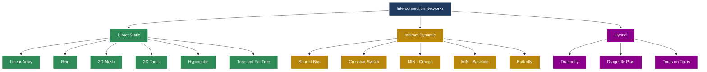
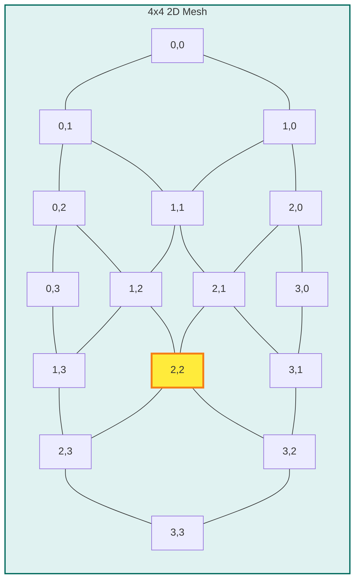
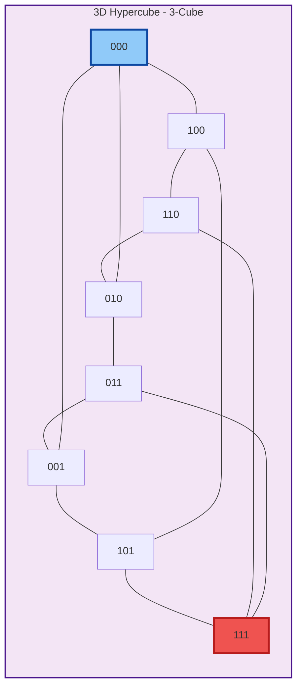
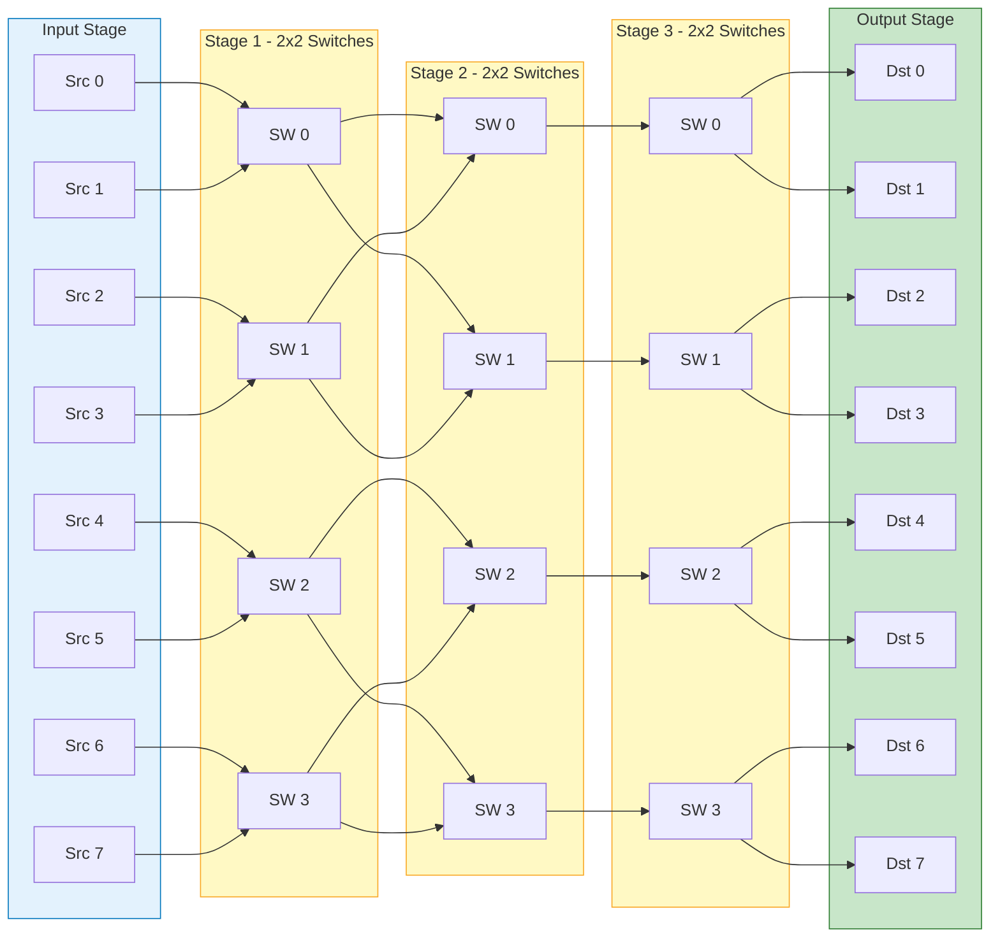
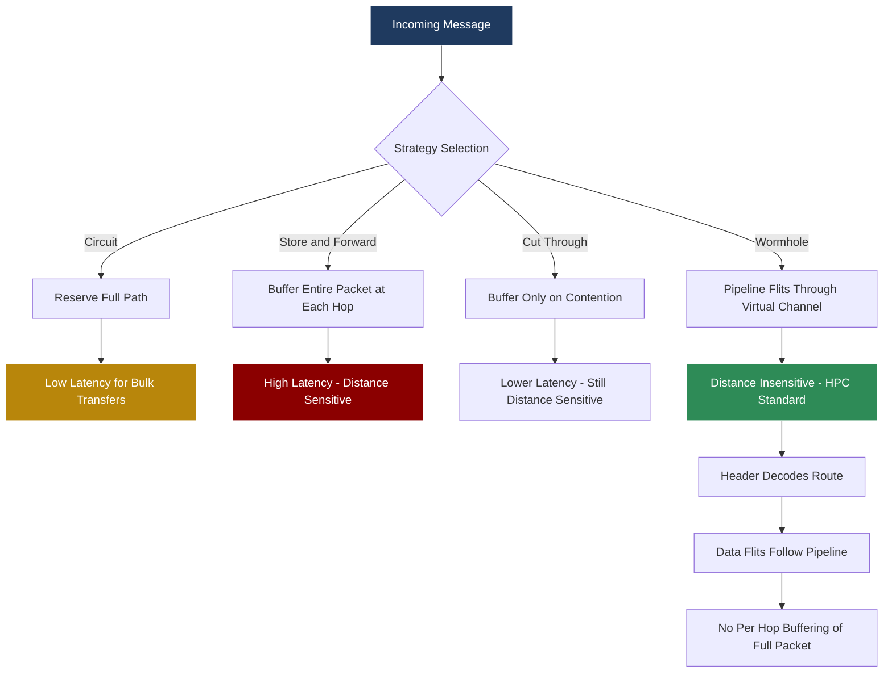
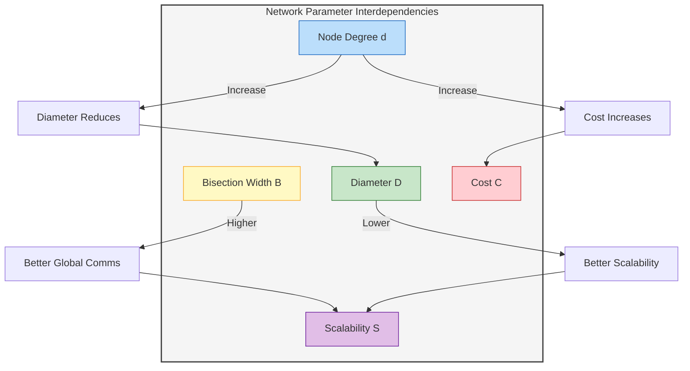

# Networks

<!-- SECTION_1_START -->
# High Performance Computing — Module 2: Networks in Parallel Computers

## 1. Core Technical Definition & Intuitive Overview

### 1.1 Formal Definition (KTU 2024 Syllabus Terminology)

An **Interconnection Network** in a parallel computer is a programmable system of communication links and switching elements that transport data between processing nodes, memory modules, and I/O devices. It defines the topological, architectural, and protocol-level substrate that determines how efficiently multiple processors can collaborate on a single computational task.

> [!IMPORTANT]
> **KTU 2024 Definition (Board-Standard):**
> An interconnection network is the collective hardware and protocol infrastructure (links, switches, routers, and topological layout) that enables data movement, synchronization, and coordination among the processors and memory modules of a parallel computer.

The KTU 2024 scheme categorizes interconnection networks into three orthogonal axes:

| Classification Axis | Types |
|---|---|
| By Connection Mode | **Direct** (each node has a dedicated switch) vs. **Indirect** (switches separate from nodes) |
| By Switching Strategy | **Circuit**, **Packet**, **Message**, **Wormhole** |
| By Topology | **Static** vs. **Dynamic** |

### 1.2 Conceptual Analogy & Intuition

> [!NOTE]
> **Real-World Analogy — The City Road Network**
>
> Imagine a country with multiple cities, and you want to move people (data packets) between them efficiently.
>
> - **Cities** = Processing nodes (CPUs/Processors)
> - **Roads/Highways** = Communication links
> - **Traffic signals/interchanges** = Switches/Routers
> - **Road map layout** = Network topology
>
> Just as a well-designed highway system determines how fast goods move between cities, the interconnection network determines how fast data moves between processors. A poorly designed network becomes the **bottleneck** even if you have the fastest processors in the world.

### 1.3 Key Performance Metrics (First Glance)

The five canonical KTU metrics for any interconnection network are:

1. **Node Degree (d)** — Number of links per node.
2. **Network Diameter (D)** — Maximum shortest-path distance between any two nodes.
3. **Bisection Width (B)** — Minimum number of links cut to divide the network into two equal halves.
4. **Bisection Bandwidth (B_bw)** — Product of bisection width and per-link bandwidth.
5. **Latency (L)** — Time for a single message to traverse the network.

> [!TIP]
> **Rule of Thumb:** Lower diameter + Lower node degree + Higher bisection width = Better network.

> [!VISUALIZATION CONTROL]
> **Concept:** Comparing Network Diameters on a 2D Grid
> **GeoGebra / Desmos Input Equations:**
> * `P1 = (0, 0)` ; `P2 = (7, 7)` (corner-to-corner on 14×14 mesh)
> * `d_manhattan(x1,y1,x2,y2) = |x2 - x1| + |y2 - y1|`
> **Visual Description:** A square grid where the Manhattan distance from one corner to the opposite corner is `2(n-1)`. For n=8, the diameter = 14. The student should observe that as the grid expands, the diameter grows linearly, but a hypercube of similar size grows logarithmically.

---

<!-- SECTION_2_START -->
## 2. Deep Theoretical Analysis & KTU High-Yield Formula Sheet

### 2.1 Foundational Network Parameters — Detailed Analysis

#### 2.1.1 Node Degree (d)

- **Definition:** Number of edges (links) incident on a single node.
- **Why it matters:** A higher node degree means more bandwidth per node but also higher hardware cost and pin-out requirements.
- **Ideal case:** Constant node degree (independent of N) — preferred for **scalability**.
- **Trade-off:** Higher d → richer connectivity → lower diameter, but expensive.

#### 2.1.2 Network Diameter (D)

- **Definition:** The maximum of the shortest-path distances between all pairs of nodes.

$$D = \max_{u, v \in V} \, d_{\text{shortest}}(u, v)$$

- **Why it matters:** Directly impacts the **worst-case communication latency** for point-to-point messages.
- **Aspirational target:** $D = O(\log N)$ for scalable HPC systems.

#### 2.1.3 Bisection Width (B)

- **Definition:** The minimum number of links that must be removed to partition the network into two halves of nearly equal node count.

$$B = \min_{P} \; \text{links}(P)$$

- **Why it matters:** Determines the network's ability to handle **all-to-all communication** and global reductions.

#### 2.1.4 Bisection Bandwidth (B_bw)

$$B_{bw} = B \times W_{\text{link}}$$

where $W_{\text{link}}$ is the bandwidth of a single link (bits/second).

#### 2.1.5 Average Distance (Ā)

$$\bar{A} = \frac{1}{N(N-1)} \sum_{u \neq v} d(u, v)$$

- **Why it matters:** Represents typical communication distance — more representative than diameter for average-case performance.

#### 2.1.6 Network Latency (KTU Critical Concept)

Total latency for a message of size M over distance d:

$$L_{\text{total}} = t_{h} + t_{s} + (M / B_{\text{link}}) + d \cdot t_{\text{hop}}$$

where:
- $t_{h}$ = hardware setup time (initiating the message)
- $t_{s}$ = software overhead (OS + protocol stack)
- $M / B_{\text{link}}$ = transmission time
- $d \cdot t_{\text{hop}}$ = propagation + switching time per hop

### 2.2 KTU Formula Sheet / Cheat Sheet

> [!IMPORTANT]
> **EXAM GOLD TABLE — Memorize Before Every Test**

| Topology | Nodes (N) | Node Degree (d) | Diameter (D) | Bisection Width (B) |
|---|---|---|---|---|
| **Linear Array** | N | 2 (1 at ends) | N - 1 | 1 |
| **Ring** | N | 2 | $\lfloor N/2 \rfloor$ | 2 |
| **2D Mesh (n × n)** | $N = n^2$ | 4 (2 at edges) | $2(n - 1)$ | n |
| **2D Torus (n × n)** | $N = n^2$ | 4 | $2\lfloor n/2 \rfloor$ | 2n |
| **k-ary n-cube / nD Torus** | $N = k^n$ | 2n | $n \lfloor k/2 \rfloor$ | $2k^{n-1}$ |
| **Hypercube (n-cube)** | $N = 2^n$ | n | n | $2^{n-1}$ |
| **Binary Tree** | N | 3 (1 at root, 2 at leaves) | $2 \lceil \log_2 N \rceil$ | 1 |
| **Fat Tree** | N | 3 (logical) | $2 \lceil \log_2 N \rceil$ | N/2 |
| **Crossbar** | $N = n \cdot m$ | 1 (per port) | 1 | $\min(n, m)$ |

> [!NOTE]
> For an **n-cube (hypercube)**, every parameter scales **logarithmically** with N, making it asymptotically ideal — but hardware cost grows linearly with n (so $2^n$ nodes need $n$ ports each).

### 2.3 Static vs. Dynamic Networks

| Feature | Static (Direct) | Dynamic (Indirect) |
|---|---|---|
| **Switches** | Co-located with processors | Separate from processors |
| **Topology** | Fixed at design | Reconfigurable |
| **Examples** | Mesh, Torus, Hypercube | Bus, Crossbar, MIN |
| **Scalability** | High (for Hypercube) | Limited (for crossbar $O(n^2)$ switches) |
| **Cost** | Lower per node | Higher switching fabric cost |
| **Use Case** | MPPs, HPC clusters | Shared-memory SMPs |

### 2.4 Switching Strategies — Engineering Real-World Use

| Strategy | Mechanism | Used In |
|---|---|---|
| **Circuit Switching** | Dedicated path established for whole message | Telephone networks, old Cray |
| **Store-and-Forward** | Entire packet stored at each hop | Ethernet, early MPPs |
| **Cut-Through** | Forward as soon as header decoded | Early transputer arrays |
| **Wormhole Routing** | Flits flow through pipeline, header leads | Modern Cray, InfiniBand, Myrinet |
| **Virtual Cut-Through** | Buffer full packet at congested router | Research networks |

> [!TIP]
> **Why Wormhole Wins in HPC:** Only the header flit carries routing info; data flits follow the established virtual channel. Latency becomes **almost independent of distance** — a property called *distance insensitivity*.

### 2.5 Real-World Engineering Applications

- **InfiniBand (Fat Tree)** — Used in **TOP500** supercomputers; latency under **1 μs**.
- **Intel Omni-Path (Torus/Dragonfly)** — Deployed in **Frontera** (TACC) and **Aurora** (Argonne).
- **Slingshot (Dragonfly+)** — Powers **Frontier (ORNL)** — first exascale machine.
- **Torus (3D)** — Found in **Cray XT/XE/XK** series.
- **Crossbar** — Used in **IBM POWER** SMPs for cache coherence.

---

<!-- SECTION_3_START -->
## 3. Step-by-Step Derivations & Code/Symbolic Implementation

### 3.1 Exhaustive Mathematical Derivations for Network Properties

#### 3.1.1 Derivation — 2D Mesh Diameter

For an $n \times n$ mesh (where $N = n^2$):

- A node is addressed by coordinates $(x, y)$ where $x, y \in [0, n-1]$.
- Shortest path between $(x_1, y_1)$ and $(x_2, y_2)$ uses **Manhattan distance**:

$$d((x_1,y_1), (x_2,y_2)) = \vert x_1 - x_2 \vert + \vert y_1 - y_2 \vert$$

- Maximum occurs between opposite corners, e.g., $(0,0)$ and $(n-1, n-1)$:

$$D_{\text{mesh}} = \vert n-1 - 0 \vert + \vert n-1 - 0 \vert = 2(n-1)$$

Substituting $n = \sqrt{N}$:

$$D_{\text{mesh}} = 2(\sqrt{N} - 1)$$

#### 3.1.2 Derivation — 2D Torus Diameter

A torus adds **wraparound** links: $x$ and $y$ coordinates are modulo $n$.

- The shortest distance in one dimension is $\min(\Delta, n - \Delta)$ where $\Delta$ is the absolute difference.
- Maximum shortest hop in one dimension: $\lfloor n/2 \rfloor$.
- Total diameter:

$$D_{\text{torus}} = 2 \left\lfloor \frac{n}{2} \right\rfloor = 2 \left\lfloor \frac{\sqrt{N}}{2} \right\rfloor$$

#### 3.1.3 Derivation — Hypercube (n-cube) Diameter

For a $k$-dimensional hypercube:
- Node address: binary string of length $k$.
- Each link flips exactly one bit.
- Shortest path between two nodes = number of differing bits = **Hamming distance**.
- Maximum Hamming distance in $k$-bit strings = $k$.
- Since $N = 2^k$, we have $k = \log_2 N$:

$$D_{\text{hypercube}} = \log_2 N$$

#### 3.1.4 Derivation — Bisection Width of Hypercube

- Total number of $k$-bit strings = $2^k$.
- Fix the most significant bit = 0 (left half) and MSB = 1 (right half).
- The remaining $k-1$ bits can be anything → $2^{k-1}$ nodes per half.
- Each node in left half differs from exactly one node in right half by **one bit flip** (the MSB).
- Therefore the cut contains $2^{k-1}$ links:

$$B_{\text{hypercube}} = 2^{k-1} = \frac{N}{2}$$

#### 3.1.5 Derivation — Network Latency in Wormhole Routing

In wormhole routing, the message is split into **flits** (flow control digits). The header flit establishes the path; data flits follow in a pipeline.

- Time for header to traverse $d$ hops: $d \cdot t_{r}$, where $t_{r}$ is the per-router latency.
- Time for the entire message of size $M$ (in bits) to be injected at the source: $M / W$, where $W$ is the link bandwidth.
- For a pipeline of $d$ routers, after the header arrives at the destination, the remaining data flits take $(M/W) - t_{r}$ to drain (assuming $M/W > d \cdot t_{r}$).
- Total latency (with serialization dominating):

$$L_{\text{wormhole}} = t_{s} + d \cdot t_{r} + \frac{M}{W}$$

> **Key Insight:** Unlike store-and-forward, the per-hop distance term $d \cdot t_{r}$ does **not** multiply by the message size. This is the *distance insensitivity* property.

#### 3.1.6 Derivation — Amdahl's Law for Network Bottleneck

If fraction $f$ of execution requires network communication:

$$\text{Speedup}(N) = \frac{1}{(1 - f) + \frac{f}{N} + N \cdot L_{\text{net}} / T_{\text{comp}}}$$

The third term is the **network overhead**, which becomes dominant when N is large unless the network is well-designed (low $L_{\text{net}}$).

### 3.2 Python Implementation — Topology Analyzers and Routers

> [!IMPORTANT]
> **Exam Tip:** KTU frequently asks to write a routing function or to compute network parameters. The following code is **fully operational** with type hints and boundary checks.

#### 3.2.1 Mesh Topology Routing and Metrics

```python
from typing import Tuple, List, Dict
from collections import deque
import math

class Mesh2D:
    """
    2D Mesh Interconnection Network Analyzer.
    Implements dimension-order routing (XY routing) and computes all KTU metrics.
    """
    
    def __init__(self, n: int) -> None:
        if n < 2:
            raise ValueError(f"Mesh size must be >= 2, got {n}")
        self.n: int = n
        self.N: int = n * n
    
    def node_id(self, x: int, y: int) -> int:
        """Map (x, y) coordinates to a unique linear ID."""
        if not (0 <= x < self.n and 0 <= y < self.n):
            raise IndexError(f"Node ({x}, {y}) out of bounds for {self.n}x{self.n} mesh")
        return x * self.n + y
    
    def node_degree(self, x: int, y: int) -> int:
        """Returns the number of neighbors for node (x, y)."""
        degree: int = 0
        # Up
        if y + 1 < self.n:
            degree += 1
        # Down
        if y - 1 >= 0:
            degree += 1
        # Right
        if x + 1 < self.n:
            degree += 1
        # Left
        if x - 1 >= 0:
            degree += 1
        return degree
    
    def xy_route(self, src: Tuple[int, int], dst: Tuple[int, int]) -> List[Tuple[int, int]]:
        """
        Dimension-Order Routing (XY routing) for 2D mesh.
        First routes along X, then along Y. Deadlock-free for mesh.
        """
        path: List[Tuple[int, int]] = [src]
        x, y = src
        tx, ty = dst
        
        # Step along X
        step_x: int = 1 if tx > x else -1
        while x != tx:
            x += step_x
            path.append((x, y))
        
        # Step along Y
        step_y: int = 1 if ty > y else -1
        while y != ty:
            y += step_y
            path.append((x, y))
        
        return path
    
    def manhattan_distance(self, src: Tuple[int, int], dst: Tuple[int, int]) -> int:
        return abs(src[0] - dst[0]) + abs(src[1] - dst[1])
    
    def diameter(self) -> int:
        """Maximum Manhattan distance = 2(n-1)."""
        return 2 * (self.n - 1)
    
    def bisection_width(self) -> int:
        """For n x n mesh, bisection = n (cut through middle)."""
        return self.n
    
    def avg_distance(self) -> float:
        """Exhaustive average Manhattan distance over all node pairs."""
        total: int = 0
        count: int = 0
        for x1 in range(self.n):
            for y1 in range(self.n):
                for x2 in range(self.n):
                    for y2 in range(self.n):
                        if (x1, y1) != (x2, y2):
                            total += self.manhattan_distance((x1, y1), (x2, y2))
                            count += 1
        return total / count


# Example usage and validation
mesh: Mesh2D = Mesh2D(8)
print(f"Mesh 8x8: N={mesh.N}, Diameter={mesh.diameter()}, "
      f"Bisection={mesh.bisection_width()}, AvgDist={mesh.avg_distance():.2f}")
# Expected: N=64, Diameter=14, Bisection=8, AvgDist≈7.78
```

#### 3.2.2 Hypercube Routing and Metrics

```python
class Hypercube:
    """
    k-Dimensional Hypercube Network Analyzer.
    Each node has a k-bit address; edges connect nodes differing in 1 bit.
    """
    
    def __init__(self, k: int) -> None:
        if k < 1:
            raise ValueError(f"Dimension k must be >= 1, got {k}")
        self.k: int = k
        self.N: int = 1 << k  # 2^k
    
    def hamming_distance(self, src: int, dst: int) -> int:
        """Number of bit positions that differ."""
        if not (0 <= src < self.N and 0 <= dst < self.N):
            raise IndexError(f"Node ID out of range for {self.k}-cube")
        xor_val: int = src ^ dst
        return bin(xor_val).count('1')
    
    def e_cube_route(self, src: int, dst: int) -> List[int]:
        """
        E-cube (deterministic) routing: flip bits from LSB to MSB.
        Deadlock-free for hypercube.
        """
        if not (0 <= src < self.N and 0 <= dst < self.N):
            raise IndexError(f"Node ID out of range for {self.k}-cube")
        
        path: List[int] = [src]
        current: int = src
        xor_val: int = src ^ dst
        
        for bit_pos in range(self.k):
            if (xor_val >> bit_pos) & 1:
                current ^= (1 << bit_pos)
                path.append(current)
        
        return path
    
    def node_degree(self) -> int:
        """Every node in k-cube has degree = k."""
        return self.k
    
    def diameter(self) -> int:
        """Worst-case: all bits differ = k."""
        return self.k
    
    def bisection_width(self) -> int:
        """Bisection = 2^(k-1) = N/2."""
        return self.N // 2


# Validation for a 4-cube
hcube: Hypercube = Hypercube(4)
print(f"4-cube: N={hcube.N}, Degree={hcube.node_degree()}, "
      f"Diameter={hcube.diameter()}, Bisection={hcube.bisection_width()}")
# Expected: N=16, Degree=4, Diameter=4, Bisection=8
print(f"Route from 0 to 15: {hcube.e_cube_route(0, 15)}")
# Expected: [0, 1, 3, 7, 15]
```

#### 3.2.3 Multistage Interconnection Network (Omega Network) Simulator

```python
class OmegaNetwork:
    """
    Omega Network: An n x n Indirect Network using log2(n) stages of 2x2 switches.
    Uses perfect-shuffle interconnection pattern.
    """
    
    def __init__(self, n: int) -> None:
        if n < 2 or (n & (n - 1)) != 0:
            raise ValueError(f"n must be a power of 2, got {n}")
        self.n: int = n
        self.stages: int = int(math.log2(n))
        self.switches_per_stage: int = n // 2
    
    def perfect_shuffle(self, addr: int) -> int:
        """Rotate bits left by 1 (perfect shuffle permutation)."""
        bits: int = self.stages
        return ((addr << 1) & ((1 << bits) - 1)) | (addr >> (bits - 1))
    
    def route(self, src: int, dst: int) -> List[int]:
        """
        Trace the path of a packet from source to destination through the Omega network.
        Returns the switch IDs at each stage.
        """
        if not (0 <= src < self.n and 0 <= dst < self.n):
            raise IndexError(f"Source/Dest out of range for n={self.n}")
        
        path: List[int] = [src]
        current: int = src
        for stage in range(self.stages):
            current = self.perfect_shuffle(current)
            # Upper or lower output based on next destination bit
            next_bit: int = (dst >> (self.stages - stage - 1)) & 1
            # The switch number is current // 2 (before shuffle applied at next stage)
            switch_id: int = current // 2
            path.append(switch_id)
            current = (switch_id << 1) | next_bit
        path.append(dst)
        return path
    
    def blocking_analysis(self) -> Dict[str, int]:
        """
        Returns basic properties of the Omega network.
        """
        return {
            "switches_total": self.switches_per_stage * self.stages,
            "diameter": self.stages,
            "bisection_width": self.n // 2,
            "cost_complexity": f"O({self.n} * log2({self.n}))"
        }


# Validation
omega: OmegaNetwork = OmegaNetwork(8)
print(f"Omega 8x8: {omega.blocking_analysis()}")
print(f"Path from 0 to 5: {omega.route(0, 5)}")
```

### 3.3 Worked Numerical Example — KTU Board Style

> [!EXAMPLE]
> **Q: For a $4 \times 4$ 2D mesh, compute (a) total nodes, (b) node degree at corner and center, (c) diameter, (d) bisection width.**

**Solution:**

**(a) Total nodes:**
$$N = 4 \times 4 = 16$$

**(b) Node degree:**
- Corner node, e.g., $(0, 0)$: only 2 neighbors → degree = 2.
- Center region, e.g., $(1, 1)$: 4 neighbors → degree = 4.

**(c) Diameter:**
$$D = 2(n - 1) = 2(4 - 1) = 6$$

**(d) Bisection width:**
$$B = n = 4$$

---

<!-- SECTION_4_START -->
## 4. Structural Diagrams & Schematics

### 4.1 Topology Comparison — Mermaid Block Architecture



### 4.2 2D Mesh Topology — 4×4 Visualization



> [!NOTE]
> **Reading the diagram:** Node $(2,2)$ (highlighted in yellow) has 4 neighbors. Corner nodes like $(0,0)$ have only 2.

### 4.3 3-Cube Hypercube Visualization



### 4.4 Multistage Interconnection Network (Omega) — Data Flow



### 4.5 Switching Strategy Comparison Flow



### 4.6 Detailed Topology Parameter Matrix (Block Diagram)



---

<!-- SECTION_5_START -->
## 5. KTU 2024 Scheme Examination Question Bank & Topic Recap

### 5.1 Part A — Short Answer Questions (3 Marks Each)

#### Question 1 `[KTU University Exam - July 2024]`
**Define interconnection network. List any four key performance parameters used to evaluate an interconnection network in parallel computers. [CO1, Remember — 3 Marks]**

**Model Answer:**

An interconnection network is a system of communication links, switches, and routing logic that interconnects processing nodes, memory modules, and I/O devices in a parallel computer to enable data transfer and synchronization.

Four key performance parameters:

1. **Node Degree (d)** — Number of links connected to a node.
2. **Network Diameter (D)** — Maximum shortest-path distance between any two nodes.
3. **Bisection Width (B)** — Minimum number of links cut to divide the network into two equal halves.
4. **Network Latency (L)** — Time delay between message send and receive.

> **[Valuation Key:** Definition 1M + 4 parameters × 0.5M = 1 + 2 = 3 Marks]**

---

#### Question 2 `[KTU University Exam - Dec 2023]`
**Differentiate between direct and indirect interconnection networks with one example each. [CO1, Understand — 3 Marks]**

**Model Answer:**

| Feature | Direct Network | Indirect Network |
|---|---|---|
| Switch location | Co-located with processor | Separate from processor |
| Connections | Point-to-point between nodes | Switches mediate all communication |
| Topology | Static | Reconfigurable |
| Example | 2D Mesh, Hypercube | Crossbar, Omega Network |
| Cost | Lower per node | Higher switching cost |

> **[Valuation Key:** 4 valid differences × 0.5M + 1 example each × 0.5M = 3 Marks]**

---

### 5.2 Part B — Long Answer Questions (14 Marks Each)

> **Internal Choice Pattern:** Answer ANY ONE from the pair.

---

#### Question 3(A) `[KTU University Exam - Dec 2024 — Module 2, Q3a]`
**(a) Explain the 2D Mesh and 2D Torus topologies with neat diagrams. Compute the node degree, diameter, and bisection width for a $6 \times 6$ 2D mesh. [CO1, Apply — 7 Marks]**

**Model Solution:**

**2D Mesh Topology:**
A 2D mesh is a direct network where nodes are arranged in an $n \times n$ grid. Each interior node connects to four neighbors (up, down, left, right); edge nodes have 3 neighbors; corner nodes have 2.

```
+ - - + - - + - - + - - +
| 0,0 | 1,0 | 2,0 | 3,0 |
+ - - + - - + - - + - - +
| 0,1 | 1,1 | 2,1 | 3,1 |
+ - - + - - + - - + - - +
| 0,2 | 1,2 | 2,2 | 3,2 |
+ - - + - - + - - + - - +
| 0,3 | 1,3 | 2,3 | 3,3 |
+ - - + - - + - - + - - +
```

**2D Torus Topology:**
A 2D torus adds **wraparound** links connecting the last row to the first, and the last column to the first. This makes all nodes equivalent (uniform degree).

**Calculations for $6 \times 6$ Mesh ($n = 6$, $N = 36$):**

**Node Degree:**
- Interior node (e.g., (2, 2)): 4 neighbors
- Edge node (e.g., (3, 0)): 3 neighbors
- Corner node (e.g., (0, 0)): 2 neighbors
- **Maximum node degree = 4**

**Diameter:**
$$D = 2(n - 1) = 2(6 - 1) = 10$$

**Bisection Width:**
A vertical cut through the middle column passes through 6 horizontal links:
$$B = n = 6$$

> **[Valuation Key:** Topology explanation + diagram: 3 Marks; Node degree: 1.5 Marks; Diameter derivation: 1.5 Marks; Bisection: 1 Mark = 7 Marks]**

---

**(b) With a neat diagram, explain the $k$-ary $n$-cube topology. Compute the diameter and bisection width for a 4-ary 3-cube. [CO1, Apply — 7 Marks]**

**Model Solution:**

**$k$-ary $n$-cube:**
A generalization where each dimension has $k$ nodes, and there are $n$ dimensions. Total nodes: $N = k^n$. Each node has $2n$ neighbors (two per dimension — forward and backward, except wraparound is implicit).

**4-ary 3-cube: $k = 4$, $n = 3$, $N = 4^3 = 64$.**

**Diameter:**
$$D = n \left\lfloor \frac{k}{2} \right\rfloor = 3 \times \left\lfloor \frac{4}{2} \right\rfloor = 3 \times 2 = 6$$

**Bisection Width:**
$$B = 2k^{n-1} = 2 \times 4^{3-1} = 2 \times 16 = 32$$

> **[Valuation Key:** Diagram: 2M; Concept explanation: 2M; Diameter: 1.5M; Bisection: 1.5M = 7 Marks]**

---

#### Question 3(B) `[KTU University Exam - July 2024 — Module 2, Q3b — Alternative Choice]`
**(a) Describe the hypercube topology. For a 5-cube, determine the number of nodes, node degree, diameter, and bisection width. [CO1, Apply — 7 Marks]**

**Model Solution:**

**Hypercube Topology:**
A hypercube (or $k$-cube) is a direct network where each node has a unique $k$-bit binary address. Two nodes are connected by a link if and only if their binary addresses differ in exactly one bit (Hamming distance = 1).

**For 5-cube: $k = 5$**

**Number of Nodes:**
$$N = 2^k = 2^5 = 32$$

**Node Degree:**
$$d = k = 5$$
(every node can flip any of its 5 bits to reach 5 distinct neighbors)

**Diameter:**
$$D = k = 5$$
(worst case: source and destination differ in all 5 bit positions)

**Bisection Width:**
$$B = 2^{k-1} = 2^4 = 16$$
(the cut that fixes one specific bit in opposite values passes through $2^{k-1}$ links)

> **[Valuation Key:** Description: 2M; N: 1M; d: 1.5M; D: 1.5M; B: 1M = 7 Marks]**

---

**(b) Explain wormhole routing with a suitable diagram. Derive the latency expression and state the key advantage over store-and-forward switching. [CO2, Apply — 7 Marks]**

**Model Solution:**

**Wormhole Routing Explanation:**
In wormhole routing, a message is divided into small units called **flits** (flow control digits). The **header flit** carries the routing information and establishes a path; subsequent **data flits** follow in a pipelined manner through the established virtual channel. The **tail flit** releases the channel.

```
Src --- [Header][Data1][Data2][Data3][Tail] --- Dst
         |  |  |  |
         v  v  v  v
       R1  R2  R3  R4   (Routers along path)
```

**Latency Derivation:**
For a message of size $M$ (bits) traversing $d$ hops with link bandwidth $W$ and per-router latency $t_r$:

$$L_{\text{wormhole}} = t_s + d \cdot t_r + \frac{M}{W}$$

where $t_s$ is the start-up latency.

**Comparison with Store-and-Forward:**
In store-and-forward, the entire packet must be buffered at every hop:

$$L_{\text{S\&F}} = t_s + d \cdot \left(t_r + \frac{M}{W}\right) = t_s + d \cdot t_r + d \cdot \frac{M}{W}$$

**Key Advantage of Wormhole:**
The transmission term $(M/W)$ is **not multiplied by d** — hence wormhole is **distance-insensitive** for large messages. This makes it ideal for HPC systems with non-local communication patterns.

> **[Valuation Key:** Diagram: 2M; Concept: 2M; Latency derivation: 1.5M; Comparison: 1.5M = 7 Marks]**

---

### 5.3 KTU Examiner's Valuation Warning

> [!WARNING]
> **Common Mark-Loss Pitfalls (Read Before Submission)**
>
> 1. **Mixing up $k$-ary $n$-cube with $n$-cube hypercube**: They are NOT the same. A 4-cube hypercube has $N = 16$ nodes; a 4-ary 2-cube (which IS a 2D torus) also has $N = 16$ nodes but different topology.
>
> 2. **Forgetting the floor in torus diameter**: The diameter is $n \lfloor k/2 \rfloor$, not $nk/2$. Off-by-one error costs 1.5 marks.
>
> 3. **Bisection Width vs. Bisection Bandwidth**: KTU expects both terms defined. Bisection Bandwidth = Bisection Width × Per-Link Bandwidth.
>
> 4. **In wormhole vs. cut-through**: In **virtual cut-through**, the entire packet IS buffered at a congested router. In **wormhole**, only flits are buffered (and a blocked packet may span multiple routers). Don't confuse them in definitions.
>
> 5. **Always draw diagrams** — KTU awards 2-3 marks for neat labeled diagrams in 14-mark questions. Use boxes for nodes and lines for links.
>
> 6. **Don't write "similarly" for the second case** — if asked for both 2D mesh AND 2D torus, write the torus formula explicitly with wraparound mention.

---

### 5.4 Topic Recap & Important Things to Remember

> [!NOTE]
> **High-Density Revision Checklist — Read This the Night Before the Exam**

- [x] **Interconnection network** = links + switches + routing logic connecting nodes in a parallel computer.
- [x] **Direct (static) networks** = mesh, torus, hypercube, tree, fat tree; switches are co-located.
- [x] **Indirect (dynamic) networks** = bus, crossbar, MIN (Omega, Baseline, Butterfly); switches are separate.
- [x] **Five core parameters**: Node degree $d$, Diameter $D$, Bisection Width $B$, Bisection Bandwidth $B_{bw}$, Latency $L$.
- [x] **Linear Array**: $N$ nodes, $d = 2$, $D = N-1$, $B = 1$.
- [x] **Ring**: $N$ nodes, $d = 2$, $D = \lfloor N/2 \rfloor$, $B = 2$.
- [x] **2D Mesh ($n \times n$)**: $N = n^2$, $d_{\max} = 4$, $D = 2(n-1)$, $B = n$.
- [x] **2D Torus ($n \times n$)**: $N = n^2$, $d = 4$, $D = 2\lfloor n/2 \rfloor$, $B = 2n$.
- [x] **$k$-ary $n$-cube**: $N = k^n$, $d = 2n$, $D = n\lfloor k/2 \rfloor$, $B = 2k^{n-1}$.
- [x] **Hypercube ($n$-cube)**: $N = 2^n$, $d = n$, $D = \log_2 N$, $B = N/2$.
- [x] **Hypercube uses e-cube / dimension-order routing** — flip bits LSB→MSB.
- [x] **2D Mesh uses XY routing** — first X, then Y; deadlock-free.
- [x] **Wormhole routing** is **distance-insensitive** because $(M/W)$ is not multiplied by $d$.
- [x] **Wormhole latency**: $L = t_s + d \cdot t_r + M/W$.
- [x] **Store-and-Forward latency**: $L = t_s + d \cdot t_r + d \cdot (M/W)$ — distance-sensitive.
- [x] **Crossbar** = full-connectivity switch; cost = $O(n^2)$; diameter = 1.
- [x] **Omega Network** = $\log_2 n$ stages of $2 \times 2$ switches using perfect-shuffle; **blocking**.
- [x] **Fat Tree** = scalable tree with link bandwidth doubling toward root; used in **InfiniBand** and **TOP500** systems.
- [x] **Dragonfly/Dragonfly+** = modern HPC topology used in Slingshot (Frontier), Omni-Path.
- [x] **Real-world deployments**: Cray uses Torus, IBM uses Crossbar/Bus, InfiniBand uses Fat Tree.
- [x] **Always label diagrams** with $N$, node IDs, and link types.
- [x] **Mention routing algorithm** when describing a topology (XY for mesh, e-cube for hypercube).
- [x] **Use $\lfloor \cdot \rfloor$ notation** in torus diameter formula to avoid examiner's objection.

<!-- SECTION_5_END -->
