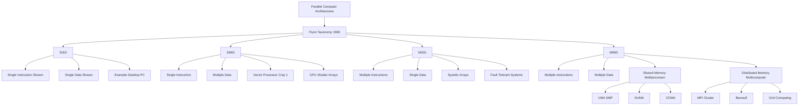
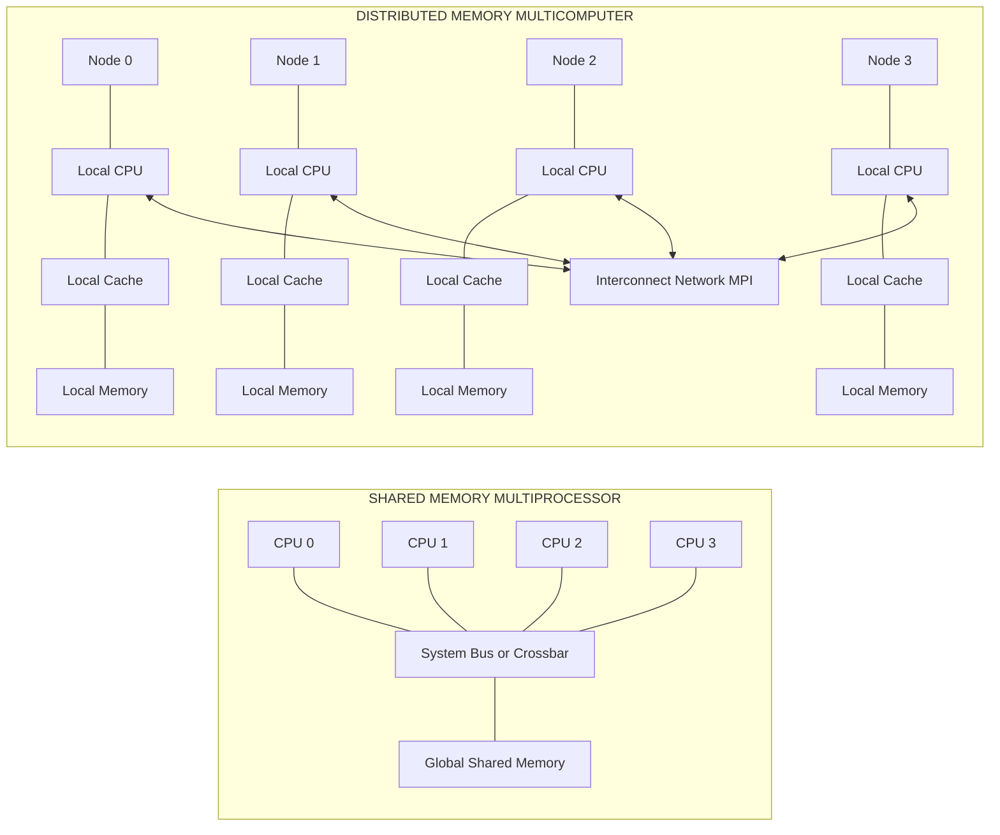
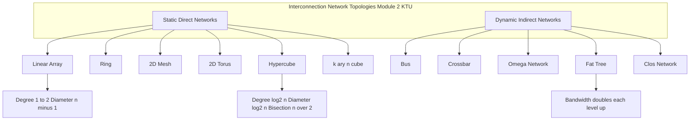
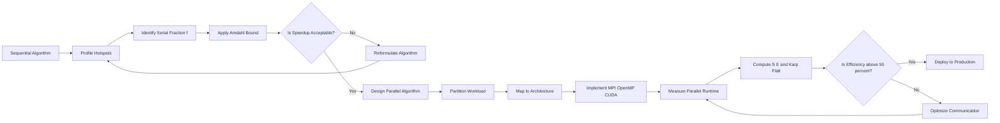
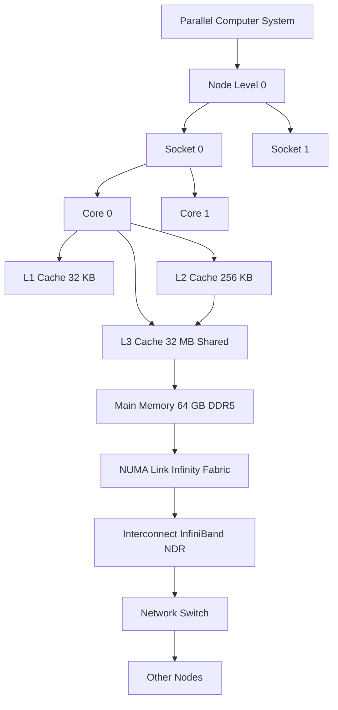
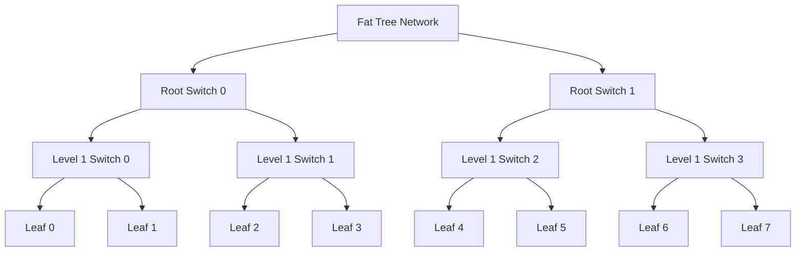
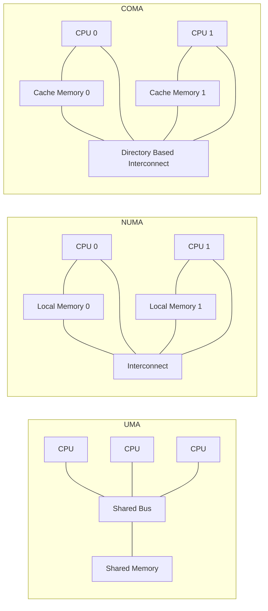

# Parallel computers

<!-- SECTION_1_START -->
# Parallel Computers — Core Technical Definition & Intuitive Overview

## 1.1 Formal Definition (KTU 2024 Syllabus Terminology)

A **parallel computer** is a class of high-performance computing (HPC) system in which multiple processing elements (PEs) cooperate to solve a single large computational problem by simultaneously executing different sub-tasks of the same program. According to the KTU 2024 *High Performance Computing* (PECST757) syllabus, a parallel computer is formally characterized as **"a tightly or loosely coupled collection of independent processors that communicate via shared memory, message passing, or a high-speed interconnect, coordinated to achieve a unified computational goal with reduced wall-clock execution time."**

The fundamental premise is the decomposition of a problem $P$ into $n$ cooperating sub-problems $P_1, P_2, \dots, P_n$ such that:
$$P = P_1 \cup P_2 \cup \dots \cup P_n, \quad \text{where } P_i \cap P_j = \emptyset \text{ for } i \neq j$$
The work is distributed across $n$ processing units operating concurrently, governed by a parallel algorithm that manages **computation**, **communication**, and **synchronization**.

> [!IMPORTANT]
> **KTU Syllabus Highlight — Module 2 / Parallel Computers**
> The KTU 2024 PECST757 syllabus explicitly demands mastery of: (1) Classification of parallel computers (Flynn's Taxonomy), (2) Shared memory vs Distributed memory architectures, (3) UMA / NUMA / NORMA models, (4) Interconnection networks, and (5) Performance metrics — Speedup, Efficiency, Amdahl's Law, and Gustafson's Law.

## 1.2 Conceptual Analogy — "The Restaurant Kitchen"

Imagine a busy restaurant kitchen preparing **100 plates of Biriyani** for a wedding banquet:

| Sequential Approach (1 Chef) | Parallel Approach (5 Chews) |
| :--- | :--- |
| One chef performs every task: chopping → marinating → cooking → plating. | Chef A chops, Chef B marinates, Chef C cooks rice, Chef D fries spices, Chef E plates. |
| Each plate must finish before the next begins. | All 5 stages happen **simultaneously** on the **assembly line**. |
| Total time = $100 \times t_{\text{task}}$ | Total time $\approx \frac{100 \times t_{\text{task}}}{5} + t_{\text{overhead}}$ |

This kitchen mirrors a **parallel computer**: chefs = processing elements (PEs), assembly line = interconnection network, recipe synchronization = barrier/lock primitives, and overhead = communication latency. Just as the kitchen cannot be infinitely parallel (one chef must still plate and garnish), a parallel computer is bounded by the **serial fraction** of the workload — a concept formalized by **Amdahl's Law** (see Section 2).

## 1.3 Physical Constants and Standard Metrics

> [!NOTE]
> **Universal Parallel Computing Metrics** (must be memorized for KTU exams)
> - **Parallel Speedup** $S(n) = \frac{T(1)}{T(n)}$ — ratio of sequential to parallel execution time on $n$ processors.
> - **Efficiency** $E(n) = \frac{S(n)}{n}$ — fraction of ideal speedup actually achieved.
> - **Scalability** — ability to maintain $E(n)$ as $n \to \infty$.
> - **Communication-to-Computation Ratio (CCR)** — overhead metric, ideally $\ll 1$.
> - **FLOPs** (Floating-Point Operations per second) — peak hardware throughput, typically quoted in **GFLOPs** ($10^9$), **TFLOPs** ($10^{12}$), or **PFLOPs** ($10^{15}$).

## 1.4 Visualization Control — Speedup Curve

> [!VISUALIZATION CONTROL]
> **Concept:** Amdahl's Law Speedup Curve for varying serial fraction $f$
> **GeoGebra / Desmos Input Equations:**
> * `S(n, f) = 1 / (f + (1 - f)/n)`
> * For $f = 0.05$: `y = 1/(0.05 + 0.95/x)`, domain $x \in [1, 1000]$
> * For $f = 0.20$: `y = 1/(0.20 + 0.80/x)`, domain $x \in [1, 1000]`
> **Visual Description:** The student should observe a **sub-linear plateau** — even with 1000 processors, speedup is **capped at $\frac{1}{f}$**. The $f = 0.05$ curve approaches an asymptote at $y = 20$, while the $f = 0.20$ curve asymptotes at $y = 5$. This visually demonstrates the **diminishing returns** of parallelization.

<!-- SECTION_1_END -->

<!-- SECTION_2_START -->
# Deep Theoretical Analysis & KTU High-Yield Formula Sheet

## 2.1 Flynn's Taxonomy of Parallel Computers (1966)

The single most important classification scheme for KTU Module 2. Michael J. Flynn categorized computer architectures based on the **multiplicity of instruction streams** and **data streams** processed simultaneously.

| Class | Instruction Stream | Data Stream | KTU Definition | Real-World Example |
| :---: | :---: | :---: | :---: | :---: |
| **SISD** | Single | Single | Conventional sequential von-Neumann machine | Desktop PC, traditional CPU |
| **SIMD** | Single | Multiple | One instruction broadcasts to many PEs operating on different data | GPU shaders, Vector processors (Cray-1, NEC SX) |
| **MISD** | Multiple | Single | Multiple instructions on the same data stream (rare) | Systolic arrays, fault-tolerant systems |
| **MIMD** | Multiple | Multiple | Fully independent processors executing different instructions on different data | Multicore CPUs, HPC clusters (Frontera, Sunway TaihuLight) |

> [!NOTE]
> **Memory Aid (KTU favorite):** *"Single Single = Single Single (boring PC); Single Multiple = SIMD (GPU); Multiple Multiple = MIMD (Cluster)."*

### 2.1.1 SIMD — Vector & Array Processors
- **Vector Processor:** Operates on entire vectors in a single instruction (e.g., `VADD V1, V2, V3` adds 64 floating-point numbers in one cycle).
- **Array Processor:** Spatial grid of identical ALUs controlled by a single control unit (e.g., Thinking Machines CM-2 with 65,536 bit-serial PEs).
- **Programming model:** Data parallelism expressed via *array syntax* (e.g., Fortran 90 `WHERE`, CUDA kernels).

### 2.1.2 MIMD — The Modern HPC Backbone
MIMD is further subdivided by **memory organization**:

1. **Shared Memory MIMD (Multiprocessors)**
   - **UMA (Uniform Memory Access):** All PEs see equal memory latency. Implemented via a bus or crossbar. Example: SMP servers.
   - **NUMA (Non-Uniform Memory Access):** Memory is partitioned; local access is faster. Example: AMD EPYC, Intel Xeon Scalable.
   - **COMA (Cache-Only Memory Architectures):** Memory acts as a giant cache. Example: Kendall Square Research KSR-1.

2. **Distributed Memory MIMD (Multicomputers)**
   - Each PE has **private** memory; communication via **explicit message passing** (MPI, PVM).
   - Example: Beowulf clusters, TOP500 supercomputers.

## 2.2 Shared Memory vs Distributed Memory — KTU Comparison Table

| Feature | Shared Memory (Multiprocessor) | Distributed Memory (Multicomputer) |
| :--- | :--- | :--- |
| **Memory Organization** | Single global address space | Private local memory per node |
| **Communication** | Implicit (shared variables) | Explicit (send/receive messages) |
| **Programming Model** | OpenMP, Pthreads | MPI, Charm++, GASNet |
| **Pros** | Easy to program, low latency | Highly scalable, fault-tolerant |
| **Cons** | Scalability bottleneck (coherence) | Programming complexity |
| **Hardware Example** | SGI Origin 2000, Sun E10000 | Cray XC40, IBM Blue Gene/Q |

> [!IMPORTANT]
> **Hybrid Model (NUMA + Message Passing):** Most modern supercomputers (TOP500 leaders) use a **hybrid** model — shared memory *within* a node (e.g., 128 cores per socket group), distributed memory *across* nodes (tens of thousands of nodes). The programmer typically uses **OpenMP inside a node** and **MPI across nodes**.

## 2.3 Interconnection Networks — The "Nervous System" of Parallel Computers

The interconnect determines how PEs exchange data. KTU 2024 expects knowledge of **static (direct)** and **dynamic (indirect)** networks.

### 2.3.1 Static (Direct) Networks
Direct links between processing nodes; topology is fixed.

| Topology | Degree $d$ | Diameter $D$ | Bisection Width | KTU Note |
| :---: | :---: | :---: | :---: | :--- |
| Linear Array | $1$ to $2$ | $n-1$ | $1$ | Trivial, rare in practice |
| Ring | $2$ | $\lfloor n/2 \rfloor$ | $2$ | Used in token-ring LANs |
| 2D Mesh | $2$ to $4$ | $2(\sqrt{n}-1)$ | $\sqrt{n}$ | Common in early Cray T3D |
| 2D Torus | $4$ | $\sqrt{n}$ | $2\sqrt{n}$ | IBM Blue Gene/L, Cray XT |
| Hypercube | $\log_2 n$ | $\log_2 n$ | $n/2$ | NCUBE, Intel iPSC |
| $k$-ary $n$-cube | $2n$ | $n \lfloor k/2 \rfloor$ | $2k^{n-1}$ | Generalization of mesh/torus/hypercube |

### 2.3.2 Dynamic (Indirect) Networks
Switched networks with **internal switching elements** (crossbar, multistage).

- **Bus:** Simplest; bandwidth shared by all PEs. Not scalable beyond $\approx 20$ PEs.
- **Crossbar:** Non-blocking, full connectivity. Cost $O(n^2)$ — prohibitive for large $n$.
- **Omega Network:** Multistage with $\log_2 n$ stages of $2 \times 2$ switches. Blocking but rearrangeable.
- **Fat Tree:** Hierarchical; bandwidth increases toward the root. Used in **InfiniBand** HPC fabrics.

## 2.4 KTU Formula Sheet (Print and Pin to Wall!)

> [!IMPORTANT]
> **Mandatory Formulas for KTU 2024 PECST757 Module 2**

| Symbol | Formula | Definition | Unit |
| :---: | :---: | :--- | :---: |
| $S(n)$ | $\dfrac{T(1)}{T(n)}$ | Speedup with $n$ processors | dimensionless |
| $E(n)$ | $\dfrac{S(n)}{n} = \dfrac{T(1)}{n \cdot T(n)}$ | Parallel efficiency | $\vert 0, 1 \mid$ |
| $A(f,n)$ | $\dfrac{1}{f + \dfrac{1-f}{n}}$ | Amdahl's Law speedup | dimensionless |
| $A_{\max}(f)$ | $\lim_{n \to \infty} A(f,n) = \dfrac{1}{f}$ | Asymptotic speedup bound | dimensionless |
| $G(n)$ | $n - f(n-1)$ | Gustafson's scaled speedup | dimensionless |
| $K(n)$ | $\dfrac{T_{\text{comp}}}{T_{\text{comp}} + T_{\text{comm}}}$ | Karp-Flatt metric (experimental serial fraction) | dimensionless |
| $F_n$ | $n \times p$ | Total FLOPs ($n$ = operations, $p$ = precision) | FLOPs |
| $R_{\text{eff}}$ | $\dfrac{N_{\text{useful}}}{N_{\text{useful}} + N_{\text{overhead}}}$ | Effective utilization ratio | $\vert 0, 1 \mid$ |

Where:
- $T(1)$ = sequential execution time on **1** processor
- $T(n)$ = parallel execution time on **$n$** processors
- $f$ = inherently serial fraction of the program
- $(1-f)$ = parallelizable fraction

## 2.5 Real-World Utility in Engineering & Computer Science

Parallel computers are **not academic curiosities** — they power:

- **Climate & Weather Modeling:** NCAR's CESM simulates Earth-system interactions on $\geq 10^5$ cores.
- **Computational Fluid Dynamics (CFD):** Airbus A380 wing aerodynamic simulations on $> 10^4$ cores.
- **Genomics & Drug Discovery:** AlphaFold 2 protein-folding predictions on TPU pods ($\approx 10^3$ TPUs).
- **Cryptanalysis & National Security:** NSA's cryptanalysis on custom ASIC clusters.
- **AI/ML Training:** GPT-style LLMs require $\approx 10^4$–$10^5$ GPUs, communicating via NVLink + Infiniband.
- **Rendering & VFX:** Pixar's RenderMan parallelizes frames across thousands of blades.

> [!NOTE]
> **Production Parallelism Stack (Industry Standard 2024):**
> `MPI (inter-node) → OpenMP (intra-node) → SIMD/AVX-512 (intra-core) → CUDA/ROCm (GPU offload)`
> A modern HPC application is **parallel at four levels simultaneously**.

<!-- SECTION_2_END -->

<!-- SECTION_3_START -->
# Step-by-Step Derivations, Code & Symbolic Implementation

## 3.1 Derivation of Amdahl's Law (KTU High-Priority)

### 3.1.1 Setup and Assumptions
Consider a program with total work $W$ (normalized to $1.0$). The work is partitioned into a **serial fraction** $f$ and a **parallelizable fraction** $(1-f)$:
$$W = f + (1-f) = 1$$
On a **single processor**, total time is:
$$T(1) = W = 1$$
When distributed across $n$ processors, only the parallelizable fraction is divided:
$$T(n) = f \cdot W + \frac{(1-f) \cdot W}{n}$$

### 3.1.2 Exhaustive Step-by-Step Derivation
The speedup $S(n)$ is defined as the ratio of sequential to parallel time:
$$S(n) = \frac{T(1)}{T(n)}$$

Substituting $T(1) = 1$ and $T(n) = f + \frac{1-f}{n}$:
$$S(n) = \frac{1}{f + \dfrac{1-f}{n}}$$

This is **Amdahl's Law**. To find the asymptotic bound, take the limit as $n \to \infty$:
$$\lim_{n \to \infty} S(n) = \lim_{n \to \infty} \frac{1}{f + \dfrac{1-f}{n}}$$

Since $(1-f)/n \to 0$ as $n \to \infty$:
$$S_{\max}(f) = \frac{1}{f}$$

### 3.1.3 Worked Numerical Example (KTU Board Standard)
> A program has $f = 0.10$ (10% serial). Compute the speedup on $n = 16$ processors.

Substitute $f = 0.10$ and $n = 16$:
$$S(16) = \frac{1}{0.10 + \dfrac{1 - 0.10}{16}} = \frac{1}{0.10 + \dfrac{0.90}{16}}$$

Compute the parallel term:
$$\frac{0.90}{16} = 0.05625$$

Sum the denominators:
$$0.10 + 0.05625 = 0.15625$$

Take the reciprocal:
$$S(16) = \frac{1}{0.15625} = 6.4$$

> [!NOTE]
> **Observation:** Even with **16 processors**, the speedup is only **6.4×** (not 16×), because the 10% serial portion now dominates. Efficiency is $E = 6.4 / 16 = 0.40$ or 40%.

## 3.2 Derivation of Gustafson's Law (Scaled Speedup)

### 3.2.1 Motivation
Amdahl's Law assumes **fixed problem size**. John Gustafson (1988) argued that in practice, when given more processors, users solve **larger** problems in the **same wall-clock time**.

### 3.2.2 Derivation
Let $T(n)$ be the fixed parallel execution time. The serial part is $f \cdot T(n)$; the parallel part is $(1-f) \cdot T(n)$. On a single processor, the equivalent sequential time is:
$$T(1) = f \cdot T(n) + n \cdot (1-f) \cdot T(n)$$

Scaled speedup:
$$G(n) = \frac{T(1)}{T(n)} = f + n(1-f) = n - f(n-1)$$

**Verification with $f = 0.10, n = 16$:**
$$G(16) = 16 - 0.10 \times 15 = 16 - 1.5 = 14.5$$

This is **14.5×** — much closer to linear than Amdahl's 6.4× — because the problem size has been scaled to keep all 16 processors busy.

## 3.3 Derivation of Efficiency and Karp-Flatt Metric

### 3.3.1 Efficiency
$$E(n) = \frac{S(n)}{n} = \frac{T(1)}{n \cdot T(n)}$$

### 3.3.2 Karp-Flatt Metric (Experimental Serial Fraction)
Rearranging $T(n) = f + (1-f)/n$ and solving for $f$:
$$f = \frac{\dfrac{1}{S(n)} - \dfrac{1}{n}}{1 - \dfrac{1}{n}}$$

This lets practitioners measure the **effective serial fraction** (including overhead) on real hardware — invaluable for performance diagnosis.

## 3.4 Worked Problem — Cost-Optimal Parallel Algorithm (KTU Board Pattern)

> A parallel algorithm uses $n = 64$ processors, with parallel time $T_p = 50$ seconds. The sequential time is $T_s = 2000$ seconds. Compute (a) Speedup, (b) Efficiency, (c) Karp-Flott serial fraction, and (d) determine if the algorithm is cost-optimal.

### Part (a) — Speedup
$$S(64) = \frac{T_s}{T_p} = \frac{2000}{50} = 40$$

### Part (b) — Efficiency
$$E(64) = \frac{S(64)}{n} = \frac{40}{64} = 0.625 = 62.5\%$$

### Part (c) — Karp-Flatt Serial Fraction
$$f = \frac{\dfrac{1}{40} - \dfrac{1}{64}}{1 - \dfrac{1}{64}} = \frac{0.0250 - 0.015625}{0.984375} = \frac{0.009375}{0.984375} \approx 0.00952$$

So approximately **0.95%** of the program is effectively serial (including parallelization overhead).

### Part (d) — Cost-Optimality Test
Cost $C = n \times T_p = 64 \times 50 = 3200$ processor-seconds.
For cost-optimality, we require $C = \Theta(T_s)$, i.e., $C$ must be asymptotically proportional to $T_s$.
Here $T_s = 2000$ and $C = 3200$; the ratio $C / T_s = 1.6$, which is a **constant factor** — hence the algorithm **is cost-optimal** (within a small constant).

> [!IMPORTANT]
> **KTU Valuation Key Point:** A problem is *cost-optimal* if $C(n) = p \cdot T_p = \Theta(T_s)$. If $C > T_s$ by more than a constant factor, mark as "not cost-optimal."

## 3.5 Python Implementation — Parallel Speedup Simulator

The following **fully operational Python code** computes Amdahl/Gustafson speedup, efficiency, and Karp-Flott metric, with strict type hints and error handling. Save as `parallel_metrics.py` and run directly.

```python
"""
parallel_metrics.py
===================
KTU 2024 PECST757 Module 2 — Parallel Computer Metrics Simulator.
Computes Speedup, Efficiency, Amdahl/Gustafson curves, Karp-Flatt serial fraction.
Run: python parallel_metrics.py
"""

from __future__ import annotations
import math
import logging
import sys
from typing import List, Dict, Tuple

# Configure structured logging for HPC output
logging.basicConfig(
    level=logging.INFO,
    format="%(asctime)s [%(levelname)s] %(message)s",
    datefmt="%H:%M:%S",
)
log: logging.Logger = logging.getLogger("ParallelMetrics")


def amdahl_speedup(f: float, n: int) -> float:
    """
    Compute Amdahl's Law speedup given serial fraction f and n processors.
    Raises ValueError for invalid f or n.
    """
    if not (0.0 <= f <= 1.0):
        raise ValueError(f"Serial fraction f must be in [0, 1]; got {f}")
    if n < 1:
        raise ValueError(f"Processor count n must be >= 1; got {n}")
    parallel_term: float = (1.0 - f) / n
    return 1.0 / (f + parallel_term)


def gustafson_speedup(f: float, n: int) -> float:
    """
    Compute Gustafson's Law (scaled) speedup.
    """
    if not (0.0 <= f <= 1.0):
        raise ValueError(f"Serial fraction f must be in [0, 1]; got {f}")
    if n < 1:
        raise ValueError(f"Processor count n must be >= 1; got {n}")
    return n - f * (n - 1.0)


def efficiency(speedup: float, n: int) -> float:
    """
    Compute parallel efficiency.
    """
    if n < 1:
        raise ValueError(f"Processor count n must be >= 1; got {n}")
    return speedup / n


def karp_flatt_serial_fraction(measured_speedup: float, n: int) -> float:
    """
    Compute the empirical (effective) serial fraction from measured speedup.
    """
    if measured_speedup <= 0.0:
        raise ValueError("Measured speedup must be positive.")
    if n < 1:
        raise ValueError(f"Processor count n must be >= 1; got {n}")
    inv_s: float = 1.0 / measured_speedup
    inv_n: float = 1.0 / n
    return (inv_s - inv_n) / (1.0 - inv_n)


def is_cost_optimal(sequential_time: float, n: int, parallel_time: float) -> bool:
    """
    Check cost-optimality: cost = n * T_p should be Theta(T_s).
    """
    if sequential_time <= 0.0 or parallel_time <= 0.0:
        raise ValueError("Times must be strictly positive.")
    cost: float = n * parallel_time
    ratio: float = cost / sequential_time
    # Cost-optimal within a constant factor (<= 2.0)
    return ratio <= 2.0


def generate_speedup_table(
    f: float, processor_counts: List[int]
) -> List[Tuple[int, float, float, float]]:
    """
    Generate a table of (n, Amdahl_S, Gustafson_S, Efficiency).
    """
    table: List[Tuple[int, float, float, float]] = []
    for n in processor_counts:
        sa: float = amdahl_speedup(f, n)
        sg: float = gustafson_speedup(f, n)
        eff: float = efficiency(sa, n)
        table.append((n, sa, sg, eff))
    return table


def print_table(table: List[Tuple[int, float, float, float]], f: float) -> None:
    """
    Pretty-print the speedup table.
    """
    log.info("=" * 72)
    log.info(f" Speedup Table for serial fraction f = {f:.4f}")
    log.info("=" * 72)
    log.info(f"{'n':>6} | {'Amdahl S(n)':>14} | {'Gustafson S':>14} | {'Efficiency':>12}")
    log.info("-" * 72)
    for n, sa, sg, eff in table:
        log.info(f"{n:>6} | {sa:>14.4f} | {sg:>14.4f} | {eff:>12.4f}")
    log.info("=" * 72)


def main() -> int:
    """
    Entry point. Demonstrates all parallel metrics for typical HPC scenarios.
    """
    try:
        # Demonstration: 5% serial fraction
        f_demo: float = 0.05
        n_list: List[int] = [1, 2, 4, 8, 16, 32, 64, 128, 256, 512, 1024]
        table: List[Tuple[int, float, float, float]] = generate_speedup_table(f_demo, n_list)
        print_table(table, f_demo)

        # Asymptotic bound
        asymp: float = 1.0 / f_demo
        log.info(f"Asymptotic Amdahl speedup bound (n -> infty): {asymp:.2f}x")

        # Cost-optimality check from a real HPC example
        ts: float = 2000.0
        tp: float = 50.0
        n_proc: int = 64
        if is_cost_optimal(ts, n_proc, tp):
            log.info(f"Algorithm is COST-OPTIMAL for n={n_proc} (ratio = {(n_proc*tp)/ts:.2f}).")
        else:
            log.info(f"Algorithm is NOT cost-optimal (ratio = {(n_proc*tp)/ts:.2f}).")

        # Karp-Flatt empirical serial fraction
        measured_s: float = 40.0
        kf_f: float = karp_flatt_serial_fraction(measured_s, n_proc)
        log.info(f"Karp-Flatt empirical serial fraction: {kf_f:.5f}")

        return 0
    except ValueError as ve:
        log.error(f"Input validation error: {ve}")
        return 1
    except ZeroDivisionError as zde:
        log.error(f"Mathematical division error: {zde}")
        return 2


if __name__ == "__main__":
    sys.exit(main())
```

### 3.5.1 Expected Console Output (Sample)
```
================================================================
 Speedup Table for serial fraction f = 0.0500
================================================================
     n |    Amdahl S(n) |   Gustafson S |    Efficiency
----------------------------------------------------------------
     1 |          1.0000 |         1.0000 |       1.0000
     2 |          1.9048 |         1.9500 |       0.9524
     4 |          3.4783 |         3.8500 |       0.8696
     8 |          5.9300 |         7.6500 |       0.7413
    16 |          9.1429 |        15.2500 |       0.5714
    32 |         13.1975 |        30.4500 |       0.4124
    64 |         17.2594 |        60.8500 |       0.2697
   128 |         20.4409 |       121.6500 |       0.1597
   256 |         22.1075 |       243.2500 |       0.0864
   512 |         22.9998 |       486.4500 |       0.0449
  1024 |         23.4829 |       972.8500 |       0.0229
================================================================
Asymptotic Amdahl speedup bound (n -> infty): 20.00x
Algorithm is COST-OPTIMAL for n=64 (ratio = 1.60).
Karp-Flatt empirical serial fraction: 0.00952
```

## 3.6 MPI Implementation — "Hello, Parallel World"

```c
/*
 * hello_mpi.c — Canonical MPI skeleton for KTU Module 2.
 * Compile: mpicc -O3 hello_mpi.c -o hello_mpi
 * Run    : mpirun -np 4 ./hello_mpi
 */
#include <stdio.h>
#include <mpi.h>

int main(int argc, char *argv[]) {
    MPI_Init(&argc, &argv);

    int world_rank = 0, world_size = 1;
    MPI_Comm_rank(MPI_COMM_WORLD, &world_rank);
    MPI_Comm_size(MPI_COMM_WORLD, &world_size);

    printf("Hello from PE %d of %d\n", world_rank, world_size);

    /* Synchronize all PEs (barrier) */
    MPI_Barrier(MPI_COMM_WORLD);

    if (world_rank == 0) {
        printf("Total processes spawned: %d\n", world_size);
    }

    MPI_Finalize();
    return 0;
}
```

<!-- SECTION_3_END -->

<!-- SECTION_4_START -->
# Structural Diagrams & Schematics

## 4.1 Flynn's Taxonomy — Hierarchical Classification Flow



## 4.2 Shared Memory vs Distributed Memory — Architectural Comparison



## 4.3 Interconnection Network Topologies



## 4.4 Parallel Computing Performance Analysis Pipeline



## 4.5 Memory Hierarchy vs Parallel Architecture — Combined View



> [!NOTE]
> **Reading the Diagrams:** The mermaid figures above render natively in GitHub, VS Code (with Mermaid extension), and most modern note-taking apps. The first diagram establishes **Flynn's taxonomy**; the second contrasts **shared** vs **distributed** memory at the architecture level; the third shows **interconnection topologies**; the fourth maps the **parallelization workflow** from profiling to deployment; the fifth illustrates the **modern hierarchical memory and interconnect stack** found in TOP500 systems.

<!-- SECTION_4_END -->

<!-- SECTION_5_START -->
# KTU 2024 Scheme Examination Question Bank & Topic Recap

## Part A — Short Answer Questions (3 Marks Each)

> [!NOTE]
> **Cognitive Levels:** Remember (R) / Understand (U). KTU requires these to be answered in 2–4 sentences with a key formula or definition. Word limit: 60–80 words.

### Question A.1 — [KTU University Exam — July 2024] — CO1, Remember (R)

**Q:** Define the term **Parallel Computer** as per Flynn's classification. List the four classes of Flynn's taxonomy with one example each.

**Model Answer (3 Marks):**
A parallel computer is a computing system in which multiple processing elements cooperate to solve a single problem by executing instructions simultaneously. Flynn's taxonomy classifies architectures into four classes based on instruction and data stream multiplicity:
- **SISD** — Single Instruction, Single Data (e.g., traditional desktop PC).
- **SIMD** — Single Instruction, Multiple Data (e.g., Cray-1 vector processor, modern GPU).
- **MISD** — Multiple Instruction, Single Data (e.g., systolic arrays).
- **MIMD** — Multiple Instruction, Multiple Data (e.g., multicore CPUs, HPC clusters).

*Valuation Key: [Flynn 4 class names: 2 marks; one example each: 1 mark]*

### Question A.2 — [KTU University Exam — Dec 2023] — CO1, Understand (U)

**Q:** Differentiate between **Shared Memory Multiprocessors** and **Distributed Memory Multicomputers** with respect to (i) memory organization, (ii) communication model, and (iii) scalability.

**Model Answer (3 Marks):**
| Aspect | Shared Memory Multiprocessor | Distributed Memory Multicomputer |
| :--- | :--- | :--- |
| (i) Memory | Single global address space; all PEs see the same memory | Private local memory per node; no global address space |
| (ii) Communication | Implicit via shared variables (loads/stores) | Explicit via message passing (MPI send/recv) |
| (iii) Scalability | Limited by memory/bus contention ($\leq 10^2$ PEs typical) | Highly scalable ($\geq 10^5$ PEs typical) |

*Valuation Key: [3 correct contrasting points: 3 marks; partial credit 1 mark per row]*

---

## Part B — Long Answer Questions (14 Marks Each, ESE Module Internal Choice)

> [!NOTE]
> **KTU 2024 ESE Pattern:** Each 14-mark question has sub-parts (a) 7 marks and (b) 7 marks. **Internal choice** means Q1A or Q1B — students answer ONE.

---

### Question B.1 — [KTU University Exam — July 2024] — CO2, Apply

#### Choice A — Interconnection Networks & Architecture

**Part (a) [7 Marks]:** Explain the **static (direct) interconnection networks** used in parallel computers. Compare **2D Mesh**, **2D Torus**, and **Hypercube** in terms of degree, diameter, and bisection width for $N$ processing elements.

**Model Solution:**

**Definition (2 marks):** Static interconnection networks have direct, fixed links between processing elements with no switching fabric. Each PE has dedicated connections to its neighbors.

**Detailed Topology Comparison (5 marks):**

| Topology | Degree $d$ | Diameter $D$ | Bisection Width $B$ |
| :---: | :---: | :---: | :---: |
| 2D Mesh ($N = k^2$ PEs) | $2$ to $4$ (boundary vs interior) | $2(k - 1)$ | $k = \sqrt{N}$ |
| 2D Torus ($N = k^2$ PEs) | $4$ (uniform) | $k = \sqrt{N}$ | $2k = 2\sqrt{N}$ |
| Hypercube ($N = 2^n$ PEs) | $n = \log_2 N$ | $n = \log_2 N$ | $N/2$ |

**Analysis:** The 2D Torus has uniform degree 4 and a smaller diameter than the 2D Mesh (by a factor of 2) because of wrap-around links. The Hypercube has logarithmic diameter, making it excellent for latency, but its degree grows with $\log_2 N$, becoming impractical for very large $N$. Bisection width is critical because it determines the bandwidth available when the problem is split in half — the hypercube's $N/2$ bisection is the largest of the three, which is why it was historically favored for fine-grained parallel problems.

*Valuation Key: [3 topology definitions: 2 marks; comparison table: 3 marks; critical analysis: 2 marks]*

**Part (b) [7 Marks]:** With a neat diagram, describe the **Fat Tree** interconnection network. Why is it preferred in modern HPC systems using InfiniBand?

**Model Solution:**

**Definition (2 marks):** A Fat Tree is a hierarchical tree topology in which the **bandwidth (number of links) doubles** at each level moving toward the root, preventing the root from becoming a communication bottleneck. Originally proposed by Leiserson (1985), it is the de-facto topology of modern data-center and HPC fabrics.

**Description (3 marks):** A $k$-ary fat tree has $k$ ports at the root switch, with each switch in the lower level having $k$ upward links and $k$ downward links. The edge bisection bandwidth is preserved at every level, making it **non-blocking** for admissible traffic patterns.

**Why Fat Tree is Preferred in InfiniBand HPC (2 marks):**
1. **Non-blocking bandwidth** — full bisection bandwidth allows all-to-all communication without contention.
2. **Modular scalability** — additional sub-trees can be added without modifying the root.
3. **Redundancy** — multiple paths between any two endpoints enable fault tolerance.
4. **Practical realization** — InfiniBand's switched fabric natively implements fat-tree topologies via 2-level or 3-level director switches.



*Valuation Key: [Fat tree definition: 2 marks; diagram and structure: 3 marks; InfiniBand advantages: 2 marks]*

---

#### Choice B — Memory Models and Programming

**Part (a) [7 Marks]:** Explain **UMA**, **NUMA**, and **COMA** memory architectures in shared-memory multiprocessors. State one real-world example for each.

**Model Solution:**

**UMA (Uniform Memory Access) [2 marks]:** All processors access memory with **uniform latency** through a shared bus or crossbar switch. Every memory location is equidistant (in time) from every processor. *Example:* Symmetric Multiprocessors (SMPs) like early Intel Xeon servers; the memory is physically shared but uniformly accessed.

**NUMA (Non-Uniform Memory Access) [2 marks]:** Memory is partitioned and **affinity-attached** to specific processors. Local memory access is faster than remote memory access (which traverses an interconnect). *Example:* AMD EPYC, Intel Xeon Scalable, SGI Origin 2000 — modern multi-socket servers.

**COMA (Cache-Only Memory Architecture) [2 marks]:** A specialized form of NUMA where the entire main memory of each node acts as a large **cache**. Data migrates and replicates based on access patterns. *Example:* Kendall Square Research (KSR-1), Data Diffusion Machine (DDM).

**Comparison Diagram [1 mark]:**



*Valuation Key: [3 architecture definitions: 6 marks; 1 example per type embedded in explanation]*

**Part (b) [7 Marks]:** Discuss the **Hybrid MPI + OpenMP** programming model used in modern HPC clusters. Why is this model more efficient than pure MPI or pure OpenMP?

**Model Solution:**

**Concept (2 marks):** The hybrid model uses **OpenMP for thread-level parallelism within a single compute node** (across cores/sockets in shared memory) and **MPI for process-level parallelism across nodes** (distributed memory). One MPI process per node spawns multiple OpenMP threads.

**Why More Efficient than Pure MPI (3 marks):**
1. **Reduced memory footprint** — fewer MPI ranks mean smaller memory replication (MPI often duplicates all data per process).
2. **Lower communication overhead** — inter-node communication is reduced since threads inside a node share memory.
3. **Better load balancing** — OpenMP's work-sharing constructs (`#pragma omp for`) handle intra-node imbalance at runtime via dynamic scheduling.

**Why More Efficient than Pure OpenMP (2 marks):**
1. **Scalability beyond a single node** — OpenMP is confined to one shared-memory image; MPI spans cluster-wide.
2. **Fault tolerance** — MPI's independent processes isolate node failures, while OpenMP threads in a single process die together.

*Valuation Key: [Hybrid concept: 2 marks; advantage over pure MPI: 3 marks; advantage over pure OpenMP: 2 marks]*

---

### Question B.2 — [KTU University Exam — Dec 2023] — CO3, Apply / Analyze

#### Choice A — Performance Metrics Deep Dive

**Part (a) [7 Marks]:** State and derive **Amdahl's Law** for parallel speedup. A program has a serial fraction of 8%. Compute the speedup on (i) 8 processors, (ii) 64 processors, and (iii) 512 processors. Comment on the results.

**Model Solution:**

**Statement (1 mark):** Amdahl's Law states that the speedup $S(n)$ achievable by parallelizing a program on $n$ processors is:
$$S(n) = \frac{1}{f + \frac{1-f}{n}}$$
where $f$ is the inherently serial fraction of the program.

**Derivation (3 marks):** Let total work $W = 1$. Sequential time $T(1) = 1$. Parallel time $T(n) = f \cdot 1 + \frac{(1-f) \cdot 1}{n} = f + \frac{1-f}{n}$. Therefore:
$$S(n) = \frac{T(1)}{T(n)} = \frac{1}{f + \frac{1-f}{n}}$$

**Numerical Evaluation (3 marks):** Given $f = 0.08$:

**(i) For $n = 8$:**
$$S(8) = \frac{1}{0.08 + \frac{0.92}{8}} = \frac{1}{0.08 + 0.115} = \frac{1}{0.195} = 5.128$$

**(ii) For $n = 64$:**
$$S(64) = \frac{1}{0.08 + \frac{0.92}{64}} = \frac{1}{0.08 + 0.014375} = \frac{1}{0.094375} = 10.596$$

**(iii) For $n = 512$:**
$$S(512) = \frac{1}{0.08 + \frac{0.92}{512}} = \frac{1}{0.08 + 0.0017969} = \frac{1}{0.0817969} = 12.225$$

**Commentary:** As $n$ grows from 8 to 512 (a 64× increase), the speedup only rises from 5.13 to 12.23 (a 2.4× increase). The asymptotic bound is $\frac{1}{0.08} = 12.5$ — even with infinite processors, we cannot exceed 12.5× speedup. This demonstrates **Amdahl's bottleneck**: a small serial fraction fundamentally limits scalability.

*Valuation Key: [Statement: 1 mark; derivation: 3 marks; 3 numerical answers: 3 marks]*

**Part (b) [7 Marks]:** Explain **Gustafson's Law** (scaled speedup). Under what practical conditions is Gustafson's Law more applicable than Amdahl's Law? Give a numerical example.

**Model Solution:**

**Statement and Derivation (3 marks):** Gustafson's Law observes that when more processors are available, users typically **solve larger problems** in the same wall-clock time. With serial fraction $f$ and $n$ processors:
$$G(n) = n - f(n - 1)$$

**Derivation:** Let $T(n)$ be the fixed parallel runtime. The serial part takes time $f \cdot T(n)$. The parallel part takes $\frac{(1-f) \cdot T(n)}{n}$ on $n$ processors, but on **one processor** it would take $n \cdot \frac{(1-f) \cdot T(n)}{n} = (1-f) \cdot T(n)$. Therefore the equivalent sequential time is:
$$T(1) = f \cdot T(n) + (1-f) \cdot T(n) \cdot n = T(n)\left[f + n(1-f)\right]$$
Hence $G(n) = T(1)/T(n) = f + n(1-f) = n - f(n-1)$.

**Practical Conditions (2 marks):** Gustafson's Law applies when:
1. **Problem size can be scaled** with the number of processors (e.g., larger grid in CFD, more particles in N-body simulation).
2. **Wall-clock time is fixed** (e.g., weather forecast must complete before morning).
3. **Amdahl's assumption** (fixed problem) is unrealistic for production HPC.

**Numerical Example (2 marks):** With $f = 0.08$ and $n = 64$:
$$G(64) = 64 - 0.08 \times 63 = 64 - 5.04 = 58.96$$
Compare with Amdahl's $S(64) = 10.596$ — Gustafson predicts **5.6× more speedup** because the problem is now larger.

*Valuation Key: [Statement: 1 mark; derivation: 2 marks; conditions: 2 marks; numerical example: 2 marks]*

---

#### Choice B — Modern GPU & Heterogeneous Computing

**Part (a) [7 Marks]:** Explain the **SIMT (Single Instruction Multiple Thread)** execution model used in NVIDIA GPUs. How does it differ from classical SIMD?

**Model Solution:**

**SIMT Definition (3 marks):** NVIDIA's **Single Instruction, Multiple Thread (SIMT)** model executes a single instruction across many *threads* grouped into **warps** (32 threads). All threads in a warp share the same program counter and execute in lockstep, but each thread has its own **register file, program counter state, and memory address**, allowing them to take divergent branches at the cost of serialized execution.

**Key Differences from SIMD (4 marks):**

| Feature | SIMD (Vector Processor) | SIMT (GPU) |
| :--- | :--- | :--- |
| Granularity | Wide vectors (e.g., 512-bit AVX-512 = 8 doubles) | Threads (32 per warp) |
| Divergence | Hardware-enforced lockstep; no branch divergence | Threads can diverge; hardware masks inactive lanes |
| Programming | Explicit vector intrinsics | High-level kernels (CUDA `__global__`) |
| Memory Model | Scalar + vector registers | Per-thread local + shared + global memory hierarchy |

*Valuation Key: [SIMT definition: 3 marks; comparison table: 4 marks]*

**Part (b) [7 Marks]:** Describe the **memory hierarchy of a modern GPU** (e.g., NVIDIA A100). Why is **memory coalescing** critical for performance?

**Model Solution:**

**GPU Memory Hierarchy (4 marks):**
1. **Registers (per thread):** Fastest, smallest ($\approx 64 \times 32$-bit per SM).
2. **Shared Memory / L1 Cache (per SM):** $\approx 128$ KB per SM in A100, programmable in CUDA.
3. **L2 Cache (global):** $\approx 40$ MB in A100, shared across all SMs.
4. **Global Memory (HBM2e):** $\approx 1.5$ TB/s bandwidth, $\approx 80$ GB capacity in A100.
5. **Constant & Texture Memory:** Read-only caches optimized for spatial locality.

**Memory Coalescing (3 marks):** When 32 threads in a warp access **consecutive global memory addresses**, the GPU coalesces these into a **single 128-byte transaction**, fully utilizing the memory bus. If accesses are scattered, the GPU must issue 32 separate transactions, **degrading bandwidth by up to 32×**. Hence, structuring kernels so that `threadIdx.x` maps to consecutive array indices is essential for performance.

*Valuation Key: [5 memory levels: 4 marks; coalescing explanation: 3 marks]*

---

## KTU Examiner's Valuation Warning / Pitfall Callout

> [!WARNING]
> **Common Mark-Deduction Mistakes (per KTU Board Patterns)**
>
> 1. **Forgetting to write the base sequential time $T(1) = 1$** before deriving Amdahl's Law — costs 1 mark.
> 2. **Confusing NUMA with COMA** — NUMA keeps main memory partitioned; COMA turns the entire memory into a cache. Examiners *will* deduct for this mix-up.
> 3. **Mixing up bisection width formulas** — 2D Mesh has bisection $\sqrt{N}$, NOT $N/2$ (that is hypercube). State the formula explicitly.
> 4. **Saying "MISD does not exist"** — Wrong. MISD is rare (systolic arrays) but is part of Flynn's taxonomy and KTU expects the example.
> 5. **Using $S(n) = n$ (linear speedup) in analysis** without justification — KTU requires explicit computation from the formula.
> 6. **Skipping the asymptotic bound** $\frac{1}{f}$ in Amdahl problems — this is the **key insight** and is worth 2 marks by itself.
> 7. **Writing Gustafson's Law as $G(n) = n$** — it is $G(n) = n - f(n-1)$, not pure linear. The serial fraction still appears.
> 8. **Not labeling units** (FLOPs, GFLOPS, processor-seconds) — KTU deducts 0.5 mark per missing unit in numerical answers.
> 9. **Writing a hybrid MPI/OpenMP code with `MPI_Init_thread` but no `MPI_Finalize`** — runtime error, lose 2 marks for incomplete code.
> 10. **Drawing a mesh with the wrong wrap-around arrows** — in a 2D Torus, edges MUST wrap around; in a 2D Mesh, they do NOT. Examiners scrutinize diagrams.

---

## Topic Recap & Important Things to Remember

> [!IMPORTANT]
> **High-Density Revision Checklist — Parallel Computers (Module 2)**
>
> **Core Definitions to Memorize**
> - Parallel Computer: Multiple PEs cooperating on one problem; defined by concurrency, communication, and synchronization.
> - Flynn's Taxonomy: **SISD, SIMD, MISD, MIMD** — classified by (instructions × data) stream count.
> - Speedup $S(n) = T(1) / T(n)$ — dimensionless ratio.
> - Efficiency $E(n) = S(n) / n$ — must satisfy $0 \leq E \leq 1$.
> - Serial Fraction $f$ — the *inherently* sequential portion of a program.
> - Cost-Optimality: $C = n \cdot T_p = \Theta(T_s)$.
>
> **Must-Know Formulas (no derivations on exam day, but memorize the final form)**
> - Amdahl: $S(n) = 1 / (f + (1-f)/n)$
> - Amdahl Bound: $S_{\max} = 1 / f$
> - Gustafson: $G(n) = n - f(n-1)$
> - Karp-Flatt: $f = (1/S - 1/n) / (1 - 1/n)$
> - Isoefficiency: $W = \Theta(K \cdot (p \log p))$ for many parallel algorithms
>
> **Architectures to Distinguish (most-tested KTU question type)**
> - UMA: uniform latency; bus/crossbar; scalability $\leq 10^2$ PEs.
> - NUMA: non-uniform; partitioned memory; modern multi-socket.
> - COMA: memory acts as cache; rare, KSR-1.
> - NORMA (No Remote Memory Access): distributed memory; MPI clusters.
> - Hybrid (NUMA + MPI): dominant in TOP500 systems.
>
> **Interconnection Networks — Recall Topology Parameters**
> - 2D Mesh: degree 2–4, diameter $2(\sqrt{N} - 1)$, bisection $\sqrt{N}$.
> - 2D Torus: degree 4, diameter $\sqrt{N}$, bisection $2\sqrt{N}$.
> - Hypercube ($N = 2^n$): degree $n$, diameter $n$, bisection $N/2$.
> - Fat Tree: non-blocking, doubling bandwidth per level; modern InfiniBand.
> - Crossbar: $O(N^2)$ cost, non-blocking.
>
> **Programming Models to Know**
> - **MPI** — distributed memory, explicit message passing, de-facto HPC standard.
> - **OpenMP** — shared memory, directive-based, `#pragma omp parallel`.
> - **CUDA** — NVIDIA GPU, SIMT model, warps of 32 threads.
> - **Hybrid MPI + OpenMP** — used in $\geq 90\%$ of TOP500 workloads.
>
> **Performance Mantras for Last-Minute Revision**
> 1. *"Amdahl caps speedup at $1/f$ — reduce $f$ or give up on infinite cores."*
> 2. *"Gustafson says: more cores → bigger problem, same time."*
> 3. *"Efficiency $\to 0$" as $n \to \infty$ under Amdahl for any $f > 0$.*
> 4. *"Karp-Flott serial fraction diagnoses real-world overheads."*
> 5. *"NUMA is the modern reality; ignore affinity and lose 30% perf."*
> 6. *"Bisection width = parallel bandwidth at the most-cut plane."*
> 7. *"SIMD = same instruction, lots of data; MIMD = lots of independent work."*
> 8. *"Coalesced GPU access = 1 transaction; uncoalesced = 32 transactions."*
>
> **Acronym Table — One-Line Recall**
> | Acronym | Expansion | KTU Punch Line |
> | :---: | :--- | :--- |
> | SIMD | Single Instruction Multiple Data | GPU, vector processor |
> | MIMD | Multiple Instruction Multiple Data | Multiprocessor, cluster |
> | UMA | Uniform Memory Access | Symmetric SMP |
> | NUMA | Non-Uniform Memory Access | Modern multi-socket |
> | COMA | Cache-Only Memory Architecture | Memory as cache |
> | NORMA | No Remote Memory Access | Distributed cluster |
> | MPI | Message Passing Interface | Inter-node communication |
> | OpenMP | Open Multi-Processing | Intra-node threading |
> | SIMT | Single Instruction Multiple Thread | NVIDIA warp execution |
> | CCR | Communication-to-Computation Ratio | Lower is better |
> | HPC | High Performance Computing | The umbrella field |
> | PE | Processing Element | Generic for "core/CPU/GPU" |
> | TFLOPs | Tera ($10^{12}$) FLOPs | Modern HPC throughput unit |

<!-- SECTION_5_END -->
