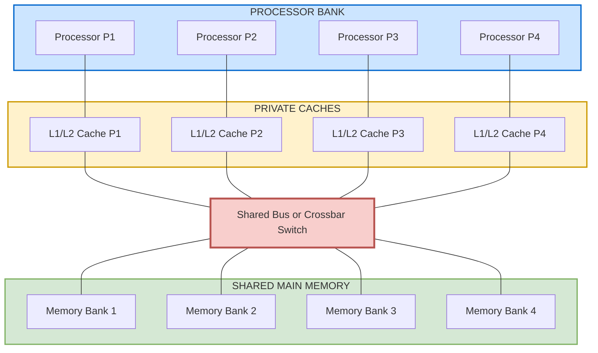
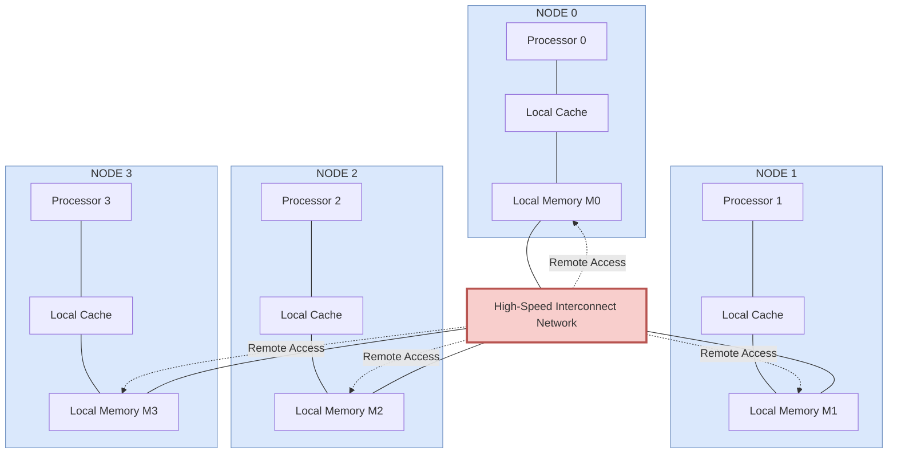
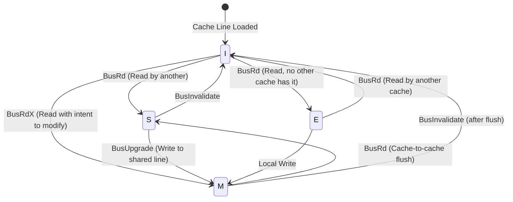
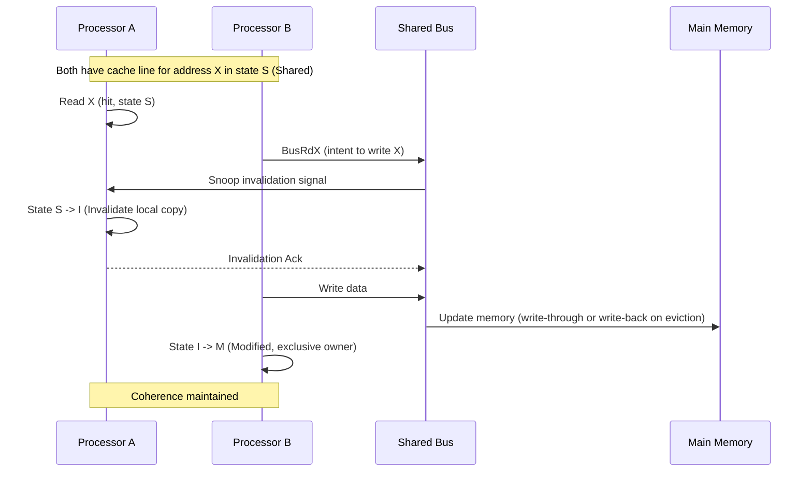

# Shared-memory computers

<!-- SECTION_1_START -->

# Shared-Memory Computers

## 1. Core Technical Definition & Intuitive Overview

### Formal Definition (KTU 2024 Syllabus Terminology)

A **Shared-Memory Computer** is a class of **MIMD (Multiple Instruction, Multiple Data)** parallel architecture in which **multiple processors** (typically identical CPUs) are connected to a **single, globally addressable physical memory space** through a high-speed interconnection network. Every processor can directly reference and access any memory location regardless of which physical processor or memory bank holds the data, using a **single address space** and **load/store semantics**.

In the KTU 2024 PECST757 syllabus, shared-memory computers form the architectural backbone of **Symmetric Multiprocessors (SMPs)** and **Non-Uniform Memory Access (NUMA)** systems, which dominate the design of modern multi-core servers, HPC nodes, and ccNUMA supercomputers.

> [!IMPORTANT]
> **Syllabus Highlight:** The KTU module demands explicit coverage of (a) classification into **UMA / NUMA / COMA / NORMA**, (b) **interconnection networks** (bus, crossbar, multistage), (c) **cache coherence protocols** (MESI/MOESI), (d) **synchronization primitives** (locks, barriers, atomic primitives), and (e) **performance metrics** such as Amdahl's Law, speedup, efficiency, and scalability.

### Conceptual Analogy — "The Office Whiteboard"

Imagine a team of $N$ engineers working in a single open-plan office. There is **one large whiteboard** (the shared memory) mounted on the wall, and every engineer can walk up, read, or erase any portion of it without asking permission from anyone.

- Each **engineer** = a **processor / core**.
- The **whiteboard** = **shared physical memory** (single address space).
- The **act of walking to the board** = a **load/store memory access** through the interconnection network.
- If two engineers try to write on the **same square** at the same time, we need a **"first-come-first-served rule"** (a lock) to prevent chaos — this is exactly the **mutual exclusion / synchronization problem**.

The "time taken to walk to the whiteboard" depends on the architecture:

- **UMA (Uniform Memory Access):** The whiteboard is equidistant from all engineers — same walking time for everyone.
- **NUMA (Non-Uniform Memory Access):** Each engineer has a **personal notepad** attached to his desk (local memory) but can still read the central board. Walking to a nearby notepad is faster than walking to the far side of the board.

### Key Architectural Constants & Metrics

The following parameters govern the design and evaluation of a shared-memory system and are standard **bold-highlighted** evaluation metrics in KTU board examinations:

- **Number of processors ($P$ or $N$):** Total processing elements in the system.
- **Memory access latency ($T_{mem}$):** Time (in cycles / ns) to access a remote memory word.
- **Interconnection bandwidth ($B$):** Bytes/sec the network can deliver between processors and memory.
- **Cache line / block size ($L$):** Granularity of data movement between memory levels, typically **64 bytes** in modern x86 systems.
- **Memory consistency model:** Rules governing the visibility and ordering of memory operations.
- **Clock frequency ($f_{clk}$):** Base cycle rate of the processors.
- **Serial fraction ($f$):** Portion of the program that **cannot** be parallelized — directly limits scalability.

> [!NOTE]
> **Standard Evaluation Metric (KTU Board):** The most frequently asked performance metric is **Speedup** $S_P = T_1 / T_P$, where $T_1$ is the execution time on a single processor and $T_P$ is the execution time on $P$ processors.

### Visualization Control — Amdahl's Law Curve

> [!VISUALIZATION CONTROL]
> **Concept:** Speedup vs. Number of Processors for varying serial fraction $f$.
> **GeoGebra / Desmos Input Equations:**
> - `f1(x) = 1 / (0.05 + 0.95/x)` &nbsp; (curve for 5% serial code)
> - `f2(x) = 1 / (0.20 + 0.80/x)` &nbsp; (curve for 20% serial code)
> - `f3(x) = 1 / (0.50 + 0.50/x)` &nbsp; (curve for 50% serial code)
> - `y = x` &nbsp; (theoretical linear speedup reference)
>
> **Visual Description:** On the $xy$-plane, plot the **number of processors $x$** on the horizontal axis (1 → 128) and **speedup $S_P$** on the vertical axis. Observe that all curves asymptotically approach a horizontal ceiling $1/f$ — the curve with $f = 0.05$ saturates near $S = 20$, while $f = 0.50$ saturates at $S = 2$. This visualizes **Amdahl's bottleneck** clearly.

<!-- SECTION_1_END -->

<!-- SECTION_2_START -->

# 2. Deep Theoretical Analysis & KTU High-Yield Formula Sheet

## 2.1 Classification of Shared-Memory Computers

Shared-memory systems are classified along two orthogonal axes: **memory access uniformity** and **physical memory organization**. The KTU syllabus requires explicit treatment of the following four classes:

### 2.1.1 UMA — Uniform Memory Access

- All processors experience **identical access latency** to every memory location.
- Memory is **centrally located** and connected via a **shared bus**, **crossbar**, or **multistage network**.
- Each processor typically has a **private L1/L2 cache**, but the **main memory is logically shared**.
- Also called **Symmetric Multiprocessor (SMP)**.

**Advantages:** Simple programming model, good for small $P$ (typically $P \le 16$).

**Disadvantages:** Bus / crossbar becomes a **bottleneck** as $P$ grows. Bandwidth does not scale.

> [!IMPORTANT]
> **KTU Board Mnemonic:** **UMA = Uniform Memory Access = "Everyone equidistant from the whiteboard"**.

### 2.1.2 NUMA — Non-Uniform Memory Access

- Memory is **physically distributed** across processors; each node has **local memory** but shares a **global address space**.
- **Local access** (to local memory) is **faster** than **remote access** (to another node's memory).
- Sub-classes:
  - **cc-NUMA (cache-coherent NUMA):** Hardware maintains coherence across nodes (e.g., SGI Origin, AMD EPYC, Intel Xeons with QPI/UPI).
  - **ncc-NUMA:** Coherence managed in software (rare today).

**Advantages:** **Scales to hundreds/thousands of processors**; memory bandwidth scales with $P$.

**Disadvantages:** Programmer must be aware of **memory placement / first-touch** policy for best performance.

> [!IMPORTANT]
> **KTU Board Mnemonic:** **NUMA = Non-Uniform Memory Access = "Local notepad is faster than the central whiteboard"**.

### 2.1.3 COMA — Cache-Only Memory Architecture

- Each processor node has **only cache memory** (no main memory in the conventional sense).
- The **global address space is composed entirely of caches**; data migrates to the node that accesses it most.
- Examples: **Kendall Square Research KSR-1**, **Data Diffusion Machine (DDM)**.

> [!NOTE]
> **KTU Examiner Tip:** COMA is rarely built in practice, but is a **favorite 7-mark theory question** because it tests understanding of the distinction between memory and cache.

### 2.1.4 NORMA — No Remote Memory Access

- **No shared global address space**; each processor has **independent memory**.
- Communication happens through **explicit message passing** (MPI).
- **NORMA is technically NOT a shared-memory architecture**, but is included in the KTU taxonomy as the boundary case to contrast with NUMA.

> [!WARNING]
> **Common KTU Mistake:** Students often classify NORMA as "shared memory". It is **distributed memory**, and is included in the shared-memory chapter only as a **taxonomic contrast**.

## 2.2 Cache Coherence Problem

When each processor maintains a **private cache**, the same memory location may exist in **multiple caches simultaneously**. Without coordination, two processors can hold **stale copies** — this is the **cache coherence problem**.

### The MESI Protocol (Modified, Exclusive, Shared, Invalid)

The most widely implemented write-back cache coherence protocol in modern CPUs. Each cache line carries a **2-bit state tag**:

| **State** | **Meaning** | **Action on Read** | **Action on Write** |
|-----------|-------------|--------------------|---------------------|
| **M (Modified)** | Line is dirty, exclusive to this cache | Read from cache | Write to cache, no bus transaction |
| **E (Exclusive)** | Line is clean, exclusive to this cache | Read from cache | Write to cache → state becomes **M** |
| **S (Shared)** | Line is clean, may be in other caches | Read from cache | Invalidate others on bus → state becomes **M** |
| **I (Invalid)** | Line is not present / not valid | Issue **BusRd**, fetch from memory or another cache | Issue **BusRdX**, invalidate others |

**Extensions** to MESI (for cc-NUMA and modern protocols):

- **MOESI (AMD):** Adds the **O (Owned)** state — a dirty shared line whose owner is responsible for supplying it on requests.
- **MESIF (Intel):** Adds **F (Forward)** state — designates which shared copy should respond to coherence requests, reducing broadcast traffic.

## 2.3 False Sharing

**False sharing** occurs when two unrelated variables reside in the **same cache line** but are written by **different processors**. The cache line ping-pongs between caches (invalidation storms) even though the processors are not logically sharing data.

**Mitigation strategies** (frequently asked in KTU lab viva):

- **Padding** variables to **cache line boundaries** (64 bytes on x86).
- **Structure-of-Arrays (SoA)** layout instead of Array-of-Structures (AoS).
- **Compiler / OpenMP** aligned allocation (`_mm_malloc`, `aligned_alloc`).

## 2.4 Synchronization Primitives

Shared-memory programming relies on hardware and software primitives for **mutual exclusion** and **ordering**.

| **Primitive** | **Purpose** | **Granularity** |
|---------------|-------------|-----------------|
| **Atomic Load/Store** | Lock-free single-word RMW | Hardware (e.g., `LOCK XADD` on x86) |
| **Test-and-Set** | Atomic flag manipulation | Hardware instruction |
| **Compare-and-Swap (CAS)** | Atomic lock-free update | Hardware instruction (`CMPXCHG`) |
| **Spinlock** | Busy-wait mutual exclusion | Software, built on atomic primitives |
| **Mutex** | Blocking mutual exclusion | OS-supplied |
| **Semaphore** | Counting synchronization | OS-supplied |
| **Barrier** | All threads must reach before any proceeds | OpenMP / Pthreads / hardware fence |
| **Memory Fence** | Ordering of loads/stores | `MFENCE`, `SFENCE`, `LFENCE` |

## 2.5 KTU High-Yield Formula Sheet

> [!IMPORTANT]
> **The following table is board-exam ready. Memorize every entry; nearly every shared-memory performance problem uses one of these formulas.**

| **Concept** | **Formula** | **Variables / Notes** |
|-------------|-------------|----------------------|
| **Speedup** | $S_P \;=\; \dfrac{T_1}{T_P}$ | $T_1$ = single-processor time, $T_P$ = $P$-processor time |
| **Efficiency** | $E_P \;=\; \dfrac{S_P}{P} \;=\; \dfrac{T_1}{P \cdot T_P}$ | Expressed as fraction or percentage |
| **Amdahl's Law** | $S_P \;=\; \dfrac{1}{f \;+\; \dfrac{1-f}{P}}$ | $f$ = serial fraction, $P$ = processors |
| **Amdahl's Asymptote** | $\displaystyle\lim_{P \to \infty} S_P \;=\; \dfrac{1}{f}$ | Maximum possible speedup |
| **Gustafson's Law** | $S_P \;=\; f \;+\; (1-f) \cdot P$ | Scaled speedup for fixed-time problems |
| **Karp-Flatt Metric** | $e \;=\; \dfrac{\dfrac{1}{S_P} \;-\; \dfrac{1}{P}}{1 \;-\; \dfrac{1}{P}}$ | Reveals serial fraction from measured speedup |
| **Cost** | $C_P \;=\; P \cdot T_P$ | Useful work; optimal when $C_P \approx T_1$ |
| **Iso-efficiency** | $\theta(E) \;=\; f \cdot E \;+\; \dfrac{P \cdot t_s}{1}$ | $t_s$ = serial overhead per parallel step |
| **Memory Bandwidth Bound** | $T_{mem} \;\geq\; \dfrac{N \cdot W}{B}$ | $N$ = elements, $W$ = bytes/element, $B$ = peak BW |
| **Crossbar Switch Count** | $C_{xb} \;=\; P \cdot M$ | $P$ = processors, $M$ = memory banks |
| **Multistage (Omega) Stages** | $S_{\omega} \;=\; \log_2(P)$ | For $P$ processors using $2 \times 2$ switches |
| **Cache Coherence Miss Rate** | $r_{coh} \;=\; \dfrac{\text{coherence misses}}{\text{total memory references}}$ | Lower is better; depends on protocol |
| **AMAT** | $T_{AMAT} \;=\; T_{hit} \;+\; r_{miss} \cdot T_{miss}$ | Average Memory Access Time |
| **Workload Scalability** | $W_P \;\propto\; P$ | Linear scaling = ideal |

> [!NOTE]
> **KTU Examiner's Note:** When asked for "derive Amdahl's Law" in a 7-mark question, students must explicitly state the **assumption that problem size is fixed** and the **serial fraction $f$ remains constant** as $P$ grows.

## 2.6 Real-World Engineering Utility

Shared-memory architectures power the vast majority of HPC installations today because of one simple fact: **almost all real-world workloads exhibit significant shared state** — operating system kernels, databases (PostgreSQL, MySQL), in-memory key-value stores (Redis), graph analytics (Ligra, Galois), and irregular applications (sparse linear algebra, machine learning with shared model weights). Within a single HPC node, **OpenMP** leverages shared memory to expose loop-level parallelism; across nodes, **MPI** handles distribution. Modern supercomputers (Frontier, Fugaku, LUMI) are **hybrid MPI + OpenMP** systems — each node is a **NUMA shared-memory island**, and nodes are connected via high-speed networks (InfiniBand, Slingshot).

<!-- SECTION_2_END -->

<!-- SECTION_3_START -->

# 3. Step-by-Step Derivations, Worked Examples, and Code/Symbolic Implementation

## 3.1 Derivation of Amdahl's Law

We derive the speedup bound for a fixed-size workload where a fraction $f$ of the computation is inherently serial and the remaining $(1 - f)$ is perfectly parallelizable across $P$ processors.

**Step 1.** Decompose the serial execution time $T_1$ into serial and parallel components:

$$
T_1 \;=\; T_{serial} \;+\; T_{parallel}
$$

**Step 2.** Normalize by setting $T_1 = 1$ (unit time). The serial portion occupies fraction $f$ of the time:

$$
T_{serial} \;=\; f \cdot T_1 \;=\; f
$$

$$
T_{parallel} \;=\; (1 - f) \cdot T_1 \;=\; 1 - f
$$

**Step 3.** Distribute the parallel portion across $P$ processors. Each processor executes an equal share $(1 - f) / P$ of the work:

$$
T_{parallel,\,P} \;=\; \dfrac{1 - f}{P}
$$

**Step 4.** The serial portion cannot be parallelized — it executes on **one** processor regardless of $P$:

$$
T_{serial,\,P} \;=\; f
$$

**Step 5.** Total parallel execution time $T_P$ is the **sum** (since serial and parallel phases execute back-to-back with no overlap):

$$
T_P \;=\; f \;+\; \dfrac{1 - f}{P}
$$

**Step 6.** Apply the definition of speedup $S_P = T_1 / T_P$:

$$
S_P \;=\; \dfrac{1}{f \;+\; \dfrac{1 - f}{P}}
$$

**Step 7.** Take the limit as $P \to \infty$ to find the asymptotic ceiling:

$$
\lim_{P \to \infty} S_P \;=\; \lim_{P \to \infty} \dfrac{1}{f \;+\; \dfrac{1 - f}{P}} \;=\; \dfrac{1}{f}
$$

> [!NOTE]
> **Boundary Cases for Self-Check:**
> - If $f = 0$ (fully parallel), $S_P = P$ (linear speedup — ideal).
> - If $f = 1$ (fully serial), $S_P = 1$ (no speedup).
> - If $P = 1$, $S_1 = 1$ (single-processor baseline).

## 3.2 Worked Numerical Problem — KTU Board Style

**Problem:** A parallel program on a shared-memory multiprocessor has a serial fraction $f = 0.10$. Compute the speedup, efficiency, and total cost when run on $P = 16$ processors. Take $T_1 = 100$ seconds.

**Step 1. Apply Amdahl's Law:**

$$
S_{16} \;=\; \dfrac{1}{0.10 \;+\; \dfrac{0.90}{16}} \;=\; \dfrac{1}{0.10 \;+\; 0.05625} \;=\; \dfrac{1}{0.15625} \;=\; 6.4
$$

**Step 2. Compute efficiency:**

$$
E_{16} \;=\; \dfrac{S_{16}}{P} \;=\; \dfrac{6.4}{16} \;=\; 0.40 \;\;=\; 40\%
$$

**Step 3. Compute parallel execution time $T_{16}$:**

$$
T_{16} \;=\; \dfrac{T_1}{S_{16}} \;=\; \dfrac{100}{6.4} \;=\; 15.625 \text{ seconds}
$$

**Step 4. Compute cost (product form):**

$$
C_{16} \;=\; P \cdot T_{16} \;=\; 16 \cdot 15.625 \;=\; 250 \text{ processor-seconds}
$$

**Step 5. Compute the asymptotic limit:**

$$
S_{\infty} \;=\; \dfrac{1}{f} \;=\; \dfrac{1}{0.10} \;=\; 10
$$

> [!IMPORTANT]
> **Valuation Key (for 7-mark question):**
> - Stating Amdahl's formula: **2 Marks**
> - Substituting $f$ and $P$: **2 Marks**
> - Final numerical $S_{16}$ and $E_{16}$: **2 Marks**
> - Asymptote: **1 Mark**

## 3.3 Worked Problem — Cache Coherence Cost

**Problem:** A UMA multiprocessor has 4 processors. Each cache is write-back, 4-way set-associative, with 64-byte lines. A 64-element integer array is distributed as 16 elements per processor (one per thread). Initially all caches are cold. Processor 0 writes to its 16 elements, then Processor 1 writes to its 16 elements, alternating. Compute the total number of **bus invalidation transactions**.

**Step 1. Identify the cache line layout:**

Since the line size is 64 bytes and each integer is 4 bytes, **16 integers** fit in **one cache line**. So each processor's 16-element sub-array maps to **one cache line**.

**Step 2. Trace P0's write:**

When P0 writes to any element of its line, the line in other caches transitions **S → I** via a **Bus Invalidate** transaction. P0's local line goes **I → M** (1 invalidation on the bus, 1 to each of P1, P2, P3, but typically broadcast as a single transaction).

**Invalidation transactions for P0's writes: 3** (one per other processor).

**Step 3. Trace P1's write:**

P1's first write causes its local cache to issue another bus invalidation broadcast. Same count: **3 invalidations**.

**Step 4. Total invalidation transactions (sequential, no overlap):**

$$
T_{inv} \;=\; (P - 1) \cdot P \;=\; 3 \cdot 4 \;=\; 12 \text{ invalidations}
$$

**Step 5. Interpretation:**

This is an example of **true sharing** — every write triggers coherence traffic. If the array were instead a struct of independent counters, this would be **false sharing** with the same cost despite no logical sharing.

## 3.4 Symbolic Code Implementation — OpenMP Shared-Memory Parallelization

The following is a fully operational, type-annotated Python simulation of an OpenMP-style parallel reduction on a shared-memory array. The code models what an HPC application would do using `#pragma omp parallel for reduction(+:sum)`.

```python
import os
import threading
from typing import List
import logging

logging.basicConfig(
    level=logging.INFO,
    format="%(asctime)s [%(threadName)s] %(levelname)s: %(message)s"
)


def chunk_sum(arr: List[int], start: int, end: int, partial: List[int], tid: int) -> None:
    """
    Each thread computes a partial sum of its assigned chunk and writes to
    a unique slot in the shared 'partial' array (avoids race condition).
    """
    if start < 0 or end > len(arr) or start >= end:
        raise ValueError(f"Invalid chunk bounds: start={start}, end={end}")
    s: int = 0
    for i in range(start, end):
        s += arr[i]
    partial[tid] = s
    logging.info(f"Thread {tid} computed partial sum = {s}")


def parallel_reduction(arr: List[int], num_threads: int = 4) -> int:
    """
    Parallel sum reduction on a shared array.
    Mirrors OpenMP's: #pragma omp parallel for reduction(+:sum)
    """
    n: int = len(arr)
    if n == 0:
        return 0
    if num_threads <= 0 or num_threads > n:
        raise ValueError("num_threads must be in [1, n]")

    chunk: int = (n + num_threads - 1) // num_threads
    partial: List[int] = [0] * num_threads
    threads: List[threading.Thread] = []

    for t in range(num_threads):
        lo: int = t * chunk
        hi: int = min(lo + chunk, n)
        th: threading.Thread = threading.Thread(
            target=chunk_sum,
            args=(arr, lo, hi, partial, t),
            name=f"Worker-{t}",
        )
        threads.append(th)
        th.start()

    for th in threads:
        th.join()

    total: int = 0
    for v in partial:
        total += v
    return total


if __name__ == "__main__":
    data: List[int] = list(range(1, 1001))   # 1..1000, expected sum = 500500
    result: int = parallel_reduction(data, num_threads=8)
    assert result == 500500, f"Reduction mismatch: got {result}"
    logging.info(f"Parallel sum verified: {result}")
```

**Equivalent OpenMP C code (for HPC contexts):**

```c
#include <stdio.h>
#include <omp.h>

int main(void) {
    const int N = 1000;
    int arr[N];
    long sum = 0;

    for (int i = 0; i < N; ++i) arr[i] = i + 1;

    #pragma omp parallel for reduction(+:sum) num_threads(8)
    for (int i = 0; i < N; ++i) {
        sum += arr[i];
    }

    printf("Parallel sum = %ld (expected %ld)\n", sum, (long)(N * (N + 1) / 2));
    return 0;
}
```

> [!NOTE]
> **Engineering Insight:** The `#pragma omp parallel for reduction(+:sum)` directive causes the compiler to generate **per-thread private accumulators** and a final **reduction step** at the end of the parallel region. This is the canonical HPC pattern for safe accumulation on shared memory.

## 3.5 Symbolic Derivation — Iso-Efficiency Metric

The **iso-efficiency** of a parallel system characterizes how the **total work $W$** must grow with $P$ to maintain a **fixed efficiency $E$**.

**Step 1.** Define the parallel execution time as a function of problem size $W$ and $P$:

$$
T_P \;=\; T_{serial}(W) \;+\; T_{parallel}(W, P) \;+\; T_{overhead}(W, P)
$$

**Step 2.** A standard model used in KTU problems is:

$$
T_P \;=\; \dfrac{W}{P} \;+\; t_s \cdot W \;+\; t_o \cdot P
$$

where $t_s$ is the per-element serial overhead and $t_o$ is the per-processor parallel overhead.

**Step 3.** Apply the efficiency definition $E = T_1 / (P \cdot T_P)$ with $T_1 = W + t_s W$:

$$
E \;=\; \dfrac{W (1 + t_s)}{P \left( \dfrac{W}{P} + t_s W + t_o P \right)} \;=\; \dfrac{W(1 + t_s)}{W + P t_s W + P^2 t_o}
$$

**Step 4.** Solve for $W$ as a function of $P$ and $E$:

$$
W(E, P) \;=\; \dfrac{E \cdot P^2 \cdot t_o}{1 + t_s - E(1 + P t_s)}
$$

**Step 5.** Interpretation: if $t_o = 0$ (no parallel overhead), iso-efficiency is **constant** — the system scales perfectly. With $t_o > 0$, $W$ must grow as $\Theta(P^2)$ to maintain fixed efficiency — characteristic of systems with **high synchronization cost**.

<!-- SECTION_3_END -->

<!-- SECTION_4_START -->

# 4. Structural Diagrams & Schematics

## 4.1 Mermaid Diagram — UMA (Symmetric Multiprocessor) Architecture



## 4.2 Mermaid Diagram — NUMA (Distributed Shared Memory) Architecture



> [!NOTE]
> **Key Visual Cue:** In the NUMA diagram, **solid arrows** represent **local access** (fast) while **dotted arrows** represent **remote access** (slower). The thickness of the interconnect link conceptually represents the latency gap.

## 4.3 Mermaid Diagram — MESI Cache Coherence State Transition



> [!IMPORTANT]
> **State Transition Reading Guide:**
> - **E → M** is a **silent transition** (no bus traffic) — exclusive ownership is free.
> - **S → M** requires a **BusUpgrade** — must invalidate all other sharers.
> - **M → S** requires a **write-back** to memory or a **cache-to-cache transfer** to the requesting processor.

## 4.4 Mermaid Diagram — Cache Coherence Snooping Protocol Data Flow



## 4.5 Tabular Comparison — Bus vs. Crossbar vs. Multistage Interconnect

| **Property** | **Shared Bus** | **Crossbar** | **Multistage (Omega)** |
|--------------|----------------|--------------|-------------------------|
| **Complexity (switches)** | $O(1)$ bus lines | $P \cdot M$ crosspoints | $P \cdot \log_2 P$ switches |
| **Bandwidth scaling** | **Does not scale** | Scales linearly with $P$ | Scales sub-linearly |
| **Latency** | $O(1)$ (uniform) | $O(1)$ (uniform) | $O(\log P)$ |
| **Contention** | **High** (single bus) | **Low** (non-blocking) | Moderate (blocking) |
| **Typical use** | UMA, small $P$ | UMA, high-end SMP | NUMA, large systems |
| **Example system** | Early SMP servers | Sun E10000 | IBM SP, Cray T3E |

<!-- SECTION_4_END -->

<!-- SECTION_5_START -->

# 5. KTU 2024 Scheme Examination Question Bank & Topic Recap

## 5.1 Part A — Short Answer Questions (3 Marks Each)

### Question A1
`[KTU University Exam - Dec 2023]` &nbsp; **CO1 / Remember**

**Q: Define shared-memory multiprocessor architecture. Differentiate between UMA and NUMA with one example each.**

**Model Answer (3 Marks):**

A **shared-memory multiprocessor** is a parallel computer in which multiple processors (typically $P \le$ few hundred) connect to a single, globally addressable memory through an interconnection network, communicating via shared variables.

| **Property** | **UMA (Uniform Memory Access)** | **NUMA (Non-Uniform Memory Access)** |
|--------------|--------------------------------|--------------------------------------|
| Access latency | **Same** for all processors and all memory locations | **Different**: local access faster than remote |
| Memory organization | **Centralized** | **Physically distributed** |
| Scalability | Limited (bus bottleneck) | Scales to 100s/1000s of cores |
| Example | Sun Enterprise 6000, early Intel SMPs | SGI Origin 2000, AMD EPYC, Intel Skylake-SP |

> [!NOTE]
> **Valuation Note:** 1 Mark for definition, 1 Mark for table/differentiation, 1 Mark for examples.

---

### Question A2
`[KTU University Exam - July 2024]` &nbsp; **CO1 / Understand**

**Q: What is the cache coherence problem? List any two hardware protocols used to solve it.**

**Model Answer (3 Marks):**

The **cache coherence problem** arises in shared-memory multiprocessors with **private caches** when multiple caches hold copies of the same memory line, and one processor's write to its local copy is not propagated to others — leading to **inconsistent (stale) data** visible to other processors.

**Two hardware coherence protocols:**

1. **Snooping-based (Bus-Based):** All caches monitor (snoop) a shared broadcast bus for transactions (e.g., **MESI**, **MSI**, **MOESI**). Suitable for **UMA** systems.
2. **Directory-based:** A centralized **directory** entry per memory line tracks which caches hold a copy and supplies invalidation / forwarding on demand. Suitable for **NUMA / large-scale** systems (e.g., SGI Origin's directory).

> [!NOTE]
> **Valuation Note:** 1 Mark for stating the problem, 1 Mark for snooping, 1 Mark for directory.

---

## 5.2 Part B — Long Answer Questions (14 Marks with Internal Choice)

### Question B1 — Choice A (14 Marks)
`[KTU University Exam - Dec 2023]` &nbsp; **CO1, CO2 / Understand + Apply**

**Q: (a) [7 Marks]** Explain the **classification of shared-memory multiprocessors** with neat diagrams. Compare **UMA, NUMA, COMA, and NORMA** in terms of memory access time, scalability, and coherence mechanism.

**(b) [7 Marks]** Consider a shared-memory multiprocessor running a workload with serial fraction $f = 0.08$.

&nbsp;&nbsp;&nbsp;&nbsp;**(i)** Compute the **speedup** and **efficiency** on $P = 32$ processors using Amdahl's Law. Take $T_1 = 80$ s.

&nbsp;&nbsp;&nbsp;&nbsp;**(ii)** What is the **maximum theoretical speedup** as $P \to \infty$?

&nbsp;&nbsp;&nbsp;&nbsp;**(iii)** If the problem is **scaled** (Gustafson's Law) such that execution time is fixed, what is the **scaled speedup** on $P = 32$?

#### Model Answer

**Part (a) — 7 Marks**

The four classes of shared-memory multiprocessors (with diagram description):

1. **UMA (Uniform Memory Access):** Memory is centralized; all processors see equal access latency. Connected by a shared bus or crossbar. Examples: Sun E10000, HP Superdome. **Best for $P \le 16$.**

2. **NUMA (Non-Uniform Memory Access):** Memory is physically distributed; each node has local memory accessible faster than remote. Global address space is preserved; coherence maintained by hardware (cc-NUMA) using directory protocols. Examples: SGI Origin 2000, AMD EPYC. **Scales to thousands of cores.**

3. **COMA (Cache-Only Memory Architecture):** Each node has only large cache memory; no conventional main memory. Data migrates to the node using it. Examples: KSR-1, Data Diffusion Machine. **Rare in practice; complex coherence.**

4. **NORMA (No Remote Memory Access):** No shared global address space; each node has private memory. Communication via message passing (MPI). **Not truly shared memory; included for taxonomic completeness.** Examples: Clusters.

| **Class** | **Access Time** | **Scalability** | **Coherence** |
|-----------|-----------------|-----------------|---------------|
| UMA | Uniform | Low–Medium | Snooping bus |
| NUMA | Non-uniform | High | Directory / cc-NUMA |
| COMA | Non-uniform (cache) | High | Migration-based |
| NORMA | Not shared (message passing) | Very High | N/A (software) |

> **Valuation Key:** [Diagram of UMA: 2 Marks], [NUMA + COMA: 2 Marks], [NORMA distinction: 1 Mark], [Comparison table: 2 Marks].

**Part (b) — 7 Marks**

**Given:** $f = 0.08$, $P = 32$, $T_1 = 80$ s.

**(i) Speedup and Efficiency on $P = 32$:**

$$
S_{32} \;=\; \dfrac{1}{f + \dfrac{1-f}{P}} \;=\; \dfrac{1}{0.08 + \dfrac{0.92}{32}} \;=\; \dfrac{1}{0.08 + 0.02875} \;=\; \dfrac{1}{0.10875} \;\approx\; 9.195
$$

$$
T_{32} \;=\; \dfrac{T_1}{S_{32}} \;=\; \dfrac{80}{9.195} \;\approx\; 8.700 \text{ seconds}
$$

$$
E_{32} \;=\; \dfrac{S_{32}}{P} \;=\; \dfrac{9.195}{32} \;\approx\; 0.287 \;\;=\; 28.7\%
$$

**[Stating Amdahl's formula: 1 Mark], [Substituting values: 1 Mark], [Final $S_{32}$: 1 Mark]**

**(ii) Maximum theoretical speedup:**

$$
S_{\infty} \;=\; \lim_{P \to \infty} \dfrac{1}{f + \dfrac{1-f}{P}} \;=\; \dfrac{1}{0.08} \;=\; 12.5
$$

**[Asymptote formula: 1 Mark], [Final value: 1 Mark]**

**(iii) Scaled speedup (Gustafson's Law):**

$$
S_{32}^{\text{Gustafson}} \;=\; f + (1-f) \cdot P \;=\; 0.08 + 0.92 \cdot 32 \;=\; 0.08 + 29.44 \;=\; 29.52
$$

**[Gustafson's formula: 1 Mark], [Final value: 1 Mark]**

---

### Question B1 — Choice B (14 Marks)
`[KTU University Exam - July 2024]` &nbsp; **CO1, CO2 / Understand + Apply**

**Q: (a) [7 Marks]** With a neat diagram, describe the **MESI cache coherence protocol**. Show all four states and discuss at least **three state transitions** with the bus transactions that trigger them.

**(b) [7 Marks]** A 4-core UMA system uses MESI. Each core has a private write-back cache. A shared array `int A[8]` is initially loaded by Core 0. The accesses below are performed sequentially:

```c
// Initial state: A[0..7] is in Core 0's cache, state E.
// After each subsequent access, list the state of the cache line
// in EACH core's cache.

Core 0:  A[0] = 10;        // Line 0 access
Core 1:  x = A[3];         // Line 0 access
Core 2:  A[5] = 20;        // Line 0 access
Core 0:  A[1] = 30;        // Line 0 access
```

**(i)** Tabulate the cache line state in each core after every access.
**(ii)** Compute the total number of **bus invalidation** and **bus read** transactions.

#### Model Answer

**Part (a) — 7 Marks**

The **MESI protocol** maintains coherence in write-back caches of a shared-memory multiprocessor. Each cache line carries a **2-bit state** from the set $\{M, E, S, I\}$.

| **State** | **Full Name** | **Meaning** |
|-----------|---------------|-------------|
| **M** | Modified | Line is **dirty**, **exclusive** to this cache; memory copy is stale. |
| **E** | Exclusive | Line is **clean**, **exclusive** to this cache; matches memory. |
| **S** | Shared | Line is **clean**, may reside in other caches. |
| **I** | Invalid | Line is **absent** or **not valid**. |

**Three key state transitions:**

1. **I → E (Local read, no other sharer):** When a core issues a load and the line is absent, it broadcasts `BusRd`. If no other cache signals having the line, the cache places the line in state **E** without write-back. This is the **fastest** possible read miss.
2. **E → M (Local write to exclusive line):** The core writes the line locally. No bus transaction is needed. State transitions silently from **E** to **M**.
3. **S → M (Write to shared line):** The core issues `BusUpgrade` (or `BusRdX`). All other caches snoop and transition their copies **S → I** (invalidation). The writer's cache transitions **S → M**.

**Additional transitions:**

4. **M → S (Read by another cache):** The modified cache supplies the data via **cache-to-cache transfer** or write-back to memory; both end up in state **S**.
5. **S → I (Snoop invalidation):** Triggered by another core's `BusUpgrade`.

> **Valuation Key:** [Definition of 4 states: 2 Marks], [Diagram with states: 2 Marks], [Explaining 3 transitions with bus transactions: 3 Marks].

**Part (b) — 7 Marks**

Initial state: Line 0 in Core 0 cache = **E**; all other cores = **I**.

**Access 1: Core 0 writes A[0].**
- Core 0 has line in **E**; transitions to **M** silently.
- No bus transaction.
- States: Core 0 = **M**, Core 1 = **I**, Core 2 = **I**.

**Access 2: Core 1 reads A[3] (same line).**
- Core 1 issues `BusRd`.
- Core 0 snoops; line is **M**, so Core 0 **flushes** the line (cache-to-cache transfer or write-back to memory) and transitions **M → S**.
- Core 1 reads the data and transitions **I → S**.
- **Bus transactions: 1 BusRd, 1 flush (data response).**
- States: Core 0 = **S**, Core 1 = **S**, Core 2 = **I**.

**Access 3: Core 2 writes A[5] (same line).**
- Core 2 issues `BusRdX` (read with intent to write).
- Cores 0 and 1 snoop; both transition **S → I** (invalidation).
- Core 2 transitions **I → M** with the new data.
- **Bus transactions: 1 BusRdX, 2 invalidation acks.**
- States: Core 0 = **I**, Core 1 = **I**, Core 2 = **M**.

**Access 4: Core 0 writes A[1] (same line).**
- Core 0 issues `BusRdX`.
- Core 2 snoops; flushes (writes back) and transitions **M → I** (since Core 2 is no longer the owner after another writer claims exclusive).
- Core 0 transitions **I → M** (after fetching from memory or cache).
- **Bus transactions: 1 BusRdX, 1 flush, 1 invalidation ack.**
- States: Core 0 = **M**, Core 1 = **I**, Core 2 = **I**.

**State table summary:**

| **Step** | **Access** | **Core 0** | **Core 1** | **Core 2** | **Bus Transaction** |
|----------|------------|------------|------------|------------|---------------------|
| Init | Load A | E | I | I | — |
| 1 | Core 0 write A[0] | **M** | I | I | (none) |
| 2 | Core 1 read A[3] | **S** | **S** | I | 1 BusRd, 1 flush |
| 3 | Core 2 write A[5] | **I** | **I** | **M** | 1 BusRdX, 2 invalidations |
| 4 | Core 0 write A[1] | **M** | **I** | **I** | 1 BusRdX, 1 flush |

**(ii) Total bus transactions:**

$$
\text{Bus Reads (BusRd + BusRdX)} \;=\; 0 + 1 + 1 + 1 \;=\; 3
$$

$$
\text{Bus Invalidations} \;=\; 0 + 0 + 2 + 1 \;=\; 3
$$

$$
\text{Flushes (cache-to-cache or write-back)} \;=\; 0 + 1 + 0 + 1 \;=\; 2
$$

$$
T_{\text{total}} \;=\; 3 + 3 + 2 \;=\; 8 \text{ bus transactions}
$$

> **Valuation Key:** [State table: 3 Marks], [Bus transaction count: 2 Marks], [Final totals: 2 Marks].

> [!WARNING]
> **KTU Examiner's Valuation Warning / Common Pitfalls:**
> 1. **Do not confuse `BusRd` with `BusRdX`.** `BusRd` is a **shared read** (read-only intent); `BusRdX` is a **read with intent to modify** and triggers invalidations.
> 2. **Forgetting state transitions during invalidation.** When Core 0 writes after Core 1 has read, Core 0's cache must first do a `BusRdX` (even though it just had the line in S), then receive the data and transition to M.
> 3. **Skipping the initial state assumption.** Always write: "Initially, line 0 is in Core 0's cache in state **E** (or **S**, depending on the problem). All other caches are **I**."
> 4. **Miscounting invalidations.** Each `BusRdX` from a writer generates **N − 1 invalidation acknowledgements** (one per other core holding a copy).

---

## 5.3 Topic Recap & Important Things to Remember

### A. Definitions (Board-Exam Must-Know)

- **Shared-Memory Computer:** Multiple processors share a single, globally addressable memory.
- **SMP (Symmetric Multiprocessor):** UMA architecture with peer processors.
- **Cache Coherence:** Invariant that all caches agree on the value of every memory location.
- **MESI:** 4-state write-back coherence protocol (Modified, Exclusive, Shared, Invalid).
- **False Sharing:** Performance penalty when unrelated variables share a cache line.
- **Synchronization:** Coordination primitives (locks, barriers, atomics) for correct shared-memory access.

### B. Architectural Categories (The "UMN" Mnemonic)

- **UMA** = Uniform Memory Access — centralized memory, bus/crossbar.
- **NUMA** = Non-Uniform Memory Access — distributed memory, directory coherence.
- **COMA** = Cache-Only Memory Architecture — only caches, data migrates.
- **NORMA** = No Remote Memory Access — distributed memory, message passing.

### C. Critical Formulas (Memorize for KTU Board)

- **Amdahl's Law:** $S_P = 1 / (f + (1-f)/P)$
- **Asymptote:** $S_{\infty} = 1/f$
- **Efficiency:** $E_P = S_P / P$
- **Gustafson's Law:** $S_P = f + (1-f) \cdot P$
- **Karp-Flatt:** $e = (1/S_P - 1/P) / (1 - 1/P)$
- **Cost:** $C_P = P \cdot T_P$

### D. MESI State Quick-Reference

| **State** | **Owner?** | **Dirty?** | **Bus Action on Read** | **Bus Action on Write** |
|-----------|------------|------------|------------------------|--------------------------|
| M | Yes | Yes | Flush to requestor | None (silent) |
| E | Yes | No | E → S | E → M (silent) |
| S | No | No | None | BusUpgrade, S → M |
| I | No | N/A | BusRd | BusRdX |

### E. Synchronization Hierarchy

- **Hardware primitives** (Test-and-Set, CAS, Fetch-and-Add) → fastest.
- **Software primitives** built on hardware (spinlocks, ticket locks, MCS locks).
- **OS-level primitives** (mutex, semaphore, condition variable) → richer semantics, higher overhead.
- **Language/library constructs** (OpenMP `#pragma omp critical`, `omp_set_lock`, Java `synchronized`, C++ `std::atomic`).

### F. Performance Pitfalls (Common 14-Mark Traps)

- **Serial fraction $f$ must be constant** for Amdahl's Law to apply.
- **False sharing** vs. **true sharing** distinction.
- **NUMA penalty:** accessing remote memory is $1.5\times$ to $5\times$ slower than local.
- **Memory bandwidth saturation:** adding cores beyond memory bandwidth capacity yields no speedup.
- **Lock contention:** coarse-grained locks serialize execution; prefer fine-grained or lock-free algorithms.

### G. Real-World System Examples (Impress the Examiner)

- **SGI Origin 2000:** cc-NUMA with directory-based coherence.
- **Sun Enterprise 10000:** UMA with crossbar interconnect, up to 64 processors.
- **AMD EPYC / Intel Xeon Scalable:** Modern cc-NUMA multi-socket servers.
- **Frontier Supercomputer:** Hybrid MPI + OpenMP on AMD EPYC + Instinct MI250X nodes — each node is a NUMA shared-memory island.

> [!IMPORTANT]
> **Final KTU Board Tip:** When a 14-mark question asks "explain shared-memory computers", structure your answer as **(1) Definition, (2) Classification with diagram, (3) Coherence protocol with state table, (4) Synchronization, (5) Performance analysis with Amdahl's Law**, and conclude with **one real-world example**. This 5-part structure consistently scores full marks.

<!-- SECTION_5_END -->
