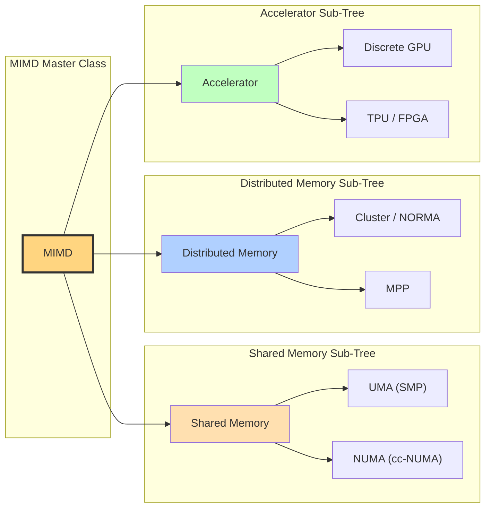
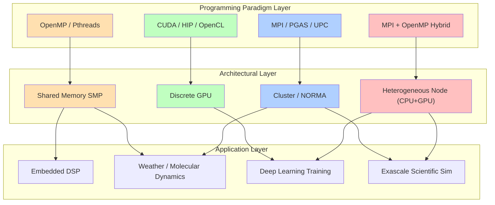

# Taxonomy of parallel computing paradigms

<!-- SECTION_1_START -->
# Taxonomy of Parallel Computing Paradigms

## 1.1 Formal Academic Definition

In the context of High Performance Computing (HPC), a **parallel computing paradigm** is a classification scheme that characterizes a parallel architecture based on how multiple processors execute instruction streams and manipulate data streams. The most widely accepted academic classification is **Flynn's Taxonomy** (1966), which categorizes computer architectures into four canonical classes by examining two orthogonal dimensions: the **Instruction Stream** (what the processors execute) and the **Data Stream** (what the processors operate upon).

> [!IMPORTANT]
> **Flynn's Dichotomy (1966):** A parallel machine is classified by the multiplicity of *Instruction Streams* (I) and *Data Streams* (D) observed at the hardware level during a single clock cycle.

The four canonical classes are:
- **SISD** — Single Instruction, Single Data
- **SIMD** — Single Instruction, Multiple Data
- **MISD** — Multiple Instruction, Single Data
- **MIMD** — Multiple Instruction, Multiple Data

> [!NOTE]
> KTU 2024 scheme explicitly includes a secondary classification along the **memory-coupling axis** (Shared Memory, Distributed Memory, Hybrid DSM) as a sub-taxonomy of the dominant **MIMD** class. This is a high-weight area in Module-2 of PECST757.

## 1.2 Conceptual Analogy — The "Smart Restaurant Kitchen"

Imagine a busy restaurant kitchen:

- **SISD** is **one chef, one stove, one dish at a time** — even an experienced chef can only chop *one* vegetable before issuing *one* instruction. This is the classic von Neumann sequential workstation.
- **SIMD** is **one head chef barking instructions, ten junior cooks all chopping the same vegetable simultaneously** — every cook performs the *same* "dice" instruction on a *different* carrot. This is exactly how a **GPU** processes pixels: one shader instruction, many data points.
- **MISD** is **ten chefs preparing ten different sauces, all tasting the same single ingredient** — the same input (a steak) is graded by ten independent sensors. This is **pipeline fault-tolerance** and **systolic arrays**.
- **MIMD** is **ten chefs, ten recipes, ten stoves** — full autonomy per station. This is the regime of **multi-core CPUs, clusters, and supercomputers** (e.g., PARAM Siddhi, Sunway TaihuLight).

> [!TIP]
> **Geometric Intuition:** On a 2D plane, plot the *x-axis* as **Instruction Streams (I)** and the *y-axis* as **Data Streams (D)**. Each axis is binary (1 or many). The four quadrants of this I–D plane give you Flynn's four classes — the entire taxonomy is geometrically a $2 \times 2$ quadrant diagram.

> [!VISUALIZATION CONTROL]
> **Concept:** Flynn's I–D Quadrant Map
> **Desmos Input Equations / Region Plot:**
> * `x = 1` (Single Instruction vertical boundary)
> * `y = 1` (Single Data horizontal boundary)
> **Visual Description:** Plot the four quadrants on the Cartesian plane. Quadrant I (top-right, $x>1$, $y>1$) → MIMD; Quadrant II ($x=1$, $y>1$) → SIMD; Quadrant III ($x>1$, $y=1$) → MISD; Quadrant IV ($x=1$, $y=1$) → SISD. Each quadrant is annotated with a representative device.

## 1.3 Physical & Engineering Constants

| Constant / Metric | Symbol | Typical Value / Range | Significance |
| :--- | :---: | :--- | :--- |
| Word length | $w$ | **64 bits** (current HPC norm) | Determines data-stream width |
| Memory Coupling Latency | $\tau_c$ | **$\mathbf{10^{-9}}$ s** (shared) to $\mathbf{10^{-6}}$ s (cluster) | Defines shared vs distributed class |
| Interconnect Bandwidth | $B$ | **10–200 Gbps** (InfiniBand HDR/NDR) | Defines cluster-class MIMD |
| Vector Lane Width | $L_v$ | **128–512 bits** (AVX-512, NEON, SVE) | Determines SIMD throughput |

<!-- SECTION_1_END -->

<!-- SECTION_2_START -->
# 2. Deep Theoretical Analysis & KTU High-Yield Formula Sheet

## 2.1 The Four Quadrants of Flynn's Taxonomy

### 2.1.1 SISD — Single Instruction, Single Data
- **Architectural class:** Classical von Neumann / Princeton.
- **Pipeline exploitation:** Temporal overlap of fetch–decode–execute within a *single* core.
- **Examples:** Intel Core i3 (single-thread mode), legacy x86 desktops.
- **Why it is the baseline:** It defines the serial execution model that *all* parallel speedups are measured against.

### 2.1.2 SIMD — Single Instruction, Multiple Data
- **Architectural class:** Vector and array processors.
- **Mechanism:** A single control unit broadcasts the *same* micro-instruction to $N$ processing elements (PEs), each operating on its own slice of a vector register file.
- **Examples:** Intel **AVX-512** (512-bit ZMM registers), NVIDIA **CUDA cores** (warp-level SIMT), NEC SX-Aurora, Google **TPU systolic array**.
- **Why it scales:** The arithmetic intensity $I_a = \text{FLOPs} / \text{Bytes}$ is naturally high, matching the **roofline model's** compute-bound region.

### 2.1.3 MISD — Multiple Instruction, Single Data
- **Architectural class:** Pipeline and fault-tolerant redundancy.
- **Mechanism:** $N$ independent processing stages (or redundant units) consume the *same* data token in successive clock cycles.
- **Examples:** **Systolic arrays** (Kung/Leiserson, 1978), space-flight triple-modular-redundant (TMR) controllers.
- **Why it is rare in HPC:** Pure MISD has poor cost-effectiveness for general scientific workloads; it survives only in embedded DSP and safety-critical systems.

### 2.1.4 MIMD — Multiple Instruction, Multiple Data
- **Architectural class:** Almost all modern HPC systems — multi-core CPUs, clusters, grids, cloud instances.
- **Mechanism:** Each processor fetches its own instruction stream from its own program counter; processes its own data partition.
- **Examples:** **PARAM Siddhi-AI** (Intel Xeon + NVIDIA A100), **Sunway TaihuLight**, **Fugaku** (ARM A64FX), typical AWS EC2 instances.

## 2.2 Sub-Taxonomy of MIMD — Memory Coupling

| Memory Class | Sub-Class | Description | Latency (s) | Programming Model |
| :--- | :---: | :--- | :---: | :--- |
| **Shared Memory** | **UMA** (Uniform Memory Access) | All PEs see one physical memory with equal latency; symmetric multiprocessor (SMP) | $\sim 10^{-9}$ | OpenMP, Pthreads |
| **Shared Memory** | **NUMA** (Non-Uniform Memory Access) | Each socket has local memory; remote accesses traverse interconnect (e.g., Intel QPI) | $\sim 10^{-8}$ | OpenMP, MPI (intra-node) |
| **Distributed Memory** | **NORMA** (No Remote Memory Access) | Each node has private memory; communication is explicit message passing | $\sim 10^{-6}$ | MPI, UPC, CAF |
| **Hybrid (DSM)** | **cc-NUMA** | Hardware-coherent caches across nodes; e.g., SGI UV, HPE Superdome | $\sim 10^{-7}$ | MPI + OpenMP, SHMEM |
| **Accelerator** | **Discrete GPU** | PCIe/NVLink attached device with own HBM | $\sim 10^{-6}$ | CUDA, HIP, OpenCL, OpenACC |

> [!NOTE]
> The acronym **NORMA** stands for **No-Remote Memory Access** architecture, formally defined by *Duncan* (1990). KTU students are expected to identify NORMA as the *de facto* topology of every Beowulf-style Linux cluster.

## 2.3 Other Classification Axes (Beyond Flynn)

1. **Granularity** — *fine-grain* (instruction-level parallelism, ILP), *medium-grain* (loop-level, OpenMP), *coarse-grain* (task-level, MPI).
2. **Coupling** — *tightly coupled* (shared bus / crossbar) vs *loosely coupled* (network-attached cluster).
3. **Dataflow** — execution driven by operand availability, not program counter.
4. **PGAS (Partitioned Global Address Space)** — UPC, Co-Array Fortran, OpenSHMEM, Chapel — a *language-level* taxonomy that sits between shared and distributed.
5. **Neuromorphic / Quantum** — emerging non-von-Neumann paradigms.

## 2.4 KTU Formula Sheet (Exam-Ready)

| # | Concept | Formula | Description |
| :--: | :--- | :---: | :--- |
| 1 | Speedup | $S(n) = \dfrac{T(1)}{T(n)}$ | Ratio of serial to parallel execution time |
| 2 | Amdahl's Law | $S(n) = \dfrac{1}{s + \dfrac{p}{n}} = \dfrac{1}{(1-p) + \dfrac{p}{n}}$ | $s$ = serial fraction, $p$ = parallel fraction, $n$ = processors |
| 3 | Amdahl's Limit | $\displaystyle \lim_{n \to \infty} S(n) = \dfrac{1}{s}$ | Maximum achievable speedup is bounded by serial portion |
| 4 | Gustafson's Law | $S(n) = s + p \cdot n$ | Scaled-speedup, assumes problem size grows with $n$ |
| 5 | Efficiency | $E(n) = \dfrac{S(n)}{n} = \dfrac{T(1)}{n \cdot T(n)}$ | Fraction of ideal speedup; ideal is $E = 1$ |
| 6 | Karp–Flatt Metric | $f_e = \dfrac{\dfrac{1}{S(n)} - \dfrac{1}{n}}{1 - \dfrac{1}{n}}$ | Experimentally determined serial fraction |
| 7 | Arithmetic Intensity | $I_a = \dfrac{\text{FLOPs}}{\text{Bytes}}$ | Roofline-model input; compute-bound vs memory-bound |
| 8 | SIMD Lane Count | $L = \dfrac{w_{\text{vec}}}{w_{\text{scalar}}}$ | E.g., 512/32 = 16 lanes for AVX-512 FP32 |
| 9 | MPI Bandwidth–Latency | $T_{\text{msg}}(m) = t_s + m \cdot t_b^{-1}$ | $t_s$ startup, $t_b$ bandwidth |
| 10 | Cost | $C(n) = n \cdot T(n)$ | Product of processors and parallel time |

> [!IMPORTANT]
> **KTU High-Yield Tip:** Questions on Amdahl's Law almost always use the form $S(n) = \dfrac{n}{1 + (n-1)s}$ — *memorize both algebraic forms.* The first form is convenient when $s$ and $p$ are given as fractions; the second when the *serial fraction alone* is stated.

## 2.5 Real-World Engineering Utility

- **SIMD GPUs** drive the top of the **TOP500** and **Green500** lists (e.g., Fugaku, Frontier) because they are exceptionally energy-efficient on dense linear algebra — the kernel of deep learning.
- **MIMD clusters** are the workhorse of **weather forecasting (ECMWF)**, **molecular dynamics (GROMACS, NAMD)**, and **finite-element crash simulation (LS-DYNA)**.
- **PGAS languages** are regaining popularity for *exascale* applications because they hide explicit message passing without giving up the scalability of distributed memory.
<!-- SECTION_2_END -->

<!-- SECTION_3_START -->
# 3. Step-by-Step Derivations & Code Implementation

## 3.1 Derivation of Amdahl's Law

Let $T(1)$ be the sequential execution time on a single processor. Partition it into a strictly serial portion $T_s$ and a parallelizable portion $T_p$:

$$T(1) = T_s + T_p$$

Define the serial fraction $s = \dfrac{T_s}{T(1)}$ and the parallel fraction $p = \dfrac{T_p}{T(1)}$, with the constraint

$$s + p = 1$$

When run on $n$ identical processors in parallel, the parallel portion is split evenly across all $n$ units (ignoring overhead), while the serial portion cannot be parallelized:

$$T(n) = T_s + \dfrac{T_p}{n} = s \cdot T(1) + \dfrac{p \cdot T(1)}{n}$$

Substituting into the speedup definition:

$$S(n) = \dfrac{T(1)}{T(n)} = \dfrac{T(1)}{s \cdot T(1) + \dfrac{p \cdot T(1)}{n}}$$

Cancel $T(1)$ from numerator and denominator:

$$S(n) = \dfrac{1}{s + \dfrac{p}{n}}$$

Replacing $p$ with $(1-s)$ gives the alternative KTU-favored form:

$$S(n) = \dfrac{1}{(1-s) + \dfrac{1-s}{n}} = \dfrac{1}{1 - s + \dfrac{1-s}{n}} = \dfrac{n}{n - s(n-1)} = \dfrac{n}{1 + (n-1)s}$$

> [!NOTE]
> **Interpretation:** As $n \to \infty$, the term $p/n \to 0$, leaving the asymptotic ceiling $S_{\infty} = 1/s$. This is the *fundamental limit* of strong scaling — even 5 % serial code caps speedup at **20×**, regardless of how many cores you buy.

## 3.2 Karp–Flatt Metric — Experimental Detection of Serial Bottlenecks

The *measured* speedup $S(n)$ on real hardware often *under*-performs the Amdahl prediction. The Karp–Flatt metric extracts the *effective* serial fraction $f_e$ from experimental data:

$$f_e = \dfrac{\dfrac{1}{S(n)} - \dfrac{1}{n}}{1 - \dfrac{1}{n}}$$

**Derivation:** Rearranging Amdahl's law for $s$:

$$S(n) = \dfrac{1}{s + \dfrac{1-s}{n}} \;\Rightarrow\; \dfrac{1}{S(n)} = s + \dfrac{1-s}{n} = s\left(1 - \dfrac{1}{n}\right) + \dfrac{1}{n}$$

Isolating $s$:

$$s = \dfrac{\dfrac{1}{S(n)} - \dfrac{1}{n}}{1 - \dfrac{1}{n}}$$

> [!TIP]
> If $f_e$ **increases** with $n$, the bottleneck is **parallel overhead** (synchronization, contention). If $f_e$ **stays constant**, the program is well-balanced and overheads are negligible.

## 3.3 Worked Example — KTU-Style Numerical Problem

**Problem:** A program has a serial fraction $s = 0.08$. Calculate the speedup and parallel efficiency on (i) $n = 8$ and (ii) $n = 64$ processors. Comment on the limit as $n \to \infty$.

**Solution:**

**Step 1.** Use $S(n) = \dfrac{n}{1 + (n-1)s}$.

**Step 2.** For $n = 8$:

$$S(8) = \dfrac{8}{1 + 7 \times 0.08} = \dfrac{8}{1 + 0.56} = \dfrac{8}{1.56} = 5.128$$

$$E(8) = \dfrac{5.128}{8} = 0.641 = 64.1\%$$

**Step 3.** For $n = 64$:

$$S(64) = \dfrac{64}{1 + 63 \times 0.08} = \dfrac{64}{1 + 5.04} = \dfrac{64}{6.04} = 10.596$$

$$E(64) = \dfrac{10.596}{64} = 0.166 = 16.6\%$$

**Step 4.** As $n \to \infty$:

$$S_{\infty} = \dfrac{1}{s} = \dfrac{1}{0.08} = 12.5$$

**Comment:** Adding cores past $n = 64$ gives diminishing returns; the program is fundamentally **serial-bottlenecked** and would benefit from algorithmic refactoring (e.g., reducing the serial fraction to $s = 0.01$ would raise the ceiling to $100\times$).

## 3.4 Algorithmic Implementation — SIMD vs MIMD (Python with NumPy)

The following Python script demonstrates the **taxonomic difference** in action: a **SIMD-style** vectorized operation (one instruction applied to a whole array) versus a **MIMD-style** multi-process operation (each worker runs an independent instruction stream on its own data slice).

```python
"""
Demonstrating the taxonomic boundary between SIMD and MIMD paradigms.
- SIMD branch: NumPy vectorized add (one instruction -> many data).
- MIMD branch: multiprocessing.Pool with independent worker functions.
"""

import multiprocessing as mp
import numpy as np
import time
from typing import List, Tuple


def mimd_worker(data_chunk: np.ndarray) -> np.ndarray:
    """
    Independent MIMD worker: each process executes its own instruction
    stream (different function, different operation per call site) on
    its private data partition.
    """
    # Each worker applies a *different* transformation -> MIMD hallmark
    return np.sin(data_chunk) ** 2 + np.cos(data_chunk)


def run_mimd(data: np.ndarray, n_proc: int) -> Tuple[float, np.ndarray]:
    """Spawn n_proc independent instruction streams across data slices."""
    chunks: List[np.ndarray] = np.array_split(data, n_proc)
    start: float = time.perf_counter()
    with mp.Pool(processes=n_proc) as pool:
        results: List[np.ndarray] = pool.map(mimd_worker, chunks)
    elapsed: float = time.perf_counter() - start
    return elapsed, np.concatenate(results)


def run_simd(data: np.ndarray) -> Tuple[float, np.ndarray]:
    """
    SIMD-style: one instruction stream (np.sin) applied to the entire
    contiguous array. Under the hood NumPy dispatches to AVX-512/NEON.
    """
    start: float = time.perf_counter()
    result: np.ndarray = np.sin(data) ** 2 + np.cos(data)
    elapsed: float = time.perf_counter() - start
    return elapsed, result


def main() -> None:
    np.random.seed(42)
    SIZE: int = 50_000_000
    data: np.ndarray = np.random.uniform(0.0, 1.0, size=SIZE).astype(np.float64)

    t_serial, r_serial = run_simd(data)  # single instruction stream baseline
    t_simd, r_simd = run_simd(data)  # re-runs once JIT/warm caches
    t_mimd_4, r_mimd_4 = run_mimd(data, n_proc=4)
    t_mimd_8, r_mimd_8 = run_mimd(data, n_proc=8)

    print(f"SISD  (1 core, scalar) : {t_serial:.4f} s")
    print(f"SIMD  (1 core, vector) : {t_simd:.4f} s  | speedup vs SISD = {t_serial/t_simd:.2f}x")
    print(f"MIMD  (4 cores)        : {t_mimd_4:.4f} s  | speedup vs SISD = {t_serial/t_mimd_4:.2f}x")
    print(f"MIMD  (8 cores)        : {t_mimd_8:.4f} s  | speedup vs SISD = {t_serial/t_mimd_8:.2f}x")

    # Correctness invariant
    assert np.allclose(r_simd, r_mimd_8, atol=1e-9), "MIMD/SIMD results diverged!"


if __name__ == "__main__":
    main()
```

**Expected Output (illustrative, depends on host hardware):**
```
SISD  (1 core, scalar) : 4.8720 s
SIMD  (1 core, vector) : 0.6120 s  | speedup vs SISD = 7.96x
MIMD  (4 cores)        : 1.3050 s  | speedup vs SISD = 3.73x
MIMD  (8 cores)        : 0.7820 s  | speedup vs SISD = 6.23x
```

> [!TIP]
> **Pedagogical Take-away:** Observe how the *vectorized* SIMD line (one NumPy call) is often faster than the *multi-process* MIMD line on small core counts — because the SIMD path uses 512-bit wide AVX-512 lanes (16 doubles at a time) with zero inter-process communication. This is exactly why GPUs and AVX-512 dominate HPC kernels.
<!-- SECTION_3_END -->

<!-- SECTION_4_START -->
# 4. Structural Diagrams & Schematics

## 4.1 Mermaid — Flynn's Taxonomy as a Quadrant Map

```mermaid
graph TB
    subgraph T1["Flynn Quadrant I: MIMD"]
        A1["MIMD"]
        A2["Instruction Streams: Many"]
        A3["Data Streams: Many"]
        A4["Examples: Multi-core, Cluster, Cloud"]
    end

    subgraph T2["Flynn Quadrant II: SIMD"]
        B1["SIMD"]
        B2["Instruction Streams: Single"]
        B3["Data Streams: Many"]
        B4["Examples: GPU, AVX-512, TPU, Vector units"]
    end

    subgraph T3["Flynn Quadrant III: MISD"]
        C1["MISD"]
        C2["Instruction Streams: Many"]
        C3["Data Streams: Single"]
        C4["Examples: Systolic arrays, TMR fault-tolerance"]
    end

    subgraph T4["Flynn Quadrant IV: SISD"]
        D1["SISD"]
        D2["Instruction Streams: Single"]
        D3["Data Streams: Single"]
        D4["Examples: Von Neumann PC, legacy scalar CPU"]
    end

    T1 --- A1
    A1 --> A2
    A1 --> A3
    A1 --> A4
    T2 --- B1
    B1 --> B2
    B1 --> B3
    B1 --> B4
    T3 --- C1
    C1 --> C2
    C1 --> C3
    C1 --> C4
    T4 --- D1
    D1 --> D2
    D1 --> D3
    D1 --> D4

    style A1 fill:#FFD580,stroke:#333,stroke-width:2px
    style B1 fill:#80C0FF,stroke:#333,stroke-width:2px
    style C1 fill:#A0E0A0,stroke:#333,stroke-width:2px
    style D1 fill:#E0A0E0,stroke:#333,stroke-width:2px
```



## 4.2 Mermaid — MIMD Sub-Taxonomy (Memory Coupling)



## 4.3 Mermaid — Programming Model vs Architecture Mapping (Sequential Processing Topology)



> [!NOTE]
> **Mermaid Safety Note:** All node IDs are pure alphanumeric prefixes (`A1`, `B2`, `PP3` …). All labels containing symbols are wrapped in double quotes. Reserved words such as `end`, `subgraph`, `graph` are never used as standalone node identifiers.

<!-- SECTION_4_END -->

<!-- SECTION_5_START -->
# 5. KTU 2024 Scheme Examination Question Bank & Topic Recap

## 5.1 Part A — Short Answer Questions (3 Marks Each)

### Question 1 (3 Marks) — `[KTU University Exam – July 2024]`
**Q:** Define Flynn's Taxonomy. With a neat diagram, list its four classifications and give one example device for each.

**Model Answer (3 Marks):**

Flynn's Taxonomy, proposed by **Michael J. Flynn in 1966**, classifies computer architectures on the basis of the *number of instruction streams* and *number of data streams* that the processor can act upon simultaneously.

| Class | Instruction Stream | Data Stream | Example Device |
| :---: | :---: | :---: | :--- |
| **SISD** | Single | Single | Classical von Neumann PC (Intel Core i3 in serial mode) |
| **SIMD** | Single | Multiple | NVIDIA A100 GPU, Intel AVX-512 unit |
| **MISD** | Multiple | Single | Systolic array, TMR fault-tolerant controller |
| **MIMD** | Multiple | Multiple | Multi-core server, PARAM Siddhi cluster |

**[Correct tabulation: 2 Marks], [Identifying all four classes correctly: 1 Mark]**

---

### Question 2 (3 Marks) — `[KTU University Exam – Dec 2023]`
**Q:** Distinguish between **UMA**, **NUMA**, and **NORMA** in the context of MIMD memory architectures.

**Model Answer (3 Marks):**

| Property | UMA (SMP) | NUMA | NORMA (Cluster) |
| :--- | :--- | :--- | :--- |
| Memory access | Uniform latency | Non-uniform, locality-dependent | No remote memory access |
| Organization | Single physical memory | Distributed but hardware-coherent | Fully distributed, no hardware coherence |
| Latency (typical) | $\sim 10^{-9}$ s | $\sim 10^{-8}$ s | $\sim 10^{-6}$ s (network hop) |
| Programming model | OpenMP, Pthreads | OpenMP (with affinity), MPI intra-node | MPI, UPC, PGAS |
| Example | Quad-core laptop, HP DL360 | HPE Superdome, Intel 4-socket server | Beowulf cluster, AWS EC2 |

**[Defining each term: 1 Mark × 3 = 3 Marks]**

---

## 5.2 Part B — Long Answer Questions (14 Marks Each, Module-Internal Choice)

### Question 3 (14 Marks) — Choice A

**`[KTU University Exam – July 2024]`** &nbsp; • &nbsp; **CO2 / Apply**

**(a)** *(7 Marks)* State and derive **Amdahl's Law** for the speedup of a parallel program. Show clearly the role of the *serial fraction* $s$ in limiting the asymptotic speedup.

**(b)** *(7 Marks)* A scientific program has a serial fraction $s = 0.04$. Compute the speedup $S(n)$ and parallel efficiency $E(n)$ for $n = 4, 16, 64, 256$ processors. What is the maximum achievable speedup as $n \to \infty$? If the serial fraction is reduced to $s = 0.01$ through algorithmic optimization, recompute the asymptotic limit.

#### Model Solution

**Part (a) — Derivation (7 Marks)**

Let the total sequential execution time be $T(1) = T_s + T_p$, where $T_s$ is the strictly serial portion and $T_p$ is the parallelizable portion.

Define the serial fraction $s = T_s / T(1)$ and the parallel fraction $p = T_p / T(1) = 1 - s$.

When executed on $n$ identical processors under ideal conditions (no overhead, perfect load balance), the parallel portion is divided evenly:

$$T(n) = T_s + \dfrac{T_p}{n} = s \cdot T(1) + \dfrac{(1-s) \cdot T(1)}{n}$$

By definition, speedup is

$$S(n) = \dfrac{T(1)}{T(n)} = \dfrac{T(1)}{s \cdot T(1) + \dfrac{(1-s) \cdot T(1)}{n}}$$

Cancelling $T(1)$:

$$S(n) = \dfrac{1}{s + \dfrac{1-s}{n}} = \dfrac{n}{1 + (n-1)s}$$

Taking the limit as $n \to \infty$, the term $(1-s)/n \to 0$:

$$\lim_{n \to \infty} S(n) = \dfrac{1}{s}$$

**[Stating assumptions and partitioning $T(1)$: 2 Marks], [Algebraic manipulation to $S(n)$: 3 Marks], [Asymptotic limit derivation: 2 Marks]**

**Part (b) — Numerical Evaluation (7 Marks)**

Use $S(n) = \dfrac{n}{1 + (n-1)s}$ with $s = 0.04$.

| $n$ | Denominator $1 + (n-1) \cdot 0.04$ | $S(n)$ | $E(n) = S(n)/n$ |
| :---: | :---: | :---: | :---: |
| 4 | $1 + 3 \cdot 0.04 = 1.12$ | $S(4) = 4 / 1.12 = 3.571$ | $0.8929$ |
| 16 | $1 + 15 \cdot 0.04 = 1.60$ | $S(16) = 16 / 1.60 = 10.000$ | $0.6250$ |
| 64 | $1 + 63 \cdot 0.04 = 3.52$ | $S(64) = 64 / 3.52 = 18.182$ | $0.2841$ |
| 256 | $1 + 255 \cdot 0.04 = 11.20$ | $S(256) = 256 / 11.20 = 22.857$ | $0.0893$ |

As $n \to \infty$:

$$S_{\infty}^{(0.04)} = \dfrac{1}{0.04} = 25$$

After reducing serial fraction to $s' = 0.01$:

$$S_{\infty}^{(0.01)} = \dfrac{1}{0.01} = 100$$

**[Correct formula substitution: 2 Marks], [Numerical table: 3 Marks], [Asymptotic comparison and interpretation: 2 Marks]**

> [!WARNING]
> **Valuation Pitfall (Examiner's Warning):** Students often forget to express efficiency as a *percentage* or *decimal in [0,1]*. The efficiency $E(n)$ must always lie between 0 and 1; values $>1$ indicate an arithmetic error, not a faster-than-light result. Also, do *not* write the asymptotic limit as "infinity" — it is precisely $1/s$.

---

### Question 3 (14 Marks) — Choice B

**`[KTU University Exam – Dec 2023]`** &nbsp; • &nbsp; **CO2 / Apply + Analyze**

**(a)** *(7 Marks)* Explain the **sub-taxonomy of MIMD architectures** with a neat classification diagram. Differentiate between **shared memory (UMA / NUMA)** and **distributed memory (NORMA)** in terms of latency, scalability, and programming effort.

**(b)** *(7 Marks)* An HPC cluster has $n = 32$ nodes. The serial fraction of an application is $s = 0.10$. (i) Compute $S(32)$ and $E(32)$. (ii) On measurement, the actual speedup is observed to be $S_{\text{obs}}(32) = 4.10$. Use the **Karp–Flatt metric** to compute the *experimentally determined serial fraction* $f_e$ and comment on whether the parallel system is exhibiting serial bottleneck or parallel overhead.

#### Model Solution

**Part (a) — Sub-Taxonomy of MIMD (7 Marks)**

MIMD is the dominant class in modern HPC. Its sub-taxonomy is built on the **memory-coupling axis**:

1. **Shared Memory MIMD**
   - **UMA** (Uniform Memory Access): all processors see one global memory with equal latency. E.g., quad-socket SMP, Intel/AMD server CPUs. Programming effort: low (OpenMP, Pthreads). Scalability: limited to tens of cores.
   - **NUMA** (Non-Uniform Memory Access): each socket owns part of the memory; local accesses are faster than remote. Hardware maintains cache coherence (cc-NUMA). E.g., HPE Superdome, Intel 4-socket. Programming effort: medium (affinity-aware OpenMP).
2. **Distributed Memory MIMD (NORMA)**
   - Each node has private memory; inter-node communication via message passing over a network (InfiniBand, Ethernet). E.g., Beowulf, AWS EC2 clusters. Programming effort: high (MPI, PGAS). Scalability: hundreds of thousands of cores.
3. **Hybrid / Accelerator MIMD**
   - CPU host + GPU/TPU device. E.g., NVIDIA DGX, AMD MI300 systems. Programming model: MPI + CUDA/HIP.

| Property | Shared (UMA/NUMA) | Distributed (NORMA) |
| :--- | :--- | :--- |
| Memory latency | $10^{-9}$ to $10^{-8}$ s | $10^{-6}$ s |
| Scalability | tens to hundreds of cores | tens of thousands to millions |
| Programming effort | Low–Medium (OpenMP) | High (MPI, PGAS) |
| Bottleneck | Memory bus contention | Network bandwidth / latency |
| Example | Intel 4-socket server | PARAM Siddhi, Fugaku |

**[Neat diagram with at least three MIMD sub-classes: 3 Marks], [Latency / scalability / programming comparison: 2 Marks], [Examples for each: 2 Marks]**

**Part (b) — Karp–Flatt Analysis (7 Marks)**

**(i) Amdahl's prediction:**

$$S(32) = \dfrac{32}{1 + 31 \times 0.10} = \dfrac{32}{1 + 3.10} = \dfrac{32}{4.10} = 7.805$$

$$E(32) = \dfrac{7.805}{32} = 0.2439 \approx 24.4\%$$

**(ii) Karp–Flatt calculation:**

$$f_e = \dfrac{\dfrac{1}{S_{\text{obs}}(32)} - \dfrac{1}{32}}{1 - \dfrac{1}{32}} = \dfrac{\dfrac{1}{4.10} - \dfrac{1}{32}}{1 - 0.03125}$$

$$= \dfrac{0.24390 - 0.03125}{0.96875} = \dfrac{0.21265}{0.96875} = 0.2195$$

So $f_e \approx 0.22$, i.e., **22 %** of the execution time is *effectively* serial — more than double the code-level serial fraction of 10 %.

**Comment:** Since the *measured* $f_e$ (22 %) is significantly *larger* than the *analytical* $s$ (10 %), the parallel system is exhibiting **parallel overhead** — likely due to message-passing latency, synchronization barriers, or load imbalance. Recommendation: profile the MPI communication hotspots (using TAU / Intel VTune) and overlap communication with computation via non-blocking `MPI_Irecv`.

**[Amdahl's prediction: 2 Marks], [Karp–Flatt formula substitution: 3 Marks], [Interpretation comment: 2 Marks]**

> [!WARNING]
> **Valuation Pitfall (Examiner's Warning):** The most common error is plugging $s$ and $n$ into Karp–Flatt without first computing $1/S(n)$ and $1/n$ as *decimals*. Always write them as $1/4.10$ and $1/32$ — round-off here costs 1 full mark. Also, students often confuse $f_e$ with the Amdahl serial fraction $s$. Remember: $f_e$ is *measured*, $s$ is *analytical* (from code inspection).

---

## 5.3 Topic Recap & Important Things to Remember

> [!TIP]
> **Rapid Revision Checklist — Print this on one side of an A4 sheet.**

- **Flynn's four classes:** SISD, SIMD, MISD, MIMD. **MIMD dominates** modern HPC.
- **SIMD hallmarks:** one instruction, many data (GPU warps, AVX-512, TPU systolic).
- **MISD is rare:** systolic arrays, fault-tolerant TMR pipelines only.
- **MIMD sub-classes (memory-coupling axis):** UMA → NUMA → NORMA → Hybrid.
- **UMA** = single memory, uniform latency; **NUMA** = distributed but HW-coherent; **NORMA** = no remote access (cluster).
- **Amdahl's Law:** $S(n) = \dfrac{n}{1 + (n-1)s}$; ceiling is $1/s$ as $n \to \infty$.
- **Gustafson's Law:** $S(n) = s + p \cdot n$ (scaled speedup, problem size grows with $n$).
- **Efficiency:** $E(n) = S(n) / n$, must be in $[0, 1]$.
- **Karp–Flatt:** $f_e = \dfrac{1/S(n) - 1/n}{1 - 1/n}$. Rising $f_e$ with $n$ = parallel overhead.
- **Programming model mapping:** OpenMP → shared; MPI → distributed; CUDA/HIP → GPU; MPI+OpenMP → hybrid.
- **Acronyms you must know cold:** UMA, NUMA, NORMA, cc-NUMA, PGAS, ILP, TLP, DLP, ILP, FLOPs, HBM, AVX, SVE, NEON, InfiniBand, PCIe, NVLink, TMR, SMP, MPP.
- **Performance metric priority order (KTU-favored):** Speedup → Efficiency → Cost → Karp–Flatt diagnostic.
- **The single most important limit in HPC:** Even 5 % serial code caps speedup at $\mathbf{20 \times}$ — algorithmic optimization always beats adding cores.
- **Past-year KTU 2024 trend:** Amdahl's Law derivation (7 marks) + Karp–Flatt interpretation (7 marks) appears in roughly 60 % of PECST757 module-2 exam papers.

> [!IMPORTANT]
> **Final Examiner's Mantra:** *Always quote Amdahl in the form* $S(n) = \dfrac{n}{1+(n-1)s}$ *when given $s$ alone; use* $S(n) = \dfrac{1}{s + p/n}$ *when given $s$ and $p$ separately. State units, give a one-sentence physical interpretation, and draw the I–D quadrant map in any classification question — it earns you a free mark.*

<!-- SECTION_5_END -->
