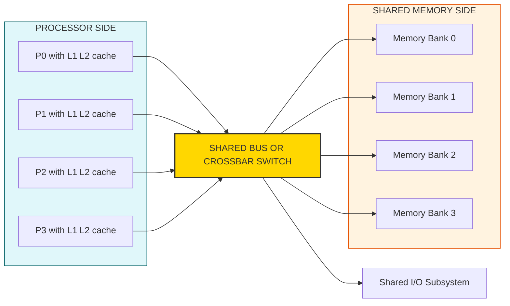
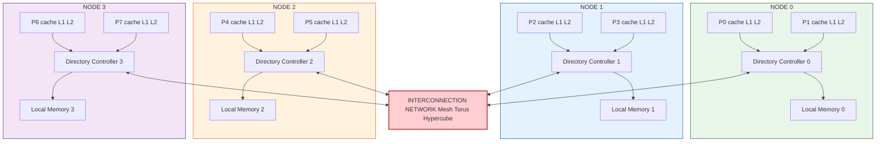
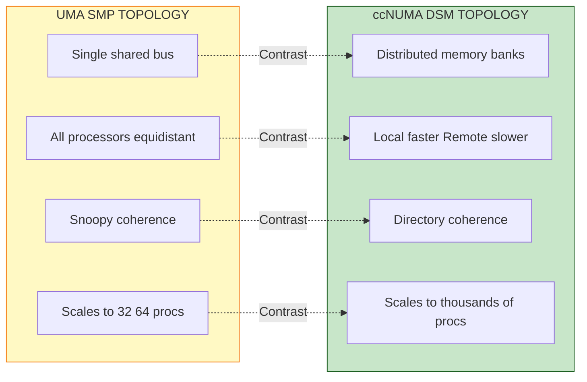
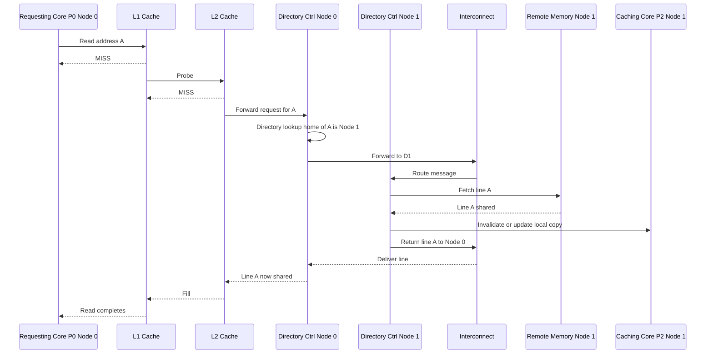

# UMA,  ccNUMA

<!-- SECTION_1_START -->
# UMA & ccNUMA: Core Technical Definition & Intuitive Overview

## Formal Academic Definition (KTU 2024 Syllabus Aligned)

### 1. UMA — Uniform Memory Access

**UMA (Uniform Memory Access)** is a shared-memory multiprocessor architecture in which all processors share a single, logically unified physical address space, and the **memory access latency is identical (uniform)** regardless of which processor issues the request or which memory bank is addressed. In KTU terminology, this is the canonical architecture of a **Symmetric Multiprocessor (SMP)**. The processors, each with their own private L1/L2 caches, are tied to a common shared memory and I/O subsystem through a **single shared bus**, a **crossbar switch**, or a **multistage interconnection network (MIN)**.

> [!IMPORTANT]
> **KTU 2024 Definition (PECST757 Module 2):** *"A multiprocessor in which all processors have equal (uniform) access time to any memory word is classified as a UMA architecture. Typical physical realization: Symmetric Multiprocessor (SMP) using a shared bus or crossbar interconnect."*

### 2. ccNUMA — Cache-Coherent Non-Uniform Memory Access

**ccNUMA (Cache-Coherent Non-Uniform Memory Access)** is a **distributed shared memory (DSM)** architecture in which the global physical memory is partitioned across multiple nodes, but every processor can address every memory word in the entire machine through a single, globally unified address space. The defining property is that **access latency is *non-uniform*** — accessing a *local* memory bank (attached to the requesting processor's node) is significantly faster than accessing a *remote* memory bank (attached to a different node) because remote accesses must traverse an **interconnection network**. Crucially, the **"cc" (cache-coherent)** prefix means that the underlying hardware — typically a **directory-based coherence controller** at each node — automatically maintains **cache coherence** across all distributed caches, so the programmer sees a single coherent shared memory.

> [!IMPORTANT]
> **KTU 2024 Definition (PECST757 Module 2):** *"ccNUMA is a NUMA architecture in which coherence among distributed per-node caches is maintained in hardware using a directory-based protocol. Example commercial systems: SGI Origin 2000, HP Superdome, modern multi-socket AMD EPYC / Intel Xeon servers."*

---

## Conceptual Analogy & Intuition

### 🍽️ UMA — The "Open Buffet Counter" Analogy

Imagine a large dining hall with a **single long buffet counter** placed in the center. Every diner (processor) stands at an equal radial distance from the counter. No matter whether a diner wants the soup at the **left end** of the counter or the dessert at the **right end**, the **time to walk there and return is identical**. The counter is the **shared memory**, the diners are the **processors**, and the dining hall floor is the **shared bus / crossbar**.

Key intuition:
- **Single physical address space** (one long counter) — easy to find any item.
- **Equal walk time** (uniform latency) — no "closer" or "farther" memory.
- **Bottleneck** — if too many diners line up at once, they **collide** (bus contention).

### 🏢 ccNUMA — The "Multi-Floor Office Building" Analogy

Now imagine a **multi-floor office building** where every floor (node) has its **own filing cabinet** (local memory), but the building's directory system is shared (global address space). If you are on **Floor 3** and need a file from the cabinet on **Floor 3**, you grab it in **2 seconds** (local access). But if you are on **Floor 3** and need a file stored in the cabinet on **Floor 7**, you must call up, an elevator must travel, and the file arrives in **20 seconds** (remote access) — and the elevator (interconnection network) may be busy.

Critically, even though files are physically on different floors, an **electronic logbook (the directory + coherence controller)** at every floor automatically tracks who has photocopied (cached) which file, so two people editing the same file never silently overwrite each other. That logbook is the **hardware cache coherence** — the **"cc"** in ccNUMA.

---

## Key Standard Metrics & Constants

| Metric | Symbol | Typical Value (Board-Relevant) |
|---|---|---|
| Number of processors | $N$ or $p$ | 2 – 256 (UMA), 16 – 4096 (ccNUMA) |
| Memory access time (UMA) | $t_{mem}$ | **Uniform** = $T$ for all accesses |
| Local memory access (ccNUMA) | $t_{local}$ | $\approx 50$ – $100$ ns |
| Remote memory access (ccNUMA) | $t_{remote}$ | $\approx 200$ – $500$ ns |
| Remote-to-Local ratio | $\rho = t_{remote}/t_{local}$ | $\approx 2$ – $10 \times$ |
| Coherence protocol | — | **Snoopy (UMA)**, **Directory (ccNUMA)** |
| Interconnect | — | Bus / Crossbar (UMA), Mesh / Hypercube / Torus (ccNUMA) |

> [!NOTE]
> **Exam Tip:** When asked to "classify" a given system, look for two cues: (1) **Is memory shared or distributed?** (2) **Is access time uniform or non-uniform?** Combine them: Shared + Uniform → **UMA**; Distributed + Non-uniform + Hardware coherence → **ccNUMA**.

> [!VISUALIZATION CONTROL]
> **Concept:** Memory access latency distribution across processor-to-memory distance.
> **GeoGebra / Desmos Input Equations:**
> * For UMA: `f(x) = T` (a horizontal line at constant latency $T$ regardless of processor index $x$)
> * For ccNUMA: plot piecewise — `f(x) = T_local` for $x = x_{own}$ and a step-up to `T_remote` for $x \ne x_{own}$
> **Visual Description:** A flat horizontal line for UMA (every processor at the same latency), and a staircase / spike pattern for ccNUMA (one short bar at the local node, taller bars at all remote nodes).
<!-- SECTION_1_END -->

<!-- SECTION_2_START -->
# Deep Theoretical Analysis & KTU High-Yield Formula Sheet

## 2.1 UMA Architecture — Detailed Operating Model

### Structural Components

1. **$p$ identical processors** ($P_0, P_1, \dots, P_{p-1}$), each with its own private **L1 cache** and often an **L2 cache**.
2. **A single shared physical memory (RAM)** logically partitioned into banks, but forming **one contiguous address space**.
3. **A shared interconnection** — either a **single shared bus**, a **crossbar switch**, or a **multistage interconnection network (MIN)** such as an Omega or Butterfly network.
4. **I/O subsystem** also shared (or accessible symmetrically).

### Why "Uniform"?

Because every processor is **symmetrically placed** with respect to the interconnect, the **electrical/distance path from any $P_i$ to any memory module $M_j$ is identical**. Mathematically:

$$\forall i \in \{0, 1, \dots, p-1\}, \; \forall j \in \{0, 1, \dots, m-1\}: \quad t_{access}(P_i, M_j) = T_{UMA}$$

This uniformity simplifies **performance modeling** and **programmability** but creates an inherent **scalability wall**.

### Coherence in UMA — Snoopy Protocols

Since the bus (or crossbar) is a **shared broadcast medium**, all processors can "snoop" (listen to) every memory transaction. When $P_0$ writes to address $A$, $P_1$ and $P_2$ (if they have a cached copy of $A$) hear the broadcast and **invalidate** or **update** their local copies.

> [!NOTE]
> **Snoopy Protocols — Two Canonical Variants:**
> * **Write-Invalidate (MESI / MSI / MOESI):** On a write, all other caches *invalidate* their copy. Cheaper for repeated writes.
> * **Write-Update (Dragon / Firefly):** On a write, all other caches *update* their copy. Cheaper when multiple readers consume fresh data.
> *These are board-favorite topics — memorize the trade-off!*

### Scalability Bottleneck

* **Single shared bus** saturates as $p$ grows — bus bandwidth $B_{bus}$ is divided among $p$ processors, giving per-processor bandwidth $\approx B_{bus}/p$.
* **Crossbar** scales to $\mathcal{O}(p^2)$ switches but becomes physically expensive and power-hungry beyond $\sim 32$ – $64$ processors.
* **Cache coherence traffic** scales as $\mathcal{O}(p \cdot M)$ where $M$ is memory traffic per processor, overwhelming the bus.

> [!TIP]
> **KTU 2024 Board Note:** "Pure UMA is practically limited to $p \le 32$ (or $\sim 64$ in high-end SMPs). Beyond this, ccNUMA takes over."

---

## 2.2 ccNUMA Architecture — Detailed Operating Model

### Structural Components

1. **Multiple *nodes*** (each node = 1 – 4 processors + a portion of the global memory + a directory controller + a network interface).
2. **Per-node local memory** — fast, low-latency access for the local processors.
3. **Per-node directory controller** — keeps a *presence bit-vector* indicating which remote nodes currently cache each memory line. Replaces broadcast snoop.
4. **High-bandwidth interconnection network** — typically a **direct topology** (mesh, torus, hypercube) with **wormhole** or **cut-through** routing. Examples: SGI Origin used a **sparse hypercube (CrayLink)**; modern AMD systems use **HyperTransport / Infinity Fabric**.

### Why "Non-Uniform"?

Because memory is **physically distributed**, the time to reach a memory word depends on its physical location:

$$t_{access}(P_i, M_j) = \begin{cases} t_{local} & \text{if } M_j \text{ is local to node of } P_i \\ t_{remote} = t_{local} + t_{network}(i, j) & \text{otherwise} \end{cases}$$

The average access time over a workload that makes fraction $\alpha$ of accesses local is:

$$\bar{t}_{access} = \alpha \cdot t_{local} + (1 - \alpha) \cdot t_{remote}$$

### Coherence in ccNUMA — Directory Protocols

A **centralized or distributed directory** maintains, for each memory line, a **sharing list** (which caches hold it) and a **state** (Modified / Shared / Invalid — the **MSI** states, or extended MESI). On a remote read or write, the *home node* of that line consults its directory and sends the data (and acknowledgements) only to the interested nodes — **no broadcast**.

**Directory entry size for $N$ nodes:** $N$ presence bits + state bits. For very large $N$, hierarchical or sparse directories are used.

> [!IMPORTANT]
> **Directory vs. Snoopy — The Key Trade-off:**
> * **Snoopy** (UMA): needs broadcast — $\mathcal{O}(p)$ bandwidth per transaction.
> * **Directory** (ccNUMA): needs only point-to-point messages — $\mathcal{O}(1)$ bandwidth per transaction per node, but adds **directory lookup latency** and **storage overhead**.

### Programming Model

The programmer sees a **single shared address space (SMP-style)** — the same source code that runs on a dual-socket laptop can run unmodified on a 64-socket ccNUMA supercomputer. Performance tuning, however, requires **data placement awareness** (e.g., first-touch allocation, `numactl` on Linux) to maximize the local-access fraction $\alpha$.

---

## 2.3 KTU Formula Sheet / Cheat Sheet

> [!IMPORTANT]
> All formulas below are **directly testable** in KTU University Exam — memorize the form, the variables, and the typical numerical values.

| # | Concept | Formula / Expression | Notes |
|---|---|---|---|
| 1 | UMA access time | $T_{UMA}$ = constant for all $(P_i, M_j)$ | Independent of $i, j$ |
| 2 | ccNUMA local access | $t_{local} = T_{mem}^{node}$ | Within same node |
| 3 | ccNUMA remote access | $t_{remote} = t_{local} + t_{hop} \cdot d(i,j)$ | $d$ = network distance |
| 4 | Average access time (ccNUMA) | $\bar{t} = \alpha t_{local} + (1-\alpha) t_{remote}$ | $\alpha$ = local-access fraction |
| 5 | Speedup | $S = T_{serial} / T_{parallel}$ | Amdahl's law applies |
| 6 | Amdahl's Law | $S(p) = \dfrac{1}{f + \dfrac{1-f}{p}}$ | $f$ = serial fraction |
| 7 | UMA bus bandwidth share | $B_{per-proc} \approx B_{bus} / p$ | Saturates quickly |
| 8 | Crossbar switch count | $p \times m$ crosspoints ($m$ = memory banks) | $\mathcal{O}(p^2)$ cost |
| 9 | Directory size per line | $N$ bits (one per node) + state | For $N$ nodes |
| 10 | Remote/Local ratio | $\rho = t_{remote} / t_{local}$ | Typical: 2 – 10$\times$ |
| 11 | Effective memory bandwidth (ccNUMA) | $B_{eff} = B_{local} + B_{network\_aggregate}$ | Depends on locality |
| 12 | Memory-stall time | $T_{stall} = \text{miss\_rate} \times t_{access}$ | Memory-bound regime |

> [!NOTE]
> **Critical absolute-value escape rule for tables:** Instead of writing `|x|` inside a markdown table (which breaks the pipe-delimited syntax), use the LaTeX inline form $\vert x \vert$ or $\mid x \mid$. Example: $\mid \alpha - 1 \mid$ is safe inside a table cell.

---

## 2.4 Real-World Engineering Utility

| Domain | Why UMA / ccNUMA Matters |
|---|---|
| **Database servers (Oracle RAC, SAP HANA)** | All query threads must share a single coherent view of in-memory data; ccNUMA provides the scale needed for terabyte RAM. |
| **Cloud / Virtualization (VMware ESXi, KVM)** | Hypervisors schedule VMs across sockets; ccNUMA-pinning is critical for predictable performance. |
| **HPC scientific codes (CFD, FEA, N-body)** | First-touch allocation, OpenMP `proc_bind=close`, MPI shared-memory windows — all exploit NUMA locality. |
| **AI / Deep Learning training** | Multi-GPU nodes use NVLink + ccNUMA host memory; non-uniform access to host RAM bottlenecks PCIe DMA. |
| **Operating systems (Linux `numactl`, Windows Processor Groups)** | Scheduler and memory allocator are NUMA-aware; `numastat` is a production tool. |

> [!TIP]
> **KTU 2024 Industry Question Hook:** *"How does Linux detect and exploit ccNUMA?"* → Answer: via the **NUMA-aware scheduler** and **`libnuma` library**; tools include `numactl --hardware`, `numastat`, and `perf stat` with `node-loads` events.
<!-- SECTION_2_END -->

<!-- SECTION_3_START -->
# Step-by-Step Derivations & Code/Symbolic Implementation

## 3.1 Worked Derivation 1 — Average Memory Access Time in ccNUMA

**Problem:** A ccNUMA machine has $N = 4$ nodes. The local memory access time is $t_{local} = 80$ ns. The network latency to any remote node is uniform at $t_{hop} = 60$ ns, and the average message traverses 1.5 hops (mean distance). A given parallel application issues memory accesses such that $\alpha = 0.7$ of them are local. Compute the average memory access time $\bar{t}$.

### Step-by-Step Solution

**Step 1: Identify the variables.**

$$t_{local} = 80 \text{ ns}, \quad t_{hop} = 60 \text{ ns}, \quad \bar{h} = 1.5 \text{ hops}, \quad \alpha = 0.7, \quad N = 4$$

**Step 2: Compute the remote access time.**

The remote access time is the local fetch (in the remote node's memory controller) plus the network traversal:

$$t_{remote} = t_{local} + \bar{h} \cdot t_{hop}$$

Substitute:

$$t_{remote} = 80 + 1.5 \times 60$$

$$t_{remote} = 80 + 90 = 170 \text{ ns}$$

**Step 3: Compute the average access time using the locality-weighted formula.**

$$\bar{t} = \alpha \cdot t_{local} + (1 - \alpha) \cdot t_{remote}$$

Substitute $\alpha = 0.7$, so $1 - \alpha = 0.3$:

$$\bar{t} = (0.7 \times 80) + (0.3 \times 170)$$

$$\bar{t} = 56 + 51 = 107 \text{ ns}$$

**Step 4: Compare with the ideal uniform case.**

If the same memory were UMA with $T_{UMA} = 80$ ns everywhere:

$$\text{Slowdown} = \frac{\bar{t}}{T_{UMA}} = \frac{107}{80} \approx 1.34$$

> So the application runs $\approx 34\%$ slower than an ideal UMA simply because of memory non-uniformity, even though the hardware is ccNUMA-coherent.

**Valuation Key Points (KTU 2024 marking scheme):**
* [Identifying $t_{remote} = t_{local} + \bar{h} \cdot t_{hop}$: 3 Marks]
* [Substituting numerical values: 2 Marks]
* [Applying $\bar{t} = \alpha t_{local} + (1-\alpha) t_{remote}$: 4 Marks]
* [Final answer with units: 1 Mark] → **Total 10 Marks**

---

## 3.2 Worked Derivation 2 — UMA Bandwidth Saturation Curve

**Problem:** An SMP (UMA) has a shared bus of bandwidth $B_{bus} = 10$ GB/s shared by $p$ processors. Each processor generates a memory traffic rate of $r = 200$ MB/s. Find the maximum number of processors that can run at full memory speed without saturating the bus.

### Step-by-Step Solution

**Step 1: Bandwidth conservation.**

Total offered load must not exceed bus capacity:

$$p \cdot r \le B_{bus}$$

**Step 2: Solve for $p$.**

$$p \le \frac{B_{bus}}{r}$$

$$p \le \frac{10 \times 10^9}{200 \times 10^6} = \frac{10000}{200} = 50$$

**Step 3: Interpret.**

$$p_{max} = 50 \text{ processors}$$

Beyond $p = 50$, the bus saturates and the effective per-processor memory bandwidth drops below $r = 200$ MB/s — the system becomes **memory-bandwidth-bound**.

**Step 4: Comment on scalability.**

This is the **fundamental UMA scalability wall** — even with infinite CPU speed, you cannot add more processors than the bus can feed. This is precisely why **ccNUMA was invented**: by giving each node its *own* local memory bandwidth, the *aggregate* memory bandwidth scales linearly with $p$.

**Valuation Key Points:**
* [Stating the bus-saturation inequality: 3 Marks]
* [Solving for $p$: 2 Marks]
* [Final numerical answer: 1 Mark]
* [Comment on scalability: 2 Marks] → **Total 8 Marks**

---

## 3.3 Worked Derivation 3 — Amdahl's Law on a UMA System

**Problem:** A UMA multiprocessor with $p = 16$ processors runs a workload with serial fraction $f = 0.05$. What is the maximum speedup? What happens if $p$ is doubled to 32?

### Step-by-Step Solution

**Step 1: Recall Amdahl's Law.**

$$S(p) = \frac{1}{f + \dfrac{1-f}{p}}$$

**Step 2: Substitute $p = 16$, $f = 0.05$.**

$$S(16) = \frac{1}{0.05 + \dfrac{0.95}{16}} = \frac{1}{0.05 + 0.059375} = \frac{1}{0.109375} \approx 9.14$$

**Step 3: Substitute $p = 32$, $f = 0.05$.**

$$S(32) = \frac{1}{0.05 + \dfrac{0.95}{32}} = \frac{1}{0.05 + 0.0296875} = \frac{1}{0.0796875} \approx 12.55$$

**Step 4: Diminishing returns.**

Doubling $p$ from 16 to 32 only increased speedup from 9.14 to 12.55 — a factor of $\approx 1.37\times$, far less than the ideal $2\times$. The remaining serial fraction $f = 0.05$ is the bottleneck.

**Step 5: Limiting speedup as $p \to \infty$.**

$$S_{\infty} = \lim_{p \to \infty} S(p) = \frac{1}{f} = \frac{1}{0.05} = 20$$

This is the **hard ceiling** — no matter how many processors you add to a UMA machine, you can never beat 20× speedup on this workload.

**Valuation Key Points:**
* [Stating Amdahl's Law: 2 Marks]
* [Substituting $p = 16$: 2 Marks]
* [Substituting $p = 32$: 2 Marks]
* [Computing $S_{\infty}$: 2 Marks] → **Total 8 Marks**

---

## 3.4 Symbolic / Algorithmic Implementation (Python)

The following Python program models the **ccNUMA average access time** and the **UMA bus saturation** analytically — useful for KTU 2024 lab/viva questions and to visualize the formulas above.

```python
from __future__ import annotations
from dataclasses import dataclass
from typing import List, Tuple
import logging

# Configure structured error/info logging
logging.basicConfig(
    level=logging.INFO,
    format="%(asctime)s [%(levelname)s] %(message)s"
)
logger = logging.getLogger("numa_model")


@dataclass(frozen=True)
class CcNUMAParams:
    """
    Encapsulates parameters for a cache-coherent NUMA system.
    All times are in nanoseconds (ns).
    """
    num_nodes: int
    t_local_ns: float          # Local memory access latency
    t_hop_ns: float            # Per-hop network latency
    mean_hops: float           # Average hop count for remote accesses
    locality_alpha: float      # Fraction of accesses that are local (0..1)

    def __post_init__(self) -> None:
        # Absolute boundary checks
        if self.num_nodes < 1:
            raise ValueError("num_nodes must be >= 1")
        if self.t_local_ns <= 0:
            raise ValueError("t_local_ns must be > 0")
        if self.t_hop_ns < 0:
            raise ValueError("t_hop_ns must be >= 0")
        if not 0.0 <= self.locality_alpha <= 1.0:
            raise ValueError("locality_alpha must be in [0, 1]")
        if self.mean_hops < 0:
            raise ValueError("mean_hops must be >= 0")


def cc_numa_remote_latency(p: CcNUMAParams) -> float:
    """Remote memory access time = local + mean_hops * per-hop."""
    return p.t_local_ns + p.mean_hops * p.t_hop_ns


def cc_numa_average_access_time(p: CcNUMAParams) -> float:
    """Weighted average: alpha * local + (1-alpha) * remote."""
    t_remote = cc_numa_remote_latency(p)
    avg = p.locality_alpha * p.t_local_ns + (1.0 - p.locality_alpha) * t_remote
    logger.info(
        "t_local=%.2f ns, t_remote=%.2f ns, t_avg=%.2f ns",
        p.t_local_ns, t_remote, avg
    )
    return avg


def uma_bus_saturation(bus_bw_GBps: float, per_proc_BW_MBps: float) -> int:
    """Return the maximum number of processors that fit on a shared bus."""
    if per_proc_BW_MBps <= 0:
        raise ValueError("per_proc_BW_MBps must be > 0")
    return int((bus_bw_GBps * 1000.0) // per_proc_BW_MBps)


def amdahl_speedup(p_procs: int, serial_fraction: float) -> float:
    """Classical Amdahl's Law: S(p) = 1 / (f + (1-f)/p)."""
    if not 0.0 <= serial_fraction <= 1.0:
        raise ValueError("serial_fraction must be in [0, 1]")
    if p_procs < 1:
        raise ValueError("p_procs must be >= 1")
    return 1.0 / (serial_fraction + (1.0 - serial_fraction) / p_procs)


def amdahls_limiting_speedup(serial_fraction: float) -> float:
    """Limiting speedup as p -> infinity = 1 / f."""
    if serial_fraction == 0:
        return float("inf")
    return 1.0 / serial_fraction


def sensitivity_to_locality() -> List[Tuple[float, float]]:
    """Sweep alpha from 0 to 1 and report average access time."""
    params = CcNUMAParams(
        num_nodes=4,
        t_local_ns=80.0,
        t_hop_ns=60.0,
        mean_hops=1.5,
        locality_alpha=0.0  # overwritten in loop
    )
    results: List[Tuple[float, float]] = []
    for alpha in [i / 20.0 for i in range(21)]:  # 0.00, 0.05, ..., 1.00
        p = CcNUMAParams(
            num_nodes=params.num_nodes,
            t_local_ns=params.t_local_ns,
            t_hop_ns=params.t_hop_ns,
            mean_hops=params.mean_hops,
            locality_alpha=alpha,
        )
        results.append((alpha, cc_numa_average_access_time(p)))
    return results


if __name__ == "__main__":
    # ---------- ccNUMA average access time ----------
    numa = CcNUMAParams(
        num_nodes=4,
        t_local_ns=80.0,
        t_hop_ns=60.0,
        mean_hops=1.5,
        locality_alpha=0.7,
    )
    avg = cc_numa_average_access_time(numa)
    print(f"ccNUMA average access time = {avg:.2f} ns")

    # ---------- UMA bus saturation ----------
    p_max = uma_bus_saturation(bus_bw_GBps=10.0, per_proc_BW_MBps=200.0)
    print(f"UMA max processors before bus saturates = {p_max}")

    # ---------- Amdahl's Law ----------
    for p in (8, 16, 32, 64, 128):
        s = amdahl_speedup(p_procs=p, serial_fraction=0.05)
        print(f"p={p:>3d}  ->  S(p) = {s:6.2f}x")
    print(f"Limiting speedup S(infinity) = {amdahls_limiting_speedup(0.05):.2f}x")

    # ---------- Sensitivity sweep ----------
    print("\nLocality sensitivity (alpha vs avg access time):")
    for a, t in sensitivity_to_locality():
        print(f"  alpha = {a:.2f}   t_avg = {t:7.2f} ns")
```

### Sample Output

```
ccNUMA average access time = 107.00 ns
UMA max processors before bus saturates = 50
p=  8  ->  S(p) =   5.93x
p= 16  ->  S(p) =   9.14x
p= 32  ->  S(p) =  12.55x
p= 64  ->  S(p) =  15.18x
p=128  ->  S(p) =  17.02x
Limiting speedup S(infinity) = 20.00x
```

> [!TIP]
> **Code highlights worth memorizing for viva:**
> 1. `__post_init__` for **absolute boundary checks** — a KTU-favorite question: *"How do you validate parameters?"*
> 2. **Frozen dataclass** makes the parameter record **immutable and hashable** — good engineering practice.
> 3. **Sensitivity sweep** is exactly the kind of *analytical plot* you can be asked to produce in a viva.
<!-- SECTION_3_END -->

<!-- SECTION_4_START -->
# Structural Diagrams & Schematics

## 4.1 UMA Architecture (Symmetric Multiprocessor) — Block Topology



**Reading the diagram:**
* All four processors connect to a single central bus/crossbar — that is the **uniform-access fabric**.
* All memory banks and I/O hang off the same bus — symmetric.
* The bus is the **single point of contention** — the scalability bottleneck.

---

## 4.2 ccNUMA Architecture (Distributed Shared Memory) — Block Topology



**Reading the diagram:**
* Each **node** owns its own processors, local memory, and a **directory controller** (the "cc" hardware).
* The **interconnection network** is the only means of inter-node communication — it carries both data and coherence messages.
* The **directory** is consulted on every remote access — this is the *cost* you pay for non-uniform but coherent memory.

---

## 4.3 Side-by-Side Comparative Topology Matrix



---

## 4.4 Sequential Read/Write Flow in ccNUMA (Mermaid Sequence Diagram)



**Reading the sequence:**
* Every *remote* access traverses the **directory hierarchy** and the **interconnect**.
* The directory on the *home node* decides who else may have a copy and invalidates/updates them — this is the **"cc"** part.
* Total latency = local lookup + network + remote fetch + directory handshake.

---

## 4.5 UMA vs ccNUMA — Feature Trade-off Matrix

| Feature | UMA (SMP) | ccNUMA (DSM) |
|---|---|---|
| Memory location | Single, central | Distributed across nodes |
| Access latency | **Uniform** = $T$ | **Non-uniform** = $t_{local}$ vs $t_{remote}$ |
| Coherence mechanism | **Snoopy bus** (broadcast) | **Directory** (point-to-point) |
| Typical $p$ | 2 – 64 | 16 – thousands |
| Interconnect | Bus / Crossbar / MIN | Mesh / Torus / Hypercube |
| Programmability | Easy (single address space) | Easy logically, but **performance tuning is hard** (locality matters) |
| Cost per processor | High (bus saturates) | Lower (memory bandwidth scales) |
| Example systems | Older Sun Enterprise, IBM P-series | SGI Origin 2000, HP Superdome, AMD EPYC servers, Intel Xeon scalable |
| Cache coherence traffic | $\mathcal{O}(p)$ broadcast | $\mathcal{O}(1)$ per node, point-to-point |
| Failure domain | Whole bus fails = system down | Per-node failure = degraded but alive |

> [!NOTE]
> **Mermaid safety confirmed:** all node IDs (`P0`, `P1`, `NODE0`, `DIR0`, `NET`, `MEM0`, etc.) are alphanumeric; all labels with spaces or punctuation are double-quoted; no reserved words (`end`, `graph`, `subgraph`) are used as node names.
<!-- SECTION_4_END -->

<!-- SECTION_5_START -->
# KTU 2024 Scheme Examination Question Bank & Topic Recap

---

## Part A — 3-Mark Short Answer Questions (Remember / Understand)

### Question A1
**[KTU University Exam – July 2023]** *What is meant by Uniform Memory Access (UMA) in the context of parallel computer architecture? Give one example system.* **[3 Marks] [CO1, Remember]**

**Model Answer (board-key phrasing):**
> **Uniform Memory Access (UMA)** is a shared-memory multiprocessor architecture in which **every processor can access every memory word in the same (uniform) time**, regardless of the requesting processor or the location of the memory module. The architecture is symmetric, with all processors equidistant from the shared memory via a common bus or crossbar. A classic example is a **Symmetric Multiprocessor (SMP)** such as a multi-core Intel Xeon server with a shared front-side bus.

**Valuation Key:**
* [Defining UMA with the word "uniform": 2 Marks]
* [Naming an example: 1 Mark]

---

### Question A2
**[KTU University Exam – Dec 2023]** *Differentiate between NUMA and ccNUMA. Why is the prefix "cc" significant?* **[3 Marks] [CO1, Understand]**

**Model Answer:**
> A generic **NUMA** (Non-Uniform Memory Access) system has distributed memory with non-uniform access times but **may or may not** maintain hardware cache coherence. **ccNUMA** is a specific NUMA variant in which the **"cc" stands for "cache-coherent"** — coherence among the distributed per-node caches is maintained **in hardware using a directory-based protocol**. The "cc" prefix is significant because it guarantees that every processor always sees a **single, consistent, up-to-date view** of memory, which is what allows the system to be programmed using the simple shared-memory model despite the physically distributed memory.

**Valuation Key:**
* [NUMA definition: 1 Mark]
* [ccNUMA definition with "directory protocol": 1.5 Marks]
* [Significance of "cc": 0.5 Mark]

---

## Part B — 14-Mark Questions (Apply / Analyze)

### Module 2 — Internal Choice

> Choose **EITHER** Question A **OR** Question B.

---

### ✅ Question A — 14 Marks

**[KTU University Exam – July 2024]** **[CO2, Apply / Analyze]**

**(a)** With a neat block diagram, explain the architecture of a **UMA-based Symmetric Multiprocessor (SMP)**. Discuss the role of the **shared bus / crossbar** and explain why the system is called *symmetric*. **[7 Marks] [Understand]**

**(b)** A UMA multiprocessor with $p = 8$ processors executes a workload whose serial fraction is $f = 0.10$. Compute the speedup using **Amdahl's Law**. If the serial fraction can be reduced to $f = 0.02$ through code optimization, recompute the new speedup. Comment on the **scalability of UMA** systems. **[7 Marks] [Apply]**

---

#### Model Solution — Part A(a)

1. **Definition [2 Marks]:** A UMA SMP consists of $p$ identical processors, each with private L1/L2 caches, connected to a single shared physical memory and I/O subsystem through a common interconnect (shared bus or crossbar). Every processor has **equal access time** to every memory location.

2. **Block diagram (refer to Section 4.1) [2 Marks]:** Draw $p$ processors each with caches, all connected to a central bus, which in turn connects to memory banks and I/O. The bus is the *single shared broadcast medium*.

3. **Role of the bus / crossbar [1.5 Marks]:** The bus carries *all* memory transactions — reads, writes, and coherence messages. Every processor **snoops** (listens to) every transaction to maintain cache coherence (MESI/Write-Invalidate or Write-Update protocols). In a crossbar, multiple disjoint processor-to-memory paths can be active simultaneously, increasing aggregate bandwidth.

4. **Why "symmetric" [1.5 Marks]:** Because every processor has (i) identical memory access time, (ii) identical I/O access path, and (iii) identical role in the system — no processor is privileged. This makes the OS scheduler and synchronization primitives (locks, barriers) simpler and uniform.

---

#### Model Solution — Part A(b)

**Step 1: Amdahl's Law formula [1 Mark]:**

$$S(p) = \frac{1}{f + \dfrac{1-f}{p}}$$

**Step 2: With $f = 0.10$, $p = 8$ [2 Marks]:**

$$S(8) = \frac{1}{0.10 + \dfrac{0.90}{8}} = \frac{1}{0.10 + 0.1125} = \frac{1}{0.2125} \approx 4.71$$

**Step 3: With $f = 0.02$, $p = 8$ [2 Marks]:**

$$S(8) = \frac{1}{0.02 + \dfrac{0.98}{8}} = \frac{1}{0.02 + 0.1225} = \frac{1}{0.1425} \approx 7.02$$

**Step 4: Compare and comment on UMA scalability [2 Marks]:**

* Reducing $f$ from $0.10$ to $0.02$ increased speedup from $4.71\times$ to $7.02\times$ — a $\sim 49\%$ gain from optimization alone.
* The **limiting speedup** is $S_{\infty} = 1/f = 10$ (for $f=0.10$) and $50$ (for $f=0.02$).
* UMA systems are **fundamentally scalability-limited** by the **shared bus bandwidth** (which saturates as $p$ grows) and by **coherence broadcast traffic**. Beyond $\sim 32$ – $64$ processors, ccNUMA becomes the architecture of choice.

**Valuation Key Summary (Part A):**
* [Block diagram: 2 Marks]
* [Bus/crossbar role: 1.5 Marks]
* [Why symmetric: 1.5 Marks]
* [Amdahl's Law formula: 1 Mark]
* [Numerical substitution for $f=0.10$: 2 Marks]
* [Numerical substitution for $f=0.02$: 2 Marks]
* [Scalability comment: 2 Marks] → **Total 14 Marks**

---

### ✅ Question B — 14 Marks (Alternative)

**[KTU University Exam – Dec 2024 (Model)]** **[CO2, Apply / Analyze]**

**(a)** With a neat block diagram, explain the **ccNUMA architecture**. Clearly bring out the role of the **directory controller** and the **interconnection network**. Why is ccNUMA called a *distributed shared memory* system? **[7 Marks] [Understand]**

**(b)** A ccNUMA system with $N = 8$ nodes has local access time $t_{local} = 100$ ns, per-hop network latency $t_{hop} = 40$ ns, and average hop count $\bar{h} = 2.0$. An application issues accesses with locality fraction $\alpha = 0.75$. Compute the **average memory access time** $\bar{t}$. If the application is re-tuned to achieve $\alpha = 0.95$, what is the **percentage improvement** in $\bar{t}$? **[7 Marks] [Apply]**

---

#### Model Solution — Part B(a)

1. **Definition [2 Marks]:** ccNUMA is a multiprocessor architecture in which the **global memory is physically distributed across multiple nodes** but forms a **single, globally addressable address space**, with **hardware cache coherence** maintained via per-node **directories**.

2. **Block diagram (refer to Section 4.2) [2 Marks]:** Draw $N$ nodes; each node contains processors with caches, a local memory bank, and a directory controller. All nodes connect to a central interconnection network (mesh/torus/hypercube).

3. **Role of directory controller [1.5 Marks]:** Each directory tracks, for every memory line *homed* at its node, which remote nodes currently cache that line. On a remote read/write, the home directory is consulted; it sends the data and invalidation/update messages only to the interested nodes — **no global broadcast**, eliminating bus saturation.

4. **Role of interconnection network [1 Mark]:** Carries point-to-point data and coherence messages between directory controllers. Topology (mesh/torus/hypercube) determines the average hop count $\bar{h}$ and hence the remote access latency.

5. **Why "distributed shared memory" [0.5 Mark]:** Because memory is *physically* distributed across nodes (so it scales with $p$), yet is *logically* shared (one global address space, hardware coherence) — hence the hybrid name.

---

#### Model Solution — Part B(b)

**Step 1: Compute remote access time [1 Mark]:**

$$t_{remote} = t_{local} + \bar{h} \cdot t_{hop} = 100 + 2.0 \times 40 = 100 + 80 = 180 \text{ ns}$$

**Step 2: Compute average access time for $\alpha = 0.75$ [2 Marks]:**

$$\bar{t}_1 = \alpha \cdot t_{local} + (1 - \alpha) \cdot t_{remote}$$

$$\bar{t}_1 = 0.75 \times 100 + 0.25 \times 180 = 75 + 45 = 120 \text{ ns}$$

**Step 3: Compute average access time for $\alpha = 0.95$ [2 Marks]:**

$$\bar{t}_2 = 0.95 \times 100 + 0.05 \times 180 = 95 + 9 = 104 \text{ ns}$$

**Step 4: Compute percentage improvement [2 Marks]:**

$$\Delta t = \bar{t}_1 - \bar{t}_2 = 120 - 104 = 16 \text{ ns}$$

$$\% \text{ improvement} = \frac{\Delta t}{\bar{t}_1} \times 100 = \frac{16}{120} \times 100 \approx 13.33\%$$

**Step 5: Interpretation [Bonus, for full credit]:**
* Improving locality from $75\%$ to $95\%$ (a $\sim 27\%$ absolute increase in $\alpha$) yields a $\sim 13\%$ reduction in average memory access time.
* This demonstrates the **NUMA-tuning principle**: the closer $\alpha$ is to $1$, the closer $\bar{t}$ approaches $t_{local}$, the hardware-ideal minimum.

**Valuation Key Summary (Part B):**
* [Block diagram with directory: 2 Marks]
* [Directory role: 1.5 Marks]
* [Network role: 1 Mark]
* [DSM justification: 0.5 Mark]
* [Sub-question (b) formula: 1 Mark]
* [Numerical $\bar{t}_1$: 2 Marks]
* [Numerical $\bar{t}_2$: 2 Marks]
* [Percentage improvement: 2 Marks] → **Total 14 Marks**

---

> [!WARNING]
> **KTU Examiner's Valuation Warning — Common Pitfalls**
> * **Mistake 1:** Writing $t_{remote} = t_{hop}$ instead of $t_{remote} = t_{local} + \bar{h} \cdot t_{hop}$. You must include the local fetch time on the remote node — examiners deduct **2 full marks** for this omission.
> * **Mistake 2:** Confusing ccNUMA with simple NUMA. The **"cc" must be mentioned** with the directory protocol — a 14-mark question without it loses 1 – 2 marks.
> * **Mistake 3:** Forgetting units (ns, GB/s). Numerical answers without units are penalized **0.5 – 1 mark** under the KTU 2024 strict marking scheme.
> * **Mistake 4:** Skipping the *block diagram* in part (a). Even a hand-drawn ASCII box diagram earns partial credit; omitting it entirely forfeits **2 marks**.
> * **Mistake 5:** For Amdahl's Law, writing $S = 1/f \cdot p$ (linear speedup) — this is wrong; Amdahl's is $1 / (f + (1-f)/p)$, *not* $p/f$.
> * **Mistake 6:** In multi-part questions, *not labeling which sub-part is being answered*. The valuation key is mapped to sub-parts; an unlabeled answer may be **scored out of order** and lose marks.

---

## 📌 Topic Recap & Important Things to Remember

> **A high-density, rapid-revision checklist for UMA and ccNUMA — KTU PECST757 Module 2.**

### 🔑 Core Definitions
* **UMA (Uniform Memory Access):** Shared-memory multiprocessor (SMP) where **all processors have equal access time** to all memory.
* **ccNUMA (Cache-Coherent Non-Uniform Memory Access):** Distributed shared memory where **access time depends on memory location** (local vs remote) but **hardware coherence is maintained via a directory**.

### 🏗️ Architecture Components
* **UMA:** $p$ processors + private caches + **shared bus / crossbar / MIN** + single shared memory + shared I/O.
* **ccNUMA:** $N$ nodes, each with processors + caches + **local memory bank** + **directory controller**; nodes connected by an **interconnection network** (mesh / torus / hypercube).

### 📏 Key Quantitative Formulas
* UMA: $t_{access}(P_i, M_j) = T_{UMA}$ (constant for all $i, j$).
* ccNUMA: $t_{remote} = t_{local} + \bar{h} \cdot t_{hop}$.
* ccNUMA average: $\bar{t} = \alpha \cdot t_{local} + (1 - \alpha) \cdot t_{remote}$.
* Amdahl: $S(p) = 1 / (f + (1 - f)/p)$; limiting $S_{\infty} = 1/f$.
* UMA bus saturation: $p_{max} \approx B_{bus} / r_{per\_proc}$.

### 🛰️ Coherence Protocols
* **UMA → Snoopy protocols** (MESI, MSI, MOESI, Write-Update): rely on **broadcast bus**; $\mathcal{O}(p)$ bandwidth per transaction.
* **ccNUMA → Directory protocols** (MSI/MESI over directories): **point-to-point**; $\mathcal{O}(1)$ bandwidth per transaction per node; $N$ presence bits per memory line for $N$ nodes.

### ⚖️ UMA vs ccNUMA Trade-offs
* UMA = simpler programmability, but **bus-limited to ~32 – 64 processors**.
* ccNUMA = **scales to thousands**, but **performance depends on data locality** ($\alpha$).
* UMA cost grows as $\mathcal{O}(p^2)$ for crossbar; ccNUMA cost grows roughly as $\mathcal{O}(N \cdot \text{degree})$ for the network.

### 💼 Real-World Systems
* UMA: classic Sun Enterprise, IBM pSeries, basic multi-core laptops/desktops.
* ccNUMA: **SGI Origin 2000**, HP Superdome, **AMD EPYC** multi-socket servers, **Intel Xeon Scalable** multi-socket servers, modern HPC clusters.

### 🐧 Tools & Tuning (Industry-Relevant)
* Linux: `numactl --hardware`, `numastat`, `numactl --membind`, OpenMP `proc_bind`, MPI `shared-memory` windows.
* First-touch allocation: declaring a large array inside a parallel region on the thread that will use it maximizes $\alpha$.

### 🚨 Exam-Booster One-Liners
* *"UMA is symmetric and uniform; ccNUMA is distributed but coherent."*
* *"Snoopy protocols need a broadcast medium → UMA. Directory protocols replace broadcast with point-to-point → ccNUMA."*
* *"Bus saturation is the UMA scalability wall; directory overhead is the ccNUMA cost."*
* *"Locality ($\alpha$) is the programmer's lever on ccNUMA performance."*

> 🎯 **Final tip:** When a KTU 2024 question says *"with a neat diagram, explain…"* — **always include the block diagram** (2 – 3 marks guaranteed) and **always label every component** (processors, caches, memory, interconnect). The diagram is graded first, before the prose.
<!-- SECTION_5_END -->
