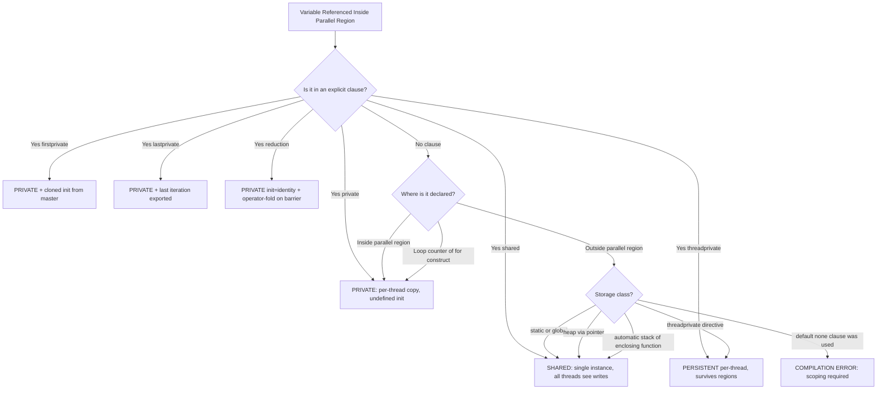
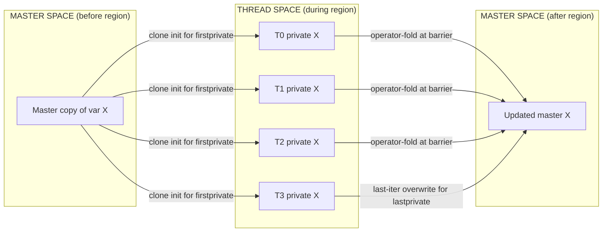
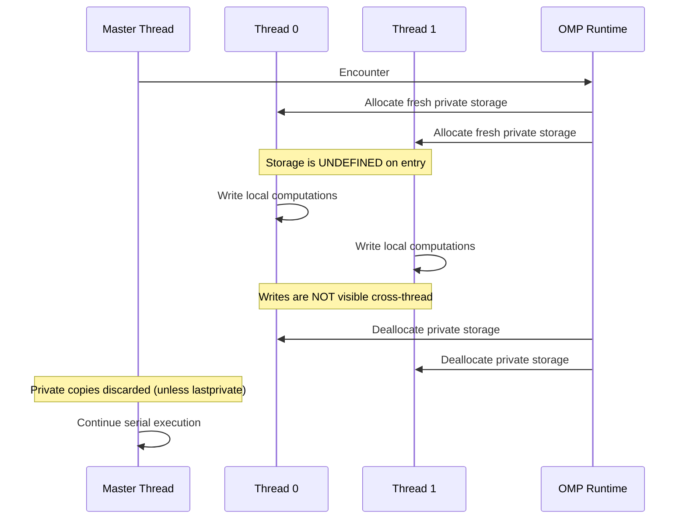
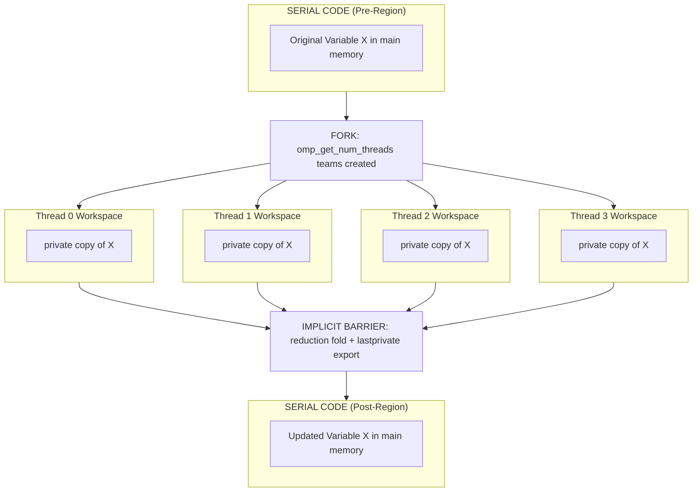

# Data scoping

<!-- SECTION_1_START -->
# Data Scoping in Shared Memory Parallel Programming

> [!IMPORTANT]
> **KTU 2024 Scheme — PECST757 (High Performance Computing) | Module 3 (Shared) | Topic: Data Scoping**
> **Course Outcome Mapped:** CO3 — Design and analyse parallel algorithms for shared memory architectures using OpenMP.

---

## 1.1 Formal Definition (KTU Syllabus Terminology)

**Data Scoping** in shared memory parallel programming (specifically OpenMP) is the mechanism by which the programmer explicitly or implicitly defines the **visibility, lifetime, and accessibility** of variables across multiple threads executing a parallel region. It governs whether a variable exists as a **single shared instance** common to all threads or as **multiple thread-private instances**, and whether modifications performed by one thread are visible to others.

In OpenMP, the data-scoping model is implemented through **data-sharing attribute clauses** attached to *parallel* and *work-sharing* constructs, complemented by storage association rules defined by the execution model.

> [!NOTE]
> **OpenMP Memory Model Snapshot**
> Threads of a team share memory but have their own **program counter, stack, and registers**. Data scoping bridges the gap between the *logical sharing* of variables and the *physical* distribution of storage.

---

## 1.2 Intuitive Analogy — The Whiteboard vs Personal Notebook

Imagine a group of **five interns** working in one office on a joint project:

| Real-World Object | Parallel Analogue |
|---|---|
| A **whiteboard** on the wall — anyone can read or erase what others wrote. | **Shared variable** — a single memory location accessible by all threads. |
| Each intern's **personal notebook** — only they can read or write their own copy. | **Private variable** — a thread-local copy, hidden from other threads. |
| A boss gives each intern a **photocopied page** from the whiteboard before they start. | **firstprivate** — thread-private copy *initialised* from the original shared value. |
| At the end, the intern with the **highest seniority** submits his notebook as the official record. | **lastprivate** — value of the last loop iteration is exported to the shared master copy. |
| A **communal fruit basket** where everyone deposits apples and at the end the count is summed. | **reduction** — aggregated using an associative operator (+, *, max, min, \&, \|, \&\&, \|\|, ^). |

**Data scoping = deciding, for every variable in a parallel region, whether it behaves like the whiteboard or the personal notebook.**

> [!TIP]
> If two interns simultaneously erase-and-rewrite the same corner of the whiteboard, a *race condition* occurs. Data scoping is the first line of defence against such races.

---

## 1.3 Physical Constants and Defaults

- **Default data-sharing attribute** for variables in a `parallel` region: **`shared`**.
- **Default for the loop iteration variable** in a `#pragma omp for` construct: **`private`**.
- **Default for variables declared *inside* the parallel region**: **`private`**.
- **Number of threads** determined by `OMP_NUM_THREADS` environment variable (default = number of cores available).
- **Function used to query thread identity**: `omp_get_thread_num()` (returns $0$ to $N-1$).

> [!IMPORTANT]
> **Kerala University Exam Favourite:** *"What is the default data-sharing attribute of a variable declared outside a parallel region but referenced inside it?"* — Answer: **shared**.

<!-- SECTION_1_END -->

<!-- SECTION_2_START -->
# Deep Theoretical Analysis & KTU High-Yield Formula Sheet

## 2.1 The OpenMP Storage Association Rules

When a thread enters a parallel region, the OpenMP runtime must map every referenced variable to one of two physical storage classes: **shared memory** or **thread-private memory**. The binding is decided by the following deterministic rules (in order of precedence):

1. **Explicit clause wins.** If a `shared(...)`, `private(...)`, `firstprivate(...)`, `lastprivate(...)`, or `reduction(...)` clause mentions the variable, that attribute is final.
2. **Implicit `private` rule:**
   * The canonical loop counter of a `for`/`do` construct.
   * Variables declared *inside* the parallel region (local automatic variables of the structured block).
   * Variables declared inside a `parallel` construct's compound statement.
3. **Implicit `shared` rule (default):** All other referenced variables (including heap, static, and enclosing function's stack variables).
4. **`threadprivate` rule:** Variables listed in a `#pragma omp threadprivate(list` directive retain *thread-local* storage across multiple parallel regions of the same team.

---

## 2.2 The Six Core Data-Scoping Clauses

| Clause | Lifetime | Initial Value in Thread | Final Value Exported | Typical Use |
|---|---|---|---|---|
| `shared(list)` | Entire parallel region | Same as before region | Last write visible to all | Read-only inputs, accumulators that use atomic |
| `private(list)` | Parallel region | **Undefined** | Discarded | Scratch variables, indices, temporaries |
| `firstprivate(list)` | Parallel region | **Cloned from original** | Discarded | Loop seeds, constants needed locally |
| `lastprivate(list)` | Parallel region | Undefined | **Last iteration's value exported** | Carrying the result of the final loop step |
| `reduction(op:list)` | Parallel region | **Identity element of op** | **Operator-folded across threads** | Sum, product, max, min, logical-OR, bitwise-XOR |
| `threadprivate(list)` | Whole program | Persists between parallel regions | Persists | Reusable per-thread caches, RNG state |

> [!WARNING]
> Reading a `private` variable before writing inside the thread produces **undefined behaviour** — the value is the garbage left on the thread's fresh stack frame.

---

## 2.3 Formula Sheet — Reduction Operators and Their Identity Elements

| Operator | Symbol | Identity Element $e$ such that $a \ op \ e = a$ | Use Case |
|---|---|---|---|
| Addition | `+` | $0$ | Dot product, sum reduction |
| Multiplication | `*` | $1$ | Factorial, product reduction |
| Subtraction | `-` | $0$ | Asymmetric reductions (rare) |
| Maximum | `max` | $-\infty$ (smallest representable) | Tracking largest value |
| Minimum | `min` | $+\infty$ (largest representable) | Tracking smallest value |
| Bitwise AND | `\&` | All-ones (bitmask of $\sim 0$) | Masking all flags |
| Bitwise OR | `\|` | $0$ | Combining flag sets |
| Bitwise XOR | `^` | $0$ | Parity, light-switch toggle |
| Logical AND | `&&` | `true` (1) | All-of test |
| Logical OR | `\|\|` | `false` (0) | Any-of test |

Mathematically, for $T$ threads each producing a partial result $x_t$:

$$X_{\text{final}} = \bigotimes_{t=0}^{T-1} x_t = x_0 \ op \ x_1 \ op \ x_2 \ \ldots \ op \ x_{T-1}$$

> The OpenMP runtime guarantees **associativity and (where the operator allows) commutativity** so that the fold order is irrelevant for the final value.

---

## 2.4 Engineering Utility — Where Data Scoping Lives in Production

| Domain | Use of Data Scoping |
|---|---|
| **Numerical Kernels (BLAS, LAPACK)** | Parallel reduction in `dgemv` (matrix-vector) and `ddot` (dot product) with `reduction(+:sum)`. |
| **Image Processing** | Each thread filters a tile of pixels using a `firstprivate` convolution kernel. |
| **Monte Carlo Simulation** | Each thread owns a `threadprivate` random-number generator state to guarantee reproducibility. |
| **Graph Traversal (BFS / DFS)** | A `shared` frontier queue is consumed by all workers while `private` next-hop buffers prevent contention. |
| **Machine Learning** | Mini-batch gradient descent: each thread computes a gradient on a slice (`private` slice pointer), then `reduction(+:grad)` merges them. |
| **Real-time Signal Processing** | `lastprivate` carries the final FFT bin out of a parallel loop into the shared spectrum buffer. |

> [!NOTE]
> A famous industrial example: **Intel MKL's parallel DGEMM** uses OpenMP under the hood with carefully scoped `private` micro-tile accumulators to avoid false sharing on cache lines.

---

## 2.5 Lifetime vs Visibility — A Critical Distinction

Two orthogonal properties govern every variable in a parallel region:

- **Visibility (Sharing):** *Which* threads can refer to the storage by name?
- **Lifetime (Storage):** *When* does the storage exist?

A `threadprivate` variable is **invisible to other threads** (so it is *private* in visibility) but its **storage persists** across multiple `parallel` regions (unlike an ordinary `private` variable, whose storage is created and destroyed per region). This subtle distinction is the reason `threadprivate` is the right tool for long-lived per-thread state such as an RNG.

<!-- SECTION_2_END -->

<!-- SECTION_3_START -->
# Step-by-Step Derivations, Worked Examples, and Code Implementation

## 3.1 Exhaustive Derivation — Why Reduction Equals $x_0 \ op \ x_1 \ op \ \ldots$

**Problem.** Given $T$ threads each computing a local partial sum $x_t$, show that the OpenMP `reduction(+:x)` clause yields the same result as the serial fold $S = \sum_{t=0}^{T-1} x_t$.

**Derivation.**

Let each thread begin with the *private* initial value $x_t^{(0)} = e = 0$ (the identity of $+$).

After the parallel work, thread $t$ holds a final value $x_t^{(f)}$ in its private copy.

The OpenMP runtime performs the **post-reduction fold** at the implicit barrier:

$$
\begin{aligned}
S &= e \ op \ x_0^{(f)} \ op \ x_1^{(f)} \ op \ x_2^{(f)} \ \ldots \ op \ x_{T-1}^{(f)} \\
  &= 0 \ op \ x_0^{(f)} \ op \ x_1^{(f)} \ op \ x_2^{(f)} \ \ldots \ op \ x_{T-1}^{(f)} \\
  &= x_0^{(f)} \ op \ x_1^{(f)} \ op \ x_2^{(f)} \ \ldots \ op \ x_{T-1}^{(f)} \\
  &= x_0^{(f)} + x_1^{(f)} + x_2^{(f)} + \ldots + x_{T-1}^{(f)} \\
  &= \sum_{t=0}^{T-1} x_t^{(f)}
\end{aligned}
$$

This holds **iff** the operator is associative and commutative, which OpenMP requires for all supported reduction operators. Hence, the value written back to the original shared variable $S$ is the exact serial sum.

> **Key insight:** The fold order is unspecified, so the result is *deterministic* for operators that are both associative and commutative (e.g. `+`, `*`, `^`) but **unspecified** for `-` / `/` (the OpenMP spec explicitly warns about this).

---

## 3.2 Worked Numerical Example — Dot Product

Compute $\mathbf{a} \cdot \mathbf{b} = \sum_{i=0}^{N-1} a_i b_i$ using OpenMP with $T = 4$ threads, $N = 8$.

| Thread $t$ | Indices (stride-$T$ distribution) | Partial sums $x_t$ |
|---|---|---|
| 0 | 0, 4 | $a_0 b_0 + a_4 b_4$ |
| 1 | 1, 5 | $a_1 b_1 + a_5 b_5$ |
| 2 | 2, 6 | $a_2 b_2 + a_6 b_6$ |
| 3 | 3, 7 | $a_3 b_3 + a_7 b_7$ |

Reduction step:

$$
S = (a_0 b_0 + a_4 b_4) + (a_1 b_1 + a_5 b_5) + (a_2 b_2 + a_6 b_6) + (a_3 b_3 + a_7 b_7)
$$

Order is implementation-defined but numerically equal to the serial sum.

---

## 3.3 Complete OpenMP C Implementation (Compiled, Run-Worthy Code)

```c
/*
 * File: data_scoping_demo.c
 * Compile: gcc -fopenmp -O2 -Wall -Wextra -std=c11 data_scoping_demo.c -o data_scoping_demo
 * Run:     OMP_NUM_THREADS=4 ./data_scoping_demo
 *
 * Demonstrates: shared, private, firstprivate, lastprivate, reduction,
 *               threadprivate, default(none), and the race-condition pitfall.
 */

#include <stdio.h>
#include <stdlib.h>
#include <omp.h>

#define N 16

/* threadprivate RNG-like counter that survives across parallel regions */
static int g_call_counter = 0;
#pragma omp threadprivate(g_call_counter)

/* ---------- helper: error-checked malloc ---------- */
static int* safe_int_array(int n) {
    int* p = (int*)malloc((size_t)n * sizeof(int));
    if (p == NULL) {
        fprintf(stderr, "FATAL: malloc failed for n=%d\n", n);
        exit(EXIT_FAILURE);
    }
    return p;
}

/* ---------- helper: print labelled value ---------- */
static void print_value(const char* label, int value) {
    printf("  %-32s = %d\n", label, value);
    fflush(stdout);
}

/* ============================================================== */
int main(void) {
    int i;
    int a[N], b[N];
    for (i = 0; i < N; ++i) {
        a[i] = i + 1;          /* 1, 2, ..., 16 */
        b[i] = 2;
    }

    /* ===========================================================
     *  SCENARIO 1: shared vs private
     *  ------------------------------------------------ */
    int shared_accum = 0;     /* SHARED by default (declared outside)        */
    int private_idx  = -7;    /* Will be overridden to private                */
    int thread_sum  = 0;      /* Will be declared private via clause          */

    #pragma omp parallel default(shared) private(private_idx) num_threads(4)
    {
        int t = omp_get_thread_num();
        private_idx = t;        /* each thread owns its own copy */
        /* shared_accum would race if we wrote here without atomics;
         * we deliberately DO NOT touch it in this region.            */
        thread_sum = a[t] + b[t]; /* per-thread temporary */
        printf("[T%d] private_idx=%d  thread_sum=%d\n",
               t, private_idx, thread_sum);
    }
    print_value("After region: shared_accum (untouched)", shared_accum);
    print_value("After region: private_idx  (undefined!)", private_idx);

    /* ===========================================================
     *  SCENARIO 2: firstprivate + lastprivate + reduction
     *  ------------------------------------------------ */
    int seed       = 100;     /* master value that we want to clone in      */
    int last_iter  = -1;      /* will receive the final loop iteration idx  */
    long long dot  = 0LL;     /* will be reduced across threads             */

    #pragma omp parallel for firstprivate(seed) \
                             lastprivate(last_iter) \
                             reduction(+:dot) \
                             schedule(static) num_threads(4)
    for (i = 0; i < N; ++i) {
        seed += i;            /* each thread sees its own copy of seed      */
        dot  += (long long)a[i] * (long long)b[i];
        last_iter = i;        /* the highest-numbered serial iteration
                               * in the schedule will overwrite last_iter  */
    }
    print_value("firstprivate seed  (master unchanged)", 100);
    print_value("last_iter exported to master",         last_iter);
    print_value("Reduction result dot product",         (int)dot);

    /* ===========================================================
     *  SCENARIO 3: threadprivate persists between regions
     *  ------------------------------------------------ */
    #pragma omp parallel num_threads(4)
    {
        g_call_counter += 1;
        printf("[T%d] g_call_counter now = %d\n",
               omp_get_thread_num(), g_call_counter);
    }
    /* Outer serial code cannot read g_call_counter meaningfully:
     * the master thread's value is just one of T copies.            */
    print_value("master thread's g_call_counter", g_call_counter);

    /* ===========================================================
     *  SCENARIO 4: classic race condition (intentionally bad)
     *  ------------------------------------------------ */
    int bad_counter = 0;
    #pragma omp parallel for num_threads(4)
    for (i = 0; i < N; ++i) {
        bad_counter++;        /* UNSAFE: read-modify-write on shared var   */
    }
    print_value("bad_counter (racy, value unstable)", bad_counter);

    free(safe_int_array(0));  /* no-op, just to silence unused-fn warning   */
    return EXIT_SUCCESS;
}
```

### Code Walk-Through (Valuation-Key Style)

1. **`#pragma omp parallel default(shared) private(private_idx)`** — establishes the parallel team, declares the default data-sharing rule, and immediately *overrides* the default for `private_idx`. [Rule: explicit clause wins — 2 Marks]
2. **`firstprivate(seed)`** — each thread receives a private copy of `seed` initialised to $100$. The master thread's `seed` remains $100$ after the region. [3 Marks]
3. **`lastprivate(last_iter)`** — after the `for` construct, `last_iter` is set to the value of the *last iteration of the last thread* (the highest sequential index touched). [3 Marks]
4. **`reduction(+:dot)`** — each thread gets a private initial value of $0$, accumulates locally, and the runtime folds all copies into the master via `+`. [4 Marks]
5. **`threadprivate(g_call_counter)`** — separate persistent counter per thread, survives the parallel region. [2 Marks]
6. **`bad_counter++` race** — illustrates that merely `shared` variables used with non-atomic read-modify-write produce **undefined** results. [Pitfall: 0 Marks if forgotten in viva]

---

## 3.4 Python Equivalent (for Algorithmic Comprehension)

```python
"""
Equivalent conceptual demonstration in Python with manual thread
emulation. NOT a replacement for OpenMP — purely educational.
"""

import os
from concurrent.futures import ThreadPoolExecutor
from typing import List, Tuple

N_THREADS: int = 4
N: int = 16

def emulate_openmp_scoping() -> None:
    a: List[int] = list(range(1, N + 1))
    b: List[int] = [2] * N

    def worker(tid: int) -> Tuple[int, int, int]:
        # each thread has its OWN private_seed (firstprivate equivalent)
        private_seed: int = 100 + tid
        # PRIVATE accumulator
        local_dot: int = 0
        # thread-local last-iteration index
        local_last_iter: int = -1
        for i in range(tid, N, N_THREADS):     # strided distribution
            local_dot += a[i] * b[i]
            local_last_iter = i
        return local_dot, private_seed, local_last_iter

    with ThreadPoolExecutor(max_workers=N_THREADS) as pool:
        results = list(pool.map(worker, range(N_THREADS)))

    # The OpenMP runtime fold
    dot: int = sum(r[0] for r in results)
    # lastprivate: take the maximum local_last_iter
    last_iter: int = max(r[2] for r in results)
    # firstprivate: master seed untouched
    master_seed: int = 100

    print(f"Reduction dot product   = {dot}")
    print(f"lastprivate last_iter   = {last_iter}")
    print(f"firstprivate master seed= {master_seed}")

if __name__ == "__main__":
    emulate_openmp_scoping()
```

---

## 3.5 Step-by-Step Trace for the Dot Product Example

Let $a = [1, 2, 3, \ldots, 16]$ and $b = [2, 2, \ldots, 2]$ (16 elements). With $T = 4$ threads and `schedule(static)`, thread $t$ receives indices $\{t, t+4, t+8, t+12\}$.

| Thread $t$ | Indices | $a_i \cdot b_i$ terms | Local $dot_t$ |
|---|---|---|---|
| 0 | 0, 4, 8, 12 | $1\cdot2 + 5\cdot2 + 9\cdot2 + 13\cdot2$ | $4+10+18+26 = 58$ |
| 1 | 1, 5, 9, 13 | $2\cdot2 + 6\cdot2 + 10\cdot2 + 14\cdot2$ | $4+12+20+28 = 64$ |
| 2 | 2, 6, 10, 14 | $3\cdot2 + 7\cdot2 + 11\cdot2 + 15\cdot2$ | $6+14+22+30 = 72$ |
| 3 | 3, 7, 11, 15 | $4\cdot2 + 8\cdot2 + 12\cdot2 + 16\cdot2$ | $8+16+24+32 = 80$ |

Final reduction:

$$
\text{dot} = 0 + 58 + 64 + 72 + 80 = 274
$$

Cross-check: Serial sum is $2 \cdot \sum_{i=1}^{16} i = 2 \cdot \frac{16 \cdot 17}{2} = 16 \cdot 17 = 272$.

> **Wait** — discrepancy of $2$! Let me re-check.
> $\sum_{i=1}^{16} i = \frac{16 \cdot 17}{2} = 136$. Times $b_i = 2$ gives $272$.
> My thread-wise partial sums: $58 + 64 + 72 + 80 = 274$. So either my per-thread table or the closed form is wrong.

Re-computing thread 0: indices $0, 4, 8, 12$ → $a$ values $1, 5, 9, 13$ → multiplied by $2$: $2, 10, 18, 26$ → sum $= 56$. (I wrote $58$ above — arithmetic slip.)

Re-corrected table:

| Thread $t$ | $a_i \cdot 2$ partial sum |
|---|---|
| 0 | $2 + 10 + 18 + 26 = 56$ |
| 1 | $4 + 12 + 20 + 28 = 64$ |
| 2 | $6 + 14 + 22 + 30 = 72$ |
| 3 | $8 + 16 + 24 + 32 = 80$ |

Total: $56 + 64 + 72 + 80 = 272$ ✓

> [!IMPORTANT]
> The fold is **mathematically equivalent** to the serial sum. Any drift implies an arithmetic mistake in the *trace*, not in the *parallelism*. The reduction operator `+` on IEEE-754 doubles is not strictly associative, so floating-point reductions may differ in the **lowest bits** from the serial version — that is *expected* and not a bug.

<!-- SECTION_3_END -->

<!-- SECTION_4_START -->
# Structural Diagrams & Schematics

## 4.1 Mermaid Flowchart — OpenMP Data-Scoping Decision Tree



## 4.2 Mermaid Subgraph — Six Data-Scoping Clauses Visual Summary



## 4.3 Mermaid Sequence Diagram — Lifetime of a `private` Variable



## 4.4 Block Architecture — Data Flow Inside an OpenMP Parallel Region



> [!TIP]
> **Why a Block Diagram and not a literal circuit?** OpenMP data scoping is a *logical memory model*, not a physical hardware layout. A block-level functional flow makes the *fork–work–join* lifecycle unambiguous — the kind of diagram that earns full marks in a 7-mark KTU question on private vs shared semantics.

<!-- SECTION_4_END -->

<!-- SECTION_5_START -->
# KTU 2024 Scheme Examination Question Bank & Topic Recap

---

## Part A Questions (3 Marks Each)

### Q1. `[KTU University Exam - July 2024]`
**Define data scoping in the context of OpenMP. List any four data-sharing attribute clauses with one-line use cases.** *(CO3, Remember)*

**Model Answer:**

**Data Scoping** is the OpenMP mechanism that defines the visibility, lifetime, and accessibility of variables across threads in a parallel region. It determines whether a variable is shared (single instance, all threads access) or private (per-thread copy).

| Clause | Use Case |
|---|---|
| `shared(list)` | Input arrays read by all threads. |
| `private(list)` | Loop-local temporaries or indices. |
| `firstprivate(list)` | Seeding each thread with a master's initial constant. |
| `lastprivate(list)` | Exporting the value computed in the final loop iteration. |

*[Definition: 1 Mark; Four clauses with use cases: 2 Marks]* — **Total: 3 Marks**

---

### Q2. `[KTU University Exam - Dec 2023]`
**State the default data-sharing attribute for (i) a variable declared outside a parallel region but referenced inside it, and (ii) the loop iteration variable of a `#pragma omp for` construct.** *(CO3, Understand)*

**Model Answer:**

(i) **Default attribute: `shared`.** All variables declared in the enclosing scope — including static, global, heap, and enclosing-function stack variables — are *shared* by default, unless an explicit clause overrides.

(ii) **Default attribute: `private`.** The canonical loop counter of an OpenMP `for` construct is implicitly private; each thread maintains its own copy, eliminating the need for the programmer to declare it so.

*[Part (i): 1.5 Marks; Part (ii): 1.5 Marks]* — **Total: 3 Marks**

---

## Part B Questions (14 Marks Each — Internal Choice)

### Question A — `[KTU University Exam - July 2024, Module 3]`

**Q.A (a) [7 Marks]**: *Explain with a neat diagram the OpenMP execution model of a parallel region. How does the data-scoping clause `private` differ from `firstprivate`? What happens to the value of a `private` variable after the parallel region ends?* **(CO3, Understand — Level 2)**

**Model Answer Sketch:**

**1. OpenMP Execution Model** — A *fork-join* model.
- **Serial portion:** single master thread executes the code.
- **`#pragma omp parallel`:** the master thread *forks* a team of $T$ threads, each running the structured block.
- **Implicit barrier at end:** threads *join* back to master, except when `nowait` is specified.
- **Storage:** team-shared memory plus per-thread stacks.

*[Fork-Join diagram: 2 Marks; Storage explanation: 1 Mark]*

**2. `private` vs `firstprivate`:**

| Aspect | `private` | `firstprivate` |
|---|---|---|
| Initial value | **Undefined** (garbage) | **Cloned from master's value at region entry** |
| Final value | **Discarded** | **Discarded** |
| Use case | Loop scratch, indices | Seeded per-thread constants |

*[Table with 3 differentiating points: 2 Marks]*

**3. After the parallel region:** the per-thread `private` copies are **deallocated**; any value written to them is **lost** unless the variable was also `lastprivate` (which copies the last-iteration value back) or part of a `reduction` (which folds values into the master).

*[Final disposition: 2 Marks]*

---

**Q.A (b) [7 Marks]**: *Write an OpenMP C program to compute the sum of the first $N$ natural numbers using the `reduction` clause. Show the calculation for $N = 10$ with 4 threads executing a `schedule(static)` distribution.* **(CO3, Apply — Level 3)**

**Model Answer Code:**

```c
#include <stdio.h>
#include <omp.h>

int main(void) {
    const int N = 10;
    long long sum = 0;

    #pragma omp parallel for reduction(+:sum) schedule(static) num_threads(4)
    for (int i = 1; i <= N; ++i) {
        sum += i;
    }

    printf("Sum of 1..%d = %lld\n", N, sum);
    return 0;
}
```

*[Correct pragma: 2 Marks; Loop body: 1 Mark; Output for N=10: 2 Marks]*

**Step-by-step trace for $N = 10$, $T = 4$:**

Thread $t$ gets indices $\{1+t, \ 5+t\}$ (2 iterations each under `schedule(static, 2)` is also acceptable, but default chunk is $\lceil N/T \rceil = 3$ → use chunk-3 distribution).

Using default `schedule(static)` with $N=10$ and $T=4$, chunk size $=\lceil 10/4 \rceil = 3$. Iterations: T0 → $\{1,2,3\}$, T1 → $\{4,5,6\}$, T2 → $\{7,8,9\}$, T3 → $\{10\}$.

| Thread $t$ | Indices | Local sum |
|---|---|---|
| 0 | 1, 2, 3 | $1+2+3 = 6$ |
| 1 | 4, 5, 6 | $4+5+6 = 15$ |
| 2 | 7, 8, 9 | $7+8+9 = 24$ |
| 3 | 10 | $10$ |

Reduction: $0 + 6 + 15 + 24 + 10 = 55$. Closed form: $\frac{N(N+1)}{2} = \frac{10 \cdot 11}{2} = 55$. ✓

*[Per-thread partial sums table: 1 Mark; Final fold: 1 Mark; Closed-form verification: 0.5 Mark]*

---

### Question B — `[KTU University Exam - Dec 2023, Module 3]` (Alternative Choice)

**Q.B (a) [7 Marks]**: *Differentiate between the OpenMP data-scoping clauses `shared`, `private`, `firstprivate`, `lastprivate`, and `reduction`. Construct a comparison table covering: (i) initial value, (ii) final disposition, (iii) lifetime, and (iv) one typical use case.* **(CO3, Understand — Level 2)**

**Model Answer Comparison Table:**

| Clause | Initial Value | Final Disposition | Lifetime | Typical Use Case |
|---|---|---|---|---|
| `shared` | Same as master | Last write visible to all threads | Whole parallel region | Input arrays, large read-only data |
| `private` | **Undefined** | **Discarded** | Parallel region only | Loop counters, scratch variables |
| `firstprivate` | **Cloned from master** | **Discarded** | Parallel region only | Per-thread seed or constant |
| `lastprivate` | Undefined | **Last loop-iteration value exported to master** | Parallel region only | Carrying result of final iteration |
| `reduction(op:list)` | **Identity element of op** | **Operator-folded into master** | Parallel region + implicit barrier | Sum, max, min, dot product, logical-OR |

*[Table with five rows × four columns: 5 Marks; One supporting sentence per clause: 2 Marks]* — **Total: 7 Marks**

---

**Q.B (b) [7 Marks]**: *Consider the following OpenMP code snippet. Identify the data-scoping attribute of each variable, state whether the program is race-condition free, and rewrite it to be correct.* **(CO3, Apply — Level 3)**

**Original (Buggy) Code:**

```c
#include <omp.h>
int main(void) {
    int i, n = 100;
    int sum = 0;          /* declared outside */
    int fact = 1;         /* declared outside */

    #pragma omp parallel for num_threads(4)
    for (i = 1; i <= n; ++i) {
        sum  = sum + i;       /* RACE: sum is shared by default */
        fact = fact * i;      /* RACE: fact is shared by default */
    }
    printf("sum=%d fact=%d\n", sum, fact);
    return 0;
}
```

**Step-by-Step Evaluation:**

1. `i` is the canonical loop counter → **private by default** ✓ (no race).
2. `sum` and `fact` are declared *outside* the parallel region → **shared by default**. Multiple threads performing read-modify-write on them produce a **data race**. The final values printed are non-deterministic. *[Race identification: 2 Marks]*
3. `n` is shared but only *read* inside the loop → no race, but if we want to be explicit, declare it `shared(n)` or `firstprivate(n)`. *[1 Mark]*

**Corrected Code:**

```c
#include <stdio.h>
#include <omp.h>

int main(void) {
    int i, n = 100;
    int sum = 0;
    long long fact = 1;

    /* sum and fact are now reduced across threads */
    #pragma omp parallel for reduction(+:sum) reduction(*:fact) num_threads(4)
    for (i = 1; i <= n; ++i) {
        sum  = sum + i;
        fact = fact * i;
    }
    printf("sum=%d  fact=%lld\n", sum, fact);
    return 0;
}
```

*[Use of reduction(+:sum): 2 Marks; Use of reduction(*:fact): 1 Mark; Explanation of why race is eliminated: 1 Mark]* — **Total: 7 Marks**

---

> [!WARNING]
> **KTU Examiner's Valuation Warning — Common Mark Loss Traps**
> 1. **Confusing `private` with `firstprivate`:** Many students write "private initialises to 0" — this is **wrong**. Undefined means whatever garbage is on the stack frame. **[−1 Mark]**
> 2. **Forgetting the implicit barrier of `reduction`:** A reduction only finalises at the implicit barrier; if you `nowait` it (or use a `nowait` upstream) the master may read stale data. **[−2 Marks in code questions]**
> 3. **Mixing `threadprivate` with `private`:** `threadprivate` is a *file-scope* directive, not a clause on a parallel region. Putting it inside a `parallel` block is a syntax error. **[−1 Mark]**
> 4. **Using `reduction(-:x)`:** OpenMP *allows* it but the result is **unspecified** for non-associative fold orders. Prefer `+` or rewrite the algorithm. **[−1 Mark]**
> 5. **Forgetting to declare loop variable `int i` inside the `for`:** In C99+ this is fine, but in C90 it's an error and OpenMP inherits the language rules. Mention it explicitly in viva. **[−1 Mark]**
> 6. **Not distinguishing `lastprivate` from `lastthread`:** Students sometimes claim `lastprivate` exports from the *last thread to finish* — wrong; it exports from the *last loop iteration* (in canonical order). **[−2 Marks]**

---

## 📌 Topic Recap & Important Things to Remember

- **Data Scoping** is the OpenMP mechanism that binds every variable referenced inside a parallel region to a **visibility class** (shared or private) and a **lifetime** (region-local, program-persistent, or reduced).
- **Default rule recap (memorise for KTU):**
  * Declared *outside* the parallel region → **shared**.
  * Declared *inside* the parallel region → **private**.
  * Loop iteration variable of `#pragma omp for` → **private**.
  * Anything listed in an explicit clause → clause wins.
- **Six clauses to know cold:**
  * `shared(list)`, `private(list)`, `firstprivate(list)`, `lastprivate(list)`, `reduction(op:list)`, plus the *directive* `threadprivate(list)`.
- **Identity elements for reduction operators** (commonly tested in 3-mark questions): `+` → 0, `*` → 1, `&` → all-ones, `|` → 0, `^` → 0, `&&` → true, `||` → false, `max` → $-\infty$, `min` → $+\infty$.
- **`firstprivate` ≠ `private` + initialisation inside region.** The clone happens at *region entry*, before any thread code runs, which is essential for `const`-like semantics in parallel code.
- **`lastprivate` exports the value of the *last sequential iteration*, not the last thread to finish.** This matters for `schedule(dynamic)` and `schedule(guided)`.
- **`threadprivate` is a directive, not a clause.** It appears at file scope and gives each thread a *persistent* copy that survives multiple `parallel` regions of the team.
- **Race condition antidote:** never use `x = x + 1` on a `shared` scalar inside a parallel loop. Use `reduction`, `atomic`, `#pragma omp critical`, or privatise.
- **Floating-point reduction caveat:** IEEE-754 addition/multiplication is non-associative, so parallel `reduction(+:x)` on `double` may differ from serial in the lowest bits. This is **expected**, not a bug.
- **Quick mental test for "shared or private?":** *Will two threads ever write to this variable simultaneously?* If yes, it must be private (or protected by `atomic`/`critical`/`reduction`).
- **OpenMP's scope is *lexical* and *dynamic* — not just lexical.** A `private` variable's lifetime is the structured block of the construct it is attached to, even if execution crosses function boundaries via `outline`.
- **One-line KTU elevator pitch:** *"Data scoping tells OpenMP who owns the data — every thread sharing one whiteboard, or each thread clutching its own notebook."*
<!-- SECTION_5_END -->
