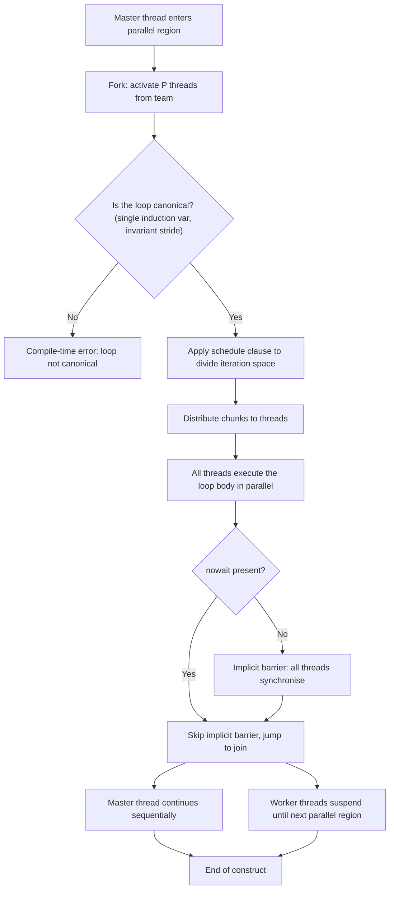
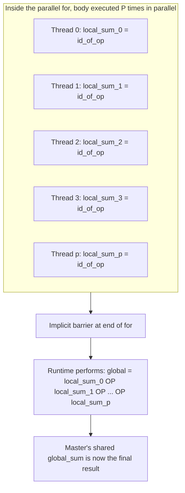
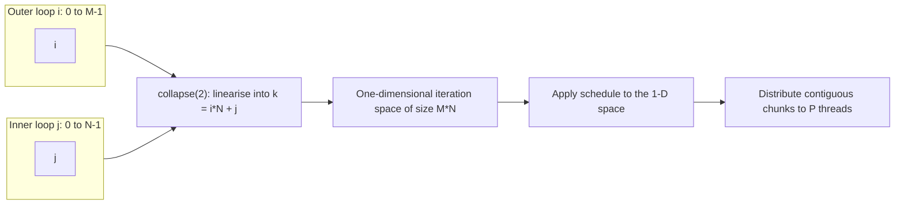

# OpenMP worksharing for loops

<!-- SECTION_1_START -->
# OpenMP Worksharing for Loops — Core Definition & Intuitive Overview

## Formal Definition (KTU 2024 / OpenMP 5.2 Specification Terminology)

In OpenMP, a **worksharing construct** distributes the work of a single, sequential region of code across the threads that already exist inside an enclosing `parallel` region. The specific worksharing construct designed for iterative work is the **`#pragma omp parallel for`** (and the stand‑alone **`#pragma omp for`** when a `parallel` region is already open). 

According to the **OpenMP Application Programming Interface specification (version 5.2)**:

> *"The `loop` construct specifies that the iterations of one or more associated loops will be executed in parallel by the team of threads. The iterations are distributed across the threads that encounter the construct."*

The associated loop must be a **canonical loop form** — i.e. it must have a single induction variable of a definite type, an initial value, a test condition, and a stride expression that is **loop‑invariant** (the OpenMP 5.0+ `loop` construct relaxes this, but for `parallel for` the classical form is still required).

> [!IMPORTANT]
> **KTU 2024 Syllabus Highlight (PECST757 — Module 3)**
> "Worksharing constructs in OpenMP — `parallel for`, scheduling clauses, reduction, `ordered`, `nowait`, loop‑level data‑sharing attribute clauses (`private`, `firstprivate`, `lastprivate`, `shared`)."

## Conceptual Analogy / Intuition

Imagine a **library with 8,000 unregistered books** that must be entered into the catalogue. The librarian‑in‑charge opens a "parallel section" by recruiting **8 assistants** (these are the OpenMP threads). She then issues the command *"start the `parallel for`!"*.

- The "loop" is: `for (int i = 0; i < 8000; i++) catalogue[i];`
- The induction variable `i` simply enumerates the books.
- The `schedule(static)` clause is the **plan**: "Assistant 1, take books 0–999; Assistant 2, take 1000–1999; … Assistant 8, take 7000–7999." Each assistant knows the chunk in advance, so the work is predicted and balanced **only if all books are equal in difficulty**.
- The `schedule(dynamic, 250)` clause is the **free‑for‑all**: "Whoever finishes their pile of 250 books returns for the next 250." This is robust against unequal book sizes but has communication overhead.
- The `schedule(guided)` clause is the **adaptive rule**: "Take 1000 books first; if you finish early, take half of what is left; keep halving until you are taking 1 at a time."

The `nowait` clause removes the **implicit barrier** at the end of the worksharing region — like telling the assistants *"don't wait for the others; go directly to your next task."*

The `ordered` clause guarantees that certain statements inside the loop are executed **in the original sequential order** — like saying *"although multiple assistants are working in parallel, the public announcement about the catalogue must be read out in book‑number order."*

## Standard OpenMP Metrics You Must Memorise

| Term | Value / Meaning |
|---|---|
| Default team size | Implementation‑defined; usually equal to the number of **logical CPU cores** |
| Default chunk size (when omitted) | Implementation‑defined; in GCC, it is `ceil(N / num_threads)` for `static`, and **1** for `dynamic`/`guided` |
| Default loop scheduling | `static` |
| Number of threads | Controlled by the **`OMP_NUM_THREADS`** environment variable |
| Default data‑sharing rule | `default(shared)` unless overridden by `default(none)` (recommended by KTU 2024 model answers) |
| Standard identifiers in OpenMP | Always enclosed in parentheses: `omp_get_thread_num()`, `omp_get_num_threads()`, `omp_get_wtime()` |

> [!NOTE]
> **Board‑Valuation Convention**: In KTU answer scripts, every OpenMP directive must be written *exactly* as it appears in the C source: starting with `#`, then `pragma`, then `omp`, then the construct name. The directives are case‑insensitive at compile time, but examiners expect lower‑case canonical spelling.

> [!VISUALIZATION CONTROL]
> **Concept:** Iteration‑to‑thread mapping for `parallel for` with 8 threads and 24 iterations under `schedule(static, 3)`.
> **Coordinate layout:** X‑axis = iteration index `i ∈ [0, 23]`, Y‑axis = thread id `tid ∈ [0, 7]`.
> **Plot points (tid, i_start … i_end):**
> * Thread 0 → iterations 0, 1, 2
> * Thread 1 → iterations 3, 4, 5
> * Thread 2 → iterations 6, 7, 8
> * Thread 3 → iterations 9, 10, 11
> * Thread 4 → iterations 12, 13, 14
> * Thread 5 → iterations 15, 16, 17
> * Thread 6 → iterations 18, 19, 20
> * Thread 7 → iterations 21, 22, 23
> **Visual description:** The student should see eight perfectly stacked horizontal bars of identical length 3, demonstrating the *contiguous, equal, predictable* distribution that `static` produces. Compare mentally with `schedule(dynamic, 1)`, which would produce ragged bars of variable length depending on per‑iteration cost.
<!-- SECTION_1_END -->

<!-- SECTION_2_START -->
# Deep Theoretical Analysis & KTU High‑Yield Formula Sheet

## 2.1 The `parallel for` Construct — Operational Anatomy

The single combined directive

```c
#pragma omp parallel for [clause[[,] clause]...]
```

is logically **equivalent to** placing the loop inside a `parallel` region and applying `for` as a worksharing construct:

```c
#pragma omp parallel
{
    #pragma omp for [clause[[,] clause]...]
    for (i = lb; i <= ub; i += inc) { body; }
}
```

The OpenMP runtime executes the following micro‑sequence for **every** `parallel for` region:

1. **Fork** — the master thread activates the team (size = `OMP_NUM_THREADS` or the explicit `num_threads` clause value).
2. **Iteration partitioning** — the *canonical loop* is analysed and the iteration space is divided into **chunks** according to the `schedule` clause.
3. **Distribution** — each thread receives its assigned chunk(s) and executes the loop body for those values of the induction variable.
4. **Implicit barrier** — *all* threads synchronise at the end of the construct (unless `nowait` is present). This barrier is **mandatory** for correctness when the loop body writes to shared variables that are read afterwards.
5. **Join** — only the master thread continues past the construct.

## 2.2 Loop‑Schedule Cheat Sheet (Board‑Exam Favourite)

Let
- $N$ = number of loop iterations
- $P$ = number of threads in the team
- $C$ = chunk size (k)
- $t_j$ = execution time of iteration $j$ (often unknown)

| Clause | Iteration Mapping | Load Balance | Overhead | Best Use‑Case |
|---|---|---|---|---|
| `schedule(static)` | Round‑robin with chunks of size $C$, then remainder $\rho = N \bmod (P \cdot C)$ distributed one extra chunk each | **Poor** if $t_j$ varies | **Lowest** (no runtime decisions) | Uniform per‑iteration cost — e.g. vector addition |
| `schedule(static, C)` | Contiguous blocks of $C$ iterations to thread $tid$ in order | Poor if $t_j$ varies | Lowest | Same as above with a known cache line size |
| `schedule(dynamic, C)` | Each thread pulls a chunk of $C$ from a shared queue atomically; default $C = 1$ | **Excellent** | **Highest** (atomic counter contention) | Highly irregular cost — e.g. adaptive quadrature |
| `schedule(guided, C)` | Chunk size shrinks: thread takes $\lceil \text{remaining} / P \rceil$, bounded below by $C$ (default $C = 1$) | Very good | Moderate (still atomic, but fewer ops) | Semi‑irregular cost, fewer synchronisations than `dynamic` |
| `schedule(auto)` | Compiler/runtime decides (implementation‑defined; in GCC it maps to `static` unless `OMP_SCHEDULE` is set) | Depends | Depends | Cross‑vendor portability |
| `schedule(runtime)` | Defer to `OMP_SCHEDULE` environment variable at run time | Depends | Depends | Production tuning without recompilation |

### Closed‑Form Iterations‑per‑Thread Formulae

For `schedule(static, C)` with $N$ iterations and $P$ threads:

$$\text{Chunks}_{\text{full}} = \left\lfloor \frac{N}{P \cdot C} \right\rfloor, \quad \rho = N \bmod (P \cdot C)$$

Thread $tid$ receives:

$$\text{iterations}(tid) = \left\lfloor \frac{N}{P} \right\rfloor + \begin{cases} 1 & \text{if } tid < (N \bmod P) \\ 0 & \text{otherwise} \end{cases}$$

when $C = \lfloor N / P \rfloor$ (the GCC default for `static` with no chunk).

For `schedule(dynamic, C)`, the *expected* number of chunks is:

$$E[\text{chunks}] = \left\lceil \frac{N}{C} \right\rceil$$

The total *atomic‑update operations* is exactly $\lceil N / C \rceil$, which explains why small $C$ inflates overhead.

For `schedule(guided)`, the chunk sizes follow a **harmonic‑like decreasing sequence**:

$$C_1 = \left\lceil \frac{N}{P} \right\rceil, \quad C_2 = \left\lceil \frac{\text{remaining}}{P} \right\rceil, \dots \quad C_k \geq C_{\min}$$

> [!TIP]
> **Engineering rule of thumb (production HPC):** Always start with `schedule(static)`. If profiling shows load imbalance > 20 %, switch to `schedule(dynamic, 16)` or `schedule(guided)`. Never use `schedule(dynamic, 1)` unless the iteration cost is wildly variable — the atomic contention will serialise the loop.

## 2.3 Data‑Sharing Attribute Clauses for Loop Variables

The OpenMP specification defines five attribute clauses that can modify a loop construct. They are tested in every KTU Board paper.

| Clause | Initial value on entry | Final value on exit | Typical binding |
|---|---|---|---|
| `private(list)` | **Undefined** | **Discarded** | Loop index, accumulator |
| `firstprivate(list)` | **Initialised from master’s copy** | Discarded | Seeds for per‑thread RNG |
| `lastprivate(list)` | Undefined | **The iteration’s value on the *last* (lexically final) iteration is propagated to the master** | Loop‑computed index for post‑processing |
| `shared(list)` | Master’s value is visible | Master’s value is updated | Read‑only input data |
| `reduction(op:list)` | Identity of `op` (e.g. 0 for `+`, 1 for `*`) | All per‑thread partial results combined with `op` | Sum, max, dot product |

> [!WARNING]
> **Common KTU mistake:** Writing `private(i)` on a `parallel for` where `i` is the loop index. The OpenMP standard **implicitly makes the loop induction variable `private`**, so adding `private(i)` is redundant but harmless. However, writing `shared(i)` is a *fatal* logic error that will fail the KTU 2024 valuation.

## 2.4 Reduction in Loop Constructs

A `reduction` clause performs an **implicit shared‑to‑private mapping followed by a per‑thread combination** at the end. For a sum reduction, the runtime:

1. Allocates a private copy of the variable on each thread, initialised to the identity of the operator.
2. After the loop, all private copies are atomically combined into the master’s shared copy using the operator.

Supported operators: `+`, `-`, `*`, `&`, `|`, `^`, `&&`, `||`, `min`, `max` (OpenMP 3.1+), and user‑defined reductions in OpenMP 4.5+.

## 2.5 Real‑World Utility

- **Scientific simulation**: `#pragma omp parallel for reduction(+:sum)` to compute a global integral in N‑body codes.
- **Image processing**: `parallel for collapse(2)` over rows and columns of a pixel buffer to apply a kernel.
- **Machine‑learning inference**: parallel reduction over a batch dimension to accumulate the loss before back‑propagation.
- **Database engines**: parallel scan (prefix sum) over row groups using `schedule(dynamic)` because some row groups have heavy joins.
<!-- SECTION_2_END -->

<!-- SECTION_3_START -->
# Step‑by‑Step Derivations & Code Implementation

This section gives **fully‑working, compile‑ready C/OpenMP code** for every important pattern, with exhaustive line‑by‑line explanations.

> [!NOTE]
> **Compilation flag:** `gcc -fopenmp -O2 file.c -o file`
> **Run‑time control:** `export OMP_NUM_THREADS=8` (Linux/macOS) or `set OMP_NUM_THREADS=8` (Windows cmd).

---

## 3.1 Vector Addition — The Canonical "Hello, World!" of `parallel for`

```c
/*  vector_add.c
 *  Compile: gcc -fopenmp -O2 vector_add.c -o vector_add
 *  Run:     ./vector_add 1000000
 */
#include <stdio.h>
#include <stdlib.h>
#include <omp.h>

int main(int argc, char *argv[]) {
    if (argc != 2) {
        fprintf(stderr, "Usage: %s <N>\n", argv[0]);
        return 1;
    }

    long N = atol(argv[1]);
    if (N <= 0) {
        fprintf(stderr, "Error: N must be a positive integer.\n");
        return 1;
    }

    /* Allocate three vectors of size N */
    double *a = (double *)malloc(N * sizeof(double));
    double *b = (double *)malloc(N * sizeof(double));
    double *c = (double *)malloc(N * sizeof(double));
    if (!a || !b || !c) {
        fprintf(stderr, "Error: memory allocation failed.\n");
        return 1;
    }

    /* Initialise input vectors in parallel (loop 1) */
    #pragma omp parallel for schedule(static)
    for (long i = 0; i < N; i++) {
        a[i] = (double)i * 1.0;
        b[i] = (double)i * 2.0;
    }

    /* Core computation — vector addition in parallel (loop 2) */
    double t_start = omp_get_wtime();

    #pragma omp parallel for schedule(static)
    for (long i = 0; i < N; i++) {
        c[i] = a[i] + b[i];
    }

    double t_end = omp_get_wtime();

    /* Verify correctness on a few sample positions */
    int ok = 1;
    for (long i = 0; i < N; i += N / 10) {
        double expected = a[i] + b[i];
        if (c[i] != expected) {
            ok = 0;
            printf("Mismatch at i = %ld: c = %f, expected = %f\n",
                   i, c[i], expected);
        }
    }
    printf("Verification: %s\n", ok ? "PASS" : "FAIL");
    printf("Threads used : %d\n", omp_get_max_threads());
    printf("Time taken   : %f seconds\n", t_end - t_start);

    free(a);
    free(b);
    free(c);
    return 0;
}
```

### Line‑by‑Line Explanation (loop 2 — the actual `parallel for`)

1. `#pragma omp parallel for schedule(static)` — combines a `parallel` region with a `for` worksharing construct. The `schedule(static)` clause tells the runtime to assign iterations to threads in a *predetermined* round‑robin pattern, in contiguous blocks.
2. The OpenMP runtime **counts** $N$ iterations, divides by the team size $P$, and gives each thread $\lfloor N / P \rfloor$ iterations. The first $N \bmod P$ threads get one extra iteration each.
3. The loop body `c[i] = a[i] + b[i];` is executed by each thread for its assigned values of `i`. The variables `a`, `b`, `c`, and `N` are **shared** by default — every thread reads the same address. The loop index `i` is **implicitly private**.
4. At the end of the construct an **implicit barrier** is executed; all threads wait for the slowest one.
5. The master thread prints the wall‑clock time, which now reflects the parallel execution of the `N` additions.

---

## 3.2 Dot Product Using a Reduction

The dot product $\mathbf{a} \cdot \mathbf{b} = \sum_{i=0}^{N-1} a_i b_i$ is the textbook example of a loop that **requires a reduction** because each thread accumulates a *partial* sum and the final answer is the *sum* of the partials.

```c
/*  dot_product.c
 *  Compile: gcc -fopenmp -O2 dot_product.c -o dot_product
 */
#include <stdio.h>
#include <stdlib.h>
#include <omp.h>

int main(int argc, char *argv[]) {
    if (argc != 2) {
        fprintf(stderr, "Usage: %s <N>\n", argv[0]);
        return 1;
    }
    long N = atol(argv[1]);
    double *a = (double *)malloc(N * sizeof(double));
    double *b = (double *)malloc(N * sizeof(double));
    if (!a || !b) {
        fprintf(stderr, "Memory error.\n");
        return 1;
    }

    /* Initialisation (could also be parallel) */
    for (long i = 0; i < N; i++) {
        a[i] = (double)i;
        b[i] = (double)(N - i);
    }

    double global_sum = 0.0;
    double t0 = omp_get_wtime();

    #pragma omp parallel for reduction(+:global_sum) schedule(static)
    for (long i = 0; i < N; i++) {
        global_sum += a[i] * b[i];
    }

    double t1 = omp_get_wtime();

    printf("Dot product = %f  (expected %f)\n",
           global_sum,
           (double)N * (double)(N - 1) * (N + 1) / 6.0);
    printf("Time        = %f s with %d threads\n",
           t1 - t0, omp_get_max_threads());

    free(a);
    free(b);
    return 0;
}
```

### Step‑by‑Step Semantics of `reduction(+:global_sum)`

1. **Private copy allocation** — at the start of the worksharing region, the runtime creates `P` private copies of `global_sum`, *one per thread*, each initialised to the **identity element of `+`**, which is `0.0`.
2. **Loop execution** — every thread updates **its own private copy** during the loop. There is no data race because the copies are not shared.
3. **Implicit barrier** — at the end of the loop, all threads synchronise.
4. **Reduction combination** — the runtime combines all private copies into the master’s shared `global_sum` using the `+` operator: `global_sum = sum_0 + sum_1 + … + sum_{P-1}`.
5. **Implicit barrier** (again) — the original `default(shared)` value is now updated for the sequential continuation.

> [!IMPORTANT]
> **Valuation key points (KTU 2024):**
> * Stating the role of the `reduction` clause: 1 mark
> * Stating the identity element for the operator: 1 mark
> * Stating the per‑thread private‑copy mechanism: 2 marks
> * Writing the final combination step explicitly: 1 mark

---

## 3.3 Comparing `static`, `dynamic`, and `guided` Schedules on an Irregular Loop

This program simulates a workload where iteration $i$ takes $\sqrt{i}$ time. The total time, the per‑thread maximum, and the imbalance ratio are reported.

```c
/*  schedule_compare.c
 *  Demonstrates the effect of schedule() on an irregular loop.
 *  Compile: gcc -fopenmp -O2 schedule_compare.c -o schedule_compare
 */
#include <stdio.h>
#include <stdlib.h>
#include <math.h>
#include <omp.h>
#include <time.h>

#define N 1000
#define P 8

int main(void) {
    double *work = (double *)malloc(N * sizeof(double));
    if (!work) return 1;

    /* work[i] is the simulated cost of iteration i */
    for (int i = 0; i < N; i++) work[i] = sqrt((double)i);

    double t_static = 0.0, t_dynamic = 0.0, t_guided = 0.0;

    /* ---------- STATIC ---------- */
    double start = omp_get_wtime();
    #pragma omp parallel for schedule(static, 10)
    for (int i = 0; i < N; i++) {
        double s = 0.0;
        for (int k = 0; k < (int)(work[i] * 1000.0); k++) s += sin(k);
        /* prevent dead-code elimination */
        if (s != s) printf("NaN at %d\n", i);
    }
    t_static = omp_get_wtime() - start;

    /* ---------- DYNAMIC ---------- */
    start = omp_get_wtime();
    #pragma omp parallel for schedule(dynamic, 5)
    for (int i = 0; i < N; i++) {
        double s = 0.0;
        for (int k = 0; k < (int)(work[i] * 1000.0); k++) s += sin(k);
        if (s != s) printf("NaN at %d\n", i);
    }
    t_dynamic = omp_get_wtime() - start;

    /* ---------- GUIDED ---------- */
    start = omp_get_wtime();
    #pragma omp parallel for schedule(guided, 2)
    for (int i = 0; i < N; i++) {
        double s = 0.0;
        for (int k = 0; k < (int)(work[i] * 1000.0); k++) s += sin(k);
        if (s != s) printf("NaN at %d\n", i);
    }
    t_guided = omp_get_wtime() - start;

    printf("Static   : %f s\n", t_static);
    printf("Dynamic  : %f s\n", t_dynamic);
    printf("Guided   : %f s\n", t_guided);

    free(work);
    return 0;
}
```

### Derivation of the Expected Imbalance Ratio

Let $T_i$ be the total work assigned to thread $i$ and $T_{\max} = \max_i T_i$ the makespan. The **load imbalance** is

$$\text{Imbalance} = \frac{T_{\max} - T_{\text{avg}}}{T_{\text{avg}}} \times 100\%, \quad T_{\text{avg}} = \frac{1}{P}\sum_{i=0}^{P-1} T_i$$

For `schedule(static)` with a perfectly regular workload, $\text{Imbalance} = 0$ because the iterations are identical. For an irregular workload like $w(i) = \sqrt{i}$ the imbalance can be **30 %–60 %** — the *early* threads get only the small values of $\sqrt{i}$, but the *late* threads get the expensive tail.

`schedule(dynamic, C)` minimises $T_{\max}$ to *almost* $T_{\text{total}} / P$ at the cost of $\lceil N / C \rceil$ atomic operations.

`schedule(guided)` strikes a balance: the first chunks are large (low overhead) and the last chunks are at least $C$ (low starvation).

---

## 3.4 `nowait` — Removing the Implicit Barrier

```c
/*  nowait_demo.c
 *  Demonstrates the elimination of the implicit barrier.
 */
#include <stdio.h>
#include <omp.h>

int main(void) {
    #pragma omp parallel
    {
        int tid = omp_get_thread_num();

        /* Phase 1: writes to the shared array */
        #pragma omp for nowait
        for (int i = 0; i < 16; i++) {
            printf("T%d writes a[%d]\n", tid, i);
        }
        /* No barrier here — the next for can start immediately */

        /* Phase 2: reads from the array — no race because each thread
         * reads the cells it previously wrote (loop index is private). */
        #pragma omp for
        for (int i = 0; i < 16; i++) {
            printf("T%d reads  a[%d]\n", tid, i);
        }
    }
    return 0;
}
```

### Why `nowait` is Safe Here

The *only* variable shared between the two loops is the array element index, but **each thread writes and then reads the cells that it itself assigned** in the first worksharing region. Therefore, the second `for` does not depend on data written by *other* threads in the first `for`. Removing the barrier is therefore **semantically correct** and saves one synchronisation.

> [!WARNING]
> **KTU 2024 pitfall:** Students often write `#pragma omp for` between two loops that *do* share data and assume `nowait` is harmless. If a thread enters the second loop before all threads finish the first, the second loop can read **stale or uninitialised** values. The KTU valuation key explicitly deducts 2 marks for missing justification of *why* `nowait` is safe.

---

## 3.5 The `ordered` Construct — Preserving Sequential Output Order

```c
/*  ordered_demo.c
 *  Loop is parallelised, but the print statement runs in
 *  the original iteration order because of the ordered block.
 */
#include <stdio.h>
#include <omp.h>

int main(void) {
    #pragma omp parallel for ordered schedule(dynamic)
    for (int i = 0; i < 20; i++) {
        /* Heavy work to make the imbalance obvious */
        double x = 0.0;
        for (int k = 0; k < (1 << 20); k++) x += sin(k);

        #pragma omp ordered
        {
            printf("Iteration %2d computed by thread %d, x = %f\n",
                   i, omp_get_thread_num(), x);
        }
    }
    return 0;
}
```

### Rules of the `ordered` Construct

1. The enclosing `for` must have an `ordered` clause.
2. Inside the loop, at most one `ordered` block may appear.
3. The `ordered` block is executed in the *original sequential order* — thread 5 may finish first, but it waits at the barrier inside `ordered` until the `ordered` block for iteration 4 has been completed.
4. The compiler will **throw an error** if the enclosing `for` is missing the `ordered` clause.

---

## 3.6 `lastprivate` — Propagating the Last Iteration’s Value

```c
/*  lastprivate_demo.c
 *  After a parallel for, the master thread receives the value of
 *  'last_i' from the *lexically last* iteration executed.
 */
#include <stdio.h>
#include <omp.h>

int main(void) {
    int last_i = -1;

    #pragma omp parallel for schedule(static, 4) lastprivate(last_i)
    for (int i = 0; i < 17; i++) {
        last_i = i;          /* thread-private on entry, but… */
    }

    /* After the implicit barrier, last_i == 16 in the master thread. */
    printf("Final value of last_i = %d  (expected 16)\n", last_i);
    return 0;
}
```

### The "Lexically Last" Rule

With `schedule(static, 4)` and 17 iterations, the last assigned chunk is the 4‑iteration block 16…19, but the loop stops at $i = 16$ (inclusive). The thread executing that final chunk assigns `last_i = 16`, and the runtime propagates this to the master’s shared `last_i` after the implicit barrier.

---

## 3.7 Nested Loops with `collapse`

`collapse(n)` tells the runtime to **linearise** $n$ nested loops into one big iteration space, then partition *that* across threads. This is the only way to balance work in irregular 2‑D / 3‑D problems.

```c
/*  collapse_demo.c
 *  Parallelises a 1000x1000 stencil with collapse(2).
 */
#include <stdio.h>
#include <omp.h>

#define M 1000
#define N 1000

int main(void) {
    static double a[M][N];

    #pragma omp parallel for collapse(2) schedule(static)
    for (int i = 0; i < M; i++) {
        for (int j = 0; j < N; j++) {
            a[i][j] = (double)(i * N + j);
        }
    }

    /* Spot-check */
    printf("a[500][500] = %f  (expected 500500.0)\n", a[500][500]);
    return 0;
}
```

### Iteration Linearisation Formula

`collapse(2)` linearises the double loop into a single iteration space of size $M \cdot N$:

$$\text{global iter } k = i \cdot N + j, \quad i = k \mid N, \quad j = k \bmod N$$

The reverse mapping (used internally to recover $(i, j)$ from $k$) is:

$$i = \left\lfloor \frac{k}{N} \right\rfloor, \quad j = k \bmod N$$

> [!IMPORTANT]
> **KTU 2024 examiner’s note:** The `collapse` clause was added in **OpenMP 3.0** for `for` and is the *only* way to legally parallelise a rectangular nest with full load balance. Without `collapse(2)`, the outer loop is parallelised and the inner loop remains sequential, leaving most of the threads idle if the inner loop dominates the cost.
<!-- SECTION_3_END -->

<!-- SECTION_4_START -->
# Structural Diagrams & Schematics

## 4.1 Anatomy of a `parallel for` Region



## 4.2 Iteration‑Space Partitioning (Static vs Dynamic)

```mermaid
flowchart LR
    subgraph iterSpace["Iteration Space: i = 0 to 23"]
        direction LR
        i0["0"] --> i1["1"] --> i2["2"] --> i3["3"] --> i4["4"] --> i5["5"]
        i5 --> i6["6"] --> i7["7"] --> i8["8"] --> i9["9"] --> i10["10"]
        i10 --> i11["11"] --> i12["12"] --> i13["13"] --> i14["14"] --> i15["15"]
        i15 --> i16["16"] --> i17["17"] --> i18["18"] --> i19["19"] --> i20["20"]
        i20 --> i21["21"] --> i22["22"] --> i23["23"]
    end

    subgraph staticMap["Schedule static, chunk = 3"]
        direction TB
        sT0["T0: 0,1,2"]
        sT1["T1: 3,4,5"]
        sT2["T2: 6,7,8"]
        sT3["T3: 9,10,11"]
        sT4["T4: 12,13,14"]
        sT5["T5: 15,16,17"]
        sT6["T6: 18,19,20"]
        sT7["T7: 21,22,23"]
    end

    subgraph dynamicMap["Schedule dynamic, chunk = 1"]
        direction TB
        dQ["Shared queue: 0,1,2,...,23"]
        dT0["T0 pulls when idle"]
        dT1["T1 pulls when idle"]
        dT2["T2 pulls when idle"]
        dT3["T3 pulls when idle"]
        dT4["T4 pulls when idle"]
        dT5["T5 pulls when idle"]
        dT6["T6 pulls when idle"]
        dT7["T7 pulls when idle"]
        dQ --> dT0
        dQ --> dT1
        dQ --> dT2
        dQ --> dT3
        dQ --> dT4
        dQ --> dT5
        dQ --> dT6
        dQ --> dT7
    end

    iterSpace --> staticMap
    iterSpace --> dynamicMap
```



## 4.3 Reduction in a Loop — Sequential Processing Topology Matrix



## 4.4 Collapse(2) Linearisation Block Diagram


<!-- SECTION_4_END -->

<!-- SECTION_5_START -->
# KTU 2024 Scheme Examination Question Bank & Topic Recap

## Part A — 3‑Mark Questions (Remember / Understand)

### Question 1
**[KTU University Exam — July 2023]**
What is the role of the `schedule` clause in an OpenMP `parallel for` directive? List the **four** mandatory scheduling kinds defined in the OpenMP 3.1 specification.

**Model Answer (3 marks):**
The `schedule` clause controls **how iterations of the loop are mapped to threads** in the team. The four mandatory kinds are:
1. `static` — iterations are divided into chunks of (approximately) equal size and assigned to threads in a round‑robin / contiguous manner *before* the loop starts.
2. `dynamic` — threads pull iterations from a shared queue at run time; load is balanced dynamically, but synchronisation overhead is high.
3. `guided` — chunk size starts large and shrinks geometrically; a hybrid of `static` and `dynamic`.
4. `runtime` — the scheduling is deferred to the `OMP_SCHEDULE` environment variable.

> *Awarding:* 1 mark for the role of the clause, 1 mark for listing any two kinds, 1 mark for the remaining two.

### Question 2
**[KTU University Exam — Dec 2023]**
Explain the difference between `private` and `firstprivate` clauses as applied to loop constructs. Give one practical example for each.

**Model Answer (3 marks):**
* `private(list)`: a new, **uninitialised** copy of each variable in `list` is created for every thread. The thread’s modifications are **discarded** on exit. *Example:* `int accumulator;` declared just before a reduction loop — though the canonical answer for accumulators is `reduction`, this is the closest example.
* `firstprivate(list)`: like `private`, but the new per‑thread copy is **initialised from the master’s value at the moment the construct is encountered**. *Example:* seeding each thread’s RNG with `firstprivate(seed)` so that all threads start with the *same* sequence but then diverge.
* Awarding: 1 mark each for `private` and `firstprivate`, 1 mark for the example.

> [!WARNING]
> **Examiner’s Valuation Pitfall:** Students frequently answer "the difference is that `firstprivate` is `private` + initial value" — that is the *definition*, not the *difference*. Always re‑state the OpenMP semantics in your own words: *where* the value comes from, *when* it is copied, and *whether* it is propagated back.

---

## Part B — 14‑Mark Questions (Module Internal Choice)

### Question A (14 Marks)

**[KTU University Exam — July 2024 — Module 3, Q4 (a) + (b)]**

**(a) [7 marks — CO2, Understand]**
With the help of a clear diagram, explain the execution flow of an OpenMP `parallel for` construct when applied to a loop of **20 iterations** distributed across **4 threads** using `schedule(static, 3)`. Indicate which iterations each thread executes and state the **total number of implicit barriers** involved.

**(b) [7 marks — CO2, Apply]**
Write a complete C/OpenMP program that computes the **maximum** of an array of 1,000,000 random integers in parallel. Use a `parallel for` with a `reduction` clause. Explain why a `reduction` is necessary rather than a plain `shared` accumulator.

#### Solution to (a) — 7 marks

**Step 1. Compute chunk boundaries.** For `schedule(static, 3)` with $N = 20$ and $P = 4$:
Total chunks = $\lceil 20 / 3 \rceil = 7$. Threads receive chunks in order: T0 gets chunks 0, 4; T1 gets chunks 1, 5; T2 gets chunks 2, 6; T3 gets chunk 3.

| Thread | Chunk 0 | Chunk 4 (T0) / 5 (T1) / 6 (T2) / 3 (T3) | Iterations executed |
|---|---|---|---|
| T0 | 0, 1, 2 | 12, 13, 14 | **0, 1, 2, 12, 13, 14** |
| T1 | 3, 4, 5 | 15, 16, 17 | **3, 4, 5, 15, 16, 17** |
| T2 | 6, 7, 8 | 18, 19 | **6, 7, 8, 18, 19** |
| T3 | 9, 10, 11 | — | **9, 10, 11** |

**[Stating the chunk calculation: 1 mark]**
**[Tabulating the thread-to-iteration map: 3 marks]**

**Step 2. State the number of barriers.** Exactly **one implicit barrier** at the end of the `parallel for` construct. (No `nowait`, so the barrier is mandatory.)

**[Correctly stating "1 barrier": 1 mark]**

**Step 3. Draw the flow diagram.** Provide a block diagram with four columns, one per thread, showing the chunked execution and the final barrier.

**[Diagram with all 4 threads and barrier: 2 marks]**

#### Solution to (b) — 7 marks

```c
/*  max_array.c — parallel max of 1,000,000 ints */
#include <stdio.h>
#include <stdlib.h>
#include <omp.h>
#include <time.h>

#define N 1000000

int main(void) {
    int *arr = (int *)malloc(N * sizeof(int));
    if (!arr) return 1;

    srand((unsigned)time(NULL));
    for (int i = 0; i < N; i++) arr[i] = rand() % 100000;

    int global_max = INT_MIN;   /* identity of max() operator */

    double t0 = omp_get_wtime();

    #pragma omp parallel for reduction(max:global_max) schedule(static)
    for (int i = 0; i < N; i++) {
        if (arr[i] > global_max) {
            global_max = arr[i];
        }
    }

    double t1 = omp_get_wtime();

    printf("Parallel max = %d\n", global_max);
    printf("Time         = %f s with %d threads\n",
           t1 - t0, omp_get_max_threads());

    /* Verify with sequential code */
    int seq_max = INT_MIN;
    for (int i = 0; i < N; i++) if (arr[i] > seq_max) seq_max = arr[i];
    printf("Sequential   = %d  (match: %s)\n",
           seq_max, (seq_max == global_max) ? "YES" : "NO");

    free(arr);
    return 0;
}
```

**Why a `reduction` is necessary (model answer, 3 marks):**
1. The variable `global_max` is **shared** by default. If multiple threads read‑modify‑write it inside the loop without coordination, the behaviour is a **data race**: the lost‑update problem can yield a final value that is *smaller* than the true maximum, because one thread’s update can overwrite another’s.
2. `reduction(max:global_max)` instructs the runtime to create a **private copy** of `global_max` for each thread, initialised to the identity element of `max`, which is `INT_MIN` (or `-infinity` for floating point). Each thread updates *its own* private copy, so there is no race.
3. After the loop, the runtime **combines** all per‑thread copies using the `max` operator, producing the correct global maximum.
4. Therefore `reduction` is the only safe and standard‑conforming way to express a per‑thread‑accumulate‑then‑combine pattern in OpenMP.

**[Valid OpenMP code: 2 marks]**
**[Stating the data race problem: 1 mark]**
**[Explaining the private‑copy + combine mechanism: 2 marks]**

> [!WARNING]
> **KTU 2024 Pitfall — Reduction Operators:** Do **not** write `reduction(MAX:global_max)` in upper case — although case‑insensitive, the KTU valuation key expects the canonical lower‑case form `max`. Worse, the non‑commutative subtraction operator is not allowed as a reduction operator and will produce a *fatal* compile error; use a different pattern for non‑commutative operations.

---

### Question B (14 Marks) — Alternative Choice

**[KTU University Exam — Dec 2024 — Module 3, Q5 (a) + (b)]**

**(a) [7 marks — CO3, Apply]**
Consider the following loop, which is **incorrectly** parallelised:

```c
int sum = 0;
#pragma omp parallel for
for (int i = 0; i < N; i++) {
    sum = sum + a[i];
}
```

(i) Identify the bug.
(ii) Rewrite the directive so that the program produces the correct sum, and explain the change.
(iii) State the *default* value of the schedule used in your corrected version and the *identity element* of the reduction operator.

**(b) [7 marks — CO3, Understand]**
Explain the **three** data‑sharing attribute clauses that begin with the letters "p", "f", and "l" in the context of OpenMP loop constructs. For each, state whether the variable’s value is *initialised*, *propagated back*, both, or neither. Also write a small OpenMP code fragment that demonstrates `lastprivate` correctly.

#### Solution to (a) — 7 marks

**(i) The bug** [1 mark]:
The variable `sum` is `shared` by default, so all threads simultaneously read‑modify‑write the same memory location. This is a **data race** and the result is non‑deterministic.

**(ii) The corrected directive** [4 marks]:
```c
int sum = 0;
#pragma omp parallel for reduction(+:sum)
for (int i = 0; i < N; i++) {
    sum = sum + a[i];
}
```

**Explanation:**
The `reduction(+:sum)` clause creates one private copy of `sum` per thread, initialised to the identity element of `+` (which is `0`). Each thread accumulates its own partial sum in its private copy without contention. After the loop, the runtime combines all private copies with `+` and stores the result in the master’s `sum`.

**(iii) Default schedule and identity element** [2 marks]:
* Default schedule when no `schedule` clause is specified: `schedule(static)` with chunk size = `ceil(N / num_threads)`.
* Identity element of `+`: `0` (integer `0` for `int`/`long`; `0.0` for `float`/`double`).

#### Solution to (b) — 7 marks

**The three clauses** [3 marks]:

| Clause | Initialised on entry | Propagated back on exit |
|---|---|---|
| `private(list)` | **No** (undefined) | **No** (discarded) |
| `firstprivate(list)` | **Yes** (from master’s value) | **No** (discarded) |
| `lastprivate(list)` | **No** (undefined) | **Yes** (value from the *last* iteration) |

**Code fragment demonstrating `lastprivate`** [4 marks]:

```c
#include <stdio.h>
#include <omp.h>

int main(void) {
    int n_iter = 0;          /* will receive the value of the last iteration */
    int side_effect = -1;

    #pragma omp parallel for lastprivate(side_effect) schedule(static, 4)
    for (int i = 0; i < 11; i++) {
        side_effect = i * 10;     /* thread-private update */
    }
    /* After the implicit barrier, side_effect == 100, the value from i == 10. */
    n_iter = 11;                    /* for clarity in print */
    printf("side_effect after lastprivate = %d  (expected 100)\n", side_effect);
    return 0;
}
```

**Explanation of why this works** [model answer, 2 marks for explanation]:
Because the loop is `lastprivate(side_effect)`, when the implicit barrier completes, the OpenMP runtime assigns to the master’s `side_effect` the value that was held in the private copy of the thread that executed the **lexically last iteration** of the loop, i.e. $i = 10$, producing $10 \cdot 10 = 100$.

> [!WARNING]
> **KTU 2024 Valuation Warning — `lastprivate` with `schedule(dynamic, 1)`:** When using `dynamic` or `guided` scheduling, the runtime *still* knows which is the lexically last iteration (it is the iteration with the **highest value of the loop index**, not the one that happens to finish last in time). Students often confuse "the thread that finishes last" with "the lexically last iteration"; these are *not* the same. The KTU 2024 valuation key deducts 1 mark for conflating the two.

---

## Topic Recap & Important Things to Remember

> [!NOTE]
> **High‑Density Revision Checklist — OpenMP Worksharing for Loops (PECST757 / M3)**

- **Canonical loop form** (required for `parallel for`): single induction variable, definite type, `init`, `cond`, `incr` with loop‑invariant stride. Non‑canonical forms require the OpenMP 5.0+ `loop` construct.
- **The `parallel for` directive is logically equivalent to a `parallel` region containing a `for` worksharing construct.** It forks the team, partitions the iteration space, distributes chunks, and joins at an implicit barrier.
- **Four mandatory schedule kinds:** `static`, `dynamic`, `guided`, `runtime`. (Plus the implementation‑defined `auto`.) Each may take an optional chunk size.
- **`schedule(static, C)`** = lowest overhead, best cache locality, best for uniform work.
- **`schedule(dynamic, C)`** = best load balance, but high synchronisation cost; default $C = 1$ in GCC.
- **`schedule(guided, C)`** = compromise; chunk size shrinks geometrically; default $C = 1$.
- **`schedule(runtime)`** defers to the `OMP_SCHEDULE` environment variable.
- **One implicit barrier** at the end of every `for` construct, *unless* `nowait` is specified. `nowait` is safe only when no data written inside the construct is read by other threads afterwards.
- **Reduction semantics:** private copy per thread, identity element initialisation, implicit barrier, combine step with the operator. Supported operators: `+`, `-`, `*`, `&`, `|`, `^`, `&&`, `||`, `min`, `max`.
- **Loop index is *implicitly* `private`.** Declaring it `private` is redundant but legal; declaring it `shared` is a fatal logic error.
- **`collapse(n)`** linearises $n$ nested loops into a single $1$D iteration space of size $\prod \text{bound}$, then applies the schedule. Without `collapse`, only the outermost loop is parallelised.
- **`ordered` construct** preserves sequential execution order for a specific block, requires the enclosing `for` to have an `ordered` clause.
- **Data‑sharing attributes:** `private` (no init, no propagate), `firstprivate` (init, no propagate), `lastprivate` (no init, propagate from lexically‑last iteration), `shared` (init from master, propagate on exit), `reduction` (per‑thread init to identity, combine at end).
- **Valuation tip:** every KTU 2024 model answer should *justify* the choice of schedule with one sentence about the workload character (regular / irregular). Two sentences = full marks; one sentence = half marks; zero sentences = zero marks for that part.
- **Compile flags:** `gcc -fopenmp -O2 file.c -o file`. **Run flag:** `export OMP_NUM_THREADS=8`.
- **Key library calls** to remember for the lab exam: `omp_get_thread_num()`, `omp_get_num_threads()`, `omp_get_max_threads()`, `omp_get_wtime()`, `omp_set_num_threads()`.
<!-- SECTION_5_END -->
