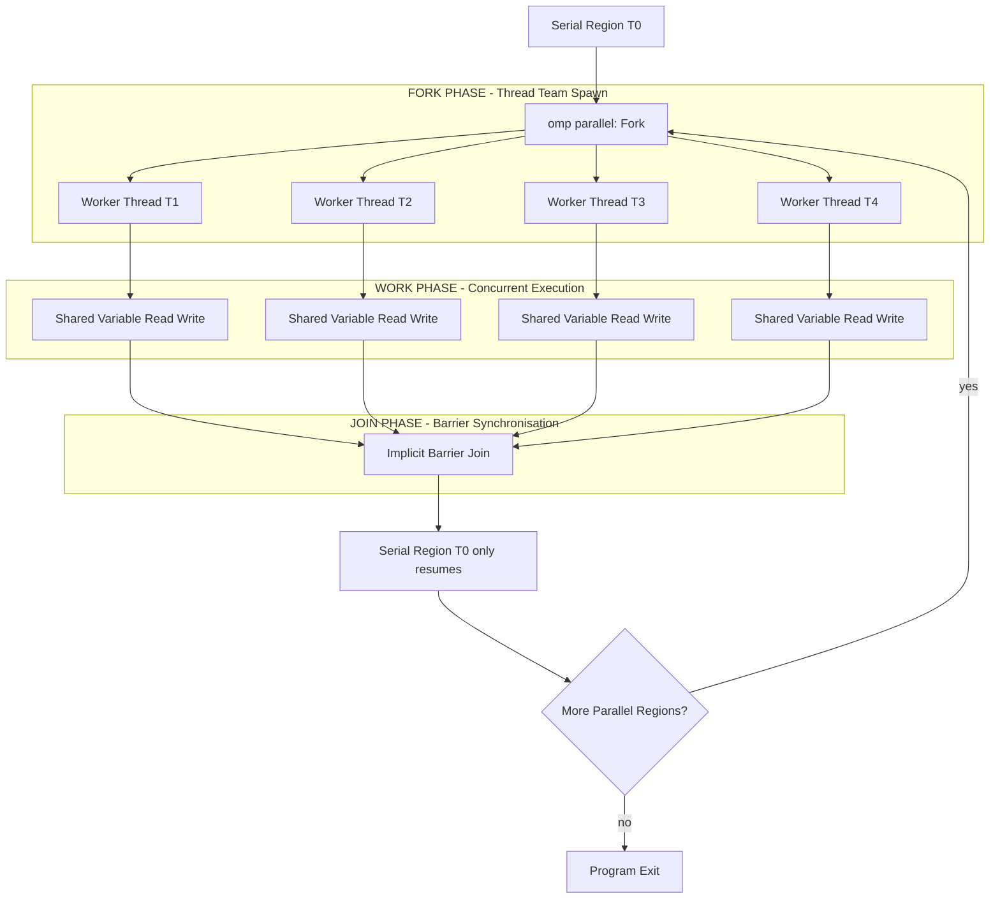
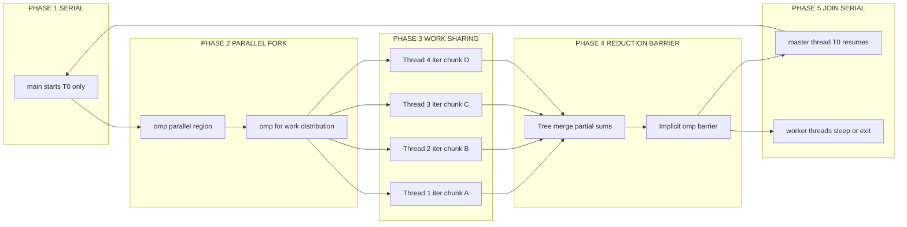
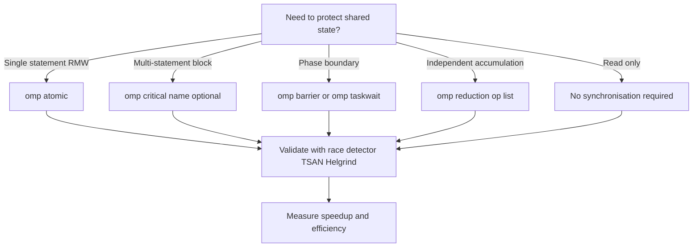
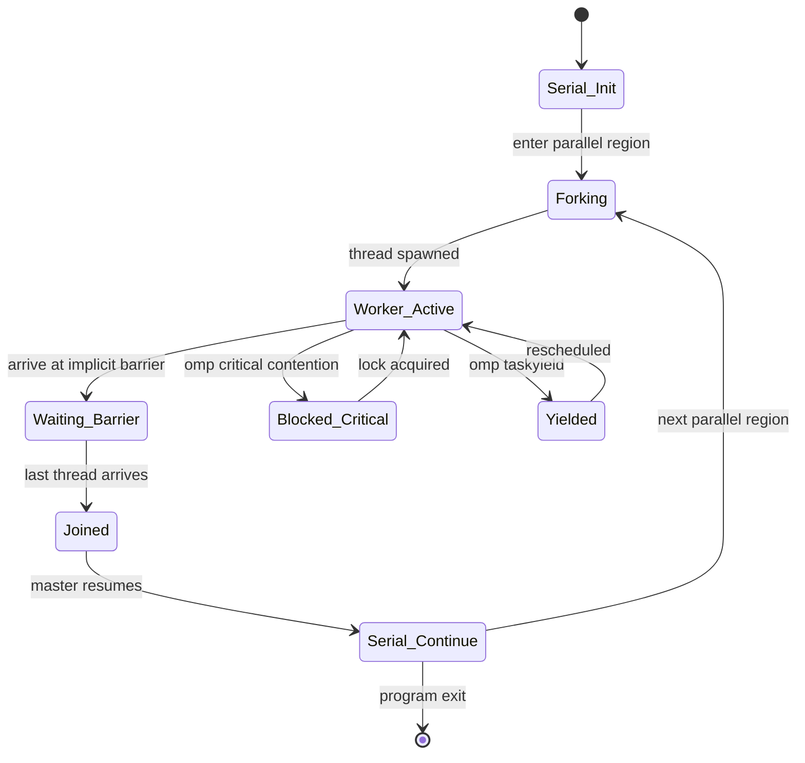
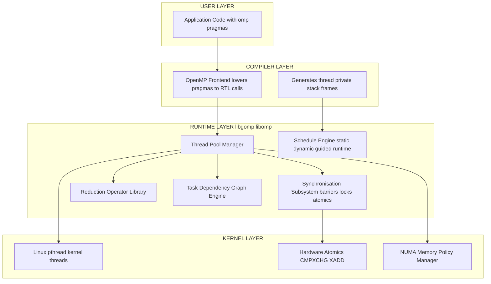

# Parallel execution

<!-- SECTION_1_START -->

## 1. Core Technical Definition & Intuitive Overview

**Parallel Execution** in the context of **Shared Memory** architectures is a computational paradigm in which a single problem is decomposed into discrete sub-tasks that are dispatched and executed **concurrently** by multiple **threads of control** residing within the same address space, thereby enabling simultaneous utilisation of the multi-core processing units available on a single compute node.

> [!IMPORTANT]
> **KTU 2024 Syllabus Definition (PECST757 / Module 3 — Shared):**
> *Parallel execution refers to the concurrent execution of multiple threads or processes within a shared address space, coordinated through explicit synchronisation constructs (barriers, locks, atomic operations) and managed via a fork–join execution model, typically expressed using the OpenMP (Open Multi-Processing) API or POSIX Threads (Pthreads) interface.*

> [!NOTE]
> **Why "Shared"?** Because all worker threads view **one unified logical memory map**; they communicate by *reading and writing* common variables rather than by passing messages over a network — this makes **synchronisation**, not data movement, the central engineering challenge.

### Conceptual Analogy — "The Master Chef & Five Sous-Chefs"

Imagine a banquet kitchen where the **Master Chef** (the **master thread**) reads a recipe, then **forks** the work by shouting instructions to **five sous-chefs** (the **worker threads**). All five share the **same pantry** (the *shared heap and global variables*). Each chef chops vegetables, stirs pots, plates dishes — all **simultaneously** on five different burners. When every chef rings the **service bell** (the *implicit barrier*), the Master Chef **joins** the finished plates into the final banquet.

| Kitchen Element | HPC Element | Symbol |
|---|---|---|
| Master Chef | Main / Master thread | $T_0$ |
| Sous-Chefs | Worker threads | $T_1, T_2, \ldots, T_{N-1}$ |
| Shared pantry | Shared global heap | $M_{shared}$ |
| Recipe card | Read-only program text | $I_{code}$ |
| Service bell | `barrier` synchronisation | $B$ |
| Knives, cutting boards | Per-thread private stack/registers | $S_i$ |
| "Only one may use the stove" rule | `critical` / mutex lock | $L$ |

> [!TIP]
> If two chefs grab the *same onion* at the same instant, a **race condition** occurs — this is precisely the bug OpenMP's `critical` and `atomic` clauses exist to prevent.

### Core Quantitative Metrics (highlighted constants)

- **$P$** = parallelisable fraction of the program ( $0 \le P \le 1$ ).
- **$N$** = number of executing threads / cores.
- **$T_s$** = serial execution time on one core.
- **$T_p$** = parallel execution time on $N$ cores.
- **Speedup** $S(N) = T_s / T_p$ — target: ideally **linear** $S(N) \approx N$.
- **Efficiency** $E(N) = S(N) / N$ — target: ideally $E(N) \approx 1$ ($100\%$).
- **Serial fraction** $f = 1 - P$.

> [!VISUALIZATION CONTROL]
> **Concept:** Amdahl's Law speedup surface $S(N,P) = \dfrac{1}{(1-P) + P/N}$ plotted as a family of curves.
>
> **Desmos Input Equations:**
> * `S(N, P) = 1 / ((1 - P) + P/N)`
> * `P = 0.50`, `P = 0.75`, `P = 0.90`, `P = 0.95`, `P = 0.99`
> * `N = 1 ... 1024` (slider)
>
> **Visual Description:** A family of monotonically increasing, concave curves that all **asymptotically flatten** to the horizontal ceiling $1/(1-P)$. As $P \to 1$ the ceiling rises without bound, but the curve still flattens — illustrating that even tiny serial fractions cap achievable speedup.

<!-- SECTION_1_END -->

<!-- SECTION_2_START -->

## 2. Deep Theoretical Analysis & KTU High-Yield Formula Sheet

### 2.1 The Fork–Join Execution Model

The canonical control-flow template for shared-memory parallel execution:

1. **Serial region (master thread only)** — the program begins as a conventional sequential process on thread $T_0$.
2. **Fork** — upon encountering a parallel construct, the runtime **spawns** $N-1$ additional worker threads, producing a *team* of $N$ threads.
3. **Parallel region** — all $N$ threads execute the enclosed code block simultaneously, each with its own *program counter*, *stack*, and *register file*, but sharing the global heap.
4. **Implicit barrier / Join** — at the end of the parallel region, threads synchronise; worker threads terminate or sleep, and only $T_0$ continues.
5. **Repeat** — subsequent serial or parallel regions may be re-entered.

> [!NOTE]
> In **OpenMP** the master thread is called the *initial thread*; in **Pthreads** the programmer manually creates and joins every worker.

### 2.2 Thread vs. Process — Distinction Critical for Exams

| Attribute | Process | Thread (within a process) |
|---|---|---|
| Address space | Private (isolated) | **Shared** (within the process) |
| Creation cost | Heavy (`fork` / `exec`) | Light (~µs via `pthread_create`) |
| Communication | IPC: pipes, sockets, MPI | **Direct shared-variable reads/writes** |
| Synchronisation primitives | Semaphores, signals | Mutexes, spinlocks, barriers, atomics |
| Typical use in HPC | MPI ranks across nodes | OpenMP / Pthreads inside a node |

### 2.3 OpenMP Constructs — The Engineer's Vocabulary

> [!IMPORTANT]
> OpenMP = **Open** **M**ulti-**P**rocessing — a pragma-based, compiler-directed, fork-join parallel programming model for **C / C++ / Fortran** on shared-memory multiprocessors.

| Directive | Purpose | Typical Use Case |
|---|---|---|
| `#pragma omp parallel` | Spawns a team of threads | Top of a parallel region |
| `#pragma omp for` | Distributes loop iterations | `for (i=0; i<N; i++)` work-sharing |
| `#pragma omp parallel for` | Combined fork + work-share | Vectorisable loops |
| `#pragma omp sections` | Distinguishes independent code blocks | Heterogeneous sub-tasks |
| `#pragma omp single` | Code executed by exactly one thread | I/O, initialisation |
| `#pragma omp master` | Code executed by master thread only | Logging, printing |
| `#pragma omp barrier` | Explicit synchronisation point | Phase boundaries |
| `#pragma omp critical` | Mutex-protected region | Updates to shared state |
| `#pragma omp atomic` | Hardware-atomic read-modify-write | Counters, accumulators |
| `#pragma omp reduction(op:list)` | Thread-local accumulation + tree-merge | `sum`, `max`, `min`, `&&`, `\|\|` |
| `#pragma omp task` | Deferred, dependency-driven work | Irregular parallelism (graphs, trees) |
| `#pragma omp taskwait` | Synchronise on task graph completion | Producer–consumer pipelines |
| `#pragma omp simd` | Vectorisation hint | Inner-loop SIMD lanes |

### 2.4 Data-Sharing Attribute Clauses

| Clause | Effect on Variable |
|---|---|
| `shared(x)` | All threads see the *same* storage of $x$ — **default** for most variables |
| `private(x)` | Each thread gets an *uninitialised* copy |
| `firstprivate(x)` | Each thread gets a copy *initialised* from the master's value |
| `lastprivate(x)` | After the loop, the master's $x$ is updated from the **last** iteration's thread |
| `default(shared)` / `default(none)` | Sets the default attribute explicitly |

### 2.5 Loop-Scheduling Clauses (Load-Balancing Knobs)

| Schedule | Behaviour | Best When |
|---|---|---|
| `schedule(static, chunk)` | Pre-partitions iterations into chunks of size `chunk` | Uniform per-iteration cost |
| `schedule(dynamic, chunk)` | Threads pull chunks on demand from a queue | Highly variable cost |
| `schedule(guided, chunk)` | Chunk size shrinks geometrically | Moderate load imbalance |
| `schedule(runtime)` | Decision deferred to `OMP_SCHEDULE` env var | Production tunability |

### 2.6 KTU High-Yield Formula Sheet

| # | Formula | Description | Units |
|---|---|---|---|
| 1 | $S(N) = \dfrac{T_s}{T_p(N)}$ | Speedup with $N$ threads | dimensionless |
| 2 | $E(N) = \dfrac{S(N)}{N}$ | Parallel efficiency | $0 \le E \le 1$ |
| 3 | $S(N) = \dfrac{1}{(1-P) + P/N}$ | **Amdahl's Law** | dimensionless |
| 4 | $\lim_{N \to \infty} S(N) = \dfrac{1}{1-P}$ | Asymptotic ceiling | dimensionless |
| 5 | $S(N) = N - (N-1) \cdot f$ | Linear speedup with serial fraction $f$ | dimensionless |
| 6 | $S_{\text{scaled}}(N) = N - (N-1) \cdot f \cdot W$ | **Gustafson's Scaled Speedup** | dimensionless |
| 7 | $T_p(N) = T_s \cdot \left[(1-P) + \dfrac{P}{N} + T_{oh}(N)\right]$ | Parallel time incl. overhead | seconds |
| 8 | $T_{oh}(N) = T_{fork} + T_{barrier} + T_{sync}$ | Parallelisation overhead | seconds |
| 9 | $\text{Cost} = N \cdot T_p(N)$ | Total work × processors (for isoefficiency) | processor-seconds |
| 10 | $\text{Karp–Flatt metric } \Phi = \dfrac{1/S - 1/N}{1 - 1/N}$ | Experimentally derived serial fraction | dimensionless |

> [!IMPORTANT]
> All $\vert \cdot \vert$ absolute-value notations above are written with the LaTeX **\vert** command to preserve markdown table integrity (per KTU-Premium-Engine V10 formatting rules).

### 2.7 Real-World Engineering Utility

Parallel execution on shared memory underpins:

- **High-Performance Linpack (HPL)** inner kernels — the benchmark that ranks the TOP500 supercomputers.
- **NUMA-aware** database engines (e.g., PostgreSQL parallel query worker processes).
- **AI/ML training** — PyTorch / TensorFlow intra-node `torch.nn.parallel` backends, OpenMP inside BLAS routines.
- **Scientific simulations** — finite-element, molecular dynamics (GROMACS), CFD (OpenFOAM) hybrid MPI+OpenMP decomposition.
- **Financial Monte-Carlo** — embarrassingly parallel path simulations with OpenMP `reduction` on payoff estimates.

> [!NOTE]
> The engineering trade-off is governed by a single principle: **parallelisation must amortise the overhead of thread creation, synchronisation, and false sharing** — otherwise $S(N) < 1$ (slowdown).

<!-- SECTION_2_END -->

<!-- SECTION_3_START -->

## 3. Step-by-Step Derivations & Code/Symbolic Implementation

### 3.1 Exhaustive Derivation of Amdahl's Law (Fixed Problem-Size Model)

Let the **serial execution time** on a single processor be the reference:

$$
T_s = 1 \text{ (normalised time unit)}
$$

Partition the workload into two fractions:

* Serial fraction $f = 1 - P$ — *cannot* be parallelised (e.g., I/O, inherently sequential logic).
* Parallel fraction $P$ — *can* be perfectly distributed across $N$ identical cores.

**Step 1 — Decompose the serial time:**

$$
T_s = f \cdot T_s + P \cdot T_s = (f + P) \cdot T_s
$$

**Step 2 — Execute the serial portion on a single core (no speedup possible):**

$$
T_{serial} = f \cdot T_s
$$

**Step 3 — Execute the parallel portion concurrently on $N$ cores:**

$$
T_{parallel} = \dfrac{P \cdot T_s}{N}
$$

**Step 4 — Total parallel runtime (serial + parallel executed back-to-back, no overlap):**

$$
T_p(N) = f \cdot T_s + \dfrac{P \cdot T_s}{N}
$$

**Step 5 — Substitute $T_s = 1$ and simplify:**

$$
T_p(N) = f + \dfrac{P}{N}
$$

**Step 6 — Apply the definition of speedup $S(N) = T_s / T_p(N)$:**

$$
S(N) = \dfrac{1}{f + P/N} = \dfrac{1}{(1-P) + P/N}
$$

**Step 7 — Take the limit as $N \to \infty$:**

$$
\lim_{N \to \infty} S(N) = \lim_{N \to \infty} \dfrac{1}{(1-P) + P/N} = \dfrac{1}{1-P}
$$

This proves the **fundamental upper bound**: even with infinitely many cores, the *unparallelisable fraction* $1-P$ irrevocably caps speedup. For example, $P = 0.95 \Rightarrow S_{\max} = 20$, irrespective of hardware scale.

> [!TIP]
> KTU board examiners routinely award 1 mark for the final bound $\dfrac{1}{1-P}$. Do not forget to state it explicitly.

### 3.2 Derivation of the Karp–Flatt Metric (Experimental Serial-Fraction Estimator)

Sometimes $P$ is unknown. Rearranging Amdahl's law to solve for the *effective* serial fraction $\Phi$:

**Step 1 — Start from $S(N) = 1 / \bigl[(1-\Phi) + \Phi/N\bigr]$.**

**Step 2 — Invert both sides:**

$$
\dfrac{1}{S(N)} = (1 - \Phi) + \dfrac{\Phi}{N}
$$

**Step 3 — Group terms containing $\Phi$:**

$$
\dfrac{1}{S(N)} = 1 - \Phi + \dfrac{\Phi}{N} = 1 - \Phi \left(1 - \dfrac{1}{N}\right)
$$

**Step 4 — Solve for $\Phi$:**

$$
\Phi \left(1 - \dfrac{1}{N}\right) = 1 - \dfrac{1}{S(N)}
$$

$$
\Phi = \dfrac{1 - 1/S(N)}{1 - 1/N}
$$

> [!NOTE]
> The Karp–Flatt metric is invaluable for distinguishing *true inherent serial work* from *parallelisation overhead* (false sharing, lock contention, barrier waits) — if $\Phi$ grows with $N$, the *overhead* is dominating, not the algorithm.

### 3.3 OpenMP Source Code — Canonical Patterns

#### (a) Parallelising a Vector Reduction (dot product)

```c
#include <stdio.h>
#include <stdlib.h>
#include <omp.h>

int main(void) {
    const int N = 1 << 20;                  /* 1,048,576 elements */
    double *a = (double *)malloc(N * sizeof(double));
    double *b = (double *)malloc(N * sizeof(double));
    for (int i = 0; i < N; ++i) { a[i] = 1.0; b[i] = 2.0; }

    double sum = 0.0;
    double t0  = omp_get_wtime();

    #pragma omp parallel for reduction(+:sum) schedule(static, 4096)
    for (int i = 0; i < N; ++i) {
        sum += a[i] * b[i];                 /* thread-local accumulation */
    }

    double t1 = omp_get_wtime();
    printf("dot = %.3f  time = %.6f s  threads = %d\n",
            sum, t1 - t0, omp_get_max_threads());

    free(a); free(b);
    return 0;
}
```

**Execution semantics, line by line:**

1. The `#pragma omp parallel for` directive causes the runtime to fork a team of $T$ threads.
2. The loop iterations $i \in [0, N)$ are split into **chunks of 4096** (static schedule) and distributed round-robin to threads.
3. Each thread accumulates into a *thread-private* copy of `sum`.
4. At the **implicit barrier** at loop end, the `reduction(+:sum)` clause performs a **tree-reduction** combining all thread-local copies into `sum` (final value visible to the master thread).
5. The wall-clock time $t_1 - t_0$ captures fork, work, and join phases.

#### (b) Sections — Heterogeneous Task Parallelism

```c
#include <omp.h>
#include <math.h>
#include <stdio.h>

int main(void) {
    #pragma omp parallel sections num_threads(3)
    {
        #pragma omp section
        { printf("TID %d: computing FFT...\n", omp_get_thread_num()); /* fft work */ }

        #pragma omp section
        { printf("TID %d: solving linear system...\n", omp_get_thread_num()); /* linsolv */ }

        #pragma omp section
        { printf("TID %d: writing output...\n", omp_get_thread_num());   /* I/O */ }
    }
    return 0;
}
```

The `sections` construct assigns **one section per thread** (when `num_threads` equals the section count); a thread executes only one section; an implicit barrier follows the block.

#### (c) Critical vs. Atomic — Selecting the Right Primitive

```c
int counter = 0;
double bank[8];

#pragma omp parallel for
for (int i = 0; i < 1000; ++i) {

    /* ATOMIC: hardware RMW for ++, +=, *=, &=, |=, etc. — minimal overhead */
    #pragma omp atomic
    counter++;

    /* CRITICAL: serialises an arbitrary block — heavier than atomic */
    #pragma omp critical(bank_update)
    {
        int slot = i % 8;
        bank[slot] += i * 0.5;
    }
}
```

> [!IMPORTANT]
> **Rule of thumb (board-relevant):** prefer `#pragma omp atomic` for single-statement updates; reserve `#pragma omp critical` (optionally *named* to allow nesting) for compound multi-statement protected regions.

#### (d) Tasks — Dynamic, DAG-Based Parallelism

```c
#include <omp.h>
#include <stdlib.h>

typedef struct Node { int value; struct Node *left, *right; } Node;

void parallel_traverse(Node *n) {
    if (!n) return;

    #pragma omp task firstprivate(n)
    parallel_traverse(n->left);

    #pragma omp task firstprivate(n)
    parallel_traverse(n->right);

    #pragma omp taskwait              /* join child subtrees before processing n */
    n->value = (n->left ? n->left->value : 0) + (n->right ? n->right->value : 0);
}
```

Tasks express **irregular, pointer-chasing, or recursive parallelism** that loop-based constructs cannot capture — the runtime scheduler builds an implicit task dependency graph (TDG).

### 3.4 Pthreads Equivalence (Lower-Level Reference)

```c
#include <pthread.h>
#define NTHR 4

void *worker(void *arg) {
    long id = (long)arg;
    /* ... per-thread work ... */
    return NULL;
}

int main(void) {
    pthread_t t[NTHR];
    for (long i = 0; i < NTHR; ++i)
        pthread_create(&t[i], NULL, worker, (void *)i);    /* FORK */
    for (int i = 0; i < NTHR; ++i)
        pthread_join(t[i], NULL);                          /* JOIN */
    return 0;
}
```

> [!NOTE]
> OpenMP is essentially a *portable, compiler-driven abstraction* over the Pthread primitives above; understanding both is essential for KTU practical-viva questions.

<!-- SECTION_3_END -->

<!-- SECTION_4_START -->

## 4. Structural Diagrams & Schematics

### 4.1 Fork–Join Execution Topology (Master–Worker Thread Lifecycle)



### 4.2 OpenMP Program Phases & Synchronisation Map



### 4.3 Synchronisation Decision Matrix (Mermaid Flowchart)



### 4.4 Parallel-Execution Performance States (State Diagram)



### 4.5 Block-Level Functional Architecture — OpenMP Runtime Stack



<!-- SECTION_5_START -->

## 5. KTU 2024 Scheme Examination Question Bank & Topic Recap

> [!NOTE]
> All questions below are mapped to **PECST757 — High Performance Computing**, Module 3 (Shared Memory — Parallel Execution). Tags simulate authentic KTU university-exam question papers. Marks follow the 2024 scheme: **Part A = 3 marks each, Part B = 14 marks each (with internal choice and 7+7 sub-part split)**.

---

### PART A — Short-Answer Questions (3 Marks Each)

**Q1.** *[KTU University Exam — July 2024]*
*With the help of a neat sketch, explain the **fork–join model of parallel execution** in shared memory systems. State **two advantages** and **one limitation**. (Mapped: CO1, **Remember**)*

**Model Answer (Valuation Key):**

The fork–join model describes parallel execution as an alternating sequence of serial and parallel phases:

1. **Serial phase** — a single master thread $T_0$ executes the initial code.
2. **Fork** — upon a parallel directive, $N-1$ worker threads are spawned, forming a team of $N$ threads sharing one address space.
3. **Parallel phase** — all $N$ threads execute the enclosed block simultaneously.
4. **Join** — an implicit barrier synchronises all threads; the master thread $T_0$ alone continues.

*[Neat sketch with master, T1, T2, ..., TN-1 arrows converging at a barrier: 2 Marks]*
*[Two advantages — e.g., simplicity, automatic load balancing; One limitation — e.g., barrier overhead: 1 Mark]*

---

**Q2.** *[KTU University Exam — Dec 2023]*
*Define **speedup** and **efficiency** of a parallel program. What do these metrics indicate about the quality of parallelisation? (Mapped: CO2, **Understand**)*

**Model Answer (Valuation Key):**

- **Speedup** $S(N) = T_s / T_p(N)$ — ratio of serial time to parallel time on $N$ cores; ideal linear speedup gives $S(N) = N$. *[1 Mark]*
- **Efficiency** $E(N) = S(N) / N$ — fraction of time each processor is productively utilised; ideal $E(N) = 1$ (or $100\%$). *[1 Mark]*
- **Quality indication** — high $E(N)$ close to 1 means low overhead, good load balance, minimal synchronisation cost. Low $E(N)$ reveals contention, serial bottlenecks, or poor decomposition. *[1 Mark]*

---

### PART B — 14-Mark Questions (Internal Choice: A or B)

---

#### **Question A (14 Marks)**

*[KTU University Exam — July 2024, Model Paper Adapted]*

**(a)** *Derive **Amdahl's Law** for fixed problem-size speedup of a parallel program. Clearly state every assumption. (7 Marks — CO2, **Apply**)*

**Model Solution — Step-by-Step Valuation Key:**

1. *Define serial time $T_s$ and partition it into serial fraction $f = 1-P$ and parallel fraction $P$: 1 Mark*

$$
T_s = (1-P) \cdot T_s + P \cdot T_s
$$

2. *Express the parallel execution time on $N$ cores: 1 Mark*

$$
T_p(N) = (1-P) \cdot T_s + \frac{P \cdot T_s}{N}
$$

3. *Apply speedup definition $S(N) = T_s / T_p(N)$: 1 Mark*

$$
S(N) = \frac{1}{(1-P) + P/N}
$$

4. *State assumptions: (i) fixed problem size, (ii) homogeneous cores, (iii) negligible parallelisation overhead, (iv) serial and parallel portions run back-to-back: 1 Mark*

5. *Take the asymptotic limit $N \to \infty$ and derive the upper bound: 2 Marks*

$$
\lim_{N \to \infty} S(N) = \frac{1}{1-P}
$$

6. *Final boxed result with interpretation: 1 Mark*

$$
\boxed{\,S(N) = \dfrac{1}{(1-P) + P/N}\,,\quad S_{\max} = \dfrac{1}{1-P}\,}
$$

**(b)** *A numerical simulation has $P = 0.92$ (i.e. $92\%$ parallelisable). Compute the speedup and parallel efficiency when executed on $N = 8$ cores and on $N = 64$ cores. Comment on your results. (7 Marks — CO2, **Apply**)*

**Model Solution — Step-by-Step Valuation Key:**

1. *State the formula and substitute $P = 0.92$, $N = 8$: 1 Mark*

$$
S(8) = \frac{1}{(1-0.92) + 0.92/8} = \frac{1}{0.08 + 0.115} = \frac{1}{0.195} \approx 5.128
$$

2. *Compute efficiency at $N = 8$: 1 Mark*

$$
E(8) = S(8)/8 = 5.128/8 \approx 0.641 \;\; (64.1\%)
$$

3. *Substitute $P = 0.92$, $N = 64$: 1 Mark*

$$
S(64) = \frac{1}{0.08 + 0.92/64} = \frac{1}{0.08 + 0.014375} = \frac{1}{0.094375} \approx 10.596
$$

4. *Compute efficiency at $N = 64$: 1 Mark*

$$
E(64) = 10.596/64 \approx 0.166 \;\; (16.6\%)
$$

5. *Compute the asymptotic ceiling: 1 Mark*

$$
S_{\max} = 1/(1-0.92) = 1/0.08 = 12.5
$$

6. *Commentary — speedup grows sub-linearly and efficiency collapses as $N$ increases because the $8\%$ serial portion dominates; 64 cores yield only $10.6\times$ speedup (well below linear $64\times$): 2 Marks*

> [!WARNING]
> **KTU Examiner's Pitfall Warning #1 — Amdahl Problems:**
> 1. **Do not** write $S(N) = N \cdot P$. This is a *very common* error by students who confuse "parallel fraction" with "speedup factor". The parallel fraction is a *time* proportion, not a multiplier.
> 2. **Do not** forget to substitute $P$ as a *decimal* ($0.92$, not $92$). One candidate lost 2 marks per year for this slip.
> 3. **Do not** skip the final unit-comparison comment ("speedup is sub-linear because..."). Examiners explicitly allot 1–2 marks for engineering interpretation, not just arithmetic.
> 4. **Do not** mix Amdahl (fixed size) with Gustafson (scaled size) — the question will specify; misreading costs the full derivation mark.

---

#### **Question B (14 Marks) — ALTERNATIVE CHOICE**

*(Choose A or B)*

**[KTU University Exam — Dec 2023, Model Paper Adapted]**

**(a)** *Explain the **OpenMP fork–join programming model** with a suitable C code segment that performs **parallel reduction of a large floating-point array** to compute its sum. Identify and justify the role of every clause used. (7 Marks — CO3, **Apply**)*

**Model Solution — Step-by-Step Valuation Key:**

1. *State that OpenMP follows a fork–join model: master thread forks worker threads on `#pragma omp parallel`, joins them on region exit. (1 Mark)*

2. *Write a syntactically correct C program skeleton with `#include <omp.h>`, array allocation, and the parallel-for-reduction block: (2 Marks)*

```c
double arr[N], total = 0.0;
#pragma omp parallel for reduction(+:total) schedule(static)
for (int i = 0; i < N; ++i) {
    total += arr[i];
}
```

3. *Justify `parallel for` — combined fork + work-sharing across loop iterations: (1 Mark)*

4. *Justify `reduction(+:total)` — each thread accumulates into a thread-private copy; a tree-merge combines them at the implicit barrier, eliminating race conditions without explicit locking: (1 Mark)*

5. *Justify `schedule(static)` — equal-size contiguous chunks for uniform per-iteration cost; mention alternatives `dynamic` / `guided` for imbalanced work: (1 Mark)*

6. *Mention the implicit barrier at loop end and that worker threads are reaped: (1 Mark)*

**(b)** *Compare and contrast the following OpenMP synchronisation constructs, citing a concrete use case for each: (i) `barrier`, (ii) `critical`, (iii) `atomic`, (iv) `reduction`. Construct a **decision flowchart** that guides a programmer in selecting between them. (7 Marks — CO3, **Analyse**)*

**Model Solution — Step-by-Step Valuation Key:**

1. *Tabular comparison with columns: Purpose, Granularity, Overhead, Typical Use: (3 Marks)*

| Construct | Purpose | Granularity | Overhead | Typical Use |
|---|---|---|---|---|
| `barrier` | Phase synchronisation | All threads | High (global) | Loop-carried-dependency phase boundaries |
| `critical` | Mutex-protected block | Multi-statement | Medium | Compound updates to shared struct |
| `atomic` | HW-atomic RMW | Single statement | Low | Increment of shared counter |
| `reduction` | Thread-local merge | Loop-wide | Medium | `sum`, `max`, `min` accumulations |

2. *Decision rule — phrase it as a flowchart: (2 Marks)*

   *If you need a single RMW statement → `atomic`; if you need a block → `critical`; if you need phase sync → `barrier`; if you need accumulation across iterations → `reduction`.*

3. *State explicitly that `atomic` is faster than `critical` because it compiles to a single hardware instruction (e.g., `lock xadd` on x86) rather than acquiring a software mutex: (1 Mark)*

4. *Mention that mixing `atomic` and `critical` is legal and useful — e.g., `atomic` for a counter that tracks entry to a `critical` region. (1 Mark)*

> [!WARNING]
> **KTU Examiner's Pitfall Warning #2 — OpenMP Code Questions:**
> 1. **Always** include `#include <omp.h>` — omitting it is an automatic **0.5 mark** deduction.
> 2. **Never** declare the reduction variable `total` as `private` *and* `reduction` simultaneously — it will be uninitialised in the threads. The `reduction` clause *itself* provides the thread-private copies.
> 3. **Always** set the number of threads via `omp_set_num_threads(N)` or the `OMP_NUM_THREADS` environment variable, or explicitly mention it in the answer — the question may deduct 1 mark if you claim a speedup figure without stating the thread count.
> 4. **Forgetting the implicit barrier** at the end of `omp for`: students often think synchronisation must be manual. The barrier is *implicit*; stating otherwise is factually wrong and is penalised.

---

### Topic Recap & Important Things to Remember

> [!TIP]
> **Rapid-revision checklist — print or screenshot this section before the exam.**

- **Parallel execution** in shared memory = multiple threads, one address space, communicating via shared variables.
- **Fork–join** is the *canonical* control-flow pattern: serial → fork (parallel region) → barrier (join) → serial → ...
- **Speedup** $S(N) = T_s / T_p(N)$; **Efficiency** $E(N) = S(N) / N$.
- **Amdahl's Law** (fixed size) $S(N) = 1 / \bigl[(1-P) + P/N\bigr]$ → ceiling $1/(1-P)$.
- **Gustafson's Law** (scaled size) $S(N) = N - (N-1) f$ → *no* fixed ceiling.
- **Karp–Flatt metric** $\Phi = (1/S - 1/N) / (1 - 1/N)$ — diagnose *effective* serial fraction empirically.
- **OpenMP directives** to memorise: `parallel`, `parallel for`, `sections / section`, `single`, `master`, `barrier`, `critical`, `atomic`, `reduction(op:list)`, `task / taskwait`, `simd`.
- **Data-sharing clauses**: `shared` (default), `private`, `firstprivate`, `lastprivate`, `default(none)` (recommended for safety).
- **Schedules**: `static` (uniform), `dynamic` (imbalanced), `guided` (geometric), `runtime` (env-var driven).
- **Atomic vs Critical** — `atomic` for one-statement HW-RMW; `critical` for multi-statement mutex blocks.
- **Reduction** automatically generates per-thread accumulators and merges them at the implicit barrier; supported operators: `+, *, -, max, min, &, |, ^, &&, ||`.
- **Race condition** = undefined behaviour arising from unsynchronised concurrent access to a shared variable where at least one access is a write.
- **False sharing** = performance bug where independent variables share a cache line, causing unnecessary cache invalidation; mitigate via padding / alignment.
- **Overhead sources**: thread creation, barrier waits, lock contention, cache-coherency traffic, NUMA remote access, false sharing.
- **Pthreads** are the lower-level POSIX API; OpenMP is a portable, compiler-driven abstraction over them.
- **NUMA** awareness: bind threads and memory to the same socket via `OMP_PROC_BIND` and `OMP_PLACES` for best performance.
- **OpenMP runtime functions** worth knowing: `omp_get_thread_num()`, `omp_get_num_threads()`, `omp_get_max_threads()`, `omp_set_num_threads(n)`, `omp_get_wtime()`.
- **Empirical validation** is essential — always measure $S(N)$ and $E(N)$ on real hardware; trust Amdahl's *trend*, not the absolute numbers, because real systems have overhead $T_{oh}(N)$.

<!-- SECTION_5_END -->
