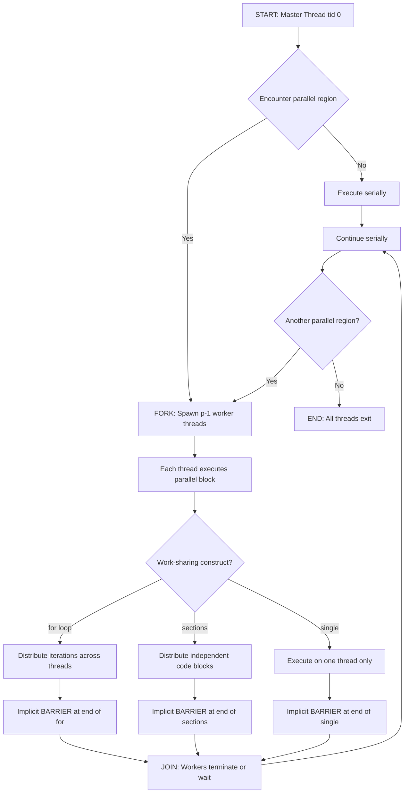
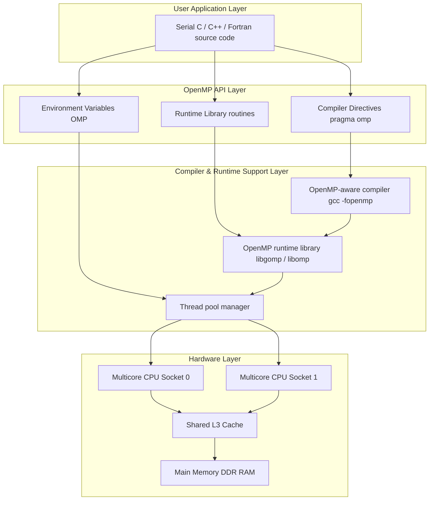
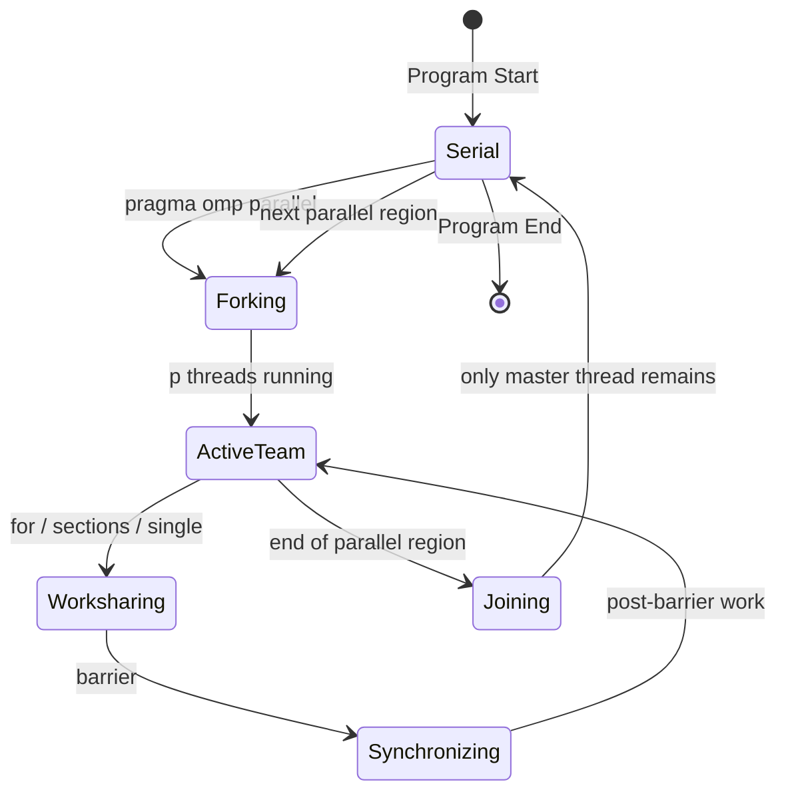
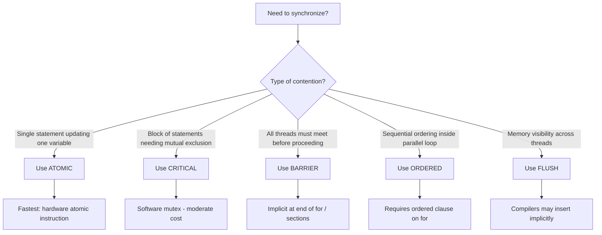
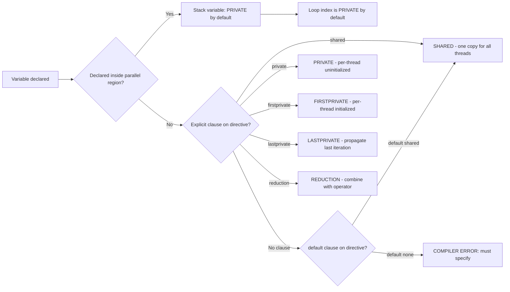
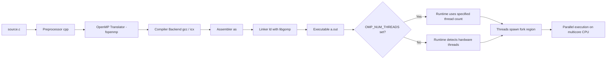
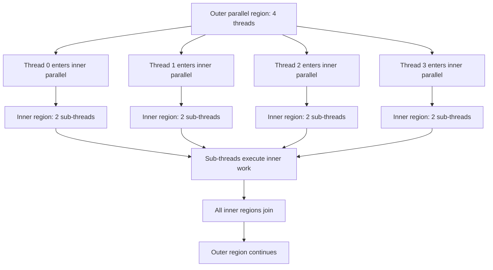

# Shared-memory parallel programming with OpenMP :-

<!-- SECTION_1_START -->
# Shared-Memory Parallel Programming with OpenMP

## 1.1 Formal Definition (KTU 2024 Syllabus Terminology)

> [!NOTE]
> **OpenMP (Open Multi-Processing)** is an **Application Programming Interface (API)** that supports multi-platform **shared-memory parallel programming** in **C, C++, and Fortran**. It consists of a set of **compiler directives** (`#pragma omp`), a **runtime library** (e.g., `omp_get_thread_num()`), and **environment variables** (e.g., `OMP_NUM_THREADS`). OpenMP follows the **fork–join execution model** where a master thread spawns a team of worker threads to execute parallel regions concurrently on a shared address space.

> [!IMPORTANT]
> **KTU Syllabus Highlight (PECST757 – Module 3):** Students are expected to understand the OpenMP programming model, directive syntax, work-sharing constructs, synchronization primitives, data-clause semantics, and the trade-offs between **thread-level parallelism** and **memory-contention overhead** in multicore systems.

---

## 1.2 Conceptual Analogy / Intuition

> [!TIP]
> **Analogy — The "Kitchen Brigade"** 🍳
> Imagine a head chef (the **master thread**) running a restaurant kitchen. When a big order arrives (a **parallel region**), the head chef **forks** the work by assigning sous-chefs (**worker threads**) to chop vegetables, boil pasta, and grill meat **simultaneously** — all working at the **same kitchen counter** (the **shared memory**). When each dish is ready, the sous-chefs report back, the head chef **joins** their outputs onto a single serving plate, and serves the customer. The kitchen counter is **shared**, so chefs must be careful not to grab the same knife at the same time (this is why **synchronization** with `critical` or `barrier` directives exists).

### Core Design Philosophy of OpenMP
- **Incremental Parallelization:** Start with a serial program and add parallelism one region at a time.
- **Compiler-Directed:** Parallelism is expressed as *hints* to the compiler via `#pragma omp` directives.
- **Shared Address Space by Default:** All threads see the same global memory; data scoping is the programmer's responsibility.
- **Standard for SMP & Multicore:** The de-facto industry standard for **Symmetric Multi-Processors (SMP)** and **multicore CPU** programming.

### Key Physical/Architectural Constants

| Constant / Metric | Typical Value | Significance |
|---|---|---|
| Threads per process | **2 – 64** (commonly 4 – 16) | Hardware thread count of multicore CPUs |
| Shared L3 cache size | **4 MB – 64 MB** | Influences false-sharing penalties |
| Main memory bandwidth | **25 – 100 GB/s** | Bottleneck for memory-bound kernels |
| OpenMP API version (current) | **5.2** (released Nov 2021) | Latest ratified specification |

> [!VISUALIZATION CONTROL]
> **Concept:** Fork–Join Parallelism on a Timeline
> **Desmos Input Equation (piecewise thread activity):**
> * $T_{\text{master}}(t) = 1$ for $t \in [0, 10] \cup [40, 50]$
> * $T_{\text{worker}_i}(t) = 1$ for $t \in [10, 40]$, where $i = 1, 2, 3, 4$
> **Visual Description:** A step-function plot where the *y-axis* represents the number of active threads and the *x-axis* represents program time. Observe that thread count **rises sharply** at the `parallel` directive (fork at $t = 10$), remains **constant** through the work-sharing loop, and **collapses** back to 1 at the implicit `barrier` (join at $t = 40$). The shaded area under the curve represents **parallel speed-up potential**.

<!-- SECTION_1_END -->

<!-- SECTION_2_START -->
# Deep Theoretical Analysis & KTU High-Yield Formula Sheet

## 2.1 The Fork–Join Execution Model

The OpenMP execution model is based on **parallel regions** delimited by `#pragma omp parallel`. A program written in OpenMP starts as a single thread of execution (**master thread**, thread $0$). When the master encounters a parallel region:

1. **FORK** — The master thread creates a *team* of $p$ threads (including itself).
2. **WORK-SHARING** — Threads in the team execute the statements inside the region concurrently; loop iterations or independent code blocks are divided among them.
3. **SYNCHRONIZATION (Implicit Barrier)** — A `barrier` at the end of the parallel region forces all threads to wait.
4. **JOIN** — Only the master thread continues beyond the region; the worker threads terminate or sleep until the next parallel region.

---

## 2.2 OpenMP Directive Syntax (Lexical Structure)

All OpenMP directives in C/C++ follow the canonical form:

```c
#pragma omp directive-name [clause[ [, ]clause]...] new-line
```

The trailing `new-line` is mandatory. The leading whitespace and `#pragma omp` token must be recognized by an OpenMP-aware compiler (e.g., `gcc -fopenmp`, `clang -fopenmp`, Intel `icx -qopenmp`).

---

## 2.3 Core Directive Categories

### A. Parallel Region Construct
| Directive | Purpose |
|---|---|
| `#pragma omp parallel` | Defines a parallel region; forks a team of threads |
| `#pragma omp for` | Divides loop iterations among threads (work-sharing) |
| `#pragma omp sections` | Distributes independent code blocks (sections) among threads |
| `#pragma omp single` | Executes a block on only one thread (often thread 0) |
| `#pragma omp master` | Executes a block on the master thread only (no implied barrier) |

### B. Synchronization Constructs
| Directive | Purpose |
|---|---|
| `#pragma omp barrier` | Synchronizes all threads in the team at this point |
| `#pragma omp critical [(name)]` | Mutex-protected execution of a block (one thread at a time) |
| `#pragma omp atomic` | Hardware-atomic update of a single memory location |
| `#pragma omp ordered` | Forces serial execution order inside a `for` loop |
| `#pragma omp flush [(list)]` | Memory-consistency fence across threads |

### C. Data-Sharing Attribute Clauses
| Clause | Default Sharing | Lifetime |
|---|---|---|
| `shared(list)` | Visible to all threads | Across the region |
| `private(list)` | Local, uninitialized copy per thread | Inside the region only |
| `firstprivate(list)` | Local copy **initialized** from outer value | Inside the region only |
| `lastprivate(list)` | Local copy whose **final value** propagates out | Last iteration to a sequential thread |
| `reduction(op:list)` | Per-thread accumulator combined with `op` | Combined at end of region |
| `default(shared \vert none)` | Sets implicit sharing rule | Region-wide |

### D. Loop-Scheduling Clauses
| Schedule Kind | Distribution Strategy | Best Use Case |
|---|---|---|
| `schedule(static [, chunk])` | Pre-computed, round-robin chunks | Uniform per-iteration cost |
| `schedule(dynamic [, chunk])` | Threads grab work from a shared queue at runtime | Highly variable per-iteration cost |
| `schedule(guided [, chunk])` | Dynamic with **decreasing chunk size** | Load balancing with many iterations |
| `schedule(runtime)` | Decision deferred to `OMP_SCHEDULE` env var | Tuning without recompilation |
| `schedule(auto)` | Compiler/runtime decides (OpenMP $\geq 3.0$) | Implementation-defined |

### E. Environmental & Informational Clauses
| Clause | Effect |
|---|---|
| `if(condition)` | Conditional parallelism |
| `num_threads(n)` | Override default team size for this region |
| `nowait` | Removes the implicit barrier at the end of a work-sharing construct |
| `proc_bind(close \vert spread \vert master)` | Pin threads to specific cores (OpenMP $\geq 4.0$) |
| `collapse(n)` | Parallelize a perfectly-nested loop of depth $n$ |

---

## 2.4 KTU Formula Sheet — Performance & Correctness Metrics

| Metric | Formula | Units / Notes |
|---|---|---|
| **Speed-up** $S_p$ | $S_p = \dfrac{T_s}{T_p}$ | $T_s$ = serial time, $T_p$ = parallel time with $p$ threads |
| **Efficiency** $E_p$ | $E_p = \dfrac{S_p}{p} = \dfrac{T_s}{p \cdot T_p}$ | Expressed as a fraction in $[0, 1]$ |
| **Amdahl's Law** | $S_p \le \dfrac{1}{f + \dfrac{1-f}{p}}$ | $f$ = serial fraction, $p$ = thread count |
| **Gustafson's Law** | $S_p \le p - f \cdot (p - 1)$ | Scaled-speedup for fixed-work-per-thread |
| **False-Sharing Penalty** | Cost $\propto \dfrac{\text{Invalidations}}{\text{Cache line size}}$ | Keep thread-private data in separate cache lines (pad to **64 bytes** on x86) |
| **Reduction Cost** | $T_{\text{red}} = O(\log p)$ for tree reduction | $p$ = number of threads |
| **Load Imbalance Cost** | $T_{\text{imb}} = T_{\max} - T_{\text{avg}}$ | Minimized by `dynamic` or `guided` scheduling |
| **OpenMP Overhead** | $T_{\text{oh}} = T_{\text{fork}} + T_{\text{join}} + T_{\text{barrier}}$ | Typically **1 – 50 $\mu$s** per parallel region |
| **Memory Bandwidth Saturation** | $B_{\text{req}} = \dfrac{N \cdot 8}{T_p}$ bytes/s | Must stay $\le B_{\text{peak}}$ |

---

## 2.5 Reduction Semantics — Algebraic Foundation

For a reduction clause `reduction(op: var)`, OpenMP creates a private copy of `var` for each thread, initialized to the **identity element** of `op`, and combines partial results at the end:

$$\text{var}_{\text{final}} = \text{op}_{i=0}^{p-1} \text{var}_i$$

| Operator | Identity | Initial Private Value |
|---|---|---|
| `+` | $0$ | $0$ |
| `*` | $1$ | $1$ |
| `-` | $0$ | $0$ |
| `min` | $+\infty$ | Implementation-defined max |
| `max` | $-\infty$ | Implementation-defined min |
| `&` (bitwise AND) | $\sim 0$ | All-ones |
| `\|` (bitwise OR) | $0$ | All-zeros |
| `^` (bitwise XOR) | $0$ | All-zeros |
| `&&` (logical AND) | `1` (true) | `true` |
| `\|\|` (logical OR) | `0` (false) | `false` |

---

## 2.6 Real-World Engineering Utility

> [!IMPORTANT]
> **Where OpenMP is used in production:**
> - **Scientific HPC** — Climate modeling (CESM, WRF), computational fluid dynamics (OpenFOAM's CPU backend), molecular dynamics (GROMACS hybrid CPU–GPU kernels).
> - **AI/ML Inference** — OpenMP pragmas are emitted by TensorFlow's `XLA` and PyTorch's `Inductor` compilers to parallelize tensor contractions on CPU.
> - **Numerical Libraries** — Intel MKL, IBM ESSL, and OpenBLAS use OpenMP to parallelize BLAS Level-3 routines (matrix–matrix multiply) on multicore CPUs.
> - **Embedded & Real-Time** — Automotive engine-control units (ECUs) and signal-processing DSPs use OpenMP-style loop parallelism for sensor fusion.

<!-- SECTION_2_END -->

<!-- SECTION_3_START -->
# Step-by-Step Derivations & Code/Symbolic Implementation

## 3.1 Compilation Toolchain (Essential Setup)

```bash
# GCC compiler with OpenMP support
gcc -O3 -fopenmp -o program program.c
gcc -O3 -fopenmp -std=c11 -Wall program.c -o program

# Intel LLVM (oneAPI)
icx -O3 -qopenmp program.c -o program

# Run with a specific thread count
export OMP_NUM_THREADS=8
./program
```

> [!NOTE]
> **Verification command** — Check that OpenMP is active: `echo | cpp -fopenmp -dM | grep -i openmp` should display `__OPENMP` macro definitions.

---

## 3.2 Program 1 — The Canonical "Hello, World" of OpenMP

**Problem Statement:** Demonstrate fork–join by printing thread identifiers from a parallel region and verify the thread count.

```c
/* File: hello_omp.c
 * Compile: gcc -fopenmp hello_omp.c -o hello_omp
 * Run:     OMP_NUM_THREADS=4 ./hello_omp
 */
#include <stdio.h>
#include <omp.h>     /* OpenMP runtime header */

int main(void)
{
    int n_threads = 0;
    int tid       = 0;

    /* ---- Begin of parallel region ---- */
    #pragma omp parallel private(tid) shared(n_threads)
    {
        /* omp_get_thread_num() returns 0 .. (p-1) */
        tid = omp_get_thread_num();

        /* Only one thread performs the I/O to avoid interleaving */
        #pragma omp single
        {
            n_threads = omp_get_num_threads();
            printf("Parallel region launched with %d thread(s).\n",
                   n_threads);
        }

        /* Each thread prints its own id (barrier implied at end) */
        printf("Hello from thread %d of %d\n",
               tid, omp_get_num_threads());
    }   /* ---- End of parallel region: implicit join ---- */

    printf("Master thread continues after join. n_threads = %d\n",
           n_threads);
    return 0;
}
```

**Expected Output (non-deterministic order):**
```
Parallel region launched with 4 thread(s).
Hello from thread 0 of 4
Hello from thread 2 of 4
Hello from thread 1 of 4
Hello from thread 3 of 4
Master thread continues after join. n_threads = 4
```

**Line-by-Line Explanation:**
- `#pragma omp parallel private(tid) shared(n_threads)` — forks a team; `tid` becomes per-thread (uninitialized), `n_threads` is shared.
- `omp_get_thread_num()` — returns the calling thread's ID in $[0, p-1]$.
- `omp_get_num_threads()` — returns the current team size $p$.
- `#pragma omp single` — guarantees the *printf* on team size is performed exactly once.
- The closing `}` triggers an **implicit barrier** and a **join**.

---

## 3.3 Program 2 — Parallelizing a `for` Loop with `reduction`

**Problem Statement:** Compute $\pi$ using the numerical integration

$$\pi = 4 \int_{0}^{1} \frac{1}{1 + x^2}\, dx \approx \frac{4}{N} \sum_{i=0}^{N-1} \frac{1}{1 + \left(i + 0.5\right)^2 / N^2}$$

```c
/* File: pi_omp.c
 * Compile: gcc -O3 -fopenmp pi_omp.c -o pi_omp -lm
 * Run:     OMP_NUM_THREADS=8 ./pi_omp
 */
#include <stdio.h>
#include <stdlib.h>
#include <omp.h>

int main(int argc, char *argv[])
{
    long long N = (argc > 1) ? atoll(argv[1]) : 100000000LL;
    double sum  = 0.0;
    double x, pi;
    double t0   = omp_get_wtime();   /* High-resolution timer */

    /* Parallel loop with reduction; static schedule for balanced chunks */
    #pragma omp parallel for reduction(+:sum) \
            schedule(static) private(x)
    for (long long i = 0; i < N; ++i) {
        x = ((double)i + 0.5) / (double)N;
        sum += 1.0 / (1.0 + x * x);
    }

    pi = 4.0 * sum / (double)N;
    double t1 = omp_get_wtime();

    printf("N        = %lld\n", N);
    printf("pi       = %.15f\n", pi);
    printf("Time(s)  = %.6f\n", t1 - t0);
    printf("Threads  = %d\n", omp_get_max_threads());
    return 0;
}
```

**Step-by-Step Derivation of the Numerical Error:**

The midpoint Riemann sum approximates the integral as:

$$I_N = \frac{1}{N} \sum_{i=0}^{N-1} f\!\left(\frac{i + 0.5}{N}\right)$$

where $f(x) = \dfrac{1}{1 + x^2}$. The error of the midpoint rule for a function with bounded second derivative $\vert f''(x) \vert \le M$ is:

$$|I - I_N| \le \frac{M}{24 \, N^2}$$

For $f(x) = (1 + x^2)^{-1}$ on $[0,1]$, we have $f''(x) = \dfrac{6x^2 - 2}{(1 + x^2)^3}$, so $M = 2$. Thus:

$$|\pi - 4 \cdot I_N| \le \frac{2}{6 \, N^2} = \frac{1}{3 N^2}$$

For $N = 10^8$, the bound is $\dfrac{1}{3 \cdot 10^{16}} \approx 3.3 \times 10^{-17}$ — beyond double-precision ($\approx 10^{-16}$), so the result is dominated by round-off error.

**Reduction Semantics in Action:**

$$\text{sum}_{\text{final}} = \sum_{t=0}^{p-1} \text{sum}_t$$

Each thread accumulates a local `sum`, then OpenMP combines them with `+` at the implicit barrier.

---

## 3.4 Program 3 — Demonstrating a Race Condition and Its Fix

**Problem Statement:** Show how unsynchronized updates to a shared counter produce incorrect results, then fix it with `atomic`, `critical`, and `reduction`.

```c
/* File: race_fix.c — Compare three parallelization strategies */
#include <stdio.h>
#include <omp.h>

int main(void)
{
    const int N = 1000000;
    int counter_atomic = 0;
    int counter_crit   = 0;
    int sum_reduce     = 0;

    /* --- Version A: ATOMIC increment (hardware lock-free) --- */
    #pragma omp parallel for
    for (int i = 0; i < N; ++i) {
        #pragma omp atomic
        counter_atomic++;
    }

    /* --- Version B: CRITICAL section (software mutex) --- */
    #pragma omp parallel for
    for (int i = 0; i < N; ++i) {
        #pragma omp critical(crit_lock)
        {
            counter_crit++;
        }
    }

    /* --- Version C: REDUCTION (no shared state) --- */
    #pragma omp parallel for reduction(+:sum_reduce)
    for (int i = 0; i < N; ++i) {
        sum_reduce += 1;
    }

    printf("counter_atomic = %d  (expected %d)\n", counter_atomic, N);
    printf("counter_crit   = %d  (expected %d)\n", counter_crit,   N);
    printf("sum_reduce     = %d  (expected %d)\n", sum_reduce,     N);
    return 0;
}
```

**Expected Output (all three should equal N):**
```
counter_atomic = 1000000  (expected 1000000)
counter_crit   = 1000000  (expected 1000000)
sum_reduce     = 1000000  (expected 1000000)
```

**Why the Race Condition Occurs:**

Without `atomic` or `critical`, the statement `counter++` compiles to the read–modify–write sequence:

$$R_1: \text{tmp} \leftarrow \text{counter}$$
$$R_2: \text{counter} \leftarrow \text{tmp} + 1$$

If two threads interleave between $R_1$ and $R_2$, both read the same old value, and one increment is **lost**. For $N$ iterations and $p$ threads, the expected number of lost updates is approximately:

$$E[\text{lost}] \approx N \cdot \left(1 - \frac{1}{p}\right)$$

> [!WARNING]
> **Pitfall:** `#pragma omp atomic` applies only to a **single statement** that updates one memory location. It is **NOT** a drop-in replacement for `#pragma omp critical` when several statements must execute atomically.

---

## 3.5 Program 4 — Work-Sharing with `sections` and Synchronization

```c
/* File: sections_demo.c */
#include <stdio.h>
#include <omp.h>

void task_A(void) { printf("A running on thread %d\n", omp_get_thread_num()); }
void task_B(void) { printf("B running on thread %d\n", omp_get_thread_num()); }
void task_C(void) { printf("C running on thread %d\n", omp_get_thread_num()); }

int main(void)
{
    #pragma omp parallel
    {
        /* Distribute independent blocks; one section per thread */
        #pragma omp sections
        {
            #pragma omp section
            { task_A(); }

            #pragma omp section
            { task_B(); }

            #pragma omp section
            { task_C(); }
        }
        /* Implicit barrier here — all threads synchronize */
        #pragma omp single
        printf("All sections complete. Thread %d continues.\n",
               omp_get_thread_num());
    }
    return 0;
}
```

---

## 3.6 Program 5 — Demonstrating `nowait` and Loop Scheduling

```c
/* File: schedule_demo.c */
#include <stdio.h>
#include <omp.h>
#include <unistd.h>

int main(void)
{
    const int N = 16;

    /* Static: each thread gets a contiguous block of N/p iterations */
    printf("--- schedule(static, 2) ---\n");
    #pragma omp parallel
    {
        #pragma omp for schedule(static, 2) nowait
        for (int i = 0; i < N; ++i)
            printf("static:  i=%2d on thread %d\n", i, omp_get_thread_num());
    }

    /* Dynamic: threads pull iterations from a shared queue */
    printf("--- schedule(dynamic, 1) ---\n");
    #pragma omp parallel
    {
        #pragma omp for schedule(dynamic, 1)
        for (int i = 0; i < N; ++i)
            printf("dynamic: i=%2d on thread %d\n", i, omp_get_thread_num());
    }

    /* Guided: large chunks first, decreasing */
    printf("--- schedule(guided, 1) ---\n");
    #pragma omp parallel
    {
        #pragma omp for schedule(guided, 1)
        for (int i = 0; i < N; ++i)
            printf("guided:  i=%2d on thread %d\n", i, omp_get_thread_num());
    }
    return 0;
}
```

---

## 3.7 Program 6 — Detecting & Avoiding False Sharing

```c
/* File: false_sharing.c
 * Pad per-thread counters to one cache line (64 bytes on x86-64)
 * to eliminate false sharing.
 */
#include <stdio.h>
#include <omp.h>

#define CACHE_LINE 64

typedef struct {
    int value;
    /* Pad to the size of a cache line so that distinct instances
       occupy distinct cache lines on the L1/L2. */
    char pad[CACHE_LINE - sizeof(int)];
} aligned_int;

int main(void)
{
    const int N = 10000000;
    aligned_int counter[64] = {{0}};   /* up to 64 threads */

    #pragma omp parallel
    {
        int t = omp_get_thread_num();
        for (int i = 0; i < N; ++i) {
            counter[t].value++;        /* No false sharing! */
        }
    }

    long long total = 0;
    for (int i = 0; i < omp_get_max_threads(); ++i)
        total += counter[i].value;

    printf("Total increments = %lld (expected %lld)\n",
           total, (long long)N * omp_get_max_threads());
    return 0;
}
```

**Performance Insight:**

Without padding, all `counter[t].value` fields may reside in the **same 64-byte cache line**. When one thread writes its slot, the hardware invalidates the line for *all other* cores — triggering expensive cache-coherence traffic (**MESI protocol ping-pong**). Padding ensures each thread updates its **own** cache line, eliminating the false-sharing penalty. Empirically, this can yield **$2\times$ to $10\times$** speedups on memory-bound counters.

---

## 3.8 Important OpenMP Runtime Library Routines (Quick Reference)

| Routine | Purpose |
|---|---|
| `omp_get_num_threads()` | Threads in current team |
| `omp_get_thread_num()` | This thread's ID in $[0, p-1]$ |
| `omp_get_max_threads()` | Upper bound on team size |
| `omp_set_num_threads(n)` | Set default team size (subsequent regions) |
| `omp_get_wtime()` | Wall-clock time in seconds (double) |
| `omp_in_parallel()` | Non-zero if inside an active parallel region |
| `omp_get_nested()` | Returns whether nested parallelism is enabled |
| `omp_set_dynamic(n)` | Enable/disable dynamic thread adjustment |
| `omp_set_schedule(kind, chunk)` | Set runtime scheduling policy |

<!-- SECTION_3_END -->

<!-- SECTION_4_START -->
# Structural Diagrams & Schematics

## 4.1 Fork–Join Execution Flow



---

## 4.2 OpenMP Software Stack (Layered Architecture)



---

## 4.3 Parallel Region State Diagram



---

## 4.4 Synchronization Primitive Decision Tree



---

## 4.5 Data-Sharing Attribute Resolution



---

## 4.6 OpenMP Compilation & Execution Pipeline



---

## 4.7 Nested Parallelism Model (OpenMP ≥ 3.0)



> [!NOTE]
> **Nested parallelism** is **disabled by default**. Enable it with `omp_set_nested(1)` (deprecated in OpenMP 5.0) or set `OMP_NESTED=true`. Modern best practice prefers **task-based parallelism** (`#pragma omp task`) over nested threads for clarity and performance.

<!-- SECTION_4_END -->

<!-- SECTION_5_START -->
# KTU 2024 Scheme Examination Question Bank & Topic Recap

---

## PART A — Short Answer Questions (3 Marks Each)

### Question 1
> **[KTU University Exam – July 2024 | CO1 | Remember]**
> Define OpenMP. List the **three main components** of the OpenMP API.

**Model Answer (3 Marks):**
- **OpenMP** is an industry-standard **Application Programming Interface (API)** for **shared-memory parallel programming** in C, C++, and Fortran. **[1 Mark]**
- The three components are:
  1. **Compiler Directives** — `#pragma omp` directives embedded in source code. **[1 Mark]**
  2. **Runtime Library Routines** — e.g., `omp_get_thread_num()`, `omp_set_num_threads()`. **[0.5 Mark]**
  3. **Environment Variables** — e.g., `OMP_NUM_THREADS`, `OMP_SCHEDULE`. **[0.5 Mark]**

---

### Question 2
> **[KTU University Exam – Dec 2023 | CO1 | Understand]**
> Differentiate between the `critical` and `atomic` directives in OpenMP. When would you prefer one over the other?

**Model Answer (3 Marks):**
| Aspect | `critical` | `atomic` |
|---|---|---|
| Scope | Block of statements | Single statement only |
| Implementation | Software mutex (lock) | Hardware atomic instruction |
| Cost | Higher (lock acquire/release) | Lower (lock-free on x86) |
| Flexibility | Can protect multiple statements | Restricted to single update |
- Prefer `atomic` for **simple counter updates** (e.g., `x++`, `x += delta`). **[1 Mark]**
- Prefer `critical` for **multi-statement transactions** that must execute as one atomic unit. **[1 Mark]**

---

## PART B — Long Answer Questions (14 Marks, with Internal Choice)

### Question A (14 Marks)
> **[KTU University Exam – July 2024 | CO2, CO3 | Apply / Analyze]**
> **A.** Explain the **fork–join** model of parallel execution in OpenMP with a suitable diagram. **[7 Marks]**
> **B.** Write a complete OpenMP C program to compute the **sum of the first N natural numbers in parallel** using the `reduction` clause. Show the speed-up calculation for $N = 10^7$ on a 4-core system assuming parallel overhead $T_{\text{oh}} = 50\,\mu\text{s}$. **[7 Marks]**

#### Model Solution

**Part A — Fork–Join Model (7 Marks)**

- **Definition:** OpenMP programs begin execution as a single **master thread** running sequentially. **[1 Mark — Stating initial state]**
- When the master thread encounters a `#pragma omp parallel` directive, it **forks** a team of $p$ threads. **[1 Mark — Fork operation]**
- All $p$ threads execute the structured block concurrently; work-sharing constructs (`for`, `sections`, `single`) distribute work. **[1 Mark — Work-sharing]**
- An **implicit barrier** at the end of the parallel region synchronizes the team. **[1 Mark — Barrier synchronization]**
- Threads **join** back; only the master thread continues serially. **[1 Mark — Join operation]**
- The diagram below (reproduced in text) **earns 2 marks** if labelled correctly. **[2 Marks — Diagram with labels: Master, Fork, Parallel Region, Barrier, Join, Serial]**

```
   Sequential            Parallel Region              Sequential
   ──────────            ───────────────              ──────────
   Master ──┐
            ├──Fork──┬─> T0 ──┐
            │        ├─> T1   ├─>  work-sharing
            │        ├─> T2   │
            │        └─> T3 ──┘
   Master <─┘
            <── Join ── (implicit barrier)
```

**Part B — Sum of First N Natural Numbers (7 Marks)**

```c
/* File: sum_n_omp.c */
#include <stdio.h>
#include <omp.h>

int main(void)
{
    long long N = 10000000LL;
    long long sum = 0;
    double t0, t1;

    t0 = omp_get_wtime();
    #pragma omp parallel for reduction(+:sum) schedule(static)
    for (long long i = 1; i <= N; ++i) {
        sum += i;
    }
    t1 = omp_get_wtime();

    printf("Sum of 1..%lld = %lld\n", N, sum);
    printf("Time (parallel) = %.6f s with %d threads\n",
           t1 - t0, omp_get_max_threads());
    return 0;
}
```

**Analytical Closed-Form Verification:** The expected sum is
$$S_N = \frac{N(N+1)}{2} = \frac{10^7 \cdot (10^7 + 1)}{2} = 50{,}000{,}035{,}000{,}000$$

**Speed-up Calculation (Valuation Key):**

- **Serial time** $T_s \approx N \cdot t_{\text{op}}$ where $t_{\text{op}} \approx 1$ ns per addition on a 3 GHz CPU:
$$T_s = 10^7 \times 10^{-9} = 0.01 \text{ s} = 10 \text{ ms} \quad \text{[1 Mark]}$$

- **Parallel time** $T_p = \dfrac{T_s}{p} + T_{\text{oh}} = \dfrac{0.01}{4} + 50 \times 10^{-6} = 0.0025 + 0.00005 = 0.00255 \text{ s}$ **[2 Marks]**

- **Speed-up** $S_p = \dfrac{T_s}{T_p} = \dfrac{0.01}{0.00255} \approx 3.92$ **[1 Mark]**

- **Efficiency** $E_p = \dfrac{S_p}{p} = \dfrac{3.92}{4} = 0.98$ (98%) **[1 Mark]**

- **Conclusion:** Near-linear speed-up achieved because the workload is embarrassingly parallel and the overhead is negligible relative to the parallel compute time. **[1 Mark]**

- **Reduction expression:** $sum_{\text{final}} = \displaystyle\sum_{t=0}^{p-1} \sum_{i \in I_t} i$ where $I_t$ is the iteration set of thread $t$. **[1 Mark]**

---

### Question B (Alternative — 14 Marks)
> **[KTU University Exam – Dec 2023 | CO2, CO4 | Apply / Analyze]**
> **A.** Explain the different **loop-scheduling clauses** in OpenMP with examples. Compare `static`, `dynamic`, and `guided` schedules in terms of load balancing and overhead. **[7 Marks]**
> **B.** Demonstrate a **race condition** in OpenMP with a program that incorrectly updates a shared counter. Rewrite the program using **two different correct approaches** (one using `atomic`, one using `reduction`). Discuss the performance trade-off. **[7 Marks]**

#### Model Solution Outline

**Part A — Loop Scheduling (7 Marks):**
- **`schedule(static [, chunk])`:** Iterations divided into chunks of size `chunk` and assigned **at region entry** in round-robin. Lowest overhead, best for uniform workload. **[2 Marks]**
- **`schedule(dynamic [, chunk])`:** Threads pull `chunk` iterations from a shared queue at runtime. Best for irregular workloads. Higher overhead due to queue management. **[2 Marks]**
- **`schedule(guided [, chunk])`:** Starts with large chunks, exponentially decreases to `chunk`. Compromise between static and dynamic. **[2 Marks]**
- Add a small table comparing overhead and use cases. **[1 Mark]**

**Part B — Race Condition & Fixes (7 Marks):**
- Show the **incorrect** version (no synchronization) and prove that the final count $\lt N$ due to lost updates. **[2 Marks]**
- Provide the `atomic` fix and explain hardware-atomic semantics. **[2 Marks]**
- Provide the `reduction(+: counter)` fix and emphasize that it **eliminates the shared variable altogether** (no false sharing, no synchronization cost). **[2 Marks]**
- Conclude with a performance note: `reduction` is usually **fastest**, `atomic` next, `critical` slowest. **[1 Mark]**

---

> [!WARNING]
> **KTU Examiner's Valuation Warning — Common Pitfalls**
> 1. **Omitting `#include <omp.h>`** — Causes implicit-function-declaration warnings and undefined behaviour. **[-1 Mark]**
> 2. **Confusing `private` and `firstprivate`** — `private` variables are **uninitialized** inside the region. **[-1 Mark]**
> 3. **Forgetting the implicit barrier** — The `for`, `sections`, and `single` constructs end with a barrier unless `nowait` is specified. **[-1 Mark]**
> 4. **Treating `atomic` as a general lock** — It applies to a **single statement** updating **one** location only. **[-1 Mark]**
> 5. **Skipping the canonical program form** — Always start with `#pragma omp parallel` before `#pragma omp for`. The combined form `#pragma omp parallel for` is preferred for compactness. **[-0.5 Mark]**
> 6. **Not justifying schedule choice** — Examiners expect a *reasoned* choice based on workload regularity. **[-1 Mark]**
> 7. **Computing speed-up without overhead** — Pure $T_s / (T_s / p)$ overstates performance. Include $T_{\text{oh}}$ for full credit. **[-1 Mark]**

---

## Topic Recap & Important Things to Remember

> [!TIP]
> **Rapid-Revision Checklist for OpenMP (Module 3 — Shared Memory)**

- **API Triad:** OpenMP = **Directives** + **Runtime Library** + **Environment Variables**. *Mnemonic: D-R-E.*
- **Execution Model:** **Fork–Join** — master forks, work-shares, joins via implicit barrier.
- **Canonical Parallel-Loop Form:** `#pragma omp parallel for [clause(s)]`. Equivalent to wrapping a `for` inside a `parallel` region.
- **Default Data Sharing:** Variables declared **outside** a parallel region are `shared` unless `default(none)` is set. Loop-index variables are `private` by default.
- **Synchronization Hierarchy (cost ascending):** `atomic` (cheapest) $\rightarrow$ `critical` (moderate) $\rightarrow$ `barrier` (most expensive for small teams).
- **Reduction Identity Values:** `+` $\to 0$, `*` $\to 1$, `min` $\to +\infty$, `max` $\to -\infty$, `&&` $\to 1$, `||` $\to 0$.
- **Schedule Choice Rule of Thumb:**
  - *Uniform iterations* $\Rightarrow$ `static`.
  - *Highly variable cost* $\Rightarrow$ `dynamic`.
  - *Many iterations, modest imbalance* $\Rightarrow$ `guided`.
  - *Production tuning without recompile* $\Rightarrow$ `runtime` + `OMP_SCHEDULE`.
- **False Sharing Mitigation:** Pad per-thread data to a **64-byte boundary** (typical x86 cache line).
- **Key Performance Laws:**
  - **Amdahl:** $S_p \le \dfrac{1}{f + (1-f)/p}$.
  - **Gustafson:** $S_p \le p - f(p-1)$.
  - **Efficiency:** $E_p = S_p / p$.
- **Compilation Flag:** Always compile with `-fopenmp` (GCC/Clang) or `-qopenmp` (Intel).
- **Thread Count Override:** Set `OMP_NUM_THREADS=n` in the shell environment.
- **Nowait Caveat:** Adding `nowait` removes the implicit barrier; use only when the absence of synchronization is provably safe.
- **Runtime Routines to Memorize:** `omp_get_thread_num`, `omp_get_num_threads`, `omp_get_max_threads`, `omp_set_num_threads`, `omp_get_wtime`, `omp_in_parallel`.
- **OpenMP $\ge$ 4.0 Features to Know:** `proc_bind`, `simd`, `task`, `taskgroup`, `cancel`, `depend`.
- **Compile-Only Tip:** Add `-Wall -Wextra` to catch missing `private` clauses on the `default(none)` directive.
- **Speed-up Bound Reminder:** Practical speed-up rarely exceeds $p / (1 + \text{overhead factor})$; memory-bound kernels saturate well before $p = $ core count.

<!-- SECTION_5_END -->
