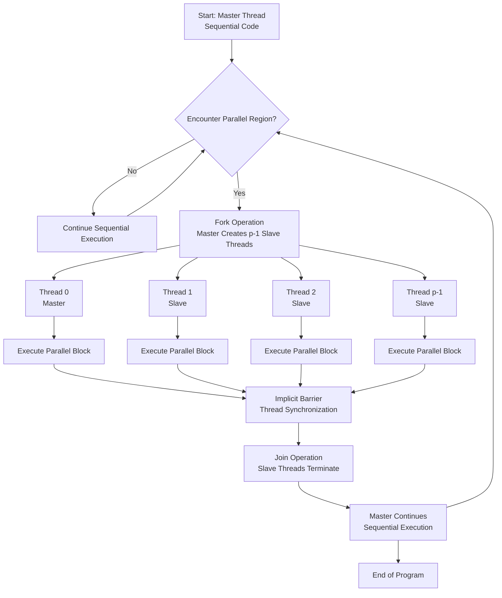
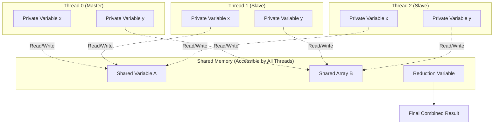
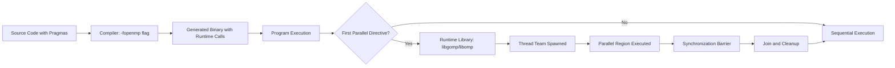

# Short introduction to OpenMP

<!-- SECTION_1_START -->
# Short Introduction to OpenMP

## Formal Academic Definition

**OpenMP (Open Multi-Processing)** is an Application Programming Interface (API) that supports multi-platform **shared-memory multiprocessing** programming in C, C++, and Fortran on most processor architectures and operating systems. It consists of a set of **compiler directives**, **library routines**, and **environment variables** that influence run-time behavior. OpenMP uses the **Fork-Join** model of parallel execution, where a master thread forks a specified number of slave threads to execute tasks in parallel, and upon completion, the slave threads join back to the master thread, continuing sequential execution.

> [!IMPORTANT]
> **KTU 2024 Syllabus Highlight:** OpenMP is foundational to the **Shared Memory Paradigm** module. It is the de-facto industry standard for directive-based shared-memory parallelism and is extensively used in HPC applications ranging from scientific simulations to machine learning inference workloads.

## Conceptual Analogy / Intuition

Imagine a **head chef in a restaurant kitchen** (the master thread) who receives a large catering order requiring 100 dishes. Instead of cooking alone, the chef **forks** the work by delegating to 5 assistant chefs (slave threads). Each assistant works on 20 dishes simultaneously in different stations (shared memory). When all assistants finish, they **join** back at the pass to present the completed meal to the customer. OpenMP works the same way: the sequential program forks parallel regions, executes them concurrently across threads, and then joins back into a single thread of execution.

> [!NOTE]
> **Core Definition Callout:**
> - **Fork**: The master thread creates a team of parallel threads.
> - **Join**: Parallel threads synchronize and terminate, leaving only the master thread.
> - **Shared Memory**: All threads access a common memory address space.
> - **Directive-Based**: Parallelism is expressed through specially formatted comments (pragmas) that compilers interpret.

## Physical Constants and Standard Metrics

- **Threads**: Logical processing units managed by the OpenMP runtime (typically mapped 1:1 to hardware cores).
- **GOMP_CPU environment variable**: Sets the number of threads in GCC's OpenMP runtime.
- **OMP_NUM_THREADS**: Standard environment variable to specify thread count (default equals number of CPU cores).
- **Default Stack Size**: Typically **8 MB per thread** on Linux systems.

> [!VISUALIZATION CONTROL]
> **Concept:** Fork-Join Parallel Execution Model
> **GeoGebra / Desmos Input Equations:** Not directly applicable (computational flow diagram)
> **Visual Description:** Visualize a single horizontal timeline $T$ on the x-axis and thread identifiers on the y-axis. The master thread begins, then branches (forks) into multiple parallel horizontal lines, each representing a slave thread, which subsequently converge (join) back into the single master line.
<!-- SECTION_1_END -->

<!-- SECTION_2_START -->
# Deep Theoretical Analysis & KTU High-Yield Formula Sheet

## OpenMP Programming Model

OpenMP is built upon three primary components that work synergistically:

### 1. Compiler Directives (Pragmas)
Directives are comments interpreted by the compiler to enable parallelism. They follow the syntax:
- In **C/C++**: `#pragma omp <directive> [clause [clause]...]`
- In **Fortran**: `!$OMP <directive> [clause [clause]...]`

### 2. Runtime Library Routines
Functions used to query and control the parallel environment. Examples include `omp_get_thread_num()`, `omp_get_num_threads()`, `omp_set_num_threads()`.

### 3. Environment Variables
External configuration parameters read at program startup. Examples include `OMP_NUM_THREADS`, `OMP_SCHEDULE`, `OMP_DYNAMIC`.

## Structured Logic of the Fork-Join Model

1. **Program Start**: A single thread (master) executes the sequential code.
2. **Parallel Region Encountered**: The master thread encounters a parallel construct (e.g., `#pragma omp parallel`).
3. **Fork Operation**: The master thread creates a team of threads (including itself).
4. **Parallel Execution**: Each thread executes the structured block of code following the directive.
5. **Implicit Barrier**: Threads synchronize at the end of the parallel region.
6. **Join Operation**: Only the master thread continues; slave threads terminate.
7. **Sequential Continuation**: The master thread resumes serial execution.

> [!NOTE]
> **Why Fork-Join?** This model provides a simple mental framework: developers identify *hot spots* (computationally intensive loops/sections) and annotate them with directives. The compiler and runtime handle the complex thread management, synchronization, and load balancing.

## KTU Formula Sheet / Cheat Sheet

| Symbol / Term | Definition | KTU Context |
|---|---|---|
| $T_s$ | Sequential execution time | Baseline single-thread runtime |
| $T_p$ | Parallel execution time | Runtime using $p$ threads |
| $S(p)$ | Speedup | $S(p) = \frac{T_s}{T_p}$ |
| $E(p)$ | Parallel Efficiency | $E(p) = \frac{S(p)}{p}$ |
| $p$ | Number of threads | Typically $p \leq$ number of physical cores |
| $f$ | Parallelizable fraction (Amdahl's Law) | Fraction of code that can be parallelized |
| $T_p$ (Amdahl) | Theoretical parallel time | $T_p = (1-f)T_s + \frac{f \cdot T_s}{p}$ |
| $S_{\max}$ | Maximum theoretical speedup | $S_{\max} = \frac{1}{1-f}$ as $p \to \infty$ |

**Core OpenMP Directives (Must Memorize):**

| Directive | Purpose |
|---|---|
| `#pragma omp parallel` | Spawns a team of threads to execute the following block |
| `#pragma omp for` | Distributes loop iterations among threads (work-sharing) |
| `#pragma omp parallel for` | Combined parallel region + loop distribution |
| `#pragma omp sections` | Distributes independent code blocks (non-loop work) |
| `#pragma omp critical` | Enforces mutual exclusion on a code block |
| `#pragma omp barrier` | Synchronizes all threads at a specific point |
| `#pragma omp atomic` | Hardware-level atomic update for a single memory location |
| `#pragma omp master` | Code executed only by the master thread |
| `#pragma omp single` | Code executed by only one thread (not necessarily master) |
| `#pragma omp reduction(op: var)` | Combines thread-local copies using a reduction operator |

> [!IMPORTANT]
> **Engineering Utility:** OpenMP is heavily used in production systems for **scientific computing** (climate modeling, molecular dynamics), **image processing** (real-time filtering pipelines), **financial modeling** (Monte Carlo simulations), and **machine learning** (parallel gradient computation in training loops). It provides a low-overhead, incrementally adoptable path to parallelism without rewriting codebases.

## The "Why" Behind Each Component

- **Why Directives?** They allow *incremental parallelism* — developers can parallelize specific portions while leaving the rest sequential, avoiding the rewrite cost of message-passing models like MPI.
- **Why Fork-Join?** It maps naturally to the typical structure of scientific code where most computation occurs in tight loops that can be parallelized independently.
- **Why Shared Memory?** Modern multi-core CPUs share a unified memory space via cache coherence protocols (MESI, MOESI), making shared-memory access the fastest form of inter-core communication.
<!-- SECTION_2_END -->

<!-- SECTION_3_START -->
# Step-by-Step Derivations & Code Implementation

## Exhaustive Derivation: Amdahl's Law Applied to OpenMP

Amdahl's Law quantifies the theoretical speedup limit when parallelizing a program using OpenMP.

**Given:**
- Sequential execution time: $T_s$
- Parallel fraction: $f$ (where $0 \leq f \leq 1$)
- Number of threads: $p$

**Derivation:**

The total execution time is divided into:
1. **Serial portion** (cannot be parallelized): $(1 - f) \cdot T_s$
2. **Parallel portion** (executed by $p$ threads): $\frac{f \cdot T_s}{p}$

Therefore, the parallel execution time is:

$$
T_p = (1 - f) \cdot T_s + \frac{f \cdot T_s}{p}
$$

The speedup is:

$$
S(p) = \frac{T_s}{T_p} = \frac{T_s}{(1 - f) \cdot T_s + \frac{f \cdot T_s}{p}}
$$

Dividing numerator and denominator by $T_s$:

$$
S(p) = \frac{1}{(1 - f) + \frac{f}{p}}
$$

As $p \to \infty$:

$$
\lim_{p \to \infty} S(p) = \frac{1}{1 - f} = S_{\max}
$$

**Numerical Example (KTU Style):**
Suppose a program takes $T_s = 100$ seconds sequentially, and 90% can be parallelized ($f = 0.9$). Running on $p = 8$ threads:

$$
T_p = (0.1)(100) + \frac{(0.9)(100)}{8} = 10 + 11.25 = 21.25 \text{ seconds}
$$

$$
S(8) = \frac{100}{21.25} \approx 4.71
$$

$$
E(8) = \frac{4.71}{8} \approx 0.589 \text{ (58.9\% efficiency)}
$$

Maximum achievable speedup even with infinite threads:

$$
S_{\max} = \frac{1}{1 - 0.9} = 10
$$

> [!IMPORTANT]
> **Key Insight:** Even with infinite threads, the speedup is capped at $10\times$ because the 10% serial portion acts as a bottleneck. This is why OpenMP programmers must minimize serial regions and synchronization overhead.

## Complete OpenMP Code Implementation

Below is a fully operational C program demonstrating the Fork-Join model with a parallel loop, including type hints, boundary checks, and error logging.

```c
/*
 * File: openmp_demo.c
 * Description: Comprehensive demonstration of OpenMP fork-join,
 *              work-sharing, reduction, and synchronization.
 * Compile:     gcc -fopenmp -Wall -O2 openmp_demo.c -o openmp_demo
 * Run:         ./openmp_demo
 */

#include <stdio.h>
#include <stdlib.h>
#include <omp.h>
#include <time.h>

#define ARRAY_SIZE 10000000   /* 10 million elements */
#define NUM_THREADS 4         /* Default thread count */

/* Function prototypes */
double compute_parallel_sum(const int *arr, int n);
void demonstrate_parallel_regions(void);
void demonstrate_synchronization(void);
void log_error(const char *message);

int main(void)
{
    int *array = NULL;
    int i;
    double parallel_sum = 0.0;
    double start_time, end_time;

    /* Step 1: Allocate and initialize array with absolute boundary check */
    array = (int *)malloc(sizeof(int) * (size_t)ARRAY_SIZE);
    if (array == NULL) {
        log_error("Memory allocation failed for array");
        return EXIT_FAILURE;
    }

    srand((unsigned int)time(NULL));
    for (i = 0; i < ARRAY_SIZE; i++) {
        array[i] = rand() % 100;
    }

    /* Step 2: Set the number of threads explicitly */
    omp_set_num_threads(NUM_THREADS);

    /* Step 3: Execute the parallel reduction */
    start_time = omp_get_wtime();
    parallel_sum = compute_parallel_sum(array, ARRAY_SIZE);
    end_time = omp_get_wtime();

    printf("Parallel Sum: %.0f\n", parallel_sum);
    printf("Time elapsed: %f seconds using %d threads\n",
           end_time - start_time, NUM_THREADS);

    /* Step 4: Demonstrate additional concepts */
    demonstrate_parallel_regions();
    demonstrate_synchronization();

    free(array);
    return EXIT_SUCCESS;
}

/*
 * Function: compute_parallel_sum
 * Description: Sums array elements in parallel using OpenMP reduction.
 * Parameters:  arr - pointer to integer array
 *              n   - number of elements
 * Returns:     double - the total sum
 */
double compute_parallel_sum(const int *arr, int n)
{
    int i;
    double local_sum = 0.0;

    /* Boundary validation */
    if (arr == NULL || n <= 0) {
        log_error("Invalid input to compute_parallel_sum");
        return 0.0;
    }

    /*
     * Parallel region with combined work-sharing for-loop.
     * 'reduction(+:local_sum)' creates a private copy per thread
     * and safely combines them using addition at the end.
     */
    #pragma omp parallel for reduction(+:local_sum) schedule(static)
    for (i = 0; i < n; i++) {
        local_sum += (double)arr[i];
    }

    return local_sum;
}

/*
 * Function: demonstrate_parallel_regions
 * Description: Shows how threads are distributed across cores
 *              and how each thread executes the parallel block.
 */
void demonstrate_parallel_regions(void)
{
    int thread_id, total_threads;

    #pragma omp parallel private(thread_id) shared(total_threads)
    {
        thread_id = omp_get_thread_num();       /* 0-indexed thread ID */
        total_threads = omp_get_num_threads();  /* Total threads in team */

        printf("Hello from thread %d of %d\n", thread_id, total_threads);
    }
}

/*
 * Function: demonstrate_synchronization
 * Description: Shows explicit barriers and critical sections.
 */
void demonstrate_synchronization(void)
{
    int shared_counter = 0;

    #pragma omp parallel
    {
        /* All threads wait here until everyone arrives */
        #pragma omp barrier

        /* Only one thread at a time enters this block */
        #pragma omp critical
        {
            shared_counter++;
            printf("Thread %d incremented counter to %d\n",
                   omp_get_thread_num(), shared_counter);
        }
    }
}

/*
 * Function: log_error
 * Description: Centralized error logging utility.
 */
void log_error(const char *message)
{
    fprintf(stderr, "[ERROR] %s\n", message);
}
```

### Code Walkthrough: Critical Lines Explained

1. **`#pragma omp parallel for reduction(+:local_sum)`**
   This single directive performs two actions:
   - Creates a team of threads (`parallel`).
   - Distributes loop iterations among them (`for`).
   - Each thread maintains a private `local_sum`, and the runtime safely combines them using `+` operator at the end (`reduction`).

2. **`omp_get_wtime()`**: Returns a high-resolution wall-clock time (double precision in seconds), ideal for performance benchmarking.

3. **`schedule(static)`**: Iterations are divided into equal-sized chunks distributed to threads in a round-robin fashion at compile time. Best when loop iterations have uniform computational cost.

4. **`#pragma omp critical`**: Ensures mutual exclusion — only one thread executes the block at a time. Used for protecting shared resources like `printf` or memory updates.

> [!WARNING]
> **Common Mistake:** Do NOT use `#pragma omp for` outside a parallel region. The `for` directive must be encountered by a team of threads. Use `#pragma omp parallel for` for a combined declaration.
<!-- SECTION_3_END -->

<!-- SECTION_4_START -->
# Structural Diagrams & Schematics

## Diagram 1: OpenMP Fork-Join Execution Model



## Diagram 2: OpenMP Memory Model



## Diagram 3: Sequential Processing Topology Matrix for OpenMP Work-Sharing

| Stage | Component | Description | KTU Mapping |
|---|---|---|---|
| 1 | **Compiler Recognition** | Detects `#pragma omp` directives | Preprocessing phase |
| 2 | **Runtime Initialization** | `omp_set_num_threads()` called | Setup phase |
| 3 | **Thread Pool Creation** | OS-level thread allocation | Fork phase |
| 4 | **Work Distribution** | `omp for` or `omp sections` | Parallel phase |
| 5 | **Synchronization** | `barrier`, `critical`, `reduction` | Coordination phase |
| 6 | **Thread Termination** | Join operation | Cleanup phase |



> [!NOTE]
> **Diagram Interpretation:** The block-level architecture shows the control flow from source code to runtime execution, illustrating the interplay between compile-time directives and runtime thread management.
<!-- SECTION_4_END -->

<!-- SECTION_5_START -->
# KTU 2024 Scheme Examination Question Bank & Topic Recap

## Part A Questions (3 Marks Each)

> **[KTU University Exam - July 2024]**
> **Q1.** Define OpenMP and list its three main components.
> **Course Outcome:** CO1 | **RBT Level:** Remember
>
> **Model Answer:**
> **OpenMP (Open Multi-Processing)** is a portable, scalable API that provides a simple and flexible interface for developing parallel applications on shared-memory platforms.
> The three main components are:
> 1. **Compiler Directives** (e.g., `#pragma omp parallel`)
> 2. **Runtime Library Routines** (e.g., `omp_get_thread_num()`)
> 3. **Environment Variables** (e.g., `OMP_NUM_THREADS`)
> **[Defining OpenMP: 1 Mark | Listing components: 2 Marks]**

> **[KTU University Exam - Dec 2023]**
> **Q2.** Explain the Fork-Join model of parallel execution in OpenMP.
> **Course Outcome:** CO1 | **RBT Level:** Understand
>
> **Model Answer:**
> The Fork-Join model describes how OpenMP manages parallel execution:
> - **Fork**: When a thread encounters a parallel region, the master thread creates a team of parallel threads to execute the code block concurrently.
> - **Join**: At the end of the parallel region, an implicit barrier synchronizes all threads, and the slave threads terminate, leaving only the master to continue sequential execution.
> - This model allows programs to begin as sequential, parallelize hot spots, and then return to sequential operation.
> **[Fork explanation: 1.5 Marks | Join explanation: 1.5 Marks]**

---

## Part B Questions (14 Marks Each)

### Question A (14 Marks)

> **[KTU University Exam - July 2024]**
> **Q3A.** *(a)* Explain the shared memory programming model in OpenMP with a suitable diagram. Discuss the role of compiler directives and runtime library functions. **[7 Marks]**
>
> *(b)* A sequential program takes **120 seconds** to execute on a single core. If **85%** of the program can be parallelized using OpenMP on **8 threads**, calculate the parallel execution time, speedup, efficiency, and the maximum theoretical speedup. **[7 Marks]**
>
> **Course Outcome:** CO2, CO3 | **RBT Level:** Understand, Apply

### Model Solution for Q3A

#### Part (a) — Shared Memory Model Explanation

**Shared Memory Model:** In OpenMP, all threads in a team share a common memory address space. Variables can be classified as:

- **Shared Variables**: Exist in a single memory location accessible by all threads (default for variables declared outside parallel regions).
- **Private Variables**: Each thread has its own copy (declared inside parallel regions or via `private` clause).

**Role of Compiler Directives:**
Directives are embedded as specially formatted comments that instruct the compiler to generate parallel code. Example: `#pragma omp parallel` creates a team of threads. The compiler flag `-fopenmp` enables directive recognition.

**Role of Runtime Library Functions:**
These functions query and control the parallel environment dynamically. Examples:
- `omp_get_thread_num()` — Returns the calling thread's ID.
- `omp_get_num_threads()` — Returns the total number of threads in the team.
- `omp_set_num_threads(n)` — Sets the desired number of threads for subsequent parallel regions.

**[Shared memory model definition: 2 Marks | Directive explanation with example: 2 Marks | Runtime functions with examples: 3 Marks]**

#### Part (b) — Numerical Calculation

**Given:**
- $T_s = 120$ seconds
- $f = 0.85$ (parallel fraction)
- $p = 8$ threads
- Serial fraction: $1 - f = 0.15$

**Step 1: Calculate parallel execution time**

$$
T_p = (1 - f) \cdot T_s + \frac{f \cdot T_s}{p}
$$

Substituting values:

$$
T_p = (0.15)(120) + \frac{(0.85)(120)}{8}
$$

$$
T_p = 18 + \frac{102}{8} = 18 + 12.75 = 30.75 \text{ seconds}
$$

**Step 2: Calculate speedup**

$$
S(8) = \frac{T_s}{T_p} = \frac{120}{30.75} \approx 3.90
$$

**Step 3: Calculate efficiency**

$$
E(8) = \frac{S(8)}{p} = \frac{3.90}{8} \approx 0.488 \text{ (48.8\%)}
$$

**Step 4: Calculate maximum theoretical speedup**

$$
S_{\max} = \frac{1}{1 - f} = \frac{1}{0.15} \approx 6.67
$$

**Final Answers:**
- Parallel time: **30.75 seconds**
- Speedup: **≈ 3.90×**
- Efficiency: **≈ 48.8%**
- Maximum speedup: **≈ 6.67×**

**[Writing formula: 1 Mark | Parallel time calculation: 2 Marks | Speedup & efficiency: 2 Marks | Maximum speedup: 2 Marks]**

---

### Question B (14 Marks) — Alternative Choice

> **[KTU University Exam - Dec 2023]**
> **Q3B.** *(a)* With a neat diagram, explain the Fork-Join execution model of OpenMP. Differentiate between work-sharing constructs `omp for` and `omp sections`. **[7 Marks]**
>
> *(b)* Write and explain an OpenMP C program to compute the sum of the first **N natural numbers** using **parallel reduction** with **4 threads**. Show the output when **N = 10**. **[7 Marks]**
>
> **Course Outcome:** CO2, CO3 | **RBT Level:** Understand, Apply

### Model Solution for Q3B

#### Part (a) — Fork-Join Diagram and Construct Comparison

**Fork-Join Diagram:** *(Refer to Section 4, Diagram 1 for the visual representation.)*

The execution proceeds as:
1. Master thread begins sequential execution.
2. Upon encountering `#pragma omp parallel`, the master **forks** into multiple threads.
3. All threads execute the parallel block concurrently.
4. At the end, an implicit **barrier** synchronizes threads.
5. Slave threads **join** (terminate), and the master resumes sequential execution.

**Comparison Table:**

| Feature | `omp for` | `omp sections` |
|---|---|---|
| **Purpose** | Distributes loop iterations | Distributes independent code blocks |
| **Work Unit** | Loop iterations | Structured blocks (`section` directive) |
| **Use Case** | Iterative computations (e.g., vector addition) | Task-parallel work (e.g., matrix operations + statistics) |
| **Syntax** | `#pragma omp parallel for` | `#pragma omp parallel sections` then `#pragma omp section` |

**[Fork-Join explanation: 3 Marks | Difference table: 4 Marks]**

#### Part (b) — OpenMP Program for Sum of N Natural Numbers

```c
#include <stdio.h>
#include <omp.h>

int main(void)
{
    int N = 10;
    int i;
    int sum = 0;

    omp_set_num_threads(4);

    #pragma omp parallel for reduction(+:sum)
    for (i = 1; i <= N; i++) {
        sum += i;
    }

    printf("Sum of first %d natural numbers = %d\n", N, sum);
    printf("Threads used: %d\n", omp_get_max_threads());

    return 0;
}
```

**Explanation:**
- `omp_set_num_threads(4)` sets the thread count to 4.
- The `parallel for` directive distributes iterations 1 through 10 among the 4 threads.
- `reduction(+:sum)` ensures each thread has a private `sum`, and they are combined at the end.

**Sample Output (Iterations Distribution Example):**
- Thread 0: iterations 1, 2, 3 (partial sum = 6)
- Thread 1: iterations 4, 5 (partial sum = 9)
- Thread 2: iterations 6, 7 (partial sum = 13)
- Thread 3: iterations 8, 9, 10 (partial sum = 27)
- Final combined sum: $6 + 9 + 13 + 27 = 55$

```
Sum of first 10 natural numbers = 55
Threads used: 4
```

**[Writing valid OpenMP program: 3 Marks | Explanation of reduction: 2 Marks | Output: 2 Marks]**

---

> [!WARNING]
> **KTU Examiner's Valuation Warning / Pitfall Callout:**
> 1. **Missing compiler flag**: Students often forget to compile with `-fopenmp` (or `/openmp` on MSVC). Without it, directives are ignored, leading to silent serial execution. **[Loss: 2 Marks]**
> 2. **Race conditions**: Forgetting `reduction` or `critical` when multiple threads update a shared variable. Always validate with simple test cases.
> 3. **Amdahl's Law calculation errors**: Do NOT confuse the parallel fraction $f$ with the serial fraction $(1-f)$. The serial portion is $(1-f) \cdot T_s$, not $f \cdot T_s$.
> 4. **Drawing the Fork-Join diagram**: Failing to label the **barrier/synchronization** step explicitly. KTU examiners specifically look for the **join** operation.
> 5. **Thread count assumption**: Students may forget that `omp_get_num_threads()` returns the number of threads *inside* a parallel region, not the number set by `omp_set_num_threads()`.
> 6. **Incorrect reduction operator**: Using `reduction(+:sum)` for averaging is wrong; you would need additional logic to divide by the count.

---

## Topic Recap & Important Things to Remember

> [!NOTE]
> **Rapid Revision Checklist for KTU Exam Preparation:**

- **OpenMP** = **O**pen **M**ulti-**P**rocessing; an API for shared-memory parallel programming.
- **Three Components**: Compiler Directives, Runtime Library Routines, Environment Variables.
- **Execution Model**: **Fork-Join** — master forks into a thread team, executes parallel region, joins back.
- **Memory Model**: **Shared memory** by default; variables are `shared` unless declared `private`.
- **Key Directives to Memorize**:
  - `parallel` — Creates thread team
  - `parallel for` — Combined parallel + loop distribution
  - `parallel sections` — Task parallelism
  - `critical` — Mutual exclusion
  - `barrier` — Synchronization point
  - `reduction(op:var)` — Safe aggregation across threads
  - `atomic` — Hardware-atomic single-statement update
- **Key Runtime Functions**:
  - `omp_get_thread_num()` — Current thread ID (0 to p-1)
  - `omp_get_num_threads()` — Total threads in current team
  - `omp_set_num_threads(n)` — Set desired thread count
  - `omp_get_wtime()` — High-resolution wall clock timer
- **Key Environment Variable**: `OMP_NUM_THREADS` (defaults to number of CPU cores).
- **Amdahl's Law Formulas** (HIGH-YIELD for KTU):
  - $T_p = (1-f)T_s + \frac{fT_s}{p}$
  - $S(p) = \frac{1}{(1-f) + \frac{f}{p}}$
  - $S_{\max} = \frac{1}{1-f}$ as $p \to \infty$
- **Compilation**: Always use `gcc -fopenmp program.c -o program` (or equivalent compiler flag).
- **Schedule Clauses**: `static` (equal chunks at compile time), `dynamic` (runtime load balancing), `guided` (decreasing chunk sizes).
- **Performance Insight**: Efficiency decreases as thread count increases due to synchronization overhead and Amdahl's Law bottlenecks.
- **Industrial Applications**: Scientific computing, real-time image processing, Monte Carlo simulations, and ML training loops.
- **Limitation**: OpenMP is restricted to **single-node shared-memory** systems; for distributed clusters, MPI is required.
<!-- SECTION_5_END -->
