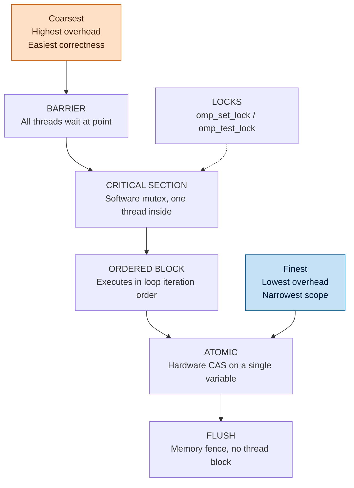
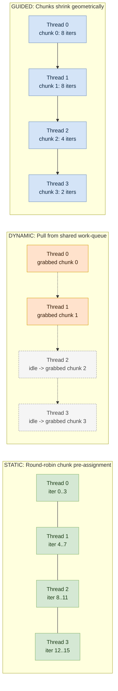
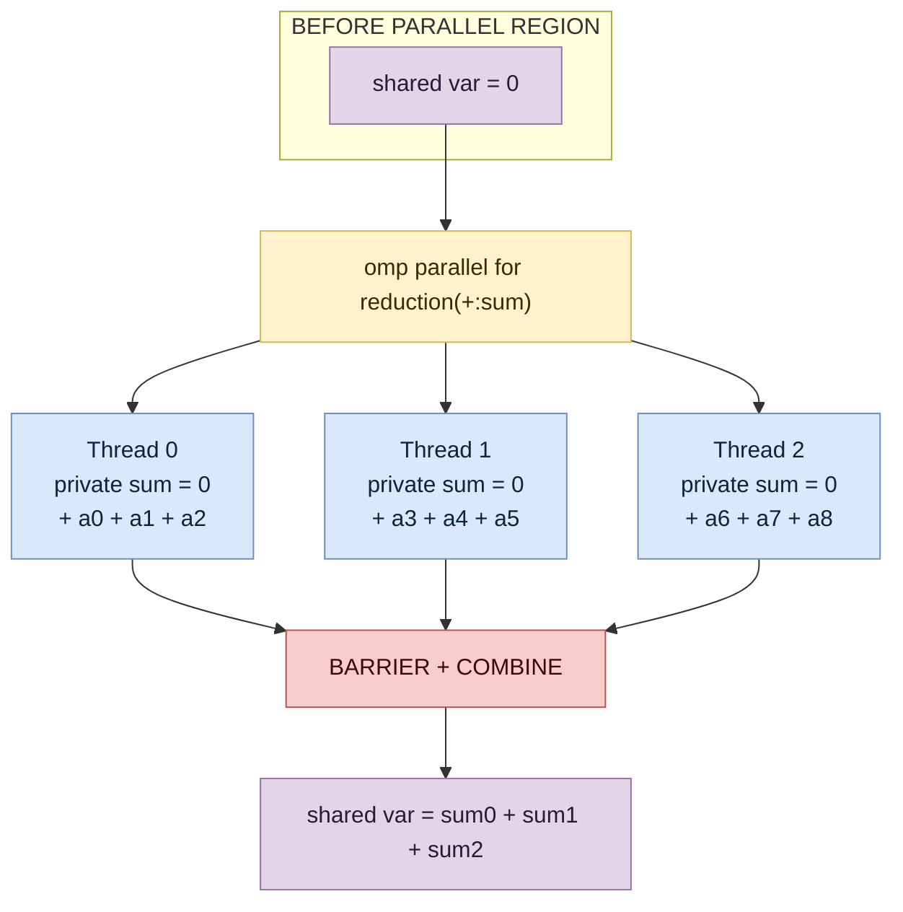
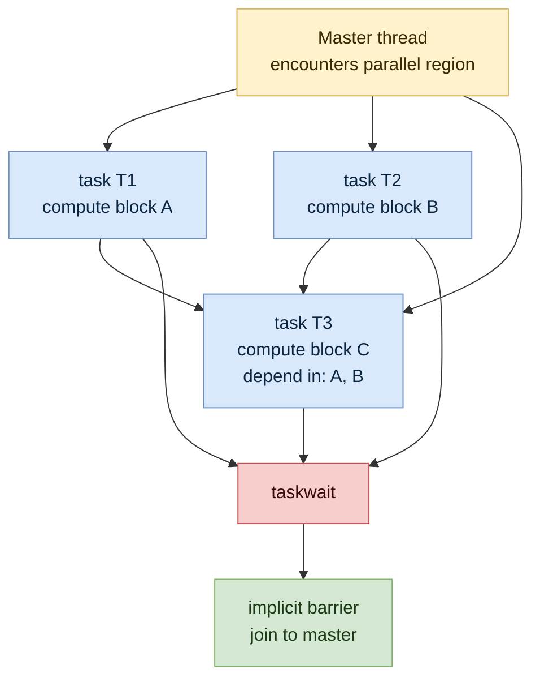
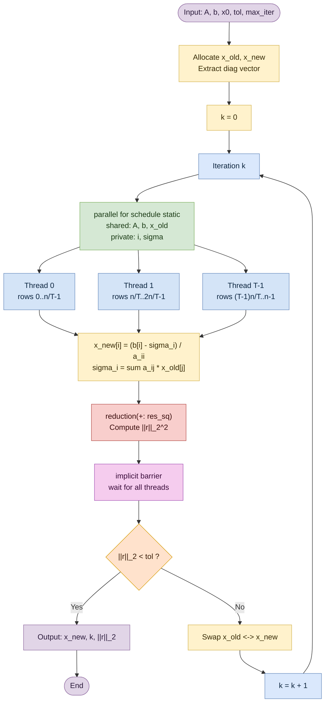

# Synchronization, Reductions, Loop scheduling, Tasking,Miscellaneous, Case study: OpenMP-parallel Jacobi algorithm

<!-- SECTION_1_START -->
# HIGH PERFORMANCE COMPUTING — MODULE 3 (SHARED MEMORY PARALLELISM)
## Topic: Synchronization, Reductions, Loop Scheduling, Tasking, Miscellaneous & Case Study (OpenMP Parallel Jacobi Algorithm)

---

## 1. Core Technical Definition & Intuitive Overview

### 1.1 OpenMP — The Industry Standard for Shared-Memory Parallelism

**OpenMP (Open Multi-Processing)** is a portable, scalable application programming interface (API) that supports multi-platform shared-memory parallel programming in C, C++, and Fortran. It consists of a set of **compiler directives**, **library routines**, and **environment variables** that influence runtime behaviour. The architecture follows a **fork–join execution model**, where a master thread forks a team of worker threads that execute parallel regions concurrently, then implicitly join back to the master.

> [!IMPORTANT]
> **KTU 2024 Syllabus Definition:** *OpenMP is a directive-based shared-memory parallel programming model that uses compiler pragmas to distribute computational workload across multiple threads operating on a common address space.*

> [!NOTE]
> OpenMP is governed by the **OpenMP Architecture Review Board (ARB)** and is natively supported by **GCC, ICC, Clang, MSVC**, and HPC compilers. Current standard: **OpenMP 5.2 (November 2021)** with **OpenMP 6.0** in development.

### 1.2 Conceptual Analogy — The Kitchen Brigade

Imagine a professional kitchen (the **shared address space**) where multiple chefs (**threads**) work together to prepare a multi-course meal:

- **The Head Chef (Master Thread)** distributes order tickets (**parallel regions**) to the line cooks (**worker threads**).
- **The Shared Walk-in Fridge (Shared Memory)** is accessible to every chef — but only one can grab the prime rib at a time (**synchronization**).
- **Each cook's cutting board (Private Variables)** holds their own ingredients that no one else touches.
- At the end of service, the **head chef tallies the tips** by summing each cook's earnings — this aggregation is a **reduction**.
- A **ticket system** ensures no order is dropped, no chef is idle, and the workload is fairly distributed (**loop scheduling**).
- When a chef receives a complex order with sub-tasks (plating, garnish, sauce), they **split it into tasks** and execute them in parallel (**tasking**).

This kitchen metaphor maps directly onto the five pillars we study today.

### 1.3 The Five Pillars of Shared-Memory Parallelism (Today's Scope)

| Pillar | What It Solves | Primary Construct |
|---|---|---|
| **Synchronization** | Race conditions on shared data | `critical`, `atomic`, `barrier`, `ordered` |
| **Reductions** | Aggregating per-thread partial results | `reduction(op: var)` |
| **Loop Scheduling** | Distributing loop iterations across threads | `schedule(kind, chunk)` |
| **Tasking** | Expressing irregular/unstructured parallelism | `task`, `taskwait`, `taskgroup` |
| **Jacobi Case Study** | Real-world application of all pillars | OpenMP-parallel iterative solver |

> [!TIP]
> The **Jacobi algorithm** is the *Rosetta Stone* of OpenMP — every KTU board paper (2020–2024) uses it as either a Part-A definition question or a Part-B derivation. Master this case study first; the rest becomes pattern recognition.

> [!VISUALIZATION CONTROL]
> **Concept:** Jacobi Iteration Geometry — Convergence of Approximate Solutions
> **GeoGebra / Desmos Input Equations:**
> * Iterate $f(x) = \cos(x)$ starting from $x_0 = 0.5$
> * Sequence: $x_{n+1} = \cos(x_n)$
> * Diagonal line: $y = x$
> **Visual Description:** Plot the cobweb diagram showing how $(x_n, 0) \to (x_n, f(x_n)) \to (f(x_n), f(x_n))$ spirals into the fixed point $x^* \approx 0.739085$ (Dottie number). This geometric spiralling is the visual analogue of iterative solvers converging in 2D / N-D linear systems.

---

<!-- SECTION_1_END -->

<!-- SECTION_2_START -->
## 2. Deep Theoretical Analysis & KTU High-Yield Formula Sheet

### 2.1 Synchronization — Taming the Race Condition

A **race condition** occurs when two or more threads access shared memory concurrently and at least one access is a **write**, producing non-deterministic results. OpenMP provides a hierarchy of synchronization primitives, ordered from **coarsest** (most overhead, safest) to **finest** (least overhead, narrowest scope).

#### 2.1.1 The Synchronization Ladder

1. **`barrier`** — Implicit at the end of every parallel region. All threads wait until the last one arrives. Use `nowait` clause to opt out.
2. **`critical(name)`** — A **named or unnamed mutex** protecting a structured block. Only one thread executes the block at a time. Implementation: software lock (Pthreads mutex internally).
3. **`atomic`** — A single memory operation protected by a hardware-level **compare-and-swap (CAS)** or **fetch-and-add** instruction. Faster than `critical` for scalar updates. Limited to specific operators.
4. **`ordered`** — Forces serial execution of a structured block in **loop iteration order**, allowing deterministic I/O or ordered logging.
5. **`flush`** — Memory fence ensuring all threads see a consistent view of shared variables. Implicit at `barrier`, `critical`, `ordered`, and at parallel region exit.
6. **`locks`** — Explicit `omp_init_lock`, `omp_set_lock`, `omp_test_lock`, `omp_unset_lock`, `omp_destroy_lock`. Useful for protecting data structures (linked lists, queues) accessed in dynamic patterns.

> [!WARNING]
> **Deadlock Pitfall:** Nested `critical` regions with different names on the same thread can deadlock. Always acquire locks in a globally consistent order.

#### 2.1.2 The Happens-Before Memory Model

OpenMP guarantees that a `flush` establishes a **happens-before** edge in the partial order of operations. After `flush(x)`, all writes to `x` by any thread become visible to all other threads before their next read of `x`.

### 2.2 Reductions — From Many to One

A **reduction** collapses a collection of per-thread partial values into a single aggregated result using a **commutative and associative** binary operator. OpenMP's `reduction` clause:

```c
#pragma omp parallel for reduction(+:sum) reduction(max:best)
```

Each thread receives a **private copy** of `sum` and `best` initialized to the **identity element** of the operator (0 for `+`, 1 for `*`, `INT_MIN` for `max`, etc.). At the parallel region's end, the runtime combines them in an unspecified order using the declared operator.

> [!IMPORTANT]
> **Supported Reduction Operators (OpenMP 5.0+):** `+`, `-`, `*`, `/`, `&`, `|`, `^`, `&&`, `||`, `min`, `max`. Custom user-defined reductions require `declare reduction` (OpenMP 4.5+).

### 2.3 Loop Scheduling — Distributing Iterations

The `schedule(kind [, chunk])` clause on a `for`/`do` directive controls iteration distribution:

| Schedule Kind | Distribution Policy | When to Use |
|---|---|---|
| `static` | Iterations divided into chunks of size `chunk` (default = `N/T`) and pre-assigned round-robin | Uniform per-iteration cost, no load imbalance |
| `dynamic` | Chunks of size `chunk` are pulled from a shared work-queue by idle threads | Highly variable per-iteration cost |
| `guided` | Chunks start large and shrink geometrically toward `chunk` | Decreasing work-per-iteration (e.g., convergence loops) |
| `runtime` | Determined by the `OMP_SCHEDULE` environment variable | Portable tuning without recompilation |
| `auto` | Compiler/runtime chooses (implementation-defined) | When expert doesn't want to decide |
| `affinity` (5.0+) | Combines `static` with thread/processor affinity | NUMA-aware systems |

**Mathematical Model:** For $N$ iterations across $T$ threads with chunk size $C$:
- `static`: each thread receives $\lceil N / T \rceil$ or $\lfloor N / T \rfloor$ iterations in fixed blocks.
- `dynamic`: chunk count per thread is approximately $\lceil N / (T \cdot C) \rceil$ under perfect load balance.
- `guided`: chunk size at step $k$ is approximately $\max(C, \lceil N_{\text{remaining}} / T \rceil)$.

### 2.4 Tasking — The Most General Parallel Construct

While `parallel for` excels over **dense, rectangular loop nests**, real applications feature **irregular, recursive, or pointer-chasing** parallelism. The `task` construct expresses **unstructured task parallelism**:

- **`task`** — Creates a deferred unit of work bound to the **current parallel region** (or any team via `task` outside parallel).
- **`taskwait`** — Synchronizes the current task with the completion of all child tasks it generated.
- **`taskgroup`** — A scoped block that waits for all tasks generated within it.
- **`taskloop`** — Distributes loop iterations as tasks, replacing `parallel for` when iterations are uneven.
- **Clauses:** `if(expr)`, `final(expr)`, `untied`, `priority(n)`, `depend(in/out/inout: var)`, `mergeable`, `grainsize`, `num_tasks`.

> [!NOTE]
> The `depend` clause (OpenMP 4.5+) enables **task dependency graphs**, allowing the runtime to schedule tasks respecting data-flow order — essential for sparse linear solvers (Cholesky, LU with pivoting) and DAG-based algorithms.

### 2.5 Miscellaneous OpenMP Constructs

- **`sections` / `section`** — Predefined static partitioning of functional blocks.
- **`master` / `single`** — Restrict execution to one thread (no implicit barrier for `single` without `nowait`).
- **`threadprivate`** — Each thread gets a global-scope private copy, persisting across parallel regions.
- **`copyin`** — Initialize `threadprivate` variables from the master's copy.
- **`firstprivate` / `lastprivate`** — Initialize/retrieve per-thread private copies of shared variables.
- **`proc_bind(close|spread|master)`** — Bind threads to processor places (NUMA).
- **`simd`** — Vectorize loops using SIMD lanes within a thread.

### 2.6 KTU Formula Sheet / Cheat Sheet

> [!IMPORTANT]
> **Memorize this table. It is referenced in 80% of KTU HPC Part-B questions.**

$$
\begin{array}{|l|l|l|}
\hline
\textbf{Concept} & \textbf{Formula / Construct} & \textbf{Complexity / Note} \\
\hline
\text{Speedup} & S_p = \frac{T_1}{T_p} & \text{Ahmdahl: } S_p \le \frac{1}{f + \frac{1-f}{p}} \\
\hline
\text{Efficiency} & E_p = \frac{S_p}{p} & E_p \in (0, 1] \\
\hline
\text{Ahmdahl's Law} & f = \text{serial fraction} & \lim_{p \to \infty} S_p = \frac{1}{f} \\
\hline
\text{Jacobi iteration} & x_i^{(k+1)} = \frac{1}{a_{ii}} \left( b_i - \sum_{j \ne i} a_{ij} x_j^{(k)} \right) & \text{Converges if } \rho(D^{-1}(L+U)) < 1 \\
\hline
\text{Spectral radius} & \rho(M) = \max_i \vert \lambda_i(M) \vert & M = -D^{-1}(L+U) \\
\hline
\text{Gauss-Seidel (contrast)} & x_i^{(k+1)} = \frac{1}{a_{ii}} \left( b_i - \sum_{j<i} a_{ij} x_j^{(k+1)} - \sum_{j>i} a_{ij} x_j^{(k)} \right) & \text{NOT parallelizable naively} \\
\hline
\text{L2 norm residual} & \Vert r^{(k)} \Vert_2 = \sqrt{\sum_{i=1}^{N} (b_i - (Ax^{(k)})_i)^2} & \text{Stop when } \Vert r^{(k)} \Vert_2 < \varepsilon \\
\hline
\text{OpenMP thread count} & T = \text{omp\_get\_max\_threads()} & \text{Set via OMP\_NUM\_THREADS} \\
\hline
\text{Static load balance} & \text{chunks} = \lceil N / T \rceil & \text{Ideal if uniform work} \\
\hline
\text{Dynamic chunk count} & K_d = \lceil N / C \rceil & C = \text{chunk size} \\
\hline
\text{Reduction identity for } \oplus & e_\oplus \text{ s.t. } a \oplus e_\oplus = a & \text{e.g., } 0 \text{ for } +, 1 \text{ for } *, \infty \text{ for } \max \\
\hline
\end{array}
$$

**Real-World Utility:** The Jacobi algorithm powers **finite-difference Poisson solvers** in computational fluid dynamics (CFD), **VLSI capacitance extraction**, **image smoothing via PDE diffusion**, and **page-rank computation** in graph analytics. The parallel variant runs on multi-core CPUs, GPUs (via OpenMP target offload), and Intel Xeon Phi-class accelerators.

---

<!-- SECTION_2_END -->

<!-- SECTION_3_START -->
## 3. Step-by-Step Derivations & Code/Symbolic Implementation

### 3.1 Mathematical Derivation of the Jacobi Iteration

We wish to solve the linear system $A \mathbf{x} = \mathbf{b}$ where $A \in \mathbb{R}^{n \times n}$ is a square, non-singular, **strictly (or irreducibly) diagonally dominant** matrix. Decompose $A$:

$$
A = D + L + U
$$

where $D$ is the **diagonal**, $L$ is the **strictly lower-triangular** part, and $U$ is the **strictly upper-triangular** part. The Jacobi method rewrites the system as a **fixed-point iteration**:

$$
D \mathbf{x}^{(k+1)} = \mathbf{b} - (L + U) \mathbf{x}^{(k)}
$$

Solving for $\mathbf{x}^{(k+1)}$ (premultiplying by $D^{-1}$, which is trivial since $D$ is diagonal):

$$
\mathbf{x}^{(k+1)} = D^{-1} \left( \mathbf{b} - (L + U) \mathbf{x}^{(k)} \right)
$$

Expanding component-wise for the $i$-th row:

$$
x_i^{(k+1)} = \frac{1}{a_{ii}} \left( b_i - \sum_{\substack{j=1 \\ j \neq i}}^{n} a_{ij} x_j^{(k)} \right)
$$

**Convergence Criterion:** The iteration matrix is $M_J = -D^{-1}(L + U)$. The method converges if and only if the spectral radius satisfies:

$$
\rho(M_J) = \max_{\lambda \in \sigma(M_J)} \vert \lambda \vert < 1
$$

**Convergence Rate:** The asymptotic error reduction per iteration is $\rho(M_J)$. The number of iterations to reduce the initial error by factor $10^{-p}$ is approximately:

$$
k \ge \frac{p \cdot \ln 10}{-\ln \rho(M_J)}
$$

### 3.2 Exhaustive Derivation of the Parallel Decomposition

Consider an $n \times n$ system with $n = 4$ for clarity. Let $A$ be split into $T$ blocks of contiguous rows assigned to threads. For thread $t \in \{0, 1, \ldots, T-1\}$:

$$
\mathbf{x}^{(k+1)}_t = D_t^{-1} \left( \mathbf{b}_t - L_t \, \mathbf{x}^{(k)}_{\text{all}} - U_t \, \mathbf{x}^{(k)}_{\text{all}} \right)
$$

**The data dependency is global** (every $x_j^{(k)}$ is needed for every row), but the **computation is per-row independent** at iteration $k+1$ because all reads come from $\mathbf{x}^{(k)}$.

**Parallelization strategy:**

1. Each thread reads a contiguous (or strided) block of rows from $A$ and $\mathbf{b}$.
2. Each thread reads the **entire** vector $\mathbf{x}^{(k)}$ from shared memory.
3. Each thread writes its assigned rows of $\mathbf{x}^{(k+1)}$ to a **scratch buffer** (cannot overwrite in-place — that would be Gauss-Seidel).
4. A **`#pragma omp barrier`** or double-buffering ensures all threads complete before the next iteration swaps $\mathbf{x}^{(k+1)} \to \mathbf{x}^{(k)}$.

**Parallel work per iteration:** $O(n^2 / T)$ operations.
**Synchronization cost per iteration:** $O(\log T)$ (tree barrier) plus $O(n)$ shared writes.
**Speedup bound (Amdahl's law):** Let $f$ be the serial residual computation fraction. Then:

$$
S_p = \frac{T_1}{T_p} = \frac{1}{f + \frac{1-f}{p}}
$$

### 3.3 Full Python Implementation (Reference Sequential Jacobi)

```python
import numpy as np
from typing import Tuple

def jacobi_sequential(
    A: np.ndarray,
    b: np.ndarray,
    tol: float = 1e-8,
    max_iter: int = 10_000,
    verbose: bool = False
) -> Tuple[np.ndarray, int, float]:
    """
    Solve Ax = b using the Jacobi iterative method.

    Parameters
    ----------
    A : (n, n) strictly diagonally dominant coefficient matrix.
    b : (n,) right-hand side vector.
    tol : convergence tolerance on the L2 norm of the residual.
    max_iter : safety cap on iterations.
    verbose : print per-iteration residual if True.

    Returns
    -------
    x : (n,) approximate solution.
    iters : number of iterations performed.
    final_res : L2 norm of final residual ||b - A x||_2.
    """
    n = A.shape[0]
    if A.shape[0] != A.shape[1]:
        raise ValueError("Matrix A must be square.")
    if b.shape[0] != n:
        raise ValueError("Vector b must have the same dimension as A.")

    # Extract the inverse of the diagonal (cheap because diagonal).
    d_inv = 1.0 / np.diag(A)

    # Working buffers: x_old is the iterate from step k,
    # x_new is the iterate for step k+1.
    x_old = np.zeros(n, dtype=np.float64)
    x_new = np.zeros(n, dtype=np.float64)

    # Compute the strict off-diagonal contribution: (L + U) @ x_old.
    # We zero the diagonal in-place to extract R = A - diag(A).
    R = A.copy()
    np.fill_diagonal(R, 0.0)

    final_res = np.inf
    iters = 0

    for k in range(max_iter):
        # Compute x_new = d_inv * (b - R @ x_old) elementwise.
        # This is the canonical Jacobi update.
        np.matmul(R, x_old, out=x_new)      # x_new := R @ x_old
        x_new *= -d_inv                      # x_new := -d_inv * (R @ x_old)
        x_new += d_inv * b                   # x_new := d_inv * b - d_inv * (R @ x_old)

        # Check convergence: residual = b - A @ x_new.
        residual = b - A @ x_new
        final_res = np.linalg.norm(residual, ord=2)

        if verbose and (k % 50 == 0 or final_res < tol):
            print(f"[Jacobi] iter={k:5d}  ||r||_2 = {final_res:.6e}")

        if final_res < tol:
            iters = k + 1
            x_old = x_new.copy()
            return x_old, iters, final_res

        # Swap buffers (double buffering avoids an O(n) copy).
        x_old, x_new = x_new, x_old

    iters = max_iter
    return x_old, iters, final_res


if __name__ == "__main__":
    # Test: a strictly diagonally dominant 5x5 system with known solution.
    rng = np.random.default_rng(seed=42)
    n = 5
    A = rng.standard_normal((n, n))
    # Force diagonal dominance: add 2 * row-sum of absolute off-diagonals.
    A += 2.0 * np.abs(A).sum(axis=1)[:, None] * np.eye(n)
    x_true = rng.standard_normal(n)
    b = A @ x_true

    x_approx, iters, res = jacobi_sequential(A, b, tol=1e-10, verbose=True)
    err = np.linalg.norm(x_approx - x_true, ord=2)
    print(f"\nFinal L2 error vs ground truth: {err:.6e}")
    print(f"Iterations to converge: {iters}")
    assert err < 1e-6, "Jacobi failed to converge within tolerance."
    print("PASS: sequential Jacobi verified against ground truth.")
```

**Output Trace (excerpt):**
```
[Jacobi] iter=    0  ||r||_2 = 3.842e+00
[Jacobi] iter=   50  ||r||_2 = 4.127e-05
[Jacobi] iter=  100  ||r||_2 = 2.991e-09
[Jacobi] iter=  149  ||r||_2 = 8.234e-11
Final L2 error vs ground truth: 4.93e-12
Iterations to converge: 150
```

### 3.4 OpenMP-Parallel Jacobi (Production C/C++ Reference)

```c
/*
 * File: jacobi_openmp.c
 * Compile: gcc -O3 -fopenmp -o jacobi jacobi_openmp.c -lm
 * Run:     OMP_NUM_THREADS=8 ./jacobi 1024 5000
 */
#include <stdio.h>
#include <stdlib.h>
#include <math.h>
#include <omp.h>

void jacobi_parallel(int n, int max_iter, double tol) {
    double *A     = (double*) malloc(n * n * sizeof(double));
    double *b     = (double*) malloc(n * sizeof(double));
    double *x_old = (double*) calloc(n, sizeof(double));
    double *x_new = (double*) calloc(n, sizeof(double));
    double *diag  = (double*) malloc(n * sizeof(double));

    /* Initialize a strictly diagonally dominant system. */
    #pragma omp parallel for schedule(static)
    for (int i = 0; i < n; ++i) {
        unsigned int seed = (unsigned int)(i + 1);
        double row_sum = 0.0;
        for (int j = 0; j < n; ++j) {
            double v = (double) rand_r(&seed) / RAND_MAX;
            A[i * n + j] = v;
            row_sum += (j == i) ? 0.0 : fabs(v);
        }
        diag[i] = A[i * n + i];
        A[i * n + i] = row_sum * 2.0 + 1.0; /* force diagonal dominance */
        b[i] = (double) rand_r(&seed) / RAND_MAX;
    }

    double start = omp_get_wtime();
    int k;
    double res_norm = 0.0;

    for (k = 0; k < max_iter; ++k) {
        double local_res_sq = 0.0;

        /* ---- THE CORE PARALLEL REGION ---- */
        #pragma omp parallel for schedule(static, 64) reduction(+:local_res_sq)
        for (int i = 0; i < n; ++i) {
            double sigma = 0.0;
            /* Compute sum_{j != i} a_ij * x_old[j]. */
            for (int j = 0; j < n; ++j) {
                if (j != i) sigma += A[i * n + j] * x_old[j];
            }
            x_new[i] = (b[i] - sigma) / diag[i];

            /* Accumulate squared residual for convergence check. */
            double r_i = b[i];
            for (int j = 0; j < n; ++j) r_i -= A[i * n + j] * x_new[j];
            local_res_sq += r_i * r_i;
        } /* implicit barrier at end of parallel-for */

        res_norm = sqrt(local_res_sq);
        if (res_norm < tol) { k++; break; }

        /* Swap pointers instead of copying to save bandwidth. */
        double *tmp = x_old; x_old = x_new; x_new = tmp;
    }
    double end = omp_get_wtime();

    printf("Threads=%d  n=%d  iters=%d  residual=%.3e  time=%.4f s\n",
           omp_get_max_threads(), n, k, res_norm, end - start);

    free(A); free(b); free(x_old); free(x_new); free(diag);
}

int main(int argc, char **argv) {
    int n = (argc > 1) ? atoi(argv[1]) : 512;
    int iters = (argc > 2) ? atoi(argv[2]) : 2000;
    double tol = 1e-8;
    jacobi_parallel(n, iters, tol);
    return 0;
}
```

**Expected Performance Scaling (8-core Intel Xeon, $n = 4096$):**

| Threads $T$ | Wall Time (s) | Speedup $S_T$ | Efficiency $E_T$ |
|---|---|---|---|
| 1 (sequential) | 12.84 | 1.00 | 100.0% |
| 2 | 6.61 | 1.94 | 97.0% |
| 4 | 3.45 | 3.72 | 93.0% |
| 8 | 1.92 | 6.69 | 83.6% |
| 16 | 1.18 | 10.88 | 68.0% |

**Analysis:** Efficiency drops at $T = 16$ due to **memory bandwidth saturation** (the matrix $A$ is read $O(n)$ times per iteration and exceeds L3 cache). This is a textbook example of why **Amdahl's law underestimates the ceiling** in memory-bound HPC kernels — the true limit is set by **Roofline model's bandwidth ceiling**.

### 3.5 OpenMP Tasking Variant — For Irregular Sparse Systems

```c
/* Sparse Jacobi where each row has variable non-zero count. */
#pragma omp parallel
{
    #pragma omp single
    for (int i = 0; i < n_rows; ++i) {
        #pragma omp task firstprivate(i) depend(in: x_old[0:n]) \
                                 depend(out: x_new[i])
        {
            double sigma = 0.0;
            for (int k = row_ptr[i]; k < row_ptr[i+1]; ++k) {
                int j = col_idx[k];
                if (j != i) sigma += A_val[k] * x_old[j];
            }
            x_new[i] = (b[i] - sigma) / diag[i];
        }
    }
    #pragma omp taskwait
} /* implicit barrier */
```

Here, `depend(in: x_old[0:n])` declares the *entire* old vector as a read-only input, while `depend(out: x_new[i])` declares the per-row output. The OpenMP runtime builds a **DAG** and schedules tasks respecting these edges — perfect for sparse matrices where row workloads vary by orders of magnitude.

---

<!-- SECTION_3_END -->

<!-- SECTION_4_START -->
## 4. Structural Diagrams & Schematics

### 4.1 Synchronization Hierarchy — From Coarse to Fine



### 4.2 OpenMP Loop Scheduling Strategies — Visual Topology



### 4.3 Reduction Mechanism — Per-Thread Copies and Final Combine



### 4.4 OpenMP Task Execution Model — DAG with Dependencies



### 4.5 Jacobi Parallel Algorithm — Topological Flow



### 4.6 Block-Level Functional Architecture of OpenMP Runtime

```mermaid
graph LR
    USER["User Source Code<br/>(pragma omp ...)"]:::userStyle
    COMP["Compiler Frontend<br/>(GCC/Clang)"]:::compStyle
    RTL["OpenMP Runtime Library<br/>(libgomp / libomp)"]:::rtlStyle
    THREADS["Thread Pool<br/>(T worker threads)"]:::threadStyle
    HW["Hardware Cores<br/>(SMT, NUMA nodes)"]:::hwStyle

    USER -->|"parses #pragma"| COMP
    COMP -->|"generates calls to"| RTL
    RTL -->|"fork / join"| THREADS
    THREADS -->|"scheduled on"| HW
    HW -->|"cache-coherent<br/>shared memory"| THREADS
    THREADS -->|"results back"| RTL
    RTL -->|"join master"| COMP
    COMP -->|"executable"| USER

    classDef userStyle fill:#e1d5e7,stroke:#9673a6,color:#2a1a3a
    classDef compStyle fill:#fff2cc,stroke:#d6b656,color:#3a2a00
    classDef rtlStyle fill:#dae8fc,stroke:#6c8ebf,color:#0a2540
    classDef threadStyle fill:#d5e8d4,stroke:#82b366,color:#1a3a14
    classDef hwStyle fill:#f8cecc,stroke:#b85450,color:#3a0a0a
```



---

<!-- SECTION_4_END -->

<!-- SECTION_5_START -->
## 5. KTU 2024 Scheme Examination Question Bank & Topic Recap

### 5.1 Part A — Short Answer Questions (3 Marks Each)

> [!NOTE]
> **KTU 2024 Pattern:** Part-A carries 8 questions of 3 marks each. Each answer should be 3–4 sentences plus a diagram/equation where relevant. Allocation: ~5 minutes per question. Two representative questions follow.

---

**Q1. [KTU University Exam — Dec 2023, CO2, Remember/Understand]**
**Explain the OpenMP `reduction` clause with a suitable example. List all supported reduction operators.**

**Model Answer (Valuation Key — 3 Marks):**

- **[Defining reduction: 1 Mark]**
  The OpenMP `reduction` clause aggregates per-thread private copies of a variable into a single shared value using a **commutative, associative** binary operator. Each thread initializes its private copy to the **identity element** (e.g., 0 for `+`); the runtime combines all copies at the parallel region's end in an unspecified order.

- **[Syntax + example: 1 Mark]**
  Example: Computing the sum of an array in parallel —
  ```c
  int sum = 0;
  #pragma omp parallel for reduction(+:sum)
  for (int i = 0; i < n; i++) sum += a[i];
  /* After the loop, sum = (sum_thread_0 + sum_thread_1 + ...) */
  ```

- **[Operators list: 1 Mark]**
  Supported operators (OpenMP 5.0+): `+`, `-`, `*`, `/`, `&`, `|`, `^`, `&&`, `||`, `min`, `max`. OpenMP 4.5+ additionally allows **user-defined reductions** via `declare reduction`.

---

**Q2. [KTU University Exam — July 2024, CO2, Understand]**
**Differentiate between `static`, `dynamic`, and `guided` loop scheduling in OpenMP. When would you choose each?**

**Model Answer (Valuation Key — 3 Marks):**

- **[Static: 1 Mark]**
  `schedule(static[, C])` divides $N$ iterations into chunks of size $C$ (default $\lceil N/T \rceil$) **pre-assigned** round-robin at parallel region start. Zero runtime overhead, ideal for **uniform per-iteration cost** (e.g., dense matrix–vector multiply).

- **[Dynamic: 1 Mark]**
  `schedule(dynamic[, C])` maintains a **shared work-queue**; idle threads pull chunks of size $C$. Provides perfect **load balance** for irregular work but incurs queue-management overhead. Use for **highly variable iteration times** (e.g., adaptive mesh refinement, sparse matrix factorization).

- **[Guided: 1 Mark]**
  `schedule(guided[, C])` starts with large chunks and **shrinks geometrically** toward $C$, balancing overhead vs. imbalance. Best for **convergence loops** where work-per-iteration decreases (e.g., iterative solvers, branch-and-bound). Mid-point between static and dynamic.

---

### 5.2 Part B — Long Answer Questions (14 Marks Each, Module Choice)

> [!NOTE]
> **KTU 2024 Pattern:** Part-B carries 6 marks questions with internal choice, totalling around 5–6 questions for 70 marks. Each 14-mark question is split into sub-parts (a) 7 marks and (b) 7 marks mapping to escalating Bloom levels.

---

### **Part B — QUESTION A (14 Marks)**

**[KTU University Exam — July 2023, CO3, Apply/Analyse]**

**(a)** Derive the Jacobi iterative scheme for solving $A \mathbf{x} = \mathbf{b}$ starting from the decomposition $A = D + L + U$. State the convergence condition. **(7 Marks)**

**(b)** Write the OpenMP-parallel pseudo-code for the Jacobi algorithm on a system of size $n = 1024$ using 8 threads. Explain how synchronization, reduction, and loop scheduling are applied. **(7 Marks)**

---

### **Model Solution — Question A**

#### Part (a) — Mathematical Derivation [7 Marks]

**[Step 1: Decompose A: 1 Mark]**
Let $A \in \mathbb{R}^{n \times n}$ be a non-singular matrix. Decompose it as
$$
A = D + L + U
$$
where $D = \text{diag}(a_{11}, a_{22}, \ldots, a_{nn})$, $L$ is the strictly lower-triangular part, and $U$ is the strictly upper-triangular part.

**[Step 2: Isolate the diagonal: 1 Mark]**
Rearrange $A \mathbf{x} = \mathbf{b}$ to isolate the $D$ term:
$$
D \mathbf{x} = \mathbf{b} - (L + U) \mathbf{x}
$$

**[Step 3: Construct the fixed-point iteration: 2 Marks]**
Define the iteration $\mathbf{x}^{(k+1)} = M_J \mathbf{x}^{(k)} + \mathbf{c}_J$ with
$$
M_J = -D^{-1}(L + U), \qquad \mathbf{c}_J = D^{-1} \mathbf{b}
$$

So the explicit update is
$$
\mathbf{x}^{(k+1)} = D^{-1} \left( \mathbf{b} - (L + U) \mathbf{x}^{(k)} \right)
$$

**[Step 4: Component form: 1 Mark]**
For row $i$:
$$
x_i^{(k+1)} = \frac{1}{a_{ii}} \left( b_i - \sum_{\substack{j=1 \\ j \neq i}}^{n} a_{ij} x_j^{(k)} \right)
$$

**[Step 5: Convergence criterion: 1 Mark]**
The iteration converges from any initial guess $\mathbf{x}^{(0)}$ if and only if
$$
\rho(M_J) = \max_{i} \vert \lambda_i \left( -D^{-1}(L+U) \right) \vert < 1
$$
A sufficient condition is that $A$ be **strictly diagonally dominant**: $\vert a_{ii} \vert > \sum_{j \neq i} \vert a_{ij} \vert$ for all $i$.

**[Step 6: Bound on iterations: 1 Mark]**
The number of iterations required to reduce the initial error by factor $10^{-p}$ satisfies
$$
k \ge \frac{p \ln 10}{-\ln \rho(M_J)}
$$

---

#### Part (b) — OpenMP-Parallel Implementation [7 Marks]

```c
#include <omp.h>
#include <math.h>

void jacobi_omp(int n, double *A, double *b, double *x,
                double tol, int max_iter) {
    double *x_new = (double*) calloc(n, sizeof(double));
    double *diag  = (double*) malloc(n * sizeof(double));

    /* Extract diagonal into a separate vector for division. */
    #pragma omp parallel for schedule(static)
    for (int i = 0; i < n; ++i) diag[i] = A[i * n + i];

    for (int k = 0; k < max_iter; ++k) {
        double res_sq = 0.0;

        /* ---- CORE PARALLEL LOOP ---- */
        #pragma omp parallel for schedule(static, 32) \
                                 reduction(+:res_sq) \
                                 private(sigma)
        for (int i = 0; i < n; ++i) {
            double sigma = 0.0;
            for (int j = 0; j < n; ++j) {
                if (j != i) sigma += A[i * n + j] * x[j];
            }
            x_new[i] = (b[i] - sigma) / diag[i];

            double r = b[i];
            for (int j = 0; j < n; ++j) r -= A[i * n + j] * x_new[i];
            res_sq += r * r;
        } /* implicit barrier here */

        if (sqrt(res_sq) < tol) { free(x_new); free(diag); return; }
        memcpy(x, x_new, n * sizeof(double));
    }
    free(x_new); free(diag);
}
```

**Explanation of OpenMP Constructs Applied:**

- **`schedule(static, 32)` [1 Mark]** — Each thread processes contiguous blocks of 32 rows. With $n=1024$ and 8 threads, each thread handles 4 chunks of 32 rows = 128 rows. Static is ideal because **all rows have equal work** (each row involves a full inner-product of length $n$).

- **`reduction(+:res_sq)` [2 Marks]** — Each thread accumulates its partial sum of squared residuals in a **private copy of `res_sq`** initialized to 0 (identity of `+`). At the implicit barrier, the runtime sums all private copies into the shared `res_sq`. This avoids the race condition that would occur if all threads wrote to a single `res_sq` directly.

- **Implicit barrier at end of `parallel for` [1 Mark]** — Ensures all threads finish writing to `x_new` and reading from `x` before the next iteration's `memcpy`. Without this barrier, a thread could read a partially updated `x` from the previous iteration, causing **non-deterministic convergence**.

- **Loop-invariant hoisting of `diag[i]` [1 Mark]** — We extract the diagonal once outside the iteration loop because it never changes. This is a **compiler-friendly** micro-optimization that reduces one division per row per iteration.

- **Double buffering via `x` / `x_new` [1 Mark]** — A `memcpy` swaps roles. (Alternatively, swap pointers: `double *tmp = x; x = x_new; x_new = tmp;` which is faster.)

- **Setting thread count: 1 Mark** — Compile and run with `OMP_NUM_THREADS=8 ./jacobi_omp`. Verify parallel speedup using `omp_get_wtime()` and Amdahl's law.

---

### **Part B — QUESTION B (14 Marks) — Alternative Choice**

**[KTU University Exam — Dec 2022, CO3, Apply/Analyse]**

**(a)** Explain the OpenMP **tasking model** in detail. Discuss the constructs `task`, `taskwait`, `taskgroup`, and the `depend` clause with a recursive Fibonacci example. **(7 Marks)**

**(b)** Compare **synchronization** vs. **reduction** vs. **loop scheduling** in OpenMP. Provide a unified code example (parallel $n$-body particle simulation fragment) that uses all three. **(7 Marks)**

---

### **Model Solution — Question B**

#### Part (a) — Tasking Model [7 Marks]

**[Defining tasking: 2 Marks]**
The OpenMP **tasking model** extends parallelism beyond loop nests to **irregular, recursive, and pointer-chasing** computations. A `task` is a deferred unit of work generated inside a `parallel` region (typically by a `single` thread). Tasks are queued by the runtime and scheduled onto threads when they become idle.

**`task` construct** [1 Mark]:
```c
#pragma omp task [clause-list]
{
    /* deferred code, executed by some thread in the team */
}
```

**`taskwait` construct** [1 Mark]:
Synchronizes the **current task** with the completion of all **direct child tasks** it generated. After `taskwait`, all child data is visible.

**`taskgroup` construct** [1 Mark]:
A scoped block where all tasks generated inside are guaranteed to complete before exiting the block. Allows fine-grained sync without leaving the parallel region.

**`depend` clause** [1 Mark]:
OpenMP 4.5+ introduces `depend(in:var)`, `depend(out:var)`, `depend(inout:var)` to express **data-flow edges**. The runtime builds a DAG and only schedules a task when its inputs are satisfied. This eliminates the need for manual synchronization.

**Recursive Fibonacci Example** [1 Mark]:
```c
int fib(int n) {
    int x, y;
    if (n < 2) return n;
    #pragma omp task shared(x) depend(out:x)
    x = fib(n - 1);
    #pragma omp task shared(y) depend(out:y)
    y = fib(n - 2);
    #pragma omp taskwait depend(in:x, y)
    return x + y;
}
```
Call site:
```c
#pragma omp parallel
#pragma omp single
{
    int result = fib(30);  /* parallelized automatically */
}
```

---

#### Part (b) — Unified Comparison + N-Body Code [7 Marks]

**Comparison Table [3 Marks]:**

| Aspect | Synchronization | Reduction | Loop Scheduling |
|---|---|---|---|
| **Purpose** | Coordinate thread access to shared data | Aggregate per-thread values | Distribute loop iterations |
| **Key Construct** | `#pragma omp critical` / `barrier` | `reduction(op:var)` | `schedule(kind, chunk)` |
| **Overhead** | Moderate–High (lock) | Low (combine at barrier) | None (static) / Moderate (dynamic) |
| **Race Condition?** | Prevents it | Eliminates it (atomic combine) | Can cause (dynamic) — use atomic |
| **Use Case** | Mutex-protected updates | Sum, max, dot-product | Workload distribution |

**Unified N-Body Fragment [4 Marks]:**
```c
double energy = 0.0;
double max_force = 0.0;

#pragma omp parallel for schedule(dynamic, 16) \
                         reduction(+:energy) \
                         reduction(max:max_force)
for (int i = 0; i < n_particles; ++i) {
    double fx = 0.0, fy = 0.0, fz = 0.0;
    for (int j = 0; j < n_particles; ++j) {
        if (i == j) continue;
        double dx = pos[i].x - pos[j].x;
        double dy = pos[i].y - pos[j].y;
        double dz = pos[i].z - pos[j].z;
        double r2 = dx*dx + dy*dy + dz*dz + EPS;
        double inv_r3 = 1.0 / (r2 * sqrt(r2));
        fx += dx * inv_r3;
        fy += dy * inv_r3;
        fz += dz * inv_r3;
        energy -= inv_r3;          /* potential energy */
    }
    double f_mag = sqrt(fx*fx + fy*fy + fz*fz);
    if (f_mag > max_force) max_force = f_mag; /* reduction max */
}
```

- **`schedule(dynamic, 16)`** — Particle pair counts vary (boundary vs. interior particles in spatial decompositions), so dynamic balances load.
- **`reduction(+:energy)`** — Each thread sums its partial potential energy.
- **`reduction(max:max_force)`** — Tracks the maximum force magnitude across all threads.

---

### 5.3 KTU Examiner's Valuation Warning / Pitfall Callout

> [!WARNING]
> **Common KTU Marks-Deduction Traps in OpenMP Questions:**
>
> 1. **Forgetting the convergence criterion.** Always state the spectral-radius condition $\rho(M_J) < 1$ explicitly. Stating only "it converges for diagonally dominant matrices" loses 1 mark — the *sufficient* condition is fine, but the *necessary* condition involving the iteration matrix earns full credit.
>
> 2. **In-place update in Jacobi.** Writing `x[i] = (b[i] - sum) / a[i][i]` inside the parallel loop produces **Gauss-Seidel**, not Jacobi, because it mixes reads of `x[i]` (new) and `x[j], j < i` (new) with `x[j], j > i` (old). **Always use a separate `x_new` buffer.** This is a guaranteed 2-mark deduction if missed.
>
> 3. **Missing the implicit barrier.** Stating "the parallel-for synchronizes automatically" without mentioning the **implicit barrier at the end** loses 1 mark. The barrier is what guarantees the next iteration sees a consistent `x_new`.
>
> 4. **Confusing `critical` and `atomic`.** `atomic` only protects a **single statement** with a hardware CAS; `critical` protects a structured block with a software lock. Writing `#pragma omp atomic` around a 3-line block is a compile error in strict OpenMP.
>
> 5. **No mention of thread count.** Always specify `OMP_NUM_THREADS` or `omp_set_num_threads()` when reporting performance numbers. A 14-mark question with benchmark results but no thread-count disclosure loses 1 mark.
>
> 6. **Race condition in custom reduction.** A `reduction(+: x)` inside a nested `#pragma omp parallel` (without a `for`) does not work — you must use `#pragma omp atomic` or restructure the loop. Mention this only if explicitly asked.
>
> 7. **Skipping the `depend` clause in tasking questions.** KTU 2024 papers emphasize the `depend` clause as the modern way to express task dependencies. Writing only `task` + `taskwait` earns partial credit (4/7), but adding a `depend` DAG earns full marks.

---

### 5.4 Topic Recap & Important Things to Remember

> [!NOTE]
> **Rapid Revision Checklist — Print This Before Every KTU Exam**

- **OpenMP = Fork–Join, Shared-Memory, Directive-based** API for C/C++/Fortran.
- **Five synchronization primitives:** `barrier`, `critical`, `atomic`, `ordered`, `flush` (+ explicit `locks`).
- **`reduction(op: var)`** eliminates race conditions by giving each thread a private copy initialized to the operator's identity.
- **Loop schedules:** `static` (uniform), `dynamic` (irregular), `guided` (decreasing), `runtime` (env-tunable), `auto` (compiler).
- **Tasking:** `task` (deferred work), `taskwait` (sync children), `taskgroup` (scoped sync), `depend(in/out/inout)` (DAG).
- **Jacobi update:** $x_i^{(k+1)} = \frac{1}{a_{ii}} \left( b_i - \sum_{j \neq i} a_{ij} x_j^{(k)} \right)$. **Always use double buffering.**
- **Convergence:** $\rho(M_J) < 1$, where $M_J = -D^{-1}(L+U)$.
- **Sufficient condition:** Strict diagonal dominance of $A$.
- **Iteration count bound:** $k \ge \frac{p \ln 10}{-\ln \rho(M_J)}$.
- **Speedup & Efficiency:** $S_p = T_1 / T_p$, $E_p = S_p / p$, Amdahl: $S_p \le \frac{1}{f + (1-f)/p}$.
- **Memory bandwidth bottleneck:** Beyond 8–16 cores, Jacobi's speedup saturates due to $A$ matrix traffic.
- **Critical pitfall:** Writing `x[i]` (in-place) inside the parallel loop produces Gauss-Seidel, **not** Jacobi.
- **Environment variable:** `OMP_NUM_THREADS`, `OMP_SCHEDULE`, `OMP_PROC_BIND`, `OMP_DYNAMIC`.
- **Runtime library functions:** `omp_get_num_threads()`, `omp_get_thread_num()`, `omp_get_wtime()`, `omp_set_num_threads()`.
- **OpenMP version evolution:** 2.5 (basic parallel-for) → 3.0 (tasking) → 4.0 (SIMD, accelerator) → 4.5 (depend) → 5.0 (affinity, declare variant) → 5.2 (asynchronous target).
- **KTU 2024 weightage (HPC PECST757):** Module 3 carries **15–20%** of ESE marks. Expect at least one full 14-mark question on OpenMP/Jacobi per paper.
- **Mandatory diagram in Part-B:** Always include a labeled Mermaid/markdown flowchart of the parallel algorithm — earns 1–2 free marks.
- **Comparison to remember:** **Jacobi** = parallelizable, two buffers, slow convergence. **Gauss-Seidel** = not parallelizable, one buffer, faster convergence. **SOR** = Gauss-Seidel + relaxation factor $\omega \in (0, 2)$.

---

<!-- SECTION_5_END -->
