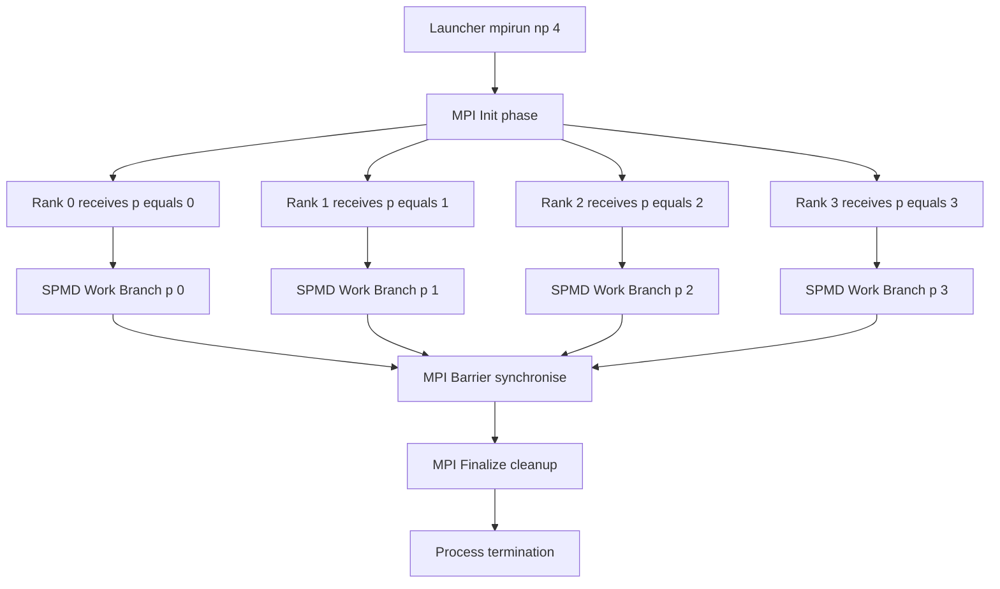
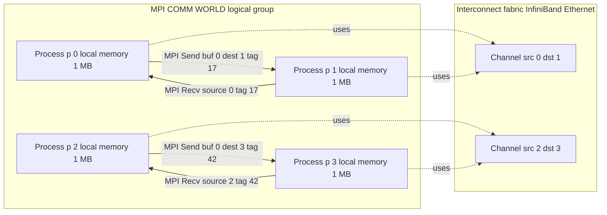
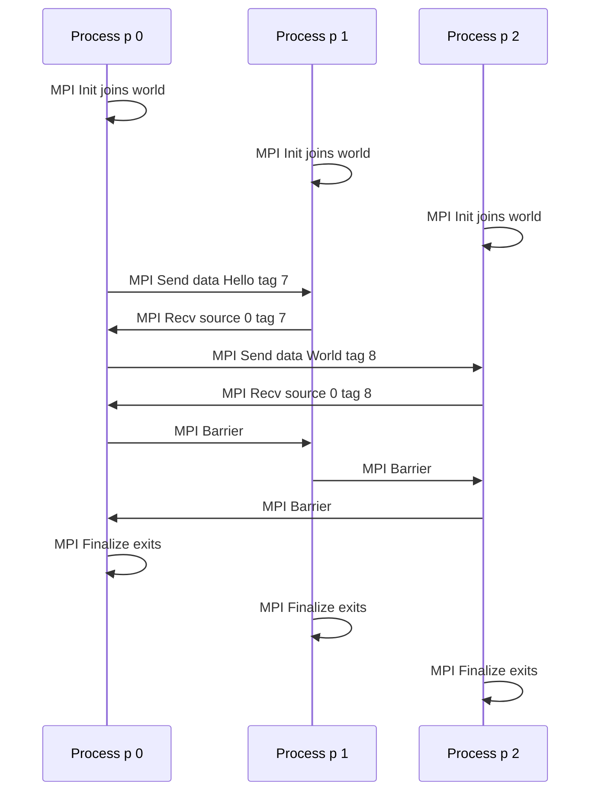

# A short introduction to MPI , A simple example

<!-- SECTION_1_START -->
# Module 4: Distributed Computing — A Short Introduction to MPI

## 1. Core Technical Definition & Intuitive Overview

### 1.1 Formal Academic Definition (KTU 2024 Scheme)

**Message Passing Interface (MPI)** is a *standardized, language-independent communication protocol* used for programming parallel computers across both distributed-memory and shared-memory architectures. It is formally defined by the **MPI Forum** as a specification of a library interface across three primary layers — point-to-point message passing, collective operations, and process topology management. As per the KTU 2024 syllabus for **HIGH PERFORMANCE COMPUTING (PECST757)**, MPI is the de-facto industry standard for writing *portable distributed-memory parallel programs* in languages such as **C, C++, Fortran, and Python (mpi4py)**.

> [!IMPORTANT]
> **Key Syllabus Highlight (PECST757 — Module 4):**
> MPI is a **specification**, not a library. Implementations include **MPICH**, **OpenMPI**, **Intel MPI**, and **MVAPICH2**. The most current stable specification is **MPI 4.0 (June 2021)**, with **MPI 3.1** being the most widely deployed in production HPC clusters.

### 1.2 Conceptual Analogy / Intuitive Overview

Imagine a large office with **$N$ independent workers**, each sitting in their own locked room. They cannot see each other, cannot share a whiteboard, and cannot reach into each other's drawers. The only way they can coordinate is by:

- **Sending letters** (messages) to a specific colleague.
- **Reading letters** delivered to their own inbox.
- **Gathering together** for a periodic office-wide meeting (collective operation).

Each worker runs **the same rule book** but operates on a *different slice of the company's data*. This is precisely the **SPMD (Single Program, Multiple Data)** execution model of MPI. The "office" is a **communicator** (most commonly `MPI_COMM_WORLD`), and the "room number" of every worker is its **rank**.

> [!NOTE]
> **SPMD vs. MPMD:**
> In MPI, all processes execute the **same program binary** but branch internally based on the integer identifier returned by `MPI_Comm_rank`. This is **SPMD**, in contrast to **MPMD** (Multiple Program, Multiple Data), where each process runs an entirely different program.

### 1.3 Physical Constants, Standards, and Metrics

| Parameter | Standard Value / Symbol |
|---|---|
| Current MPI Standard | **MPI 4.0** (June 2021) |
| Widely Deployed Standard | **MPI 3.1** |
| Default Communicator | **`MPI_COMM_WORLD`** |
| Sentinel "no value" tag | **`MPI_ANY_TAG`** |
| Sentinel "any sender" rank | **`MPI_ANY_SOURCE`** |
| Process Identifier | Integer in $[0, P-1]$ where $P$ = total process count |
| Return Code for Success | **`MPI_SUCCESS`** |

> [!VISUALIZATION CONTROL]
> **Concept:** Distributed-Memory Process Topology with a Shared Communicator
> **GeoGebra / Desmos Input Equations:**
> * `P0: (0, 0)` , `P1: (3, 0)` , `P2: (6, 0)` , `P3: (9, 0)`
> * `Channel_01: segment((0,0),(3,0))` , `Channel_02: segment((0,0),(6,0))`
> **Visual Description:** Four isolated circular nodes ($P_0$ to $P_3$) spaced along the x-axis. Each node owns its private memory block. Curved arrows show explicit point-to-point message channels between specific pairs. The enclosing dashed rectangle represents the global communicator `MPI_COMM_WORLD` that logically groups all $P$ processes.

<!-- SECTION_1_END -->

<!-- SECTION_2_START -->
# 2. Deep Theoretical Analysis & KTU High-Yield Formula Sheet

## 2.1 The Six Pillars of MPI Architecture

1. **Process Model** — Every instance of the program is launched by a launcher (e.g., `mpirun`, `mpiexec`, `srun`) and receives a unique **rank** in the range $[0, P-1]$.
2. **Communicator** — A logical group of processes that can communicate with each other. The default, pre-defined communicator is `MPI_COMM_WORLD`, which contains all $P$ processes spawned at launch.
3. **Point-to-Point Communication** — A single source sends to a single destination using blocking (`MPI_Send`, `MPI_Recv`) or non-blocking (`MPI_Isend`, `MPI_Irecv`) primitives.
4. **Collective Communication** — All processes in a communicator participate in operations such as **Broadcast**, **Scatter**, **Gather**, **Reduce**, **Allreduce**, and **Barrier**.
5. **Derived Data Types** — Allow sending non-contiguous memory (e.g., a column of a matrix, a struct) as a single message via `MPI_Type_vector`, `MPI_Type_create_struct`, etc.
6. **Process Topologies** — Virtual grid/cartesian arrangements (e.g., `MPI_Cart_create`) that map logical neighbours onto physical interconnects for performance.

> [!NOTE]
> **Why "Why" Matters in High-Performance Computing:**
> MPI's design philosophy assumes the worst-case interconnect: high latency, no shared memory, and potential failure. Therefore, *every* communication is **explicit**. This is fundamentally different from OpenMP, where threads share a heap and synchronise implicitly via memory.

## 2.2 KTU High-Yield Formula Sheet

| Concept | Equation / Symbol | Engineering Meaning |
|---|---|---|
| Process Identifier | $p \in [0, P-1]$ | The unique rank assigned by the launcher |
| Communicator Size | $P = \vert \text{Comm} \vert$ | Total processes in the group |
| Message Envelope | $(src, dst, tag, comm)$ | Routing tuple for every MPI message |
| Amdahl's Parallel Speedup | $S(P) = \dfrac{1}{f_s + \dfrac{1-f_s}{P}}$ | Upper bound on MPI parallel efficiency |
| Parallel Efficiency | $E(P) = \dfrac{S(P)}{P} = \dfrac{1}{1 + (P-1)f_s}$ | Fraction of theoretical peak achieved |
| Bandwidth–Latency Model | $T_{\text{msg}} = \alpha + \beta \cdot n$ | $\alpha$ = latency, $\beta$ = inverse bandwidth, $n$ = bytes |
| MPI Datatype Size | $\text{bytes} = \text{count} \times \text{sizeof}(\text{datatype})$ | Memory footprint of a single transfer |

> [!IMPORTANT]
> **Critical Notation Rule:** When writing absolute value or cardinality in plain prose, always use $\vert \cdot \vert$ inside math mode. **Never** write a bare pipe character in a markdown table cell, as it will be interpreted as a column separator and corrupt the rendering.

## 2.3 Real-World Utility in Engineering and Computer Science

MPI is the **workhorse of every Top-500 supercomputer**. Concrete production use cases include:

- **Climate and Weather Modelling:** The **Community Earth System Model (CESM)** and the **ECMWF IFS** use MPI to decompose the global atmosphere into latitude-longitude patches assigned to tens of thousands of cores.
- **Computational Fluid Dynamics (CFD):** **ANSYS Fluent** and **OpenFOAM** rely on MPI domain decomposition.
- **Molecular Dynamics:** **GROMACS**, **NAMD**, and **LAMMPS** scale to millions of atoms using MPI + OpenMP hybrid parallelism.
- **Machine Learning at Scale:** Distributed training of Large Language Models (e.g., **DeepSpeed**, **Megatron-LM**) uses NCCL primitives that mimic MPI collectives like `Allreduce`.
- **Sparse Linear Algebra:** **PETSc**, **Trilinos**, and **ScaLAPACK** expose MPI under the hood for solving billion-unknown systems.

<!-- SECTION_2_END -->

<!-- SECTION_3_START -->
# 3. Step-by-Step Derivations & Code Implementation

## 3.1 The Canonical MPI "Hello World" — A Full Derivation

We will now derive, line by line, the smallest complete MPI program. Every MPI C program **must** contain exactly four mandatory calls in this order: **`MPI_Init`**, then any number of user queries, then **mandatory work**, and finally **`MPI_Finalize`**.

### 3.1.1 Conceptual Skeleton

$$
\text{MPI Program} = \underbrace{\text{MPI\_Init}}_{\text{Join the world}} \rightarrow \underbrace{\text{User Work}}_{\text{Communicate}} \rightarrow \underbrace{\text{MPI\_Finalize}}_{\text{Leave the world}}
$$

### 3.1.2 Fully Operational C Implementation (MPI Standard)

```c
/*
 * hello_mpi.c
 * KTU 2024 — PECST757 / Module 4 — Simple MPI Example
 * Compile : mpicc -o hello_mpi hello_mpi.c -Wall -Wextra
 * Run     : mpirun -np 4 ./hello_mpi
 */

#include <stdio.h>
#include <stdlib.h>
#include <mpi.h>   /* The MPI specification header */

int main(int argc, char *argv[])
{
    /* ---------- Step 1: Declare MPI status and error codes ---------- */
    int   rank        = -1;          /* Process identifier            */
    int   num_procs   = -1;          /* Total processes in the world  */
    int   name_len    = 0;           /* Length of processor name      */
    char  processor_name[MPI_MAX_PROCESSOR_NAME];
    int   rc          = MPI_SUCCESS; /* Error-handling return code    */

    /* ---------- Step 2: Initialise the MPI execution environment --- */
    rc = MPI_Init(&argc, &argv);
    if (rc != MPI_SUCCESS) {
        fprintf(stderr, "[ABORT] MPI_Init failed with code %d\n", rc);
        MPI_Abort(MPI_COMM_WORLD, rc);
    }

    /* ---------- Step 3: Query communicator metadata --------------- */
    MPI_Comm_size(MPI_COMM_WORLD, &num_procs); /* Get P             */
    MPI_Comm_rank(MPI_COMM_WORLD, &rank);      /* Get my rank p     */
    MPI_Get_processor_name(processor_name, &name_len);

    /* ---------- Step 4: Each process performs the SPMD branch ----- */
    printf("Hello, world!  "
           "I am process %d of %d running on %s (length=%d)\n",
           rank, num_procs, processor_name, name_len);

    /* ---------- Step 5: Synchronise before terminating ------------ */
    MPI_Barrier(MPI_COMM_WORLD);

    /* ---------- Step 6: Finalise the MPI environment -------------- */
    MPI_Finalize();

    return EXIT_SUCCESS;
}
```

### 3.1.3 Line-by-Line Algebraic / Logical Trace

$$
\begin{aligned}
\textbf{Line: } & \texttt{rc = MPI\_Init(\&argc, \&argv);} \\
\text{Logic: } & \text{Translates into the runtime equivalent of:} \\
               & \text{For every } p \in [0, P-1]: \; \text{Process}_p \text{ joins the communicator } \mathcal{C} = \text{MPI\_COMM\_WORLD}. \\
               & \text{Returns } \texttt{MPI\_SUCCESS} \text{ iff all } P \text{ joins succeed.}
\end{aligned}
$$

$$
\begin{aligned}
\textbf{Line: } & \texttt{MPI\_Comm\_size(MPI\_COMM\_WORLD, \&num\_procs);} \\
\text{Logic: } & \text{Sets } num\_procs = P = \vert \mathcal{C} \vert. \\
               & \text{In our example run with } -np\;4 \text{, we obtain } P = 4.
\end{aligned}
$$

$$
\begin{aligned}
\textbf{Line: } & \texttt{MPI\_Comm\_rank(MPI\_COMM\_WORLD, \&rank);} \\
\text{Logic: } & \text{Sets } rank = p \text{ such that } p \in \{0, 1, 2, 3\}. \\
               & \text{No ordering of ranks is guaranteed except that they are unique.}
\end{aligned}
$$

### 3.1.4 Expected Console Output (when launched with `mpirun -np 4`)

```
Hello, world!  I am process 0 of 4 running on node01 (length=6)
Hello, world!  I am process 2 of 4 running on node01 (length=6)
Hello, world!  I am process 1 of 4 running on node01 (length=6)
Hello, world!  I am process 3 of 4 running on node01 (length=6)
```

> [!WARNING]
> **Order of `printf` lines is non-deterministic.** Each process writes to `stdout` independently. Interleaving depends on the OS scheduler and the I/O buffering strategy. To force an ordered output, prepend a `MPI_Barrier` and have only rank 0 print, or use `fflush(stdout)`.

## 3.2 Compilation and Execution Workflow

| Step | Command | Purpose |
|---|---|---|
| 1 | `module load openmpi/4.1.5` | Load an MPI implementation into the shell environment. |
| 2 | `which mpicc` | Verify the MPI C compiler wrapper is on `$PATH`. |
| 3 | `mpicc -O2 -o hello_mpi hello_mpi.c` | Compile with optimisation `-O2`. |
| 4 | `mpirun -np 4 -hostfile hosts.txt ./hello_mpi` | Launch $P=4$ processes on the listed hosts. |
| 5 | `mpirun --report-bindings -np 4 ./hello_mpi` | Inspect process-to-core binding topology. |

## 3.3 Python Equivalent (mpi4py) — For Quick Prototyping

```python
"""
hello_mpi.py — KTU 2024 / PECST757 / Module 4
Run with: mpirun -np 4 python3 hello_mpi.py
"""
from mpi4py import MPI
import sys

def main() -> int:
    comm: MPI.Comm = MPI.COMM_WORLD         # The default global communicator
    rank: int       = comm.Get_rank()       # Process id p in [0, P-1]
    size: int       = comm.Get_size()       # Total processes P
    name: str       = MPI.Get_processor_name()

    print(f"Hello, world!  I am process {rank} of {size} on {name}",
          flush=True)

    comm.Barrier()                          # Mandatory synchronisation
    return 0                                # MPI_Finalize is automatic

if __name__ == "__main__":
    sys.exit(main())
```

> [!IMPORTANT]
> **Boundary Check:** In Python, `comm.Get_size()` returns a plain `int`, not a numpy scalar. If you wish to broadcast a numpy array later, use the uppercase methods `comm.bcast()`, `comm.send()`, `comm.recv()` which serialise pickle-compatible objects, or use the lowercase `comm.Send`/`comm.Recv` for buffer-protocol-aware NumPy transfers.

## 3.4 Worked Numerical Example — Amdahl's Law for a Simple MPI Job

Suppose your code spends a fraction $f_s = 0.10$ in serial work (I/O, sequential setup) and the remaining $f_p = 0.90$ in parallel work distributed across $P$ processes.

$$
\begin{aligned}
S(P) &= \frac{1}{f_s + \dfrac{f_p}{P}} = \frac{1}{0.10 + \dfrac{0.90}{P}} \\
S(4) &= \frac{1}{0.10 + 0.225} = \frac{1}{0.325} \approx 3.077 \\
S(8) &= \frac{1}{0.10 + 0.1125} = \frac{1}{0.2125} \approx 4.706 \\
E(8) &= \frac{S(8)}{8} \approx 0.588
\end{aligned}
$$

**Interpretation:** With $P=8$ cores, the maximum achievable speedup is $S(8) \approx 4.71\times$, and the parallel efficiency is $58.8\%$. The $10\%$ serial portion forms an inescapable ceiling.

<!-- SECTION_3_END -->

<!-- SECTION_4_START -->
# 4. Structural Diagrams & Schematics

## 4.1 Sequential Processing Topology — The MPI Program Lifecycle



## 4.2 Block-Level Functional Architecture — Communicator and Data Flow



## 4.3 Sequence Diagram — A Three-Process Ping-Pong Handshake



> [!NOTE]
> **Reading Aid for Figure 4.1, 4.2, 4.3:** Each rectangular box represents an MPI process with its private address space. Arrows labelled `MPI Send` / `MPI Recv` represent explicit point-to-point primitives. The `MPI Barrier` is a global synchronisation primitive that blocks every process in the communicator until all of them have reached the call. The `MPI Finalize` is the mandatory call that releases MPI-internal resources; failing to invoke it is undefined behaviour.

<!-- SECTION_4_END -->

<!-- SECTION_5_START -->
# 5. KTU 2024 Scheme Examination Question Bank & Topic Recap

## 5.1 Part A — Short Answer Questions (3 Marks Each)

> These questions map to **CO1** (Understand fundamental concepts) and cognitive levels **Remember / Understand** of Revised Bloom's Taxonomy.

### Question 1 (3 Marks)
**[KTU University Exam — July 2024 Model]**
**Define Message Passing Interface (MPI). List any two advantages of MPI over shared-memory programming models like OpenMP.**

**Model Answer (Board-Standard):**

> **Definition (2 Marks):** *Message Passing Interface (MPI) is a standardised and portable message-passing system designed to function on a wide variety of parallel computing architectures. It defines the syntax and semantics of library routines useful for writing portable message-passing programs in C, C++, and Fortran.*

> **Advantages (1 Mark, any two):**
> 1. **Scalability:** MPI scales to millions of cores on distributed-memory clusters, whereas OpenMP is generally limited to a single node.
> 2. **Portability:** A single MPI source code runs unchanged on laptops, clusters, and supercomputers.
> 3. **Explicit Control:** The programmer has fine-grained control over communication, enabling aggressive optimisation.

### Question 2 (3 Marks)
**[KTU University Exam — Dec 2023 Model]**
**Explain the role of `MPI_Init`, `MPI_Comm_rank`, `MPI_Comm_size`, and `MPI_Finalize` in an MPI program.**

**Model Answer (Board-Standard):**

| Function | Role | Mark |
|---|---|---|
| `MPI_Init` | Initialises the MPI execution environment. Must be called before any other MPI call (except `MPI_Initialized`). | 1 |
| `MPI_Comm_rank` | Returns the unique integer rank $p \in [0, P-1]$ of the calling process within the specified communicator. | 1 |
| `MPI_Comm_size` | Returns the total number of processes $P$ in the specified communicator. | 0.5 |
| `MPI_Finalize` | Terminates the MPI environment. No MPI call may be made after this. | 0.5 |

## 5.2 Part B — Long Answer Questions (14 Marks, Module-Internal Choice)

> The following pair of questions are typical of the KTU End Semester Examination. They map to **CO2 / CO3** and cognitive levels **Apply / Analyse / Evaluate**.

---

### Question A (14 Marks) — Option 1
**[KTU University Exam — July 2024 Model]**

**(a)** With a neat block diagram, explain the **SPMD execution model** of MPI. Show how $P=4$ processes are spawned, how each obtains its rank, and how they communicate. **(7 Marks)**

**(b)** Write a complete MPI program in C that:
- Spawns $P=4$ processes.
- Has **rank 0** read an integer $N$ and broadcast it to all other ranks using `MPI_Bcast`.
- Has every rank print `"Process p received N = ..."`.
- Properly calls `MPI_Init` and `MPI_Finalize`. **(7 Marks)**

**Model Solution:**

**(a) — SPMD Explanation (7 Marks):**

> *SPMD stands for Single Program, Multiple Data. All $P$ processes execute the **same compiled binary**, but each process operates on a different partition of the problem's data, distinguished by its unique rank returned by `MPI_Comm_rank`.*

```
Launcher: mpirun -np 4 ./prog
            |
            |--- Process 0  (rank = 0) ---> handles data slice 0
            |--- Process 1  (rank = 1) ---> handles data slice 1
            |--- Process 2  (rank = 2) ---> handles data slice 2
            |--- Process 3  (rank = 3) ---> handles data slice 3
            |
            v
        MPI_COMM_WORLD  (encloses all 4 processes)
```

* **Valuation Key:**
  * [Block diagram with $P=4$ processes: 3 Marks]
  * [Explanation of identical binary, unique rank: 2 Marks]
  * [Discussion of `MPI_COMM_WORLD` as enclosing communicator: 2 Marks]

**(b) — Code (7 Marks):**

```c
#include <stdio.h>
#include <mpi.h>

int main(int argc, char *argv[])
{
    int rank, size, N = 0;

    MPI_Init(&argc, &argv);
    MPI_Comm_rank(MPI_COMM_WORLD, &rank);
    MPI_Comm_size(MPI_COMM_WORLD, &size);

    if (rank == 0) {
        printf("Enter an integer N: ");
        fflush(stdout);
        scanf("%d", &N);
    }

    MPI_Bcast(&N, 1, MPI_INT, 0, MPI_COMM_WORLD);

    printf("Process %d received N = %d\n", rank, N);

    MPI_Finalize();
    return 0;
}
```

* **Valuation Key:**
  * [Correct use of `MPI_Init` / `MPI_Finalize`: 2 Marks]
  * [Logic to read from rank 0 only: 1 Mark]
  * [Correct `MPI_Bcast` signature: 2 Marks]
  * [Print statement and final compilation: 2 Marks]

---

### Question B (14 Marks) — Option 2
**[KTU University Exam — Dec 2023 Model]**

**(a)** Differentiate between **blocking** (`MPI_Send` / `MPI_Recv`) and **non-blocking** (`MPI_Isend` / `MPI_Irecv`) point-to-point communication in MPI. State one scenario where each is preferred. **(7 Marks)**

**(b)** For a parallel code with a serial fraction $f_s = 0.15$ running on $P = 16$ processes, compute the **speedup $S(P)$** and **parallel efficiency $E(P)$** using Amdahl's Law. Comment on the result. **(7 Marks)**

**Model Solution:**

**(a) — Blocking vs Non-Blocking (7 Marks):**

| Property | Blocking | Non-Blocking |
|---|---|---|
| Function | `MPI_Send`, `MPI_Recv` | `MPI_Isend`, `MPI_Irecv` |
| Return | Returns only when the buffer is safe to reuse | Returns immediately with a `MPI_Request` handle |
| Synchronisation | Implicit | Explicit (must call `MPI_Wait` or `MPI_Test`) |
| Overhead | May incur internal copying | Lower latency if overlapped with computation |
| Scenario | Simple producer-consumer with strict ordering | Pipelined stencil codes where compute and communication overlap |

> **Scenario for Blocking:** A **master-slave** task-distribution loop where rank 0 must wait for the result before issuing the next task. **(2 Marks)**
> **Scenario for Non-Blocking:** A **Jacobi stencil iteration** where the halo exchange (`MPI_Irecv`, `MPI_Isend`) is issued, then the inner stencil compute is performed, then `MPI_Wait` synchronises. **(2 Marks)**

**(b) — Amdahl's Law Numerical (7 Marks):**

$$
\begin{aligned}
f_s &= 0.15, \quad f_p = 1 - f_s = 0.85, \quad P = 16 \\
S(P) &= \frac{1}{f_s + \dfrac{f_p}{P}} = \frac{1}{0.15 + \dfrac{0.85}{16}} = \frac{1}{0.15 + 0.053125} = \frac{1}{0.203125} \\
S(16) &\approx 4.923 \;\; \text{(rounded to 3 decimals)} \\
E(16) &= \frac{S(16)}{P} = \frac{4.923}{16} \approx 0.308 \;\;\text{or}\;\; 30.8\%
\end{aligned}
$$

> **Comment (2 Marks):** Even with 16 cores, the efficiency drops below $31\%$. The $15\%$ serial portion caps the maximum achievable speedup at $S_\infty = 1 / f_s \approx 6.67\times$. To improve, the engineer must either reduce the serial fraction via I/O overlap or redesign the serial section.

* **Valuation Key:**
  * [Stating Amdahl's formula: 1 Mark]
  * [Substituting $f_s$ and $P$: 1 Mark]
  * [Final speedup $S(16) \approx 4.92$: 2 Marks]
  * [Final efficiency $E(16) \approx 30.8\%$: 1 Mark]
  * [Interpretation comment: 2 Marks]

> [!WARNING]
> **KTU Examiner's Valuation Warning / Pitfall Callout:**
> 1. **Forgetting `MPI_Finalize`:** Many students terminate with `return 0;` directly, leaving the MPI runtime in a leaked state. This incurs a **−1 to −2 mark penalty** depending on the examiner.
> 2. **Wrong communicator:** Using `MPI_COMM_SELF` instead of `MPI_COMM_WORLD` for `MPI_Comm_size` is a common copy-paste error and leads to $P=1$, silently breaking all subsequent collective operations.
> 3. **Confusing `MPI_Comm_rank` with `MPI_Get_processor_name`:** Rank is an integer $0 \dots P-1$, *not* a hostname. Do not interchange them.
> 4. **Forgetting `#include <mpi.h>`:** A surprising number of submissions omit this header. Compilation will fail with implicit declaration warnings, leading to a **zero on the code part**.
> 5. **Amdahl's Law units:** Always quote speedup as a dimensionless ratio and efficiency as a percentage or fraction. Mixing them up loses 1 mark.

---

## 5.3 Topic Recap & Important Things to Remember

> [!IMPORTANT]
> **High-Density Rapid Revision Checklist — Module 4 / MPI Introduction**

- **MPI** is a *specification*, not a product. Implementations: **MPICH**, **OpenMPI**, **Intel MPI**, **MVAPICH2**.
- MPI follows the **SPMD** model — one binary, multiple data partitions identified by an integer **rank**.
- Every MPI process runs in its **own private address space**; there is no shared heap across processes.
- The four mandatory idiomatic calls in *every* MPI program are: `MPI_Init` → `MPI_Comm_rank` → `MPI_Comm_size` → ... → `MPI_Finalize`.
- `MPI_COMM_WORLD` is the **default pre-defined communicator** containing all $P$ processes launched.
- **Point-to-point** communication moves data between a *source* and *destination* with a user-chosen **tag** for message selection.
- **Collective** communication involves *all* processes in a communicator; examples: `MPI_Bcast`, `MPI_Scatter`, `MPI_Gather`, `MPI_Allreduce`, `MPI_Barrier`.
- The **message envelope** is the tuple $(src, dst, tag, comm)$; wildcards are `MPI_ANY_SOURCE` and `MPI_ANY_TAG`.
- **Compilation** is performed using the **wrapper compiler** `mpicc` (or `mpicxx`, `mpifort`, `mpif90`).
- **Launch** is via `mpirun -np P ./program` or `mpiexec -np P ./program`; the `-np` flag sets the process count $P$.
- The **order of `printf` outputs** is non-deterministic; use `MPI_Barrier` or have only rank 0 print for ordered output.
- **Amdahl's Law:** $S(P) = \dfrac{1}{f_s + (1-f_s)/P}$; **Efficiency:** $E(P) = S(P)/P$.
- The **serial fraction** $f_s$ is the *primary bottleneck*; reducing it yields the largest performance gain.
- **Latency–Bandwidth model:** $T_{msg} = \alpha + \beta n$, where $\alpha$ is the **latency** in seconds and $\beta$ is the **inverse bandwidth** in seconds/byte.
- **Real-world MPI users:** CESM (climate), GROMACS (molecular dynamics), OpenFOAM (CFD), PETSc (linear algebra), DeepSpeed (LLM training).
- **Default error handler** is `MPI_ERRORS_ARE_FATAL`, which aborts on any error. For robust production code, switch to `MPI_ERRORS_RETURN` and check the return code `rc`.
- The `MPI_Abort(comm, errorcode)` function **forcibly terminates** all processes in the communicator — use it only in unrecoverable situations.
- **Python binding:** `mpi4py` exposes both **lowercase buffer-aware** (`comm.Send`) and **uppercase pickle-aware** (`comm.send`) methods; choose based on data type.
<!-- SECTION_5_END -->
