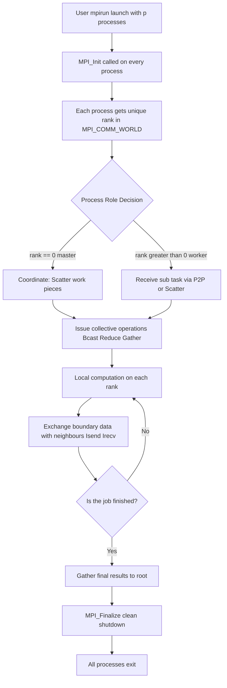
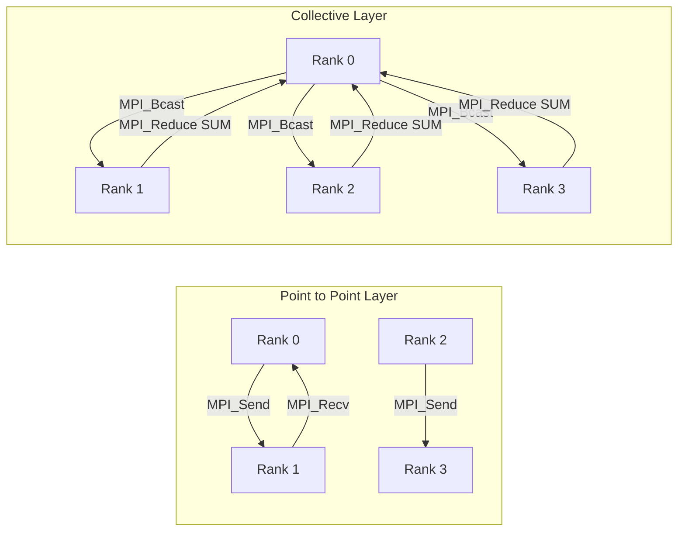
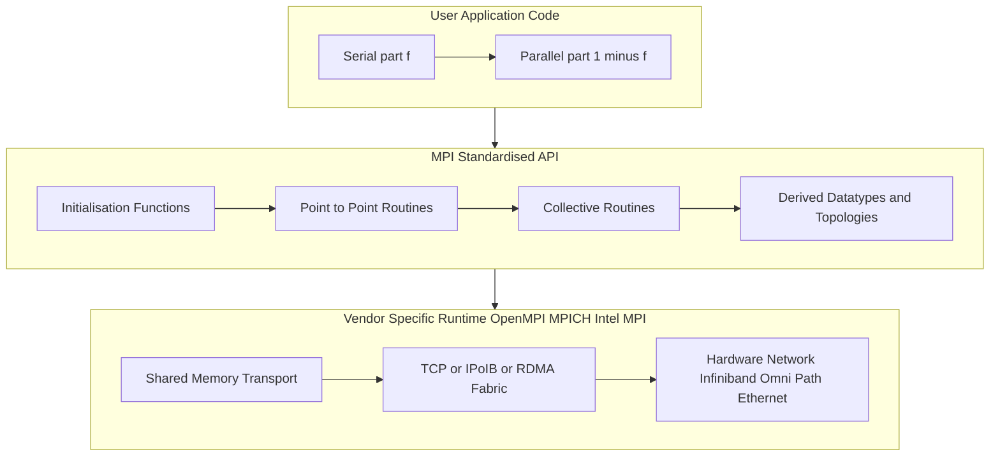

# Distributed-memory parallel programming with MPI :-

<!-- SECTION_1_START -->

# Module 4 — Distributed-Memory Parallel Programming with MPI

## 1.1 Formal Academic Definition (KTU 2024 Syllabus Terminology)

> [!IMPORTANT]
> **Message Passing Interface (MPI)** is a **standardized, language-independent, portable message-passing specification** (not a library or implementation) designed to function on a wide variety of parallel computing architectures. It defines the syntax and semantics of a core set of library routines that a programmer can use to write portable message-passing programs in **C, C++, Fortran, Python (via mpi4py), and Java**.

In the **distributed-memory model**, every processor (process) owns its **own private address space**, and there is **no shared global memory**. Coordination between processes happens **exclusively through explicit message exchanges** over an interconnection network. MPI is the de-facto industry standard for this model.

The three cornerstone abstractions of an MPI program are:

| Abstraction | Symbol | Meaning |
|-------------|--------|---------|
| **Process** | $P_i$ | An independent instance of the program with its own memory |
| **Rank** | $r \in \{0, 1, \dots, p-1\}$ | A unique integer ID of a process inside a communicator |
| **Communicator** | $\mathcal{C}$ | A ordered group of processes plus a context for safe communication |
| **Message** | $M$ | A triple $\langle$ *buf*, *count*, *datatype* $\rangle$ exchanged between two ranks |

> [!NOTE]
> **KTU Syllabus Highlight:** The most commonly used communicator is **`MPI_COMM_WORLD`**, which contains **every process spawned for a given MPI job**.

## 1.2 Intuitive Real-World Analogy

> [!TIP]
> **The Postal-Service Analogy**
> Imagine a multinational company with **branches in different cities**, each branch having its own locked filing cabinet. No branch can directly peek into another's cabinet. To collaborate, branch managers (processes) must **write a letter, put it in a sealed envelope, address it with the branch ID (rank), and send it through the official courier (MPI runtime)**.
>
> * The **branch** = a process.
> * The **branch ID** = the rank.
> * The **official courier company** = the MPI library (e.g., OpenMPI, MPICH, Intel MPI).
> * The **sealed envelope** = the message buffer, sized in *count × datatype*.
> * The **registered post** = **blocking** send/recv (sender waits until delivered).
> * The **speed post with tracking** = **non-blocking** send/recv (sender continues, fetches status later).

**GeoGebra / Desmos Visualisation** is not directly applicable to message-passing, but a **conceptual topology diagram** is rendered in SECTION\_4.

<!-- SECTION_1_END -->

<!-- SECTION_2_START -->

# 2. Deep Theoretical Analysis & KTU High-Yield Formula Sheet

## 2.1 The MPI Programming Model — Layered Logic

1. **Initialisation Layer** — `MPI_Init` boots the runtime, sets up inter-process channels, and assigns ranks.
2. **Topology-Aware Layer** — Logical process topologies (Cartesian, Graph) can be declared via `MPI_Cart_create` to map processes onto the physical network optimally.
3. **Point-to-Point Layer** — Two processes exchange data. Six blocking variants exist: *Standard, Buffered, Synchronous, Ready* sends, plus the matching *Recv*.
4. **Collective Layer** — Operations span *all* processes in a communicator: **Broadcast, Scatter, Gather, Allgather, Reduce, Allreduce, Alltoall, Scan, Barrier**.
5. **One-Sided / RMA Layer** — Remote Memory Access: `MPI_Put`, `MPI_Get`, `MPI_Accumulate` (MPI-2 / MPI-3).
6. **Parallel I/O Layer** — `MPI_File_*` family (MPI-2).
7. **Finalisation Layer** — `MPI_Finalize` cleanly tears down all MPI resources.

> [!NOTE]
> **"Why" behind the model:** MPI exposes only a *thin* standard, allowing vendor-specific optimisations (shared-memory transports, RDMA, OFI) under one portable API. The programmer writes *one* source; it runs on a laptop, a cluster, or the world's top-500 supercomputers unchanged.

## 2.2 Point-to-Point vs Collective Communication

- **Point-to-Point (P2P):** One sender $\rightarrow$ one receiver. *e.g.* `MPI_Send`, `MPI_Recv`, `MPI_Isend`, `MPI_Irecv`.
- **Collective:** All $p$ processes of a communicator participate. *e.g.* `MPI_Bcast`, `MPI_Reduce`.

> [!IMPORTANT]
> Collective operations are **not** implemented as repeated P2P calls. MPI runtimes use optimised tree-based, binomial, or pipelined algorithms to minimise latency and bandwidth.

## 2.3 Blocking vs Non-Blocking

- **Blocking:** Routine returns *only* when the operation is *logically complete* (buffer is reusable for blocking send, message is received for blocking recv).
- **Non-Blocking:** Routine returns *immediately*; the actual completion is checked with `MPI_Wait` or `MPI_Test` using a `MPI_Request` handle. Non-blocking is essential for **latency hiding** by overlapping communication with computation.

## 2.4 KTU High-Yield Formula Sheet

| Symbol / Formula | Meaning | Units / Notes |
|---|---|---|
| $S(N) = \dfrac{T_s}{T_p(N)}$ | **Speedup** with $N$ processors | Dimensionless, $S(N) \le N$ |
| $E(N) = \dfrac{S(N)}{N}$ | **Parallel Efficiency** | $0 \lt E(N) \le 1$ |
| $C(N) = N \cdot T_p(N)$ | **Cost** | Time $\times$ processors |
| $\displaystyle S(N) = \frac{1}{f + \frac{1-f}{N}}$ | **Amdahl's Law** | $f$ = serial fraction |
| $S_{\max} = \lim_{N \to \infty} S(N) = \dfrac{1}{f}$ | Amdahl's ceiling | Independent of $N$ |
| $S(N) = N - f(N-1)$ | **Gustafson's Law** (scaled speedup) | Data grows with $N$ |
| $T_{\text{comm}} = t_s + t_w \cdot m$ | **Hockney model** | $t_s$ = startup, $t_w$ = per-word, $m$ = words |
| $B = \dfrac{m \cdot w}{T_{\text{comm}}}$ | **Effective bandwidth** | Bytes / second |
| $\text{Overlap Gain} = T_{\text{comp}} - \max(T_{\text{comp}},\, T_{\text{comm}})$ | Latency-hiding benefit | Negative if comm dominates |

> [!TIP]
> **Engineering Utility:** MPI powers weather forecasting (WRF), molecular dynamics (LAMMPS, GROMACS), CFD (OpenFOAM-MPI), and large-scale deep learning frameworks (Horovod, DistributedDataParallel). The Amdahl/Gustafson formulas decide *how much* of a kernel must be parallelised before MPI scaling pays off.

<!-- SECTION_2_END -->

<!-- SECTION_3_START -->

# 3. Step-by-Step Derivations, Code & Implementation

## 3.1 Derivation of Amdahl's Law (Required KTU Derivation)

Let the total sequential execution time be normalised to **1 unit**. Let $f$ be the *inherently serial* fraction and $(1-f)$ the *parallelisable* fraction.

$$
T_s = 1
$$

On $N$ processors, only the parallelisable portion is divided:

$$
T_p(N) = f + \frac{1-f}{N}
$$

The speedup is the ratio:

$$
S(N) = \frac{T_s}{T_p(N)} = \frac{1}{f + \frac{1-f}{N}}
$$

As $N \to \infty$, the term $\frac{1-f}{N} \to 0$, hence:

$$
S_{\max} = \lim_{N \to \infty} S(N) = \frac{1}{f}
$$

> [!NOTE]
> **Conclusion:** Even if $99\%$ of the code is parallelised ($f = 0.01$), the maximum achievable speedup is **only $100\times$**, no matter how many processors you add.

## 3.2 Worked Numerical — Amdahl's Law (Board-Style)

**Problem:** A program has $f = 0.15$ serial fraction. Compute $S(4)$, $S(8)$, $S(16)$, and $S_{\max}$.

$$
S(4) = \frac{1}{0.15 + \frac{0.85}{4}} = \frac{1}{0.15 + 0.2125} = \frac{1}{0.3625} = 2.759
$$

$$
S(8) = \frac{1}{0.15 + \frac{0.85}{8}} = \frac{1}{0.15 + 0.10625} = \frac{1}{0.25625} = 3.902
$$

$$
S(16) = \frac{1}{0.15 + \frac{0.85}{16}} = \frac{1}{0.15 + 0.053125} = \frac{1}{0.203125} = 4.923
$$

$$
S_{\max} = \frac{1}{0.15} = 6.667
$$

**Valuation Key (KTU style):**
* Correct formula substitution: **2 Marks**
* Correct arithmetic for $S(4)$: **1 Mark**
* Correct arithmetic for $S(8)$: **1 Mark**
* Correct arithmetic for $S(16)$: **1 Mark**
* Correct limit calculation: **1 Mark**
* Tabulated / boxed final answer: **1 Mark**

## 3.3 Complete MPI-C Program — Hello-World + Ring Pass

```c
/* file : mpi_ring.c
   Build: mpicc mpi_ring.c -o mpi_ring
   Run  : mpirun -n 4 ./mpi_ring
*/
#include <mpi.h>
#include <stdio.h>

int main(int argc, char *argv[])
{
    /* ---------- INITIALISATION ---------- */
    MPI_Init(&argc, &argv);                              /* (1)  boot MPI */

    int rank = 0, size = 0;
    MPI_Comm_rank(MPI_COMM_WORLD, &rank);               /* (2)  my id    */
    MPI_Comm_size(MPI_COMM_WORLD, &size);               /* (3)  #procs   */

    char host[MPI_MAX_PROCESSOR_NAME];
    int  hlen = 0;
    MPI_Get_processor_name(host, &hlen);                /* (4)  host nm  */

    printf("[Rank %d of %d] running on %s\n",
            rank, size, host);
    fflush(stdout);

    /* ---------- RING COMMUNICATION ---------- */
    int token   = -1;                                    /* message buffer */
    int next    = (rank + 1) % size;                    /* clockwise      */
    int prev    = (rank - 1 + size) % size;             /* anti-clockwise */

    if (rank == 0) {
        token = 42;                                      /* seed the ring  */
        MPI_Send(&token, 1, MPI_INT,
                 next, 0, MPI_COMM_WORLD);              /* (5)  blocking send */
        MPI_Recv(&token, 1, MPI_INT,
                 prev, 0, MPI_COMM_WORLD,
                 MPI_STATUS_IGNORE);                    /* (6)  blocking recv */
    } else {
        MPI_Recv(&token, 1, MPI_INT,
                 prev, 0, MPI_COMM_WORLD,
                 MPI_STATUS_IGNORE);                    /* receive first  */
        token += 1;                                      /* transform      */
        MPI_Send(&token, 1, MPI_INT,
                 next, 0, MPI_COMM_WORLD);              /* forward        */
    }

    printf("[Rank %d] received token = %d\n", rank, token);

    /* ---------- FINALISATION ---------- */
    MPI_Finalize();                                      /* (7)  shutdown  */
    return 0;
}
```

**Line-by-Line Pedagogical Walk-through**

| Line | Concept | Why it matters |
|---|---|---|
| `MPI_Init` | Runtime bootstrap | Mandatory before any other MPI call; sets up channels. |
| `MPI_Comm_rank` | Identity | Needed for each process to know *who am I* and branch logic. |
| `MPI_Comm_size` | Population | Allows dynamic loops over peers without hard-coding $p$. |
| `MPI_Send(buf, count, datatype, dest, tag, comm)` | Blocking P2P send | Sends 1 integer to the next rank with message tag `0`. |
| `MPI_Recv(buf, count, datatype, src, tag, comm, status)` | Blocking P2P recv | Receives the integer from the previous rank. |
| `MPI_Finalize` | Cleanup | Releases memory and network resources; required for clean exit. |

> [!IMPORTANT]
> **Tag matching:** A *recv* completes only when a *send* with the **same tag, same communicator, and matching source** has been issued.

## 3.4 Collective Communication — Sum of $N$ Integers

```c
#include <mpi.h>
#include <stdio.h>
#include <stdlib.h>

int main(int argc, char *argv[])
{
    MPI_Init(&argc, &argv);

    int rank, size;
    MPI_Comm_rank(MPI_COMM_WORLD, &rank);
    MPI_Comm_size(MPI_COMM_WORLD, &size);

    int *data       = NULL;
    int local_N     = 1000;          /* each rank holds 1000 numbers */
    int *local_data = (int*)malloc(sizeof(int) * local_N);
    for (int i = 0; i < local_N; ++i)
        local_data[i] = rank * local_N + i + 1;   /* unique IDs per rank */

    /* -------- COLLECTIVE REDUCE -------- */
    int global_sum = 0;
    MPI_Reduce(local_data,                /* send buffer               */
               &global_sum,               /* receive buffer (rank 0)   */
               local_N,                   /* count per process         */
               MPI_INT,                   /* datatype                  */
               MPI_SUM,                   /* reduction operator        */
               0,                         /* root process              */
               MPI_COMM_WORLD);           /* communicator              */

    if (rank == 0) {
        long long expected = (long long)size * local_N
                              * (size * local_N + 1) / 2;
        printf("MPI_Reduce  sum = %lld   (expected %lld)\n",
               (long long)global_sum, expected);
    }

    /* -------- COLLECTIVE BROADCAST of a single value -------- */
    if (rank == 0) global_sum = -1;          /* re-use variable */
    MPI_Bcast(&global_sum, 1, MPI_INT, 0, MPI_COMM_WORLD);
    printf("[Rank %d] after Bcast value = %d\n", rank, global_sum);

    free(local_data);
    MPI_Finalize();
    return 0;
}
```

**Why `MPI_Reduce` is faster than manual ring-sum**

- A naive ring sum requires $p-1$ sequential communication steps $\Rightarrow O(p)$.
- MPI's tree-based reduce requires $\lceil \log_2 p \rceil$ steps $\Rightarrow O(\log p)$.
- The runtime picks the optimal algorithm based on message size, datatype, and topology.

## 3.5 Non-Blocking Pattern — Latency Hiding Skeleton

```c
MPI_Request reqs[2];
MPI_Status  stats[2];

/* Issue both operations back-to-back, return immediately */
MPI_Irecv(&recv_buf, 1, MPI_DOUBLE, partner, 0, MPI_COMM_WORLD, &reqs[0]);
MPI_Isend(&send_buf, 1, MPI_DOUBLE, partner, 0, MPI_COMM_WORLD, &reqs[1]);

/* Do useful work while communication is in flight */
do_local_computation();

/* Wait for both to finish */
MPI_Waitall(2, reqs, stats);
```

<!-- SECTION_3_END -->

<!-- SECTION_4_START -->

# 4. Structural Diagrams & Schematics

## 4.1 Mermaid — MPI Program Execution Flow (Topology-Aware)



## 4.2 Mermaid — Communication Pattern Topology



## 4.3 Mermaid — Block-Level Functional Architecture



<!-- SECTION_4_END -->

<!-- SECTION_5_START -->

# 5. KTU 2024 Scheme Examination Question Bank

## 5.1 Part A — Short Answer Questions (3 Marks Each)

### Question 1 — `[KTU University Exam — July 2024]`
**What is MPI? Differentiate between `MPI_Comm_rank` and `MPI_Comm_size` with suitable examples.** **(CO1, Remember)**

**Model Answer (Valuation Key):**
* **MPI** is a *specification*, not a library, defining the syntax and semantics of message-passing routines for distributed-memory parallel programming. **[1 Mark]**
* `MPI_Comm_rank(MPI_COMM_WORLD, &rank)` returns the **unique integer ID** (0, 1, …, p-1) of the calling process within a communicator. Used to let each process know "who am I" and to branch program logic. **[1 Mark]**
* `MPI_Comm_size(MPI_COMM_WORLD, &size)` returns the **total number of processes** that were spawned. Used to set loop bounds dynamically. **[1 Mark]**

### Question 2 — `[KTU University Exam — Dec 2023]`
**Differentiate between blocking and non-blocking point-to-point communication in MPI. When is non-blocking preferred?** **(CO2, Understand)**

**Model Answer (Valuation Key):**
* **Blocking** (`MPI_Send`/`MPI_Recv`) does not return until the operation is *logically complete*; the buffer is safe to reuse. **[1 Mark]**
* **Non-Blocking** (`MPI_Isend`/`MPI_Irecv`) returns *immediately* with a `MPI_Request` handle; completion is checked with `MPI_Wait`/`MPI_Test`. **[1 Mark]**
* Non-blocking is preferred for **latency-hiding** by overlapping communication with computation and for avoiding **deadlock** in cyclic patterns. **[1 Mark]**

---

## 5.2 Part B — Long Answer Questions (14 Marks, Internal Choice)

> [!WARNING]
> **KTU Examiner's Valuation Pitfall — MPI Code**
> Students routinely lose marks because they (i) forget the matching `MPI_Finalize`, (ii) pass `MPI_COMM_WORLD` in the wrong slot of the argument list, (iii) use the same tag for two different messages causing **tag-collision** and silent mis-matches, or (iv) fail to declare `MPI_Status` for blocking receives. *Always* re-check argument order against the KTU reference sheet.

### Question A (14 Marks) — `[KTU University Exam — July 2024]`

#### (a) Explain the architecture of MPI with a neat diagram. Discuss any **six basic MPI functions** with their syntax. (7 Marks) — **CO1, Understand**

**Model Solution:**

1. **Layered architecture** (3 logical layers): **[1 Mark]**
   * **Application layer** — user code in C/Fortran.
   * **MPI API layer** — standardised routines.
   * **Vendor runtime layer** — OpenMPI / MPICH / Intel MPI on top of the network.
2. **Neat block diagram** (draw the same architecture as SECTION 4.3): **[2 Marks]**
3. **Six basic functions** with syntax: **[4 Marks — 2/3 Mark per function]**

| Function | Syntax |
|---|---|
| Initialise | `int MPI_Init(int *argc, char ***argv)` |
| Finalise | `int MPI_Finalize(void)` |
| Rank | `int MPI_Comm_rank(MPI_Comm comm, int *rank)` |
| Size | `int MPI_Comm_size(MPI_Comm comm, int *size)` |
| Send | `int MPI_Send(void *buf, int count, MPI_Datatype dtype, int dest, int tag, MPI_Comm comm)` |
| Receive | `int MPI_Recv(void *buf, int count, MPI_Datatype dtype, int src, int tag, MPI_Comm comm, MPI_Status *status)` |

> **Valuation Key:** *[Layered description: 2 Marks] · *[Block diagram: 2 Marks] · *[Each of 6 functions with correct argument list: 3 Marks]*

#### (b) Write an MPI-C program to compute the sum of $N$ integers using `MPI_Reduce`. Show the expected output for $p = 4$ processes. (7 Marks) — **CO3, Apply**

**Model Solution:**

Use the program from SECTION 3.4. Mark breakdown:

* Correct `#include` directives and `MPI_Init`/`MPI_Finalize` brackets: **1 Mark**.
* Correct call to `MPI_Reduce` with `MPI_SUM` and root 0: **2 Marks**.
* Local data generation loop: **1 Mark**.
* Correct expected-output arithmetic: $\dfrac{p \cdot N (p \cdot N + 1)}{2} = \dfrac{4 \cdot 1000 \cdot 4001}{2} = 8\,002\,000$: **1 Mark**.
* Sample run command `mpirun -n 4 ./reduce_sum`: **1 Mark**.
* Explanation of why `MPI_Reduce` is preferred over a hand-coded ring: **1 Mark**.

**Expected Output (4 processes):**
```
MPI_Reduce  sum = 8002000   (expected 8002000)
[Rank 0] after Bcast value = -1
[Rank 1] after Bcast value = -1
[Rank 2] after Bcast value = -1
[Rank 3] after Bcast value = -1
```

---

### Question B (14 Marks) — `[KTU University Exam — Dec 2023]`

#### (a) With suitable code, explain point-to-point communication in MPI using `MPI_Send` and `MPI_Recv`. Differentiate between the four modes of `MPI_Send`. (7 Marks) — **CO2, Apply**

**Model Solution:**

* The ring-pass code in SECTION 3.3 is the canonical example. **2 Marks** for the code.
* Explanation of *blocking synchronous handshake*: sender returns only after the matching receive has been posted and the message has been copied out. **1 Mark**.
* **Four send modes** (use a clean table): **4 Marks — 1 Mark per row**.

| Mode | Routine | Returns When |
|---|---|---|
| Standard | `MPI_Send` | Implementation-dependent; usually once buffer is reusable |
| Buffered | `MPI_Bsend` | After message is copied into a user-provided buffer |
| Synchronous | `MPI_Ssend` | Only after the matching receive has started |
| Ready | `MPI_Rsend` | Only if the matching receive is **already posted** (UB otherwise) |

> **Valuation Key:** *[Correct code: 2 Marks] · *[Correct handshake explanation: 1 Mark] · *[All four modes: 4 Marks]*

#### (b) Derive Amdahl's Law. A program has $f = 0.20$ as its serial fraction. Calculate the speedup for $N = 8$ processors and the maximum possible speedup. (7 Marks) — **CO2, Apply**

**Model Solution:**

* Normalise $T_s = 1$. **1 Mark**.
* State $T_p(N) = f + \dfrac{1-f}{N}$. **1 Mark**.
* Derive $S(N) = \dfrac{1}{f + \dfrac{1-f}{N}}$. **1 Mark**.
* Limit $S_{\max} = \dfrac{1}{f}$. **1 Mark**.
* Substitute $f = 0.20$, $N = 8$:

$$
S(8) = \frac{1}{0.20 + \frac{0.80}{8}} = \frac{1}{0.20 + 0.10} = \frac{1}{0.30} = 3.333
$$

**[2 Marks]** — *[Formula: 1 Mark] · *[Final numerical value boxed: 1 Mark]*.

* Maximum speedup: $S_{\max} = \dfrac{1}{0.20} = 5.0$. **[1 Mark]**.

> **Valuation Key:** *[Derivation steps: 4 Marks] · *[Numerical computation: 2 Marks] · *[Conclusion with units: 1 Mark]*

---

## 5.3 Topic Recap & Important Things to Remember

> [!TIP]
> **Rapid-Revision Checklist**

* **MPI** is a *specification*, not a library. Standard reference: **MPI 4.0 (2021)**.
* Every MPI program **must** call `MPI_Init` and `MPI_Finalize`.
* `MPI_COMM_WORLD` is the **default communicator** containing all processes.
* **Rank** = unique integer ID; **Size** = total processes.
* `MPI_Send(dest, tag)` is matched by `MPI_Recv(src, tag)`; the **tag must match**.
* **Collective** = *all* processes of a communicator participate; cannot mix with P2P semantics.
* **Blocking** returns when logically complete; **Non-blocking** returns immediately with a request handle.
* **Amdahl's Law:** $S(N) = \dfrac{1}{f + \dfrac{1-f}{N}}$, with ceiling $S_{\max} = \dfrac{1}{f}$.
* **Gustafson's Law:** $S(N) = N - f(N-1)$ — for *scaled* problems.
* **Latency model:** $T_{\text{comm}} = t_s + t_w \cdot m$.
* **Efficiency:** $E(N) = \dfrac{S(N)}{N}$; ideal value = 1.
* **Common pitfalls:** missing `MPI_Finalize`, wrong argument order, tag collision, ignoring `MPI_Status`.
* **Best practice:** prefer **non-blocking** for latency hiding and for cyclic/irregular patterns.
* **Implementations:** OpenMPI, MPICH, Intel MPI, MVAPICH2, Cray MPI.
* **Compilation:** `mpicc prog.c -o prog` ; **Execution:** `mpirun -np 4 ./prog`.

<!-- SECTION_5_END -->
