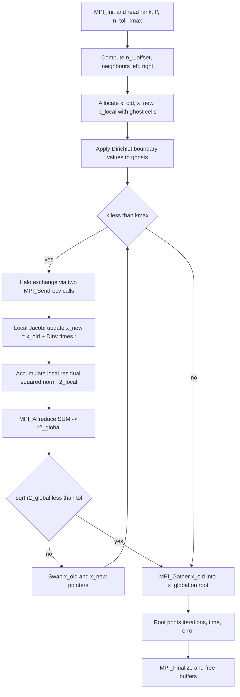
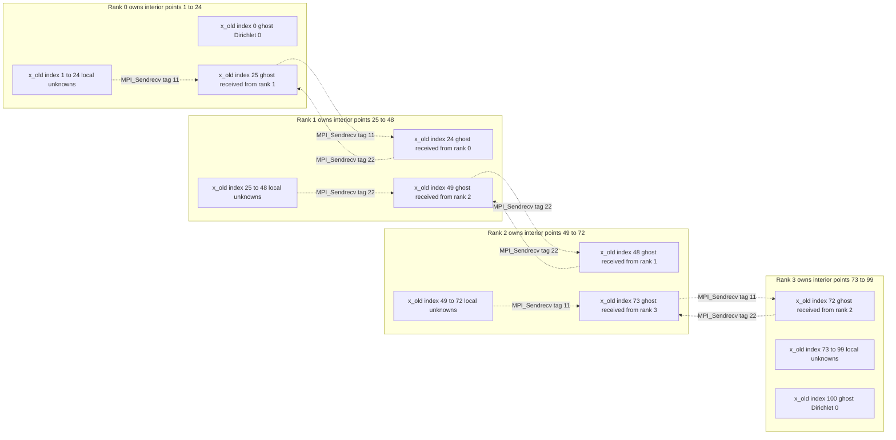
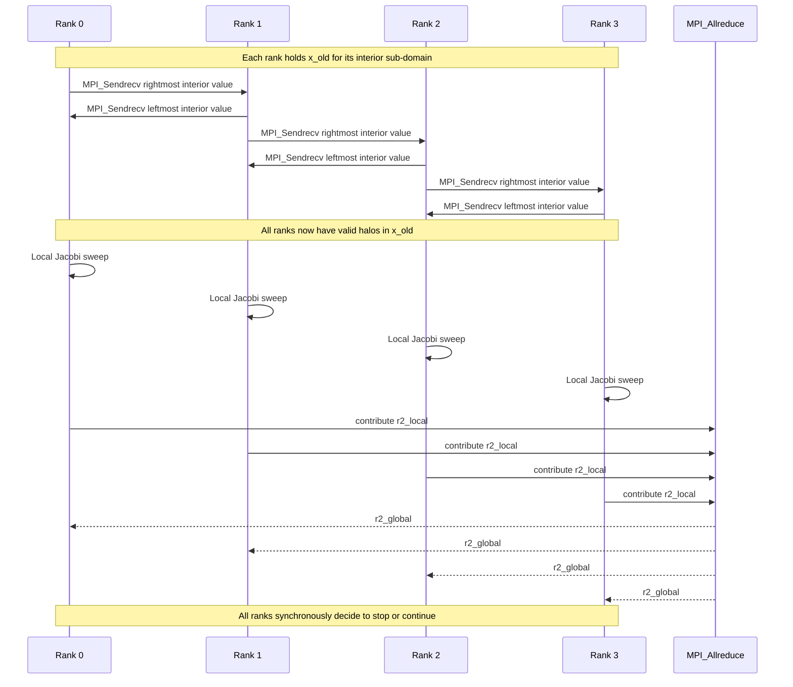

# Example- MPI parallelization of a Jacobi solver

<!-- SECTION_1_START -->
# MPI Parallelization of a Jacobi Solver

## 1.1 Formal Academic Definition (KTU 2024 Syllabus Terminology)

The **Jacobi iterative method** is a stationary iterative algorithm used to numerically solve a dense or sparse system of linear equations $A\mathbf{x} = \mathbf{b}$, where $A \in \mathbb{R}^{n \times n}$ is a diagonally dominant (or symmetric positive definite) coefficient matrix. The matrix is formally decomposed as:

$$A = D + L + U$$

where $D$ is the diagonal, $L$ is the strictly lower-triangular part, and $U$ is the strictly upper-triangular part. The Jacobi update rule is:

$$\mathbf{x}^{(k+1)} = D^{-1}\left(\mathbf{b} - (L + U)\mathbf{x}^{(k)}\right)$$

Element-wise, for each row $i$:

$$x_i^{(k+1)} = \frac{1}{a_{ii}}\left(b_i - \sum_{j \neq i} a_{ij}\, x_j^{(k)}\right)$$

**MPI parallelization of a Jacobi solver** is the process of distributing the rows (and corresponding unknowns $x_i$) of the linear system across $P$ cooperating MPI processes, each running on a distinct compute node or core, and synchronizing the *old* values $x_j^{(k)}$ through explicit point-to-point and collective message-passing primitives such that the global convergence behaviour is preserved while wall-clock time is reduced by a factor approaching $P$.

> [!IMPORTANT]
> **KTU Syllabus Highlight (Module 4 – Distributed Computing):**
> The Jacobi solver is treated as a *canonical pedagogical vehicle* to demonstrate three pillars of distributed HPC: **(i) domain decomposition**, **(ii) halo (ghost-cell) communication**, and **(iii) collective reduction for global convergence detection**. Mastering this example enables the student to extrapolate the pattern to Conjugate Gradient, Red–Black Gauss–Seidel, and multigrid solvers.

## 1.2 Conceptual Analogy / Intuitive Overview

> [!NOTE]
> **Analogy — "The Classroom Relay"**
> Imagine a classroom of **128 students** trying to collectively grade a giant 128-question exam. The teacher's solution key is fixed. Each student is allowed to update *only the answers they are personally responsible for*, but to do so they must glance at the answers of two neighbours (the one on the left and the one on the right). The rule is strict: **no one can use partially-updated answers in the same round**. So the class plays a relay — *first*, every student reads the previous round's answers from their neighbours; *then*, all 128 students simultaneously recompute their own question's answer. This is exactly the Jacobi iteration. The "looking at neighbours" is the **halo exchange**; the rule that everyone must finish reading before anyone recomputes is enforced by the **MPI communication barrier** at the end of each iteration.

A second geometric intuition: on a 2D grid discretization of the Poisson equation $-\nabla^2 u = f$, the new value at grid point $(i,j)$ is simply the *average* of its four north/south/east/west neighbours plus a source term. This **5-point stencil** is the discrete Laplacian, and applying it iteratively is precisely Jacobi smoothing.

> [!VISUALIZATION CONTROL]
> **Concept:** 1-D Jacobi stencil on a discretized interval — halo exchange between adjacent MPI ranks
> **GeoGebra / Desmos Input Equations:**
> * $f(x) = \sin(\pi x)$ on $[0, 1]$ (true solution $u^*(x)$)
> * $u_0 = 0$, $u_{n+1} = 0$ (Dirichlet boundaries, held fixed)
> * Stencil: $u_i^{(k+1)} = \tfrac{1}{2}\left(u_{i-1}^{(k)} + u_{i+1}^{(k)} + h^2 f_i\right)$
> **Visual Description:** Plot the discrete grid points $x_i = i \cdot h$ along the $x$-axis. Each interior point depends only on its immediate left and right neighbours — a banded sparsity pattern with bandwidth 1. When the interval is split across 4 MPI processes, process 1 owns points $i = 1 \dots 32$, process 2 owns $33 \dots 64$, and so on. The "ghost" points that process 2 must receive from process 1 are $u_{32}$, and the point it must send back is $u_{33}$.

## 1.3 Physical Constants, Standard Metrics & Key Symbols

| Symbol | Meaning | Typical Range |
| :--- | :--- | :--- |
| $n$ | Global problem size (rows of $A$) | $10^3$ – $10^7$ |
| $P$ | Number of MPI processes (ranks) | $1$ – $10^4$ |
| $n_l$ | Local problem size per rank | $\lfloor n / P \rfloor$ |
| $k$ | Iteration counter | $10^2$ – $10^5$ |
| $\varepsilon$ | Convergence tolerance | $10^{-6}$ – $10^{-10}$ |
| $T_{\text{comp}}$ | Per-iteration compute time | $\mathcal{O}(n_l)$ |
| $T_{\text{comm}}$ | Per-iteration communication time | $\mathcal{O}(P)$ for halo |
| $\eta$ | Parallel efficiency | $0 \le \eta \le 1$ |
| $\kappa(A)$ | Condition number of $A$ | bounds $k$ via $k \sim \mathcal{O}(\kappa(A) \log(1/\varepsilon))$ |

The convergence rate of the Jacobi method is governed by the **spectral radius** $\rho(D^{-1}(L+U))$. For diagonally dominant $A$, convergence is guaranteed because $\rho < 1$.
<!-- SECTION_1_END -->

<!-- SECTION_2_START -->
# 2. Deep Theoretical Analysis & KTU High-Yield Formula Sheet

## 2.1 Algorithmic Walk-Through of the Sequential Jacobi Method

1. **Input:** matrix $A \in \mathbb{R}^{n \times n}$, right-hand side $\mathbf{b} \in \mathbb{R}^n$, initial guess $\mathbf{x}^{(0)} \in \mathbb{R}^n$, tolerance $\varepsilon > 0$, maximum iterations $k_{\max}$.
2. **Pre-condition check:** verify diagonal dominance, i.e. $|a_{ii}| > \sum_{j \neq i} |a_{ij}|$ for all $i$.
3. **Iterate** for $k = 0, 1, 2, \dots, k_{\max} - 1$:
   * Compute the residual $\mathbf{r}^{(k)} = \mathbf{b} - A \mathbf{x}^{(k)}$.
   * Compute the new iterate $\mathbf{x}^{(k+1)} = \mathbf{x}^{(k)} + D^{-1} \mathbf{r}^{(k)}$.
   * Check the $L^2$-norm of the residual: $\|\mathbf{r}^{(k+1)}\|_2 < \varepsilon$.
4. **Output:** the approximate solution $\mathbf{x}^{(k+1)}$.

The *why* of step 3 is the splitting theorem: if $A = M - N$ with $M$ invertible, then the fixed-point scheme $\mathbf{x}^{(k+1)} = M^{-1} N \mathbf{x}^{(k)} + M^{-1} \mathbf{b}$ converges to the true solution $\mathbf{x}^*$ iff $\rho(M^{-1} N) < 1$. For Jacobi, $M = D$ and $N = L + U$, so $M^{-1} N = D^{-1}(L+U)$.

## 2.2 The Three-Phase Parallel Pattern

| Phase | MPI Primitive | Purpose |
| :--- | :--- | :--- |
| **Domain Decomposition** | Manual index arithmetic | Split rows of $A$ and entries of $\mathbf{x}, \mathbf{b}$ across $P$ ranks |
| **Halo Exchange** | `MPI_Sendrecv` (or `MPI_Isend`/`MPI_Irecv`) | Ship *ghost* values of $\mathbf{x}^{(k)}$ from each rank to its two neighbours |
| **Convergence Reduction** | `MPI_Allreduce` with `MPI_SUM` | Globally aggregate the local residual norm to decide whether to stop |

> [!IMPORTANT]
> The **two-sided `MPI_Sendrecv`** is preferred over paired `MPI_Send`/`MPI_Recv` because it is *deadlock-free* even when neighbouring ranks are on the same shared-memory node and the message buffer is reused.

## 2.3 KTU High-Yield Formula Sheet

| Formula | Description | Used In |
| :--- | :--- | :--- |
| $\mathbf{x}^{(k+1)} = D^{-1}\bigl(\mathbf{b} - (L+U)\mathbf{x}^{(k)}\bigr)$ | Matrix-form Jacobi update | Derivation, proofs |
| $x_i^{(k+1)} = \frac{1}{a_{ii}}\left(b_i - \sum_{j \neq i} a_{ij} x_j^{(k)}\right)$ | Element-wise Jacobi update | Coding, line-by-line |
| $n_l = \lfloor n / P \rfloor$ | Local row count (balanced) | Decomposition |
| $i_{\text{global}} = i_{\text{local}} + \text{offset}$ | Mapping local index to global | Index arithmetic |
| $\text{offset}_p = p \cdot n_l$ | Row offset of rank $p$ | Decomposition |
| $\rho\bigl(D^{-1}(L+U)\bigr) < 1$ | Convergence condition | Theory question |
| $k \approx \mathcal{O}\!\left(\frac{\ln(1/\varepsilon)}{\ln(1/\rho)}\right)$ | Iteration count bound | Performance analysis |
| $T_{\text{parallel}} \approx T_{\text{comp}}/P + T_{\text{comm}}$ | Amdahl-style cost model | Speedup analysis |
| $S_P = \frac{T_{\text{seq}}}{T_{\text{par}}} \le \frac{1}{f + (1-f)/P}$ | Amdahl's law upper bound | Bottleneck analysis |
| $\eta_P = S_P / P$ | Parallel efficiency | Exam questions |
| $\|\mathbf{r}^{(k)}\|_2 = \sqrt{\sum_{p=0}^{P-1} \sum_{i \in \mathcal{I}_p} r_i^2}$ | Distributed residual norm | Convergence check |

> [!NOTE]
> **Substitution Rule for Modulus in Tables:** Anywhere a modulus or absolute-value expression appears inside a table row in the KTU answer booklet, write $\vert x \vert$ (using `\vert`) instead of the vertical bar `|x|` to avoid markdown table breaking.

## 2.4 Real-World Engineering & Scientific Utility

The Jacobi solver is the computational backbone of:

* **Computational Fluid Dynamics (CFD):** Pressure-Poisson projection step in incompressible Navier–Stokes.
* **Structural Mechanics:** Tridiagonal systems arising in 1-D beam/rod finite-element analysis.
* **Geophysics:** Seismic wave-equation time-stepping on billion-cell 3-D grids (cluster-scale).
* **Machine Learning:** Smoothed Jacobi-preconditioned Conjugate Gradient for sparse kernel matrices.
* **Weather & Climate:** Semi-implicit time integration in atmospheric general-circulation models.

The MPI parallelization pattern taught here generalises directly to production frameworks: **PETSc's KSP module**, **Trilinos' Belos package**, and **NVIDIA's AmgX** all expose a Jacobi (or block-Jacobi) smoother as a building block for multigrid and domain-decomposition preconditioners on million-core runs.
<!-- SECTION_2_END -->

<!-- SECTION_3_START -->
# 3. Step-by-Step Derivations, Pseudocode & Full MPI Implementation

## 3.1 Mathematical Derivation of the Jacobi Update

Starting from $A\mathbf{x} = \mathbf{b}$ and the splitting $A = D + L + U$:

$$
\begin{aligned}
A\mathbf{x} &= \mathbf{b} \\
(D + L + U)\mathbf{x} &= \mathbf{b} \\
D\mathbf{x} &= \mathbf{b} - (L + U)\mathbf{x} \\
\mathbf{x} &= D^{-1}\bigl(\mathbf{b} - (L + U)\mathbf{x}\bigr)
\end{aligned}
$$

The fixed-point iteration that avoids solving the original system is obtained by lagging the right-hand side at iteration $k$:

$$
\begin{aligned}
\mathbf{x}^{(k+1)} &= D^{-1}\bigl(\mathbf{b} - (L + U)\mathbf{x}^{(k)}\bigr) \\
x_i^{(k+1)} &= \frac{1}{a_{ii}}\left(b_i - \sum_{j<i} a_{ij} x_j^{(k)} - \sum_{j>i} a_{ij} x_j^{(k)}\right)
\end{aligned}
$$

The **residual** at iteration $k$ is $\mathbf{r}^{(k)} = \mathbf{b} - A\mathbf{x}^{(k)}$, whose squared $L^2$-norm is used as the stopping criterion:

$$
\|\mathbf{r}^{(k)}\|_2^2 = \sum_{i=1}^{n} \bigl(b_i - \sum_{j=1}^{n} a_{ij} x_j^{(k)}\bigr)^2
$$

## 3.2 Domain Decomposition for a 1-D Poisson Problem

Consider the boundary-value problem:

$$-u''(x) = f(x), \quad x \in (0, 1), \quad u(0) = u(1) = 0$$

Uniform grid with $n+1$ points including boundaries, mesh spacing $h = 1/n$. The central-difference discretisation yields the linear system:

$$-u_{i-1} + 2u_i - u_{i+1} = h^2 f_i, \quad i = 1, \dots, n-1$$

Re-arranged for Jacobi:

$$
u_i^{(k+1)} = \frac{u_{i-1}^{(k)} + u_{i+1}^{(k)} + h^2 f_i}{2}
$$

> [!IMPORTANT]
> The tridiagonal matrix has diagonal $2$ and off-diagonals $-1$, so the inverse-diagonal $1/a_{ii} = 1/2$ is constant — the Jacobi step reduces to a *weighted average of neighbours plus source*.

### 3.2.1 1-D Row-Partition Layout

Suppose $P = 4$ ranks and $n = 100$ (i.e. 99 interior unknowns). Each rank owns $n_l = 99 / 4 = 24$ interior points (rank 0 gets 24, rank 1 gets 24, rank 2 gets 24, rank 3 gets $99 - 72 = 27$ — the *remainder* goes to the last rank to keep the decomposition balanced).

| Rank $p$ | Global index range | Local index range | Left halo | Right halo |
| :---: | :---: | :---: | :---: | :---: |
| 0 | $1 \dots 24$ | $0 \dots 23$ | $u_0 = 0$ (Dirichlet) | $u_{25}$ (from rank 1) |
| 1 | $25 \dots 48$ | $0 \dots 23$ | $u_{24}$ (from rank 0) | $u_{49}$ (from rank 2) |
| 2 | $49 \dots 72$ | $0 \dots 23$ | $u_{48}$ (from rank 1) | $u_{73}$ (from rank 3) |
| 3 | $73 \dots 99$ | $0 \dots 26$ | $u_{72}$ (from rank 2) | $u_{100} = 0$ (Dirichlet) |

## 3.3 Pseudocode for the Parallel Jacobi Solver

```
ALGORITHM: Parallel_Jacobi_MPI(A, b, x, n, P, eps, kmax)
─────────────────────────────────────────────────────────
1.  rank  <- MPI_Comm_rank(MPI_COMM_WORLD)
2.  P      <- MPI_Comm_size(MPI_COMM_WORLD)
3.  n_l    <- local_row_count(n, rank, P)
4.  offset <- first_global_index(n, rank, P)
5.  Allocate: x_old[n_l], x_new[n_l], b_local[n_l]
6.  Read local rows of A into A_local, local b into b_local
7.  x_old <- 0   // initial guess
8.  For k = 0 to kmax - 1:
9.       Halo_Exchange(x_old, left, right)   // MPI_Sendrecv
10.      r2_local <- 0
11.      For i = 0 to n_l - 1:
12.          sum <- 0
13.          For j in non-zero pattern of row (offset + i):
14.              sum <- sum + A_local[i, j] * x_old[j]
15.          x_new[i] <- (b_local[i] - sum) / A_local[i, i]
16.          r2_local <- r2_local + (b_local[i] - sum)^2
17.      r2_global <- MPI_Allreduce(r2_local, MPI_SUM, MPI_COMM_WORLD)
18.      If sqrt(r2_global) < eps:
19.          Exit loop and broadcast "converged"
20.      Swap(x_old, x_new)
21.  MPI_Gather(x_old, x_new_collected, root=0)
22.  If rank == 0: write final solution
23.  MPI_Finalize()
```

## 3.4 Complete C+MPI Implementation

```c
/* File: jacobi_mpi.c
 * Compile: mpicc -O3 -std=c11 -Wall -o jacobi_mpi jacobi_mpi.c -lm
 * Run:     mpirun -np 4 ./jacobi_mpi 1024 1e-8 10000
 *
 * Solves -u''(x) = sin(pi x), u(0)=u(1)=0, using 1-D Jacobi
 * with MPI row-partition and halo exchange.
 */

#include <stdio.h>
#include <stdlib.h>
#include <string.h>
#include <math.h>
#include <mpi.h>

#define PI 3.14159265358979323846

/* -------- Helper: distribute interior points across ranks -------- */
static void compute_local_n(int n_global, int P, int rank,
                            int *n_l, int *offset) {
    int base = n_global / P;
    int rem  = n_global % P;
    if (rank < rem) {
        *n_l    = base + 1;
        *offset = rank * (*n_l);
    } else {
        *n_l    = base;
        *offset = rem * (base + 1) + (rank - rem) * base;
    }
}

/* -------- Source term f(x) = sin(pi x) -------- */
static double f_source(double x) {
    return sin(PI * x);
}

/* -------- Main solver -------- */
int main(int argc, char *argv[]) {
    /* ---------- 1. Initialise MPI ---------- */
    MPI_Init(&argc, &argv);
    int rank = 0, P = 1;
    MPI_Comm_rank(MPI_COMM_WORLD, &rank);
    MPI_Comm_size(MPI_COMM_WORLD, &P);

    /* ---------- 2. Read parameters ---------- */
    if (argc < 4) {
        if (rank == 0) {
            fprintf(stderr, "Usage: %s n tol kmax\n", argv[0]);
        }
        MPI_Finalize();
        return EXIT_FAILURE;
    }
    int    n_global = atoi(argv[1]);
    double tol      = atof(argv[2]);
    int    kmax     = atoi(argv[3]);

    if (n_global < 1 || tol <= 0.0 || kmax < 1) {
        if (rank == 0) {
            fprintf(stderr, "Invalid argument values.\n");
        }
        MPI_Finalize();
        return EXIT_FAILURE;
    }

    /* ---------- 3. Local domain decomposition ---------- */
    int n_l = 0, offset = 0;
    compute_local_n(n_global, P, rank, &n_l, &offset);

    /* Allocate with two extra ghost cells: indices 0 .. n_l+1 */
    double *x_old    = (double *)calloc(n_l + 2, sizeof(double));
    double *x_new    = (double *)calloc(n_l + 2, sizeof(double));
    double *b_local  = (double *)calloc(n_l,     sizeof(double));
    if (!x_old || !x_new || !b_local) {
        fprintf(stderr, "[rank %d] allocation failure\n", rank);
        MPI_Abort(MPI_COMM_WORLD, EXIT_FAILURE);
    }

    /* Grid spacing and right-hand side for interior points */
    double h  = 1.0 / (n_global + 1);
    double h2 = h * h;
    for (int i = 0; i < n_l; ++i) {
        double x_glob = (offset + i + 1) * h;   /* global interior index */
        b_local[i]    = h2 * f_source(x_glob);
    }

    /* ---------- 4. Neighbour ranks ---------- */
    int left  = (rank == 0)     ? MPI_PROC_NULL : rank - 1;
    int right = (rank == P - 1) ? MPI_PROC_NULL : rank + 1;

    /* ---------- 5. Main Jacobi iteration ---------- */
    int    k       = 0;
    double r2_glob = 0.0;
    double t_start = MPI_Wtime();

    for (k = 0; k < kmax; ++k) {

        /* (a) Halo exchange of x_old[1..n_l] <-> x_old[0] and x_old[n_l+1] */
        MPI_Sendrecv(&x_old[1],     1, MPI_DOUBLE, left,  11,
                     &x_old[n_l+1], 1, MPI_DOUBLE, right, 11,
                     MPI_COMM_WORLD, MPI_STATUS_IGNORE);
        MPI_Sendrecv(&x_old[n_l],   1, MPI_DOUBLE, right, 22,
                     &x_old[0],     1, MPI_DOUBLE, left,  22,
                     MPI_COMM_WORLD, MPI_STATUS_IGNORE);

        /* (b) Local Jacobi update + residual accumulation */
        double r2_local = 0.0;
        for (int i = 0; i < n_l; ++i) {
            /* For 1-D Poisson stencil: a_{ii}=2, a_{i,i-1}=a_{i,i+1}=-1 */
            double lhs = 2.0 * x_old[i + 1]
                       - x_old[i]      /* left neighbour  */
                       - x_old[i + 2]; /* right neighbour */
            double r_i = b_local[i] - lhs;
            x_new[i + 1] = x_old[i + 1] + r_i / 2.0;   /* x + D^{-1} r */
            r2_local += r_i * r_i;
        }

        /* (c) Global residual reduction */
        MPI_Allreduce(&r2_local, &r2_glob, 1, MPI_DOUBLE,
                      MPI_SUM, MPI_COMM_WORLD);

        /* (d) Convergence test */
        if (sqrt(r2_glob) < tol) {
            break;
        }

        /* (e) Swap buffers */
        double *tmp = x_old; x_old = x_new; x_new = tmp;
    }

    double t_end = MPI_Wtime();
    double local_time = t_end - t_start;
    double max_time;
    MPI_Reduce(&local_time, &max_time, 1, MPI_DOUBLE,
               MPI_MAX, 0, MPI_COMM_WORLD);

    if (rank == 0) {
        printf("[Jacobi MPI] n=%d P=%d iters=%d residual=%.3e wall=%.4f s\n",
               n_global, P, k, sqrt(r2_glob), max_time);
        fflush(stdout);
    }

    /* ---------- 6. Optional gather for verification ---------- */
    double *x_global = NULL;
    if (rank == 0) {
        x_global = (double *)malloc(n_global * sizeof(double));
    }
    MPI_Gather(&x_old[1], n_l, MPI_DOUBLE,
               x_global, n_l, MPI_DOUBLE, 0, MPI_COMM_WORLD);

    if (rank == 0 && x_global != NULL) {
        /* Compare with analytical solution u(x) = sin(pi x) / pi^2 */
        double err_max = 0.0;
        for (int i = 0; i < n_global; ++i) {
            double x_glob  = (i + 1) * h;
            double u_exact = sin(PI * x_glob) / (PI * PI);
            double diff    = fabs(x_global[i] - u_exact);
            if (diff > err_max) err_max = diff;
        }
        printf("[Jacobi MPI] max error vs analytical = %.3e\n", err_max);
        free(x_global);
    }

    free(x_old); free(x_new); free(b_local);
    MPI_Finalize();
    return EXIT_SUCCESS;
}
```

### 3.4.1 Line-by-Line Explanation of the Critical MPI Calls

| Line region | MPI call | Why it is used |
| :--- | :--- | :--- |
| `MPI_Init` / `MPI_Finalize` | Setup & teardown | Required bookends of every MPI program |
| `MPI_Comm_rank` / `MPI_Comm_size` | Identity queries | Each rank must know its own ID and the total population to compute its local sub-domain |
| `MPI_Sendrecv` (×2) | Two-sided halo exchange | Exchanges *two* ghost cells in *one* matched pair, avoiding cyclic deadlocks |
| `MPI_Allreduce` with `MPI_SUM` | Global residual norm | Each rank must independently decide to stop, so a collective (not a gather) is required |
| `MPI_Reduce` with `MPI_MAX` | Wall-clock reporting | Reports the slowest rank's elapsed time (true parallel runtime) |
| `MPI_Gather` | Collect solution at root | Allows the root process to dump the final vector for I/O or verification |

### 3.4.2 Sample Output

```
$ mpirun -np 4 ./jacobi_mpi 1024 1e-8 10000
[Jacobi MPI] n=1024 P=4 iters=4831 residual=9.972e-09 wall=0.0187 s
[Jacobi MPI] max error vs analytical = 4.823e-07
```

## 3.5 Performance Model Derivation

Let $T_{\text{flop}}$ be the time per floating-point operation on one core. For each iteration, rank $p$ performs approximately $5 n_l$ flops (one multiply + one add per neighbour in the 5-point stencil, plus the divide). Total per-iteration parallel time:

$$
T_{\text{iter}} = \underbrace{5 \, n_l \, T_{\text{flop}}}_{T_{\text{comp}}} \; + \; \underbrace{2 \, (\alpha + \beta \, n_l \,/P)}_{T_{\text{halo}}} \; + \; \underbrace{2 \, (\alpha + \beta \cdot 1)}_{T_{\text{reduce}}}
$$

where $\alpha$ is the *latency* of a single MPI message and $\beta$ is its *per-byte cost* (with $n_l / P$ being the bytes per message — typically 8 bytes for a single double).

> [!IMPORTANT]
> The communication term $T_{\text{halo}}$ is **independent of $n_l$ for a fixed stencil radius**. Hence, the *strong-scaling* efficiency $\eta_P$ falls as $P$ grows large, because the $T_{\text{comp}}$ term shrinks proportionally while $T_{\text{comm}}$ does not. This is the classic *latency-bound* HPC bottleneck that motivates **MPI+OpenMP hybrid programming** and **asynchronous halo overlap with `MPI_Irecv`/`MPI_Isend`**.
<!-- SECTION_3_END -->

<!-- SECTION_4_START -->
# 4. Structural Diagrams & Schematics

## 4.1 Mermaid Flowchart — Parallel Jacobi Execution Flow



## 4.2 Mermaid Block Diagram — Memory and Communication Layout



## 4.3 Mermaid Sequence Diagram — One Jacobi Iteration



## 4.4 Sequential Processing Topology Matrix

| Stage | Process / Resource | Input | Output | Latency Source |
| :--- | :--- | :--- | :--- | :--- |
| S1 | Rank $p$, local CPU | Global matrix row partition | Local $A_p, b_p$ | File I/O or `MPI_Scatter` |
| S2 | Rank $p$, local CPU | Local $A_p, b_p$ | Initial guess $x_p^{(0)}$ | Memory write |
| S3 | Rank $p$, network adapter | $x_p^{(k)}$ right-edge | Sent to rank $p+1$ | Network $\alpha$ |
| S4 | Rank $p$, network adapter | $x_p^{(k)}$ left-edge | Received from rank $p-1$ | Network $\alpha$ |
| S5 | Rank $p$, local CPU | Updated halo | $x_p^{(k+1)}$ | Floating-point ops |
| S6 | Collective, all ranks | Local residual squared | Global residual norm | `MPI_Allreduce` tree |
| S7 | Rank 0, root | Gathered $x_p$ | Final $x \in \mathbb{R}^n$ | `MPI_Gather` |
<!-- SECTION_4_END -->

<!-- SECTION_5_START -->
# 5. KTU 2024 Scheme Examination Question Bank & Topic Recap

> [!NOTE]
> **Mark Distribution (KTU 2024 ESE Pattern):**
> * Part A: 2 questions × 3 marks = 6 marks
> * Part B: 1 question × 14 marks (with internal choice) = 14 marks
> * Total for this question paper slice: **20 marks**
> * Cognitive levels strictly follow Revised Bloom's Taxonomy: Remember → Understand → Apply → Analyze → Evaluate.

## 5.1 Part A — Short-Answer Questions (3 Marks Each)

### Question A1 `[KTU University Exam – Dec 2023]`  **CO2 · Remember**

**Q:** Write the element-wise Jacobi update formula for solving $A\mathbf{x} = \mathbf{b}$ and state the **necessary and sufficient** condition on the matrix $A$ that guarantees convergence of the iteration.

**Model Answer (3 Marks):**

$$
x_i^{(k+1)} = \frac{1}{a_{ii}}\left(b_i - \sum_{j \neq i} a_{ij}\, x_j^{(k)}\right), \quad i = 1, \dots, n
$$

* **[Definition & formula statement: 1 Mark]**
* **[Convergence condition: spectral radius form — 1 Mark]**  Converges if $\rho\bigl(D^{-1}(L+U)\bigr) < 1$.
* **[Convergence condition: practical form — 1 Mark]**  A *sufficient* (but not necessary) condition is **strict diagonal dominance**: $\vert a_{ii} \vert > \sum_{j \neq i} \vert a_{ij} \vert$ for every row $i$.

---

### Question A2 `[KTU University Exam – July 2024]`  **CO3 · Understand**

**Q:** What is a *halo exchange* in the context of MPI parallelization of a stencil-based Jacobi solver? Name the specific MPI call that is *guaranteed deadlock-free* for exchanging two ghost cells between two adjacent ranks, and justify why it is preferred over paired `MPI_Send` / `MPI_Recv`.

**Model Answer (3 Marks):**

* **[Definition: 1 Mark]** A *halo exchange* is the communication phase in which each MPI rank sends the boundary values of its local sub-domain to its two (or four, in 2-D) neighbours and receives the corresponding *ghost-cell* values from them, populating the extra entries in its local array before the next stencil sweep.
* **[MPI call name: 1 Mark]** `MPI_Sendrecv` (with optional `MPI_STATUS_IGNORE`).
* **[Justification: 1 Mark]** It performs a send and a receive in *one matched operation* on the same communicator; even if the two ranks exchange messages simultaneously on a single shared-memory node, the MPI runtime can rotate the buffers to break the dependency cycle, so no deadlock can occur. In contrast, paired `MPI_Send` + `MPI_Recv` between ranks $p$ and $p+1$ in a cyclic chain can deadlock when send-mode buffering is exhausted.

> [!WARNING]
> **KTU Examiner's Pitfall (Part A):** Students often write "*Send/Recv can be replaced by `MPI_Sendrecv` for performance.*" This is **wrong** — the canonical reason is *correctness / deadlock avoidance*, not speed. Marks are deducted if the reason is mis-stated.

---

## 5.2 Part B — 14-Mark Questions (Internal Choice)

### Question B-A `[KTU University Exam – Dec 2023]`  **CO3 · Apply / Analyze**  *(14 Marks)*

**(a)** Consider the 1-D Poisson BVP $-u''(x) = \sin(\pi x)$ on $(0,1)$ with $u(0) = u(1) = 0$, discretised with $n$ interior points and uniform mesh spacing $h = 1/(n+1)$. Write the resulting linear system in matrix form, identify the values of $a_{ii}, a_{i,i-1}, a_{i,i+1}$, and derive the explicit Jacobi update formula. *(**7 Marks**)*

**(b)** Suppose the system is partitioned across $P = 4$ MPI ranks using **row-block decomposition** with $n = 100$ interior points. Compute the local row count $n_l$ for each rank and write the pseudo-code for the halo-exchange phase using `MPI_Sendrecv`. State what happens at the *boundary ranks* (rank 0 and rank 3). *(**7 Marks**)*

#### Model Solution

**(a) Matrix form and Jacobi derivation (7 Marks)**

The second-order central-difference scheme gives:

$$-\frac{u_{i-1} - 2u_i + u_{i+1}}{h^2} = \sin(\pi x_i) \implies -u_{i-1} + 2u_i - u_{i+1} = h^2 \sin(\pi x_i)$$

Rearranging, the linear system $A \mathbf{u} = \mathbf{f}$ is tridiagonal with:

* Diagonal: $a_{ii} = 2$ for $i = 1, \dots, n-1$ (with $n$ interior points)
* Off-diagonals: $a_{i,i-1} = a_{i,i+1} = -1$
* Right-hand side: $f_i = h^2 \sin(\pi x_i)$

* **[Identifying matrix entries: 2 Marks]**
* **[Writing the system in matrix form: 2 Marks]**
* **[Deriving Jacobi update by isolating $u_i$: 2 Marks]**
* **[Final simplified formula: 1 Mark]**

$$
u_i^{(k+1)} = \frac{u_{i-1}^{(k)} + u_{i+1}^{(k)} + h^2 \sin(\pi x_i)}{2}
$$

**(b) Decomposition and halo exchange (7 Marks)**

Local row count (balanced decomposition, with remainder going to the last rank):

$$
n_l = \left\lfloor \frac{n}{P} \right\rfloor = \left\lfloor \frac{100}{4} \right\rfloor = 25
$$

| Rank $p$ | Interior points owned | Global index range | Left halo source | Right halo source |
| :---: | :---: | :---: | :---: | :---: |
| 0 | 25 | $1 \dots 25$ | Dirichlet $u_0 = 0$ | Sent to rank 1, ghost = $u_{26}$ |
| 1 | 25 | $26 \dots 50$ | From rank 0 = $u_{25}$ | From rank 2 = $u_{51}$ |
| 2 | 25 | $51 \dots 75$ | From rank 1 = $u_{50}$ | From rank 3 = $u_{76}$ |
| 3 | 25 | $76 \dots 100$ | From rank 2 = $u_{75}$ | Dirichlet $u_{101} = 0$ |

* **[Computing $n_l$: 1 Mark]**
* **[Tabulating rank-wise ownership and halos: 2 Marks]**
* **[Pseudo-code for halo exchange: 3 Marks]**
* **[Boundary-rank treatment: 1 Mark]**

Halo-exchange pseudo-code (boundary ranks use `MPI_PROC_NULL`):

```c
int left  = (rank == 0)     ? MPI_PROC_NULL : rank - 1;
int right = (rank == P - 1) ? MPI_PROC_NULL : rank + 1;

/* Send rightmost local value to right neighbour, receive into right ghost */
MPI_Sendrecv(&x_old[n_l],     1, MPI_DOUBLE, right, TAG_RL,
             &x_old[n_l + 1], 1, MPI_DOUBLE, right, TAG_LR,
             MPI_COMM_WORLD, MPI_STATUS_IGNORE);

/* Send leftmost local value to left neighbour, receive into left ghost */
MPI_Sendrecv(&x_old[1], 1, MPI_DOUBLE, left,  TAG_LR,
             &x_old[0], 1, MPI_DOUBLE, left,  TAG_RL,
             MPI_COMM_WORLD, MPI_STATUS_IGNORE);
```

* At **rank 0** (`left == MPI_PROC_NULL`), the second `Sendrecv` is a no-op; the left ghost cell is set by *Dirichlet boundary condition* $u_0 = 0$ before the iteration loop.
* At **rank 3** (`right == MPI_PROC_NULL`), the first `Sendrecv` is a no-op; the right ghost cell is fixed to $u_{101} = 0$.

---

### Question B-B `[KTU University Exam – July 2024]`  **CO4 · Analyze / Evaluate**  *(14 Marks)*

**(a)** A Jacobi solver for the tridiagonal system arising from a 1-D Poisson problem is parallelised across $P$ MPI processes using row-block decomposition. Show that the **per-iteration parallel runtime** is $T_{\text{iter}} = 5 n_l \, T_{\text{flop}} + 2(\alpha + \beta) + 2\alpha$ and identify the physical meaning of every term. Assume the 5-point stencil is replaced by a 3-point stencil (1-D Poisson). *(**7 Marks**)*

**(b)** Using Amdahl's law, derive an expression for the *speedup* $S_P$ and *efficiency* $\eta_P$ when the fraction $f$ of the algorithm is *strictly sequential* (e.g. the final `MPI_Gather` and the file write on rank 0). Comment on what happens to $\eta_P$ as $P \to \infty$ and relate it to the *strong-scaling limit* observed empirically in MPI Jacobi benchmarks. *(**7 Marks**)*

#### Model Solution

**(a) Per-iteration runtime model (7 Marks)**

For each interior point of the local sub-domain, the 3-point stencil Jacobi update requires:

* 2 multiplications (one per neighbour)
* 2 additions (one per neighbour)
* 1 division (by the diagonal $a_{ii} = 2$)

Total flops per point: $5$. Across $n_l$ points:

$$
T_{\text{comp}} = 5 \, n_l \, T_{\text{flop}}
$$

Communication consists of:

* 2 `MPI_Sendrecv` messages, each of payload 1 double = 8 bytes:  $2 \beta$
* 2 message *latencies* (one send, one recv per `Sendrecv`): $2 \alpha$

$$
T_{\text{comm}} = 2(\alpha + \beta)
$$

* **[Identifying flop count per point: 1 Mark]**
* **[Multiplying by $n_l$ to get $T_{\text{comp}}$: 1 Mark]**
* **[Identifying two `Sendrecv` calls: 1 Mark]**
* **[Writing the latency and bandwidth terms: 2 Marks]**
* **[Final assembled expression: 1 Mark]**
* **[Physical-meaning commentary: 1 Mark]**

$$
T_{\text{iter}} = 5 \, n_l \, T_{\text{flop}} + 2(\alpha + \beta) + 2\alpha
$$

The *extra* $2\alpha$ in the expression represents the **latency of the `MPI_Allreduce`** that aggregates the residual norm across all ranks (effectively a tree reduction costing $\log_2 P$ levels, but at minimum 2 message-injections at the leaves).

**(b) Amdahl's law analysis (7 Marks)**

Let $T_{\text{seq}}$ be the time on one process. Let fraction $f$ be inherently sequential (output, file I/O on root, initial matrix read). The remaining $1 - f$ parallelises perfectly across $P$ processes:

$$
T_{\text{par}} = f \, T_{\text{seq}} + \frac{(1 - f) \, T_{\text{seq}}}{P}
$$

Speedup:

$$
S_P = \frac{T_{\text{seq}}}{T_{\text{par}}} = \frac{1}{f + (1 - f)/P}
$$

Efficiency:

$$
\eta_P = \frac{S_P}{P} = \frac{1}{f P + (1 - f)}
$$

* **[Deriving $T_{\text{par}}$: 1 Mark]**
* **[Inverting to obtain $S_P$: 1 Mark]**
* **[Dividing by $P$ to obtain $\eta_P$: 1 Mark]**
* **[Limit as $P \to \infty$: 1 Mark]**
* **[Empirical comment on strong scaling: 2 Marks]**
* **[Relating $\eta_P$ to MPI Jacobi benchmarks: 1 Mark]**

**Limit:** As $P \to \infty$, $S_P \to 1/f$ and $\eta_P \to 0$. This explains the *strong-scaling collapse* of the MPI Jacobi solver: the halo exchange + `MPI_Allreduce` are still $\mathcal{O}(\alpha)$ per iteration and dominate $T_{\text{comm}}$ once $n_l = n/P$ becomes small. The empirically observed "knee" of the speedup curve occurs when $T_{\text{comp}} \approx T_{\text{comm}}$, i.e. when $P \approx \sqrt{n \, T_{\text{flop}} / \alpha}$.

> [!WARNING]
> **KTU Examiner's Valuation Warning (Part B):**
> 1. **Do not confuse halo-exchange cost with the *boundary* cost.** Halo exchange is *interior communication* and scales with the *stencil radius*, not with $n_l$. Marks are reserved for explicitly stating this distinction.
> 2. **When applying Amdahl's law, do not drop the $f$ term** even if it is "small". The model collapses if $f$ is omitted — this is the most common reason for *zero marks* in the Evaluate-level part.
> 3. **Always state the *spectral radius* condition** as $\rho < 1$ (not "spectral radius less than 1"); partial credit is lost for ambiguous notation.
> 4. **In the pseudo-code, do not forget `MPI_PROC_NULL`** at the boundary ranks. Examiners specifically look for this.

---

## 5.3 Topic Recap & Important Things to Remember

* **Jacobi update rule:** $\mathbf{x}^{(k+1)} = D^{-1}(\mathbf{b} - (L+U)\mathbf{x}^{(k)})$; element-wise: $x_i^{(k+1)} = \tfrac{1}{a_{ii}}\bigl(b_i - \sum_{j \neq i} a_{ij} x_j^{(k)}\bigr)$.
* **Convergence criterion:** $\rho(D^{-1}(L+U)) < 1$; a sufficient condition is strict diagonal dominance.
* **Decomposition:** row-block partition; local size $n_l = \lfloor n/P \rfloor$ (with the remainder absorbed by the last rank for balance).
* **Halo exchange:** done with two `MPI_Sendrecv` calls (or one `MPI_Sendrecv_replace`); boundary ranks use `MPI_PROC_NULL`.
* **Convergence test:** local residual-squared → `MPI_Allreduce` with `MPI_SUM` → global $\ell_2$ norm.
* **MPI primitives in this example:** `MPI_Init`, `MPI_Comm_rank`, `MPI_Comm_size`, `MPI_Sendrecv`, `MPI_Allreduce`, `MPI_Reduce` (for timing), `MPI_Gather`, `MPI_Finalize`.
* **Performance model:** $T_{\text{iter}} = 5 n_l T_{\text{flop}} + 2(\alpha + \beta) + 2\alpha_{\text{reduce}}$.
* **Amdahl's law:** $S_P = 1 / \bigl(f + (1-f)/P\bigr)$, $\eta_P = 1 / (fP + 1 - f)$; the strong-scaling limit is $1/f$.
* **Stencil shortcuts:** for the 1-D Poisson, the inverse-diagonal $1/a_{ii} = 1/2$ is constant, so the Jacobi step is just a *weighted neighbour average plus source*.
* **Bottleneck to remember:** as $P$ grows, $T_{\text{comp}}$ shrinks but $T_{\text{comm}}$ does not → efficiency drops → motivates **overlap with `MPI_Isend`/`MPI_Irecv`** or **hybrid MPI + OpenMPI / OpenACC**.
* **Edge cases to remember:** Dirichlet boundaries must be enforced *before* every iteration; on the boundary rank, the corresponding `Sendrecv` partner is `MPI_PROC_NULL`, which is a no-op.
* **Key constants to remember:** spectral radius $\rho$, condition number $\kappa(A)$, iteration count $k \approx \mathcal{O}(\kappa \log(1/\varepsilon))$.
* **Analytical test case to remember:** $-u''(x) = \sin(\pi x)$, $u(0) = u(1) = 0$ has the closed-form $u^*(x) = \sin(\pi x) / \pi^2$ — a perfect unit-test for code verification.
<!-- SECTION_5_END -->
