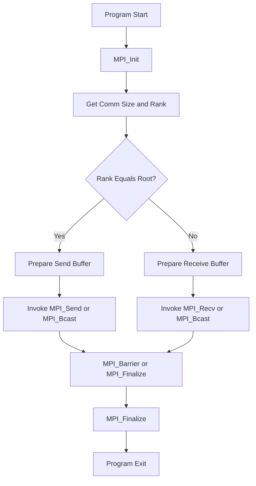
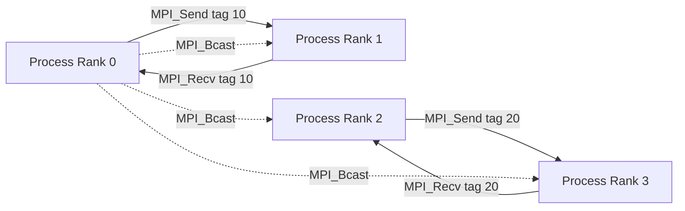
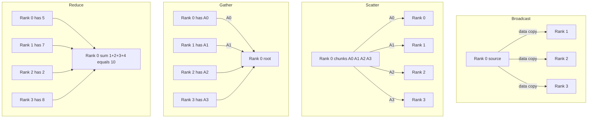
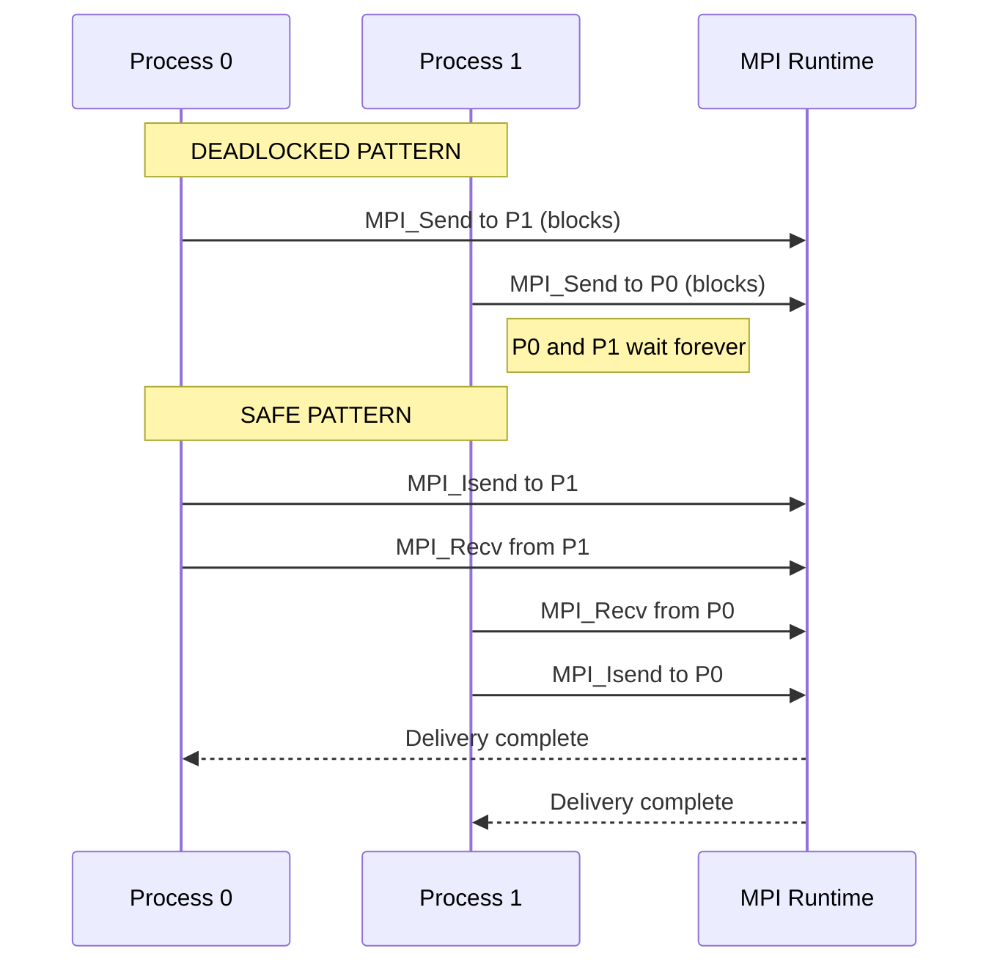

# Message passing

<!-- SECTION_1_START -->
# Message Passing in High Performance Computing

## 1. Core Technical Definition & Intuitive Overview

### Formal Definition
**Message Passing** is a fundamental communication paradigm in distributed and parallel computing where independent processes executing on different (or the same) processing units exchange data through explicit **send** and **receive** operations over a communication network. Each process has its own private memory address space, and data is shared by *explicitly* packaging it into messages and transmitting it through an interconnect — there is no implicit shared memory. The de-facto standard implementing this paradigm is the **Message Passing Interface (MPI)**, a language-independent communication protocol standardized by the MPI Forum.

> [!IMPORTANT]
> **KTU 2024 Syllabus Focus (Module 4 – Distributed):**
> Understand the message passing model, primitives, point-to-point and collective communication, blocking/non-blocking semantics, communication modes, and basic MPI programming constructs.

### Conceptual Analogy / Intuition
Imagine a large office where employees (processes) work in separate private rooms (local memory). There are no shared whiteboards. If employee A wants to share a report with employee B, A must **write the report on paper** (serialize the data), **hand it to the office messenger** (the network fabric), and B must **explicitly accept it at their door** (the receive call). If two employees try to hand each other papers at the same time in a narrow corridor — nobody moves — that is a classic **deadlock**.

> [!NOTE]
> **Key Characteristics of Message Passing**
> - **Distributed memory model** – no global address space.
> - **Explicit synchronization** via send/receive primitives.
> - **Scalable** to thousands of nodes (used in TOP500 supercomputers).
> - **Explicit data marshalling** – sender and receiver must agree on *type* and *tag*.

### Physical Constants / Standard Metrics
- **MPI Standard versions:** **MPI 1.0 (1994)**, **MPI 2.0 (1997)**, **MPI 3.0 (2012)**, **MPI 4.0 (2021)**.
- **Default buffer size** in many MPI implementations: **~16 384 bytes** for eager sending.
- **Latency** of modern interconnects (InfiniBand HDR): **~1–2 microseconds**.
- **Bandwidth** (InfiniBand HDR): **~200 Gbps**.

> [!VISUALIZATION CONTROL]
> **Concept:** Conceptual model of distributed processes communicating via a network
> **Diagram Description:** Four boxes labelled $P_0$, $P_1$, $P_2$, $P_3$ representing processes, each with their own private memory rectangle. They are connected through a central *Interconnect / Network* bus. A curved arrow shows $P_0$ sending a message $M$ to $P_2$ across the bus; another arrow shows $P_1$ receiving from $P_3$.

---

## 2. Deep Theoretical Analysis & KTU High-Yield Formula Sheet

### 2.1 The Message Passing Model — Step-by-Step

1. **Process Spawning** – A launcher (e.g., `mpirun`, `mpiexec`) starts $N$ independent processes, each with a unique integer **rank** in $[0, N-1]$.
2. **Communicator Creation** – Every process joins a **communicator** (default: `MPI_COMM_WORLD`), which defines the *group* and *context* for safe message routing.
3. **Point-to-Point Transfer** – One process invokes a send; another invokes a matching receive. The MPI runtime matches them using three identifiers: **rank**, **tag**, and **communicator**.
4. **Collective Operations** – All processes in a communicator cooperate to perform reductions, broadcasts, scatter/gather, etc.
5. **Synchronization / Termination** – `MPI_Finalize()` cleanly shuts down the MPI runtime.

> [!NOTE]
> **Why explicit message passing?**
> - In **shared memory** (OpenMP), cores share caches and bus — scaling beyond a single node is hard.
> - In **distributed memory** (MPI), each node has independent RAM, connected by a network — scaling to **millions of cores** is feasible (e.g., Frontier, Fugaku).

### 2.2 Communication Modes (CRITICAL for KTU)

| Mode | Function | Blocking? | Completion Condition |
|------|----------|-----------|----------------------|
| **Standard** | `MPI_Send` | Yes | Buffer may be reused *after* call returns — message may still be in transit |
| **Buffered** | `MPI_Bsend` | Yes | Message is copied into a user-provided buffer; returns once copied |
| **Synchronous** | `MPI_Ssend` | Yes | Returns only when the matching receive has *started* |
| **Ready** | `MPI_Rsend` | Yes | User *guarantees* the receive has already been posted |
| **Non-Blocking** | `MPI_Isend` / `MPI_Irecv` | No | Returns immediately; a later `MPI_Wait`/`MPI_Test` checks completion |

### 2.3 Point-to-Point vs Collective Communication

- **Point-to-Point:** Communication between a *specific pair* of processes (`MPI_Send`, `MPI_Recv`).
- **Collective:** Communication involving *all* processes of a communicator. Always **synchronizing** in the sense that all members must call the collective.

| Category | Example MPI Functions |
|----------|-----------------------|
| **Synchronization** | `MPI_Barrier` |
| **Data Movement** | `MPI_Bcast`, `MPI_Scatter`, `MPI_Gather`, `MPI_Allgather`, `MPI_Alltoall` |
| **Reduction** | `MPI_Reduce`, `MPI_Allreduce`, `MPI_Reduce_scatter` |

### 2.4 Deadlock — The Most-Tested Concept

A **deadlock** occurs when two or more processes are each waiting for an event that only another can trigger.

> [!WARNING]
> **Common Deadlock Scenario in KTU Papers:**
> If process 0 calls `MPI_Send` then `MPI_Recv`, and process 1 also calls `MPI_Send` then `MPI_Recv`, both may block forever (no buffer space). Use `MPI_Sendrecv` or reorder operations to avoid it.

### 2.5 Real-World Engineering Utility

- **Climate modelling** (CESM, WRF) – millions of MPI ranks simulate atmospheric cells.
- **Computational Fluid Dynamics (CFD)** – ANSYS Fluent, OpenFOAM use MPI for domain decomposition.
- **Training deep learning models** – Horovod, PyTorch DDP use MPI/NCCL backends.
- **Astrophysics N-body simulations** – each star is a process, gravity is a collective reduction.
- **Cryptographic grid computing** – distributed RSA factoring (older research systems).

---

## 3. Step-by-Step Derivations & Code Implementation

### 3.1 Theoretical Derivation: The Matching Condition

For two MPI point-to-point operations to match, **all three** must agree:

$$
\begin{aligned}
\text{Match}(S, R) \iff
& \; \text{Comm}(S) = \text{Comm}(R) \;\land \\
& \; \text{DestRank}(S) = \text{SrcRank}(R) \;\land \\
& \; \text{Tag}(S) = \text{Tag}(R)
\end{aligned}
$$

Where:
- $S$ is the send operation, $R$ is the receive operation.
- $\text{Comm}$ = communicator, $\text{Rank}$ = process ID, $\text{Tag}$ = user-chosen integer message label.

> A receive with `MPI_ANY_SOURCE` and `MPI_ANY_TAG` matches *any* incoming message — used to inspect first available message.

### 3.2 Latency Model for Message Passing

The classic **Hockney model** for communication time:

$$
T_{comm}(n) = t_{s} + t_{w} \cdot n
$$

Where:
- $T_{comm}(n)$ = total time to send $n$ bytes.
- $t_s$ = **latency** (start-up time) in seconds.
- $t_w$ = **per-word transfer time** (inverse of bandwidth) in seconds/byte.
- $n$ = message size in bytes.

> For modern **LogP** extensions, additional parameters account for processor overheads and gap between messages.

### 3.3 Implementation: Full MPI Program — "Hello Rank"

```python
# File: hello_mpi.py  (executed via mpirun -n 4 python hello_mpi.py)
from mpi4py import MPI          # type: ignore
import sys

# ---- INITIALIZATION ENVIRONMENT CHECK ----
comm = MPI.COMM_WORLD
size = comm.Get_size()          # total number of processes
rank = comm.Get_rank()          # unique process id in [0, size-1]
name = MPI.Get_processor_name() # physical node hostname

if size < 2:
    print("ERROR: This program requires at least 2 processes.", file=sys.stderr)
    comm.Abort(1)

# ---- POINT-TO-POINT DEMONSTRATION ----
if rank == 0:
    message = f"Hello from process {rank} on {name}"
    comm.send(message, dest=1, tag=77)
    print(f"[Rank 0] Sent: {message}")
elif rank == 1:
    received = comm.recv(source=0, tag=77)
    print(f"[Rank 1] Received: {received}")

# ---- COLLECTIVE BARRIER ----
comm.Barrier()

# ---- COLLECTIVE BROADCAST ----
root = 0
if rank == root:
    data = {"temperature": 36.6, "city": "Kochi"}
else:
    data = None
data = comm.bcast(data, root=root)
print(f"[Rank {rank}] After broadcast, data = {data}")

# ---- COLLECTIVE REDUCTION (sum across all ranks) ----
local_value = rank + 1
total = comm.allreduce(local_value, op=MPI.SUM)
print(f"[Rank {rank}] Local={local_value}, Global sum={total}")

MPI.Finalize()
```

**Compilation/Execution (C equivalent stub):**
```bash
mpicc hello_mpi.c -o hello_mpi
mpirun -np 4 ./hello_mpi
```

### 3.4 Implementation: Non-Blocking Ping-Pong (Avoiding Deadlock)

```python
from mpi4py import MPI
import time

comm = MPI.COMM_WORLD
rank = comm.Get_rank()
N_ITERS = 1000
MSG_SIZE = 1024  # 1 KB

if rank == 0:
    send_buf = bytearray(b'x' * MSG_SIZE)
    recv_buf = bytearray(MSG_SIZE)
    t0 = time.perf_counter()
    for _ in range(N_ITERS):
        req_s = comm.Isend(send_buf, dest=1, tag=11)
        req_r = comm.Irecv(recv_buf, source=1, tag=22)
        MPI.Request.Waitall([req_s, req_r])
    t1 = time.perf_counter()
    avg_us = (t1 - t0) * 1e6 / N_ITERS
    print(f"Avg round-trip latency: {avg_us:.2f} microseconds")
else:
    for _ in range(N_ITERS):
        recv_buf = bytearray(MSG_SIZE)
        req_r = comm.Irecv(recv_buf, source=0, tag=11)
        req_s = comm.Isend(bytearray(b'y' * MSG_SIZE), dest=0, tag=22)
        MPI.Request.Waitall([req_r, req_s])
```

### 3.5 Key MPI Primitives — Quick Reference Table

| Operation | Function (C syntax) | Purpose |
|-----------|-------------------|---------|
| Initialize | `MPI_Init(&argc, &argv)` | Start MPI runtime |
| Size | `MPI_Comm_size(MPI_COMM_WORLD, &n)` | Get total processes |
| Rank | `MPI_Comm_rank(MPI_COMM_WORLD, &r)` | Get process id |
| Blocking Send | `MPI_Send(buf, c, dt, dest, tag, comm)` | Send message |
| Blocking Recv | `MPI_Recv(buf, c, dt, src, tag, comm, &st)` | Receive message |
| Non-blocking Send | `MPI_Isend(...)` | Asynchronous send |
| Non-blocking Recv | `MPI_Irecv(...)` | Asynchronous receive |
| Wait | `MPI_Wait(&req, &st)` | Block until completion |
| Broadcast | `MPI_Bcast(buf, c, dt, root, comm)` | One-to-all data |
| Reduce | `MPI_Reduce(sb, rb, c, dt, op, root, comm)` | All-to-one reduction |
| All-reduce | `MPI_Allreduce(sb, rb, c, dt, op, comm)` | All-to-all reduction |
| Barrier | `MPI_Barrier(comm)` | Process synchronization |
| Finalize | `MPI_Finalize()` | Shutdown MPI |

---

## 4. Structural Diagrams & Schematics

### 4.1 Mermaid: MPI Program Lifecycle and Communication Flow



### 4.2 Mermaid: Point-to-Point Communication Topology (4 Ranks)



### 4.3 Mermaid: Collective Operations Compared



### 4.4 Mermaid: Deadlock vs Non-Deadlock Sequence



---

## 5. KTU 2024 Scheme Examination Question Bank & Topic Recap

### Part A — 3 Mark Questions

**Q1. [KTU University Exam – Dec 2023]  (CO1, Remember)**
*What is meant by the message passing model in parallel computing? How does it differ from the shared memory model?*

**Model Answer (3 Marks):**
- [Definition: 1 Mark] Message passing is a parallel programming model in which processes communicate by explicitly sending and receiving data through communication primitives such as `MPI_Send` and `MPI_Recv`.
- [Key feature: 1 Mark] Each process has its own private memory; there is no global address space. Data sharing is achieved by message exchange over a network.
- [Contrast: 1 Mark] In contrast, the shared memory model uses a single address space accessed by all threads, with synchronization via locks/barriers rather than explicit messages.

---

**Q2. [KTU University Exam – July 2024]  (CO1, Understand)**
*List any four communication modes supported by MPI for point-to-point message passing and state the completion condition of each.*

**Model Answer (3 Marks):**
1. **Standard (`MPI_Send`)** – returns once the message may be safely reused; the message may still be in transit. [1 Mark]
2. **Buffered (`MPI_Bsend`)** – returns only after the message has been copied into a user-provided buffer. [1 Mark]
3. **Synchronous (`MPI_Ssend`)** – returns only when the matching receive has started. [1 Mark partial]
4. **Ready (`MPI_Rsend`)** – may be called only if the matching receive has *already* been posted; no matching is done by the runtime.

### Part B — 14 Mark Questions (Module Internal Choice)

#### **Question A (14 Marks)**

**Q.A.(a) [KTU University Exam – July 2023]  (CO2, Understand) — 7 Marks**
*Explain the different types of collective communication operations in MPI with suitable diagrams.*

**Model Solution (7 Marks):**

1. **Broadcast (`MPI_Bcast`)** [2 Marks]
   - One process (the root) sends the same data to *all* processes in the communicator. Used, e.g., to distribute configuration parameters at startup.

2. **Scatter (`MPI_Scatter`)** [1 Mark]
   - The root partitions a buffer into $N$ equal chunks and sends chunk $i$ to process $i$.

3. **Gather (`MPI_Gather`)** [1 Mark]
   - Each process contributes one element; the root collects them in rank order. Inverse of Scatter.

4. **Reduction (`MPI_Reduce` / `MPI_Allreduce`)** [2 Marks]
   - Applies a reduction operator (`MPI_SUM`, `MPI_MAX`, `MPI_MIN`, `MPI_PROD`, `MPI_LAND`, etc.) across all processes. `MPI_Allreduce` leaves the result on every rank.

5. **Barrier (`MPI_Barrier`)** [1 Mark]
   - Synchronization point; no process passes until all have called it.

**Diagram (already shown in Section 4.3) — include neat labelled diagrams of broadcast, scatter, and reduce.** [implicit 1 Mark for diagram]

---

**Q.A.(b) [KTU University Exam – Dec 2023]  (CO3, Apply) — 7 Marks**
*Write an MPI program in C (or Python) where process 0 reads an integer $N$, broadcasts it to all processes, and each process computes and prints the square of $(rank + N)$.*

**Model Solution (7 Marks):**

```c
#include <stdio.h>
#include <mpi.h>

int main(int argc, char *argv[]) {
    int rank, size, N, result;
    MPI_Init(&argc, &argv);                          // [1 Mark] init
    MPI_Comm_rank(MPI_COMM_WORLD, &rank);            // [0.5 Mark] rank
    MPI_Comm_size(MPI_COMM_WORLD, &size);            // [0.5 Mark] size

    if (rank == 0) {
        printf("Enter N: ");
        scanf("%d", &N);
    }

    MPI_Bcast(&N, 1, MPI_INT, 0, MPI_COMM_WORLD);    // [2 Marks] broadcast
    result = (rank + N) * (rank + N);                // [1.5 Marks] computation
    printf("Rank %d: (%d + %d)^2 = %d\n",
            rank, rank, N, result);                  // [1 Mark] output
    MPI_Finalize();                                  // [0.5 Mark] finalize
    return 0;
}
```

**Incremental valuation key:**
- [Correct header includes and MPI_Init/Finalize: 1 Mark]
- [Reading input on rank 0: 0.5 Mark]
- [Correct Bcast signature with datatype MPI_INT and root 0: 2 Marks]
- [Correct computation: 1.5 Marks]
- [Clean print output: 1 Mark]
- [Compilation note: `mpicc prog.c -o prog` and run with `mpirun -np 4 ./prog`: 1 Mark]

#### **Question B (14 Marks)**

**Q.B.(a) [KTU University Exam – July 2024]  (CO2, Understand) — 7 Marks**
*Compare blocking and non-blocking point-to-point communication in MPI. When would you prefer non-blocking communication?*

**Model Answer (7 Marks):**

| Aspect | Blocking | Non-Blocking |
|--------|----------|--------------|
| Function | `MPI_Send`, `MPI_Recv` | `MPI_Isend`, `MPI_Irecv` |
| Return | Waits until safe to reuse buffer | Returns *immediately* with a request handle |
| Overlap with computation | No | Yes — can compute while transfer happens |
| Synchronization | Implicit (call blocks) | Explicit (`MPI_Wait` / `MPI_Test`) |
| Deadlock risk | Higher (eager/buffer dependent) | Lower (use `Sendrecv`/`Isend+Irecv`) |

[Table: 3 Marks]

**When to prefer non-blocking:** [2 Marks]
- When the program can perform useful computation while data is in flight (computation–communication overlap).
- When implementing pipelined parallel algorithms (e.g., parallel matrix multiplication, stencil codes).
- When avoiding deadlocks in bidirectional exchanges.

**Example call pattern:** [2 Marks]
```c
MPI_Request reqs[2];
MPI_Isend(buf_out, count, MPI_FLOAT, peer, 1, comm, &reqs[0]);
MPI_Irecv(buf_in,  count, MPI_FLOAT, peer, 2, comm, &reqs[1]);
/* do work */
MPI_Waitall(2, reqs, MPI_STATUSES_IGNORE);
```

---

**Q.B.(b) [KTU University Exam – Dec 2024]  (CO3, Apply) — 7 Marks**
*Consider four MPI processes. Each process holds a local integer array of size 4. Using `MPI_Allreduce` with `MPI_SUM`, write the program and explain how the result is computed across the processes.*

**Model Solution (7 Marks):**

```python
from mpi4py import MPI
import numpy as np

comm = MPI.COMM_WORLD
rank = comm.Get_rank()

# Each rank has local array of size 4; values = rank * 10 + np.arange(4)
local = np.array([rank * 10 + i for i in range(4)], dtype=np.int32)

# All-reduce with SUM: result[i] = sum across all ranks of local[i]
result = np.empty_like(local)
comm.Allreduce(local, result, op=MPI.SUM)

print(f"Rank {rank}: local = {local}, global_sum = {result}")

MPI.Finalize()
```

**How `MPI_Allreduce` works:** [3 Marks]
- For each element index $i$ in $[0, 3]$, the result on *every* rank is:
  $$\text{result}[i] = \sum_{r=0}^{3} \text{local}_r[i]$$
- For $r=0$: $[0,1,2,3]$; $r=1$: $[10,11,12,13]$; $r=2$: $[20,21,22,23]$; $r=3$: $[30,31,32,33]$.
- Sum per index: $[60, 64, 68, 72]$. All four ranks print this same result.

**Valuation key:** [2 Marks]
- [Initializing local arrays correctly: 1 Mark]
- [Correct `Allreduce` with `op=MPI.SUM`: 1 Mark]

---

> [!WARNING]
> **KTU Examiner's Valuation Warning / Pitfall Callout**
> 1. **Forgetting `MPI_Init` / `MPI_Finalize`** — 1-mark deduction each.
> 2. **Using `MPI_Send` in both directions simultaneously** without non-blocking calls — guaranteed deadlock, **0 marks** for that subpart.
> 3. **Mismatching send/recv datatypes** (e.g., `MPI_INT` vs `MPI_FLOAT`) — silent data corruption; examiners deduct 1–2 marks.
> 4. **Forgetting the `tag` and `comm` arguments** in `MPI_Send` — signature mismatch, no match occurs, deadlock.
> 5. **Confusing `MPI_Reduce` (result on root) with `MPI_Allreduce` (result on all)** — direct loss of 2 marks in 7-mark questions.
> 6. **Not stating the Hockney model formula $T = t_s + t_w n$** explicitly when asked about communication time — lose 1 mark.

---

### Topic Recap & Important Things to Remember

- **Message passing** = explicit `send`/`recv` between processes owning **private memory**; standard = **MPI**.
- Three identifiers for message matching: **communicator**, **rank (source/destination)**, **tag**.
- **Four communication modes:** Standard, Buffered, Synchronous, Ready — and **blocking vs non-blocking** are orthogonal.
- **Collective operations** (Bcast, Scatter, Gather, Reduce, Allreduce, Barrier) involve *all* processes in a communicator.
- **MPI lifecycle:** `MPI_Init` → get rank/size → point-to-point/collective calls → `MPI_Finalize`.
- **Deadlock** is the #1 pitfall — use `Sendrecv`, non-blocking pairs (`Isend`/`Irecv`), or reorder.
- **Hockney model** for communication time: $T(n) = t_s + t_w \cdot n$, with $t_s$ = latency, $t_w$ = inverse bandwidth.
- **Default tag wildcards:** `MPI_ANY_TAG`, `MPI_ANY_SOURCE` for flexible receive.
- **Buffered mode** needs user-allocated buffer attached via `MPI_Buffer_attach`.
- **Latency =** start-up time, **Bandwidth =** data per unit time; small messages are latency-bound, large messages bandwidth-bound.
- **MPI datatypes:** `MPI_INT`, `MPI_FLOAT`, `MPI_DOUBLE`, `MPI_CHAR`, `MPI_BYTE`, plus user-defined via `MPI_Type_create_*`.
- **Real-world systems:** climate models (WRF), CFD (OpenFOAM), deep learning (Horovod/PyTorch DDP), N-body simulations.
<!-- SECTION_5_END -->
