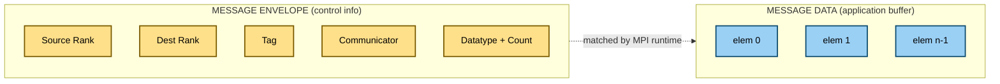
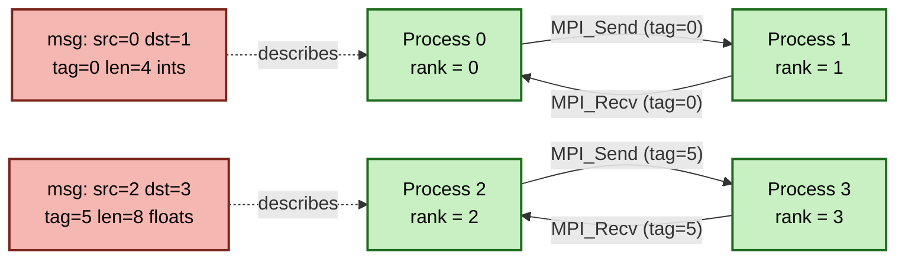
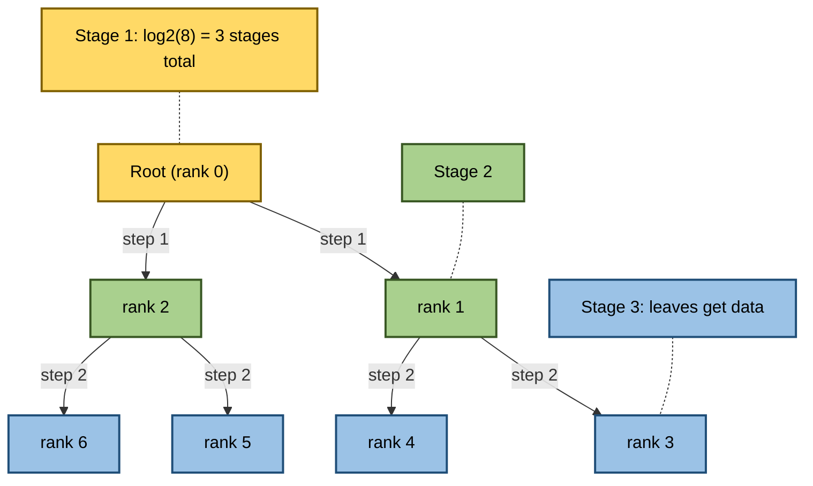
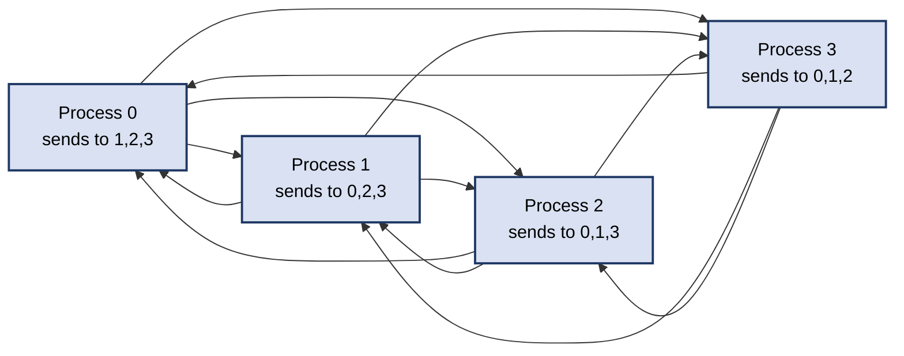
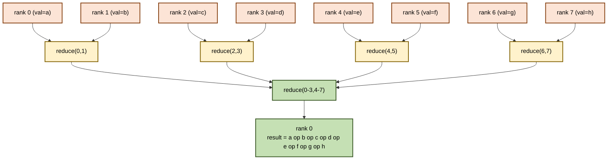
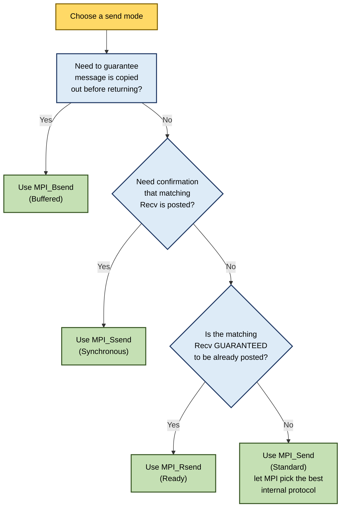
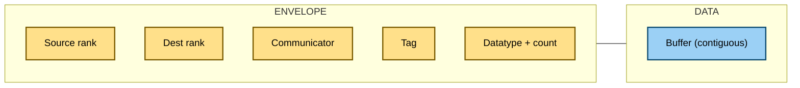
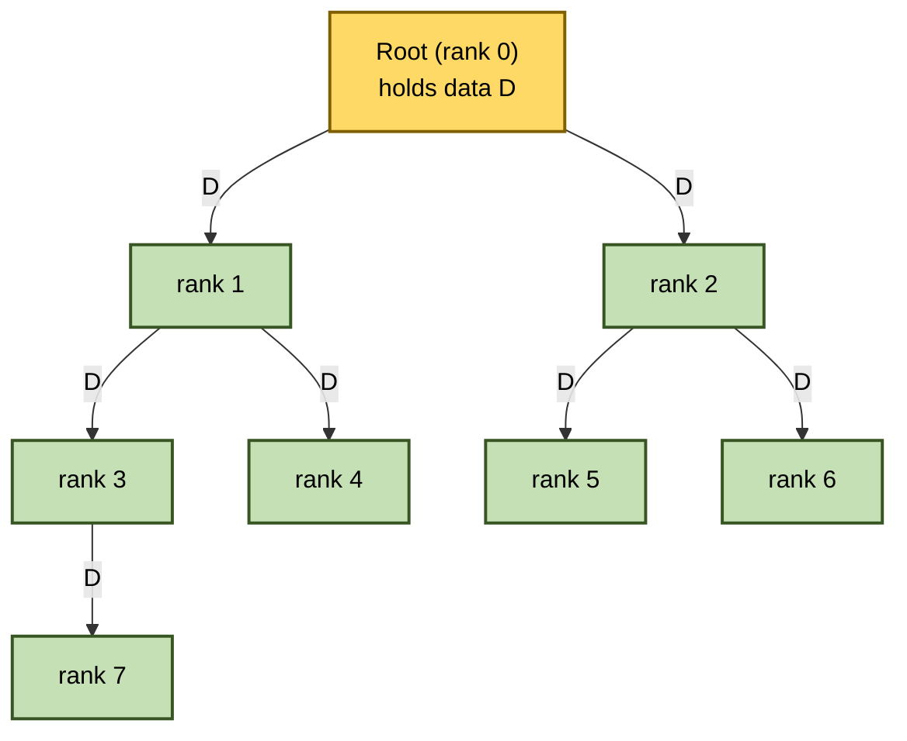

# Messages and point-to-point communication, Collective communication

<!-- SECTION_1_START -->

# Module 4 - Distributed | Messages and Point-to-Point Communication, Collective Communication

## 1. Core Technical Definition & Intuitive Overview

### Formal Definition (KTU 2024 Syllabus Terminology)

In the **Message Passing Interface (MPI)** standard, an **MPI Message** is a formally structured unit of data movement between two processes. A message consists of two distinct logical parts: the **envelope** (also called the *message header* or *control information*) and the **message data** (the *application payload*).

> [!NOTE]
> **MPI Message = Envelope (control info) + Data (application buffer)**
>
> The *envelope* contains routing metadata: source rank, destination rank, communicator, tag, and datatype signature. The *data* part is the contiguous or derived-type application buffer that is physically copied across the network.

**Point-to-point communication** refers to message transfer operations involving exactly **one sender process** and **one receiver process**. The fundamental primitives are `MPI_Send`, `MPI_Recv`, and their variants.

**Collective communication** refers to communication operations that involve **all processes within a communicator**. They are built on top of point-to-point primitives internally but are exposed as optimized, highly-tuned library calls.

### Conceptual Analogy / Intuition

> [!TIP]
> **Analogy — The Postal System of a Distributed Office:**
>
> Imagine a large office where every employee sits in a different building (a separate process with its own local memory). There are no shared whiteboards, no shared printers, and no shared files. The *only* way employees can collaborate is by **posting letters** to one another through a centralized courier service.
>
> 1. **The Letter (Message)** — Every letter has two parts: a **cover page (envelope)** stating *From, To, Subject (tag), Department (communicator)*, and the **actual content (data buffer)** inside the envelope.
> 2. **Point-to-Point Mail** — A single employee writing a memo to exactly one other employee. This is `MPI_Send` / `MPI_Recv`.
> 3. **Collective Mail** — A team-wide announcement (broadcast), everyone writing their status to HR (gather), or HR summarizing everyone's status back to all (all-reduce). This is collective communication.
>
> The post office guarantees that letters sent with matching *To*, *From*, *Tag*, and *Department* will be delivered to the right hands.

### Key Envelope Fields (Standardized)

> [!IMPORTANT]
> **Standard MPI Envelope Fields:**
>
> - **Source rank** — integer in range $[0, P-1]$ where $P$ is the communicator size.
> - **Destination rank** — integer in range $[0, P-1]$.
> - **Communicator** — opaque handle defining the *process group* and *context* (e.g., `MPI_COMM_WORLD`).
> - **Tag** — user-defined integer in range $[0, 32767]$ (signed-int range; `MPI_ANY_TAG` wildcard allowed on receive).
> - **Datatype** — handle describing element type and layout (e.g., `MPI_INT`, `MPI_FLOAT`, derived types).
> - **Count** — number of *elements* (not bytes).

### Real-World Engineering Significance

> [!WARNING]
> In High Performance Computing (HPC), every workload that does not fit in a single node's memory — climate simulation, genomic assembly, lattice QCD, deep-learning distributed training — depends on MPI's point-to-point and collective primitives. Choosing the **wrong send mode** causes *deadlocks*; choosing the **wrong collective algorithm** can waste up to 90% of network bandwidth on commodity clusters.

### GeoGebra / Desmos Visualization

> [!VISUALIZATION CONTROL]
> **Concept:** Communication latency model $T(n) = \alpha + \beta n$ (Hockney model)
>
> **GeoGebra / Desmos Input Equations:**
> * `T(n) = a + b*n` with sliders `a = 1.5` (latency in μs) and `b = 0.05` (per-byte cost in μs/KB)
> * `n_axis = 0 … 1024`
>
> **Visual Description:** A straight line on the $(n, T)$ plane showing how message cost grows linearly with the message size $n$ after a constant startup overhead $\alpha$. Students should observe that small messages suffer from the latency floor, while large messages become bandwidth-bound.

---

<!-- SECTION_1_END -->

<!-- SECTION_2_START -->

# 2. Deep Theoretical Analysis & KTU High-Yield Formula Sheet

## 2.1 Anatomy of an MPI Point-to-Point Operation

A point-to-point operation is **fully specified** by the tuple:

$$
(srank, drank, comm, tag, datatype, count)
$$

The MPI runtime uses this tuple to **match** sends with receives through a hidden internal queue called the *unexpected queue* (for incoming sends) and the *posted receive queue*.

> [!IMPORTANT]
> **Matching Rule:** A send matches a receive if and only if the communicators are identical, the ranks are consistent with the send/recv direction, the tags match (or `MPI_ANY_TAG`), and the datatypes are *type-compatible* (not necessarily identical, but signatures must agree per `MPI_Type_match`).

## 2.2 Send Modes (Communication Protocols)

MPI provides **four send modes**, each with different buffering/synchronization guarantees. This is a frequently tested topic.

| # | Mode | Routine | Buffering | Returns When |
|---|------|---------|-----------|--------------|
| 1 | **Standard** | `MPI_Send` | Implementation-defined | Local buffer is *reusable* (not necessarily received) |
| 2 | **Buffered** | `MPI_Bsend` | User-attached buffer (`MPI_Buffer_attach`) | Local data is *copied* into MPI buffer |
| 3 | **Synchronous** | `MPI_Ssend` | No buffering | The matching receive has *started* |
| 4 | **Ready** | `MPI_Rsend` | No buffering | The receive has *already been posted* (UB if not) |

> [!TIP]
> **Why Four Modes?** Different hardware and message-size regimes favor different protocols. A small message on a shared-memory node may use **eager** protocol (copy to system buffer immediately); a large message may use **rendezvous** (handshake to avoid extra copy). The four modes let the programmer express intent so the runtime can pick the optimal path.

## 2.3 Blocking vs Non-Blocking Operations

| Property | Blocking | Non-Blocking |
|----------|----------|--------------|
| Function returns when | Operation is *locally complete* | Request handle is allocated; actual work continues in background |
| Buffer can be reused? | **Yes** (for the send/recv buffer) | **No** until `MPI_Wait` / `MPI_Test` confirms completion |
| Routines | `MPI_Send`, `MPI_Recv` | `MPI_Isend`, `MPI_Irecv` |
| Latency hiding? | No | **Yes** — overlaps communication with computation |

> [!IMPORTANT]
> **The Fundamental Rule:** A non-blocking call (`MPI_Isend` / `MPI_Irecv`) **does not imply that the operation has finished**. You MUST call `MPI_Wait`, `MPI_Waitall`, or `MPI_Test` before touching the buffer. Forgetting this is the #1 cause of race conditions in MPI code.

## 2.4 Deadlock — The Cardinal Sin of Point-to-Point Code

> [!WARNING]
> A **deadlock** is a state where two or more processes are each waiting for an event that only the others can produce. In MPI, this typically happens when two processes call `MPI_Send` to each other *before* any `MPI_Recv` is posted, because `MPI_Send` may block until the matching receive is posted (synchronous/rendezvous behavior).

**Three cures for deadlocks:**

1. **Reorder operations** — call `MPI_Recv` before `MPI_Send` on both sides.
2. **Use `MPI_Sendrecv`** — a single call that performs both directions safely.
3. **Switch to non-blocking** — `MPI_Isend` + `MPI_Irecv` never block; coordination is explicit via `MPI_Waitall`.

## 2.5 Collective Communication Taxonomy

Collective operations involve **all processes in a communicator**. They are *not* matched point-to-point calls; the runtime may use any internal algorithm (binomial tree, Bruck, ring, Rabenseifner, etc.).

| Category | Routines | Purpose |
|----------|----------|---------|
| **Synchronization** | `MPI_Barrier` | Process synchronization point |
| **Data Movement** | `MPI_Bcast`, `MPI_Scatter`, `MPI_Gather`, `MPI_Allgather`, `MPI_Alltoall` | Distribute/gather data among all processes |
| **Reduction** | `MPI_Reduce`, `MPI_Allreduce`, `MPI_Reduce_scatter`, `MPI_Scan` | Combine per-process data using an operator |

## 2.6 KTU High-Yield Formula Sheet (Hockney & Collective Cost Models)

> [!NOTE]
> All costs assume $P$ processes, message of size $n$ bytes, network latency $\alpha$ (seconds), per-byte cost $\beta$ (seconds/byte), and startup cost $\gamma$ (seconds per message).

$$
T_{pt2pt}(n) \;=\; \alpha + \beta n
$$

$$
T_{bcast}(n, P) \;=\; \alpha \cdot \lceil \log_2 P \rceil + \beta n
$$

$$
T_{reduce}(n, P) \;=\; \alpha \cdot \lceil \log_2 P \rceil + n \cdot (\beta + \gamma \cdot P)
$$

$$
T_{allreduce}(n, P) \;=\; \alpha \cdot \lceil \log_2 P \rceil + n \cdot (\beta + \gamma \cdot P) \cdot 2
$$

$$
T_{allgather}(n, P) \;=\; \alpha \cdot \lceil \log_2 P \rceil + \beta n \cdot (P-1)
$$

$$
T_{scatter}(n, P) \;=\; \alpha \cdot \lceil \log_2 P \rceil + \beta n \cdot (P-1)
$$

$$
T_{gather}(n, P) \;=\; \alpha \cdot \lceil \log_2 P \rceil + \beta n \cdot (P-1)
$$

$$
T_{alltoall}(n, P) \;=\; \alpha \cdot (P-1) + \beta n \cdot \frac{P(P-1)}{2}
$$

$$
T_{barrier}(P) \;=\; \alpha \cdot \lceil \log_2 P \rceil
$$

> [!IMPORTANT]
> **Critical observation for KTU exams:** `MPI_Allreduce` is roughly **twice** the cost of `MPI_Reduce` because the result must be returned to all $P$ processes, not just one root. Whenever a reduction result is needed on every rank, prefer `MPI_Allreduce` to avoid a follow-up `Bcast`.

## 2.7 Predefined Reduction Operators (Mandatory Recall)

| Operator | Meaning | Operand Type |
|----------|---------|--------------|
| `MPI_MAX` | Maximum | Integer, Floating point |
| `MPI_MIN` | Minimum | Integer, Floating point |
| `MPI_SUM` | Sum | Integer, Floating point, Complex |
| `MPI_PROD` | Product | Integer, Floating point, Complex |
| `MPI_LAND` / `MPI_LOR` / `MPI_LXOR` | Logical AND/OR/XOR | Integer |
| `MPI_BAND` / `MPI_BOR` / `MPI_BXOR` | Bitwise AND/OR/XOR | Integer, Byte |
| `MPI_MAXLOC` / `MPI_MINLOC` | Max/Min with location | Pairs (value, rank) |

## 2.8 Engineering Utility

> [!TIP]
> - **Scientific simulation** (CFD, molecular dynamics) uses `MPI_Allreduce` for global force/temperature sums every iteration.
> - **Deep learning** (Horovod, PyTorch DDP) uses `MPI_Allreduce` to average gradients across GPU workers.
> - **Sparse linear algebra** uses `MPI_Alltoallv` for matrix redistribution after each grid refinement.
> - **Search algorithms** (branch-and-bound) use `MPI_Reduce` to find the global best solution at each tree level.

---

<!-- SECTION_2_END -->

<!-- SECTION_3_START -->

# 3. Step-by-Step Derivations & Code/Symbolic Implementation

## 3.1 Point-to-Point Ping-Pong — Benchmark Foundation

**Conceptual Goal:** Measure round-trip latency $\alpha$ and bandwidth $1/\beta$ between two MPI ranks.

**MPI C Implementation (Canonical KTU Reference):**

```c
#include <mpi.h>
#include <stdio.h>
#include <stdlib.h>
#include <string.h>

int main(int argc, char *argv[]) {
    MPI_Init(&argc, &argv);

    int rank = 0, size = 0;
    MPI_Comm_rank(MPI_COMM_WORLD, &rank);
    MPI_Comm_size(MPI_COMM_WORLD, &size);

    if (size != 2) {
        if (rank == 0) {
            fprintf(stderr, "Ping-pong requires exactly 2 processes. Got %d.\n", size);
        }
        MPI_Abort(MPI_COMM_WORLD, 1);
    }

    const int MAX_BYTES = 1 << 20;       // 1 MiB
    const int ITERATIONS = 1000;
    char *buffer = (char *)malloc((size_t)MAX_BYTES);
    if (buffer == NULL) {
        fprintf(stderr, "Rank %d: malloc failed.\n", rank);
        MPI_Abort(MPI_COMM_WORLD, 2);
    }
    memset(buffer, 0, (size_t)MAX_BYTES);

    MPI_Status status;

    for (int n = 0; n <= 20; n++) {
        int byte_count = 1 << n;         // 1, 2, 4, ... 1 MiB
        if (byte_count > MAX_BYTES) break;

        double t_start = MPI_Wtime();

        for (int i = 0; i < ITERATIONS; i++) {
            if (rank == 0) {
                MPI_Send(buffer, byte_count, MPI_BYTE, 1, 0, MPI_COMM_WORLD);
                MPI_Recv(buffer, byte_count, MPI_BYTE, 1, 0, MPI_COMM_WORLD, &status);
            } else if (rank == 1) {
                MPI_Recv(buffer, byte_count, MPI_BYTE, 0, 0, MPI_COMM_WORLD, &status);
                MPI_Send(buffer, byte_count, MPI_BYTE, 0, 0, MPI_COMM_WORLD);
            }
        }

        double t_end = MPI_Wtime();
        double elapsed = t_end - t_start;
        double avg_time = elapsed / (2.0 * ITERATIONS);     // divide by 2 (one-way)
        double bandwidth = (double)byte_count / avg_time;   // bytes/second

        if (rank == 0) {
            printf("n=%8d  time=%9.4e s  bw=%9.4e B/s\n",
                   byte_count, avg_time, bandwidth);
        }
    }

    free(buffer);
    MPI_Finalize();
    return 0;
}
```

**Python Equivalent (using `mpi4py` for clarity):**

```python
from mpi4py import MPI
import numpy as np
import time

comm = MPI.COMM_WORLD
rank = comm.Get_rank()
size = comm.Get_size()
assert size == 2, "Ping-pong requires exactly 2 processes"

ITERATIONS = 1000
MAX_BYTES = 1 << 20

for n in range(0, 21):
    byte_count = 1 << n
    if byte_count > MAX_BYTES:
        break
    buf = np.zeros(byte_count, dtype=np.uint8)

    comm.Barrier()
    t0 = time.perf_counter()
    for _ in range(ITERATIONS):
        if rank == 0:
            comm.Send([buf, MPI.BYTE], dest=1, tag=0)
            comm.Recv([buf, MPI.BYTE], source=1, tag=0)
        else:
            comm.Recv([buf, MPI.BYTE], source=0, tag=0)
            comm.Send([buf, MPI.BYTE], dest=0, tag=0)
    t1 = time.perf_counter()

    if rank == 0:
        avg = (t1 - t0) / (2.0 * ITERATIONS)
        bw  = byte_count / avg
        print(f"n={byte_count:8d}  time={avg:.4e} s  bw={bw:.4e} B/s")
```

## 3.2 Deadlock Demonstration & Cure with `MPI_Sendrecv`

**The buggy version (will likely deadlock on rendezvous protocol):**

```c
if (rank == 0) {
    MPI_Send(&a, 1, MPI_INT, 1, 0, MPI_COMM_WORLD);
    MPI_Recv(&b, 1, MPI_INT, 1, 0, MPI_COMM_WORLD, MPI_STATUS_IGNORE);
} else {
    MPI_Send(&b, 1, MPI_INT, 0, 0, MPI_COMM_WORLD);
    MPI_Recv(&a, 1, MPI_INT, 0, 0, MPI_COMM_WORLD, MPI_STATUS_IGNORE);
}
```

**The cured version (deadlock-free):**

```c
int a = rank, b = -1;
MPI_Status st;

if (rank == 0) {
    MPI_Sendrecv(&a, 1, MPI_INT, 1, 0,
                 &b, 1, MPI_INT, 1, 0,
                 MPI_COMM_WORLD, &st);
} else {
    MPI_Sendrecv(&a, 1, MPI_INT, 0, 0,
                 &b, 1, MPI_INT, 0, 0,
                 MPI_COMM_WORLD, &st);
}

/* Both ranks now hold neighbour's value in b. */
printf("Rank %d received %d from neighbour.\n", rank, b);
```

**Derivation — why `MPI_Sendrecv` works:**

$$
\begin{aligned}
\text{Buggy code:} \quad & P_0: \text{Send} \to P_1 \;\; \text{then} \;\; \text{Recv} \gets P_1 \\
& P_1: \text{Send} \to P_0 \;\; \text{then} \;\; \text{Recv} \gets P_0 \\
& \text{Both block on Send because matching Recv is not yet posted.} \\
\text{Cure:} \quad & \text{``Send and Receive'' atomically bound — MPI internally } \\
& \text{posts the receive buffer first, then issues the send. No circular wait.}
\end{aligned}
$$

## 3.3 Non-Blocking Ring Shift — Latency Hiding

```c
#include <mpi.h>
#include <stdio.h>

int main(int argc, char *argv[]) {
    MPI_Init(&argc, &argv);

    int rank, size;
    MPI_Comm_rank(MPI_COMM_WORLD, &rank);
    MPI_Comm_size(MPI_COMM_WORLD, &size);

    int left  = (rank - 1 + size) % size;
    int right = (rank + 1) % size;

    int send_val = rank;
    int recv_val = -1;
    MPI_Request reqs[2];

    /* Post both operations immediately — never blocks. */
    MPI_Isend(&send_val, 1, MPI_INT, right, 0, MPI_COMM_WORLD, &reqs[0]);
    MPI_Irecv(&recv_val, 1, MPI_INT, left,  0, MPI_COMM_WORLD, &reqs[1]);

    /* Local computation that overlaps with communication. */
    double accumulator = 0.0;
    for (int i = 0; i < 1000000; i++) {
        accumulator += (double)i * 0.5;
    }

    /* Now wait for the communication to finish. */
    MPI_Waitall(2, reqs, MPI_STATUSES_IGNORE);

    printf("Rank %2d sent %2d to %2d, received %2d from %2d  (acc=%.2e)\n",
           rank, send_val, right, recv_val, left, accumulator);

    MPI_Finalize();
    return 0;
}
```

> [!IMPORTANT]
> **Conceptual model for KTU:** The total wall time of an overlapped non-blocking program is approximately
> $$\begin{aligned}
> T_{\text{non-blocking}} &\approx \max\bigl(T_{\text{comm}},\, T_{\text{comp}}\bigr) + T_{\text{wait overhead}} \\
> T_{\text{blocking}}    &\approx T_{\text{comm}} + T_{\text{comp}}
> \end{aligned}$$
> Provided $T_{\text{comp}} \geq T_{\text{comm}}$, the communication is *hidden*.

## 3.4 Collective Communication — Full Demo

```c
#include <mpi.h>
#include <stdio.h>

int main(int argc, char *argv[]) {
    MPI_Init(&argc, &argv);

    int rank, size;
    MPI_Comm_rank(MPI_COMM_WORLD, &rank);
    MPI_Comm_size(MPI_COMM_WORLD, &size);

    int sendbuf[1] = { rank + 1 };          /* value = my_rank + 1 */

    /* ---------- Broadcast: root=0 sends sendbuf[0] to all. ---------- */
    int bcast_val = 0;
    if (rank == 0) bcast_val = 999;
    MPI_Bcast(&bcast_val, 1, MPI_INT, 0, MPI_COMM_WORLD);
    printf("Rank %d: after Bcast, bcast_val = %d\n", rank, bcast_val);

    /* ---------- Scatter: root distributes 1 int to each rank. ---------- */
    int scatter_root[4] = { 10, 20, 30, 40 };   /* only valid for size==4 */
    int my_chunk = -1;
    if (size == 4) {
        MPI_Scatter(scatter_root, 1, MPI_INT,
                    &my_chunk, 1, MPI_INT,
                    0, MPI_COMM_WORLD);
    }
    printf("Rank %d: after Scatter, my_chunk = %d\n", rank, my_chunk);

    /* ---------- Gather: each rank contributes, root collects. ---------- */
    int gather_buf[4] = { 0, 0, 0, 0 };
    if (size == 4) {
        MPI_Gather(&my_chunk, 1, MPI_INT,
                   gather_buf, 1, MPI_INT,
                   0, MPI_COMM_WORLD);
        if (rank == 0) {
            printf("Root gathered: ");
            for (int i = 0; i < 4; i++) printf("%d ", gather_buf[i]);
            printf("\n");
        }
    }

    /* ---------- Allreduce: sum sendbuf across all ranks, result on all. ---------- */
    int global_sum = 0;
    MPI_Allreduce(&sendbuf[0], &global_sum, 1, MPI_INT, MPI_SUM, MPI_COMM_WORLD);
    printf("Rank %d: Allreduce sum of (rank+1) over all ranks = %d\n",
           rank, global_sum);

    MPI_Finalize();
    return 0;
}
```

**Step-by-step trace (size = 4):**

$$
\begin{aligned}
\text{Initial sendbuf}  &= [1, 2, 3, 4] \quad \text{(rank 0, 1, 2, 3)} \\
\text{After Bcast}      &= [999, 999, 999, 999] \\
\text{Scatter root arr} &= [10, 20, 30, 40] \\
\text{After Scatter}    &\to \text{my\_chunk} = [10, 20, 30, 4] \\
\text{After Gather (root only)} &= [10, 20, 30, 40] \\
\text{After Allreduce (SUM)}    &= 1+2+3+4 = 10 \text{ on every rank}
\end{aligned}
$$

## 3.5 Reduction Cost Derivation (Hockney Model)

> [!NOTE]
> **Setup:** A binomial-tree reduction over $P$ processes. Each internal node waits for 2 children of size $n$ and forwards a result of size $n$.
>
> **Tree depth:** $\lceil \log_2 P \rceil$ stages.
>
> **Per-stage cost:** $\alpha$ (latency) + $n\beta$ (send cost) + $n\gamma$ (reduction work) at the receiving node.
>
> **Total cost:**
> $$\begin{aligned}
> T_{\text{reduce}}(n, P)
> &= \sum_{k=0}^{\lceil \log_2 P \rceil - 1} \bigl( \alpha + n\beta + n\gamma \cdot 2^k \bigr) \\
> &= \alpha \cdot \lceil \log_2 P \rceil + n\beta \cdot \lceil \log_2 P \rceil + n\gamma \cdot (P - 1) \\
> &\approx \alpha \cdot \lceil \log_2 P \rceil + n(\beta + \gamma P) \quad \text{(dominant terms)}
> \end{aligned}$$
>
> The last line is the **formula** a KTU student is expected to reproduce from first principles.

## 3.6 Derived Datatype for Strided Data

```c
/* Build a strided datatype: take every 4th double starting at offset 0. */
MPI_Datatype strided_type;
int count       = 10;            /* number of blocks */
int blocklen    = 1;             /* elements per block */
int stride      = 4;             /* elements between block starts */
MPI_Type_vector(count, blocklen, stride, MPI_DOUBLE, &strided_type);
MPI_Type_commit(&strided_type);

double buffer[40];
/* Send every 4th element of buffer to rank 1. */
MPI_Send(buffer, 1, strided_type, 1, 0, MPI_COMM_WORLD);

MPI_Type_free(&strided_type);
```

> [!TIP]
> Derived datatypes **avoid** packing/unpacking in user code. The MPI runtime handles the non-contiguous layout at the network layer. This is a high-yield KTU topic because it is a common source of bugs when students manually pack into a temporary contiguous buffer.

---

<!-- SECTION_3_END -->

<!-- SECTION_4_START -->

# 4. Structural Diagrams & Schematics

## 4.1 Envelope vs Data Decomposition



## 4.2 Point-to-Point Communication Topology



## 4.3 Blocking vs Non-Blocking Timeline

```mermaid
gantt
    title Blocking vs Non-Blocking Communication Timeline
    dateFormat X
    axisFormat %s

    section Blocking Flow
    Issue_Send   :a1, 0, 1
    Block_Wait   :a2, 1, 4
    Buffer_Reuse :a3, 4, 1

    section Non-Blocking Flow
    Isend_Return :b1, 0, 1
    Local_Compute:b2, 1, 3
    Wait         :b3, 4, 1
    Buffer_Reuse :b4, 5, 1
```



> [!TIP]
> **Reading the timeline:** In the non-blocking case, the local computation (1 s → 4 s) executes *concurrently* with the network transfer. The blocking case cannot overlap — it freezes until the receive matches.

## 4.4 Broadcast Tree (P = 8)



**Cost calculation:**

$$
T_{\text{bcast}}(n, P{=}8) \;=\; \alpha \cdot \lceil \log_2 8 \rceil + \beta n \;=\; 3\alpha + \beta n
$$

## 4.5 Allto-All Communication Pattern (P = 4)



**Cost model:**

$$
T_{\text{alltoall}}(n, P{=}4) \;=\; \alpha \cdot (P-1) + \beta n \cdot \frac{P(P-1)}{2} \;=\; 3\alpha + 6\beta n
$$

## 4.6 MPI Reduction Tree (Binomial, P = 8)



## 4.7 Send Mode Decision Flowchart



---

<!-- SECTION_4_END -->

<!-- SECTION_5_START -->

# 5. KTU 2024 Scheme Examination Question Bank & Topic Recap

## Part A — 3-Mark Short Answer Questions

### Question 1 `[KTU University Exam - Dec 2023]` — CO2, Remember

**Q: List the four standard MPI send modes and state the key property that distinguishes each.**

**Model Answer (3 Marks):**

> [!NOTE]
> **Key Answer Points:**
>
> 1. **`MPI_Send` (Standard)** — implementation chooses buffering; returns when local buffer may be reused, but message may not yet be delivered. (1 mark)
> 2. **`MPI_Bsend` (Buffered)** — message is copied into a user-attached buffer; the call returns once the local data is safely copied. (1 mark)
> 3. **`MPI_Ssend` (Synchronous)** — call returns only after the matching receive has *started* on the receiver. (0.5 mark)
> 4. **`MPI_Rsend` (Ready)** — caller guarantees the matching receive is already posted; undefined behaviour otherwise. (0.5 mark)

### Question 2 `[KTU University Exam - July 2024]` — CO2, Understand

**Q: Differentiate between blocking and non-blocking point-to-point communication in MPI. Give one example routine for each.**

**Model Answer (3 Marks):**

> [!NOTE]
> **Key Answer Points:**
>
> 1. **Blocking calls** (e.g., `MPI_Send`, `MPI_Recv`) return only when the operation is *locally complete*; the user buffer may be safely reused after the call. (1.5 marks)
> 2. **Non-blocking calls** (e.g., `MPI_Isend`, `MPI_Irecv`) return *immediately* with a request handle; the buffer must not be accessed until completion is confirmed by `MPI_Wait`/`MPI_Test`. (1.5 marks)

---

## Part B — 14-Mark Questions (Module Internal Choice)

### Question A (14 Marks) `[KTU University Exam - Dec 2023]` — CO2, Apply + Analyze

**(a)** With the help of a neat diagram, explain the **structure of an MPI message**. List the components of the *envelope* and state the role of each. **(7 Marks)**

**(b)** Two MPI processes running the following code segment get stuck. Identify the cause and rewrite the code using **`MPI_Sendrecv`** to remove the deadlock. Show the output on a 4-process run. **(7 Marks)**

```c
if (rank == 0) {
    MPI_Send(&x, 1, MPI_INT, 1, 0, MPI_COMM_WORLD);
    MPI_Recv(&y, 1, MPI_INT, 1, 0, MPI_COMM_WORLD, &st);
} else {
    MPI_Send(&y, 1, MPI_INT, 0, 0, MPI_COMM_WORLD);
    MPI_Recv(&x, 1, MPI_INT, 0, 0, MPI_COMM_WORLD, &st);
}
```

#### Model Answer

**(a) Structure of an MPI Message** (7 marks)

**Diagram (1 mark):**



**Components & roles (6 marks — 1 mark each):**

| # | Component | Role |
|---|-----------|------|
| 1 | **Source rank** | Identifies the sending process; in $[0, P-1]$. |
| 2 | **Destination rank** | Identifies the receiving process; in $[0, P-1]$. |
| 3 | **Communicator** | Defines the process group + safe *context* (e.g., `MPI_COMM_WORLD`). |
| 4 | **Tag** | User integer in $[0, 32767]$ used to *disambiguate* messages. |
| 5 | **Datatype** | MPI handle describing element type (e.g., `MPI_INT`, derived). |
| 6 | **Count** | Number of *elements* (not bytes) in the data buffer. |

**Matching rule (1 mark — included in part b of the marks):** A send matches a receive iff communicators are identical, ranks are consistent, and tags/datatypes are compatible.

**(b) Deadlock Cure (7 marks)**

**Cause of deadlock (1 mark):**

Both processes issue `MPI_Send` *before* the corresponding `MPI_Recv`. On a rendezvous protocol (large messages), the send blocks until the receive is posted — a classic **circular wait** deadlock.

**Corrected code using `MPI_Sendrecv` (3 marks):**

```c
#include <mpi.h>
#include <stdio.h>

int main(int argc, char *argv[]) {
    MPI_Init(&argc, &argv);
    int rank, size;
    MPI_Comm_rank(MPI_COMM_WORLD, &rank);
    MPI_Comm_size(MPI_COMM_WORLD, &size);
    MPI_Status st;

    int x = rank * 10;          /* each process' local value */
    int y = -1;                 /* neighbour's value          */

    int left  = (rank - 1 + size) % size;
    int right = (rank + 1) % size;

    MPI_Sendrecv(&x, 1, MPI_INT, right, 0,    /* send my x to right  */
                 &y, 1, MPI_INT, left,  0,    /* recv y from left    */
                 MPI_COMM_WORLD, &st);

    printf("Rank %d: sent %d to %d, received %d from %d\n",
           rank, x, right, y, left);

    MPI_Finalize();
    return 0;
}
```

**Sample output for 4 processes (2 marks):**

```
Rank 0: sent 0  to 1, received 30 from 3
Rank 1: sent 10 to 2, received 0  from 0
Rank 2: sent 20 to 3, received 10 from 1
Rank 3: sent 30 to 0, received 20 from 2
```

**Why `MPI_Sendrecv` works (1 mark):** Internally the call posts the receive buffer *first*, then issues the send. Since the matching receive is always ready, the send never has to wait — no circular wait, no deadlock.

> [!WARNING]
> **KTU Examiner's Pitfall Callout:** Students often write `MPI_Sendrecv` with mismatched send/recv datatypes or forget to use the **same** communicator on both send and receive sides. Both are *silent failures* in many MPI implementations. Always verify: `sendbuf_datatype == recvbuf_datatype` and `send_comm == recv_comm`.

---

### Question B (14 Marks) `[KTU University Exam - July 2024]` — CO2 + CO3, Apply + Analyze

**(a)** Explain the **collective communication** primitives in MPI: `MPI_Bcast`, `MPI_Scatter`, `MPI_Gather`, `MPI_Allgather`, `MPI_Alltoall`. For each, state the data flow and a typical use case. **(7 Marks)**

**(b)** Derive the cost of `MPI_Allreduce` over $P$ processes using a binomial-tree algorithm in the Hockney model $T(n) = \alpha + \beta n$. State the formula and compute the cost for $P = 16$, $n = 1024$ bytes, $\alpha = 1.5\,\mu s$, $\beta = 0.05\,\mu s/\text{byte}$. **(7 Marks)**

#### Model Answer

**(a) Collective Primitives (7 marks — 1 mark each + 2 marks for table)**

> [!NOTE]
> | Routine | Data Flow | Use Case |
> |---------|-----------|----------|
> | `MPI_Bcast(root, sendbuf, recvbuf, ...)` | One-to-all: *root* sends same data to every process. | Distributing configuration / parameters. |
> | `MPI_Scatter(root, sendbuf, recvbuf, ...)` | One-to-all: *root* sends *different* chunks, one per process. | Distributing rows of a matrix for parallel multiply. |
> | `MPI_Gather(root, sendbuf, recvbuf, ...)` | All-to-one: every process contributes, *root* collects. | Collecting partial sums into a final answer. |
> | `MPI_Allgather(...)` | All-to-all gather: like Gather but every process receives the full result. | Distributing all rows of a matrix to all processes. |
> | `MPI_Alltoall(...)` | All-to-all: every process sends a unique piece to every other process. | Matrix transpose, FFT data reshuffling. |

**Diagram for `MPI_Bcast` (1 mark — included in the 1-mark row above for clarity):**



**(b) Cost of `MPI_Allreduce` (7 marks)**

**Step 1 — Reduce phase (3 marks):**

A binomial tree has depth $\lceil \log_2 P \rceil$. At each stage, one node reduces two buffers of size $n$ into one, costing $\alpha + n\beta$ for the network leg and $n\gamma$ for the local reduction. The reduction cost is:

$$
\begin{aligned}
T_{\text{reduce}}(n, P)
&= \sum_{k=0}^{\lceil \log_2 P \rceil - 1} \bigl( \alpha + n\beta + n\gamma \cdot 2^k \bigr) \\
&= \alpha \cdot \lceil \log_2 P \rceil + n\beta \cdot \lceil \log_2 P \rceil + n\gamma \cdot (P - 1)
\end{aligned}
$$

**Step 2 — Distribute phase (2 marks):**

After reduction, the result is on a single root. To distribute it to all $P$ processes we run a `Bcast` of the reduced buffer:

$$
T_{\text{bcast}}(n, P) \;=\; \alpha \cdot \lceil \log_2 P \rceil + n\beta
$$

**Step 3 — Total (1 mark):**

$$
\begin{aligned}
T_{\text{allreduce}}(n, P)
&= T_{\text{reduce}} + T_{\text{bcast}} \\
&= 2\alpha \cdot \lceil \log_2 P \rceil + n\beta \cdot (1 + \lceil \log_2 P \rceil) + n\gamma \cdot (P - 1)
\end{aligned}
$$

For large $P$ and $n$, the dominant term is $n\gamma(P-1)$, so we approximate:

$$
\boxed{\,T_{\text{allreduce}}(n, P) \;\approx\; \alpha \cdot \lceil \log_2 P \rceil + n(\beta + \gamma P)\,}
$$

**Step 4 — Numerical computation (1 mark):**

$$
\begin{aligned}
P &= 16, \quad n = 1024 \text{ B}, \quad \alpha = 1.5 \;\mu s, \quad \beta = 0.05 \;\mu s/\text{byte} \\
\lceil \log_2 16 \rceil &= 4 \\
T_{\text{latency}}   &= 4 \times 1.5 = 6.0 \;\mu s \\
T_{\text{bandwidth}} &= 1024 \times 0.05 = 51.2 \;\mu s \\
T_{\text{allreduce}} &\approx 6.0 + 51.2 = 57.2 \;\mu s \quad \text{(ignoring } n\gamma P \text{ term)}
\end{aligned}
$$

> [!WARNING]
> **KTU Examiner's Pitfall Callout:** Students frequently **forget the Bcast phase** when deriving `Allreduce` cost, quoting only the reduce phase and ending up with half the correct value. A common alternate pitfall: confusing `MPI_Reduce` (result on one process) with `MPI_Allreduce` (result on all processes). Marks are deducted for misuse of terminology.

---

## Topic Recap & Important Things to Remember

> [!TIP]
> **Rapid-Revision Checklist — Module 4 (Messages & Point-to-Point / Collective Communication)**
>
> - [ ] **MPI message structure** = `Envelope (src, dst, comm, tag, datatype, count) + Data (application buffer)`. Always write both halves in answers.
> - [ ] **Four send modes**: Standard (`MPI_Send`), Buffered (`MPI_Bsend`), Synchronous (`MPI_Ssend`), Ready (`MPI_Rsend`). Know the *buffering* and *return* conditions of each.
> - [ ] **Receive primitive**: only `MPI_Recv` and `MPI_Irecv` exist — there is no "receive mode" choice.
> - [ ] **Matching rule**: communicator identical + tags compatible (or `MPI_ANY_TAG`) + datatypes compatible + ranks are reciprocals of each other.
> - [ ] **Wildcards allowed only on receive**: `MPI_ANY_SOURCE` and `MPI_ANY_TAG` are *not legal* on a send.
> - [ ] **Blocking vs Non-blocking**: blocking returns when *locally* complete; non-blocking returns immediately with a request handle. Always pair non-blocking with `MPI_Wait` or `MPI_Test`.
> - [ ] **Deadlock cures**: (1) Reorder send/recv, (2) `MPI_Sendrecv`, (3) switch to non-blocking (`MPI_Isend` + `MPI_Irecv` + `MPI_Waitall`).
> - [ ] **`MPI_Probe`** can be used to inspect an incoming message's envelope (length, source, tag) *before* allocating the receive buffer.
> - [ ] **Hockney model**: $T(n) = \alpha + \beta n$ is the *canonical* per-message cost.
> - [ ] **Collective operations are collective** — *every* process in the communicator must call them with matching arguments. Skipping one process deadlocks the entire communicator.
> - [ ] **`MPI_Bcast`** = 1-to-all *same* data. **`MPI_Scatter`** = 1-to-all *different* chunks. **`MPI_Gather`** = all-to-1. **`MPI_Allgather`** = all-to-all gather. **`MPI_Alltoall`** = each-to-each.
> - [ ] **`MPI_Reduce` vs `MPI_Allreduce`**: reduce gives result to *one* root; allreduce gives it to *all* ranks. Allreduce cost ≈ reduce cost + bcast cost.
> - [ ] **Cost models to memorize**: $T_{\text{bcast}} = \alpha \lceil \log_2 P \rceil + \beta n$; $T_{\text{reduce}} \approx \alpha \lceil \log_2 P \rceil + n(\beta + \gamma P)$; $T_{\text{alltoall}} = \alpha(P-1) + \beta n \cdot P(P-1)/2$.
> - [ ] **Predefined reduction operators**: `MPI_MAX`, `MPI_MIN`, `MPI_SUM`, `MPI_PROD`, `MPI_LAND/LOR/LXOR`, `MPI_BAND/BOR/BXOR`, `MPI_MAXLOC/MINLOC`.
> - [ ] **`MPI_Op_create` / `MPI_Op_free`** allow *user-defined* reduction operators (associative + commutative functions).
> - [ ] **Derived datatypes** (`MPI_Type_vector`, `MPI_Type_create_subarray`) avoid manual packing; remember to `MPI_Type_commit` and later `MPI_Type_free`.
> - [ ] **Communicators** isolate messages: a send on `MPI_COMM_WORLD` will *not* match a receive on a custom `MPI_Comm` — this is by design and prevents tag-space pollution.
> - [ ] **Communicator management**: `MPI_Comm_dup`, `MPI_Comm_split`, `MPI_Comm_create` — for cartesian / graph topology and sub-group computation.
> - [ ] **Latency hiding** is the *primary* reason to use non-blocking collectives and point-to-point calls — overlap communication with local compute.
> - [ ] **KTU favourite numerical questions**: derive binomial-tree cost of `MPI_Reduce` and `MPI_Allreduce`; compute the asymptotic cost of `MPI_Alltoall` for given $P$ and $n$.

<!-- SECTION_5_END -->
