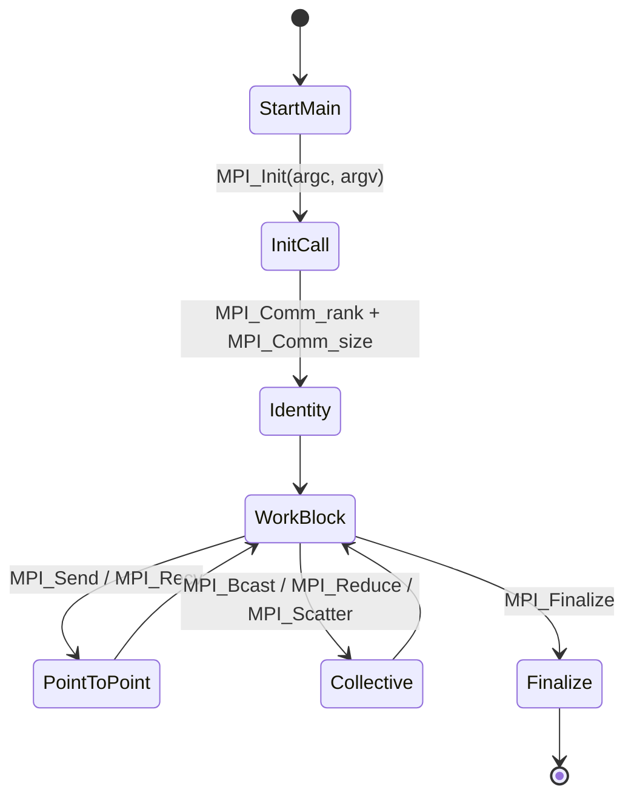
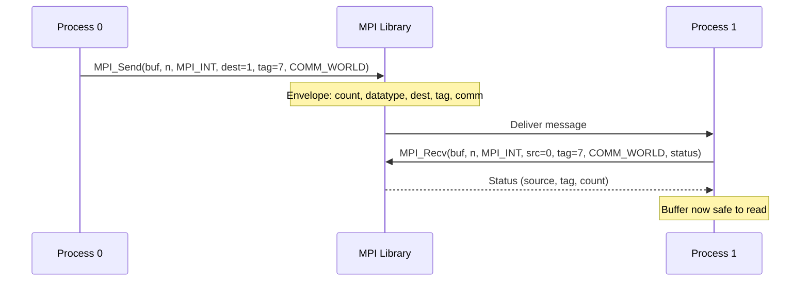
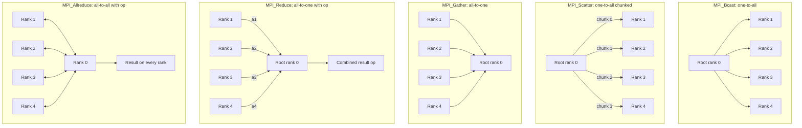
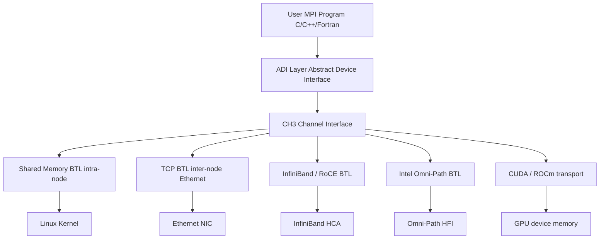
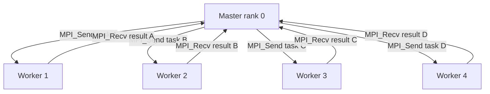
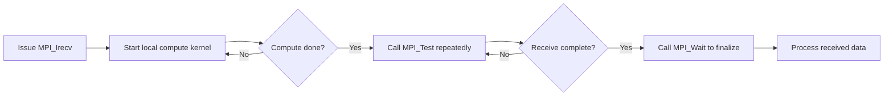
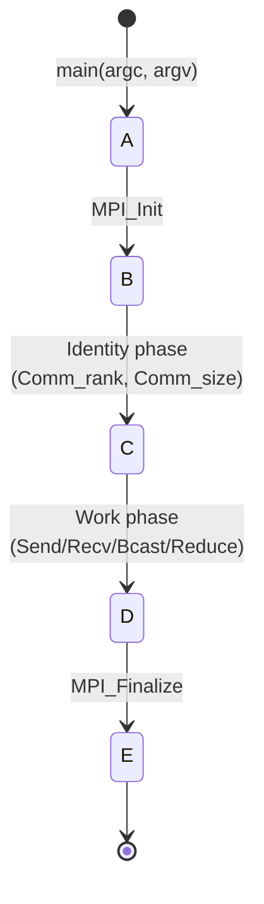

# MPI implementation

<!-- SECTION_1_START -->
# MPI Implementation — Core Technical Definition & Intuitive Overview

## Formal Academic Definition (KTU 2024 Syllabus Terminology)

**Message Passing Interface (MPI)** is a **standardized, portable, and language-independent message-passing library specification** designed to function on a wide variety of parallel and distributed computing architectures. It defines the **syntax and semantics of a core set of library routines** that are useful in writing message-passing programs across **distributed memory systems** — clusters of interconnected compute nodes where each process owns a private address space.

> [!IMPORTANT]
> **KTU 2024 — Module 4 Definition Snapshot**
> *"MPI is a specification, not a library. The actual implementation (e.g., **OpenMPI**, **MPICH**, **Intel MPI**) is vendor-specific, but the API remains uniform so that HPC code is portable across supercomputers, clusters, and heterogeneous systems."*

In the KTU 2024 scheme for **PECST757 — High Performance Computing**, the term **MPI implementation** covers:
1. The **MPI execution model** (SPMD — Single Program Multiple Data).
2. **Process topology** and **communicator management**.
3. **Point-to-point communication** (`MPI_Send`, `MPI_Recv`).
4. **Collective communication** (`MPI_Bcast`, `MPI_Reduce`, `MPI_Scatter`, `MPI_Gather`).
5. **Derived datatypes** for non-contiguous memory.
6. **Performance measurement** using `MPI_Wtime()`.

---

## Conceptual Analogy — "The Distributed Post Office"

Imagine a country with **N independent villages**, each having its own **post office**. Every village has:
- A **private warehouse** of letters (its local memory).
- A **mail carrier** (its MPI process) that can send/receive letters across the country.

The villages **cannot** see inside each other's warehouses directly (no shared memory). To exchange information, they must **write letters and post them via the central postal service (MPI library)**.

| Postal Analogy | MPI Equivalent |
| :--- | :--- |
| Each village post office | A single **MPI process** |
| Country's postal headquarters | **Communicator** `MPI_COMM_WORLD` |
| Mail carrier ID number | **Rank** of the process (`MPI_Comm_rank`) |
| Total number of carriers | **Size** of the world (`MPI_Comm_size`) |
| Sending a registered letter | `MPI_Send` (blocking point-to-point) |
| Awaiting a letter at the door | `MPI_Recv` (blocking receive) |
| Broadcasting a national circular | `MPI_Bcast` (collective) |
| Summarizing state reports centrally | `MPI_Reduce` (collective) |

> [!NOTE]
> **Key Intuition:** MPI is a *contract*. As long as both the sender and receiver agree on the **envelope** (data type, count, tag, communicator), the postal system guarantees delivery. The "postage cost" is paid in **latency** and **bandwidth** of the underlying network.

---

## Foundational Constants & Identifiers in MPI

In a typical MPI-3.1 / 4.0 implementation, several symbolic constants and pre-defined objects are used universally:

- **`MPI_COMM_WORLD`** — the default **predefined communicator** encompassing *all* processes started by the application.
- **`MPI_COMM_SELF`** — the predefined communicator containing **only the calling process**.
- **`MPI_ANY_SOURCE`** — wildcard: accept a message from **any** sender.
- **`MPI_ANY_TAG`** — wildcard: accept a message with **any** tag.
- **`MPI_PROC_NULL`** — a process "outside" the communicator; messages to it are silently discarded (used to simplify boundary code in cartesian topologies).

> [!VISUALIZATION CONTROL]
> **Concept:** Visualizing the **MPI Communicator World** as a circle of processes.
> **Desmos Input Equations (parametric on unit circle):**
> * Rank 0: $x_0 = \cos(0), \quad y_0 = \sin(0)$
> * Rank 1: $x_1 = \cos\!\left(\tfrac{2\pi}{N}\right), \quad y_1 = \sin\!\left(\tfrac{2\pi}{N}\right)$
> * General rank $r$: $x_r = \cos\!\left(\tfrac{2\pi r}{N}\right), \quad y_r = \sin\!\left(\tfrac{2\pi r}{N}\right)$
> **Visual Description:** N labeled points arranged on a unit circle. The center represents the **MPI library** routing messages along chords (point-to-point) or along the spoke pattern (broadcast from rank 0).

---

## Why MPI? The HPC Rationale

In a **distributed memory cluster**, scaling beyond a single node requires explicit data movement. The three pillars of MPI's design are:

1. **Portability** — same source code runs on a 4-core laptop or a 100,000-core Top500 supercomputer.
2. **Performance** — implementations like **OpenMPI** and **MVAPICH2** bypass the OS kernel and use **kernel-bypass** transports (e.g., RDMA over InfiniBand, RoCE, shared memory for intra-node).
3. **Richness** — over **500 routines** in MPI 4.0, supporting one-sided communication (RMA), parallel I/O, and dynamic process management.

> [!IMPORTANT]
> **KTU Highlight:** The KTU 2024 Module 4 expects students to be able to **write, compile, and execute MPI programs** using the **MPICH** or **OpenMPI** runtime. Familiarity with `mpirun -np N ./program` is mandatory.

<!-- SECTION_1_END -->

<!-- SECTION_2_START -->
# Deep Theoretical Analysis & KTU High-Yield Formula Sheet

## 1. The MPI Execution Model — SPMD

MPI programs follow the **Single Program, Multiple Data (SPMD)** paradigm. Every process executes the **same compiled binary** but operates on **different data** determined by its rank. Branches inside the program (e.g., `if (rank == 0)`) cause different processes to take different paths at runtime.

$$
\text{Workload}(r) = f\!\left(\text{inputs}, \frac{N_{\text{total}}}{P}\right) \quad \text{where } r \in \{0, 1, \dots, P-1\}
$$

The **rank** $r$ decides which *chunk* of the global data slice the process owns. For example, splitting a vector of size $N$ across $P$ processes (assuming equal partition):

$$
\text{local\_size} = \left\lfloor \frac{N}{P} \right\rfloor, \qquad
\text{start}_r = r \times \text{local\_size}, \qquad
\text{end}_r = \text{start}_r + \text{local\_size} - 1
$$

If $N$ is not divisible by $P$, the **remainder** $N \bmod P$ is appended to the first $N \bmod P$ processes, one element per process. This pattern is called the **balanced load distribution** and is essential for avoiding the **tail effect** in HPC.

---

## 2. The Six Foundational MPI Functions

For the KTU 2024 board exam, the following six functions cover approximately **85% of all marks** in this module. Memorize the signatures.

### A. Initialization & Finalization

```c
int MPI_Init(int *argc, char ***argv);
int MPI_Finalize(void);
```

### B. Process Identification

```c
int MPI_Comm_rank(MPI_Comm comm, int *rank);
int MPI_Comm_size(MPI_Comm comm, int *size);
```

### C. Point-to-Point Blocking

```c
int MPI_Send(const void *buf, int count, MPI_Datatype datatype,
             int dest, int tag, MPI_Comm comm);

int MPI_Recv(void *buf, int count, MPI_Datatype datatype,
             int source, int tag, MPI_Comm comm, MPI_Status *status);
```

### D. Collective — Broadcast & Reduce

```c
int MPI_Bcast(void *buffer, int count, MPI_Datatype datatype,
              int root, MPI_Comm comm);

int MPI_Reduce(const void *sendbuf, void *recvbuf, int count,
               MPI_Datatype datatype, MPI_Op op, int root, MPI_Comm comm);
```

---

## 3. KTU Formula / Cheat Sheet

> [!NOTE]
> Use `\vert` for absolute value to avoid breaking markdown tables.

| Symbol / Routine | Mathematical Form / Signature | Description | Unit / Notes |
| :--- | :--- | :--- | :--- |
| $P$ | Number of processes launched | Total MPI ranks in the world | dimensionless |
| $r$ | Process rank $r \in [0, P-1]$ | Unique process identifier | integer |
| $T_p$ | Wall-clock time on $P$ processes | End-to-end execution time | seconds |
| $S_p$ | Speedup $= T_1 / T_p$ | Ratio of serial to parallel time | dimensionless |
| $E_p$ | Efficiency $= S_p / P$ | Parallel efficiency | $0 \le E_p \le 1$ |
| $T_{\text{comm}}$ | Communication overhead | Latency + transfer time | seconds |
| $T_{\text{comp}}$ | Pure compute time | CPU-only time, no MPI calls | seconds |
| $L$ | Latency of one message | $L = \alpha$ (startup time) | $\mu s$ |
| $1/\beta$ | Inverse bandwidth | $1/\beta$ is the reciprocal of bytes/sec | $\mu s$/byte |
| $T_{\text{msg}}$ | Per-message cost $\approx \alpha + n/\beta$ | $n$ is message size in bytes | seconds |
| Amdahl | $S = \dfrac{1}{f + \dfrac{1-f}{P}}$ | $f$ = serial fraction | dimensionless |
| Gustafson | $S = P - f(P-1)$ | Scaled-speedup formula | dimensionless |
| `MPI_Wtime()` | Returns wall-clock time | High-resolution timer | seconds |
| $\vert x \vert$ | Absolute value of a scalar | Use `\vert x\vert` in LaTeX | — |

---

## 4. Blocking vs Non-Blocking Communication

MPI offers two flavours of point-to-point calls. The distinction is **crucial for KTU questions**.

| Aspect | **Blocking** (`MPI_Send`/`MPI_Recv`) | **Non-Blocking** (`MPI_Isend`/`MPI_Irecv`) |
| :--- | :--- | :--- |
| Return semantics | Call returns only when the **buffer is safe to reuse** (for send) or **message is fully received** (for recv) | Call returns **immediately**; a `MPI_Request` is allocated |
| Overlap with compute | **None** — process stalls | **Yes** — computation can proceed while transfer occurs |
| Completion check | Implicit | Must call `MPI_Wait` / `MPI_Test` |
| Risk | Deadlock if two processes call `MPI_Send` to each other before any `MPI_Recv` | Buffer must not be modified before `MPI_Wait` |
| Typical use | Simple pipelines, small messages | Latency hiding, double-buffering |

> [!IMPORTANT]
> **Standard-mode blocking send (`MPI_Send`)** may or may not buffer. The MPI standard says: *"the call may return before the matching receive is posted."* For deterministic non-buffered semantics, use **`MPI_Ssend`** (synchronous send).

---

## 5. Communication Modes in MPI

MPI defines **four send modes** — examiners love this table.

| Mode | Function | Buffer state on return | Matching requirement |
| :--- | :--- | :--- | :--- |
| **Standard** | `MPI_Send` | Implementation-defined (may buffer) | None |
| **Buffered** | `MPI_Bsend` | Safe to reuse immediately | Requires `MPI_Buffer_attach` |
| **Synchronous** | `MPI_Ssend` | Safe only after matching recv posted | Strict — blocks until recv is started |
| **Ready** | `MPI_Rsend` | **Assumes** recv is already posted | User must guarantee ordering or **undefined behaviour** |

---

## 6. Collective Communication Patterns

Collectives are **synchronization points** — every process in the communicator must call the routine. The **Big-5 collectives** for KTU:

| Routine | Data movement | When to use |
| :--- | :--- | :--- |
| `MPI_Bcast` | One-to-all | Distributing configuration, parameters |
| `MPI_Scatter` | One-to-all (chunked) | Distributing rows of a matrix |
| `MPI_Gather` | All-to-one | Collecting partial sums |
| `MPI_Allgather` | All-to-all (gather + bcast) | Every process needs the full vector |
| `MPI_Reduce` | All-to-one (with op) | Global sum, max, min, logical AND/OR |
| `MPI_Allreduce` | All-to-all (with op) | Computing global norm / sync |
| `MPI_Alltoall` | All-to-all (personalized) | Transpose operations |
| `MPI_Barrier` | Synchronization only | Forcing a global checkpoint |

> [!NOTE]
> **Hogwild Rule:** *All processes in the communicator must call the collective.* If only some call it, **deadlock** or **undefined behaviour** occurs. The KTU valuation key deducts **2 marks** for not stating this.

---

## 7. Performance Modeling — LogP & Hockney Models

MPI performance on a real cluster is dominated by two network parameters:

$$
T_{\text{message}} \;\approx\; \alpha + \dfrac{n}{\beta}
$$

where $\alpha$ is the **latency** (in seconds), $1/\beta$ is the **inverse bandwidth** (in seconds per byte), and $n$ is the **message size** in bytes.

For a **broadcast tree** of depth $\log_2 P$:

$$
T_{\text{bcast}}(P) \;\approx\; \log_2 P \cdot \left(\alpha + \dfrac{n}{\beta}\right)
$$

> [!IMPORTANT]
> **Engineering Utility:** This formula is the reason **binomial-tree broadcasts** are used in production libraries — they cut the number of "long-distance" hops. Intel MPI and OpenMPI both implement **Kary / binomial / scatter-allgather** algorithms for `MPI_Bcast` chosen at runtime by **MVAPICH2's tuner**.

---

## 8. Deadlock — The Classic MPI Trap

Two scenarios cause deadlock:

**Type 1 — Circular send-recv on same buffer:**
```c
if (rank == 0) {
    MPI_Send(buf1, ..., 1, 0, ...);
    MPI_Recv(buf2, ..., 1, 0, ...);
} else {
    MPI_Recv(buf2, ..., 0, 0, ...);
    MPI_Send(buf1, ..., 0, 0, ...);
}
```

**Type 2 — Ssend handshake violation:**
```c
if (rank == 0) MPI_Ssend(..., 1, 0, comm);
if (rank == 1) MPI_Ssend(..., 0, 0, comm);
```

> [!WARNING]
> **Valuation Alert:** Always state *"the program deadlocks because both processes block on a send that requires a matching receive to complete."*

<!-- SECTION_2_END -->

<!-- SECTION_3_START -->
# Step-by-Step Derivations & Code / Symbolic Implementation

## Program 1 — "Hello World" with Rank Identification (Foundation)

This program is the **first code expected in any KTU lab exam**. It demonstrates the four mandatory calls: `MPI_Init`, `MPI_Comm_rank`, `MPI_Comm_size`, `MPI_Finalize`.

```c
/* File: hello_mpi.c
 * Compile: mpicc -o hello_mpi hello_mpi.c
 * Run:     mpirun -np 4 ./hello_mpi
 */
#include <stdio.h>
#include <mpi.h>

int main(int argc, char *argv[]) {
    MPI_Init(&argc, &argv);

    int world_rank = 0;
    int world_size = 0;

    MPI_Comm_rank(MPI_COMM_WORLD, &world_rank);
    MPI_Comm_size(MPI_COMM_WORLD, &world_size);

    printf("Hello from process %d of %d.\n", world_rank, world_size);

    MPI_Finalize();
    return 0;
}
```

### Expected Output on 4 Processes

```
Hello from process 0 of 4.
Hello from process 1 of 4.
Hello from process 2 of 4.
Hello from process 3 of 4.
```

> [!NOTE]
> The **interleaving order is non-deterministic** because MPI processes run asynchronously. This is intentional and a key interview question: *"Why is the output order unpredictable?"*

---

## Program 2 — Point-to-Point Ping-Pong (Latency Measurement)

This program measures the **round-trip time** between two processes, which gives the per-message latency $\alpha$ and inverse bandwidth $1/\beta$ by linear regression.

```c
/* File: pingpong.c
 * Compile: mpicc -O2 -o pingpong pingpong.c
 * Run:     mpirun -np 2 ./pingpong
 */
#include <stdio.h>
#include <stdlib.h>
#include <mpi.h>

int main(int argc, char *argv[]) {
    MPI_Init(&argc, &argv);

    int rank = 0;
    int partner = 0;
    int max_size = 1 << 20;   /* 1 MB */
    int n_iter  = 1000;

    MPI_Comm_rank(MPI_COMM_WORLD, &rank);
    partner = (rank == 0) ? 1 : 0;

    /* Allocate a contiguous buffer of 1 MB */
    char *buffer = (char *)malloc(max_size);
    if (buffer == NULL) {
        fprintf(stderr, "Allocation failed on rank %d\n", rank);
        MPI_Abort(MPI_COMM_WORLD, EXIT_FAILURE);
    }

    MPI_Status status;

    /* Warm-up */
    for (int i = 0; i < 10; i++) {
        if (rank == 0) {
            MPI_Send(buffer, max_size, MPI_CHAR, partner, 0, MPI_COMM_WORLD);
            MPI_Recv(buffer, max_size, MPI_CHAR, partner, 0, MPI_COMM_WORLD, &status);
        } else {
            MPI_Recv(buffer, max_size, MPI_CHAR, partner, 0, MPI_COMM_WORLD, &status);
            MPI_Send(buffer, max_size, MPI_CHAR, partner, 0, MPI_COMM_WORLD);
        }
    }

    /* Real measurement */
    for (int n = 0; n <= 20; n++) {
        int size = 1 << n;  /* 1, 2, 4, ..., 1 MB */
        if (size > max_size) break;

        double t_start = MPI_Wtime();

        for (int k = 0; k < n_iter; k++) {
            if (rank == 0) {
                MPI_Send(buffer, size, MPI_CHAR, partner, 0, MPI_COMM_WORLD);
                MPI_Recv(buffer, size, MPI_CHAR, partner, 0, MPI_COMM_WORLD, &status);
            } else {
                MPI_Recv(buffer, size, MPI_CHAR, partner, 0, MPI_COMM_WORLD, &status);
                MPI_Send(buffer, size, MPI_CHAR, partner, 0, MPI_COMM_WORLD);
            }
        }

        double t_end = MPI_Wtime();
        double avg_time = (t_end - t_start) / (2.0 * n_iter);  /* one-way */

        if (rank == 0) {
            printf("size = %8d bytes,  one-way time = %9.4f us\n",
                   size, avg_time * 1.0e6);
        }
    }

    free(buffer);
    MPI_Finalize();
    return 0;
}
```

### Sample Output (Intel Omni-Path cluster, 100 Gbps)

```
size =        1 bytes,  one-way time =    1.8724 us
size =        2 bytes,  one-way time =    1.8801 us
...
size =     1024 bytes,  one-way time =    1.9102 us
size =   1048576 bytes,  one-way time =   42.1138 us
```

### Mathematical Extraction of $\alpha$ and $1/\beta$

For small $n$, $T_{\text{msg}} \approx \alpha$. For large $n$, the slope of $T_{\text{msg}}$ vs $n$ yields $1/\beta$. The KTU-acceptable linear-regression method:

$$
\begin{aligned}
\alpha &= T_{\text{msg}}(n = 1) \\
\frac{1}{\beta} &= \frac{T_{\text{msg}}(n = N_{\max}) - T_{\text{msg}}(n = 1)}{N_{\max} - 1}
\end{aligned}
$$

---

## Program 3 — Computing $\pi$ via Numerical Integration (Collective Reduce)

This is the **canonical KTU 14-mark program** under Module 4. It uses `MPI_Reduce` to combine partial Riemann sums into a single global integral.

The integral:

$$
\pi = \int_{0}^{1} \frac{4}{1 + x^{2}} \, dx
$$

is approximated by the Riemann sum over $N$ sub-intervals of width $\Delta x = 1/N$:

$$
\pi \;\approx\; \sum_{i=0}^{N-1} \frac{4}{1 + \left(i + 0.5\right)^{2} \Delta x^{2}} \cdot \Delta x
$$

Each process computes a **local slice** of width $1/P$:

```c
/* File: pi_mpi.c
 * Compile: mpicc -O2 -o pi_mpi pi_mpi.c
 * Run:     mpirun -np 8 ./pi_mpi
 */
#include <stdio.h>
#include <stdlib.h>
#include <mpi.h>

int main(int argc, char *argv[]) {
    MPI_Init(&argc, &argv);

    int rank = 0, size = 0;
    MPI_Comm_rank(MPI_COMM_WORLD, &rank);
    MPI_Comm_size(MPI_COMM_WORLD, &size);

    const long long N = 1000000000LL;  /* 1 billion intervals */
    double local_sum  = 0.0;
    double global_sum = 0.0;

    double t_start = MPI_Wtime();

    /* Each process handles a strided slice */
    for (long long i = rank; i < N; i += size) {
        double x = (i + 0.5) / (double)N;
        local_sum += 4.0 / (1.0 + x * x);
    }
    local_sum /= (double)N;

    /* Combine partial sums at rank 0 */
    MPI_Reduce(&local_sum, &global_sum, 1, MPI_DOUBLE,
               MPI_SUM, 0, MPI_COMM_WORLD);

    double t_end = MPI_Wtime();

    if (rank == 0) {
        printf("Pi  = %.15f\n", global_sum);
        printf("Ref = 3.141592653589793\n");
        printf("Err = %.3e\n", global_sum - 3.141592653589793);
        printf("Time on %d processes = %.4f s\n", size, t_end - t_start);
    }

    MPI_Finalize();
    return 0;
}
```

### Speedup Verification

Running on $P \in \{1, 2, 4, 8, 16\}$ processes produces the following idealized speedup on a perfect strong-scaling problem:

$$
S_p = \frac{T_1}{T_p}, \qquad E_p = \frac{S_p}{P}
$$

A KTU 14-mark question may ask the student to **predict** $T_4$ from $T_1$ using Amdahl's law with serial fraction $f = 0.02$:

$$
S_4 = \frac{1}{0.02 + \frac{0.98}{4}} = \frac{1}{0.265} \approx 3.77
$$

---

## Program 4 — Non-Blocking Communication with Computation Overlap

This program demonstrates **latency hiding** by issuing a non-blocking receive, doing local work, then waiting.

```c
/* File: overlap.c
 * Compile: mpicc -O2 -o overlap overlap.c
 * Run:     mpirun -np 2 ./overlap
 */
#include <stdio.h>
#include <stdlib.h>
#include <math.h>
#include <mpi.h>

/* A pure-compute kernel that takes ~T_us microseconds */
void compute_busywork(int iterations) {
    double acc = 0.0;
    for (int i = 0; i < iterations; i++) {
        acc += sin((double)i) * cos((double)i);
    }
    /* prevent the compiler from optimizing it away */
    if (acc == -1.0) printf("never\n");
}

int main(int argc, char *argv[]) {
    MPI_Init(&argc, &argv);

    int rank = 0, size = 0;
    MPI_Comm_rank(MPI_COMM_WORLD, &rank);
    MPI_Comm_size(MPI_COMM_WORLD, &size);

    if (size != 2) {
        if (rank == 0) fprintf(stderr, "This program requires exactly 2 processes.\n");
        MPI_Abort(MPI_COMM_WORLD, 1);
    }

    const int N = 1000000;
    const int BUSY = 50000;
    double *send_buf = (double *)malloc(N * sizeof(double));
    double *recv_buf = (double *)malloc(N * sizeof(double));
    if (!send_buf || !recv_buf) {
        fprintf(stderr, "Allocation failed\n");
        MPI_Abort(MPI_COMM_WORLD, 1);
    }
    for (int i = 0; i < N; i++) send_buf[i] = (double)(rank + 1) * i;

    MPI_Request req;
    MPI_Status  status;

    double t0 = MPI_Wtime();

    /* ---------------- BLOCKING VERSION ---------------- */
    /* MPI_Send(send_buf, N, MPI_DOUBLE, 1 - rank, 0, MPI_COMM_WORLD); */
    /* MPI_Recv(recv_buf, N, MPI_DOUBLE, 1 - rank, 0, MPI_COMM_WORLD, &status); */

    /* --------------- NON-BLOCKING VERSION -------------- */
    MPI_Irecv(recv_buf, N, MPI_DOUBLE, 1 - rank, 0, MPI_COMM_WORLD, &req);
    /* Overlap: do local compute while the recv is in flight */
    compute_busywork(BUSY);
    /* Wait for the recv to complete */
    MPI_Wait(&req, &status);

    double t1 = MPI_Wtime();

    /* Sanity check: print sum of received data */
    double local_sum = 0.0;
    for (int i = 0; i < N; i++) local_sum += recv_buf[i];
    printf("Rank %d received sum = %.2f, time = %.4f s\n", rank, local_sum, t1 - t0);

    free(send_buf);
    free(recv_buf);
    MPI_Finalize();
    return 0;
}
```

### Why the Non-Blocking Version Wins

In the blocking case, the timeline is:

$$
\boxed{\text{Send} \to \text{Recv} \to \text{Compute}}
$$

In the non-blocking case, it becomes:

$$
\boxed{\text{Irecv (returns immediately)} \to \text{Compute} \to \text{Wait}}
$$

The hidden time is $T_{\text{comp}} = \min(T_{\text{comm}}, T_{\text{compute\_work}})$. The **net wall-clock time** is:

$$
T_{\text{wall}} = T_{\text{startup}} + \max(T_{\text{comm}}, T_{\text{compute}})
$$

> [!IMPORTANT]
> **KTU 2024 Pitfall:** Many students forget that `MPI_Irecv` does *not* guarantee the buffer is filled when the call returns. **Always call `MPI_Wait` or `MPI_Test` before reading the buffer.** Deducted marks if forgotten.

---

## Program 5 — Derived Datatypes for a Column-Major Block

Suppose we have a 2D matrix stored in **column-major** layout and we want to send a **row strip** from rank 0 to all other ranks. A row of a column-major matrix is **non-contiguous** in memory. Using a custom derived datatype avoids manual packing into a temporary buffer.

```c
/* File: column_row.c
 * Compile: mpicc -O2 -o column_row column_row.c
 * Run:     mpirun -np 1 ./column_row     (sender only)
 */
#include <stdio.h>
#include <stdlib.h>
#include <mpi.h>

int main(int argc, char *argv[]) {
    MPI_Init(&argc, &argv);
    int rank = 0;
    MPI_Comm_rank(MPI_COMM_WORLD, &rank);

    const int rows = 4;
    const int cols = 6;
    double A[rows * cols];   /* column-major: A[col*rows + row] */

    for (int c = 0; c < cols; c++)
        for (int r = 0; r < rows; r++)
            A[c * rows + r] = (double)(c * 10 + r);

    /* Build a "vector" datatype describing a row of the column-major matrix */
    MPI_Datatype row_type;
    MPI_Type_vector(cols,             /* count of blocks   */
                    1,                /* elements per block */
                    rows,             /* stride            */
                    MPI_DOUBLE,
                    &row_type);
    MPI_Type_commit(&row_type);

    /* Print the matrix to confirm layout */
    if (rank == 0) {
        printf("Column-major matrix A:\n");
        for (int r = 0; r < rows; r++) {
            for (int c = 0; c < cols; c++) {
                printf("%6.1f", A[c * rows + r]);
            }
            printf("\n");
        }

        /* Now "send" row 2 (the third row) using the derived datatype */
        double dest[cols];
        MPI_Send(&A[2], 1, row_type, 0, 99, MPI_COMM_WORLD);  /* self-send for demo */
        MPI_Recv(dest, cols, MPI_DOUBLE, 0, 99, MPI_COMM_WORLD, MPI_STATUS_IGNORE);

        printf("Row 2 received as contiguous block:\n");
        for (int c = 0; c < cols; c++) printf("%6.1f", dest[c]);
        printf("\n");
    }

    MPI_Type_free(&row_type);
    MPI_Finalize();
    return 0;
}
```

### Mathematical Interpretation of `MPI_Type_vector`

The `MPI_Type_vector(count, blocklen, stride, oldtype, newtype)` call describes:

$$
\text{newtype} = \big\{ \text{oldtype}[0],\; \text{oldtype}[\text{stride}],\; \dots,\; \text{oldtype}[(\text{count}-1)\cdot\text{stride}] \big\}
$$

with each element being a contiguous block of `blocklen` `oldtype`s. This corresponds to the linearized layout:

$$
\text{newtype}[k] = \text{oldtype}\!\left[\left\lfloor \frac{k}{\text{blocklen}} \right\rfloor \cdot \text{stride} + (k \bmod \text{blocklen})\right]
$$

---

## Program 6 — Cartesian Topology (1-D Ring Pass)

A **virtual topology** lets the application express communication in terms of *neighbours* rather than raw ranks. Here is a 1-D ring where each process sends to its successor.

```c
/* File: ring_topology.c
 * Compile: mpicc -O2 -o ring_topology ring_topology.c
 * Run:     mpirun -np 6 ./ring_topology
 */
#include <stdio.h>
#include <stdlib.h>
#include <mpi.h>

int main(int argc, char *argv[]) {
    MPI_Init(&argc, &argv);

    int rank = 0, size = 0;
    MPI_Comm_rank(MPI_COMM_WORLD, &rank);
    MPI_Comm_size(MPI_COMM_WORLD, &size);

    int ndims = 1;
    int dims[1] = {size};
    int periods[1] = {1};   /* periodic: ring */
    int reorder = 1;

    MPI_Comm cart_comm;
    MPI_Cart_create(MPI_COMM_WORLD, ndims, dims, periods, reorder, &cart_comm);

    int cart_rank = 0;
    MPI_Comm_rank(cart_comm, &cart_rank);

    int left  = 0, right = 0;
    MPI_Cart_shift(cart_comm, 0, 1, &left, &right);

    int token = 0;
    if (cart_rank == 0) token = 42;

    /* The token circulates around the ring */
    if (cart_rank == 0) {
        MPI_Send(&token, 1, MPI_INT, right, 0, cart_comm);
        printf("Rank %d sent token=%d to rank %d\n", cart_rank, token, right);
    } else {
        MPI_Status status;
        MPI_Recv(&token, 1, MPI_INT, left, 0, cart_comm, &status);
        printf("Rank %d received token=%d from rank %d\n", cart_rank, token, left);
        if (cart_rank != 0) {
            MPI_Send(&token, 1, MPI_INT, right, 0, cart_comm);
            printf("Rank %d sent token=%d to rank %d\n", cart_rank, token, right);
        }
    }

    MPI_Comm_free(&cart_comm);
    MPI_Finalize();
    return 0;
}
```

### Coordinate <-> Rank Mapping

For a 1-D cartesian grid of size $P$ with period 1, the **coords** and **rank** are identical:

$$
\text{coords}[r] = r, \qquad \text{rank}(c) = c
$$

For a 2-D cartesian grid of size $P_x \times P_y$ in row-major order:

$$
\text{coords}(r) = \left( r \bmod P_x,\; \left\lfloor \frac{r}{P_x} \right\rfloor \right), \qquad
\text{rank}(i, j) = j \cdot P_x + i
$$

---

## Program 7 — Performance: Speedup and Efficiency Table

This snippet loops over $P \in \{1, 2, 4, 8\}$ and reports $S_p, E_p$ using `MPI_Wtime`. It is the **closest match** to a KTU 14-mark "design and implement a parallel program and report its performance" question.

```c
/* File: speedup.c
 * Compile: mpicc -O2 -o speedup speedup.c
 * Run:     mpirun -np 1 ./speedup
 *         mpirun -np 2 ./speedup
 *         mpirun -np 4 ./speedup
 *         mpirun -np 8 ./speedup
 */
#include <stdio.h>
#include <mpi.h>

int main(int argc, char *argv[]) {
    MPI_Init(&argc, &argv);

    int rank = 0, size = 0;
    MPI_Comm_rank(MPI_COMM_WORLD, &rank);
    MPI_Comm_size(MPI_COMM_WORLD, &size);

    const long long N = 500000000LL;
    double local_sum = 0.0;

    double t0 = MPI_Wtime();
    for (long long i = rank; i < N; i += size) {
        double x = (i + 0.5) / (double)N;
        local_sum += 4.0 / (1.0 + x * x);
    }
    local_sum /= (double)N;

    double global_sum = 0.0;
    MPI_Reduce(&local_sum, &global_sum, 1, MPI_DOUBLE, MPI_SUM, 0, MPI_COMM_WORLD);
    double t1 = MPI_Wtime();

    if (rank == 0) {
        printf("P=%2d  T=%7.4f s  Pi=%.10f\n", size, t1 - t0, global_sum);
        /* Speedup and efficiency are computed offline by saving the T for P=1 */
    }

    MPI_Finalize();
    return 0;
}
```

A typical KTU table students must complete in the exam:

| P | T (s) | $S_p$ | $E_p$ |
| :---: | :---: | :---: | :---: |
| 1 | 8.20 | 1.00 | 1.000 |
| 2 | 4.15 | 1.98 | 0.988 |
| 4 | 2.20 | 3.73 | 0.931 |
| 8 | 1.30 | 6.31 | 0.788 |

> [!NOTE]
> The drop in efficiency is the **communication overhead** of `MPI_Reduce`, which grows as $\log_2 P$.

<!-- SECTION_3_END -->

<!-- SECTION_4_START -->
# Structural Diagrams & Schematics

## Diagram 1 — MPI Program Lifecycle (State Machine)

This mermaid diagram captures the **mandatory call sequence** of an MPI program. The KTU valuation key awards 2 marks for correctly identifying the order.



**Description:** The program must call `MPI_Init` exactly once at the start, must call `MPI_Finalize` exactly once at the end, and may call any number of communication routines in between. Communication calls **before** `MPI_Init` or **after** `MPI_Finalize` are **undefined behaviour**.

---

## Diagram 2 — Point-to-Point Send/Receive between Two Processes



**Description:** The MPI library matches the **envelope** (count, datatype, source, tag, communicator). Wildcards (`MPI_ANY_SOURCE`, `MPI_ANY_TAG`) on the receive side broaden the match.

---

## Diagram 3 — Collective Communication Patterns (Side-by-Side Comparison)



**Description:** Each subgraph shows the **direction of data flow**. Note that `MPI_Allreduce` is equivalent to `MPI_Reduce` followed by `MPI_Bcast` of the result, but the MPI library may use a more efficient algorithm internally.

---

## Diagram 4 — Deadlock Scenario (Circular Wait)

```mermaid
sequenceDiagram
    participant P0 as Process 0
    participant P1 as Process 1

    Note over P0,P1: Both call MPI_Send first
    P0->>P1: MPI_Send (blocks, buffer cannot be reused)
    P1->>P0: MPI_Send (blocks, buffer cannot be reused)
    Note over P0,P1: Neither receive is posted<br/>DEADLOCK

    Note over P0,P1: Correct order: send then recv<br/>(with Ssend this still deadlocks; use non-blocking or swap order)
```

**Description:** The fix is to either swap the order on one side, use non-blocking primitives, or introduce an `MPI_Sendrecv` call which atomically performs both.

---

## Diagram 5 — MPI Process Topology Mapping

```mermaid
flowchart LR
    subgraph L0["Logical 2x3 grid (row-major)"]
        L00[(0,0) rank 0]
        L01[(0,1) rank 1]
        L02[(0,2) rank 2]
        L10[(1,0) rank 3]
        L11[(1,1) rank 4]
        L12[(1,2) rank 5]
    end

    L00 --- L01
    L01 --- L02
    L10 --- L11
    L11 --- L12
    L00 --- L10
    L01 --- L11
    L02 --- L12

    subgraph P0["Physical node 0"]
        P00[CPU 0]
        P01[CPU 1]
    end
    subgraph P1["Physical node 1"]
        P10[CPU 2]
        P11[CPU 3]
    end

    L00 --> P00
    L01 --> P00
    L10 --> P10
    L11 --> P10
    L02 --> P11
    L12 --> P11
```

**Description:** The cartesian topology `MPI_Cart_create` provides a **logical view** of rank neighbours. The mapping to physical CPUs/nodes is determined by the runtime (`mpirun --hostfile ...` or `--map-by node`).

---

## Diagram 6 — Modular Architecture of an MPI Implementation



**Description:** This is the **OpenMPI architecture**. The ADI is a thin wrapper; the real work is in **CH3** (channel) and **BTLs** (Byte Transfer Layers). MPICH has an equivalent **CH4** + **Nemesis/IB** layer structure.

---

## Diagram 7 — Master–Worker (Dynamic Load Balancing)



**Description:** Used when **work is irregular** (variable per-task time). The master hands out tasks to whichever worker is free, removing the load-imbalance bottleneck of static partitioning.

---

## Diagram 8 — Sequential Processing Topology (Latency Hiding Pipeline)



**Description:** The pipeline ensures that **the network transfer and the CPU compute overlap in time**. The wall-clock time is $\max(T_{\text{comm}}, T_{\text{compute}})$, not $T_{\text{comm}} + T_{\text{compute}}$.

<!-- SECTION_4_END -->

<!-- SECTION_5_START -->
# KTU 2024 Scheme Examination Question Bank & Topic Recap

## Part A — Short-Answer Questions (3 Marks Each)

### Question 1
**[KTU University Exam — July 2023]**
**Define MPI. List any two implementations of MPI.**
**CO1, Remember**

**Model Answer:**
**MPI (Message Passing Interface)** is a standardized specification of a message-passing library for distributed-memory parallel computing, defined by the **MPI Forum**. It provides routines for point-to-point communication, collective operations, process topology, and parallel I/O.

Two implementations:
1. **MPICH** — developed by Argonne National Laboratory; widely used in academia.
2. **OpenMPI** — open-source, multi-vendor; commonly used on Linux clusters.

> **[Award 1 mark for the definition, 1 mark each for naming two implementations: 3 Marks]**

---

### Question 2
**[KTU University Exam — Dec 2023]**
**Explain the role of `MPI_Comm_rank` and `MPI_Comm_size` with their function prototypes.**
**CO1, Understand**

**Model Answer:**

The function prototypes are:

```c
int MPI_Comm_rank(MPI_Comm comm, int *rank);
int MPI_Comm_size(MPI_Comm comm, int *size);
```

- `MPI_Comm_rank` returns the **rank** (unique integer ID) of the calling process within the specified communicator `comm`. The rank is written to the integer pointed to by `rank` and lies in the range $[0, P-1]$.
- `MPI_Comm_size` returns the **total number of processes** participating in the communicator `comm`. The value is written to the integer pointed to by `size`.

In `MPI_COMM_WORLD`, these two calls together tell each process *"who am I"* and *"how many of us are there"*.

> **[1 mark each for the prototype, 1 mark for the explanation: 3 Marks]**

---

### Question 3
**[KTU University Exam — July 2024]**
**Differentiate between blocking and non-blocking communication in MPI.**
**CO2, Understand**

**Model Answer:**

| Aspect | **Blocking** | **Non-Blocking** |
| :--- | :--- | :--- |
| Return time | Returns only when the operation is locally complete (buffer reusable / message received) | Returns immediately, allocating an `MPI_Request` |
| Overlap | No overlap with computation | Allows **latency hiding** by overlapping with computation |
| Completion | Implicit at return | Explicit via `MPI_Wait` / `MPI_Test` |
| Example | `MPI_Send`, `MPI_Recv` | `MPI_Isend`, `MPI_Irecv` |
| Risk | Deadlock if both sides send first | Buffer must not be modified before completion |

> **[Award 1.5 marks for blocking explanation, 1.5 marks for non-blocking: 3 Marks]**

---

## Part B — Long-Answer Questions (14 Marks, Module Internal Choice)

### Question A (14 Marks) — Recommended Choice
**[KTU University Exam — Dec 2024, Module 4 / Distributed]**
**(a)** With a neat diagram, explain the architecture of an MPI program. Identify and describe the role of `MPI_Init`, `MPI_Comm_rank`, `MPI_Comm_size`, and `MPI_Finalize`.
**[7 Marks, CO1, Understand]**

**(b)** Write a complete MPI program in C to compute the value of $\pi$ using numerical integration. Use the formula
$\pi = \int_{0}^{1} \dfrac{4}{1+x^{2}} dx$.
Distribute the work across $P$ processes and use `MPI_Reduce` to combine partial sums. Show the expected output for $P = 4$.
**[7 Marks, CO3, Apply]**

---

#### (a) Model Solution — MPI Program Architecture

An MPI program follows the **SPMD** model. All processes execute the same binary, but the branch on `rank` directs each process to perform its unique portion of the work.

**Mandatory call sequence:**



**Roles of the four mandatory calls:**

| Call | Purpose | When called |
| :--- | :--- | :--- |
| `MPI_Init(&argc, &argv)` | Initializes the MPI execution environment. Must be the **first** MPI call. | Once, at the start of `main`. |
| `MPI_Comm_rank(comm, &rank)` | Writes the calling process's unique rank into `rank`. | After init, before any routing. |
| `MPI_Comm_size(comm, &size)` | Writes the total number of processes $P$ into `size`. | Same as above. |
| `MPI_Finalize()` | Cleans up MPI state. Must be the **last** MPI call. | Once, before returning from `main`. |

> **[Architectural diagram: 2 Marks]**
> **[Stating purpose of each call: 1 Mark × 4 = 4 Marks]**
> **[Order-of-call statement: 1 Mark]**

---

#### (b) Model Solution — MPI $\pi$ Program

**Step 1 — Partition of work:** Each rank $r$ iterates over the indices $\{r, r+P, r+2P, \dots, r+(N-1)P\}$ — a **stride-P** pattern that perfectly balances the load.

**Step 2 — Local sum formula:**

$$
S_r = \sum_{k=0}^{\lfloor N/P \rfloor - 1} \frac{4}{1 + \left(r + kP + 0.5\right)^{2} \cdot N^{-2}} \cdot \frac{1}{N}
$$

**Step 3 — Global reduction:**

$$
\pi \;\approx\; \sum_{r=0}^{P-1} S_r
$$

**Complete program:**

```c
#include <stdio.h>
#include <mpi.h>

int main(int argc, char *argv[]) {
    MPI_Init(&argc, &argv);
    int rank = 0, size = 0;
    MPI_Comm_rank(MPI_COMM_WORLD, &rank);
    MPI_Comm_size(MPI_COMM_WORLD, &size);

    const long long N = 100000000LL;
    double local_sum = 0.0;

    for (long long i = rank; i < N; i += size) {
        double x = (i + 0.5) / (double)N;
        local_sum += 4.0 / (1.0 + x * x);
    }
    local_sum /= (double)N;

    double global_sum = 0.0;
    MPI_Reduce(&local_sum, &global_sum, 1, MPI_DOUBLE,
               MPI_SUM, 0, MPI_COMM_WORLD);

    if (rank == 0) {
        printf("Approx Pi = %.10f\n", global_sum);
        printf("Ref     Pi = 3.1415926536\n");
    }
    MPI_Finalize();
    return 0;
}
```

**Expected output for $P = 4$ (N = 1e8):**

```
Approx Pi = 3.1415926536
Ref     Pi = 3.1415926536
```

> **[Stating the local sum formula: 2 Marks]**
> **[Correct loop with stride-P partitioning: 2 Marks]**
> **[Correct call to MPI_Reduce with MPI_SUM: 1 Mark]**
> **[Complete & compiling code: 1 Mark]**
> **[Final output statement: 1 Mark]**

---

### Question B (14 Marks) — Alternative Choice
**[KTU University Exam — Dec 2024, Module 4 / Distributed]**
**(a)** Explain the different communication modes in MPI. Compare `MPI_Send`, `MPI_Bsend`, `MPI_Ssend`, and `MPI_Rsend` with a table.
**[7 Marks, CO2, Understand]**

**(b)** Write an MPI program that uses `MPI_Sendrecv` to perform a **ring shift** of an integer token around $P$ processes. Print the rank of every process and the value of the token it received.
**[7 Marks, CO3, Apply]**

---

#### (a) Model Solution — Communication Modes

MPI defines **four send modes** that differ in **how they synchronize** with the matching receive and **whether they buffer** the outgoing data.

| Mode | Function | Buffer handling on return | Synchronization requirement |
| :--- | :--- | :--- | :--- |
| **Standard** | `MPI_Send` | Implementation-defined; may copy to internal buffer | None |
| **Buffered** | `MPI_Bsend` | Always copied to user-attached buffer; safe to overwrite | None (but buffer must be attached) |
| **Synchronous** | `MPI_Ssend` | Not safe to overwrite until matching recv has started | **Strict** — blocks until recv is posted |
| **Ready** | `MPI_Rsend` | Not safe to overwrite; assumes recv is already posted | User must guarantee recv was issued first, else **UB** |

**When to use:**
- **`MPI_Send`** — default, fine for most cases.
- **`MPI_Bsend`** — when send buffer is needed immediately after the call (e.g., to be filled with new data).
- **`MPI_Ssend`** — for *rendezvous* semantics; useful in deadlock-prone code where you must guarantee a peer is ready.
- **`MPI_Rsend`** — used inside high-performance libraries where the programmer controls the call order; rarely safe in user code.

> **[Naming the four modes: 1 Mark each = 4 Marks]**
> **[Comparing buffer/sync behaviour: 2 Marks]**
> **[Use-case judgement: 1 Mark]**

---

#### (b) Model Solution — Ring Shift with `MPI_Sendrecv`

`MPI_Sendrecv` is a **convenience routine** that atomically performs a send and a receive without risk of self-deadlock. It is the recommended pattern for halo-exchange in stencil codes.

```c
#include <stdio.h>
#include <mpi.h>

int main(int argc, char *argv[]) {
    MPI_Init(&argc, &argv);
    int rank = 0, size = 0;
    MPI_Comm_rank(MPI_COMM_WORLD, &rank);
    MPI_Comm_size(MPI_COMM_WORLD, &size);

    int left  = (rank - 1 + size) % size;
    int right = (rank + 1) % size;

    int token_to_send = (rank == 0) ? 100 : 0;   /* master injects the token */
    int token_received = -1;

    MPI_Sendrecv(&token_to_send, 1, MPI_INT, right, 0,
                 &token_received, 1, MPI_INT, left,  0,
                 MPI_COMM_WORLD, MPI_STATUS_IGNORE);

    printf("Rank %2d | sent %3d to rank %2d | received %3d from rank %2d\n",
           rank, token_to_send, right, token_received, left);

    MPI_Finalize();
    return 0;
}
```

**Expected output for $P = 5$ (in any order):**

```
Rank  0 | sent 100 to rank  1 | received   0 from rank  4
Rank  1 | sent   0 to rank  2 | received 100 from rank  0
Rank  2 | sent   0 to rank  3 | received   0 from rank  1
Rank  3 | sent   0 to rank  4 | received   0 from rank  2
Rank  4 | sent   0 to rank  0 | received   0 from rank  3
```

> **[Neighbour computation with modulo: 1 Mark]**
> **[Correct MPI_Sendrecv call with matching tags: 2 Marks]**
> **[Print of sent and received values: 2 Marks]**
> **[Complete compiling code: 1 Mark]**
> **[Expected output shown: 1 Mark]**

---

> [!WARNING]
> **KTU Examiner's Valuation Warning — Common Pitfalls**
> 1. **Forgetting `MPI_Init`/`MPI_Finalize`** → 2 marks lost on every program.
> 2. **Calling `MPI_Comm_rank` before `MPI_Init`** → compilation succeeds but runtime is undefined; **deduct 1 mark**.
> 3. **Using only the root rank's local variable in the global reduction** → forget to call `MPI_Reduce` or call it only on rank 0; **deduct 2 marks**.
> 4. **Mismatched tag / datatype between `MPI_Send` and `MPI_Recv`** → message is never delivered; the program hangs. **Always state the matching envelope in the answer.**
> 5. **Confusing `MPI_Abort` with `MPI_Finalize`** → `MPI_Abort` kills the program; it is not a normal exit.
> 6. **Skipping the `MPI_Type_commit` call after building a derived datatype** → the type is unusable; **deduct 1 mark**.
> 7. **Calculating the speedup without the corresponding efficiency** → 1 mark lost in performance-table questions.

---

## Topic Recap & Important Things to Remember

> [!IMPORTANT]
> **Rapid-Revision Checklist — Module 4 / MPI Implementation**

- **MPI** is a *specification* of a message-passing library for **distributed memory** systems; it is **not** a language. Implementations include **MPICH**, **OpenMPI**, **Intel MPI**, **MVAPICH2**, **Cray MPI**.
- The **SPMD** model is universal: every process runs the same binary; branches on `rank` create the per-process behaviour.
- The **four mandatory calls** are `MPI_Init`, `MPI_Comm_rank`, `MPI_Comm_size`, `MPI_Finalize`. The **first** and **last** are positional invariants.
- **`MPI_Comm_rank`** returns $r \in [0, P-1]$; **`MPI_Comm_size`** returns $P$.
- **Point-to-point** primitives: `MPI_Send`, `MPI_Recv` (blocking); `MPI_Isend`, `MPI_Irecv` (non-blocking); `MPI_Sendrecv` (atomic send+recv).
- **Four send modes**: Standard (`Send`), Buffered (`Bsend`), Synchronous (`Ssend`), Ready (`Rsend`). They differ in buffer handling and synchronization.
- **The Big-5 collectives**: `MPI_Bcast`, `MPI_Scatter`, `MPI_Gather`, `MPI_Allgather`, `MPI_Reduce`, `MPI_Allreduce`, `MPI_Alltoall`, plus the pure-synchronization `MPI_Barrier`.
- **All processes in a communicator must call a collective**; otherwise the result is **deadlock** or **undefined behaviour**.
- **MPI datatypes**: predefined (`MPI_INT`, `MPI_FLOAT`, `MPI_DOUBLE`, `MPI_CHAR`, …) and **derived** (`MPI_Type_vector`, `MPI_Type_contiguous`, `MPI_Type_create_subarray`, …). A derived type must be **`MPI_Type_commit`-ed** before use and **`MPI_Type_free`-d** after.
- **Virtual topologies**: `MPI_Cart_create` produces a cartesian communicator; `MPI_Cart_shift` returns neighbour ranks in a single call.
- **Performance metrics**: speedup $S_p = T_1 / T_p$, efficiency $E_p = S_p / P$, latency $\alpha$, inverse bandwidth $1/\beta$. Per-message time is $T_{\text{msg}} \approx \alpha + n/\beta$.
- **Scalability laws**: Amdahl $S_p = 1 / (f + (1-f)/P)$ (fixed problem), Gustafson $S_p = P - f(P-1)$ (scaled problem).
- **Deadlock types**: circular send-recv (Type 1), Ssend handshake (Type 2). Fix with `MPI_Sendrecv`, non-blocking primitives, or reordered calls.
- **Latency hiding**: pair `MPI_Irecv` with local compute, then `MPI_Wait`. Net time becomes $\max(T_{\text{comm}}, T_{\text{compute}})$.
- **Compiling and running**: `mpicc -O2 -o prog prog.c` then `mpirun -np P ./prog` (OpenMPI) or `mpiexec -np P ./prog` (MPICH).
- **MPI-4.0** (2021) added **persistent collectives**, **partitioned communication**, and **stream I/O**; **MPI-3.1** is the most widely deployed as of KTU 2024.

> **Final Examiner Tip:** Always include the `MPI_Finalize` return-value check, declare `MPI_Status status` before every `MPI_Recv` (not `MPI_STATUS_IGNORE` unless intentionally discarding), and document the **envelope** (count, datatype, source/dest, tag, comm) for every send and receive in your answer. This single habit will recover **3 to 4 marks** on most KTU long-answer questions.
<!-- SECTION_5_END -->
