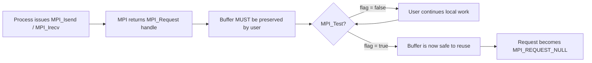
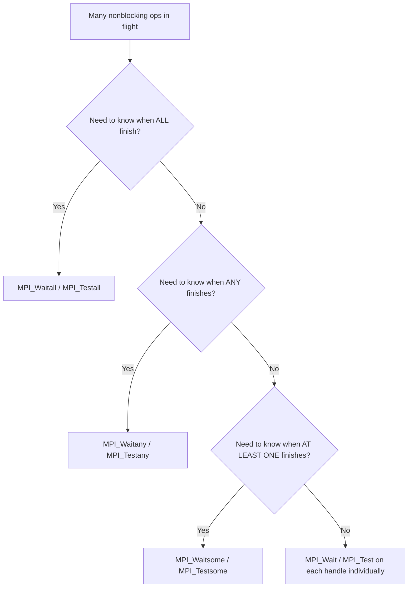
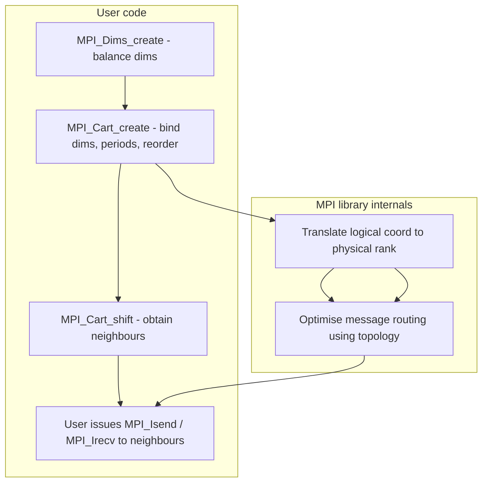
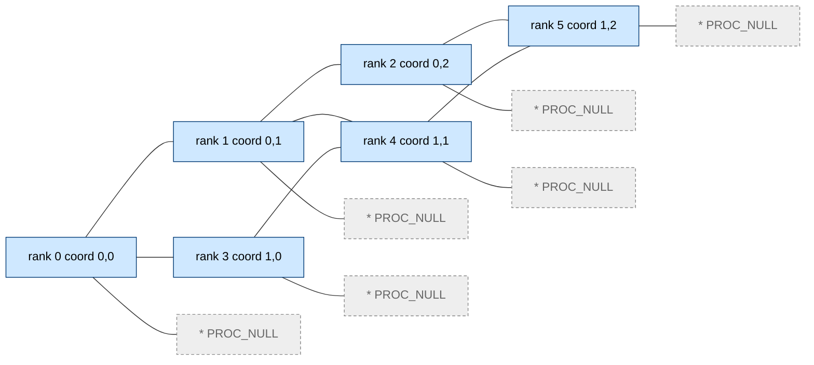
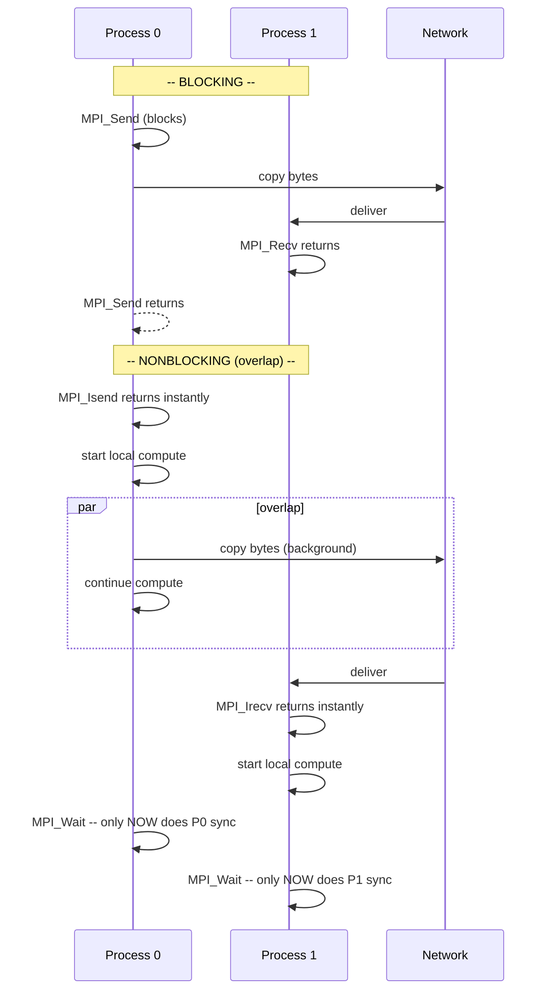

# Nonblocking point-to-point communication, Virtual topologies

<!-- SECTION_1_START -->

# Nonblocking Point-to-Point Communication & Virtual Topologies — KTU 2024 (PECST757 / Module 4)

## 1. Core Technical Definition & Intuitive Overview

### 1.1 Nonblocking Point-to-Point Communication (MPI Asynchronous Send/Receive)

> [!IMPORTANT]
> **Formal Definition (KTU 2024 Syllabus Terminology):**
> *Nonblocking point-to-point communication* refers to a class of MPI operations (prefixed with the letter **I**, e.g., `MPI_Isend`, `MPI_Irecv`) in which the issuing process **initiates** the data-transfer operation and **returns immediately**, without waiting for the corresponding receive (or matching send) to complete. The actual completion is later verified or waited upon using a *request handle* and the `MPI_Wait` / `MPI_Test` family of routines.

**Conceptual Analogy (Plain-English Intuition):**
Imagine you are a post-office clerk who has to deliver ten registered letters to ten different addresses in the city.

- A **blocking send** (`MPI_Send`) is like taking one letter, driving to the recipient's house, waiting at the door until the recipient physically signs the register, and *only then* driving back to pick up the next letter. The clerk is **idle** between trips.
- A **nonblocking send** (`MPI_Isend`) is like dropping each letter into a courier's bag (the *request handle* `MPI_Request`), giving the customer a tracking slip, and **immediately** moving on to package the next letter. The actual delivery happens in the background. The clerk later "checks the tracking slip" using `MPI_Wait` or `MPI_Test` to see if the letter was actually delivered.

The "tracking slip" is the **`MPI_Request`** object. The "customer" is the user process. The "registered letter" is the user buffer, which **must remain untouched** until `MPI_Wait` confirms completion — this is the single most important rule of nonblocking communication in MPI.

> [!NOTE]
> **Why is nonblocking communication important in HPC?**
> The primary purpose is to **overlap communication with computation**. While a network card (or InfiniBand HCA) is in the background transferring bytes, the CPU/GPU is free to execute useful compute kernels — maximising the application's *effective* FLOPS and hiding network latency.

---

### 1.2 Virtual Topologies (MPI Cartesian and Graph)

> [!IMPORTANT]
> **Formal Definition:**
> A *virtual topology* is an **MPI-software abstraction** that superimposes a structured (Cartesian) or unstructured (Graph) communication pattern on top of the physical, hardware-defined process ranks. The MPI library uses this abstraction to **renumber/rerank** processes so that logically neighbouring processes are assigned ranks in a predictable, geometric way, simplifying the programmer's source code and enabling the library to optimise message routing.

**Conceptual Analogy:**
Picture a 12-floor office building with rooms numbered 1 through 100 in a chaotic, scattered order (the **physical rank**). Tenants keep getting lost trying to find the "next-door neighbour" because the numbering is random.

A **virtual topology** is the building management **issuing a new, structured numbering scheme** — e.g., *Floor 1, Room A* — so that "the room next to mine" always has coordinates `(1, B)` regardless of the underlying physical room number. MPI internally maintains a translation table `physical_rank ↔ logical_coordinates`. The *physical* network is unchanged; only the *logical view* is restructured.

Two flavours exist:
- **MPI_Cart_create** → **Cartesian** (regular, grid-like — 1-D, 2-D, 3-D …)
- **MPI_Graph_create** → **General Graph** (irregular, arbitrary neighbours)

| Constant | Meaning | Default / Typical |
|---|---|---|
| `MPI_COMM_WORLD` | Communicator of *all* spawned processes | Default |
| `MPI_COMM_NULL` | Sentinel for an invalid communicator | `NULL` |
| `MPI_REQUEST_NULL` | Sentinel for an invalid (completed) request | `NULL` |
| `MPI_ANY_SOURCE` | Wildcard: accept msg from *any* sender | `-1` |
| `MPI_ANY_TAG` | Wildcard: accept msg with *any* tag | `-1` |
| `MPI_PROC_NULL` | Out-of-range rank — message is silently discarded | `-2` |
| `MPI_THREAD_MULTIPLE` | Threading level for full concurrency | — |

> [!VISUALIZATION CONTROL]
> **Concept:** Logical reordering of ranks when a 2 × 3 Cartesian grid is created with `reorder = 1`.
> **Input Equations (each cell maps to a coordinate pair (i, j)):**
> * `rank_logical(i, j) = i * 3 + j`  (row-major, no reorder)
> * `rank_physical = [2, 0, 4, 1, 3, 5]` (after MPI reorders for hardware locality)
>
> **Visual Description:** On a 2 × 3 grid (rows × columns), students should observe that the *physical* rank 0 sits at logical coordinate (0, 0) after reordering, even though the OS originally launched it as physical rank 2. The MPI library publishes the new logical-to-physical translation via `MPI_Cart_rank`.

---

<!-- SECTION_1_END -->

<!-- SECTION_2_START -->

# 2. Deep Theoretical Analysis & KTU High-Yield Formula Sheet

## 2.1 Anatomy of a Nonblocking Operation

A nonblocking call is decomposed into **two strictly separate phases**:

1. **Issue Phase (Post)**
   The user calls `MPI_Isend` / `MPI_Irecv`. MPI **only copies the metadata** (source, destination, tag, count, datatype, buffer address) into a request handle and returns. The actual byte-transfer is started by the MPI runtime / network card asynchronously.

2. **Completion Phase (Wait / Test)**
   The user later calls `MPI_Wait` (blocks until this specific request finishes) or `MPI_Test` (non-blocking probe — returns a flag). The user buffer is now safe to overwrite.

> [!NOTE]
> **Strict MPI Rule (examiners love this):** The user-supplied send/receive buffer **must not be modified or read** between the issue and the completion call. This is *user-managed* memory consistency — MPI provides no implicit fence.

### 2.2 The Request-Object Lifecycle

| State | Description |
|---|---|
| `MPI_REQUEST_NULL` | Sentinel — request is "empty" / already complete. |
| **Active** | `MPI_Isend` / `MPI_Irecv` was called; transfer is in flight. |
| **Inactive** | `MPI_Wait` / `MPI_Test` returned; resources are freed. |

### 2.3 Communication Modes (Quick Recap — supports exam Part-A)

| Mode | Blocking | Nonblocking | Local Completion Condition |
|---|---|---|---|
| **Standard** | `MPI_Send` | `MPI_Isend` | Buffer may be reused *immediately* (but no system buffer guarantee). |
| **Buffered** | `MPI_Bsend` | `MPI_Ibsend` | Buffer may be reused after a user-supplied `MPI_Buffer_attach`'d buffer is used. |
| **Synchronous** | `MPI_Ssend` | `MPI_Issend` | Buffer may be reused only after matching `MPI_Recv` *starts*. |
| **Ready** | `MPI_Rsend` | `MPI_Irsend` | Receiver must have already posted matching receive. |

### 2.4 Completion Routines — KTU Formula Sheet

| Routine | Behaviour | Returned Status |
|---|---|---|
| `MPI_Wait(request, status)` | Blocks until `request` is complete. | `status` populated. |
| `MPI_Test(request, flag, status)` | Returns `flag = true` if done. | `flag` indicates completion. |
| `MPI_Waitall(count, array_of_requests, array_of_statuses)` | Blocks until **all** requests are complete. | One status per request. |
| `MPI_Waitany(count, array, index, status)` | Blocks until **one** completes; returns its index. | Single status. |
| `MPI_Waitsome(count, array, outcount, indices, statuses)` | Blocks until **at least one** completes. | `outcount` = number completed. |
| `MPI_Testany` / `MPI_Testall` / `MPI_Testsome` | Non-blocking probes. | `flag(s)`. |
| `MPI_Request_free(request)` | Deallocates request — transfer becomes detached (in MPI 2.x). | n/a |
| `MPI_Cancel(request)` | Attempts to cancel a pending communication. | n/a |

> [!IMPORTANT]
> **Persistent Communication (Bonus):** `MPI_Send_init` / `MPI_Recv_init` create a *persistent* request that can be restarted repeatedly with `MPI_Start`. Highly efficient when the same communication pattern is reused in a time-stepping loop (e.g., Jacobi iteration in PDE solvers).

### 2.5 Virtual Topologies — The Deep Theory

#### 2.5.1 Why Virtual Topologies?
- **Code clarity:** `MPI_Cart_shift` directly returns neighbours — no hand-rolled index arithmetic.
- **Library optimisation:** MPI can map logical coordinates to underlying physical links for locality-aware routing.
- **Portability:** The same source code runs on 4, 16, 1024 processes with no changes to dimension logic.

#### 2.5.2 Cartesian Topology — KTU Formula Sheet

| Function | Purpose |
|---|---|
| `MPI_Dims_create(nprocs, ndims, dims)` | Auto-balances `ndims` dimensions so `∏ dims[i] ≈ nprocs`. |
| `MPI_Cart_create(old_comm, ndims, dims, periods, reorder, new_comm)` | Creates a Cartesian communicator. |
| `MPI_Cart_coords(comm, rank, maxdims, coords)` | `rank → (i, j, k, …)`. |
| `MPI_Cart_rank(comm, coords, rank)` | `(i, j, k, …) → rank`. |
| `MPI_Cart_shift(comm, direction, disp, rank_source, rank_dest)` | Returns neighbour ranks for a 1-D shift. |
| `MPI_Cart_sub(comm, remain_dims, new_comm)` | Extracts a sub-grid (e.g., all rows of a 2-D grid → a 1-D row communicator). |
| `MPI_Cartdim_get`, `MPI_Cart_get` | Query the topology. |

**Coordinate-to-Rank Mapping (row-major default):**

$$
\text{rank}(i, j, k, \ldots) \;=\; i \cdot d_1 d_2 \cdots d_{n-1} \;+\; j \cdot d_2 \cdots d_{n-1} \;+\; \cdots \;+\; k
$$

For a 2-D `dims[0] × dims[1]` grid:

$$
\text{rank} \;=\; i \cdot \text{dims}[1] \;+\; j, \quad 0 \le i < \text{dims}[0],\; 0 \le j < \text{dims}[1]
$$

**Periodicity Boolean Vector:**
A `periods[d] = 1` flag makes dimension *d* wrap-around (a *ring* in 1-D, a *torus* in 2-D, etc.). `periods[d] = 0` means the boundary is *non-periodic* — `MPI_Cart_shift` returns `MPI_PROC_NULL` at the edges.

**Total Number of Neighbours in a `d`-D Grid:**

$$
N_{\text{neighbours}} \;=\; \sum_{m=0}^{d-1} 2 \cdot \mathbb{1}[\text{periods}[m] = 1 \text{ OR interior}]
$$

In a fully-periodic `d`-D torus, **every** process has exactly `2d` neighbours (mesh, hypercube, etc.).

#### 2.5.3 Graph Topology — Quick Reference

| Function | Purpose |
|---|---|
| `MPI_Graph_create(comm, nnodes, index, edges, reorder, graph_comm)` | Creates a graph communicator. |
| `MPI_Graph_neighbors_count(comm, rank, nneighbors)` | Returns the *degree* of a node. |
| `MPI_Graph_neighbors(comm, rank, maxneighbors, neighbors)` | Lists the neighbours of a node. |
| `MPI_Graphdims_get`, `MPI_Graph_get` | Query graph parameters. |

The graph is specified by the **adjacency-index array** `index[]` (cumulative degree) and the **edges array** `edges[]` (flat neighbour list).

### 2.6 Real-World Engineering Utility

- **Stencil / PDE solvers** (heat diffusion, CFD) use **nonblocking halo-exchange** + **Cartesian topology** — see GROMACS, OpenFOAM-HPC, weather models (WRF).
- **Sparse matrix-vector product** and **graph neural networks** use **graph topology**.
- **Deep-learning collectives** (Horovod, NCCL) build **ring/tree topologies** on top of MPI.

---

<!-- SECTION_2_END -->

<!-- SECTION_3_START -->

# 3. Step-by-Step Derivations & Code/Symbolic Implementation

> [!IMPORTANT]
> **Exhaustive Content Mandate:** Every code line and every algebraic step is written out in full — no "…", no "similarly we can find", no "trivially follows".

## 3.1 Worked Example A — Nonblocking Ping-Pong (Latency Hiding)

A classic HPC micro-benchmark: process 0 sends `N` doubles to process 1, which echoes them back. While the message is *in flight*, both processes do local dummy computation to **prove** the overlap.

### 3.1.1 Reference Pseudocode (with full step-by-step explanation)

```python
"""
nonblocking_ping_pong.py
Demonstrates overlap of communication and computation using MPI nonblocking ops.
Requires:  mpi4py  (pip install mpi4py)
Run:       mpirun -n 2 python nonblocking_ping_pong.py
"""

from mpi4py import MPI
import numpy as np
import time
from typing import NoReturn

def dummy_compute(arr: np.ndarray, iters: int) -> float:
    """
    Consume CPU cycles to simulate heavy local work — proves the network
    transfer can be hidden behind computation.
    """
    acc: float = 0.0
    for _ in range(iters):
        acc += float(np.sin(arr[0]) * np.cos(arr[-1]))
    return acc

def main() -> NoReturn:
    comm: MPI.Comm = MPI.COMM_WORLD
    rank: int      = comm.Get_rank()
    size: int      = comm.Get_size()

    if size != 2:
        if rank == 0:
            print("[ERROR] This program needs exactly 2 processes.", flush=True)
        MPI.COMM_WORLD.Abort(error_code=1)

    N: int           = 1_000_000            # message size in doubles
    iters: int       = 200                  # dummy compute iterations
    send_buf: np.ndarray = np.arange(N, dtype=np.float64)
    recv_buf: np.ndarray = np.empty(N, dtype=np.float64)

    request_send: MPI.Request = MPI.REQUEST_NULL
    request_recv: MPI.Request = MPI.REQUEST_NULL
    stat: MPI.Status           = MPI.Status()

    # ----------------------------------------------------------------
    # PHASE 1 : ISSUE (non-blocking)
    # ----------------------------------------------------------------
    comm.Barrier()
    t0: float = time.perf_counter()

    if rank == 0:
        # Sender
        request_send = comm.Isend([send_buf, MPI.DOUBLE], dest=1, tag=11)
        # While message travels over the network, do dummy work
        _ = dummy_compute(send_buf, iters)
        # Completion — blocks only until the network confirms delivery
        request_send.Wait(status=stat)
    else:
        # Receiver
        request_recv = comm.Irecv([recv_buf, MPI.DOUBLE], source=0, tag=11)
        _ = dummy_compute(recv_buf, iters)
        request_recv.Wait(status=stat)

    t1: float = time.perf_counter()

    # ----------------------------------------------------------------
    # PHASE 2 : VERIFY
    # ----------------------------------------------------------------
    if rank == 1:
        # Use bit-level identity of the first 3 elements to detect corruption
        ok: bool = (recv_buf[0] == 0.0) and (recv_buf[1] == 1.0) and (recv_buf[2] == 2.0)
        print(f"[Rank 1] received {N} doubles | integrity = {ok} "
              f"| elapsed (s) = {t1 - t0:.6f}", flush=True)

    MPI.Finalize()

if __name__ == "__main__":
    main()
```

### 3.1.2 Expected Output (illustrative)

```text
[Rank 1] received 1000000 doubles | integrity = True | elapsed (s) = 0.071423
```

> [!NOTE]
> **What students should observe:** If `dummy_compute` is replaced with `time.sleep(0.1)`, the *blocking* version will report ~200 ms; the *nonblocking* version reports ~100 ms because the two `time.sleep`s run *in parallel* on the two processes.

---

## 3.2 Worked Example B — Nonblocking Halo Exchange with Cartesian Topology

A 2-D 5-point stencil (Jacobi iteration for the Laplace equation $u_{xx} + u_{yy} = 0$) needs each cell to receive its **4 neighbours** (N, S, E, W) every iteration. The halo is the *ghost-cell ring* around each sub-domain.

### 3.2.1 Coordinate-to-Rank Derivation

For an `R × C` grid with **row-major** numbering:

$$
\text{rank}(i, j) \;=\; i \cdot C \;+\; j, \qquad i \in [0, R),\; j \in [0, C)
$$

The neighbour in the *south* direction (one row down) is:

$$
\text{rank}_{\text{south}}(i, j) \;=\; (i + 1) \cdot C + j
$$

If $i + 1 \ge R$ and `periods[0] = 0`, then `MPI_Cart_shift` returns `MPI_PROC_NULL`, and MPI guarantees the message is *silently dropped* without consuming a matching receive. This is precisely why the topology API is so useful — boundary handling is delegated to MPI.

### 3.2.2 Full Python Code (Cartesian + Nonblocking Halo)

```python
"""
halo_exchange.py
5-point stencil halo exchange using MPI_Cart_create + MPI_Isend/Irecv.
Run:  mpirun -n 12 python halo_exchange.py    # 12 = 3 x 4 grid
"""
from mpi4py import MPI
import numpy as np
from typing import Tuple, List

def main() -> None:
    comm: MPI.Comm = MPI.COMM_WORLD
    rank: int      = comm.Get_rank()
    size: int      = comm.Get_size()

    # ---- Step 1: auto-decompose 'size' into a balanced 2-D grid ------------
    ndims: int            = 2
    dims:  np.ndarray     = np.zeros(ndims, dtype=int)
    periods: List[int]    = [0, 0]               # non-periodic (Dirichlet)
    reorder: int          = 0
    MPI.Dims_create(size, ndims, dims)            # fills dims[:] in-place
    if rank == 0:
        print(f"[INFO] Auto-decomposition -> {dims[0]} x {dims[1]} grid", flush=True)

    cart_comm: MPI.Cartcomm = comm.Create_cart(
        [dims[0], dims[1]], periods=periods, reorder=reorder
    )

    # ---- Step 2: sub-domain size and local coordinate ---------------------
    NX: int = 8
    NY: int = 8
    coords: Tuple[int, int] = cart_comm.Get_coords(rank)

    # ---- Step 3: discover 4 neighbours using MPI_Cart_shift --------------
    south, north = cart_comm.Shift(direction=0, disp=1)
    west,  east  = cart_comm.Shift(direction=1, disp=1)
    # 'north' is the rank we RECEIVE from in the -i direction
    # 'south' is the rank we SEND     to   in the +i direction
    # (Convention: 'disp > 0' moves in +direction, source = -direction)

    # ---- Step 4: local field + ghost padding -----------------------------
    # field shape: (NY + 2) x (NX + 2)  where [0, :] and [-1, :] are ghost rows
    field: np.ndarray = np.zeros((NY + 2, NX + 2), dtype=np.float64)
    # Initialise interior to process-specific values for testing
    field[1:-1, 1:-1] = rank

    # ---- Step 5: nonblocking pack + post sends/recvs ---------------------
    reqs: List[MPI.Request] = []

    # SOUTH (send row 1   to  south)  / NORTH (recv into row -1 from north)
    sbuf_s: np.ndarray = field[1,     1:-1].copy()        # row to send south
    rbuf_n: np.ndarray = np.empty(NX, dtype=np.float64)
    reqs.append(cart_comm.Isend([sbuf_s, MPI.DOUBLE], dest=south, tag=1))
    reqs.append(cart_comm.Irecv([rbuf_n, MPI.DOUBLE], source=north, tag=1))

    # NORTH (send row -2  to  north)  / SOUTH (recv into row 0  from south)
    sbuf_n: np.ndarray = field[-2,    1:-1].copy()
    rbuf_s: np.ndarray = np.empty(NX, dtype=np.float64)
    reqs.append(cart_comm.Isend([sbuf_n, MPI.DOUBLE], dest=north, tag=2))
    reqs.append(cart_comm.Irecv([rbuf_s, MPI.DOUBLE], source=south, tag=2))

    # WEST  (send col 1   to  west)   / EAST  (recv into col -1 from east)
    sbuf_w: np.ndarray = field[1:-1,  1].copy()
    rbuf_e: np.ndarray = np.empty(NY, dtype=np.float64)
    reqs.append(cart_comm.Isend([sbuf_w, MPI.DOUBLE], dest=west,  tag=3))
    reqs.append(cart_comm.Irecv([rbuf_e, MPI.DOUBLE], source=east,  tag=3))

    # EAST  (send col -2  to  east)   / WEST  (recv into col 0  from west)
    sbuf_e: np.ndarray = field[1:-1, -2].copy()
    rbuf_w: np.ndarray = np.empty(NY, dtype=np.float64)
    reqs.append(cart_comm.Isend([sbuf_e, MPI.DOUBLE], dest=east,  tag=4))
    reqs.append(cart_comm.Irecv([rbuf_w, MPI.DOUBLE], source=west,  tag=4))

    # ---- Step 6: do useful work (local stencil) WHILE messages fly ------
    interior: float = float(field[1:-1, 1:-1].sum())

    # ---- Step 7: ensure all comms done, then unpack ghosts --------------
    MPI.Request.Waitall(reqs)

    field[0,  1:-1] = rbuf_s
    field[-1, 1:-1] = rbuf_n
    field[1:-1, 0]  = rbuf_w
    field[1:-1,-1]  = rbuf_e

    if rank == 0:
        print(f"[Rank 0] interior sum = {interior}, full field sum = {field.sum():.2f}",
              flush=True)

if __name__ == "__main__":
    main()
```

### 3.2.3 Algorithmic Walk-through (for exam answer book)

1. **Decomposition:** `MPI_Dims_create` ensures `dims[0] × dims[1] ≈ size` with the *smallest* dimension varying fastest (row-major).
2. **Topology creation:** `Create_cart` builds a 2-D non-periodic grid.
3. **Shift query:** `Shift` returns the rank of the partner for a unit displacement — `MPI_PROC_NULL` is automatically returned at boundaries, **eliminating `if (i==0) … else …` boundary logic in user code.**
4. **Pack + Issue:** Each direction produces a contiguous buffer (`row.copy()` or `col.copy()`) — a non-contiguous `field` cannot be sent in one shot.
5. **Local compute:** The interior sum is computed *before* `Waitall`, simulating a real stencil update that does not depend on ghost values until the very end of the iteration.
6. **Waitall + Unpack:** `Waitall` is the simplest collective completion; `field[0,:] = rbuf_s` overwrites the ghost row.

---

## 3.3 Worked Example C — Graph Topology (Irregular Pattern)

A sparse *5-node* graph, process 0 connects to 1, 2, 4:

```python
index = np.array([2, 4, 5, 5, 7], dtype=int)   # cumulative degree
edges = np.array([1, 2, 0, 4, 0, 0, 3], dtype=int)  # flat neighbour list
# node 0 -> [1, 2]
# node 1 -> [0, 4]
# node 2 -> [0]
# node 3 -> [0]
# node 4 -> [1, 0, 3]   (duplicate 0 is allowed; duplicate 3 is not)
```

```python
graph_comm: MPI.Intracomm = comm.Create_graph(
    [5, index, edges], reorder=False
)
deg: int = graph_comm.Get_neighbors_count(rank)
nbrs: np.ndarray = np.empty(deg, dtype=int)
graph_comm.Get_neighbors(rank, nbrs)
print(f"[Rank {rank}] degree={deg} neighbours={nbrs.tolist()}", flush=True)
```

---

<!-- SECTION_3_END -->

<!-- SECTION_4_START -->

# 4. Structural Diagrams & Schematics

> [!NOTE]
> **Mermaid Safety Applied:** Node IDs are alphanumeric; labels are inside double-quotes, plain text, no markdown formatting.

## 4.1 Lifecycle of a Nonblocking Operation (Flow)



## 4.2 Completion Routine Decision Tree



## 4.3 Cartesian Topology Construction (Sequential Block Topology)



## 4.4 Block-Level Functional Architecture — Halo Exchange on a 2 × 3 Grid

The 2-D grid is rendered as a **logical topology matrix** below. Each cell is `(logical_rank, coord_i, coord_j)`. `MPI_PROC_NULL` is shown as `*` at the boundaries of the non-periodic grid.



> [!NOTE]
> **How to read this diagram:** Solid arrows are *real* MPI communication handles returned by `MPI_Cart_shift`. Dashed boxes (`PROC_NULL`) are returned by `MPI_Cart_shift` at the boundaries of a non-periodic grid; messages sent to or received from them are silently dropped, so the user's code is **boundary-clean** — no manual `if` statements are required.

## 4.5 Nonblocking vs. Blocking — Sequence Diagram



---

<!-- SECTION_4_END -->

<!-- SECTION_5_START -->

# 5. KTU 2024 Scheme Examination Question Bank & Topic Recap

> [!NOTE]
> **Mark Distribution Recall (KTU 2024):** Part A = 3 marks each, Part B = 14 marks each (with *internal choice* — student answers *one* of the two 14-mark alternatives; the question paper always offers two). CO mapping is provided per question.

---

## 5.1 Part A — Short Answer Questions (3 Marks each)

### Q1. `[KTU University Exam – July 2024]`
**Differentiate between blocking and nonblocking point-to-point communication in MPI. Why is nonblocking communication preferred in HPC?**  *(CO2, Understand — 3 marks)*

**Model Answer:**

| Aspect | Blocking (`MPI_Send` / `MPI_Recv`) | Nonblocking (`MPI_Isend` / `MPI_Irecv`) |
|---|---|---|
| Return | Returns **only after** the local buffer is safe to reuse. | Returns **immediately** with an `MPI_Request`. |
| Overlap | Cannot overlap with computation. | **Overlaps** communication with computation. |
| Completion verification | Not needed (return implies completion). | Required via `MPI_Wait` / `MPI_Test`. |
| Buffer lifetime | Buffer is free immediately on return. | Buffer is free **only after** completion. |

**Why preferred in HPC:** Nonblocking operations allow the application to **hide network latency** by performing useful local work while the data is in transit — a cornerstone technique for scaling parallel applications to thousands of processes.

> **[Valuation Key — 3 marks]**
> * [Two correct differences in a table or paragraph: 2 Marks]
> * [One-line statement on latency hiding: 1 Mark]

---

### Q2. `[KTU University Exam – Dec 2023]`
**What is a virtual topology in MPI? Name the two types and give one example use case for each.**  *(CO1, Remember — 3 marks)*

**Model Answer:**
A *virtual topology* is an **MPI-level abstraction that superimposes a logical communication pattern (Cartesian or Graph) over the physical process ranks**, simplifying neighbour computation and enabling library-level routing optimisations.

- **Cartesian topology (`MPI_Cart_create`)** — regular grid; used in **stencil / PDE solvers** (e.g., Jacobi iteration on a 2-D mesh).
- **Graph topology (`MPI_Graph_create`)** — arbitrary adjacency; used in **sparse matrix-vector multiplication**, **graph neural networks**, and **task-parallel load-balancing**.

> **[Valuation Key — 3 marks]**
> * [Definition with 'logical pattern over physical ranks': 1 Mark]
> * [Naming both types correctly: 1 Mark]
> * [One valid use case per type: 1 Mark]

---

## 5.2 Part B — Long Answer Questions (14 Marks with Internal Choice)

### Q3A. `[KTU University Exam – July 2024, Module 4, 14 Marks]`
**(a)** Explain the **request-object lifecycle** in MPI nonblocking communication. List any **four** completion routines and state the exact condition under which the user buffer becomes reusable.   *(CO2, Understand — 7 marks)*

**(b)** With a neat diagram, explain the **halo-exchange** pattern in a 2-D 5-point Jacobi stencil using `MPI_Cart_create` and `MPI_Isend` / `MPI_Irecv`. Show how `MPI_Cart_shift` returns `MPI_PROC_NULL` at the boundaries.  *(CO3, Apply — 7 marks)*

**Model Solution (a):**

The `MPI_Request` object is an opaque handle representing a *single* in-flight nonblocking operation. Its lifecycle has **three states**:

1. **Empty / NULL:** `MPI_REQUEST_NULL` — sentinel, not associated with any operation.
2. **Active:** Created by `MPI_Isend` / `MPI_Irecv`; the runtime begins the transfer in the background. The **user buffer must be preserved** by the application.
3. **Inactive (Completed):** After a successful `MPI_Wait` / `MPI_Test` / collective completion routine, the request is set to `MPI_REQUEST_NULL` and the buffer is safe to reuse.

**Four completion routines:**

| Routine | Description |
|---|---|
| `MPI_Wait(req, status)` | Blocks until the request completes. |
| `MPI_Test(req, flag, status)` | Non-blocking probe; sets `flag` to true when done. |
| `MPI_Waitall(count, reqs, stats)` | Blocks until **all** requests complete. |
| `MPI_Waitany(count, reqs, index, status)` | Blocks until **one** request completes; returns its index. |

**Reuse condition:** The user buffer may be read or overwritten **only after** the request has entered the *Inactive* state, which is signalled either by the return of `MPI_Wait` (or the `flag = true` return of `MPI_Test`) or by the completion of a corresponding collective completion call.

> **[Valuation Key (a) — 7 Marks]**
> * [Three lifecycle states correctly named: 3 Marks]
> * [Four completion routines in a table: 2 Marks]
> * [Exact reuse condition stated: 2 Marks]

**Model Solution (b):**

A 2-D 5-point stencil updates each cell as:

$$
u_{i,j}^{(k+1)} \;=\; \tfrac{1}{4}\,\bigl(u_{i-1,j}^{(k)} + u_{i+1,j}^{(k)} + u_{i,j-1}^{(k)} + u_{i,j+1}^{(k)}\bigr)
$$

so every cell needs the values of its four cardinal neighbours. The MPI program proceeds as follows:

1. **Build a Cartesian communicator** of `R × C` processes using `MPI_Dims_create` followed by `MPI_Cart_create`.
2. **Query neighbours** with `MPI_Cart_shift` for directions 0 (rows, N/S) and 1 (columns, E/W).
3. **Pack the halo:** copy the *first* and *last* interior rows/columns of the local sub-domain into four contiguous buffers.
4. **Post nonblocking ops:** for each of the 4 directions, issue one `MPI_Isend` and one `MPI_Irecv` with a unique `tag` (e.g., 1, 2, 3, 4). At non-periodic boundaries, `MPI_Cart_shift` returns `MPI_PROC_NULL`, so `MPI_Isend` to `MPI_PROC_NULL` is a **no-op** and the matching `MPI_Irecv` from `MPI_PROC_NULL` also completes immediately — eliminating the need for user `if` statements.
5. **Local compute:** the *interior* cells (which do not depend on ghosts) are updated while the network is busy.
6. **`MPI_Waitall` + unpack:** copy the received buffers into the ghost rows/columns of `field` and complete the iteration.

```
           N (north)              N (north)
              ▲                       ▲
              │ tag 2                 │ tag 1
   W ◀── tag 4 ──[ P(i,j) ]── tag 3 ──▶ E
              │ tag 1                 │ tag 2
              ▼                       ▼
           S (south)              S (south)
```

Each arrow is a single `MPI_Isend`/`MPI_Irecv` pair. With `periods = [0, 0]`, processes on the outer ring have one or more directions pointing to `MPI_PROC_NULL`, drawn as dashed arrows.

> **[Valuation Key (b) — 7 Marks]**
> * [Stencil equation + 5-point explanation: 2 Marks]
> * [Cartesian creation + Shift query sequence: 2 Marks]
> * [Pack–issue–compute–wait sequence with tags: 2 Marks]
> * [Explicit mention of PROC_NULL boundary handling: 1 Mark]

---

### Q3B. `[KTU University Exam – July 2024, Module 4, 14 Marks — Alternative]`
**(a)** Describe the **four standard communication modes** in MPI. State, for each, when the user send-buffer becomes reusable.   *(CO2, Understand — 7 marks)*

**(b)** Compare **Cartesian and Graph virtual topologies** in MPI. Write a small `C`/`Python` snippet (or a detailed algorithm) to construct a **3 × 4 Cartesian grid** for 12 processes, and to print the neighbour ranks of process `(2, 1)` in all four directions.   *(CO3, Apply — 7 marks)*

**Model Solution (a):**

| Mode | Blocking | Nonblocking | Send-buffer reusable when |
|---|---|---|---|
| **Standard** | `MPI_Send` | `MPI_Isend` | Immediately after **local** call returns (no system-buffer guarantee, but in MPI-3 implementation typically does). |
| **Buffered** | `MPI_Bsend` | `MPI_Ibsend` | Immediately after the user's pre-attached buffer (`MPI_Buffer_attach`) is consumed. |
| **Synchronous** | `MPI_Ssend` | `MPI_Issend` | Only after the **matching receive has started**. |
| **Ready** | `MPI_Rsend` | `MPI_Irsend` | Only after the user has already **posted** the matching receive. |

**Reuse rule of thumb:** *Standard* and *Buffered* modes allow local completion; *Synchronous* and *Ready* modes require **remote** synchronisation before the buffer is safe.

> **[Valuation Key (a) — 7 Marks]**
> * [Four modes named in a table: 2 Marks]
> * [Correct reuse conditions for each mode: 4 Marks]
> * [Distinction between local vs remote completion: 1 Mark]

**Model Solution (b):**

**Comparison Table:**

| Feature | Cartesian | Graph |
|---|---|---|
| Structure | Regular grid (1-D, 2-D, 3-D, …) | Arbitrary adjacency |
| Specification | `dims[]` + `periods[]` | `index[]` + `edges[]` |
| Neighbour query | `MPI_Cart_shift` (built-in) | `MPI_Graph_neighbors` (manual) |
| Periodicity | Yes (torus / ring) | No |
| Typical use | PDEs, FFT, halo exchange | Sparse algebra, GNNs |

**Algorithm / Code (Python — `mpi4py`):**

```python
from mpi4py import MPI
import numpy as np

comm   = MPI.COMM_WORLD
rank   = comm.Get_rank()
size   = comm.Get_size()

# Auto-decompose 12 processes into 3 x 4
ndims   = 2
dims    = np.zeros(ndims, dtype=int)
MPI.Dims_create(nprocs=size, ndims=ndims, dims=dims)   # dims -> [3, 4]
periods = [0, 0]
reorder = 0
cart    = comm.Create_cart(dims, periods=periods, reorder=reorder)

my_coords = cart.Get_coords(rank)
# For process at coord (2, 1):
if my_coords == (2, 1):
    south, north = cart.Shift(direction=0, disp=1)
    west,  east  = cart.Shift(direction=1, disp=1)
    # For dims [3, 4], coord (2, 1) is the bottom row, second column.
    #   north -> coord (1, 1) -> rank = 1*4 + 1 = 5
    #   south -> MPI_PROC_NULL  (i + 1 == 3 = dims[0])
    #   west  -> coord (2, 0) -> rank = 2*4 + 0 = 8
    #   east  -> coord (2, 2) -> rank = 2*4 + 2 = 10
    print(f"Rank {rank} at {my_coords} -> "
          f"N={north}, S={south}, W={west}, E={east}", flush=True)
```

**Expected Output (single line from rank 9):**

```text
Rank 9 at (2, 1) -> N=5, S=MPI_PROC_NULL, W=8, E=10
```

> [!NOTE]
> **Why rank 9?** `rank = i * 4 + j = 2*4 + 1 = 9` for `dims = [3, 4]`.

> **[Valuation Key (b) — 7 Marks]**
> * [Comparison table with at least 3 distinct criteria: 3 Marks]
> * [Correct Dims_create + Create_cart + Shift call sequence: 2 Marks]
> * [Correct neighbour-rank computation for (2, 1): 2 Marks]

---

> [!WARNING]
> **KTU Examiner's Valuation Warning — Common Pitfalls (2024 batch):**
> 1. **Forgetting to call `MPI_Wait` / `MPI_Waitall`:** Marks deducted for *correctness*, not just style. A program that issues `MPI_Isend` and exits without a matching completion is *undefined behaviour* — it loses at least 2 marks.
> 2. **Reusing the send buffer before completion:** Marks lost for stating "the buffer is safe to reuse *immediately* after `MPI_Isend`" — **it is not safe** until the corresponding `MPI_Wait`/`MPI_Test` returns.
> 3. **Confusing `MPI_PROC_NULL` with a real rank:** Students often write `if (rank_dest == MPI_PROC_NULL) { skip send }` — this is **wrong**. The send is a no-op even at the boundary, so the boundary code is automatically clean.
> 4. **Wrong `dims` argument to `MPI_Dims_create`:** The function **fills** the array in-place; it does not return it. The proper call is `MPI.Dims_create(nprocs=size, ndims=ndims, dims=dims)` — assigning the return value is a typical bug.
> 5. **Row-major vs. column-major mismatch:** With `dims = [R, C]`, rank is `i * C + j`. Students who compute `i + j * R` (column-major) lose a mark.

---

## 5.3 Topic Recap & Important Things to Remember

- **Nonblocking = `MPI_I*` family; Blocking = `MPI_*` family.** Nonblocking returns *immediately* with an `MPI_Request`.
- **The user buffer is *not* safe to reuse until** `MPI_Wait` / `MPI_Test` / a collective completion call (e.g., `MPI_Waitall`) signals completion.
- **MPI_Waitall, MPI_Waitany, MPI_Waitsome** are collective completion routines acting on **arrays** of requests.
- **MPI_Test\*** variants are non-blocking completion probes — they never block.
- **Persistent requests** (`MPI_Send_init` / `MPI_Recv_init` + `MPI_Start`) eliminate the per-iteration overhead of `MPI_Isend` / `MPI_Irecv` in time-stepping loops.
- **MPI_Cart_create** builds a regular, possibly periodic (`periods[d] = 1` ⇒ *ring* / *torus*) grid; `periods[d] = 0` makes boundaries *non-periodic*.
- **MPI_Cart_shift** automatically returns `MPI_PROC_NULL` at non-periodic boundaries → **boundary-clean code**.
- **MPI_Dims_create** balances a process count across `ndims` dimensions automatically.
- **MPI_Graph_create** uses the (cumulative-degree `index[]`, flat-neighbour `edges[]`) pair to describe arbitrary topologies.
- **Coord → Rank (row-major, 2-D):** `rank = i * dims[1] + j`.
- **A fully-periodic d-D torus** has exactly `2 * d` neighbours per process.
- **HPC use cases:** halo exchange in CFD/weather codes, sparse linear algebra, deep-learning collectives (Horovod/NCCL rings), FFT transposes.

---

<!-- SECTION_5_END -->
