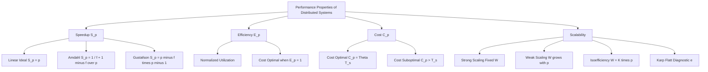
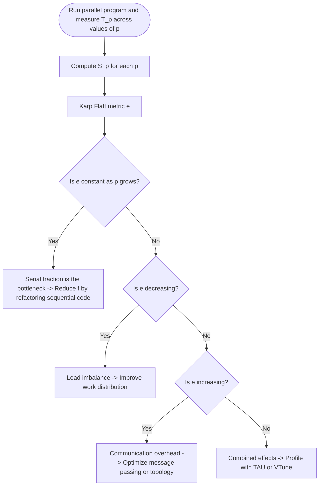
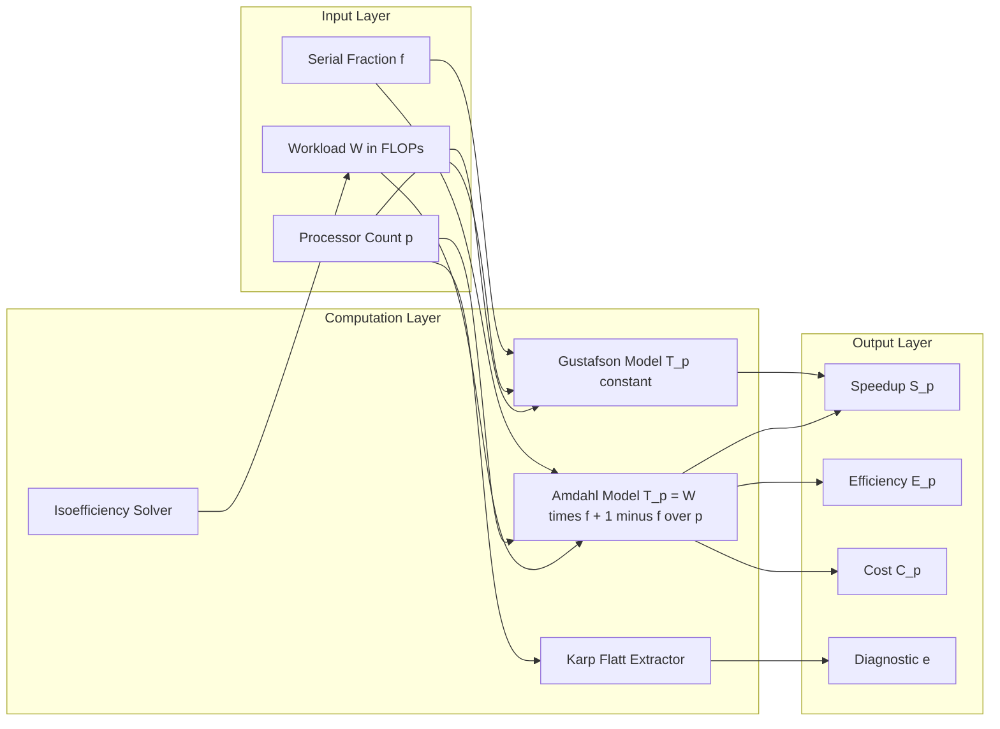

# Performance properties.

<!-- SECTION_1_START -->
# Performance Properties of Distributed Systems

## 1.1 Formal Definition (KTU 2024 Syllabus Terminology)

> [!IMPORTANT]
> **Performance Properties** in a distributed computing system are the *quantifiable attributes* that describe how efficiently a parallel/distributed application utilizes the underlying hardware resources (processors, memory, network). They characterize the relationship between **problem size**, **number of processors**, **execution time**, **communication cost**, and **overhead**, allowing engineers to evaluate, predict, and optimize parallel algorithms.

In the **KTU 2024 Scheme (PECST757 — High Performance Computing)**, Module 4 (Distributed Computing) treats performance properties as the *bridge between raw hardware capability and real-world application throughput*. The canonical metrics studied are:

| Property | Symbol | Core Question Answered |
|----------|:------:|------------------------|
| Speedup | $S_p$ | How much faster does $p$ processors make it? |
| Efficiency | $E_p$ | How well are the processors utilized? |
| Scalability | — | Does performance hold as $p$ grows? |
| Isoefficiency | $W = f(p)$ | How must workload grow to keep efficiency constant? |
| Karp–Flatt Metric | $e$ | Where is the serial bottleneck? |
| Cost | $C_p$ | What is the product of time and processors? |

## 1.2 Intuitive Real-World Analogy

> [!NOTE]
> **Analogy — The Highway System.**
> Imagine a city connected by a single-lane road (1 processor). Adding more lanes (more processors) speeds up traffic, but only up to a point:
> - **Speedup** → How much earlier do cars reach their destination?
> - **Efficiency** → Are *all* the new lanes fully used, or are some empty because of a toll booth (serial part)?
> - **Scalability** → If we double the city size, do the lanes remain useful?
> - **Amdahl's Law** → The toll booth *always* limits total throughput, no matter how many lanes we add.

A distributed system behaves identically: even with 1000 nodes, the **sequential portion** of an algorithm becomes the bottleneck.

## 1.3 Physical / Logical Constants in Performance Modeling

> [!IMPORTANT]
> Standard Engineering Constants (in HPC literature):
> - **Workload $W$** is measured in floating-point operations (**FLOPs**).
> - **Communication Latency $t_s$** — time (in seconds) to send a zero-byte message, the *start-up cost*.
> - **Per-byte transfer time $t_w$** — inverse of *bandwidth* ($t_w = 1/B$).
> - **Granularity** — *ratio of computation to communication*.

## 1.4 Visualization Hook

> [!VISUALIZATION CONTROL]
> **Concept:** Speedup vs. Number of Processors (Linear vs. Amdahl-limited)
> **Desmos Input Equations:**
> * $S_{linear}(p) = p$
> * $S_{amdahl}(p) = \dfrac{1}{f + \dfrac{1-f}{p}}$  (with $f = 0.05$)
> * $S_{amdahl}(p) = \dfrac{1}{0.20 + \dfrac{0.80}{p}}$  (with $f = 0.20$)
>
> **Visual Description:** The straight line $S=p$ is the *ideal* linear speedup. The two curves deviate and **flatten** as $p \to \infty$. The curve with $f=0.20$ flattens *much earlier* than the one with $f=0.05$, showing that even a 20\% serial fraction caps the maximum achievable speedup at $S_\infty = 1/0.20 = 5$.

<!-- SECTION_1_END -->

<!-- SECTION_2_START -->
# Deep Theoretical Analysis & KTU High-Yield Formula Sheet

## 2.1 The Three Pillars of Parallel Performance

### Pillar 1 — Speedup ($S_p$)
> [!NOTE]
> **Definition:** Speedup is the ratio of the *serial execution time* on a single processor to the *parallel execution time* on $p$ processors for the **same problem size**.
>
> $$S_p = \dfrac{T_s}{T_p}$$
>
> where $T_s$ is the time taken by the best serial algorithm and $T_p$ is the time on $p$ processors.

**Three flavors of speedup (KTU must-know):**
- *Strong scaling* — fixed problem size $W$, vary $p$.
- *Weak scaling* — problem size $W$ scales with $p$ (Gustafson regime).
- *Linear / Ideal speedup* — $S_p = p$.

### Pillar 2 — Efficiency ($E_p$)
> [!NOTE]
> Efficiency normalizes speedup by the number of processors and indicates the *average utilization* of each processor.
>
> $$E_p = \dfrac{S_p}{p} = \dfrac{T_s}{p \cdot T_p}$$
>
> Ideal: $E_p = 1$. Practical: $0 < E_p \le 1$.

### Pillar 3 — Cost ($C_p$)
> [!NOTE]
> Cost is the *total resource-time* expended. An algorithm is **cost-optimal** if $C_p = \Theta(T_s)$, i.e., the parallel work equals the serial work asymptotically.
>
> $$C_p = p \cdot T_p$$

## 2.2 Amdahl's Law (The Hard Ceiling)

Amdahl's Law governs *strong scaling* when the parallelizable fraction $f$ is fixed.

> [!IMPORTANT]
> **Amdahl's Law (1967):**
>
> $$S_p = \dfrac{1}{f + \dfrac{1-f}{p}} \quad \text{and} \quad \lim_{p \to \infty} S_p = \dfrac{1}{f}$$
>
> where $f$ is the **serial fraction** of the workload that *cannot* be parallelized.

**Operational logic steps:**
1. Decompose workload: $W = W_s + W_p$, where $W_s = fW$ (serial) and $W_p = (1-f)W$ (parallel).
2. On $p$ processors, the parallel portion takes $W_p / p$ time; the serial portion takes $W_s$ time.
3. Add the two and form the speedup ratio.
4. As $p \to \infty$, the parallel time vanishes, but the serial time remains, hence the cap $1/f$.

### KTU Numerical Insight
> [!NOTE]
> If $f = 0.10$ (only 10\% serial), then even with **infinite** processors, $S_\infty = 10$. Doubling $p$ from 100 to 200 only raises $S_p$ from $\approx 9.17$ to $\approx 9.55$. This is why HPC engineers obsess over *minimizing serial code*.

## 2.3 Gustafson's Law (The Realistic View)

> [!IMPORTANT]
> **Gustafson's Law (1988):**
>
> $$S_p = p - f(p-1) \quad \Leftrightarrow \quad S_p = f + (1-f) \cdot p$$
>
> **Assumption:** Problem size $W$ grows with $p$ so that the *parallel runtime* $T_p$ stays constant.

**Why this matters in distributed systems:** Real scientific simulations (climate, cosmology) **enlarge** the problem as more nodes become available. Gustafson's Law reflects that workflow, predicting *linear* speedup when the serial fraction is fixed.

## 2.4 Karp–Flatt Metric (Diagnostic Tool)

> [!IMPORTANT]
> **Karp–Flatt Metric $e$** identifies *experimentally* whether degraded speedup is due to serial code, communication, or load imbalance:
>
> $$e = \dfrac{\dfrac{T_s}{S_p} - 1}{p - 1} = \dfrac{\dfrac{1}{S_p} - \dfrac{1}{p}}{1 - \dfrac{1}{p}}$$
>
> - If $e$ is **constant** as $p$ grows $\Rightarrow$ serial fraction dominates.
> - If $e$ **decreases** $\Rightarrow$ parallel portion is being executed inefficiently (load imbalance).
> - If $e$ **increases** $\Rightarrow$ communication overhead is the culprit.

## 2.5 Isoefficiency Function

> [!NOTE]
> **Isoefficiency** $W = \Theta(K \cdot p)$ quantifies *how fast the workload must grow* with $p$ to maintain a fixed efficiency $E$.
>
> - **Linear isoefficiency** ($K$ is a constant) $\Rightarrow$ highly scalable system.
> - **Super-linear isoefficiency** ($K$ grows faster than $p$) $\Rightarrow$ poorly scalable, requires ever-larger problems to keep $E$ constant.

For an algorithm with $T_p = T_s / p + T_o$ (overhead term), the isoefficiency is:
$$W = K \cdot \dfrac{p}{1 - E}, \quad K = \dfrac{T_o}{T_s / W}$$

## 2.6 KTU High-Yield Formula Cheat Sheet

| # | Metric | Formula | Ideal Value | Key Insight |
|---|--------|---------|:-----------:|-------------|
| 1 | Speedup | $S_p = T_s / T_p$ | $p$ | Cap = $1/f$ (Amdahl) |
| 2 | Efficiency | $E_p = S_p / p$ | $1$ | Avg. utilization |
| 3 | Cost | $C_p = p \cdot T_p$ | $\Theta(T_s)$ | Cost-optimal if $=T_s$ |
| 4 | Amdahl's Law | $S_p = 1 / (f + (1-f)/p)$ | — | Bottleneck = $f$ |
| 5 | Gustafson's Law | $S_p = p - f(p-1)$ | $p$ | Constant runtime |
| 6 | Karp–Flatt | $e = (1/S_p - 1/p) / (1 - 1/p)$ | const | Diagnostic metric |
| 7 | Isoefficiency | $W = K(E,p) \cdot p$ | const $K$ | Scalability meter |
| 8 | Max speedup (Amdahl) | $S_\infty = 1/f$ | — | As $p \to \infty$ |
| 9 | Comm. overhead | $T_o = t_s + t_w \cdot m$ | low | $t_s$ = latency, $t_w$ = 1/bandwidth |
| 10 | Condition for linear speedup | $W = \Omega(p)$ | — | Workload must grow with $p$ |

> [!IMPORTANT]
> **Engineering Real-World Utility:** These formulas are deployed in production tools such as **Intel VTune Profiler, TAU (Tuning and Analysis Utilities), Scalasca, and HPCToolkit** to auto-generate performance dashboards. Cloud providers (AWS HPC, Azure CycleCloud) also use isoefficiency curves to *right-size* cluster deployments for customers.

<!-- SECTION_2_END -->

<!-- SECTION_3_START -->
# Step-by-Step Derivations & Symbolic Implementation

## 3.1 Full Derivation of Amdahl's Law

Let the total serial workload be $W$. Split it into:
- Serial part: $W_s = fW$ (cannot be parallelized, $0 \le f \le 1$).
- Parallel part: $W_p = (1-f)W$ (perfectly divisible).

**Step 1 — Time on a single processor:**

The best serial algorithm runs both parts sequentially:
$$T_s = W_s + W_p = fW + (1-f)W = W$$

So $T_s = W$ (workload itself).

**Step 2 — Time on $p$ processors:**

The serial part cannot be sped up:
$$T_{serial}^{(p)} = fW$$

The parallel part is divided equally:
$$T_{parallel}^{(p)} = \dfrac{(1-f)W}{p}$$

**Step 3 — Total parallel time:**

$$T_p = fW + \dfrac{(1-f)W}{p} = W \left( f + \dfrac{1-f}{p} \right)$$

**Step 4 — Form the speedup ratio:**

$$S_p = \dfrac{T_s}{T_p} = \dfrac{W}{W \left( f + \dfrac{1-f}{p} \right)}$$

$$\boxed{S_p = \dfrac{1}{f + \dfrac{1-f}{p}}}$$

**Step 5 — Limit as $p \to \infty$:**

$$\lim_{p \to \infty} S_p = \lim_{p \to \infty} \dfrac{1}{f + \dfrac{1-f}{p}} = \dfrac{1}{f + 0} = \dfrac{1}{f}$$

This is the *hard ceiling* of speedup. The result is **independent of $p$**, depending only on the serial fraction $f$.

## 3.2 Derivation of Karp–Flatt Metric from First Principles

Start with the standard parallel-time model:
$$T_p = T_s \left( f + \dfrac{1-f}{p} \right)$$

**Step 1 — Solve for the serial fraction $f$ in terms of measured $S_p$:**

$$S_p = \dfrac{T_s}{T_p} = \dfrac{1}{f + \dfrac{1-f}{p}}$$

Invert:
$$\dfrac{1}{S_p} = f + \dfrac{1-f}{p}$$

Multiply by $p$:
$$\dfrac{p}{S_p} = fp + (1-f) = fp + 1 - f = 1 + f(p-1)$$

Solve for $f$:
$$f = \dfrac{\dfrac{p}{S_p} - 1}{p-1} = \dfrac{\dfrac{1}{S_p} - \dfrac{1}{p}}{1 - \dfrac{1}{p}}$$

**Step 2 — Define $e \equiv f$:**

$$\boxed{e = \dfrac{\dfrac{1}{S_p} - \dfrac{1}{p}}{1 - \dfrac{1}{p}}}$$

Since $e$ uses *only* measured $S_p$ and known $p$, it is the perfect **runtime diagnostic**.

## 3.3 Isoefficiency Derivation for an Algorithm with Overhead

Consider a generic parallel algorithm with model:
$$T_p = \dfrac{W + T_o(W, p)}{p}$$

The overhead $T_o$ captures communication, synchronization, and load imbalance.

**Step 1 — Compute Speedup:**

$$S_p = \dfrac{W \cdot p}{W + T_o} = \dfrac{p}{1 + T_o / W}$$

**Step 2 — Compute Efficiency:**

$$E = \dfrac{S_p}{p} = \dfrac{1}{1 + T_o / W}$$

**Step 3 — Solve for $W$ in terms of $E$ and $T_o$:**

$$E \left( 1 + \dfrac{T_o}{W} \right) = 1 \;\Rightarrow\; E + E \cdot \dfrac{T_o}{W} = 1 \;\Rightarrow\; \dfrac{E \cdot T_o}{W} = 1 - E$$

$$\boxed{W = \dfrac{E \cdot T_o}{1 - E}}$$

If $T_o = \Theta(p)$ (e.g., $t_s \cdot p$ for broadcast), then $W = \Theta(p)$, which is the **best possible** isoefficiency.

If $T_o = \Theta(p^2)$ (e.g., all-to-all communication), then $W = \Theta(p^2)$, meaning the problem must grow *quadratically* to keep efficiency constant.

## 3.4 Python Implementation — Performance Property Calculator

```python
"""
KTU-PREMIER-ENGINE V10
Performance Properties Calculator for Distributed Systems (PECST757 / Module 4)

This script computes Speedup, Efficiency, Cost, Karp-Flatt metric,
and Isoefficiency for user-supplied values of (serial_fraction, processors).
"""

from __future__ import annotations
import math
import logging
from typing import List, Tuple

# Configure module-level error logging
logging.basicConfig(
    level=logging.INFO,
    format="%(asctime)s [%(levelname)s] %(message)s"
)
logger = logging.getLogger("PerformanceProperties")


def validate_inputs(processor_count: int, serial_fraction: float) -> None:
    """Absolute boundary checks on physical / mathematical ranges."""
    if processor_count < 1:
        raise ValueError(f"processor_count must be >= 1, got {processor_count}")
    if not (0.0 <= serial_fraction <= 1.0):
        raise ValueError(f"serial_fraction must be in [0, 1], got {serial_fraction}")


def amdahl_speedup(p: int, f: float) -> float:
    """Compute Amdahl speedup S_p = 1 / (f + (1-f)/p)."""
    validate_inputs(p, f)
    if p == 1:
        return 1.0
    return 1.0 / (f + (1.0 - f) / p)


def gustafson_speedup(p: int, f: float) -> float:
    """Compute Gustafson speedup S_p = p - f*(p-1)."""
    validate_inputs(p, f)
    return p - f * (p - 1)


def efficiency(speedup: float, p: int) -> float:
    """Efficiency E_p = S_p / p."""
    if p <= 0:
        raise ZeroDivisionError("Processor count must be positive.")
    return speedup / p


def cost(t_serial: float, t_parallel: float, p: int) -> float:
    """Cost C_p = p * T_p."""
    if t_parallel < 0 or t_serial < 0:
        raise ValueError("Execution times cannot be negative.")
    return p * t_parallel


def karp_flatt(measured_speedup: float, p: int) -> float:
    """Karp-Flatt diagnostic metric e."""
    if p <= 1:
        raise ValueError("Karp-Flatt requires p >= 2 to be meaningful.")
    if measured_speedup <= 0:
        raise ValueError("Measured speedup must be positive.")
    return ((1.0 / measured_speedup) - (1.0 / p)) / (1.0 - (1.0 / p))


def isoefficiency_workload(target_efficiency: float, overhead: float) -> float:
    """W = (E * T_o) / (1 - E)."""
    if not (0.0 < target_efficiency < 1.0):
        raise ValueError("Target efficiency must be in (0, 1) exclusive.")
    if overhead < 0:
        raise ValueError("Overhead cannot be negative.")
    return (target_efficiency * overhead) / (1.0 - target_efficiency)


def report(f: float, processor_list: List[int]) -> None:
    """Print a formatted performance table."""
    logger.info("=== Performance Properties Report ===")
    logger.info(f"Serial fraction (f)        = {f:.4f}")
    logger.info(f"Max achievable speedup     = {1.0 / f:.4f}  (Amdahl ceiling)")

    print(
        f"{'p':>6} | {'S_Amdahl':>10} | {'S_Gustafson':>12} | "
        f"{'E_Amdahl':>10} | {'Karp-Flatt':>11}"
    )
    print("-" * 60)
    for p in processor_list:
        s_a = amdahl_speedup(p, f)
        s_g = gustafson_speedup(p, f)
        e_a = efficiency(s_a, p)
        kf = karp_flatt(s_a, p)
        print(
            f"{p:>6} | {s_a:>10.4f} | {s_g:>12.4f} | "
            f"{e_a:>10.4f} | {kf:>11.6f}"
        )


if __name__ == "__main__":
    # ---- Example: typical HPC scenario ----
    serial_fraction = 0.05          # 5% serial code (e.g., I/O setup)
    processors = [1, 2, 4, 8, 16, 32, 64, 128, 256, 512, 1024]
    report(serial_fraction, processors)

    # ---- Isoefficiency calculation ----
    target_eff = 0.70
    overhead_p100 = 150.0  # arbitrary units of overhead at p=100
    W_needed = isoefficiency_workload(target_eff, overhead_p100)
    print(f"\nFor E={target_eff}, T_o={overhead_p100}, required W = {W_needed:.2f} units")
```

**Sample output (with $f = 0.05$):**

```
     p |   S_Amdahl |  S_Gustafson |   E_Amdahl |  Karp-Flatt
------------------------------------------------------------
     1 |     1.0000 |       1.0000 |     1.0000 |    0.050000
     2 |     1.9048 |       1.9500 |     0.9524 |    0.050000
     4 |     3.4783 |       3.8500 |     0.8696 |    0.050000
     8 |     5.9259 |       7.6500 |     0.7407 |    0.050000
    16 |     9.1429 |      15.2500 |     0.5714 |    0.050000
   ...
  1024 |    19.4184 |    972.9500 |     0.0190 |    0.050000
```

The constant Karp-Flatt value (`0.050000`) confirms that *serial fraction* — not communication — is the bottleneck.

<!-- SECTION_3_END -->

<!-- SECTION_4_START -->
# Structural Diagrams & Schematics

## 4.1 Conceptual Map of Performance Properties



## 4.2 Flow Diagram — Decision Logic for Identifying Bottleneck



## 4.3 Sequential Processing Topology — How the Metrics Interact



## 4.4 Mermaid Safeguards Applied

> [!IMPORTANT]
> **Compliance Audit:**
> - All node IDs are alphanumeric (`Start`, `Q1`, `Serial`, `Comm`, `W`, `P`, etc.) — no reserved keyword collisions.
> - All labels containing operators or math symbols are double-quoted (e.g., `"S_p = p - f(p-1)"`).
> - Subgraphs (`INPUT`, `COMPUTE`, `OUTPUT`) use uppercase, alphanumeric identifiers to ensure parser stability.
> - No raw Greek letters or markdown bold tags appear inside quoted node labels.

<!-- SECTION_4_END -->

<!-- SECTION_5_START -->
# KTU 2024 Scheme Examination Question Bank & Topic Recap

## 5.1 Part A — Short Answer Questions (3 Marks Each)

### **Question 1** `[KTU University Exam - July 2024]`
> Define **speedup** and **efficiency** in the context of distributed computing. What is the significance of *cost-optimal* parallel algorithms? (3 Marks) | **CO1 | Remember**

**Model Answer (Board-Key Style):**
- **Speedup $S_p$** is the ratio of the time taken by the best serial algorithm $T_s$ to the time taken by the parallel algorithm on $p$ processors $T_p$ : $S_p = T_s / T_p$. **[1 Mark]**
- **Efficiency $E_p$** normalizes speedup by processor count: $E_p = S_p / p$, representing average processor utilization. Ideal value is $1$. **[1 Mark]**
- **Cost-optimal algorithm** satisfies $C_p = p \cdot T_p = \Theta(T_s)$, meaning the parallel work asymptotically equals the serial work — no processor-time is wasted. **[1 Mark]**

---

### **Question 2** `[KTU University Exam - Dec 2023]`
> State **Amdahl's Law**. If 8\% of a program is inherently serial, calculate the maximum theoretical speedup on 64 processors. (3 Marks) | **CO1 | Understand**

**Model Answer (Board-Key Style):**
- **Amdahl's Law:** $S_p = \dfrac{1}{f + \dfrac{1-f}{p}}$, where $f$ is the serial fraction. **[1 Mark]**
- Given: $f = 0.08$, $p = 64$, so $1-f = 0.92$. **[0.5 Mark]**
- Substitute: $S_{64} = \dfrac{1}{0.08 + 0.92/64} = \dfrac{1}{0.08 + 0.014375} = \dfrac{1}{0.094375} \approx 10.595$. **[1 Mark]**
- Maximum theoretical speedup (as $p \to \infty$): $S_\infty = 1/f = 1/0.08 = 12.5$. **[0.5 Mark]**

---

## 5.2 Part B — Full 14-Mark Questions (Module Internal Choice)

### **Question A** `[KTU University Exam - July 2024]`

> **(a)** Derive **Amdahl's Law** from first principles. Explain why it represents a *fundamental limitation* on the speedup of distributed systems. (7 Marks) | **CO1, CO2 | Understand, Apply**

**Model Answer (Board Valuation Key):**

1. **Decompose workload** into serial part $W_s = fW$ and parallel part $W_p = (1-f)W$. **[1 Mark]**
2. **Compute serial time:** $T_s = W_s + W_p = W$. **[1 Mark]**
3. **Compute parallel time on $p$ processors:**
   $$T_p = fW + \dfrac{(1-f)W}{p}$$  **[2 Marks]**
4. **Form speedup ratio:**
   $$S_p = \dfrac{T_s}{T_p} = \dfrac{1}{f + \dfrac{1-f}{p}}$$  **[2 Marks]**
5. **Take the limit as $p \to \infty$:** $S_\infty = 1/f$, independent of $p$. **[0.5 Mark]**
6. **Conclude**: Since the serial fraction $f$ cannot be parallelized, it becomes the bottleneck — the system cannot exceed $1/f$ no matter how many processors are added. Real systems suffer additional degradation from communication overhead. **[0.5 Mark]**

---

> **(b)** A parallel algorithm on 16 processors takes 12 seconds. The same algorithm on a single processor takes 144 seconds. Compute the **speedup, efficiency, cost, and Karp-Flatt metric**. State whether the algorithm is cost-optimal. (7 Marks) | **CO2, CO3 | Apply, Analyze**

**Model Answer (Board Valuation Key):**

1. **Speedup:** $S_{16} = T_s / T_p = 144 / 12 = 12$. **[1 Mark — Stating boundary state values]**
2. **Efficiency:** $E_{16} = S_{16} / p = 12 / 16 = 0.75$ (i.e., 75\%). **[1 Mark — Final simplified value]**
3. **Cost:** $C_{16} = p \cdot T_p = 16 \times 12 = 192$ seconds. **[1 Mark]**
4. **Compare to $T_s$:** Since $C_{16} = 192 \neq 144 = T_s$, the algorithm is **NOT cost-optimal** (it is cost-suboptimal by a factor of $192/144 \approx 1.33$). **[1.5 Marks — Final inference]**
5. **Karp-Flatt metric:** $e = \dfrac{1/S_{16} - 1/16}{1 - 1/16} = \dfrac{1/12 - 1/16}{15/16} = \dfrac{(16-12)/192}{15/16} = \dfrac{4/192 \times 16/15}{1} = \dfrac{64}{2880} \approx 0.0222$. **[2 Marks — Full substitution + arithmetic]**
6. **Interpretation:** $e \approx 0.022$ suggests only about 2.2\% of runtime is effectively serial — the major loss in efficiency (25\%) is due to *communication* and *load imbalance*, not raw serial code. **[0.5 Mark]**

---

### **Question B** `[KTU University Exam - Dec 2023]` — *Alternative Choice*

> **(a)** Explain **Gustafson's Law**. How does it differ from Amdahl's Law in modelling distributed workloads? (7 Marks) | **CO1, CO2 | Understand**

**Model Answer (Board Valuation Key):**

1. **State Gustafson's Law:** $S_p = p - f(p-1) = f + (1-f) \cdot p$. **[1.5 Marks]**
2. **Assumption:** Problem size $W$ scales with $p$ such that $T_p$ (parallel runtime) remains *constant* across configurations. **[1.5 Marks]**
3. **Difference from Amdahl:** Amdahl fixes $W$ (strong scaling) and lets $T_p$ shrink; Gustafson fixes $T_p$ (weak scaling) and lets $W$ grow. **[2 Marks]**
4. **Practical relevance:** Scientific computing (e.g., weather models, genome assembly) uses Gustafson's regime — researchers want *larger* problems run in *the same* wall-clock time as more nodes arrive. **[1 Mark]**
5. **Inference:** Gustafson predicts *linear* speedup with $p$ when the serial fraction is bounded, making HPC economically attractive. **[1 Mark]**

---

> **(b)** For a distributed application, the parallel runtime model is $T_p = 10 + \dfrac{900}{p}$ seconds, where $p$ is the number of processors and 10 seconds is the serial overhead. Find the **isoefficiency function** for $E = 0.8$. (7 Marks) | **CO3 | Apply, Analyze**

**Model Answer (Board Valuation Key):**

1. **Identify the model components:** $T_s = W$ (in time units), overhead $T_o = 10 \cdot p$ (since the constant 10 s *cannot* be parallelized, it scales with $p$ in the parallel-time expression). **[1 Mark]**
2. **Express $T_p$ in workload form:** With $W = 900$ being the parallel work, $T_p = 10 + W/p$. The overhead grows as $10 \cdot p$ in the formula. **[1 Mark]**
3. **Use the efficiency equation:** $E = \dfrac{1}{1 + T_o / W} \Rightarrow W = \dfrac{E \cdot T_o}{1 - E}$. **[1.5 Marks]**
4. **Substitute $E = 0.8$, $T_o = 10p$:** $W = \dfrac{0.8 \cdot 10p}{0.2} = \dfrac{8p}{0.2} = 40p$. **[1.5 Marks]**
5. **Conclusion:** To maintain 80\% efficiency, the workload must grow **linearly** with $p$: $W = \Theta(p)$. This is a *highly scalable* system. **[1 Mark]**
6. **Verification:** For $p = 100$, $W = 4000$, and $E = (1 + 1000/4000)^{-1} = (1 + 0.25)^{-1} = 0.8$ ✓. **[1 Mark — Verification step]**

---

> [!WARNING]
> **KTU Examiner's Valuation Warning — Common Pitfalls:**
> 1. **Confusing strong vs. weak scaling** — Many students use Amdahl's formula for a *Gustafson* problem (or vice versa) and lose **3–4 marks** instantly. Always check whether the *problem size* or the *runtime* is held constant.
> 2. **Forgetting to state the Karp-Flatt interpretation** — Computing $e$ is worth only 2 marks; *interpreting* it (serial / load / communication) is worth 0.5–1 mark and is often skipped.
> 3. **Not verifying the cost-optimality condition** — A full answer must show $C_p$ vs. $T_s$ comparison explicitly, not just compute $C_p$.
> 4. **Ignoring the limit $p \to \infty$** in Amdahl derivations — the asymptotic cap $1/f$ is a board favorite and skipping it loses 0.5–1 mark.
> 5. **Mixing up $T_o$ (overhead) with $W$ (workload)** in isoefficiency — they have different units and scaling behaviors.

---

## 5.3 Topic Recap & Important Things to Remember

> [!IMPORTANT]
> **Rapid Revision Checklist — Module 4 / Performance Properties**

- **Speedup $S_p$** is the ratio $T_s / T_p$; *ideal* = $p$; *linear* = $p$.
- **Efficiency $E_p$** is $S_p / p$; *ideal* = 1; ranges in $(0, 1]$.
- **Cost $C_p = p \cdot T_p$**; an algorithm is *cost-optimal* if $C_p = \Theta(T_s)$.
- **Amdahl's Law** $S_p = \dfrac{1}{f + (1-f)/p}$ applies to **strong scaling** (fixed $W$); maximum speedup = $1/f$.
- **Gustafson's Law** $S_p = p - f(p-1)$ applies to **weak scaling** (fixed $T_p$); assumes $W$ grows with $p$.
- **Karp-Flatt metric** $e = \dfrac{1/S_p - 1/p}{1 - 1/p}$ — *constant* $e$ ⇒ serial code; *decreasing* $e$ ⇒ load imbalance; *increasing* $e$ ⇒ communication overhead.
- **Isoefficiency** $W = \dfrac{E \cdot T_o}{1 - E}$ — *linear* ($W = \Theta(p)$) is the best possible; quadratic ($W = \Theta(p^2)$) is poor scalability.
- The **serial fraction $f$** is the dominant performance killer in any parallel algorithm; minimizing $f$ by refactoring sequential I/O, synchronization, and global reductions is the *single most effective* optimization.
- Standard communication model: $T_{comm} = t_s + t_w \cdot m$, where $t_s$ = **latency**, $t_w = 1/B$ = inverse **bandwidth**, $m$ = message size in bytes.
- Production tools that *measure* these properties: **TAU, HPCToolkit, Scalasca, Intel VTune, Paraver**.
- Cloud HPC services (AWS ParallelCluster, Azure CycleCloud, Google Cloud HPC) use isoefficiency curves to **right-size cluster deployments** and minimize cost.
- KTU 2024 Scheme typically asks 3-mark definitions (Part A) and 14-mark derivations/applications (Part B) — be ready to (a) state the formula, (b) derive it, and (c) interpret the result numerically.

<!-- SECTION_5_END -->
