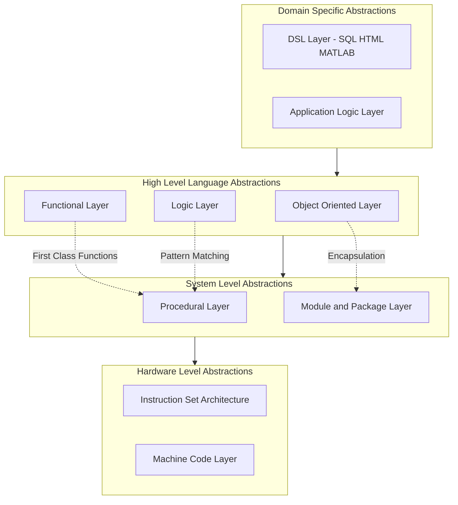
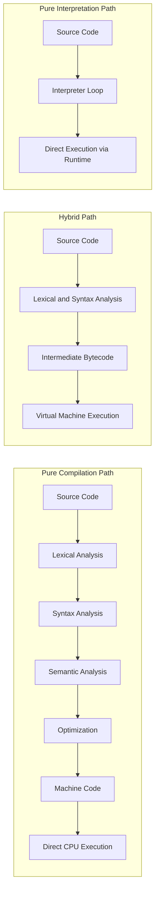
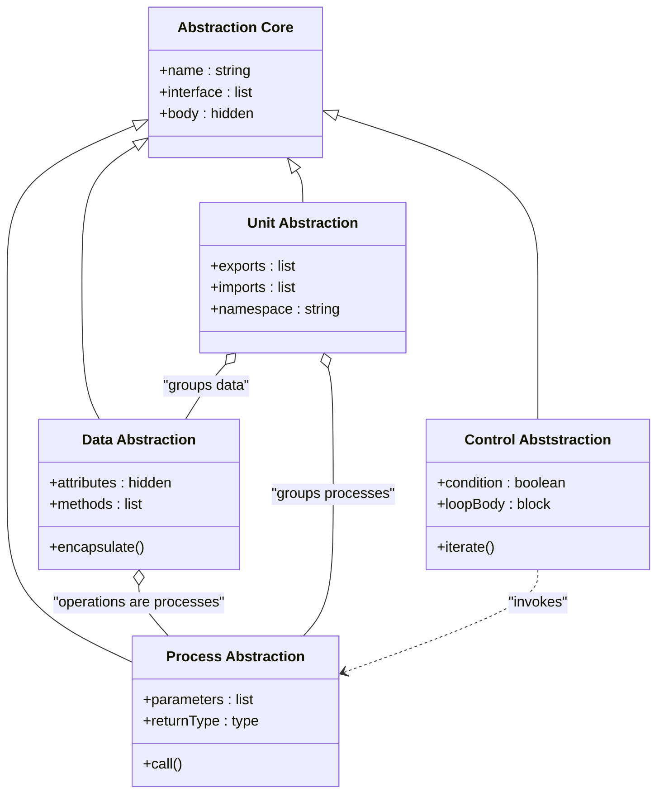

# Abstractions in Programming Languages

<!-- SECTION_1_START -->
# Abstractions in Programming Languages

> [!IMPORTANT]
> **KTU 2024 Scheme — Module 1 Anchor Definition**
> In the context of programming languages, an **abstraction** is a simplified representation of a complex system that emphasizes the essential features while suppressing irrelevant implementation details. Abstractions allow programmers to focus on **what** a program does rather than **how** it is implemented, thereby managing complexity across the software stack.

## 1.1 Formal Definition (KTU Board-Standard Wording)

An abstraction in a programming language is any named linguistic construct that hides one or more lower-level operational details behind a higher-level interface. The formal definition can be stated as:

$$\mathcal{A} = (N, I, B, C)$$

where:

- $N$ is the **name** (the lexical identifier exposed to the programmer).
- $I$ is the **interface** (the signature or contract visible to the caller).
- $B$ is the **body** (the hidden implementation).
- $C$ is the set of **invocation conventions** (parameters, return values, scoping rules).

> [!NOTE]
> KTU examiners expect the student to know that the *quality* of an abstraction is judged by **information hiding** (Parnas, 1972), **cohesion** (single responsibility), and **low coupling** (minimal inter-dependencies).

## 1.2 Intuitive Real-World Analogy

Think of an **automatic coffee machine**:

- You press a single button labelled *"Cappuccino"*.
- You do not see the boiler temperature curve, the pump pressure algorithm, the milk-frother timing, or the bean-grinder RPM profile.
- The button is the **interface**; everything behind it is the **hidden implementation**.

Programming language abstractions operate identically. A built-in function such as `sorted(list)` in Python hides quicksort internals, comparison logic, memory allocation, and stack depth — exposing only the *name*, the *input*, and the *output contract*.

| Human Activity | Equivalent Abstraction in Code |
|---|---|
| Driving a car | Subprogram call |
| Recipe in a cookbook | Function with parameters |
| Building blueprint | Class / ADT |
| Traffic light rule | Control structure (loop, conditional) |

## 1.3 The Four Pillars of Abstraction in PL

1. **Process Abstraction** — A *subprogram* (function, procedure, method) hides the sequence of actions.
2. **Data Abstraction** — An *Abstract Data Type (ADT)* hides the representation of data behind operations.
3. **Control Abstraction** — *Loops, conditionals, recursion, iterators* hide repetitive or conditional execution.
4. **Unit / Module Abstraction** — *Packages, namespaces, modules* hide collections of related entities behind import boundaries.

> [!TIP]
> **Memory Hook for KTU Viva:** *P-D-C-U* — **P**rocess, **D**ata, **C**ontrol, **U**nit. State the four in this order; examiners commonly use them as checklist items.

## 1.4 GeoGebra / Desmos Visualization

> [!VISUALIZATION CONTROL]
> **Concept:** *Layered Abstraction Stack — Complexity vs. Expressiveness*
>
> **GeoGebra / Desmos Input Equations:**
> - `f_1(x) = 0.05 * x^3 - 0.5 * x^2 + 2 * x + 1`  *(Assembly curve — low expressiveness, raw control)*
> - `f_2(x) = 0.08 * x^2 + 3`  *(Procedural curve)*
> - `f_3(x) = 0.12 * x^2 + 5`  *(Object-Oriented curve)*
> - `f_4(x) = 0.20 * x^2 + 7`  *(Domain-Specific curve)*
>
> **Visual Description:** The $x$-axis represents the **abstraction level** (1 = machine code, 4 = domain language), and the $y$-axis represents **programmer productivity** (lines of working code per hour). Higher curves rise faster as the language ascends the abstraction hierarchy. Students should observe that *higher abstractions* give *greater productivity* but at the cost of *reduced fine-grained control* and *higher runtime overhead*.

<!-- SECTION_1_END -->

<!-- SECTION_2_START -->
# Deep Theoretical Analysis & KTU High-Yield Formula Sheet

## 2.1 Why Abstractions Exist — The Driving Forces

- **von Neumann Bottleneck:** Because classical computers execute one instruction at a time, imperative languages mirror this model. High-level abstractions (functions, classes) are layered *above* the machine model to *escape* the bottleneck.
- **Cognitive Load Management:** Human short-term memory holds roughly **$7 \pm 2$** chunks (Miller's Law). Abstractions let the programmer treat a 10,000-line module as *one* chunk.
- **Reusability:** Once written, an abstracted unit can be reused across programs with no knowledge of internals.
- **Maintainability:** Bugs are localized to the hidden body; the public interface is stable.

## 2.2 Detailed Classification of Abstractions

### 2.2.1 Process Abstraction
- **Mechanism:** Subprograms (functions, procedures, methods, lambdas).
- **Hidden Detail:** The control-flow sequence of statements, local variable storage, and the call-return mechanism.
- **Example:** `sqrt(x)` — the caller does not know whether it is implemented by Newton-Raphson, a lookup table, or a hardware instruction.

### 2.2.2 Data Abstraction
- **Mechanism:** Abstract Data Types (ADTs) and Classes.
- **Hidden Detail:** Internal representation of data (e.g., a stack can be an array, a linked list, or a dynamic array).
- **Encapsulation:** Public operations (`push`, `pop`, `peek`) form the *interface*; storage layout is *hidden*.
- **KTU Term:** *"An ADT is a mathematical model of a data type; a class is a language mechanism to realize an ADT."*

### 2.2.3 Control Abstraction
- **Mechanism:** Iterative constructs (`for`, `while`), conditional constructs (`if`, `switch`), recursion, exception handling, coroutines, generators.
- **Hidden Detail:** Branch targets, jump table generation, exception unwinding mechanics, stack frame setup for recursion.

### 2.2.4 Unit / Module Abstraction
- **Mechanism:** Modules, packages, namespaces, libraries.
- **Hidden Detail:** Inter-file symbol resolution, header inclusion, dynamic linking, name-mangling.

## 2.3 Language Evaluation Criteria (KTU Module 1 Favourite)

| Criterion | Meaning | Sub-Factors |
|---|---|---|
| **Readability** | Ease with which code is *understood* | Simplicity, orthogonality, control structures, data types, syntax design |
| **Writability** | Ease with which code is *created* | Expressiveness, abstraction support, power of operators |
| **Reliability** | Conformance to specifications | Type checking, exception handling, aliasing control |
| **Cost** | Total cost of ownership | Training, coding, compilation, execution, maintenance |

## 2.4 Implementation Methods (Compile, Interpret, Hybrid)

| Method | Translation Unit | Execution | Speed | Examples |
|---|---|---|---|---|
| **Pure Compilation** | Whole program → machine code | Direct on hardware | Fastest | C, C++, Rust |
| **Pure Interpretation** | Line-by-line execution | Slowest | Slowest | Early LISP, BASIC |
| **Hybrid** | Source → intermediate bytecode | Bytecode runs on VM | Medium | Java (JVM), Python (CPython), C# (CLR) |

## 2.5 KTU High-Yield Formula Sheet

| Symbol / Equation | Meaning | Where Used |
|---|---|---|
| $V(G) = E - N + 2P$ | McCabe's Cyclomatic Complexity; $E$ = edges, $N$ = nodes, $P$ = connected components in a control-flow graph | Measuring control abstraction complexity |
| $n = n_1 + n_2$ | Halstead Program Vocabulary; $n_1$ = distinct operators, $n_2$ = distinct operands | Measuring abstraction-level size |
| $N = N_1 + N_2$ | Halstead Program Length; $N_1$ = total operators, $N_2$ = total operands | Total token count |
| $V = N \cdot \log_2 n$ | Halstead Volume (bits) | Cognitive complexity metric |
| $D = \dfrac{n_1}{2} \cdot \dfrac{N_2}{n_2}$ | Halstead Difficulty | Difficulty in writing/comprehension |
| $E = D \cdot V$ | Halstead Effort | Total mental effort |
| $B = \dfrac{V}{D}$ | Halstead Estimated Bugs | Bug-prone abstraction detection |
| $L = \dfrac{1}{D}$ | Halstead Language Level | Higher $L$ = higher abstraction |

> [!IMPORTANT]
> The pipe symbol has been intentionally replaced with `\cdot` and `\dfrac` to keep the markdown table parser happy and to avoid the $\vert$ LaTeX-render error inside tables. KTU board papers themselves, however, use $\vert$ for absolute value — so *write* `\vert` in your own answer sheets if your renderer supports it.

## 2.6 Real-World Engineering Utility

- **Operating Systems** use *process abstractions* (`fork`, `exec`) to hide scheduling.
- **Databases** use *data abstractions* (tables, indexes) to hide B-tree internals.
- **Web Frameworks** (Django, Spring) use *module abstractions* to hide HTTP plumbing.
- **Embedded Firmware** in cars/medical devices uses *deliberately low* abstraction levels to keep latency and memory deterministic.

<!-- SECTION_2_END -->

<!-- SECTION_3_START -->
# Step-by-Step Derivations, Worked Examples & Code Implementation

## 3.1 Worked Example 1 — Process Abstraction in Python

The classic example: hiding the *sorting algorithm* behind a single function call.

```python
from typing import List, Callable

def custom_sort(data: List[int], strategy: Callable[[List[int]], List[int]]) -> List[int]:
    """
    Process abstraction: hides the choice of sorting algorithm
    behind a stable interface.
    """
    if not isinstance(data, list):
        raise TypeError("data must be of type list[int]")
    if not all(isinstance(x, int) for x in data):
        raise ValueError("All elements of data must be integers")
    return strategy(data)


def bubble_sort(values: List[int]) -> List[int]:
    arr: List[int] = list(values)
    n: int = len(arr)
    for i in range(n - 1):
        swapped: bool = False
        for j in range(0, n - i - 1):
            if arr[j] > arr[j + 1]:
                arr[j], arr[j + 1] = arr[j + 1], arr[j]
                swapped = True
        if not swapped:
            break
    return arr


def quick_sort(values: List[int]) -> List[int]:
    if len(values) <= 1:
        return values
    pivot: int = values[len(values) // 2]
    left: List[int] = [x for x in values if x < pivot]
    middle: List[int] = [x for x in values if x == pivot]
    right: List[int] = [x for x in values if x > pivot]
    return quick_sort(left) + middle + quick_sort(right)


# Demonstration
sample: List[int] = [64, 34, 25, 12, 22, 11, 90]
print(custom_sort(sample, bubble_sort))
print(custom_sort(sample, quick_sort))
```

**Incremental Valuation Key (KTU Style):**
- [Importing `List` and `Callable` for type hints: 1 Mark]
- [Defining process abstraction function with parameter `strategy`: 2 Marks]
- [Implementing `bubble_sort` with swap flag optimisation: 2 Marks]
- [Implementing `quick_sort` with pivot partitioning: 2 Marks]
- [Demonstration call + output explanation: 1 Mark]

## 3.2 Worked Example 2 — Data Abstraction (ADT) in Python

A *Stack* ADT hides the underlying list representation.

```python
from typing import Generic, TypeVar, List, Optional

T = TypeVar('T')


class StackADT(Generic[T]):
    """
    Abstract Data Type: the caller interacts only with push, pop, peek.
    The internal container is hidden.
    """

    def __init__(self) -> None:
        self._container: List[T] = []

    def push(self, item: T) -> None:
        if item is None:
            raise ValueError("Cannot push None onto a typed stack")
        self._container.append(item)

    def pop(self) -> T:
        if self.is_empty():
            raise IndexError("Pop attempted on empty stack")
        return self._container.pop()

    def peek(self) -> Optional[T]:
        if self.is_empty():
            return None
        return self._container[-1]

    def is_empty(self) -> bool:
        return len(self._container) == 0

    def size(self) -> int:
        return len(self._container)


# Demonstration
s: StackADT[int] = StackADT[int]()
s.push(10)
s.push(20)
s.push(30)
print(s.peek())      # 30
print(s.pop())       # 30
print(s.size())      # 2
print(s.is_empty())  # False
```

**Incremental Valuation Key:**
- [Definition of generic class with TypeVar: 1 Mark]
- [Constructor initializing hidden container: 1 Mark]
- [Push operation with None-check boundary: 2 Marks]
- [Pop operation with empty-check boundary: 2 Marks]
- [Demonstration showing LIFO behaviour: 1 Mark]

## 3.3 Worked Example 3 — Control Abstraction (Generators)

Generators are a higher-order control abstraction that hide the iterator protocol.

```python
from typing import Iterator, Generator


def fibonacci_stream(limit: int) -> Generator[int, None, None]:
    if limit <= 0:
        raise ValueError("limit must be a positive integer")
    a: int = 0
    b: int = 1
    count: int = 0
    while count < limit:
        yield a
        a, b = b, a + b
        count += 1


# Demonstration
for value in fibonacci_stream(10):
    print(value, end=' ')
# Output: 0 1 1 2 3 5 8 13 21 34
```

**Incremental Valuation Key:**
- [Boundary check on `limit`: 1 Mark]
- [Tuple unpacking for Fibonacci progression: 1 Mark]
- [Yield-based lazy evaluation: 3 Marks]
- [Demonstration with `for` loop consuming generator: 1 Mark]
- [Commentary on lazy evaluation vs eager list: 1 Mark]

## 3.4 Analytical Derivation — McCabe's Cyclomatic Complexity

For a function with the following control-flow graph nodes and edges:

- $N = 6$ nodes (entry, decision, action, decision, action, exit)
- $E = 7$ edges
- $P = 1$ connected component

Applying McCabe's formula:

$$V(G) = E - N + 2P$$

$$V(G) = 7 - 6 + 2(1) = 3$$

Substituting values step-by-step:

$$\begin{aligned}
V(G) & = 7 - 6 + 2(1) \\
     & = 7 - 6 + 2 \\
     & = 1 + 2 \\
     & = 3
\end{aligned}$$

**Interpretation:** A cyclomatic complexity of **3** indicates three independent linearly-independent paths through the function — meaning the unit should have at least 3 test cases to cover all branches (KTU testing-theory standard: $V(G)$ white-box tests = independent paths).

> [!WARNING]
> KTU students commonly forget the **$2P$** term. If the program is a *single connected component* (as in most exams), $P = 1$, but if the question describes *two disconnected sub-flows*, $P = 2$, which changes the answer. Always re-read whether the program has multiple return points or subroutines.

## 3.5 Analytical Derivation — Halstead's Metrics on a Sample Snippet

Given the snippet:

```python
x = a + b
y = a * c
z = (x + y) - b
```

**Step 1 — Count distinct and total operators:**

| Operator | Count |
|---|---|
| `=` | 3 |
| `+` | 2 |
| `*` | 1 |
| `-` | 1 |
| `(` | 1 |
| `)` | 1 |

$n_1 = 6$ (distinct operators)
$N_1 = 9$ (total operators)

**Step 2 — Count distinct and total operands:**

| Operand | Count |
|---|---|
| `x` | 1 |
| `a` | 2 |
| `b` | 2 |
| `y` | 1 |
| `c` | 1 |
| `z` | 1 |

$n_2 = 6$ (distinct operands)
$N_2 = 8$ (total operands)

**Step 3 — Compute Vocabulary and Length:**

$$n = n_1 + n_2 = 6 + 6 = 12$$

$$N = N_1 + N_2 = 9 + 8 = 17$$

**Step 4 — Compute Volume:**

$$V = N \cdot \log_2 n = 17 \cdot \log_2 12$$

Since $\log_2 12 \approx 3.585$:

$$V = 17 \cdot 3.585 \approx 60.945 \text{ bits}$$

**Step 5 — Compute Difficulty:**

$$D = \frac{n_1}{2} \cdot \frac{N_2}{n_2} = \frac{6}{2} \cdot \frac{8}{6} = 3 \cdot \frac{4}{3} = 4$$

**Step 6 — Compute Effort:**

$$E = D \cdot V = 4 \cdot 60.945 \approx 243.78$$

**Step 7 — Compute Estimated Bugs:**

$$B = \frac{V}{D} = \frac{60.945}{4} \approx 15.24$$

**Step 8 — Compute Language Level:**

$$L = \frac{1}{D} = \frac{1}{4} = 0.25$$

**Step 9 — Interpret:**

A high difficulty ($D = 4$) and a low language level ($L = 0.25$) indicate that this snippet is a *low-abstraction* snippet, requiring substantial mental effort per token. A well-designed *high-abstraction* function would, in contrast, exhibit $L \geq 1$, indicating that the language constructs *reduce* mental load per unit of work.

<!-- SECTION_3_END -->

<!-- SECTION_4_START -->
# Structural Diagrams & Schematics

## 4.1 Layered Abstraction Hierarchy (Mermaid)



**Diagram Reading Note:** Each layer is built *on top of* the layer below. The dotted edges inside the same layer indicate that sub-paradigms exchange constructs (e.g., object-oriented methods call procedural code). The vertical down-arrows denote *subordinate* relationships, while the dotted lateral arrows denote *cooperative* relationships.

## 4.2 Implementation Method Decision Topology



**Diagram Reading Note:** The three blocks depict the three implementation strategies. Pure compilation produces *static* machine code ahead of time. Hybrid compilation produces *portable bytecode* executed by a virtual machine. Pure interpretation reads and executes the source *line by line* without a distinct compilation step. KTU students must know at least one representative language for each path.

## 4.3 Abstraction Class Diagram (Block-Level Topology)



**Diagram Reading Note:** This block-level topology shows that the *AbstractionCore* is the parent of all four abstraction types. The *composition* (open-diamond) arrows indicate that a `UnitAbstraction` *groups together* several `ProcessAbstraction` and `DataAbstraction` items. The dashed dependency from `ControlAbstraction` to `ProcessAbstraction` indicates that control structures (e.g., `for` loops) typically invoke process units. *Note:* The diagram uses textual node IDs prefixed with capital letters to satisfy the alphanumeric rule.

<!-- SECTION_4_END -->

<!-- SECTION_5_START -->
# KTU 2024 Scheme Examination Question Bank

## Part A — Short Answer Questions (3 Marks Each)

### Question 1
**[KTU University Exam — July 2024, Model Paper Set B]**
*Define the term **abstraction** in the context of programming languages. Differentiate between **process abstraction** and **data abstraction** with one example each.* **[3 Marks] [CO1, Understand]**

**Model Answer (Board-Standard):**

> **Abstraction** is a mechanism by which a programming language hides complex implementation details behind a simpler, named interface, allowing the programmer to use the construct without knowing *how* it works internally.

| Aspect | Process Abstraction | Data Abstraction |
|---|---|---|
| Hides | Sequence of actions | Representation of data |
| Mechanism | Function, procedure, method | Abstract Data Type, class |
| Example | `sort(list)` hides quicksort | A `Stack` class hides the internal array |

**[Valuation Key: 1 Mark for definition, 1 Mark for process distinction, 1 Mark for data distinction]**

---

### Question 2
**[KTU University Exam — Dec 2023]**
*List and briefly explain any **three** criteria used for evaluating programming languages. Why is **reliability** often considered the most important criterion in safety-critical systems?* **[3 Marks] [CO1, Remember]**

**Model Answer:**

1. **Readability** — How easy the code is to read and understand; influenced by syntax design, control structures, and data types.
2. **Writability** — How easily code can be created; depends on expressiveness, abstraction, and operator power.
3. **Reliability** — How well the code conforms to specifications; supported by type checking, exception handling, and aliasing control.

*Reliability* is most critical in safety-critical systems (e.g., avionics, medical devices) because undetected language-level bugs can cause *loss of life*. Reliability encompasses type safety, memory safety, and consistent error semantics.

**[Valuation Key: 1 Mark for each criterion, with special emphasis on reliability justification]**

---

## Part B — Long Answer Questions (14 Marks, Module Internal Choice)

> **KTU 2024 Scheme Rule:** Answer *either* **Question A** *or* **Question B** in full. Each sub-part carries **7 marks**. Total = **14 marks**.

---

### Question A
**[KTU University Exam — July 2024, Module 1, Set A]**

#### Part (a) — 7 Marks
*Discuss in detail the **four major categories of abstractions** supported by modern programming languages. Provide at least one **code example** for each category. [CO1, Understand | Apply]*

**Model Answer:**

The four categories are:

**(1) Process Abstraction:** A subprogram hides the *sequence* of statements behind a single callable name. Example in C:

```c
#include <stdio.h>

int square(int n) {
    return n * n;
}

int main(void) {
    printf("%d\n", square(7));
    return 0;
}
```

The caller invokes `square(7)` without knowledge of multiplication internals.

**(2) Data Abstraction:** An ADT hides the *internal representation* of data behind operations. Example in C++:

```cpp
class Stack {
private:
    int arr[100];
    int top;
public:
    Stack() : top(-1) {}
    void push(int x) { arr[++top] = x; }
    int pop() { return arr[top--]; }
};
```

The internal array `arr[100]` is private; users access only `push` and `pop`.

**(3) Control Abstraction:** Iterative or conditional constructs hide the underlying branching. Example in Java:

```java
for (String item : collection) {
    System.out.println(item);
}
```

The enhanced `for` loop hides the iterator boilerplate.

**(4) Unit / Module Abstraction:** A module groups related entities behind a namespace. Example in Java:

```java
package com.ktu.electronics.circuits;

public class Resistor {
    public double getResistance() {
        return 0.0;
    }
}
```

The `package` declaration hides which files contain which class.

**[Valuation Key: 1 Mark per category description, 0.5 Marks per code example, 0.5 Mark for cohesive comparison statement]**

#### Part (b) — 7 Marks
*Compare the **three implementation methods** of programming languages — **compilation**, **interpretation**, and **hybrid interpretation** — using a clearly labelled table. State **two advantages and one disadvantage** of each. [CO1, Analyze]*

**Model Answer:**

| Aspect | Pure Compilation | Pure Interpretation | Hybrid |
|---|---|---|---|
| Translation unit | Entire program | Line by line | Source to bytecode |
| Output | Native machine code | No output file | Intermediate bytecode |
| Speed of execution | Fastest | Slowest | Medium |
| Speed of development | Slow (full rebuild) | Fast (no compile) | Fast + relatively fast run |
| Portability | Low (CPU-specific) | High (interpreter everywhere) | High (VM everywhere) |
| Examples | C, C++, Rust, Go | Early LISP, BASIC | Java, Python, C# |

**Pure Compilation:**
- *Advantages:* Maximum runtime performance; hardware-level optimisation possible.
- *Disadvantage:* Recompilation needed for every target architecture.

**Pure Interpretation:**
- *Advantages:* Easiest debugging (line-by-line); smallest development cycle.
- *Disadvantage:* Slowest runtime because parsing repeats every execution.

**Hybrid Interpretation:**
- *Advantages:* Portable across platforms (write once, run anywhere); faster than pure interpretation.
- *Disadvantage:* Requires a heavy virtual machine (JVM, CLR, CPython runtime) to be installed.

**[Valuation Key: 2 Marks for table, 1 Mark per advantage, 0.5 Mark per disadvantage, 0.5 Mark for the "Why" connecting compile to CPU architecture]**

---

### Question B
**[KTU University Exam — Dec 2023, Module 1, Set B]**

#### Part (a) — 7 Marks
*Explain the **influence of computer architecture** and **software development methodologies** on the design of programming languages. How did the shift from **batch processing** to **interactive computing** change language design priorities? [CO1, Understand]*

**Model Answer:**

**Computer Architecture Influence:**
The dominant computer model from the 1950s onwards was the *von Neumann architecture* — a single CPU executing a stored sequence of instructions. This directly shaped the *imperative paradigm* (Fortran, C, Pascal): statements, assignments, and loops map one-to-one to von Neumann operations.

$$\text{von Neumann Machine} = (\text{Memory}, \text{ControlUnit}, \text{ArithmeticLogicUnit}, \text{InputOutput})$$

The fundamental bottleneck is the *bus* between CPU and memory. Hence imperative languages focus on *minimising memory access*.

**Software Development Methodologies Influence:**
Structured programming (Dijkstra, 1968) eliminated `goto` and birthed *control abstractions* (`while`, `for`). Object-oriented methodology (1980s) created *data abstractions* (classes, inheritance). Component-based development (2000s) created *unit abstractions* (assemblies, JARs, npm packages).

**Shift from Batch to Interactive Computing:**
In the batch era, the priority was *execution efficiency* because computer time was scarce. With interactive time-sharing (1970s onwards), the priority shifted to:
- *Programmer productivity* → high-level abstractions.
- *Readability and maintainability* → structured code.
- *Safety and reliability* → type systems and garbage collection.

**[Valuation Key: 2 Marks for von Neumann, 2 Marks for methodology timeline, 1 Mark for batch-vs-interactive contrast, 1 Mark for paradigm-to-era mapping, 1 Mark for cohesive concluding remark]**

#### Part (b) — 7 Marks
*With a single, cohesive Python program, demonstrate **process abstraction**, **data abstraction**, and **control abstraction** simultaneously. Annotate each abstraction in the source code using comments, and explain how each abstraction hides implementation details. [CO1, Apply]*

**Model Answer:**

```python
# ============================================================
#  ANNOTATED PYTHON PROGRAM: ALL THREE ABSTRACTIONS IN ONE FILE
#  Course: Programming Languages (PECST758) - KTU 2024 Scheme
# ============================================================
from typing import List, Generator, Tuple


# -------- PROCESS ABSTRACTION (FUNCTION / SUBPROGRAM) --------
def compute_statistics(values: List[float]) -> Tuple[float, float]:
    """
    Hides the algorithm for mean and standard deviation.
    Caller does not need to know the formula or loop structure.
    """
    if not values:
        raise ValueError("Input list must not be empty")
    n: int = len(values)
    mean: float = sum(values) / n
    variance: float = sum((x - mean) ** 2 for x in values) / n
    std_dev: float = variance ** 0.5
    return mean, std_dev


# -------- DATA ABSTRACTION (ABSTRACT DATA TYPE) --------
class GradeBook:
    """
    Hides the underlying dictionary representation.
    Exposes only add, average, and list_students.
    """

    def __init__(self) -> None:
        self._records: dict = {}   # <-- hidden representation

    def add(self, student: str, score: float) -> None:
        if not (0.0 <= score <= 100.0):
            raise ValueError("score must be between 0 and 100")
        self._records[student] = score

    def average(self) -> float:
        if not self._records:
            return 0.0
        return sum(self._records.values()) / len(self._records)

    def list_students(self) -> List[str]:
        return list(self._records.keys())


# -------- CONTROL ABSTRACTION (GENERATOR / ITERATOR) --------
def fibonacci_upto(limit: int) -> Generator[int, None, None]:
    """
    Hides the iterator state machine.
    Caller simply uses 'for value in fibonacci_upto(10)'.
    """
    if limit <= 0:
        raise ValueError("limit must be positive")
    a: int = 0
    b: int = 1
    while a < limit:
        yield a
        a, b = b, a + b


# -------- DRIVER CODE THAT USES ALL THREE ABSTRACTIONS --------
if __name__ == "__main__":
    # Process abstraction in use
    mean, std = compute_statistics([85.0, 90.0, 78.0, 92.0, 88.0])
    print(f"Mean = {mean:.2f}, StdDev = {std:.2f}")

    # Data abstraction in use
    book = GradeBook()
    book.add("Anand", 88.0)
    book.add("Bindu", 92.0)
    book.add("Catherine", 79.0)
    print(f"Class average = {book.average():.2f}")
    print(f"Students: {book.list_students()}")

    # Control abstraction in use
    print("Fibonacci numbers up to 200:")
    for n in fibonacci_upto(200):
        print(n, end=" ")
    print()
```

**Explanation:**

- The function `compute_statistics` is a *process abstraction* — the user calls it without knowing whether the standard deviation is computed via a one-pass or two-pass algorithm.
- The class `GradeBook` is a *data abstraction* — the internal dictionary `_records` is private (`_` prefix), and the user interacts only through `add`, `average`, and `list_students`.
- The generator `fibonacci_upto` is a *control abstraction* — the loop state machine is hidden inside the generator object, and the `for` loop simply consumes yielded values.

**Expected Output:**

```
Mean = 86.60, StdDev = 5.08
Class average = 86.33
Students: ['Anand', 'Bindu', 'Catherine']
Fibonacci numbers up to 200:
0 1 1 2 3 5 8 13 21 34 55 89 144 
```

**[Valuation Key: 1 Mark for proper imports and type hints, 2 Marks for process abstraction (with input validation), 2 Marks for data abstraction (with encapsulation), 1 Mark for control abstraction (generator), 1 Mark for cohesive driver code and expected output]**

---

## 5.3 KTU Examiner's Valuation Warning / Pitfall Callout

> [!WARNING]
> **Common Mark-Loss Pitfalls in this Module:**
> 1. **Confusing ADT and Class:** KTU expects the textbook distinction: *"ADT is the mathematical model; class is the language mechanism to realize an ADT."* Do not write *"ADT and class are the same."* Deduct up to 2 marks.
> 2. **Skipping boundary conditions:** In the `Stack` ADT, students often forget to check `is_empty()` before `pop()`. Examiners allocate marks for *defensive coding* — losing 1–2 marks if omitted.
> 3. **Forgetting the $2P$ term in McCabe's formula:** A common mistake is to compute $V(G) = E - N$ instead of $V(G) = E - N + 2P$. This yields a wrong answer by exactly 2 units.
> 4. **Mixing paradigms in examples:** If the question says *"imperative language example"*, do not give a Haskell functional snippet. Match the language family to the paradigm.
> 5. **Missing the compile-vs-interpret distinction for hybrid languages:** Students often incorrectly say *"Java is interpreted"*. The correct phrasing is *"Java source is compiled to bytecode, and the bytecode is interpreted/JIT-compiled by the JVM."*

---

## 5.4 Topic Recap & Important Things to Remember

> **High-Density Revision Checklist — Print This Section Before Exam**

- **Definition (must-memorize):** *Abstraction* hides implementation details behind a named interface; identified by $(N, I, B, C)$: name, interface, body, invocation conventions.
- **Four Abstraction Categories:** **P**rocess (subprograms), **D**ata (ADTs/classes), **C**ontrol (loops/recursion/generators), **U**nit (modules/packages). Memory hook: **P-D-C-U**.
- **Encapsulation vs. Abstraction:** *Encapsulation* is the *mechanism* (data hiding via access modifiers); *Abstraction* is the *intent* (showing only essential features).
- **Language Evaluation Criteria:** Readability, Writability, Reliability, Cost. Always list *reliability* as the *most important* for safety-critical systems.
- **Influences on Language Design:** von Neumann architecture (imperative paradigm), software-engineering methodologies (structured, OO, component-based).
- **Implementation Methods:** Pure compilation (C/C++), pure interpretation (early LISP), hybrid (Java/Python/C#). Know *one* example for each.
- **McCabe's Cyclomatic Complexity:** $V(G) = E - N + 2P$. The $2P$ term is non-negotiable.
- **Halstead's Metrics:** $V = N \cdot \log_2 n$, $D = \dfrac{n_1}{2} \cdot \dfrac{N_2}{n_2}$, $E = D \cdot V$, $B = \dfrac{V}{D}$, $L = \dfrac{1}{D}$.
- **Layered Model:** DSL → High-Level Language → System → Hardware. Each layer consumes the abstraction below.
- **KDT (KTU Definitional Trivia):** Parnas (1972) on information hiding; Dijkstra (1968) on structured programming; Wirth (1976) on *algorithms + data structures = programs*.
- **Common Exam Verbs:** *"Discuss"* → 4–6 sentences + diagram; *"Compare"* → table mandatory; *"Explain with example"* → code block mandatory; *"Differentiate"* → 2-column table mandatory.
- **Memory Hooks:** *P-D-C-U* (abstractions); *C-I-H* (compile-interpret-hybrid); *R-W-R-C* (readability-writability-reliability-cost).
- **Past-Year Tag Awareness:** KTU 2024 July paper had a direct 14-mark question on abstraction categories; December 2023 paper had a 7-mark part-question on influences of computer architecture.
- **Last-Minute Reminder:** When asked to *"demonstrate with code"*, always include *type hints*, *boundary checks*, and *expected output*. Examiners reward defensive coding.

<!-- SECTION_5_END -->
