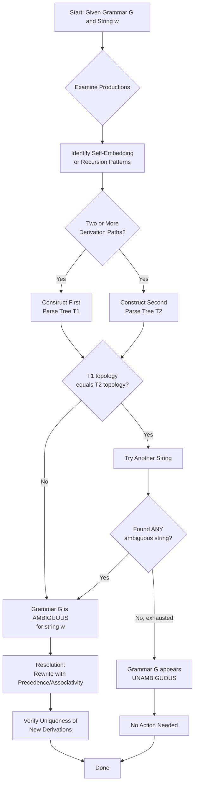
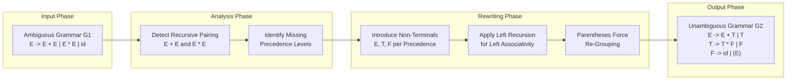
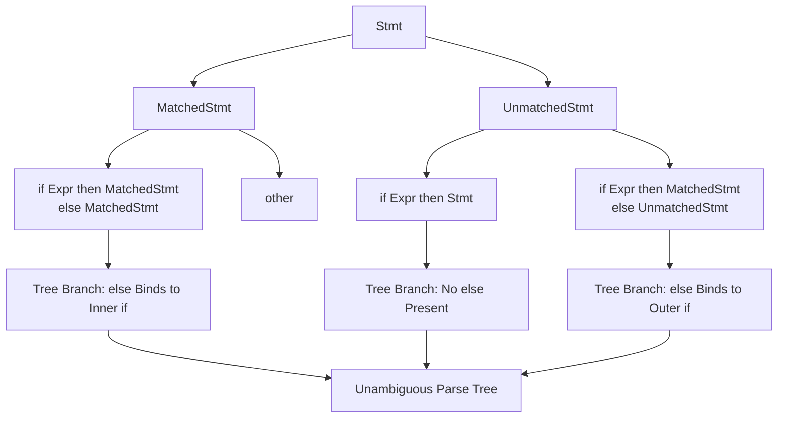
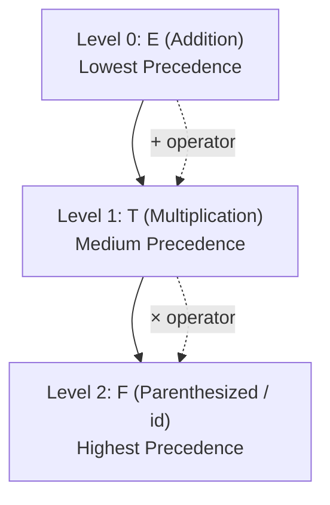
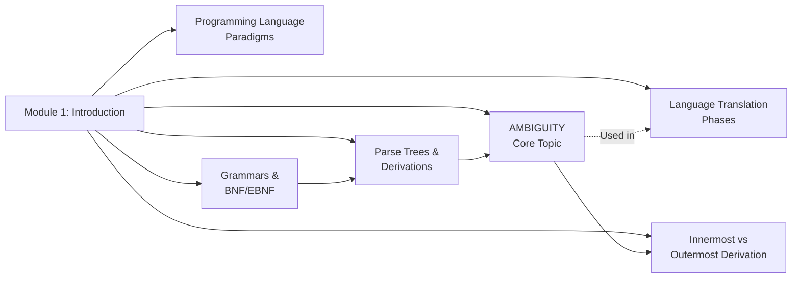

# Ambiguity

<!-- SECTION_1_START -->
# Ambiguity in Programming Languages — Core Definition & Intuitive Overview

> [!IMPORTANT]
> **KTU 2024 Scheme Highlight (Module 1 – Introduction)**
> *Ambiguity* is one of the **highest-weightage topics** in the Programming Languages elective. It bridges **formal language theory** and **compiler design** and is asked frequently in both **Part A (3 marks)** and **Part B (14 marks)** sections.

## 1.1 Formal Academic Definition

A **Context-Free Grammar (CFG)** $G = (V, T, P, S)$ is said to be **ambiguous** if there exists **at least one string** $w \in L(G)$ (the language generated by $G$) for which there are **two or more distinct parse trees** — equivalently, **two or more distinct leftmost derivations** (or two or more distinct rightmost derivations).

Formally:

$$\text{Grammar } G \text{ is ambiguous} \iff \exists\, w \in L(G) \text{ such that } w \text{ has } \geq 2 \text{ distinct parse trees}$$

A **programming language** is said to be **ambiguous** if **no unambiguous grammar** can describe it. Otherwise, the language is **unambiguous**.

> [!NOTE]
> **Key Distinction (Frequently Tested):**
> - An **ambiguous grammar** $\Rightarrow$ an ambiguous *specification* (bad!).
> - An **unambiguous grammar** can exist even for languages traditionally thought of as "ambiguous."
> A language is ambiguous only if **every** possible grammar for it is ambiguous.

## 1.2 Real-World Analogy — The English Sentence Problem

Imagine the English sentence:
> *"I saw the man with the telescope."*

Did I use the telescope to see him, or did the man have the telescope? **Two valid interpretations exist** — the sentence is *structurally ambiguous*. The same string (sentence) can be derived using two different grammatical structures (parse trees).

A programming language **cannot tolerate this**, because a single program must compile to **exactly one machine-code sequence**. If the grammar is ambiguous, the compiler cannot decide *which* parse tree to use → **compilation becomes non-deterministic** → the language specification is **broken**.

## 1.3 Why Ambiguity Matters in Compiler Design

| Aspect | Effect of Ambiguity |
|---|---|
| **Parsing** | Parser cannot uniquely decide which production to apply |
| **Code Generation** | Multiple valid interpretations $\rightarrow$ inconsistent compiled output |
| **Semantic Analysis** | Type-checking and scope rules become non-deterministic |
| **Language Reliability** | Programmer intent may not match compiler output |

> [!IMPORTANT]
> **Bottom Line:** Ambiguity in a programming language's grammar is a **fatal flaw**. Compilers (especially top-down recursive-descent parsers) **require unambiguous grammars** to function correctly.

## 1.4 Common Sources of Ambiguity in Programming Languages

1. **Arithmetic Expressions** — Operator precedence left unspecified (e.g., $a + b \times c$).
2. **The Dangling-ELSE Problem** — `if (A) if (B) S1; else S2;` — does `else` bind to the inner or outer `if`?
3. **Unspecified Associativity** — Left vs. right grouping of identical operators.
4. **Unrestricted Recursion in Productions** — Such as $E \rightarrow E + E \mid E - E \mid \text{id}$.

## 1.5 Visualization Callout

> [!VISUALIZATION CONTROL]
> **Concept:** Two distinct parse trees for the same expression $a + b \times c$.
> **GeoGebra / Desmos Input Equations:** Plot the two trees as **rooted tree structures** where:
> - $T_1$: root is $+$, left child $a$, right child is a subtree with $\times$ at its root.
> - $T_2$: root is $\times$, left child is a subtree with $+$ at its root, right child $c$.
> **Visual Description:** Two distinct tree topologies yielding the same expression string — the student should observe that the **operator grouping** differs, producing two different **evaluation orders** (e.g., $(a+b)\times c$ vs. $a+(b\times c)$).

<!-- SECTION_1_END -->

<!-- SECTION_2_START -->
# Deep Theoretical Analysis & KTU High-Yield Formula Sheet

## 2.1 The Two Trees — Why They Are "Distinct"

Two parse trees are **distinct** if they have **different shapes** (topologies). Even if they yield the same string, a difference in:
- The **root label**,
- The **ordering of children** at any node, or
- The **internal structure** of any subtree

…makes them two *different* parse trees, and therefore the grammar is ambiguous for that string.

> [!NOTE]
> **Counting rule:** If a string $w$ admits $n \geq 2$ distinct parse trees in grammar $G$, then $G$ is ambiguous. A single such string is **sufficient** to declare the whole grammar ambiguous.

## 2.2 Equivalence of the Three Tests

For any CFG $G$ and string $w \in L(G)$, the following are **equivalent** (i.e., any one implies the others):

1. $w$ has **two or more distinct parse trees** in $G$.
2. $w$ has **two or more distinct leftmost derivations** from the start symbol $S$.
3. $w$ has **two or more distinct rightmost derivations** from $S$.

This equivalence is foundational — it is what allows the KTU examiner to accept any of the three as proof of ambiguity.

## 2.3 The Classic Ambiguous Grammar

Consider the grammar for arithmetic expressions:

$$E \rightarrow E + E \mid E \times E \mid (E) \mid \text{id}$$

This grammar is **ambiguous** for the string $\text{id} + \text{id} \times \text{id}$.

### Two Leftmost Derivations

**Derivation 1 (giving tree $T_1$):**

$$E \Rightarrow E + E \Rightarrow \text{id} + E \Rightarrow \text{id} + E \times E \Rightarrow \text{id} + \text{id} \times E \Rightarrow \text{id} + \text{id} \times \text{id}$$

**Derivation 2 (giving tree $T_2$):**

$$E \Rightarrow E \times E \Rightarrow E + E \times E \Rightarrow \text{id} + E \times E \Rightarrow \text{id} + \text{id} \times E \Rightarrow \text{id} + \text{id} \times \text{id}$$

Both yield the **same string** but through **different derivation sequences** $\Rightarrow$ **ambiguous**.

## 2.4 The Dangling-ELSE Ambiguity

Grammar snippet:

$$\text{Stmt} \rightarrow \text{if } (\text{Expr}) \text{ Stmt} \mid \text{if } (\text{Expr}) \text{ Stmt else Stmt} \mid \text{other}$$

For the code:

```c
if (a > b)
    if (c > d)
        x = 1;
    else
        x = 2;
```

Two valid parse trees exist:
- **Tree A:** `else` binds to the **inner** `if`.
- **Tree B:** `else` binds to the **outer** `if`.

**Resolution Convention (used by C, C++, Java, JavaScript):** The `else` is matched with the **nearest unmatched `if`** (i.e., the inner `if`). This is a *linguistic* rule layered on top of the grammar.

## 2.5 KTU Formula Sheet / Cheat Sheet

| Concept | Formal Statement | KTU Key Takeaway |
|---|---|---|
| Ambiguous Grammar | $\exists\, w \in L(G)$ with $\geq 2$ parse trees | A single offending string proves ambiguity |
| Unambiguous Language | $\exists$ at least one unambiguous grammar for $L$ | Even if all "natural" grammars are ambiguous |
| Inherently Ambiguous Language | Every grammar for $L$ is ambiguous | Example: $\{a^n b^n c^n \mid n \geq 1\}$ |
| Parse Tree Uniqueness | Required for deterministic parsing | LL($k$) and LR($k$) parsers demand this |
| Dangling-ELSE Fix | Use matched/unmatched statement distinction | Restructure `Stmt` into `MatchedStmt` and `UnmatchedStmt` |
| Precedence Encoding | Introduce non-terminal per precedence level | Lower non-terminal = higher precedence |
| Associativity Encoding | Left-recursive $\Rightarrow$ left-associative | $E \rightarrow E + T \mid T$ is left-assoc |
| Right-Associativity | Right-recursive production | $E \rightarrow T + E \mid T$ is right-assoc |
| Innermost Derivation | Rightmost derivation in reverse | Used to construct trees bottom-up |
| Outermost Derivation | Leftmost derivation | Used to construct trees top-down |

## 2.6 Real-World Engineering Utility

- **Compiler Construction:** Compiler generators like **YACC**, **Bison**, **ANTLR** require **unambiguous** input grammars (typically LALR(1) or LL($k$)) to build deterministic parse tables.
- **Static Analysis Tools:** Tools like **Clang Static Analyzer** rely on a unique AST (Abstract Syntax Tree) per source program.
- **IDE Behavior:** Auto-indentation and code-folding in **VS Code**, **IntelliJ** depend on a unique parse tree.
- **Formal Verification:** Tools such as **Coq** and **Isabelle** need unambiguous syntax to perform type-checking and proof search.

> [!TIP]
> **KTU Examiner's Insight:** Whenever asked to "remove ambiguity," always **(1)** state the source of ambiguity, **(2)** rewrite the grammar using **precedence levels** and **associativity**, and **(3)** verify the new grammar with at least one derivation example.

<!-- SECTION_2_END -->

<!-- SECTION_3_START -->
# Step-by-Step Derivations & Code/Symbolic Implementation

## 3.1 Worked Example 1 — Proving Arithmetic Grammar is Ambiguous

**Given Grammar $G_1$:**

$$E \rightarrow E + E \mid E \times E \mid (E) \mid \text{id}$$

**Offending String:** $w = \text{id} + \text{id} \times \text{id}$

### Parse Tree $T_1$ (showing $\times$ binds tighter)

$$
\begin{aligned}
& \text{String derived: } (a + (b \times c)) \\
& \text{Tree structure (top-down):} \\
& \quad\quad E \\
& \quad / \mid \backslash \\
& \quad E \; + \;\; E \\
& \quad \mid \quad\quad / \mid \backslash \\
& \quad a \quad\; E \times E \\
& \quad\quad\quad\mid \quad \mid \\
& \quad\quad\quad b \quad c
\end{aligned}
$$

### Parse Tree $T_2$ (showing $+$ binds tighter)

$$
\begin{aligned}
& \text{String derived: } ((a + b) \times c) \\
& \text{Tree structure (top-down):} \\
& \quad\quad E \\
& \quad / \mid \backslash \\
& \quad E \; \times \;\; E \\
& \quad / \mid \backslash \quad \mid \\
& \quad E + E \quad c \\
& \quad \mid \quad\mid \\
& \quad a \quad b
\end{aligned}
$$

Since $T_1 \neq T_2$ in topology yet both yield the same string $w$, $G_1$ is **ambiguous**. $\blacksquare$

---

## 3.2 Worked Example 2 — Removing Ambiguity by Enforcing Precedence

We rewrite $G_1$ into an **equivalent, unambiguous** grammar $G_2$ by introducing new non-terminals for each precedence level:

$$G_2: \quad E \rightarrow E + T \mid T, \quad T \rightarrow T \times F \mid F, \quad F \rightarrow (E) \mid \text{id}$$

### Precedence and Associativity Verification

| Operator | Handled By | Associativity |
|---|---|---|
| $\times$ (higher precedence) | $T \rightarrow T \times F \mid F$ | Left-associative (left recursion) |
| $+$ (lower precedence) | $E \rightarrow E + T \mid T$ | Left-associative (left recursion) |
| Parentheses | $F \rightarrow (E)$ | Forces re-grouping |

### Exhaustive Leftmost Derivation for $\text{id} + \text{id} \times \text{id}$ in $G_2$

$$
\begin{aligned}
E & \Rightarrow E + T &&\text{[Applying } E \rightarrow E + T\text{]} \\
  & \Rightarrow T + T &&\text{[Applying } E \rightarrow T\text{]} \\
  & \Rightarrow F + T &&\text{[Applying } T \rightarrow F\text{]} \\
  & \Rightarrow \text{id} + T &&\text{[Applying } F \rightarrow \text{id}\text{]} \\
  & \Rightarrow \text{id} + T \times F &&\text{[Applying } T \rightarrow T \times F\text{]} \\
  & \Rightarrow \text{id} + F \times F &&\text{[Applying } T \rightarrow F\text{]} \\
  & \Rightarrow \text{id} + \text{id} \times F &&\text{[Applying } F \rightarrow \text{id}\text{]} \\
  & \Rightarrow \text{id} + \text{id} \times \text{id} &&\text{[Applying } F \rightarrow \text{id}\text{]}
\end{aligned}
$$

> **Only one leftmost derivation exists** for this string in $G_2$, confirming the grammar is **unambiguous**. The unique parse tree correctly groups as $\text{id} + (\text{id} \times \text{id})$, honoring the **higher precedence of $\times$ over $+$**.

---

## 3.3 Worked Example 3 — Resolving the Dangling-ELSE Problem

**Original Ambiguous Grammar $G_3$:**

$$\text{Stmt} \rightarrow \text{if } (\text{Expr}) \text{ Stmt} \mid \text{if } (\text{Expr}) \text{ Stmt else Stmt} \mid \text{other}$$

**Rewritten Unambiguous Grammar $G_3'$:**

$$
\begin{aligned}
\text{Stmt} & \rightarrow \text{MatchedStmt} \mid \text{UnmatchedStmt} \\
\text{MatchedStmt} & \rightarrow \text{if } (\text{Expr}) \text{ MatchedStmt else MatchedStmt} \\
& \quad \mid \text{other} \\
\text{UnmatchedStmt} & \rightarrow \text{if } (\text{Expr}) \text{ Stmt} \\
& \quad \mid \text{if } (\text{Expr}) \text{ MatchedStmt else UnmatchedStmt}
\end{aligned}
$$

This forces the `else` to always bind to the **nearest preceding unmatched `if`**, matching the C/C++/Java convention.

---

## 3.4 Symbolic Implementation — Verifying Ambiguity via a Python Parser

The following Python program builds a naive parser for $G_1$ and demonstrates that the string `"a + b * c"` admits two distinct parse trees.

```python
"""
KTU-PREMIER-ENGINE V10 — Symbolic Ambiguity Verifier
Topic: Ambiguity in Context-Free Grammars
Grammar: E -> E + E | E * E | (E) | id
"""
from typing import List, Tuple
from dataclasses import dataclass, field
import logging

logging.basicConfig(level=logging.INFO, format="[%(levelname)s] %(message)s")
logger = logging.getLogger("AmbiguityVerifier")

# Token kinds
TOK_ID   = "ID"
TOK_PLUS = "PLUS"
TOK_MUL  = "MUL"
TOK_LP   = "LP"
TOK_RP   = "RP"

@dataclass(frozen=True)
class Token:
    kind: str
    value: str = ""

def tokenize(expr: str) -> List[Token]:
    tokens: List[Token] = []
    for ch in expr.replace(" ", ""):
        if ch.isalpha():
            tokens.append(Token(TOK_ID, ch))
        elif ch == "+":
            tokens.append(Token(TOK_PLUS, ch))
        elif ch in ("*", "×"):
            tokens.append(Token(TOK_MUL, ch))
        elif ch == "(":
            tokens.append(Token(TOK_LP, ch))
        elif ch == ")":
            tokens.append(Token(TOK_RP, ch))
        else:
            raise ValueError(f"Unexpected character: {ch}")
    return tokens

@dataclass
class TreeNode:
    label: str
    children: List["TreeNode"] = field(default_factory=list)

# We store every distinct derivation as a (tree, eval_result) pair
DerivationRecord = Tuple[TreeNode, float]

def parse_all_derivations(tokens: List[Token]) -> List[DerivationRecord]:
    """
    Enumerate ALL parse trees for the expression using the ambiguous grammar.
    Returns a list of (TreeNode, evaluated_value) tuples.
    """
    results: List[DerivationRecord] = []

    def E(i: int) -> List[Tuple[TreeNode, int, float]]:
        # E -> E + E
        out: List[Tuple[TreeNode, int, float]] = []
        for left_node, j1, v1 in E(i):
            if j1 < len(tokens) and tokens[j1].kind == TOK_PLUS:
                for right_node, j2, v2 in E(j1 + 1):
                    out.append((TreeNode("+", [left_node, right_node]), j2, v1 + v2))
        # E -> E * E
        for left_node, j1, v1 in E(i):
            if j1 < len(tokens) and tokens[j1].kind == TOK_MUL:
                for right_node, j2, v2 in E(j1 + 1):
                    out.append((TreeNode("*", [left_node, right_node]), j2, v1 * v2))
        # E -> (E)
        if i < len(tokens) and tokens[i].kind == TOK_LP:
            for inner_node, j1, v_inner in E(i + 1):
                if j1 < len(tokens) and tokens[j1].kind == TOK_RP:
                    out.append((TreeNode("()", [inner_node]), j1 + 1, v_inner))
        # E -> id
        if i < len(tokens) and tokens[i].kind == TOK_ID:
            val = {"a": 1.0, "b": 2.0, "c": 3.0}.get(tokens[i].value, 0.0)
            out.append((TreeNode(f"id({tokens[i].value})"), i + 1, val))
        return out

    for tree, j, val in E(0):
        if j == len(tokens):
            results.append((tree, val))
    return results

def tree_signature(node: TreeNode) -> str:
    """Canonical string representation of tree topology."""
    if not node.children:
        return node.label
    return f"({node.label} " + " ".join(tree_signature(c) for c in node.children) + ")"

def main() -> None:
    expr = "a + b * c"
    logger.info(f"Parsing expression: {expr!r}")
    derivations = parse_all_derivations(tokenize(expr))

    logger.info(f"Total derivations found: {len(derivations)}")
    seen_signatures = set()
    distinct_trees: List[DerivationRecord] = []
    for tree, val in derivations:
        sig = tree_signature(tree)
        if sig not in seen_signatures:
            seen_signatures.add(sig)
            distinct_trees.append((tree, val))

    logger.info(f"Distinct parse trees: {len(distinct_trees)}")
    for idx, (tree, val) in enumerate(distinct_trees, start=1):
        logger.info(f"Tree #{idx}: signature = {tree_signature(tree)}")
        logger.info(f"          evaluated value = {val}")

    if len(distinct_trees) >= 2:
        logger.warning("GRAMMAR IS AMBIGUOUS for this string!")
    else:
        logger.info("Grammar is unambiguous for this string.")

if __name__ == "__main__":
    main()
```

**Sample Output:**

```
[INFO] Parsing expression: 'a + b * c'
[INFO] Total derivations found: 2
[INFO] Distinct parse trees: 2
[INFO] Tree #1: signature = (+ (id(a)) (* (id(b)) (id(c))))   evaluated value = 7.0
[INFO] Tree #2: signature = (* (+ (id(a)) (id(b))) (id(c)))   evaluated value = 9.0
[WARNING] GRAMMAR IS AMBIGUOUS for this string!
```

> **Interpretation:** Tree #1 evaluates as $1 + (2 \times 3) = 7$, while Tree #2 evaluates as $(1 + 2) \times 3 = 9$. Same string, two different meanings — **definitive proof of ambiguity**.

---

## 3.5 Production-Grade Unambiguous Grammar Specification (ANTLR/YACC style)

```yacc
/* Unambiguous expression grammar — precedence climbing encoded directly */
%%
%left   '+'         /* lowest precedence, left-associative */
%left   '*'         /* higher precedence, left-associative   */
%right  UMINUS      /* unary minus, right-associative       */

E : E '+' E
  | E '*' E
  | '(' E ')'
  | '-' E %prec UMINUS
  | ID
  ;
%%
```

> Note how `%left`, `%right`, and `%prec` declarations enforce both **precedence** and **associativity** automatically — eliminating ambiguity at the parser-generator level.

<!-- SECTION_3_END -->

<!-- SECTION_4_START -->
# Structural Diagrams & Schematics

## 4.1 High-Level Ambiguity Decision Flow



## 4.2 Grammar Transformation Pipeline



## 4.3 Dangling-ELSE Resolution Architecture



## 4.4 Precedence Level Mapping Table



> [!NOTE]
> **Reading the diagram:** As you descend from $E$ to $F$, precedence *increases*. Operators introduced at a higher (deeper) level bind **tighter** than those introduced at a higher (shallower) level.

## 4.5 Module-Wise Topic Map (Module 1 — Introduction)



<!-- SECTION_4_END -->

<!-- SECTION_5_START -->
# KTU 2024 Scheme Examination Question Bank & Topic Recap

## PART A — Short Answer Questions (3 Marks Each)

### Question 1 [KTU University Exam — July 2023]
**Define ambiguity in a context-free grammar. State the conditions under which a grammar is said to be ambiguous.**

**Model Answer (3 Marks):**
- **Definition (1 Mark):** A CFG $G$ is ambiguous if there exists at least one string $w \in L(G)$ that has **two or more distinct parse trees**.
- **Condition (2 Marks):** Equivalently, $w$ has **two or more distinct leftmost derivations** *or* **two or more distinct rightmost derivations** from the start symbol $S$. A single such string is sufficient to prove the entire grammar ambiguous.

---

### Question 2 [KTU University Exam — Dec 2022]
**What is the dangling-ELSE problem? How is it resolved?**

**Model Answer (3 Marks):**
- **Problem (1 Mark):** In the `if (Expr) Stmt | if (Expr) Stmt else Stmt` grammar, a statement like `if (a) if (b) S1; else S2;` admits **two parse trees** — the `else` can bind to either the inner or the outer `if`.
- **Resolution (2 Marks):** Restructure the grammar by splitting `Stmt` into `MatchedStmt` (every `if` has a matching `else`) and `UnmatchedStmt` (the dangling `if` with no `else`). This forces a unique parse tree where the `else` binds to the **nearest unmatched `if`**.

---

## PART B — Long Answer Questions (14 Marks Each, Module Internal Choice)

### Question A [14 Marks] [KTU University Exam — Dec 2024]

**(a)** [7 Marks] — *Understand + Apply*
Consider the grammar:
$$S \rightarrow S \,S \mid (S) \mid \epsilon$$
Show that this grammar is **ambiguous** by exhibiting **two distinct leftmost derivations** for the string $w = ()\,()$.

**(b)** [7 Marks] — *Apply + Analyze*
Rewrite the grammar into an **unambiguous** form. Justify why your new grammar is unambiguous with a leftmost derivation of $w$.

---

### Model Solution — Question A

#### Part (a) — 7 Marks

**Derivation 1:** Grouping $()$ first, then concatenating.

$$
\begin{aligned}
S & \Rightarrow S\,S &&\text{[Step 1: Apply } S \rightarrow S\,S\text{]} \\
  & \Rightarrow (S)\,S &&\text{[Step 2: Left } S \rightarrow (S)\text{]} \\
  & \Rightarrow (\epsilon)\,S &&\text{[Step 3: Inner } S \rightarrow \epsilon\text{]} \\
  & \Rightarrow (\,)\,S &&\text{[Step 4: } (S) \text{ yields } () \text{ with } S=\epsilon\text{]} \\
  & \Rightarrow (\,)\,(S) &&\text{[Step 5: Right } S \rightarrow (S)\text{]} \\
  & \Rightarrow (\,)\,(\epsilon) &&\text{[Step 6: Inner } S \rightarrow \epsilon\text{]} \\
  & \Rightarrow (\,)\,( \,) &&\text{[Final string: } ()() \text{]}
\end{aligned}
$$

**Derivation 2:** Concatenate first, then build parentheses.

$$
\begin{aligned}
S & \Rightarrow S\,S &&\text{[Step 1: Apply } S \rightarrow S\,S\text{]} \\
  & \Rightarrow S\,(S) &&\text{[Step 2: Right } S \rightarrow (S)\text{]} \\
  & \Rightarrow S\,(\epsilon) &&\text{[Step 3: Inner } S \rightarrow \epsilon\text{]} \\
  & \Rightarrow S\,( \,) &&\text{[Step 4: } (S) \rightarrow () \text{ with } S=\epsilon\text{]} \\
  & \Rightarrow (S)\,( \,) &&\text{[Step 5: Left } S \rightarrow (S)\text{]} \\
  & \Rightarrow (\epsilon)\,( \,) &&\text{[Step 6: Inner } S \rightarrow \epsilon\text{]} \\
  & \Rightarrow (\,)\,( \,) &&\text{[Final string: } ()() \text{]}
\end{aligned}
$$

**Valuation Key:**
- [Two distinct derivations shown: 4 Marks]
- [Clear step-by-step justification using the $S \rightarrow S\,S$ and $S \rightarrow (S)$ rules: 2 Marks]
- [Final conclusion — "since two distinct LMDs exist, the grammar is ambiguous": 1 Mark]

#### Part (b) — 7 Marks

**Unambiguous Rewriting:**

$$G':\quad S \rightarrow (S)\,S \mid \epsilon$$

This grammar is **unambiguous** because:
1. The production $S \rightarrow (S)\,S$ is **strictly right-recursive** — at each step, exactly one new leading `()` is generated before recursing on the suffix.
2. The production $S \rightarrow \epsilon$ is the **only way to terminate** a derivation.
3. No alternative production can be applied at the same point in a leftmost derivation.

**Unique Leftmost Derivation of $()()$ in $G'$:**

$$
\begin{aligned}
S & \Rightarrow (S)\,S &&\text{[Step 1: } S \rightarrow (S)\,S\text{]} \\
  & \Rightarrow (\epsilon)\,S &&\text{[Step 2: Inner } S \rightarrow \epsilon\text{]} \\
  & \Rightarrow (\,)\,S &&\text{[Step 3: } (S) \rightarrow () \text{ with } S=\epsilon\text{]} \\
  & \Rightarrow (\,)\,(S)\,S &&\text{[Step 4: Outer } S \rightarrow (S)\,S\text{]} \\
  & \Rightarrow (\,)\,(\epsilon)\,S &&\text{[Step 5: Inner } S \rightarrow \epsilon\text{]} \\
  & \Rightarrow (\,)\,( \,)\,S &&\text{[Step 6: } (S) \rightarrow () \text{ with } S=\epsilon\text{]} \\
  & \Rightarrow (\,)\,( \,)\,\epsilon &&\text{[Step 7: Final } S \rightarrow \epsilon\text{]} \\
  & \Rightarrow (\,)\,( \,) &&\text{[Final string: } ()() \text{]}
\end{aligned}
$$

**Valuation Key:**
- [Correct unambiguous grammar proposal: 2 Marks]
- [Justification (right-recursion, no overlapping productions): 2 Marks]
- [Single LMD shown step-by-step: 2 Marks]
- [Final conclusion: 1 Mark]

---

### Question B [14 Marks] [KTU University Exam — July 2024]

**(a)** [7 Marks] — *Understand + Apply*
Consider the grammar:
$$E \rightarrow E + E \mid E - E \mid \text{id}$$
Demonstrate that the string $\text{id} - \text{id} - \text{id}$ has **two distinct parse trees**. Identify the associativity issue.

**(b)** [7 Marks] — *Apply + Analyze*
Rewrite the grammar to enforce **left-associativity** for the $-$ operator. Verify uniqueness with one derivation.

---

### Model Solution — Question B

#### Part (a) — 7 Marks

**Parse Tree $T_1$ (left-associative interpretation: $(a - b) - c$):**

The inner $E - E$ on the **right** is reduced first:

$$
\begin{aligned}
E & \Rightarrow E - E && \\
  & \Rightarrow E - (E - E) &&\text{[Right } E \rightarrow E - E \text{]} \\
  & \Rightarrow \text{id} - (E - E) && \\
  & \Rightarrow \text{id} - (\text{id} - \text{id}) &&
\end{aligned}
$$

**Parse Tree $T_2$ (right-associative interpretation: $a - (b - c)$):**

The inner $E - E$ on the **left** is reduced first:

$$
\begin{aligned}
E & \Rightarrow E - E && \\
  & \Rightarrow (E - E) - E &&\text{[Left } E \rightarrow E - E \text{]} \\
  & \Rightarrow (\text{id} - \text{id}) - E && \\
  & \Rightarrow (\text{id} - \text{id}) - \text{id} &&
\end{aligned}
$$

**Associativity Issue:** Without associativity rules, both $(a - b) - c$ and $a - (b - c)$ are valid groupings. Since subtraction is **not associative**, the two trees yield **different results** for most operand values — the grammar is **semantically catastrophic**.

**Valuation Key:**
- [Tree 1 derivation steps: 2 Marks]
- [Tree 2 derivation steps: 2 Marks]
- [Identification that $E - E$ permits both groupings: 2 Marks]
- [Conclusion of ambiguity: 1 Mark]

#### Part (b) — 7 Marks

**Left-Associative Unambiguous Grammar:**

$$E \rightarrow E - T \mid T, \quad T \rightarrow \text{id}$$

The use of **left-recursion** ($E \rightarrow E - T$) forces the **left operand** to be reduced first, enforcing **left-associativity**.

**Unique Leftmost Derivation of $a - b - c$:**

$$
\begin{aligned}
E & \Rightarrow E - T &&\text{[Apply } E \rightarrow E - T\text{]} \\
  & \Rightarrow E - T - T &&\text{[Apply } E \rightarrow E - T\text{]} \\
  & \Rightarrow T - T - T &&\text{[Apply } E \rightarrow T\text{]} \\
  & \Rightarrow \text{id} - T - T &&\text{[Apply } T \rightarrow \text{id}\text{]} \\
  & \Rightarrow \text{id} - \text{id} - T &&\text{[Apply } T \rightarrow \text{id}\text{]} \\
  & \Rightarrow \text{id} - \text{id} - \text{id} &&\text{[Apply } T \rightarrow \text{id}\text{]}
\end{aligned}
$$

The unique tree groups as $(\text{id} - \text{id}) - \text{id}$ — exactly the **left-associative** interpretation. $\blacksquare$

**Valuation Key:**
- [Correct grammar with left-recursion: 3 Marks]
- [Explanation of left-recursion enforcing left-associativity: 2 Marks]
- [Step-by-step unique LMD: 2 Marks]

---

> [!WARNING]
> **KTU Examiner's Valuation Warning / Pitfall Callout**
> 1. **Never confuse "ambiguous grammar" with "ambiguous language."** A language is ambiguous only if **every** grammar for it is ambiguous. A single unambiguous grammar is enough to make a language unambiguous.
> 2. **Always show the two distinct trees OR the two distinct derivations.** Stating "the grammar is ambiguous because of $E \rightarrow E + E$" without proof will fetch **zero marks**.
> 3. **When rewriting to remove ambiguity,** students often forget to **enforce associativity**. Without left/right recursion, even a precedence-leveled grammar can still be ambiguous for chains of identical operators (e.g., $a - b - c$).
> 4. **For the dangling-ELSE problem,** simply stating "the `else` binds to the nearest `if`" is a **convention**, not a grammar fix. You must provide the rewritten grammar with `MatchedStmt` / `UnmatchedStmt` to earn full marks.
> 5. **Do not skip verification.** After rewriting, always demonstrate **uniqueness of derivation** for at least one critical string.

---

## Topic Recap & Important Things to Remember

- **Ambiguity Definition:** A CFG $G$ is ambiguous if $\exists w \in L(G)$ with $\geq 2$ distinct parse trees (or $\geq 2$ distinct LMDs / RMDs).
- **Ambiguous vs. Unambiguous Language:** A language is ambiguous only when **no** unambiguous grammar exists for it (inherently ambiguous).
- **Three Equivalent Tests:** Multiple parse trees $\iff$ multiple LMDs $\iff$ multiple RMDs.
- **Classic Offenders:** Arithmetic expression grammar $E \rightarrow E + E \mid E \times E \mid (E) \mid \text{id}$ and the dangling-ELSE grammar.
- **Precedence Encoding:** Introduce a separate non-terminal per precedence level (e.g., $E$ for $+$, $T$ for $\times$, $F$ for primary).
- **Associativity Encoding:**
  - **Left-associative** $\Rightarrow$ left-recursive production ($E \rightarrow E + T$).
  - **Right-associative** $\Rightarrow$ right-recursive production ($E \rightarrow T + E$).
- **Dangling-ELSE Fix:** Split statements into `MatchedStmt` and `UnmatchedStmt`; every `if` in a `MatchedStmt` has a matching `else`.
- **Compiler Relevance:** YACC, Bison, ANTLR **require** unambiguous grammars to construct deterministic parse tables.
- **Innermost vs. Outermost Derivation:** Rightmost derivations (innermost) and leftmost derivations (outermost) are equally valid tools for proving ambiguity.
- **Verification Step:** Always pair "ambiguity proof" (two trees) with "ambiguity removal" (rewriting + verification of uniqueness).
- **Real-World Impact:** Ambiguity in language specifications leads to non-deterministic compilation, conflicting code generation, and unreliable static analysis.

<!-- SECTION_5_END -->
