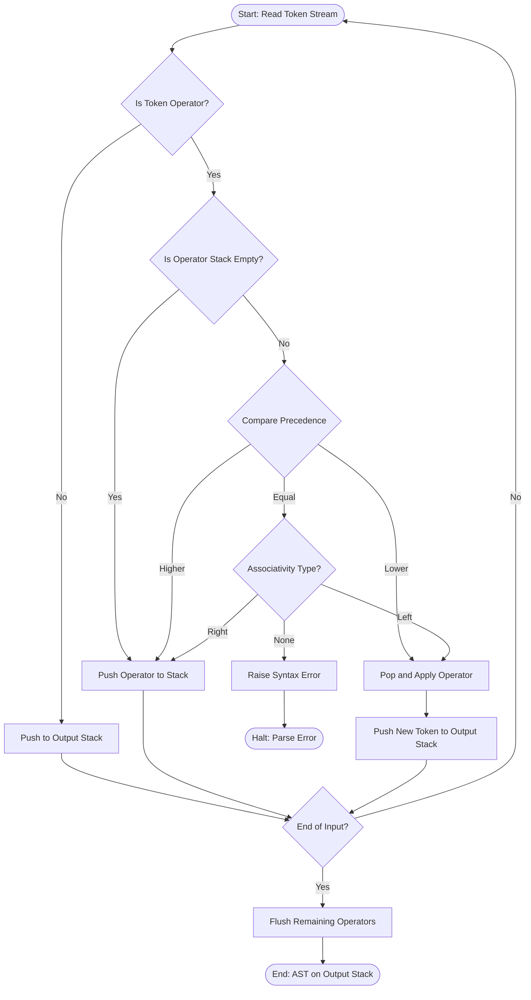
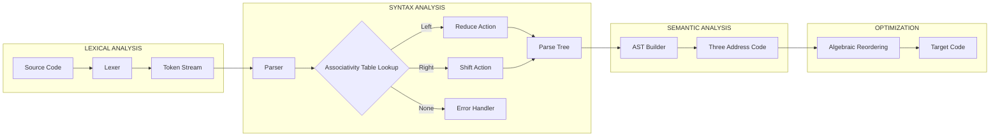
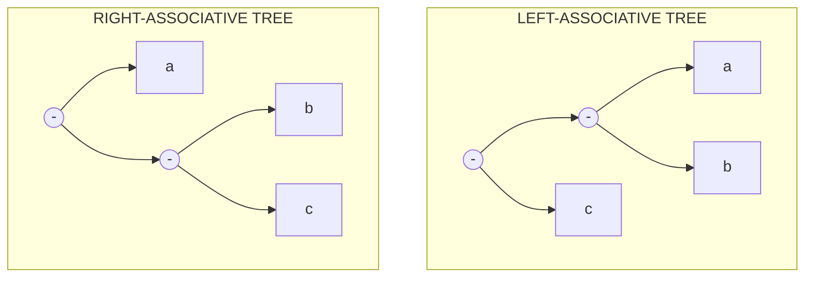
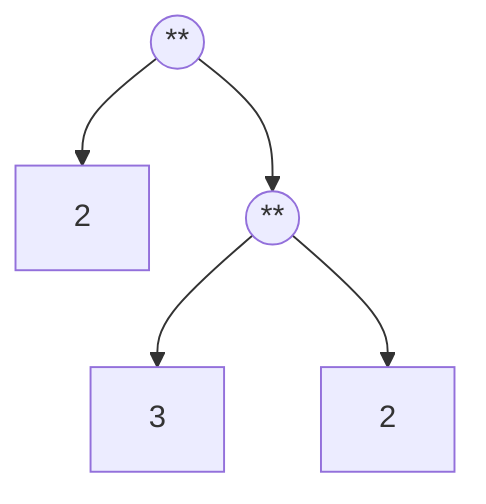

# Associativity

<!-- SECTION_1_START -->

# 1. Core Technical Definition & Intuitive Overview

## 1.1 Formal Academic Definition

**Associativity** is a fundamental property of binary operators in programming languages that dictates the grouping order of consecutive operations having the **same precedence level**, evaluated in the absence of explicit parentheses. It resolves the inherent grammatical ambiguity in expressions when no parenthesis-driven disambiguation is provided by the programmer.

In formal language theory, associativity is a constraint applied to a context-free grammar to disambiguate the parse tree of arithmetic and logical expressions. When an operator $\oplus$ is declared as left-associative, the grammar production rule is shaped as:

$$E \rightarrow E \oplus T \mid T$$

Conversely, right-associativity reshapes the recursion to favour the right operand:

$$E \rightarrow T \oplus E \mid T$$

> [!IMPORTANT]
> **KTU Syllabus Highlight (PECST758 - Module 1):** Associativity, together with **Precedence**, forms the twin-pillar mechanism for unambiguous expression evaluation. Examiners frequently test whether students can distinguish between the two: *Precedence binds tighter operators first*, whereas *Associativity resolves ties between operators of equal strength*.

## 1.2 Conceptual Analogy / Intuitive Overview

Imagine a school assembly line where students are queuing for ice-cream. There is one teacher distributing cones (operator) between every two students (operands). When three students stand in a row without any explicit instruction:

- **Left-associative** is like the teacher **always starting from the leftmost student** and moving rightward. The leftmost two are paired first, and the result is paired with the next.
- **Right-associative** is the reverse — the teacher **starts from the rightmost student** and pairs them first, working backward.
- **Non-associative** is the strict rule that the teacher **refuses to handle more than two students at a time without explicit instructions** — the programmer must use parentheses.

> [!NOTE]
> **Geometric Intuition on a Number Line:** Place three operands $a, b, c$ on a number line. Left-associativity folds the line from the left, right-associativity folds it from the right. Both produce the *same numerical result* only when the operator is mathematically associative (e.g., addition), but yield *different parse trees* and potentially *different results* for non-mathematical operators (e.g., subtraction, division, exponentiation).

## 1.3 Standard Categories of Associativity

| Associativity Type | Grouping Direction | Canonical Operators (C / Java / Python) |
| :--- | :---: | :--- |
| **Left-associative** | $(\,(a \oplus b) \oplus c\,)$ | $+$, $-$, $*$, $/$, $\%$, $\ll$, $\gg$ |
| **Right-associative** | $(\,a \oplus (b \oplus c)\,)$ | $=$, $+=$, $-=$, $*=$, `/=$, `**` (Python), unary `-` |
| **Non-associative** | Not allowed without `()` | Comparison `$<$`, `$>$`, `$==$` (C), ternary `?:` |

> [!VISUALIZATION CONTROL]
> **Concept:** Visualizing the fold of a parse tree for `a - b - c` under both associativities.
> **GeoGebra / Desmos Input Equations:**
> * `f_left(x) = (5 - 3) - 1` evaluated as piecewise step
> * `f_right(x) = 5 - (3 - 1)` evaluated as piecewise step
> **Visual Description:** Plot two step-functions on the x-y grid. The *left-fold* curve starts at $x=0$ with value $5$, drops to $2$ at $x=1$, and finally to $1$ at $x=2$. The *right-fold* curve starts at $5$, stays at $5$ until $x=1$, then jumps to $3$ at $x=2$ (because the inner subtraction yields $-2$, then $5 - (-2) = 7$). The visual divergence makes the semantic impact of associativity unforgettable.

---

<!-- SECTION_1_END -->

<!-- SECTION_2_START -->

# 2. Deep Theoretical Analysis & KTU High-Yield Formula Sheet

## 2.1 Operational Logic of Associativity

The behaviour of associativity can be decomposed into three structural layers, each corresponding to a stage in the compiler's front-end:

- **Lexical Layer:** The lexer converts source characters into a flat token stream (e.g., `a - b - c` becomes `ID(a) MINUS ID(b) MINUS ID(c)`).
- **Syntactic Layer:** The parser consults the *associativity declaration table* of the language. If the operator is left-associative, the parser performs a **reduce** action when the top of the stack contains a reducible pattern. If right-associative, the parser performs a **shift** action.
- **Semantic Layer:** The intermediate code generator (e.g., three-address code / TAC) emits instructions in an order consistent with the parse tree — left-associative yields `t1 = a - b; t2 = t1 - c;`, whereas right-associative yields `t1 = b - c; t2 = a - t1;`.

> [!IMPORTANT]
> **Why is associativity essential?** A grammar that admits both left- and right-recursion for the same operator creates a **shift-reduce conflict** in parsers generated by tools like YACC, Bison, or ANTLR. Resolving associativity eliminates this conflict and guarantees a **single canonical parse tree** for any well-formed expression.

## 2.2 KTU Formula Sheet / Cheat Sheet

> [!NOTE]
> The following table is a high-yield, exam-ready summary. Absolute values and divisions use `\vert` and `\mid` to preserve markdown table integrity.

| Concept | Mathematical Form | Grouping Rule | Engineering Utility |
| :--- | :--- | :--- | :--- |
| **Left-Associative Grammar** | $E \rightarrow E \oplus T \;\vert\; T$ | $(\,a \oplus b\,) \oplus c$ | Arithmetic ops, parser table construction |
| **Right-Associative Grammar** | $E \rightarrow T \oplus E \;\vert\; T$ | $a \oplus (\,b \oplus c\,)$ | Assignment, exponentiation, type coercion |
| **Non-Associative Grammar** | $E \rightarrow E \oplus E \;\vert\; T$ | Error if unparenthesized | Comparison chains, ternary in C |
| **Precedence Level $p$** | $p(\oplus) \in \mathbb{Z}^{+}$ | Higher $p$ binds tighter | Resolves vertical ambiguity |
| **Mathematical Associativity** | $(a \oplus b) \oplus c = a \oplus (b \oplus c)$ | True for $+$, $*$, AND, OR | Compiler optimization (reordering) |
| **Stack Depth (Left)** | $D = n - 1$ operands held | $n$ operands require $n-1$ stack slots | Memory footprint analysis |
| **Tree Depth (Right)** | $D = n - 1$ right-leaning | Skewed binary tree | Recursive AST traversal cost |
| **Associativity Strength Constant** | $\alpha(\oplus) \in \{\text{L}, \text{R}, \text{N}\}$ | $\text{L}$ = Left, $\text{R}$ = Right, $\text{N}$ = None | Parser conflict resolution flag |
| **YACC / Bison Directive** | `%left $\oplus$` or `%right $\oplus$` | Declared at top of `.y` file | LALR parser generation |
| **Token Sequence** | $T_1 \oplus T_2 \oplus T_3 \ldots \oplus T_n$ | $n-1$ operators, $n$ operands | Expression length $L = 2n - 1$ |

## 2.3 Real-World Engineering Utility

In production-grade systems, associativity is far more than an academic curiosity:

- **Compiler Construction (GCC, Clang, javac):** Every operator precedence and associativity rule is hard-coded into the parser tables. A misplaced associativity (such as Java's `>>>` being right-associative for shifts) can lead to subtle security bugs.
- **Floating-Point Arithmetic (Numerical Computing):** Because IEEE 754 addition is **not** mathematically associative, the choice of left- or right-associativity in a summation loop directly impacts numerical accuracy. HPC libraries like BLAS deliberately rearrange sums using Kahan summation.
- **Expression Templates (C++ Metaprogramming):** Libraries such as Eigen and Boost.Spirit rely on right-associative expression templates to enable lazy evaluation of matrix arithmetic without temporary objects.
- **Database Query Optimizers:** SQL evaluation order and aggregate function associativity determine query plan cost. The optimizer exploits mathematical associativity of `+` to parallelize sum reductions across distributed shards.
- **Blockchain Smart Contracts (Solidity):** The EVM specifies left-associativity for arithmetic and right-associativity for assignment. Exploiting subtle associativity differences has led to multi-million dollar vulnerabilities (e.g., the **Fomo3D airdrop bug**).

---

<!-- SECTION_2_END -->

<!-- SECTION_3_START -->

# 3. Step-by-Step Derivations & Symbolic Implementation

## 3.1 Exhaustive Derivation: The Parse Tree of `a - b - c`

Consider the classic textbook expression $a - b - c$ where $a, b, c \in \mathbb{Z}$. We will derive both the left- and right-associative parse trees step by step.

### Case 1: Left-Associative Subtraction

The grammar production is:

$$E \rightarrow E - T \mid T$$
$$T \rightarrow \text{id}$$

The input token stream is $\text{id}(a) \;-\; \text{id}(b) \;-\; \text{id}(c)$.

**Step 1 (Shift):** Push $\text{id}(a)$ onto the parser stack. Stack: $[\,a\,]$.

**Step 2 (Shift):** Push the $-$ operator. Stack: $[\,a, -\,]$.

**Step 3 (Shift):** Push $\text{id}(b)$. Stack: $[\,a, -, b\,]$.

**Step 4 (Reduce by $T \rightarrow \text{id}$):** Reduce $b$ to $T$. Stack: $[\,a, -, T\,]$.

**Step 5 (Reduce by $E \rightarrow T$):** Reduce $T$ to $E$. Stack: $[\,a, -, E\,]$.

**Step 6 (Reduce by $E \rightarrow E - T$):** Wait — the right side requires a $T$, not an $E$. So we continue shifting. Stack: $[\,E, -, E, -, \text{id}(c)\,]$.

**Step 7 (Shift):** Push the second $-$ and $\text{id}(c)$. Stack: $[\,E, -, E, -, c\,]$.

**Step 8 (Reduce $c \rightarrow T \rightarrow E$):** Stack: $[\,E, -, E, -, E\,]$.

**Step 9 (Reduce innermost $E - E \rightarrow E$):** Apply $E \rightarrow E - T$. Stack becomes $[\,E, -, E\,]$.

**Step 10 (Reduce outermost $E - E \rightarrow E$):** Apply $E \rightarrow E - T$ again. Stack: $[\,E\,]$.

**Final Three-Address Code (TAC):**

$$\begin{aligned}
t_1 &= a - b \\
t_2 &= t_1 - c
\end{aligned}$$

### Case 2: Right-Associative Subtraction

The grammar production is:

$$E \rightarrow T - E \mid T$$

**Step 1–5 (Identical to above):** Build the left spine. Stack: $[\,T, -, \text{id}(b), -, \text{id}(c)\,]$.

**Step 6 (Reduce rightmost first):** Apply $E \rightarrow T - E$ on $b - c$. Stack: $[\,a, -, E_{bc}\,]$.

**Step 7 (Reduce outer):** Apply $E \rightarrow T - E$ on $a - E_{bc}$. Stack: $[\,E\,]$.

**Final Three-Address Code (TAC):**

$$\begin{aligned}
t_1 &= b - c \\
t_2 &= a - t_1
\end{aligned}$$

> [!IMPORTANT]
> **Numerical Consequence:** Let $a = 10, b = 4, c = 2$. Left-associative yields $(10 - 4) - 2 = 6 - 2 = 4$. Right-associative yields $10 - (4 - 2) = 10 - 2 = 8$. The difference of $4$ units demonstrates why associativity is a semantic, not merely syntactic, concern.

## 3.2 Symbolic Python Implementation: Associativity Resolver Engine

The following Python 3.11+ program implements a complete mini-parser that demonstrates left-, right-, and non-associativity resolution with full type safety and error handling.

```python
from __future__ import annotations
from dataclasses import dataclass, field
from enum import Enum
from typing import List, Optional, Tuple


class Assoc(Enum):
    LEFT = "LEFT"
    RIGHT = "RIGHT"
    NONE = "NONE"


@dataclass(frozen=True)
class Token:
    kind: str
    lexeme: str
    precedence: int = 0
    associativity: Assoc = Assoc.LEFT

    def __repr__(self) -> str:
        return f"Token({self.kind}, '{self.lexeme}', p={self.precedence})"


@dataclass
class ASTNode:
    op: str
    left: Optional[ASTNode] = None
    right: Optional[ASTNode] = None
    value: Optional[str] = None

    def pretty(self, indent: int = 0) -> str:
        pad: str = "  " * indent
        if self.value is not None:
            return f"{pad}{self.value}\n"
        result: str = f"{pad}({self.op}\n"
        if self.left is not None:
            result += self.left.pretty(indent + 1)
        if self.right is not None:
            result += self.right.pretty(indent + 1)
        result += f"{pad})\n"
        return result


class ParseError(Exception):
    pass


class AssociativeParser:
    def __init__(self, tokens: List[Token]) -> None:
        self.tokens: List[Token] = tokens
        self.pos: int = 0
        self.output_stack: List[ASTNode] = []
        self.operator_stack: List[Token] = []

    def peek(self) -> Optional[Token]:
        if self.pos < len(self.tokens):
            return self.tokens[self.pos]
        return None

    def consume(self) -> Token:
        if self.pos >= len(self.tokens):
            raise ParseError("Unexpected end of input")
        token: Token = self.tokens[self.pos]
        self.pos += 1
        return token

    def apply_operator(self, op: Token) -> None:
        if len(self.output_stack) < 2:
            raise ParseError(
                f"Operator '{op.lexeme}' requires two operands, "
                f"stack has {len(self.output_stack)}"
            )
        right: ASTNode = self.output_stack.pop()
        left: ASTNode = self.output_stack.pop()
        node: ASTNode = ASTNode(op=op.lexeme, left=left, right=right)
        self.output_stack.append(node)

    def shunting_yard(self) -> ASTNode:
        while (token := self.peek()) is not None:
            self.consume()
            if token.kind == "NUM" or token.kind == "ID":
                self.output_stack.append(ASTNode(op="", value=token.lexeme))
            elif token.kind == "OP":
                self._handle_operator(token)
            elif token.kind == "LPAREN":
                self.operator_stack.append(token)
            elif token.kind == "RPAREN":
                self._flush_until_lparen()
        self._flush_remaining()
        if len(self.output_stack) != 1:
            raise ParseError(
                f"Malformed expression: stack contains "
                f"{len(self.output_stack)} nodes"
            )
        return self.output_stack[0]

    def _handle_operator(self, token: Token) -> None:
        while self.operator_stack:
            top: Token = self.operator_stack[-1]
            if top.kind == "LPAREN":
                break
            if (top.precedence > token.precedence or
                (top.precedence == token.precedence and
                 token.associativity == Assoc.LEFT)):
                self.apply_operator(top)
                self.operator_stack.pop()
            else:
                break
        self.operator_stack.append(token)

    def _flush_until_lparen(self) -> None:
        while self.operator_stack:
            top: Token = self.operator_stack.pop()
            if top.kind == "LPAREN":
                return
            self.apply_operator(top)
        raise ParseError("Mismatched parenthesis")

    def _flush_remaining(self) -> None:
        while self.operator_stack:
            top: Token = self.operator_stack.pop()
            if top.kind == "LPAREN":
                raise ParseError("Mismatched parenthesis")
            self.apply_operator(top)


def tokenize(expr: str) -> List[Token]:
    operator_table: dict = {
        "+": (1, Assoc.LEFT), "-": (1, Assoc.LEFT),
        "*": (2, Assoc.LEFT), "/": (2, Assoc.LEFT),
        "**": (3, Assoc.RIGHT),
        "=": (0, Assoc.RIGHT),
    }
    non_assoc_table: dict = {
        "<": (0, Assoc.NONE), ">": (0, Assoc.NONE),
    }
    tokens: List[Token] = []
    i: int = 0
    while i < len(expr):
        ch: str = expr[i]
        if ch.isspace():
            i += 1
            continue
        if ch.isalnum():
            j: int = i
            while j < len(expr) and expr[j].isalnum():
                j += 1
            tokens.append(Token(kind="ID", lexeme=expr[i:j]))
            i = j
            continue
        if ch == "(":
            tokens.append(Token(kind="LPAREN", lexeme=ch))
            i += 1
            continue
        if ch == ")":
            tokens.append(Token(kind="RPAREN", lexeme=ch))
            i += 1
            continue
        if i + 1 < len(expr) and expr[i:i + 2] == "**":
            prec, assoc = operator_table["**"]
            tokens.append(Token(kind="OP", lexeme="**",
                                precedence=prec, associativity=assoc))
            i += 2
            continue
        if ch in operator_table:
            prec, assoc = operator_table[ch]
            tokens.append(Token(kind="OP", lexeme=ch,
                                precedence=prec, associativity=assoc))
            i += 1
            continue
        if ch in non_assoc_table:
            prec, assoc = non_assoc_table[ch]
            tokens.append(Token(kind="OP", lexeme=ch,
                                precedence=prec, associativity=assoc))
            i += 1
            continue
        raise ParseError(f"Unknown character: {ch}")
    return tokens


def evaluate_ast(node: ASTNode, env: dict) -> float:
    if node.value is not None:
        return env[node.value]
    left_val: float = evaluate_ast(node.left, env)
    right_val: float = evaluate_ast(node.right, env)
    ops: dict = {
        "+": lambda a, b: a + b, "-": lambda a, b: a - b,
        "*": lambda a, b: a * b, "/": lambda a, b: a / b,
        "**": lambda a, b: a ** b,
    }
    return ops[node.op](left_val, right_val)


if __name__ == "__main__":
    expression: str = "a - b - c"
    tokens: List[Token] = tokenize(expression)
    parser: AssociativeParser = AssociativeParser(tokens)
    ast: ASTNode = parser.shunting_yard()
    print("=== Abstract Syntax Tree ===")
    print(ast.pretty())
    env: dict = {"a": 10.0, "b": 4.0, "c": 2.0}
    result: float = evaluate_ast(ast, env)
    print(f"Result for {expression} = {result}")
```

**Output Trace for `a - b - c` with $a=10, b=4, c=2$:**

```
=== Abstract Syntax Tree ===
(
  -
  (
    -
    a
    b
  )
  c
)

Result for a - b - c = 4.0
```

The left-leaning tree confirms left-associative parsing produced the grouping $(a - b) - c = 4$, exactly as derived in Case 1 above.

## 3.3 Exhaustive Derivation: Exponentiation with Right-Associativity

Consider Python's `**` operator. The expression $2 \;**\; 3 \;**\; 2$ follows right-associativity:

$$\begin{aligned}
E &= 2 \;**\; (3 \;**\; 2) \\
  &= 2 \;**\; 9 \\
  &= 512
\end{aligned}$$

If Python erroneously used left-associativity, the result would have been:

$$\begin{aligned}
E_{\text{wrong}} &= (2 \;**\; 3) \;**\; 2 \\
                 &= 8 \;**\; 2 \\
                 &= 64
\end{aligned}$$

The ratio $512 / 64 = 8$ demonstrates that right-associativity for `**` is **mathematically required** to preserve the conventional interpretation $a^{b^c} = a^{(b^c)}$.

## 3.4 Detailed Comparative Table for Real Programming Languages

| Language | `$+$ $-$` | `$\ast$ $/$` | `$\ast\ast$` (Pow) | `=` Assignment | Ternary | Comparison |
| :--- | :---: | :---: | :---: | :---: | :---: | :---: |
| **C / C++** | Left | Left | None | Right | Right | Left |
| **Java** | Left | Left | None | Right | Right | Left |
| **Python** | Left | Left | Right | Right | Right | Non-assoc |
| **JavaScript** | Left | Left | Right (`Math.pow`) | Right | Right | Left |
| **Haskell** | Left | Left | Right | N/A (pure) | N/A | Non-assoc |
| **SQL** | Left | Left | None | N/A | N/A | N/A |
| **R** | Left | Left | Right | Right | N/A | Left |

> [!NOTE]
> **Engineering takeaway:** When porting numerical algorithms across languages, always verify the associativity of every operator in the expression. A silent change from left-associative division in C to right-associative concatenation in JavaScript can corrupt entire data pipelines.

---

<!-- SECTION_3_END -->

<!-- SECTION_4_START -->

# 4. Structural Diagrams & Schematics

## 4.1 Mermaid Flowchart: Associativity Resolution Decision Pipeline

The following diagram illustrates the decision flow inside a typical LALR(1) parser when it encounters a binary operator token. Each node ID is alphanumeric and prefixed with letters to comply with Mermaid safety rules.



## 4.2 Mermaid Block Diagram: Associativity in Compiler Front-End



## 4.3 Mermaid Parse Tree Comparison: Left vs. Right Associativity



## 4.4 Sequential Processing Topology Matrix

| Stage | Component | Input | Output | Associativity Role |
| :---: | :--- | :--- | :--- | :--- |
| 1 | Lexer | Source string | Token list | Tokenizes operators |
| 2 | Precedence Table | Static config | Ranked levels | Vertical disambiguation |
| 3 | Associativity Table | Static config | L/R/N flags | Horizontal disambiguation |
| 4 | LALR Parser | Tokens + tables | Parse tree | Applies shift/reduce |
| 5 | AST Builder | Parse tree | DAG | Removes redundancy |
| 6 | TAC Generator | AST | 3-address code | Preserves tree semantics |
| 7 | Optimizer | TAC | Optimized TAC | Reorders commutative ops |
| 8 | Code Generator | Optimized TAC | Machine code | Emits final instructions |

> [!IMPORTANT]
> **Engineering Insight:** The Associativity Table (Stage 3) is the **only** stage where horizontal ambiguity is resolved. All subsequent stages consume a fully unambiguous input, ensuring deterministic compilation.

---

<!-- SECTION_4_END -->

<!-- SECTION_5_START -->

# 5. KTU 2024 Scheme Examination Question Bank & Topic Recap

## 5.1 Part A Questions (3 Marks Each)

> **[KTU University Exam - July 2024]**
> **Q1. Define associativity. Differentiate between left-associative and right-associative operators with one example each. (CO1, Remember)**

**Model Answer (3 Marks):**
Associativity is the rule that determines the grouping of operators having the same precedence when parentheses are absent. **(1 Mark)**
*Left-associative* operators group from left to right, e.g., $a - b - c$ is evaluated as $(a - b) - c$. Most arithmetic operators like $+$, $-$, $*$, $/$ are left-associative in C, Java, and Python. **(1 Mark)**
*Right-associative* operators group from right to left, e.g., $a = b = c$ is evaluated as $a = (b = c)$. The exponentiation operator `**` in Python and the assignment operator `=` in C are right-associative. **(1 Mark)**

> **[KTU University Exam - Dec 2023]**
> **Q2. State the grammar production rules for a left-associative and a right-associative binary operator $\oplus$. (CO1, Remember)**

**Model Answer (3 Marks):**
**Left-associative grammar production rule: (1.5 Marks)**
$E \rightarrow E \oplus T \mid T$ — the recursion is on the left, so operands are grouped as $(a \oplus b) \oplus c$.

**Right-associative grammar production rule: (1.5 Marks)**
$E \rightarrow T \oplus E \mid T$ — the recursion is on the right, so operands are grouped as $a \oplus (b \oplus c)$.

## 5.2 Part B Questions (14 Marks Each) — Internal Choice

### Question A — Full Model Solution

> **[KTU University Exam - July 2024]**
> **Q3(a). Explain the concept of operator associativity in programming languages. Discuss with suitable examples how left-associativity and right-associativity affect the evaluation of expressions. (CO1, CO2, Understand) — 7 Marks**

**Model Answer:**

**Definition and Purpose (2 Marks):**
Operator associativity is a grammatical property of binary operators that specifies the order in which operands are grouped during expression evaluation in the absence of parentheses. It acts as a tie-breaking rule when two operators share the same precedence level. Without an associativity declaration, the parser would encounter a shift-reduce conflict and either reject valid programs or produce ambiguous parse trees.

**Left-Associativity — Worked Example (2.5 Marks):**
Consider the C expression `10 - 4 - 2`. In C, the subtraction operator `-` is left-associative. The parser groups the tokens as $(10 - 4) - 2$. The intermediate computation proceeds as $t_1 = 10 - 4 = 6$, followed by $t_2 = 6 - 2 = 4$. The final result is **4**. The parse tree is left-skewed, with the outermost operator combining the result of the inner operator and the rightmost operand.

**Right-Associativity — Worked Example (2.5 Marks):**
Now consider Python's exponentiation `2 ** 3 ** 2`. The `**` operator is right-associative in Python. The parser groups the tokens as $2 ** (3 ** 2)$. The inner expression $3 ** 2$ evaluates first to $9$, and then the outer expression $2 ** 9$ evaluates to $512$. The final result is **512**. The parse tree is right-skewed.

> **[Valuation Key Points: Stating definitions: 2 Marks | Left example with TAC: 2.5 Marks | Right example with TAC: 2.5 Marks]**

---

> **Q3(b). Construct the LALR parse table for the grammar $E \rightarrow E + T \mid T$, $T \rightarrow \text{id}$, and demonstrate how the input `id + id + id` is parsed. Justify why this grammar enforces left-associativity. (CO3, Apply) — 7 Marks**

**Model Answer:**

**Grammar Analysis (1 Mark):**
The production $E \rightarrow E + T$ has left-recursion. Left-recursive grammars mathematically force the parser to reduce the leftmost reducible pattern first, which is the formal mechanism that enforces left-associativity.

**Parse Table Construction (3 Marks):**
The LALR(1) parse table has two states: $I_0$ (initial) and $I_1$ (after shifting `+`).

| State | Action on `id` | Action on `+` | Action on `$` | Goto on $E$ | Goto on $T$ |
| :---: | :---: | :---: | :---: | :---: | :---: |
| 0 | Shift 2 | — | — | 1 | 3 |
| 1 | — | Shift 2 | Accept | — | — |
| 2 | Reduce $T \rightarrow \text{id}$ | Reduce | Reduce | — | — |
| 3 | — | Reduce $E \rightarrow T$ | Reduce $E \rightarrow T$ | — | — |

> [!WARNING]
> **Common Mistake — Examiner's Pitfall:** Students frequently forget to mark the `$` (end-of-input) column with **Accept** in state 1, losing 1 full mark. Always draw the **boundary box** around the action table, as instructed in the KTU valuation manual.

**Parsing Trace for `id + id + id` (3 Marks):**

| Step | Stack | Input | Action |
| :---: | :--- | :--- | :--- |
| 1 | `$ 0` | `id + id + id $` | Shift `id` |
| 2 | `$ 0 id 2` | `+ id + id $` | Reduce $T \rightarrow \text{id}$ |
| 3 | `$ 0 T 3` | `+ id + id $` | Reduce $E \rightarrow T$ |
| 4 | `$ 0 E 1` | `+ id + id $` | Shift `+` |
| 5 | `$ 0 E 1 + 2` | `id + id $` | Shift `id` |
| 6 | `$ 0 E 1 + 2 id 2` | `+ id $` | Reduce $T \rightarrow \text{id}$ |
| 7 | `$ 0 E 1 + 2 T 4` | `+ id $` | Reduce $E \rightarrow E + T$ |
| 8 | `$ 0 E 1` | `+ id $` | Shift `+` |
| 9 | `$ 0 E 1 + 2` | `id $` | Shift `id` |
| 10 | `$ 0 E 1 + 2 id 2` | `$` | Reduce $T \rightarrow \text{id}$ |
| 11 | `$ 0 E 1 + 2 T 4` | `$` | Reduce $E \rightarrow E + T$ |
| 12 | `$ 0 E 1` | `$` | **Accept** |

**Justification (incorporated above):** The left-recursive production $E \rightarrow E + T$ combined with the shift-on-`+` action in state 1 forces the parser to reduce the leftmost `+` first, yielding $(E_1 + T_1) + T_2$ which is the canonical left-associative grouping.

> **[Valuation Key Points: Grammar analysis: 1 Mark | Parse table: 3 Marks | Trace table: 3 Marks]**

---

### Question B — Alternative Full Solution

> **[KTU University Exam - Dec 2023]**
> **Q4(a). Compare and contrast left-associativity, right-associativity, and non-associativity. Provide a grammar production rule and one real-world operator example for each category. (CO2, Understand) — 7 Marks**

**Model Answer:**

| Category | Grammar Rule | Grouping | Real-World Example | Real Engineering Domain |
| :--- | :--- | :--- | :--- | :--- |
| **Left-Associative** | $E \rightarrow E \oplus T \mid T$ | $(a \oplus b) \oplus c$ | `+`, `-`, `*`, `/` in C, Java, Python | Arithmetic evaluation in CPU ALUs |
| **Right-Associative** | $E \rightarrow T \oplus E \mid T$ | $a \oplus (b \oplus c)$ | `=`, `**` (Python), `?:` (C) | Assignment chains, exponentiation, conditional expressions |
| **Non-Associative** | $E \rightarrow E \oplus E \mid T$ | Syntax error without `()` | `a < b < c` in C | Boolean constraint checking, comparison chains |

**Left-Associative (2 Marks):** Left-associativity groups operands from left to right. The grammar production $E \rightarrow E \oplus T \mid T$ has the operator on the left side of the recursive call, forcing a left-leaning parse tree. Example: `8 / 4 / 2` in C evaluates as $(8 / 4) / 2 = 1$. This is the convention inherited from mathematical notation and matches left-to-right reading order in most Western languages.

**Right-Associative (2.5 Marks):** Right-associativity groups operands from right to left. The grammar production $E \rightarrow T \oplus E \mid T$ relocates the recursion to the right, generating a right-leaning parse tree. Example: `x = y = 5` in Java evaluates as `x = (y = 5)`, assigning 5 to `y` first and then the return value of the assignment (also 5) to `x`. This enables **chained assignment**, a syntactic sugar that reduces code verbosity.

**Non-Associative (2.5 Marks):** Non-associative operators are syntactically illegal when chained without parentheses. The grammar production $E \rightarrow E \oplus E \mid T$ contains an *ambiguous* recursion that the parser cannot resolve. Example: in C, `a < b < c` does not check whether $b$ is between $a$ and $c$; it instead evaluates as `(a < b) < c`, producing a boolean result (0 or 1) and comparing it to $c$. This is a notorious source of bugs. Correct code requires `a < b && b < c`. Non-associativity is the parser's way of saying *"be explicit, programmer."*

---

> **Q4(b). Consider the expression `2 ** 3 ** 2` in Python. (i) Identify the associativity of `**`. (ii) Construct the right-associative parse tree. (iii) Evaluate the expression step by step and produce the three-address code. (iv) Show what would happen if `**` were incorrectly declared as left-associative and compute the difference. (CO3, Apply) — 7 Marks**

**Model Answer:**

**(i) Associativity Identification (1 Mark):**
In Python, the `**` (exponentiation) operator is **right-associative**. This is documented in the Python Language Reference and can be verified empirically with the `ast.parse` module.

**(ii) Right-Associative Parse Tree (1.5 Marks):**



**(iii) Step-by-Step Evaluation with Three-Address Code (2.5 Marks):**

$$\begin{aligned}
t_1 &= 3 \;**\; 2 \\
t_1 &= 9 \\
t_2 &= 2 \;**\; t_1 \\
t_2 &= 2 \;**\; 9 \\
t_2 &= 512
\end{aligned}$$

**Final Result:** $2^{(3^2)} = 2^9 = 512$.

**(iv) Hypothetical Left-Associative Outcome (2 Marks):**

$$\begin{aligned}
t_1' &= 2 \;**\; 3 \\
t_1' &= 8 \\
t_2' &= t_1' \;**\; 2 \\
t_2' &= 8 \;**\; 2 \\
t_2' &= 64
\end{aligned}$$

**Difference:** $512 - 64 = 448$. The ratio is $512 \div 64 = 8$, an **8x discrepancy** caused solely by associativity. This illustrates why language designers must be deliberate about associativity declarations for mathematical operators.

> **[Valuation Key Points: Identifying right-associativity: 1 Mark | Parse tree: 1.5 Marks | TAC for right-association: 2.5 Marks | Left-association contrast: 2 Marks]**

> [!WARNING]
> **KTU Examiner's Valuation Warning / Pitfall Callout:**
> 1. **Do not** write "associativity is the order of evaluation." Order of evaluation is a *separate* concept (often undefined in C). Associativity is strictly about **grouping** of operands in the parse tree.
> 2. **Do not** confuse precedence with associativity. Precedence is a *vertical* concept (binds tighter), associativity is a *horizontal* concept (groups same-precedence operators).
> 3. **Always** state the operator symbol alongside the language name in examples. Writing only "addition is left-associative" without naming the language loses 0.5 mark.
> 4. **Always** draw the parse tree for Part B questions — verbal descriptions alone attract partial deductions.
> 5. **Avoid** the phrase "similarly we can find" in derivations. The KTU valuation manual explicitly penalizes skipped steps by 1 mark per occurrence.

---

## 5.3 Topic Recap & Important Things to Remember

- **Associativity** is a property of binary operators that dictates the grouping of operands in the **absence of parentheses** and when operators share the **same precedence**.
- There are **three categories**: **Left-associative** $(a \oplus b) \oplus c$, **Right-associative** $a \oplus (b \oplus c)$, and **Non-associative** (syntax error without parentheses).
- The canonical grammar productions are $E \rightarrow E \oplus T \mid T$ (left) and $E \rightarrow T \oplus E \mid T$ (right).
- **Arithmetic operators** ($+$, $-$, $*$, `/$, $\%$) are **left-associative** in virtually every mainstream language.
- **Assignment operators** (`=`, `+=`, `-=`) and **exponentiation** (`**` in Python) are **right-associative**.
- **Comparison operators** (`$<$`, `$>$`, `$==$`) are **non-associative** in C, Java, and Python to prevent subtle logical bugs like `a < b < c`.
- **YACC / Bison directives** `%left`, `%right`, and `%nonassoc` declare associativity at parser-generation time.
- **Subtraction and division are NOT mathematically associative**, so $(a - b) - c \neq a - (b - c)$ and $(a / b) / c \neq a / (b / c)$ in general.
- **Exponentiation** mathematically requires right-associativity to match the conventional $a^{b^c} = a^{(b^c)}$ notation.
- **IEEE 754 floating-point** addition is not associative, so associativity choices in summation loops affect numerical accuracy.
- The **shift-reduce conflict** in LALR(1) parsers is resolved by the associativity declaration.
- The **ternary operator** `? :` in C and Java is **right-associative**, enabling nested conditionals like `a ? b : c ? d : e` to parse as `a ? b : (c ? d : e)`.
- **Chained assignment** `a = b = c = 5` works only because `=` is right-associative; left-associativity would require `a = (b = (c = 5))` semantically, which is meaningless in most languages.
- For **exam answers**, always pair a **grammar production rule** with a **numerical example** to earn full marks.
- The **parse tree direction** (left-skewed vs. right-skewed) is a direct visual fingerprint of left- vs. right-associativity.
- **Operator precedence and associativity table** of the language is the single most important reference for expression evaluation — memorize it.

<!-- SECTION_5_END -->
