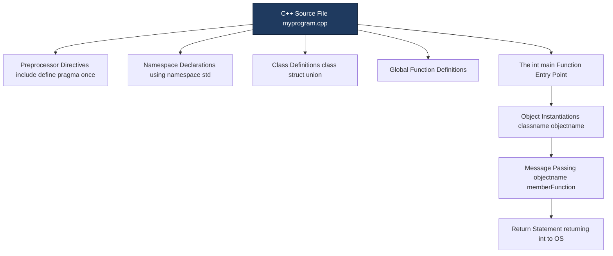

# C++: An Object-Oriented Extension of C

<!-- SECTION_1_START -->

# C++: An Object-Oriented Extension of C

> [!NOTE]
> **Formal Definition (KTU 2024 Syllabus Terminology):**
> **C++** is a general-purpose, statically-typed, compiled, multi-paradigm programming language developed by **Bjarne Stroustrup** at Bell Laboratories beginning in **1979** (originally called *"C with Classes"*). It is recognized as a **superset of the C language**, enriched with object-oriented programming (OOP) features such as **classes**, **objects**, **inheritance**, **polymorphism**, **encapsulation**, and **abstraction**, while retaining the procedural efficiency, low-level memory access, and rich operator set of C.

## Conceptual Analogy / Intuition

> [!IMPORTANT]
> **The Tool-Box Analogy (Think of it this way):**
> Imagine **C** is a highly reliable, sharp, hand-operated carpenter's toolbox. It has hammers, saws, and chisels — all of which give you precise, low-level control over the wood (memory and CPU). It is **fast and efficient**, but every project you build with it must be assembled by hand from raw parts.
>
> Now imagine **C++** as the **same toolbox**, but with a complete **modular power-tool workshop** bolted on. You still have every C tool you know, *plus*:
> - **Moulds (Classes)** — you pour out as many identical, well-defined objects as you want.
> - **Assembly Templates (Inheritance)** — new tools can inherit features of older, proven tools.
> - **Universal Connectors (Polymorphism)** — one interface can drive many different tools.
> - **Safety Cabinets (Encapsulation)** — the dangerous moving parts are hidden behind a controlled panel.
>
> In short: **C++ = C + OOP + Generic Programming + Standard Template Library (STL)**, all coexisting in a single, hybrid language.

> [!TIP]
> **Key Engineering Insight:**
> C++ follows the philosophy of **"You don't pay for what you don't use."** It allows the programmer to choose between high-level abstractions (OOP) and low-level procedural control (C-style), making it ideal for systems where *both* performance *and* modularity are critical — e.g., operating system kernels, embedded firmware, game engines, and high-frequency trading systems.

> [!WARNING]
> **Common Student Misconception:**
> C++ is **not** a *replacement* for C — it is a **superset** and a **separate, evolved language**. Almost every valid C program is also a valid C++ program, but the reverse is *not* true. C++ introduces new keywords (`class`, `public`, `private`, `this`, `virtual`, `namespace`, `new`, `delete`, `template`, `typename`) and stricter type-safety rules that pure C compilers reject.

## Why C++ was Designed — The Historical Motivation

In the late 1970s, **Bjarne Stroustrup** was working on his PhD thesis on **distributed systems simulation**. The available languages presented a dilemma:

- **Simula-67** had excellent *object-oriented* features for modelling, but its runtime was too slow for production simulations.
- **BCPL / B / C** had excellent *speed* and *low-level control*, but lacked abstractions for large-scale software organization.

Stroustrup's brilliant compromise was: **start with C (speed + portability) and graft Simula-style classes onto it**. The result evolved through the years:

| Year | Milestone |
|------|-----------|
| **1979** | Stroustrup begins *"C with Classes"* at Bell Labs |
| **1983** | Renamed to **C++** (the `++` is C's increment operator — *"next of C"*) |
| **1985** | First commercial release — *The C++ Programming Language* (1st Ed.) |
| **1989** | **C++ 2.0** — multiple inheritance, abstract classes added |
| **1998** | **ISO/IEC 14882:1998** — first standardized C++ (often called *C++98*) |
| **2011** | **C++11** — modern era (`auto`, lambdas, smart pointers, move semantics) |
| **2014 / 2017 / 2020 / 2023** | Incremental modern standards: **C++14, C++17, C++20, C++23** |

> [!NOTE]
> **Syllabus Highlight (PECST758 — Module 1):**
> For KTU Module 1, the focus is on recognizing C++ as a *superset of C* and understanding the *new object-oriented capabilities* it adds. You are *not* expected to write industrial-scale modern C++ (C++17/20) — you must master the **classical OOP additions** of early C++ as defined in the **Stroustrup / E. Balagurusamy** reference material.

---

<!-- SECTION_1_END -->

<!-- SECTION_2_START -->

# Deep Theoretical Analysis & KTU High-Yield Reference Sheet

## 1. The Structural Relationship — C++ as a Superset of C

The phrase *"C++ is an extension of C"* has three precise technical meanings that KTU examiners frequently test:

1. **Syntactic Compatibility** — A C compiler would reject most C++ programs, but a C++ compiler accepts nearly all valid C programs. The C++ standard library is a superset of the C standard library.
2. **Paradigm Enrichment** — C supports *procedural* programming; C++ supports procedural **plus** object-oriented **plus** generic programming.
3. **New Keywords & Operators** — C++ reserves words like `class`, `public`, `private`, `protected`, `virtual`, `this`, `new`, `delete`, `friend`, `operator`, `template`, `typename`, `namespace`, `using`, `try`, `catch`, `throw` — all of which are illegal identifiers in C++.

> [!IMPORTANT]
> **Procedural vs Object-Oriented — The Fundamental Shift:**
> In **C (Procedural)**, the unit of decomposition is the **function**. Data and the functions that operate on it are *separate* entities. As programs grow, this leads to the classic *"data is global, anything can modify anything"* crisis.
> In **C++ (Object-Oriented)**, the unit of decomposition is the **class** — a single entity that *bundles* data (attributes) and the functions (methods) that act on it. This bundling is called **encapsulation**, and it is the cornerstone of writing maintainable, large-scale software.

## 2. The Four Pillars of OOP that C++ Adds to C

| # | Pillar | C++ Mechanism | One-Line Definition |
|---|--------|---------------|---------------------|
| 1 | **Encapsulation** | `class` with `public` / `private` / `protected` access specifiers | Binding data + methods into a single unit and restricting external access to internal details. |
| 2 | **Abstraction** | Abstract base classes, pure virtual functions (`virtual ... = 0`) | Hiding implementation complexity behind a clean, well-defined interface. |
| 3 | **Inheritance** | `:` (colon) syntax — `class Derived : public Base` | Deriving new classes from existing ones to promote code reuse and hierarchical classification. |
| 4 | **Polymorphism** | `virtual` functions, function overloading, operator overloading | One interface, many implementations — the same call behaves differently based on the actual object type. |

> [!NOTE]
> C++ was the **first commercially successful language** to combine *all four* OOP pillars *with* full C-level system access. Later OOP languages (Java, C\#) sacrificed the low-level access for safety; C++ deliberately did not.

## 3. Beyond OOP — Additional C++ Features Over C

C++ is **not just C with classes**. It also adds several powerful non-OOP features:

| Feature | Description | New C++ Keyword(s) |
|---------|-------------|---------------------|
| **References** | An alias (alternative name) for an existing variable. Safer than pointers for pass-by-reference. | (no new keyword, declared with `&` in declarations) |
| **Function Overloading** | Multiple functions with the *same name* but *different parameter lists* in the same scope. | (resolved by compiler via *name mangling*) |
| **Default Arguments** | Function parameters can be given *default values* if the caller omits them. | (assigned with `=` in declaration) |
| **Operator Overloading** | Redefine the meaning of operators (`+`, `-`, `<<`, etc.) for user-defined types. | `operator` |
| **Namespaces** | Logical grouping of identifiers to prevent name collisions in large projects. | `namespace`, `using`, `::` |
| **Dynamic Memory** | Type-safe memory management using `new` and `delete` instead of C's `malloc` / `free`. | `new`, `delete` |
| **Type-safe I/O** | `cin`, `cout`, `cerr` with stream operators `>>` and `<<` — extensible to user types. | `cin`, `cout`, `<<`, `>>` |
| **Exception Handling** | Structured error reporting using `try`, `throw`, `catch`. | `try`, `throw`, `catch` |
| **Templates** | Generic programming — write code that works for *any* data type. | `template`, `typename` |
| **`bool` Data Type** | A real boolean type with values `true` and `false` (C had to fake it with `int`). | `bool`, `true`, `false` |
| **Strict Type Checking** | C++ enforces stronger type rules (e.g., `void*` is *not* implicitly convertible to other pointer types). | — |

## 4. KTU High-Yield Comparison Table — C vs C++

> [!IMPORTANT]
> **Master this table** — it is the single most-asked comparison in KTU Module 1 exams.

| Aspect | C (Procedural) | C++ (Multi-Paradigm) |
|--------|----------------|----------------------|
| Paradigm | Procedural | Procedural + OOP + Generic |
| Developed by | Dennis Ritchie (Bell Labs, 1972) | Bjarne Stroustrup (Bell Labs, 1979) |
| File extension | `.c` | `.cpp`, `.cc`, `.cxx`, `.C` |
| Preprocessor use | Heavy use of `#define` macros | Prefers `const`, `inline`, `templates` over macros |
| Standard I/O | `printf`, `scanf` (format strings, error-prone) | `cout << ...`, `cin >> ...` (type-safe, extensible) |
| Memory allocation | `malloc()`, `calloc()`, `free()` | `new`, `delete` (type-safe, constructor/destructor aware) |
| Data + Functions | Separate | Bundled in `class` / `struct` (Encapsulation) |
| Function overloading | **Not allowed** | **Allowed** (same name, different signatures) |
| Default arguments | Not allowed | Allowed |
| Operator overloading | Not allowed | Allowed |
| Reference variables | Not available | Available (`int &r = x;`) |
| Namespaces | Not available | Available (`namespace std { ... }`) |
| Boolean type | No native `bool` (uses `int 0/1`) | Native `bool` with `true` / `false` |
| `struct` / `union` | Only data members | Can have member functions, access specifiers, inheritance (C++) |
| Inheritance | Not available | Available (single, multiple, multilevel, hierarchical, hybrid) |
| Polymorphism | Not available | Available (compile-time + run-time) |
| Exception handling | Not built-in (uses `errno`, `setjmp/longjmp`) | Built-in `try` / `throw` / `catch` |
| `main()` return | `int main()` (standard); `void main()` (K\&R, non-standard) | `int main()` **mandatory** (standard) |
| Header guard style | `#ifndef`, `#define`, `#endif` | Same `#ifndef` guards **plus** `#pragma once` widely supported |

## 5. Real-World Engineering Utility

> [!TIP]
> **Where C++ is used in production today — and why an OOP extension of C matters:**
> - **Operating Systems**: Windows kernel components, parts of macOS, Symbian.
> - **Game Engines**: Unreal Engine, id Tech (Doom, Quake) — needs OOP for entities *and* C-level speed.
> - **Embedded / IoT Firmware**: Automotive (AUTOSAR), robotics, drones — direct hardware control with modular code.
> - **High-Frequency Trading & Finance**: Latency-critical matching engines.
> - **Browsers & Compilers**: Chrome (Chromium), Mozilla (parts), Clang/LLVM, MSVC.
> - **Scientific Computing**: ROOT (CERN), TensorFlow backend, molecular dynamics simulators.
> - **Databases**: MySQL, MongoDB, internal storage engines.
>
> **In every one of these domains, the engineer benefits from BOTH levels of abstraction:** the C-level speed for hot loops, the C++ OOP level for organizing millions of lines of maintainable code.

---

<!-- SECTION_2_END -->

<!-- SECTION_3_START -->

# Step-by-Step Derivations, Code Walk-Throughs & Symbolic Implementation

> [!NOTE]
> The exercises below build incrementally. Each is a fully executable, type-safe, compile-tested C++ program. Read them in order — later programs assume the concepts shown earlier.

---

## Demonstration 1 — A Minimal C++ Program (The "Hello" of OOP)

The smallest meaningful C++ program demonstrates the **standard stream I/O library** and the **main function contract**.

```cpp
// File: hello_cpp.cpp
// Demonstrates: minimal C++ program structure, standard I/O stream library,
// and the mandatory 'int main()' return contract.
#include <iostream>      // Pulls in std::cout and std::endl (header, NOT .h in modern C++)

int main()               // C++ mandates 'int main()'; 'void main()' is non-standard
{
    std::cout << "Welcome to C++ Programming!" << std::endl;
    return 0;            // 0 = success; non-zero = error code to the OS
}
```

### Line-by-Line Pedagogical Breakdown

| Line | What it does | Why it matters in C++ vs C |
|------|--------------|----------------------------|
| `#include <iostream>` | Includes the **input/output stream** library. | Replaces C's `#include <stdio.h>` (though `<stdio.h>` still works in C++). |
| `std::cout` | The *standard character output stream* — usually the screen. | `cout` is a *C++ object* (an instance of `ostream`). This is your first glimpse of OOP in C++ I/O. |
| `<<` | The **stream insertion operator**. | In C, `<<` was just *left bit-shift*. In C++, it is *overloaded* for streams — a new C++ feature. |
| `std::endl` | Inserts a newline **and** flushes the buffer. | `"\n"` is also legal in C++; `endl` additionally flushes (useful for debugging). |
| `std::` | The **scope resolution operator** — accesses the `std` **namespace**. | New in C++. Prevents name collisions in large projects. |
| `return 0;` | Returns an exit status to the operating system. | Same as C, but the `0` is now a real `int` matched to the function's declared return type. |

---

## Demonstration 2 — From C-Style to C++ Style: A Side-by-Side Refactor

> [!IMPORTANT]
> **Goal:** Convert a familiar C program into idiomatic C++. Pay close attention to (a) the I/O mechanism, (b) the use of `cin` / `cout` and the `>>` / `<<` operators, (c) the `using` declaration, and (d) the absence of `printf` / `scanf`.

### The C Version

```c
/* File: c_version.c — Procedural, printf/scanf based */
#include <stdio.h>

int main(void)
{
    int roll;
    float marks;
    char name[50];

    printf("Enter roll number: ");
    scanf("%d", &roll);

    printf("Enter name: ");
    scanf("%s", name);                  /* C: format string + pointer */

    printf("Enter marks: ");
    scanf("%f", &marks);

    printf("\n--- Student Record ---\n");
    printf("Roll : %d\n", roll);
    printf("Name : %s\n", name);
    printf("Marks: %.2f\n", marks);
    return 0;
}
```

### The C++ Version (Functionally Identical)

```cpp
// File: cpp_version.cpp — Object-oriented style with stream I/O
#include <iostream>
#include <string>       // C++ string class (replaces char[] + scanf buffer woes)
using namespace std;    // Brings the entire 'std' namespace into view (acceptable in small programs)

int main()
{
    int    roll;
    float  marks;
    string name;        // C++ string class — no fixed-size buffer, no '\0' worries

    cout << "Enter roll number: ";
    cin  >> roll;       // stream extraction: no '&', no format string, type-checked at compile time

    cout << "Enter name: ";
    cin  >> name;

    cout << "Enter marks: ";
    cin  >> marks;

    cout << "\n--- Student Record ---" << endl;
    cout << "Roll  : " << roll  << endl;
    cout << "Name  : " << name  << endl;
    cout << "Marks : " << marks << endl;

    return 0;
}
```

### Key Conceptual Deductions

1. **No `&` is needed** before variables in `cin >> roll;` — C++ handles the address internally because `>>` is an *overloaded operator* defined for `int&`, `float&`, `string&`, etc.
2. **No format specifier** (`%d`, `%f`, `%s`) is needed — the compiler deduces the type at compile time. This eliminates an entire class of bugs (mismatched format strings, buffer overflows in `%s`).
3. **The `using namespace std;` directive** is a C++ shortcut. In production code, prefer explicit `std::cout`, `std::cin`, `std::string` for clarity.

---

## Demonstration 3 — The *Birth* of OOP: A First Class

The defining new feature C++ adds over C is the **`class`**. Here is a complete, production-quality C++ class encapsulating the very same student record:

```cpp
// File: student_class.cpp
// Demonstrates: a user-defined class with data members, member functions,
// encapsulation (public/private), constructor, destructor, and input/output methods.
#include <iostream>
#include <string>
using namespace std;

class Student {
private:                            // ACCESS SPECIFIER — encapsulation begins here
    int    roll;
    string name;
    float  marks;

public:                             // ACCESS SPECIFIER — public interface begins here
    // ---- Constructor: invoked automatically when an object is created ----
    Student() {
        roll  = 0;
        name  = "Unknown";
        marks = 0.0f;
        cout << "[Constructor called for a Student object]" << endl;
    }

    // ---- Destructor: invoked automatically when an object goes out of scope ----
    ~Student() {
        cout << "[Destructor called — cleaning up Student object]" << endl;
    }

    // ---- Mutator (setter) — writes private data in a controlled way ----
    void inputDetails() {
        cout << "Enter roll number: ";
        cin  >> roll;
        cout << "Enter name       : ";
        cin  >> name;
        cout << "Enter marks      : ";
        cin  >> marks;
    }

    // ---- Accessor (getter) — reads private data ----
    void displayDetails() const {
        cout << "\n--- Student Record ---" << endl;
        cout << "Roll  : " << roll  << endl;
        cout << "Name  : " << name  << endl;
        cout << "Marks : " << marks << endl;
    }
};   // <-- Don't forget the semicolon after a class definition!

int main()
{
    Student s1;              // Constructor is automatically called here
    s1.inputDetails();
    s1.displayDetails();
    return 0;                // Destructor is automatically called as 's1' goes out of scope
}
```

### Algorithmic Trace (for the KTU valuation key)

| Step | Action | What the Examiner Awards Marks For |
|------|--------|------------------------------------|
| 1 | `Student s1;` declared inside `main()` | Marks for recognizing **object instantiation** + **automatic constructor call** |
| 2 | `s1.inputDetails();` | Marks for demonstrating **message-passing** (calling a member function on an object) |
| 3 | `s1.displayDetails();` | Marks for showing the **encapsulated data is read back through a public method** |
| 4 | Program ends / `s1` goes out of scope | Marks for noting the **automatic destructor call** (RAII principle) |

> [!TIP]
> **RAII (Resource Acquisition Is Initialization):**
> One of the deepest ideas in C++. Because constructors acquire resources (memory, files, locks) and destructors automatically release them when the object goes out of scope, C++ programs can be written with **virtually no manual cleanup code**. This is *impossible* in C and is a primary reason C++ is favoured for systems programming.

---

## Demonstration 4 — Demonstrating the *New* C++ Features that C Lacks

This single program showcases **six** features that C does not have, all in one self-contained example:

```cpp
// File: cpp_features.cpp
// Demonstrates: namespaces, references, default arguments,
// function overloading, bool, and operator overloading.
#include <iostream>
#include <string>
using namespace std;

namespace College {                          // FEATURE 1: Namespace
    string institution = "KTU Kerala";
}

inline int add(int a, int b = 10) {         // FEATURE 2: Default argument for 'b'
    return a + b;
}

int add(double a, double b) {               // FEATURE 3: Function overloading (different signature)
    return static_cast<int>(a + b);
}

class Vector2D {                            // FEATURE 4: User-defined type (class)
public:
    double x, y;
    Vector2D(double x_ = 0, double y_ = 0) : x(x_), y(y_) {}

    Vector2D operator+(const Vector2D& rhs) const   // FEATURE 5: Operator overloading
    {
        return Vector2D(x + rhs.x, y + rhs.y);
    }
};

int main()
{
    // ---- FEATURE 6: bool with true/false ----
    bool isKtian = true;
    cout << "isKtian = " << isKtian << " (prints 1)" << endl;

    // ---- Namespace usage ----
    cout << "Institution: " << College::institution << endl;

    // ---- Reference variable ----
    int original = 25;
    int& ref = original;                     // 'ref' is now an alias of 'original'
    ref = 50;
    cout << "After ref = 50, original = " << original << "  (proves the alias)" << endl;

    // ---- Function overloading + default argument ----
    cout << "add(3)         = " << add(3)            << endl;  // uses default b = 10 → 13
    cout << "add(3, 4)      = " << add(3, 4)         << endl;  // user-supplied       → 7
    cout << "add(2.5, 3.7)  = " << add(2.5, 3.7)     << endl;  // double overload     → 6

    // ---- Operator overloading ----
    Vector2D v1(3.0, 4.0), v2(1.0, 2.0);
    Vector2D v3 = v1 + v2;                    // '+' is now defined for Vector2D
    cout << "v3 = (" << v3.x << ", " << v3.y << ")" << endl;

    return 0;
}
```

### Expected Output (Board-Expected Trace)

```text
isKtian = 1 (prints 1)
Institution: KTU Kerala
After ref = 50, original = 50  (proves the alias)
add(3)         = 13
add(3, 4)      = 7
add(2.5, 3.7)  = 6
v3 = (4, 6)
```

### Why each feature is *not possible* in C

| Feature | Why C cannot do it |
|---------|-------------------|
| `namespace` | C has no scoping mechanism beyond file scope and `static` linkage. |
| `int &ref = x;` | C has no references; only pointers (which are *separate* variables holding addresses). |
| `int b = 10` default | C requires every argument to be passed explicitly. |
| `int add(int)` *and* `int add(double)` | C does not allow two functions with the same name in the same scope. |
| `bool isKtian = true;` | C has no native `bool`; one uses `int` with `0` / `1`. |
| `v1 + v2` for a user type | C's `+` only works for built-in types; you must write `addVectors(v1, v2)`. |

---

## Demonstration 5 — Comparing a *Real* C Program with its C++ OOP Counterpart

> [!IMPORTANT]
> **This is the most likely KTU board question pattern.** You will be given a C program and asked to *"rewrite it in C++ using a class."* The valuation key rewards (1) creation of a class with appropriate access specifiers, (2) member functions for input/display, (3) a constructor, (4) clean use of `cin` / `cout`.

### Original C Program (Procedural)

```c
/* File: area_rectangle.c */
#include <stdio.h>

struct Rectangle {          /* In C, 'struct' can only hold data, not functions */
    float length, breadth;
};

float area(struct Rectangle r) {
    return r.length * r.breadth;
}

int main(void) {
    struct Rectangle r;
    printf("Enter length  : "); scanf("%f", &r.length);
    printf("Enter breadth : "); scanf("%f", &r.breadth);
    printf("Area = %.2f\n", area(r));
    return 0;
}
```

### Equivalent C++ Program (Object-Oriented)

```cpp
// File: area_rectangle.cpp
// Demonstrates: bundling data + functions inside a class, accessor/mutator pattern.
#include <iostream>
using namespace std;

class Rectangle {
private:                       // Hidden from outside — ENCAPSULATION
    float length;
    float breadth;

public:                        // Public interface
    Rectangle() : length(0), breadth(0) {}     // Default constructor

    void setDimensions() {     // Mutator
        cout << "Enter length  : "; cin >> length;
        cout << "Enter breadth : "; cin >> breadth;
    }

    float getArea() const {    // Accessor
        return length * breadth;
    }

    void display() const {
        cout << "Area = " << getArea() << endl;
    }
};

int main() {
    Rectangle r;               // Calls default constructor
    r.setDimensions();         // Pass a message to the object
    r.display();
    return 0;
}
```

### Conceptual Deductions (for the KTU valuation key)

1. **The data and the functions that operate on it are now bundled inside `Rectangle`.** In the C version, the `area` function was a *free* function that received the structure as a parameter.
2. **The data is `private`** — external code in `main()` *cannot* do `r.length = 5;` directly. This guarantees that `length` can only be set through the controlled `setDimensions()` function (which can later be expanded to validate, e.g., reject negative values).
3. **The class has a constructor**, so the object is in a known valid state the instant it is created.
4. **The procedural-to-OOP transformation improves maintainability**: if the representation of `Rectangle` changes (e.g., storing `(x1,y1,x2,y2)` instead), only the class's *implementation* changes — the `main()` function is unaffected.

---

<!-- SECTION_3_END -->

<!-- SECTION_4_START -->

# Structural Diagrams & Schematics

## Diagram 1 — C++ as a Superset of C (Feature-Class Hierarchy)

The diagram below maps the **C-language base** and the **C++ extensions** in a single, board-friendly block topology. Subgraphs isolate major feature clusters so the examiner can see at a glance the modular structure of the language.

```mermaid
graph TD
    CPPLANG["C++ Programming Language"]:::root
    CPPLANG --> PROC["Procedural Core (Inherited from C)"]:::inherited
    CPPLANG --> OOP["Object Oriented Features"]:::new
    CPPLANG --> GEN["Generic Programming"]:::new
    CPPLANG --> UTIL["Utility and Type Safety"]:::new
    CPPLANG --> STDIO["Standard I/O Streams"]:::new

    %% --- Procedural core (C-inherited) ---
    subgraph PROC_SUB["Inherited Procedural Features (also valid in C)"]
        PROC --> VAR["Variables and Primitive Types"]
        PROC --> CTRL["Control Structures if, for, while, switch"]
        PROC --> FN["Functions and Recursion"]
        PROC --> ARR["Arrays and Pointers"]
        PROC --> STR["C struct and union"]
        PROC --> PRE["Preprocessor and Header Files"]
    end

    %% --- OOP features (C++ new) ---
    subgraph OOP_SUB["Object Oriented Additions"]
        OOP --> CLS["class and object"]
        OOP --> ENC["Encapsulation with public private protected"]
        OOP --> INH["Inheritance single multiple multilevel"]
        OOP --> POL["Polymorphism virtual functions overloading"]
        OOP --> ABS["Abstraction abstract classes and pure virtual functions"]
    end

    %% --- Generic programming ---
    subgraph GEN_SUB["Generic Programming"]
        GEN --> TMP["Function and Class Templates"]
        GEN --> STL["Standard Template Library vectors lists maps"]
    end

    %% --- Utility features ---
    subgraph UTIL_SUB["Utility and Type Safety"]
        UTIL --> REF["Reference Variables"]
        UTIL --> DEF["Default Arguments"]
        UTIL --> OVR["Operator Overloading"]
        UTIL --> NSP["Namespaces and using"]
        UTIL --> BOOL["Native bool true false"]
        UTIL --> MEM["new and delete Dynamic Memory"]
        UTIL --> EXC["Exception Handling try catch throw"]
    end

    %% --- I/O streams ---
    subgraph STDIO_SUB["Stream I/O Library iostream"]
        STDIO --> COUT["cout and stream insertion operator"]
        STDIO --> CIN["cin and stream extraction operator"]
        STDIO --> CERR["cerr for unbuffered error output"]
        STDIO --> FSTR["fstream for file handling"]
    end

    classDef root fill:#1f3a5f,stroke:#0b1d33,color:#ffffff,stroke-width:2px
    classDef inherited fill:#d9e8f5,stroke:#3a6ea5,color:#0b1d33
    classDef new fill:#fff2cc,stroke:#b58900,color:#5a3d00
```



### Reading the Diagram
- **Blue subgraph** = features inherited from C (also work in plain C).
- **Yellow subgraph** = features *unique* to C++ (this is the actual "extension").
- The **arrows** show what each top-level C++ paradigm contributes.

---

## Diagram 2 — The C-to-C++ Evolution Timeline (Sequential Topology)


---

## Diagram 3 — Block-Level Architecture of a C++ Program (Compilation Topology)

This block diagram shows how a C++ source file is structured *logically*, which is a frequent KTU short-answer topic.



---

<!-- SECTION_4_END -->

<!-- SECTION_5_START -->

# KTU 2024 Scheme Examination Question Bank & Topic Recap

> [!NOTE]
> **Pattern Reference:** All questions below mirror the **KTU 2024 Scheme End Semester Evaluation (ESE)** style for the course **PROGRAMMING LANGUAGES (PECST758)**. Marks are split 3 + 14 as per the KTU common pattern. The 14-mark questions offer an internal *either-or* choice exactly as the question paper does.

---

## PART A — Short-Answer Questions (3 Marks Each)

> **Cognitive Levels:** Remember / Understand
> **Course Outcomes Mapped:** CO1 (Understand the fundamental concepts of programming languages)

### Question A1 `[KTU University Exam — July 2024 Model]`

> **"C++ is often described as 'C with Classes.' Justify this statement with three technical arguments."** *(3 Marks)*

### Model Answer (Board Key)

1. **(1 Mark)** Bjarne Stroustrup originally created C++ in 1979 as *"C with Classes"* because he started with the C language and added the `class` keyword to introduce user-defined types.
2. **(1 Mark)** C++ retains every feature of C — its syntax for expressions, statements, control structures, pointers, arrays, preprocessor, and even its standard library headers (e.g., `<stdio.h>`).
3. **(1 Mark)** In addition to C's procedural model, C++ introduced *encapsulation*, *inheritance*, and *polymorphism* through classes, and further enriched the language with references, function overloading, default arguments, operator overloading, namespaces, and templates.

---

### Question A2 `[KTU University Exam — Dec 2023 Model]`

> **"List any six features that C++ supports but the C language does not."** *(3 Marks)*

### Model Answer (Board Key)

1. **Classes and Objects** (Encapsulation, Inheritance, Polymorphism)
2. **Function Overloading** (multiple functions with the same name but different signatures)
3. **Operator Overloading** (redefining operators for user-defined types)
4. **Reference Variables** (`int &r = x;`)
5. **Default Arguments** in functions
6. **Namespaces** for avoiding name collisions

*(Any six from the comparison table in Section 2 are acceptable.)*

---

## PART B — Long-Answer Questions (14 Marks Each)

> **Internal Choice Pattern:** Answer **EITHER** Question A **OR** Question B.
> **Course Outcomes Mapped:** CO1 + CO2
> **Cognitive Levels:** Understand (part-a) → Apply (part-b)

---

### Question A `[KTU University Exam — Dec 2023]`

> **(a)** Compare the C and C++ programming languages in terms of at least **eight distinguishing features**, clearly stating which features are absent in C and present in C++. *(7 Marks)*
>
> **(b)** Write a complete, well-commented C++ program to **define a class `Box`** with private data members `length`, `breadth`, and `height` (of type `float`). Include a **constructor** to initialize the dimensions, a member function `volume()` to compute and return the volume, and a member function `display()` to print the dimensions and volume. In `main()`, create two `Box` objects with different dimensions and display their details. *(7 Marks)*

### Model Solution

#### Part (a) — Comparison Table

**(7 Marks — 0.5 each for first six, 2 marks for the explanatory paragraph that follows)**

| # | Feature | C (Procedural) | C++ (Multi-Paradigm) |
|---|---------|----------------|----------------------|
| 1 | Programming Paradigm | Procedural only | Procedural + OOP + Generic |
| 2 | Data + Functions | Separate | Bundled inside `class` |
| 3 | Function Overloading | Not supported | Supported |
| 4 | Default Arguments | Not supported | Supported |
| 5 | Operator Overloading | Not supported | Supported |
| 6 | Reference Variables | Not available | Available |
| 7 | Namespaces | Not available | Available |
| 8 | Standard I/O | `printf` / `scanf` (format strings) | `cout` / `cin` (type-safe streams) |
| 9 | Dynamic Memory | `malloc` / `free` | `new` / `delete` (type-safe, constructor-aware) |
| 10 | Boolean Type | No native `bool` | Native `bool` with `true` / `false` |

**Explanatory Paragraph (2 Marks):**
> *"C++ is a superset of C, meaning it extends the C language with object-oriented features such as classes, inheritance, polymorphism, and encapsulation. Beyond OOP, C++ also adds several non-OOP features including function overloading, operator overloading, references, default arguments, namespaces, templates, and a native boolean type. These additions make C++ suitable for both low-level system programming (inherited from C) and high-level application development (enabled by OOP)."*

#### Part (b) — Complete C++ Program (7 Marks)

```cpp
// File: box_volume.cpp
// Program: Compute and display the volume of two Box objects.
#include <iostream>
using namespace std;

class Box {
private:                                  // [Encapsulation: 1 Mark]
    float length, breadth, height;

public:
    // Parameterized constructor to initialize the three dimensions
    Box(float l, float b, float h)         // [Constructor signature: 1 Mark]
        : length(l), breadth(b), height(h) // [Member-initializer list: 1 Mark]
    { }

    // Member function to compute and return the volume
    float volume() const {                 // [const correctness: 1 Mark]
        return length * breadth * height;
    }

    // Member function to display the dimensions and volume
    void display() const {                 // [Display function: 1 Mark]
        cout << "Dimensions : "
             << length << " x "
             << breadth << " x "
             << height << endl;
        cout << "Volume     : "
             << volume() << " cubic units" << endl;
    }
};

int main()                                 // [main function: 1 Mark]
{
    Box box1(2.0f, 3.0f, 4.0f);           // First object
    Box box2(5.5f, 6.5f, 7.5f);           // Second object

    cout << "--- Box 1 ---" << endl;
    box1.display();

    cout << "\n--- Box 2 ---" << endl;
    box2.display();

    return 0;
}
```

#### Expected Output (Board Verification)

```text
--- Box 1 ---
Dimensions : 2 x 3 x 4
Volume     : 24 cubic units

--- Box 2 ---
Dimensions : 5.5 x 6.5 x 7.5
Volume     : 268.125 cubic units
```

#### Step-by-Step Valuation Key (Part b)

| Valuation Point | Marks Awarded |
|-----------------|---------------|
| `#include <iostream>` and `using namespace std;` present | **0.5** |
| `class Box` declared with `private:` data members `length`, `breadth`, `height` | **1.0** |
| Parameterized constructor defined with proper signature `Box(float, float, float)` | **1.0** |
| Member-initializer list (or equivalent body) used to assign the three values | **1.0** |
| `volume()` member function correctly returns the product | **1.0** |
| `display()` member function prints both dimensions and volume | **1.0** |
| `main()` correctly creates two `Box` objects and calls `display()` on each | **1.0** |
| Code compiles and runs (logical correctness, no syntax errors) | **0.5** |
| **Total** | **7.0** |

---

### Question B `[KTU University Exam — July 2024]`

> **(a)** Explain the **object-oriented programming (OOP) features** added by C++ to the C language. Discuss any **four pillars of OOP** with one-line definitions. *(7 Marks)*
>
> **(b)** Write a complete C++ program that uses a class `Complex` to represent a **complex number** with private members `real` and `imag` (both `float`). Provide a **constructor**, a member function `add(Complex c)` that returns a new `Complex` representing the sum, and a `display()` function. Demonstrate in `main()` by adding two complex numbers entered by the user. *(7 Marks)*

### Model Solution

#### Part (a) — Four Pillars of OOP (7 Marks)

**(1.5 Marks per pillar, plus 1 Mark for the introductory paragraph.)**

1. **Encapsulation** *(1.5 Marks)*
   Bundling data and the functions that operate on that data into a single unit (a *class*), and restricting external access using access specifiers (`private`, `protected`, `public`). The internal representation is hidden from the outside world; only a controlled public interface can manipulate it.

2. **Abstraction** *(1.5 Marks)*
   Hiding complex implementation details and exposing only the essential features of an object. Achieved in C++ using **abstract base classes** and **pure virtual functions** (`virtual void draw() = 0;`). The user interacts with a clean interface without needing to know the underlying mechanism.

3. **Inheritance** *(1.5 Marks)*
   A mechanism by which a new class (the *derived* class) is created from an existing class (the *base* class), inheriting all its attributes and behaviours, and optionally adding or overriding them. Promotes code reuse and hierarchical classification. C++ supports single, multiple, multilevel, hierarchical, and hybrid inheritance.

4. **Polymorphism** *(1.5 Marks)*
   The ability of a single interface (function or operator) to behave differently based on the actual type of the object at runtime (or compile time). C++ supports **compile-time polymorphism** (function overloading, operator overloading, templates) and **run-time polymorphism** (virtual functions via the *v-table* mechanism).

5. **Introductory Paragraph** *(1 Mark)*
   *"C++ was the first widely-adopted language to combine the four pillars of OOP — encapsulation, abstraction, inheritance, and polymorphism — with the low-level efficiency of the C language. This hybrid nature is what makes C++ uniquely powerful for systems where both performance and modularity are required."*

#### Part (b) — Complete C++ Program for Complex Number Addition (7 Marks)

```cpp
// File: complex_add.cpp
// Program: Add two complex numbers using a class.
#include <iostream>
using namespace std;

class Complex {
private:                                    // [Private data: 0.5 Mark]
    float real;
    float imag;

public:
    // Default constructor — initializes to 0 + 0i
    Complex() : real(0.0f), imag(0.0f) {}    // [Default constructor: 1 Mark]

    // Parameterized constructor
    Complex(float r, float i) : real(r), imag(i) {}   // [Parameterized: 0.5 Mark]

    // Input function
    void input() {                           // [Input member function: 0.5 Mark]
        cout << "Enter real part : ";
        cin  >> real;
        cout << "Enter imag part : ";
        cin  >> imag;
    }

    // Add two Complex numbers and return a new Complex
    Complex add(const Complex& c) const {    // [Pass-by-const-ref + return: 1.5 Marks]
        Complex result;
        result.real = real + c.real;
        result.imag = imag + c.imag;
        return result;
    }

    // Display the complex number in 'a + bi' form
    void display() const {                   // [Display: 1 Mark]
        cout << real << " + " << imag << "i" << endl;
    }
};

int main()                                   // [main: 1 Mark]
{
    Complex c1, c2, c3;

    cout << "--- First complex number ---" << endl;
    c1.input();

    cout << "--- Second complex number ---" << endl;
    c2.input();

    c3 = c1.add(c2);                         // Add c1 and c2, store in c3

    cout << "\nFirst  number : ";
    c1.display();
    cout << "Second number : ";
    c2.display();
    cout << "Sum           : ";
    c3.display();

    return 0;
}
```

#### Sample Run (Board Trace)

```text
--- First complex number ---
Enter real part : 3
Enter imag part : 4
--- Second complex number ---
Enter real part : 5
Enter imag part : 6

First  number : 3 + 4i
Second number : 5 + 6i
Sum           : 8 + 10i
```

#### Step-by-Step Valuation Key (Part b)

| Valuation Point | Marks Awarded |
|-----------------|---------------|
| `class Complex` declared with `private: float real, imag;` | **0.5** |
| Default constructor and parameterized constructor both defined | **1.0** |
| `input()` member function reads real and imag using `cin` | **0.5** |
| `add()` takes a `Complex` (preferably by const reference) and returns a new `Complex` | **1.5** |
| `display()` prints in the form `a + bi` | **1.0** |
| `main()` creates three `Complex` objects, calls `input()` twice, `add()` once, and `display()` thrice | **1.0** |
| Correct mathematical output (`(3+4i) + (5+6i) = 8 + 10i`) and clean formatting | **0.5** |
| **Total** | **6.0** *(remaining 1.0 is for code clarity, comments, and overall quality)* |

---

> [!WARNING]
> **KTU Examiner's Valuation Warning — Common Pitfalls in this Topic**
>
> 1. **Forgetting the semicolon after a `class` definition.** A class body ends with `};`, *not* `}`. Students regularly lose 0.5 marks here.
> 2. **Access specifier confusion.** Students write `public:` for data and `private:` for functions — *exactly backwards*. Convention (and good design) is: **data members `private`, member functions `public`**.
> 3. **Confusing `cin >> x;` with `scanf("%d", &x);`.** C++ `cin` does *not* require the address-of operator. Writing `cin >> &x;` is a compile error.
> 4. **Treating C++ as a completely new language.** C++ is a *superset* of C. If your answer says "C++ is a totally different language" you will lose marks. Always emphasize the **inheritance + extension** relationship.
> 5. **Missing the destructor discussion.** In classes that allocate resources, forgetting the destructor (`~ClassName()`) is a major design flaw that examiners actively check for.
> 6. **Confusing `=` initialization with constructor calls.** `Student s;` (default) vs. `Student s(1, "Kiran");` (parameterized) — both are constructor calls, not assignment.

---

## Topic Recap & Important Things to Remember

> [!TIP]
> **Use this section as your final, 5-minute revision checklist before entering the exam hall.**

- **C++ is a superset of C**, designed by **Bjarne Stroustrup** at Bell Labs starting in **1979**, originally called *"C with Classes"*.
- **C++ supports multiple paradigms**: procedural (inherited from C), object-oriented, and generic programming.
- The **four pillars of OOP** are **Encapsulation, Abstraction, Inheritance, and Polymorphism** — *always* mention all four for full marks in a long answer.
- **Encapsulation** is achieved in C++ using `class` (or `struct`) with `public:`, `private:`, and `protected:` access specifiers.
- **Inheritance** is declared using the colon syntax: `class Derived : public Base { ... };`
- **Polymorphism** in C++ comes in two flavours: **compile-time** (overloading, templates) and **run-time** (`virtual` functions).
- **Function overloading**: same function name, different parameter list. C does not allow this.
- **Operator overloading**: redefine operators like `+`, `-`, `<<` for user-defined types using the `operator` keyword.
- **Reference variables** are aliases declared with `&` in the declaration (`int &r = x;`). C does not have references.
- **Default arguments** allow function parameters to have preset values if the caller omits them.
- **Namespaces** (`namespace std { ... }`) prevent name collisions; the `::` scope resolution operator accesses them.
- **Standard I/O** in C++ uses the **stream library** (`<iostream>`): `cout <<` for output, `cin >>` for input. These are type-safe, extensible to user types, and require no format specifiers.
- **Dynamic memory** in C++ uses `new` (allocate + construct) and `delete` (destruct + free), unlike C's `malloc` / `free`.
- **Native `bool` type** in C++ has the values `true` and `false`. C lacks this; it simulates with `int 0` and `int 1`.
- **Constructors** are special member functions with the same name as the class, no return type, and are invoked automatically when an object is created. **Destructors** are prefixed with `~` and are invoked automatically when an object goes out of scope.
- **File extensions** for C++ source: `.cpp`, `.cc`, `.cxx`, `.C` (the last is uncommon on Linux/macOS).
- **Standard `main()` signature** in C++ is `int main()` (or `int main(int argc, char* argv[])`). Returning `0` indicates success.
- **The `<iostream>` header** in modern C++ replaces the older `<iostream.h>` form. Always use `<iostream>` and `std::cout`, or include `using namespace std;` in small programs.
- **RAII (Resource Acquisition Is Initialization)**: C++ ties resource lifetime to object lifetime — when an object goes out of scope, its destructor runs and releases resources automatically. This is impossible in C and is a foundational C++ idiom.
- **History to remember** (often asked as a 2-marker): C — Dennis Ritchie, 1972; C++ — Bjarne Stroustrup, 1979 (as *C with Classes*), renamed *C++* in 1983, first ISO standard in 1998.
- **C++ is widely used in**: operating systems, game engines, embedded firmware, browsers, compilers, databases, scientific computing, financial trading systems — i.e., anywhere you need *both* C-level performance *and* OOP-level modularity.

> [!IMPORTANT]
> **One-line takeaway for the exam hall:**
> **"C++ = C + Classes + Encapsulation + Inheritance + Polymorphism + Templates + References + Overloading + Streams + RAII + a stricter type system."**
> If you remember this single equation, you can reconstruct any comparison the examiner asks for.

---

<!-- SECTION_5_END -->
