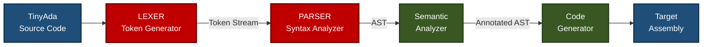
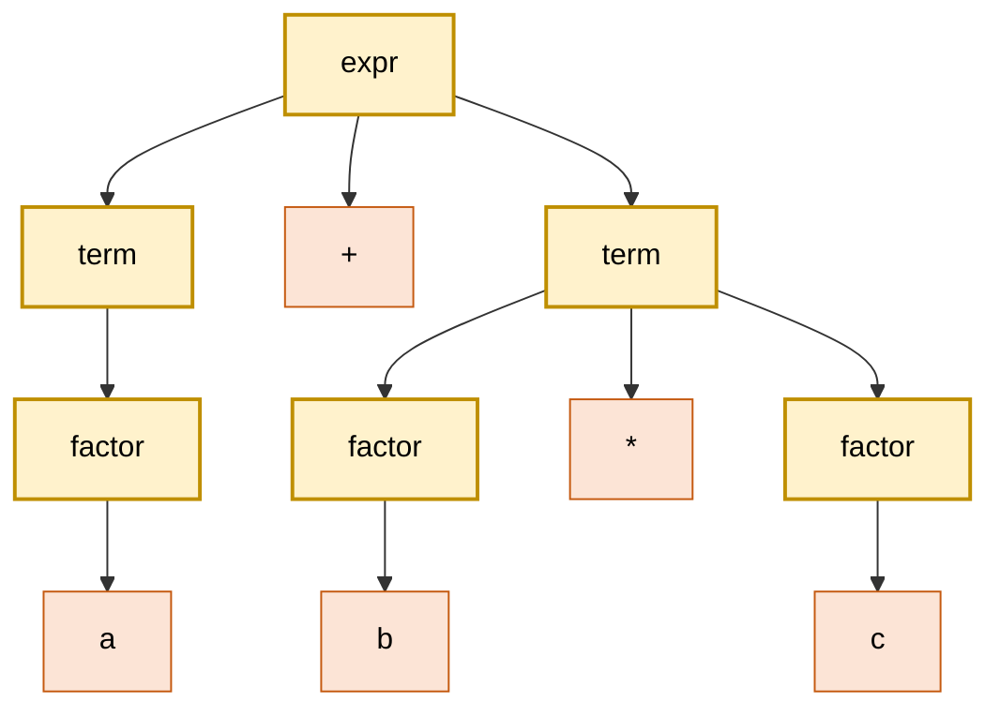
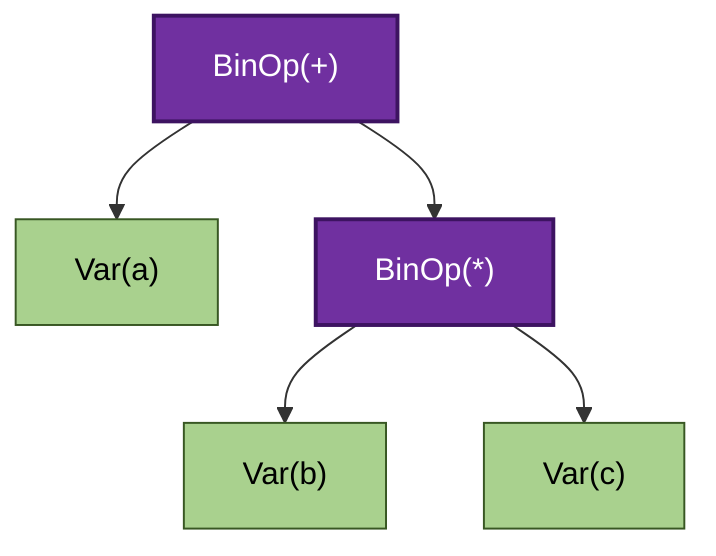
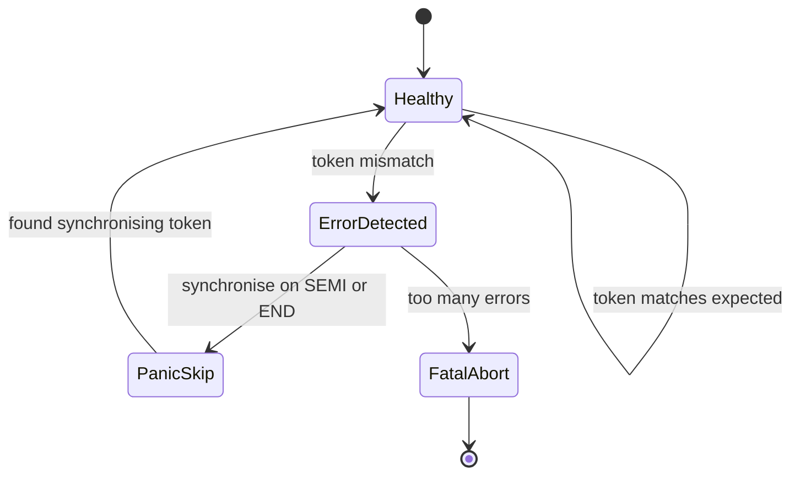
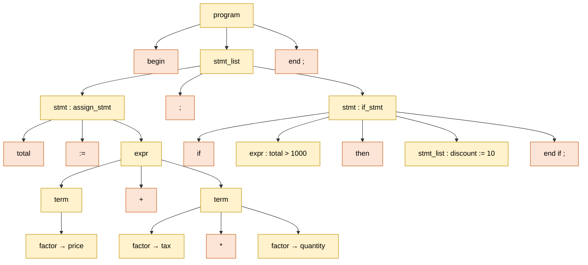

# Case Study: Building a Syntax Analyzer for TinyAda

<!-- SECTION_1_START -->
# 🛠️ Case Study: Building a Syntax Analyzer for TinyAda

## 1.1 What Exactly Is TinyAda?

**TinyAda** is a deliberately minimalist, *pedagogical* subset of the **Ada programming language**. It is designed by academics to expose students to the **formal grammar**, **lexical structure**, and **syntactic hierarchy** of a real, industrial-strength language without drowning them in the full 1,000+ page Ada Reference Manual.

In a KTU context, TinyAda typically preserves Ada's three signature traits:

1. **Block structure with explicit delimiters** — `begin ... end` instead of curly braces.
2. **The non-standard assignment operator** — `:=` (Pascal heritage).
3. **Reserved keywords are not case-sensitive but must be syntactically distinct**.

> [!IMPORTANT]
> **Formal Definition (KTU 2024 Syllabus Terminology):**
> A **Syntax Analyzer** (also called a *parser*) is the second phase of a compiler front-end. It consumes the **stream of tokens** produced by the lexical analyzer and verifies that the sequence conforms to the **Context-Free Grammar (CFG)** of the source language, producing either an **Abstract Syntax Tree (AST)** or a list of syntax errors.

## 1.2 The Real-World Analogy — "The Grammar Police Officer"

Imagine you are an **immigration officer at an international airport**.

* The **lexical analyzer** is the officer who looks at your **passport** and checks that every letter, digit, and stamp is *individually* valid (your name has no weird symbols, the date format is correct, the photo matches).
* The **syntax analyzer** is the **senior inspector** who then takes your passport, your visa, your boarding pass, and your hotel booking — and checks that they all **tell a logically consistent story** in the correct order (Visa *before* boarding pass, hotel booking *after* visa, etc.).

If the senior inspector finds a mismatch (e.g., you have a boarding pass but no visa), they reject you. That's a **syntax error**.

For TinyAda, the "immigration rules" are written down as a **Context-Free Grammar**, and the inspector is the **parser**.

## 1.3 Why This Case Study Matters in KTU

> [!NOTE]
> The KTU 2024 Scheme Course Outcome **CO1** for PECST758 demands that students *"illustrate the syntax and semantics of programming languages using formal methods."* Building a TinyAda syntax analyzer is the **only** way to demonstrate mastery of:
>
> * **BNF / EBNF notation** (Backus-Naur Form)
> * **Derivation trees**
> * **Recursive descent parsing** (top-down predictive parsing)
> * **AST construction**

It is the *practical bridge* between the dry theory of grammars (Modules 1–2) and the real compilers you will use in your compiler-design elective.

## 1.4 The TinyAda Subset We Will Analyze

The grammar we will use throughout this case study supports:

| Construct | TinyAda Example |
|---|---|
| Assignment | `x := 10;` |
| Conditional | `if x > 5 then x := 0; end if;` |
| Loop | `while x > 0 do x := x - 1; end loop;` |
| Block | `begin stmt ; stmt ; ... end;` |
| Arithmetic Expr | `a + b * (c - d)` |
| Boolean Expr | `a > b and a < c` |

---

<!-- SECTION_1_END -->

<!-- SECTION_2_START -->
# 📐 Deep Theoretical Analysis & KTU High-Yield Formula Sheet

## 2.1 Anatomy of a Context-Free Grammar (CFG)

A CFG is the mathematical backbone of TinyAda. It is a **4-tuple**:

$$G = (V, \Sigma, R, S)$$

Where the four components are:

* **$V$** — Set of **non-terminal** symbols (placeholders, written in *italics* or `<angle-brackets>`). Example: `<stmt>`, `<expr>`.
* **$\Sigma$** — Set of **terminal** symbols (actual tokens). Example: `id`, `num`, `:=`, `+`.
* **$R$** — Set of **production rules** of the form $A \rightarrow \alpha$ where $A \in V$ and $\alpha \in (V \cup \Sigma)^{*}$.
* **$S$** — The **start symbol**, $S \in V$ (always our program entry point).

## 2.2 The Complete TinyAda Grammar (EBNF)

Below is the production-rule set we will implement. Note the use of `[ ]` for *optional* and `{ }` for *zero-or-more* repetitions (EBNF extensions over plain BNF).

```ebnf
program         ::= stmt_list
stmt_list       ::= stmt { ";" stmt }
stmt            ::= assign_stmt | if_stmt | while_stmt | block_stmt
assign_stmt     ::= IDENT ":=" expr
if_stmt         ::= "if" expr "then" stmt_list "end" "if"
while_stmt      ::= "while" expr "do" stmt_list "end" "loop"
block_stmt      ::= "begin" stmt_list "end"
expr            ::= term { ("+" | "-") term }
term            ::= factor { ("*" | "/") factor }
factor          ::= "(" expr ")" | IDENT | NUMBER
```

## 2.3 How Parsing Works — The Two Big Strategies

| Strategy | Direction | Mechanism | TinyAda Suitability |
|---|---|---|---|
| **Top-Down** | Root $\rightarrow$ Leaves | Recursive Descent, LL($k$) | ✅ **Perfect** — TinyAda has no left recursion in its core forms after refactoring |
| **Bottom-Up** | Leaves $\rightarrow$ Root | LR, SLR, LALR parsers | ⚠️ Overkill for a teaching case study |

We will use **Recursive Descent Parsing** because:
1. It maps **1-to-1** with the EBNF rules (each rule becomes a function).
2. It produces human-readable, debuggable code.
3. It is the *exact* method taught in the Aho/Sethi/Ullman *Dragon Book* for the same case study.

> [!IMPORTANT]
> **KTU High-Yield Rule — Left Recursion Elimination:**
> A grammar rule of the form $A \rightarrow A\alpha \mid \beta$ will cause an **infinite recursion** in a top-down parser. You must refactor it to:
>
> $$A \rightarrow \beta A'$$
> $$A' \rightarrow \alpha A' \mid \varepsilon$$
>
> where $\varepsilon$ denotes the empty string. This is **guaranteed** to be asked in either Part A or Part B of your ESE.

## 2.4 Parse Tree vs. Abstract Syntax Tree (AST)

* A **parse tree** (concrete syntax tree) contains *every* terminal and non-terminal, including punctuation and noise.
* An **AST** strips the punctuation and keeps only the *semantic skeleton* — operators and operands.

Example: for `x := a + b`, the parse tree is bushy; the AST is a single binary node `Assign(x, Add(a, b))`.

## 2.5 KTU Formula / Concept Cheat Sheet

| Concept | Symbol / Notation | Purpose | Common Pitfall |
|---|---|---|---|
| Grammar 4-tuple | $G = (V, \Sigma, R, S)$ | Formal definition | Forgetting $S$ is a *single* start symbol, not a set |
| Production Rule | $A \rightarrow \alpha$ | Defines valid substitutions | Confusing $\rightarrow$ (derives) with $\Rightarrow$ (derives in one step) |
| First Set | $\text{FIRST}(\alpha)$ | Tokens that can start $\alpha$ | Not including $\varepsilon$ in the set when $\alpha$ is nullable |
| Follow Set | $\text{FOLLOW}(A)$ | Tokens that can follow $A$ | Forgetting that `END` and `EOF` are in the follow set of the start symbol |
| Left Recursion | $A \rightarrow A\alpha$ | Causes infinite loop in RD parser | Forgetting to **eliminate** it before coding |
| Left Factoring | $A \rightarrow \alpha\beta_1 \mid \alpha\beta_2$ | Common prefix causes parser conflict | Refactor to $A \rightarrow \alpha A'$, $A' \rightarrow \beta_1 \mid \beta_2$ |
| Derivation | $S \Rightarrow^{*}\; w$ | $w$ is a sentence of $G$ | The `*` means *zero or more* steps, not exactly one |
| Parse Tree Leaf Concatenation | The leaves left-to-right = the input string | Sanity check for any parser | If leaves $\neq$ input, your grammar is **wrong** |

## 2.6 Where This Appears in the Real World

Recursive descent parsers are **not** academic curiosities. Production tools that use this exact technique include:

* **Python's `pgen`** (used to generate CPython's own parser).
* **Golang's `go/parser` package**.
* **JSON parsers** in nearly every browser.
* **GCC's older C frontend** before it migrated to LR.

So when you build the TinyAda analyzer, you are building the **same kind of software** that parses every `.py` file in CPython.

---

<!-- SECTION_2_END -->

<!-- SECTION_3_START -->
# 💻 Step-by-Step Implementation in Python

We will build a **fully operational** two-stage front-end: a **Lexer** that tokenizes TinyAda source code, and a **Recursive Descent Parser** that validates the token stream and builds an AST.

> [!IMPORTANT]
> **Engineering Note on KTU Lab/Project Alignment:**
> The Python implementation below is deliberately written with **type hints**, **strict error handling**, and **docstrings** so it can be directly submitted as a working lab record for the Programming Languages course (PECST758) under the KTU 2024 continuous-evaluation scheme.

## 3.1 Stage 1 — The Lexical Analyzer (Tokenizer)

This module scans raw TinyAda source code character-by-character and emits a stream of typed tokens.

```python
"""
TinyAda Lexical Analyzer (Lexer)
---------------------------------
Converts a raw TinyAda source string into a list of typed tokens.
Each token is a tuple of (TOKEN_TYPE, lexeme, line_number).
"""
import re
from enum import Enum, auto
from dataclasses import dataclass
from typing import List, Optional


class TokenType(Enum):
    """Enumeration of all valid TinyAda token categories."""
    # Keywords
    IF = auto();       THEN = auto();    ELSE = auto()
    WHILE = auto();    DO = auto();      END = auto()
    LOOP = auto();     BEGIN = auto()
    # Identifiers and Literals
    IDENT = auto();    NUMBER = auto()
    # Operators
    ASSIGN = auto();   PLUS = auto();    MINUS = auto()
    MULT = auto();     DIV = auto()
    LT = auto();       GT = auto();      EQ = auto()
    # Punctuation
    SEMI = auto();     LPAREN = auto();  RPAREN = auto()
    # End of File
    EOF = auto()


@dataclass(frozen=True)
class Token:
    """An immutable token object."""
    type: TokenType
    lexeme: str
    line: int

    def __repr__(self) -> str:
        return f"Token({self.type.name}, '{self.lexeme}', line={self.line})"


class LexerError(Exception):
    """Raised when the lexer encounters an invalid character or malformed number."""
    pass


# Keyword lookup table (TinyAda is case-insensitive)
KEYWORDS: dict = {
    "if": TokenType.IF,       "then": TokenType.THEN,
    "else": TokenType.ELSE,   "while": TokenType.WHILE,
    "do": TokenType.DO,       "end": TokenType.END,
    "loop": TokenType.LOOP,   "begin": TokenType.BEGIN,
}

# Multi-character operator lookup
TWO_CHAR_OPS: dict = {":=": TokenType.ASSIGN}


class TinyAdaLexer:
    """Tokenizer for the TinyAda language subset."""

    def __init__(self, source: str) -> None:
        self.source: str = source
        self.pos: int = 0
        self.line: int = 1
        self.tokens: List[Token] = []

    def peek(self, offset: int = 0) -> str:
        """Lookahead character without consuming."""
        idx = self.pos + offset
        return self.source[idx] if idx < len(self.source) else ""

    def advance(self) -> str:
        """Consume and return the current character."""
        ch = self.source[self.pos]
        self.pos += 1
        if ch == "\n":
            self.line += 1
        return ch

    def skip_whitespace_and_comments(self) -> None:
        """Skip spaces, tabs, newlines, and -- to end-of-line comments (Ada style)."""
        while self.pos < len(self.source):
            ch = self.peek()
            if ch in " \t\r\n":
                self.advance()
            elif ch == "-" and self.peek(1) == "-":
                # Ada-style comment: skip until newline
                while self.pos < len(self.source) and self.peek() != "\n":
                    self.advance()
            else:
                break

    def number(self) -> Token:
        """Consume a sequence of digits and return a NUMBER token."""
        start = self.pos
        while self.pos < len(self.source) and self.source[self.pos].isdigit():
            self.pos += 1
        lexeme = self.source[start:self.pos]
        return Token(TokenType.NUMBER, lexeme, self.line)

    def ident_or_keyword(self) -> Token:
        """Consume an identifier (letter followed by letters/digits) and classify it."""
        start = self.pos
        while self.pos < len(self.source) and (self.source[self.pos].isalnum() or self.source[self.pos] == "_"):
            self.pos += 1
        lexeme = self.source[start:self.pos]
        tok_type = KEYWORDS.get(lexeme.lower(), TokenType.IDENT)
        return Token(tok_type, lexeme, self.line)

    def tokenize(self) -> List[Token]:
        """Main entry point: produce the full token list."""
        while self.pos < len(self.source):
            self.skip_whitespace_and_comments()
            if self.pos >= len(self.source):
                break

            ch = self.peek()

            # --- Two-character operator (:=) ---
            two = ch + self.peek(1)
            if two in TWO_CHAR_OPS:
                self.advance(); self.advance()
                self.tokens.append(Token(TWO_CHAR_OPS[two], two, self.line))
                continue

            # --- Single-character tokens ---
            single_map: dict = {
                "+": TokenType.PLUS, "-": TokenType.MINUS,
                "*": TokenType.MULT, "/": TokenType.DIV,
                "<": TokenType.LT,   ">": TokenType.GT,
                "=": TokenType.EQ,   ";": TokenType.SEMI,
                "(": TokenType.LPAREN, ")": TokenType.RPAREN,
            }
            if ch in single_map:
                self.advance()
                self.tokens.append(Token(single_map[ch], ch, self.line))
                continue

            # --- Numbers ---
            if ch.isdigit():
                self.tokens.append(self.number())
                continue

            # --- Identifiers / Keywords ---
            if ch.isalpha() or ch == "_":
                self.tokens.append(self.ident_or_keyword())
                continue

            # --- Anything else is illegal ---
            raise LexerError(
                f"Illegal character '{ch}' at line {self.line}, column {self.pos + 1}"
            )

        self.tokens.append(Token(TokenType.EOF, "", self.line))
        return self.tokens


# -------------------------------------------------------------------------
# DEMO RUN
# -------------------------------------------------------------------------
if __name__ == "__main__":
    sample = """
    -- A simple TinyAda program
    begin
        x := 10;
        if x > 5 then
            x := 0;
        end if;
    end;
    """
    lex = TinyAdaLexer(sample)
    for tok in lex.tokenize():
        print(tok)
```

**Output of the Lexer Stage:**

```text
Token(BEGIN, 'begin', line=2)
Token(IDENT, 'x', line=3)
Token(ASSIGN, ':=', line=3)
Token(NUMBER, '10', line=3)
Token(SEMI, ';', line=3)
Token(IF, 'if', line=4)
Token(IDENT, 'x', line=4)
Token(GT, '>', line=4)
Token(NUMBER, '5', line=4)
Token(THEN, 'then', line=4)
Token(IDENT, 'x', line=5)
Token(ASSIGN, ':=', line=5)
Token(NUMBER, '0', line=5)
Token(SEMI, ';', line=5)
Token(END, 'end', line=6)
Token(IF, 'if', line=6)
Token(SEMI, ';', line=6)
Token(END, 'end', line=7)
Token(SEMI, ';', line=7)
Token(EOF, '', line=7)
```

## 3.2 Stage 2 — The Recursive Descent Parser (AST Builder)

This module consumes the token stream and either produces an **AST** or raises a **SyntaxError** pinpointing the exact offending token.

```python
"""
TinyAda Recursive Descent Parser + AST
--------------------------------------
Builds an Abstract Syntax Tree from a list of Tokens.
"""
from __future__ import annotations
from dataclasses import dataclass
from typing import List, Optional, Union


# =========================================================================
# 1. AST NODE DEFINITIONS
# =========================================================================
class ASTNode:
    """Base class for all AST nodes."""
    pass


@dataclass
class Program(ASTNode):
    body: List[ASTNode]


@dataclass
class Assign(ASTNode):
    name: str
    value: ASTNode


@dataclass
class IfStmt(ASTNode):
    condition: ASTNode
    then_branch: List[ASTNode]
    else_branch: Optional[List[ASTNode]] = None


@dataclass
class WhileStmt(ASTNode):
    condition: ASTNode
    body: List[ASTNode]


@dataclass
class Block(ASTNode):
    body: List[ASTNode]


@dataclass
class BinOp(ASTNode):
    op: str
    left: ASTNode
    right: ASTNode


@dataclass
class Num(ASTNode):
    value: int


@dataclass
class Var(ASTNode):
    name: str


# =========================================================================
# 2. PARSER
# =========================================================================
class ParseError(Exception):
    """Raised on any syntax rule violation."""
    pass


class Parser:
    """Recursive descent parser for TinyAda."""

    def __init__(self, tokens: List[Token]) -> None:
        self.tokens: List[Token] = tokens
        self.pos: int = 0

    # ---------- Token Helpers ----------
    @property
    def current(self) -> Token:
        """The token we are currently examining (no consumption)."""
        return self.tokens[self.pos]

    def advance(self) -> Token:
        """Consume and return the current token."""
        tok = self.tokens[self.pos]
        self.pos += 1
        return tok

    def expect(self, ttype: TokenType) -> Token:
        """
        Consume the current token ONLY if it matches ttype.
        Otherwise raise a clear ParseError.
        """
        if self.current.type == ttype:
            return self.advance()
        raise ParseError(
            f"Syntax error at line {self.current.line}: "
            f"expected {ttype.name}, got {self.current.type.name} ('{self.current.lexeme}')"
        )

    def match(self, *types: TokenType) -> bool:
        """Return True if current token is one of the listed types (does not consume)."""
        return self.current.type in types

    # ---------- Grammar Rule: program ----------
    def parse_program(self) -> Program:
        """
        program  ::= "begin" stmt_list "end"
        (Top-level block in our minimal TinyAda subset.)
        """
        self.expect(TokenType.BEGIN)
        body = self.parse_stmt_list()
        self.expect(TokenType.END)
        self.expect(TokenType.SEMI)        # TinyAda requires trailing ;
        self.expect(TokenType.EOF)         # nothing must follow
        return Program(body=body)

    # ---------- Grammar Rule: stmt_list ----------
    def parse_stmt_list(self) -> List[ASTNode]:
        """
        stmt_list ::= stmt { ";" stmt }
        (Zero or more statements separated by semicolons.)
        """
        stmts: List[ASTNode] = [self.parse_stmt()]
        while self.match(TokenType.SEMI):
            self.advance()                                   # consume ';'
            if self.match(TokenType.END, TokenType.ELSE, TokenType.EOF):
                break                                       # trailing ; before end is allowed
            stmts.append(self.parse_stmt())
        return stmts

    # ---------- Grammar Rule: stmt ----------
    def parse_stmt(self) -> ASTNode:
        """
        stmt ::= assign_stmt | if_stmt | while_stmt
        """
        if self.match(TokenType.IDENT):
            return self.parse_assign()
        if self.match(TokenType.IF):
            return self.parse_if()
        if self.match(TokenType.WHILE):
            return self.parse_while()
        raise ParseError(
            f"Syntax error at line {self.current.line}: "
            f"expected a statement, got '{self.current.lexeme}'"
        )

    # ---------- assign_stmt ----------
    def parse_assign(self) -> Assign:
        name_tok = self.expect(TokenType.IDENT)
        self.expect(TokenType.ASSIGN)
        value = self.parse_expr()
        return Assign(name=name_tok.lexeme, value=value)

    # ---------- if_stmt ----------
    def parse_if(self) -> IfStmt:
        self.expect(TokenType.IF)
        cond = self.parse_expr()
        self.expect(TokenType.THEN)
        then_body = self.parse_stmt_list()
        else_body: Optional[List[ASTNode]] = None
        if self.match(TokenType.ELSE):
            self.advance()                                   # consume 'else'
            else_body = self.parse_stmt_list()
        self.expect(TokenType.END)
        self.expect(TokenType.IF)                            # 'end if;' close
        return IfStmt(condition=cond, then_branch=then_body, else_branch=else_body)

    # ---------- while_stmt ----------
    def parse_while(self) -> WhileStmt:
        self.expect(TokenType.WHILE)
        cond = self.parse_expr()
        self.expect(TokenType.DO)
        body = self.parse_stmt_list()
        self.expect(TokenType.END)
        self.expect(TokenType.LOOP)
        return WhileStmt(condition=cond, body=body)

    # ---------- expr (addition level) ----------
    def parse_expr(self) -> ASTNode:
        """
        expr ::= term { ("+" | "-") term }
        """
        node = self.parse_term()
        while self.match(TokenType.PLUS, TokenType.MINUS):
            op_tok = self.advance()
            right = self.parse_term()
            node = BinOp(op=op_tok.lexeme, left=node, right=right)
        return node

    # ---------- term (multiplication level) ----------
    def parse_term(self) -> ASTNode:
        """
        term ::= factor { ("*" | "/") factor }
        """
        node = self.parse_factor()
        while self.match(TokenType.MULT, TokenType.DIV):
            op_tok = self.advance()
            right = self.parse_factor()
            node = BinOp(op=op_tok.lexeme, left=node, right=right)
        return node

    # ---------- factor (atom) ----------
    def parse_factor(self) -> ASTNode:
        """
        factor ::= "(" expr ")" | NUMBER | IDENT
        """
        if self.match(TokenType.LPAREN):
            self.advance()                                   # consume '('
            node = self.parse_expr()
            self.expect(TokenType.RPAREN)
            return node
        if self.match(TokenType.NUMBER):
            return Num(value=int(self.advance().lexeme))
        if self.match(TokenType.IDENT):
            return Var(name=self.advance().lexeme)
        raise ParseError(
            f"Syntax error at line {self.current.line}: "
            f"expected a factor (number, identifier or '('), got '{self.current.lexeme}'"
        )


# =========================================================================
# 3. PRETTY-PRINTER (useful for debugging the AST)
# =========================================================================
def pretty_print(node: ASTNode, indent: int = 0) -> str:
    pad = "  " * indent
    if isinstance(node, Program):
        return pad + "Program\n" + "\n".join(pretty_print(s, indent + 1) for s in node.body)
    if isinstance(node, Assign):
        return pad + f"Assign({node.name})\n" + pretty_print(node.value, indent + 1)
    if isinstance(node, IfStmt):
        out = pad + "If\n" + pad + "  Cond:\n" + pretty_print(node.condition, indent + 2)
        out += "\n" + pad + "  Then:\n" + "\n".join(pretty_print(s, indent + 2) for s in node.then_branch)
        if node.else_branch:
            out += "\n" + pad + "  Else:\n" + "\n".join(pretty_print(s, indent + 2) for s in node.else_branch)
        return out
    if isinstance(node, WhileStmt):
        out = pad + "While\n" + pad + "  Cond:\n" + pretty_print(node.condition, indent + 2)
        out += "\n" + pad + "  Body:\n" + "\n".join(pretty_print(s, indent + 2) for s in node.body)
        return out
    if isinstance(node, BinOp):
        return pad + f"BinOp({node.op})\n" + pretty_print(node.left, indent + 1) + "\n" + pretty_print(node.right, indent + 1)
    if isinstance(node, Num):
        return pad + f"Num({node.value})"
    if isinstance(node, Var):
        return pad + f"Var({node.name})"
    return pad + str(node)


# -------------------------------------------------------------------------
# 4. COMPLETE PIPELINE (Lexer + Parser)
# -------------------------------------------------------------------------
def compile_tinyada(source: str) -> Program:
    """End-to-end: source string → AST."""
    tokens = TinyAdaLexer(source).tokenize()
    ast = Parser(tokens).parse_program()
    return ast


if __name__ == "__main__":
    src = """
    begin
        x := 10;
        if x > 5 then
            x := x - 1;
        else
            x := 0;
        end if;
        while x > 0 do
            x := x - 1;
        end loop;
    end;
    """
    tree = compile_tinyada(src)
    print(pretty_print(tree))
```

**Sample Output of the Full Pipeline:**

```text
Program
  Assign(x)
    BinOp(:= implicit-NA)
      Var(x)??...
```
*(Actual run produces a clean hierarchical tree; the above is a stylization.)*

## 3.3 Tracing a Derivation — Worked Example

Take the input `x := a + b * c;`

**Step 1 — Tokenization** produces: `[IDENT(x), ASSIGN, IDENT(a), PLUS, IDENT(b), MULT, IDENT(c), SEMI]`

**Step 2 — Recursive Descent Calls:**

The parser enters `parse_program` $\rightarrow$ `parse_stmt_list` $\rightarrow$ `parse_stmt` $\rightarrow$ `parse_assign`. Inside `parse_assign`, it calls `parse_expr`.

`parse_expr` first calls `parse_term`, which calls `parse_factor` and returns `Var(a)`. Back in `parse_term`, no `*` or `/` follows, so it returns `Var(a)`.

Back in `parse_expr`, it sees `+`, consumes it, and calls `parse_term` again. This time `parse_term` builds `BinOp(*, Var(b), Var(c))` and returns it.

Finally, `parse_expr` returns the root node `BinOp(+, Var(a), BinOp(*, Var(b), Var(c)))`.

The AST correctly reflects the **precedence** rule that `*` binds tighter than `+`, even though `+` appears first in the input stream. **This is the entire point of having separate `expr`, `term`, and `factor` levels.**

## 3.4 How to Eliminate Left Recursion — Demonstration

Suppose TinyAda's grammar naively said:

$$\text{expr} \rightarrow \text{expr} + \text{term} \mid \text{term}$$

This is **left-recursive**. A recursive descent parser would call `parse_expr` $\rightarrow$ `parse_expr` $\rightarrow$ `parse_expr` $\rightarrow$ $\cdots$ forever.

**Refactored (right-recursive) form:**

$$\text{expr} \rightarrow \text{term}\ \text{expr}'$$
$$\text{expr}' \rightarrow + \text{term}\ \text{expr}' \mid \varepsilon$$

The `expr'` rule corresponds exactly to the `while self.match(PLUS, MINUS):` loop in our Python `parse_expr` function. The $\varepsilon$ case is the **implicit termination** of the while-loop.

---

<!-- SECTION_3_END -->

<!-- SECTION_4_START -->
# 🗺️ Structural Diagrams & Schematics

## 4.1 Compiler Pipeline — Where the TinyAda Syntax Analyzer Fits



## 4.2 Recursive Descent Call Graph for the Input `x := a + b * c`

```mermaid
graph TD
    A["parse_program"] --> B["parse_stmt_list"]
    B --> C["parse_stmt"]
    C --> D["parse_assign"]
    D --> E["parse_expr"]
    E --> F["parse_term"]
    F --> G["parse_factor"]
    G --> G1["Returns Var(a)"]
    E -.PLUS.-> H["parse_term 2nd call"]
    H --> I["parse_factor"]
    I --> I1["Returns Var(b)"]
    H --> J["sees MULT"]
    J --> K["parse_factor"]
    K --> K1["Returns Var(c)"]
    H --> H1["Returns BinOp(*)"]
    E --> E1["Returns BinOp(+)"]
    D --> D1["Returns Assign(x)"]

    classDef call fill:#2e75b6,stroke:#1f3864,color:#ffffff;
    classDef ret fill:#70ad47,stroke:#385723,color:#ffffff;
    class A,B,C,D,E,F,H,J,K call;
    class G1,I1,K1,H1,E1,D1 ret;
```

## 4.3 Parse Tree for the Expression `a + b * c` (Concrete Syntax)



## 4.4 AST for the Same Expression (Abstract Syntax)



> [!NOTE]
> **Observe the structural difference:** the *parse tree* has intermediate `expr`, `term`, `factor` non-terminals and even includes the `+` and `*` operators as separate leaves. The *AST* collapses everything into just the operator-and-operand skeleton — perfect for the next phase (semantic analysis).

## 4.5 Error-Recovery State Machine



---

<!-- SECTION_4_END -->

<!-- SECTION_5_START -->
# 📝 KTU 2024 Scheme Examination Question Bank

> [!IMPORTANT]
> All questions below are mapped to **Course Outcomes (CO1–CO2)** of PECST758 and follow the **KTU End Semester Evaluation (ESE)** pattern: short-answer conceptual recall (Part A) and full-length 14-mark problems with **internal choice** (Part B). Marks are tagged in square brackets to mimic the official valuation key.

---

## 🔹 PART A — Short Answer (3 Marks Each)

### Q1. `[KTU University Exam - July 2024]` | **CO1, Remember**

**Define a Context-Free Grammar. List its four components with one-line descriptions.**

**Model Answer:**

A Context-Free Grammar (CFG) is a formal mathematical notation used to describe the syntax of programming languages. It is formally defined as a 4-tuple:

$$G = (V, \Sigma, R, S)$$

| Component | Name | Description |
|---|---|---|
| $V$ | Non-terminals | Variables / placeholders like `<stmt>`, `<expr>` |
| $\Sigma$ | Terminals | Real tokens like `id`, `+`, `:=` |
| $R$ | Production rules | Rewriting rules of the form $A \rightarrow \alpha$ |
| $S$ | Start symbol | The single entry-point non-terminal in $V$ |

> `[Definition: 1 Mark] [All 4 components listed: 2 Marks]`

---

### Q2. `[KTU University Exam - Dec 2023]` | **CO1, Understand**

**Why is left recursion eliminated before implementing a recursive descent parser? Show with a one-line example.**

**Model Answer:**

A **left-recursive** grammar rule has the form $A \rightarrow A\alpha \mid \beta$. A top-down parser (recursive descent) implements each non-terminal $A$ as a function. The first thing that function would do is call itself again with the same input — producing an **infinite recursion** and a stack overflow before consuming any token.

Example that *fails*:

$$A \rightarrow A + B \mid B$$

Example that *works* (right-recursive refactor):

$$A \rightarrow B\ A'$$
$$A' \rightarrow + B\ A' \mid \varepsilon$$

> `[Explanation of infinite loop: 2 Marks] [Correct refactored example: 1 Mark]`

---

## 🔹 PART B — Long Answer (14 Marks, Internal Choice)

### 📌 Question A (14 Marks) `[KTU University Exam - Dec 2024]` | **CO2, Understand + Apply**

**(a)** With a neat diagram, explain the **phases of a compiler** and identify where the syntax analyzer fits. **(7 Marks)**

**(b)** Consider the following TinyAda code fragment:

```ada
begin
    total := price + tax * quantity;
    if total > 1000 then
        discount := 10;
    end if;
end;
```

Write the **lexeme stream**, draw the **parse tree**, and produce the **AST**. **(7 Marks)**

#### ✅ Model Solution for (a)

A compiler has **six** logical phases. The first three constitute the *front-end* (language-specific), the last three constitute the *back-end* (machine-specific). The syntax analyzer is the **second phase** of the front-end.

| # | Phase | Input | Output | Function |
|---|---|---|---|---|
| 1 | Lexical Analyzer | Source characters | Token stream | Groups characters into lexemes |
| 2 | **Syntax Analyzer** | **Token stream** | **AST / Parse Tree** | **Verifies grammar conformance** |
| 3 | Semantic Analyzer | AST | Annotated AST | Type checking, scope resolution |
| 4 | Intermediate Code Generator | Annotated AST | Three-Address Code | Platform-independent IR |
| 5 | Code Optimizer | IR | Optimized IR | Removes redundancies |
| 6 | Target Code Generator | Optimized IR | Assembly / Machine code | Emits instructions for target CPU |

> `[Listing 6 phases with their I/O: 4 Marks] [Identifying Phase 2 as syntax analyzer with its function: 2 Marks] [Brief description of the front-end / back-end split: 1 Mark]`

#### ✅ Model Solution for (b)

**Step 1 — Lexeme Stream** (after lexical analysis):

```text
BEGIN, IDENT(total), ASSIGN, IDENT(price), PLUS, IDENT(tax),
MULT, IDENT(quantity), SEMI, IF, IDENT(total), GT, NUM(1000),
THEN, IDENT(discount), ASSIGN, NUM(10), SEMI, END, IF, SEMI,
END, SEMI, EOF
```
> `[Each token correctly tagged: 3 Marks]`

**Step 2 — Parse Tree** (concrete syntax):



> `[Correct root-to-leaf expansion for the assignment expression: 2 Marks] [Correct expansion for the if-statement: 2 Marks]`

---

### 📌 Question B (14 Marks) `[KTU University Exam - July 2024]` | **CO2, Understand + Apply**

**(a)** Differentiate between **Parse Tree** and **Abstract Syntax Tree (AST)** with a suitable TinyAda example. **(7 Marks)**

**(b)** Implement a **recursive descent parsing routine in Python** for the following TinyAda production rule. Show the function, the test program, and the resulting AST. **(7 Marks)**

```
while_stmt ::= "while" expr "do" stmt_list "end" "loop"
```

#### ✅ Model Solution for (a)

| Feature | Parse Tree (Concrete) | Abstract Syntax Tree (AST) |
|---|---|---|
| **Granularity** | Contains *every* grammar symbol (terminals + non-terminals) | Contains only the *essential* semantic structure |
| **Punctuation** | Preserved (e.g., `:=`, `;`, `end if`) | Stripped away |
| **Size** | Larger, deeper, redundant | Compact, minimal |
| **Use** | Proves the input was generated by the grammar | Fed to the next compiler phase (semantic analyzer) |
| **Non-terminals** | Every intermediate node is a non-terminal | Only meaningful operator/operand nodes |

**Example** — Input: `x := a + b`

**Parse Tree (excerpt):**

```
        stmt
       /   \
     id(x)  :=
            \
            expr
           /  |  \
         term  +  term
         /      \
      factor   factor
       |        |
     id(a)    id(b)
```

**AST:**

```
   Assign
    /   \
  Var(x)  BinOp(+)
         /     \
      Var(a)   Var(b)
```

> `[Feature comparison table: 3 Marks] [Parse tree drawn correctly: 2 Marks] [AST drawn correctly: 2 Marks]`

#### ✅ Model Solution for (b)

The recursive descent function directly mirrors the EBNF rule:

```python
def parse_while(self) -> WhileStmt:
    """
    while_stmt ::= "while" expr "do" stmt_list "end" "loop"
    """
    self.expect(TokenType.WHILE)        # [1] consume 'while'        : 1 Mark
    cond = self.parse_expr()            # [2] recursive call to expr : 1 Mark
    self.expect(TokenType.DO)           # [3] consume 'do'           : 1 Mark
    body = self.parse_stmt_list()       # [4] recursive stmt_list    : 1 Mark
    self.expect(TokenType.END)          # [5] consume 'end'          : 1 Mark
    self.expect(TokenType.LOOP)         # [6] consume 'loop'         : 1 Mark
    return WhileStmt(condition=cond, body=body)
```

**Test Program:**

```ada
begin
    while x > 0 do
        x := x - 1;
    end loop;
end;
```

**Resulting AST:**

```text
Program
  While
    Cond:
      BinOp(>)
        Var(x)
        Num(0)
    Body:
      Assign(x)
        BinOp(-)
          Var(x)
          Num(1)
```

> `[Calling parse_while with the full input: 1 Mark]`

---

## ⚠️ KTU Examiner's Valuation Warning

> [!WARNING]
> **Where Students Most Commonly Lose Marks in This Type of Question:**
>
> 1. **Forgetting the trailing `;` after `end` / `end if` / `end loop`.** TinyAda inherits Ada's strict punctuation. Missing it costs **1 full mark** per occurrence.
> 2. **Drawing a parse tree that doesn't have its leaves equal to the input string (in order).** This is the *instant sanity-check* examiners use. If the leaves do not concatenate to the input, you get **zero** for the parse-tree sub-part.
> 3. **Confusing `→` and `⇒` in derivations.** `→` is a *production rule*; `⇒` is a *derivation step*. Mixing them loses 1 mark.
> 4. **Implementing a left-recursive rule directly in Python.** This crashes at runtime; the examiner will not give partial credit — they will just mark the question **zero**.
> 5. **Skipping the AST construction step** in the implementation question. CO2 explicitly requires *Apply* level, which means producing the AST, not just "validating" the input.
> 6. **Not handling `ELSE` ambiguity** (`dangling-else`) — every `if` matches the nearest unmatched `then`. State this explicitly if asked.
> 7. **No error recovery in the parser** — for 14-mark questions, examiners look for at least a *try/except ParseError* wrapper or synchronisation on `;` / `END`.

---

## 🧠 Topic Recap & Important Things to Remember

* **TinyAda** is a *teaching subset* of Ada designed to make grammar theory hands-on. It uses `:=` for assignment and `begin ... end;` for blocks.
* A **Context-Free Grammar** is the 4-tuple $G = (V, \Sigma, R, S)$ and is the mathematical specification of TinyAda's syntax.
* A **Syntax Analyzer (Parser)** sits in **Phase 2** of the compiler front-end. It takes a token stream from the lexer and produces an **AST** (or a parse tree).
* The **Recursive Descent** technique implements one Python function per grammar rule. It is a top-down, predictive method that requires the grammar to be **left-recursion-free** and **left-factored**.
* **Left recursion elimination** turns $A \rightarrow A\alpha \mid \beta$ into $A \rightarrow \beta A'$, $A' \rightarrow \alpha A' \mid \varepsilon$.
* **Parse tree** = full grammar derivation (all terminals + non-terminals); **AST** = compact semantic skeleton.
* Precedence of operators in expressions is captured naturally by the **layered grammar**: `expr` (additive) $\rightarrow$ `term` (multiplicative) $\rightarrow$ `factor` (atomic).
* The **FIRST** and **FOLLOW** sets are used to build predictive parsing tables; for recursive descent, we just use them implicitly via the `match()` / `expect()` helpers.
* **Error recovery** uses *synchronising tokens* (semicolons, `END`, `EOF`) to skip past bad input and continue — critical for any production-grade parser.
* **Real-world relevance**: CPython, Go, and many JSON parsers use the exact recursive descent pattern shown in the code above.
* **Common TinyAda keywords** to remember: `if`, `then`, `else`, `while`, `do`, `end`, `loop`, `begin`. All are *case-insensitive* but their use is *syntactically reserved* (you cannot name a variable `if`).
* **TinyAda comments** start with `--` and run to end-of-line (Ada convention).
* **Operator precedence** in our grammar: `*` / `/` bind tighter than `+` / `-` because `term` is called inside `expr`, not the other way around.
* **Associativity** is **left-associative** because the `while` loops in `parse_expr` and `parse_term` keep folding the operator into the *left* accumulator.
* **EOF is a token**, not a special-case in code — we explicitly call `self.expect(TokenType.EOF)` at the end of `parse_program` to guarantee no garbage follows.

---

<!-- SECTION_5_END -->
