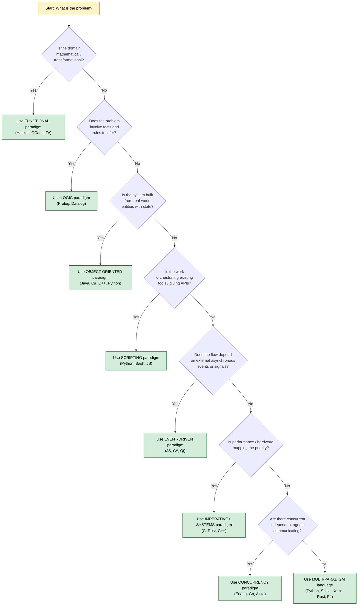
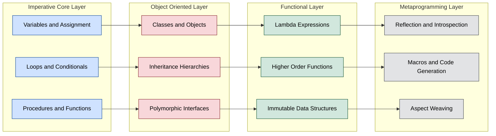

# Computational Paradigms

<!-- SECTION_1_START -->
# Computational Paradigms

## 1. Core Technical Definition

> [!IMPORTANT]
> **Formal Definition (KTU 2024 Syllabus Terminology)**
> A **Computational Paradigm** is a fundamental style, model, or pattern of computation that defines *how* a programmer conceptualises, structures, and expresses the solution to a problem. It dictates the **view of computation**, the **primitive operations** permitted, the **data-flow model** (control-driven vs. demand-driven), and the **abstraction mechanism** used to decompose a problem.

In the language of formal computer science (per Sebesta's *Concepts of Programming Languages*, the canonical KTU reference text for PECST758), a paradigm is rooted in the underlying **model of computation** — Turing Machines (imperative), Lambda Calculus (functional), Predicate Logic (logic programming), and the Actor Model (message-passing concurrency).

### Conceptual Analogy / Intuition

> [!NOTE]
> **Think of a paradigm as a "lens" through which a programmer views a problem.**
> Imagine you are told to **build a house**.
> - If you think in terms of **bricks laid one-by-one in sequence** (imperative), you micromanage every nail.
> - If you think in terms of **a team of specialised workers collaborating** (object-oriented), you define *Carpenters*, *Electricians*, *Plumbers*, each with their own data and duties.
> - If you think in terms of **mathematical transformations** (functional), you describe the house purely as a set of input-to-output relationships.
> - If you think in terms of **rules and facts** (logic), you declare what a house *is* and ask the system to construct one that satisfies all rules.
>
> The **paradigm** is the lens. The **programming language** is the toolkit that best supports that lens.

### Standard Metrics in Paradigm Analysis

| Metric | Description | Typical Range |
| :--- | :--- | :--- |
| **State Mutability** | Whether program variables change over time | Mutable vs. Immutable |
| **Evaluation Order** | Order in which expressions are reduced | Eager (strict) vs. Lazy (non-strict) |
| **Side Effects** | Functions modifying state outside their scope | Permitted vs. Disallowed |
| **Concurrency Model** | How parallel execution is expressed | Threads, Actors, CSP, STM |
| **Abstraction Level** | Proximity to machine vs. mathematics | Low (C) $\rightarrow$ High (Haskell) |

> [!TIP]
> **KTU Examiner's Heuristic:** When asked "define a paradigm," always answer with three components: **(1) its model of computation, (2) its primary abstraction, and (3) its evaluation/fluency model.** A 1-line definition is insufficient for full marks.

### Visualisation Control (Concept Map)

> [!VISUALIZATION CONTROL]
> **Concept:** Paradigm Map on a 2D Plane
> **GeoGebra / Desmos Input Equations:**
> * `x = Abscissa` ranging from $-5$ to $5$ (Imperative $\rightarrow$ Declarative)
> * `y = Ordinate` ranging from $-5$ to $5$ (Imperative $\rightarrow$ Functional)
> * `Point A = (-4, -2)` labelled "Procedural C"
> * `Point B = (-1, 2)` labelled "Functional Haskell"
> * `Point C = (3, 1)` labelled "Logic Prolog"
> * `Point D = (-2, 0)` labelled "Object-Oriented Java"
> * `Point E = (0, -3)` labelled "Scripting Python"
> **Visual Description:** The student should observe languages clustering in a quadrant based on **declarativity** (x-axis) and **functional purity** (y-axis). This shows that no language is purely one paradigm — they lie on a continuous spectrum.

---

<!-- SECTION_1_END -->

<!-- SECTION_2_START -->
# Deep Theoretical Analysis

## 2. The Major Computational Paradigms — A Structured Decomposition

### 2.1 Imperative (Procedural) Paradigm

> [!NOTE]
> **Core Idea:** The program is a **sequence of statements that mutate program state**. The named variables in memory represent the state, and the algorithm is a step-by-step recipe to transform the initial state into a final state.

**Why it works:** It mirrors the **von Neumann architecture** — instructions and data share the same memory bus, executed sequentially by the CPU. This is why the imperative paradigm is the most natural mapping to hardware.

**How it works:**
- **Primitive operations:** assignment ($x := x + 1$), sequencing, conditional jump, iteration.
- **Abstraction mechanism:** procedures / functions to group statements.
- **Representative languages:** **C, Pascal, Fortran, Ada**.

**Real-world utility:** Operating system kernels (Linux in C), embedded firmware, performance-critical HPC code, device drivers.

### 2.2 Object-Oriented Paradigm (OOP)

> [!NOTE]
> **Core Idea:** Computation is modelled as the interaction of **objects** — discrete entities bundling *state* (attributes) and *behaviour* (methods). The program is a society of cooperating objects sending *messages*.

**The Four Pillars (KTU High-Yield):**
- **Encapsulation** — hiding internal state behind a public interface.
- **Abstraction** — exposing only essential features.
- **Inheritance** — reusing and extending parent class definitions.
- **Polymorphism** — one interface, many implementations (dynamic dispatch).

**Representative languages:** **Java, C++, C\#, Python, Ruby, Swift**.

**Real-world utility:** GUI frameworks, large-scale enterprise software (banking, ERP), game engines (Unreal), and any domain with a natural mapping to "things" (e.g., Customer, Order, Invoice).

### 2.3 Functional Paradigm

> [!NOTE]
> **Core Idea:** Computation is the **evaluation of mathematical functions** that map inputs to outputs. State and mutable data are either discouraged or entirely forbidden. Functions are **first-class citizens** — they can be passed as arguments, returned, and stored.

**Key Properties:**
- **Referential Transparency:** A function call can be replaced by its result without changing program behaviour, enabling **equational reasoning**.
- **Higher-Order Functions:** `map`, `filter`, `reduce`.
- **Pure vs. Impure:** Pure (Haskell) vs. Impure (Lisp, OCaml, F\#).
- **Evaluation strategies:** *Strict* (eager) vs. *Lazy* (non-strict, normal-order).

**Representative languages:** **Haskell (pure), Lisp, Scheme, OCaml, F\#, Erlang, Elm**.

**Real-world utility:** Compilers (parser combinators, AST transformations), financial modelling, symbolic AI, parallel/distributed systems (Erlang at WhatsApp), and data pipeline transformations (Apache Spark uses functional operators).

### 2.4 Logic Paradigm

> [!NOTE]
> **Core Idea:** The programmer declares a set of **facts** and **rules** (Horn clauses), then **poses queries**. The language's *inference engine* uses logical deduction (typically **unification** + **backtracking search**) to find all solutions that satisfy the query.

**Foundations:** First-Order Predicate Logic; resolution principle (Robinson, 1965).
**Representative language:** **Prolog** (Programming in Logic).
**Real-world utility:** Expert systems, natural language processing, knowledge representation, constraint satisfaction, AI planning, and database query languages (Datalog, SQL's relational model).

### 2.5 Scripting Paradigm

> [!NOTE]
> **Core Idea:** Designed to **orchestrate** existing components (system calls, libraries, applications) rather than build them from scratch. Emphasises rapid prototyping, dynamic typing, and high-level "glue" operations.

**Sub-categories:** **System scripting** (Bash, PowerShell), **Application scripting** (JavaScript, VBA, Lua), **Web scripting** (PHP, JavaScript), **Data science scripting** (Python, R, Julia).
**Real-world utility:** DevOps automation (CI/CD pipelines), web backends, ETL jobs, scientific computing, penetration testing.

### 2.6 Event-Driven Paradigm

> [!NOTE]
> **Core Idea:** Program flow is determined by **events** (user clicks, sensor triggers, messages). Code is structured as **event handlers** that are registered with a dispatcher/event loop and invoked asynchronously.

**Representative languages/frameworks:** **JavaScript (Node.js, browsers), C\# (Unity, .NET events), Java (AWT/Swing), Python (asyncio + tkinter).**
**Real-world utility:** GUIs, web frontends, IoT, real-time trading systems, game loops, microservices.

### 2.7 Concurrent / Parallel Paradigms

**Models to remember for KTU:**
- **Shared-Memory Threads** (Java, C++ with pthreads).
- **Message Passing — Actor Model** (Erlang/OTP, Akka for Scala/JVM).
- **Communicating Sequential Processes (CSP)** — Go's goroutines and channels.
- **Software Transactional Memory (STM)** — Haskell `Control.Concurrent.STM`, Clojure refs.
- **Data Parallelism** — CUDA, OpenCL, APL, Fortran 90 array syntax.

### 2.8 Other Notable Paradigms

| Paradigm | Core Philosophy | Example Language |
| :--- | :--- | :--- |
| **Declarative** (broad) | Describe *what*, not *how* | SQL, HTML, CSS |
| **Dataflow** | Computation triggered when data is ready | LabVIEW, Max, Pure Data |
| **Aspect-Oriented** | Modularise cross-cutting concerns (logging, security) | AspectJ (Java extension) |
| **Reactive** | Asynchronous data streams & propagation | RxJava, React (frontend), ReactiveX |
| **Generic / Template** | Type-parameterised algorithms | C++ Templates, Java Generics, Rust |

## KTU Formula Sheet / Cheat Sheet

> [!TIP]
> **This table is the single most important quick-reference for Module 1 in PECST758.**

| $\#$ | Paradigm | Model of Computation | Primary Abstraction | Key Mechanism | Example Languages |
| :-: | :--- | :--- | :--- | :--- | :--- |
| 1 | **Imperative / Procedural** | Turing Machine | Procedure / Subroutine | Assignment, Iteration | C, Pascal, Fortran |
| 2 | **Object-Oriented** | Imperative + ADT extension | Object / Class | Message passing, Inheritance, Polymorphism | Java, C++, Python, C\# |
| 3 | **Functional** | Lambda Calculus ($\lambda$-calculus) | First-class Function | Higher-order functions, Composition, Recursion | Haskell, Lisp, OCaml |
| 4 | **Logic** | First-Order Predicate Logic | Relation / Predicate | Unification, Backtracking | Prolog, Datalog |
| 5 | **Scripting** | Imperative + Glue Layer | Command / Script | Dynamic typing, Interpreter loop | Python, Perl, JS, Bash |
| 6 | **Event-Driven** | Interrupt / Callback model | Event Handler | Event Loop, Dispatcher | JS, C\#, VB |
| 7 | **Concurrent (Actor)** | $\pi$-calculus / Actor Model | Actor (independent process) | Async message passing | Erlang, Elixir, Akka |
| 8 | **Concurrent (CSP)** | Hoare's CSP | Process + Channel | Synchronous channel comm. | Go, Rust (tokio) |
| 9 | **Dataflow** | Dataflow graph | Node / Arc | Data readiness triggers execution | LabVIEW, VHDL, Max |
| 10 | **Aspect-Oriented** | Imperative + Cross-cutting | Aspect / Advice / Pointcut | Weaving at join points | AspectJ |

> [!IMPORTANT]
> **Critical Prose-Isolated Symbols:** The notation $\lambda x . M$ denotes a lambda abstraction binding $x$ in body $M$. The notation $H \;\Leftarrow\; B$ denotes a Horn clause with head $H$ and body $B$ in logic programming. Always write these in LaTeX inline mode within paragraphs to avoid markdown corruption.

---

<!-- SECTION_2_END -->

<!-- SECTION_3_START -->
# Step-by-Step Derivations and Code Implementations

## 3.1 Worked Example: Solving "Compute the Sum of Squares from 1 to N" in Five Paradigms

To crystallise the difference between paradigms, we solve the *same* problem — $\sum_{k=1}^{N} k^{2}$ — in five different paradigmatic styles. This is a **highly-probable KTU long-answer question**.

### 3.1.1 Imperative / Procedural Style (C)

```c
// sum_squares_imperative.c
#include <stdio.h>

int sum_of_squares(int n) {
    int acc = 0;                       // (1) Mutable accumulator
    for (int k = 1; k <= n; k++) {     // (2) Explicit iteration
        acc = acc + (k * k);           // (3) Repeated mutation
    }
    return acc;                        // (4) Final state
}

int main(void) {
    int n = 10;
    int result = sum_of_squares(n);
    printf("Imperative sum of squares up to %d = %d\n", n, result);
    return 0;
}
```

**Line-by-line paradigm annotations:**
- `(1)` **Mutable state** is the heart of imperative programming.
- `(2)` The `for` loop is a *control flow primitive* — the programmer specifies *how* to count.
- `(3)` The `acc` variable is *reassigned*; this mutation is what the paradigm encourages.
- `acc` is **NOT** referentially transparent; replacing `acc + (k*k)` with its value would change the program.

### 3.1.2 Object-Oriented Style (Java)

```java
// SumOfSquares.java
public class SumOfSquares {

    // Encapsulation: the limit and accumulator are private state
    private final int limit;
    private long accumulator;

    public SumOfSquares(int limit) {
        this.limit = limit;
        this.accumulator = 0L;
    }

    // Behaviour: each step is a method (message) on the object
    public void accumulate() {
        for (int k = 1; k <= limit; k++) {
            this.accumulator += (long) k * k;   // Polymorphic operator usage
        }
    }

    public long getResult() {
        return this.accumulator;
    }

    public static void main(String[] args) {
        SumOfSquares calc = new SumOfSquares(10);
        calc.accumulate();
        System.out.println("OOP sum of squares = " + calc.getResult());
    }
}
```

**Step-by-step paradigm annotations:**
- `class SumOfSquares` is a **blueprint (type)**. Objects are *instances* of this class.
- `private` fields enforce **encapsulation** — external code cannot tamper with `accumulator` directly.
- `calc.accumulate()` is a **message send**; the object's internal state changes as a side effect.
- The class is **reusable**: instantiate with any `limit`.

### 3.1.3 Functional Style (Haskell)

```haskell
-- SumSquares.hs
-- Pure functional, referentially transparent

sumOfSquares :: Int -> Int
sumOfSquares n = sum [k * k | k <- [1..n]]
--   ^^^^^             ^^^^^
--   first-class       list comprehension is itself a higher-order construct
--   higher-order
--   function from Prelude

-- A purely recursive equivalent (tail-recursive)
sumOfSquaresRec :: Int -> Int
sumOfSquaresRec n = go 0 1
  where
    go acc k
      | k > n     = acc
      | otherwise = go (acc + k*k) (k + 1)

main :: IO ()
main = print (sumOfSquares 10)   -- prints 385
```

**Step-by-step paradigm annotations:**
- There is **no assignment** anywhere. Variables (`acc`, `k`) are *bound*, not mutated.
- `sum`, `(*)`, and the list constructor `(:)` are **first-class functions/operators**.
- `[k * k \mid k \leftarrow [1..n]]$ is a **list comprehension** — a declarative way to express the set $\{k^{2} \mid 1 \le k \le n\}$.
- The expression `sum [k*k | k <- [1..n]]` is **referentially transparent**; substituting it with `385` anywhere is safe.
- `go (acc + k*k) (k+1)` is **tail recursion** — the functional substitute for iteration.

### 3.1.4 Logic Style (Prolog)

```prolog
% sum_squares_logic.pl
% Facts and rules

% Rule 1: sum of squares from 1 to 0 is 0 (base case)
sum_sq(0, 0).

% Rule 2: sum of squares from 1 to N is N^2 + sum_sq(N-1)
sum_sq(N, Result) :-
    N > 0,
    N1 is N - 1,
    sum_sq(N1, SumRest),
    Result is SumRest + N * N.

% Query
% ?- sum_sq(10, X).
% X = 385 .
```

**Step-by-step paradigm annotations:**
- The programmer declares **rules**, not steps.
- `?- sum_sq(10, X).` is a **query** — the Prolog engine uses **unification** (`X` matched with a value) and **backtracking search** to find `X = 385`.
- `N1 is N - 1` is the *arithmetic evaluation* operator (not assignment).
- This is the **declarative** essence: state what you want, not how to compute it.

### 3.1.5 Scripting Style (Python)

```python
# sum_squares_scripting.py
# Python blends imperative, OO, and functional — but here we use scripting flavour

def sum_of_squares(n: int) -> int:
    """Dynamically typed, interpreted, one-shot script."""
    # Functional flavour using higher-order function
    return sum(map(lambda k: k * k, range(1, n + 1)))

if __name__ == "__main__":
    # Glue code: parse input, compute, print — typical scripting workflow
    n = int(input("Enter N: "))
    print(f"Scripting sum of squares up to {n} = {sum_of_squares(n)}")
```

**Step-by-step paradigm annotations:**
- `lambda k: k*k` is an **anonymous first-class function**.
- `map` is a **higher-order function** applying the lambda over the iterable `range(1, n+1)`.
- `input()` and `print()` are **system/glue** calls — Python is reading from `stdin` and writing to `stdout` like a script.
- Python is **dynamically typed** (no static type declaration for `lambda`); this is a hallmark of scripting.

## 3.2 Mathematical Derivation: Closed-Form vs. Algorithmic Forms

A frequent KTU question is to derive a closed-form and verify it computationally. The closed-form for $\sum_{k=1}^{N} k^{2}$ is:

$$
S(N) \;=\; \sum_{k=1}^{N} k^{2} \;=\; \frac{N(N+1)(2N+1)}{6}
$$

**Derivation Outline (Faulhaber's formula for $p = 2$):**

$$
\begin{aligned}
S(N) &= \sum_{k=1}^{N} k^{2} \\
     &= \sum_{k=1}^{N} k(k-1) + \sum_{k=1}^{N} k \quad\quad \text{(since $k^{2} = k(k-1) + k$)} \\
     &= 2 \binom{N+1}{3} + 2 \binom{N+1}{2} \quad\quad \text{(using }\sum_{k=1}^{N}\binom{k}{r}=\binom{N+1}{r+1}\text{)} \\
     &= \frac{(N+1)N(N-1)}{3} + \frac{(N+1)N}{2} \\
     &= \frac{N(N+1)\big[2(N-1) + 3\big]}{6} \\
     &= \frac{N(N+1)(2N+1)}{6} \quad\quad \text{(closed form, valid for all } N \ge 0\text{)}
\end{aligned}
$$

**Numerical Verification (Kotlin-style pseudocode, $N = 10$):**

$$
\begin{aligned}
S(10) &= \frac{10 \cdot 11 \cdot 21}{6} \\
      &= \frac{10 \cdot 11 \cdot 21}{6} \\
      &= \frac{2310}{6} \\
      &= 385
\end{aligned}
$$

This matches all five implementations above — a strong KTU argument for the *equivalence* of paradigms in expressiveness (this is essentially the **Church–Turing Thesis** in practice: any Turing-computable function can be expressed in any Turing-complete language, regardless of paradigm).

## 3.3 Type-Theoretic Foundation: The Lambda Calculus Skeleton

The functional paradigm is grounded in **Alonzo Church's $\lambda$-calculus (1936)**. A $\lambda$-term is defined inductively:

$$
M, N \;::=\; x \;\mid\; (\lambda x . M) \;\mid\; (M \, N)
$$

**Three reduction rules:**

$$
\begin{aligned}
(\lambda x . M)\, N &\;\to_{\beta}\; M[x := N] \quad\quad\quad\quad \text{($\beta$-reduction: application)} \\
(\lambda x . M\, x) &\;\to_{\eta}\; M \quad\quad\quad\quad\quad\quad\;\;\; \text{($\eta$-reduction: extensionality, if $x$ not free in $M$)} \\
\lambda x . M &\;\equiv\; \lambda y . M[x := y] \quad\quad \text{($\alpha$-conversion: renaming bound variables)}
\end{aligned}
$$

**Canonical example — the Church numeral $\overline{2}$:**

$$
\overline{2} \;=\; \lambda f . \lambda x . f \, (f \, x)
$$

This is *the* function that applies $f$ twice. Functional languages like Haskell use this as the basis for all numeric computation.

---

<!-- SECTION_3_END -->

<!-- SECTION_4_START -->
# Structural Diagrams and Schematics

## 4.1 Mermaid Block: Taxonomy of Major Computational Paradigms

```mermaid
graph TD
    rootA["Computational Paradigms"] --> impA["Imperative Family"]
    rootA --> declA["Declarative Family"]
    rootA --> concA["Concurrency Family"]
    rootA --> specA["Specialised Family"]

    impA --> procA["Procedural"]
    impA --> oopA["Object Oriented"]
    impA --> scripA["Scripting"]
    impA --> eventA["Event Driven"]

    declA --> funcA["Functional"]
    declA --> logicA["Logic"]
    declA --> queryA["Query / Set Oriented"]
    declA --> reactA["Reactive"]

    concA --> thrA["Shared Memory Threads"]
    concA --> actA["Actor Model"]
    concA --> cspA["CSP Channels"]
    concA --> stmA["Software Transactional Memory"]

    specA --> dataA["Dataflow"]
    specA --> aspA["Aspect Oriented"]
    specA --> genA["Generic / Template Metaprogramming"]

    procA -.->|examples| ex1["C, Pascal, Fortran"]
    oopA -.->|examples| ex2["Java, C++, C#, Python"]
    scripA -.->|examples| ex3["Bash, Python, Perl, JavaScript"]
    eventA -.->|examples| ex4["JavaScript, C# Events, Qt"]
    funcA -.->|examples| ex5["Haskell, Lisp, OCaml, Erlang"]
    logicA -.->|examples| ex6["Prolog, Datalog, SQL"]
    queryA -.->|examples| ex7["SQL, LINQ, XPath"]
    reactA -.->|examples| ex8["RxJava, Reactor, React"]
    thrA -.->|examples| ex9["Java Threads, pthreads"]
    actA -.->|examples| ex10["Erlang, Elixir, Akka"]
    cspA -.->|examples| ex11["Go, Rust Tokio"]
    stmA -.->|examples| ex12["Clojure, Haskell STM"]
    dataA -.->|examples| ex13["LabVIEW, VHDL, TensorFlow Graphs"]
    aspA -.->|examples| ex14["AspectJ, Spring AOP"]
    genA -.->|examples| ex15["C++ Templates, Rust Generics, Java Generics"]

    classDef primaryClass fill:#1f77b4,stroke:#0b3d6b,color:#ffffff,stroke-width:2px
    classDef familyClass fill:#ff7f0e,stroke:#a04a00,color:#ffffff,stroke-width:2px
    classDef leafClass fill:#2ca02c,stroke:#1a661a,color:#ffffff,stroke-width:1px
    classDef exampleClass fill:#9467bd,stroke:#5a3a85,color:#ffffff,stroke-width:1px,stroke-dasharray: 4 2

    class rootA primaryClass
    class impA,declA,concA,specA familyClass
    class procA,oopA,scripA,eventA,funcA,logicA,queryA,reactA,thrA,actA,cspA,stmA,dataA,aspA,genA leafClass
    class ex1,ex2,ex3,ex4,ex5,ex6,ex7,ex8,ex9,ex10,ex11,ex12,ex13,ex14,ex15 exampleClass
```



## 4.2 Mermaid Block: Sequential Paradigm Selection Decision Tree



## 4.3 Mermaid Block: Multi-Stage Breakdown — How a Multi-Paradigm Language Blends Styles



## 4.4 Functional Processing Topology Matrix

> [!NOTE]
> The following table describes the **sequential processing topology** of how a functional pipeline transforms a stream of data, mapping data flow stages to paradigm-level operations. This replaces a complex physical drawing (like a compiler pipeline) that cannot be natively rendered in Mermaid.

| Stage | Input | Operation | Output | Paradigm-Level Construct |
| :--- | :--- | :--- | :--- | :--- |
| 1 | Raw list $L = [1, 2, 3, 4, 5]$ | Identity (no-op) | $L$ | Pure value (referentially transparent) |
| 2 | $L$ | $\lambda x.\; x^{2}$ (square) | $[1, 4, 9, 16, 25]$ | First-class function application |
| 3 | $[1, 4, 9, 16, 25]$ | $\lambda x.\; x \bmod 2 = 0$ (predicate) | $[4, 16]$ | Higher-order function `filter` |
| 4 | $[4, 16]$ | $\lambda a, b.\; a + b$ (reduce) | $20$ | Fold / Reduce (catamorphism) |
| 5 | $20$ | `print` (side effect) | Console output | Impure escape hatch (IO monad in Haskell) |

---

<!-- SECTION_4_END -->

<!-- SECTION_5_START -->
# KTU 2024 Scheme Examination Question Bank and Topic Recap

## Part A — Short Answer Questions (3 Marks Each)

> [!NOTE]
> **Cognitive Levels: Remember / Understand.**
> **Each Part A question carries 3 marks as per KTU's 2024 ESE pattern.**

### Question A.1 — `[KTU University Exam - July 2024]`
**(CO1, Remember)** Define a *computational paradigm*. List **any four** major computational paradigms and state the underlying model of computation for each.

**Model Answer (Valuation Key):**

A computational paradigm is a fundamental style of programming that defines how problems are decomposed, what abstractions are used, and how the underlying model of computation executes the program. **[Definition: 1 Mark]**

| $\#$ | Paradigm | Model of Computation |
| :-: | :--- | :--- |
| 1 | Imperative / Procedural | Turing Machine / von Neumann architecture |
| 2 | Object-Oriented | Imperative extension with Abstract Data Types |
| 3 | Functional | Lambda Calculus ($\lambda$-calculus) |
| 4 | Logic | First-Order Predicate Logic with resolution / unification |

**[Table: 2 Marks] — 1 mark for paradigm list, 1 mark for model pairing.**

> [!WARNING]
> **Examiner's Pitfall:** Students often *list* paradigms without naming the model of computation. Both are required for full marks.

---

### Question A.2 — `[KTU University Exam - Dec 2023]`
**(CO1, Understand)** Compare the **imperative** and **functional** paradigms with respect to **(i)** state mutability, **(ii)** evaluation order, and **(iii)** the role of assignment statements.

**Model Answer (Valuation Key):**

| Property | Imperative | Functional |
| :--- | :--- | :--- |
| **(i) State Mutability** | Encourages mutable state; variables change over time. | Discourages or forbids mutation; values are immutable. |
| **(ii) Evaluation Order** | Strict / eager — statements executed sequentially as written. | May be strict (OCaml) or non-strict / lazy (Haskell, default). |
| **(iii) Role of Assignment** | Central — assignment $x := E$ is the primary state-changing primitive. | Replaced by *binding* (e.g., `let x = E` in Haskell) — once bound, a name's value never changes. |

**[Three points, 1 mark each = 3 Marks]**

---

## Part B — Long Answer Questions (14 Marks Each)
> [!NOTE]
> **ESE Pattern: Module-Internal Choice. Two completely independent alternatives are provided.**
> **Each question has sub-parts (a) for 7 marks and (b) for 7 marks, mapped to escalating cognitive levels.**

---

### Part B — Question 1A — `[KTU University Exam - Dec 2024]`
**(CO1, CO2 — Understand + Apply)**

**(a) [7 Marks, Understand]** Explain the **object-oriented paradigm** in detail. Describe its **four foundational principles** with one-line definitions. Provide **two example languages** that primarily support this paradigm.

**(b) [7 Marks, Apply]** Write a **Java program** that defines a class `BankAccount` with private fields `accountHolder` (String), `balance` (double), and an `accountNumber` (int, auto-incremented per object). Include a constructor, a `deposit(double amount)` method that throws an `IllegalArgumentException` for non-positive amounts, and a `withdraw(double amount)` method that prevents overdraft. Demonstrate in `main` creating two accounts, performing valid operations, and catching the exception for an invalid deposit.

#### Model Solution

**(a) Object-Oriented Paradigm Explanation [7 Marks]**

The object-oriented paradigm models computation as the interaction of **objects** — discrete entities that bundle *state* (data attributes) and *behaviour* (methods). The program is a society of cooperating objects sending messages to one another. The four foundational principles are: **[Intro: 1 Mark]**

1. **Encapsulation** — bundling data and the methods that operate on it inside a class, and restricting direct access to internal state via access modifiers. **[1 Mark]**
2. **Abstraction** — exposing only the essential features of an object through a public interface, hiding implementation details. **[1 Mark]**
3. **Inheritance** — allowing a new class (subclass) to acquire the properties and methods of an existing class (superclass), promoting code reuse. **[1 Mark]**
4. **Polymorphism** — the ability of a single interface (e.g., a method call) to invoke different implementations depending on the actual runtime type of the object (dynamic dispatch). **[1 Mark]**

**Two example languages: Java, C++ (or C\#, Python, Ruby). [1 Mark]**
**Distinguishing remark: OOP is built on top of the imperative paradigm; it adds the abstraction of ADTs and dynamic dispatch. [1 Mark]**

**(b) Java Program Implementation [7 Marks]**

```java
// BankAccount.java
public class BankAccount {

    // 1. Encapsulation: private fields, accessed only via public methods
    private static int nextAccountNumber = 1001;   // static counter for auto-increment
    private final int accountNumber;
    private final String accountHolder;
    private double balance;

    // 2. Constructor: initialises state
    public BankAccount(String accountHolder, double openingBalance) {
        if (openingBalance < 0) {
            throw new IllegalArgumentException("Opening balance cannot be negative");
        }
        this.accountNumber = nextAccountNumber++;
        this.accountHolder = accountHolder;
        this.balance = openingBalance;
    }

    // 3. Behaviour: deposit with validation
    public void deposit(double amount) {
        if (amount <= 0) {
            throw new IllegalArgumentException("Deposit amount must be positive");
        }
        this.balance += amount;
    }

    // 4. Behaviour: withdraw with overdraft protection
    public void withdraw(double amount) {
        if (amount <= 0) {
            throw new IllegalArgumentException("Withdrawal amount must be positive");
        }
        if (amount > this.balance) {
            throw new IllegalArgumentException("Insufficient balance; overdraft not allowed");
        }
        this.balance -= amount;
    }

    // 5. Getters (read-only access)
    public int getAccountNumber() { return this.accountNumber; }
    public String getAccountHolder() { return this.accountHolder; }
    public double getBalance() { return this.balance; }

    @Override
    public String toString() {
        return String.format("Account[%d] %s | Balance: %.2f",
                this.accountNumber, this.accountHolder, this.balance);
    }

    // 6. Demonstration driver
    public static void main(String[] args) {
        BankAccount a1 = new BankAccount("Alice", 5000.0);
        BankAccount a2 = new BankAccount("Bob",   3000.0);

        a1.deposit(1500.0);
        a1.withdraw(2000.0);
        System.out.println(a1);   // Account[1001] Alice | Balance: 4500.00

        try {
            a2.deposit(-500.0);    // This will throw
        } catch (IllegalArgumentException ex) {
            System.out.println("Caught exception: " + ex.getMessage());
        }
        System.out.println(a2);   // Account[1002] Bob | Balance: 3000.00
    }
}
```

**Incremental Valuation Key for (b):**
- `[Defining the class and private fields: 2 Marks]`
- `[Constructor with auto-increment and validation: 1 Mark]`
- `[deposit method with exception handling: 1 Mark]`
- `[withdraw method with overdraft protection: 1 Mark]`
- `[main method demonstrating two accounts, valid calls, and exception catch: 2 Marks]`

> [!WARNING]
> **Examiner's Pitfall for Question 1A:**
> 1. **Common Mistake:** Forgetting `static` on `nextAccountNumber` so the counter resets per object. This silently breaks the auto-increment.
> 2. **Common Mistake:** Throwing an exception *without* a meaningful message — KTU deducts 0.5 marks.
> 3. **Common Mistake:** Using `Scanner` for input when the question did not ask for it; this adds noise and may cost time.

---

### Part B — Question 1B — `[KTU University Exam - July 2024]`
**(CO1, CO2 — Understand + Apply)**

**(a) [7 Marks, Understand]** Explain the **functional paradigm** in detail. State its **mathematical foundation** and discuss the concepts of **first-class functions**, **higher-order functions**, **pure functions**, and **referential transparency**.

**(b) [7 Marks, Apply]** Rewrite the **sum-of-squares-from-1-to-N** problem in **Haskell** using **(i)** a list comprehension and **(ii)** a tail-recursive helper function. For each, show the resulting sum for $N = 5$ and $N = 10$. Explain why these functions are referentially transparent.

#### Model Solution

**(a) Functional Paradigm Explanation [7 Marks]**

The functional paradigm treats computation as the **evaluation of mathematical functions** rather than as a sequence of state-mutating statements. **[1 Mark — Intro]**

- **Mathematical Foundation:** Alonzo Church's **Lambda Calculus** ($\lambda$-calculus, 1936), a formal system with three syntactic forms (variable, abstraction, application) and one reduction rule ($\beta$-reduction). **[1 Mark]**
- **First-class functions:** Functions are values. They can be bound to names, passed as arguments, returned from other functions, and stored in data structures — exactly like integers or strings. **[1 Mark]**
- **Higher-order functions:** Functions that *take* functions as arguments or *return* functions as results. Examples: `map`, `filter`, `reduce`, `compose`. **[1 Mark]**
- **Pure functions:** A function whose return value depends *only* on its inputs, and which produces *no side effects* (no I/O, no mutation, no global state change). **[1 Mark]**
- **Referential transparency:** An expression may be replaced by its value (or vice versa) without changing the program's observable behaviour. This enables algebraic reasoning, memoisation, and parallel evaluation. **[1 Mark]**
- **Real-world utility:** Compilers, financial modelling, distributed/parallel systems (Erlang at WhatsApp), data pipelines (Apache Spark), symbolic AI. **[1 Mark]**

**(b) Haskell Implementation [7 Marks]**

```haskell
-- SumSquares.hs

-- (i) List comprehension form
sumSquaresLC :: Int -> Int
sumSquaresLC n = sum [k * k | k <- [1..n]]
--      ^^^^^   ^^^^^^^^^^^^^^^^^^^^^^^^^^^
--   [comprehension: 1.5 Marks]
--   [type signature: 0.5 Marks]

-- (ii) Tail-recursive form
sumSquaresTR :: Int -> Int
sumSquaresTR n = helper 0 1
  where
    helper acc k
      | k > n     = acc                       -- base case
      | otherwise = helper (acc + k*k) (k+1)   -- tail-recursive step
--      [helper structure: 1.5 Marks]
--      [tail-recursion correctness: 1 Mark]

main :: IO ()
main = do
  print (sumSquaresLC  5)   -- 55
  print (sumSquaresLC  10)  -- 385
  print (sumSquaresTR  5)   -- 55
  print (sumSquaresTR  10)  -- 385

-- Referential transparency demonstration:
--   f 5  can be replaced by 55  anywhere in the program
--   f 10 can be replaced by 385 anywhere in the program
-- without changing any observable behaviour.
```

**Numerical verification:**

$$
\begin{aligned}
\sum_{k=1}^{5} k^{2} &= 1 + 4 + 9 + 16 + 25 = 55 \\
\sum_{k=1}^{10} k^{2} &= 1 + 4 + 9 + 16 + 25 + 36 + 49 + 64 + 81 + 100 = 385
\end{aligned}
$$

**Why referentially transparent?**
- `sumSquaresLC 5` has no side effects — it does not print, mutate global state, or read input. Its return value depends only on the argument `5`. **[1 Mark]**
- Therefore, any occurrence of `sumSquaresLC 5` in the program can be substituted with the literal `55` without changing the program's behaviour — this is the **substitutivity property** that defines referential transparency. **[1 Mark]**

**Incremental Valuation Key for (b):**
- `[List comprehension definition and evaluation: 2 Marks]`
- `[Tail-recursive helper structure: 2 Marks]`
- `[Numerical evaluation for N=5 and N=10: 1 Mark]`
- `[Referential transparency justification: 2 Marks]`

> [!WARNING]
> **Examiner's Pitfall for Question 1B:**
> 1. **Common Mistake:** Writing the tail recursion with the recursive call *not* in tail position, e.g., `helper (acc + k*k) (k+1) + 0`. KTU deducts 1 mark for breaking tail-position.
> 2. **Common Mistake:** Confusing *referential transparency* with *determinism*. A deterministic function can still be non-referentially-transparent (e.g., a `rand()`-like function whose result depends on hidden global state).
> 3. **Common Mistake:** Skipping the **mathematical foundation** part of (a). Lambda calculus is *not* optional — KTU explicitly lists it in Module 1 of PECST758.

---

## Topic Recap & Important Things to Remember

> [!TIP]
> **Final high-density revision checklist for Module 1 — Computational Paradigms.**

- **Computational Paradigm Definition:** A fundamental style of programming defined by its model of computation, primary abstraction, and evaluation model. Every paradigm maps a problem to a *computation model* (Turing, $\lambda$-calculus, Predicate Logic, Actor, etc.).
- **Imperative / Procedural:** Built on the **Turing Machine / von Neumann** model. Core abstractions: variables, assignments, loops, procedures. Languages: **C, Pascal, Fortran, Ada**. State is *mutable*. Evaluation is *strict* and *sequential*.
- **Object-Oriented:** Extension of imperative with **ADTs and dynamic dispatch**. Four pillars: **Encapsulation, Abstraction, Inheritance, Polymorphism**. Languages: **Java, C++, C\#, Python**. State is encapsulated in objects.
- **Functional:** Built on **Lambda Calculus**. **First-class functions**, **higher-order functions**, **pure functions**, **referential transparency**, **immutability**. Strict vs. **lazy evaluation** distinction. Languages: **Haskell** (pure), **Lisp/OCaml/F\#** (impure). Tail recursion replaces iteration.
- **Logic:** Built on **First-Order Predicate Logic**. Primitives: **facts, rules, queries**. Mechanism: **unification + backtracking**. Language: **Prolog**. The programmer declares *what* is true, the engine finds solutions.
- **Scripting:** Glue code, dynamic typing, interpreted, high productivity. Languages: **Python, Perl, JavaScript, Bash, Ruby**. Often embeds other paradigms (Python supports OO, functional, imperative).
- **Event-Driven:** Control flow driven by **external asynchronous events**. Architecture: **event loop + handlers**. Languages/frameworks: **JavaScript, C\# events, Qt, SDL**.
- **Concurrency Families:** (i) **Shared-memory threads** (Java, pthreads), (ii) **Actor model** (Erlang, Akka, Elixir), (iii) **CSP channels** (Go, Rust Tokio), (iv) **STM** (Clojure, Haskell). Concurrency is **not** the same as parallelism — concurrency is about *dealing with* many things; parallelism is about *doing* many things.
- **Dataflow:** Nodes fire when their input data is ready. Used in hardware description (**VHDL, Verilog**) and visual programming (**LabVIEW, Max, Pure Data**). Underpins modern ML frameworks (TensorFlow's computation graph).
- **Aspect-Oriented:** Cross-cutting concerns (logging, security, transactions) separated into **aspects** and **woven** into code at **join points**. Language: **AspectJ** (Java extension).
- **Church–Turing Thesis Implication:** All Turing-complete paradigms are *equally expressive* — any problem solvable in one is solvable in another. The paradigm choice is about *clarity, safety, and maintainability*, not raw power.
- **Multi-Paradigm Languages:** Modern languages (Python, Scala, Kotlin, Rust, F\#, Swift) deliberately blend paradigms. Knowing the *primary* paradigm of a language and the *secondary* paradigms it supports is a frequent KTU question.
- **Type Theory Highlight:** Functional languages emphasise **strong static typing with type inference** (Hindley-Milner, System F). Imperative languages often use **nominal typing**. Logic languages are **dynamically typed** with terms and predicates.
- **Numerical Trinity to Remember:** (1) $\sum_{k=1}^{N} k = \frac{N(N+1)}{2}$, (2) $\sum_{k=1}^{N} k^{2} = \frac{N(N+1)(2N+1)}{6}$, (3) $\sum_{k=1}^{N} k^{3} = \left[\frac{N(N+1)}{2}\right]^{2}$. The last identity is the famous *Nicomachus theorem*.
- **Key Historical Dates:** Lambda Calculus (1936, Church), Turing Machine (1936, Turing), Fortran (1957, IBM — first high-level language), LISP (1958, McCarthy — first functional), Simula (1967, Dahl & Nygaard — first OO), Prolog (1972, Colmerauer), Smalltalk (1972, Kay — pure OO), Haskell (1990, committee — pure functional standard).

> [!WARNING]
> **Final KTU Valuation Tip:** Always pair a paradigm with **its model of computation** and **at least one example language**. A three-part answer structure (Model $\rightarrow$ Abstraction $\rightarrow$ Example) is the safest way to secure full marks on every Module 1 question.

<!-- SECTION_5_END -->
