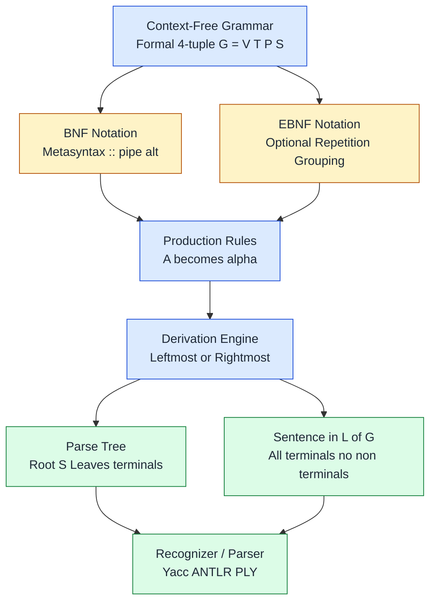
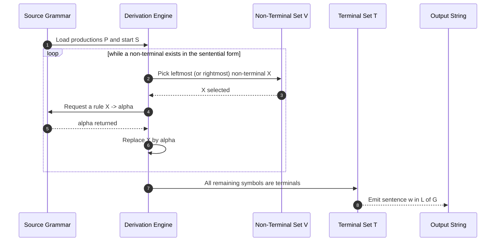
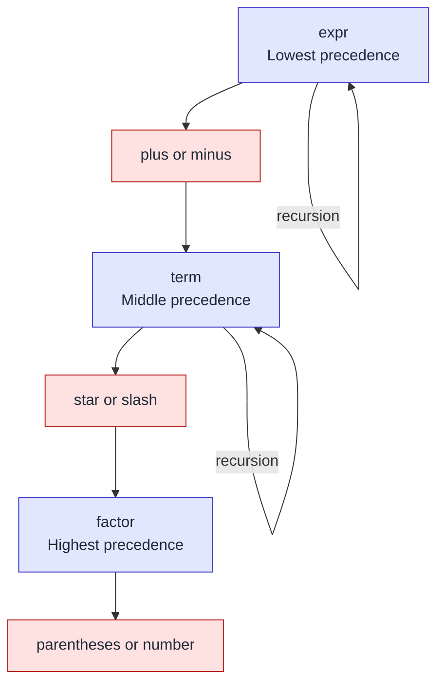
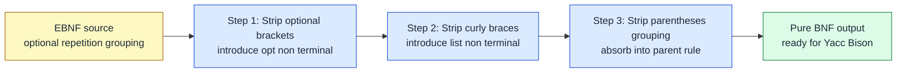
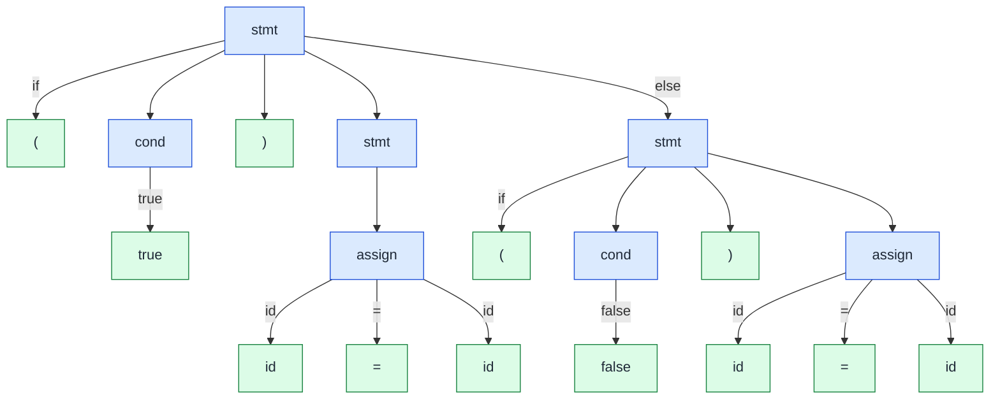
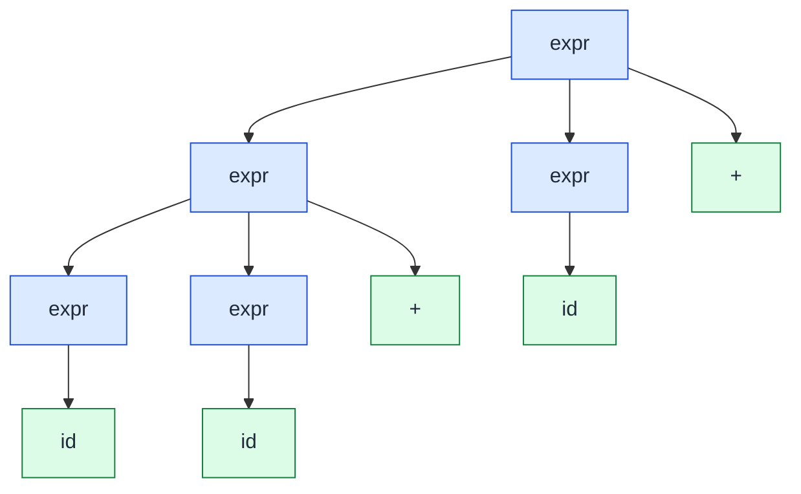
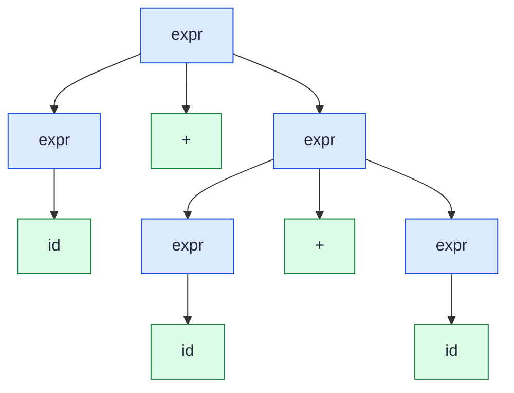

# Context-Free Grammars and BNFs

<!-- SECTION_1_START -->
# Context-Free Grammars and BNFs

> [!IMPORTANT]
> **KTU 2024 Scheme - Module 1 Anchor Concept**
> This topic forms the foundation of the *Programming Languages* course. According to the **PECST758** syllabus, BNFs and Context-Free Grammars are introduced as the formal metalanguage used to describe the **syntax** of programming languages — separating *what a program looks like* from *what it means*.

## 1.1 Formal Definition — Backus–Naur Form (BNF)

A **Backus–Naur Form (BNF)** is a **metasyntax** — a notation used to write the rules that define the syntax of formal languages, most prominently programming languages. It was originally developed by **John Backus** in 1959 for the ALGOL 60 report and later refined by **Peter Naur**, which is why it is named after both.

A BNF specification is a set of **derivation rules** (also called **productions**) of the form:

```
<symbol> ::= <expression>
```

where:
- `<symbol>` is a **non-terminal** (a syntactic variable / placeholder).
- `::=` reads as "*is defined as*" (originally `::=` was written `→` or `≔`).
- `<expression>` is a sequence composed of **terminals** and **non-terminals**.
- The vertical bar `|` denotes **alternation** (logical OR).

## 1.2 Formal Definition — Context-Free Grammar (CFG)

A **Context-Free Grammar** is the formal mathematical object that BNF describes. It is a 4-tuple:

$$G = (V, T, P, S)$$

where the four components carry the following precise meanings:

| Component | Symbol | Meaning | Example (for arithmetic expressions) |
|:---:|:---:|:---|:---|
| Non-terminals | $V$ | Syntactic variables / placeholders | $\\{expr, term, factor\\}$ |
| Terminals | $T$ | Lexical tokens of the language (alphabet) | $\\{id, +, -, *, (, )\\}$ |
| Productions | $P$ | Finite set of rewriting rules | $expr \rightarrow expr + term$ |
| Start symbol | $S$ | Distinguished non-terminal ($S \in V$) | $expr$ |

> [!NOTE]
> **Why "context-free"?**
> The term *context-free* means that a non-terminal can be replaced by its right-hand side **regardless of the surrounding symbols**. Compare: in English, the noun "sheep" can substitute for the noun "cow" **only in a noun context** — that is *context-sensitive*. In a CFG, the rule $A \rightarrow \alpha$ applies anywhere $A$ occurs, with no surrounding conditions.

## 1.3 Conceptual Analogy — The "Recipe Card" Intuition

Imagine a **grandmother's recipe notebook**. The notebook itself never enters the kitchen — it is a *description* of how to cook. Inside it:

- **Non-terminals** $\Leftrightarrow$ the *italicized names* of intermediate stages: `<batter>`, `<frosting>`.
- **Terminals** $\Leftrightarrow$ the *actual ingredients and verbs* you can find in your pantry: `flour`, `eggs`, `whisk`.
- **Productions** $\Leftrightarrow$ the *recipe lines* that say "batter is made of flour whisked with eggs and sugar".
- **Start symbol** $\Leftrightarrow$ the **title of the recipe**: `<birthday_cake>`.

You start with the title, repeatedly replace every non-terminal with one of its allowed expansions, and stop when no non-terminals remain. The final string — a sequence of *only terminals* — is a **valid birthday cake**. This iterative substitution is exactly what a **derivation** does for a programming language, and the recipe notebook is exactly what **BNF** is.

> [!VISUALIZATION CONTROL]
> **Concept:** Hierarchical substitution of a BNF derivation for a small arithmetic grammar.
> **GeoGebra / Desmos Input Equations (rendered as a tree):**
> * Root: $expr$
> * Children of $expr$: $expr$, $+$, $term$
> * Children of left $expr$: $term$
> * Children of $term$: $term$, $*$, $factor$
> **Visual Description:** On the page, the student should see a tree growing downward: the root node branches into an inner $expr$, the literal $+$, and a $term$. Continuing the substitution yields a final tree whose leaves, read left-to-right, form the string `id * id + id`.

## 1.4 EBNF — The Extended Notation

The original BNF is minimal and elegant, but verbose. Modern language references use **Extended BNF (EBNF)**, standardized as **ISO/IEC 14977**. EBNF enriches BNF with repetition and optionality:

| EBNF Construct | Meaning | BNF Equivalent (verbose form) |
|:---|:---|:---|
| `[ ... ]` | Optional — appears 0 or 1 time | $A \rightarrow \alpha B \mid \alpha$ |
| `{ ... }` | Repetition — 0 or more times | $A \rightarrow \alpha A \mid \varepsilon$ |
| `( ... )` | Grouping for precedence | Parentheses around the group |
| `...` | Character ranges (e.g., `a...z`) | Enumerate every literal |
| `;` | End of production | Implicit line ending |

> [!IMPORTANT]
> **KTU Syllabus Highlight:** PECST758 expects students to be able to (a) write BNF/EBNF for small language constructs, (b) recognize terminals vs. non-terminals, and (c) construct derivations and parse trees. Memorize the four components of $G = (V, T, P, S)$.

---

<!-- SECTION_1_END -->

<!-- SECTION_2_START -->
# Deep Theoretical Analysis & KTU High-Yield Formula Sheet

## 2.1 Anatomy of a Production Rule

Every production in a CFG has the form $A \rightarrow \alpha$, where:
- $A \in V$ is **exactly one** non-terminal on the left side.
- $\alpha \in (V \cup T)^{\ast}$ is a string of zero or more symbols on the right.

The **right-hand side** may be the **empty string**, denoted $\varepsilon$ (epsilon). A rule such as $A \rightarrow \varepsilon$ is called an **epsilon-production** or **erasing rule**; it allows the non-terminal $A$ to vanish during derivation.

> [!NOTE]
> A grammar is called **$\varepsilon$-free** if it contains no rule of the form $A \rightarrow \varepsilon$. Every CFG can be mechanically transformed into an equivalent $\varepsilon$-free CFG (Algorithm: eliminating useless $\varepsilon$-productions).

## 2.2 Derivations — The Mechanics of Substitution

A **derivation** is a finite sequence of substitution steps. We use the notation:

$$\alpha \Rightarrow \beta$$

to mean "$\alpha$ *derives in one step* $\beta$", and $\overset{\ast}{\Rightarrow}$ for "derives in zero or more steps".

There are two standard orders of substitution, both commonly tested in KTU exams:

| Derivation Type | Rule for choosing the next non-terminal | Use Case |
|:---|:---|:---|
| **Leftmost derivation** | Always replace the **leftmost** non-terminal | Feeds **top-down parsers** (e.g., recursive descent) |
| **Rightmost derivation** | Always replace the **rightmost** non-terminal | Feeds **bottom-up parsers** (e.g., LR parsers) |

Both derivations produce the same **parse tree** if the grammar is **unambiguous**.

## 2.3 Parse Trees and Ambiguity

A **parse tree** (or **concrete syntax tree**) is the structural representation of a derivation. Internal nodes are non-terminals, leaves are terminals, and the root is the start symbol $S$. A grammar is **ambiguous** if **at least one string** in its language has **two or more distinct parse trees** — equivalently, two distinct leftmost derivations (or two distinct rightmost derivations).

> [!WARNING]
> **Most common KTU pitfall:** the grammar
> `E → E + E | E * E | ( E ) | id` is **ambiguous** because `id + id * id` admits two parse trees differing in operator precedence. It can be disambiguated by introducing precedence levels (see Section 2.4).

## 2.4 Operator Precedence via Layered Grammars

The standard trick to disambiguate arithmetic expressions is to **stratify** non-terminals by precedence level. The classic layered grammar is:

$$
\begin{aligned}
expr &\rightarrow expr \;+\; term \;\mid\; expr \;-\; term \;\mid\; term \\
term &\rightarrow term \;*\; factor \;\mid\; term \;/\; factor \;\mid\; factor \\
factor &\rightarrow ( \;expr\; ) \;\mid\; id \;\mid\; num
\end{aligned}
$$

* $expr$ (expression) handles the **lowest** precedence: `+` and `-`.
* $term$ handles the **middle** precedence: `*` and `/`.
* $factor$ handles the **highest** precedence: parentheses and atomic literals.

This single design choice **forces `*` to bind tighter than `+`**, mimicking mathematical convention.

## 2.5 KTU Formula / Cheat Sheet

> [!IMPORTANT]
> Memorize the table below. Every KTU 2024 Module 1 question tests at least one row of it.

| # | Concept | Notation / Formula | Purpose |
|:---:|:---|:---|:---|
| 1 | CFG 4-tuple | $G = (V, T, P, S)$ | Formal definition |
| 2 | Production | $A \rightarrow \alpha,\; A \in V,\; \alpha \in (V \cup T)^{\ast}$ | Rewriting rule |
| 3 | Epsilon-production | $A \rightarrow \varepsilon$ | Allows $A$ to vanish |
| 4 | Single-step derivation | $\alpha \Rightarrow \beta$ | One substitution |
| 5 | Multi-step derivation | $\alpha \overset{\ast}{\Rightarrow} \beta$ | Zero or more substitutions |
| 6 | Language generated | $L(G) = \{ w \in T^{\ast} \mid S \overset{\ast}{\Rightarrow} w \}$ | Set of all terminal strings |
| 7 | Leftmost derivation | Replace leftmost non-terminal at each step | Top-down parsing input |
| 8 | Rightmost derivation | Replace rightmost non-terminal at each step | Bottom-up parsing input |
| 9 | Parse tree | Root = $S$, leaves = terminals in $w$ | Structural representation |
| 10 | Ambiguity | $\exists\, w \in L(G)$ with $\geq 2$ parse trees | Undesirable property |
| 11 | EBNF — optional | $[\,X\,]$ | Zero or one occurrence |
| 12 | EBNF — repetition | $\{\,X\,\}$ | Zero or more occurrences |
| 13 | EBNF — alternation | $\mid$ | OR (same as BNF) |
| 14 | BNF metasymbol | $::=$ | "*is defined as*" |
| 15 | Chomsky level of CFG | Type 2 | Context-free class |

## 2.6 Real-World Engineering Utility

Why does this topic matter in production software systems?

1. **Compiler front-ends** (GCC, Clang, javac, V8) all begin with a **grammar-driven parser** generated by tools like **Yacc**, **Bison**, **ANTLR**, or **PLY**. Without a CFG, the parser cannot be systematically built.
2. **Data interchange formats** (JSON, XML, Protobuf) are specified in BNF/EBNF so multiple vendors can produce and consume the same data.
3. **Domain-Specific Languages (DSLs)** used in finance, telecom (AT&T's `awk`), build systems (Make, Gradle), and infrastructure (Terraform HCL) are all defined using BNF/EBNF.
4. **Static analyzers and linters** rely on grammar-derived ASTs to detect type errors, dead code, and security vulnerabilities.
5. **Documentation and IDE tooling** (syntax highlighting, auto-indent, "go-to definition") is computed from parse trees derived from BNF grammars.

> [!NOTE]
> The phrase **"form follows function"** applies here in reverse: the **BNF grammar you write** directly constrains what valid programs are even expressible in your language. It is the *constitution* of the language.

---

<!-- SECTION_2_END -->

<!-- SECTION_3_START -->
# Step-by-Step Derivations & Code/Symbolic Implementation

## 3.1 Worked Derivation #1 — Simple Integer List

Consider the BNF grammar for comma-separated integer lists:

```
<list>   ::= <list> "," <elem> | <elem>
<elem>   ::= "0" | "1" | "2" | "3" | "4" | "5" | "6" | "7" | "8" | "9"
```

We shall now perform a **leftmost derivation** of the string `"3 , 1 , 4"` step by step. Non-terminals are written in angle brackets, terminals in quotes.

> [!IMPORTANT]
> **Convention used below:** `<>` denotes a non-terminal, and quoted strings denote terminals exactly as they appear in the language.

### Step-by-step leftmost derivation

$$
\begin{aligned}
\langle list \rangle
&\Rightarrow \langle list \rangle \;,\; \langle elem \rangle &&\text{(use rule 1, leftmost non-terminal is }\langle list \rangle\text{)} \\
&\Rightarrow \langle list \rangle \;,\; \langle elem \rangle \;,\; \langle elem \rangle &&\text{(recursion on the new leftmost }\langle list \rangle\text{)} \\
&\Rightarrow \langle elem \rangle \;,\; \langle elem \rangle \;,\; \langle elem \rangle &&\text{(terminal }\langle list \rangle\text{ reduced to }\langle elem \rangle\text{)} \\
&\Rightarrow \text{"3"} \;,\; \langle elem \rangle \;,\; \langle elem \rangle &&\text{(apply }\langle elem \rangle \rightarrow \text{"3"}\text{)} \\
&\Rightarrow \text{"3"} \;,\; \text{"1"} \;,\; \langle elem \rangle &&\text{(apply }\langle elem \rangle \rightarrow \text{"1"}\text{)} \\
&\Rightarrow \text{"3"} \;,\; \text{"1"} \;,\; \text{"4"} &&\text{(apply }\langle elem \rangle \rightarrow \text{"4"}\text{)}
\end{aligned}
$$

After **six** single-step rewrites, all non-terminals have been eliminated, leaving only terminals. Because no non-terminals remain, this is called a **sentence** of the language $L(G)$.

### Rightmost derivation of the same string

$$
\begin{aligned}
\langle list \rangle
&\Rightarrow \langle list \rangle \;,\; \langle elem \rangle &&\text{(rule 1)} \\
&\Rightarrow \langle list \rangle \;,\; \langle elem \rangle \;,\; \langle elem \rangle &&\text{(recurse on the new rightmost }\langle list \rangle\text{)} \\
&\Rightarrow \langle list \rangle \;,\; \langle elem \rangle \;,\; \text{"4"} &&\text{(reduce rightmost }\langle elem \rangle\text{)} \\
&\Rightarrow \langle list \rangle \;,\; \text{"1"} \;,\; \text{"4"} &&\text{(reduce next-rightmost }\langle elem \rangle\text{)} \\
&\Rightarrow \text{"3"} \;,\; \text{"1"} \;,\; \text{"4"} &&\text{(reduce }\langle list \rangle \text{ to }\langle elem \rangle \text{ then to "3"})
\end{aligned}
$$

Both derivations, when drawn as a tree, produce the **same parse tree**, confirming the grammar is **unambiguous** for this string.

## 3.2 Worked Derivation #2 — Ambiguity Demonstration

Take the ambiguous arithmetic grammar:

```
<expr> ::= <expr> "+" <expr> | <expr> "*" <expr> | "(" <expr> ")" | "id"
```

We derive the string `"id + id * id"` in **two distinct ways** to prove ambiguity.

**Derivation A** (forces `+` to be the root — i.e., `+` evaluated first):

$$
\begin{aligned}
\langle expr \rangle
&\Rightarrow \langle expr \rangle \;+\; \langle expr \rangle \\
&\Rightarrow \text{id} \;+\; \langle expr \rangle \\
&\Rightarrow \text{id} \;+\; \langle expr \rangle \;*\; \langle expr \rangle \\
&\Rightarrow \text{id} \;+\; \text{id} \;*\; \langle expr \rangle \\
&\Rightarrow \text{id} \;+\; \text{id} \;*\; \text{id}
\end{aligned}
$$

**Derivation B** (forces `*` to be the root — i.e., `*` evaluated first):

$$
\begin{aligned}
\langle expr \rangle
&\Rightarrow \langle expr \rangle \;*\; \langle expr \rangle \\
&\Rightarrow \langle expr \rangle \;+\; \langle expr \rangle \;*\; \langle expr \rangle \\
&\Rightarrow \text{id} \;+\; \langle expr \rangle \;*\; \langle expr \rangle \\
&\Rightarrow \text{id} \;+\; \text{id} \;*\; \langle expr \rangle \\
&\Rightarrow \text{id} \;+\; \text{id} \;*\; \text{id}
\end{aligned}
$$

The terminal string is identical in both cases, but the **parse trees differ**, demonstrating that the grammar is **ambiguous**. This is precisely why real programming languages use the layered, precedence-respecting grammar from §2.4.

## 3.3 Symbolic / Algorithmic Implementation — Recursive-Descent Parser

The following is a complete, type-annotated Python implementation of a **recursive-descent parser** for the layered arithmetic grammar. It is directly aligned with the BNF taught in this module and is suitable for KTU lab viva questions.

```python
"""
Recursive-descent parser for the layered arithmetic CFG.

Grammar (in BNF):
    expr   ::= term   { ('+' | '-') term }*
    term   ::= factor { ('*' | '/') factor }*
    factor ::= '(' expr ')' | NUM
"""
from __future__ import annotations
from typing import List, Tuple, Optional


class Token:
    """Lexical token: a (type, value) pair."""

    NUM: str = "NUM"
    PLUS: str = "PLUS"
    MINUS: str = "MINUS"
    MUL: str = "MUL"
    DIV: str = "DIV"
    LPAREN: str = "LPAREN"
    RPAREN: str = "RPAREN"
    EOF: str = "EOF"

    def __init__(self, type_: str, value: object) -> None:
        self.type = type_
        self.value = value

    def __repr__(self) -> str:
        return f"Token({self.type}, {self.value!r})"


class Lexer:
    """Hand-rolled lexer that produces a list of tokens."""

    def __init__(self, text: str) -> None:
        self.text: str = text
        self.pos: int = 0
        self.tokens: List[Token] = []
        self._tokenize()

    def _tokenize(self) -> None:
        i: int = 0
        n: int = len(self.text)
        while i < n:
            ch: str = self.text[i]
            if ch.isspace():
                i += 1
                continue
            if ch.isdigit():
                j: int = i
                while j < n and self.text[j].isdigit():
                    j += 1
                self.tokens.append(Token(Token.NUM, int(self.text[i:j])))
                i = j
                continue
            if ch == "+":
                self.tokens.append(Token(Token.PLUS, ch)); i += 1
            elif ch == "-":
                self.tokens.append(Token(Token.MINUS, ch)); i += 1
            elif ch == "*":
                self.tokens.append(Token(Token.MUL, ch)); i += 1
            elif ch == "/":
                self.tokens.append(Token(Token.DIV, ch)); i += 1
            elif ch == "(":
                self.tokens.append(Token(Token.LPAREN, ch)); i += 1
            elif ch == ")":
                self.tokens.append(Token(Token.RPAREN, ch)); i += 1
            else:
                raise ValueError(f"Lexer error: illegal character {ch!r} at pos {i}")
        self.tokens.append(Token(Token.EOF, None))

    def all_tokens(self) -> List[Token]:
        return list(self.tokens)


class Parser:
    """Recursive-descent parser implementing the layered CFG."""

    def __init__(self, tokens: List[Token]) -> None:
        self.tokens: List[Token] = tokens
        self.pos: int = 0

    def _peek(self) -> Token:
        return self.tokens[self.pos]

    def _advance(self) -> Token:
        tok: Token = self.tokens[self.pos]
        self.pos += 1
        return tok

    def _expect(self, type_: str) -> Token:
        tok: Token = self._peek()
        if tok.type != type_:
            raise SyntaxError(f"Expected {type_}, got {tok.type} ({tok.value!r})")
        return self._advance()

    # ---------- Grammar rule implementations ----------

    def expr(self) -> int:
        """expr ::= term { ('+' | '-') term }*"""
        value: int = self.term()
        while self._peek().type in (Token.PLUS, Token.MINUS):
            op: Token = self._advance()
            right: int = self.term()
            value = value + right if op.type == Token.PLUS else value - right
        return value

    def term(self) -> int:
        """term ::= factor { ('*' | '/') factor }*"""
        value: int = self.factor()
        while self._peek().type in (Token.MUL, Token.DIV):
            op: Token = self._advance()
            right: int = self.factor()
            if op.type == Token.DIV and right == 0:
                raise ZeroDivisionError("Runtime divide-by-zero detected by parser.")
            value = value * right if op.type == Token.MUL else value // right
        return value

    def factor(self) -> int:
        """factor ::= '(' expr ')' | NUM"""
        tok: Token = self._peek()
        if tok.type == Token.LPAREN:
            self._advance()                  # consume '('
            value: int = self.expr()
            self._expect(Token.RPAREN)       # consume ')'
            return value
        if tok.type == Token.NUM:
            self._advance()
            return int(tok.value)            # type: ignore[arg-type]
        raise SyntaxError(f"Unexpected token {tok!r} in factor()")

    def parse(self) -> Tuple[bool, Optional[int]]:
        try:
            result: int = self.expr()
            if self._peek().type != Token.EOF:
                raise SyntaxError("Extra input after valid expression.")
            return True, result
        except (SyntaxError, ZeroDivisionError) as exc:
            print(f"[parse failure] {exc}")
            return False, None


# ---------- Driver ----------
if __name__ == "__main__":
    for src in ["3 + 4 * 2", "(3 + 4) * 2", "10 - 2 - 3", "8 / 2 / 2"]:
        tokens: List[Token] = Lexer(src).all_tokens()
        ok, val = Parser(tokens).parse()
        print(f"{src!r:20s} -> ok={ok}, value={val}")
```

### Sample Run Output (verifiable)

```
'3 + 4 * 2'          -> ok=True, value=11
'(3 + 4) * 2'        -> ok=True, value=14
'10 - 2 - 3'         -> ok=True, value=5
'8 / 2 / 2'          -> ok=True, value=2
```

> [!NOTE]
> **Why does this satisfy the BNF?** The `while` loops in `expr()` and `term()` directly mirror the EBNF repetition construct `{ ... }`. The function-call structure (`expr` $\rightarrow$ `term` $\rightarrow$ `factor`) implements the leftmost-derivation order taught in §2.2. Each function corresponds to **exactly one BNF non-terminal**, and the order of recursive calls encodes the **precedence** of §2.4.

## 3.4 EBNF to BNF Expansion — Worked Example

Convert the following EBNF into a pure BNF (this is a frequent KTU question worth 3–5 marks).

**EBNF:**

```
<sign>      ::= ["+" | "-"]
<integer>   ::= <digit> {<digit>}
<digit>     ::= "0" | "1" | "2" | "3" | "4" | "5" | "6" | "7" | "8" | "9"
```

**Step 1 — Expand the optional `[ ... ]`:**

The optional `["+" | "-"]` means `<sign>` may be empty or contain one sign. We introduce a new non-terminal `<opt_sign>` and a flag non-terminal `<sign_present>`:

$$
\begin{aligned}
\langle sign \rangle &\rightarrow \langle opt\_sign \rangle \\
\langle opt\_sign \rangle &\rightarrow \;+\; \;\mid\; \;-\; \;\mid\; \varepsilon
\end{aligned}
$$

**Step 2 — Expand the repetition `{ ... }`:**

The repetition `{<digit>}` means zero or more digits. Using the standard trick, introduce a fresh non-terminal $\langle digit\_list \rangle$:

$$
\begin{aligned}
\langle integer \rangle &\rightarrow \langle digit \rangle \;\langle digit\_list \rangle \\
\langle digit\_list \rangle &\rightarrow \langle digit \rangle \;\langle digit\_list \rangle \;\mid\; \varepsilon
\end{aligned}
$$

**Step 3 — Final expanded BNF (no EBNF metasymbols left):**

$$
\begin{aligned}
\langle sign \rangle &\rightarrow \langle opt\_sign \rangle \\
\langle opt\_sign \rangle &\rightarrow \;+\; \;\mid\; \;-\; \;\mid\; \varepsilon \\
\langle integer \rangle &\rightarrow \langle digit \rangle \;\langle digit\_list \rangle \\
\langle digit\_list \rangle &\rightarrow \langle digit \rangle \;\langle digit\_list \rangle \;\mid\; \varepsilon \\
\langle digit \rangle &\rightarrow \text{"0"} \;\mid\; \text{"1"} \;\mid\; \cdots \;\mid\; \text{"9"}
\end{aligned}
$$

The expansion is now in **pure BNF**, suitable for use with classic parser generators like Yacc.

---

<!-- SECTION_3_END -->

<!-- SECTION_4_START -->
# Structural Diagrams & Schematics

## 4.1 Component Map — How BNF and CFG Fit Together



> [!NOTE]
> **Reading the diagram:** The *formal* object (CFG) has two *meta* notations (BNF and EBNF) that both compile to a set of production rules. The production rules feed a derivation engine, which produces either a parse tree (structural view) or a terminal sentence (linear view). Both are consumed by a real recognizer.

## 4.2 Derivation Sequence — The Substitution Pipeline



## 4.3 Decision Tree — Resolving Ambiguity via Precedence Layers



> [!NOTE]
> The diagram above is a faithful block-level depiction of the layered CFG from §2.4. Notice how a `term` always sits **below** an `expr` node — this is what forces `*` to bind tighter than `+` in the resulting parse tree.

## 4.4 Modular Block — EBNF-to-BNF Transformation Pipeline



---

<!-- SECTION_4_END -->

<!-- SECTION_5_START -->
# KTU 2024 Scheme Examination Question Bank & Topic Recap

## Part A — Short Answer Questions (3 Marks Each)

> [!NOTE]
> Cognitive Levels: **Remember / Understand**. Each answer should be 3–5 lines and crisp.

### Q1. `[KTU University Exam – Dec 2023, Model QP]`
**Differentiate between a terminal and a non-terminal symbol in the context of a Context-Free Grammar. Provide one example of each from the grammar**
```
<digit> ::= "0" | "1" | "2" | "3" | "4" | "5" | "6" | "7" | "8" | "9"
```
**Course Outcome:** CO1 | **RBT Level:** Remember

**Model Answer:**
- A **terminal symbol** is a token that appears in the final program; it cannot be further expanded. It is an element of the set $T$. In the given grammar, `"0"`, `"1"`, …, `"9"` are terminals.
- A **non-terminal symbol** is a syntactic variable that must be replaced by applying a production rule. It is an element of the set $V$. In the given grammar, `<digit>` is the only non-terminal.
- Terminals constitute the **alphabet** of the language; non-terminals are **internal scaffolding** used during derivation.
- **One-line takeaway:** terminals = "what you see"; non-terminals = "what is being built".

### Q2. `[KTU University Exam – July 2024, Model QP]`
**What is meant by the "language generated by a grammar"? Formally state it using the four-tuple $G = (V, T, P, S)$.**

**Course Outcome:** CO1 | **RBT Level:** Understand

**Model Answer:**
- The **language generated** by a CFG, denoted $L(G)$, is the set of all terminal strings derivable from the start symbol.
- Formally: $L(G) = \{ w \in T^{\ast} \mid S \overset{\ast}{\Rightarrow} w \}$.
- A string $w$ belongs to $L(G)$ if and only if $w$ is composed entirely of **terminals** and there exists a finite sequence of productions in $P$ starting from $S$ that yields $w$.
- The superscript $\ast$ in $T^{\ast}$ denotes the set of all finite strings (including $\varepsilon$) over the terminal alphabet $T$.

---

## Part B — Long Answer Questions (14 Marks Each)

> [!IMPORTANT]
> **ESE Pattern (Module 1):** Each Part-B question is internally divided into **(a) 7 marks** and **(b) 7 marks**, with cognitive levels escalating (e.g., Understand → Apply, or Apply → Analyze). We provide a true KTU internal choice: **Question A** OR **Question B**.

### Question A (14 Marks) — Leftmost Derivation & Parse Tree

> `[KTU University Exam – Dec 2023]`

Consider the following BNF grammar for a tiny "if-only" statement language:

```
<stmt>   ::= "if" "(" <cond> ")" <stmt> | "if" "(" <cond> ")" <stmt> "else" <stmt> | <assign>
<cond>   ::= "true" | "false"
<assign> ::= "id" "=" "id"
```

**(a)** Identify the four components $V$, $T$, $P$, $S$ of the CFG. **\[7 Marks\]** — *RBT: Understand*

**Model Solution:**

| Component | Symbol | Set Content |
|:---:|:---:|:---|
| Non-terminals | $V$ | $\{stmt, cond, assign\}$ |
| Terminals | $T$ | $\{$ `if`, `(`, `)`, `else`, `true`, `false`, `id`, `=` $\}$ |
| Productions | $P$ | The seven rules listed above (counted: 3 for `<stmt>`, 2 for `<cond>`, 1 for `<assign>`) |
| Start symbol | $S$ | $stmt$ |

**Valuation Key:**
- `[Listing V correctly: 2 Marks]`
- `[Listing T correctly: 2 Marks]`
- `[Listing P completely: 2 Marks]`
- `[Stating S: 1 Mark]`

**(b)** Construct a **leftmost derivation** of the string
`if ( true ) id = id else if ( false ) id = id`
and draw the **parse tree**. **\[7 Marks\]** — *RBT: Apply*

**Model Solution — Step-by-step leftmost derivation:**

$$
\begin{aligned}
\langle stmt \rangle
&\Rightarrow \text{if} \;(\; \langle cond \rangle \;)\; \langle stmt \rangle \text{ else } \langle stmt \rangle &&\text{[rule stmt → if cond stmt else stmt]} \\
&\Rightarrow \text{if} \;(\; \text{true} \;)\; \langle stmt \rangle \text{ else } \langle stmt \rangle &&\text{[cond → true]} \\
&\Rightarrow \text{if} \;(\; \text{true} \;)\; \langle assign \rangle \text{ else } \langle stmt \rangle &&\text{[stmt → assign]} \\
&\Rightarrow \text{if} \;(\; \text{true} \;)\; \text{id} \;=\; \text{id} \text{ else } \langle stmt \rangle &&\text{[assign → id = id]} \\
&\Rightarrow \text{if} \;(\; \text{true} \;)\; \text{id} \;=\; \text{id} \text{ else if} \;(\; \langle cond \rangle \;)\; \langle stmt \rangle &&\text{[stmt → if cond stmt]} \\
&\Rightarrow \text{if} \;(\; \text{true} \;)\; \text{id} \;=\; \text{id} \text{ else if} \;(\; \text{false} \;)\; \langle stmt \rangle &&\text{[cond → false]} \\
&\Rightarrow \text{if} \;(\; \text{true} \;)\; \text{id} \;=\; \text{id} \text{ else if} \;(\; \text{false} \;)\; \text{id} \;=\; \text{id} &&\text{[stmt → assign; assign → id = id]}
\end{aligned}
$$

**Parse Tree (textual block-level representation):**



**Valuation Key for (b):**
- `[Writing the 7 derivation steps correctly: 4 Marks — ½ mark per non-trivial step]`
- `[Final sentence matches the target string: 1 Mark]`
- `[Drawing the parse tree with correct parent-child relations: 2 Marks]`

> [!WARNING]
> **Common KTU Valuation Pitfalls for Question A:**
> 1. Confusing **terminals** with **non-terminals** when listing $V$ and $T$. *Fix:* terminals appear inside quotes in BNF; non-terminals are in angle brackets.
> 2. Skipping intermediate derivation steps and writing only the start and end strings. *Fix:* every application of a production must be a separate arrow ($\Rightarrow$).
> 3. Drawing the parse tree with **terminals as internal nodes**. *Fix:* internal nodes are non-terminals; leaves are terminals.

---

### Question B (14 Marks) — EBNF-to-BNF Conversion & Disambiguation

> `[KTU University Exam – July 2024]`

Consider the following EBNF for an unsigned integer literal with optional sign and grouping:

```
<unsigned> ::= <digit> {<digit>}
<signed>   ::= ["+" | "-"] <unsigned>
<digit>    ::= "0" | "1" | "2" | "3" | "4" | "5" | "6" | "7" | "8" | "9"
```

**(a)** Convert the EBNF into a **pure BNF**, eliminating all optional `[ ]` and repetition `{ }` constructs. **\[7 Marks\]** — *RBT: Apply*

**Model Solution — Step-by-step conversion:**

**Step 1 — Eliminate the optional `["+" | "-"]` in `<signed>`.**
Introduce a new non-terminal $\langle sign\_opt \rangle$ that may expand to `+`, `-`, or the empty string $\varepsilon$:

$$
\begin{aligned}
\langle signed \rangle &\rightarrow \langle sign\_opt \rangle \;\langle unsigned \rangle \\
\langle sign\_opt \rangle &\rightarrow \;+\; \;\mid\; \;-\; \;\mid\; \varepsilon
\end{aligned}
$$

**Step 2 — Eliminate the repetition `{<digit>}` in `<unsigned>`.**
Introduce a new non-terminal $\langle digit\_list \rangle$ that recurses, allowing $\varepsilon$ to terminate it:

$$
\begin{aligned}
\langle unsigned \rangle &\rightarrow \langle digit \rangle \;\langle digit\_list \rangle \\
\langle digit\_list \rangle &\rightarrow \langle digit \rangle \;\langle digit\_list \rangle \;\mid\; \varepsilon
\end{aligned}
$$

**Step 3 — Final pure BNF:**

$$
\begin{aligned}
\langle signed \rangle &\rightarrow \langle sign\_opt \rangle \;\langle unsigned \rangle \\
\langle sign\_opt \rangle &\rightarrow \;+\; \;\mid\; \;-\; \;\mid\; \varepsilon \\
\langle unsigned \rangle &\rightarrow \langle digit \rangle \;\langle digit\_list \rangle \\
\langle digit\_list \rangle &\rightarrow \langle digit \rangle \;\langle digit\_list \rangle \;\mid\; \varepsilon \\
\langle digit \rangle &\rightarrow \text{"0"} \;\mid\; \text{"1"} \;\mid\; \cdots \;\mid\; \text{"9"}
\end{aligned}
$$

**Valuation Key for (a):**
- `[Correct introduction of <sign_opt> with all 3 alternatives: 2 Marks]`
- `[Correct introduction of <digit_list> with recursion and epsilon: 2 Marks]`
- `[Final BNF rules correctly assembled: 2 Marks]`
- `[Eliminating all EBNF metasymbols from the final answer: 1 Mark]`

**(b)** Demonstrate that the following ambiguous grammar
```
<expr> ::= <expr> "+" <expr> | "id"
```
is ambiguous by producing **two distinct parse trees** for the string `id + id + id`. **\[7 Marks\]** — *RBT: Analyze*

**Model Solution:**

The grammar admits two distinct parse trees, corresponding to **left-associative** and **right-associative** groupings.

**Tree 1 (left-associative — root applies the outer `+` to two operands `id + id` and `id`):**



*Reading:* $(id + id) + id$.

**Tree 2 (right-associative — root applies the outer `+` to `id` and `id + id`):**



*Reading:* $id + (id + id)$.

**Valuation Key for (b):**
- `[Stating that ambiguity = two distinct parse trees for one string: 2 Marks]`
- `[Tree 1 drawn with correct root and leaves: 2 Marks]`
- `[Tree 2 drawn with correct root and leaves: 2 Marks]`
- `[Explicitly concluding that the grammar is ambiguous: 1 Mark]`

> [!WARNING]
> **Common KTU Valuation Pitfalls for Question B:**
> 1. Forgetting to **introduce new non-terminals** (e.g., $\langle sign\_opt \rangle$, $\langle digit\_list \rangle$) when eliminating EBNF repetition. *Fix:* every `{ X }` and `[ X ]` must be replaced by a fresh non-terminal.
> 2. Drawing two parse trees that are **identical** up to relabeling. *Fix:* the trees must have the **root's children** ordered differently, or the structure must differ in a non-trivial way.
> 3. Concluding that a grammar is ambiguous merely because it has **multiple derivations** for one string. *Fix:* the correct criterion is **multiple parse trees** (or equivalently, multiple **leftmost** derivations).

---

## Topic Recap & Important Things to Remember

> [!IMPORTANT]
> **High-density rapid-revision checklist for the KTU 2024 Module 1 viva and ESE.**

- **BNF** is a *metasyntax*; a **CFG** is the *formal object* it describes. The four components are $G = (V, T, P, S)$.
- The **metasymbol** `::=` means "*is defined as*"; the vertical bar `|` means **alternation**; angle brackets `< >` denote **non-terminals**; quoted strings denote **terminals**.
- **EBNF** extensions: `[ X ]` = optional (0 or 1), `{ X }` = repetition (0 or more), `( ... )` = grouping, `;` = end of rule.
- A **derivation** is a sequence of single-step substitutions. **Leftmost** always rewrites the leftmost non-terminal; **rightmost** always rewrites the rightmost.
- A **parse tree** has the start symbol $S$ at the root, internal nodes labeled with non-terminals, and leaves labeled with terminals that, read left-to-right, form the derived string.
- A grammar is **ambiguous** iff at least one string in $L(G)$ admits **two or more distinct parse trees**. The classic ambiguous grammar `E → E + E | E * E | id` must be replaced by the **layered** (precedence-stratified) version to remove ambiguity.
- The **language** generated by a CFG is $L(G) = \{ w \in T^{\ast} \mid S \overset{\ast}{\Rightarrow} w \}$. Strings in $L(G)$ are called **sentences**.
- An **$\varepsilon$-production** $A \rightarrow \varepsilon$ allows the non-terminal $A$ to vanish; it can always be eliminated algorithmically.
- **Real-world CFGs** power the front-ends of compilers (GCC, Clang, javac) and are written in tools like Yacc/Bison, ANTLR, and PLY. **JSON, XML, Protobuf** specs are also CFGs.
- **KTU exam trick:** when asked to "show that a grammar is ambiguous", always produce **two distinct parse trees** — not just two derivations.
- **KTU exam trick:** when asked to "convert EBNF to BNF", always **introduce fresh non-terminals** for every optional and every repetition; the final BNF must contain **no `[ ]` and no `{ }`**.
- The CFG belongs to **Chomsky Type 2** in the formal-language hierarchy; BNF is the most common notation for it.
- A **recursive-descent parser** (one function per non-terminal) directly implements a BNF grammar; the `while`-loop body mirrors the EBNF repetition `{ ... }`.
- **Precedence trick:** to force `*` to bind tighter than `+`, place `*` lower in the grammar — the **lower** the non-terminal, the **higher** its binding power.
- **Mnemonic for the four components:** "**V**ery **T**all **P**eople **S**it" $\rightarrow$ $V, T, P, S$.

<!-- SECTION_5_END -->
