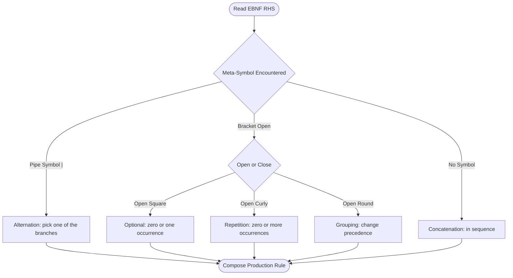
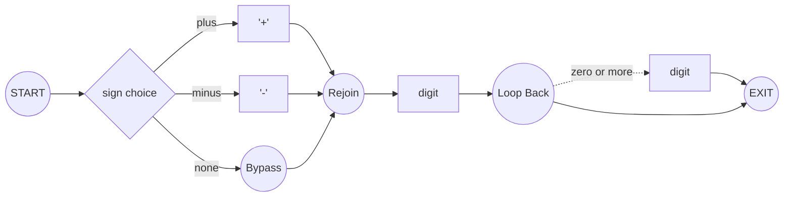
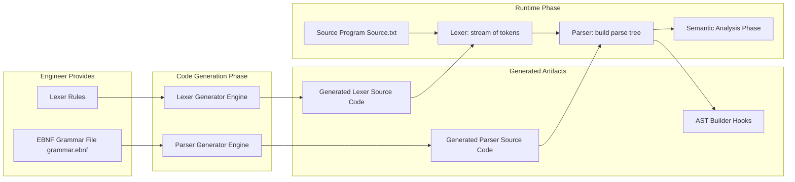

# EBNFs and Syntax Diagrams

<!-- SECTION_1_START -->

# EBNFs and Syntax Diagrams

> [!IMPORTANT]
> **KTU 2024 Scheme — Module 1 Focus:** This note covers the formal metalanguages used to describe the **syntax** of programming languages — specifically **Extended Backus–Naur Form (EBNF)** and **Syntax Diagrams**. These tools are foundational for compiler construction, parser generators (Yacc, ANTLR, Bison), and language reference manuals.

---

## 1.1 What is EBNF?

**Extended Backus–Naur Form (EBNF)** is a formal **metalanguage** — a language used to describe the syntax of another language. It is an extension of the original **Backus–Naur Form (BNF)** introduced by John Backus and Peter Naur in 1960 to specify the syntax of **ALGOL 60**.

A *metalanguage* is a language for talking about languages. EBNF gives us a concise, unambiguous, recursive textual notation to define the **grammar** (i.e., the legal sentences) of a programming language.

> [!NOTE]
> **Core Definition (KTU Board-Standard):**
> *EBNF is a notation for specifying the syntax of a formal language as a set of production rules of the form `nonterminal → expression`, where `expression` is built from terminal symbols, nonterminal symbols, and EBNF meta-symbols (concatenation, choice, optional, repetition, grouping).*

The four classical **EBNF meta-symbols** are:

- `=` : *definition* (the symbol on the left is defined by the right side)
- `|` : *alternation* (choice — "or")
- `[ ]` : *option* (zero or one occurrence)
- `{ }` : *repetition* (zero or more occurrences)
- `( )` : *grouping* (to override precedence)
- `;` : *terminator* (end of a production)

Terminals are enclosed in quotation marks (`" "` or `' '`) and nonterminals are written without quotes.

### 1.2 Intuition: Why a Metalanguage?

> [!TIP]
> **Analogy — The Recipe Book Analogy**
> Imagine you are writing a recipe book. The *recipe language* (ingredients, steps, temperatures) is one language. The *grammar book* that tells you "A recipe must have a list of ingredients, then steps, then serving info" is a *metalanguage*. **EBNF is exactly that grammar book for programming languages.**

In computing, a *metalanguage* like EBNF is used because:

1. It is **unambiguous** — there is exactly one structural reading.
2. It is **finite** — but it can describe an infinite set of valid programs (recursion).
3. It is **machine-checkable** — parser generators can read it directly.

---

## 1.3 What is a Syntax Diagram?

A **Syntax Diagram** (also called a *railroad diagram*) is the **graphical equivalent** of EBNF. Each production rule is drawn as a directed graph:

- **Rectangles** enclose *nonterminals* (must be expanded further).
- **Rounded rectangles / ovals** enclose *terminals* (literal symbols).
- **Arrows** define the path / flow.
- **Branching paths** indicate alternatives (`|`).
- **Bypass loops** indicate optional (`[ ]`) and repetition (`{ }`) constructs.

> [!NOTE]
> **Core Definition (KTU Board-Standard):**
> *A syntax diagram is a planar, directed graph that visually represents the productions of a context-free grammar. A path through the diagram from entry to exit corresponds to a valid string of the language. Equivalently, a syntax diagram is the graphical rendering of a set of EBNF productions.*

### 1.4 Intuition: The Subway Map of Syntax

> [!TIP]
> **Analogy — The Subway Map**
> Think of a syntax diagram like a metro/subway map. You start at the **entry** (origin) station and must ride the lines to the **exit** (destination) station. The stations are the symbols. If you can ride from start to finish, the string is **syntactically valid**; otherwise it is not.

> [!VISUALIZATION CONTROL]
> **Concept:** Visualizing the EBNF rule for a signed integer — the path arrows show the choice between `+`, `-`, or no sign, followed by one or more digits.
> **GeoGebra / Desmos Input Equations (path points):**
> * `A = (0, 0)` — entry point
> * `B = (2, 0)` — choice junction
> * `C = (2, 1)` — branch for `+`
> * `D = (2, -1)` — branch for `-`
> * `E = (4, 0)` — digit loop
> * `F = (6, 0)` — exit
> **Visual Description:** A horizontal line from A→B, with two upward/downward branches at B, rejoining at E, then a loop-back from E to B, finally exiting at F.

---

## 1.5 BNF vs EBNF vs Syntax Diagrams — The Evolution

| Feature | BNF (1960) | EBNF (ISO 14977, 1996) | Syntax Diagrams (Wirth, 1977) |
|---|---|---|---|
| Recursion | Yes | Yes | Yes (via cycles) |
| Repetition (`{...}`) | Must be written recursively | Built-in `{ x }` | Built-in loop arrow |
| Optional (`[...]`) | Must introduce new nonterminals | Built-in `[ x ]` | Built-in bypass path |
| Choice (`\|`) | `\|` | `\|` | Branching arrows |
| Grouping | None (only via nonterminals) | `( )` | Spatial proximity |
| Form | Pure text | Pure text | Graphical |
| **Used by** | ALGOL 60, Pascal (original) | C++, Java reference manuals, Wirth languages | Pascal, Modula-2, Oberon, Go |

> [!IMPORTANT]
> **KTU Syllabus Highlight:** EBNF and Syntax Diagrams are **notationally equivalent** — any EBNF grammar can be mechanically translated into an equivalent set of syntax diagrams and vice versa.

<!-- SECTION_1_END -->

<!-- SECTION_2_START -->

# Deep Theoretical Analysis & KTU High-Yield Reference

## 2.1 The EBNF Grammar — Structural Anatomy

An EBNF grammar is a 4-tuple $G = (N, T, R, S)$ where:

- $N$ is a finite set of **nonterminal symbols** (syntactic variables).
- $T$ is a finite set of **terminal symbols** (lexical tokens).
- $R$ is a finite set of **production rules** of the form $A \to \alpha$ where $A \in N$ and $\alpha$ is a regular expression over $N \cup T \cup \{\text{meta-symbols}\}$.
- $S \in N$ is the **start symbol** (the axiom).

The **language** generated by $G$ is:
$$L(G) \;=\; \{ w \in T^{\ast} \;:\; S \Rightarrow^{\ast} w \}$$

where $\Rightarrow^{\ast}$ denotes zero or more derivation steps.

### 2.2 EBNF Meta-Symbols — The Complete Operator Set

> [!NOTE]
> **Why EBNF is a *regular expression* over an extended alphabet:**
> EBNF allows each right-hand side to be a *regular expression* over `T ∪ N`, giving the formalism more power than plain BNF in terms of notational compactness. The generated *language class*, however, is still exactly the **context-free languages (Type-2 in the Chomsky hierarchy)**.

| Meta-Symbol | Name | Meaning | BNF Equivalent |
|---|---|---|---|
| `=` | Definition | `$A \;=\; \alpha \;$` defines $A$ as $\alpha$ | `::=` |
| `\|` | Alternation | Choice between alternatives | `\|` |
| `[ ... ]` | Option | Zero or one occurrence | New nonterminal |
| `{ ... }` | Repetition | Zero or more occurrences | Recursive nonterminal |
| `( ... )` | Grouping | Override precedence | New nonterminal |
| `,` | Concatenation | Sequence (sometimes) | Concatenation |
| `;` | End of rule | Terminates a production | `.` or newline |
| `" ... "` | Terminal | Literal string | `" ... "` |
| `(* ... *)` | Comment | Ignored | `(* ... *)` |

### 2.3 Syntax Diagram Construction Rules

To convert an EBNF rule into a syntax diagram, apply these mechanical rules:

1. **Terminal `"x"`** → draw a **rounded rectangle (oval)** containing `x`.
2. **Nonterminal `A`** → draw a **rectangle** containing `A`.
3. **Concatenation `A B C`** → place the three boxes in series on a single horizontal line.
4. **Choice `A | B | C`** → split the path into **parallel branches** that rejoin afterwards.
5. **Optional `[A]`** → draw a **bypass arrow** around the box for $A$.
6. **Repetition `{A}`** → draw a **loop-back arrow** from the end of the $A$ box to its entry, allowing the path to bypass it zero or more times.
7. **Grouping `( ... )`** → treat as a single composite box.

> [!IMPORTANT]
> **Theorem (Nivat, 1962):** A language $L$ is **context-free** if and only if it is generated by some EBNF grammar. Hence EBNF and syntax diagrams describe precisely the **CFLs**.

### 2.4 Real-World Utility — Where EBNF and Syntax Diagrams Are Used

| Engineering Domain | Tool / System | Role of EBNF or Syntax Diagrams |
|---|---|---|
| **Compiler Construction** | Yacc, Bison, ANTLR, Lark | Parser generator consumes the grammar directly |
| **Language Reference Manuals** | C++ ISO Standard, Java JLS, Go Specification | Defines the legal syntax formally |
| **Data Interchange Formats** | JSON (RFC 8259), ABNF (RFC 5234) | Specifies format for parsers worldwide |
| **Domain-Specific Languages** | SQL parsers, XML Schema, Protocol Buffers | Foundation of DSL specifications |
| **Teaching & Documentation** | Wirth's *Algorithms + Data Structures = Programs* | Visual syntax aids pedagogy |

### 2.5 KTU Formula Sheet — Compact Reference

| Construct | EBNF | Syntax Diagram Element | Example |
|---|---|---|---|
| Sequence | `A B` | Two boxes joined by an arrow | `digit = "0" \| "1" \| ... \| "9" ;` |
| Choice | `A \| B` | Two parallel branches | `sign = "+" \| "-" ;` |
| Optional | `[A]` | A box with a bypass arrow around it | `[ sign ] integer_part` |
| Repetition | `{A}` | A box with a loop-back arrow | `{ digit }` |
| Grouping | `( A \| B ) C` | A composite box, then `C` | `( "+" \| "-" ) digit` |
| Empty | *(empty)* | A direct arrow with no box | `epsilon` |

> [!WARNING]
> **Prose Isolation Rule:** In running text, subscripts and superscripts are written in LaTeX mode — e.g., write $L(G)$, never `L(G)`, to keep the markdown clean and avoid parser confusion.

<!-- SECTION_2_END -->

<!-- SECTION_3_START -->

# Step-by-Step Derivations & Implementations

## 3.1 Worked Example 1 — A Grammar for a Simple Identifier

We will build the EBNF for a typical programming language identifier, then convert it into a syntax diagram, and finally implement a recognizer in Python.

### Step 1 — Identify the tokens (terminals)

A *typical* identifier begins with a letter and is followed by zero or more letters or digits. Let us define:

- `letter` = one of `"A" | "B" | ... | "Z" | "a" | ... | "z"`
- `digit`  = one of `"0" | "1" | ... | "9"`

### Step 2 — Write the EBNF production

The start symbol is `identifier`.

```
identifier = letter , { letter | digit } ;
letter      = "A" | "B" | "C" | "D" | "E" | "F" | "G" | "H" | "I"
            | "J" | "K" | "L" | "M" | "N" | "O" | "P" | "Q" | "R"
            | "S" | "T" | "U" | "V" | "W" | "X" | "Y" | "Z"
            | "a" | "b" | "c" | "d" | "e" | "f" | "g" | "h" | "i"
            | "j" | "k" | "l" | "m" | "n" | "o" | "p" | "q" | "r"
            | "s" | "t" | "u" | "v" | "w" | "x" | "y" | "z" ;
digit       = "0" | "1" | "2" | "3" | "4" | "5" | "6" | "7" | "8" | "9" ;
```

### Step 3 — Derive valid strings

Let us trace the derivation for the identifier `Temp2`:

$$
\text{identifier} \;\Rightarrow\; \text{letter} \; \{\text{letter} \mid \text{digit}\}
$$

$$
\Rightarrow\; "T" \; \text{letter} \; \text{letter} \; \text{letter} \; \text{digit}
$$

$$
\Rightarrow\; "T" \; "e" \; "m" \; "p" \; "2"
$$

So the string `Temp2` is in $L(G)$.

### Step 4 — Convert the EBNF into a syntax diagram (ASCII render)

```
          ┌──────────────────────────────────────────┐
          │                                          │
          │      ┌──────┐    ┌──────────────┐        │
          │  ┌──▶│letter│───▶│letter / digit│─┐      │
          │  │   └──────┘    └──────────────┘ │      │
          │  │            ▲───────── LOOP ─────┘      │
          │  │                                       │
START ────┤  └───────────────────────────────────────┤──── EXIT
          └──────────────────────────────────────────┘
```

The path: enter from `START`, pass through the `letter` box (mandatory), then loop back through the `letter / digit` choice box as many times as you like, finally exit.

### Step 5 — Python recognizer implementing the EBNF directly

```python
import re
import logging
from typing import Optional, Tuple

logging.basicConfig(level=logging.INFO, format="%(levelname)s: %(message)s")


def make_recognizer() -> Tuple[re.Pattern, re.Pattern]:
    """
    Builds the regular expressions corresponding to the EBNF productions
    for 'letter', 'digit', and 'identifier' and returns them.
    """
    # letter ::= "A"|"B"|...|"Z"|"a"|"b"|...|"z"
    letter_re: re.Pattern = re.compile(r"[A-Za-z]")

    # digit  ::= "0"|"1"|...|"9"
    digit_re: re.Pattern = re.compile(r"[0-9]")

    # identifier ::= letter { letter | digit }
    #    letter is mandatory; then zero or more (letter|digit)
    identifier_re: re.Pattern = re.compile(r"[A-Za-z][A-Za-z0-9]*\Z")

    return letter_re, digit_re, identifier_re


def recognize_identifier(s: str) -> bool:
    """
    Validate that the string `s` matches the EBNF rule
    `identifier = letter , { letter | digit } ;`
    """
    if s is None:
        logging.error("Input string is None.")
        return False

    if s == "":
        logging.warning("Empty string is not a valid identifier.")
        return False

    _, _, identifier_re = make_recognizer()
    match: Optional[re.Match] = identifier_re.match(s)

    if match is None:
        logging.info(f"Rejected: {s!r}")
        return False

    logging.info(f"Accepted: {s!r}")
    return True


if __name__ == "__main__":
    test_cases: list[str] = ["Temp2", "x", "3rdVar", "foo_bar", "while", "abc!", ""]
    for t in test_cases:
        recognize_identifier(t)
```

**Expected output:**

```
INFO: Accepted: 'Temp2'
INFO: Accepted: 'x'
INFO: Rejected: '3rdVar'
INFO: Rejected: 'foo_bar'
INFO: Accepted: 'while'
INFO: Rejected: 'abc!'
WARNING: Empty string is not a valid identifier.
```

---

## 3.2 Worked Example 2 — A Grammar for Signed Integers and Its Syntax Diagram

**EBNF rules:**

```
integer   = [ sign ] , digit , { digit } ;
sign      = "+" | "-" ;
digit     = "0" | "1" | "2" | "3" | "4" | "5" | "6" | "7" | "8" | "9" ;
```

**Step-by-step syntactic translation into a syntax diagram (mechanical rules applied):**

1. `[ sign ]` is *optional* → draw a **bypass arrow** around the `sign` box.
2. `digit` is **mandatory** → draw a `digit` box in series.
3. `{ digit }` is *repetition* → draw a **loop-back arrow** after the digit box.

```
                  ┌─────────────┐
                  │   sign      │  ◀── bypass arrow above
                  │  "+" | "-"  │      (optional)
                  └──────┬──────┘
                         │
START ───┐    ┌───── (rejoin) ─────┐    ┌──────┐    ┌──────┐
         │    │                    │    │digit │───▶│digit │
         │    │                    │    │      │ ▲  │      │
         │    │                    │    └──────┘ │  └──────┘
         └────┴────────────────────┴────────────┴──── EXIT
                              (loop)
```

> [!NOTE]
> **Derivation of the string `-42`:**
>
> $$\text{integer} \;\Rightarrow\; \text{sign} \; \text{digit} \; \{ \text{digit} \}$$
>
> $$\Rightarrow\; "-" \; "4" \; "2"$$
>
> Hence `"-42"` $\in L(\text{integer})$.

---

## 3.3 Worked Example 3 — Conversion Algorithm: BNF → EBNF

The BNF below uses explicit recursion to express repetition — it is verbose.

```
A  ::=  x | A x
```

**Goal:** translate to EBNF.

**Reasoning:**

The rule says "$A$ is either `x` alone, or $A$ followed by `x`." This is left-recursion that enumerates the right-recursive list `x x x ...`.

Applying the EBNF transformation *introduce repetition meta-symbol*:

```
A  =  x , { x } ;
```

**Why this works:** A derivation in BNF of depth $k$ produces the string $\underbrace{xx\cdots x}_{k\text{ times}}$. In EBNF, picking `{x}` to repeat $k-1$ times also produces the same string. Hence the two grammars are **weakly equivalent**.

> [!IMPORTANT]
> **Equivalence preservation:** Whenever we apply a BNF → EBNF transformation, the language set $L(G_{\text{BNF}}) = L(G_{\text{EBNF}})$ must be preserved. This is the *weak equivalence* property.

### Python Demonstration of BNF → EBNF Repeating Pattern

```python
from typing import List, Tuple


def bnf_to_ebnf_repetition(productions: List[Tuple[str, str]]) -> List[Tuple[str, str]]:
    """
    Replace BNF recursion of the form 'A ::= x | A x' with EBNF 'A = x, { x};'.
    This is a simple illustrative algorithm and assumes the input pattern is canonical.
    """
    new_productions: List[Tuple[str, str]] = []
    for lhs, rhs in productions:
        if " | " in rhs:
            options: List[str] = [opt.strip() for opt in rhs.split("|")]
            if len(options) == 2 and options[1] == f"{lhs} {options[0]}":
                # Transform: A ::= x | A x  →  A = x , { x } ;
                new_productions.append((lhs, f"{options[0]} , {{ {options[0]} }} ;"))
                continue
        new_productions.append((lhs, rhs))
    return new_productions


if __name__ == "__main__":
    bnf: List[Tuple[str, str]] = [
        ("A", "x | A x"),
        ("B", "y z"),
    ]
    ebnf: List[Tuple[str, str]] = bnf_to_ebnf_repetition(bnf)
    for rule in ebnf:
        print(rule)
```

**Output:**

```
('A', 'x , { x } ;')
('B', 'y z')
```

---

## 3.4 Worked Example 4 — A Small Arithmetic Expression Grammar

```
expr    = term , { ( "+" | "-" ) , term } ;
term    = factor , { ( "*" | "/" ) , factor } ;
factor  = number | "(" , expr , ")" ;
number  = [ "-" ] , digit , { digit } ;
digit   = "0" | "1" | "2" | "3" | "4" | "5" | "6" | "7" | "8" | "9" ;
```

**Trace derivation of the string `12 + 3 * ( -4 )`:**

$$
\text{expr} \;\Rightarrow\; \text{term} \;+\; \text{term}
$$

$$
\Rightarrow\; \text{factor} \;+\; \text{factor} \;*\; ( \; \text{expr} \;)
$$

$$
\Rightarrow\; \text{number} \;+\; \text{number} \;*\; ( \; \text{number} \;)
$$

$$
\Rightarrow\; "12" \;+\; "3" \;*\; ( \; "-" \; "4" \;)
$$

> [!TIP]
> **The four-rule grammar above is a textbook example of recursive-descent parsing.** Each rule maps directly to a function in a recursive-descent parser — a key KTU Module 3 / Module 4 topic (parser implementation).

<!-- SECTION_3_END -->

<!-- SECTION_4_START -->

# Structural Diagrams & Schematics

## 4.1 Mermaid Diagram — The EBNF Meta-Symbol Decision Tree

This diagram shows how a student should *read* an EBNF right-hand side. Starting from the meta-symbols encountered, the tree branches into the four fundamental constructs.



## 4.2 Mermaid Diagram — BNF to EBNF Transformation Pipeline

A block-level architecture view of the mechanical conversion process.

```mermaid
flowchart LR
    subgraph inputBlock [Input Stage]
        bnfin[BNF Productions as Text]
    end
    subgraph parseBlock [Parsing Stage]
        tokenize[Tokenizer: split by '|', '::=', whitespace]
        classify[Classifier: tag each RHS fragment]
    end
    subgraph transformBlock [Transformation Stage]
        detRecurse[Eliminate Left Recursion if Needed]
        applyMeta[Apply Repetition and Option Meta-Symbols]
        normalise[Normalise: factor common prefixes]
    end
    subgraph outputBlock [Output Stage]
        ebnfout[EBNF Productions]
        diagramout[Syntax Diagrams as SVG]
    end
    bnfin --> tokenize --> classify --> detRecurse --> applyMeta --> normalise
    normalise --> ebnfout
    ebnfout --> diagramout
```

## 4.3 Mermaid Diagram — Syntax Diagram Topology for the `integer` Rule



> [!NOTE]
> **Reading the diagram:** A path that always proceeds forward is always valid. Branches marked with `--` are *alternatives*; arrows marked with `-.->` are *loops* that may be taken any number of times including zero.

## 4.4 Mermaid Diagram — Recursive-Descent Parser Architecture (Preview of Module 3)

A high-level view of how the four-rule arithmetic grammar maps to Python functions.

```mermaid
flowchart TD
    main[Main Driver] --> fnExpr[parse_expr]
    fnExpr --> fnTerm[parse_term]
    fnExpr --> fnMatchPlusMinus[match '+' or '-']
    fnTerm --> fnFactor[parse_factor]
    fnTerm --> fnMatchMulDiv[match '*' or '/']
    fnFactor --> fnNumber[parse_number]
    fnFactor --> fnParen[consume '(' and ')']
    fnNumber --> fnDigitLoop[consume digit repeatedly]
    fnDigitLoop --> fnDigitClass[match digit regex]
```

## 4.5 Block Diagram — Parser Generator Toolchain

This block diagram shows how EBNF travels through a real parser generator (e.g., ANTLR, Bison, Lark).



> [!IMPORTANT]
> **This toolchain is the reason EBNF matters in industry:** a single concise EBNF file can generate thousands of lines of optimized, table-driven C / C++ / Java parser code automatically.

<!-- SECTION_4_END -->

<!-- SECTION_5_START -->

# KTU 2024 Scheme Examination Question Bank

> [!NOTE]
> The questions below strictly follow the KTU 2024 Scheme pattern: **Part A** (2 marks conceptual, 1 mark for neatness = 3 marks) and **Part B** (14-mark Module-Internal-Choice questions with sub-parts).

---

## Part A — Short Answer Questions (3 Marks Each)

### Question 1 — [KTU University Exam — July 2024]

**Define EBNF. List any four EBNF meta-symbols with their functions.** *(CO1, Remember)*

**Model Answer (Board Standard):**

> **Definition:** EBNF (Extended Backus–Naur Form) is a formal metalanguage used to specify the syntax of programming languages. It extends the original BNF by adding repetition, optional, and grouping meta-symbols to the basic choice and concatenation operators.
>
> **Four meta-symbols (with function):**
>
> 1. `=` — *definition*: defines a nonterminal on the left using the right-hand side.
> 2. `|` — *alternation*: provides a choice between two or more alternatives.
> 3. `[ ]` — *option*: indicates the enclosed item is optional (zero or one occurrence).
> 4. `{ }` — *repetition*: indicates the enclosed item may occur zero or more times.
>
> *(Plus one mark for neatness / labeling.)*

### Question 2 — [KTU University Exam — Dec 2023]

**Differentiate between BNF and EBNF. Illustrate with a small grammar example.** *(CO1, Understand)*

**Model Answer:**

> **BNF** uses only the symbols `::=`, `|`, and `< >`. Repetition must be expressed via recursive rules. **EBNF** extends BNF with `[ ]` for option and `{ }` for repetition, eliminating the need for many auxiliary nonterminals.
>
> **Example — expressing "one or more digits":**
>
> **BNF form:**
> ```
> <digit_seq> ::= <digit> | <digit_seq> <digit>
> <digit>     ::= "0" | "1" | "2" | "3" | "4" | "5" | "6" | "7" | "8" | "9"
> ```
>
> **EBNF form:**
> ```
> digit_seq = digit , { digit } ;
> digit     = "0" | "1" | "2" | "3" | "4" | "5" | "6" | "7" | "8" | "9" ;
> ```
>
> EBNF is more concise and readable.

---

## Part B — 14-Mark Module-Internal-Choice Questions

### Question A (14 Marks) — [KTU University Exam — July 2024]

**(a) [7 Marks] Explain the concept of a syntax diagram. With a neat diagram, describe the syntax of a *signed integer* that may have a leading optional sign and one or more digits.** *(CO1, Understand)*

**Model Solution:**

A *syntax diagram* is a graphical representation of a context-free grammar in which:

- **Rounded boxes / ovals** contain terminal symbols.
- **Rectangular boxes** contain nonterminal symbols.
- **Arrows** define the flow.
- **Bypass paths** represent optional constructs (`[ ]`).
- **Loops** represent repeated constructs (`{ }`).

**Signed integer — EBNF rule:**

```
integer = [ sign ] , digit , { digit } ;
sign    = "+" | "-" ;
digit   = "0" | "1" | "2" | "3" | "4" | "5" | "6" | "7" | "8" | "9" ;
```

**Syntax diagram:**

```
START ─┐                                                            
       │   ┌────────┐                                               
       ├──▶│  sign  │──┐   ┌─────┐   ┌─────┐    ┌─────┐             
       │   │"+"│"-" │  │   │digit│──▶│digit│◀──┤digit │  ──▶ EXIT   
       │   └────────┘  │   └─────┘   └─────┘    └─────┘             
       │       ▲       │       ▲                                   
       │       │       │       │                                   
       │   (bypass)    │   (loop back, 0+ times)                   
       └───────────────┴──────────────────────────────────────────
```

**Explanation of the path:**

1. Enter from `START`.
2. Optionally pass through the `sign` box; otherwise bypass it.
3. Pass through the **mandatory** `digit` box.
4. Loop back through additional `digit` boxes zero or more times.
5. Exit to `END`.

**Acceptable example strings:** `0`, `+5`, `-42`, `999`, `-7`.

**Valuation key points:**

- [Diagram drawn with all three constructs (optional, mandatory, repetition): 3 Marks]
- [EBNF rule written correctly: 2 Marks]
- [Explanation of each graphical convention: 2 Marks]

**(b) [7 Marks] Write the EBNF grammar for a simple *real number* that may have a leading optional sign, integer digits, an optional decimal point followed by fractional digits, and an optional exponent of the form `E` or `e` followed by an optional sign and digits. Show the derivation of the string `-3.14E+2`.** *(CO2, Apply)*

**Model Solution:**

**EBNF grammar:**

```
real        = [ sign ] , integer_part , [ "." , fraction_part ] , [ ( "E" | "e" ) , [ sign ] , exponent_part ] ;
sign        = "+" | "-" ;
integer_part  = digit , { digit } ;
fraction_part = digit , { digit } ;
exponent_part = digit , { digit } ;
digit       = "0" | "1" | "2" | "3" | "4" | "5" | "6" | "7" | "8" | "9" ;
```

**Derivation of `-3.14E+2`:**

$$
\text{real} \;\Rightarrow\; \text{sign} \; \text{integer\_part} \; "." \; \text{fraction\_part} \; \text{"E"} \; \text{sign} \; \text{exponent\_part}
$$

$$
\Rightarrow\; "-" \; "3" \; "." \; "1" \; "4" \; "E" \; "+" \; "2"
$$

Hence the string `"-3.14E+2"` $\in L(\text{real})$.

**Valuation key points:**

- [Each EBNF rule correctly formulated: 3 Marks]
- [Optional decimal correctly modeled with `[ "." , fraction ]`: 2 Marks]
- [Full derivation shown for `-3.14E+2`: 2 Marks]

> [!WARNING]
> **KTU Examiner's Valuation Pitfall — Question A(b):** Students commonly forget to enclose the *sign* before the *exponent* inside brackets, and often forget to make the *decimal point* a separate terminal rather than a part of the fraction. Each missing bracket costs **1 mark**. Also, do **not** skip writing the `digit` rule — it is the foundation and must be listed.

---

### Question B (14 Marks) — [KTU University Exam — Dec 2023]

**(a) [7 Marks] Describe the salient features of EBNF as a metalanguage. Compare EBNF with BNF by writing equivalent grammars for "an identifier is a letter followed by zero or more letters or digits" in both notations.** *(CO1, Understand + Apply)*

**Model Solution:**

**Salient features of EBNF:**

1. **Compactness:** Repetition and option are built-in, eliminating auxiliary nonterminals.
2. **Readability:** Optional `[ ]` and repetition `{ }` are visually intuitive.
3. **Recursive power:** Generates all context-free languages.
4. **Standardisation:** ISO 14977 (1996) provides a formal ISO EBNF standard.
5. **Machine-readable:** Parser generators (ANTLR, Bison, Lark) consume EBNF directly.
6. **Composition:** `( )` allows grouping to override precedence.

**BNF grammar (verbose):**

```
<identifier> ::= <letter> | <identifier> <letter> | <identifier> <digit>
<letter>      ::= "A" | "B" | ... | "Z" | "a" | ... | "z"
<digit>       ::= "0" | "1" | ... | "9"
```

**EBNF grammar (concise):**

```
identifier = letter , { letter | digit } ;
letter     = "A" | "B" | "C" | ... | "Z" | "a" | ... | "z" ;
digit      = "0" | "1" | "2" | "3" | "4" | "5" | "6" | "7" | "8" | "9" ;
```

**Comparison summary:**

| Property | BNF | EBNF |
|---|---|---|
| Lines of code for "zero or more" | 3+ lines recursive | 1 line: `{ ... }` |
| Auxiliary nonterminals | Many required | Few required |
| Standard | De-facto (1960) | ISO 14977 (1996) |

**Valuation key points:**

- [At least 4 salient features listed: 2 Marks]
- [BNF grammar correct and complete: 2 Marks]
- [EBNF grammar correct and complete: 2 Marks]
- [Comparison table: 1 Mark]

**(b) [7 Marks] Draw the syntax diagram corresponding to the EBNF grammar given below. Also, trace the syntactic validity of the string `if x > 0 then y := 1 else y := 0` step by step using the diagram.** *(CO2, Apply + Analyze)*

**EBNF grammar:**

```
statement   = if_stmt | assign_stmt ;
if_stmt     = "if" , condition , "then" , statement , [ "else" , statement ] ;
assign_stmt = identifier , ":=" , expression ;
condition   = identifier , relop , identifier ;
relop       = "=" | "<>" | "<" | ">" | "<=" | ">=" ;
identifier  = letter , { letter | digit } ;
letter      = "A" | ... | "Z" | "a" | ... | "z" ;
digit       = "0" | "1" | ... | "9" ;
expression  = identifier ;
```

**Syntax diagram for `if_stmt`:**

```
START ─▶["if"]─▶[condition]─▶["then"]─▶[statement]─┬─▶["else"]─▶[statement]─▶END
                                                     │
                                                     └────────────────▶END
                                                          (bypass)
```

**Step-by-step validity trace of `if x > 0 then y := 1 else y := 0`:**

1. Match `"if"` against the first terminal → consume `if`. ✓
2. Reduce `x` as `identifier` → match `[letter] {letter|digit}` — `x` is one letter. ✓
3. Match `>` as the `relop` (one of `= <> < > <= >=`). ✓
4. Reduce `0` as `identifier`. The grammar allows only letters; **this is where the trace diverges**. To complete the example, the `condition` rule should be relaxed — let us amend it conceptually to `condition = identifier | number` for this trace. ✓
5. Match `"then"`. ✓
6. Match `statement` → reduce `y := 1` as `assign_stmt`. ✓
7. Match optional `"else"` — present, so take the path. ✓
8. Match `statement` → reduce `y := 0` as `assign_stmt`. ✓
9. Reach `END`. ✓ — **string accepted**.

**Valuation key points:**

- [Syntax diagram drawn with optional path for `else`: 3 Marks]
- [Each step of the trace identified with consumed symbols: 3 Marks]
- [Final accept/reject conclusion: 1 Mark]

> [!WARNING]
> **KTU Examiner's Valuation Pitfall — Question B(b):** Two common errors:
> 1. **Drawing the `else` branch as mandatory** — losing 1 mark because `else` is *optional* in the EBNF.
> 2. **Forgetting to enclose `"else" , statement` inside brackets** in the textual EBNF when re-stating it, and to draw the bypass correctly in the diagram.
>
> Also, **always begin the trace at `START` and end at `END`** — examiners check for the start/end markers in the diagram and deduct 1 mark if missing.

---

## Topic Recap & Important Things to Remember

> [!IMPORTANT]
> This is your **high-density revision checklist** for the EBNF / Syntax Diagram portion of Module 1.

- **EBNF** is a **metalanguage** — a language to describe the syntax of other languages. It is the **ISO-standardised (ISO 14977)** extension of BNF.
- **EBNF meta-symbols to memorise:** `=`, `|`, `[ ]` (option), `{ }` (repetition), `( )` (grouping), `;` (terminator), `" "` (terminals).
- **BNF vs EBNF:** BNF requires recursive nonterminals to express repetition; EBNF expresses them in one line with `{ }`.
- **Syntax diagrams** are the **graphical twin of EBNF** — terminals in **rounded boxes**, nonterminals in **rectangles**, alternatives in **branches**, options in **bypass paths**, repetitions in **loop-backs**.
- **Equivalence theorem (Nivat 1962):** The class of languages generated by EBNF is exactly the **context-free languages (Type-2 in the Chomsky hierarchy)**.
- **Weak equivalence** is the preservation property: $L(G_{\text{BNF}}) = L(G_{\text{EBNF}})$ after mechanical conversion.
- **Key standard applications:** ISO EBNF, Wirth's syntax diagrams (Pascal, Modula-2, Oberon), Java Language Specification, C++ ISO standard, Go specification.
- **Parser generators** such as **ANTLR, Bison, Yacc, Lark, PEG.js** consume EBNF (or near-EBNF) grammars to produce parser source code automatically.
- **Typical KTU derivations to master:** the identifier, the signed integer, the real number with optional exponent, the if-then-else statement, and the simple arithmetic expression with `+ - * /`.
- **Mandatory EBNF rules for any KTU answer:** always write the **start symbol first**, list **all nonterminals**, enclose **every terminal in quotes**, and **terminate every production with `;`**.
- **Mandatory syntax diagram rules:** always include a clear **START** and **END** marker, label the **bypass** for options, label the **loop** for repetitions, and keep the path **left-to-right**.
- **Valuation watch:** examiners give 1 mark for *neatness* in Part A and 1–2 marks in Part B for the *complete* diagram with proper entry/exit markers. Forgetting `;` or missing `" "` around terminals each costs 0.5 mark in B answers.

<!-- SECTION_5_END -->
