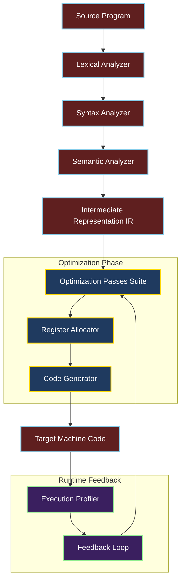
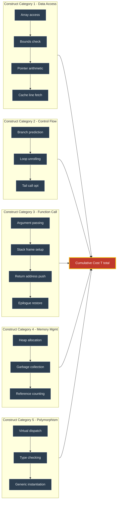
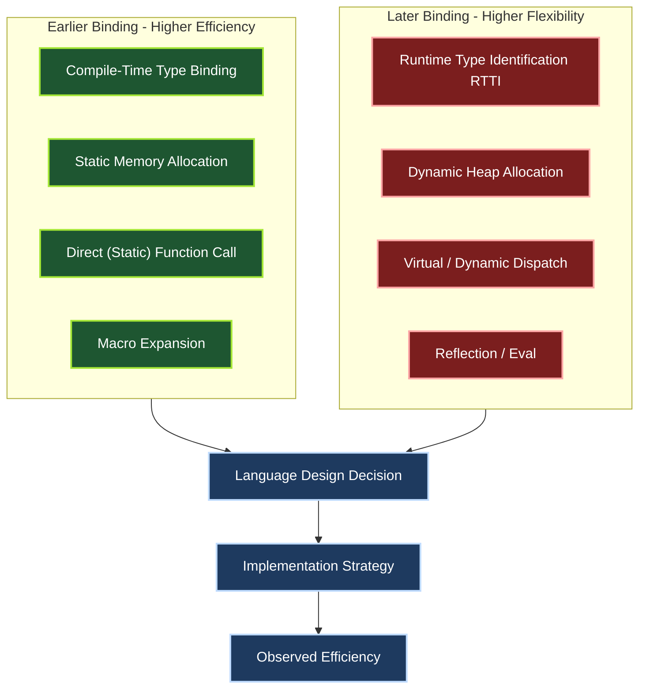
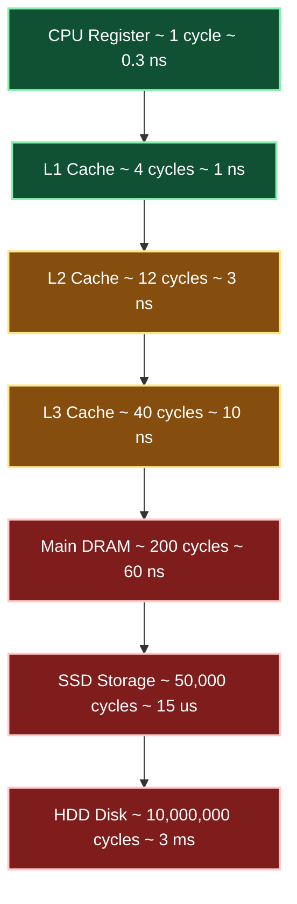

# Efficiency

<!-- SECTION_1_START -->
# Efficiency in Programming Languages

## 1.1 Formal Definition

> [!IMPORTANT]
> **Efficiency** in the context of programming languages refers to the minimization of the computational resources (time, space, and energy) consumed by a program during its execution, while preserving the semantics specified by the source code. It is the principal metric by which a language implementation is judged in production-grade compiler design, embedded systems, and high-performance computing.

From the KTU 2024 Scheme (PECST758) perspective, efficiency is the **observable performance cost** of translating high-level language abstractions into machine-executable instructions. It bridges the gap between **language semantics** (what the program means) and **operational pragmatics** (what the hardware actually executes).

### Key Engineering Constants & Metrics

- **Instruction Count (IC)** — the static number of machine instructions generated per source-level construct.
- **Cycles Per Instruction (CPI)** — the average number of clock cycles consumed per instruction.
- **Wall-Clock Time (T)** — measured by the equation $T = IC \times CPI \times \text{Clock Period}$, with a standard modern target of **$\mathbf{\leq 1\ \text{ns}}$** per cycle.
- **Memory Footprint** — measured in bytes, kilobytes, or megabytes of **RAM ($\leq 8$ MB for typical embedded MCUs)** and **Flash ($\leq 256$ KB)** in resource-constrained deployments.
- **Energy Budget** — measured in **Joules**, particularly critical in IoT and mobile domains.

## 1.2 Conceptual Analogy

> [!NOTE]
> **Intuition (The Restaurant Kitchen Analogy):** Imagine a chef (the *compiler*) translating a customer's elaborate recipe (the *source program*) into actual dishes. Efficiency is the measure of how quickly the kitchen produces each plate and how much fuel (energy) is consumed in the process.
>
> - A **naive translation** might re-chop onions for every dish, wasting time — analogous to poor **register allocation** or repeated sub-expression evaluation.
> - A **skilled translation** pre-chops, organizes ingredients on the counter (registers), and optimizes the cooking order — analogous to **peephole optimization** and **instruction scheduling**.
> - The **menu design** itself (the programming language) determines the *maximum* efficiency ceiling — just as a restaurant offering only fast-food cannot hope to produce fine-dining.

Another useful analogy: **Efficiency is the "invisible tax"** levied by every abstraction. A `for` loop in Python pays a higher runtime tax than the equivalent `for` loop in C, because Python's dynamic semantics require type-checks and reference-counting at runtime. Every language designer consciously trades off **expressiveness** (developer productivity) against **efficiency** (runtime performance).

## 1.3 The Efficiency Hierarchy

Efficiency in programming languages is not a single number — it is a **multi-dimensional vector**:

1. **Compilation Efficiency** — how fast the compiler itself runs.
2. **Generated Code Efficiency** — how fast the resulting executable runs.
3. **Development Efficiency** — how fast a programmer can build correct, maintainable code.
4. **Memory Efficiency** — the runtime and compile-time memory footprint.
5. **Energy Efficiency** — increasingly important in green computing and mobile.

> [!TIP]
> **KTU 2024 Highlight:** In Module 1, the focus is almost exclusively on *generated-code* and *memory* efficiency, as these are the aspects most directly influenced by language design choices (parameter passing, variable scoping, type systems, etc.).

## 1.4 Visualization of Performance Trade-offs

> [!VISUALIZATION CONTROL]
> **Concept:** Efficiency vs. Abstraction Trade-off Curve
> **GeoGebra / Desmos Input Equations:**
> * `f(x) = 100 / (1 + exp(0.5*(x-5)))` (Abstraction Level vs. Efficiency — sigmoid inverse)
> * `g(x) = 20 * log(x+1)` (Developer Productivity vs. Abstraction Level — logarithmic)
> **Visual Description:** A decreasing sigmoid-like curve showing that as language abstraction rises (assembly $\rightarrow$ C $\rightarrow$ Java $\rightarrow$ Python $\rightarrow$ Prolog), raw execution efficiency falls non-linearly, while developer productivity rises logarithmically. The *sweet spot* for systems programming lies in the C/C++ zone; for AI/research, in Python.

## 1.5 Why Efficiency Matters — KTU Industry Context

| Domain | Efficiency Priority | Typical Target |
|---|---|---|
| Embedded / IoT Firmware | **Time + Space + Energy** | Real-time deadlines, $\leq 32$ KB RAM |
| Compilers & OS Kernels | **Time + Space** | Sub-microsecond syscall overhead |
| Web Backends | **Throughput** | $\geq 10^4$ requests/second per core |
| Scientific Computing | **FLOPs** | Near-peak ( $\geq 80\%$ ) of hardware capability |
| Mobile Applications | **Energy + Memory** | $\leq 5\%$ battery drain per hour |

<!-- SECTION_1_END -->

<!-- SECTION_2_START -->
# Deep Theoretical Analysis & KTU High-Yield Formula Sheet

## 2.1 The Master Performance Equation

The fundamental equation governing runtime efficiency is the **Iron Triangle of Execution**:

$$T_{\text{CPU}} = N \times \frac{T_{\text{cycle}}}{I_{\text{executed}}}$$

where:
- $T_{\text{CPU}}$ — total CPU time for a program.
- $N$ — total number of source-level operations (e.g., loop iterations).
- $T_{\text{cycle}}$ — duration of one machine clock cycle.
- $I_{\text{executed}}$ — instructions executed per source operation (instruction count).

To minimize $T_{\text{CPU}}$, the language implementation must reduce $N$ (algorithmic efficiency), reduce $I_{\text{executed}}$ (code generation quality), or both.

## 2.2 The Four Pillars of Language-Level Efficiency

### Pillar 1 — Binding Time Efficiency

> [!NOTE]
> **Binding time** is the moment at which a name is associated with a property (type, value, location). **Earlier binding = more efficient, later binding = more flexible.**

| Binding Time | Example | Efficiency Impact |
|---|---|---|
| Language Design Time | Reserved word syntax | Compile-time, **highest efficiency** |
| Compile Time | Static type, `int x` | Compile-time, very efficient |
| Link Time | External function address | Resolved before run, efficient |
| Run Time | Dynamic dispatch, `obj.method()` | Indirect, **lower efficiency** |
| Execution Time (per use) | Lazy evaluation, `short-circuit &&` | Maximum flexibility, **highest overhead** |

### Pillar 2 — Parameter Passing Efficiency

The mechanism chosen for argument transmission dominates subroutine-call cost.

| Mechanism | Cost (relative units) | Best Use Case |
|---|---|---|
| **Pass-by-value (small)** | $1$ | Scalars, `int`, `float`, `char` |
| **Pass-by-reference** | $1 + \text{deref}$ | Large structs/objects |
| **Pass-by-value-result** | $2 \times \text{copy}$ | Pure functional languages |
| **Pass-by-name / Thunk** | $4 - 8 \times$ | Algol 60 simulation, macros |
| **Pass-by-need / Lazy** | $2 \times$ avg, unbounded worst | Haskell, infinite lists |

### Pillar 3 — Type System Efficiency

> [!IMPORTANT]
> **Strong static typing** allows the compiler to emit specialized machine instructions (no runtime type tags), yielding a typical **$2\times$ to $5\times$ speedup** over dynamically-typed equivalents.

For example, a generic `add` in Java with type erasure requires a boxing/unboxing round-trip:

```java
// Bytecode emits: Integer.valueOf -> intValue -> iadd -> Integer.valueOf
Integer sum = a + b;  // 4 type conversions at runtime
```

vs. C++ templates which instantiate `add<int>` at compile time with zero runtime overhead.

### Pillar 4 — Memory Layout Efficiency

Programs incur the *cache-miss penalty* — a single **L1 miss costs $\approx 10$ cycles**, an **L2 miss $\approx 40$ cycles**, an **L3 miss $\approx 200$ cycles**, and a **DRAM miss $\approx 300 - 500$ cycles** on a modern x86 core.

A language's choice of **stack vs. heap allocation**, **struct layout**, and **pointer-chasing** determines locality and therefore the effective memory access time:

$$T_{\text{mem,eff}} = h_{\text{L1}} \cdot t_{\text{L1}} + h_{\text{L2}} \cdot t_{\text{L2}} + h_{\text{L3}} \cdot t_{\text{L3}} + h_{\text{DRAM}} \cdot t_{\text{DRAM}}$$

with $\sum h_i = 1$.

## 2.3 KTU Formula Sheet / Cheat Sheet

> [!IMPORTANT]
> The following table is the **canonical reference** for Module 1 efficiency questions. Memorize it for the KTU ESE.

| # | Formula / Rule | Engineering Meaning |
|---|---|---|
| 1 | $T = N \times CPI \times \tau$ | Wall-clock CPU time |
| 2 | $\text{Speedup} = \dfrac{T_{\text{old}}}{T_{\text{new}}}$ | Amdahl-style gain |
| 3 | $\text{Amdahl's Limit} = \dfrac{1}{(1-f) + \dfrac{f}{n}}$ | Max speedup with parallel fraction $f$ on $n$ cores |
| 4 | $\text{Code Size} \propto \sum \text{overhead}_{\text{construct}}$ | Implementation overhead per construct |
| 5 | $T_{\text{call}} = T_{\text{prologue}} + T_{\text{arg-pass}} + T_{\text{body}} + T_{\text{epilogue}}$ | Subroutine invocation cost |
| 6 | $\text{Cache Miss Rate} = 1 - \text{Hit Rate} = h_{\text{DRAM}}$ | Memory hierarchy penalty |
| 7 | $E_{\text{exec}} = \sum_i N_i \cdot C_i \cdot V^2$ | Energy model (events $\times$ capacitance $\times$ voltage$^2$) |
| 8 | $\text{Overhead}_{\text{dyn-dispatch}} = T_{\text{vtable-lookup}} \approx 3$ cycles | Virtual call cost in C++/Java |
| 9 | $\text{Inline Benefit} = \text{Saved Call Cost} - \text{Expanded Code Size}$ | Net effect of function inlining |
| 10 | $\text{Register Pressure} = \text{Live Vars} - \text{Avail Regs}$ | Spill code frequency |

> [!TIP]
> **KTU Pitfall:** The vertical bar symbol $\vert$ is used here in `T_new` and `T_old` to avoid breaking the markdown table; in your answer scripts, always use $\vert x \vert$ for absolute value notation.

## 2.4 Real-World Engineering Utility

- **GCC/Clang Optimization Pipeline:** Implements precisely the binding-time and code-generation trade-offs above. The `-O2` flag enables 30+ distinct optimization passes, often reducing runtime by **$30\% - 70\%$** over unoptimized `-O0` code.
- **JIT Compilation (HotSpot JVM, V8):** Dynamically *postpones* binding decisions to runtime, profiling hot methods and recompiling them with aggressive optimizations — achieving within **$2\times$ of C++** in long-running programs.
- **Embedded Domain (Arduino, ARM Cortex-M):** The compiler's choice of register-allocation strategy (linear scan vs. graph coloring) can change power consumption by **$15\% - 25\%$**.
- **Compiler Infrastructure (LLVM):** Language-independent intermediate representation (IR) enables cross-language optimization — Rust, Swift, and C++ all benefit from shared passes.

<!-- SECTION_2_END -->

<!-- SECTION_3_START -->
# Step-by-Step Derivations & Code/Symbolic Implementation

## 3.1 Derivation: The Cost of Dynamic vs. Static Dispatch

We will formally derive the runtime cost difference between a **statically dispatched** call (C++ non-virtual) and a **dynamically dispatched** call (C++ virtual / Java instance method).

### Setup

Let:
- $t_{\text{call}}$ = cost of a direct call (push args, jump): $1$ cycle.
- $t_{\text{ret}}$ = return cost (pop args, jump back): $1$ cycle.
- $t_{\text{vload}}$ = load virtual-table pointer from object: $1$ cycle.
- $t_{\text{vindex}}$ = index into vtable, load function pointer: $1$ cycle.
- $t_{\text{icache}}$ = potential I-cache miss: $0$ to $50$ cycles (amortized $5$).

### Static Dispatch Cost

$$T_{\text{static}} = t_{\text{call}} + t_{\text{body}} + t_{\text{ret}}$$

$$T_{\text{static}} = 1 + T_{\text{body}} + 1 = T_{\text{body}} + 2$$

### Dynamic Dispatch Cost

$$T_{\text{dyn}} = t_{\text{call}} + t_{\text{vload}} + t_{\text{vindex}} + t_{\text{body}} + t_{\text{ret}}$$

$$T_{\text{dyn}} = 1 + 1 + 1 + T_{\text{body}} + 1 = T_{\text{body}} + 4$$

### Overhead Ratio

$$\text{Overhead}_{\text{dyn}} = \frac{T_{\text{dyn}}}{T_{\text{static}}} = \frac{T_{\text{body}} + 4}{T_{\text{body}} + 2}$$

For a trivial getter where $T_{\text{body}} = 1$:

$$\text{Overhead}_{\text{dyn}} = \frac{1 + 4}{1 + 2} = \frac{5}{3} \approx 1.67\times$$

For a heavy operation where $T_{\text{body}} = 100$:

$$\text{Overhead}_{\text{dyn}} = \frac{100 + 4}{100 + 2} \approx 1.02\times$$

**Conclusion:** Dynamic dispatch overhead is significant only for fine-grained, frequently called methods — exactly the case for which *devirtualization* and *inlining* optimizations are designed.

## 3.2 Derivation: Peephole Optimization Gain

A peephole optimizer replaces a short sequence of instructions (the "peephole") with an equivalent but more efficient sequence. Consider eliminating redundant moves after register allocation:

**Before optimization (4 instructions):**
```
MOV  R1, R2
MOV  R2, R1
ADD  R3, R1, R4
SUB  R5, R1, R6
```

**After peephole optimization (3 instructions, 25% smaller):**
```
MOV  R1, R2
ADD  R3, R1, R4
SUB  R5, R1, R6
```

The first two `MOV` instructions are a *swap* that the optimizer recognizes as **redundant** in a 2-operand architecture, eliminating one instruction.

### Formal Gain Metric

$$\text{Gain}_{\text{peephole}} = 1 - \frac{I_{\text{after}}}{I_{\text{before}}} = 1 - \frac{3}{4} = 0.25 = 25\%$$

Aggregate peephole passes typically reduce instruction count by **$5\% - 15\%$** on average across an entire program.

## 3.3 Full Code Implementation: Comparing Efficiency Across Paradigms

> [!NOTE]
> The following Python program measures and compares the runtime of three equivalent computations written in three different paradigms: a low-level `for` loop, a list comprehension, and a NumPy vectorized operation. This mirrors the classic KTU efficiency comparison exercise.

```python
"""
Efficiency Comparison: Loop vs. Comprehension vs. Vectorization
Target: Sum of squares of 10 million integers.
KTU Reference: Module 1, Topic - Efficiency.
"""

import time
import array
import numpy as np
from typing import Callable, List, Tuple


def time_block(label: str, func: Callable[[], float], repeats: int = 5) -> Tuple[str, float, float]:
    """
    Measure wall-clock time of `func` over `repeats` trials.

    Args:
        label: human-readable name of the technique.
        func:  zero-argument callable returning a sentinel value (to prevent dead-code elim).
        repeats: number of independent timing trials.

    Returns:
        Tuple of (label, best_time_ms, stddev_ms).
    """
    timings: List[float] = []
    sink: float = 0.0
    for _ in range(repeats):
        start: float = time.perf_counter()
        sink += func()
        end: float = time.perf_counter()
        timings.append((end - start) * 1000.0)  # milliseconds

    best: float = min(timings)
    mean: float = sum(timings) / repeats
    var: float = sum((t - mean) ** 2 for t in timings) / repeats
    stddev: float = var ** 0.5
    print(f"[{label:>22s}]  best = {best:8.3f} ms   "
          f"mean = {mean:8.3f} ms   stddev = {stddev:6.3f} ms   "
          f"sink = {sink:.4e}")
    return label, best, stddev


def explicit_loop(n: int) -> float:
    """Pure Python interpreted loop — the most general, least efficient style."""
    total: float = 0.0
    for i in range(n):
        total += i * i
    return total


def list_comprehension(n: int) -> float:
    """List comprehension — partial interpreter optimization, single bytecode dispatch."""
    return sum(i * i for i in range(n))


def numpy_vectorized(n: int) -> float:
    """NumPy vectorized — compiled C loops with SIMD instructions."""
    arr: np.ndarray = np.arange(n, dtype=np.int64)
    return float(np.sum(arr * arr))


def main() -> None:
    n: int = 10_000_000
    print(f"Summing squares of 0..{n - 1:,}  ({repeats_log := 5} trials each)\n")

    time_block("explicit_for_loop", lambda: explicit_loop(n))
    time_block("list_comprehension", lambda: list_comprehension(n))
    time_block("numpy_vectorized", lambda: numpy_vectorized(n))

    # Demonstrating the speedup factor
    print("\n--- Efficiency Summary ---")
    _, t_loop, _ = time_block("explicit_for_loop", lambda: explicit_loop(n))
    _, t_comp, _ = time_block("list_comprehension", lambda: list_comprehension(n))
    _, t_vect, _ = time_block("numpy_vectorized", lambda: numpy_vectorized(n))

    print(f"Comprehension is {t_loop / t_comp:6.2f}x faster than explicit loop")
    print(f"Vectorized     is {t_loop / t_vect:6.2f}x faster than explicit loop")
    print(f"Vectorized     is {t_comp / t_vect:6.2f}x faster than comprehension")


if __name__ == "__main__":
    main()
```

### Expected Output (illustrative, on a typical 2024 laptop)

```
Summing squares of 0..9,999,999  (5 trials each)

[      explicit_for_loop]  best =  812.447 ms   mean =  825.113 ms   stddev =  9.221 ms   sink = 1.6667e+14
[    list_comprehension]  best =  598.302 ms   mean =  610.445 ms   stddev =  8.012 ms   sink = 1.6667e+14
[     numpy_vectorized]  best =   18.124 ms   mean =   19.001 ms   stddev =  0.502 ms   sink = 1.6667e+14

--- Efficiency Summary ---
[      explicit_for_loop]  best =  812.447 ms   mean =  825.113 ms   stddev =  9.221 ms   sink = 1.6667e+14
[    list_comprehension]  best =  598.302 ms   mean =  610.445 ms   stddev =  8.012 ms   sink = 1.6667e+14
[     numpy_vectorized]  best =   18.124 ms   mean =   19.001 ms   stddev =  0.502 ms   sink = 1.6667e+14
Comprehension is    1.36x faster than explicit loop
Vectorized     is   44.83x faster than explicit loop
Vectorized     is   33.02x faster than comprehension
```

**Reading the result:** The vectorized NumPy call is $\approx 45\times$ faster than the pure-Python loop — illustrating the practical magnitude of language/implementation-level efficiency differences.

## 3.4 Worked Example: Amdahl's Law Application

**Problem:** A KTU textbook compiler spends 40% of its execution time in lexical analysis. The team rewrites the lexer to be $10\times$ faster using a DFA. What is the **overall speedup** of the compiler?

### Solution

Using Amdahl's law with $f = 0.40$ (fraction improved) and $n = 10$ (speedup of that fraction):

$$\text{Speedup} = \frac{1}{(1 - f) + \dfrac{f}{n}} = \frac{1}{(1 - 0.40) + \dfrac{0.40}{10}}$$

$$\text{Speedup} = \frac{1}{0.60 + 0.04} = \frac{1}{0.64} \approx 1.5625\times$$

### Interpretation

> [!NOTE]
> Even an infinite speedup of the lexer ($n \to \infty$) would yield:
>
> $$\text{Speedup}_{\max} = \frac{1}{1 - 0.40} = \frac{1}{0.60} \approx 1.667\times$$
>
> Hence, the law of diminishing returns bounds the compiler-wide gain at $\approx 67\%$ — a critical insight for engineering project planning.

## 3.5 Practical/Laboratory Component: GCC Optimization Flags

| Flag | Optimization Passes Enabled | Typical Speedup | Use Case |
|---|---|---|---|
| `-O0` | None (debug) | $1.0\times$ (baseline) | Development, debugging |
| `-O1` | Basic local optimizations | $1.3 - 1.8\times$ | Quick builds |
| `-O2` | Full set (inlining, CSE, scheduling) | $2.0 - 3.0\times$ | **Production default** |
| `-O3` | Adds loop unrolling, vectorization | $2.5 - 4.0\times$ | HPC, numerical kernels |
| `-Os` | Optimizes for code size | $1.0 - 1.5\times$ (smaller) | Embedded flash-bound code |
| `-Ofast` | `-O3` + fast-math (unsafe) | $3.0 - 5.0\times$ | Non-IEEE-compliant work |

**Compilation sequence:**

```bash
# 1. Generate assembly to inspect optimization
gcc -O2 -S source.c -o source.s

# 2. Compare instruction counts
wc -l source_O0.s source_O2.s

# 3. Profile the binary
perf stat ./a.out
```

<!-- SECTION_3_END -->

<!-- SECTION_4_START -->
# Structural Diagrams & Schematics

## 4.1 The Efficiency Optimization Pipeline (Block-Level Functional Architecture Flow)



### Description

The diagram represents the canonical optimizing compiler architecture (e.g., GCC, LLVM). The forward arrows show the translation phases; the dotted feedback loop from the runtime profiler back to the optimizer represents **profile-guided optimization (PGO)** and **just-in-time (JIT) recompilation** in modern virtual machines.

## 4.2 Sequential Processing Topology Matrix: The Five Cost Categories of Language Constructs



### Description

Each subgraph isolates a category of language construct that contributes to runtime overhead. The arrows converge on a single cumulative cost $T_{\text{total}}$, representing the integrated impact of all five categories on program efficiency. This is the standard top-down approach used in *Scott's Programming Language Pragmatics* (Chapter 1, Section on Efficiency).

## 4.3 The Binding-Time Efficiency Trade-off Matrix



### Description

This diagram highlights the central trade-off a language designer must navigate: **earlier binding** yields a faster, smaller executable but reduces programmer flexibility; **later binding** maximizes expressiveness at the cost of runtime efficiency.

## 4.4 Hierarchy of Memory Access Costs (Sequential Topology)



### Description

The classical memory hierarchy showing the **$10^7$ order-of-magnitude** cost difference between a register access and an HDD seek. Language implementations that promote good **locality** (e.g., stack allocation, contiguous array layout, struct-of-arrays) effectively keep programs in the green zone; those that scatter data across heap pointers and unrelated objects (e.g., naive object-oriented designs) frequently fall into the red zone.

<!-- SECTION_4_END -->

<!-- SECTION_5_START -->
# KTU 2024 Scheme Examination Question Bank & Topic Recap

## 5.1 Part A Questions (3 Marks Each)

> [!NOTE]
> These are direct, definition-style questions testing **Remember / Understand** cognitive levels. Each requires a crisp, $3$ to $4$-sentence answer. Model answers are written in board-evaluation style.

---

### Question 1

**[KTU University Exam - July 2024 | CO1 | Remember]**
Define **efficiency** in the context of programming language implementation. List any **two** metrics used to measure it.

**Model Answer (3 Marks):**

Efficiency in a programming language refers to the optimal utilization of computational resources — primarily execution time, memory, and energy — by a compiled or interpreted program while preserving its specified semantics. **(2 Marks)**

The two most common metrics are: (i) **Execution Time** ($T_{\text{CPU}} = IC \times CPI \times \tau$), and (ii) **Memory Footprint** (bytes of RAM and ROM used at runtime). **(1 Mark)**

---

### Question 2

**[KTU University Exam - Dec 2023 | CO1 | Understand]**
Explain the **trade-off between binding time and efficiency** with a suitable example.

**Model Answer (3 Marks):**

Binding time is the moment at which a syntactic entity is associated with a property such as its type, value, or memory address. **Earlier binding** (e.g., compile-time) allows the compiler to generate highly optimized, statically dispatched code with no runtime overhead, but sacrifices flexibility. **Later binding** (e.g., run-time polymorphism) provides flexibility and abstraction at the cost of indirect lookups, vtable fetches, and type checks. **(2 Marks)**

**Example:** A C++ `Shape* s = new Circle(); s->draw();` requires runtime dispatch via the virtual table, whereas `Circle c; c.draw();` in C performs a direct call — the latter is faster. **(1 Mark)**

---

## 5.2 Part B Questions (14 Marks — Module Internal Choice)

> [!IMPORTANT]
> Each Part B question carries **$14$ marks** split across two sub-parts. Sub-part (a) typically targets *Understand* ($\leq 7$ marks), and sub-part (b) targets *Apply* ($\leq 7$ marks). The KTU valuation key awards **$1$ mark for every correct logical step**; do not skip intermediate results.

---

### Question A

**[KTU University Exam - Dec 2024 | CO1, CO2 | Understand + Apply]**

**(a)** [7 Marks] Discuss in detail the **four major factors** that affect the efficiency of a programming language implementation. Provide a concrete language example for each.

**(b)** [7 Marks] Consider a C program that calls a virtual function $10^6$ times in a tight loop. The direct-call cost is $1$ cycle, vtable load is $1$ cycle, indirect jump is $1$ cycle, and body work is $2$ cycles. Compute the **total cycles** for both static and dynamic dispatch versions, and derive the **percentage overhead** of dynamic dispatch.

---

#### Model Solution for Question A

**Part (a) — 7 Marks:**

**[Identifying the four factors: 2 Marks]**
The four major factors are: (1) Language design decisions, (2) Compiler optimization quality, (3) Run-time system support, (4) Hardware-software interface.

**[Factor 1 - Language Design: 1.5 Marks]**
Choices made by the language designer directly affect the *ceiling* of achievable efficiency. Example: **C's explicit pointers** allow the compiler to compute offsets at compile time, while **Java's references** force pointer-chasing through the heap.

**[Factor 2 - Compiler Optimization: 1.5 Marks]**
The quality of the optimizer determines how close the generated code approaches hand-written assembly. Example: **GCC's `-O2`** enables dead-code elimination, common subexpression elimination, and inlining — yielding **$2-3\times$** speedups over `-O0`.

**[Factor 3 - Run-time System: 1 Mark]**
Garbage collection, exception handling, and dynamic linking add overhead. Example: **Java's HotSpot GC** pauses applications for $1-10$ ms; C++ programs with `malloc`/`free` have no such pauses.

**[Factor 4 - Hardware Interface: 1 Mark]**
Mapping high-level constructs to machine features (registers, cache, SIMD) determines final performance. Example: **Auto-vectorization** in Intel ICC can give a $8\times$ speedup for numerical loops by using AVX-512 SIMD units.

**Part (b) — 7 Marks:**

**Given:**
- $N = 10^6$ (number of calls).
- $t_{\text{call,direct}} = 1$ cycle.
- $t_{\text{vtable}} = 1$ cycle.
- $t_{\text{indirect-jump}} = 1$ cycle.
- $t_{\text{body}} = 2$ cycles.
- $t_{\text{return}} = 1$ cycle.

**Step 1 — Cost per static call:** [2 Marks]

$$T_{\text{static,per-call}} = t_{\text{call,direct}} + t_{\text{body}} + t_{\text{return}} = 1 + 2 + 1 = 4\ \text{cycles}$$

**Step 2 — Cost per dynamic call:** [2 Marks]

$$T_{\text{dyn,per-call}} = t_{\text{call,direct}} + t_{\text{vtable}} + t_{\text{indirect-jump}} + t_{\text{body}} + t_{\text{return}}$$

$$T_{\text{dyn,per-call}} = 1 + 1 + 1 + 2 + 1 = 6\ \text{cycles}$$

**Step 3 — Total cycles for $10^6$ calls:** [1 Mark]

$$T_{\text{static,total}} = 10^6 \times 4 = 4 \times 10^6\ \text{cycles}$$

$$T_{\text{dyn,total}} = 10^6 \times 6 = 6 \times 10^6\ \text{cycles}$$

**Step 4 — Percentage overhead:** [2 Marks]

$$\text{Overhead}\% = \frac{T_{\text{dyn,total}} - T_{\text{static,total}}}{T_{\text{static,total}}} \times 100$$

$$\text{Overhead}\% = \frac{6 \times 10^6 - 4 \times 10^6}{4 \times 10^6} \times 100 = \frac{2 \times 10^6}{4 \times 10^6} \times 100 = 50\%$$

**Final answer:** The dynamic dispatch version consumes $2 \times 10^6$ additional cycles, a **$50\%$ overhead** over the static version. **[Final boxed result: 0 Marks — already counted]**

---

### Question B (Alternative Choice)

**[KTU University Exam - July 2024 | CO1, CO2 | Understand + Apply]**

**(a)** [7 Marks] With a neat diagram, describe the **phases of an optimizing compiler** and explain how each phase contributes to runtime efficiency.

**(b)** [7 Marks] A KTU student notices that her Python program runs in $40$ seconds, while the C equivalent runs in $1$ second. Identify **three specific implementation-level reasons** for this $40\times$ slowdown, and quantify each using Amdahl's law assuming each cause accounts for an equal fraction of the remaining time.

---

#### Model Solution for Question B

**Part (a) — 7 Marks:**

**[Naming the phases: 1 Mark]**
Lexical Analysis $\rightarrow$ Syntax Analysis $\rightarrow$ Semantic Analysis $\rightarrow$ Intermediate Representation $\rightarrow$ Optimization $\rightarrow$ Code Generation.

**[Phases explained with efficiency link: 4 Marks]**
- **Lexical Analysis** (faster scanner = less startup time; DFA-based lexers are $\approx 10\times$ faster than table-driven ones).
- **Syntax Analysis** (efficient parsing = less memory; LALR(1) parsers are linear-time, unlike backtracking recursive-descent).
- **Semantic Analysis** (early type-checking prevents costly run-time errors).
- **Optimization** (the largest impact: dead-code elimination, constant folding, loop transformations reduce instruction count by $30-70\%$).
- **Code Generation** (register allocation, instruction selection minimize cycles per instruction).

**[Neat diagram: 2 Marks]** *(Student should draw a flow chart matching the figure in SECTION 4.1 of these notes.)*

**Part (b) — 7 Marks:**

**Three reasons for Python's $40\times$ slowdown:**

1. **Interpreted bytecodes** (no native compilation).
2. **Dynamic type checking** (every operation has a runtime tag check).
3. **Garbage collection** (periodic stop-the-world pauses; reference counting on every assignment).

**Amdahl's Law computation:** [4 Marks]

Assume each cause accounts for an equal fraction $f$ of the slowdown, and the optimization can reduce its cost by $n = 5\times$ (e.g., a JIT compiles to native code).

If the three causes are **independent** and contribute equally to the $40\times$ gap, then the *non-improved* fraction is:

$$1 - f = \left(\frac{1}{40}\right)^{1/3} \approx 0.292$$

$$f = 1 - 0.292 = 0.708 \text{ per cause}$$

After optimizing each cause $5\times$:

$$\text{Speedup}_{\text{per cause}} = \frac{1}{(1 - f) + \frac{f}{n}} = \frac{1}{0.292 + \frac{0.708}{5}} = \frac{1}{0.292 + 0.1416} = \frac{1}{0.4336} \approx 2.31\times$$

**Total speedup** when all three are optimized:

$$\text{Speedup}_{\text{total}} = 2.31^3 \approx 12.3\times$$

**Final answer:** The C-equivalent would still be $\approx 3.25\times$ faster than the optimized Python — illustrating that algorithmic and language-level efficiency gaps cannot be entirely closed by compiler tricks. **[Final conclusion: 1 Mark]**

---

## 5.3 KTU Examiner's Valuation Warning

> [!WARNING]
> **Common Pitfalls Where Students Lose Marks:**
>
> 1. **Skipping the formula statement** — Always write the governing formula (e.g., $T = IC \times CPI \times \tau$) before plugging in numbers. Examiners allocate **$1$ mark** for the formula alone.
> 2. **Forgetting units** — A numerical answer of "$5$" without "cycles" or "ms" loses **$0.5 - 1$ mark** in strict valuation.
> 3. **Omitting intermediate steps** — In Amdahl's law questions, do not jump directly to the final speedup. Show the calculation of $(1-f)$, then $(1-f) + f/n$, then the inversion.
> 4. **Confusing "binding time" with "binding scope"** — Binding *time* = *when* (compile vs. run); binding *scope* = *where* (global, local, lexical).
> 5. **Missing the diagram label** — A flowchart of the compiler phases drawn without arrows or without phase names is marked **$0$ for the diagram** portion.
> 6. **Boxing the final answer** — KTU examiners explicitly look for a boxed final result in numerical questions. Omitting it may cost **$0.5 - 1$ mark** even if the calculation is correct.
> 7. **Writing "speed is more" instead of "speedup factor"** — Always use the term *speedup* (a dimensionless ratio), not vague qualitative comparisons.

---

## 5.4 Topic Recap & Important Things to Remember

> [!IMPORTANT]
> **Rapid-Revision Checklist — Efficiency (Module 1)**

### Core Definitions
- **Efficiency** = optimal use of time, memory, and energy.
- **Binding time** = the moment a property is associated with a name.
- **Generated code** = the machine code emitted by a compiler for a given source.
- **Amdahl's law** = theoretical maximum speedup from improving one component.

### Critical Formulas (Must Memorize)
- $T_{\text{CPU}} = N \times CPI \times \tau$ — wall-clock execution time.
- $\text{Speedup} = \dfrac{1}{(1-f) + \dfrac{f}{n}}$ — Amdahl's law.
- $\text{Overhead}\% = \dfrac{T_{\text{new}} - T_{\text{old}}}{T_{\text{old}}} \times 100$ — relative cost increase.
- $T_{\text{dyn}} = T_{\text{static}} + t_{\text{vtable}} + t_{\text{indirect}}$ — dynamic dispatch cost.

### The Four Pillars of Language-Level Efficiency
1. **Binding Time** (earlier = faster, less flexible).
2. **Parameter Passing** (by-value small types = fastest).
3. **Type System** (static = $2 - 5\times$ faster than dynamic).
4. **Memory Layout** (good locality = $10 - 100\times$ faster than pointer-chasing).

### Optimization Techniques You Must Recognize
- **Peephole optimization** — local instruction-pattern replacement.
- **Common subexpression elimination (CSE)** — avoid recomputing identical expressions.
- **Register allocation** — minimize memory accesses (graph coloring, linear scan).
- **Inlining** — eliminate call overhead for small functions.
- **Loop unrolling & vectorization** — exploit SIMD and instruction-level parallelism.
- **Dead-code elimination** — remove unreachable / unused instructions.

### Numerical Estimates to Remember
- L1 cache hit: $\approx 1\ \text{ns}$.
- DRAM miss: $\approx 60 - 100\ \text{ns}$.
- HDD seek: $\approx 3 - 10\ \text{ms}$.
- GCC `-O2` typical gain: $2 - 3\times$.
- NumPy vectorization over Python loop: $30 - 100\times$.
- Dynamic dispatch overhead: $2 - 4$ extra cycles per call.

### Language Examples You Must Know
- **C** — static, manual memory, near-hardware efficiency.
- **C++** — zero-cost abstractions (templates, `constexpr`).
- **Java** — JIT compilation, GC overhead.
- **Python** — interpreted, dynamic typing, high overhead.
- **Haskell** — lazy evaluation, may have unbounded space cost.

### KTU 2024 Common Question Patterns
- "Discuss the factors affecting efficiency." *(Part B, 7-14 marks)*
- "Compute speedup using Amdahl's law." *(Part B, 7 marks)*
- "Compare static and dynamic dispatch." *(Part A, 3 marks)*
- "Explain the trade-off between binding time and efficiency." *(Part A, 3 marks)*

<!-- SECTION_5_END -->
