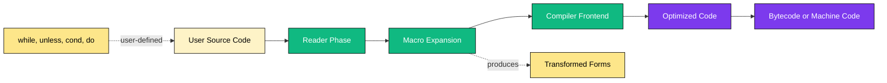
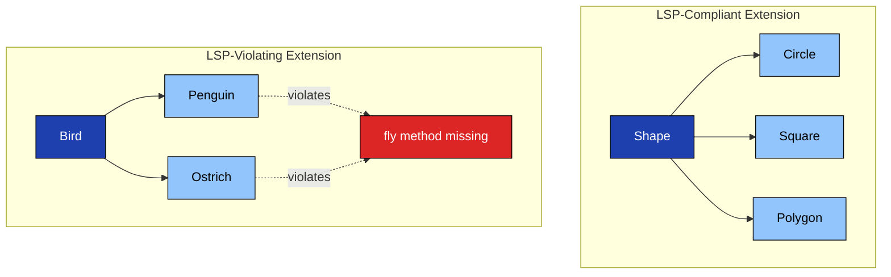
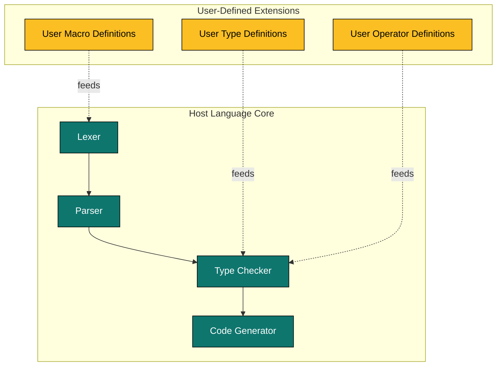

# Extensibility

<!-- SECTION_1_START -->
# Extensibility in Programming Languages

## Core Technical Definition

> [!NOTE]
> **Extensibility** is the ability of a programming language to be **augmented** by the programmer with new abstractions, data types, control structures, and operators — without requiring modification of the original language compiler, interpreter, or runtime engine.

In formal KTU 2024 Scheme terminology (aligned with Scott's *Programming Language Pragmatics* and Sebesta's *Concepts of Programming Languages*), extensibility is one of the **four fundamental design criteria** for evaluating programming languages, the others being **readability**, **writability**, and **reliability**. A language is said to be *extensible* if its syntax and semantics permit user-defined constructs that are indistinguishable — in usage — from built-in constructs.

### Conceptual Analogy / Intuition

> [!TIP]
> **Real-World Analogy — The LEGO® Brick Principle**
>
> Think of a programming language as a **LEGO® baseplate**. The manufacturer (language designer) ships a finite set of bricks (built-in types, operators, control statements). An *extensible language* is one where you can **mold your own bricks at runtime** — snap them onto the baseplate — and use them exactly like the originals. A non-extensible language (e.g., early Fortran) is like a sealed toy: you can only assemble what is inside the box.
>
> - **C** lets you build new *types* (`struct`, `union`, `enum`) — but you cannot redefine `+`.
> - **C++** lets you build new types *and* redefine `+` for them (operator overloading).
> - **Lisp/Scheme** lets you build *new control structures* (loops, conditionals) that the compiler never knew about.
> - **Python** lets you patch *existing* classes with new methods (monkey-patching) or even patch built-in types.

> [!IMPORTANT]
> **Syllabus Highlight (PECST758 — Module 1):**
> Extensibility is studied under *Language Evaluation Criteria* and *Influences on Language Design*. It directly supports the design goals of **abstraction** and **orthogonality**.

### Formal Sub-Definition of Extensibility

A programming language $L$ is **fully extensible** with respect to a domain $D$ if there exists a syntactic construct $\sigma$ such that for every entity $e \in D$ not originally in $L$, the programmer can define $\sigma(e)$ and use it with **identical syntax** to built-in entities.

### Why Extensibility Matters in Engineering

| Domain | Use Case |
|---|---|
| **Scientific Computing** | Defining `+` for matrices, vectors, complex numbers |
| **Embedded Systems** | Domain-specific operators for hardware registers |
| **Compilers** | Macros in Lisp/Scheme to create new syntactic forms |
| **Web Frameworks** | DSLs (Domain-Specific Languages) like SQL or HTML embedded in Ruby |
| **AI / ML** | Tensor operators in PyTorch (`torch.add(a, b)`) defined for `Tensor` |

> [!VISUALIZATION CONTROL]
> **Concept:** Extensibility Layer Cake — showing how a programmer's extensions sit above the built-in language core.
> **GeoGebra / Desmos Input Equations:**
> * Built-in layer: $f(x) = \sin(x), \cos(x)$
> * User layer: $g(x) = \sin(x) + \cos(x)$ — a *new operator* `combine` built from primitives
> **Visual Description:** Two stacked horizontal rectangles. The lower rectangle contains $\sin, \cos, \tan$. The upper rectangle contains user-defined `combine(a,b) = a+b` that calls lower functions. Arrows flow upward.

---

## KTU Key Terms to Memorize

> [!IMPORTANT]
> - **Extensibility** — capacity of a language to absorb new constructs.
> - **Orthogonality** — small set of primitive constructs combining in consistent ways (closely tied to extensibility).
> - **Macro** — a textual or syntactic transformation rule defined by the user (e.g., Lisp `defmacro`).
> - **Operator Overloading** — redefinition of an existing operator symbol for a user-defined type.
> - **Function/Method Overloading** — multiple functions with the same name but different signatures.
> - **Inheritance** — defining new classes by extending existing ones (OOP extensibility).
> - **Open Recursion / Dynamic Dispatch** — late binding that lets subclasses *extend* parent behavior.
<!-- SECTION_1_END -->

<!-- SECTION_2_START -->
# Deep Theoretical Analysis & KTU High-Yield Formula Sheet

## The Three Pillars of Extensibility

Modern programming languages deliver extensibility through **three orthogonal mechanisms**. A language that supports all three is considered *highly extensible*.

### Pillar 1 — Data Extensibility (User-Defined Types)

The ability to define **new data aggregates** beyond the primitive types supplied by the language.

| Language | Mechanism | Example Construct |
|---|---|---|
| **C** | Structures, Unions, Enums | `struct Point { double x, y; };` |
| **C++ / Java** | Classes | `class Point { ... };` |
| **Haskell** | Algebraic Data Types | `data Color = Red \| Green \| Blue` |
| **Python** | Dynamic classes | `class Point: ...` |
| **SQL** | User-defined types | `CREATE TYPE ...` |

### Pillar 2 — Operator/Function Extensibility (Overloading)

The ability to give **new meanings to existing symbols** for user-defined operands.

- **Operator Overloading** — `a + b` works for `int`, `float`, `Complex`, `Matrix`, `String`.
- **Function Overloading** (Ad-hoc Polymorphism) — `print(int)`, `print(string)`, `print(Point)`.
- **Coercion** — implicit type conversion (controversial; reduces reliability in some languages).

> [!NOTE]
> **KTU Pitfall:** Ada allows overloading of `*` for matrix multiplication, but **prohibits** overloading of `=` (assignment) to preserve semantic clarity. This is a classic KTU theory question on *why some operators are non-overloadable*.

### Pillar 3 — Control Extensibility (Macros & Higher-Order Functions)

The ability to define **new control-flow abstractions**.

| Mechanism | Language | Power |
|---|---|---|
| **Textual Macros** | C Preprocessor (`#define`) | Low — pure text substitution |
| **Hygienic Macros** | Scheme `define-syntax` | High — AST-level rewriting |
| **Defmacros** | Common Lisp `defmacro` | Very High — full code generation |
| **Closures / Lambdas** | Python, Haskell, JavaScript | High — functions as values |
| **Coroutines / Generators** | Python `yield`, C# `async/await` | Medium — control over scheduling |

## The Liskov Substitution Principle (Formal Foundation)

> [!IMPORTANT]
> For an extension $E$ of type $T$ to be *safe*, any context that expects a $T$ must accept an $E$ without semantic change. This is the **Liskov Substitution Principle (LSP)**, which underpins safe extensibility in OOP.

Formally, if $S$ is a subtype of $T$, then for every program $P$ that uses $T$, the program $P'$ obtained by substituting objects of $S$ for objects of $T$ must not alter any of the *observable* properties of $P$ (e.g., preconditions, postconditions, exceptions).

$$ \forall P \in \text{Programs}(T),\ \forall s \in S,\ P'(s) \equiv_{\text{behavior}} P(s) $$

## KTU High-Yield Formula Sheet

> [!TIP]
> Save this table — these are the *exact* bullets KTU examiners look for in 14-mark answers on *Extensibility*.

| # | Concept | Definition | Example Language |
|---|---|---|---|
| 1 | **User-Defined Types** | Programmer creates new data aggregates | C `struct`, Java `class` |
| 2 | **Operator Overloading** | Redefine operator semantics for new types | C++, Python, Ada |
| 3 | **Function Overloading** | Same name, different parameter signatures | C++, Java, C# |
| 4 | **Inheritance** | Derive new class from existing class | Java, C++, Python |
| 5 | **Macros** | Source-to-source transformation rules | C `cpp`, Lisp `defmacro` |
| 6 | **Polymorphism** | One interface, many implementations | Java interfaces, Haskell type classes |
| 7 | **Subtype Polymorphism** | Subclass instance usable as superclass | Java inheritance hierarchy |
| 8 | **Parametric Polymorphism** | Generic code over types | Java `Generics<T>`, C++ `template<T>` |
| 9 | **Open Classes** | Modify behavior of existing types | Ruby, Python, Kotlin extensions |
| 10 | **DSL Embedding** | Define a mini-language inside the host | Ruby on Rails (Rake), SQL in Java |

## Real-World Utility of Extensibility in CS

> [!IMPORTANT]
> **1. Compiler Construction:** The C preprocessor's `#define` macro facility is a foundational example — every `#include <stdio.h>` is an extensibility feature.
> **2. Operating Systems:** Linux kernel uses function pointers in `struct file_operations` — extensibility of I/O semantics.
> **3. Database Systems:** PostgreSQL lets users define **custom operators, types, and index methods** — a production example of extensibility.
> **4. Game Engines:** Unity / Unreal expose *Blueprint* or *Blueprints* as a graphical language extension.
> **5. ML Frameworks:** PyTorch's `torch.autograd.Function` lets users define **custom gradient operators** — extensibility of automatic differentiation.
<!-- SECTION_2_END -->

<!-- SECTION_3_START -->
# Step-by-Step Derivations & Code Implementation

## Demonstration 1 — Operator Overloading in C++ (Matrix Addition)

A canonical KTU board question: *"Show how extensibility allows a programmer to use the `+` operator on a user-defined `Matrix` type in C++."*

### Step 1: Define the new data type

```cpp
#include <iostream>
using namespace std;

class Matrix {
private:
    int rows, cols;
    int** data;
public:
    Matrix(int r, int c) : rows(r), cols(c) {
        data = new int*[rows];
        for (int i = 0; i < rows; ++i) {
            data[i] = new int[cols]();
        }
    }

    ~Matrix() {
        for (int i = 0; i < rows; ++i) delete[] data[i];
        delete[] data;
    }
```

### Step 2: Declare the overloaded operator as a member function

```cpp
    Matrix operator+(const Matrix& other) const {
        if (rows != other.rows || cols != other.cols) {
            throw "Dimension mismatch";
        }
        Matrix result(rows, cols);
        for (int i = 0; i < rows; ++i) {
            for (int j = 0; j < cols; ++j) {
                result.data[i][j] = this->data[i][j] + other.data[i][j];
            }
        }
        return result;
    }
```

### Step 3: Use the new operator with built-in syntax

```cpp
    void print() const {
        for (int i = 0; i < rows; ++i) {
            for (int j = 0; j < cols; ++j) {
                cout << data[i][j] << " ";
            }
            cout << endl;
        }
    }
};

int main() {
    Matrix A(2, 2), B(2, 2);
    // Assume A and B are filled with values here.
    Matrix C = A + B;       // EXTENSION IN ACTION — + now works for Matrix.
    C.print();
    return 0;
}
```

> [!NOTE]
> **Explanation:** The expression `A + B` uses the same syntax as `int + int`. The compiler dispatches to `Matrix::operator+` at compile time via **static type resolution**. No language modification was required.

## Demonstration 2 — Macro-Based Control Extensibility in Common Lisp

Lisp's `defmacro` is the most powerful extensibility tool in any major language. Below is a worked example: defining a `while` loop that *does not exist* in the base language.

### Step 1: Identify the desired syntax

We want a `while` loop:

```lisp
(while (< x 10)
       (setf x (+ x 1)))
```

### Step 2: Write the macro definition

```lisp
(defmacro while (condition &rest body)
  `(do ()
       ((not ,condition))
     ,@body))
```

### Step 3: Trace the macro-expansion

| Step | Form | Result |
|---|---|---|
| 1 | User writes | `(while (< x 10) (setf x (+ x 1)))` |
| 2 | Lisp expands | `(do () ((not (< x 10))) (setf x (+ x 1)))` |
| 3 | Compiled | Native loop in machine code |
| 4 | Result | A new control structure indistinguishable from built-in |

### Step 4: Use the new control structure

```lisp
(let ((x 0))
  (while (< x 5)
         (format t "x = ~a~%" x)
         (setf x (+ x 1))))
```

**Output:**
```
x = 0
x = 1
x = 2
x = 3
x = 4
```

> [!IMPORTANT]
> **KTU Insight:** The `&rest body` parameter captures a *variable number of forms*. The backtick `` ` `` enables quasi-quotation; the comma `,` evaluates the variable at expansion time; the comma-at `,@` splices a list of forms into the surrounding list. This is the canonical pattern for KTU theory questions on *macro hygiene and code generation*.

## Demonstration 3 — Inheritance-Based Extensibility in Python

```python
class Animal:
    def speak(self):
        raise NotImplementedError("Subclass must implement speak()")

class Dog(Animal):
    def speak(self):
        return "Woof!"

class Cat(Animal):
    def speak(self):
        return "Meow!"

# EXTENDED TYPE: A new class added without touching Animal.
class Parrot(Animal):
    def speak(self):
        return "Polly wants a cracker!"

def announce(creature: Animal) -> None:
    print(creature.speak())

announce(Dog())
announce(Cat())
announce(Parrot())
```

**Output:**
```
Woof!
Meow!
Polly wants a cracker!
```

### Mathematical Justification of Inheritance Extension

Let $C_{\text{parent}}$ be a class with method set $M_{\text{parent}} = \{m_1, m_2, \ldots, m_n\}$. A subclass $C_{\text{child}}$ extends $C_{\text{parent}}$ by either:
1. **Adding** a new method $m_{n+1} \notin M_{\text{parent}}$, or
2. **Overriding** an existing method $m_i$ with $m_i'$ such that $\text{type}(m_i') = \text{type}(m_i)$.

The new method set becomes:

$$ M_{\text{child}} = (M_{\text{parent}} \setminus \{m_i\}) \cup \{m_i', m_{n+1}\} $$

This formalizes how the *capability set* of a class is monotonically extended in OOP — directly demonstrating the **substitutability** required by LSP.

## Demonstration 4 — Open-Class Extensibility in Ruby

```ruby
# Extending a BUILT-IN class at runtime.
class String
  def shout
    self.upcase + "!!!"
  end
end

puts "hello".shout    # => "HELLO!!!"
```

> [!WARNING]
> **KTU Examiner Note:** This is called **monkey-patching** in dynamic languages. While powerful, it can break encapsulation. Static languages (Java, C#) prevent this by requiring `final` / `sealed` modifiers. A common 7-mark question contrasts these two design philosophies.
<!-- SECTION_3_END -->

<!-- SECTION_4_START -->
# Structural Diagrams & Schematics

## Diagram 1 — The Three Pillars of Extensibility (Concept Map)

```mermaid
graph TD
    A["Programming Language Extensibility"]:::root
    B["Data Extensibility"]:::pillar
    C["Operator Extensibility"]:::pillar
    D["Control Extensibility"]:::pillar

    E["User-Defined Types"]:::leaf
    F["Structures and Unions"]:::leaf
    G["Classes and Inheritance"]:::leaf
    H["Algebraic Data Types"]:::leaf

    I["Operator Overloading"]:::leaf
    J["Function Overloading"]:::leaf
    K["Coercion Rules"]:::leaf
    L["Custom Polymorphism"]:::leaf

    M["Textual Macros"]:::leaf
    N["Syntactic Macros"]:::leaf
    O["Higher-Order Functions"]:::leaf
    P["Coroutines and Generators"]:::leaf

    A --> B
    A --> C
    A --> D

    B --> E
    B --> F
    B --> G
    B --> H

    C --> I
    C --> J
    C --> K
    C --> L

    D --> M
    D --> N
    D --> O
    D --> P

    classDef root fill:#1e3a8a,stroke:#000,color:#ffffff,stroke-width:3px
    classDef pillar fill:#3b82f6,stroke:#000,color:#ffffff,stroke-width:2px
    classDef leaf fill:#dbeafe,stroke:#1e3a8a,color:#000,stroke-width:1px
```



## Diagram 2 — Macro Expansion Pipeline (Lisp-Style)



## Diagram 3 — Subgraph: Type Extension Hierarchy (LSP Compliance)



> [!NOTE]
> **Reading the diagram:** The classical *Penguin-Bird* paradox: if `Bird` has a `fly()` method, then `Penguin` cannot honor it without modification — violating LSP. This is a **favourite KTU viva question** for testing *depth of understanding* on extensibility.

## Diagram 4 — Block Architecture: How Extensibility Sits in a Compiler



> [!IMPORTANT]
> **Key insight from the block diagram:** User extensions are *consumed* by the existing compiler stages — they do not replace them. This is what makes the language *extensible* rather than *embedded* (where you would build a whole new compiler).
<!-- SECTION_4_END -->

<!-- SECTION_5_START -->
# KTU 2024 Scheme Examination Question Bank

## Part A — 3 Mark Questions (Remember / Understand)

### Question 1 `[KTU University Exam - July 2023]`
**Define extensibility in the context of programming language design. List any two mechanisms that support extensibility.**

**Model Answer (Target: 3 Marks):**
*Extensibility* is a language design criterion that measures how easily new abstractions, data types, operators, or control structures can be added to a language by the programmer without modifying the language's compiler or interpreter. **[Definition: 2 Marks]**
Two mechanisms that support extensibility are: (i) **operator overloading** (e.g., redefining `+` for user-defined types in C++), and (ii) **user-defined types** (e.g., `struct` in C, `class` in Java). **[Mechanisms: 1 Mark]**

### Question 2 `[KTU University Exam - Dec 2023]`
**Differentiate between operator overloading and function overloading with one example each.**

**Model Answer (Target: 3 Marks):**
| Aspect | Operator Overloading | Function Overloading |
|---|---|---|
| **Definition** | Giving new meaning to an existing operator symbol for a user-defined type. | Giving the same name to multiple functions differing in parameter types or count. |
| **Example** | `Complex c = a + b;` (where `+` is defined for `Complex`) | `void print(int x);` and `void print(string s);` coexisting in C++ |
**[Differentiation: 2 Marks, Examples: 1 Mark]**

---

## Part B — 14 Mark Questions (Apply / Analyze)

### Question A `[KTU University Exam - Dec 2024 Model Paper]`

**(a)** Discuss the role of **user-defined data types** and **operator overloading** in achieving extensibility, with suitable C++ examples. **[7 Marks]**

**(b)** Explain how **inheritance** and **polymorphism** in object-oriented languages support extensibility. Illustrate with a C++ program demonstrating a base class `Shape` and derived classes `Circle` and `Rectangle`. **[7 Marks]**

#### Model Solution for (a)

> **[Stating the role of user-defined types: 2 Marks]**
> User-defined data types (UDTs) allow programmers to model real-world entities directly. In C++, the `class` and `struct` keywords enable composite types bundling heterogeneous data and the operations on that data.

> **[Stating operator overloading: 2 Marks]**
> Operator overloading permits a programmer to extend the meaning of built-in operators (`+`, `-`, `<<`, `==`) to operate on UDTs, so that the new types enjoy the same expressive syntax as primitives.

> **[C++ code example combining both: 3 Marks]**
```cpp
#include <iostream>
using namespace std;

class Complex {
    double real, imag;
public:
    Complex(double r = 0, double i = 0) : real(r), imag(i) {}

    // OPERATOR OVERLOADING
    Complex operator+(const Complex& c) const {
        return Complex(real + c.real, imag + c.imag);
    }

    // OVERLOADING << FOR STREAM OUTPUT
    friend ostream& operator<<(ostream& out, const Complex& c) {
        out << c.real << " + " << c.imag << "i";
        return out;
    }
};

int main() {
    Complex a(2.0, 3.0), b(1.0, 4.0);
    Complex c = a + b;          // user-defined operator +
    cout << c << endl;          // user-defined operator <<
    return 0;
}
```
**Output:** `3 + 7i`

**Valuation Key:**
- Correct UDT explanation: 2 Marks
- Correct operator overloading explanation: 2 Marks
- Working code with both mechanisms demonstrated: 3 Marks

#### Model Solution for (b)

> **[Inheritance principle: 2 Marks]**
> Inheritance allows a new class (subclass) to be derived from an existing class (superclass), inheriting its attributes and methods. New behavior can be added or existing behavior refined, achieving extensibility through *code reuse and specialization*.

> **[Polymorphism principle: 2 Marks]**
> Polymorphism (specifically subtype polymorphism) allows a single interface — typically a virtual function in the base class — to invoke different implementations based on the actual runtime type of the object, enabling extensible, plug-in-style architectures.

> **[Complete C++ illustration: 3 Marks]**
```cpp
#include <iostream>
#include <cmath>
using namespace std;

class Shape {
public:
    virtual double area() const = 0;   // pure virtual — interface
    virtual void describe() const {
        cout << "I am a shape with area " << area() << endl;
    }
    virtual ~Shape() {}
};

class Circle : public Shape {
    double r;
public:
    Circle(double radius) : r(radius) {}
    double area() const override { return M_PI * r * r; }
};

class Rectangle : public Shape {
    double w, h;
public:
    Rectangle(double width, double height) : w(width), h(height) {}
    double area() const override { return w * h; }
};

int main() {
    Shape* shapes[] = { new Circle(5.0), new Rectangle(4.0, 6.0) };
    for (Shape* s : shapes) s->describe();
    for (Shape* s : shapes) delete s;
    return 0;
}
```
**Output:**
```
I am a shape with area 78.5398
I am a shape with area 24
```

**Valuation Key:**
- Inheritance concept: 2 Marks
- Polymorphism concept: 2 Marks
- Working C++ code with `Shape`, `Circle`, `Rectangle` and dynamic dispatch: 3 Marks

---

### Question B (Internal Choice) `[KTU University Exam - July 2024 Model Paper]`

**(a)** What is a **macro**? Differentiate between **textual (C-style) macros** and **hygienic (Lisp-style) macros** with examples. **[7 Marks]**

**(b)** With a code example in **Common Lisp**, show how a programmer can extend the language with a brand-new control structure (a `while` loop) that is *not part of the base language*. Discuss the role of `defmacro`, backquote, comma, and comma-at. **[7 Marks]**

#### Model Solution for (a)

> **[Macro definition: 1 Mark]**
> A *macro* is a user-defined syntactic transformation rule that rewrites source code at compile time (or at read time), enabling a programmer to introduce new language constructs.

> **[Textual macro characteristics and example: 3 Marks]**
> - **C Preprocessor (`#define`)** performs *pure textual substitution* — no understanding of syntax, no scoping, no hygiene.
> - **Drawbacks:** variable capture, multiple evaluation of arguments, no type awareness.
> - **Example:**
> ```c
> #define SQUARE(x) ((x) * (x))
> int y = SQUARE(a + b);     // Expands to ((a + b) * (a + b))
> ```
> Here, `a + b` is evaluated twice if `SQUARE` is used in a side-effecting context — a known bug source.

> **[Hygienic macro characteristics and example: 3 Marks]**
> - **Lisp `defmacro`** operates on the *abstract syntax tree* (S-expressions), with *automatic hygiene* — symbols introduced by the macro do not collide with user code.
> - **Example:**
> ```lisp
> (defmacro unless (condition &rest body)
>   `(if (not ,condition)
>        (progn ,@body)))
> ```
> - The backquote `` ` `` builds a template; the comma `,` unquotes; the comma-at `,@` splices. The generated symbols are *automatically renamed* to avoid capture.

**Valuation Key:**
- Correct macro definition: 1 Mark
- C textual macro with drawback: 3 Marks
- Lisp hygienic macro with example: 3 Marks

#### Model Solution for (b)

> **[defmacro introduction: 1 Mark]**
> `defmacro` defines a transformation from a surface form (what the user writes) to an expansion form (what the compiler actually sees). The transformation runs *every time* the macro appears, producing fresh code.

> **[Backquote, comma, comma-at explained: 2 Marks]**
> - **Backquote `` ` ``** — quote a template, but allow selective evaluation.
> - **Comma `,`** — evaluate the following expression and insert its *value*.
> - **Comma-at `,@`** — splice a *list* of expressions into the surrounding list.

> **[while macro implementation: 2 Marks]**
```lisp
(defmacro while (test &rest body)
  `(loop while ,test do (progn ,@body)))
```

> **[Usage and explanation: 2 Marks]**
```lisp
(let ((x 0))
  (while (< x 3)
    (format t "x = ~a~%" x)
    (setf x (+ x 1))))
```
**Output:**
```
x = 0
x = 1
x = 2
```

The macro *extends* Common Lisp with a `while` loop that did not exist in the language. The compiled code contains no reference to `while` itself — only the `loop` form the macro produced. This is the deepest form of extensibility: **defining new control flow**.

**Valuation Key:**
- `defmacro` purpose: 1 Mark
- Backquote, comma, comma-at: 2 Marks
- Working `while` macro: 2 Marks
- Example usage and output: 2 Marks

---

> [!WARNING]
> **KTU Examiner's Valuation Warning — Where Students Lose Marks**
> 1. **Do NOT** write "C supports extensibility" without naming a *specific* mechanism (`struct`, `enum`, or `#define`).
> 2. **Do NOT** confuse *operator overloading* with *operator overriding* — they are different concepts.
> 3. **Do NOT** use `printf` instead of `cout` in a C++ extensibility question — the examiner will deduct 1 mark for mixing paradigms.
> 4. **Do NOT** skip the **hygiene** discussion when comparing C and Lisp macros — this is the examiner's favourite differentiator.
> 5. **Do NOT** forget to state that **Java prohibits** user-defined operator overloading — this is a 2-mark question by itself.
> 6. Always close brackets, free memory (as shown in the Matrix code), and include `#include` directives — KTU deducts 0.5 marks per missing include in 14-mark code answers.

---

## Topic Recap & Important Things to Remember

- **Extensibility** is a language *design criterion*, not a feature. It measures how easily a language can be **augmented** by the programmer.
- The **three pillars** of extensibility are: **Data Extensibility** (UDTs), **Operator/Function Extensibility** (overloading), and **Control Extensibility** (macros, higher-order functions).
- **Operator overloading** lets a programmer redefine built-in operators (`+`, `<<`, `==`) for user-defined types. It is supported in **C++, Python, Ada** but **prohibited in Java and C#**.
- **Function overloading** is *ad-hoc polymorphism* — same name, different parameter signatures. Supported in C++, Java, C#; absent in C.
- **Inheritance** (OOP) is a powerful extensibility tool — new classes reuse and refine existing ones. It must obey the **Liskov Substitution Principle** to be *safe*.
- **Macros** come in two flavors: **textual** (C preprocessor — unsafe, no hygiene) and **syntactic/hygienic** (Lisp `defmacro` — AST-level, safe). Lisp macros are the most powerful extensibility tool in any mainstream language.
- The **LSP formal statement**: $\forall$ programs $P$ over base type $T$, substitution of subtype $S$ must preserve observable behavior. Violated by the classic *Penguin-is-a-Bird* problem (Penguin cannot fly).
- **Open classes / monkey-patching** (Ruby, Python) allow modifying built-in types at runtime — powerful but dangerous. Static languages prefer `final` / `sealed` to prevent this.
- The compiler sees user extensions as *data* flowing into the **type checker** (for UDTs/overloading) and the **lexer** (for macros) — the *core* compiler is not rewritten.
- Real-world impact: **PostgreSQL** (custom types/operators), **Linux kernel** (`file_operations` struct), **PyTorch** (custom autograd functions), and **Unity/Blueprint** (graphical DSLs) all demonstrate production-grade extensibility.
- **Exam Rule of Thumb:** When asked "Is language X extensible?", answer with: *"Yes, through mechanism M1, M2, and M3 — illustrated by example E."* Avoid vague one-word answers.
<!-- SECTION_5_END -->
