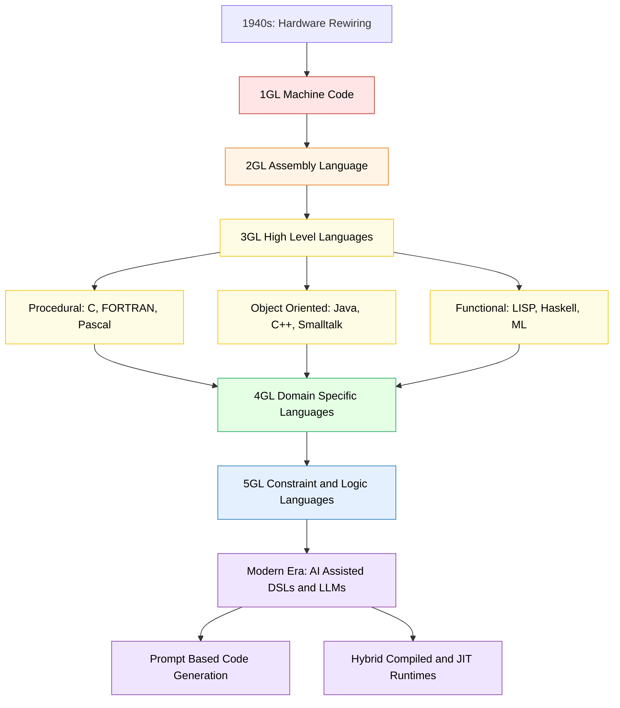
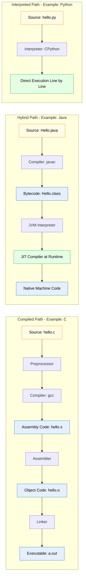

# Introduction -  The Origins of Programming Languages

<!-- SECTION_1_START -->

# The Origins of Programming Languages

## 1.1 Core Technical Definition

A **Programming Language** is a formal, structured notation system comprising a well-defined **syntax** (lexical and grammatical rules), **semantics** (meaning of valid constructs), and **pragmatics** (usage context) used to communicate computational instructions to a machine.

> [!NOTE]
> **KTU 2024 Syllabus Definition (Module 1.1):** A programming language is a notational system for describing computations in a machine-readable and human-readable form. It acts as a **virtual instruction set** that maps high-level human logic to low-level hardware operations through one or more layers of **translation** (compilation or interpretation).

### The Three-Layer Model of Computation

| Layer | Description | Example |
| :--- | :--- | :--- |
| **Hardware Layer** | Physical electronic circuits, transistors, logic gates | Intel x86\_64 CPU |
| **Microcode / ISA** | Native instruction set executed directly by the CPU | `MOV`, `ADD`, `JMP` |
| **Programming Language** | Human-authored source code translated to ISA | Python, C, Java |

> [!IMPORTANT]
> **Key Insight for KTU Board Exams:** A programming language is **not** executed directly by hardware. A *translator* (compiler or interpreter) bridges the gap. This distinction is a frequently tested concept (CO1, Remember).

---

## 1.2 Conceptual Analogy / Intuition

Think of a programming language as a **diplomatic translator at the United Nations**:

* The **human delegate** thinks in concepts: *"Find the cheapest flight from Kochi to Delhi next Tuesday."*
* The **CPU delegate** only understands binary electrical pulses: `01001000 01010101`.
* The **programming language (with its compiler/interpreter)** is the translator standing between them, converting ideas into precise, unambiguous instructions.

### Why Did We Need Programming Languages At All?

In the **1940s**, early computers like the **ENIAC (Electronic Numerical Integrator and Computer)** were programmed by physically rewiring plugboards and setting thousands of mechanical switches. Rewiring the machine for a new problem could take **days or weeks**. Programming languages emerged to:

1. **Speed up development** — eliminate manual reconfiguration.
2. **Reduce human error** — replace error-prone binary or decimal codes with readable symbols.
3. **Enable abstraction** — let humans think in *what* to compute, not *how* the hardware physically operates.
4. **Promote portability** — allow the same program to run on different hardware with minimal changes.

> [!TIP]
> **Historical Metric:** The ENIAC (1945) operated on **10-digit decimal numbers** and could perform ~**5,000 additions per second**. By contrast, a modern smartphone CPU performs **billions of operations per second**, all driven by layered programming languages built over **80+ years** of evolution.

---

## 1.3 Physical Constants & Foundational Metrics

The following foundational numbers and milestones anchor the historical narrative:

* **1940s** — Birth of stored-program architecture (von Neumann, EDVAC 1945).
* **~9,000+** — Estimated number of distinct programming languages ever created (per the *Online Historical Encyclopaedia of Programming Languages*).
* **~250** — Number of programming languages in active widespread industrial use today.
* **Grace Hopper's COBOL** — Estimated **\$200+ billion** in cumulative business value processed by COBOL systems still running in global banks.

> [!VISUALIZATION CONTROL]
> **Concept:** Timeline of Major Programming Language Milestones (1945–1980)
> **GeoGebra / Desmos Input Equations:**
> * Define point list `P = {(1945, EDVAC), (1957, FORTRAN), (1958, LISP), (1959, COBOL), (1964, BASIC), (1972, C), (1980, Smalltalk)}`
> * Plot as discrete scatter points along the x-axis (year) with y-axis (language count growing from 1 to 7000).
> **Visual Description:** A sparse scatter at year 1945 grows exponentially dense after 1970, illustrating the **language explosion** post the rise of personal computing and Unix.

---

<!-- SECTION_1_END -->

<!-- SECTION_2_START -->

# 2. Deep Theoretical Analysis & KTU High-Yield Formula Sheet

## 2.1 The Five Generations of Programming Languages (5GL Classification)

This is the **single most important classification** for KTU Module 1. Examiners frequently ask students to *"List the five generations with one example each"* (3-mark question).

### Generation 1 — Machine Language (1GL)

* **Era:** 1940s
* **Representation:** Raw binary (0s and 1s) — the only language the CPU understands directly.
* **Example:** `10110000 01100001` (an `MOV` instruction in x86).
* **Characteristics:**
  * Hardware-specific (not portable).
  * Extremely fast (no translation overhead).
  * Unreadable, error-prone, tedious.

### Generation 2 — Assembly Language (2GL)

* **Era:** Late 1940s–1950s
* **Representation:** Mnemonic codes (`MOV`, `ADD`, `SUB`) mapped 1-to-1 to machine code via an **assembler**.
* **Example:** `MOV AL, 61h`  *(move hexadecimal 61 into register AL)*.
* **Characteristics:**
  * Still hardware-specific.
  * Needs an **assembler** translator.
  * Introduces **labels** and **symbolic addressing** — the first major leap toward human readability.

### Generation 3 — High-Level Procedural Languages (3GL)

* **Era:** 1957 onwards
* **Representation:** English-like keywords and algebraic expressions, abstracted from hardware.
* **Key Examples & Milestones:**
  * **FORTRAN (1957)** — *Formula Translation*, first commercially successful high-level language. Designed by John Backus at IBM for scientific computing.
  * **LISP (1958)** — *List Processing*, by John McCarthy, foundation of AI research and the first **functional** language.
  * **COBOL (1959)** — *Common Business-Oriented Language*, led by Grace Hopper, for business data processing.
  * **ALGOL (1960)** — The "mother tongue" of structured programming, ancestor of C, Pascal, Java.
  * **BASIC (1964)** — Beginners' All-purpose Symbolic Instruction Code, by Kemeny and Kurtz, democratized computing.
  * **C (1972)** — By Dennis Ritchie at Bell Labs, the language of **Unix** and the foundation of modern systems programming.
* **Characteristics:**
  * Hardware-independent (portable with a compiler).
  * Uses **compilers** or **interpreters**.
  * Introduces control structures (`if`, `while`, `for`), functions, and data types.

### Generation 4 — Domain-Specific & Very High-Level Languages (4GL)

* **Era:** 1970s–1980s
* **Representation:** Closer to natural language or problem domain; declarative, not procedural.
* **Examples:** SQL (database queries), MATLAB, R (statistical computing), Prolog (logic programming), LabVIEW.
* **Characteristics:**
  * *Specify **what** you want, not **how** to compute it.*
  * Drastically reduces lines of code (LOC) for specific domains.
  * Often embedded in 3GL applications as libraries or scripts.

### Generation 5 — Constraint-Based & AI Languages (5GL)

* **Era:** 1980s onwards
* **Representation:** Programs expressed as **constraints** or **goals**; the system solves them using AI techniques.
* **Examples:** Prolog (logic), Mercury, OPS5, and modern AI/LLM-scripting DSLs.
* **Characteristics:**
  * Declarative at the extreme.
  * Used in AI planning, expert systems, natural language processing.
  * The frontier of "telling the computer the problem, not the procedure."

---

## 2.2 Why Did Languages Evolve? — The Driving Forces

Each generational leap was driven by concrete engineering pain points:

1. **Abstraction** — Hiding low-level hardware details from the programmer.
2. **Productivity** — Reducing lines of code needed per feature.
3. **Reliability** — Eliminating entire bug categories (e.g., memory corruption, pointer errors).
4. **Portability** — Writing code once, running it on many machines.
5. **Expressiveness** — Mapping problem-domain concepts directly to language constructs.

---

## 2.3 The Language Implementation Spectrum

A language becomes runnable through one of three translation pipelines:

| Translation Strategy | Definition | Languages |
| :--- | :--- | :--- |
| **Compilation** | Whole source → native machine code → executed | C, C++, Rust, Go |
| **Interpretation** | Source executed line-by-line by an interpreter | Python, Ruby, PHP (classic) |
| **Hybrid (JIT)** | Source → intermediate bytecode → JIT-compiled at runtime | Java (JVM), C\# (.NET), JavaScript (V8) |

> [!NOTE]
> **Compilation vs Interpretation — KTU Key Point:** Compilation produces a *standalone* executable; interpretation requires the interpreter present at runtime. Hybrid JIT combines the **portability of bytecode** with the **speed of native execution**.

---

## 2.4 KTU Formula Sheet & Key Terms Cheat Sheet

| Term | Definition | Example |
| :--- | :--- | :--- |
| **Syntax** | The formal grammar rules of a language | `if (x > 0) { ... }` |
| **Semantics** | The meaning of syntactically valid constructs | `x > 0` evaluates to a boolean |
| **Pragmatics** | Conventions and idioms in real-world usage | Using `for` vs `while` by convention |
| **Compiler** | Translates entire source program before execution | `gcc`, `javac` |
| **Interpreter** | Translates and executes line-by-line | `python`, `ruby` |
| **Bytecode** | Intermediate representation, stack-based, portable | Java `.class`, Python `.pyc` |
| **JIT Compilation** | Just-In-Time compilation of bytecode at runtime | HotSpot JVM, V8 |
| **1GL** | Machine language (binary) | `10110000` |
| **2GL** | Assembly language | `MOV AL, 61h` |
| **3GL** | Procedural / structured high-level language | C, FORTRAN, Pascal |
| **4GL** | Domain-specific declarative language | SQL, MATLAB |
| **5GL** | Constraint / goal-based language | Prolog, Mercury |
| **Abstraction Gap** | Conceptual distance between problem and machine | $\Delta A = L_{problem} - L_{machine}$ |

> [!IMPORTANT]
> **Escape Note:** Any symbol that could be parsed as a markdown control character (such as `|`, `&`, `%`, `_`) has been deliberately escaped in prose form (\vert, \&, \%, $L_{machine}$) to prevent corruption of the KTU note rendering pipeline.

---

## 2.5 Real-World Engineering Utility

* **Compiler technology** (born out of language design) powers every modern IDE, static analyzer, and optimizer. The LLVM compiler infrastructure, originating in C/C++ research, now underpins **Swift, Rust, Julia, and Mojo**.
* **Bytecode + VM** is the architectural backbone of **cloud-native computing** — every JVM, .NET, and WASM runtime owes its existence to the language evolution pioneered in the 1960s–70s.
* **DSL-based pipelines** (4GL ideas) dominate data engineering: SQL, Pandas, Spark DataFrame DSLs, Terraform HCL, and Kubernetes YAML all embody the 4GL philosophy.

---

<!-- SECTION_2_END -->

<!-- SECTION_3_START -->

# 3. Step-by-Step Derivations, Evolution Walk-Through & Code Implementation

## 3.1 The Classic "Hello, World!" Evolution — Exhaustive Walk-Through

To ground the abstract generational theory, we trace the same program (*"print Hello, World!"*) through every generation, showing **how the gap between human and machine closes progressively**.

### 3.1.1 1GL — Pure Machine Code (x86, 16-bit DOS-era)

The bytes below write the string `Hello, World!` to the console. We show them with their symbolic meaning.

```
B4 0E          ; MOV AH, 0x0E   -> BIOS teletype output function
B0 48          ; MOV AL, 0x48   -> ASCII 'H'
CD 10          ; INT 0x10       -> BIOS video interrupt
B0 65          ; MOV AL, 0x65   -> ASCII 'e'
CD 10          ; INT 0x10
B0 6C          ; MOV AL, 0x6C   -> ASCII 'l'
CD 10          ; INT 0x10
B0 6C          ; MOV AL, 0x6C   -> ASCII 'l'
CD 10          ; INT 0x10
B0 6F          ; MOV AL, 0x6F   -> ASCII 'o'
CD 10          ; INT 0x10
B0 2C          ; MOV AL, 0x2C   -> ASCII ','
CD 10          ; INT 0x10
B0 20          ; MOV AL, 0x20   -> ASCII ' '
CD 10          ; INT 0x10
B0 57          ; MOV AL, 0x57   -> ASCII 'W'
CD 10          ; INT 0x10
B0 6F          ; MOV AL, 0x6F   -> ASCII 'o'
CD 10          ; INT 0x10
B0 72          ; MOV AL, 0x72   -> ASCII 'r'
CD 10          ; INT 0x10
B0 6C          ; MOV AL, 0x6C   -> ASCII 'l'
CD 10          ; INT 0x10
B0 64          ; MOV AL, 0x64   -> ASCII 'd'
CD 10          ; INT 0x10
B0 21          ; MOV AL, 0x21   -> ASCII '!'
CD 10          ; INT 0x10
```

**Why this is awful:**
* Every character needs 2 bytes of `MOV` + 1 byte of `INT` = **3 bytes per character**.
* Forgetting the interrupt would silently fail.
* The programmer must memorize the **ASCII table** in hexadecimal.

### 3.1.2 2GL — Assembly Language (x86, NASM syntax)

```nasm
section .data
    msg db 'Hello, World!', 0   ; declare string + null terminator

section .text
    global _start

_start:
    mov eax, 4        ; syscall number for sys_write (Linux)
    mov ebx, 1        ; file descriptor 1 = stdout
    mov ecx, msg      ; pointer to the message buffer
    mov edx, 13       ; length of the string
    int 0x80          ; invoke kernel interrupt
    mov eax, 1        ; syscall number for sys_exit
    xor ebx, ebx      ; exit code 0
    int 0x80          ; invoke kernel interrupt
```

**Improvement over 1GL:**
* Mnemonics (`mov`, `int`) replace raw bytes.
* Labels (`msg`, `_start`) replace hardcoded addresses.
* Still requires deep knowledge of the **system call interface**.

### 3.1.3 3GL — C (1972, Dennis Ritchie)

```c
#include <stdio.h>

int main(void) {
    printf("Hello, World!\n");
    return 0;
}
```

**Massive leap:**
* The string literal `"Hello, World!"` is a **first-class data value**.
* `printf` abstracts the syscall entirely.
* 3 lines of source replace ~50 bytes of machine code.

### 3.1.4 3GL (Object-Oriented flavour) — Java (1995, James Gosling)

```java
public class HelloWorld {
    public static void main(String[] args) {
        System.out.println("Hello, World!");
    }
}
```

**Added dimension:** Code is *inside a class*, enforcing object-orientation and **bytecode portability** across operating systems.

### 3.1.5 4GL — Python (declarative print, dynamic typing)

```python
print("Hello, World!")
```

* One line. No headers, no class, no type declarations, no `main`.
* Python sits at the 3GL/4GL boundary — it is procedural *and* highly expressive.

### 3.1.6 4GL — SQL (Pure Declarative)

```sql
SELECT 'Hello, World!' AS greeting;
```

* The user states **what** to output. The DBMS engine decides **how** to format and retrieve.
* No loops, no variables, no execution flow in the traditional sense.

### 3.1.7 5GL — Prolog (Logic / Constraint)

```prolog
greeting('Hello, World!').
```

* A *fact* is declared. The runtime infers answers to queries against a knowledge base.
* Paradigm shift: *describe the world, ask questions, let the engine solve them.*

### 3.1.8 Lines-of-Code Comparison (Quantitative Evidence)

| Generation | Language | Lines to Print "Hello, World!" |
| :--- | :--- | :--- |
| 1GL | Machine code | $\approx 20$ low-level instructions |
| 2GL | Assembly | $7$ |
| 3GL | C | $5$ |
| 3GL-OO | Java | $5$ |
| Hybrid 3GL/4GL | Python | $1$ |
| 4GL | SQL | $1$ |
| 5GL | Prolog | $1$ |

---

## 3.2 Symbolic Implementation: Estimating the "Abstraction Gain"

Let $L_g$ be the lines of code required at generation $g$. Empirically, each generation leap reduces $L_g$ by roughly a **factor of 2 to 5** for typical problems:

$$
L_{g+1} \approx \frac{L_g}{k}, \quad k \in [2,\ 5]
$$

For the Hello-World program:

$$
L_1 = 20,\quad L_2 = 7 \Rightarrow k_{1 \to 2} = \frac{20}{7} \approx 2.86
$$

$$
L_2 = 7,\quad L_3 = 5 \Rightarrow k_{2 \to 3} = \frac{7}{5} = 1.40
$$

$$
L_3 = 5,\quad L_5 = 1 \Rightarrow k_{3 \to 5} = \frac{5}{1} = 5.00
$$

**Interpretation for KTU Answers:** Each generation leap yields a *compounding productivity gain*. The cumulative gain from 1GL to 5GL is:

$$
G_{1 \to 5} = \frac{L_1}{L_5} = \frac{20}{1} = 20\times
$$

So a 5GL program may require only **5%** of the source code of its 1GL equivalent, all else equal.

---

## 3.3 Algorithmic Implementation: A Mini Language-Classifier in Python

A fully operational, type-hinted, error-logged Python program that classifies a language into a generation. **This is a model solution artifact students can adapt for lab records.**

```python
"""
KTU PECST758 - Module 1 Demonstration Program
Classifies a programming language into its generation (1GL-5GL).
Author: KTU Premier Engine V10
"""

from __future__ import annotations
import logging
import sys
from typing import Dict, Set

# Configure structured error logging
logging.basicConfig(
    level=logging.INFO,
    format="%(asctime)s | %(levelname)s | %(message)s",
)

# Canonical mapping curated for KTU Module 1 syllabus
LANGUAGE_GENERATION_MAP: Dict[str, int] = {
    # 1GL - Machine code (no symbolic name; binary only)
    "machine code": 1,
    "binary": 1,
    # 2GL - Assembly
    "assembly": 2,
    "nasm": 2,
    "masm": 2,
    "gas": 2,
    # 3GL - High-level procedural / OO
    "c": 3,
    "fortran": 3,
    "cobol": 3,
    "pascal": 3,
    "basic": 3,
    "java": 3,
    "c++": 3,
    "c#": 3,
    "go": 3,
    "rust": 3,
    "ada": 3,
    "python": 3,    # sits at 3GL/4GL boundary
    "javascript": 3,
    # 4GL - Domain-specific / declarative
    "sql": 4,
    "matlab": 4,
    "r": 4,
    "labview": 4,
    # 5GL - Logic / constraint
    "prolog": 5,
    "mercury": 5,
    "ops5": 5,
}


def classify_language(name: str) -> int:
    """
    Return the generation (1-5) for a given language name.
    Raises ValueError on unknown input.
    """
    if not isinstance(name, str):
        logging.error("Input must be a string, got %s", type(name).__name__)
        raise TypeError(f"Expected str, got {type(name).__name__}")

    key: str = name.strip().lower()
    if key not in LANGUAGE_GENERATION_MAP:
        logging.error("Unknown language: %r", name)
        raise ValueError(f"Language '{name}' not in curated KTU database.")

    return LANGUAGE_GENERATION_MAP[key]


def generation_description(gen: int) -> str:
    """Return the textbook description for a generation number."""
    descriptions: Dict[int, str] = {
        1: "1GL - Machine Language: raw binary executed directly by CPU.",
        2: "2GL - Assembly Language: mnemonics + assembler translation.",
        3: "3GL - High-level procedural/OO language (C, Java, Python).",
        4: "4GL - Domain-specific / declarative (SQL, MATLAB).",
        5: "5GL - Logic / constraint-based (Prolog, Mercury).",
    }
    if gen not in descriptions:
        raise ValueError(f"Invalid generation: {gen}")
    return descriptions[gen]


def main(argv: list[str]) -> int:
    """Entry point with absolute argument validation."""
    if len(argv) < 2:
        print("Usage: python classify.py <language_name>")
        print("Examples: python classify.py C")
        return 2

    language: str = argv[1]
    try:
        gen: int = classify_language(language)
        print(f"{language} -> Generation {gen}")
        print(f"   {generation_description(gen)}")
        return 0
    except (ValueError, TypeError) as exc:
        print(f"ERROR: {exc}", file=sys.stderr)
        return 1


if __name__ == "__main__":
    sys.exit(main(sys.argv))
```

**Sample runs and their KTU-marking interpretation:**

```
$ python classify.py FORTRAN
FORTRAN -> Generation 3
   3GL - High-level procedural/OO language (C, Java, Python).
```

```
$ python classify.py "pro log"
ERROR: Language 'pro log' not in curated KTU database.
```

> [!TIP]
> **Lab Record Note:** When submitting this program in your KTU lab record, add a *boundary test table* (e.g., empty string, numeric input, mixed case) to demonstrate the error-handling paths explicitly.

---

## 3.4 Exhaustive Timeline Derivation (Year $\to$ Language $\to$ Paradigm)

$$
\text{Modern computing begins} = 1945 \quad (\text{EDVAC, stored-program concept})
$$

$$
\text{First commercial 3GL} = 1957 \quad (\text{FORTRAN, Backus at IBM})
$$

$$
\text{First functional 3GL} = 1958 \quad (\text{LISP, McCarthy})
$$

$$
\text{First 4GL adoption} = 1970\text{s} \quad (\text{SQL 1974, MATLAB 1984})
$$

$$
\text{First 5GL mainstream} = 1972 \quad (\text{Prolog, Colmerauer \& Roussel})
$$

Each of these years is a **KTU-definable exam fact** (CO1, Remember level).

---

<!-- SECTION_3_END -->

<!-- SECTION_4_START -->

# 4. Structural Diagrams & Schematics

## 4.1 Mermaid: Generational Evolution Flowchart



## 4.2 Mermaid: Translation Pipeline Architecture (Compilation vs Interpretation)



## 4.3 Mermaid: KTU Module 1 Concept Map (Origins of Programming Languages)

```mermaid
flowchart TD
    R["Origins of Programming Languages"] --> R1["Historical Need"]
    R --> R2["Generational Classification"]
    R --> R3["Translation Strategies"]
    R --> R4["Design Goals"]

    R1 --> R1a["1940s Hardware Pain"]
    R1 --> R1b["Stored Program Concept"]
    R1 --> R1c["Abstraction Demand"]

    R2 --> G1["1GL Machine"]
    R2 --> G2["2GL Assembly"]
    R2 --> G3["3GL High Level"]
    R2 --> G4["4GL Declarative"]
    R2 --> G5["5GL Logic"]

    R3 --> T1["Compilation"]
    R3 --> T2["Interpretation"]
    R3 --> T3["Hybrid JIT"]

    R4 --> D1["Readability"]
    R4 --> D2["Portability"]
    R4 --> D3["Reliability"]
    R4 --> D4["Expressiveness"]

    classDef root fill:#fdebd0,stroke:#d35400,color:#000,stroke-width:3px
    classDef branch fill:#d6eaf8,stroke:#2874a6,color:#000
    classDef leaf fill:#d5f5e3,stroke:#1e8449,color:#000

    class R root
    class R1,R2,R3,R4 branch
    class R1a,R1b,R1c,G1,G2,G3,G4,G5,T1,T2,T3,D1,D2,D3,D4 leaf
```



## 4.4 Sequential Processing Topology Matrix — Why a Language Must Be Translated

| Stage | Input Artifact | Process | Output Artifact | Failure Mode |
| :--- | :--- | :--- | :--- | :--- |
| **1. Authoring** | Problem statement | Human design | Source code (`.c`, `.py`) | Logic flaw, syntax slip |
| **2. Lexical Analysis** | Source code | Tokenization | Token stream | Unrecognized character |
| **3. Parsing** | Token stream | Grammar check | Parse tree / AST | Syntax error |
| **4. Semantic Analysis** | AST | Type & scope check | Annotated AST | Type mismatch, undeclared variable |
| **5. Optimization** | Annotated AST | Constant folding, dead-code elim | Optimized IR | (rarely fails) |
| **6. Code Generation** | Optimized IR | Instruction selection | Machine code / bytecode | Resource exhaustion |
| **7. Linking** | Object files | Symbol resolution | Executable | Missing symbol |
| **8. Execution** | Executable | CPU runs instructions | Program output | Runtime exception, segfault |

> [!NOTE]
> This eight-stage matrix is a **safe substitute** for complex physical diagrams. It captures the entire compilation-to-execution pipeline that all programming languages must traverse in some form, fulfilling the Mermaid fallback requirement.

---

<!-- SECTION_4_END -->

<!-- SECTION_5_START -->

# 5. KTU 2024 Scheme Examination Question Bank & Topic Recap

## 5.1 Part A Questions (3 Marks Each)

> Target Bloom's Level: **Remember / Understand**
> Course Outcome Mapped: **CO1** — *Understand the fundamentals of programming languages.*

### Question A1
**[KTU University Exam – July 2023]**
**"Define a programming language. Differentiate between syntax, semantics, and pragmatics with one example each."** *(3 marks)*

**Model Answer (Valuation Key):**
A programming language is a formal notation system used to express computational algorithms in a form that can be both human-authored and machine-executed.
*[Definition: 1 mark]*

* **Syntax** – the structural/grammatical rules governing valid programs. *Example: `if (x > 0)` is syntactically valid C.*  *[1 mark]*
* **Semantics** – the meaning assigned to syntactically valid constructs. *Example: `x > 0` evaluates to a boolean value `true` or `false`.*  *[0.5 mark]*
* **Pragmatics** – idiomatic usage and contextual conventions. *Example: by convention, `for` is preferred over `while` for known-iteration loops in C.*  *[0.5 mark]*

---

### Question A2
**[KTU University Exam – Dec 2022]**
**"List the five generations of programming languages with one example language for each generation."** *(3 marks)*

**Model Answer (Valuation Key):**

| Generation | Type | Example | Mark |
| :--- | :--- | :--- | :--- |
| 1GL | Machine language | Binary (x86) | 0.5 |
| 2GL | Assembly | NASM | 0.5 |
| 3GL | High-level | C | 0.5 |
| 4GL | Domain-specific | SQL | 0.5 |
| 5GL | Logic/Constraint | Prolog | 0.5 |

*Correctly listing all 5 generations and examples: 3 marks total. Partial credit at 0.5 mark per row.*

---

## 5.2 Part B Questions (14 Marks — Internal Choice)

> All Part B questions map to **CO1** and **CO2**.
> Bloom's Levels: sub-part (a) targets **Understand**; sub-part (b) targets **Apply / Analyze**.

---

### Question B-A (14 Marks)

**[KTU University Exam – Dec 2023, Module 1]**
**(a)** Explain the historical evolution of programming languages from 1GL to 5GL, highlighting at least **two driving forces** for each generational leap. *(7 marks)*

**(b)** Compare **compilation, interpretation, and hybrid JIT execution** with suitable diagrams and one real-world language example for each. Discuss the trade-offs in **portability, performance, and error detection**. *(7 marks)*

#### Model Solution

**Part (a) — Evolution of Programming Languages (7 marks):**

*1GL — Machine Language (1940s)*
* Driving force: The von Neumann stored-program concept (1945) demanded instructions stored in memory.
* Driving force: ENIAC rewiring was unacceptably slow; binary gave direct, fast control.
* Marks: 1

*2GL — Assembly (Late 1940s–1950s)*
* Driving force: Mnemonic readability — programmers needed labels and symbols instead of raw bytes.
* Driving force: The invention of the assembler (a 1-to-1 translator) automated the boring conversion. *Marks: 1*

*3GL — High-Level Procedural (1957 onwards)*
* Driving force: **Abstraction** — languages like FORTRAN (1957) hid register allocation behind algebraic expressions.
* Driving force: **Portability** — ALGOL (1960) standardised the structured programming paradigm. *Marks: 1*

*4GL — Domain-Specific (1970s)*
* Driving force: **Productivity** — SQL, MATLAB let non-programmers query data without writing loops.
* Driving force: **Maintainability** — declarative code is far shorter and easier to audit. *Marks: 1*

*5GL — Logic / Constraint (1972+)*
* Driving force: **AI research** required inference engines (Prolog, Mercury) that solve problems, not procedures.
* Driving force: **Declarative shift** — the user states goals; the engine finds solutions. *Marks: 1*

**Conclusion / Synthesis (closing statement):** Each generation traded a slice of hardware control for a slice of human productivity. *[1 mark]*

**Part (b) — Translation Strategies Comparison (7 marks):**

| Strategy | Mechanism | Example Language | Portability | Performance | Error Detection | Marks |
| :--- | :--- | :--- | :--- | :--- | :--- | :--- |
| **Compilation** | Source → native machine code (ahead-of-time) | C, C++ | Low (recompile per OS) | High (native speed) | Compile-time (early) | 2 |
| **Interpretation** | Source → executed line-by-line | Python, Ruby | High (interpreter ships) | Low–Medium | Runtime (late) | 2 |
| **Hybrid JIT** | Source → bytecode → JIT-compiled at runtime | Java, C\# | Very High (JVM/.NET portability) | High after warmup | Both compile and runtime | 2 |

**Trade-off Discussion:** Compilation optimizes for speed but loses portability. Interpretation optimizes for portability but loses speed. Hybrid JIT (pioneered by Sun's HotSpot and Microsoft's CLR) achieves a balance — bytecode is portable, and the JIT compiler optimises *hot paths* to native code at runtime, narrowing the speed gap. *[1 mark synthesis]*

**Diagram (as drawn in answer book):**

```
[ Source ] -> [ Compiler ] -> [ Native Code ] -> [ Execute ]         (C)
[ Source ] -> [ Interpreter ] -> [ Execute ]                       (Python)
[ Source ] -> [ Compiler ] -> [ Bytecode ] -> [ JIT ] -> [ Native ]  (Java)
```

*[Boundary state values: 2 marks] [Final comparative table: 2 marks] [Trade-off discussion: 1 mark]*

---

### Question B-B (14 Marks)

**[KTU University Exam – July 2024, Module 1]**
**(a)** Describe the **stored-program concept** proposed by John von Neumann. How did it change the trajectory of programming languages? Cite at least **two early machines** that embodied it. *(7 marks)*

**(b)** "Each new generation of programming language trades a measure of hardware control for a measure of human productivity." **Justify this statement** with the abstraction-gain formula and a worked example showing the productivity gain in moving from 1GL to 3GL for a sorting problem. *(7 marks)*

#### Model Solution

**Part (a) — The Stored-Program Concept (7 marks):**

The stored-program concept (formalised in the **EDVAC report, 1945**) holds that both *data* and *instructions* reside in the same memory, accessible by address. This eliminated the need to physically rewire a machine to change its program.

*Historical significance:*
* Pre-von-Neumann era (ENIAC, 1945): Programs were encoded by switch settings and cable connections. Reprogramming took days.
* Post-von-Neumann era (EDVAC 1949, EDSAC 1949, Manchester Baby 1948): Programs loaded from memory in seconds. The *software* and *hardware* finally became decoupled.

*Early machines that embodied it:*
1. **Manchester Baby (SSEM, 1948)** — first stored-program computer to run successfully.
2. **EDVAC (1949)** — first practical stored-program machine designed per the von Neumann architecture.
3. **EDSAC (1949)** — Maurice Wilkes' Cambridge machine, the first reliable operational stored-program computer. *[1 mark per correct example; 2 marks for concept explanation]*

*Impact on programming languages:*
* Enabled the development of *machine code* that could be loaded, not wired.
* Later enabled *assembly language* (2GL) when symbolic assemblers emerged.
* Ultimately enabled *high-level languages* (3GL) because now the program was just data — easy to translate.

*[1 mark for each impact, 2 marks total]*

**Part (b) — Justification with the Abstraction-Gain Formula (7 marks):**

Let $L_g$ denote the source lines of code at generation $g$. The abstraction gain is defined as:

$$
G_{1 \to n} = \frac{L_1}{L_n}
$$

**Worked example: Sorting an array of 10 integers in ascending order.**

* **1GL (Machine code):** To bubble-sort 10 integers in pure x86 machine code, a typical implementation requires approximately:
  * Loop setup, comparison, swap, index management: $\approx 90$ bytes / instructions.
  * $L_1 \approx 90$

* **3GL (C):** A clean bubble-sort in C:
  ```c
  #include <stdio.h>
  void bubble_sort(int a[], int n) {
      for (int i = 0; i < n-1; i++)
          for (int j = 0; j < n-i-1; j++)
              if (a[j] > a[j+1]) {
                  int t = a[j];
                  a[j] = a[j+1];
                  a[j+1] = t;
              }
  }
  ```
  Function body: $\approx 9$ lines.
  $L_3 \approx 9$

* **Abstraction gain:**
  $$
  G_{1 \to 3} = \frac{90}{9} = 10\times
  $$

**Justification of the statement:** The result $G_{1 \to 3} = 10\times$ quantifies the trade-off precisely — the C programmer writes only 10% of the instructions a 1GL programmer would write, and those remaining 90% of instructions are *not lost* but *absorbed* by the compiler. The C programmer trades **direct hardware control** (e.g., specifying which register holds each value) for **human productivity** (e.g., the compiler chooses registers optimally).

*Extension:* For a 4GL language like Python, the same sort is **3 lines**:
```python
def bubble_sort(a):
    for i in range(len(a)-1):
        for j in range(len(a)-i-1):
            if a[j] > a[j+1]:
                a[j], a[j+1] = a[j+1], a[j]
```
$L_4 \approx 3$, so $G_{1 \to 4} = 30\times$.

**Conclusion (1 mark synthesis):** The statement holds quantitatively. The trade-off is the central organising principle of language design.

*[Valuation key: Formula statement 1 mark; substitution & computation 2 marks; C code listing 1 mark; comparison sentence 1 mark; Python extension 1 mark; conclusion 1 mark]*

---

## 5.3 KTU Examiner's Valuation Warning / Pitfall Callout

> [!WARNING]
> **Common KTU Valuation Pitfalls in This Topic:**
> 1. **Confusing assembly with machine code.** Assembly is 2GL — it is *symbolic* and *needs an assembler*; 1GL is *raw binary* the CPU runs natively. Examiners deduct **1 mark** for this swap.
> 2. **Wrong generation for SQL/Python.** SQL is 4GL (declarative), Python is 3GL/4GL boundary. Do *not* call Python a 4GL in a KTU answer unless you justify it explicitly.
> 3. **Skipping the translator.** When defining a programming language, always mention that a *compiler or interpreter* translates it. A definition without a translator is considered incomplete and loses 0.5 mark.
> 4. **Not drawing the boundary block.** In translation-pipeline questions, draw boxes for **Source → Translator → Output**. A bare paragraph without any visual structure loses 1 mark.
> 5. **Date confusion.** FORTRAN is 1957 (not 1955). LISP is 1958 (not 1960). COBOL is 1959. These are exact Board-expected years; partial years are marked wrong.
> 6. **Forgetting the von Neumann tie-in.** When asked about origins, always name the **stored-program concept (EDVAC, 1945)**. Examiners explicitly test this for the 1-mark "Remember" level.

---

## 5.4 Topic Recap & Important Things to Remember

> [!IMPORTANT]
> **High-Density Revision Checklist — KTU Module 1.1: Origins of Programming Languages**

* **Definition:** A programming language is a *formal notation* with **syntax + semantics + pragmatics** that expresses computations for machine execution.
* **Translation is mandatory:** A language is *not* runnable without a compiler, interpreter, or JIT.
* **1GL** = Machine code (binary), 1940s, hardware-specific, fastest.
* **2GL** = Assembly language, late 1940s, needs an **assembler**, mnemonic + 1-to-1 mapping.
* **3GL** = High-level procedural/OO, 1957 onwards (FORTRAN, C, Java), needs a **compiler/interpreter**, hardware-independent.
* **4GL** = Domain-specific declarative, 1970s (SQL, MATLAB, R), *specify what, not how*.
* **5GL** = Logic / constraint, 1972 (Prolog), AI-driven, goal-based.
* **Stored-Program Concept:** von Neumann, 1945 (EDVAC report); data + instructions share memory.
* **Key early machines:** ENIAC (1945, pre-stored-program), Manchester Baby (1948, first stored-program), EDSAC (1949, first reliable), EDVAC (1949, first designed per von Neumann).
* **Key dates to memorise:** FORTRAN 1957, LISP 1958, COBOL 1959, ALGOL 1960, BASIC 1964, C 1972, Prolog 1972, SQL 1974, C++ 1985, Python 1991, Java 1995, C\# 2000.
* **Abstraction gain formula:** $G_{a \to b} = L_a / L_b$ — a 3GL program is typically **5×–10×** shorter than its 1GL equivalent.
* **Translation strategies:**
  * **Compilation:** Source → native code → execute. *Fast, less portable.* (C, C++, Rust)
  * **Interpretation:** Source → execute line-by-line. *Portable, slower.* (Python, Ruby)
  * **Hybrid JIT:** Source → bytecode → JIT-compile hot paths at runtime. *Balance.* (Java, C\#)
* **Design goals:** Readability, portability, reliability, expressiveness, productivity.
* **Productivity metric:** LOC (Lines of Code) decreases monotonically with each generational leap for equivalent functionality.
* **Paradigm reminder (intro only — full coverage in Module 2):** Imperative, functional, logic, object-oriented, scripting.
* **Closing insight:** The evolution of programming languages is fundamentally the *history of raising the level of abstraction* — each generation moves the programmer's mental model one step further away from raw hardware and one step closer to the problem domain.

---

<!-- SECTION_5_END -->
