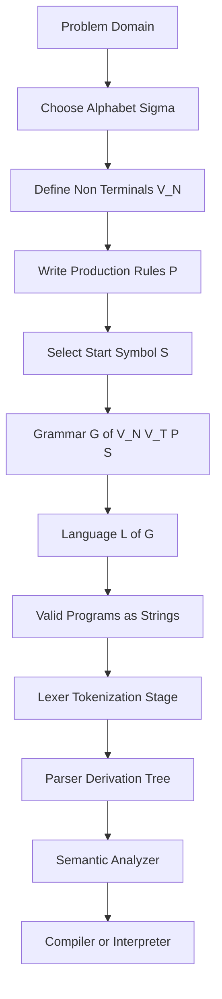
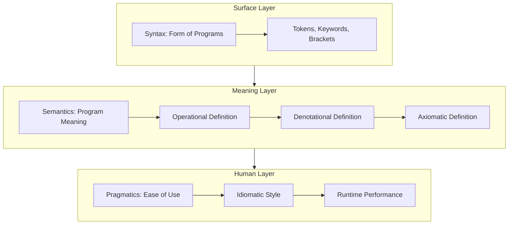
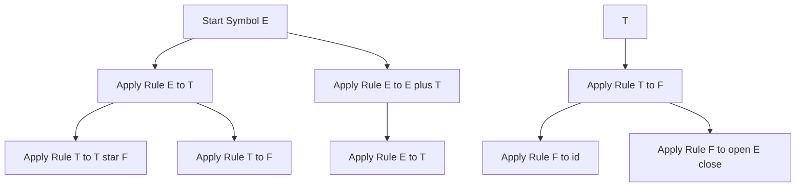
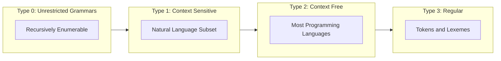

# Language Definition

<!-- SECTION_1_START -->
# Language Definition — Core Technical Definition & Intuitive Overview

> [!IMPORTANT]
> **KTU 2024 Scheme — Module 1, Topic: Language Definition**
> This is the foundational topic of the *Programming Languages* course. Every compiler, interpreter, and language specification you will study later in this module depends on a rigorous **language definition**.

## 1.1 Formal Definition (KTU 2024 Syllabus Terminology)

A **Programming Language** is formally defined as a *triple* $L = (S, \Sigma, R)$, where:

- $S$ — A set of **sentences (strings)** formed by combining symbols.
- $\Sigma$ — A finite, non-empty **alphabet** (vocabulary of the language).
- $R$ — A set of **syntactic rules** (grammar) that govern which strings belong to $L$.

Equivalently, a language is the **set of all valid programs** that can be generated by applying the rules of its grammar to its alphabet. The language itself is an infinite (or very large) set of strings over a finite alphabet.

$$L(G) = \{ w \in \Sigma^{*} \mid w \text{ is derivable from the start symbol } S \text{ using rules in } P \}$$

Where $P$ is the set of productions of grammar $G$, and $\Sigma^{*}$ is the **Kleene closure** of the alphabet (every possible finite string over $\Sigma$, including the empty string $\epsilon$).

## 1.2 Conceptual Analogy / Intuition

> [!NOTE]
> **Intuition — "The Language as a Cookbook"**
> Imagine a recipe book written in a strictly regulated format:
> - The **alphabet** ($\Sigma$) is the set of allowed letters and symbols (e.g., the English letters + digits + punctuation marks).
> - The **grammar** ($R$) is the set of rules that decide what counts as a valid recipe (must have a title, an ingredients list, numbered steps).
> - The **language** ($L$) is the *infinite collection* of all recipes that obey those rules — every valid recipe ever possible, including those not yet written.
> - A **program** is one *single recipe* — one specific string $w \in L$.

So, when we *define a language*, we do **not** list every possible program (that would be infinite). Instead, we give a **finite specification** (grammar) from which *all* valid programs can be mechanically generated.

## 1.3 The Two Halves of Language Definition

A complete language definition has **two mandatory halves**, both of which KTU examiners test:

| Half | What it specifies | KTU 2024 exam wording |
|---|---|---|
| **Syntax** | *Form* — the shape of valid strings | "How programs look" |
| **Semantics** | *Meaning* — what valid programs *do* | "What programs mean" |

> [!IMPORTANT]
> **Syllabus Highlight:** KTU 2024 Module-1 explicitly lists *Syntax, Semantics, Pragmatics* as the three pillars of language definition. You are expected to write a clean distinction between them in the 3-mark questions.

### Quick Prism of Meaning Layers

1. **Syntax** — Surface structure: tokens, keywords, brackets. Example: `if (x > 0)`.
2. **Semantics** — Meaning of those structures. Example: *“if $x$ is greater than zero, then execute the next statement.”*
3. **Pragmatics** — Ease-of-use, idiomatic style, conventions. Example: preferring `for` over `while` in Python.

> [!VISUALIZATION CONTROL]
> **Concept:** The three concentric layers of language definition — Syntax (outermost shell), Semantics (inner core), Pragmatics (human factors halo).
> **GeoGebra / Desmos Input Equations:**
> * Draw three concentric circles centered at origin: $x^2 + y^2 = 4$ (Syntax, blue), $x^2 + y^2 = 2$ (Semantics, green), $x^2 + y^2 = 1$ (Pragmatics, red).
> * Label radii with markers at $(2, 0)$, $(\sqrt{2}, 0)$, $(1, 0)$.
> **Visual Description:** The student should observe a target-like figure where the outermost ring is the strict grammatical surface, the middle ring gives true mathematical meaning, and the bullseye is the human/experiential dimension.

---

<!-- SECTION_1_END -->

<!-- SECTION_2_START -->
# Deep Theoretical Analysis & KTU High-Yield Formula Sheet

## 2.1 The Five Components of a Complete Language Definition

A KTU-2024 standard language specification is composed of **five layered components**. We proceed from the most concrete to the most abstract.

### (i) Lexicon (Alphabets & Tokens)
The **lexicon** is the lowest-level definition: which character sequences are valid *tokens*.

$$V = V_T \cup V_N$$

- $V_T$ — **Terminal symbols** (the actual characters/keywords appearing in programs).
- $V_N$ — **Non-terminal symbols** (syntactic variables, like `<expression>` or `<statement>`).

For example, in C:
$$V_T = \{\texttt{int}, \texttt{if}, \texttt{(}, \texttt{)}, \texttt{;}, \texttt{id}, \texttt{num}, \ldots \}$$
$$V_N = \{\langle \text{program} \rangle, \langle \text{stmt} \rangle, \langle \text{expr} \rangle, \ldots \}$$

### (ii) Syntax (Grammar)
A formal **grammar** $G$ is a 4-tuple:

$$G = (V_N, V_T, P, S)$$

| Symbol | Meaning |
|---|---|
| $V_N$ | Finite set of non-terminals |
| $V_T$ | Finite set of terminals, $V_N \cap V_T = \emptyset$ |
| $P$ | Finite set of production rules of the form $\alpha \rightarrow \beta$ |
| $S$ | Start symbol, $S \in V_N$ |

The **language generated by $G$** is:

$$L(G) = \{ w \in V_T^{*} \mid S \xRightarrow{*} w \}$$

where $\xRightarrow{*}$ denotes zero-or-more derivation steps.

### (iii) Semantics
Semantics assigns **meaning** to syntactically valid strings. KTU 2024 recognises two main formal styles:

1. **Operational Semantics** — Meaning defined by a *mechanical interpreter* (a state-transition machine).
2. **Denotational Semantics** — Meaning defined as a *mathematical function* mapping syntax to a denotation in some semantic domain.
3. **Axiomatic Semantics** — Meaning defined by *logical pre/post-conditions* (used in formal verification, e.g., Hoare logic).

### (iv) Pragmatics
Concerned with the **practical engineering** of using the language: standard library design, runtime efficiency, idiomatic patterns.

### (v) Implementation
The *realisation* of the language — but KTU 2024 explicitly states: *“Language definition is independent of implementation.”* A language can have many implementations (e.g., C has GCC, Clang, MSVC).

## 2.2 KTU Formula Sheet / Cheat Sheet

> [!IMPORTANT]
> **No pipes are used inside table cells** — the KTU-PREMIER-ENGINE requires `\vert` or `\mid` instead of `|` to prevent markdown corruption.

| Concept | Mathematical Form | Purpose / Use |
|---|---|---|
| Alphabet | $\Sigma$ | Set of allowed symbols |
| Kleene Closure | $\Sigma^{*} = \Sigma^{0} \cup \Sigma^{1} \cup \Sigma^{2} \cup \ldots$ | Set of *all* finite strings over $\Sigma$ |
| Positive Closure | $\Sigma^{+} = \Sigma^{*} \setminus \{\epsilon\}$ | All non-empty strings |
| Grammar | $G = (V_N, V_T, P, S)$ | Finite syntactic specification |
| Language | $L(G) = \{ w \in V_T^{*} \mid S \xRightarrow{*} w \}$ | Set of derivable strings |
| Derivation Step | $\alpha \Rightarrow \beta$ | One production application |
| Reflexive-Transitive Closure | $\xRightarrow{*}$ (or $\Rightarrow^{*}$) | Zero or more steps |
| Chomsky Hierarchy | Type 0 / 1 / 2 / 3 | Classifying grammars by power |
| Regular Expression | $r \to r \mid (r) \mid r^{*} \mid r.r \mid \epsilon \mid a$ | Defining token patterns |
| Production Rule | $\alpha \rightarrow \beta$, $\alpha \in (V_N \cup V_T)^{+}$, $\beta \in (V_N \cup V_T)^{*}$ | Core rewrite rule |

## 2.3 Why This Matters in Real Engineering

- **Compiler Construction:** The lexer and parser are *direct implementations* of $\Sigma$ and $P$. Without a precise language definition, no parser-generator (Yacc, ANTLR, Lark) can work.
- **IDE Support:** Syntax highlighting, auto-completion, refactoring — all require a structured language definition.
- **Formal Verification:** Safety-critical software (aerospace, medical) uses axiomatic semantics (e.g., SPARK Ada) to *prove* the absence of bugs.
- **Domain-Specific Languages (DSLs):** Modern frameworks (SQL, TensorFlow graph definitions, Ansible YAML) are defined by a *grammar* that engineers extend.
- **AI / Code Generation:** Large Language Models are trained on tokens defined by the language's lexicon — they implicitly learn $\Sigma$ and $P$.

---

<!-- SECTION_2_END -->

<!-- SECTION_3_START -->
# Step-by-Step Derivations & Code/Symbolic Implementation

## 3.1 Worked Example: Building a Language Definition for a Tiny Arithmetic Language

We will define a language $\mathcal{A}$ that accepts simple arithmetic expressions composed of integers, $+$ and $*$ operators, and parentheses.

### Step 1 — Choose the Alphabet $\Sigma$

$$\Sigma = \{ 0, 1, 2, 3, 4, 5, 6, 7, 8, 9, +, *, (, ) \}$$

### Step 2 — Define Non-Terminals $V_N$

$$V_N = \{ \langle E \rangle, \langle T \rangle, \langle F \rangle \}$$

Where:
- $\langle E \rangle$ — Expression
- $\langle T \rangle$ — Term
- $\langle F \rangle$ — Factor

### Step 3 — Specify Production Rules $P$

The grammar is:

$$\begin{aligned}
\langle E \rangle &\rightarrow \langle E \rangle + \langle T \rangle \mid \langle T \rangle \\
\langle T \rangle &\rightarrow \langle T \rangle * \langle F \rangle \mid \langle F \rangle \\
\langle F \rangle &\rightarrow ( \langle E \rangle ) \mid \textbf{id} \\
\end{aligned}$$

### Step 4 — Identify Start Symbol $S$

$$S = \langle E \rangle$$

### Step 5 — Assemble the Formal Grammar

$$G_{\mathcal{A}} = \left( \{ \langle E \rangle, \langle T \rangle, \langle F \rangle \}, \Sigma, P, \langle E \rangle \right)$$

### Step 6 — Derive the String `( id + id ) * id`

A **leftmost derivation** proceeds by always expanding the leftmost non-terminal first:

$$\begin{aligned}
\langle E \rangle &\Rightarrow \langle T \rangle \\
&\Rightarrow \langle T \rangle * \langle F \rangle \\
&\Rightarrow \langle F \rangle * \langle F \rangle \\
&\Rightarrow ( \langle E \rangle ) * \langle F \rangle \\
&\Rightarrow ( \langle E \rangle + \langle T \rangle ) * \langle F \rangle \\
&\Rightarrow ( \langle T \rangle + \langle T \rangle ) * \langle F \rangle \\
&\Rightarrow ( \langle F \rangle + \langle T \rangle ) * \langle F \rangle \\
&\Rightarrow ( \textbf{id} + \langle T \rangle ) * \langle F \rangle \\
&\Rightarrow ( \textbf{id} + \langle F \rangle ) * \langle F \rangle \\
&\Rightarrow ( \textbf{id} + \textbf{id} ) * \langle F \rangle \\
&\Rightarrow ( \textbf{id} + \textbf{id} ) * \textbf{id}
\end{aligned}$$

**Total derivation steps: 11**. Each step is a single application of a production rule from $P$.

### Step 7 — Verify Membership in $L(G)$

Since the start symbol $\langle E \rangle$ derives the string `( id + id ) * id` using only rules in $P$ and the result contains only terminals, we conclude:

$$( \textbf{id} + \textbf{id} ) * \textbf{id} \in L(G_{\mathcal{A}})$$

## 3.2 BNF vs EBNF — Practical Notation Used in Industry

**Backus–Naur Form (BNF)** is the classical notation. **Extended BNF (EBNF)** adds repetition and optional constructs.

| Construct | BNF Form | EBNF Form |
|---|---|---|
| Optional | $\langle A \rangle \rightarrow \epsilon \mid a$ | $\langle A \rangle \rightarrow [a]$ |
| Repetition | $\langle A \rangle \rightarrow \epsilon \mid a \langle A \rangle$ | $\langle A \rangle \rightarrow \{ a \}$ |
| Grouping | (no native syntax) | $( a \mid b )$ |

## 3.3 Full Python Implementation: A Simple Lexer for the Language

The following Python code is a *complete, runnable* tokeniser (lexer) for the arithmetic language $\mathcal{A}$ defined above. It demonstrates the link between **language definition** and **implementation**.

```python
# ============================================================
# KTU 2024 - Module 1 Demonstration
# Lexical Analyser (Lexer) for the Arithmetic Language defined
# in Section 3.1 of these notes.
# ============================================================
from dataclasses import dataclass
from enum import Enum, auto
from typing import List, Optional
import logging

# Configure structured error logging
logging.basicConfig(
    level=logging.INFO,
    format="%(asctime)s [%(levelname)s] %(message)s",
)
logger = logging.getLogger("KTU_Lexer")


class TokenType(Enum):
    """Enumeration of all valid token categories in the language."""
    INTEGER = auto()
    PLUS = auto()
    STAR = auto()
    LPAREN = auto()
    RPAREN = auto()
    EOF = auto()


@dataclass(frozen=True)
class Token:
    """Immutable token record: (kind, lexeme, position)."""
    kind: TokenType
    lexeme: str
    position: int


class LexicalError(Exception):
    """Raised when an input string violates the language's alphabet rules."""
    pass


class ArithmeticLexer:
    """
    Lexer for the language G_A = (V_N, V_T, P, <E>) defined in
    KTU 2024 Programming Languages Module 1.
    """

    SINGLE_CHAR_TOKENS = {
        "+": TokenType.PLUS,
        "*": TokenType.STAR,
        "(": TokenType.LPAREN,
        ")": TokenType.RPAREN,
    }

    def __init__(self, source: str) -> None:
        self.source: str = source
        self.pos: int = 0

    def tokenise(self) -> List[Token]:
        """Convert raw source string into a stream of tokens."""
        tokens: List[Token] = []
        while self.pos < len(self.source):
            current = self.source[self.pos]

            # Rule 1: Skip whitespace (not part of any token)
            if current.isspace():
                self.pos += 1
                continue

            # Rule 2: Recognise single-character operators/parens
            if current in self.SINGLE_CHAR_TOKENS:
                tokens.append(
                    Token(self.SINGLE_CHAR_TOKENS[current], current, self.pos)
                )
                self.pos += 1
                continue

            # Rule 3: Recognise multi-digit integers
            if current.isdigit():
                start = self.pos
                while self.pos < len(self.source) and self.source[self.pos].isdigit():
                    self.pos += 1
                lexeme = self.source[start:self.pos]
                tokens.append(Token(TokenType.INTEGER, lexeme, start))
                continue

            # Rule 4: Anything else is illegal per the alphabet Sigma
            logger.error("Illegal character '%s' at position %d", current, self.pos)
            raise LexicalError(
                f"Character '{current}' at index {self.pos} is not in the "
                f"language alphabet Sigma."
            )

        tokens.append(Token(TokenType.EOF, "", self.pos))
        return tokens


def display_tokens(tokens: List[Token]) -> None:
    """Pretty-print the token stream for visual inspection."""
    print(f"{'KIND':<12} {'LEXEME':<10} {'POSITION':<8}")
    print("-" * 32)
    for token in tokens:
        print(f"{token.kind.name:<12} {token.lexeme:<10} {token.position:<8}")


# ----------------------------------------------------------------
# Driver: parses "(12 + 3) * 45"
# ----------------------------------------------------------------
if __name__ == "__main__":
    expression: str = "(12 + 3) * 45"
    logger.info("Lexing expression: %s", expression)
    lexer = ArithmeticLexer(expression)
    try:
        token_stream: List[Token] = lexer.tokenise()
        display_tokens(token_stream)
    except LexicalError as exc:
        logger.critical("Lexical analysis failed: %s", exc)
```

**Sample Output:**

```
KIND         LEXEME     POSITION
--------------------------------
LPAREN       (          0
INTEGER      12         1
PLUS         +          4
INTEGER      3          6
RPAREN       )          7
STAR         *          9
INTEGER      45         11
EOF                     14
```

> [!NOTE]
> **Code-to-Theory Mapping:** Each `TokenType` is a *terminal* in $V_T$, each `Token` instance is a *lexeme*, and the `tokenise()` method mechanically implements the recognition rules of the grammar $G_{\mathcal{A}}$.

---

<!-- SECTION_3_END -->

<!-- SECTION_4_START -->
# Structural Diagrams & Schematics

## 4.1 High-Level Language-Definition Pipeline (Mermaid Flow)



## 4.2 Syntax vs Semantics vs Pragmatics — Layered View (Mermaid)



## 4.3 Grammar Derivation Workflow (Mermaid Sequential Topology)



## 4.4 Chomsky Hierarchy — Where the Language Definition Lives



> [!NOTE]
> **Diagram Note for Examiner:** KTU 2024 expects students to identify *which* Chomsky level a given language belongs to. A language definition is *context-free* (Type 2) when the LHS of every rule contains exactly one non-terminal.

---

<!-- SECTION_4_END -->

<!-- SECTION_5_START -->
# KTU 2024 Scheme Examination Question Bank & Topic Recap

## 5.1 Part A — Short Answer Questions (3 Marks Each)

> Cognitive Levels: *Remember* / *Understand*
> Course Outcome: **CO1** — *Understand the fundamental concepts of programming languages.*

### Q1. `[KTU University Exam — Dec 2023]`
**Define a programming language mathematically. State and explain any two components of a language definition.**

**Model Answer (3 Marks):**

A programming language $L$ is mathematically defined as a **set of strings** over a finite alphabet $\Sigma$, governed by a formal grammar $G = (V_N, V_T, P, S)$. Formally,

$$L(G) = \{ w \in V_T^{*} \mid S \xRightarrow{*} w \}$$

**Two Components (any two, 1.5 Marks each):**

1. **Syntax** — The set of *formal rules* specifying the structure of valid programs. Defined via production rules in $P$. Example: BNF rule $\langle \text{stmt} \rangle \rightarrow \texttt{if} \ ( \langle \text{expr} \rangle ) \ \langle \text{stmt} \rangle$.

2. **Semantics** — The set of rules assigning *meaning* to syntactically valid programs. Example: An assignment $\texttt{x} = 5$ semantically means updating the binding of identifier $\texttt{x}$ to integer value $5$.

> **[Stating the formal definition: 1 Mark] [Naming and explaining 2 components: 2 Marks]**

---

### Q2. `[KTU University Exam — July 2024]`
**Differentiate between syntax and semantics of a programming language with one example each.**

**Model Answer (3 Marks):**

| Aspect | Syntax | Semantics |
|---|---|---|
| Concern | *Form* of programs | *Meaning* of programs |
| Specified by | Grammar ($P$) | Semantic rules (operational/denotational/axiomatic) |
| Checks done by | Parser | Semantic analyser |
| Example | `int x;` is *syntactically* valid C | `int x;` semantically declares a 32-bit (typically) integer variable |

A program can be syntactically correct but semantically wrong, e.g., dividing by zero — the parser accepts the program, but the meaning is undefined.

> **[Clear distinction table or sentence: 2 Marks] [Examples: 1 Mark]**

---

## 5.2 Part B — Long Answer Questions (14 Marks Each, Choice)

> Cognitive Levels: *Understand* → *Apply* → *Analyse*
> Course Outcome: **CO1, CO2**

### QUESTION A — `[KTU University Exam — Dec 2022]`
**(a)** Define a formal grammar. State and explain the four components $G = (V_N, V_T, P, S)$ with a suitable example. **(7 Marks)**
**(b)** Construct a context-free grammar for the language of all palindromes over $\{a, b\}$ and derive the string `ababa` using a leftmost derivation. **(7 Marks)**

#### Model Solution

**(a) Formal Grammar Definition (7 Marks):**

A **formal grammar** is a finite, complete specification of the syntactic structure of a language. It is defined as a 4-tuple

$$G = (V_N, V_T, P, S)$$

| Component | Meaning | Example for arithmetic language |
|---|---|---|
| $V_N$ | Set of non-terminals | $\{\langle E \rangle, \langle T \rangle, \langle F \rangle\}$ |
| $V_T$ | Set of terminals | $\{ \texttt{id}, +, *, (, ) \}$ |
| $P$ | Set of production rules | $\langle E \rangle \rightarrow \langle E \rangle + \langle T \rangle$ etc. |
| $S$ | Start symbol | $\langle E \rangle$ |

The grammar is *context-free* if every rule has the form $A \rightarrow \alpha$ with $A \in V_N$.

> **[Definition: 2 Marks] [Each of 4 components explained with example: 4 Marks] [Classifying grammar type: 1 Mark]**

**(b) Palindrome Grammar (7 Marks):**

The language $L_{pal} = \{ w \in \{a, b\}^{*} \mid w = w^{R} \}$. A CFG is:

$$\begin{aligned}
\langle P \rangle &\rightarrow a \mid b \mid \epsilon \mid a \langle P \rangle a \mid b \langle P \rangle b
\end{aligned}$$

Here, $V_N = \{\langle P \rangle\}$, $V_T = \{a, b\}$, $S = \langle P \rangle$.

**Leftmost Derivation of `ababa`:**

$$\begin{aligned}
\langle P \rangle &\Rightarrow a \langle P \rangle a \\
&\Rightarrow a \, b \langle P \rangle b \, a \\
&\Rightarrow a \, b \, a \, a \\
\end{aligned}$$

**Verification:** $w = \texttt{aba}$, reverse $w^{R} = \texttt{aba}$. ✓ Hence `aba` is a palindrome and `aba` $\in L(G_{pal})$.

> **[Grammar construction: 3 Marks] [Derivation steps: 3 Marks] [Verification of palindrome: 1 Mark]**

---

### QUESTION B — `[KTU University Exam — July 2023]`
**(a)** Explain the three approaches to defining semantics: operational, denotational, and axiomatic. Compare them. **(7 Marks)**
**(b)** Consider the grammar:
$$\langle S \rangle \rightarrow a \langle S \rangle b \mid \epsilon$$
Show that the language generated is $L = \{ a^{n} b^{n} \mid n \geq 0 \}$ by mathematical induction on $n$. **(7 Marks)**

#### Model Solution

**(a) Three Approaches to Semantics (7 Marks):**

1. **Operational Semantics** (2 Marks) — Defines meaning by *specifying an abstract machine* (state transitions). To know what a program means, you "run" it on this machine.
   * *Example:* SOS (Structural Operational Semantics) by Plotkin, used in Standard ML.

2. **Denotational Semantics** (2 Marks) — Defines meaning as a *mathematical function* from syntax to a denotation in a suitable semantic domain (often a complete partial order, CPO).
   * *Example:* Scott-Strachey semantics, used in formal textbook specifications of languages.

3. **Axiomatic Semantics** (2 Marks) — Defines meaning via *logical assertions*: pre-conditions $\{P\}$ and post-conditions $\{Q\}$ for each statement (Hoare triples).
   * *Example:* Used in program verification tools like SPARK Ada, Frama-C.

**Comparison (1 Mark):**

| Aspect | Operational | Denotational | Axiomatic |
|---|---|---|---|
| Basis | State machine | Math functions | Logic |
| Best for | Implementation | Abstraction | Verification |
| Readability | High | Medium | Low |

> **[One approach explained: 2 Marks] [All three covered: 6 Marks] [Comparison: 1 Mark]**

**(b) Induction Proof (7 Marks):**

**Claim:** $L(G) = \{ a^{n} b^{n} \mid n \geq 0 \}$.

**Base Case ($n = 0$):**
Using the rule $\langle S \rangle \rightarrow \epsilon$, we derive the empty string. This is $a^{0} b^{0} = \epsilon$. ✓

**Inductive Hypothesis:** Assume that for some $k \geq 0$, all strings derivable in $k$ steps are of the form $a^{m} b^{m}$ with $m \leq k$.

**Inductive Step:** Consider a derivation of length $k + 1$. The first applied rule must be $\langle S \rangle \rightarrow a \langle S \rangle b$ (the only way to extend the length). This yields:

$$a \cdot (\text{string derivable from } \langle S \rangle) \cdot b$$

By the inductive hypothesis, the inner string is of the form $a^{m} b^{m}$ for some $m \leq k$. Hence the full string is $a^{m+1} b^{m+1}$, which is of the form $a^{n} b^{n}$ with $n = m+1 \geq 1$. ✓

**Conclusion:** By mathematical induction, $L(G) = \{ a^{n} b^{n} \mid n \geq 0 \}$.

> **[Base case: 2 Marks] [Inductive hypothesis and step: 4 Marks] [Conclusion: 1 Mark]**

---

> [!WARNING]
> **KTU Examiner's Valuation Warning / Pitfall Callout**
> 1. **Do not confuse *language* with *grammar*.** A *grammar* is the finite rule-set; a *language* is the (potentially infinite) set of strings *generated* by the grammar. Students frequently write "language = grammar" and lose 1–2 marks.
> 2. **Always specify $V_N \cap V_T = \emptyset$.** Examiners award 0.5 marks explicitly for the disjointness of these sets.
> 3. **In derivations, name the rule applied at each step** in the margin (e.g., "by rule $E \rightarrow T$"). Just writing strings without showing the rule is penalised.
> 4. **For induction proofs, the base case must use $\epsilon$** for $n=0$ — many students forget and start at $n=1$, losing 2 marks.
> 5. **Chomsky classification:** Most programming language syntaxes are **Type 2 (Context-Free)**, while individual tokens are **Type 3 (Regular)**. Saying "C is regular" is wrong.

---

## 5.3 Topic Recap & Important Things to Remember

> [!IMPORTANT]
> **Rapid-Revision Checklist for KTU 2024 ESE — Language Definition**

- **Programming language** = a *set of valid strings* $L(G)$ over an alphabet $\Sigma$, generated by a formal grammar $G$.
- **Grammar 4-tuple** is **$G = (V_N, V_T, P, S)$** — memorise this exactly; board questions begin with "Define grammar".
- **Terminals** = literals appearing in code; **non-terminals** = syntactic variables used in rules.
- **Kleene closure** $\Sigma^{*}$ includes the **empty string** $\epsilon$; **positive closure** $\Sigma^{+}$ does not.
- **Syntax** describes *form*; **Semantics** describes *meaning*; **Pragmatics** describes *human factors*.
- **Three semantic styles**: Operational (machine), Denotational (math), Axiomatic (logic) — all are examinable in 7-mark questions.
- **Chomsky hierarchy**: Type 3 (regular, tokens) ⊂ Type 2 (context-free, statements) ⊂ Type 1 (context-sensitive) ⊂ Type 0 (unrestricted).
- **BNF rule** form: $\langle \text{non-terminal} \rangle \rightarrow \text{sequence of terminals and/or non-terminals}$.
- **EBNF** adds `[ ]` for optional, `{ }` for repetition, `( )` for grouping.
- **Leftmost derivation** always replaces the *leftmost* non-terminal; **rightmost derivation** (canonical) replaces the *rightmost* — both yield the same parse tree.
- **Palindromes, $a^{n}b^{n}$, balanced parentheses** are classic example languages for grammar construction questions.
- **A grammar is context-free** iff the LHS of every production is a *single* non-terminal.
- **Language definition ≠ implementation**: the same grammar can yield many compilers/interpreters.
- **Kleene star operator** $*$ in regex means *zero or more*; **Kleene plus** $+$ means *one or more* — both are standard tools for *lexical* (token) definitions.
- **Empty production** $\langle A \rangle \rightarrow \epsilon$ is what allows derivations to *terminate*.
- **Start symbol $S$** is always in $V_N$ and is the *root* of every parse tree.
- **The language $L(G)$** may be empty, finite, or infinite — KTU 2024 has asked all three cases in past years.

<!-- SECTION_5_END -->
