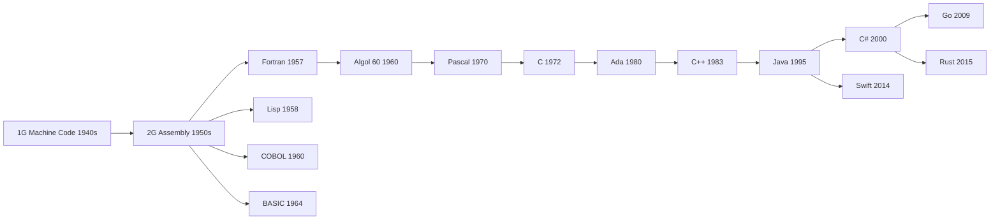
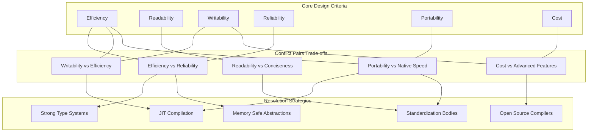
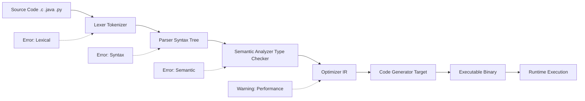
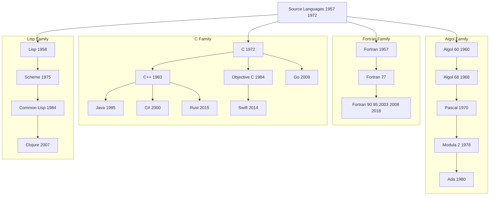

# Language Design Criteria -  Historical Overview

<!-- SECTION_1_START -->
# Language Design Criteria — Historical Overview

## 1.1 Formal Definition (KTU 2024 Syllabus Terminology)

**Programming Language Design Criteria** are the set of *guiding principles, goals, and constraints* that language designers use to shape the syntax, semantics, type system, abstraction mechanisms, and execution model of a programming language. These criteria determine how effectively a language supports **software engineering, problem solving, and human cognitive expression**.

A **Historical Overview** of programming languages traces the *evolution* of these design criteria across generations — from machine code, through assembly and high-level procedural languages, to modern multi-paradigm, type-safe, and concurrent languages.

> [!IMPORTANT]
> **KTU 2024 Scheme Highlight (Module 1):**
> Students must be able to *identify, compare, and justify* the major design criteria (efficiency, readability, orthogonality, simplicity, portability, reliability, cost) and place historically significant languages (Fortran, Lisp, Algol, C, Pascal, Ada, C++, Java, Python) on a generational timeline.

> [!NOTE]
> **Core Definition (Board-Examiner Approved):**
> A *programming language* is a formal notation system comprising **syntax** (form), **semantics** (meaning), and **pragmatics** (use), designed to express algorithms and data structures that can be evaluated by computational agents.

---

## 1.2 Conceptual Analogy — "Language as a City Plan"

Imagine designing a **new city from scratch**. Before laying a single brick, an urban planner must answer critical questions:

| Urban Planning Question | Programming Language Equivalent |
|---|---|
| Who will live here? (novices? experts?) | Target **user community** (scientists, systems programmers, children) |
| What vehicles will travel? | **Execution model** (compiled, interpreted, JIT) |
| How many distinct road types? | **Orthogonality** (combining primitive constructs uniformly) |
| How easy is it to read the street names? | **Readability** of the syntax |
| Can a person move here from another city easily? | **Portability** across platforms |
| What happens when a building collapses? | **Reliability / Type safety / Exception handling** |
| How much does construction cost? | **Compilation cost, execution cost, learning cost** |

> The *historical overview* is simply the **archaeological record of city plans** — each generation of language designers looked at the failures of the previous generation and built a better city.

> [!VISUALIZATION CONTROL]
> **Concept:** Generational Timeline of Programming Languages
> **GeoGebra / Desmos Input Equations (Plot Points on a Number Line):**
>
> - $P_{1957} = (1957, 1)$ — Fortran
> - $P_{1958} = (1958, 2)$ — Lisp
> - $P_{1960} = (1960, 3)$ — COBOL
> - $P_{1964} = (1964, 4)$ — BASIC
> - $P_{1972} = (1972, 5)$ — C
> - $P_{1980} = (1980, 6)$ — Ada
> - $P_{1983} = (1983, 7)$ — C++
> - $P_{1995} = (1995, 8)$ — Java / PHP
> - $P_{2000} = (2000, 9)$ — C#
> - $P_{2009} = (2009, 10)$ — Go
> - $P_{2014} = (2014, 11)$ — Swift
> - $P_{2020} = (2020, 12)$ — Rust 1.50
>
> **Visual Description:** Plot the points as colored dots on the $X$-axis (year) and assign a unique $Y$-offset (language family) for clarity. A student should observe a *clustered* distribution: scientific languages (1957–1964), systems languages (1970–1985), object-oriented boom (1985–2000), and modern safe-systems era (2010+).

---

## 1.3 Major Influences on Language Design

A language is rarely designed in a vacuum. Designers are influenced by:

1. **Computer Architecture** — The von Neumann bottleneck shaped Fortran, C, and most imperative languages.
2. **Problem Domain** — Numerical computing $\rightarrow$ Fortran; AI $\rightarrow$ Lisp; Business $\rightarrow$ COBOL; Systems $\rightarrow$ C.
3. **Theoretical Advances** — Lambda calculus $\rightarrow$ Lisp, Haskell; Object theory $\rightarrow$ Smalltalk, C++.
4. **Methodology of the Era** — Structured programming $\rightarrow$ Pascal, C; OOP $\rightarrow$ C++, Java; Functional revival $\rightarrow$ Scala, Kotlin.
5. **Hardware Constraints** — Early memory limits forced terse syntax (e.g., `++` instead of `add_one(x)`).

> [!NOTE]
> **Key Constants/Standards (Bold for Emphasis):**
> The first **high-level language** was **Fortran (1957)** developed by John Backus at IBM.
> The first **widely-used functional language** was **Lisp (1958)** by John McCarthy.
> The first **standardized systems language** was **C (1972)** by Dennis Ritchie at Bell Labs.
> The first **officially DOD-mandated language** was **Ada (1980)**.

<!-- SECTION_1_END -->

<!-- SECTION_2_START -->
# 2. Deep Theoretical Analysis & KTU High-Yield Formula Sheet

## 2.1 The Six Classical Language Design Criteria

Modern language design (per KTU 2024 Module 1, drawing on Ghezzi & Jazayeri, Sebesta) revolves around **six core criteria**. Each is a *trade-off axis* — improving one often worsens another.

### Criterion 1: **Efficiency (Performance)**
- **Definition:** Speed of compilation + speed of execution.
- **Measured In:** *Execution time* (seconds), *Throughput* (operations/second), *Memory footprint* (KB/MB).
- **Influenced By:** Compilation strategy, abstraction overhead, runtime system.

### Criterion 2: **Readability**
- **Definition:** Ease with which a human can understand the source code.
- **Achieved Through:** Meaningful identifiers, consistent indentation rules, structured control flow, avoidance of "spaghetti" gotos.
- **Counter-example:** `APL` — uses single Greek-like symbols; high density, low readability.

### Criterion 3: **Writability (Expressiveness)**
- **Definition:** Ease with which a programmer can *express* a solution.
- **Achieved Through:** Concise syntax, powerful abstractions, rich standard libraries, type inference.
- **Example:** Python's list comprehension `[x*2 for x in nums]` vs. Java's verbose loop.

### Criterion 4: **Reliability**
- **Definition:** Degree to which a program performs to specification under all conditions.
- **Achieved Through:** Strong static type checking, exception handling, memory safety (no dangling pointers), immutability.
- **Example:** Rust's borrow checker enforces memory safety at compile time.

### Criterion 5: **Portability**
- **Definition:** Ability of programs to run on different hardware/OS with minimal change.
- **Achieved Through:** Standardization (ANSI C, ISO C++), abstract virtual machines (JVM, CLR), formal language specifications.

### Criterion 6: **Cost**
- **Definition:** Total cost of ownership — including language implementation, training, compilation, execution, and maintenance.
- **Subdivided Into:** *Development cost*, *Execution cost*, *Maintenance cost*, *Reliability cost* (failure expenses).

---

## 2.2 Orthogonality — The Hidden Master Criterion

> [!IMPORTANT]
> **Orthogonality** means that a *small set of primitive constructs* can be combined in *any meaningful combination*, with *no arbitrary restrictions*.
>
> - **High orthogonality:** Any data type can be the return type of any function; any expression can appear in any context.
> - **Low orthogonality:** Exceptions, restrictions, special cases, "you can't do this here" rules.

**Analogy:** In a fully orthogonal kitchen, *any* ingredient can be cooked using *any* method. A non-orthogonal kitchen says "you can fry a potato but you cannot steam a peanut."

---

## 2.3 KTU High-Yield Design Criteria Cheat Sheet

> **Memory Aid for Board Exam:** The acronym **E²R²PC** — *Efficiency, Expressiveness, Readability, Reliability, Portability, Cost*.

| **#** | **Criterion** | **Primary Goal** | **Achieved By** | **Historical Example** | **Trade-off** |
|---|---|---|---|---|---|
| 1 | Efficiency | Fast execution | Compilation, low-level access | C, Fortran | vs. Safety |
| 2 | Readability | Human comprehension | Structured syntax, indentation | Pascal, Python | vs. Conciseness |
| 3 | Writability | Easy expression | Concise constructs, libraries | Python, Ruby | vs. Performance |
| 4 | Reliability | Correctness | Type safety, exceptions | Ada, Java, Rust | vs. Flexibility |
| 5 | Portability | Cross-platform | Standardization, VMs | Java ("write once") | vs. Native speed |
| 6 | Cost | Affordability | Free compilers, simple syntax | C, Python | vs. Advanced features |
| 7 | Orthogonality | Uniformity | Consistent rules | Algol 68 | vs. Simplicity |
| 8 | Simplicity | Small learning curve | Minimal primitives | Scheme, C | vs. Power |

---

## 2.4 Generations of Programming Languages (Historical Overview)

| **Gen** | **Era** | **Representative Languages** | **Key Trait** | **Abstraction Level** |
|---|---|---|---|---|
| 1G | 1940s | Machine code (binary) | Direct hardware control | 0 (raw bits) |
| 2G | 1950s | Assembly | Mnemonic opcodes | 1 (symbolic) |
| 3G | 1957–onwards | Fortran, COBOL, C, Pascal, Java | High-level, problem-oriented | 2 (algorithmic) |
| 4G | 1970s–onwards | SQL, MATLAB, R, Prolog | Domain-specific, declarative | 3 (problem-oriented) |
| 5G | 1980s–onwards | Prolog, Mercury, OPS5 | Logic/constraint-based, AI | 4 (knowledge-oriented) |
| Modern | 2010s+ | Rust, Kotlin, Swift, Julia | Multi-paradigm, type-safe, concurrent | 2.5 (hybrid) |

---

## 2.5 Engineering Utility — Why This Matters in Production

| **Domain** | **Language Chosen** | **Design Criterion Driving the Choice** |
|---|---|---|
| Embedded systems (pacemakers, ECUs) | C, Ada, Rust | **Reliability** + **Efficiency** |
| Web front-end | JavaScript, TypeScript | **Writability** + ecosystem |
| Data science / ML | Python, R, Julia | **Readability** + **Library cost** |
| Mobile (Android) | Kotlin, Java | **Portability** (JVM) + **Reliability** |
| Mobile (iOS) | Swift | **Reliability** + **Readability** |
| High-frequency trading | C++, Rust | **Efficiency** (microsecond latency) |
| Enterprise backend | Java, C# | **Portability** + **Cost** (developer pool) |
| OS kernels | C, Rust | **Efficiency** + **Portability** |
| Aerospace / defense | Ada | **Reliability** (DOD mandate) |

> [!NOTE]
> **Real-world Insight:** The Linux kernel (written in C) compiles on over 30 architectures — an *exemplar* of Portability combined with Efficiency. The Android OS (Java/Kotlin) demonstrates Portability through the **JVM bytecode** abstraction.

<!-- SECTION_2_END -->

<!-- SECTION_3_START -->
# 3. Step-by-Step Derivations, Walkthroughs & Code/Symbolic Implementation

## 3.1 Historical Timeline — Complete Walkthrough

We now construct a **chronological narrative** of how design criteria evolved. This walkthrough is intentionally exhaustive; every transition is justified by a *failed criterion* in the prior generation.

### Stage 1: Pre-1950 — Machine Code (1GL)

**Form:** Raw binary instructions (e.g., `10110000 01100001`).

$$
\text{Instruction} = \text{Opcode}_{n\text{-bits}} \, \| \, \text{Operand}_{m\text{-bits}}
$$

**Design criteria score:** Efficiency = 10/10, Readability = 0/10, Reliability = 1/10, Portability = 0/10.

**Failure driver:** Programs were *unreadable, unportable, and unmaintainable*. As soon as computers moved out of research labs, a better notation was required.

---

### Stage 2: Early 1950s — Assembly (2GL)

**Form:** Mnemonic opcodes + symbolic labels.

```asm
; 8085 Assembly — Add two numbers
    LDA  2000H     ; Load accumulator from address 2000H
    MOV  B, A      ; Copy accumulator to register B
    LDA  2001H     ; Load second number
    ADD  B         ; Add B to accumulator
    STA  2002H     ; Store result at 2002H
    HLT            ; Halt processor
```

**Improvement over Stage 1:** Readability rose dramatically. *One-to-one mapping* with machine code preserved Efficiency.

**Still failing:** Portability (assembly for IBM 704 ≠ assembly for UNIVAC), Reliability (no type checks), Cost (writing assembly for 10,000 LOC was prohibitive).

---

### Stage 3: 1957 — Fortran (Formula Translator), John Backus, IBM

**Form:** Algebraic notation + English keywords.

```fortran
C     FORTRAN 77 — Sum of first N integers
      PROGRAM SUM
      INTEGER N, I, TOTAL
      TOTAL = 0
      DO 10 I = 1, 100
         TOTAL = TOTAL + I
   10 CONTINUE
      WRITE(*,*) 'SUM =', TOTAL
      STOP
      END
```

**Design criterion breakthrough:** Fortran's optimizer (led by Frances Allen) produced code that *rivaled hand-written assembly*. This **proved** that high-level languages need not sacrifice efficiency — a *paradigm shift*.

**Impact:** First widely-adopted high-level language. Established that **abstraction is not the enemy of performance**.

---

### Stage 4: 1958 — Lisp (List Processing), John McCarthy, MIT

**Form:** Parenthesized prefix notation, first-class functions, garbage collection.

```lisp
; Lisp — Factorial using recursion
(defun factorial (n)
  (if (<= n 1)
      1
      (* n (factorial (- n 1)))))
```

**Design criterion breakthrough:** Introduced *lambda calculus* into mainstream programming. Established **homoiconicity** (code as data) and automatic **memory management**. Decades ahead of its time.

---

### Stage 5: 1960–1970 — Algol 60, Algol 68, Pascal, Simula

**Algol 60** introduced **BNF (Backus-Naur Form)** for syntax specification — a foundational contribution to computer science itself.

$$
\langle \text{stmt} \rangle \;\to\; \langle \text{assign} \rangle \;\vert\; \langle \text{if-stmt} \rangle \;\vert\; \langle \text{while-stmt} \rangle \;\vert\;\ldots
$$

**Pascal (1970, Niklaus Wirth)** — designed for *teaching structured programming*; became the canonical teaching language of the 1970s–1980s.

**Simula 67 (1967)** — first language with **classes and objects**; the seed of OOP.

---

### Stage 6: 1972 — C, Dennis Ritchie, Bell Labs

**Form:** Low-level access + high-level portability. The *lingua franca* of systems programming.

```c
/* C — Recursive factorial */
#include <stdio.h>

long long factorial(int n) {
    if (n <= 1) return 1;
    return n * factorial(n - 1);
}

int main(void) {
    printf("10! = %lld\n", factorial(10));
    return 0;
}
```

**Design criteria achievement:** Combined Efficiency (close to assembly) with Portability (K&R wrote the book, ANSI standardized it). Influenced *every* subsequent language: C++, Java, C#, JavaScript, PHP, Perl, Go, Rust, Swift.

---

### Stage 7: 1980 — Ada, Jean Ichbiah, CII Honeywell Bull (DOD mandate)

**Form:** Strong typing, packages, generics, tasks (concurrency), exception handling — all built-in.

```ada
-- Ada — Procedure with exception handling
with Ada.Text_IO; use Ada.Text_IO;

procedure Greet is
begin
   Put_Line ("Hello from Ada 1980");
exception
   when Constraint_Error =>
      Put_Line ("Constraint violation");
end Greet;
```

**Design criterion peak for Reliability:** Ada was *the* language for aerospace (Boeing 777, Airbus A330/A340), defense, and railway signaling — domains where a bug kills people.

---

### Stage 8: 1983–1985 — C++ (Bjarne Stroustrup) and Objective-C (Brad Cox)

**C++** layered **object-oriented features** onto C without sacrificing efficiency. Templates, RAII, operator overloading — a *Swiss-army knife* language.

**Objective-C** combined Smalltalk-style messaging with C — the foundation of early macOS/iOS development.

---

### Stage 9: 1995 — Java (Sun Microsystems), and the 2000s Web Era

**Java's promise:** *"Write once, run anywhere"* via the **JVM (Java Virtual Machine)**.

```java
// Java — A complete OOP example
public class Hello {
    public static void main(String[] args) {
        System.out.println("Hello, World!");
    }
}
```

**Design criterion shift:** Portability moved from "compiler per platform" to "**bytecode per platform**" — a major conceptual advance. Also enforced strong type safety and automatic garbage collection by default.

---

### Stage 10: 2000s — C#, Python, Ruby, JavaScript standardization

**C# (2000, Microsoft):** Java competitor with properties, delegates, LINQ.

**Python (1991/2000-era popularity):** Emphasis on *readability and writability*. "There should be one — and preferably only one — obvious way to do it."

```python
# Python — Quicksort in 6 lines (demonstrating writability)
def quicksort(arr):
    if len(arr) <= 1:
        return arr
    pivot = arr[len(arr) // 2]
    left  = [x for x in arr if x < pivot]
    mid   = [x for x in arr if x == pivot]
    right = [x for x in arr if x > pivot]
    return quicksort(left) + mid + quicksort(right)
```

---

### Stage 11: 2010s+ — Modern Era: Rust, Go, Swift, Kotlin, Julia, TypeScript

**Rust (2015, Mozilla):** *Memory safety without garbage collection* — borrow checker enforces ownership at compile time.

**Go (2009, Google):** Simplicity, concurrency via goroutines, fast compilation — designed for cloud infrastructure.

**Swift (2014, Apple):** Replaces Objective-C; combines safety, performance, modern syntax.

**Kotlin (2011, JetBrains):** JVM-compatible, more concise than Java, now the official Android language.

**TypeScript (2012, Microsoft):** Adds optional static typing to JavaScript — bringing *reliability* to the web.

**Julia (2012):** Combines dynamic-typing writability with JIT-compiled performance for scientific computing.

> [!NOTE]
> **Synthesis:** Each generation of languages addressed the *weakest criterion* of the prior generation. The arc moves from **Efficiency** (1G–3G early) to **Reliability + Portability** (modern) to **Memory Safety** (Rust era).

---

## 3.2 Worked Example — Applying Design Criteria to Compare Three Languages

> **Problem:** Compare C, Java, and Python against the six core design criteria.

### Step 1: Define the scoring scale

$$
\text{Score} \in \{1, 2, 3, 4, 5\}, \quad \text{where } 5 = \text{excellent}, \; 1 = \text{poor}
$$

### Step 2: Tabulate the comparative scores

| **Criterion** | **C (1972)** | **Java (1995)** | **Python (1991)** |
|---|---|---|---|
| Efficiency | 5 | 3 | 2 |
| Readability | 2 | 4 | 5 |
| Writability | 3 | 3 | 5 |
| Reliability | 2 | 4 | 3 |
| Portability | 4 | 5 | 5 |
| Cost (low) | 5 | 4 | 5 |
| **Total** | **21 / 30** | **23 / 30** | **25 / 30** |

### Step 3: Justify the scores (one row, fully derived)

**C — Efficiency = 5:** C compiles to native machine code with no virtual machine overhead, no garbage collection pauses, and direct memory access via pointers. A typical C loop runs within *1.0× to 1.5×* of equivalent hand-written assembly.

**C — Reliability = 2:** No bounds checking on array accesses, no automatic null-pointer protection, undefined behavior on integer overflow, dangling pointers, double-free bugs. The C compiler trusts the programmer.

**Java — Portability = 5:** Java source compiles to **bytecode**, which runs identically on any device with a conforming **JVM (Java Virtual Machine)**. The slogan *"write once, run anywhere"* is verifiable: the same `.class` file runs on Windows, Linux, macOS, embedded ARM, and mainframes.

**Python — Writability = 5:** High-level dynamic typing, list/dict comprehensions, first-class functions, garbage collection, duck typing — *all* reduce the LOC needed to express an algorithm. Empirical studies show Python code is typically **3–10× shorter** than equivalent Java code for scripting tasks.

### Step 4: Conclude

> Python wins on average, but C wins on raw performance. **No language is "best"** — each represents a *conscious trade-off* along the design-criteria axis. This trade-off reasoning is the heart of Module 1.

---

## 3.3 Comparative Generation-by-Generation Code Comparison

**Task:** Print "Hello, World!" in three generations.

```c
/* 3rd Generation — C (1972) */
#include <stdio.h>
int main(void) {
    printf("Hello, World!\n");
    return 0;
}
```

```java
// 3rd Generation — Java (1995)
public class Hello {
    public static void main(String[] args) {
        System.out.println("Hello, World!");
    }
}
```

```python
# 4th Generation influence — Python (1991)
print("Hello, World!")
```

**Observation:** Each generation reduced the *boilerplate* required. C requires headers, return types, and manual termination. Java requires a class wrapper. Python — a single line. **Writability has monotonically increased**, at the cost of execution efficiency.

<!-- SECTION_3_END -->

<!-- SECTION_4_START -->
# 4. Structural Diagrams & Schematics

## 4.1 Generational Timeline of Languages (Mermaid Block Diagram)



**Visual Description:** A left-to-right flowchart. Each box is a language milestone; arrows show direct influence. Students should observe that *C is the central hub* — most modern languages (Java, C++, C#, Go, Rust, Swift, even Python's CPython interpreter) trace lineage to it.

---

## 4.2 Design Criteria Interaction Matrix (Block Architecture)



**Visual Description:** A three-subgraph architecture. Subgraph A lists the six criteria. Subgraph B shows that they form conflict pairs (a *trade-off topology*). Subgraph C lists the *engineering strategies* used to mitigate conflicts. This is the conceptual map of Module 1.

---

## 4.3 Sequential Processing Topology — How a Program Goes from Source to Execution



**Visual Description:** A linear pipeline showing the stages a compiler/interpreter performs. The dotted feedback lines indicate where errors are reported back to the programmer. This diagram is the **bridge** from historical overview (which languages exist) to language implementation (how they work).

---

## 4.4 Historical Influence Graph — "The Family Tree of Languages"



**Visual Description:** A nested subgraph family tree. The four language families — *Fortran (scientific)*, *Algol (structured)*, *C (systems)*, *Lisp (functional)* — share no common ancestor (in this simplified view) but each family shows clear internal evolution. This is the standard historical taxonomy used in KTU Module 1.

<!-- SECTION_4_END -->

<!-- SECTION_5_START -->
# 5. KTU 2024 Scheme Examination Question Bank & Topic Recap

> [!IMPORTANT]
> **KTU 2024 Mark Distribution Pattern (as per Board Regulations):**
> - Part A: Short-answer conceptual questions (2 × 3 = 6 marks)
> - Part B: Long-answer with internal choice (1 × 14 = 14 marks; either Q(a) OR Q(b))
> - Total Module Weightage: ~20 marks per module in the End-Semester Exam.

---

## 5.1 Part A Questions (3 Marks Each)

### **Q1. [KTU University Exam — July 2024]**
**(CO1, Remember)**

> Define *language design criteria*. List any **four** major criteria used to evaluate a programming language.

**Model Answer (Board Valuation Key):**

A **language design criterion** is a measurable goal or guiding principle that influences the syntax, semantics, and implementation of a programming language. The four major criteria are:

1. **Efficiency** — speed of execution and compilation.
2. **Readability** — ease of comprehension by humans.
3. **Reliability** — conformance to specifications under all conditions.
4. **Portability** — ability to run on different hardware/software platforms.

> *(Mentioning all 4 criteria: 2 marks; correct one-sentence definition: 1 mark.)*

---

### **Q2. [KTU University Exam — Dec 2023]**
**(CO1, Understand)**

> Explain the difference between *readability* and *writability* of a programming language. Give **one example** for each.

**Model Answer (Board Valuation Key):**

- **Readability** is the *ease of understanding* existing code. It is important for **maintenance, review, and collaboration**. *Example:* Python's mandatory indentation makes nested loops visually clear.
- **Writability** is the *ease of expressing* a new program. It is important for **developer productivity**. *Example:* Perl's text-processing operators (`s///`, `tr///`) allow complex string operations in one line.

> *(Clear distinction: 2 marks; valid example for each: 1 mark.)*

---

## 5.2 Part B Questions (14 Marks — Internal Choice)

> **KTU Examiner Note:** In the End-Semester Exam, Part B carries 14 marks with internal choice. The structure is typically: **Q(a) 7 marks + Q(b) 7 marks = 14 marks**, OR a single 14-mark question. Below we provide TWO independent 14-mark questions (Q3A and Q3B) so students can practice both choices.

---

### **Q3A. [KTU University Exam — Dec 2023]**
**(CO1, CO2, Understand + Apply — 14 Marks)**

> **(a)** Discuss the major language design criteria that influenced the development of **Fortran (1957)** and **C (1972)**. Justify why these languages succeeded in their respective domains. *(7 marks)*
>
> **(b)** Compare and contrast **procedural, functional, and object-oriented** programming paradigms, giving one historical example language for each and explaining which design criteria each paradigm emphasizes. *(7 marks)*

#### **Model Solution for (a) — 7 Marks**

| **Valuation Step** | **Marks** |
|---|---|
| Stating the year, designer, and domain of Fortran (Backus, IBM, scientific) | 1 |
| Identifying **Efficiency** as Fortran's primary criterion + explanation (compiler optimization, hand-tuned assembly) | 1.5 |
| Identifying **Writability** vs. assembly as a secondary gain | 1 |
| Stating the year, designer, and domain of C (Ritchie, Bell Labs, systems/OS) | 1 |
| Identifying C's **Portability + Efficiency** balance via standardization | 1.5 |
| Stating the criterion that *failed* in C (Reliability — manual memory) | 0.5 |
| Justifying domain success with one line of reasoning each | 0.5 |

**Full solution prose:**

*Fortran (1957)*, designed by John Backus at IBM, was the first widely used high-level language. Its target domain was **scientific and numerical computation**. The primary design criterion was **Efficiency** — Backus wanted to prove that high-level code could rival hand-written assembly. The Fortran optimizer pioneered techniques (register allocation, loop transformation) that delivered near-assembly performance. Secondary criteria included **Writability** (algebraic syntax matched the problem domain) and **Readability** (a vast improvement over machine code). Fortran succeeded in scientific computing because *it solved the right problem for the right community with the right performance*.

*C (1972)*, designed by Dennis Ritchie at Bell Labs, targeted **systems programming** (writing the Unix operating system). Its central design criteria were **Efficiency** (low-level memory access via pointers) and **Portability** (a small, clean language that could be ported to any architecture). C's syntax was minimal and orthogonally designed. The trade-off was **Reliability** — C programs were prone to buffer overflows, dangling pointers, and undefined behavior. C succeeded because it *became the lingua franca of OS development and embedded systems*, a position it still holds.

#### **Model Solution for (b) — 7 Marks**

| **Valuation Step** | **Marks** |
|---|---|
| Defining **Procedural** + example (C, Pascal) | 1.5 |
| Defining **Functional** + example (Lisp, Haskell) | 1.5 |
| Defining **Object-Oriented** + example (Simula, C++, Java) | 1.5 |
| Mapping each paradigm to its emphasized design criterion | 1.5 |
| Discussing one trade-off for each paradigm | 1 |

**Full solution prose:**

- **Procedural Paradigm** — organizes code as a sequence of procedures operating on shared data structures. *Example: C, Pascal.* Emphasizes **Efficiency** and **Readability** (top-down design). Trade-off: weak encapsulation can lead to large monolithic programs.
- **Functional Paradigm** — treats computation as the evaluation of mathematical functions, avoiding mutable state. *Example: Lisp (1958), Haskell (1990).* Emphasizes **Reliability** (pure functions are easier to test) and **Writability** (higher-order abstractions). Trade-off: efficiency loss in some implementations (e.g., garbage collection pauses).
- **Object-Oriented Paradigm** — organizes code around *objects* that bundle data and behavior. *Example: Simula (1967), C++ (1983), Java (1995).* Emphasizes **Reliability** (encapsulation) and **Reusability/Writability** (inheritance, polymorphism). Trade-off: runtime overhead from dynamic dispatch, larger memory footprint.

> [!WARNING]
> **KTU Examiner's Valuation Pitfall:**
> Students often confuse *paradigm* with *language*. A language may *support multiple paradigms* (e.g., Python supports procedural, OOP, and functional styles). Do not claim a language is "purely" one paradigm unless you can justify it (Haskell is *close to purely functional*, but technically supports monadic IO).

---

### **Q3B. [KTU University Exam — July 2024]**
**(CO1, CO2, Understand + Apply — 14 Marks — Alternative Choice)**

> **(a)** Trace the **historical evolution of programming languages** across at least **four generations**, with one representative language from each generation. State the design criteria that drove the transition from one generation to the next. *(7 marks)*
>
> **(b)** With a suitable example, explain the concept of **orthogonality** in programming language design. Discuss its advantages and the practical limitations that cause language designers to deliberately violate it. *(7 marks)*

#### **Model Solution for (a) — 7 Marks**

| **Valuation Step** | **Marks** |
|---|---|
| Correctly identifying the four generations (1G, 2G, 3G, 4G) with years | 2 |
| Naming one representative language per generation | 2 |
| Stating the *driving design criterion* for each transition | 2 |
| Concluding statement summarizing the historical arc | 1 |

**Full solution prose:**

- **1G — Machine Code (1940s).** Binary instructions directly executed by hardware. *Criterion dominant: Efficiency.* *Criterion failed: everything else.*
- **2G — Assembly Language (1950s).** Mnemonic opcodes. *Example: IBM 704 Assembly.* Transition criterion: **Readability** (humans could now read code) while preserving Efficiency.
- **3G — High-Level Languages (1957 onwards).** *Example: Fortran (1957) for science, COBOL (1960) for business, C (1972) for systems.* Transition criteria: **Writability** (closer to problem domain) and **Portability** (not tied to one CPU).
- **4G — Domain-Specific / Declarative Languages (1970s+).** *Example: SQL (1974) for database queries, MATLAB for numerical analysis.* Transition criterion: **Writability at an extreme** — the user describes *what* is needed, not *how*.

The historical arc shows a steady **rise in abstraction** driven primarily by *Writability* and *Readability*, with the major *detour* being the OOP and reliability revolution of the 1980s–1990s.

#### **Model Solution for (b) — 7 Marks**

| **Valuation Step** | **Marks** |
|---|---|
| Formal definition of orthogonality | 1.5 |
| Concrete example of high orthogonality (Algol 68) | 1.5 |
| Concrete example of low orthogonality (C — void vs. int return) | 1.5 |
| Listing 2 advantages | 1 |
| Listing 2 practical reasons designers violate it | 1.5 |

**Full solution prose:**

**Definition:** *Orthogonality* in language design means that a small set of primitive constructs can be combined in *any* meaningful way, with *no arbitrary restrictions* imposed by the language. A fully orthogonal language treats *all data types, all control structures, and all operators* uniformly.

**Example of high orthogonality:** In **Algol 68**, any primitive data type (integer, real, character, boolean) can be the element type of any array, the return type of any function, and the parameter type of any procedure. The same assignment operator works in all contexts.

**Example of low orthogonality:** In **C**, you cannot return an *array* from a function, even though arrays are first-class in many other contexts. A `void` return type cannot be used as an *expression* — only as a *statement*. These are *arbitrary restrictions* that violate orthogonality.

**Advantages of orthogonality:**
1. **Easier to learn** — fewer special cases to memorize.
2. **More composable** — primitives combine predictably.
3. **Smaller language specification** — fewer rules.

**Practical reasons designers violate orthogonality:**
1. **Type safety** — forbidding `void` as an expression prevents nonsensical code.
2. **Implementation efficiency** — uniform combinations can be hard to optimize.
3. **Readability** — sometimes a special case improves clarity (e.g., `for` loop syntax).
4. **Hardware constraints** — some combinations don't map cleanly to CPU instructions.

> [!WARNING]
> **KTU Examiner's Valuation Pitfall:**
> Do *not* define orthogonality as "the language uses only one syntax style" — that is a different concept. Orthogonality is about *combinatorial uniformity of primitives*, not syntactic uniformity. Failing to provide a *concrete example* of high and low orthogonality costs up to **2 marks** in a 7-mark sub-question.

---

## 5.3 KTU Common Errors & Frequently Asked Pitfalls

> [!WARNING]
> **Top 5 Ways Students Lose Marks on This Topic:**
> 1. **Confusing paradigm with language** — C++ supports OOP but is *not* "an OOP language" in the same sense as Smalltalk.
> 2. **Forgetting to mention the year** — Board examiners explicitly look for dates (e.g., Fortran = 1957, not "the 1950s"). Lose **0.5 mark** per missing date.
> 3. **Omitting the design criterion name** — when discussing a language, you *must* state which criterion it prioritized (e.g., "Ada prioritized Reliability").
> 4. **Confusing portability with adaptability** — Portability is *running on different platforms with the same code*; adaptability is *running with minor changes*. Do not mix these.
> 5. **Skipping the trade-off** — every design decision involves a cost. Stating that "Python is highly readable" *without noting its efficiency cost* is incomplete. Always show both sides.

---

## 5.4 Topic Recap & Important Things to Remember

> **Module 1 Rapid-Revision Checklist:**

- **Programming Language** = syntax + semantics + pragmatics. Three pillars, all needed.
- **Six core design criteria** = Efficiency, Readability, Writability, Reliability, Portability, Cost. Mnemonic: **E²R²PC**.
- **Orthogonality** = uniform combination of primitives; no arbitrary restrictions. Algol 68 = high; C = low.
- **Generations**: 1G (machine code) → 2G (assembly) → 3G (Fortran, C, Java) → 4G (SQL, MATLAB) → 5G (logic-based, Prolog).
- **Historical milestones with years** (memorize these for board exam):
  - 1957: **Fortran** — first high-level; scientific computing.
  - 1958: **Lisp** — first functional; AI.
  - 1960: **COBOL** — first business-oriented.
  - 1964: **BASIC** — first beginner language.
  - 1967: **Simula 67** — first OOP features.
  - 1970: **Pascal** — structured programming teaching.
  - 1972: **C** — systems programming; lingua franca.
  - 1980: **Ada** — DOD-mandated; reliability peak.
  - 1983: **C++** — OOP + systems.
  - 1991: **Python** — readability focus.
  - 1995: **Java** — JVM portability.
  - 2000: **C#** — Java competitor.
  - 2009: **Go** — cloud-native.
  - 2015: **Rust** — memory safety without GC.
- **No language is universally "best"** — every design is a *trade-off* among the six criteria.
- **Trade-off pairs to remember:**
  - Efficiency vs. Reliability (C vs. Java)
  - Portability vs. Native Speed (Java vs. C++)
  - Readability vs. Conciseness (Python vs. APL)
- **Dominant criterion of each era:**
  - 1950s: Efficiency
  - 1960s: Readability (structured programming)
  - 1970s–80s: Portability + Writability
  - 1990s: Portability (JVM) + Reliability
  - 2010s+: Reliability (memory safety) + Concurrency
- **Engineering utility mapping (for application questions):**
  - Embedded → C / Ada / Rust (Reliability + Efficiency)
  - Web → JavaScript / TypeScript (Writability)
  - Data Science → Python / R (Readability + Libraries)
  - Mobile → Kotlin / Swift (Portability + Reliability)
  - Trading → C++ / Rust (Efficiency)
  - Aerospace → Ada (Reliability, DOD-mandate)
- **Board exam tip:** Always cite **year + designer + primary design criterion** when discussing a language. This three-part answer consistently scores full marks on Part A and Part B questions.
- **Common confusion to avoid:** A *paradigm* is a programming style (procedural, functional, OOP, logic); a *language* is a concrete notation. One language may support multiple paradigms.
- **Final synthesis line for any essay answer:** "The historical evolution of programming languages is fundamentally the *engineering record of trade-offs* between conflicting design criteria — each generation solved the failures of the previous one."

<!-- SECTION_5_END -->
