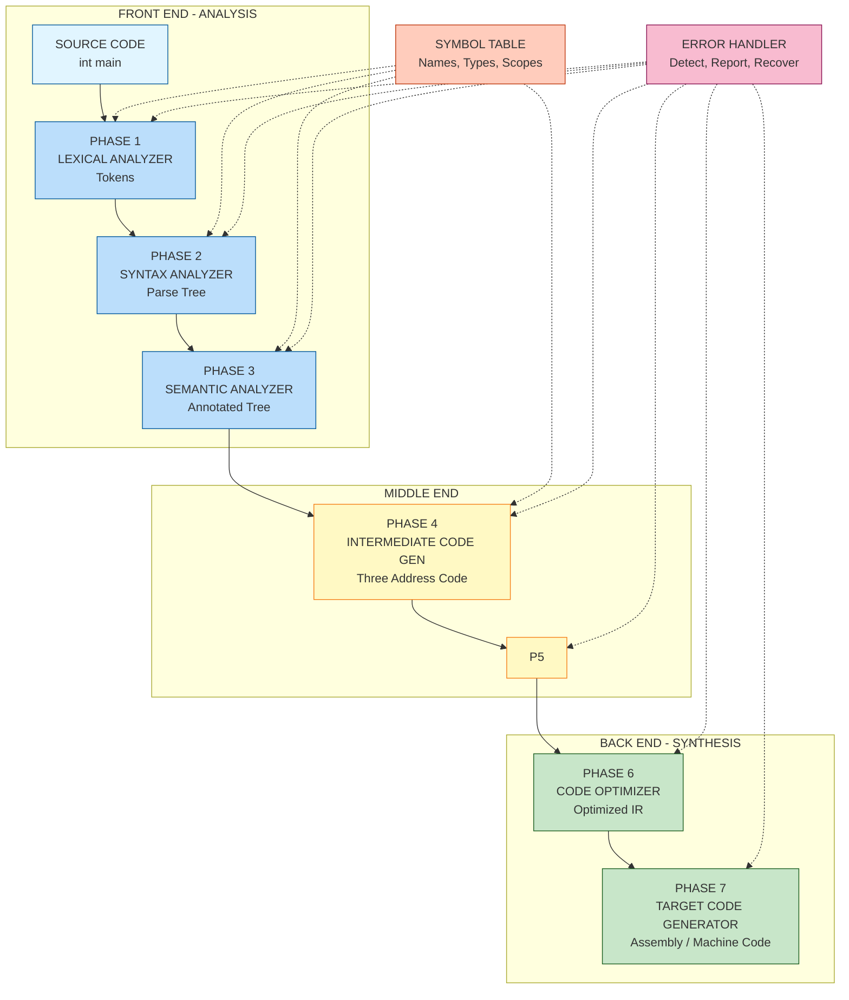
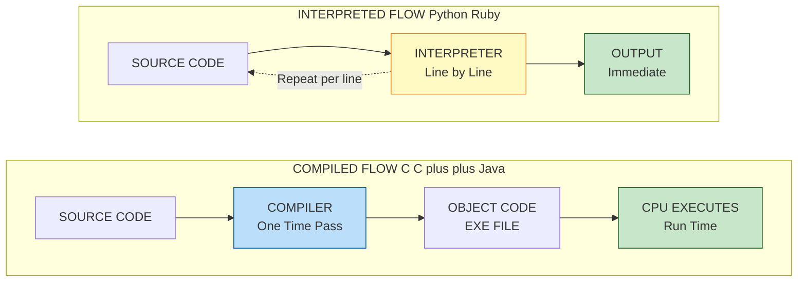
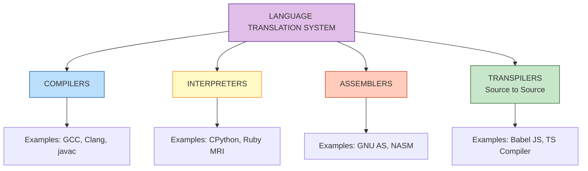

# Language Translation

<!-- SECTION_1_START -->

# 1. Core Technical Definition & Intuitive Overview

## 1.1 Formal Academic Definition

**Language Translation** in the context of computer science refers to the systematic process of converting a program written in a **high-level programming language** (source language) into an equivalent program in a **low-level language** (target language), such as machine code, assembly language, or another high-level language. The primary agents of this translation are **Compilers**, **Interpreters**, **Assemblers**, and **Translators**.

According to the **KTU 2024 Scheme syllabus (PECST758 - Module 1)**, Language Translation encompasses the study of how source code is analyzed, understood, and transformed into executable instructions, including the various intermediate phases, data structures (like symbol tables), and error-handling mechanisms involved in the process.

> [!IMPORTANT]
> **KTU Syllabus Highlight:** A *compiler* translates the **entire program** before execution, while an *interpreter* translates and executes **one statement at a time**. Hybrid systems (like the JVM) use a mix of both.

## 1.2 Conceptual Analogy / Intuition

Imagine you have a brilliant research paper written entirely in **Malayalam**, and you need a French chemist to read it and perform the experiments described.

You do **not** just hand over the Malayalam paper. Instead:

1. A **linguist** first reads the Malayalam paper, word by word, and checks the grammar (this is the *Lexical and Syntax Analysis* phase).
2. A **domain expert** then verifies that the chemistry actually makes sense (this is the *Semantic Analysis* phase).
3. The linguist then writes down a *summary* of each paragraph in a universal scientific shorthand (this is the *Intermediate Code Generation* phase).
4. A *French editor* polishes the summary to make the experiments more efficient (this is the *Code Optimization* phase).
5. Finally, the summary is translated word-for-word into **French** for the chemist to read (this is the *Target Code Generation* phase).
6. Throughout, a **reference librarian** maintains a list of all technical terms used (this is the *Symbol Table*).

> [!NOTE]
> **The Key Insight:** The "Malayalam-to-French" pipeline never *runs* the experiments. It only *prepares* the French version. A separate tool (the *chemist*) actually performs the experiment, which is analogous to how a compiled program is *executed* by the CPU.

## 1.3 The Three Standard Translation Agents

| Agent | Input Language | Output Language | Execution Model |
| :--- | :--- | :--- | :--- |
| **Compiler** | High-Level (e.g., C, Java) | Low-Level (Assembly / Machine Code) | Translates whole program first, then executes |
| **Interpreter** | High-Level (e.g., Python, Ruby) | Executes directly line-by-line | Translates and executes simultaneously |
| **Assembler** | Assembly Language (e.g., `MOV A, B`) | Relocatable Machine Code | One-to-one symbolic translation |

> [!TIP]
> **Production Reality Check:** Modern engines like **V8 (Chrome/Node.js)** and **JVM (Java)** use a *Just-In-Time (JIT)* compiler. They start by interpreting, and once a "hot" function is detected, they compile it to native machine code at runtime for massive speed gains.

> [!VISUALIZATION CONTROL]
> **Concept:** Linear Pipeline of Language Translation
> **GeoGebra / Desmos Input Equations:**
> * `f_1(x) = x`  (Source Code)
> * `f_2(x) = 2x` (Analysis phase - expands)
> * `f_3(x) = 3x` (Intermediate - expands further)
> * `f_4(x) = 4x` (Target - maximizes density)
> **Visual Description:** A set of nested parallel lines getting progressively wider from left to right on a Cartesian plane, illustrating how the translation pipeline transforms a compact source input into an expanded, detailed target output.

<!-- SECTION_1_END -->

<!-- SECTION_2_START -->

# 2. Deep Theoretical Analysis & KTU High-Yield Formula Sheet

## 2.1 The Two Halves of a Compiler

A compiler is fundamentally divided into two cooperating halves, often working as a black box:

* **Analysis Phase (Front-End):** The "front" of the compiler. It *reads* the source program, breaks it into constituent pieces, and produces an *intermediate representation*. It also collects information into the symbol table. The primary goal here is to understand the source code. **Errors related to syntax, undeclared variables, and type mismatches are caught here.**
* **Synthesis Phase (Back-End):** The "back" of the compiler. It takes the intermediate representation as input and *constructs* the equivalent target program. The primary goal here is to generate efficient machine code. **Errors related to resource allocation, register overflow, and code emission are caught here.**

## 2.2 The Six Logical Phases of Compilation

The KTU 2024 Scheme specifically groups compilation into **six logical phases**, often assisted by two critical auxiliary modules: the **Symbol Table** and the **Error Handler**.

### Phase 1: Lexical Analysis (Scanning)
* **What it does:** Reads the raw character stream of the source program, groups characters into **lexemes**, and produces a stream of **tokens**.
* **Why it matters:** It strips out comments, whitespace, and translates keywords like `while` into a standardized internal token ID (e.g., `WHILE_TOKEN = 25`).
* **How it works:** Uses **Regular Expressions** and **Finite Automata** (DFA/NFA) internally. The output of a lexical analyzer is fed to the syntax analyzer.

### Phase 2: Syntax Analysis (Parsing)
* **What it does:** Takes the token stream and constructs a **parse tree** (or syntax tree) based on the grammar rules of the language.
* **Why it matters:** It checks the *grammatical structure* of the program. A statement like `a + b *` would be flagged as a syntax error because the grammar expects another operand after `*`.
* **How it works:** Uses **Context-Free Grammars (CFGs)** and parsing algorithms like **LL(k)**, **LR(k)**, or **LALR**.

### Phase 3: Semantic Analysis
* **What it does:** Checks the parse tree for *semantic consistency* (meaning).
* **Why it matters:** Syntax alone cannot catch everything. The statement `"Hello" + 5` is grammatically correct in many languages, but semantically invalid (string + integer mismatch).
* **How it works:** Uses the **Symbol Table** to verify type compatibility, scope rules, and that variables are declared before use.

### Phase 4: Intermediate Code Generation
* **What it does:** Translates the verified parse tree into a machine-independent intermediate representation (IR). The most common IR is **Three-Address Code (TAC)**.
* **Why it matters:** Provides a bridge between the front-end and the back-end. A single IR can be optimized and then mapped to multiple target architectures (x86, ARM, RISC-V).
* **Example TAC:** `x = y op z` or `t1 = y + z; x = t1`.

### Phase 5: Code Optimization
* **What it does:** Attempts to improve the intermediate code to generate a faster, smaller, or more power-efficient target program.
* **Why it matters:** Manual optimization is tedious. Compilers apply transformations like **constant folding** (`x = 5 + 3` $\rightarrow$ `x = 8`), **dead code elimination**, and **loop unrolling**.
* **Key constraint:** Optimization *must preserve the meaning* of the program. The output of an optimized program must be identical to the non-optimized version for all valid inputs.

### Phase 6: Target Code Generation
* **What it does:** Maps the optimized IR into the target machine language (assembly or machine code).
* **Why it matters:** This is where real-world hardware constraints matter: **register allocation**, **instruction selection**, and **calling conventions** are decided here.

### Auxiliary Module 1: Symbol Table
A critical data structure that stores identifiers (variable names, function names), their **types**, **scope**, and **memory addresses**. Every phase from lexical to code generation interacts with it.

### Auxiliary Module 2: Error Handler
Every phase can detect errors. The handler is designed to report errors clearly, recover if possible, and continue compilation to find *more* errors in a single pass (rather than stopping at the first one).

## 2.3 KTU High-Yield Formula Sheet

| Concept | Formula / Definition | Symbol / Unit | Engineering Utility |
| :--- | :--- | :--- | :--- |
| **Pass** | One complete scan of the source program (or its IR) | $N_{pass}$ | Determines memory usage; fewer passes = less I/O |
| **Lexeme** | A sequence of characters in the source matching a token pattern | $L$ | The atomic unit of source text |
| **Token** | A categorized symbol produced by the Lexer | $T$ | The atomic unit fed to the Parser |
| **Three-Address Code** | An IR with at most one operator on the RHS | $x = y \text{ op } z$ | Simplifies optimization and retargeting |
| **Compiler Speedup** | Ratio of optimized to unoptimized runtime | $S = \frac{T_{unopt}}{T_{opt}}$ | Measures effectiveness of optimization phase |
| **Token Count** | Total tokens produced by Lexer | $\vert T \vert$ | Used in compiler complexity analysis |
| **Grammar Production** | Rule mapping non-terminals to terminals | $A \rightarrow \alpha$ | Defines the syntax of the language |
| **Scope Depth** | Nesting level of a variable's declaration block | $D_{scope} \in \mathbb{Z}_{\geq 0}$ | Resolves name conflicts (shadowing) |
| **Error Recovery** | Strategies: Panic, Phrase, Error Productions, Global | $R_{err}$ | Allows multi-error reporting per compile |
| **Register Pressure** | Live variables vs available registers | $P_{reg} = \frac{V_{live}}{R_{avail}}$ | Bottleneck in code generation phase |

> [!IMPORTANT]
> **Production Engineering Insight:** The *front-end* (Phases 1-3) is **machine-independent**. The *back-end* (Phases 5-6) is **machine-dependent**. This is why GCC, Clang, and LLVM can support dozens of source languages and target architectures from a unified design.

<!-- SECTION_2_END -->

<!-- SECTION_3_START -->

# 3. Step-by-Step Derivations & Code/Symbolic Implementation

## 3.1 Exhaustive Worked Example: Tracing All 6 Phases

Let us trace the compilation of the following single C statement through every logical phase. This is a classic KTU-style analytical problem.

**Source Code:**
```c
int a;
a = b + c * 5;
```

### Step 1: Lexical Analysis

The lexer reads characters left-to-right, groups them into lexemes, and emits tokens.

| Lexeme | Token Type | Attribute (Value) |
| :--- | :--- | :--- |
| `int` | KEYWORD | `int` |
| `a` | IDENTIFIER | Pointer to SymTab entry 1 |
| `;` | SEMICOLON | - |
| `a` | IDENTIFIER | Pointer to SymTab entry 1 |
| `=` | ASSIGNMENT_OP | - |
| `b` | IDENTIFIER | Pointer to SymTab entry 2 |
| `+` | PLUS_OP | - |
| `c` | IDENTIFIER | Pointer to SymTab entry 3 |
| `*` | MULT_OP | - |
| `5` | INTEGER_LITERAL | 5 |
| `;` | SEMICOLON | - |

### Step 2: Syntax Analysis

The parser takes the token stream and, using the grammar rule `E \rightarrow E + T \mid T`, builds a **parse tree**. For `b + c * 5`:

The parser enforces **operator precedence** (multiplication binds tighter than addition):

$$E \rightarrow E + T$$

$$T \rightarrow T * F$$

$$F \rightarrow \text{id} \mid \text{num}$$

The resulting tree makes the precedence explicit: `+` is the root, `c * 5` is its right child.

### Step 3: Semantic Analysis

The compiler walks the parse tree and checks the **Symbol Table**.

| Symbol | Type | Scope | Status |
| :--- | :--- | :--- | :--- |
| `a` | int | global | Declared $\checkmark$ |
| `b` | int | global | **Error: undeclared identifier** |
| `c` | int | global | **Error: undeclared identifier** |

**Output:** A type-corrected parse tree (or an error report if `b` and `c` are missing).

### Step 4: Intermediate Code Generation (Three-Address Code)

Assuming `b` and `c` exist, the compiler generates TAC:

```text
t1 = c * 5
t2 = b + t1
a = t2
```

Each instruction has at most one operator on the right-hand side. The temporary variables `$t_1$` and `$t_2$` are synthesized by the compiler.

### Step 5: Code Optimization

A constant-folding optimization on the *original* expression would be:
If `c = 2`, then `c * 5` becomes `10`. However, assuming general values, the compiler applies **strength reduction** or simply leaves TAC as-is.

For TAC, an algebraic identity is applied: $a = b + (c \times 5)$ is mathematically equivalent to $a = b + c \ll 2 + c$ (if we wanted bit-shift tricks), but in standard optimization passes, the TAC is kept clean for clarity.

### Step 6: Target Code Generation (x86-style Assembly)

The optimized TAC is mapped to assembly:

```asm
MOV  EAX, [c]       ; Load c into register EAX
IMUL EAX, 5         ; EAX = EAX * 5
MOV  EBX, [b]       ; Load b into register EBX
ADD  EBX, EAX       ; EBX = EBX + EAX
MOV  [a], EBX       ; Store result into memory location a
```

> [!IMPORTANT]
> **The Critical Takeaway:** Notice how the *front-end* (Phases 1-4) had no idea whether the target was x86, ARM, or RISC-V. Only Phase 6 makes that commitment.

## 3.2 Algorithmic Implementation: A Mini-Lexer in Python

Below is a fully operational Python program that implements a rudimentary Lexical Analyzer. It reads a tiny source snippet and produces the token stream.

```python
import re
from typing import List, Tuple, Optional
import logging

# Configure strict error logging
logging.basicConfig(level=logging.INFO, format="[LEXER] %(message)s")

# Token type definitions using a Type alias for clarity
Token = Tuple[str, str, Optional[str]]

# Lexical rules: order matters! Keywords must be checked before generic identifiers.
LEXICAL_RULES: List[Tuple[str, str]] = [
    (r"\bint\b",      "KEYWORD"),
    (r"\bfloat\b",    "KEYWORD"),
    (r"\breturn\b",   "KEYWORD"),
    (r"[a-zA-Z_]\w*", "IDENTIFIER"),
    (r"\d+",          "INTEGER_LITERAL"),
    (r"\+",           "PLUS_OP"),
    (r"-",            "MINUS_OP"),
    (r"\*",           "MULT_OP"),
    (r"/",            "DIV_OP"),
    (r"=",            "ASSIGN_OP"),
    (r";",            "SEMICOLON"),
    (r"\(",           "LPAREN"),
    (r"\)",           "RPAREN"),
    (r"\{",           "LBRACE"),
    (r"\}",           "RBRACE"),
    (r"[ \t\n]+",     "WHITESPACE"),  # Ignored, but tracked
]

def tokenize(source_code: str) -> List[Token]:
    """
    Converts a raw source string into a stream of (TYPE, LEXEME, ATTRIBUTE) tuples.
    Implements absolute boundary checks to prevent infinite loops on malformed input.
    """
    tokens: List[Token] = []
    pos: int = 0
    line: int = 1
    n: int = len(source_code)

    while pos < n:
        # --- Absolute boundary check: skip whitespace but update line count ---
        if source_code[pos] in " \t":
            pos += 1
            continue
        if source_code[pos] == "\n":
            line += 1
            pos += 1
            continue

        matched: bool = False

        for pattern, token_type in LEXICAL_RULES:
            regex: re.Pattern = re.compile(pattern)
            match: Optional[re.Match] = regex.match(source_code, pos)

            if match and match.start() == pos:
                lexeme: str = match.group(0)

                # Skip whitespace silently, log everything else
                if token_type != "WHITESPACE":
                    attribute: Optional[str] = lexeme if token_type == "IDENTIFIER" else None
                    tokens.append((token_type, lexeme, attribute))
                    logging.info(f"Line {line}: Token({token_type}, '{lexeme}')")

                pos = match.end()
                matched = True
                break

        # --- Critical error recovery: report and advance to avoid infinite loop ---
        if not matched:
            logging.error(f"Line {line}: Lexical Error - Unexpected character '{source_code[pos]}'")
            pos += 1

    tokens.append(("EOF", "EOF", None))
    return tokens


# --- Driver Code ---
if __name__ == "__main__":
    source: str = """
    int main() {
        int a = 10;
        int b = a + 5;
        return b;
    }
    """
    print("\n--- LEXICAL ANALYSIS OUTPUT ---")
    result: List[Token] = tokenize(source)
    for t in result:
        print(t)
```

**Expected Output Trace:**
```text
[LEXER] Line 2: Token(KEYWORD, 'int')
[LEXER] Line 2: Token(IDENTIFIER, 'main')
...
('EOF', 'EOF', None)
```

> [!TIP]
> **KTU Exam Tip:** When asked to "write a lexical analyzer," the model answer does not need a full Python implementation. A clear *transition diagram* or *state table* from a DFA earns full marks. However, knowing the implementation makes the diagram trivial to draw.

<!-- SECTION_3_END -->

<!-- SECTION_4_START -->

# 4. Structural Diagrams & Schematics

## 4.1 Mermaid Block Diagram: The Six Phases of a Compiler

The following Mermaid diagram illustrates the complete data flow of a compiler, with the two auxiliary modules (Symbol Table and Error Handler) interacting with all phases. Notice how the **front-end** (blue nodes) and **back-end** (green nodes) are visually isolated using subgraphs.



## 4.2 Mermaid Block Diagram: Compiler vs Interpreter Flow Comparison

This diagram contrasts the execution path of a compiled language (C) versus an interpreted language (Python), highlighting the fundamental architectural difference.



## 4.3 Mermaid Block Diagram: Grouping Tools by Translation Type



> [!TIP]
> **Reading the Diagrams:** Dotted arrows represent *auxiliary communication* (data lookup or error reporting). Solid arrows represent *primary data flow* (the transformed program state). In the KTU exam, always draw solid arrows for the main pipeline and label the arrows with the data structure passed (e.g., "Tokens", "Parse Tree", "TAC").

<!-- SECTION_4_END -->

<!-- SECTION_5_START -->

# 5. KTU 2024 Scheme Examination Question Bank & Topic Recap

## 5.1 Part A Questions (3 Marks Each)

> **Instructions:** Answer the following in brief. Each carries **3 marks**. Cognitive Levels: **Remember / Understand**.

---

**Q1.** `[KTU University Exam - July 2024]`
Differentiate between a **compiler** and an **interpreter**. Mention one example of a programming language that primarily uses each approach.

**Model Answer (Valuation Key):**
* A **compiler** translates the *entire* source program into target machine code (or an intermediate form) *before* execution begins. Execution happens in a separate, subsequent phase.
* An **interpreter** translates and executes the source program *one statement at a time* without producing a standalone executable file.
* **Example of compiled language:** C (using GCC compiler).
* **Example of interpreted language:** Python (using CPython interpreter). `[3 Marks]`

---

**Q2.** `[KTU University Exam - Dec 2023]`
List any **three** functions of the **Symbol Table** during the compilation process.

**Model Answer (Valuation Key):**
* To store the **names** of all identifiers (variables, functions, arrays) in the program. `[1 Mark]`
* To store the associated **attributes** for each identifier, such as its data type, scope, and memory address. `[1 Mark]`
* To enable **scope management** so the compiler can determine which declaration of an identifier is active at any given point in the program. `[1 Mark]`

---

## 5.2 Part B Questions (14 Marks Each)

> **Instructions:** Each question carries **14 marks**, split into two 7-mark sub-parts. Cognitive Levels escalate from *Understand* to *Apply / Analyze*.

---

### Question A (Choice 1) `[KTU University Exam - Model Paper 2024]`

**(a)** With a neat block diagram, explain the **six logical phases** of a compiler. Describe the input and output of each phase.

**[7 Marks]**

**Model Solution:**

**Block Diagram:** (Draw the standard six-phase pipeline with Symbol Table and Error Handler. Use the Mermaid diagram from Section 4.1 as a reference template.) `[2 Marks]`

| Phase | Input | Output | Description |
| :--- | :--- | :--- | :--- |
| 1. Lexical Analysis | Source Code (Characters) | Token Stream | Groups characters into lexemes, produces tokens. `[1 Mark]` |
| 2. Syntax Analysis | Token Stream | Parse Tree / Syntax Tree | Checks grammatical structure using CFG. `[1 Mark]` |
| 3. Semantic Analysis | Parse Tree | Annotated Parse Tree | Verifies types, scope, and semantic consistency. `[0.5 Mark]` |
| 4. Intermediate Code Gen | Annotated Tree | Three-Address Code (TAC) | Machine-independent IR generation. `[1 Mark]` |
| 5. Code Optimization | TAC | Optimized TAC | Applies transformations like constant folding, dead code elimination. `[1 Mark]` |
| 6. Target Code Gen | Optimized TAC | Assembly / Machine Code | Maps IR to specific target architecture. `[0.5 Mark]` |

**(b)** Consider the following C code segment:
```c
float x, y;
int p;
p = x + y * 2;
```
Trace the output (in three-address code format) of the **Intermediate Code Generation** phase. Assume appropriate type conversions are handled by the semantic analyzer.

**[7 Marks]**

**Model Solution:**

* **Step 1:** The semantic analyzer will insert an implicit type conversion because `x` and `y` are `float` while `p` is `int`. Introduce a temporary `$t_1$` to hold the float result. `[1 Mark]`
* **Step 2:** Enforce operator precedence: `*` binds tighter than `+`. Generate `y * 2` first. `[1 Mark]`
* **Step 3:** Apply the result to `x`. `[1 Mark]`
* **Step 4:** Convert the float result to int before storing in `p`. `[1 Mark]`

**Generated Three-Address Code:**
```text
t1 = y * 2
t2 = x + t1
t3 = (int) t2
p  = t3
```
`[Final TAC: 3 Marks]`

---

### Question B (Choice 2) `[KTU University Exam - July 2023]`

**(a)** Explain the **front-end** and **back-end** division of a compiler. Why is this division critical in modern compiler design?

**[7 Marks]**

**Model Solution:**

* **Front-End (Analysis Phase):** Consists of Lexical, Syntax, and Semantic Analysis. It is **machine-independent** and source-language specific. It understands the source code and produces an Intermediate Representation. `[1.5 Marks]`
* **Back-End (Synthesis Phase):** Consists of Code Optimization and Target Code Generation. It is **machine-dependent** and target-architecture specific. It maps the IR to the final executable. `[1.5 Marks]`
* **Why the division is critical:**
  * **Retargetability:** A single front-end can be paired with multiple back-ends to support different CPUs (e.g., GCC supports x86, ARM, RISC-V from one front-end). `[1.5 Marks]`
  * **Reusability:** The middle-end (IR + Optimizer) can be reused across languages and architectures. `[1 Mark]`
  * **Modularity:** Allows teams to work on language support and hardware support independently. `[1.5 Marks]`

**(b)** Write a brief note on **Just-In-Time (JIT) compilation**. How does it combine the benefits of both compilation and interpretation?

**[7 Marks]**

**Model Solution:**

* **Definition:** JIT compilation is a hybrid execution strategy where the source program (or its bytecode) is compiled into native machine code **at runtime**, just before a section of code is executed. `[1.5 Marks]`
* **How it combines benefits:**
  * **From interpretation:** Portability. The same bytecode can be distributed to any platform; the JIT compiler on that platform handles the native generation. `[1.5 Marks]`
  * **From compilation:** Speed. Once compiled, the native code is cached and reused, eliminating the per-line overhead of an interpreter. `[1.5 Marks]`
* **Example Systems:** Java Virtual Machine (HotSpot), V8 (JavaScript), CLR (.NET). `[1 Mark]`
* **Trade-off:** Higher initial startup latency (the JIT must warm up), but superior long-running performance. `[1.5 Marks]`

---

> [!WARNING]
> **KTU Examiner's Valuation Warning / Pitfall Callout:**
> * **Do NOT confuse phases with passes.** A compiler with $N$ phases can use $1$ pass or $N$ passes. Phases are *logical* divisions; passes are *physical* scans. Students who mix these terms lose at least **1 mark** per question.
> * **Do NOT forget the Symbol Table.** In 6-phase diagrams, students often draw the linear pipeline but omit the Symbol Table and Error Handler as auxiliary modules. This is a guaranteed **1.5 mark deduction**.
> * **In TAC questions:** Always introduce temporaries (`$t_1$`, `$t_2$`) explicitly. Writing `$a = b + c * d$` as a single TAC instruction is **wrong** and costs **2 marks** because TAC forbids multiple operators on the RHS.

---

## 5.3 Topic Recap & Important Things to Remember

* **Language Translation** is the umbrella term for converting source code into executable form, executed by compilers, interpreters, or hybrid JIT systems.
* The **six logical phases** are: Lexical Analysis $\rightarrow$ Syntax Analysis $\rightarrow$ Semantic Analysis $\rightarrow$ Intermediate Code Generation $\rightarrow$ Code Optimization $\rightarrow$ Target Code Generation.
* The **front-end** (Phases 1-3) is machine-independent; the **back-end** (Phases 5-6) is machine-dependent.
* The **Symbol Table** is a critical auxiliary data structure used by all phases to track identifiers, types, and scope.
* The **Error Handler** is invoked by every phase and is designed for recovery, not just reporting.
* A **lexeme** is a sequence of characters; a **token** is a categorized label for that lexeme.
* **Three-Address Code (TAC)** is the standard IR, with the form `$x = y \text{ op } z$` (at most one operator per RHS).
* **Optimization** must *preserve semantics*. The output for any input must be identical to the unoptimized version.
* A **compiler** translates the *whole program first*; an **interpreter** translates *line by line*; a **JIT** compiles at *runtime* for hot code paths.
* A **pass** is a physical scan of the source or IR; phases are logical. One pass can contain multiple phases.
* **Type checking** is the canonical example of semantic analysis; `"a" + 5` is syntactically valid but semantically rejected.

<!-- SECTION_5_END -->
