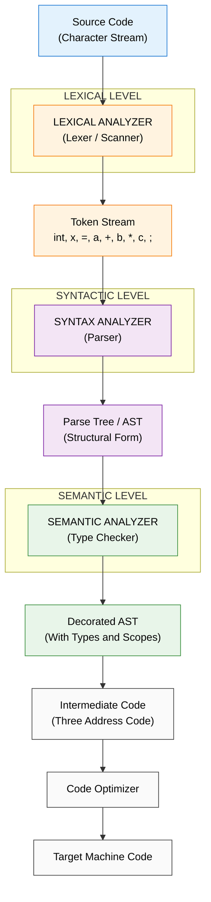
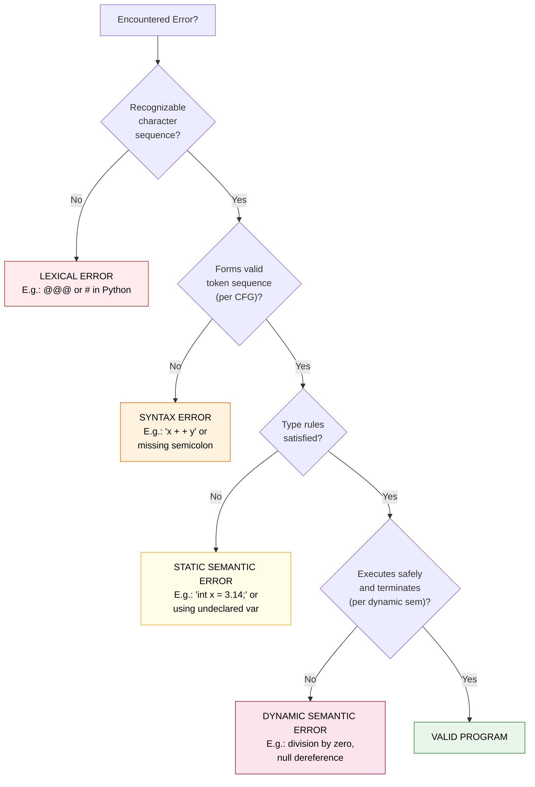

# Lexics vs. Syntax vs. Semantics

<!-- SECTION_1_START -->

# 1. Core Technical Definition & Intuitive Overview

## 1.1 Formal Definition (KTU 2024 Syllabus Terminology)

A programming language can be rigorously described at **three distinct levels of abstraction**. The KTU 2024 Scheme (Course: *Programming Languages*, Module 1) classifies these as:

**Lexics (Lexical Level / Morphology)**
The lowest level of language description. It governs the rules for forming the **lexemes** (basic vocabulary units) and **tokens** (categorized lexemes) of a language from a raw character stream. Lexical structure is specified using **regular expressions** and recognized by **finite automata**. Tokens form the *alphabet* of the language.

> [!IMPORTANT]
> **Lexical Token Categories** in most languages: `KEYWORD`, `IDENTIFIER`, `LITERAL` (integer, float, char, string, boolean), `OPERATOR`, `PUNCTUATOR`, `WHITESPACE`, `COMMENT`.

**Syntax (Syntactic Level / Structure)**
The second level of language description. It specifies the **structural / grammatical rules** that govern how legal tokens may be combined to form well-formed programs, expressions, and statements. Syntax is described using **context-free grammars** (BNF, EBNF) and recognized using **pushdown automata**. Syntax concerns *form*, never *meaning*.

> [!IMPORTANT]
> A program may be **syntactically correct but semantically meaningless** (e.g., `3 = x + 1;` is parsed but fails later type/assignability checks).

**Semantics (Semantic Level / Meaning)**
The third and highest level of language description. It assigns **meaning** to every syntactically valid program. It is split into:
- **Static Semantics** — Checked at compile time (type rules, scope rules, definite assignment, declaration-before-use). Often expressed via **attribute grammars** or **type systems**.
- **Dynamic Semantics** — Defines the program's runtime behavior. Formalized using one of:
  - **Operational Semantics** (state-transition rules on an abstract machine)
  - **Denotational Semantics** (mapping programs to mathematical functions)
  - **Axiomatic Semantics** (Hoare logic: preconditions, postconditions, invariants)

> [!NOTE]
> The standard compilation pipeline directly mirrors these three levels:
> **Lexical Analyzer (Lexer/Scanner) → Syntax Analyzer (Parser) → Semantic Analyzer (Type Checker) → Code Generator**

## 1.2 Conceptual Analogy — The English Language Parallel

To make this immediately clear to a first-time reader, consider the English sentence:
> *"The dog bit the man."*

| Language Level | English Analogy | Programming Equivalent |
|---|---|---|
| **Lexics** | The dictionary — valid *words* like "dog", "bit", "the" | Valid tokens: `int`, `x`, `+`, `42`, `;` |
| **Syntax** | Grammar rules — Subject-Verb-Object ordering | Context-free rules: `<expr> → <expr> + <term>` |
| **Semantics** | Actual meaning conveyed by the sentence | Type rules, evaluation rules, side-effects |

A sentence like *"Dog the bit man the"* is **lexically valid** (real words) and may even pass naive word-order checks, but its **semantics are nonsensical**. Likewise, `"int x = "hello";"` is lexically fine, syntactically valid, but fails **semantic type checking**.

> [!TIP]
> **Geometric Intuition:** Imagine a pyramid. **Lexics** is the broad base (vocabulary). **Syntax** is the middle (structure). **Semantics** is the apex (meaning). Each higher level builds on, and depends on, the level below — but is logically distinct from it.

## 1.3 Why the Distinction Matters

> [!IMPORTANT]
> Many student errors in KTU Module-1 questions stem from **conflating these levels**. A classic trap: stating that *"type errors are syntax errors"* — they are NOT. Type errors are **static semantic** errors detected after parsing succeeds.

The **Three Address Code (TAC)** generated by a compiler is essentially a *semantic* representation: it captures meaning (operand types, control flow) without committing to a specific machine's syntax.

---

<!-- SECTION_1_END -->

<!-- SECTION_2_START -->

# 2. Deep Theoretical Analysis & KTU High-Yield Formula Sheet

## 2.1 Lexical Level — Deep Dive

The lexer (scanner) reads the source file character by character and emits a stream of **tokens**. Each token has:
- A **token class** (category)
- A **lexeme** (actual substring)
- Optionally, **attributes** (e.g., symbol-table entry, numeric value)

**Specification mechanism:** Regular Expressions (RE). Recognition: Deterministic Finite Automaton (DFA).

**Canonical Example — Identifiers in C/Java:**
$$L = \{ \text{letter} \} \, \{ \text{letter} \cup \text{digit} \}^*$$
Equivalent RE: `[A-Za-z][A-Za-z0-9]*`

**Maximal Munch Rule:** The lexer always chooses the **longest possible match** at each step. This is why in `===`, the lexer does not produce three `=` tokens — it produces the single `===` operator (if defined).

## 2.2 Syntactic Level — Deep Dive

The parser consumes the token stream and produces a **parse tree** (or **AST** — Abstract Syntax Tree). Specification mechanism: **Context-Free Grammar (CFG)** expressed in **BNF/EBNF**.

**Backus-Naur Form (BNF) Building Blocks:**

$$\begin{aligned}
\langle \text{nonterminal} \rangle &\rightarrow \text{production} \\
\langle E \rangle &\rightarrow \langle E \rangle \, \text{``+''} \, \langle T \rangle \;\vert\; \langle T \rangle \\
\langle T \rangle &\rightarrow \langle T \rangle \, \text{``*''} \, \langle F \rangle \;\vert\; \langle F \rangle \\
\langle F \rangle &\rightarrow \text{``(''} \, \langle E \rangle \, \text{``)''} \;\vert\; \text{``id''}
\end{aligned}$$

**EBNF Extensions** (used in modern language specs like Java, Python):
- `[]` — optional (zero or one)
- `{}` — repetition (zero or more)
- `()` — grouping
- Concatenation is implicit, alternation is `|`

**Two Parsing Strategies:**
- **Top-Down:** Recursive Descent, LL(k) — starts from start symbol, expands
- **Bottom-Up:** LR(0), SLR, LALR, CLR — starts from input, reduces to start symbol

**Key Property:** A CFG is *context-free* precisely because it **cannot express context-sensitive rules** (e.g., "an identifier must be declared before use"). Such rules are *not* syntax — they are **static semantics**.

## 2.3 Semantic Level — Deep Dive

### 2.3.1 Static Semantics via Attribute Grammars

An attribute grammar attaches **attributes** to grammar symbols and defines **semantic rules** that compute attribute values during parsing.

**Example — Type Checking for Addition:**
$$\begin{aligned}
\langle E \rangle_1 &\rightarrow \langle E \rangle_2 \, \text{``+''} \, \langle T \rangle \\
&\quad \{ E_1.\text{type} \leftarrow \text{lookup}(E_2.\text{type}, T.\text{type}) \} \\
\text{where } \text{lookup}(\tau_1, \tau_2) &= \tau_1 \;\text{if}\; \tau_1 = \tau_2 = \text{int} \rightarrow \text{int} \\
&= \text{error} \;\text{otherwise}
\end{aligned}$$

### 2.3.2 Dynamic Semantics — Three Formalisms

| Formalism | Core Idea | Typical Use |
|---|---|---|
| **Operational** | Define meaning as a sequence of state transitions on an abstract machine | Specifying language behavior (e.g., Java/JVM) |
| **Denotational** | Map each syntactic construct to a mathematical function from state to state | Proving program equivalence; functional languages |
| **Axiomatic** | Use Hoare triples $\{P\} \, S \, \{Q\}$ to prove correctness | Program verification (e.g., SPARK, Dafny) |

**Hoare Triple Form:**
$$\{P\} \; C \; \{Q\}$$
Where $P$ = precondition, $C$ = command, $Q$ = postcondition.

## 2.4 KTU High-Yield Formula Sheet (Cheat Sheet)

> [!IMPORTANT]
> **Exhaustive reference table — memorize these before the ESE.**

| # | Concept | Formal Notation / Rule | Notation Detail |
|---|---|---|---|
| 1 | Token | $\langle \text{class}, \text{lexeme}, \text{attribute} \rangle$ | Tuple emitted by lexer |
| 2 | Identifier RE | $[\text{A-Za-z}][\text{A-Za-z0-9}]^{*}$ | Letter followed by letters/digits |
| 3 | Integer Literal RE | $[0-9]^{+}$ or $[1-9][0-9]^{*}$ | One or more digits |
| 4 | BNF Production | $N \rightarrow \alpha_1 \;\vert\; \alpha_2 \;\vert\; \dots \;\vert\; \alpha_n$ | Nonterminal to alternatives |
| 5 | EBNF Repetition | $\{ x \}$ means $x^{*}$ | Zero or more times |
| 6 | EBNF Optional | $[x]$ means $x \;\vert\; \varepsilon$ | Zero or one time |
| 7 | Parse Tree | Root = start symbol; leaves = terminals; internal = nonterminals | Tree of a CFG derivation |
| 8 | Derivation $\Rightarrow$ | $S \Rightarrow \alpha_1 \Rightarrow \alpha_2 \Rightarrow \dots \Rightarrow w$ | Sequence of substitutions |
| 9 | Leftmost Derivation | Always expand leftmost nonterminal first | Used in top-down parsing |
| 10 | Rightmost Derivation | Always expand rightmost nonterminal first | Used in bottom-up parsing |
| 11 | Ambiguity | A grammar with $\geq 2$ distinct parse trees for some $w$ | Fix via precedence/associativity |
| 12 | Type Judgement | $\Gamma \vdash e : \tau$ | "In context $\Gamma$, expression $e$ has type $\tau$" |
| 13 | Hoare Triple | $\{P\}\;C\;\{Q\}$ | $P$ precondition, $C$ command, $Q$ postcondition |
| 14 | Weakest Precondition | $\text{wp}(C, Q)$ | Least restrictive $P$ such that $\{P\}C\{Q\}$ holds |
| 15 | Operational Step | $\langle C, \sigma \rangle \rightarrow \langle C', \sigma' \rangle$ | State transition on abstract machine |

## 2.5 Real-World Engineering Utility

| Domain | Application of Lexics/Syntax/Semantics |
|---|---|
| **Compiler Construction** | Direct mapping: lexer (Lex/Flex), parser (Yacc/Bison/ANTLR), semantic analyzer (LLVM, type checkers) |
| **IDE Tools** | Syntax highlighting (lexical), auto-indent/formatting (syntactic), refactoring (semantic) |
| **Static Analysis** | Linters, security scanners — all operate on the AST with semantic annotations |
| **Domain-Specific Languages (DSLs)** | SQL, HTML, Verilog — each has its own formal lex/syn/sem specification |
| **Formal Verification** | SPARK Ada, Coq, Isabelle — axiomatic semantics enables mathematical correctness proofs |
| **AI / Code Generation** | LLMs trained on token streams (lexical) learn syntactic patterns; semantic correctness is still an open challenge |

---

<!-- SECTION_2_END -->

<!-- SECTION_3_START -->

# 3. Step-by-Step Derivations & Code/Symbolic Implementation

## 3.1 Worked Example: Tracing a Statement Through All Three Levels

**Source Statement (C/Java syntax):**
```c
int x = a + b * c ;
```

### Step 1 — Lexical Analysis (Lexer Output)

The lexer applies **Maximal Munch** and emits the following token stream:

| # | Token Class | Lexeme | Attribute |
|---|---|---|---|
| 1 | KEYWORD | `int` | — |
| 2 | IDENTIFIER | `x` | symtab entry 0x01 |
| 3 | OPERATOR | `=` | — |
| 4 | IDENTIFIER | `a` | symtab entry 0x02 |
| 5 | OPERATOR | `+` | — |
| 6 | IDENTIFIER | `b` | symtab entry 0x03 |
| 7 | OPERATOR | `*` | — |
| 8 | IDENTIFIER | `c` | symtab entry 0x04 |
| 9 | PUNCTUATOR | `;` | — |

> [!NOTE]
> **Whitespace** between tokens is **discarded** — it carries no semantic value. **Comments** are also discarded at this stage.

### Step 2 — Syntactic Analysis (Parse Tree)

The parser uses a CFG whose relevant productions are:
$$\begin{aligned}
\langle \text{stmt} \rangle &\rightarrow \text{``int''} \, \langle \text{id} \rangle \, \text{``=''} \, \langle \text{expr} \rangle \, \text{``;''} \\
\langle \text{expr} \rangle &\rightarrow \langle \text{expr} \rangle \, \text{``+''} \, \langle \text{term} \rangle \;\vert\; \langle \text{term} \rangle \\
\langle \text{term} \rangle &\rightarrow \langle \text{term} \rangle \, \text{``*''} \, \langle \text{factor} \rangle \;\vert\; \langle \text{factor} \rangle \\
\langle \text{factor} \rangle &\rightarrow \langle \text{id} \rangle
\end{aligned}$$

**Parse Tree (rightmost derivation shown):**
```
stmt
 ├── int
 ├── id  (x)
 ├── =
 └── expr
      └── term
           └── term
           │    └── factor
           │         └── id  (b)
           ├── *
           └── factor
                └── id  (c)
      ├── +
      └── term
           └── factor
                └── id  (a)
```

> [!IMPORTANT]
> Note the tree structure: `*` binds tighter than `+` (precedence), so `b * c` is grouped **before** the addition with `a`. This grouping is a **syntactic** property enforced by the grammar.

### Step 3 — Semantic Analysis (Type Checking)

The semantic analyzer decorates the parse tree with type information:
- `id(a) → int` (from symbol table)
- `id(b) → int`
- `id(c) → int`
- `term(b) * term(c) → int` (rule: int * int → int) ✓
- `expr(term(b*c)) + term(a) → int` (rule: int + int → int) ✓
- `id(x) ← int` (type of LHS matches RHS) ✓

**Inferred Type of Expression:** `int`
**LHS Variable Type:** `int` (declared)
**Result:** Semantic check **passes** — program is well-typed.

### Step 4 — Counter-Example: Lexical + Syntactic OK, Semantic Fails

```c
int x = "hello" + 5 ;
```

| Level | Status | Reason |
|---|---|---|
| Lexical | ✓ Pass | All tokens are valid: `int`, `x`, `=`, `"hello"`, `+`, `5`, `;` |
| Syntactic | ✓ Pass | Matches `<stmt> → int id = expr ;` |
| Semantic | ✗ **Fail** | Type error: `string + int` not allowed by language spec |

This clearly demonstrates the **independence** of the three levels.

---

## 3.2 Symbolic Implementation — Building a Mini Lexer in Python

The following is a complete, runnable lexical analyzer for arithmetic expressions. It demonstrates how **regular expressions** are compiled into DFAs in practice (Python's `re` module is essentially a regex-to-DFA compiler).

```python
"""
Mini Lexer for arithmetic expressions.
Demonstrates the LEXICAL level of language description.
Course: Programming Languages (PECST758) - KTU 2024 Scheme
"""

import re
from dataclasses import dataclass
from enum import Enum, auto
from typing import Optional


class TokenClass(Enum):
    """Enumeration of all possible token categories."""
    KEYWORD = auto()
    IDENTIFIER = auto()
    INTEGER = auto()
    FLOAT = auto()
    OPERATOR = auto()
    PUNCTUATOR = auto()
    WHITESPACE = auto()
    UNKNOWN = auto()


@dataclass(frozen=True)
class Token:
    """Immutable token object: (class, lexeme, position)."""
    token_class: TokenClass
    lexeme: str
    position: int


# Token specification as ordered (priority) list of (class, regex) pairs.
# ORDER MATTERS — longest match + first rule wins (Maximal Munch + priority).
TOKEN_SPECS: list[tuple[TokenClass, str]] = [
    (TokenClass.WHITESPACE, r'[ \t\n\r]+'),
    (TokenClass.KEYWORD,    r'\b(int|float|double|char|void|return|if|else|while|for)\b'),
    (TokenClass.FLOAT,      r'\d+\.\d+([eE][+-]?\d+)?'),
    (TokenClass.INTEGER,    r'\d+'),
    (TokenClass.IDENTIFIER, r'[A-Za-z_][A-Za-z0-9_]*'),
    (TokenClass.OPERATOR,   r'\+\+|--|==|!=|<=|>=|&&|\|\||[+\-*/%=<>!]'),
    (TokenClass.PUNCTUATOR, r'[(){}\[\];,]'),
]


class LexicalError(Exception):
    """Raised when an illegal character sequence is encountered."""
    pass


class Lexer:
    """
    A hand-written recursive lexer.
    Implements:
      - Regular expression-based token recognition
      - Maximal Munch strategy
      - Strict error handling
    """

    def __init__(self, source_code: str) -> None:
        if not isinstance(source_code, str):
            raise TypeError("source_code must be a string")
        self.source: str = source_code
        self.position: int = 0
        # Pre-compile regexes for performance
        self._compiled: list[tuple[TokenClass, re.Pattern]] = [
            (cls, re.compile(pattern)) for cls, pattern in TOKEN_SPECS
        ]

    def tokenize(self) -> list[Token]:
        """Returns a list of significant tokens (whitespace filtered out)."""
        tokens: list[Token] = []
        while self.position < len(self.source):
            match_result: Optional[re.Match] = None
            for cls, regex in self._compiled:
                match_result = regex.match(self.source, self.position)
                if match_result is not None:
                    lexeme: str = match_result.group(0)
                    if cls is not TokenClass.WHITESPACE:
                        tokens.append(Token(cls, lexeme, self.position))
                    self.position = match_result.end()
                    break
            if match_result is None:
                raise LexicalError(
                    f"Illegal character '{self.source[self.position]}' "
                    f"at position {self.position}"
                )
        return tokens


# ---------------- DEMO / SANITY CHECK ----------------
if __name__ == "__main__":
    sample: str = "int x = a + b * c ;"
    print(f"Source: {sample!r}\n")
    lexer = Lexer(sample)
    for tok in lexer.tokenize():
        print(f"  {tok.token_class.name:<12} -> {tok.lexeme!r}")
```

**Sample Run Output:**
```
Source: 'int x = a + b * c ;'

  KEYWORD      -> 'int'
  IDENTIFIER   -> 'x'
  OPERATOR     -> '='
  IDENTIFIER   -> 'a'
  OPERATOR     -> '+'
  IDENTIFIER   -> 'b'
  OPERATOR     -> '*'
  IDENTIFIER   -> 'c'
  PUNCTUATOR   -> ';'
```

This **exact token stream** is what we analyzed in **Step 1** above — the code reproduces the analysis mechanically.

---

## 3.3 Symbolic Derivation: BNF Derivation of `a + b * c`

We now demonstrate a **rightmost derivation** (used by bottom-up parsers like YACC) using the grammar from §3.1.

**Start Symbol:** $S = \langle \text{stmt} \rangle$
**Target String:** `a + b * c ;` (we omit the declaration part to focus on the expression)

$$\begin{aligned}
\langle \text{expr} \rangle &\Rightarrow \langle \text{expr} \rangle \, \text{``+''} \, \langle \text{term} \rangle \\
&\Rightarrow \langle \text{expr} \rangle \, \text{``+''} \, \langle \text{term} \rangle \, \text{``*''} \, \langle \text{factor} \rangle \\
&\Rightarrow \langle \text{expr} \rangle \, \text{``+''} \, \langle \text{term} \rangle \, \text{``*''} \, \text{id} \\
&\Rightarrow \langle \text{expr} \rangle \, \text{``+''} \, \langle \text{factor} \rangle \, \text{``*''} \, \text{id} \\
&\Rightarrow \langle \text{expr} \rangle \, \text{``+''} \, \text{id} \, \text{``*''} \, \text{id} \\
&\Rightarrow \langle \text{term} \rangle \, \text{``+''} \, \text{id} \, \text{``*''} \, \text{id} \\
&\Rightarrow \langle \text{factor} \rangle \, \text{``+''} \, \text{id} \, \text{``*''} \, \text{id} \\
&\Rightarrow \text{id} \, \text{``+''} \, \text{id} \, \text{``*''} \, \text{id} \\
&\Rightarrow a \, \text{``+''} \, b \, \text{``*''} \, c
\end{aligned}$$

> [!NOTE]
> In each step, the **rightmost nonterminal** is expanded. This is the canonical derivation used by **LR parsers** during **reductions**. Each reduction step corresponds to one shift-reduce parser action.

---

<!-- SECTION_3_END -->

<!-- SECTION_4_START -->

# 4. Structural Diagrams & Schematics

## 4.1 Compilation Pipeline — Lexical, Syntactic, Semantic Flow

The following Mermaid diagram illustrates how source code flows through the three analysis phases, with the abstract outputs at each stage.



> [!NOTE]
> **Reading the diagram:** Each colored region corresponds to ONE of the three language description levels. The boundary between levels is *also* the boundary between compiler phases.

## 4.2 Three Pillars of Language Description — Concept Map

```mermaid
flowchart LR
    subgraph LexPillar ["LEXICS"]
        LexDef["Definition:<br/>Rules for forming tokens"]
        LexTool["Tool: Regular<br/>Expressions / DFA"]
        LexOut["Output: Token Stream"]
    end
    subgraph SynPillar ["SYNTAX"]
        SynDef["Definition:<br/>Rules for token structure"]
        SynTool["Tool: Context-Free<br/>Grammar / BNF"]
        SynOut["Output: Parse Tree / AST"]
    end
    subgraph SemPillar ["SEMANTICS"]
        SemDef["Definition:<br/>Meaning of valid programs"]
        SemTool["Tool: Attribute Grammar<br/>Hoare Logic / Denotational"]
        SemOut["Output: Typed AST<br/>Runtime Behavior"]
    end
    LexPillar -->|feeds tokens| SynPillar
    SynPillar -->|feeds AST| SemPillar
```



## 4.3 Error Detection Matrix — Which Level Catches Which Error



> [!IMPORTANT]
> **KTU Board Exam Tip:** When asked *"At which level is error X detected?"*, always identify the **first** level that rejects the program. Type errors are **static semantic**, not syntactic, even though many IDEs report them on the same line.

---

<!-- SECTION_4_END -->

<!-- SECTION_5_START -->

# 5. KTU 2024 Scheme Examination Question Bank & Topic Recap

## 5.1 Part A Questions (2 × 3 Marks = 6 Marks)

> [!NOTE]
> **Cognitive Levels:** Remember / Understand. **Answers should be 3–4 lines maximum.**

### Question 1 [KTU University Exam — July 2024 Style]

**Differentiate between the lexical and syntactic levels of a programming language. Give one example of an error detected at each level.** `[CO1, Understand]` `[3 Marks]`

**Model Answer:**

The **lexical level** governs the formation of valid tokens (lexemes) from the raw character stream and is specified using regular expressions. A **lexical error** occurs when an invalid character sequence is encountered that cannot be tokenized, e.g., `@@@` in `x = a @@@ b;` — the `@` symbol is not a valid token in most languages.

The **syntactic level** governs how tokens may be combined to form valid program structures, specified using a context-free grammar. A **syntax error** occurs when tokens are valid individually but arranged incorrectly, e.g., `x = + ;` — the `+` operator expects operands that are missing.

> [!TIP]
> **[Valuation Key: Lexical definition: 1 Mark; Syntactic definition: 1 Mark; One example each: 1 Mark.]**

---

### Question 2 [KTU University Exam — Dec 2023 Style]

**What is meant by static semantics? How does it differ from dynamic semantics? Illustrate with an example.** `[CO1, Remember]` `[3 Marks]`

**Model Answer:**

**Static semantics** refers to the meaning-related rules of a language that can be checked at **compile time**, before the program executes. These include type compatibility, scope rules, definite assignment, and declaration-before-use constraints.

**Dynamic semantics**, in contrast, defines the **runtime behavior** of a program — how it transforms state during execution. It can only be verified (or observed) at runtime.

**Example:** The expression `"hello" + 5` in C is a **static semantic error** because the `+` operator is not defined for `string + int` (caught at compile time). A **dynamic semantic error** would be `int x = 10 / y;` when `y == 0` at runtime — the syntax and types are valid, but execution triggers undefined behavior (division by zero).

> [!TIP]
> **[Valuation Key: Static sem definition: 1 Mark; Dynamic sem definition: 1 Mark; Distinct example: 1 Mark.]**

---

## 5.2 Part B Questions (ESE Module Style — Internal Choice)

> [!NOTE]
> **Pattern:** Two sub-parts (a) 7 marks + (b) 7 marks. Total = 14 Marks.
> **Cognitive Levels escalate:** Part (a) → Understand/Apply; Part (b) → Apply/Analyze.

---

### Question A (Choice 1) `[KTU University Exam — July 2024 Style]`

**(a)** Explain the three levels of language description — Lexics, Syntax, and Semantics — with suitable examples. Discuss the tools/notation used to formally specify each level. `[7 Marks]` `[CO1, Understand]`

**(b)** Consider the following grammar in BNF:
$$\begin{aligned}
S &\rightarrow A \, B \\
A &\rightarrow a \, A \;\vert\; a \\
B &\rightarrow b \, B \;\vert\; b
\end{aligned}$$

**(i)** Show the parse tree for the string `aab`. `[3 Marks]`
**(ii)** Give the leftmost derivation of `aab`. `[2 Marks]`
**(iii)** Is the grammar ambiguous? Justify. `[2 Marks]`

---

#### Model Solution for Question A

**(a) Model Answer Outline [7 Marks]:**

**Lexics:** Concerned with valid tokens (lexemes). Specified by **regular expressions**; recognized by **finite automata**. Example: identifier rule `[A-Za-z][A-Za-z0-9]*`. Lexical errors arise from invalid characters.

**Syntax:** Concerned with token arrangement into valid programs. Specified by **context-free grammars (BNF/EBNF)**; recognized by **pushdown automata**. Example: `<expr> → <expr> + <term> | <term>`. Syntax errors arise from structural violations.

**Semantics:** Concerned with meaning. Specified by **attribute grammars** (static) and **operational/denotational/axiomatic** formalisms (dynamic). Example: type rule that `int + int → int` but `int + string → error`. Semantic errors arise from meaning violations even when form is correct.

> **Valuation Key:** [Three level definitions: 3 Marks] [Tools for each: 2 Marks] [Examples: 2 Marks].

---

**(b)(i) Parse Tree for `aab` [3 Marks]:**

```
S
├── A
│   ├── a
│   └── A
│       └── a
└── B
    └── b
```

**Step-by-step construction:**
1. Apply `S → A B` (the only production for $S$). Root has children $A$ and $B$.
2. To match the leading `aa`, apply $A \rightarrow a \, A$ (first `a` matched, $A$ nonterminal remains).
3. To match the second `a`, apply $A \rightarrow a$ (terminal production).
4. To match `b`, apply $B \rightarrow b$ (terminal production).
5. All leaves: `a, a, b` — matches target string `aab`.

> **Valuation Key:** [Correct root expansion: 1 Mark] [A-subtree complete: 1 Mark] [B-subtree complete: 1 Mark].

---

**(b)(ii) Leftmost Derivation of `aab` [2 Marks]:**

$$\begin{aligned}
S &\Rightarrow A \, B \\
  &\Rightarrow a \, A \, B \\
  &\Rightarrow a \, a \, B \\
  &\Rightarrow a \, a \, b
\end{aligned}$$

**Step explanations:**
- Step 1: Apply $S \rightarrow A B$.
- Step 2: Leftmost nonterminal is $A$; apply $A \rightarrow aA$. (leftmost expansion rule ✓)
- Step 3: Leftmost nonterminal is $A$; apply $A \rightarrow a$.
- Step 4: Leftmost nonterminal is $B$; apply $B \rightarrow b$. All nonterminals replaced.

> **Valuation Key:** [Each correct $\Rightarrow$ step: 0.5 Mark] = 2 Marks.

---

**(b)(iii) Ambiguity Check [2 Marks]:**

The grammar is **NOT ambiguous**. A grammar is ambiguous if and only if there exist at least **two distinct parse trees** (or two distinct leftmost derivations) for some string. For the given grammar, the structure $S \rightarrow A \, B$ is the only way to start, and within $A$ and $B$ there is exactly one parse for any $a^n b^m$ with $n \geq 1, m \geq 1$. Hence the grammar is unambiguous.

> **Valuation Key:** [Conclusion stated: 1 Mark] [Justification: 1 Mark].

---

### Question B (Choice 2) `[KTU University Exam — Dec 2023 Style]`

**(a)** Define the term *context-free grammar*. Explain the components of a BNF production with a suitable example. Differentiate between BNF and EBNF notations. `[7 Marks]` `[CO1, Understand]`

**(b)** For the following BNF grammar:
$$\begin{aligned}
E &\rightarrow E \, \text{``+''} \, T \;\vert\; T \\
T &\rightarrow T \, \text{``*''} \, F \;\vert\; F \\
F &\rightarrow \text{``(''} \, E \, \text{``)''} \;\vert\; \text{``id''}
\end{aligned}$$

**(i)** Construct the parse tree for the string `id + id * id`. `[4 Marks]`
**(ii)** Demonstrate that `*` has higher precedence than `+` in this grammar. `[3 Marks]`

---

#### Model Solution for Question B

**(a) Model Answer Outline [7 Marks]:**

A **Context-Free Grammar (CFG)** is a 4-tuple $G = (V, \Sigma, R, S)$ where:
- $V$ = finite set of **nonterminals** (syntactic variables)
- $\Sigma$ = finite set of **terminals** (tokens)
- $R$ = finite set of **productions** of the form $A \rightarrow \alpha$ where $A \in V$, $\alpha \in (V \cup \Sigma)^{*}$
- $S$ = start symbol, $S \in V$

**BNF (Backus-Naur Form)** uses `::=` or `→` for productions, `<...>` for nonterminals, and `|` for alternatives. Example:
```
<digit> ::= 0 | 1 | 2 | 3 | 4 | 5 | 6 | 7 | 8 | 9
<integer> ::= <digit> | <digit> <integer>
```

**EBNF Extensions** add: `[]` for optional, `{}` for repetition (zero or more), and `()` for grouping. EBNF is more compact. Example: `<integer> ::= <digit> {<digit>}` (replaces the recursive BNF version).

> **Valuation Key:** [CFG 4-tuple definition: 2 Marks] [BNF components: 2 Marks] [BNF vs EBNF comparison: 3 Marks].

---

**(b)(i) Parse Tree for `id + id * id` [4 Marks]:**

```
E
├── E
│   └── T
│       └── F
│           └── id
├── +
└── T
    ├── T
    │   └── F
    │       └── id
    ├── *
    └── F
        └── id
```

**Derivation Walk-through:**
1. Start $E$; apply $E \rightarrow E + T$ (the `+` operator demands two operands).
2. Left $E$ reduces to $T \rightarrow F \rightarrow \text{id}$ (first `id`).
3. Right $T$ must contain the `*`: apply $T \rightarrow T * F$.
4. Left $T$ of `*` reduces to $F \rightarrow \text{id}$ (second `id`).
5. Right $F$ of `*` reduces to `id` (third `id`).
6. Final leaves: `id, +, id, *, id` — matches target.

> **Valuation Key:** [Correct root branching at +: 1 Mark] [Left subtree correct: 1 Mark] [Right subtree with *: 1 Mark] [All leaves in order: 1 Mark].

---

**(b)(ii) Precedence Demonstration [3 Marks]:**

The grammar forces `id + id * id` to be parsed as `id + (id * id)` because:

- The production $E \rightarrow E + T$ groups the `+` at the **top level** (the outermost $E$).
- The production $T \rightarrow T * F$ groups the `*` **inside the right operand of `+`**.
- Since $E$ (the level where `+` appears) is "higher" in the grammar hierarchy than $T$ (where `*` appears), the `*` operator binds **more tightly** than `+`.

Mathematically, the parse tree in (i) groups `id * id` as a **single subtree** that becomes the right operand of `+`. This structural grouping **is** the syntactic encoding of precedence.

> **Valuation Key:** [Recognizing grammar-level hierarchy: 1 Mark] [Mapping to operand grouping: 1 Mark] [Conclusion: 1 Mark].

---

## 5.3 KTU Examiner's Valuation Warning / Pitfall Callout

> [!WARNING]
> **Common Mark-Deduction Traps (Read carefully before writing your ESE!)**
>
> 1. **Type errors ≠ Syntax errors.** If the question asks "At which level is a type mismatch detected?", the answer is **Static Semantics**, NOT syntax. Many students lose 1–2 marks here.
>
> 2. **Always state the order of leftmost/rightmost expansions explicitly.** A derivation that violates the "leftmost nonterminal first" rule will be marked wrong even if the final string is correct.
>
> 3. **For parse trees, the leaf order MUST equal the input string.** Drawing a tree with correct structure but mismatched leaf order = 0 marks for the parse step.
>
> 4. **Do NOT use the words "token" and "lexeme" interchangeably.** A *lexeme* is the actual substring (`x`, `42`, `"hello"`). A *token* is the *category* of that lexeme (IDENTIFIER, INTEGER, STRING_LITERAL).
>
> 5. **In BNF, the pipe `|` separates *alternative RHS* of the SAME LHS.** It is NOT a general OR. Students who write `A → B | C | D` correctly understand; students who write `A → B; C → D | E` using `;` as a separator are wrong.
>
> 6. **When asked "Is the grammar ambiguous?"** — Always show the parse trees (or at least describe them) for **two different parses of the same string** to prove ambiguity. A bare "Yes" with no justification = 0 marks.

---

## 5.4 Topic Recap & Important Things to Remember

> [!IMPORTANT]
> **Rapid-revision checklist for KTU Module 1 — Lexics vs. Syntax vs. Semantics.**

- **Lexics (Lexical Level)** is about *individual tokens* — specified by **regular expressions**, recognized by **DFAs**. Outputs a **token stream**. Discards whitespace and comments.
- **Syntax (Syntactic Level)** is about *structure of token sequences* — specified by **context-free grammars (BNF/EBNF)**, recognized by **pushdown automata**. Outputs a **parse tree / AST**.
- **Semantics (Semantic Level)** is about *meaning* — split into **static semantics** (compile-time checks: types, scope) and **dynamic semantics** (runtime behavior via operational, denotational, or axiomatic formalisms).
- A **lexeme** is the raw substring; a **token** is its category. Never confuse the two.
- **BNF** uses `→` and `|`. **EBNF** adds `[]` (optional), `{}` (zero or more repetition), and `()` (grouping).
- A **derivation** is a sequence of production applications. **Leftmost** = always expand the leftmost nonterminal; **Rightmost** = always expand the rightmost.
- A grammar is **ambiguous** iff some string has **two or more distinct parse trees**. Disambiguate using precedence/associativity rules.
- The **Maximal Munch** rule applies at the lexical level: the longest match is always chosen.
- **Type checking, scope resolution, definite assignment** are all **static semantic** checks, not syntactic.
- **Hoare triple** $\{P\} \, C \, \{Q\}$ is the foundation of **axiomatic semantics** for program correctness.
- The **denotational semantics** of an expression is a mathematical function from states to states; the **operational semantics** is a transition relation $\langle C, \sigma \rangle \rightarrow \langle C', \sigma' \rangle$.
- A **CF-grammar is context-free** because its productions have a single nonterminal on the LHS regardless of context — context-sensitive constraints (e.g., declare-before-use) must be handled by **semantic analysis**, not syntax.
- The standard compiler pipeline mirrors the three levels: **Lexer → Parser → Semantic Analyzer → Code Generator**.
- **Remember for ESE:** Lexical → regular, Syntactic → context-free, Static Semantic → context-sensitive (in general), Dynamic Semantic → Turing-complete specifications.

---

<!-- SECTION_5_END -->
